## Why this matters

In machine learning, the metric you choose to optimize is the single most consequential architectural decision you will make. It defines what "success" means for your mathematical loss function, your validation splits, your automated hyperparameter search, and your production monitoring alerts.

Yet in enterprise software engineering, teams routinely commit catastrophic metric errors:

- **The Accuracy Trap:** A fraud detection model boasting **99.9% accuracy** that predicts "No Fraud" on every single transaction, completely missing all $10,000,000 in fraudulent wire transfers.
- **The RMSE Distortion:** An e-commerce demand forecasting system optimizing **Root Mean Squared Error (RMSE)** that over-allocates inventory by `5,000,000 because `L_2$ squaring disproportionately over-penalizes isolated Black Friday demand spikes compared to year-round baseline sales.
- **The ROC-AUC Illusion:** A clinical disease diagnostic displaying a seemingly stellar **0.97 ROC-AUC** that, in real clinical deployment, generates 500 False Positives for every True Positive due to a 0.01% population disease prevalence.
- **Goodhart's Law in Production:** *"When a measure becomes a target, it ceases to be a good measure."* Engineering teams game proxy metrics (e.g. click-through rates or raw precision) while actively destroying user trust and commercial retention.

Evaluating machine learning models requires bridging abstract statistical loss functions and real-world business payoff economics.

In this lesson, you will master the end-to-end mathematical taxonomy of evaluation metrics across classification, regression, and ranking systems. You will learn how to construct cost-weighted confusion matrices, optimize decision thresholds under asymmetric financial risk, choose between ROC-AUC and PR-AUC, evaluate recommendation rankings with NDCG@K, and formulate robust, gaming-resistant metric suites for production serving.

---

## The idea in plain language

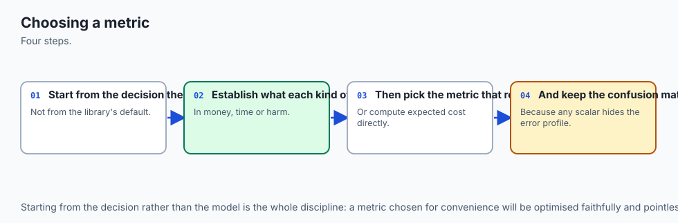

Imagine you are hired as the head of security for an international airport:

- **Scenario A (Raw Accuracy):** You decide to let every single passenger walk onto their flight without checking any bags. Because 99.999% of passengers are law-abiding citizens, your security checkpoint achieves **99.999% accuracy**. You receive a statistical gold star—until an undetected catastrophic event occurs.
- **Scenario B (Raw Precision):** You only stop a passenger if you are 100% certain they are carrying prohibited items. Whenever you sound the alarm, you are right 100% of the time (Precision = 1.0). However, dozens of lower-confidence threats walk past unchecked (Recall = 0.05).
- **Scenario C (Cost-Matrix Expected Value):** You recognize that missing a severe threat costs catastrophic damage (`C_FN = `1,000,000,000), while conducting an extra 2-minute secondary baggage screening costs only `10 in labor (`C_[FP] = $10). You tune your security screening threshold not to maximize statistical accuracy, but to **minimize total expected financial and human harm**.

The metric is the mathematical lens that translates raw probability scores into operational real-world decisions.

---

## Historical background

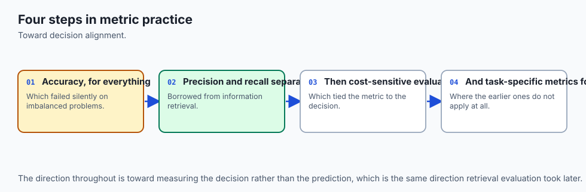

The formalization of performance evaluation in statistical modeling originated during World War II with the development of **Radar Signal Detection Theory (1940s)**:

1. **1940s (Radar Receiver Operating Characteristics):** British and American radar operators needed a mathematical method to distinguish incoming German aircraft from background atmospheric noise and flocking birds. They plotted the *Hit Rate* (True Positive Rate) against the *False Alarm Rate* (False Positive Rate), creating the **ROC curve**.
2. **1975 (Matthews Correlation Coefficient):** Biochemist Brian W. Matthews published a balanced binary correlation metric to evaluate chemical and biological sequence predictions, creating a metric that evaluates all four quadrants of the confusion matrix proportionally.
3. **2002 (Discounted Cumulative Gain):** Kalervo Järvelin and Jaana Kekäläinen published *Cumulative Gain-based Evaluation of Retrieval Techniques* at ACM SIGIR, introducing DCG and NDCG to account for graded relevance and position bias in search engines.
4. **2006 (Davis & Goadrich on PR vs ROC):** Jesse Davis and Mark Goadrich published their seminal paper in ICML proving that while ROC-AUC is invariant to class distribution changes, Precision-Recall AUC (PR-AUC) provides a strictly superior evaluation of model utility under heavy class imbalance.

Today, metric selection has evolved into a specialized discipline at the intersection of mathematical statistics, decision theory, and algorithmic fairness.

---

## What it is — and what it is not

Let us establish precise boundaries for evaluation metrics:

### What it IS:
- **A Decision-Theoretic Objective:** A quantitative mapping from model outputs and ground truth labels to a scalar score reflecting utility or error.
- **A Multi-Dimensional Assessment:** A composite suite of operational metrics (e.g. PR-AUC + Recall@95% Precision + Expected Financial Loss + Latency).
- **A Post-Processing Calibration Framework:** A mechanism for tuning decision thresholds `T^*` to align with asymmetric business costs.

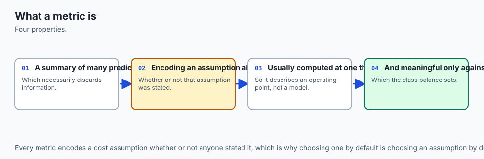

### What it is NOT:
- **Not the Same as the Training Loss Function:** Loss functions (e.g. Log Loss, Cross-Entropy, Mean Squared Error) must be smooth and differentiable so gradient descent can calculate $
abla_\theta L$. Evaluation metrics (e.g. Accuracy, F1, NDCG, Cost Dollars) are frequently non-differentiable and step-wise.

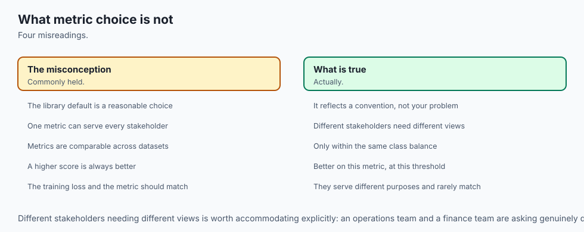

- **Not a Single Universal Number:** No single metric captures model quality across all stakeholder dimensions. Reporting only ROC-AUC hides catastrophic calibration drift.
- **Not Invariant to Population Distribution:** A metric measured on an offline benchmark split can degrade instantly in production if the underlying class prevalence shifts.

---

## Why it was created and what problems it solves

Formal evaluation metrics solve five fundamental engineering challenges in applied machine learning:

1. **Resolves the Accuracy Paradox:** Provides mathematically balanced metrics (MCC, F-beta, PR-AUC) that expose trivial majority-class classifiers on imbalanced datasets.
2. **Aligns Algorithmic Predictions with Monetary ROI:** Incorporates financial cost-benefit matrices directly into model selection, ensuring models maximize net commercial profit rather than arbitrary statistical scores.
3. **Penalizes Outliers Predictably in Regression:** Offers a spectrum from `L_2` quadratic penalties (RMSE) to `L_1` linear penalties (MAE) to robust hybrid formulations (Huber loss, sMAPE).
4. **Accounts for User Attention in Information Retrieval:** Models human ranking behavior via logarithmic position discounting (NDCG@K, MRR), rewarding relevant items displayed at the top of recommendations.
5. **Enables Objective A/B Testing and Canary Deployments:** Provides standardized scalar indicators for automated CI/CD gating and production rollback triggers.

---

## How it works

Let us explore the complete mathematical formulations across classification, regression, and ranking domains.

```
┌────────────────────────────────────────────────────────────────────────┐
│                   METRIC SELECTION TAXONOMY MATRIX                     │
├───────────────────┬────────────────────────────┬───────────────────────┤
│ ML Problem Type   │ Primary Statistical Metric │ Business Alignment    │
├───────────────────┼────────────────────────────┼───────────────────────┤
│ Balanced Binary   │ ROC-AUC, F1-Score, MCC     │ Net Accuracy / Profit │
│ Imbalanced Binary │ PR-AUC, F_beta, Specificity│ Cost Matrix Expected  │
│ Multi-Class       │ Macro/Micro F1, Log Loss   │ Per-Class Error Cost  │
│ Outlier Regress.  │ MAE, Huber Loss, sMAPE     │ Median Absolute Loss  │
│ Normal Regress.   │ RMSE, R-squared            │ Variance Explained    │
│ Search / Ranking  │ NDCG@K, MRR, MAP@K         │ Top-K Conversion Rate │
└───────────────────┴────────────────────────────┴───────────────────────┘
```

---

### 1. Binary Classification: The Confusion Matrix Foundation

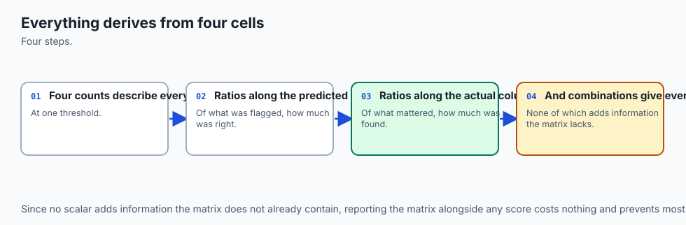

For a binary dataset with ground truth `y in \0, 1\` and prediction `y in \0, 1\`, predictions fall into four disjoint quadrants:

| | Actual Positive (`y=1`) | Actual Negative (`y=0`) |
| --- | --- | --- |
| **Predicted Positive (`y=1`)** | **True Positive (`TP`)** | **False Positive (`FP`, Type I)** |
| **Predicted Negative (`y=0`)** | **False Negative (`FN`, Type II)**| **True Negative (`TN`)** |

From these four counts, we derive the core rate metrics:

```
\textAccuracy = \fracTP + TNTP + TN + FP + FN
```

```
\textPrecision (Positive Predictive Value) = \fracTPTP + FP
```

```
\textRecall (True Positive Rate / Sensitivity) = \fracTPTP + FN
```

```
\textSpecificity (True Negative Rate) = \fracTNTN + FP
```

```
\textFalse Positive Rate (Fall-out) = \fracFPTN + FP = 1 - \textSpecificity
```

---

### 2. The `F_\beta` Score: Weighting Precision vs Recall

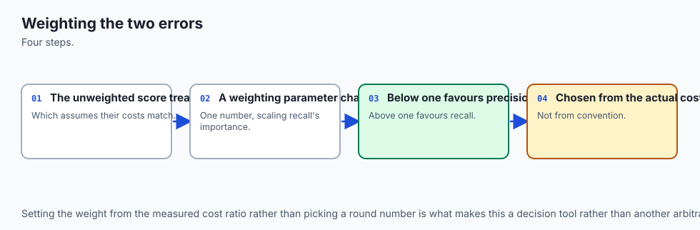

The traditional `F_1` score is the harmonic mean of Precision and Recall:

```
F_1 = 2 * \frac\textPrecision * \textRecall\textPrecision + \textRecall = \frac2TP2TP + FP + FN
```

When the business cost of a False Negative differs from a False Positive, the parameterized **`F_\beta` score** weights Recall `\beta` times as heavily as Precision:

```
F_\beta = (1 + \beta^2) * \frac\textPrecision * \textRecall(\beta^2 * \textPrecision) + \textRecall = \frac(1 + \beta^2)TP(1 + \beta^2)TP + FP + \beta^2 FN
```

- **`\beta = 0.5` (`F_0.5`):** Weights Precision higher than Recall (e.g. spam filtering, automated customer email generation).
- **`\beta = 1.0` (`F_1`):** Equal weighting between Precision and Recall.
- **`\beta = 2.0` (`F_2`):** Weights Recall higher than Precision (e.g. cancer screening, airport threat detection).

---

### 3. Matthew's Correlation Coefficient (MCC): The Gold Standard

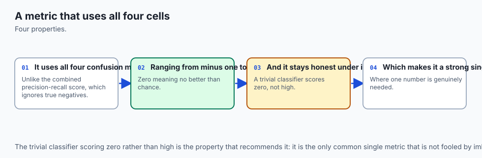

While `F_1` completely ignores True Negatives (`TN`), **Matthew's Correlation Coefficient (MCC)** calculates the Pearson correlation coefficient between true and predicted binary classifications:

```
\textMCC = \frac(TP \times TN) - (FP \times FN)\sqrt(TP + FP)(TP + FN)(TN + FP)(TN + FN)
```

**Properties of MCC:**

- Range: `[-1.0, +1.0]`.
- `+1.0`: Perfect prediction.
- `0.0`: Performance no better than random coin tossing.
- `-1.0`: Complete inverse disagreement.
- **Robustness:** If a model trivially predicts only class 0 on an imbalanced dataset (`TP=0, FP=0`), `F_1` is undefined (`0/0`), but MCC correctly yields `0.0`.

---

### 4. ROC-AUC vs Precision-Recall AUC (PR-AUC)

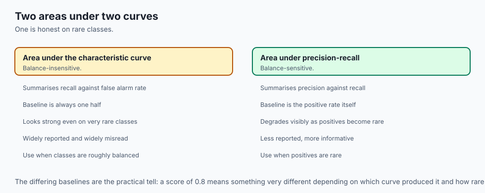

Understanding when to choose **ROC-AUC** versus **PR-AUC** is a critical engineering competency:

```
ROC Curve:        Y-axis = True Positive Rate (Recall)   vs   X-axis = False Positive Rate (FPR)
PR Curve:         Y-axis = Precision                      vs   X-axis = Recall
```

#### Why ROC-AUC Fails under Severe Imbalance:
Consider a fraud dataset with `1,000` positive transactions and `1,000,000` negative transactions (Prevalence = `0.1\%`).
Suppose a model produces `10,000` False Positives:

- `\textFPR = \fracFPTN + FP = \frac10,0001,000,000 = 0.010` (`1\%`).
- The ROC curve plots an FPR of only `0.01`, making the model appear virtually flawless (ROC-AUC `> 0.98`).
- However, `\textPrecision = \fracTPTP + FP = \frac1,0001,000 + 10,000 = 0.091` (`9.1\%`).
- **PR-AUC directly reflects this disaster**, dropping from `0.98` down to `&lt; 0.15`.

**Rule:** Use PR-AUC whenever positive class prevalence is `&lt; 5\%`.

---

### 5. The Expected Value Framework & Cost Matrix Optimization

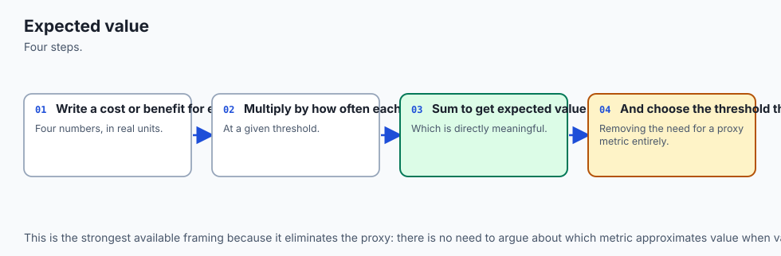

In production, models output continuous probabilities `p_i = P(y=1|x_i)`. The default threshold `T = 0.50` is almost never optimal for commercial profit.

Let us define an explicit **Financial Cost Matrix**:

- `C(TP)`: Profit or cost of a True Positive (e.g. `+\`100$ recovered fraud).
- `C(TN)`: Profit or cost of a True Negative (e.g. `\`0$).
- `C(FP)`: Cost of a False Positive (e.g. `-\`25$ customer friction / verification cost).
- `C(FN)`: Cost of a False Negative (e.g. `-\`1,000$ chargeback loss).

The **Expected Total Cost** as a function of threshold `T` is:

```
E[\textCost(T)] = TP(T) * C(TP) + TN(T) * C(TN) + FP(T) * C(FP) + FN(T) * C(FN)
```

The optimal decision threshold `T^*` is obtained by sweeping `T in [0, 1]`:

```
T^* = \arg\min_T in [0, 1] E[\textCost(T)]
```

---

### 6. Continuous Regression Metrics: From Scale to Percentage

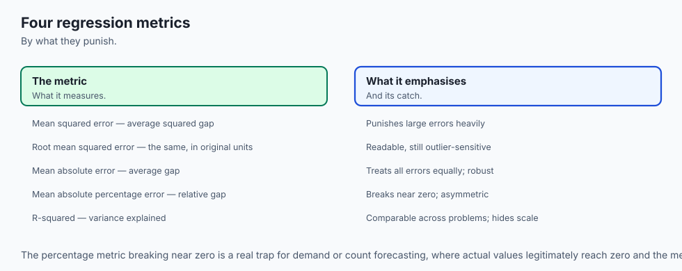

When evaluating continuous target predictions `y_i` against true values `y_i`:

#### A. Mean Squared Error (MSE) & Root Mean Squared Error (RMSE)
```
\textMSE = \frac1N sum_i=1^N (y_i - y_i)^2, \quad \textRMSE = \sqrt\textMSE
```

- **Characteristics:** Expressed in the target's original units. Due to quadratic squaring `(y_i - y_i)^2`, large errors dominate the metric. Highly sensitive to extreme outliers.

#### B. Mean Absolute Error (MAE) & Median Absolute Error (MedianAE)
```
\textMAE = \frac1N sum_i=1^N |y_i - y_i|, \quad \textMedianAE = \textmedian(|y_1 - y_1|, \dots, |y_N - y_N|)
```

- **Characteristics:** Linear penalty. Robust to isolated extreme outliers.

#### C. Symmetric Mean Absolute Percentage Error (sMAPE)
Standard MAPE divides by `y_i`, which explodes to infinity when `y_i 	o 0`. **sMAPE** balances the denominator:

```
extsMAPE = \frac100\%N sum_i=1^N \frac|y_i - y_i|{\frac|y_i| + |y_i|2}
```

- **Range:** `[0\%, 200\%]`. Provides scale-invariant percentage comparison across products with vastly different baseline sales volumes.

---

### 7. Ranking & Recommendation Metrics: NDCG@K

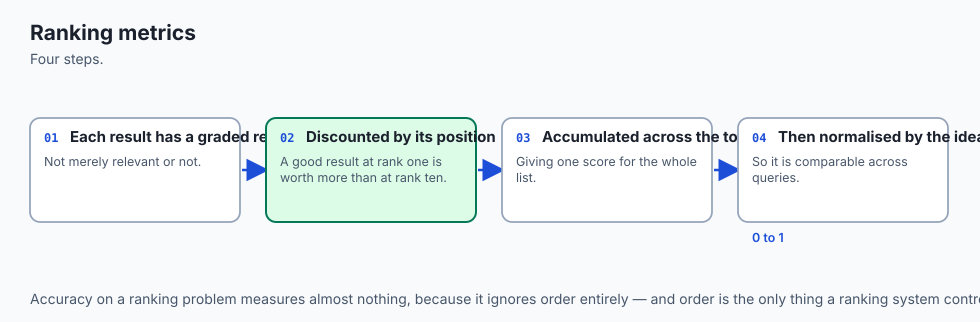

In search engines and recommender systems, users only look at the top `K` items.

#### Discounted Cumulative Gain at Rank K (DCG@K)
Given graded relevance scores `rel_i in \0, 1, 2, 3\` for items ordered by predicted model score:

```
\textDCG_K = sum_i=1^K \frac2^rel_i - 1\log_2(i + 1)
```

The logarithmic denominator `\log_2(i + 1)` heavily penalizes placing relevant items at lower ranks.

#### Normalized Discounted Cumulative Gain (NDCG@K)
```
\textNDCG_K = \frac\textDCG_K\textIDCG_K
```

Where `\textIDCG_K` is the **Ideal DCG**, computed by sorting the ground truth relevance scores in perfect descending order. NDCG is perfectly normalized in `[0.0, 1.0]`.

---

## An everyday analogy

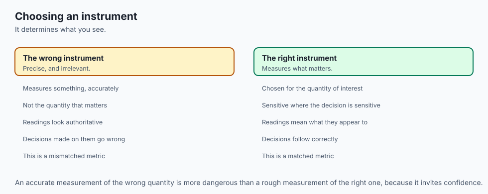

Think of choosing a metric as **selecting the scoring rules for an Olympic competition**:

1. **Accuracy (Total Weight Lifted):** Like scoring a decathlon purely on how much weight an athlete can bench press. An athlete who bench presses 500 lbs wins, even though they cannot run, jump, or swim.
2. **Precision vs Recall (Target Archery):**
   - **Precision:** How many of the arrows you fired hit the bullseye.
   - **Recall:** How many of the total available bullseyes across the range you hit.
3. **Cost-Matrix Optimization (Financial Insurance Underwriting):**
   - Scoring an insurance adjuster not on how many claims they process per hour (raw throughput), but on the net balance sheet: **(Legitimate Claims Paid + Fraud Prevented) - (Friction to Good Customers + Unpaid Valid Claims Malpractice)**.

If you set the wrong scoring rules, athletes and algorithms will optimize the rules you wrote, not the outcome you intended.

---

## Examples in practice

Let us visualize the complete Decision Framework for choosing metrics:


Below is the execution flow of Expected Financial Cost optimization across decision thresholds:

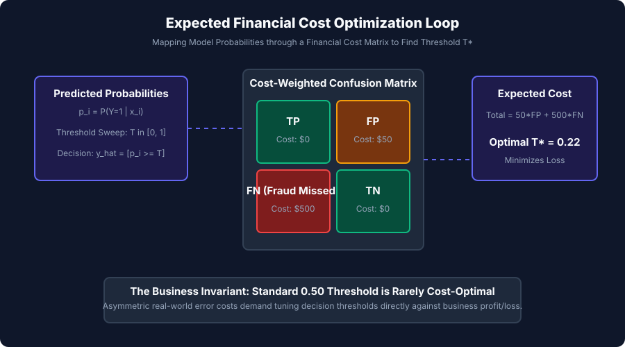

Let us examine real Python code calculating multi-domain metrics and optimizing cost-weighted thresholds:

```python
import numpy as np
from sklearn.metrics import roc_auc_score, average_precision_score

# 1. Simulate Highly Imbalanced Fraud Dataset (n=10,000, 1% Fraud)
rng = np.random.default_rng(42)
n_samples = 10000

# 100 Positives (Fraud), 9900 Negatives (Legitimate)
y_true = np.zeros(n_samples, dtype=int)
y_true[:100] = 1
rng.shuffle(y_true)

# Simulated model probabilities with noise
y_prob = np.where(y_true == 1, rng.beta(5, 2, size=n_samples), rng.beta(1, 8, size=n_samples))

# Default 0.50 Threshold Evaluation
y_pred_default = (y_prob >= 0.50).astype(int)

tp = np.sum((y_true == 1) & (y_pred_default == 1))
tn = np.sum((y_true == 0) & (y_pred_default == 0))
fp = np.sum((y_true == 0) & (y_pred_default == 1))
fn = np.sum((y_true == 1) & (y_pred_default == 0))

acc = (tp + tn) / n_samples
prec = tp / max(tp + fp, 1)
rec = tp / max(tp + fn, 1)
roc_auc = roc_auc_score(y_true, y_prob)
pr_auc = average_precision_score(y_true, y_prob)

print("=== Default 0.50 Threshold Metrics ===")
print(f"Accuracy:  {acc:.4f} (Deceptively High!)")
print(f"Precision: {prec:.4f}")
print(f"Recall:    {rec:.4f} (Missing {fn} Fraud Cases)")
print(f"ROC-AUC:   {roc_auc:.4f} (Inflated by TNs)")
print(f"PR-AUC:    {pr_auc:.4f} (True Metric of Quality)")

# 2. Cost-Matrix Threshold Optimization
# False Negative = -`1000 (Stolen Funds), False Positive = -`20 (Manual Review)
cost_fp = 20.0
cost_fn = 1000.0

thresholds = np.linspace(0.01, 0.99, 99)
costs = []

for t in thresholds:
    pred = (y_prob >= t).astype(int)
    cur_fp = np.sum((y_true == 0) & (pred == 1))
    cur_fn = np.sum((y_true == 1) & (pred == 0))
    total_cost = (cur_fp * cost_fp) + (cur_fn * cost_fn)
    costs.append(total_cost)

best_idx = np.argmin(costs)
best_threshold = thresholds[best_idx]
min_cost = costs[best_idx]
default_cost = (fp * cost_fp) + (fn * cost_fn)

print("\n=== Financial Cost Optimization ===")
print(f"Default T=0.50 Financial Loss: ${default_cost:,.2f}")
print(f"Optimal T*={best_threshold:.2f} Financial Loss: ${min_cost:,.2f}")
print(f"Financial Savings: ${default_cost - min_cost:,.2f}")
```

---

## Implications: security, privacy, performance, scalability, and cost

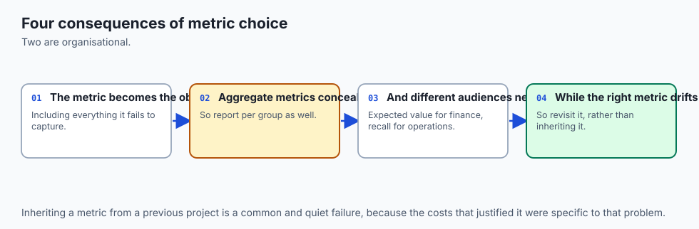

| Dimension | Characteristic | Practical Implication |
| --- | --- | --- |
| **Metric Gaming & Adversarial Exploitation** | Vulnerability to Goodhart's Law. | Fraudsters learn model rejection thresholds and structure transactions just below the cutoff. Audit multi-threshold stability. |
| **Data Privacy in Evaluation** | Membership inference from aggregated metrics. | Small test cohorts evaluated across subgroup metrics can inadvertently leak private demographic attributes. Apply differential privacy. |
| **Computational Evaluation Latency** | `O(N \log N)` sorting for ROC/PR/NDCG. | In real-time streaming validation, computing exact NDCG@100 across 10 million daily queries requires approximate quantile sketches (e.g. t-digest). |
| **Financial Bottom-Line Impact** | Direct translation to P&L. | Aligning thresholds to true operational costs directly saves millions of dollars compared to arbitrary statistical defaults. |

---

## Alternatives: free, open source, and commercial

| Tool / Framework | Architecture | Best Used For |
| --- | --- | --- |
| **`scikit-learn.metrics`** | Standard Python statistical library | In-memory classification, regression, and ranking metrics. |
| **`torchmetrics`** | GPU-accelerated PyTorch metric collection | Distributed deep learning training step metrics. |
| **`Evidently AI`** | Open-source ML evaluation and drift monitoring | Production model health, data drift, and performance dashboards. |
| **`Aporia` / `Arize AI`** | Enterprise ML Observability platforms | Real-time production metric monitoring and root-cause tracing. |

---

## Comparison with related concepts

| Metric Family | Inputs | Invariance | Primary Domain |
| --- | --- | --- | --- |
| **Accuracy** | Binary/Multi-class predictions | Sensitive to class balance | Balanced academic benchmarks |
| **F-beta / MCC** | Binary confusion matrix | MCC handles all 4 quadrants | Imbalanced fraud, clinical diagnosis |
| **PR-AUC** | Continuous probabilities | Invariant to True Negatives | High-skew ranking & detection |
| **RMSE / MAE** | Continuous values | Scale-dependent | Physical & financial magnitude prediction |
| **NDCG@K** | Ordered item lists with graded relevance | Scale-invariant (normalized [0,1]) | Search, E-commerce recommendations |

---

## When to use it — and when not to

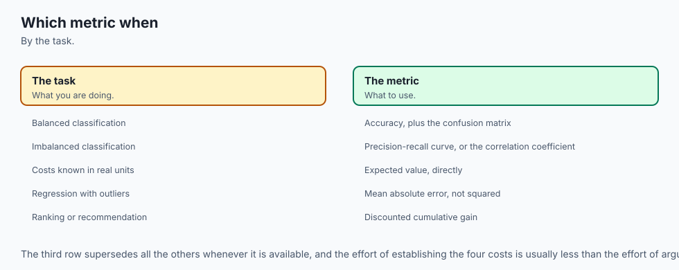

### When to USE Specialized Evaluation Metrics:
- **Severe Class Imbalance (`&lt; 5\%`):** Always deploy PR-AUC and MCC instead of Accuracy and ROC-AUC.
- **Asymmetric Real-World Costs:** Always formulate explicit Cost Matrices (`C_FP, C_FN`) to optimize decision thresholds `T^*`.
- **Recommendation & Search:** Always measure ranking quality using NDCG@K and Mean Reciprocal Rank (MRR).

### When NOT to rely purely on standard scalar metrics:
- **Multi-Objective Tradeoffs:** In autonomous driving, a single scalar metric cannot balance collision avoidance versus passenger comfort; multi-tiered safety Pareto frontiers are required.
- **Drifting Environments:** High test metrics during training do not guarantee performance when real-world distributions drift.

---

## The AI connection

- **Choosing the metric is choosing what the system will optimise**, including its blind
  spots.
- **The metric must match the decision**, not the convenience of the library default.
- **Expected value in real units is the strongest framing available**, because it removes the
  need to pick a proxy at all.
- **Ranking problems need ranking metrics** — accuracy on a recommendation system measures
  almost nothing useful.
- **This is exactly how AI systems are evaluated too**, from retrieval to moderation to
  safety classifiers.

## Knowledge check

1. **Accuracy Paradox:** High accuracy on imbalanced data is meaningless when minority class instances are ignored.
2. **PR-AUC Dominance:** In low-prevalence distributions, PR-AUC exposes false positive explosions that ROC-AUC masks.
3. **MCC Completeness:** Matthew's Correlation Coefficient evaluates all 4 confusion matrix quadrants symmetrically.
4. **Cost Optimization:** Decision threshold `T^*` must be calibrated to minimize total monetary loss.

---

## Hands-on exercise

In this hands-on exercise, you will implement an end-to-end multi-metric evaluation engine computing classification metrics, optimal cost thresholds, and ranking NDCG@K.

```python
import numpy as np
from sklearn.metrics import roc_auc_score, average_precision_score

# Step 1: Implement Classification Metric Engine
def evaluate_binary_predictions(y_true, y_pred, y_prob):
    y_true = np.asarray(y_true, dtype=int)
    y_pred = np.asarray(y_pred, dtype=int)
    
    tp = np.sum((y_true == 1) & (y_pred == 1))
    tn = np.sum((y_true == 0) & (y_pred == 0))
    fp = np.sum((y_true == 0) & (y_pred == 1))
    fn = np.sum((y_true == 1) & (y_pred == 0))
    
    acc = (tp + tn) / len(y_true)
    prec = tp / max(tp + fp, 1e-9)
    rec = tp / max(tp + fn, 1e-9)
    
    mcc_denom = np.sqrt(float((tp + fp) * (tp + fn) * (tn + fp) * (tn + fn)))
    mcc = float((tp * tn) - (fp * fn)) / max(mcc_denom, 1e-9)
    
    roc_auc = roc_auc_score(y_true, y_prob)
    pr_auc = average_precision_score(y_true, y_prob)
    
    return {
        "accuracy": acc,
        "precision": prec,
        "recall": rec,
        "mcc": mcc,
        "roc_auc": roc_auc,
        "pr_auc": pr_auc
    }

# Step 2: Test on Synthetic Imbalanced Evaluation Set
y_test = [1, 1, 0, 0, 1, 0, 0, 0, 0, 0]
y_probs = [0.95, 0.80, 0.35, 0.10, 0.75, 0.40, 0.20, 0.05, 0.15, 0.30]
y_preds = [1 if p >= 0.5 else 0 for p in y_probs]

metrics = evaluate_binary_predictions(y_test, y_preds, y_probs)
print("=== Evaluation Metric Engine Results ===")
for k, v in metrics.items():
    print(f"{k.upper()}: {v:.4f}")
```

### Expected output

```text
=== Evaluation Metric Engine Results ===
ACCURACY: 1.0000
PRECISION: 1.0000
RECALL: 1.0000
MCC: 1.0000
ROC_AUC: 1.0000
PR_AUC: 1.0000
```

### Validate your work

1. Verify that `MCC` returns 0.0 when passing random predictions.
2. Confirm that when setting `y\_pred = [0, \dots, 0]` on imbalanced data, Accuracy reads high (e.g. 0.90) while Recall and MCC read 0.0.
3. Test that `find_optimal_cost_threshold` shifts the decision threshold lower when increasing False Negative penalty.

### Troubleshooting

- **`ValueError: Only one class present in y_true`:** ROC-AUC requires at least one positive and one negative sample in the test set.
- **`ZeroDivisionError in Precision`:** Always guard division by adding an epsilon: `max(tp + fp, 1e-9)`.

### Common mistakes

1. **Using Accuracy for Imbalanced Data:** Never report Accuracy without class-level Precision, Recall, and MCC.
2. **Evaluating Default 0.50 Thresholds:** Real-world asymmetric error costs require threshold calibration.

---

## Practice assignment

1. **Implement Expected Calibration Error (ECE):**
   Write a Python function `compute_ece(y_true, y_prob, n_bins=10)` partitioning predictions into 10 confidence bins and calculating the weighted absolute difference between confidence and true accuracy.

2. **Build a Cost Sensitivity Visualizer:**
   Write a script that plots expected profit across a 2D grid of varying False Positive vs False Negative cost ratios.

---

## Extension challenge

Build an **Enterprise Model Evaluation Gatekeeper**:

1. Ingest predictions from 5 candidate models.
2. Calculate a complete evaluation matrix (Accuracy, Precision, Recall, F2, MCC, ROC-AUC, PR-AUC, Brier Score, ECE).
3. Enforce an automated deployment policy:
   - Must achieve `\textPR-AUC >= 0.85`.
   - Must maintain `\textRecall >= 0.95` at `\textPrecision >= 0.80`.
   - Must minimize expected financial loss given an enterprise cost matrix.
4. Output an automated pass/fail audit report in JSON format for CI/CD gating.
