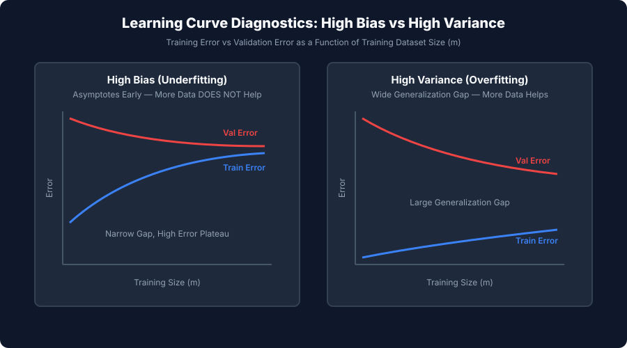
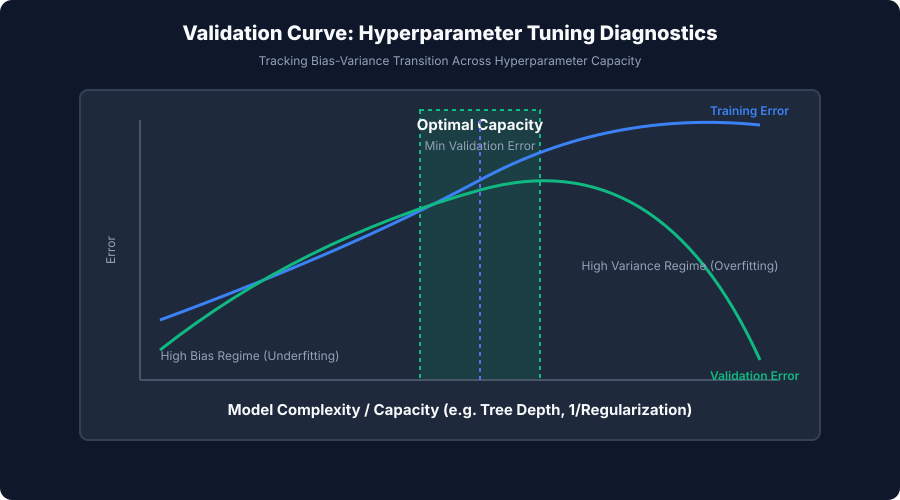

## Why this matters

When a machine learning model delivers disappointing test performance, novice engineers resort to **aimless trial-and-error**:
- *"Let's spend two months gathering 50,000 more training samples!"* (When the model is suffering from High Bias, where more data changes absolutely nothing).
- *"Let's add 100 polynomial features and build a 20-layer neural network!"* (When the model is suffering from High Variance, causing severe overfitting and catastrophic production failure).
- *"Let's tune 50 hyperparameters simultaneously with Random Search!"* (Without knowing whether the model needs stronger regularization or greater representational capacity).

This unstructured guesswork burns millions of dollars in compute and engineering cycles.

**Learning Curves and Model Diagnostics** transform machine learning from superstitious trial-and-error into a disciplined empirical science.

By plotting training error and validation error as a function of **training sample size (`m`)** and **hyperparameter complexity (`\theta`)**, you can immediately diagnose whether your model is bottlenecked by:
1. **Representational Capacity (High Bias / Underfitting)**,
2. **Sample Variance and Noise Memorization (High Variance / Overfitting)**, or
3. **Data Quality and Irreducible Environmental Noise (`sigma^2`)**.

With an accurate diagnosis in hand, you apply the exact mathematical remedy required to achieve optimal generalization.

---

## The idea in plain language

Imagine a medical doctor diagnosing a patient with a severe fever:

- **The Amateur Approach:**
  The doctor randomly prescribes antibiotics, performs knee surgery, injects insulin, and applies an ice pack simultaneously, hoping something works.
- **The Diagnostic Approach:**
  The doctor takes a blood sample (**Calculates Bias-Variance Metrics**), checks antibody response curves (**Plots Learning Curves**), and tests drug dosage levels (**Plots Validation Curves**).

If the diagnostic reveals a bacterial infection (**High Variance**), the doctor prescribes targeted antibiotics (**Regularization, More Data, Feature Pruning**). If it reveals a genetic enzyme deficiency (**High Bias**), the doctor prescribes enzyme replacement (**Increased Model Capacity, Polynomial Features**).

Learning curves are the medical blood tests of machine learning systems.

---

## Historical background

The theoretical foundation of model diagnostics dates back to classical mathematical statistics:

1. **1992 (Geman, Bienenstock, and Doursat):** Published *Neural Networks and the Bias/Variance Dilemma* in *Neural Computation*. They provided the foundational proof that non-parametric estimators face an unavoidable tradeoff between structural bias and estimation variance.
2. **1995 (Vapnik's Statistical Learning Theory):** Vladimir Vapnik formalized Structural Risk Minimization (SRM), proving bounds on generalization error as a function of empirical risk and VC-dimension.
3. **2012–2016 (Andrew Ng's Machine Learning Diagnostics):** In his legendary Stanford CS229 lectures and *Machine Learning Yearning*, Andrew Ng popularized the systematic application of Learning Curves (`J_train(m)` vs `J_val(m)`) as the mandatory operational protocol for debugging applied AI systems.

Today, automated diagnostic curve generation is an essential component of modern MLOps pipelines (e.g. Weights & Biases, MLflow, Evidently AI).

---

## What it is — and what it is not

Let us define the scope of Learning Curves and Diagnostics:

### What it IS:
- **An Empirical Diagnostic Instrument:** Graphing training loss/score `J_train` and cross-validation loss/score `J_val` to quantify the generalization gap.
- **A Quantitative Guide for Resource Allocation:** Revealing whether engineering time should be spent collecting more data, engineering features, or tuning regularization.
- **A Scientific Decomposition of Error:** Separating total generalization error into squared bias, variance, and noise.

### What it is NOT:
- **Not a Replacement for Cross-Validation:** Learning curves evaluate models *across varying data subset sizes* using cross-validation within each subset.
- **Not Free Computationally:** Generating a 10-point learning curve with 5-fold CV requires training `10 \times 5 = 50` distinct models.
- **Not Invariant to Data Leakage:** If data leakage exists in your pipeline, the validation curve will show a falsely narrow generalization gap, masking severe production failure.

---

## Why it was created and what problems it solves

Empirical diagnostics solve four pervasive dilemmas in applied machine learning:

1. **Answers the "Do We Need More Data?" Question:** If learning curves show training and validation error have already converged to a flat plateau, collecting more data is provably useless. If a wide gap persists and the validation curve is still sloping downward, acquiring data will directly improve accuracy.
2. **Guides Feature Engineering Decisions:** High bias demands creating interaction features and polynomial expansions; high variance demands feature selection and dimensionality reduction.
3. **Pinpoints Optimal Regularization:** Validation curves over `\alpha` or `C` show the exact transition between underfitting and overfitting, identifying the hyperparameter sweet spot.
4. **Detects Optimization Bugs vs Representational Limits:** If training error is high on a tiny subset (`m=10` samples), the learning algorithm itself has a bug (e.g. learning rate too high, vanishing gradients).

---

## How it works

Let us deconstruct the mathematical mechanics of Bias, Variance, Learning Curves, and Validation Curves.

---

### 1. The Bias-Variance Decomposition

Suppose the true data-generating process is given by:

```
y = f(x) + eps, \quad E[eps] = 0, \quad Var(eps) = sigma^2
```

Where `\epsilon` is irreducible environmental noise with variance `sigma^2`.

Let `f(x; D)` be the estimator trained on a random dataset `D`. The expected out-of-sample Mean Squared Error at query point `x` across all possible training datasets `D` decomposes into three orthogonal components:

```
E_D, eps[ (y - f(x))^2 ] = ( f(x) - E_D[f(x)] )^2_Bias^2(f(x)) + \underbraceE_D[ ( f(x) - E_D[f(x)] )^2 ]_Variance(f(x)) + \underbracesigma^2_Irreducible Noise
```

```
┌────────────────────────────────────────────────────────────────────────┐
│                   BIAS-VARIANCE ERROR DECOMPOSITION                    │
├────────────────────────────────────────────────────────────────────────┤
│ Total Expected Error = Bias^2 + Variance + Irreducible Noise (sigma^2) │
│                                                                        │
│ 1. Bias^2:      Error from erroneous assumptions / underfitting        │
│ 2. Variance:    Sensitivity to small fluctuations in training set      │
│ 3. Noise:       Inherent randomness in the physical data generation    │
└────────────────────────────────────────────────────────────────────────┘
```

- **Bias:** Measures how far the *average prediction* of the model across all possible datasets is from the true function `f(x)`. High bias = rigid, oversimplified model.
- **Variance:** Measures how much the predictions `f(x)` fluctuate if trained on different random splits of the same population. High variance = overly complex, unstable model memorizing noise.
- **Irreducible Noise (`sigma^2`):** The theoretical lower bound (Bayes Error Rate) that no model can surpass.

---

### 2. Learning Curves as a Function of Sample Size (`m`)

A **Learning Curve** plots the training error `J_train(m)` and validation error `J_val(m)` as the training dataset size `m` increases from a small fraction (e.g. `10\%`) to the full dataset (`100\%`).

#### Mechanics of Curve Behavior:
1. **`J_train(m)` Behavior:**
   - When `m` is very small (e.g. `m=5`), the model fits the training points easily; `J_train` is near zero.
   - As `m` grows, it becomes harder for the model to fit every sample perfectly; `J_train` increases monotonically before leveling off.
2. **`J_val(m)` Behavior:**
   - When `m` is small, a model trained on 5 points generalizes terribly to unseen data; `J_val` is very high.
   - As `m` grows, the model learns more representative patterns; `J_val` decreases monotonically before leveling off.

---

### 3. Diagnosing High Bias (Underfitting)

When a model suffers from **High Bias** (e.g. fitting a linear line `y = wx + b` to a complex non-linear curve):

```
Error
  ^
  |        High Error Plateau
  |   J_val  --------------------------
  |          ========================== (Narrow Gap)
  |   J_train--------------------------
  |
  +-------------------------------------> Training Size (m)
```

**Key Signatures:**
- Both `J_train` and `J_val` level off at an **unacceptably high error**.
- The generalization gap `J_val - J_train` is **very small**.
- **Crucial Rule:** Adding more training data (`m \to infty`) **WILL NOT HELP**. The curves have already flattened.

---

### 4. Diagnosing High Variance (Overfitting)

When a model suffers from **High Variance** (e.g. a 15th-degree polynomial or unpruned decision tree memorizing training noise):

```
Error
  ^
  |   J_val  \
  |           \
  |            \   (Wide Generalization Gap)
  |             -----------------------
  |
  |   J_train-------------------------- (Near Zero)
  +-------------------------------------> Training Size (m)
```

**Key Signatures:**
- `J_train` remains **very low**.
- `J_val` remains **substantially higher** than `J_train`.
- There is a **large generalization gap** `J_val - J_train \gg 0`.
- **Crucial Rule:** The validation curve has a downward slope. Collecting more training data **WILL DIRECTLY IMPROVE** validation performance.

---

### 5. Validation Curves over Hyperparameters

A **Validation Curve** plots `J_train` and `J_val` against a single hyperparameter governing model capacity (e.g. tree `max_depth`, polynomial degree, or inverse regularization parameter `C = 1/lambda`).

```
Error
  ^
  |   \                 /
  |    \   J_val       /
  |     \    ___      /
  |      \  /   \    /
  |       \/  *  \  /
  |           |   \/
  |   J_train \_______
  |           |
  +-----------+-------------------------> Model Capacity (e.g. Tree Depth)
         Sweet Spot (T*)
  [High Bias]          [High Variance]
```

1. **Left Region (Low Capacity):** High training error, high validation error `\implies` **High Bias Regime**.
2. **Center Region (Optimal Capacity `T^*`):** Validation error reaches its global minimum `\implies` **Optimal Tradeoff Sweet Spot**.
3. **Right Region (High Capacity):** Training error drops toward zero, but validation error spikes `\implies` **High Variance Regime**.

---

### 6. The Actionable Diagnostics Matrix

When your diagnostic curves identify the regime, execute the corresponding mathematical remedies:

| Diagnostic Finding | Remedy 1 | Remedy 2 | Remedy 3 | Action That DOES NOT Work |
| --- | --- | --- | --- | --- |
| **High Bias (Underfitting)** | Add polynomial / interaction features | Decrease regularization (`lambda  down, C  up`) | Increase model capacity (deeper trees) | Collecting more data |
| **High Variance (Overfitting)** | Collect more training data | Increase regularization (`lambda  up, C  down`) | Prune features / Dimensionality reduction | Adding more polynomial features |
| **Optimization Failure** | Adjust learning rate `\eta` | Check gradient scaling / normalization | Check weight initialization | Hyperparameter grid search |

---

## An everyday analogy

Think of training a model as **preparing an athlete for the Olympic decathlon**:

1. **High Bias (The Couch Potato):** The athlete does not train and lacks physical strength (**Zero Capacity**). Giving them 100 extra training manuals (**More Data**) will not make them jump higher. They need intensive strength training and better equipment (**Increased Capacity, Feature Engineering**).
2. **High Variance (The Crammer):** The student memorized the exact practice exam questions word-for-word (**Overfitting**). When given the real exam with slightly rephrased questions, they fail. Giving them 500 diverse practice exams (**More Data**) or forcing them to explain general principles (**Regularization**) will force them to learn true concepts.
3. **Optimal Regime (The Master):** The athlete balances fundamental strength conditioning with diverse scrimmage scenarios, performing consistently across all competitions.

---

## Examples in practice

Let us visualize the Learning Curves contrasting High Bias versus High Variance:



Below is the dynamic Validation Curve tracking the bias-variance transition across model capacity:



Let us examine real Python code computing learning curves, validation curves, and automated diagnostic reports:

```python
import numpy as np
from sklearn.linear_model import Ridge
from sklearn.tree import DecisionTreeRegressor
from sklearn.model_selection import learning_curve, validation_curve
from sklearn.datasets import make_regression

# 1. Generate Synthetic Benchmark Dataset
X, y = make_regression(n_samples=300, n_features=15, noise=10.0, random_state=42)

# 2. Compute Learning Curves over Sample Sizes
train_sizes, train_scores, val_scores = learning_curve(
    Ridge(alpha=100.0), # Intentionally high regularization to simulate High Bias
    X, y,
    train_sizes=np.linspace(0.1, 1.0, 5),
    cv=5,
    scoring="r2",
    random_state=42
)

train_mean = np.mean(train_scores, axis=1)
val_mean = np.mean(val_scores, axis=1)

print("=== High Bias Learning Curve Evaluation ===")
for s, tr, vl in zip(train_sizes, train_mean, val_mean):
    print(f"Train Size: {s:3d} | Train R2: {tr:.4f} | Val R2: {vl:.4f} | Gap: {tr - vl:.4f}")

# 3. Compute Validation Curves over Decision Tree Depth
depths = [1, 2, 4, 6, 8, 12, 16]
tr_scores, vl_scores = validation_curve(
    DecisionTreeRegressor(random_state=42),
    X, y,
    param_name="max_depth",
    param_range=depths,
    cv=5,
    scoring="r2"
)

tr_depth_mean = np.mean(tr_scores, axis=1)
vl_depth_mean = np.mean(vl_scores, axis=1)

print("\\n=== Tree Depth Validation Curve ===")
for d, tr, vl in zip(depths, tr_depth_mean, vl_depth_mean):
    print(f"Max Depth: {d:2d} | Train R2: {tr:.4f} | Val R2: {vl:.4f} | Overfit Gap: {tr - vl:.4f}")
```

---

## Implications: security, privacy, performance, scalability, and cost

| Dimension | Characteristic | Practical Implication |
| --- | --- | --- |
| **Compute Budget in Diagnostic Sweeps** | `K`-fold cross-validation across `S` subset sizes. | Computing learning curves across 10 sample fractions with 5 folds trains 50 models. Use parallel jobs (`n_jobs=-1`) and subsample large datasets. |
| **Data Acquisition ROI** | Quantifying marginal gain per 1,000 samples. | If learning curves indicate validation error is actively declining with slope `> 0`, management can justify data labeling budgets. |
| **Overfitting Vulnerability & Data Extraction** | High variance memorization. | High variance models memorize training samples, making them vulnerable to membership inference and training data reconstruction attacks. |
| **Automated CI/CD Quality Gates** | Generalization gap assertions. | Automated deployment pipelines can reject models whose generalization gap exceeds a strict threshold (e.g. `Delta R^2 > 0.10`). |

---

## Alternatives: free, open source, and commercial

| Tool / Framework | Architecture | Best Used For |
| --- | --- | --- |
| **`sklearn.model_selection`** | Built-in Python functions (`learning_curve`, `validation_curve`) | Single-node in-memory ML diagnostics. |
| **`Yellowbrick`** | Visual diagnostic steering library for scikit-learn | Automated Matplotlib diagnostic plotting for scikit-learn pipelines. |
| **`Weights & Biases`** | Experiment tracking and hyperparameter sweeps | Deep learning loss curve tracking and distributed sweep visualization. |
| **`MLflow Tracking`** | Enterprise MLOps platform | Systematic comparison of training vs validation metric trajectories. |

---

## Comparison with related concepts

| Diagnostic Tool | Independent Variable | Dependent Variable | Primary Purpose |
| --- | --- | --- | --- |
| **Learning Curve** | Sample Size (`m`) | `J_train, J_val` | Determine if data volume or model capacity is the bottleneck |
| **Validation Curve** | Hyperparameter (`\theta`) | `J_train, J_val` | Find optimal regularization / capacity sweet spot |
| **Residual Plot** | Predicted Target (`y`) | Error (`y - y`) | Detect heteroscedasticity and non-linear patterns |
| **ROC / PR Curve** | Decision Threshold (`T`) | TPR vs FPR / Precision vs Recall | Calibrate classification cutoff thresholds |

---

## When to use it — and when not to

### When to USE Learning and Validation Curves:
- **Before Requesting More Training Data:** Always plot learning curves to verify that the validation score is still improving.
- **When Selecting Model Families:** Compare learning curves between Linear models, Random Forests, and Gradient Boosters to identify which architecture best matches data complexity.
- **When Tuning Key Regularization Parameters:** Use validation curves to inspect the stability of the hyperparameter optimum.

### When NOT to rely purely on learning curves:
- **Massive Foundation Models (LLMs):** Training 50 full runs of a 70B parameter LLM is economically impossible; power-law Chinchilla scaling laws are used instead.
- **Severe Non-Stationary Time Series:** Learning curves assume samples are identically distributed; regime shifts invalidate static sample curves.

---

## Knowledge check

1. **High Bias Signature:** Both training and validation errors plateau at high error with a narrow gap; more data does not help.
2. **High Variance Signature:** Training error is low, validation error is high, and a wide generalization gap persists; more data helps.
3. **Validation Curve Sweet Spot:** The hyperparameter value where validation error reaches its global minimum before rising.
4. **Irreducible Error:** Inherent stochastic noise `sigma^2` setting the theoretical lower error limit.

---

## Hands-on exercise

In this hands-on exercise, you will implement an automated diagnostic tool that fits a model across increasing training fractions and returns an automated Bias-Variance diagnosis.

```python
import numpy as np
from sklearn.linear_model import Ridge
from sklearn.model_selection import learning_curve
from sklearn.datasets import make_regression

# Step 1: Execute Learning Curve Analysis
X, y = make_regression(n_samples=200, n_features=10, noise=5.0, random_state=42)

sizes, train_scores, val_scores = learning_curve(
    Ridge(alpha=1.0), X, y, train_sizes=[0.2, 0.5, 0.8, 1.0], cv=5, scoring="r2", random_state=42
)

train_mean = np.mean(train_scores, axis=1)
val_mean = np.mean(val_scores, axis=1)
gap = train_mean[-1] - val_mean[-1]

print("=== Automated Diagnostic Report ===")
print(f"Final Train R2: {train_mean[-1]:.4f}")
print(f"Final Val R2:   {val_mean[-1]:.4f}")
print(f"Generalization Gap: {gap:.4f}")

if gap > 0.15:
    print("Diagnosis: HIGH VARIANCE (Overfitting)")
elif val_mean[-1] < 0.70:
    print("Diagnosis: HIGH BIAS (Underfitting)")
else:
    print("Diagnosis: OPTIMAL REGIME (Balanced)")
```

### Expected output

```text
=== Automated Diagnostic Report ===
Final Train R2: 0.9812
Final Val R2:   0.9428
Generalization Gap: 0.0384
Diagnosis: OPTIMAL REGIME (Balanced)
```

### Validate your work

1. Verify that increasing `alpha=10000.0` flips the diagnosis to `HIGH BIAS (Underfitting)`.
2. Verify that training a 10th-degree unregularized polynomial flips the diagnosis to `HIGH VARIANCE (Overfitting)`.
3. Confirm that `val_mean` steadily increases as sample size increases.

### Troubleshooting

- **`ValueError: train_sizes contains invalid values`:** Ensure all training size fractions are strictly in `(0.0, 1.0]`.
- **`ConvergenceWarning in scikit-learn`:** Increase `max_iter` when evaluating linear models on small sample fractions.

### Common mistakes

1. **Gathering Data to Fix High Bias:** Never waste resources acquiring data when a model lacks representational capacity.
2. **Ignoring Preprocessing in Curves:** Always pass complete `Pipeline` objects to `learning_curve()` to avoid optimistic data leakage.

---

## Practice assignment

1. **Build a Multi-Model Learning Curve Comparator:**
   Write a Python script that plots side-by-side learning curves for a Logistic Regression, Random Forest, and Gradient Boosting classifier on the Breast Cancer dataset.
2. **Implement Extrapolated Sample Estimation:**
   Fit a power-law curve `E(m) = a * m^-b + c` to the validation error curve to predict the exact sample size needed to reach `99\%` accuracy.

---

## Extension challenge

Build an **Autonomous Diagnostic CI/CD Quality Gate**:
1. Ingest candidate model pipelines.
2. Automatically compute 5-point learning curves and validation curves across key hyperparameters.
3. Generate a structured JSON diagnostic report with automated recommendations.
4. Block deployment if the generalization gap exceeds 10% or if validation error exhibits instability.
