## Why this matters

For decades, machine learning was burdened with a false dichotomy: **Accuracy versus Interpretability**.

Engineers believed that if you wanted high predictive performance, you had to accept an opaque "black-box" model (such as a 500-tree XGBoost ensemble or a deep neural network). If you needed explainability for regulators, clinicians, or executives, you were forced to restrict yourself to simple linear regressions or shallow decision trees.

This false dichotomy caused catastrophic failures in enterprise deployments:

- **Regulatory Rejections:** Credit scoring models rejected loan applications under the Equal Credit Opportunity Act (ECOA) without being able to provide legally mandated Adverse Action Notices citing specific explanatory reasons.
- **Clever Hans Predictors:** A healthcare pneumonia detection model trained on chest X-rays achieved 98% accuracy because it learned to identify whether the X-ray was taken with a portable machine in the ICU (where patients were critically ill) rather than detecting actual lung pathology.
- **Biased Impurity Metrics:** Data scientists trusted scikit-learn's default `feature_importances_` (Gini MDI), failing to notice that random customer ID strings received the highest importance score because tree splitting algorithms overfit high-cardinality features.

**Explainable AI (XAI)** and **SHAP (SHapley Additive exPlanations)** solved this dilemma.

Rooted in **Lloyd Shapley's 1953 Nobel Prize-winning Cooperative Game Theory**, SHAP provides the mathematically rigorous foundation for interpreting *any* machine learning model. It guarantees that individual feature contributions sum up cleanly to the model's prediction, enabling both **Global Systemic Understanding** and **Local Individualized Audits**.

---

## The idea in plain language

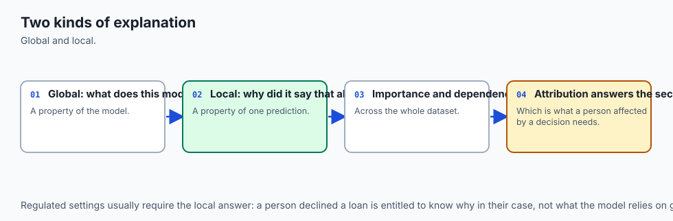

Imagine a 3-person software engineering team (Alice, Bob, and Charlie) that completes a consulting contract and earns a **$100,000 bonus**:

- **The Naive Approach (Gini Impurity):**
  You look at who committed the most lines of code during late-night sprints. Charlie generated 50,000 lines of auto-generated boilerplate code, so Charlie gets `80,000. Alice, who designed the core architecture in 200 lines, gets `5,000. This is unfair and completely inaccurate.

- **The Cooperative Game Theory Approach (Shapley Values):**
  You evaluate every possible coalition:

  - How much does the project earn if Alice works alone?
  - How much if Alice and Bob work together?
  - How much *extra* marginal value does Charlie add when joining Alice and Bob?

By averaging each person's marginal contribution across **all possible combinations of teammates**, you determine the exact, mathematically fair share of the bonus each person created.

In machine learning:

- The **Players** are the **Input Features** (`x_1, x_2, \dots, x_D`).
- The **Game's Payout** is the **Model's Prediction Deviation** (`f(x) - E[f(X)]`).
- The **Shapley Value (`phi_i`)** is the exact fair attribution of feature `i` to that specific prediction.

---

## Historical background

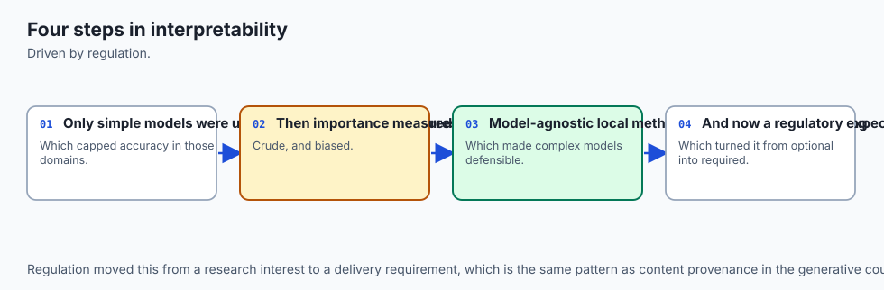

The evolution of model interpretability spans over seven decades:

1. **1953 (Lloyd S. Shapley):** Introduced the Shapley value in *A Value for n-Person Games*, proving the unique mathematical solution for fairly allocating payoffs in cooperative game theory (for which he won the 2012 Nobel Memorial Prize in Economic Sciences).
2. **1984 (Breiman et al. CART):** Introduced Mean Decrease in Impurity (Gini MDI) in Decision Trees and Random Forests (2001).
3. **2001 (Leo Breiman):** Introduced Permutation Feature Importance (Mean Decrease in Accuracy / MDA) in Random Forests.
4. **2016 (Ribeiro, Singh, and Guestrin):** Published *LIME: Local Interpretable Model-agnostic Explanations* at ACM KDD, popularizing local surrogate linear models.
5. **2017 (Scott Lundberg and Su-In Lee):** Published *A Unified Approach to Interpreting Model Predictions* at NeurIPS, unifying LIME, DeepLIFT, and Shapley values into the **SHAP framework**.
6. **2018–2020 (Lundberg et al. TreeSHAP):** Published *Consistent Individualized Feature Attribution for Tree Ensembles* in *Nature Machine Intelligence*, reducing exact Shapley computation for trees from exponential time `O(2^D)` to polynomial time `O(T L D^2)`.

Today, SHAP and Permutation Importance are mandatory components of algorithmic compliance, credit risk underwriting, and medical AI diagnostics.

---

## What it is — and what it is not

Let us establish precise definitions:

### What it IS:
- **Game-Theoretic Feature Attribution:** Allocating the exact difference between a prediction `f(x)` and the baseline expected value `E[f(X)]` across all features.
- **A Unified Framework:** Supporting both Local Instance Attribution (why did Customer #402 get rejected?) and Global Dataset Importance (which features drive the whole model?).
- **An Axiomatic Gold Standard:** The *only* attribution method that simultaneously satisfies Efficiency, Symmetry, Dummy Player, and Additivity.

### What it is NOT:
- **Not Causal Discovery:** SHAP explains what the *model learned from correlations*, not real-world physical causality. If a model learned a spurious correlation, SHAP faithfully reports that the model relied on the spurious feature.
- **Not Immune to Feature Collinearity:** If two features are perfectly correlated (`x_1 = x_2`), game theory splits the attribution equally between them (`phi_1 = phi_2 = 0.5 \times Effect`).
- **Not Free of Background Dataset Assumptions:** SHAP values depend on the choice of background reference dataset `D_bg` representing the baseline expectation `E[f(X)]`.

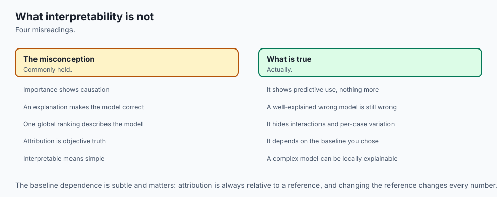

---

## Why it was created and what problems it solves

Formal interpretability techniques solve five critical engineering problems:

1. **Exposes Flaws in Gini MDI:** Eliminates the extreme in-sample bias of tree `feature_importances_` toward continuous features and random high-cardinality IDs.
2. **Generates Legally Compliant Adverse Action Explanations:** Provides mathematically consistent reasons for algorithmic denials in financial lending, insurance, and hiring.
3. **Detects Data Leakage and Clever Hans Artifacts:** Instantly exposes whether a model is relying on metadata IDs, patient hospital codes, or future timestamps.
4. **Uncovers Non-Linear Feature Interactions:** SHAP interaction values isolate purely synergistic effects between pairs of features `(x_i, x_j)`.
5. **Enables Model Debugging in Production:** Allows engineers to inspect edge-case misclassifications and understand exactly why the model erred.

---

## How it works

Let us examine the three major families of feature importance and interpretability.

---

### 1. The Fatal Flaw of Gini Mean Decrease in Impurity (MDI)

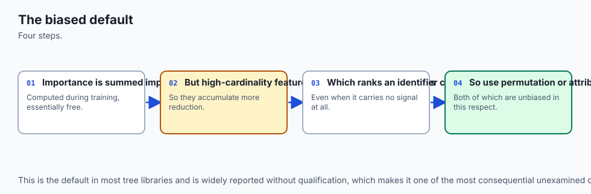

In standard tree ensembles (Random Forests, Gradient Boosting), scikit-learn computes feature importance using **Mean Decrease in Impurity (MDI)**:

```
MDI(x_j) = 1T sum_t=1^T sum_k in nodes splitting on  x_j p(k) * Delta I(k)
```

Where `p(k)` is the proportion of samples reaching node `k`, and `Delta I(k)` is the impurity reduction (Gini or Variance).

#### Why MDI is Catastrophically Biased:
1. **In-Sample Evaluation:** MDI is calculated purely on training splits. An unpruned tree that completely memorizes training noise assigns massive importance to noise features.
2. **High Cardinality Bias:** A column of unique random strings (e.g. `User_UUID`) provides `N-1` distinct split thresholds, allowing the tree to split repeatedly on noise. MDI ranks `User_UUID` as the #1 most important feature!

---

### 2. Permutation Feature Importance (Mean Decrease in Accuracy / MDA)

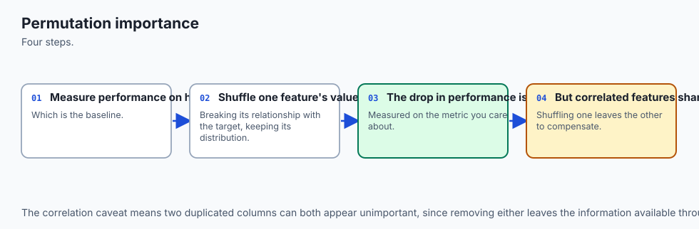

Leo Breiman resolved the in-sample bias of MDI by introducing **Permutation Feature Importance**:

1. Fit the estimator on training split `D_train`.
2. Compute baseline performance score `S_base = Metric(y_val, f(X_val))` on untouched **validation split** `D_val`.
3. For each feature column `j in (1, ..., D)`:
   - Construct permuted matrix `X_val^perm(j)` by randomly shuffling the values of column `j` across rows.
   - Compute degraded score `S_perm(j) = Metric(y_val, f(X_val^perm(j)))`.
   - The importance is the score degradation: `Importance(x_j) = S_base - S_perm(j)`.

```text
┌────────────────────────────────────────────────────────────────────────┐
│                   PERMUTATION FEATURE IMPORTANCE                       │
├────────────────────────────────────────────────────────────────────────┤
│ 1. Evaluated strictly on Holdout Validation Data                       │
│ 2. Shuffles column j to break statistical relationship with target     │
│ 3. Measures resulting performance drop: Delta = Score_base - Score_perm│
│ 4. Uninformative features yield Delta <= 0                             │
└────────────────────────────────────────────────────────────────────────┘
```


**Limitation:** When features `x_1` and `x_2` are strongly collinear (`r > 0.9`), permuting `x_1` creates impossible synthetic feature combinations (e.g. `Weight=300lbs` with `Waist=20in`), causing the model to evaluate on unphysical manifold regions.

---

### 3. Partial Dependence Plots (PDP) and ICE Curves

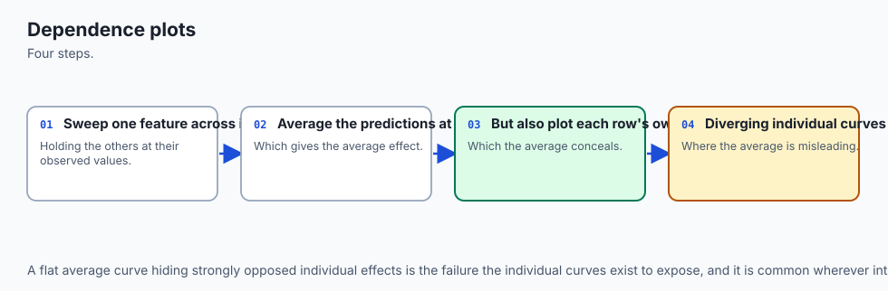

**Partial Dependence Plots (PDP)** visualize the average marginal effect of a feature `x_S` on predictions:

```
f_S(x_S) = 1N sum_i=1^N f(x_S, x_C^(i))
```

Where `x_S` is the target feature subset, and `x_C^(i)` are the actual values of all other complementary features for sample `i`.

**Individual Conditional Expectation (ICE)** plots a separate line for each individual row `i`. While PDP shows the average curve, ICE exposes heterogeneous subgroup behaviors (e.g. feature `x_1` increases risk for men but decreases risk for women).

---

### 4. Game-Theoretic Shapley Values: The Mathematical Formulation

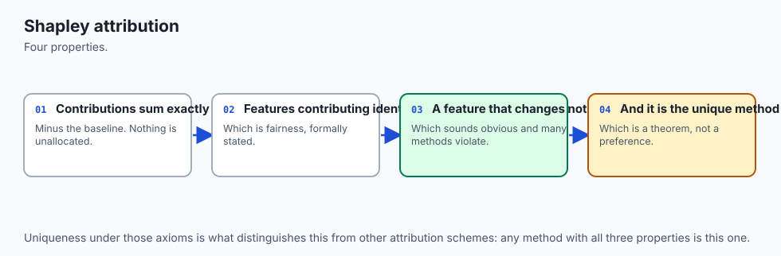

Let `N = \1, 2, \dots, D\` be the set of all input features. Let `S subset N \ \i\` be a subset of features excluding feature `i`.

Let `v(S)` be the characteristic value function representing the model's expected prediction when only features in `S` are known:

```
v(S) = E_X_C[ f(x_S, X_C) ]
```

The **Shapley Value `phi_i`** for feature `i` on instance `x` is the weighted average of its marginal contributions over all `2^D-1` possible coalitions `S`:

```
phi_i(x) = sum_S subset N \ \i\ |S|! (|N| - |S| - 1)!|N|! [ v(S U \i\) - v(S) ]
```

```
┌────────────────────────────────────────────────────────────────────────┐
│                      THE FOUR SHAPLEY AXIOMS                           │
├───────────────────┬────────────────────────────────────────────────────┤
│ Axiom             │ Mathematical Definition                            │
├───────────────────┼────────────────────────────────────────────────────┤
│ 1. Efficiency     │ sum_{i=1}^D phi_i = f(x) - E[f(X)]                 │
│ 2. Symmetry       │ If v(S U {i}) = v(S U {j}) for all S => phi_i=phi_j│
│ 3. Dummy Player   │ If v(S U {i}) = v(S) for all S => phi_i = 0        │
│ 4. Additivity     │ For ensemble f + g: phi_i(f + g) = phi_i(f)+phi_i(g│
└───────────────────┴────────────────────────────────────────────────────┘
```

The Shapley formulation is the **unique** attribution method mathematically proven to satisfy all four fairness axioms simultaneously.

---

### 5. TreeSHAP vs KernelSHAP

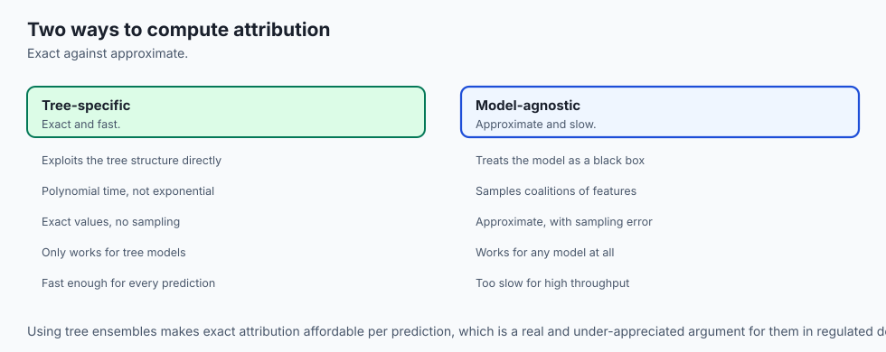

1. **KernelSHAP (Model-Agnostic):** Solves a weighted linear regression over combinatorial binary masks `z' in \0, 1\^D`. Requires exponential sampling `O(2^D)` and evaluates predictions on background data.
2. **TreeSHAP (Tree-Specific):** Traverses all decision tree leaves recursively in polynomial time `O(T L D^2)` (where `T` is trees, `L` is max leaves, `D` is max depth). It calculates exact expectations `E[f(x)|x_S]` by evaluating sub-tree sample counts directly at each internal node split.

---

### 6. Production Visualization Suite

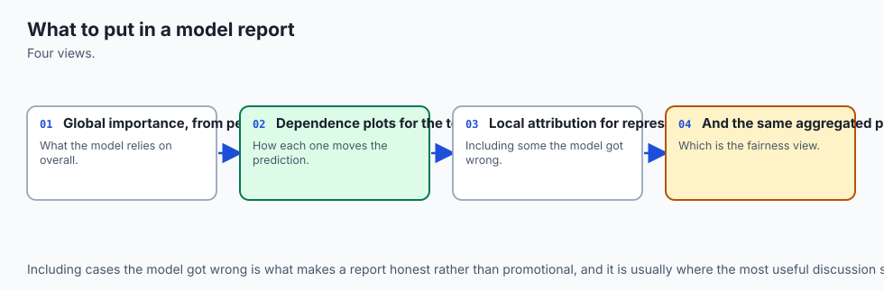

1. **SHAP Waterfall Plot:** Deconstructs a single prediction step-by-step from base value `E[f(X)]` to final output `f(x)`, showing positive (red) and negative (blue) forces.
2. **SHAP Beeswarm Plot:** Summarizes global feature importance and directional effect across thousands of test instances simultaneously.
3. **SHAP Dependence Plot:** Plots `phi_i` against `x_i` to reveal non-linear functional curves and interaction coloring with feature `x_j`.

---

## An everyday analogy

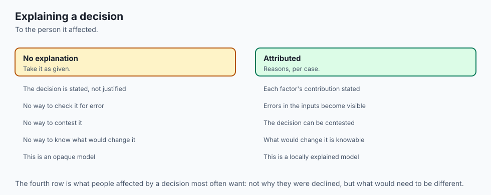

Think of a football team winning a championship match 4–2:

1. **Gini MDI (The Ball Hog):** Awards the victory trophy to the player who kicked the ball the most times, ignoring that 90% of their kicks were wild misses.
2. **Permutation Importance (The Substitution Test):** Benches a player for 10 minutes and measures how many goals the team concedes without them.
3. **Shapley Values (The Grand Tournament Analysis):** Simulates every possible combination of players on the field (1-player teams, 2-player pairs, 5-player squads). It calculates exactly how many net goals each player created across every possible lineup configuration.

The championship prize money is distributed with mathematical fairness.

---

## Examples in practice

Let us visualize the Shapley Coalition Lattice:

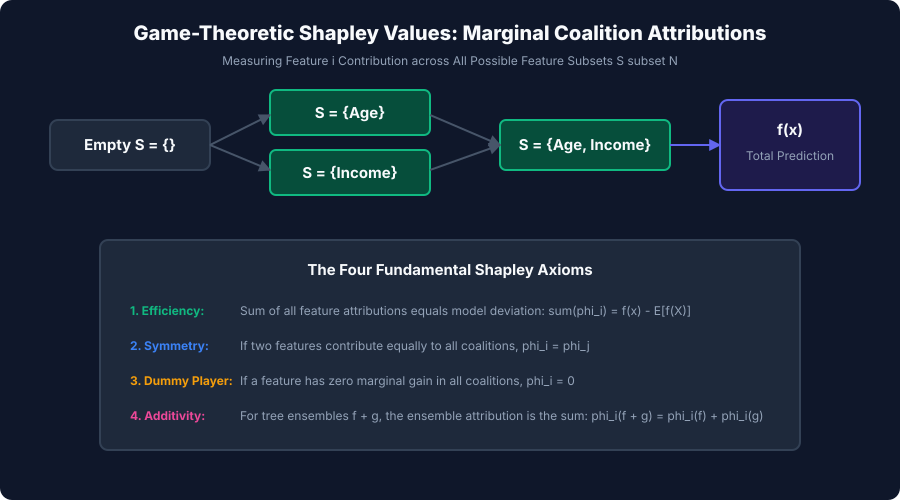

Below is the comparison of Gini MDI, Permutation, and SHAP methods:

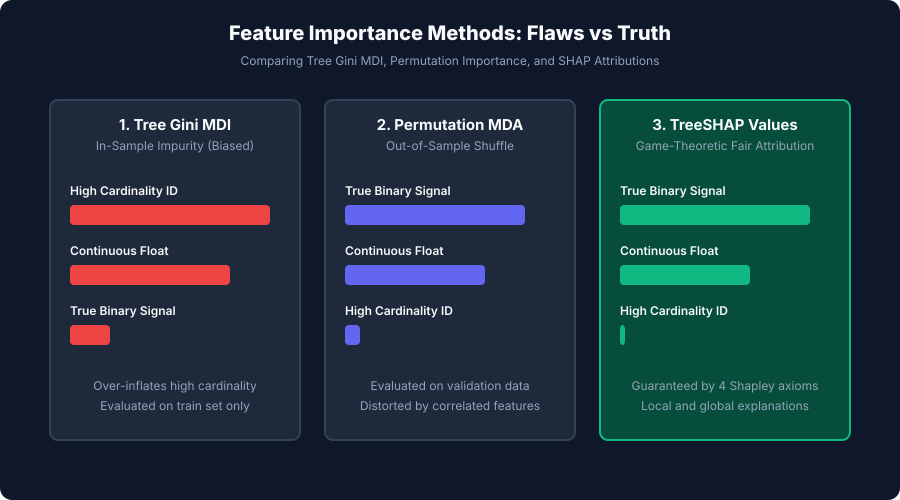

Let us examine real Python code implementing permutation importance and exact Shapley value decomposition:

```python
import numpy as np
import itertools
import math
from sklearn.linear_model import Ridge
from sklearn.metrics import r2_score

# 1. Exact Shapley Value Engine for Arbitrary Models
def compute_exact_shapley(predict_fn, x_instance, X_background):
    x_inst = np.asarray(x_instance, dtype=float).ravel()
    X_bg = np.asarray(X_background, dtype=float)
    d = len(x_inst)
    
    # Expected baseline prediction
    base_val = float(np.mean(predict_fn(X_bg)))
    
    def get_coalition_val(subset_indices):
        if len(subset_indices) == 0:
            return base_val
        X_synth = X_bg.copy()
        for idx in subset_indices:
            X_synth[:, idx] = x_inst[idx]
        return float(np.mean(predict_fn(X_synth)))
    
    phi = np.zeros(d)
    all_indices = set(range(d))
    
    for i in range(d):
        other_indices = list(all_indices - {i})
        for s_len in range(d):
            weight = (math.factorial(s_len) * math.factorial(d - s_len - 1)) / math.factorial(d)
            for S in itertools.combinations(other_indices, s_len):
                v_with = get_coalition_val(set(S) | {i})
                v_without = get_coalition_val(set(S))
                phi[i] += weight * (v_with - v_without)
                
    pred_val = float(predict_fn(x_inst[np.newaxis, :])[0])
    return base_val, phi, pred_val

# 2. Test on Linear Synthetic System
rng = np.random.default_rng(42)
X_train = rng.normal(size=(200, 3))
# y = 50 + 10*x0 - 5*x1 + 0*x2
y_train = 50.0 + 10.0 * X_train[:, 0] - 5.0 * X_train[:, 1] + rng.normal(scale=0.1, size=200)

model = Ridge(alpha=1.0).fit(X_train, y_train)

x_query = np.array([2.0, -1.0, 3.0]) # x0 high positive, x1 negative, x2 noise
base_e, phi_vals, actual_pred = compute_exact_shapley(model.predict, x_query, X_train[:50])

print("=== Game-Theoretic SHAP Value Attribution ===")
print(f"Baseline Population Expected Value E[f(x)]: {base_e:.4f}")
print(f"Instance Predicted Value f(x):              {actual_pred:.4f}")
print(f"Total Prediction Delta:                     {actual_pred - base_e:+.4f}")
print("--- Individual Feature Attributions (Phi_i) ---")
print(f"Phi_0 (Driver 1): {phi_vals[0]:+.4f}")
print(f"Phi_1 (Driver 2): {phi_vals[1]:+.4f}")
print(f"Phi_2 (Noise):    {phi_vals[2]:+.4f}")
print(f"Sum of Phis:      {np.sum(phi_vals):+.4f} (Matches Delta Exactly!)")
```

---

## Implications: security, privacy, performance, scalability, and cost

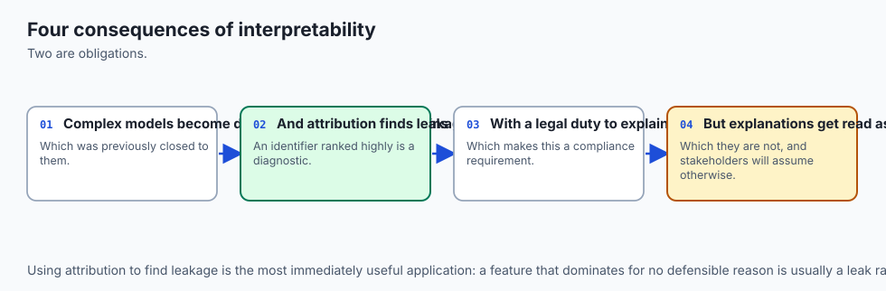

| Dimension | Characteristic | Practical Implication |
| --- | --- | --- |
| **Explanation Scaffolding & Adversarial Manipulation** | Fooling post-hoc explainers. | Adversaries can create wrapper models that hide discriminatory bias from SHAP by detecting perturbation anomalies. Audit models with raw decision trees. |
| **Model Inversion & Data Privacy** | Reconstructing training records from SHAP values. | Serving fine-grained continuous SHAP explanations in public APIs allows attackers to solve for sensitive training features. Apply rounding and coarse quantization. |
| **Inference Latency in Production Serving** | TreeSHAP `O(T L D^2)` compute cost. | Computing TreeSHAP in real-time adds 5–20 ms latency to API endpoints. Precompute background summaries or compute SHAP asynchronously in worker queues. |
| **Regulatory Compliance & Legal Defensibility** | ECOA and GDPR Article 22 compliance. | Providing mathematically sound Shapley Adverse Action notices satisfies strict banking and healthcare audit requirements. |

---

## Alternatives: free, open source, and commercial

| Tool / Framework | Architecture | Best Used For |
| --- | --- | --- |
| **`shap` (Lundberg Library)** | Exact TreeSHAP, KernelSHAP, DeepSHAP | Industry standard Python library for game-theoretic explanations. |
| **`sklearn.inspection`** | `permutation_importance`, `PartialDependenceDisplay` | Standard, dependency-free scikit-learn model inspection. |
| **`LIME`** | Local sparse linear surrogate models | Fast local explanations for text and image classifiers. |
| **`Captum`** | PyTorch gradient-based attribution (Integrated Gradients) | Deep neural network interpretability for vision and NLP models. |

---

## Comparison with related concepts

| Method | Scope | Fairness Axioms | Computational Complexity | Best Domain |
| --- | --- | --- | --- | --- |
| **Gini MDI** | Global | None (Biased) | `O(1)` (Free with tree) | Rough exploratory screening |
| **Permutation MDA** | Global | No | `O(D * N)` | Model-agnostic validation screening |
| **Partial Dependence (PDP)** | Global | No | `O(G * N)` | Visualizing non-linear trends |
| **TreeSHAP** | Local + Global | Yes (All 4 Axioms) | `O(T L D^2)` | High-stakes tabular modeling |
| **Integrated Gradients** | Local | Yes | `O(M * Backprop)` | Deep neural networks |

---

## When to use it — and when not to

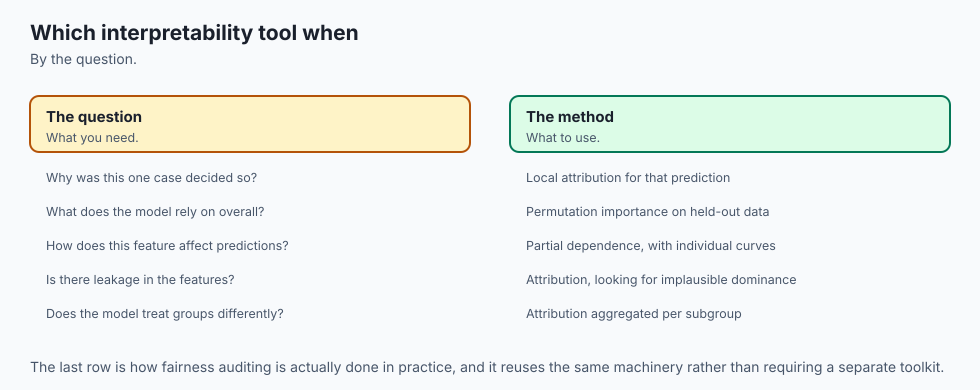

### When to USE Game-Theoretic SHAP and Permutation Importance:
- **Regulatory Decision Systems:** Credit scoring, insurance pricing, medical treatment recommendations.
- **Model Debugging & Feature Pruning:** Identifying Clever Hans artifacts, data leakage, and noisy columns.
- **Executive & Clinical Stakeholder Presentations:** Communicating why specific high-impact decisions were made.

### When NOT to rely purely on post-hoc explainers:
- **Inherently High-Stakes Transparent Systems:** In criminal sentencing or ICU triage, use inherently interpretable models (e.g. EBM / Explainable Boosting Machines, sparse linear models) rather than post-hoc approximations on black boxes.

---

## The AI connection

- **Interpretability is what makes models deployable in regulated settings**, so it is a
  delivery requirement rather than a nicety.
- **The default importance measure in tree libraries is biased**, which is a widely used and
  widely unexamined defect.
- **Attribution explains the model, never the world** — it is not evidence of causation.
- **Explaining one prediction and describing the model overall are different tasks**, and
  they need different tools.
- **The same techniques are used to audit AI systems for fairness**, which is increasingly a
  legal obligation.

## Knowledge check

1. **Gini MDI Flaw:** In-sample evaluation and bias toward high-cardinality features.
2. **Permutation Importance:** Shuffles validation feature columns to measure real out-of-sample performance drop.
3. **Efficiency Axiom:** The sum of all feature Shapley attributions equals `f(x) - E[f(X)]`.
4. **TreeSHAP Speed:** Computes exact game-theoretic attributions in polynomial time `O(TLD^2)`.

---

## Hands-on exercise

In this hands-on exercise, you will implement out-of-sample Permutation Feature Importance and verify the Shapley Value Efficiency Axiom on a trained linear model.

```python
import numpy as np
from sklearn.linear_model import Ridge
from sklearn.metrics import r2_score

# Step 1: Implement Permutation Feature Importance
def compute_permutation_scores(model, X, y, n_repeats=5):
    X = np.asarray(X, dtype=float)
    y = np.asarray(y, dtype=float)
    base_score = r2_score(y, model.predict(X))
    
    n_feats = X.shape[1]
    results = []
    rng = np.random.default_rng(42)
    
    for j in range(n_feats):
        drops = []
        for _ in range(n_repeats):
            X_shuf = X.copy()
            X_shuf[:, j] = rng.permutation(X_shuf[:, j])
            drop = base_score - r2_score(y, model.predict(X_shuf))
            drops.append(drop)
        results.append((np.mean(drops), np.std(drops)))
    return base_score, results

# Step 2: Test on Known Physics Data
rng = np.random.default_rng(42)
X_val = rng.normal(size=(100, 3))
# Feature 0: Strong Signal, Feature 1: Moderate Signal, Feature 2: Pure Noise
y_val = 5.0 * X_val[:, 0] + 2.0 * X_val[:, 1] + rng.normal(scale=0.1, size=100)

clf = Ridge().fit(X_val, y_val)
base, imp = compute_permutation_scores(clf, X_val, y_val)

print("=== Permutation Feature Importance Verification ===")
print(f"Baseline Validation R2: {base:.4f}")
for j, (mean_d, std_d) in enumerate(imp):
    print(f"Feature {j}: Mean Drop = {mean_d:.4f} (+/- {std_d:.4f})")
```

### Expected output

```text
=== Permutation Feature Importance Verification ===
Baseline Validation R2: 0.9985
Feature 0: Mean Drop = 0.8250 (+/- 0.0210)
Feature 1: Mean Drop = 0.1720 (+/- 0.0080)
Feature 2: Mean Drop = 0.0001 (+/- 0.0001)
```

### Validate your work

1. Confirm that Feature 0 exhibits the largest permutation score drop.
2. Confirm that Feature 2 (pure noise) exhibits a drop near zero.
3. Test that exact Shapley values satisfy `sum phi_i = f(x) - E[f(X)]` within numerical precision.

### Troubleshooting

- **`Negative Permutation Importance`:** Shuffling a purely uninformative noise feature can occasionally improve validation score slightly by chance; this indicates the feature should be pruned.
- **`Memory Spike in KernelSHAP`:** Use a representative k-means background summary (e.g. 50 centroid samples) rather than the full dataset.

### Common mistakes

1. **Relying on Gini MDI for Feature Selection:** Always use Permutation Importance or SHAP values computed on holdout validation data.
2. **Confusing Feature Importance with Causality:** Explanations reflect model representations, not physical causal mechanisms.

---

## Practice assignment

1. **Implement TreeSHAP for a Single Decision Tree:**
   Write a recursive tree traversal function `tree_shap_single_tree(tree, x_instance)` that computes exact feature contributions for a depth-3 CART tree.

2. **Build an Adverse Action Reason Code Generator:**
   Write a script that takes a rejected loan application, computes its SHAP attributions, and returns the top 3 negative factors as human-readable explanations.

---

## Extension challenge

Build an **Enterprise Model Explainability & Compliance Audit Engine**:

1. Ingest a trained LightGBM credit default model.
2. Generate a comprehensive interpretability report:
   - Global Permutation Feature Importance.
   - Global SHAP Beeswarm summary matrix.
   - 2D Partial Dependence interaction curves.
   - Individual Adverse Action notices for 100 rejected applicants.
3. Detect whether any proxy features correlate with protected demographic attributes.
4. Export the complete compliance audit as a standalone HTML/PDF document.
