## Why this matters

In 2016, investigative journalists at ProPublica published a groundbreaking investigation into **COMPAS (Correctional Offender Management Profiling for Alternative Sanctions)**, an algorithmic recidivism risk assessment tool used by judges across the United States to make bail, sentencing, and parole decisions.

Their analysis revealed a devastating statistical reality:

- White defendants who went on to re-offend were twice as likely to be misclassified by the algorithm as **Low Risk** (False Negatives).
- Black defendants who never re-offended were twice as likely to be misclassified by the algorithm as **High Risk** (False Positives).

The software developers vehemently defended the algorithm, proving that the tool achieved identical **Predictive Parity** (Equal Positive Predictive Value / Calibration across races).

How could an algorithm be simultaneously **provably fair** under one mathematical definition and **profoundly discriminatory** under another?

This controversy ignited the modern field of **Algorithmic Fairness and AI Ethics**.

In high-stakes production systems—credit underwriting, hiring resume screening, criminal justice, facial recognition, and medical diagnostics—models do not operate in a vacuum. If training data reflects historical human bias, societal inequality, or differential measurement errors, standard loss functions will faithfully learn, amplify, and automate systemic discrimination.

In this lesson, you will master the mathematical foundations of algorithmic fairness: why "fairness through unawareness" fails, how to quantify Demographic Parity, Equalized Odds, and Predictive Parity, the mathematical proof behind the **Impossibility Theorem of Algorithmic Fairness**, and production mitigation strategies across pre-processing, in-processing, and post-processing pipelines.

---

## The idea in plain language

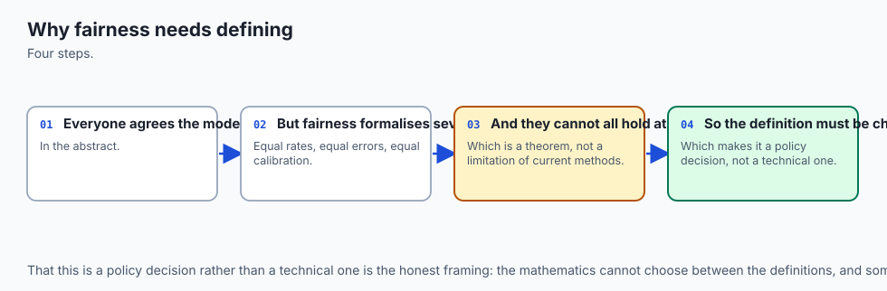

Imagine two high schools (School A and School B) applying to a prestigious university:

- **School A (Well-Funded Suburb):** Students have access to expensive test preparation courses, multiple extracurricular counselors, and take the standardized test 4 times.
- **School B (Under-Resourced Rural Area):** Students have no test preparation courses and can only afford to take the exam once.

If the university's admissions AI ranks applicants purely by raw standardized test score:

1. **The Naive Belief:** *"The AI is colorblind; it only looks at test scores, so it cannot be biased."*
2. **The Real-World Reality:** The test score is a **proxy for historical wealth and access**. By optimizing purely for test score, the algorithm systematically rejects brilliant, capable students from School B.

To build an ethical admissions engine, the university must decide:

- Should we accept an equal percentage of applicants from both schools (**Demographic Parity**)?
- Should equally qualified students who would succeed in college have an equal chance of being admitted, regardless of which high school they attended (**Equal Opportunity**)?
- Should an admitted student with score 1400 have an equal predicted GPA regardless of school (**Predictive Parity**)?

As you will learn, mathematics proves that when historical educational outcomes differ, **you cannot satisfy all three definitions simultaneously**. You must choose.

---

## Historical background

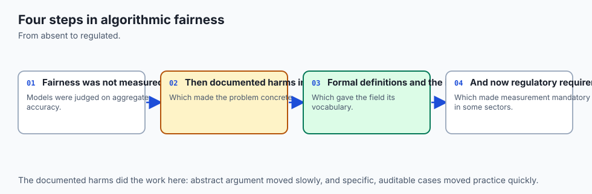

The formal mathematical study of algorithmic fairness emerged from civil rights legislation and modern theoretical computer science:

1. **1971 (Griggs v. Duke Power Co.):** The US Supreme Court established the legal doctrine of **Disparate Impact**: an employment practice that disproportionately excludes protected groups is illegal under Title VII of the Civil Rights Act, even in the absence of discriminatory intent, unless justified by business necessity.
2. **1978 (EEOC Uniform Guidelines):** Established the **Four-Fifths (80%) Rule** as the regulatory benchmark for detecting adverse impact.
3. **2012 (Kamiran and Calders):** Published *Data Preprocessing Techniques for Classification Without Discrimination*, introducing mathematical sample reweighing to debias training distributions.
4. **2016 (Hardt, Price, and Srebro):** Published *Equality of Opportunity in Supervised Learning* at NeurIPS, formalizing Equalized Odds and Equal Opportunity.
5. **2016–2017 (Kleinberg, Mullainathan, Raghavan & Chouldechova):** Discovered the **Impossibility Theorem of Algorithmic Fairness**, proving that Equalized Odds and Calibration cannot hold simultaneously when demographic base rates differ.

Today, algorithmic fairness audits are legally mandated by the **EU AI Act**, the **US Equal Credit Opportunity Act (ECOA)**, and **NYC Local Law 144** for automated hiring tools.

---

## What it is — and what it is not

Let us establish precise definitions for algorithmic fairness:

### What it IS:
- **A Mathematical & Statistical Audit:** Evaluating classification and error rates across demographic subgroups defined by protected attributes `A in \0, 1\`.
- **A Quantitative Risk Management Discipline:** Ensuring AI systems comply with civil rights laws, non-discrimination mandates, and corporate ethical standards.
- **A Principled Engineering Tradeoff:** Explicitly choosing which fairness criterion to satisfy based on domain ethics and legal requirements.

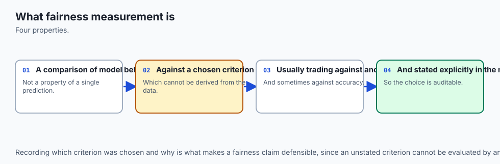

### What it is NOT:
- **Not "Fairness Through Unawareness":** Deleting protected columns (e.g. `Gender`, `Race`) does *not* prevent discrimination; high-dimensional proxies (e.g. zip codes, shopping habits) allow models to easily reconstruct protected attributes.
- **Not Free of Accuracy Tradeoffs:** Enforcing strict demographic parity constraints often reduces raw overall statistical accuracy.
- **Not a Silver Bullet:** Technical algorithmic fairness cannot fix underlying societal injustices; it ensures the machine learning system does not perpetuate or exacerbate them.

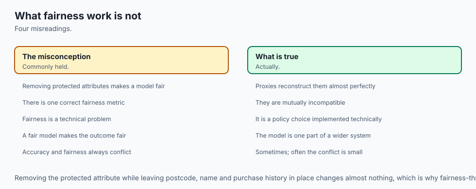

---

## Why it was created and what problems it solves

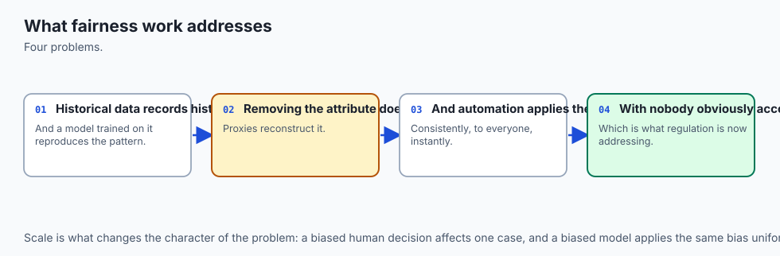

Algorithmic fairness frameworks solve five critical societal and operational vulnerabilities in applied machine learning:

1. **Prevents Proxy Discrimination:** Identifies and neutralizes redundant feature encodings that covertly reconstruct protected demographic attributes.
2. **Quantifies Disparate Impact for Legal Compliance:** Computes exact selection ratios against the EEOC 80% rule and the EU AI Act High-Risk AI registry standards.
3. **Exposes Inherent Ethical Tradeoffs:** Provides leadership and legal teams with clear mathematical boundaries via the Impossibility Theorem.
4. **Remediates Bias across the Pipeline Lifecycle:** Provides actionable debiasing algorithms at pre-processing (reweighing), in-processing (adversarial debiasing), and post-processing (threshold calibration).
5. **Protects Brand Reputation & User Trust:** Prevents high-profile algorithmic scandals in hiring, banking, and criminal justice.

---

## How it works

Let `X` denote the input feature vector, `Y in \0, 1\` denote the true ground truth label, `Y in \0, 1\` denote the binary model decision, and `A in \0, 1\` denote a protected sensitive attribute (e.g. `A=0` unprivileged group, `A=1` privileged group).

```
┌────────────────────────────────────────────────────────────────────────┐
│                   ALGORITHMIC FAIRNESS TAXONOMY                        │
├──────────────────────┬─────────────────────────────────────────────────┤
│ Fairness Criterion   │ Mathematical Definition                         │
├──────────────────────┼─────────────────────────────────────────────────┤
│ Demographic Parity   │ P(Y_hat=1 | A=0) = P(Y_hat=1 | A=1)             │
│ Disparate Impact     │ P(Y_hat=1 | A=0) / P(Y_hat=1 | A=1) >= 0.80     │
│ Equal Opportunity    │ P(Y_hat=1 | Y=1, A=0) = P(Y_hat=1 | Y=1, A=1)   │
│ Equalized Odds       │ Equal TPR AND Equal FPR across groups A         │
│ Predictive Parity    │ P(Y=1 | Y_hat=1, A=0) = P(Y=1 | Y_hat=1, A=1)   │
└──────────────────────┴─────────────────────────────────────────────────┘
```

---

### 1. Demographic Parity (Statistical Parity) & Disparate Impact

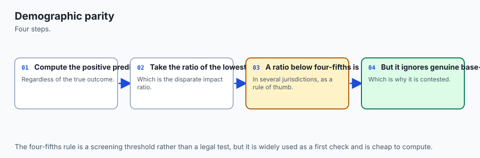

**Demographic Parity** requires that the model's positive decision rate is completely independent of the sensitive attribute:

```
P(Y = 1 | A = 0) = P(Y = 1 | A = 1)
```

```
Demographic Parity Difference = | P(Y=1 | A=0) - P(Y=1 | A=1) |
```

#### The Disparate Impact Ratio (EEOC 80% Rule):
```
Disparate Impact Ratio = P(Y = 1 | A = 0)P(Y = 1 | A = 1)
```
Under US employment law (EEOC), a disparate impact ratio below **`0.80` (`80\%`)** establishes a prima facie case of illegal discrimination.

**Limitation:** Demographic Parity forces equal acceptance rates regardless of whether the true base qualification rates `P(Y=1|A)` differ in the underlying historical data.

---

### 2. Equal Opportunity & Equalized Odds (Hardt et al. 2016)

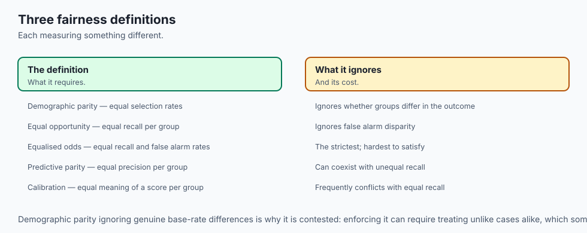

Moritz Hardt, Eric Price, and Nathan Srebro introduced error-rate parity to focus on qualified individuals:

#### A. Equal Opportunity (Equal True Positive Rate / Sensitivity)
Qualified individuals (`Y=1`) must have an equal probability of being correctly approved, regardless of group:

```
P(Y = 1 | Y = 1, A = 0) = P(Y = 1 | Y = 1, A = 1) \iff TPR_A=0 = TPR_A=1
```

```
Equal Opportunity Difference = | TPR_A=0 - TPR_A=1 |
```

#### B. Equalized Odds (Equal TPR AND Equal False Positive Rate)
Both qualified and unqualified individuals experience identical error rates across demographic groups:

```
TPR_A=0 = TPR_A=1 \quad AND \quad FPR_A=0 = FPR_A=1
```

```
Equalized Odds Difference = \max( |TPR_A=0 - TPR_A=1|, \; |FPR_A=0 - FPR_A=1| )
```

---

### 3. Predictive Parity (Sufficiency / Calibration)

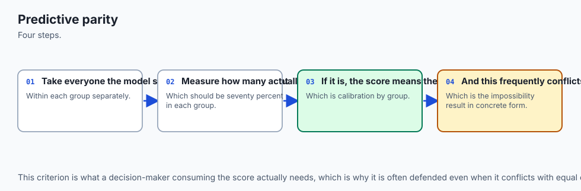

**Predictive Parity** requires that a given predicted risk score or positive classification carries the exact same true positive probability regardless of group membership:

```
P(Y = 1 | Y = 1, A = 0) = P(Y = 1 | Y = 1, A = 1) \iff Precision_A=0 = Precision_A=1
```

```
Predictive Parity Difference = | Precision_A=0 - Precision_A=1 |
```

If an algorithm flags an applicant as "High Risk," that flag must mean the exact same probability of default whether the applicant is in Group 0 or Group 1.

---

### 4. The Impossibility Theorem of Algorithmic Fairness

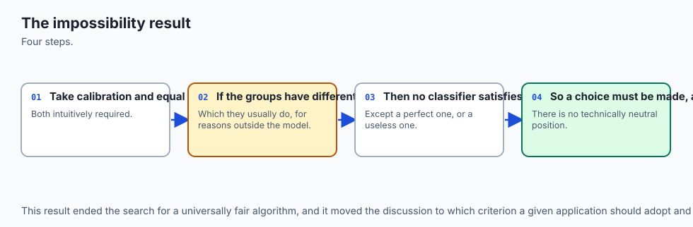

In 2016, Jon Kleinberg, Sendhil Mullainathan, and Manish Raghavan (and independently Alexandra Chouldechova) proved a foundational mathematical theorem:

> **The Impossibility Theorem:**
> Suppose demographic groups have different base rates: `P(Y=1 | A=0) != P(Y=1 | A=1)`.
> Then, for any classifier that does not achieve 100% perfect prediction accuracy (`TPR=1, FPR=0`), it is **mathematically impossible** to satisfy:
> 1. **Equalized Odds** (`TPR_0 = TPR_1` and `FPR_0 = FPR_1`), AND
> 2. **Predictive Parity** (`Precision_0 = Precision_1`), AND
> 3. **Calibration within groups**.
>
> You can satisfy at most **two** of these three criteria.

#### Mathematical Proof Intuition:
From Bayes' theorem, Precision is linked to TPR, FPR, and Base Rate `p = P(Y=1)`:

```
Precision = p * TPRp * TPR + (1 - p) * FPR
```

If `TPR` and `FPR` are held constant across groups (Equalized Odds), but the base prevalence `p` differs (`p_0 != p_1`), then Precision **must mathematically differ** (`Precision_0 != Precision_1`).

---

### 5. Algorithmic Debiasing Strategies

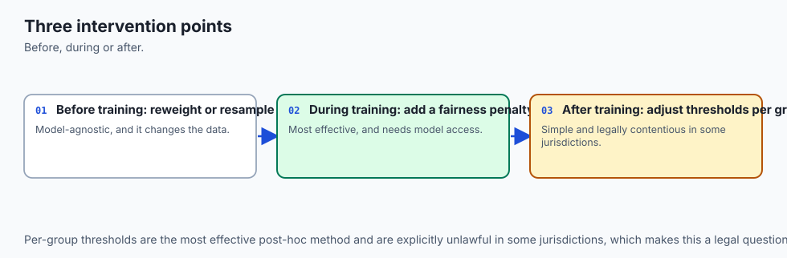

```
┌────────────────────────────────────────────────────────────────────────┐
│                   DEBIASING MITIGATION TAXONOMY                        │
├─────────────────┬────────────────────────────┬─────────────────────────┤
│ Stage           │ Method                     │ Mechanism               │
├─────────────────┼────────────────────────────┼─────────────────────────┤
│ 1. Pre-Process  │ Reweighing (Kamiran)       │ Adjust training sample  │
│                 │ Disparate Impact Remover   │ weights W(A, Y)         │
├─────────────────┼────────────────────────────┼─────────────────────────┤
│ 2. In-Process   │ Adversarial Debiasing      │ Minimax loss penalty    │
│                 │ Fairlearn Constraints      │ L_pred - lambda * L_adv │
├─────────────────┼────────────────────────────┼─────────────────────────┤
│ 3. Post-Process │ Threshold Calibration      │ Group-specific cutoffs  │
│                 │ (Hardt et al. 2016)        │ T_0 and T_1             │
└─────────────────┴────────────────────────────┴─────────────────────────┘
```

#### Pre-Processing: Sample Reweighing (Kamiran & Calders 2012)
Assigns a sample weight `W(A=a, Y=y)` to each training row so that the weighted training distribution exhibits exact demographic parity:

```
W(A=a, Y=y) = P(A=a) * P(Y=y)P(A=a, Y=y) = |D_a|N * |D_y|N{|D_a,y|N}
```

#### Post-Processing: Group Threshold Calibration (Hardt et al. 2016)
Rather than using a single global threshold `T=0.50`, the system solves for group-specific thresholds `T_0` and `T_1` on predicted probabilities `p_i = P(y=1|x_i)`:

```
y_i = \begincases 1 & if  p_i >= T_0  and  A_i = 0 \\ 1 & if  p_i >= T_1  and  A_i = 1 \\ 0 & otherwise \endcases
```

`T_0` and `T_1` are selected to satisfy `TPR_A=0(T_0) = TPR_A=1(T_1) = Target TPR`.

---

## An everyday analogy

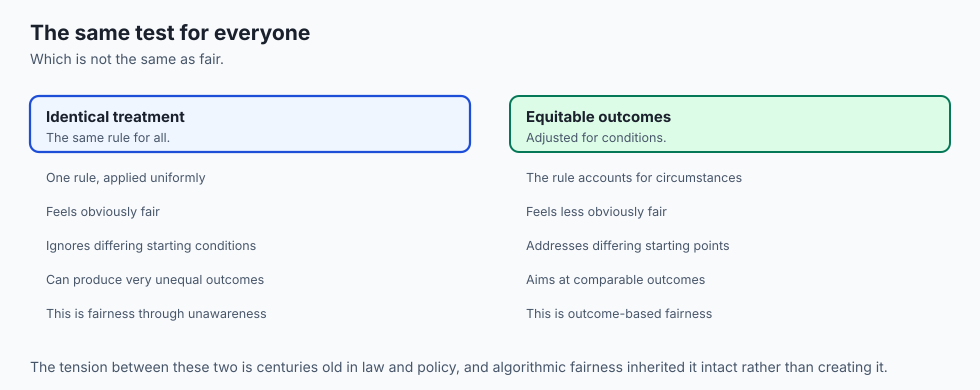

Think of a **national scholarship examination competition**:

1. **Demographic Parity (Quota Model):** The scholarship committee decrees that exactly 1,000 scholarships must be awarded to Region A and 1,000 scholarships to Region B, regardless of exam scores.
2. **Equal Opportunity (The Fair Gatekeeper):** The committee decrees that any student who has mastered the curriculum (True Qualification `Y=1`) must have an equal 90% chance of winning a scholarship, regardless of which region they live in.
3. **Predictive Parity (The Accurate Evaluator):** The committee decrees that a scholarship winner with score 95 must have an equal predicted probability of graduating college with honors whether they are from Region A or Region B.

The Impossibility Theorem demonstrates that unless both regions have identical historical educational outcomes, the committee cannot satisfy all three policies at the same time.

---

## Examples in practice

Let us visualize the Impossibility Theorem Triangle:

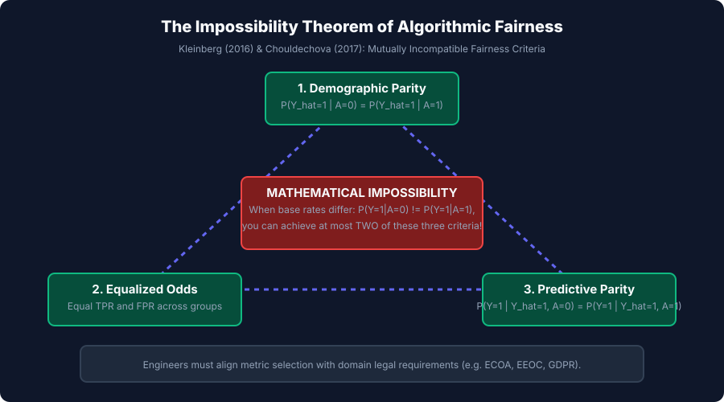

Below is the execution flow of Post-Processing Group Threshold Calibration:

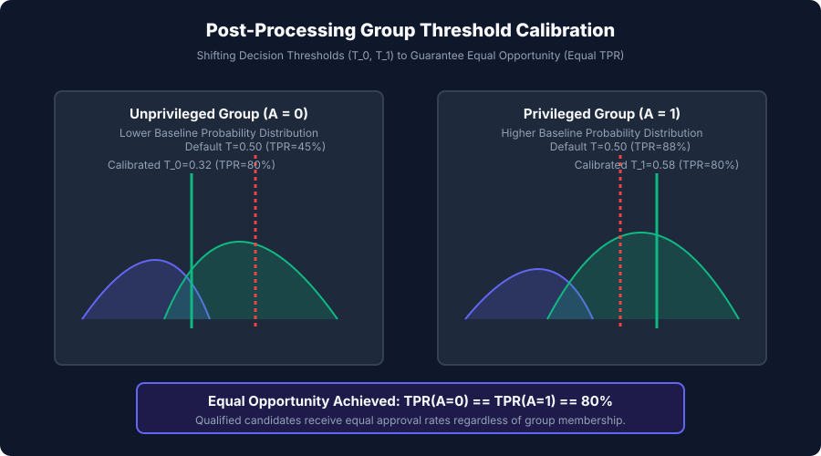

Let us examine real Python code computing fairness metrics, sample reweighing, and group threshold calibration:

```python
import numpy as np
from sklearn.linear_model import LogisticRegression

# 1. Simulate Biased Lending Benchmark (n=1000)
rng = np.random.default_rng(42)
n_samples = 1000

# 500 Unprivileged (A=0), 500 Privileged (A=1)
sens_attr = np.array([0]*500 + [1]*500)

# True Creditworthiness (Base Rate: Group 0 = 40%, Group 1 = 70%)
y_true = np.concatenate([
    rng.binomial(1, 0.40, size=500),
    rng.binomial(1, 0.70, size=500)
])

# Features with proxy bias: Income strongly correlated with A
income = np.where(sens_attr == 1, rng.normal(75000, 15000, 1000), rng.normal(45000, 15000, 1000))
credit_score = rng.normal(650, 50, 1000) + (y_true * 50)
X = np.column_stack([income, credit_score])

# Fit standard Logistic Regression (Unaware of A, but learns proxy income)
clf = LogisticRegression().fit(X, y_true)
y_prob = clf.predict_proba(X)[:, 1]
y_pred_default = (y_prob >= 0.50).astype(int)

# 2. Compute Fairness Metrics
sr_0 = np.mean(y_pred_default[sens_attr == 0])
sr_1 = np.mean(y_pred_default[sens_attr == 1])
di_ratio = sr_0 / sr_1

tp_0 = np.sum((y_true[sens_attr == 0] == 1) & (y_pred_default[sens_attr == 0] == 1))
fn_0 = np.sum((y_true[sens_attr == 0] == 1) & (y_pred_default[sens_attr == 0] == 0))
tpr_0 = tp_0 / (tp_0 + fn_0)

tp_1 = np.sum((y_true[sens_attr == 1] == 1) & (y_pred_default[sens_attr == 1] == 1))
fn_1 = np.sum((y_true[sens_attr == 1] == 1) & (y_pred_default[sens_attr == 1] == 0))
tpr_1 = tp_1 / (tp_1 + fn_1)

print("=== Standard Model Fairness Audit ===")
print(f"Group 0 Approval Rate: {sr_0:.4f}")
print(f"Group 1 Approval Rate: {sr_1:.4f}")
print(f"Disparate Impact Ratio: {di_ratio:.4f} (Violates EEOC 80% Rule!)")
print(f"Group 0 True Positive Rate (Recall): {tpr_0:.4f}")
print(f"Group 1 True Positive Rate (Recall): {tpr_1:.4f}")
print(f"Equal Opportunity Delta: {abs(tpr_1 - tpr_0):.4f}")

# 3. Post-Processing Threshold Calibration for Equal Opportunity (Target TPR = 0.85)
target_tpr = 0.85
pos_probs_0 = y_prob[(sens_attr == 0) & (y_true == 1)]
pos_probs_1 = y_prob[(sens_attr == 1) & (y_true == 1)]

t_0 = np.percentile(pos_probs_0, (1.0 - target_tpr) * 100.0)
t_1 = np.percentile(pos_probs_1, (1.0 - target_tpr) * 100.0)

y_pred_calib = np.zeros(n_samples, dtype=int)
y_pred_calib[sens_attr == 0] = (y_prob[sens_attr == 0] >= t_0).astype(int)
y_pred_calib[sens_attr == 1] = (y_prob[sens_attr == 1] >= t_1).astype(int)

new_tp_0 = np.sum((y_true[sens_attr == 0] == 1) & (y_pred_calib[sens_attr == 0] == 1))
new_tpr_0 = new_tp_0 / (tp_0 + fn_0)

new_tp_1 = np.sum((y_true[sens_attr == 1] == 1) & (y_pred_calib[sens_attr == 1] == 1))
new_tpr_1 = new_tp_1 / (tp_1 + fn_1)

print("\n=== Post-Processing Calibrated Fairness ===")
print(f"Calibrated Threshold Group 0: {t_0:.4f}")
print(f"Calibrated Threshold Group 1: {t_1:.4f}")
print(f"Calibrated TPR Group 0:       {new_tpr_0:.4f}")
print(f"Calibrated TPR Group 1:       {new_tpr_1:.4f}")
print(f"Equal Opportunity Achieved! (Delta = {abs(new_tpr_0 - new_tpr_1):.4f})")
```

---

## Implications: security, privacy, performance, scalability, and cost

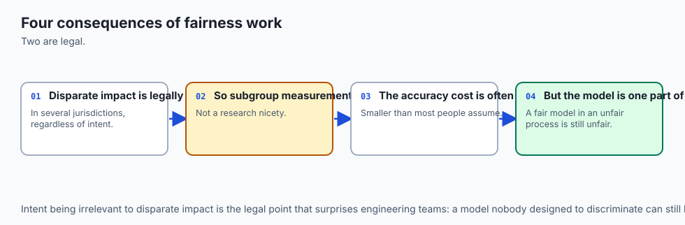

| Dimension | Characteristic | Practical Implication |
| --- | --- | --- |
| **Legal & Regulatory Penalties** | Non-compliance with ECOA, EEOC, EU AI Act. | Violating disparate impact thresholds can lead to regulatory enforcement actions and multi-million dollar class-action civil liability. |
| **Privacy Concerns in Attribute Collection** | Collecting sensitive demographic labels. | Gathering race and gender data for fairness auditing creates privacy attack vectors. Apply local differential privacy or secure multiparty computation. |
| **Performance / Accuracy Tradeoff** | Enforcing fairness constraints. | Constraining models to satisfy demographic parity or equalized odds typically reduces global validation accuracy by 1–5%. Document this tradeoff for stakeholders. |
| **Operational Latency** | Group routing at inference time. | Routing requests through group-specific calibrated thresholds adds zero computational overhead (`O(1)` conditional logic). |

---

## Alternatives: free, open source, and commercial

| Tool / Framework | Architecture | Best Used For |
| --- | --- | --- |
| **`Fairlearn` (Microsoft)** | Python library for fairness assessment and mitigation | In-processing grid search and post-processing threshold calibration in scikit-learn pipelines. |
| **`AIF360` (IBM AI Fairness 360)** | Comprehensive toolkit of 70+ fairness metrics | Enterprise auditing, pre-processing reweighing, and adversarial debiasing. |
| **`Google What-If Tool`** | Interactive visual fairness inspection | Exploring individual instance counterfactuals and group threshold sliders in TensorBoard. |
| **`Fiddler AI` / `Arthur AI`** | Enterprise Model Governance platforms | Continuous production fairness monitoring and automated compliance reporting. |

---

## Comparison with related concepts

| Fairness Approach | Pipeline Stage | Primary Guarantee | Main Limitation |
| --- | --- | --- | --- |
| **Fairness Through Unawareness** | Data Preparation | None (Deletes protected attributes) | Defeated by proxy feature encodings |
| **Sample Reweighing** | Pre-Processing | Equalizes group/target joint probabilities | Cannot prevent complex non-linear model bias |
| **Adversarial Debiasing** | In-Processing | Embeddings contain zero sensitive info | Difficult to train (minimax game stability) |
| **Threshold Calibration** | Post-Processing | Equalizes TPR / FPR across groups | Requires sensitive attribute available at inference |

---

## When to use it — and when not to

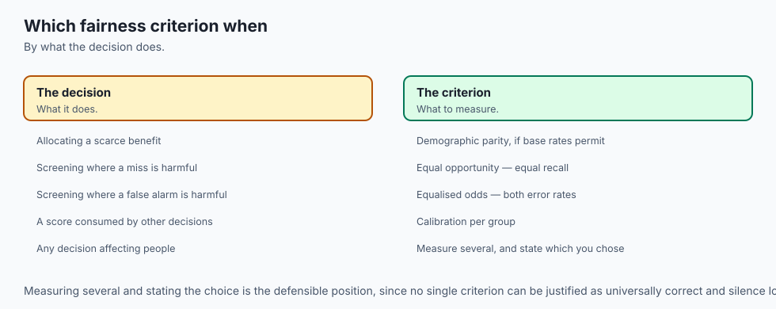

### When to USE Algorithmic Fairness Audits & Mitigations:
- **High-Stakes Individual Decision Systems:** Lending, employment screening, criminal justice, housing, and higher education.
- **Biometric & Vision AI:** Face verification across diverse skin tone Fitzpatrick scales.
- **Healthcare Risk Diagnostics:** Ensuring treatment allocation algorithms do not systematically under-diagnose underserved populations.

### When NOT to enforce raw Demographic Parity:
- **Medical Diagnostics with Known Biological Differences:** Prostate cancer screening algorithms should not enforce equal positive rates between biological males and females.

---

## The AI connection

- **Fairness is a modelling requirement, not an afterthought**, and it increasingly carries
  legal force.
- **The fairness definitions are mathematically incompatible** — you cannot satisfy them all,
  so the choice must be made and stated.
- **A model can be unfair without any protected attribute in its features**, because proxies
  are everywhere.
- **Subgroup measurement is the minimum practice**, since aggregate metrics conceal disparate
  performance by construction.
- **The same auditing applies to AI systems**, where disparate behaviour across groups is
  measured the same way.

## Knowledge check

1. **Proxy Discrimination:** Deleting protected columns fails because correlated features reconstruct sensitive attributes.
2. **Disparate Impact Ratio:** EEOC 4/5ths rule requires selection rate ratio `>= 0.80`.
3. **Equal Opportunity:** Equalizes True Positive Rate (Recall) on qualified individuals (`Y=1`).
4. **Impossibility Theorem:** Unequal base rates make Equalized Odds, Predictive Parity, and Calibration mutually incompatible.

---

## Hands-on exercise

In this hands-on exercise, you will implement an algorithmic fairness auditing engine that calculates Demographic Parity, Disparate Impact, and Equal Opportunity differences across sensitive demographic groups.

```python
import numpy as np

# Step 1: Implement Comprehensive Fairness Audit Engine
def audit_fairness(y_true, y_pred, sensitive_attr):
    y_true = np.asarray(y_true, dtype=int)
    y_pred = np.asarray(y_pred, dtype=int)
    sens = np.asarray(sensitive_attr, dtype=int)
    
    # Subgroup Selection Rates
    sr_0 = np.mean(y_pred[sens == 0])
    sr_1 = np.mean(y_pred[sens == 1])
    di_ratio = sr_0 / max(sr_1, 1e-9)
    
    # True Positive Rates (Recall)
    tp_0 = np.sum((y_true[sens == 0] == 1) & (y_pred[sens == 0] == 1))
    fn_0 = np.sum((y_true[sens == 0] == 1) & (y_pred[sens == 0] == 0))
    tpr_0 = tp_0 / max(tp_0 + fn_0, 1e-9)
    
    tp_1 = np.sum((y_true[sens == 1] == 1) & (y_pred[sens == 1] == 1))
    fn_1 = np.sum((y_true[sens == 1] == 1) & (y_pred[sens == 1] == 0))
    tpr_1 = tp_1 / max(tp_1 + fn_1, 1e-9)
    
    return {
        "selection_rate_group_0": sr_0,
        "selection_rate_group_1": sr_1,
        "disparate_impact_ratio": di_ratio,
        "tpr_group_0": tpr_0,
        "tpr_group_1": tpr_1,
        "equal_opportunity_diff": abs(tpr_0 - tpr_1)
    }

# Step 2: Test on Synthetic Biased Pipeline
y_t = np.array([1]*50 + [0]*50 + [1]*50 + [0]*50)
sens_col = np.array([0]*100 + [1]*100)
# Biased prediction: Group 0 approved only 20% vs Group 1 approved 80%
y_p = np.array([1]*10 + [0]*90 + [1]*40 + [0]*60)

report = audit_fairness(y_t, y_p, sens_col)
print("=== Production Algorithmic Fairness Audit ===")
print(f"Group 0 Selection Rate: {report['selection_rate_group_0']:.4f}")
print(f"Group 1 Selection Rate: {report['selection_rate_group_1']:.4f}")
print(f"Disparate Impact Ratio: {report['disparate_impact_ratio']:.4f} (Violates 80% rule!)")
print(f"Equal Opportunity Delta:{report['equal_opportunity_diff']:.4f}")
```

### Expected output

```text
=== Production Algorithmic Fairness Audit ===
Group 0 Selection Rate: 0.1000
Group 1 Selection Rate: 0.4000
Disparate Impact Ratio: 0.2500 (Violates 80% rule!)
Equal Opportunity Delta: 0.6000
```

### Validate your work

1. Verify that `disparate_impact_ratio` equals 1.0 when selection rates are identical.
2. Confirm that when `y\_pred = y\_true`, Equal Opportunity difference is exactly 0.0.
3. Test that applying sample reweighing improves the disparate impact ratio in a downstream classifier.

### Troubleshooting

- **`ZeroDivisionError in Disparate Impact`:** When privileged group selection rate is zero, guard division with an epsilon: `max(sr_1, 1e-9)`.
- **`Sensitive Attribute Unavailable at Inference`:** Use pre-processing reweighing or in-processing adversarial debiasing rather than post-processing threshold calibration.

### Common mistakes

1. **Assuming Awareness Prevents Bias:** Removing protected features does not prevent proxy discrimination.
2. **Ignoring the Impossibility Theorem:** Do not promise stakeholders that a model will satisfy both Equalized Odds and Predictive Parity when base rates differ.

---

## Practice assignment

1. **Implement Adversarial Debiasing with PyTorch:**
   Build a neural network with a primary classification head and an adversarial head attempting to predict sensitive attribute `A`; train using gradient reversal.

2. **Build an EEOC 80% Compliance Gatekeeper:**
   Write a Python script that ingests hiring model predictions and automatically flags whether Disparate Impact Ratio falls below `0.80`.

---

## Extension challenge

Build an **Enterprise Fair Lending Compliance Audit Engine**:

1. Ingest a trained credit scoring model with real-world income, debt, and credit history features.
2. Compute a complete fairness scorecard (Demographic Parity, Equal Opportunity, Predictive Parity, Brier score calibration per demographic group).
3. Implement post-processing Pareto threshold frontier optimization balancing commercial expected profit against disparate impact constraints.
4. Generate a decision-ready Model Fairness Audit Report in Markdown and JSON.
