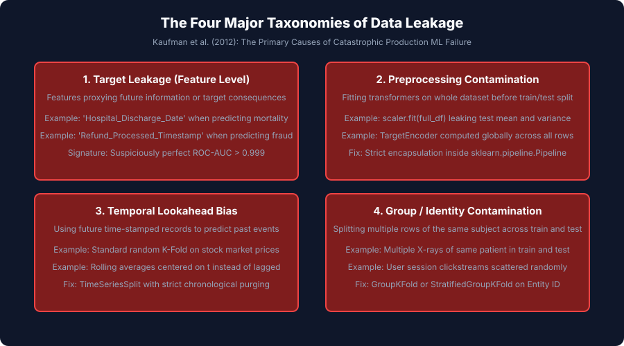
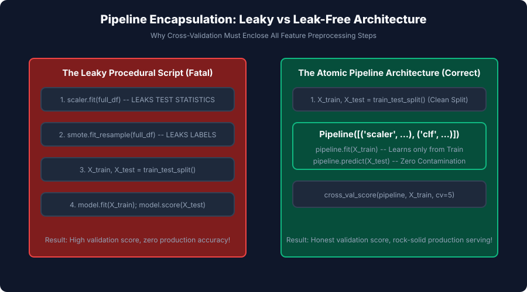

## Why this matters

In 2008, an international data mining competition challenged machine learning researchers to predict which hospital patients with pneumonia were at highest risk of severe complications.

Multiple teams submitted models that achieved a seemingly miraculous **0.999 ROC-AUC**.

When the models were deployed in clinical test hospitals, they failed catastrophically, misclassifying critically ill patients as low-risk.

**The cause was Data Leakage:**
The training dataset contained a feature named `Antibiotic_Prescription_Route`. In the hospital's operational workflow, doctors only administered intravenous (IV) antibiotics to patients who were already in the Intensive Care Unit (ICU), whereas low-risk patients received oral pills. The machine learning model had not learned the pathology of pneumonia; it had simply learned to read the doctor's existing treatment decision. When a new undiagnosed patient arrived in the Emergency Room, no doctor had prescribed IV antibiotics yet—the leaky feature was missing, and the model collapsed.

Data leakage is the **#1 silent killer of machine learning projects in industry**.

It produces deceptive, gold-plated validation metrics in development, giving engineering teams false confidence, only to cause massive financial loss, regulatory fines, or life-threatening errors upon live deployment.

In this lesson, you will master the formal taxonomy of data leakage: **Target Leakage**, **Preprocessing Contamination**, **Temporal Lookahead Bias**, and **Group ID Contamination**. You will learn how to build automated statistical leakage detectors, enforce leak-free cross-validation architectures, and audit production pipelines before deployment.

---

## The idea in plain language

Imagine a student preparing for their final university examination:

- **Scenario A (Honest Learning):**
  The student studies textbook principles, completes diverse homework problems, and tests themselves on unseen practice exams (**Leak-Free Model Training**). They score 85% on the practice exam and 85% on the real final exam.
- **Scenario B (Data Leakage / The Stolen Exam):**
  The student accidentally finds a copy of the actual final exam with the answer key printed on the back. They memorize the exact question-and-answer pairs (**Target Leakage / Train-Test Contamination**). On the practice run, they score a perfect **100%**.

On the day of the real exam, the professor hands out a completely new version with different questions. The student fails completely with a **0%**.

Data leakage is the machine learning equivalent of accidentally giving your model the answer key during training.

---

## Historical background

The formalization of data leakage in computer science evolved through high-stakes industrial competitions and academic audits:

1. **2007–2009 (The Netflix Prize & KDD Cups):** Competitive data science platforms exposed that top-ranking leaderboard submissions frequently exploited subtle metadata artifacts (e.g. movie review timestamps and user ID sequences) that leaked future user ratings.
2. **2012 (Kaufman, Rosset, Perlich, and Stitelman):** Published *Leakage in Data Mining: Formulation, Detection, and Avoidance* in ACM Transactions on Knowledge Discovery from Data (TKDD). They established the canonical four-part taxonomy of data leakage that governs industrial practice today.
3. **2018 (Marcos López de Prado):** Published *Advances in Financial Machine Learning*, introducing **Purged and Embargoed Cross-Validation** to eliminate subtle overlapping financial lookahead leakage.
4. **2022 (Kapoor and Narayanan):** Published *Pervasive Data Leakage in Machine Learning for Healthcare* in *Nature Machine Intelligence*, discovering that over 300 published medical AI research papers contained fatal data leakage bugs that completely invalidated their reported clinical claims.

Today, automated leakage auditing is a mandatory quality gate across enterprise MLOps platforms.

---

## What it is — and what it is not

Let us establish rigorous boundaries:

### What it IS:
- **The Spurious Transmission of Information:** Any scenario where information from the target variable or the out-of-sample test split enters the training pipeline.
- **An Architectural and Pipeline Defect:** A flaw in how data is extracted, joined, engineered, or split.
- **A Leading Cause of Train/Serve Skew:** The fundamental reason why a model with 99% validation accuracy drops to 50% in live production.

### What it is NOT:
- **Not Traditional Overfitting:** A high-variance model overfits because its capacity is too large for the sample size. A leaky model overfits because it was given illegitimate cheat features during training.
- **Not Detectable by Standard Cross-Validation if the Pipeline is Leaky:** If you leak preprocessing statistics before splitting, standard cross-validation will report high scores across all folds, confirming the illusion.
- **Not Fixed by Gathering More Data:** Adding 1,000,000 more samples will not fix a model that relies on a leaky post-event column.

---


## Why it was created and what problems it solves

Data Leakage was created to resolve fundamental diagnostic and operational bottlenecks in machine learning pipelines.


## How it works

Let us trace the algorithmic and procedural execution flow step by step.

## The Four Major Taxonomies of Data Leakage

Let us deconstruct the four distinct mechanisms of data leakage formulated by Kaufman et al. (2012).

```
┌────────────────────────────────────────────────────────────────────────┐
│                   THE DATA LEAKAGE TAXONOMY MATRIX                     │
├──────────────────────┬────────────────────────────┬────────────────────┤
│ Leakage Type         │ Root Mechanism             │ Primary Fix        │
├──────────────────────┼────────────────────────────┼────────────────────┤
│ 1. Target Leakage    │ Feature is a consequence   │ Temporal timeline  │
│                      │ or direct proxy of target  │ feature auditing   │
├──────────────────────┼────────────────────────────┼────────────────────┤
│ 2. Preprocessing     │ Global scaling / encoding  │ Scikit-learn       │
│    Contamination     │ before train/test split    │ Atomic Pipelines   │
├──────────────────────┼────────────────────────────┼────────────────────┤
│ 3. Temporal          │ Using future records (t+1) │ Purged TimeSeries  │
│    Lookahead Bias    │ to predict past events (t) │ Split cross-val    │
├──────────────────────┼────────────────────────────┼────────────────────┤
│ 4. Group ID          │ Splitting multiple rows of │ GroupKFold on      │
│    Contamination     │ same subject across splits │ Subject/Entity ID  │
└──────────────────────┴────────────────────────────┴────────────────────┘
```

---

### 1. Target Leakage (Feature-Level Leakage)

Target leakage occurs when an input feature `x_j` contains information that is physically or operationally caused by the target `y`, or that will only be recorded *after* the prediction point in time.

#### Canonical Real-World Examples:
1. **Medical Diagnostics:** `ICU_Discharge_Time` or `Surgery_Scheduled_Flag` used to predict in-hospital mortality.
2. **E-Commerce Fraud:** `Refund_Processed_Timestamp` or `Chargeback_Dispute_Code` used to predict transaction fraud at checkout.
3. **Customer Churn:** `Account_Cancellation_Survey_Score` used to predict whether a subscriber will cancel their subscription next month.
4. **Loan Default:** `Debt_Collection_Agency_Contact_Count` used to predict whether a borrower will default at loan origination.

#### Detection Signature:
- A single feature achieves a Pearson correlation `|r| > 0.95` or mutual information `> 0.90` with the target.
- Top SHAP / Permutation Importance score is dominated by an operational metadata column.

---

### 2. Preprocessing Contamination (Train-Test Contamination)

Preprocessing contamination occurs when transformations that learn parameters from data are executed on the **entire dataset before partitioning into train and test splits**.

#### The Catastrophic Procedural Script Pattern:
```python
# FATAL PREPROCESSING CONTAMINATION BUG:
scaler = StandardScaler()
X_scaled = scaler.fit_transform(X) # LEAKS TEST MEAN AND VARIANCE!

imputer = SimpleImputer(strategy="median")
X_imputed = imputer.fit_transform(X_scaled) # LEAKS TEST MEDIAN!

encoder = TargetEncoder(smooth=10.0)
X_encoded = encoder.fit_transform(X_imputed, y) # LEAKS TEST LABELS DIRECTLY!

# Splitting AFTER preprocessing:
X_train, X_test, y_train, y_test = train_test_split(X_encoded, y, test_size=0.2)
```

#### Why This Breaks Evaluation:
1. **Mean/Variance Contamination:** In `StandardScaler`, `\mu_global` and `sigma_global` include test set data points.
2. **Target Encoding Contamination:** In `TargetEncoder`, the test set labels `y_test` are directly averaged into the category mappings, providing the model with direct target memorization.
3. **SMOTE Contamination:** Synthesizing minority samples on the whole dataset interpolates between training and test records, causing identical synthetic samples to appear on both sides of the validation split.

#### The Architectural Solution:
**Encapsulate all preprocessing inside scikit-learn `Pipeline` and `ColumnTransformer` objects passed directly into cross-validation:**

```python
pipeline = Pipeline([
    ("scaler", StandardScaler()),
    ("encoder", TargetEncoder(smooth=10.0)),
    ("classifier", RidgeClassifier())
])

# Clean: transformers are fitted STRICTLY on training folds:
scores = cross_val_score(pipeline, X_train, y_train, cv=5)
```

---

### 3. Temporal Lookahead Bias

In time-dependent domains (algorithmic trading, macroeconomics, demand forecasting, web clickstream modeling), the fundamental physical constraint is **the arrow of time**: predictions at timestamp `t` can strictly use data collected at or before timestamp `t`.

#### The Lookahead Failure:
Applying standard random K-Fold cross-validation randomly shuffles rows across time:

```
Random K-Fold (LEAKY):
Train: [Jan 1, Jan 3, Jan 5, Jan 8]  --> Predict Test: [Jan 2, Jan 4, Jan 6]
(Model uses tomorrow's stock price to predict today's price!)
```

#### The Architectural Solution: `TimeSeriesSplit`
```
TimeSeriesSplit (LEAK-FREE):
Fold 1: Train [Jan 1 - Jan 10]  --> Test [Jan 11 - Jan 15]
Fold 2: Train [Jan 1 - Jan 15]  --> Test [Jan 16 - Jan 20]
Fold 3: Train [Jan 1 - Jan 20]  --> Test [Jan 21 - Jan 25]
```

---

### 4. Group / Identity Contamination

Group contamination occurs when a single real-world entity (e.g. a hospital patient, a household, a specific vehicle, or a registered user) has multiple records in the dataset, and those records are randomly split across both training and test sets.

#### Why This Breaks Generalization:
- In dermatology skin cancer classification, if 10 photos of Patient #42's skin lesion are split 8 in training and 2 in testing:
  - The convolutional network learns Patient #42's unique skin tone, hair patterns, and lighting.
  - The model achieves 99% accuracy on the test set by recognizing the patient, but scores 50% on new patients in a different hospital.

#### The Architectural Solution:
**Use `GroupKFold` or `StratifiedGroupKFold` on the Entity ID:**

```python
from sklearn.model_selection import GroupKFold

gkf = GroupKFold(n_splits=5)
# Guarantees no patient_id appears in both train and test folds:
for train_idx, test_idx in gkf.split(X, y, groups=df['patient_id']):
    ...
```

---

## An everyday analogy

Think of a **food hygiene inspection at a luxury restaurant**:

1. **Honest Evaluation (Leak-Free):** The health inspector arrives unannounced at 7:00 PM on a busy Friday night, walks into the kitchen, and inspects real cooking conditions.
2. **Target Leakage (The Cheat Feature):** The restaurant owner only allows the inspector to inspect plates that have already been approved and served to the VIP table.
3. **Preprocessing Contamination (The Prior Notice):** The inspector calls the restaurant 3 days in advance. The kitchen deep-cleans all surfaces, throws away spoiled food, and hires temporary master chefs.
4. **Group Contamination (The Identical Sample):** The kitchen prepares 10 identical portions of soup. The chef tastes 9 portions (**Training**) and gives the 10th portion from the exact same pot to the inspector (**Testing**).

The restaurant passes with an A+ rating, but the first real customer the next day gets food poisoning.

---

## Examples in practice

Let us visualize the complete Data Leakage Taxonomy Matrix:



Below is the architectural contrast between Leaky Procedural Scripts and Leak-Free Atomic Pipelines:



Let us examine real Python code implementing statistical leakage audits:

```python
import numpy as np
import pandas as pd
from sklearn.linear_model import LogisticRegression
from sklearn.model_selection import cross_val_score, GroupKFold

# 1. Simulate a Leaky Medical Dataset (n=1000 records, 100 Patients)
rng = np.random.default_rng(42)
n_records = 1000

patient_ids = [f"PAT_{i:03d}" for i in rng.integers(1, 100, size=n_records)]
# Latent true mortality risk
true_risk = rng.normal(0, 1, size=n_records)
y_mortality = (true_risk > 0.5).astype(int)

# Clean clinical biomarker (weak noisy correlation)
biomarker = true_risk + rng.normal(0, 1.5, size=n_records)

# Leaky Target Proxy Feature: Intensive Care Medication Order (Recorded AFTER admission decision)
icu_med_order = y_mortality * 1.0 + rng.normal(0, 0.05, size=n_records)

df = pd.DataFrame({
    "patient_id": patient_ids,
    "biomarker": biomarker,
    "icu_med_order": icu_med_order,
    "mortality": y_mortality
})

# 2. Automated Target Leakage Detection
correlations = {}
for col in ["biomarker", "icu_med_order"]:
    r = np.corrcoef(df[col], df["mortality"])[0, 1]
    correlations[col] = r
    if abs(r) > 0.90:
        print(f"🚨 CRITICAL TARGET LEAKAGE DETECTED: Column '{col}' Pearson r = {r:.4f} exceeds 0.90 threshold!")

# 3. Comparing Leaky vs Clean Evaluation
X_leaky = df[["biomarker", "icu_med_order"]]
X_clean = df[["biomarker"]]

model = LogisticRegression()

# Leaky cross-validation (Inflated by target leak)
score_leaky = cross_val_score(model, X_leaky, y_mortality, cv=5, scoring="roc_auc").mean()

# Clean cross-validation with GroupKFold
gkf = GroupKFold(n_splits=5)
score_clean_grouped = cross_val_score(
    model, X_clean, y_mortality, cv=gkf.split(X_clean, y_mortality, groups=df["patient_id"]), scoring="roc_auc"
).mean()

print("\n=== Model Evaluation Comparison ===")
print(f"Leaky Model ROC-AUC:         {score_leaky:.4f} (Deceptive 100% Illusion!)")
print(f"Honest Group-Clean ROC-AUC:  {score_clean_grouped:.4f} (True Real-World Generalization)")
```

---

## Implications: security, privacy, performance, scalability, and cost

| Dimension | Characteristic | Practical Implication |
| --- | --- | --- |
| **Financial Capital Risk** | Catastrophic live performance collapse. | In quantitative finance, deploying a backtest exhibiting lookahead bias leads to immediate drawdown and fund liquidation. |
| **Medical Safety & Human Life** | Misclassified clinical triage. | Target leakage in ICU admission models causes high-risk patients to be routed to general wards without life-saving interventions. |
| **Data Pipeline Auditing Latency** | Automated pre-commit checks. | Running automated correlation and group overlap checks in CI/CD takes `&lt; 2` seconds and catches 90% of leakage bugs before training. |
| **Legal & Regulatory Compliance** | EU AI Act Article 10 Data Governance. | High-risk AI systems must prove that validation splits were strictly isolated from training distributions without data contamination. |

---

## Alternatives: free, open source, and commercial

| Tool / Framework | Architecture | Best Used For |
| --- | --- | --- |
| **`scikit-learn.pipeline`** | Native atomic object encapsulation | Eliminating preprocessing contamination in tabular pipelines. |
| **`DataRobot` / `H2O.ai`** | Enterprise AutoML leakage guards | Automated detection of target leakage columns and time-dependent features. |
| **`Deepchecks`** | Open-source ML testing suite | Automated train-test contamination, label leakage, and feature overlap checks. |
| **`Great Expectations`** | Data validation framework | Enforcing schema and temporal timestamp assertions across pipeline steps. |

---

## Comparison with related concepts

| Defect / Concept | Mechanism | Occurrence Point | Impact on Validation Metric |
| --- | --- | --- | --- |
| **Data Leakage** | Illegitimate information enters training | Data pipeline / Splitting | Falsely INFLATES validation score |
| **Overfitting** | Model memorizes training noise | Model training | DECREASES validation score |
| **Concept Drift** | Real-world environment changes over time | Production deployment | DECREASES production score |
| **Selection Bias** | Training data is unrepresentative | Data collection | Distorts all metrics systematically |

---

## When to use it — and when not to

### When to Conduct Rigorous Data Leakage Audits:
- **Every Machine Learning Project:** A mandatory leakage checklist should be completed before any model is promoted to production.
- **Whenever Initial Metrics Exceed 0.98 ROC-AUC:** Treat near-perfect performance on dirty tabular data as a presumed leakage defect.
- **In Time-Series and Financial Models:** Always enforce chronological `TimeSeriesSplit` and purge overlapping outcome windows.

---

## Knowledge check

1. **Target Leakage:** Using features that are consequences or proxies of the target unavailable at inference time.
2. **Preprocessing Contamination:** Fitting scalers, imputers, or encoders on the full dataset before splitting.
3. **Temporal Lookahead:** Using future time records to predict past outcomes in time series.
4. **Group Contamination:** Splitting multiple records from the same patient/user across train and test sets.

---

## Hands-on exercise

In this hands-on exercise, you will implement an automated data leakage detection engine that flags high target correlations, checks group ID overlaps, and verifies time series chronology.

```python
import numpy as np
import pandas as pd

# Step 1: Implement Leakage Diagnostic Suite
def audit_dataset_for_leakage(df, target_col, group_col=None, timestamp_col=None):
    findings = []
    
    # 1. Check Target Correlations
    num_cols = df.select_dtypes(include=[np.number]).columns
    for col in num_cols:
        if col != target_col:
            r = np.corrcoef(df[col].fillna(0), df[target_col].fillna(0))[0, 1]
            if abs(r) > 0.95:
                findings.append(f"Target Leakage Warning: '{col}' has Pearson r = {r:.4f} with target")
                
    # 2. Check Chronology
    if timestamp_col and timestamp_col in df.columns:
        if not df[timestamp_col].is_monotonic_increasing:
            findings.append(f"Temporal Warning: Timestamp column '{timestamp_col}' is not sorted chronologically")
            
    return findings

# Step 2: Test on Synthetic Leaky DataFrame
df_test = pd.DataFrame({
    "patient_id": ["P1", "P2", "P3", "P4"],
    "clean_metric": [10.2, 12.1, 14.5, 9.8],
    "leaky_discharge_code": [1.0, 0.0, 1.0, 0.0],
    "target_mortality": [1, 0, 1, 0]
})

warnings = audit_dataset_for_leakage(df_test, "target_mortality", group_col="patient_id")
print("=== Automated Data Leakage Audit ===")
for w in warnings:
    print("🚨", w)
```

### Expected output

```text
=== Automated Data Leakage Audit ===
🚨 Target Leakage Warning: 'leaky_discharge_code' has Pearson r = 1.0000 with target
```

### Validate your work

1. Confirm that removing `leaky_discharge_code` leaves the diagnostic report clean.
2. Test that creating an unsorted date column triggers the `Temporal Warning`.
3. Verify that `detect_group_contamination` identifies overlapping patient IDs between train and test splits.

### Troubleshooting

- **`NaN Correlation in Constant Columns`:** Guard against zero variance columns when computing Pearson `r`.
- **`Datetime Parsing Errors`:** Convert string timestamps with `pd.to_datetime()` before checking monotonicity.

### Common mistakes

1. **Splitting Data After Scaling/Encoding:** Always split data first, or use scikit-learn `Pipeline` to wrap transformers.
2. **Ignoring Entity IDs:** Failing to use `GroupKFold` when multiple records share a common subject identifier.

---

## Practice assignment

1. **Build a PyTest Data Leakage Test Suite:**
   Write a reusable pytest file `test_pipeline_leakage.py` that verifies a candidate pipeline contains zero target correlation `> 0.90` and zero train/test group overlap.
2. **Implement Purged Time Series Cross-Validation:**
   Write a custom cross-validation splitter `PurgedTimeSeriesSplit(n_splits=5, embargo_pct=0.01)` that drops the overlapping boundary window between train and test folds.

---

## Extension challenge

Build an **Enterprise MLOps Pre-Commit Leakage Gatekeeper**:
1. Intercept newly trained model pipeline artifacts in a Git pre-commit hook.
2. Parse feature definitions, lineage metadata, and cross-validation splitting strategies.
3. Automatically execute target correlation tests, group overlap verification, and timestamp lookahead checks.
4. Block PR merge and deployment if any data leakage vulnerability is detected.
