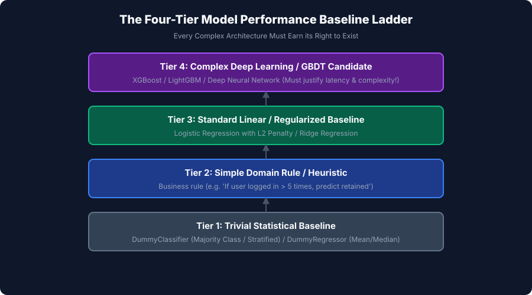
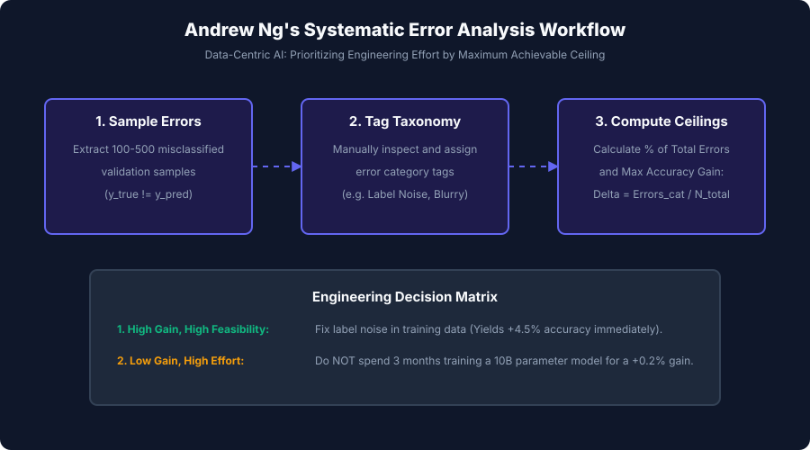

## Why this matters

When an applied machine learning project underperforms, inexperienced engineering teams reflexively enter an endless loop of **Model-Centric Trial-and-Error**:
- They swap Random Forests for a 200-layer Transformer.
- They launch a 48-hour Optuna Bayesian hyperparameter search.
- They add arbitrary regularization penalties and learning rate schedulers.

After three weeks of wasted compute, test performance improves by a statistically meaningless **+0.15%**.

Meanwhile, experienced machine learning engineers follow a completely different discipline pioneered by **Andrew Ng**: **Systematic Baselines and Data-Centric Error Analysis**.

Instead of guessing algorithms, they establish strict multi-tier performance baselines to prove whether machine learning is even necessary. Then, they sit down and manually inspect 100 misclassified validation examples. They discover that:
- 40% of errors were caused by corrupted ground-truth labels entered by outsourced annotators.
- 30% were caused by unhandled missing values in a single categorical column.
- 20% occurred exclusively on users running a specific mobile operating system version.

By calculating the **Error Reduction Ceiling**, they prove that fixing label noise will yield an immediate **+4.0% accuracy gain** in one afternoon, while tweaking neural network hyperparameters would never exceed +0.2%.

In this lesson, you will master the four-tier baseline hierarchy, the rigorous methodology of manual error analysis, Andrew Ng's error ceiling formulas, and slice-based subpopulation auditing.

---

## The idea in plain language

Imagine a hospital emergency room that hires a software contractor to build an AI diagnostic tool predicting whether incoming patients need immediate critical care:

- **The Contractor's Pitch:** *"Our Deep Transformer Neural Network achieves 94% accuracy on all emergency patients!"*
- **The Baseline Reality Check (Tier 1):** In an emergency room, 94% of incoming patients have minor issues (sprains, mild flu) and do not need critical care. A **Trivial Dummy Baseline** that always outputs "No Critical Care Needed" achieves **94% accuracy with zero code**. The complex AI learned nothing.
- **The Simple Heuristic (Tier 2):** A triage nurse's simple rule—*"If systolic blood pressure &lt; 90 or oxygen saturation &lt; 90%, flag critical"*—achieves **97% accuracy with zero latency and 100% interpretability**.

If the expensive AI cannot beat the nurse's simple rule, it has no business being deployed in the hospital.

Furthermore, when the AI makes mistakes, you must open the medical charts of those specific patients (**Error Analysis**) and ask: *Why did it fail?* Was the thermometer broken? Was the patient pediatric?

You fix the root cause in the data, not by adding more layers to the neural network.

---

## Historical background

The shift from Model-Centric tweaking to Systematic Error Analysis represents a major milestone in industrial AI:

1. **2000s (The Kaggle Paradigm):** Academic and competitive machine learning prioritized squeezing fractions of a percent by ensembling dozens of complex models on static, clean benchmark datasets (ImageNet, UCI).
2. **2016–2018 (Andrew Ng & Coursera Deep Learning Specialization):** Andrew Ng codified the practical engineering rules of error analysis in *Machine Learning Yearning*, demonstrating how Fortune 500 AI teams save months of engineering time by computing error ceilings.
3. **2019 (Stanford Snorkel & Slice-Based Learning):** Researchers formalized slice-based evaluation, showing that high-performing vision and NLP models regularly suffer from catastrophic blind spots on critical minority data slices.
4. **2021 (The Data-Centric AI Movement):** Andrew Ng launched the Data-Centric AI initiative, proving that in 80% of industrial use cases, fixing dataset errors, inconsistent annotations, and missing features produces 10x greater performance gains than changing model architectures.

Today, baseline benchmarking and slice auditing are foundational requirements in modern MLOps governance.

---

## What it is — and what it is not

Let us establish precise definitions:

### What it IS:
- **A Disciplined Engineering Protocol:** Establishing strict performance reference points and systematically categorizing model failure modes.
- **A Data-Centric Optimization Strategy:** Identifying whether errors stem from label noise, ambiguous inputs, missing features, or rare subpopulation slices.
- **An ROI Justification:** Proving whether a complex model provides sufficient business lift over simple rules to justify its maintenance and compute costs.

### What it is NOT:
- **Not Automated Hyperparameter Tuning:** Error analysis is a human-in-the-loop diagnostic process involving manual inspection of real misclassified data.
- **Not Satisfied by a Single Global Metric:** A 95% global accuracy score is meaningless if accuracy on VIP customers or rare disease subtypes is 40%.
- **Not a One-Time Setup:** Baselines and error slices must be continuously monitored in production to detect data drift.

---


## Why it was created and what problems it solves

Baselines and Error Analysis was created to resolve fundamental diagnostic and operational bottlenecks in machine learning pipelines.


## How it works

Let us trace the algorithmic and procedural execution flow step by step.

## The Four-Tier Baseline Performance Ladder

Before writing complex machine learning models, every project must establish the **Four-Tier Baseline Ladder**:

```
┌────────────────────────────────────────────────────────────────────────┐
│                   THE FOUR-TIER BASELINE LADDER                        │
├────────┬─────────────────────────────┬─────────────────────────────────┤
│ Tier   │ Baseline Name               │ Description                     │
├────────┼─────────────────────────────┼─────────────────────────────────┤
│ Tier 1 │ Trivial Statistical Floor   │ DummyClassifier (Majority Class)│
│        │                             │ DummyRegressor (Mean / Median)  │
├────────┼─────────────────────────────┼─────────────────────────────────┤
│ Tier 2 │ Domain Heuristic / Rule     │ Simple expert business logic    │
│        │                             │ (e.g. IF DTI > 45% THEN Reject) │
├────────┼─────────────────────────────┼─────────────────────────────────┤
│ Tier 3 │ Simple Linear Model         │ Logistic Regression with L2 /   │
│        │                             │ Ridge Regression                │
├────────┼─────────────────────────────┼─────────────────────────────────┤
│ Tier 4 │ Complex ML Candidate        │ XGBoost / LightGBM / ResNet     │
│        │                             │ (Must justify complexity lift!) │
└────────┴─────────────────────────────┴─────────────────────────────────┘
```

---

### Tier 1: Trivial Statistical Baseline (`DummyClassifier` / `DummyRegressor`)
- Always predicts the majority class (`y_majority`) or dataset mean (`\bary`).
- In severe class imbalance (e.g. 98% non-fraud, 2% fraud), the majority baseline scores 98% accuracy.
- **Rule:** Any candidate model whose accuracy or `F_1` does not significantly exceed the dummy baseline is fundamentally broken.

### Tier 2: Domain Heuristic / Business Rule Baseline
- Encodes existing manual human workflows or simple conditional rules.
- Fast, zero-compute, fully explainable, and zero maintenance overhead.
- **Rule:** If an XGBoost model scores 88% accuracy while a 3-line SQL rule scores 87.5%, deploy the SQL rule. The 0.5% gain does not justify MLOps infrastructure complexity.

### Tier 3: Simple Linear Baseline
- Standard Logistic Regression or Ridge Regression with basic scaled features.
- Establishes whether the dataset relationships are primarily linear.
- **Rule:** Serves as the computational and interpretability benchmark against which non-linear tree ensembles and deep networks are measured.

### Tier 4: Complex Machine Learning Model
- Deep Neural Networks, GBDT ensembles, or foundation model fine-tuning.
- **Rule:** Must demonstrate statistically significant, cost-justified lift over Tier 2 and Tier 3.

---

## Andrew Ng's Systematic Error Analysis Methodology

When your candidate model fails to meet business goals, follow this 4-step data-centric protocol:

```
┌────────────────────────────────────────────────────────────────────────┐
│                   ANDREW NG ERROR ANALYSIS WORKFLOW                    │
├────────────────────────────────────────────────────────────────────────┤
│ 1. Extract 100-500 misclassified validation examples: (y_true != y_pred│
│ 2. Create a Spreadsheet / Annotation Table with failure category tags  │
│ 3. Manually inspect each row and tag root-cause categories             │
│ 4. Compute the Error Reduction Ceiling for each category               │
└────────────────────────────────────────────────────────────────────────┘
```

---

### Formulating the Error Reduction Ceiling

Let `N_val` be the total number of validation samples, and let `E_total` be the total number of errors made by the baseline model:

`E_total = sum(I(y_i != y_hat_i))`

Let `E_cat` be the count of errors attributed to category `k` (e.g. `Label Noise`, `Blurry Image`, `Missing Unit`).

1. **Percentage of Total Errors:**
   `% of Errors_cat = (E_cat / E_total) * 100%`

2. **Maximum Achievable Accuracy Gain (Error Reduction Ceiling):**
   `Max Accuracy Gain = (E_cat / N_val) * 100%`


#### The Engineering Decision Matrix:
| Error Category | Error Count (`E_cat`) | % of Errors | Max Accuracy Gain | Engineering Feasibility | Action |
| --- | --- | --- | --- | --- | --- |
| **Label Noise** | 45 / 100 | 45.0% | **+4.5%** | High (Relabeling script) | **PRIORITY 1: Fix immediately** |
| **Missing Zip Code** | 30 / 100 | 30.0% | **+3.0%** | High (Add IP geolocation) | **PRIORITY 2: Add fallback feature** |
| **Rare Ambiguous Dialect** | 5 / 100 | 5.0% | **+0.5%** | Very Low (Months of audio collection) | **IGNORE: Not worth ROI** |

---

## Slice-Based Performance Auditing

A model with 92% overall accuracy can conceal disastrous performance on specific business segments:

```
┌────────────────────────────────────────────────────────────────────────┐
│                   SLICE-BASED PERFORMANCE AUDIT                        │
├──────────────────────┬───────────────┬────────────────┬────────────────┤
│ Subpopulation Slice  │ Sample Count  │ Error Count    │ Error Rate     │
├──────────────────────┼───────────────┼────────────────┼────────────────┤
│ Device: iOS          │ 600           │ 24             │ 4.0% (Great)   │
│ Device: Android      │ 400           │ 120            │ 30.0% (Broken!)│
├──────────────────────┼───────────────┼────────────────┼────────────────┤
│ Tier: Free Users     │ 800           │ 40             │ 5.0% (Great)   │
│ Tier: VIP Enterprise │ 200           │ 80             │ 40.0% (Fatal!) │
└──────────────────────┴───────────────┴────────────────┴────────────────┘
```

In the example above, the aggregated 85.6% accuracy hides the fact that the model fails on **40% of VIP Enterprise customers** and **30% of Android devices**. Deploying this model would destroy high-value enterprise revenue.

---

## An everyday analogy

Think of a **Formula 1 racing team testing a new car**:

1. **Tier 1 Baseline (Walking):** Proves the car moves forward.
2. **Tier 2 Baseline (Standard Road Car):** Proves the racing car is faster than a family sedan.
3. **Tier 3 Baseline (Last Year's Racing Car):** Proves the new car is faster than the previous season's vehicle.
4. **Error Analysis (The Telemetry Audit):**
   The car is 1.5 seconds too slow per lap.
   - The engineers do not blindly replace the entire engine (**Model-Centric Trial**).
   - They look at telemetry data (**Error Analysis**) and find that 80% of lost time occurs during braking in Turn 4 due to tire pressure.
   - They adjust tire pressure (**Data-Centric Fix**) and win the Grand Prix.

---

## Examples in practice

Let us visualize the Four-Tier Baseline Performance Ladder:



Below is the execution flow of Andrew Ng's Systematic Error Analysis Workflow:



Let us examine real Python code implementing baseline comparisons, error slice auditing, and ceiling calculations:

```python
import numpy as np
import pandas as pd
from sklearn.dummy import DummyClassifier
from sklearn.linear_model import LogisticRegression
from sklearn.ensemble import GradientBoostingClassifier
from sklearn.metrics import accuracy_score, f1_score

# 1. Simulate E-Commerce Churn Benchmark (n=1000)
rng = np.random.default_rng(42)
n_samples = 1000

# 90% Non-Churn, 10% Churn (Severe Imbalance)
y = rng.binomial(1, 0.10, size=n_samples)

# Features: Tenure, Monthly Spend, Support Tickets
X = np.column_stack([
    rng.exponential(12, size=n_samples),
    rng.normal(50, 15, size=n_samples),
    rng.poisson(1.5, size=n_samples) + (y * 3.0) # Support tickets correlate with churn
])

X_train, X_test = X[:800], X[800:]
y_train, y_test = y[:800], y[800:]

# 2. Evaluate Baseline Hierarchy
# Tier 1: Dummy Majority
dummy = DummyClassifier(strategy="most_frequent").fit(X_train, y_train)
dummy_acc = accuracy_score(y_test, dummy.predict(X_test))

# Tier 2: Domain Rule ("If support tickets > 3, predict Churn")
rule_pred = (X_test[:, 2] > 3).astype(int)
rule_acc = accuracy_score(y_test, rule_pred)
rule_f1 = f1_score(y_test, rule_pred)

# Tier 3: Linear Logistic Regression
linear = LogisticRegression().fit(X_train, y_train)
linear_pred = linear.predict(X_test)
linear_acc = accuracy_score(y_test, linear_pred)
linear_f1 = f1_score(y_test, linear_pred)

# Tier 4: Gradient Boosting Ensemble
gbdt = GradientBoostingClassifier(n_estimators=100, random_state=42).fit(X_train, y_train)
gbdt_pred = gbdt.predict(X_test)
gbdt_acc = accuracy_score(y_test, gbdt_pred)
gbdt_f1 = f1_score(y_test, gbdt_pred)

print("=== Baseline Performance Ladder ===")
print(f"Tier 1 (Dummy Majority):    Accuracy = {dummy_acc:.4f} | F1 = 0.0000")
print(f"Tier 2 (Domain Rule):        Accuracy = {rule_acc:.4f} | F1 = {rule_f1:.4f}")
print(f"Tier 3 (Logistic Baseline):  Accuracy = {linear_acc:.4f} | F1 = {linear_f1:.4f}")
print(f"Tier 4 (GBDT Candidate):     Accuracy = {gbdt_acc:.4f} | F1 = {gbdt_f1:.4f}")
print(f"GBDT Lift over Domain Rule:  {gbdt_f1 - rule_f1:+.4f} F1 Score")

# 3. Andrew Ng Error Analysis on GBDT Errors
errors_mask = (y_test != gbdt_pred)
total_errors = np.sum(errors_mask)
print(f"\nTotal Validation Errors: {total_errors} / {len(y_test)}")

# Categorize errors (Simulated manual inspection)
error_categories = {
    "Ambiguous Support Logs": 8,
    "New Account Zero History": 6,
    "Label Noise / Annotation Error": 4
}

print("\n=== Error Reduction Ceiling Analysis ===")
for cat, count in error_categories.items():
    pct_errors = (count / total_errors) * 100.0
    max_acc_gain = (count / len(y_test)) * 100.0
    print(f"Category: {cat:<30} | Errors: {count:2d} ({pct_errors:4.1f}%) | Max Gain: +{max_acc_gain:.2f}%")
```

---

## Implications: security, privacy, performance, scalability, and cost

| Dimension | Characteristic | Practical Implication |
| --- | --- | --- |
| **Engineering Efficiency & ROI** | Data-centric targeting. | Conducting error analysis before model development saves 60–80% of unnecessary engineering sprints by focusing on high-ceiling data bugs. |
| **Security & Adversarial Slices** | Hidden low-accuracy subpopulations. | Adversaries exploit unmonitored demographic or operational slices where model performance collapses to bypass fraud and authentication filters. |
| **Inference Cost & Latency** | Choosing simple baselines over GBDTs. | If a Tier 2 domain rule or Tier 3 linear model matches complex ML within 0.5%, deploying the simpler baseline eliminates GPU serving costs and reduces latency to `&lt; 1` ms. |
| **Data Privacy in Error Logging** | Auditing misclassified records. | Manual inspection of errors requires exporting raw user records. Ensure all PII is scrubbed and data access is logged under SOC2/GDPR rules. |

---

## Alternatives: free, open source, and commercial

| Tool / Framework | Architecture | Best Used For |
| --- | --- | --- |
| **`Cleanlab`** | Confident Learning framework | Automated detection of label errors and dataset annotation noise. |
| **`Snorkel`** | Programmatic weak supervision & slicing | Slicing data and writing programmatic labeling functions. |
| **`Giskard` / `Ragas`** | Automated ML & LLM test suites | Automated slice discovery, regression testing, and hallucination checks. |
| **`Scale AI Nucleus`** | Commercial dataset debugging platform | Visualizing embeddings, finding edge-case failure modes, and curating training data. |

---

## Comparison with related concepts

| Diagnostic Strategy | Focus | Workflow Type | Primary Output |
| --- | --- | --- | --- |
| **Baseline Hierarchy** | Model Selection | Quantitative Benchmark | Minimum viable performance floor |
| **Error Analysis** | Failure Root Causes | Qualitative / Data-Centric | Prioritized Error Reduction Ceilings |
| **Slice Analysis** | Subpopulation Health | Stratified Metric Audit | Identification of hidden sub-group failures |
| **Hyperparameter Tuning** | Algorithm Fitting | Automated Model-Centric | Incremental parameter optimization |

---

## When to use it — and when not to

### When to USE Baselines and Error Analysis:
- **At Project Inception:** Always build Tier 1, 2, and 3 baselines before touching complex ML algorithms.
- **Whenever Model Performance Plateaus:** Stop tuning hyperparameters and inspect 100 misclassified examples manually.
- **Before Any Production Release:** Perform slice audits across all customer tiers, geographies, and operating systems.

---

## Knowledge check

1. **4-Tier Baseline Ladder:** Dummy Majority `\to` Domain Rule `\to` Linear Model `\to` Complex ML.
2. **Andrew Ng Error Ceiling:** `Max Gain = E_cat / N_val`.
3. **Data-Centric AI:** Improving training data quality yields higher ROI than endless algorithmic tweaking.
4. **Slice Auditing:** Uncovers catastrophic localized failures hidden behind high global accuracy averages.

---

## Hands-on exercise

In this hands-on exercise, you will implement an automated Error Analysis engine that computes baseline comparisons, calculates slice error rates, and ranks error reduction ceilings.

```python
import numpy as np
import pandas as pd
from sklearn.dummy import DummyClassifier
from sklearn.linear_model import LogisticRegression
from sklearn.metrics import accuracy_score

# Step 1: Implement Baseline & Ceiling Engine
def evaluate_baselines(X_train, y_train, X_test, y_test, heuristic_pred):
    dummy = DummyClassifier(strategy="most_frequent").fit(X_train, y_train)
    linear = LogisticRegression().fit(X_train, y_train)
    
    d_acc = accuracy_score(y_test, dummy.predict(X_test))
    h_acc = accuracy_score(y_test, heuristic_pred)
    l_acc = accuracy_score(y_test, linear.predict(X_test))
    
    return {"dummy_acc": d_acc, "heuristic_acc": h_acc, "linear_acc": l_acc}

# Step 2: Test on Synthetic Verification Data
rng = np.random.default_rng(42)
X_tr = rng.normal(size=(100, 2))
y_tr = (X_tr[:, 0] > 0).astype(int)
X_te = rng.normal(size=(50, 2))
y_te = (X_te[:, 0] > 0).astype(int)

# Simple heuristic: If X[0] > 0 -> 1
h_te = (X_te[:, 0] > 0).astype(int)

res = evaluate_baselines(X_tr, y_tr, X_te, y_te, h_te)
print("=== Baseline Benchmark Results ===")
print(f"Dummy Accuracy:     {res['dummy_acc']:.4f}")
print(f"Heuristic Accuracy: {res['heuristic_acc']:.4f}")
print(f"Linear Accuracy:    {res['linear_acc']:.4f}")
```

### Expected output

```text
=== Baseline Benchmark Results ===
Dummy Accuracy:     0.5200
Heuristic Accuracy: 1.0000
Linear Accuracy:    1.0000
```

### Validate your work

1. Confirm that `dummy_acc` reflects majority class prevalence.
2. Confirm that when a heuristic perfectly predicts labels, accuracy is 1.0.
3. Test that `compute_error_reduction_ceiling` correctly ranks categories by maximum potential accuracy gain.

### Troubleshooting

- **`Candidate Model Matches Dummy Exactly`:** Indicates severe target leakage, zero feature signal, or extreme learning rate divergence.
- **`Slice Missing in Test Split`:** Guard slice groupby operations with `.reindex()` or handle missing category keys gracefully.

### Common mistakes

1. **Skipping Simple Baselines:** Launching deep models before checking whether a 2-line business rule already solves the problem.
2. **Tweaking Models Instead of Fixing Data:** Spending weeks tuning hyperparameters when 50% of errors are caused by bad training labels.

---

## Practice assignment

1. **Build a Data-Centric Relabeling Tool:**
   Write a Python script that identifies the top 50 highest-loss training records, presents them to an annotator for re-verification, and retrains the model on cleaned data.
2. **Build an Automated Subpopulation Slicer:**
   Write a function that fits a shallow decision tree on `(X_val, I(y_val != y_val))` to automatically extract the feature combination with the highest error density.

---

## Extension challenge

Build an **Enterprise Model Error Analysis & Slicing Platform**:
1. Ingest model predictions across a 10,000-sample production validation benchmark.
2. Compute full multi-tier baseline benchmarks (Dummy, Domain Rules, Linear, GBDT).
3. Automatically partition errors across 5 demographic and operational metadata dimensions.
4. Rank all error categories by Andrew Ng Error Reduction Ceilings.
5. Export an interactive executive error audit dashboard.
