## Why this matters

In software engineering, shipping code without documentation, automated tests, or API contracts is considered gross negligence.

Yet for years in machine learning, engineers shipped multi-million-dollar predictive models into production by merely emailing a pickled file accompanied by a single sentence: *"The model achieved 91.4% test accuracy."*

This lack of standardized transparency caused catastrophic failures:

- **Catastrophic Domain Shifts:** A computer vision face-detection model was deployed in smart doorbells, failing completely on children and elderly individuals because the training dataset only contained adults aged 20–40.
- **Uncontrolled Regulatory Fines:** Under **Article 11 of the European Union AI Act**, shipping a High-Risk AI system without structured technical documentation and subgroup performance reports carries fines up to **€35,000,000 or 7% of global annual turnover**.
- **Dangerous Scope Creep:** An internal credit-risk model trained on prime consumer loans was silently reused by a different business unit for high-risk subprime auto loans, triggering massive unexpected loan defaults.

In 2019, **Margaret Mitchell et al.** (Google Research and Partnership on AI) published the definitive industry standard: **Model Cards for Model Reporting**.

A **Model Card** is the nutritional label of machine learning. It provides an objective, version-controlled, and standardized document detailing what the model does, its intended operating domain, its quantitative performance across demographic and operational slices, its ethical mitigations, and its explicit failure caveats.

In this lesson, you will master the 9 canonical sections of the Mitchell et al. Model Card standard, learn how to establish binding out-of-scope boundaries, and build automated reporting engines inside CI/CD MLOps pipelines.

---

## The idea in plain language

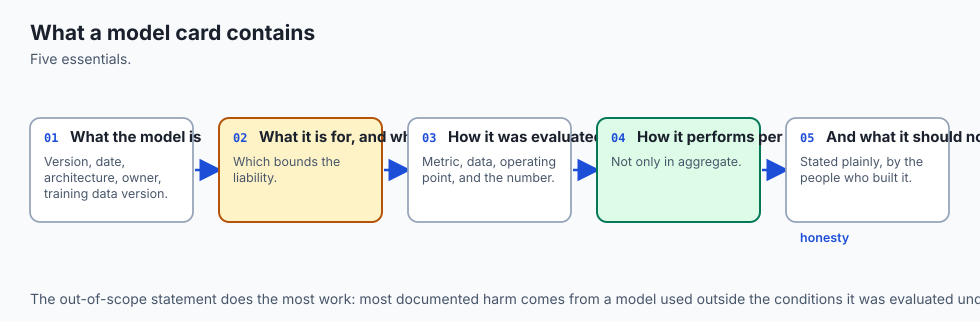

Think of the **Nutritional Facts & Warning Label on a box of pharmaceutical medication**:

- It does not just say: *"This pill makes 90% of people feel better."*
- It provides precise, structured specifications:
  1. **Active Ingredients & Dosage:** The exact chemical formulation (**Model Architecture & Hyperparameters**).
  2. **Intended Use:** Treats acute migraine headaches in adults (**Primary Intended Use**).
  3. **Contraindications & Warnings:** Do *NOT* take if pregnant, under 12 years old, or taking blood thinners (**Out-of-Scope & Prohibited Uses**).
  4. **Clinical Trial Results:** Efficacy broken down across age groups, biological sexes, and medical conditions (**Quantitative Analyses across Subgroups**).
  5. **Expiration Date & Storage:** Store below 25°C; discard after 2 years (**Model Freshness & Retraining Criteria**).

A Model Card is the pharmaceutical label for your machine learning model. It guarantees that anyone who deploys, audits, or interacts with the model understands its exact safety boundaries.

---

## Historical background

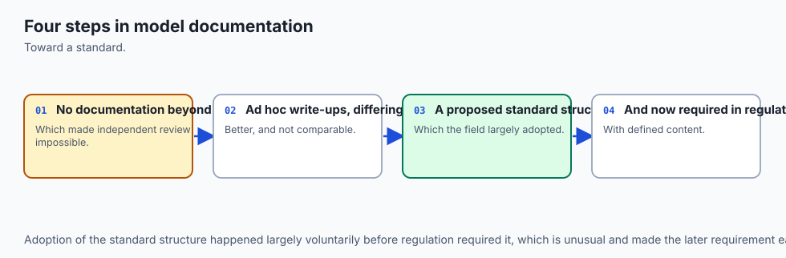

The formalization of transparent machine learning reporting emerged from ethical AI research and international regulatory statutes:

1. **2018 (Gebru et al. - Datasheets for Datasets):** Introduced standardized documentation for training datasets, documenting dataset provenance, sampling methodology, and known demographic imbalances.
2. **2019 (Mitchell et al. - Model Cards for Model Reporting):** Published at ACM FAT* (Fairness, Accountability, and Transparency), establishing the canonical 9-section Model Card architecture.
3. **2021 (NYC Local Law 144):** Mandated that automated employment decision tools (AEDTs) undergo independent annual bias audits and publish publicly accessible audit summaries.
4. **2024 (The European Union Artificial Intelligence Act):** Codified strict technical documentation mandates (Article 11 & Annex IV) requiring comprehensive model specifications, performance metrics across demographic slices, and risk management documentation for all High-Risk AI deployments.

Today, Model Cards are standard artifacts generated by Google Vertex AI, Hugging Face Hub, MLflow, and AWS SageMaker.

---

## What it is — and what it is not

Let us establish precise definitions:

### What it IS:
- **A Standardized Technical & Ethical Document:** A structured report following the 9 canonical sections of Mitchell et al. (2019).
- **A Living Version-Controlled Artifact:** Directly tied to a specific model version, Git commit hash, and Model Registry artifact URI.
- **A Multi-Stakeholder Communication Tool:** Written clearly enough for compliance officers and executives, while containing the mathematical rigor required by data scientists.

### What it is NOT:
- **Not Marketing Propaganda:** A Model Card is an objective engineering audit. It must highlight failure modes, limitations, and drop-offs in performance.
- **Not a Code Docstring:** Code docstrings explain function arguments; Model Cards explain statistical behavior, societal impact, and domain safety limits.
- **Not an Optional Luxury:** In regulated industries (banking, healthcare, hiring, public sector), an uncertified model without a Model Card cannot legally be deployed.

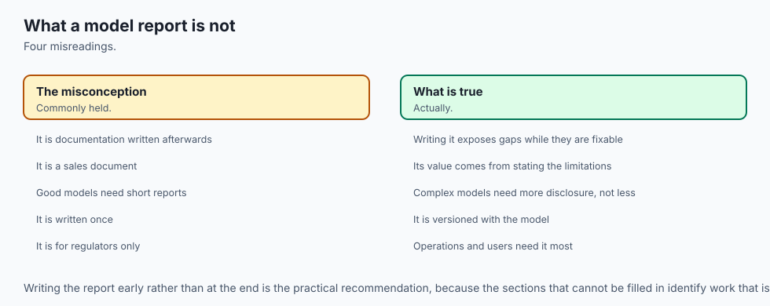

---


## Why it was created and what problems it solves

Writing a Model Report was created to resolve fundamental diagnostic and operational bottlenecks in machine learning pipelines.


## How it works

Let us trace the algorithmic and procedural execution flow step by step.

## The 9 Canonical Sections of an Enterprise Model Card

Let us deconstruct the complete 9-section architecture formulated by Mitchell et al. (2019):

```
┌────────────────────────────────────────────────────────────────────────┐
│                   THE 9 CANONICAL MODEL CARD SECTIONS                  │
├────────────────────────────────┬───────────────────────────────────────┤
│ 1. Model Details               │ Architecture, version, date, license  │
│ 2. Intended Use                │ Primary uses & PROHIBITED use cases   │
│ 3. Factors & Demographic Slices│ Subgroups, environments, devices      │
│ 4. Metrics & Baselines         │ Decision thresholds & baseline lift   │
│ 5. Evaluation Data             │ Validation split & purge methodology  │
│ 6. Training Data               │ Ingestion filters & feature lineage   │
│ 7. Quantitative Analyses       │ Subgroup slices & fairness audits     │
│ 8. Ethical Considerations      │ Proxy safeguards & human escalations  │
│ 9. Caveats & Recommendations   │ Known failure modes & drift triggers  │
└────────────────────────────────┴───────────────────────────────────────┘
```

---

### Section 1: Model Details
- **Model Name & Version:** E.g. `FraudDetector-GBDT-v2.3.0`.
- **Developer / Team:** E.g. `Payments Risk Engineering Team`.
- **Release Date & Git Commit Hash:** Traceable to reproducible source code.
- **Model Architecture & Framework:** E.g. `XGBoost v2.0.3 with Sigmoid Calibration`.
- **License & Contact:** E.g. `Proprietary / model-governance@company.com`.

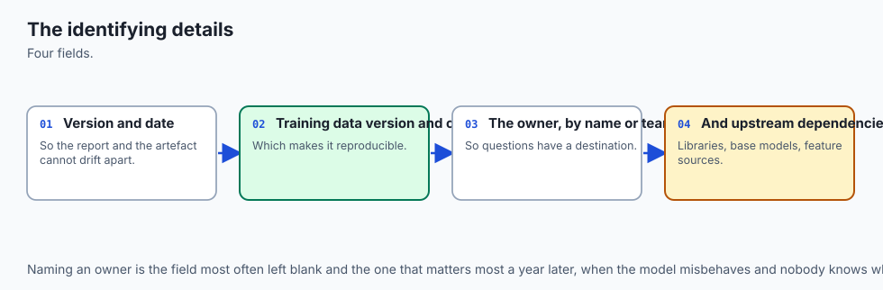

---

### Section 2: Intended Use
- **Primary Intended Uses:** Explicit operational tasks (e.g. "Real-time payment transaction fraud classification for web checkout amounts between `5 and `5,000").
- **Target User Personas:** E.g. "Automated rule engines and Level-2 fraud investigation analysts".
- **Out-of-Scope & Prohibited Uses (CRITICAL):**
  - Explicitly states where the model must NEVER be used (e.g. *"Prohibited for credit limit decisions, employee monitoring, or international cross-border wire transfers"*).

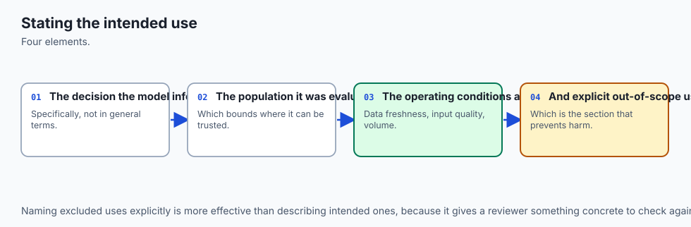

---

### Section 3: Factors & Demographic Subgroups
- **Demographic Slices:** Age brackets, biological sex, geographic regions, language dialects.
- **Environmental Factors:** Mobile vs Desktop, operating systems, network latency conditions.

---

### Section 4: Metrics & Evaluation Setup
- **Optimization & Evaluation Metrics:** E.g. Precision-Recall AUC (PR-AUC), Matthew Correlation Coefficient (MCC), Brier Score.
- **Decision Threshold Calibration:** E.g. *"Decision threshold fixed at `T=0.38` to guarantee 90% Recall at maximum expected business value"*.
- **Baseline Comparison:** Demonstrates statistically significant lift over Tier 1 Dummy, Tier 2 Heuristic, and Tier 3 Linear baselines.

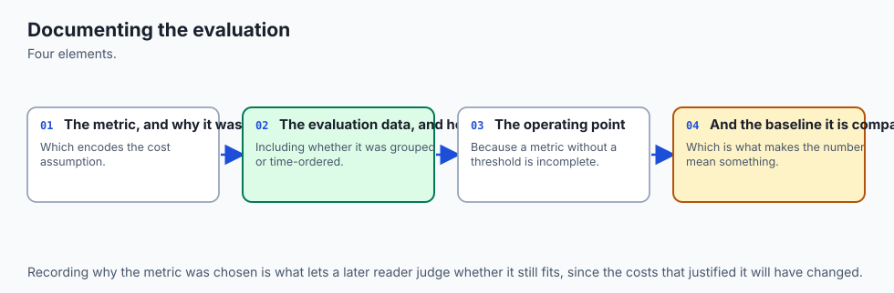

---

### Section 5 & 6: Evaluation Data & Training Data
- **Dataset Provenance & Sample Counts:** Source databases, date ranges, and row counts.
- **Data Splitting Methodology:** Proves that `GroupKFold` or `TimeSeriesSplit` was enforced without data leakage.
- **Data Cleaning & Ingestion Filters:** Imputation strategies, outlier capping, and feature transformation pipelines.

---

### Section 7: Quantitative Analyses across Subgroup Slices
A mandatory performance scorecard broken down across operational and demographic subsets:

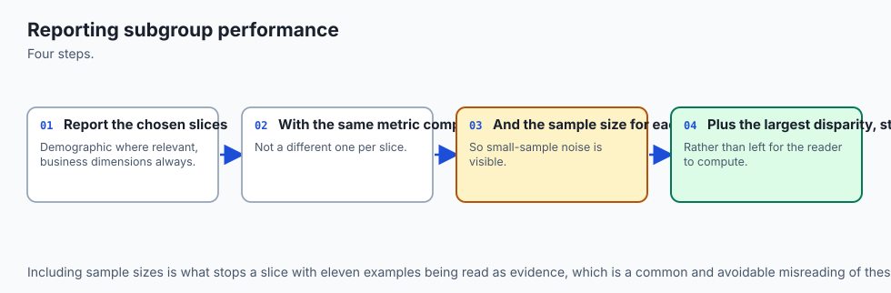

| Subgroup Cohort | Validation Count | PR-AUC | Error Rate | Disparate Impact Ratio |
| --- | --- | --- | --- | --- |
| **Overall Dataset** | 50,000 | 0.884 | 4.2% | 1.00 (Reference) |
| **Region: North America** | 30,000 | 0.895 | 3.8% | 0.98 |
| **Region: Europe (EU)** | 15,000 | 0.872 | 4.6% | 0.95 |
| **Region: APAC** | 5,000 | 0.820 | 7.1% | 0.86 (Watchlist) |

---

### Section 8: Ethical Considerations & Risk Mitigations
- **Proxy Discrimination Safeguards:** Documents that zip codes and demographic proxies were audited.
- **PII & Data Privacy:** Confirms that training data was anonymized and differential privacy was applied.
- **Human-in-the-Loop Escalation:** Defines when low-confidence predictions (`0.40 < p &lt; 0.60`) are routed to human review.

---

### Section 9: Caveats and Recommendations
- **Operational Degradation Triggers:** When macroeconomic conditions drift (e.g. inflation `> 6\%`).
- **Mandatory Retraining Schedule:** E.g. *"Model must be retrained every 90 days or if input feature drift (PSI) exceeds 0.20"*.

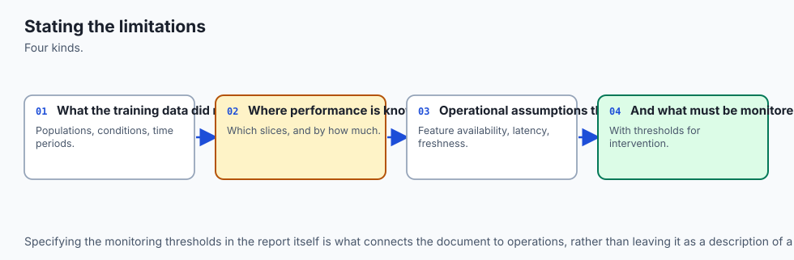

---

## An everyday analogy

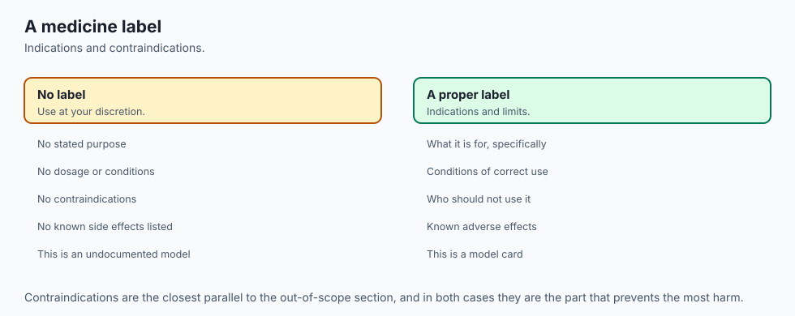

Think of an **Aviation Pilot's Flight Manual for a Boeing 787 Dreamliner**:

1. **Section 1 (Aircraft Details):** Twin-engine wide-body jet, General Electric GEnx engines.
2. **Section 2 (Operating Envelope):** Certified for commercial passenger transport up to 43,000 feet.
3. **Out-of-Scope Warning:** *NEVER exceed Mach 0.90; NEVER attempt aerobatic maneuvers.*
4. **Section 7 (Performance in Slices):** Takeoff distance in dry weather (8,000 ft) vs wet runway (10,500 ft) vs high-altitude airport (12,000 ft).
5. **Section 9 (Emergency Protocols):** Mandatory engine inspection every 500 flight hours.

No pilot would fly an aircraft without this manual. No engineering team should deploy an AI model without a Model Card.

---

## Examples in practice

Let us visualize the 9 Canonical Sections of an Enterprise Model Card:

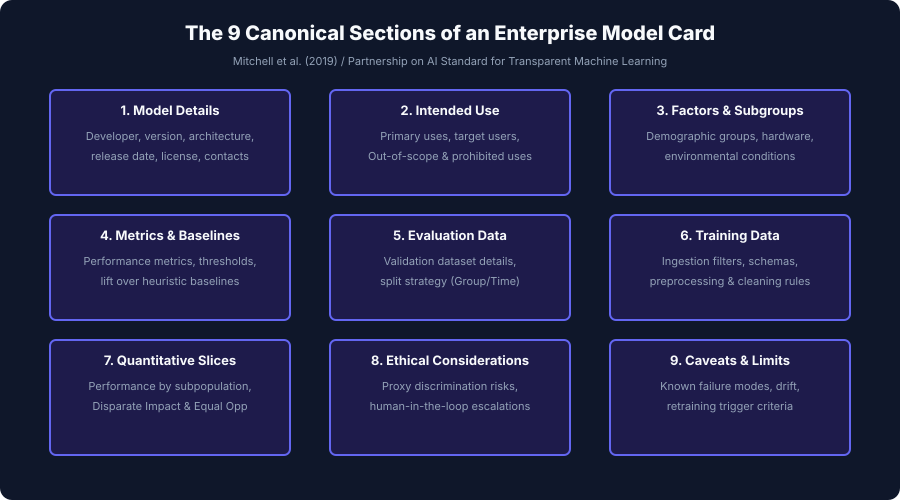

Below is the automated CI/CD governance workflow compiling and validating Model Cards:

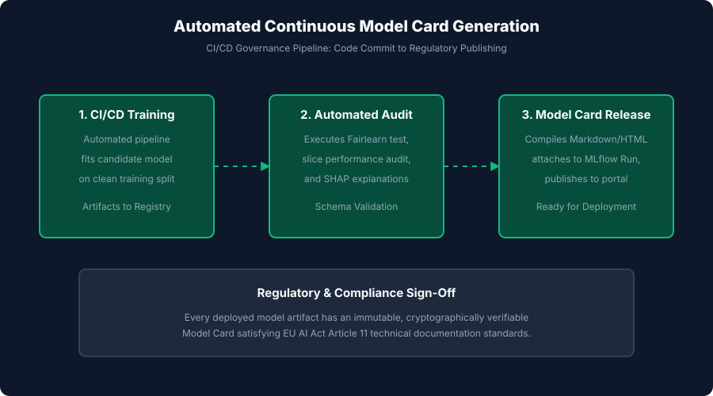

Let us examine real Python code implementing automated Model Card validation and Markdown rendering:

```python
import json

def generate_production_model_card(card_spec):
    # Verify mandatory sections
    required = [
        "model_details", "intended_use", "factors", "metrics",
        "evaluation_data", "training_data", "quantitative_analyses",
        "ethical_considerations", "caveats_and_recommendations"
    ]
    for req in required:
        if req not in card_spec:
            raise ValueError(f"Missing mandatory Model Card section: '{req}'")
            
    # Check out-of-scope declarations
    if not card_spec["intended_use"].get("out_of_scope_uses"):
        raise ValueError("Model Card MUST specify out-of-scope uses!")
        
    print(f"✅ Model Card for '{card_spec['model_details']['name']}' successfully validated.")
    
    # Render Markdown
    md = f'''# Model Card: {card_spec['model_details']['name']} (v{card_spec['model_details']['version']})

## 1. Model Details
- **Architecture:** {card_spec['model_details']['architecture']}
- **Developer:** {card_spec['model_details']['developer']} ({card_spec['model_details']['contact']})
- **Release Date:** {card_spec['model_details']['date']}

## 2. Intended Use
### Primary Use Cases
{chr(10).join(f"- {u}" for u in card_spec['intended_use']['primary_uses'])}

### Out-of-Scope & Prohibited Uses
{chr(10).join(f"- ⚠️ {u}" for u in card_spec['intended_use']['out_of_scope_uses'])}

## 3. Quantitative Slices & Performance
- **Primary Metric:** {card_spec['metrics']['primary_metric']}
- **Baseline Lift:** {card_spec['metrics']['baseline_summary']}

| Slice | Sample Count | Performance Metric | Error Rate |
| --- | --- | --- | --- |
'''
    for s in card_spec["quantitative_analyses"]["slices"]:
        md += f"| {s['slice']} | {s['count']} | {s['metric']} | {s['error_rate']} |\\n"
        
    md += f'''
## 4. Ethical Considerations & Governance
{chr(10).join(f"- {e}" for e in card_spec['ethical_considerations'])}

## 5. Caveats & Retraining Triggers
{chr(10).join(f"- {c}" for c in card_spec['caveats_and_recommendations'])}
'''
    return md


# Test Specification
spec = {
    "model_details": {
        "name": "ClinicalPneumoniaClassifier",
        "version": "1.0.4",
        "architecture": "DenseNet-121 with Temperature Scaling",
        "developer": "Healthcare AI Diagnostics Group",
        "date": "2026-08-29",
        "contact": "ai-safety@hospital.org"
    },
    "intended_use": {
        "primary_uses": ["Assisting radiologists in triaging adult ER chest X-rays for acute pneumonia."],
        "out_of_scope_uses": [
            "Autonomous diagnosis without radiologist review.",
            "Pediatric patients (< 18 years old).",
            "Inpatient ICU monitoring."
        ]
    },
    "factors": {"demographics": ["Age", "Sex"], "environments": ["Emergency Room GE & Philips X-Ray Units"]},
    "metrics": {
        "primary_metric": "ROC-AUC: 0.932 | Sensitivity at 95% Specificity: 0.884",
        "baseline_summary": "Beats legacy CR-Score heuristic by +0.12 ROC-AUC"
    },
    "evaluation_data": {"name": "Multi-Center ER Holdout 2025", "sample_count": "10,000", "split_strategy": "Patient GroupKFold"},
    "training_data": {"name": "De-identified National Chest Consortium", "sample_count": "150,000", "filters": "Adult erect PA scans only"},
    "quantitative_analyses": {
        "slices": [
            {"slice": "Age 18-49", "count": "4500", "metric": "0.941 ROC-AUC", "error_rate": "4.1%"},
            {"slice": "Age 50-69", "count": "3800", "metric": "0.930 ROC-AUC", "error_rate": "5.2%"},
            {"slice": "Age 70+", "count": "1700", "metric": "0.912 ROC-AUC", "error_rate": "7.8%"}
        ],
        "fairness": {"disparate_impact_ratio": "0.96", "equal_opportunity_difference": "0.02"}
    },
    "ethical_considerations": [
        "Model serves as second-reader advisory tool; human radiologist holds final legal sign-off.",
        "Scans from portable ICU beds are excluded to prevent Clever Hans hospital-ward leakage."
    ],
    "caveats_and_recommendations": [
        "Performance drops if image resolution is below 1024x1024.",
        "Mandatory annual model audit and recalibration against local epidemiological drift."
    ]
}

card_markdown = generate_production_model_card(spec)
print("\n=== Generated Model Card Preview ===")
print(card_markdown[:500] + "\n...")
```

---

## Implications: security, privacy, performance, scalability, and cost

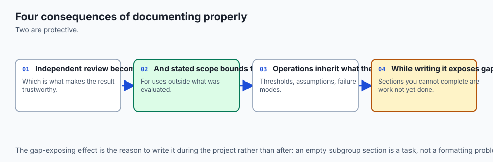

| Dimension | Characteristic | Practical Implication |
| --- | --- | --- |
| **Legal & Regulatory Penalties** | Non-compliance with EU AI Act Article 11. | Shipping an uncertified High-Risk AI system without structured Model Card documentation carries statutory fines up to €35M. |
| **Product Liability & Misuse** | Explicit Out-of-Scope declarations. | Defining prohibited uses provides legal defense against customer claims if the model is misapplied to untested populations. |
| **Automated Documentation CI/CD** | Pipeline execution speed. | Automated Model Card compilation takes `&lt; 500` ms and creates permanent audit logs attached to every production release. |
| **Data Privacy & IP Exposure** | Scrubbing sensitive information. | Ensure proprietary database connection strings and raw patient identifiers are never exported into public-facing Model Cards. |

---

## Alternatives: free, open source, and commercial

| Tool / Framework | Architecture | Best Used For |
| --- | --- | --- |
| **`Hugging Face Model Cards`** | Standardized YAML frontmatter + Markdown | Open-source model repository documentation and community transparency. |
| **`Google Vertex AI Model Cards`** | Cloud-native automated governance tool | Generating and managing Model Cards inside Google Cloud enterprise deployments. |
| **`MLflow Model Registry`** | MLOps artifact management | Attaching versioned Model Cards and evaluation metrics to trained model weights. |
| **`Sphinx` / `MkDocs`** | Static documentation generators | Compiling internal model governance portals and PDF compliance binders. |

---

## Comparison with related concepts

| Documentation Artifact | Target Audience | Primary Focus | Regulatory Status |
| --- | --- | --- | --- |
| **Model Card** | Engineers, Auditors, Regulators | Model behavior, slices, fairness, limits | Mandatory (EU AI Act, ECOA) |
| **Datasheet for Datasets** | Data Engineers, Researchers | Dataset provenance, sampling, bias | Best practice standard |
| **API Docstrings** | Software Developers | Function signatures, types, exceptions | Software engineering standard |
| **System Architecture Doc** | DevOps / Cloud Architects | Infrastructure, throughput, latency | SRE standard |

---

## When to use it — and when not to

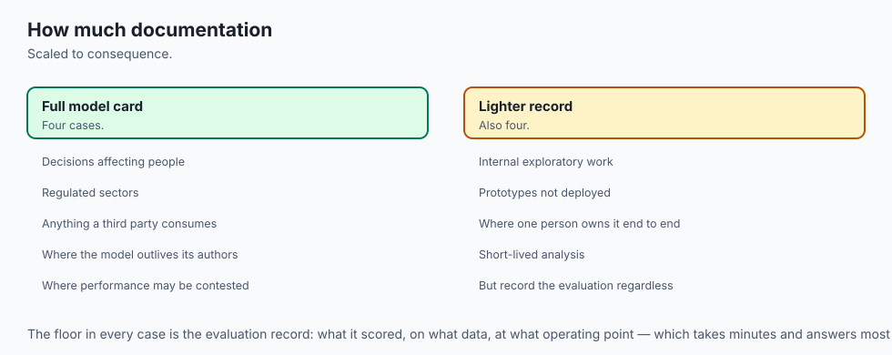

### When to AUTHOR a Model Card:
- **Every Machine Learning Model Promoted to Production:** No model should be deployed to live traffic without a signed Model Card.
- **High-Risk Regulatory Systems:** Healthcare, banking, employment, criminal justice, autonomous systems.
- **Open-Source Model Releases:** Providing downstream developers with clear usage and safety guidelines.

---

## The AI connection

- **A model that cannot be explained in writing cannot be deployed responsibly**, and
  increasingly cannot be deployed legally.
- **The model card is now a standard artefact**, expected by auditors, regulators and
  procurement alike.
- **Stating the intended use bounds the liability** — most harm comes from use outside what
  was evaluated.
- **Documenting the training data is where most disclosure obligations land**, and it is the
  section teams find hardest.
- **The same documentation practice extends to AI systems**, where model and system cards
  serve exactly this purpose.

## Knowledge check

1. **Mitchell et al. (2019):** Established the 9 canonical sections of modern Model Cards.
2. **Out-of-Scope Uses:** Protects organizations by explicitly forbidding dangerous and untested deployment domains.
3. **Quantitative Slices:** Documents model performance broken down across demographic and operational subgroups.
4. **EU AI Act Article 11:** Mandates comprehensive technical documentation for all high-risk AI deployments.

---

## Hands-on exercise

In this hands-on exercise, you will implement a Model Card validator that checks for mandatory sections, verifies out-of-scope declarations, and renders a clean Markdown report.

```python
# Step 1: Implement Schema Validator
def check_model_card(card):
    required = ["name", "version", "intended_use", "out_of_scope", "slices"]
    missing = [k for k in required if k not in card or not card[k]]
    return len(missing) == 0, missing

# Step 2: Test on Sample Spec
sample_spec = {
    "name": "CustomerSupportClassifier",
    "version": "1.1.0",
    "intended_use": ["Categorizing English support tickets into Billing vs Tech Support"],
    "out_of_scope": ["Processing financial transactions directly", "Non-English languages"],
    "slices": [{"slice": "Billing", "accuracy": "94.2%"}, {"slice": "Tech", "accuracy": "91.8%"}]
}

is_valid, missing_keys = check_model_card(sample_spec)
print("=== Model Card Validation ===")
print(f"Validation Status: {'PASS' if is_valid else 'FAIL'}")
if is_valid:
    print(f"Model: {sample_spec['name']} v{sample_spec['version']}")
    print(f"Prohibited Uses: {', '.join(sample_spec['out_of_scope'])}")
```

### Expected output

```text
=== Model Card Validation ===
Validation Status: PASS
Model: CustomerSupportClassifier v1.1.0
Prohibited Uses: Processing financial transactions directly, Non-English languages
```

### Validate your work

1. Confirm that removing `out_of_scope` causes the validator to return `FAIL`.
2. Test that adding a new demographic slice correctly updates the Markdown table.
3. Verify that all 9 Mitchell sections are represented in your production reporting template.

### Troubleshooting

- **`Missing Out-of-Scope Section`:** Never leave this empty; if no prohibited domains exist, explicitly state why.
- **`Markdown Table Formatting Errors`:** Ensure all pipe separators `|` have matching column counts across header and row lines.

### Common mistakes

1. **Omitting Negative Results:** Hiding low-performing slices destroys auditor trust and creates regulatory exposure.
2. **Treating Model Cards as Static Text:** Automate Model Card generation in CI/CD so documentation never falls out of sync with code.

---

## Practice assignment

1. **Build a Model Card CI/CD GitHub Action:**
   Write a GitHub workflow `.github/workflows/model_card.yml` that executes automated slice tests and generates an updated `MODEL_CARD.md` upon every merge to `main`.

2. **Implement an Interactive HTML Model Card Viewer:**
   Build a single-page HTML/CSS application that renders interactive slice charts and collapsible warning callouts for enterprise stakeholders.

---

## Extension challenge

Build an **Enterprise Model Governance & Compliance Publishing Suite**:

1. Ingest model evaluation results from MLflow or Weights & Biases.
2. Automatically validate compliance against the **EU AI Act Annex IV** and **Mitchell et al. (2019)** standards.
3. Generate a multi-format documentation package:
   - Standalone GitHub-flavored Markdown `MODEL_CARD.md`.
   - Beautiful responsive HTML report with embedded SVG slice charts.
   - Machine-readable JSON schema for enterprise regulatory registries.
4. Cryptographically sign the Model Card with the deployment commit hash.
