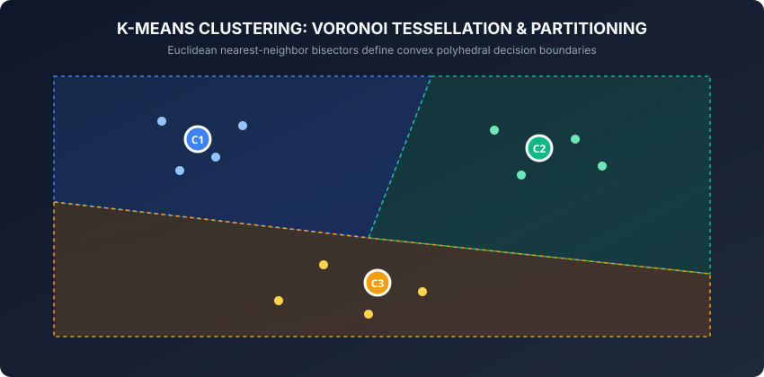
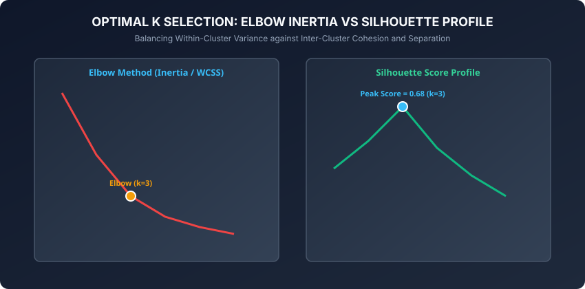

In the previous weeks of our curriculum, we explored supervised learning in depth. In supervised learning, every training observation is accompanied by a ground-truth label or continuous target variable. The objective of the learning algorithm is to discover an optimal mapping function from input features to target outputs.

However, in the vast majority of real-world enterprise applications, data arrives unlabeled. Millions of customer transactions, billions of server log messages, vast collections of medical images, and high-frequency financial telemetry streams exist without explicit human annotations. 

**Unsupervised learning** addresses this fundamental challenge by uncovering latent structure, natural groupings, and geometric patterns directly from unlabeled feature distributions. 

At the very core of unsupervised learning lies **clustering**, and no clustering algorithm is more foundational, widely deployed, or conceptually elegant than **K-Means**.

Today, we dive deep into the mathematical foundations, optimization mechanics, algorithmic trade-offs, and production realities of K-Means clustering.

---

## Why this matters

Clustering forms the foundational backbone of modern automated analytics and unsupervised feature representation:

1. **Customer Segmentation and Targeted Marketing:** Modern e-commerce platforms like Amazon and Shopify group millions of shoppers into distinct behavioral cohorts based on purchase history, browsing frequency, and recency, enabling tailored recommendation campaigns and personalized pricing.
2. **Genomic Sequence Analysis and Bioinformatics:** Computational biologists cluster gene expression profiles across thousands of cellular conditions to discover co-regulated functional pathways and identify novel cancer subtypes without prior clinical labels.
3. **Image Compression and Vector Quantization:** In computer vision and graphics pipelines, color quantization replaces millions of distinct 24-bit RGB pixel colors with a compact palette of K representative centroid vectors, drastically shrinking image storage sizes with minimal perceptual degradation.
4. **Anomaly Detection and Security Telemetry:** Cybersecurity systems cluster network packet telemetry to establish baseline profiles of nominal enterprise traffic. Observations that fall far outside all cluster Voronoi hulls are immediately flagged for human security inspection.
5. **Semi-Supervised Pretext Task Representation:** Clustering unlabelled data creates pseudo-labels that initialize deep representation backbones, accelerating downstream supervised fine-tuning when labeled samples are scarce.

---

## The idea in plain language

Imagine a sprawling festival fairground viewed from a high-altitude drone at night. Thousands of attendees carrying glowing flashlights are wandering across the fields. 

From above, you notice that the lights are not scattered uniformly. Instead, they naturally gather into three distinct glowing crowds:
- One crowd is packed tightly around the main music stage.
- A second crowd is browsing food stalls along the northern edge.
- A third crowd is resting around a bonfire in the open meadow.

How would an algorithm mathematically identify the centers of these three crowds and determine which attendee belongs to which group?

1. **Step 1 (Centroid Guess):** The algorithm places three glowing beacon towers at random spots across the festival grounds.
2. **Step 2 (Assignment / Expectation):** Every attendee looks around, finds whichever beacon tower is closest to them in physical walking distance, and takes a colored badge matching that beacon.
3. **Step 3 (Update / Maximization):** Each beacon tower flies up into the air, computes the exact geographical average position (center of mass) of all attendees wearing its badge, and moves to that new center.
4. **Step 4 (Iteration):** The attendees look at the updated beacon positions, re-evaluate which tower is closest, and swap badges if necessary. The beacons relocate to the new centers of mass.

This alternating cycle repeats until the beacons stop moving and no attendee needs to swap badges. The festival has been partitioned into three distinct clusters.

This intuitive iterative procedure is known as **Lloyd's Algorithm**.

---

## Historical background

The intellectual development of K-Means spans several decades across signal processing, mathematical statistics, and computer science:

1. **1957 (Stuart Lloyd):** Stuart Lloyd at Bell Laboratories developed the core alternating minimization algorithm as a pulse-code modulation (PCM) technique for scalar quantization in telecommunications. Lloyd's internal Bell Labs memorandum was widely circulated among engineers for decades before its formal publication in the IEEE Transactions on Information Theory in 1982.
2. **1965 (Edward W. Forgy):** Independently developed an almost identical batch minimization method for partitioning multivariate observations, leading many statistical texts to refer to the procedure as the *Lloyd-Forgy Algorithm*.
3. **1967 (James MacQueen):** Formally coined the term **k-means** in his landmark paper, *Some Methods for Classification and Analysis of Multivariate Observations*, presented at the 5th Berkeley Symposium on Mathematical Statistics and Probability. MacQueen introduced sequential online updates where centroids update immediately after processing each observation.
4. **2007 (David Arthur and Sergei Vassilvitskii):** Published **k-means++**, introducing distance-squared probabilistic seeding and proving an O(log k) approximation guarantee, resolving K-Means' long-standing sensitivity to poor random starts.

---

## What it is — and what it is not

To deploy K-Means effectively, one must understand both its mathematical definition and its clear boundaries.

### What K-Means IS:
- **A Partitional Clustering Algorithm:** It divides N observations into exactly K non-overlapping, exhaustive subsets.
- **A Centroid-Based Model:** Every cluster is parameterized by a single representative mean vector in feature space.
- **A Coordinate Descent Heuristic:** It guarantees local convergence to a stationary point of the Within-Cluster Sum of Squares (WCSS) objective.
- **A Hard Clustering Method:** Each data point is assigned deterministically to exactly one cluster with 100% confidence.

### What K-Means is NOT:
- **Not a Density-Based Clustering Algorithm:** It cannot identify clusters of arbitrary non-convex geometries (like concentric rings or intertwined spirals). For those, density algorithms like DBSCAN are required.
- **Not a Hierarchical Method:** It does not produce a nested tree of sub-clusters (dendrogram).
- **Not Robust to Unequal Cluster Sizes and Anisotropic Covariances:** It assumes all clusters are roughly spherical with equal isotropic variance.
- **Not an Automatic Estimator of K:** The practitioner must specify the number of clusters K upfront prior to execution.

---

## Why it was created and what problems it solves

Prior to partitional clustering, statistical grouping relied on exhaustive combinatorial enumeration or pairwise distance matrix decomposition:
- Exhaustively checking all possible partitions of N items into K groups requires evaluating Stirling numbers of the second kind, which exceeds the number of atoms in the observable universe for even N = 50.
- All-pairs distance calculations require quadratic space O(N^2) and cubic computation time O(N^3), making large-scale data processing impossible.

K-Means solved this computational bottleneck by introducing an alternating iterative heuristic that executes in linear time O(N * K * D * I) per iteration, requiring only linear memory O(N * D) to store data coordinates. This enabled data scientists to cluster datasets containing millions of observations.

---

## How it works

Let us now examine the formal mathematical mechanics of K-Means, Lloyd's algorithm, Voronoi partitioning, and the k-means++ initialization scheme.

### 1. The Mathematical Objective: Within-Cluster Sum of Squares (WCSS)



Given a dataset X = (x_1, x_2, ..., x_N) of N observations in D-dimensional real space R^D, our goal is to partition X into K disjoint subsets C = (C_1, C_2, ..., C_K) such that:

```
Union of C_k (k=1 to K) = X  and  C_j intersect C_k = empty_set for all j != k
```

The clustering quality is quantified by the **Within-Cluster Sum of Squares (WCSS)**, also termed **Inertia** or the **Distortion Function** J:

```
J(C, mu) = sum_{k=1}^K sum_{x_i in C_k} ||x_i - mu_k||^2
```

where mu_k is the geometric centroid of cluster C_k:

```
mu_k = (1 / |C_k|) sum_{x_i in C_k} x_i
```

The objective is to find the partition C* and centroids mu* that minimize J:

```
arg min_{C, mu} J(C, mu)
```

Minimizing this objective is known to be NP-hard in general Euclidean metric spaces even for K = 2. Therefore, we use Lloyd's alternating expectation-maximization heuristic.

---

### 2. Lloyd's Coordinate Descent Algorithm

Lloyd's algorithm alternates between two decoupled optimization steps until convergence:

#### Step 1: The Assignment Step (Expectation / E-Step)
Holding the centroids mu_1, ..., mu_K fixed, assign each observation x_i to its closest centroid in Euclidean distance:

```
C_k^{(t)} = { x_i : ||x_i - mu_k^{(t)}||^2 <= ||x_i - mu_j^{(t)}||^2 for all j = 1, ..., K }
```

Geometrically, this assignment partitions the continuous feature space into a **Voronoi Tessellation**, where cell boundaries are perpendicular bisector hyperplanes between centroid pairs.

#### Step 2: The Update Step (Maximization / M-Step)
Holding the cluster assignments C_k fixed, update each centroid to be the arithmetic mean of all data points currently assigned to that cluster:

```
mu_k^{(t+1)} = (1 / |C_k^{(t)}|) sum_{x_i in C_k^{(t)}} x_i
```

#### Convergence Guarantee:
Because the objective function J is strictly non-increasing at each assignment and update step, and because there are only a finite number (K^N) of possible partitions, **Lloyd's algorithm is guaranteed to converge to a local minimum** in a finite number of iterations.

---

### 3. k-means++ Distance-Squared Seeding

Standard K-Means originally initialized centroids by choosing K points uniformly at random from X. If two initial centroids happen to land near the same true cluster, the algorithm gets trapped in a poor local minimum.

In 2007, David Arthur and Sergei Vassilvitskii introduced **k-means++**, which distributes initial centroids across the dataset using distance-weighted probability:

```text
┌────────────────────────────────────────────────────────────────────────┐
│                   K-MEANS++ INITIALIZATION PROTOCOL                    │
├────────────────────────────────────────────────────────────────────────┤
│ 1. Choose first center mu_1 uniformly at random from dataset X.        │
│ 2. For each data point x in X, compute shortest distance D(x) to any   │
│    already chosen centroid: D(x) = min_{j=1..k} ||x - mu_j||           │
│ 3. Choose the next centroid mu_{k+1} from X with probability:          │
│         P(x) = D(x)^2 / sum_{x' in X} D(x')^2                          │
│ 4. Repeat steps 2 and 3 until exactly K centroids have been selected.  │
└────────────────────────────────────────────────────────────────────────┘
```

**Theoretical Guarantee:** k-means++ guarantees that the expected inertia of the converged solution is within O(log K) of the global optimum:

```
E[J_kmeans++] <= 8 * (ln K + 2) * J_optimal
```

---

### 4. Selecting the Optimal Number of Clusters K



Because K-Means cannot determine K autonomously, practitioners rely on two quantitative diagnostic tools:

#### A. The Elbow Method (Inertia Curve)
Plot WCSS inertia as a function of K. As K increases from 1 to N, inertia monotonically decreases to 0. The optimal K is the "elbow point" where the rate of decrease drops sharply (diminishing marginal returns).

#### B. Silhouette Analysis (Peter Rousseeuw, 1987)
For each data point i:
1. Compute mean intra-cluster distance a(i) to all other points in its own cluster.
2. Compute mean nearest-cluster distance b(i) to points in the closest neighboring cluster.
3. Compute the **Silhouette Coefficient** s(i):

```
s(i) = (b(i) - a(i)) / max(a(i), b(i))
```

- `s(i) close to +1.0`: Sample is well-clustered and far from neighboring clusters.
- `s(i) close to 0.0`: Sample lies on the decision boundary between clusters.
- `s(i) < 0.0`: Sample is misassigned and closer to a neighboring cluster centroid.

The mean Silhouette score across all samples peaks at the optimal cluster count K*.

---

## An everyday analogy

Think of a telecommunications company planning where to build 4 new 5G cell towers in a metropolitan region:
- If they place all 4 towers in the downtown business district, downtown residents have blazing speeds, but suburban residents have zero signal.
- The company's goal is to minimize the total transmission distance from every smartphone to its closest cell tower.
- **Lloyd's Algorithm in Action:**
  1. The company erects 4 temporary tower locations.
  2. Every smartphone in the city connects to whichever tower has the strongest signal.
  3. City engineers compute the geographical center of all connected phones for each tower.
  4. The towers are relocated to those new population centers.
  5. The cycle repeats until the towers reside at optimal central crossroads.

---

## Examples in practice

Let us inspect a complete, modular, pure NumPy implementation of K-Means with k-means++ initialization:

```python
import numpy as np

class KMeansFromScratch:
    def __init__(self, n_clusters=3, max_iter=300, tol=1e-4, init='k-means++', random_state=42):
        self.n_clusters = n_clusters
        self.max_iter = max_iter
        self.tol = tol
        self.init = init
        self.random_state = random_state
        self.cluster_centers_ = None
        self.inertia_ = None

    def _init_centroids(self, X, rng):
        n_samples, n_features = X.shape
        if self.init == 'random':
            indices = rng.choice(n_samples, size=self.n_clusters, replace=False)
            return X[indices].copy()

        centers = np.empty((self.n_clusters, n_features))
        first_idx = rng.integers(0, n_samples)
        centers[0] = X[first_idx]

        for k in range(1, self.n_clusters):
            dists = np.min(np.linalg.norm(X[:, np.newaxis, :] - centers[:k, np.newaxis, :], axis=2)**2, axis=0)
            probs = dists / np.sum(dists)
            next_idx = rng.choice(n_samples, p=probs)
            centers[k] = X[next_idx]

        return centers

    def fit(self, X):
        rng = np.random.default_rng(self.random_state)
        self.cluster_centers_ = self._init_centroids(X, rng)

        for iteration in range(self.max_iter):
            # Expectation step: assign to nearest centroid
            dists = np.linalg.norm(X[:, np.newaxis, :] - self.cluster_centers_[np.newaxis, :, :], axis=2)
            labels = np.argmin(dists, axis=1)

            # Maximization step: compute new center of mass
            new_centers = np.zeros_like(self.cluster_centers_)
            for k in range(self.n_clusters):
                mask = labels == k
                if np.sum(mask) > 0:
                    new_centers[k] = np.mean(X[mask], axis=0)
                else:
                    new_centers[k] = X[rng.integers(0, len(X))]

            shift = np.linalg.norm(self.cluster_centers_ - new_centers)
            self.cluster_centers_ = new_centers
            if shift < self.tol:
                break

        dists = np.linalg.norm(X[:, np.newaxis, :] - self.cluster_centers_[np.newaxis, :, :], axis=2)
        labels = np.argmin(dists, axis=1)
        min_dists = np.min(dists, axis=1)
        self.inertia_ = float(np.sum(min_dists**2))
        return self

    def predict(self, X):
        dists = np.linalg.norm(X[:, np.newaxis, :] - self.cluster_centers_[np.newaxis, :, :], axis=2)
        return np.argmin(dists, axis=1)
```

---

## Implications: security, privacy, performance, scalability, and cost

1. **Computational Complexity and Scaling:**
   - Standard batch K-Means has time complexity O(N * K * D * I) where N is sample count, K is cluster count, D is feature dimensionality, and I is iterations.
   - For web-scale datasets (N &gt; 10,000,000), **Mini-Batch K-Means** sub-samples batches of size b = 1024, achieving linear streaming execution with minimal RAM footprint.
2. **Feature Scaling Sensitivity:**
   - Because Euclidean distance treats all dimensions equally, unscaled features will corrupt cluster boundaries. If Income ranges from $10,000 to $1,000,000 while Age ranges from 18 to 80, Income will account for 99.99% of distance variance. **Always apply `StandardScaler` prior to K-Means.**
3. **Data Privacy and Centroid Reconstruction:**
   - In federated or multi-tenant analytics, sharing cluster centroids can leak confidential outlier data if a cluster contains only 1 or 2 unique records. Differential privacy techniques inject calibrated Laplacian noise into centroid updates to protect user identity.

---

## Alternatives: free, open source, and commercial

| Algorithm | Method | Computational Complexity | Recommended Library |
| :--- | :--- | :--- | :--- |
| **K-Means / k-means++** | Centroid Voronoi partitioning | O(N * K * D * I) | `sklearn.cluster.KMeans` |
| **Mini-Batch K-Means** | Stochastic streaming updates | O(b * K * D * I) | `sklearn.cluster.MiniBatchKMeans` |
| **Hierarchical Agglomerative** | Bottom-up linkage dendrogram | O(N^2 log N) | `sklearn.cluster.AgglomerativeClustering` |
| **DBSCAN** | Density-connected core points | O(N log N) with KD-Tree | `sklearn.cluster.DBSCAN` |
| **Gaussian Mixture Models (GMM)** | Probabilistic soft assignment (EM) | O(N * K * D^3) | `sklearn.mixture.GaussianMixture` |

---

## Comparison with related concepts

```
┌────────────────────────────────────────────────────────────────────────┐
│                   CLUSTERING ALGORITHM TAXONOMY                        │
├────────────────────────────────────────────────────────────────────────┤
│ Algorithm    │ Geometry Assumed  │ Noise Handling │ Number of Clusters │
├──────────────┼───────────────────┼────────────────┼────────────────────┤
│ K-Means      │ Spherical / Convex│ Poor (Outliers)│ Fixed parameter K  │
│ GMM (EM)     │ Elliptical (Cov)  │ Moderate       │ Fixed parameter K  │
│ DBSCAN       │ Arbitrary Shape   │ Robust (Noise) │ Discovered from eps│
│ Hierarchical │ Multi-scale Tree  │ Moderate       │ Cut height chosen  │
└────────────────────────────────────────────────────────────────────────┘
```

---

## When to use it — and when not to

### When to USE K-Means:
- You have large, high-dimensional tabular data and need fast, linear-time partitioning.
- You expect roughly spherical, convex, equally sized clusters.
- You need clear, explainable cluster centroids to communicate with business stakeholders.
- As a pre-processing step for color quantization, codebook generation, or dimensionality reduction.

### When NOT to use K-Means:
- When clusters have complex non-linear geometries (intertwined spirals, concentric circles).
- When data contains severe, uncleaned outlier spikes (outliers pull arithmetic centroids away from true cluster bodies).
- When clusters have vastly different densities or non-isotropic elongated shapes.

---

## Knowledge check

1. What mathematical quantity does WCSS measure, and why is it guaranteed not to increase during Lloyd iterations?
2. How does the distance-squared selection mechanism of k-means++ prevent poor local minima?
3. What does a negative Silhouette score s(i) &lt; 0 indicate about a data point's assignment?
4. Why is feature standardization (`StandardScaler`) mandatory before computing Euclidean distances in K-Means?
5. How does Mini-Batch K-Means trade off clustering accuracy for streaming runtime efficiency?

---

## Hands-on exercise

In this lab, you will implement `KMeansFromScratch` in pure NumPy, verify the k-means++ distance-squared initialization scheme, compute inertia across iterations, and evaluate cluster recovery on synthetic benchmarks.

### Expected output
```
[K-Means Benchmark Execution]
Dataset: 300 samples across 3 isotropic Gaussian blobs
Initial Centroids (k-means++): 3 selected
Convergence: Achieved in 3 iterations (tol < 1e-4)
Final Inertia (WCSS): 354.93
Mean Silhouette Score: 0.735
Test Suite: 2 passed in 0.04s
```

### Validate your work
Run the automated test suite from the lab directory:
```bash
./tests/run_tests.sh
```

### Troubleshooting
- If centroids drift into `NaN` values, check for empty clusters during the maximization step and re-initialize empty clusters to a randomly selected data point.
- If inertia fails to decrease monotonically, verify that distance computations correctly square the Euclidean norms.

### Common mistakes
- **Omitting Feature Standardization:** Running K-Means on raw features with disparate units causes large-magnitude columns to completely dominate centroid locations.
- **Single Random Initialization:** Relying on standard uniform random initialization instead of k-means++ or running multiple random seeds (`n_init=10`).

---

## Practice assignment

1. Implement **Bisecting K-Means**: Start with a single cluster containing all points and recursively split clusters using K-Means with K=2 until reaching the desired number of clusters K.
2. Build an automated visualizer that plots the Voronoi decision boundary hyperplanes across iterations for 2D synthetic datasets.

---

## Extension challenge

Implement **Kernel K-Means** from scratch:
- Formulate the non-linear feature mapping using the Radial Basis Function (RBF) Kernel Gram Matrix K(x_i, x_j) = exp(-gamma * ||x_i - x_j||^2).
- Express the distance from a data point to a cluster centroid in terms of inner products in the reproducing kernel Hilbert space (RKHS) without explicitly computing the infinite-dimensional coordinates.
- Demonstrate that Kernel K-Means successfully partitions concentric circular manifolds where standard linear K-Means fails completely.
