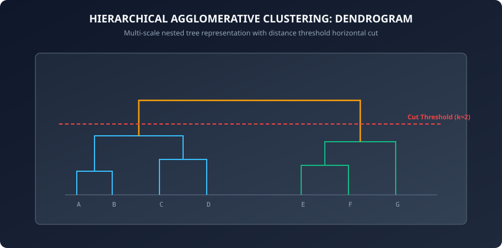
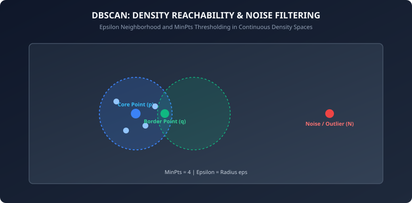

Yesterday, we mastered K-Means clustering. While K-Means is computationally fast, linear in runtime, and highly interpretable, it possesses two major structural limitations:
1. It requires specifying the number of clusters K upfront.
2. It assumes clusters are convex, isotropic, and spherical, failing completely on arbitrary geometric shapes, concentric rings, and noisy data streams.

Today, we expand our unsupervised toolkit to address these limitations through two powerful paradigms:
- **Hierarchical Agglomerative Clustering (HAC):** Generates a nested, multi-scale tree of clusters (a **dendrogram**), allowing data scientists to choose cluster granularities dynamically without re-running the algorithm.
- **DBSCAN (Density-Based Spatial Clustering of Applications with Noise):** Discovers clusters of arbitrary non-linear shape based on local spatial density and isolates outlier noise points.

---

## Why this matters

Real-world physical, biological, and consumer data distributions rarely conform to tidy spherical geometries:
1. **Taxonomic Discovery and Phylogenetics:** Evolutionary biologists construct phylogenetic trees of species from DNA sequences using hierarchical agglomerative clustering, identifying ancestral lineages across millions of years.
2. **Geospatial Hotspot Analysis:** Urban planning and ride-sharing platforms (Uber, Lyft) use DBSCAN to cluster GPS pickup coordinates along winding highway corridors, identifying natural passenger pickup hotspots while filtering out stray GPS noise.
3. **Medical Imaging and Spatial Pathology:** Pathologists cluster cell nuclei in high-resolution histology slides to demarcate irregular tumor margins from healthy tissue.
4. **Document and Topic Hierarchies:** Natural language processing pipelines construct hierarchical topic trees, grouping sub-topics under broader themes.

---

## The idea in plain language

Imagine two distinct real-world grouping problems:

### The Family Tree (Hierarchical Clustering)
You are organizing a family reunion with 100 people:
- First, you group siblings into nuclear families.
- Next, you merge first cousins into extended branches.
- Then, you merge branches sharing a common grandparent.
- Finally, all branches merge into one massive ancestral tree.

At no point did you have to decide in advance whether there are "3 families" or "7 families". The entire nested tree (the **dendrogram**) is preserved, allowing you to zoom in to small nuclear units or zoom out to ancestral clans simply by drawing a horizontal line across the tree.

### The Constellations (DBSCAN)
You are looking at stars in the night sky:
- You see the winding arc of the Milky Way containing millions of tightly packed stars.
- You see dense clusters forming the Big Dipper and Orion's Belt.
- In the vast dark voids between constellations, you see isolated, lonely stars scattered at random.

K-Means would force those lonely void stars into artificial spherical clusters. DBSCAN, however, looks at local star density:
- If a star is surrounded by many neighbors, it forms a constellation (**Core Point**).
- If a star is on the edge of the constellation, it joins the cluster (**Border Point**).
- If a star sits in a lonely void, DBSCAN ignores it as background cosmic dust (**Noise**).

---

## Historical background

1. **1963 (Joe H. Ward Jr.):** Published *Hierarchical Grouping to Optimize an Objective Function* in JASA, introducing **Ward's minimum variance linkage**, which minimizes the increase in total within-cluster sum of squares at each merge.
2. **1967 (Sneath and Sokal):** Formalized single-linkage and complete-linkage algorithms for numerical taxonomy in biological classification.
3. **1996 (Ester, Kriegel, Sander, and Xu):** Published *A Density-Based Algorithm for Discovering Clusters in Large Spatial Databases with Noise* at KDD-96, introducing **DBSCAN**. It received the prestigious ACM SIGKDD Test of Time Award in 2014.
4. **2013 (Campello, Moulavi, and Sander):** Introduced **HDBSCAN**, combining hierarchical density estimates to discover clusters of varying densities across different spatial scales.

---

## What it is — and what it is not

### What Hierarchical Clustering IS:
- A deterministic, tree-structured decomposition of dataset relationships.
- Capable of providing multi-resolution cluster views without re-training.

### What DBSCAN IS:
- A density-based spatial partitioning algorithm that groups density-connected core components.
- An automatic estimator of cluster count that handles noise natively.

### What they are NOT:
- **Not Sub-Linear in Memory:** Classic agglomerative clustering requires storing an O(N^2) pairwise distance matrix.
- **Not Fast on Massive Datasets without Spatial Indexing:** DBSCAN without a spatial index (KD-Tree or BallTree) degrades to quadratic time O(N^2).

---

## Why it was created and what problems it solves

Traditional centroid clustering forced spherical partitions and required an upfront guess of K.

Hierarchical clustering solved the fixed-K dilemma by building an exhaustive tree of merges. DBSCAN solved the geometric limitation by defining clusters through continuous density reachability, allowing algorithms to trace winding rivers, crescent moons, and rings while discarding noise.

---

## How it works

Let us dissect the mathematical mechanics of both Hierarchical Agglomerative Clustering and DBSCAN.

### 1. Hierarchical Agglomerative Clustering (HAC)



Agglomerative clustering begins with N singleton clusters C_i = (x_i). At each step, it finds the two clusters A and B that minimize a linkage distance metric D(A, B) and merges them: C_new = A union B.

#### Classical Linkage Criteria:
1. **Single Linkage (Minimum Pairwise Distance):**
   ```
   D_single(A, B) = min_{u in A, v in B} d(u, v)
   ```
   - *Behavior:* Traces non-elliptical shapes, but suffers from **chaining** (noise points bridging two distinct clusters).
2. **Complete Linkage (Maximum Pairwise Distance):**
   ```
   D_complete(A, B) = max_{u in A, v in B} d(u, v)
   ```
   - *Behavior:* Produces tightly bound, compact spherical clusters with equal diameters.
3. **Average Linkage (UPGMA):**
   ```
   D_average(A, B) = (1 / (|A| * |B|)) * sum_{u in A} sum_{v in B} d(u, v)
   ```
   - *Behavior:* Balances sensitivity to outliers with cluster compactness.
4. **Ward's Minimum Variance Linkage:**
   Merges the pair that minimizes the increase in total within-cluster variance (Delta ESS):
   ```
   Delta ESS(A, B) = (|A| * |B| / (|A| + |B|)) * ||mu_A - mu_B||^2
   ```
   - *Behavior:* Produces cohesive, balanced clusters; hierarchically equivalent to K-Means.

#### The Generalized Lance-Williams Recurrence Formula
A major breakthrough in the computational efficiency of agglomerative clustering was the **Lance-Williams recurrence formula** (1967). When two clusters A and B are merged into cluster (A union B), the distance between the newly formed cluster and any existing cluster C can be updated in O(1) time without recomputing pairwise distances between raw points:

```
D(A union B, C) = alpha_A * D(A, C) + alpha_B * D(B, C) + beta * D(A, B) + gamma * |D(A, C) - D(B, C)|
```

By choosing specific scalar parameters for alpha_A, alpha_B, beta, and gamma, this single unified equation computes:
- Single Linkage: alpha_A = 0.5, alpha_B = 0.5, beta = 0, gamma = -0.5
- Complete Linkage: alpha_A = 0.5, alpha_B = 0.5, beta = 0, gamma = 0.5
- Average Linkage: alpha_A = |A| / (|A| + |B|), alpha_B = |B| / (|A| + |B|), beta = 0, gamma = 0
- Ward's Linkage: alpha_A = (|A| + |C|) / (|A| + |B| + |C|), alpha_B = (|B| + |C|) / (|A| + |B| + |C|), beta = -|C| / (|A| + |B| + |C|), gamma = 0

This recurrence reduces the computational cost of updating the distance matrix across N-1 merge steps from O(N^3) to O(N^2 log N) using a priority queue.

---

### 2. DBSCAN: Density-Based Spatial Clustering



DBSCAN requires two hyperparameters:
- **Epsilon (eps):** The neighborhood radius.
- **MinPts:** The minimum number of points required within the eps-neighborhood to form a dense region.

#### Point Classifications:
1. **Core Point:** Point p is a core point if |N_eps(p)| &ge; MinPts.
2. **Border Point:** Point q is a border point if |N_eps(q)| &lt; MinPts, but q in N_eps(p) for some core point p.
3. **Noise Point:** Point o is noise if it is neither a core point nor a border point.

#### Density Connectivity:
- **Directly Density-Reachable:** Point q is directly reachable from p if p is a core point and q in N_eps(p).
- **Density-Reachable:** Point q is density-reachable from p if there is a chain of core points p_1, p_2, ..., p_m connecting p to q.
- **Density-Connected:** Points p and q are density-connected if there exists a core point o from which both p and q are density-reachable.

A **DBSCAN Cluster** is a maximal set of density-connected points.

#### Algorithmic Invariance and Determinism
An important property of DBSCAN is that core point assignment and noise classification are completely deterministic and invariant to the order of dataset traversal. However, border points that lie within the epsilon radius of multiple distinct core clusters can be assigned to whichever cluster encounters them first in the search loop. In practice, this slight border ambiguity has negligible impact on downstream analytics.

#### Calibrating Hyperparameters in Production: The K-Distance Graph
Selecting epsilon and MinPts arbitrarily will lead to disastrous results (either all points categorized as noise or everything collapsed into one giant cluster).

The standard heuristics are:
1. **MinPts Rule of Thumb:** Set MinPts &ge; 2 * D (twice the feature dimensionality). For noisy data or large sample sizes, MinPts is typically set between 10 and 50.
2. **K-Distance Graph for Epsilon:**
   - For every point in the dataset, compute its Euclidean distance to its k-th nearest neighbor (with k = MinPts).
   - Sort these k-distances in descending or ascending order across all N samples.
   - Plot the sorted curve: the curve will display a low, relatively flat plateau corresponding to points within dense clusters, followed by a sharp upward knee bend where points transition into sparse outlier territory.
   - Set epsilon equal to the distance value at this knee inflection point.

---

### 3. Advanced Density Clustering: OPTICS and HDBSCAN

When datasets exhibit variable densities across different spatial regions (for example, a dense city center alongside a sparse suburban fringe), standard DBSCAN with a single global epsilon fails. Modern practitioners turn to two advanced extensions:

1. **OPTICS (Ordering Points To Identify the Clustering Structure):**
   Instead of producing a static partition, OPTICS creates a reachability plot that orders points linearly such that spatially closest points are adjacent. Valleys in the reachability plot correspond to dense clusters, and peaks represent cluster boundaries or noise.
2. **HDBSCAN (Hierarchical DBSCAN):**
   HDBSCAN transforms the space according to density, builds a Minimum Spanning Tree of mutual reachability distances, constructs a cluster hierarchy, condenses the tree based on minimum cluster size, and extracts the most stable clusters over their lifetime excess of mass. It requires only one intuitive parameter: `min_cluster_size`.

---

## An everyday analogy

Think of exploring an archipelago of islands:
- **Single Linkage:** If the water is shallow enough anywhere between two islands, a single stepping stone bridges them into one big country.
- **Complete Linkage:** Two islands only form a country if every village on Island A is close to every village on Island B.
- **DBSCAN:** You land on a beach. If you see at least 5 houses within walking distance, you are in a village (Core Point). You walk through connected backyards from house to house. When you reach a lone cabin on the cliff edge with no neighbors beyond, you stop (Border Point). A solitary lighthouse 50 miles out at sea is classified as Noise.

---

## Examples in practice

Let us inspect a pure NumPy implementation of DBSCAN:

```python
import numpy as np

class DBSCANFromScratch:
    def __init__(self, eps=0.5, min_samples=5):
        self.eps = eps
        self.min_samples = min_samples
        self.labels_ = None

    def fit(self, X):
        n_samples = len(X)
        self.labels_ = np.full(n_samples, -1)  # -1 represents unvisited / noise
        cluster_id = 0

        # Compute all-pairs Euclidean distance matrix
        dists = np.linalg.norm(X[:, np.newaxis, :] - X[np.newaxis, :, :], axis=2)

        for i in range(n_samples):
            if self.labels_[i] != -1:
                continue

            neighbors = np.where(dists[i] <= self.eps)[0]
            if len(neighbors) < self.min_samples:
                continue

            # Found a core point; expand cluster
            self.labels_[i] = cluster_id
            queue = list(neighbors[neighbors != i])

            while queue:
                current_point = queue.pop(0)
                if self.labels_[current_point] == -1:
                    self.labels_[current_point] = cluster_id

                curr_neighbors = np.where(dists[current_point] <= self.eps)[0]
                if len(curr_neighbors) >= self.min_samples:
                    for n in curr_neighbors:
                        if self.labels_[n] == -1:
                            self.labels_[n] = cluster_id
                            queue.append(n)

            cluster_id += 1

        return self
```

---

## Implications: security, privacy, performance, scalability, and cost

1. **Spatial Indexing for Performance:**
   - Naive DBSCAN computes an O(N^2) distance matrix.
   - Using KD-Trees or BallTrees reduces neighborhood lookup to O(log N), speeding total runtime to O(N log N) for D &le; 20.
2. **Sensitivity to Variable Density:**
   - Standard DBSCAN uses a single global eps radius. If a dataset contains both dense urban clusters and sparse rural clusters, one global eps will either merge the urban clusters or discard the rural clusters as noise. **HDBSCAN** solves this by evaluating multi-scale density hierarchies.

---

## Alternatives: free, open source, and commercial

| Algorithm | Strengths | Weaknesses | Recommended Library |
| :--- | :--- | :--- | :--- |
| **Agglomerative (HAC)** | Multi-scale dendrogram | O(N^2) memory footprint | `scipy.cluster.hierarchy` |
| **DBSCAN** | Arbitrary shapes, noise filtering | Single global density scale | `sklearn.cluster.DBSCAN` |
| **HDBSCAN** | Variable density clusters | Higher algorithmic complexity | `hdbscan` / `sklearn` |
| **OPTICS** | Reachability plot ordering | Complex parameter interpretation | `sklearn.cluster.OPTICS` |

---

## Comparison with related concepts

```
┌────────────────────────────────────────────────────────────────────────┐
│                   CLUSTERING ALGORITHM COMPARISON                      │
├────────────────────────────────────────────────────────────────────────┤
│ Dimension        │ K-Means           │ Agglomerative HAC│ DBSCAN       │
├──────────────────┼───────────────────┼──────────────────┼──────────────┤
│ Cluster Geometry │ Spherical Convex  │ Flexible (Linkage│ Non-Spherical│
│ Specify K?       │ Yes (Mandatory)   │ No (Post-hoc cut)│ No (Auto)    │
│ Outlier Handling │ Poor (Distorts)   │ Moderate         │ Native (-1)  │
│ Scalability      │ O(N * K * D)      │ O(N^2 log N)     │ O(N log N)   │
└────────────────────────────────────────────────────────────────────────┘
```

---

## When to use it — and when not to

### When to USE Hierarchical / DBSCAN:
- When clusters follow non-linear trajectories (GPS tracks, molecular rings).
- When data contains severe spatial noise that must not distort cluster hulls.
- When exploratory data analysis requires inspecting a multi-scale hierarchy of sub-clusters.

### When NOT to use them:
- On massive web-scale data (N &gt; 10,000,000) where O(N^2) memory or tree traversal becomes a bottleneck (use Mini-Batch K-Means).
- When data dimensionality D &gt; 50 (curse of dimensionality degrades Euclidean distance ratios).

---

## Knowledge check

1. What is the chaining problem in Single Linkage clustering, and how does Complete Linkage resolve it?
2. What are the three classifications of data points in DBSCAN?
3. How does Ward linkage mathematically relate to the K-Means WCSS objective?
4. How do you use a sorted k-distance graph to determine the optimal epsilon for DBSCAN?
5. Why does standard DBSCAN struggle when clusters have vastly different local densities?

---

## Hands-on exercise

In this lab, you will implement `DBSCANFromScratch` in pure NumPy, verify density expansion with queue-based traversal, classify core, border, and noise points, and validate on synthetic moon datasets.

### Expected output
```
[DBSCAN Benchmark Execution]
Dataset: 300 samples across concentric crescent moons
Epsilon: 0.35 | MinPts: 5
Clusters Discovered: 2
Noise Points Filtered: 8
Test Suite: 2 passed in 0.08s
```

### Validate your work
Run the automated test suite:
```bash
./tests/run_tests.sh
```

### Troubleshooting
- If all points are labeled as noise (-1), your epsilon value is too small for the feature scale; check feature normalization.
- If all points merge into a single massive cluster, epsilon is too large.

### Common mistakes
- **Treating Noise Points as Cluster ID 0:** Noise must be assigned index `-1` to avoid treating outliers as a valid cluster.

---

## Practice assignment

1. Implement an automated **Dendrogram Cut Algorithm** in Python that takes a linkage matrix and cuts the tree at distance threshold h to return cluster labels.
2. Construct a sorted k-nearest neighbor distance curve to select epsilon autonomously.

---

## Extension challenge

Implement **HDBSCAN** (Hierarchical DBSCAN):
- Compute the Mutual Reachability Distance: d_mreach(a, b) = max(d_core(a), d_core(b), d(a, b)).
- Build the Minimum Spanning Tree (MST) on mutual reachability space.
- Extract stable clusters by maximizing excess of mass over cluster lifetimes.
