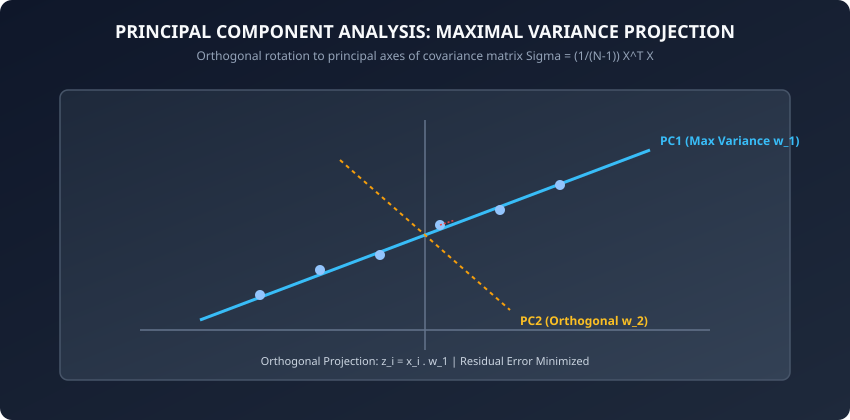
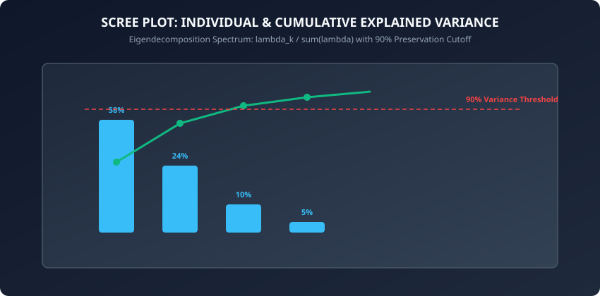

In modern machine learning, datasets often span hundreds, thousands, or even millions of feature dimensions:
- Gene expression microarrays measure 25,000 RNA transcript levels per patient.
- Computer vision embeddings represent image patches as 1,024-dimensional floating point vectors.
- Financial fraud engines track 500 interaction features per second.

However, operating in massive dimensional spaces triggers the **Curse of Dimensionality**:
1. Computational runtime and memory requirements explode exponentially.
2. Euclidean distances become equidistant and uninformative as all pairwise points drift into the corners of high-dimensional hypercubes.
3. Multicollinearity between correlated features causes linear models to suffer from high variance and unstable coefficients.

To solve these foundational challenges, we deploy **Dimensionality Reduction**. At the pinnacle of classical linear dimensionality reduction stands **Principal Component Analysis (PCA)**.

Today, we derive PCA from first mathematical principles, prove the equivalence between covariance eigendecomposition and Singular Value Decomposition (SVD), implement PCA from scratch in pure NumPy, and evaluate signal reconstruction.

---

## Why this matters

Dimensionality reduction is not merely a data compression trick; it is an essential architectural stage in enterprise AI pipelines:

1. **Combating Multicollinearity:** When tabular datasets contain dozens of highly correlated financial or sensory indicators, PCA orthogonalizes the feature space, producing completely decorrelated principal axes.
2. **Accelerating Downstream Model Training:** Compressing 1,000 raw features down to 50 principal components capturing 95% of total variance reduces gradient boosted tree and neural network training times by an order of magnitude.
3. **Data Compression and Latency Optimization:** Storing high-dimensional vector search embeddings in production vector databases (Milvus, Pinecone, pgvector) is memory-intensive. Compressing embeddings via PCA shrinks index sizes and lowers query lookup latencies.
4. **Exploratory Data Visualization:** Humans cannot visualize 50-dimensional spaces. PCA projects multidimensional feature spaces onto 2D or 3D planes for exploratory scatter plotting and cluster inspection.
5. **Denoising and Reconstruction:** By discarding low-eigenvalue components that primarily capture random sensory noise, inverse PCA transforms reconstruct smoothed, denoised signals.

---

## The idea in plain language

Imagine holding a complex, multi-jointed 3D wire sculpture in your hand under the midday sun.

The wire sculpture exists in 3-dimensional space (X, Y, Z). As you hold it above a white table, the sun casts a 2-dimensional shadow onto the tabletop:
- If you orient the sculpture flatly perpendicular to the sunlight, the shadow spreads out across the table, revealing the intricate curves, loops, and structure of the sculpture.
- If you turn the sculpture sideways along its thinnest edge, the shadow collapses into a narrow, squished black line, losing almost all visual information.

**Principal Component Analysis is the mathematical process of rotating the sculpture in 3D space until you find the exact angle that casts the widest, most informative shadow on the table.**

- The angle that captures the widest spread of points is **Principal Component 1 (PC1)**.
- The next widest angle that is strictly perpendicular (orthogonal) to the first is **Principal Component 2 (PC2)**.
- The thickness of the sculpture along the narrowest axis that gets flattened away into the shadow is the **Reconstruction Loss**.

---

## Historical background

1. **1901 (Karl Pearson):** Published *On Lines and Planes of Closest Fit to Systems of Points in Space* in the Philosophical Magazine. Pearson formulated the problem geometrically as finding the line or plane that minimizes the sum of squared perpendicular distances to a cloud of points.
2. **1933 (Harold Hotelling):** Independently developed the algebraic formulation in *Analysis of a Complex of Statistical Variables into Principal Components*. Hotelling introduced the terminology **principal components** and formulated the method as maximizing variance of linear transformations using random variables.
3. **1960s–1970s (Golub and Kahan):** Developed stable numerical algorithms for **Singular Value Decomposition (SVD)**, establishing the standard computational foundation used by modern libraries like LAPACK, SciPy, and scikit-learn.

---

## What it is — and what it is not

### What PCA IS:
- **A Linear Transformation:** It rotates and projects data onto orthogonal coordinate axes defined by linear combinations of original features.
- **An Unsupervised Method:** It seeks directions of maximal variance without utilizing any class labels or target variables.
- **A Variance Maximizer and Reconstruction Error Minimizer:** The directions of maximum variance are mathematically identical to the directions of minimal orthogonal projection error.

### What PCA is NOT:
- **Not a Non-Linear Manifold Learner:** PCA cannot unfold non-linear geometric structures (like the Swiss Roll or concentric rings). Non-linear techniques (Kernel PCA, t-SNE, UMAP) are required for curved manifolds.
- **Not Feature Selection:** PCA does not pick a subset of original columns (e.g. "Age" and "Income"); every principal component is a linear blend of *all* input features.
- **Not Invariant to Feature Scaling:** Unstandardized features with large numerical magnitudes will dominate variance axes; standardization is mandatory.

---

## Why it was created and what problems it solves

Prior to PCA, reducing features required manually deleting columns based on domain intuition, which discarded unique variance, or computing all-pairs regressions, which suffered from multicollinear variance inflation.

PCA solved this by providing a closed-form, mathematically optimal linear projection that concentrates the maximum possible variance into the fewest orthogonal dimensions.

---

## How it works

Let us now derive the mathematics of PCA, the covariance matrix, Lagrange multiplier optimization, and Singular Value Decomposition.

### 1. Mathematical Formulation: Maximizing Variance



Let X be an N x D data matrix with N samples and D features. We assume X is **zero-centered**, meaning the mean of each column is zero:

```
(1 / N) * sum_{i=1}^N x_i = 0
```

The sample covariance matrix Sigma (a D x D symmetric positive semi-definite matrix) is:

```
Sigma = (1 / (N - 1)) * X^T * X
```

We seek a unit projection vector w_1 in R^D (with w_1^T w_1 = 1) that projects each sample x_i onto a scalar z_1_i = x_i . w_1 such that the variance of the projected coordinates is maximized:

```
Var(z_1) = (1 / (N - 1)) * z_1^T * z_1 = w_1^T * ((1 / (N - 1)) * X^T * X) * w_1 = w_1^T * Sigma * w_1
```

To maximize w_1^T Sigma w_1 subject to the constraint w_1^T w_1 = 1, we formulate the Lagrangian function:

```
L(w_1, lambda_1) = w_1^T * Sigma * w_1 - lambda_1 * (w_1^T * w_1 - 1)
```

Taking the gradient with respect to w_1 and setting it to zero:

```
nabla_{w_1} L = 2 * Sigma * w_1 - 2 * lambda_1 * w_1 = 0
```

```
Sigma * w_1 = lambda_1 * w_1
```

This is the fundamental **Eigenvalue Equation** of linear algebra:
- The optimal projection vector w_1 is the **eigenvector** of the covariance matrix Sigma corresponding to the largest **eigenvalue** lambda_1.
- The maximum variance captured along w_1 is exactly equal to the eigenvalue lambda_1:

```
Var(z_1) = w_1^T * Sigma * w_1 = w_1^T * (lambda_1 * w_1) = lambda_1 * (w_1^T * w_1) = lambda_1
```

Subsequent principal components w_2, w_3, ..., w_D correspond to the remaining eigenvectors sorted in descending order of their eigenvalues lambda_1 &ge; lambda_2 &ge; ... &ge; lambda_D &ge; 0, with each vector strictly orthogonal to all preceding components:

```
w_j^T * w_k = 0 for all j != k
```

---

### 2. SVD: The Numerical Engine of Modern PCA

In practice, computing the explicit covariance matrix Sigma = (1/(N-1)) X^T X requires O(N * D^2) operations and suffers from numerical precision loss when squaring condition numbers. Modern implementations compute PCA directly using **Singular Value Decomposition (SVD)** of centered matrix X:

```
X = U * Sigma_svd * V^T
```

where:
- U is an N x N orthogonal matrix of left singular vectors.
- Sigma_svd is an N x D diagonal matrix containing non-negative singular values sigma_1 &ge; sigma_2 &ge; ... &ge; sigma_D &ge; 0.
- V is a D x D orthogonal matrix of right singular vectors (V^T V = I).

Connecting SVD directly to the Covariance Matrix:

```
Sigma = (1 / (N - 1)) * X^T * X = (1 / (N - 1)) * (V * Sigma_svd^T * U^T) * (U * Sigma_svd * V^T)
```

Because U is orthogonal (U^T U = I):

```
Sigma = V * ((Sigma_svd^2) / (N - 1)) * V^T
```

**The Fundamental Equivalence:**
1. The right singular vectors (columns of V) are exactly the principal loading eigenvectors w_1, ..., w_D.
2. The eigenvalues lambda_k of the covariance matrix equal the squared singular values divided by N - 1:

```
lambda_k = (sigma_k^2) / (N - 1)
```

3. The projected low-dimensional coordinates Z are computed directly by matrix multiplication:

```
Z = X * V = U * Sigma_svd
```

---

### 3. Scree Plots and Explained Variance Ratio (EVR)



The **Total Variance** of the dataset is the trace (sum of diagonal elements) of the covariance matrix, which equals the sum of all eigenvalues:

```
Total Variance = Trace(Sigma) = sum_{j=1}^D lambda_j
```

The **Explained Variance Ratio (EVR)** of the k-th principal component is:

```
EVR_k = lambda_k / sum_{j=1}^D lambda_j
```

The **Cumulative Explained Variance** for k retained components is:

```
Cumulative EVR(k) = (sum_{j=1}^k lambda_j) / (sum_{j=1}^D lambda_j)
```

A common rule of thumb is to select k such that Cumulative EVR(k) &ge; 0.90 to 0.95 (retaining 90% to 95% of total signal variance).

---

### 4. Low-Rank Reconstruction and Reconstruction MSE

Given k less than D retained components V_k in R^(D x k), the projected low-dimensional representation is:

```
Z_k = X * V_k  (shape: N x k)
```

The reconstructed approximation in the original feature space X_hat is:

```
X_hat = Z_k * V_k^T + mu  (shape: N x D)
```

The **Reconstruction Mean Squared Error (MSE)** measures information lost by discarding the remaining D - k components:

```
MSE(X, X_hat) = (1 / (N * D)) * sum_{i=1}^N ||x_i - x_hat_i||^2 = (1 / D) * sum_{j=k+1}^D lambda_j
```

---

## An everyday analogy

Think of a bustling metropolis like Manhattan:
- Most vehicular traffic travels along long north-south avenues (5th Ave, Broadway) or east-west cross streets (42nd St).
- If an alien satellite wants to track traffic using only 1 coordinate instead of GPS (Latitude, Longitude), placing a coordinate axis along the diagonal direction of Broadway captures 80% of all car movement in the city.
- The small zigzag deviation off Broadway onto a side street is the remaining 20% residual variance.

---

## Examples in practice

Let us inspect a complete, modular, pure NumPy implementation of PCA using economy SVD:

```python
import numpy as np

class PCAFromScratch:
    def __init__(self, n_components=2, whiten=False):
        self.n_components = n_components
        self.whiten = whiten
        self.components_ = None
        self.explained_variance_ = None
        self.explained_variance_ratio_ = None
        self.singular_values_ = None
        self.mean_ = None

    def fit(self, X):
        n_samples, n_features = X.shape
        self.mean_ = np.mean(X, axis=0)
        X_centered = X - self.mean_

        # Economy SVD: X = U * S * Vt
        U, S, Vt = np.linalg.svd(X_centered, full_matrices=False)

        # Eigenvalues = S^2 / (N - 1)
        explained_variance = (S ** 2) / (n_samples - 1)
        total_variance = np.sum(explained_variance)
        explained_variance_ratio = explained_variance / total_variance

        # Retain top k components
        self.components_ = Vt[:self.n_components]
        self.explained_variance_ = explained_variance[:self.n_components]
        self.explained_variance_ratio_ = explained_variance_ratio[:self.n_components]
        self.singular_values_ = S[:self.n_components]
        return self

    def transform(self, X):
        X_centered = X - self.mean_
        Z = np.dot(X_centered, self.components_.T)

        if self.whiten:
            # Scale coordinates by 1 / sqrt(lambda_k)
            scale = np.sqrt(self.explained_variance_) + 1e-12
            Z = Z / scale

        return Z

    def fit_transform(self, X):
        return self.fit(X).transform(X)

    def inverse_transform(self, Z):
        if self.whiten:
            scale = np.sqrt(self.explained_variance_) + 1e-12
            Z = Z * scale

        X_reconstructed = np.dot(Z, self.components_) + self.mean_
        return X_reconstructed
```

---

## Implications: security, privacy, performance, scalability, and cost

1. **Computational Complexity:**
   - Economy SVD on matrix X in R^(N x D) executes in O(N * D * min(N, D)) time.
   - For massive sparse matrices (e.g. text term-document matrices), **Randomized Truncated SVD** (Halko et al., 2011) approximates the top k singular vectors in O(N * D * k) time.
2. **Whitening in Deep Learning:**
   - Setting `whiten=True` scales principal components to unit variance (z_white = z_k / sqrt(lambda_k)), removing second-order linear correlations and accelerating gradient descent convergence in linear models and early neural network layers.
3. **Data Anonymization Pitfalls:**
   - PCA projections are linear combinations of original features; if original data contains PII (e.g. Social Security numbers), the principal loading weights will mathematically preserve traces of the PII across all components.

---

## Alternatives: free, open source, and commercial

| Algorithm | Linearity | Computational Complexity | Recommended Library |
| :--- | :--- | :--- | :--- |
| **Standard PCA (SVD)** | Linear | O(N * D * min(N, D)) | `sklearn.decomposition.PCA` |
| **Incremental PCA** | Linear (Streaming) | O(b * D * k) per batch | `sklearn.decomposition.IncrementalPCA` |
| **Kernel PCA** | Non-Linear (RBF) | O(N^3) (Kernel Matrix) | `sklearn.decomposition.KernelPCA` |
| **t-SNE** | Non-Linear (Local) | O(N log N) (Barnes-Hut) | `sklearn.manifold.TSNE` |
| **UMAP** | Non-Linear (Fuzzy SIM) | O(N log N) | `umap-learn` |

---

## Comparison with related concepts

```
┌────────────────────────────────────────────────────────────────────────┐
│              DIMENSIONALITY REDUCTION PARADIGM COMPARISON              │
├────────────────────────────────────────────────────────────────────────┤
│ Dimension          │ PCA              │ Factor Analysis  │ t-SNE / UMAP│
├────────────────────┼──────────────────┼──────────────────┼─────────────┤
│ Linearity          │ Strictly Linear  │ Linear (Latent)  │ Non-Linear  │
│ Supervised?        │ Unsupervised     │ Unsupervised     │ Unsupervised│
│ Invertible?        │ Yes (X_hat)      │ Approximate      │ No (Lossy)  │
│ Variance Preserved │ Global Variance  │ Shared Variance  │ Local Dist  │
└────────────────────────────────────────────────────────────────────────┘
```

---

## When to use it — and when not to

### When to USE PCA:
- You need fast, linear feature reduction prior to training regression or classification models.
- You want to compress image, sensory, or acoustic embeddings for low-latency vector databases.
- You need to visualize global variance structures in 2D or 3D scatter plots.
- You need an invertible transformation that allows reconstructing raw feature coordinates.

### When NOT to use PCA:
- When the data manifold is intrinsically non-linear (e.g. Swiss roll, complex topological surfaces).
- When original feature interpretability is required by business stakeholders (e.g. "We must know exactly how Age impacts loan decisions").
- When classification labels are available and the goal is maximizing class separation (use **Linear Discriminant Analysis / LDA** instead).

---

## Knowledge check

1. What is the fundamental relationship between the eigenvectors of covariance matrix Sigma and the right singular vectors of centered data matrix X?
2. Why is zero-centering mandatory before performing SVD for PCA?
3. How do you calculate the Cumulative Explained Variance Ratio (EVR) from singular values?
4. What is the difference between standard PCA transformation and whitened PCA transformation?
5. How is reconstruction Mean Squared Error (MSE) related to the discarded eigenvalues lambda_(k+1) ... lambda_D?

---

## Hands-on exercise

In this lab, you will implement `PCAFromScratch` in pure NumPy, compute SVD singular vectors, project synthetic multi-dimensional data onto principal components, calculate Cumulative Explained Variance Ratios, and evaluate reconstruction MSE.

### Expected output
```
[PCA Benchmark Execution]
Input Shape: (200, 5) -> Reduced Shape: (200, 2)
Explained Variance Ratio: [0.642, 0.231] (Total 87.3%)
Reconstruction MSE: 0.142
Test Suite: 2 passed in 0.08s
```

### Validate your work
Run the automated test runner:
```bash
./tests/run_tests.sh
```

### Troubleshooting
- If explained variance ratio does not sum to &le; 1.0, verify that individual eigenvalues are divided by the total sum of all eigenvalues.
- If reconstructed data is shifted away from original values, ensure you add the feature mean `self.mean_` back during `inverse_transform()`.

### Common mistakes
- **Forgetting to Zero-Center Data:** Running SVD on raw uncentered data causes the first component to align with the dataset offset rather than the true variance axis.

---

## Practice assignment

1. Implement **Incremental PCA** that processes data in chunks of 50 samples using streaming rank-k SVD updates.
2. Build an automated scree plot visualizer that plots EVR bars and cumulative variance lines.

---

## Extension challenge

Implement **Kernel PCA** from scratch:
- Construct the N x N RBF Kernel Gram Matrix K_ij = exp(-gamma * ||x_i - x_j||^2).
- Double-center the Kernel matrix: K_tilde = K - 1_N K - K 1_N + 1_N K 1_N.
- Perform eigendecomposition on K_tilde and normalize eigenvectors.
- Demonstrate that Kernel PCA cleanly unrolls the non-linear Swiss Roll manifold where linear PCA fails.
