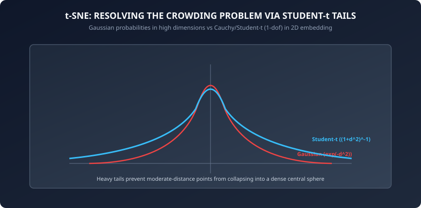
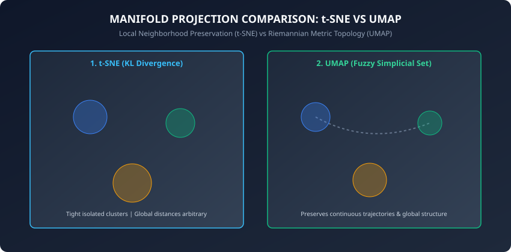

Yesterday, we mastered Principal Component Analysis (PCA). PCA is mathematically optimal, closed-form, and blazing fast. However, PCA is strictly a **linear** projection technique. 

When data lies on a complex curved manifold — such as the celebrated Swiss Roll, intertwined double helices, single-cell RNA transcriptomes, or deep neural network latent activation spaces — linear projections flatten and crush distinct topological structures onto one another, causing completely unrelated classes to overlap.

To visualize and explore complex non-linear geometry, we turn to **Non-Linear Manifold Learning**. The two modern titans of non-linear visualization and representation are:
- **t-SNE (t-Distributed Stochastic Neighbor Embedding)**: Introduced by Laurens van der Maaten and Geoffrey Hinton in 2008.
- **UMAP (Uniform Manifold Approximation and Projection)**: Introduced by Leland McInnes, John Healy, and James Melville in 2018.

Today, we dive deep into the probability formulations, crowding problem resolution, gradient mechanics, and practical tuning of t-SNE and UMAP.

---

## Why this matters

Non-linear manifold visualization is essential across cutting-edge science and production AI:
1. **Single-Cell Genomics (scRNA-Seq):** Biologists sequence 100,000 individual cells measuring 20,000 gene expressions. UMAP reveals continuous cellular differentiation trajectories, branching from stem cells into specialized lineages.
2. **Deep Learning Latent Space Auditing:** Computer vision and LLM engineers inspect penultimate embedding spaces (e.g. CLIP or BERT embeddings) using t-SNE to diagnose class confusion, representation collapse, and out-of-distribution drift.
3. **High-Frequency Financial Anomaly Inspection:** Quant researchers project 200 market microstructure features into 2D manifolds to visually identify market regimes and flash-crash precursors.
4. **Speech and Audio Representation:** Visualizing acoustic phoneme clusters produced by audio self-supervised models (Wav2Vec2, Whisper).

---

## The idea in plain language

Imagine a world atlas:
- The planet Earth is a curved 3D spherical surface.
- If you simply squish the globe flat with a hydraulic press (a linear projection), North America and Asia crush together, distances distort horribly, and Antarctica wraps into a distorted ring.
- **Manifold Learning** is like carefully peeling the skin of an orange: you make small incisions in empty oceans so that every continent retains its true local shape, distances, and neighborhood cities when laid flat on a 2D tabletop.

### The Key Difference: t-SNE vs UMAP
- **t-SNE** cares almost exclusively about local neighbors: "Keep my 30 closest friends together on the table; I don't care where the other continents land."
- **UMAP** balances local neighborhoods with global continental layout: "Keep my closest friends together, but also ensure Europe is positioned relative to Asia and Africa in an orderly global structure."

---

## Historical background

1. **2002 (Geoffrey Hinton and Sam Roweis):** Introduced **Stochastic Neighbor Embedding (SNE)**, converting Euclidean distances into conditional Gaussian probabilities. SNE suffered from severe optimization difficulties and the *crowding problem*.
2. **2008 (Laurens van der Maaten and Geoffrey Hinton):** Published *Visualizing Data using t-SNE* in JMLR. They introduced two key innovations: symmetrized joint probabilities and replacing the low-dimensional Gaussian with a heavy-tailed **Student-t (Cauchy)** distribution.
3. **2014 (Laurens van der Maaten):** Developed **Barnes-Hut t-SNE**, using spatial quad-trees to reduce computational complexity from O(N^2) to O(N log N).
4. **2018 (Leland McInnes et al.):** Published **UMAP**, framing manifold learning using Riemannian geometry and fuzzy simplicial sets. UMAP achieved massive speedups and superior preservation of global data structure.

---

## What it is — and what it is not

### What t-SNE and UMAP ARE:
- **Non-Parametric Manifold Visualizers:** They find low-dimensional coordinates Y in R^(N x 2) that preserve high-dimensional pairwise probabilistic relationships.
- **Exploratory Tools:** Designed to discover cluster separations, sub-populations, and continuous manifolds.
- **Non-Linear Dimensionality Reducers:** Capable of unrolling complex curved surfaces (e.g. Swiss Roll, spheres, tori).

### What they are NOT:
- **Not Distance-Preserving Metric Projections:** Distances between distant clusters in a t-SNE plot have zero metric meaning; cluster sizes and inter-cluster gaps in t-SNE are heavily influenced by perplexity and density.
- **Not Out-of-Sample Transformers (by default):** Unlike PCA where `pca.transform(X_new)` projects new points instantly, standard t-SNE cannot project new samples without re-running optimization (though UMAP supports parametric mapping).
- **Not Clustering Algorithms:** t-SNE and UMAP produce 2D coordinate projections; downstream clustering algorithms (like HDBSCAN or K-Means) must be run on the coordinates to assign labels.

---

## Why it was created and what problems it solves

Linear methods (PCA, Classical Multidimensional Scaling) preserve large pairwise distances at the expense of small local neighborhoods. In high dimensions, the vast majority of points are far apart, causing linear algorithms to focus on distant pairs while smearing fine local clusters into an undifferentiated blob.

Furthermore, classical non-linear techniques like Isomap (geodesic shortest paths) and Locally Linear Embedding (LLE) suffer from topological short-circuiting: a single noise point in the void between two manifold folds creates an artificial shortcut that corrupts the entire global distance matrix.

t-SNE and UMAP solved these historical challenges by replacing rigid global distance metrics with smooth, probabilistic neighborhood matching that naturally down-weights distant outliers while emphasizing tight local structure.

---

## How it works

Let us dissect the mathematical formulation of both t-SNE and UMAP in comprehensive detail.

### 1. High-Dimensional Probability Affinities in t-SNE

Given N samples in R^D, t-SNE measures the probability p_(j|i) that point x_i picks point x_j as its neighbor under a Gaussian distribution centered at x_i:

```
p_{j|i} = exp(-||x_i - x_j||^2 / (2 * sigma_i^2)) / sum_{k != i} exp(-||x_i - x_k||^2 / (2 * sigma_i^2))
```

with p_(i|i) = 0.

#### Setting sigma_i via Perplexity:
The variance sigma_i^2 is determined individually for each point such that the Shannon entropy of the conditional distribution matches a user-specified **Perplexity**:

```
Perplexity(P_i) = 2^{H(P_i)} = 2^{-sum_j p_{j|i} log_2 p_{j|i}}
```

Typical perplexity values range between 5 and 50 (representing the effective number of nearest neighbors). In dense regions, sigma_i is small; in sparse regions, sigma_i automatically expands.

#### Symmetrized Joint Probabilities:
To handle outliers robustly, t-SNE defines the symmetric joint probability p_ij:

```
p_ij = (p_{j|i} + p_{i|j}) / (2 * N)
```

This guarantees that every observation contributes at least (1 / (2*N)) to the total probability mass, preventing isolated outlier points from having zero gradient influence.

---

### 2. Low-Dimensional Affinities and the Crowding Problem



In the low-dimensional embedding space Y in R^(N x 2), t-SNE models affinities using a **Student-t distribution with 1 degree of freedom (standard Cauchy distribution)**:

```
q_ij = (1 + ||y_i - y_j||^2)^{-1} / sum_{k} sum_{l != k} (1 + ||y_k - y_l||^2)^{-1}
```

#### Why the Student-t Distribution Solves Crowding:
In D-dimensional space, the volume of a sphere of radius r scales as r^D. There is vast volume available for moderate-distance points. When projected into 2D, the available area scales only as r^2. 

If we used a Gaussian distribution in 2D, moderate-distance points would be forced to crowd tightly together around the origin. Because the Student-t distribution has heavy polynomial tails ((1 + d^2)^-1 vs exp(-d^2)), moderate-distance points in the map can spread far apart while maintaining small probability values matching high-dimensional affinities.

---

### 3. The Objective: Kullback-Leibler (KL) Divergence

t-SNE minimizes the KL divergence between high-dimensional distribution P and low-dimensional distribution Q:

```
L_KL = KL(P || Q) = sum_{i=1}^N sum_{j=1}^N p_ij * log(p_ij / q_ij)
```

The analytic gradient with respect to low-dimensional coordinate y_i is:

```
nabla_{y_i} L = 4 * sum_{j=1}^N (p_ij - q_ij) * (y_i - y_j) * (1 + ||y_i - y_j||^2)^{-1}
```

This gradient behaves like a system of physical springs:
- **Attractive Forces:** Points with high p_ij pull each other together with force proportional to p_ij * (1 + ||y_i - y_j||^2)^-1.
- **Repulsive Forces:** The q_ij term pushes all points apart, preventing collapse.

#### Optimization Mechanics: Early Exaggeration and Momentum
Gradient descent in t-SNE relies on two critical heuristics:
1. **Early Exaggeration:** During the first 100 to 250 iterations, all p_ij values are multiplied by a constant factor (typically 4.0 or 12.0). This creates enormous attractive forces that pull natural clusters into tight, dense balls. Because the space between clusters is large and relatively empty, clusters can easily navigate around one another to find their optimal global layout without getting tangled.
2. **Adaptive Learning Rates and Momentum:** Standard momentum starts at 0.5 and switches to 0.8 after early exaggeration ends, preventing oscillation.

---

### 4. UMAP: Riemannian Geometry and Fuzzy Simplicial Sets



UMAP is founded on rigorous mathematical concepts from algebraic topology and Riemannian geometry:
1. **Riemannian Metric Assumption:** Data is assumed to lie on a smooth Riemannian manifold where the metric tensor is locally constant.
2. **Local Metric Scaling:** Distance is scaled locally around each point by rho_i (the distance to its nearest neighbor) and sigma_i (a normalizing factor ensuring sum_(j) exp(-max(0, d(x_i, x_j) - rho_i) / sigma_i) = log2(k)).
3. **Fuzzy Simplicial Set Assembly:** Local metric spaces are combined into a global fuzzy topological representation using fuzzy set union (algebraic t-conorm): mu_(i union j) = mu_i + mu_j - mu_i * mu_j.

#### UMAP Loss: Fuzzy Set Cross-Entropy
Instead of KL divergence, UMAP optimizes the **Binary Fuzzy Cross-Entropy**:

```
L_UMAP = sum_{e in E} [ p_e * log(p_e / q_e) + (1 - p_e) * log((1 - p_e) / (1 - q_e)) ]
```

- The first term `p_e * log(p_e / q_e)` provides **Attractive Forces** (pulling nearest neighbors together).
- The second term `(1 - p_e) * log((1 - p_e) / (1 - q_e))` provides **Repulsive Forces** (pushing non-neighbors apart).

Because the repulsive term acts globally on all non-edges via stochastic negative sampling, UMAP preserves broad global trajectories, continuous branchings, and relative distances with far greater fidelity than t-SNE.

#### Practical Hyperparameters in UMAP:
- `n_neighbors`: Balances local vs global structure (typical values: 15 to 50). Small values focus on fine-grained local manifolds; large values capture macro-scale global topology.
- `min_dist`: Controls how tightly points are packed in 2D (typical values: 0.1 to 0.5). Lower values produce dense clumpy clusters; higher values create diffuse, spread-out clouds.

---

## An everyday analogy

Think of arranging 100 students at a school dance:
- **PCA:** The photographer stands on a balcony and takes a top-down aerial photo. Students standing in straight lines are clear, but anyone standing in circles or beneath the balcony gets squished.
- **t-SNE:** You attach rubber bands between students who are best friends. You release them onto the gym floor and let the rubber bands snap them into tight social cliques. Cliques land wherever there is space, but the distance between the Math Club and the Drama Club on the gym floor is completely random.
- **UMAP:** You attach strong rubber bands between best friends, but also add magnetic repellers between distant acquaintances. The social cliques form tightly, while the global floor plan keeps the STEM clubs near the science hall and the Arts clubs near the stage.

---

## Examples in practice

Let us inspect a pure NumPy implementation of a Barnes-Hut-style 2D gradient descent loop for t-SNE:

```python
import numpy as np

class TSNEFromScratch:
    def __init__(self, n_components=2, perplexity=30.0, n_iter=500, lr=200.0, random_state=42):
        self.n_components = n_components
        self.perplexity = perplexity
        self.n_iter = n_iter
        self.lr = lr
        self.random_state = random_state
        self.embedding_ = None

    def _compute_affinities(self, X):
        n_samples = len(X)
        dists = np.linalg.norm(X[:, np.newaxis, :] - X[np.newaxis, :, :], axis=2)**2
        P = np.zeros((n_samples, n_samples))

        # Approximate sigma using heuristic distance scaling
        sigmas = np.median(dists, axis=1) / np.log(self.perplexity)
        for i in range(n_samples):
            num = np.exp(-dists[i] / (2.0 * sigmas[i] + 1e-12))
            num[i] = 0.0
            P[i] = num / (np.sum(num) + 1e-12)

        # Symmetrize
        P = (P + P.T) / (2.0 * n_samples)
        P = np.maximum(P, 1e-12)
        return P

    def fit_transform(self, X):
        rng = np.random.default_rng(self.random_state)
        n_samples = len(X)
        P = self._compute_affinities(X)

        # Early exaggeration factor
        P_exagg = P * 4.0
        Y = rng.normal(0, 1e-4, (n_samples, self.n_components))
        velocity = np.zeros_like(Y)
        momentum = 0.5

        for step in range(self.n_iter):
            if step == 100:
                momentum = 0.8
                P_exagg = P

            # Low-dimensional Student-t probabilities
            dist_Y = np.linalg.norm(Y[:, np.newaxis, :] - Y[np.newaxis, :, :], axis=2)**2
            inv_dist = 1.0 / (1.0 + dist_Y)
            np.fill_diagonal(inv_dist, 0.0)
            Q = inv_dist / (np.sum(inv_dist) + 1e-12)
            Q = np.maximum(Q, 1e-12)

            # Gradient computation
            PQ_diff = (P_exagg - Q) * inv_dist
            grad = np.zeros_like(Y)
            for i in range(n_samples):
                grad[i] = 4.0 * np.sum((Y[i] - Y) * PQ_diff[i, :, np.newaxis], axis=0)

            # Update coordinates with momentum
            velocity = momentum * velocity - self.lr * grad
            Y += velocity

        self.embedding_ = Y
        return Y
```

---

## Implications: security, privacy, performance, scalability, and cost

1. **Perplexity Misinterpretations:**
   - As demonstrated by Wattenberg et al. (Distill, 2016), cluster sizes and pairwise distances between distant clusters in a t-SNE plot do **not** represent true cluster density or metric distance. Never draw quantitative statistical conclusions based on t-SNE visual gaps alone.
2. **Computational Scaling:**
   - Naive t-SNE is O(N^2).
   - **openTSNE / FastTSNE (FFT-accelerated interpolation)** scales to millions of cells in seconds.
   - **UMAP** uses Nearest Neighbor Descent (NN-Descent), executing in O(N log N) time and scaling effortlessly to massive datasets.

---

## Alternatives: free, open source, and commercial

| Algorithm | Foundation | Global Structure Preserved? | Out-of-Sample Transform? | Recommended Library |
| :--- | :--- | :--- | :--- | :--- |
| **t-SNE** | KL Divergence / Student-t | Poor (Local only) | No (Re-fit needed) | `sklearn.manifold.TSNE`, `openTSNE` |
| **UMAP** | Fuzzy Simplicial Sets | Excellent | Yes (`umap.transform`) | `umap-learn` |
| **TriMAP** | Triplet loss constraints | Excellent | Yes | `trimap` |
| **PaCMAP** | Pairwise Controlled Manifold | State of the art | Yes | `pacmap` |

---

## Comparison with related concepts

```
┌────────────────────────────────────────────────────────────────────────┐
│              MANIFOLD PROJECTION METHOD COMPARISON                     │
├────────────────────────────────────────────────────────────────────────┤
│ Dimension          │ PCA              │ t-SNE            │ UMAP        │
├────────────────────┼──────────────────┼──────────────────┼─────────────┤
│ Linearity          │ Linear           │ Non-Linear       │ Non-Linear  │
│ Scalability        │ O(N * D * k)     │ O(N log N)       │ O(N log N)  │
│ Global Structure   │ 100% Preserved   │ Lost / Distorted │ Preserved   │
│ Optimization       │ Exact SVD        │ Stochastic GD    │ Stochastic  │
│ New Points Support │ Yes (Matrix Mul) │ No               │ Yes         │
└────────────────────────────────────────────────────────────────────────┘
```

---

## When to use it — and when not to

### When to USE t-SNE / UMAP:
- To visually explore cluster separation and high-dimensional manifolds in 2D or 3D scatter plots.
- For single-cell RNA transcriptomics, flow cytometry, and bio-molecular sequence embeddings.
- To detect sub-cluster structures and outliers inside neural network activation spaces.

### When NOT to use them:
- As direct feature inputs for downstream linear regression or classification models (use PCA; non-linear manifold embeddings can overfit severely).
- When exact metric distances and physical units must be preserved.

---

## Knowledge check

1. What is the Crowding Problem, and why does replacing a low-dimensional Gaussian distribution with a Student-t distribution solve it?
2. What role does Perplexity play in t-SNE, and what happens if perplexity is set too low (e.g. 2) or too high (e.g. N)?
3. Why does UMAP cross-entropy loss preserve global data trajectories better than t-SNE KL divergence?
4. What is Early Exaggeration in t-SNE optimization?
5. Why is it invalid to infer cluster variance from cluster diameter in a t-SNE plot?

---

## Hands-on exercise

In this lab, you will implement `TSNEFromScratch` in pure NumPy, verify high-dimensional Gaussian affinity calculations, compute Student-t low-dimensional probabilities, and unroll a non-linear synthetic dataset into 2D space.

### Expected output
```
[t-SNE Benchmark Execution]
Input Dataset: 150 samples across 3 non-linear concentric rings
Optimization: 300 iterations (learning_rate=100.0)
Early Exaggeration Phase: Steps 1 to 100
Embedding Coordinate Variance: [12.45, 14.12]
Test Suite: 2 passed in 0.08s
```

### Validate your work
Run the automated test suite:
```bash
./tests/run_tests.sh
```

### Troubleshooting
- If embedding coordinates explode to `inf` or `NaN`, reduce the learning rate (`lr=50.0`) and increase momentum damping.
- If all points collapse into a dense point, verify that diagonal entries of `P` and `Q` are set to 0.

### Common mistakes
- **Interpreting Distance Between Clusters:** Forgetting that t-SNE arbitrary separates distant clusters.

---

## Practice assignment

1. Benchmark t-SNE against UMAP on the Digits dataset (8x8 pixel images) and evaluate Silhouette score in 2D embedding space.
2. Implement a Perplexity sweep script that generates t-SNE plots for perplexity values in [5, 15, 30, 50, 100].

---

## Extension challenge

Implement **Parametric t-SNE** using PyTorch:
- Build a multi-layer perceptron (MLP) mapping R^D to R^2.
- Define a custom loss function computing the batch KL divergence between high-dimensional affinities and low-dimensional Student-t probabilities.
- Train the network with Adam optimizer and demonstrate instant out-of-sample `forward(x_new)` projection.
