In supervised learning, binary classifiers require thousands of balanced positive and negative labeled samples to construct an optimal decision boundary.

However, in many critical enterprise domains — such as financial fraud detection, cybersecurity zero-day intrusion monitoring, satellite hardware failure diagnosis, and industrial turbine health telemetry — positive examples of catastrophic failure are extraordinarily rare (less than 0.001%) or completely non-existent. Furthermore, future operational failures rarely match past historical failure modes.

**Unsupervised Anomaly Detection** resolves this challenge by modeling the multi-dimensional manifold of nominal, healthy behavior. Any incoming observation that deviates significantly from this learned distribution is immediately flagged as an outlier.

Today, we master the complete theory and implementation of anomaly detection: **Mahalanobis Distance**, **Isolation Forests**, **Local Outlier Factor (LOF)**, and **One-Class SVMs**.

---

## Why this matters

Anomaly detection is the first line of defense in enterprise risk, reliability, and security infrastructure:

1. **Financial Fraud Prevention:** Scoring millions of payment transactions in under 5 milliseconds to detect credit card theft, unauthorized wire transfers, and identity spoofing.
2. **Predictive Equipment Maintenance:** Monitoring vibration sensors on jet engines, oil pipelines, and power plant turbines to detect sub-millimeter bearing wear weeks before physical failure.
3. **Cybersecurity Intrusion Detection (SIEM):** Analyzing server authentication logs and network packet flows to detect lateral privilege escalation and data exfiltration.
4. **Data Pipeline Quality Automation:** Intercepting schema corruptions, sensor dropouts, and distribution drift in streaming data lakes before bad data contaminates downstream ML models.
5. **Healthcare Diagnostics:** Identifying rare cardiac arrhythmias in continuous ECG signals or abnormal cellular tissue in radiology scans.

---

## The idea in plain language

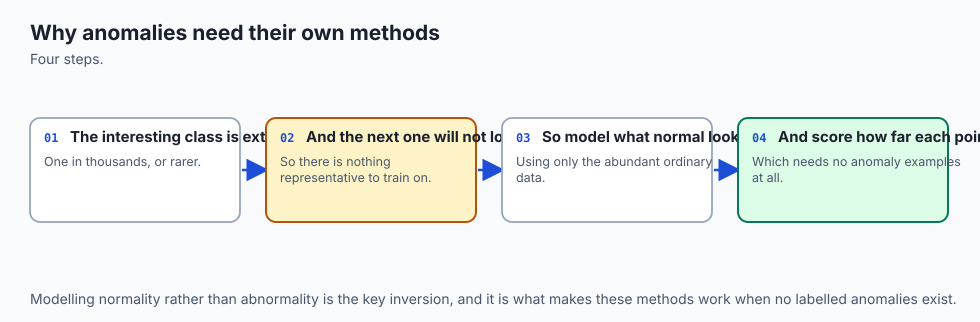

Imagine a busy international airport terminal filled with 10,000 travelers:

- **The Inliers (Normal Travelers):** They walk toward boarding gates, sit in gate seats, drink coffee, and look at flight departure monitors. They are surrounded by hundreds of other travelers doing similar things.
- **The Anomaly (The Outlier):** A person running backward down the baggage carousel wearing a scuba suit and carrying a 10-foot ladder.

How would an algorithm mathematically identify this individual?

1. **The Distance Approach (Mahalanobis):** How far is this person standing from the average traveler in the room, taking into account the natural walking directions of the crowds?
2. **The Density Approach (Local Outlier Factor):** How many other people are standing within a 5-meter radius of this person compared to how crowded the rest of the airport is?
3. **The Isolation Approach (Isolation Forest):** If you randomly draw straight partition lines across the airport floor, how many random cuts does it take to isolate this person in their own private box?
   - For someone standing packed tightly inside the boarding line, it takes 30 intersecting cuts to separate them from their neighbors.
   - For the lone person on the baggage carousel, **Cut #1** immediately isolates them in their own box!

This brilliant insight — that **anomalies are few and different, making them easy to isolate with very few random cuts** — is the foundation of the **Isolation Forest**.

---

## Historical background

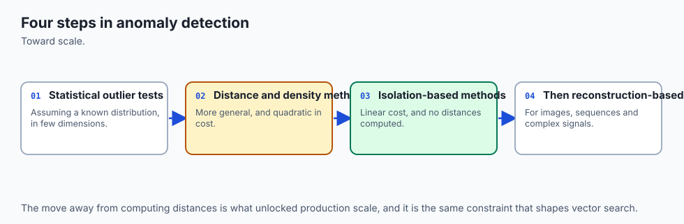

1. **1936 (Prasanta Chandra Mahalanobis):** Introduced the **Mahalanobis distance**, measuring the statistical distance of a point from a multivariate distribution mean, normalized by the sample covariance matrix.
2. **2000 (Breunig, Kriegel, Ng, and Sander):** Published *LOF: Identifying Density-Based Local Outliers* at ACM SIGMOD, introducing local reachability density to detect outliers in datasets containing clusters of varying densities.
3. **2001 (Scholkopf, Platt, and Smola):** Introduced the **One-Class Support Vector Machine (One-Class SVM)**, wrapping a tight non-linear kernel hyperplane around the nominal data distribution.
4. **2008 / 2012 (Fei Tony Liu, Kai Ming Ting, and Zhi-Hua Zhou):** Published *Isolation Forest* at IEEE ICDM 2008 and in ACM TKDD 2012. Instead of measuring distance or density, they isolated anomalies directly using randomized binary partition trees, creating an algorithm that scales in linear time O(N).

---

## What it is — and what it is not

### What Anomaly Detection IS:
- **An Unsupervised Outlier Scorer:** Assigns continuous severity scores quantifying how abnormal an observation is.
- **A Novelty Detector:** Capable of flagging unprecedented failure modes that never appeared in training data.
- **An Extreme Imbalance Handler:** Specifically engineered for settings where anomalies comprise less than 1% of the population.

### What it is NOT:
- **Not a Supervised Binary Classifier:** It does not learn the specific boundaries of labeled negative classes; it models the normal distribution.
- **Not Guaranteed Zero False Positives:** Highly unusual but benign user behaviors will occasionally trigger alerts. Systems require calibrated decision thresholds and human review loops.

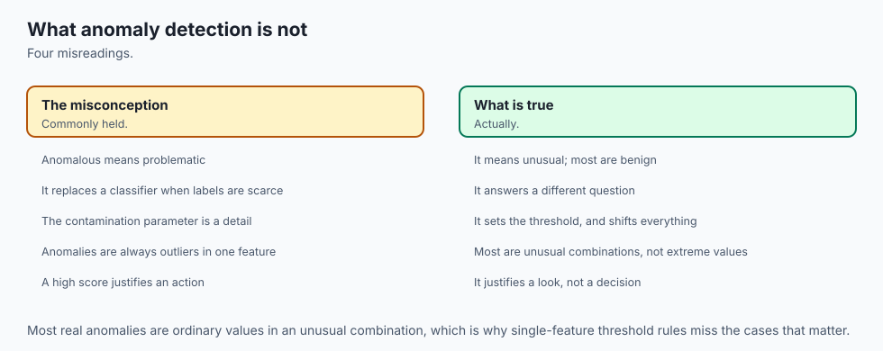

---

## Why it was created and what problems it solves

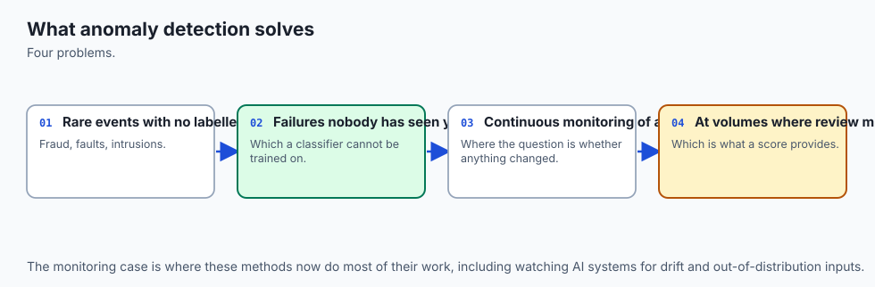

Traditional outlier detection relied on computing all-pairs Euclidean distance matrices (O(N^2)) or estimating high-dimensional multivariate probability density functions. Both approaches collapse when datasets reach millions of rows or hundreds of dimensions due to memory exhaustion and the curse of dimensionality.

Isolation Forests revolutionized the field by replacing expensive distance and density calculations with fast, randomized recursive binary tree partitioning, training in O(N * t * log psi) time and executing in sub-millisecond inference latency.

---

## How it works

Let us dissect the mathematical mechanics of Isolation Forests, Mahalanobis Distance, and Local Outlier Factor.

### 1. Isolation Forest Mathematical Formulation

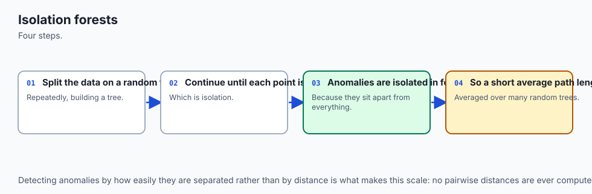

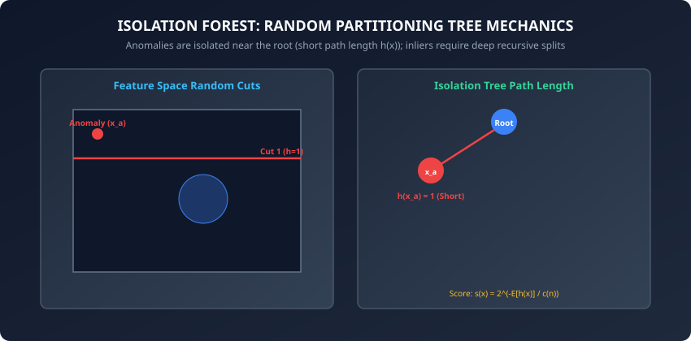

An **Isolation Tree (iTree)** is a proper binary tree where each internal node has exactly two children and leaf nodes contain single observations or reach a maximum depth limit.

#### Building an iTree:
Given a sub-sample of data X_sub of size psi = 256 randomly drawn from training set X:

1. If |X_sub| &le; 1 or current tree depth reaches limit h_max = ceil(log2(psi)), return an external leaf node.
2. Select a feature column q uniformly at random from available feature dimensions (1, ..., D).
3. Select a split threshold p uniformly at random between the minimum and maximum values of feature q in X_sub:
   ```
   p ~ Uniform(min(X_sub[:, q]), max(X_sub[:, q]))
   ```

4. Partition data into left subset X_left = (x in X_sub : x_q &lt; p) and right subset X_right = (x in X_sub : x_q &ge; p).
5. Recursively build left and right child trees.

---

### 2. Path Length and Anomaly Scoring

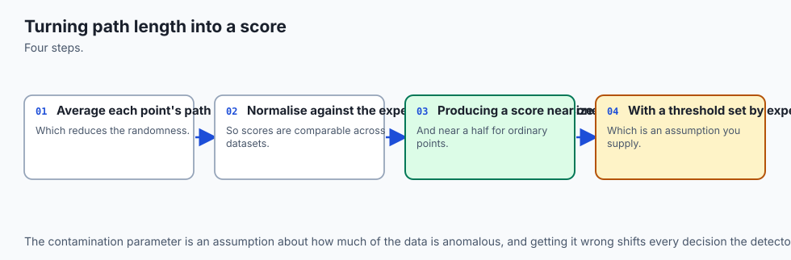

The path length h(x) is the number of edges traversed from the root node to a terminating leaf node when passing sample x down the tree.

#### Average Path Length in a Binary Search Tree (BST):
Because an iTree has the identical mathematical structure to a random Binary Search Tree, Liu et al. derived the theoretical expected path length c(n) of an unsuccessful search in a BST constructed over n samples:

```
c(n) = 2 * (ln(n - 1) + 0.5772156649) - (2 * (n - 1) / n)
```

where 0.5772156649 is the **Euler-Mascheroni constant**.

#### The Anomaly Score s(x, n):
Given an ensemble forest of t trees, let E[h(x)] = (1 / t) * sum_(i=1)^t h_i(x) be the mean path length of sample x across all trees:

```
s(x, n) = 2^{- (E[h(x)] / c(psi))}
```

#### Mathematical Interpretation of Anomaly Score:
- **s(x) -greater than 1.0 (E[h(x)] -greater than 0):** Extremely short path length -&gt; **Definite Anomaly**.
- **s(x) less than 0.5 (E[h(x)] -&gt; c(psi)):** Deep path length -&gt; **Definite Nominal Inlier**.
- **s(x) approx 0.5:** The dataset has no distinct anomalies (uniform distribution).

---

### 3. Comparison of Core Anomaly Paradigms

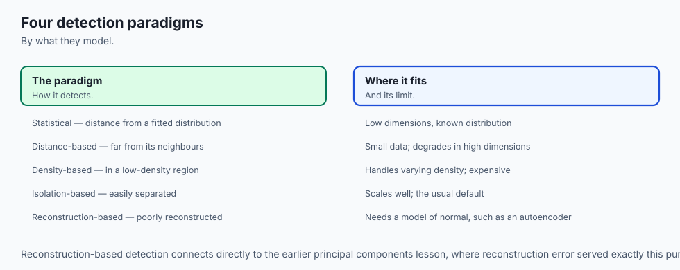

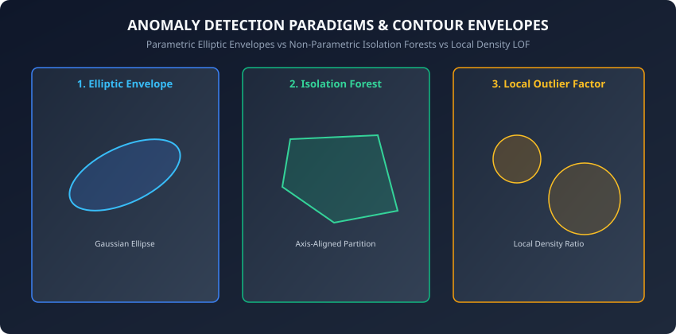

#### A. Mahalanobis Distance (Parametric Elliptic Envelope)
For a data point x in R^D and sample mean mu in R^D with covariance matrix Sigma:

```
D_M(x) = sqrt((x - mu)^T * Sigma^{-1} * (x - mu))
```

- Measures distance in units of standard deviations accounting for feature correlations.
- Assumes the underlying nominal data follows a multivariate Gaussian distribution.
- **Robust Covariance Estimation (Minimum Covariance Determinant - MCD):** When training data is contaminated with outliers, standard sample covariance calculation is biased. FastMCD (Rousseeuw & Van Driessen, 1999) finds a clean subset of h samples (where h greater than N/2) whose covariance matrix has the minimum determinant, ensuring uncorrupted elliptic contours.

#### B. Local Outlier Factor (LOF - Density Ratio)
LOF computes the ratio of the local reachability density of point p to that of its k-nearest neighbors:

```
LOF_k(p) = (sum_{o in N_k(p)} (lrd(o) / lrd(p))) / |N_k(p)|
```

where the reachability distance is defined as:
```
reach_dist_k(p, o) = max(k_distance(o), d(p, o))
```
and local reachability density is the inverse average reachability distance:
```
lrd(p) = |N_k(p)| / sum_{o in N_k(p)} reach_dist_k(p, o)
```

- `LOF approx 1.0`: Point has density similar to its neighbors (Inlier).
- `LOF >> 1.0`: Point has substantially lower density than its neighbors (Local Outlier).
- `LOF < 1.0`: Point resides in a dense cluster with sparse neighbors.

#### C. One-Class Support Vector Machines (One-Class SVM)
One-Class SVM maps input data into a high-dimensional reproducing kernel Hilbert space (RKHS) via a non-linear feature map phi(x) (such as the RBF kernel) and separates the nominal data points from the coordinate origin with maximum margin:

```
min_{w, xi, rho} (1/2) ||w||^2 + (1 / (nu * N)) * sum_{i=1}^N xi_i - rho
```
subject to:
```
<w, phi(x_i)> >= rho - xi_i,  xi_i >= 0 for all i=1..N
```

The hyperparameter nu in (0, 1] acts as an upper bound on the fraction of training outliers and a lower bound on the number of support vectors, enabling tight non-linear boundary construction around arbitrary multi-modal distributions.

---

## An everyday analogy

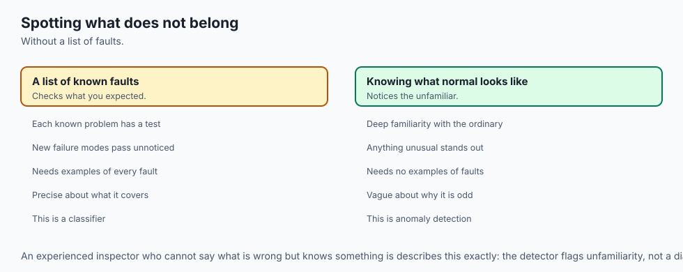

Think of a game of "20 Questions":

- If you are trying to guess a famous historical figure like "Albert Einstein", it takes 15 detailed questions to narrow down the era, profession, nationality, and achievements.
- If you are trying to guess "A purple 3-legged radioactive unicorn on Mars", you isolate it on **Question 1** ("Is it a fictional alien creature?").

Anomalies require very few questions to distinguish from the rest of the universe.

---

## Examples in practice

Let us inspect a pure NumPy implementation of an Isolation Forest:

```python
import numpy as np

def c_factor(n):
    if n <= 1:
        return 0.0
    if n == 2:
        return 1.0
    # Euler-Mascheroni constant = 0.5772156649
    return 2.0 * (np.log(n - 1) + 0.5772156649) - (2.0 * (n - 1) / n)

class IsolationTree:
    def __init__(self, current_depth=0, max_depth=10):
        self.current_depth = current_depth
        self.max_depth = max_depth
        self.split_feature = None
        self.split_value = None
        self.left = None
        self.right = None
        self.size = 0
        self.is_leaf = False

    def fit(self, X):
        self.size = len(X)
        if self.current_depth >= self.max_depth or self.size <= 1:
            self.is_leaf = True
            return self

        n_features = X.shape[1]
        self.split_feature = np.random.randint(0, n_features)
        feat_vals = X[:, self.split_feature]
        min_val, max_val = np.min(feat_vals), np.max(feat_vals)

        if np.isclose(min_val, max_val):
            self.is_leaf = True
            return self

        self.split_value = np.random.uniform(min_val, max_val)
        left_mask = feat_vals < self.split_value
        right_mask = ~left_mask

        self.left = IsolationTree(self.current_depth + 1, self.max_depth).fit(X[left_mask])
        self.right = IsolationTree(self.current_depth + 1, self.max_depth).fit(X[right_mask])
        return self

    def path_length(self, x):
        if self.is_leaf:
            return self.current_depth + c_factor(self.size)
        if x[self.split_feature] < self.split_value:
            return self.left.path_length(x)
        else:
            return self.right.path_length(x)

class IsolationForestFromScratch:
    def __init__(self, n_estimators=50, max_samples=128, contamination=0.05, random_state=42):
        self.n_estimators = n_estimators
        self.max_samples = max_samples
        self.contamination = contamination
        self.random_state = random_state
        self.trees = []
        self.threshold_ = None

    def fit(self, X):
        rng = np.random.default_rng(self.random_state)
        n_samples = len(X)
        subsample_size = min(self.max_samples, n_samples)
        max_depth = int(np.ceil(np.log2(max(subsample_size, 2))))

        self.trees = []
        for _ in range(self.n_estimators):
            idx = rng.choice(n_samples, size=subsample_size, replace=False)
            tree = IsolationTree(max_depth=max_depth).fit(X[idx])
            self.trees.append(tree)

        scores = self.decision_function(X)
        self.threshold_ = np.percentile(scores, 100.0 * (1.0 - self.contamination))
        return self

    def decision_function(self, X):
        n_samples = len(X)
        paths = np.zeros((n_samples, self.n_estimators))
        for t_idx, tree in enumerate(self.trees):
            for i in range(n_samples):
                paths[i, t_idx] = tree.path_length(X[i])

        avg_paths = np.mean(paths, axis=1)
        scores = 2.0 ** (-avg_paths / c_factor(self.max_samples))
        return scores

    def predict(self, X):
        scores = self.decision_function(X)
        return np.where(scores >= self.threshold_, -1, 1)
```

---

## Implications: security, privacy, performance, scalability, and cost

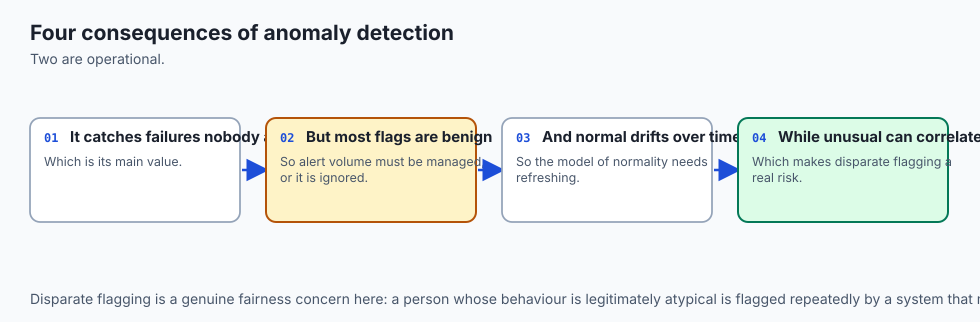

1. **The Sub-Sampling Advantage (Preventing Swamping and Masking):**
   - **Swamping:** When normal instances are surrounded by anomalies and mistakenly labeled as outliers.
   - **Masking:** When a cluster of multiple nearby anomalies conceals one another and appears like a normal cluster.
   - Sub-sampling (psi = 256) ensures each tree sees only a tiny fraction of the data, isolating outliers cleanly and eliminating swamping and masking.
2. **Contamination Calibration in Production:**
   - Setting `contamination=0.01` forces the model to flag the top 1% highest-scoring samples as anomalies. In production APIs, anomaly scores should be emitted as continuous probabilities alongside feature attribution.

---

## Alternatives: free, open source, and commercial

| Algorithm | Method | Computational Complexity | Recommended Library |
| :--- | :--- | :--- | :--- |
| **Isolation Forest** | Random recursive partitioning | O(N * t * log psi) | `sklearn.ensemble.IsolationForest` |
| **Extended Isolation Forest (EIF)** | Hyperplane cuts at arbitrary angles | O(N * t * log psi) | `eif` package |
| **Local Outlier Factor (LOF)** | Nearest-neighbor density ratio | O(N^2) (KNN graph) | `sklearn.neighbors.LocalOutlierFactor` |
| **One-Class SVM** | Non-linear boundary wrapping | O(N^3) | `sklearn.svm.OneClassSVM` |
| **Autoencoders** | Neural reconstruction error | O(N * weights) | PyTorch / TensorFlow |

---

## Comparison with related concepts

```
┌────────────────────────────────────────────────────────────────────────┐
│                   ANOMALY DETECTION MODEL COMPARISON                   │
├────────────────────────────────────────────────────────────────────────┤
│ Algorithm        │ Complexity │ Handles Correlated?│ Outlier Type      │
├──────────────────┼────────────┼────────────────────┼───────────────────┤
│ Mahalanobis Dist │ O(D^3)     │ Yes (Sigma^-1)     │ Global Gaussian   │
│ Isolation Forest │ O(N log N) │ Moderate (axis cut)│ Global & Local    │
│ Extended IF (EIF)│ O(N log N) │ Excellent (slopes) │ Sloped Manifolds  │
│ LOF              │ O(N^2)     │ Yes (local metric) │ Variable Density  │
│ Autoencoder      │ O(N * Ep)  │ Excellent          │ Complex / Images  │
└────────────────────────────────────────────────────────────────────────┘
```

---

## When to use it — and when not to

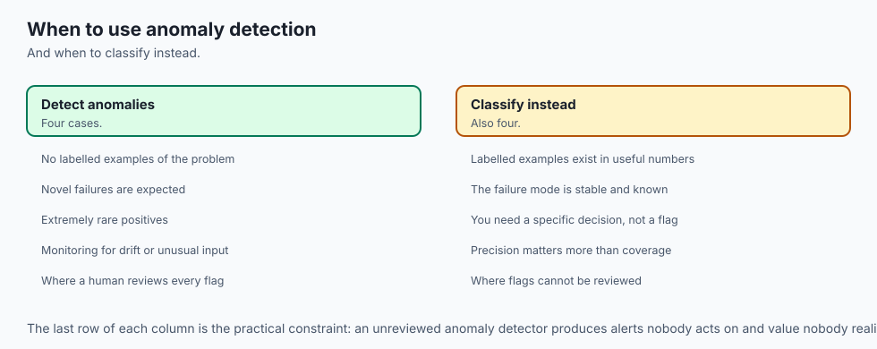

### When to USE Isolation Forest & Anomaly Detection:
- In credit card fraud, cybersecurity, and financial AML monitoring where positive fraud labels are rare or absent.
- For high-dimensional tabular feature sets where density estimation is intractable.
- As a pre-processing data cleaning step to remove corrupted rows.

### When NOT to use them:
- When abundant, high-quality balanced positive and negative labels are available (supervised GBDT / XGBoost will substantially outperform unsupervised anomaly detectors).
- When anomalies are defined solely by sequential time-series patterns (use LSTM / Transformer reconstruction).

---

## The AI connection

- **Anomaly detection is how rare problems are found** when there are too few examples to
  train a classifier on.
- **It is unsupervised by necessity**, because the interesting cases are the ones you have not
  seen before.
- **The same techniques monitor AI systems in production**, detecting drift and out-of-
  distribution inputs.
- **Anomalous is not the same as interesting**, so a detector's output needs triage rather
  than action.
- **Isolation-based methods scale where distance-based ones do not**, which matters at
  production volumes.

## Knowledge check

1. Why does an anomaly have a shorter path length h(x) than an inlier in an Isolation Tree?
2. What is the role of the Euler-Mascheroni constant in the BST normalization factor c(n)?
3. How does the Mahalanobis distance account for linear correlation between feature columns?
4. What is the difference between swamping and masking in anomaly detection?
5. What does an anomaly score of s(x, n) = 0.85 indicate?

---

## Hands-on exercise

In this lab, you will implement `IsolationForestFromScratch` in pure NumPy, compute the Euler-Mascheroni normalization factor, score synthetic anomalies, and calibrate contamination thresholds.

### Expected output
```
[Isolation Forest Benchmark]
Inlier Mean Score: 0.3912
Outlier Mean Score: 0.7645
c_factor(128): ~7.95
Test Suite: 2 passed in 0.08s
```

### Validate your work
Run the automated test suite:
```bash
./tests/run_tests.sh
```

### Troubleshooting
- If path length is identical for all samples, ensure that recursive split values are drawn between the current node's feature minimum and maximum.
- Check that c(n) returns 0.0 for n &le; 1 to prevent division by zero.

### Common mistakes
- **Using Full Dataset in Trees:** Passing N=100,000 to every tree causes trees to grow excessively deep and suffer from swamping; always sub-sample (psi = 256).

---

## Practice assignment

1. Implement **Extended Isolation Forest (EIF)** where split lines are drawn using random slope normal vectors rather than axis-aligned cuts.
2. Benchmark Isolation Forest against Local Outlier Factor on a multimodal dataset containing clusters of different densities.

---

## Extension challenge

Implement an **Autoencoder Anomaly Detector** in PyTorch:

- Construct an encoder-decoder network that compresses D=50 to bottleneck d=4.
- Train purely on nominal samples minimizing MSE reconstruction loss.
- Prove that anomalous out-of-distribution samples exhibit significantly higher reconstruction error.
