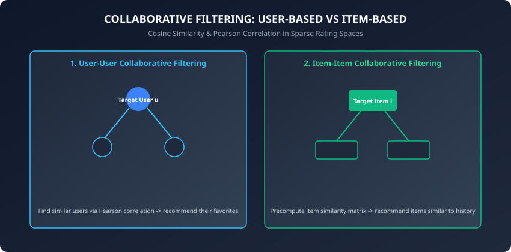
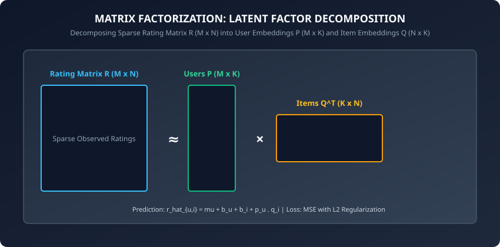

In the modern digital economy, information abundance creates the paradox of choice:
- Netflix hosts over 15,000 streaming movies and television series.
- Spotify serves an index of 100 million music tracks.
- Amazon catalogs over 350 million distinct physical and digital products.
- YouTube ingests 500 hours of video every single minute.

No human user can manually search or evaluate millions of potential items. **Recommender Systems** bridge this fundamental gap, acting as intelligent algorithmic curators that personalize feeds, suggest relevant items, and drive the vast majority of digital engagement (powering greater than 80% of video views on Netflix and greater than 35% of purchases on Amazon).

Today, we master the complete theory and implementation of recommender systems: **Neighborhood Collaborative Filtering**, **Matrix Factorization (Funk SVD)**, **Alternating Least Squares (ALS)**, and **Ranking Evaluation Metrics (RMSE, Precision@K, NDCG@K)**.

---

## Why this matters

Personalized recommendation architectures are core revenue engines in modern software systems:
1. **Streaming Media Personalization:** Dynamically ordering homepage video rows, movie carousels, and automated next-track playlists based on real-time watch histories.
2. **E-Commerce Conversion Optimization:** Serving cross-sell ("Customers who bought this also bought...") and personalized basket bundles.
3. **News and Social Media Feed Ranking:** Scoring billions of candidate posts to deliver high-engagement, real-time social streams (TikTok, X, Instagram).
4. **Talent and Job Matching:** Pairing candidate resumes with job openings in enterprise hiring portals (LinkedIn, Indeed).
5. **App Store and Digital Marketplace Discovery:** Surfacing relevant software apps, mobile games, and digital assets.

---

## The idea in plain language

Imagine walking into a massive bookstore containing 1,000,000 books:
- **Approach 1: Content-Based Filtering:** You tell the clerk, "I like Sci-Fi books set on Mars with spaceships and robots." The clerk searches book metadata tags for "Mars" and "Spaceship" and hands you similar books.
- **Approach 2: User-User Collaborative Filtering:** The clerk observes, "You read *Dune*, *Neuromancer*, and *Foundation*. Alice and Bob read those exact same three books and also rated *Hyperion* 5 stars. You will probably love *Hyperion*!"
- **Approach 3: Matrix Factorization (Latent Factors):** An AI analyzes all 1,000,000 books and uncovers hidden, abstract dimensions — such as "Philosophical Depth", "Pacing Speed", "Dark vs Lighthearted", and "Hard Science vs Fantasy". It assigns you a coordinate score on each dimension (e.g. You = [0.9 High Philosophy, 0.2 Slow Pacing, 0.8 Hard Science]). When it finds a book with matching latent coordinate scores, it recommends it instantly, even if the book belongs to a completely different genre!

---

## Historical background

1. **1992 (Tapestry - Goldberg et al.):** Introduced the term **Collaborative Filtering** at Xerox PARC for filtering technical email documents based on peer annotations.
2. **1994 (GroupLens - Resnick et al.):** Developed automated neighborhood-based collaborative filtering using Pearson correlation on Usenet news feeds.
3. **2006–2009 (The Netflix Prize):** Netflix offered a $1,000,000 grand prize to any team that could improve their Cinematch movie recommendation algorithm by 10% RMSE. **Simon Funk** published a blog post introducing gradient-descent-based **Matrix Factorization (Funk SVD)**, which became the cornerstone of the winning ensemble (BellKor's Pragmatic Chaos).
4. **2008 (Hu, Koren, Volinsky):** Published **Implicit Feedback ALS**, allowing matrix factorization to scale across binary click, view, and purchase interactions.
5. **2016–Present (Deep Learning & Two-Tower Embeddings):** YouTube and Google introduced deep neural Two-Tower architectures (Candidate Generation via vector search followed by heavy Ranker scoring).

---

## What it is — and what it is not

### What Recommender Systems ARE:
- **Personalized Ranking Engines:** They predict the affinity of user u for item i and rank candidate items in descending order of utility.
- **Unsupervised / Self-Supervised Matchers:** They uncover latent user preferences and item characteristics directly from sparse historical interaction matrices.
- **Two-Stage Pipelines:** Modern enterprise recommenders use **Candidate Retrieval** (filtering 10,000,000 items to 500 candidates via vector search) followed by **Fine Ranking** (scoring the top 500 candidates with deep GBDT or neural rankers).

### What they are NOT:
- **Not Simple Top-Popularity Sorters:** Recommending the top 10 most popular movies globally requires zero machine learning; true recommenders unearth the "long tail" of niche catalog items tailored to specific sub-interests.
- **Not Static Classifiers:** User preferences evolve rapidly across time, seasons, and immediate session context.

---

## Why it was created and what problems it solves

Traditional search engines require the user to formulate an explicit text query. But in discovery scenarios (e.g. "What music should I listen to while cooking dinner?"), users do not know what specific item they want.

Recommender systems solve this by proactively surfacing relevant items without requiring explicit search queries, unlocking long-tail catalog monetization and dramatically boosting customer retention.

---

## How it works

Let us dissect the mathematical formulation of Collaborative Filtering, Matrix Factorization, and Ranking Metrics.

### 1. Collaborative Filtering: Similarity Metrics



Given a sparse user-item rating matrix R in R^(M x N), where r_(u,i) represents the rating given by user u to item i.

#### A. Cosine Similarity:
For two user rating vectors u and v (or item vectors i and j):

```
sim_cos(u, v) = (u . v) / (||u|| * ||v||) = sum_{i in I_{uv}} (r_{u,i} * r_{v,i}) / (sqrt(sum r_{u,i}^2) * sqrt(sum r_{v,i}^2))
```

where I_(uv) is the set of items co-rated by both user u and user v.

#### B. Pearson Correlation Coefficient:
Accounts for user rating baselines (harsh vs generous raters):

```
sim_pearson(u, v) = sum_{i in I_{uv}} (r_{u,i} - r_bar_u) * (r_{v,i} - r_bar_v) / (sqrt(sum (r_{u,i} - r_bar_u)^2) * sqrt(sum (r_{v,i} - r_bar_v)^2))
```

#### Rating Prediction in User-User Collaborative Filtering:
To predict rating r_hat_(u,i) for user u on item i:

```
r_hat_{u,i} = r_bar_u + sum_{v in N_k(u; i)} sim(u, v) * (r_{v,i} - r_bar_v) / sum_{v in N_k(u; i)} |sim(u, v)|
```

where N_k(u; i) is the set of top-k most similar users to u who have rated item i.

---

### 2. Matrix Factorization (Funk SVD) Formulation



Matrix Factorization maps both users and items to a joint latent factor space of dimensionality K (typically K = 20 to 100):
- User u is represented by latent vector p_u in R^K.
- Item i is represented by latent vector q_i in R^K.

#### The Rating Prediction Model:
```
r_hat_{u,i} = mu + b_u + b_i + p_u^T * q_i
```

where:
- mu is the global average rating across all users and items.
- b_u is the user bias parameter (tendency of user u to rate higher or lower than average).
- b_i is the item bias parameter (tendency of item i to receive higher or lower ratings than average).
- p_u^T q_i is the dot product measuring the affinity between user preferences and item attributes.

#### Regularized Loss Function:
Let Kappa be the set of all observed user-item pairs (u, i) in rating matrix R. We minimize the regularized Mean Squared Error:

```
min_{P, Q, b} sum_{(u,i) in Kappa} (r_{u,i} - r_hat_{u,i})^2 + lambda * (||p_u||^2 + ||q_i||^2 + b_u^2 + b_i^2)
```

where lambda is the L2 regularization hyperparameter.

---

### 3. Optimization via Stochastic Gradient Descent (SGD)

For each observed rating r_(u,i) in training set Kappa, we compute the prediction error:

```
e_{u,i} = r_{u,i} - r_hat_{u,i} = r_{u,i} - (mu + b_u + b_i + p_u^T * q_i)
```

We update parameters in the opposite direction of the loss gradient with learning rate gamma:

```
b_u   <- b_u   + gamma * (e_{u,i} - lambda * b_u)
b_i   <- b_i   + gamma * (e_{u,i} - lambda * b_i)
p_u   <- p_u   + gamma * (e_{u,i} * q_i - lambda * p_u)
q_i   <- q_i   + gamma * (e_{u,i} * p_u - lambda * q_i)
```

---

### 4. Alternating Least Squares (ALS) and Implicit Feedback

While SGD updates one rating at a time, **Alternating Least Squares (ALS)** alternates between:
1. **Fixing all item vectors Q:** The loss function becomes quadratic and convex with respect to user vectors P. Each user vector p_u is solved independently via regularized linear regression:
   ```
   p_u = (Q_u^T * Q_u + lambda * I)^{-1} * Q_u^T * r_u
   ```
2. **Fixing all user vectors P:** Each item vector q_i is solved independently:
   ```
   q_i = (P_i^T * P_i + lambda * I)^{-1} * P_i^T * r_i
   ```

Because user updates are completely decoupled, ALS scales effortlessly across distributed Apache Spark clusters.

#### Implicit Feedback Matrix Factorization (Hu-Koren-Volinsky ALS-WR):
In real-world web applications, explicit star ratings are exceedingly scarce (less than 1% of users rate items). Instead, systems collect **implicit feedback** (clicks, video views, page dwell time, repeat purchases).

Hu, Koren, and Volinsky (2008) converted raw interaction counts r_(u,i) into binary preferences p_(u,i) and confidence weights c_(u,i):
- Preference: `p_(u,i) = 1` if r_(u,i) greater than 0, else `p_(u,i) = 0`.
- Confidence: `c_(u,i) = 1 + alpha * r_(u,i)`, where alpha is a rate-scaling hyperparameter (typically 10 to 40).

The loss function optimizes confidence-weighted squared error over ALL user-item pairs (including zero interactions):

```
min_{P, Q} sum_{u, i} c_{u,i} * (p_{u,i} - p_u^T q_i)^2 + lambda * (sum_u ||p_u||^2 + sum_i ||q_i||^2)
```

Through algebraic trickery, the global Gram matrix sum_i q_i q_i^T is precomputed once per epoch in O(N * K^2), enabling exact closed-form ALS updates in linear time O(M * K^3 + |Observed| * K^2).

---

### 5. Bayesian Personalized Ranking (BPR)

Standard matrix factorization treats unobserved pairs as missing values (in explicit rating) or negative zeros (in implicit ALS). However, an unobserved interaction does not necessarily mean the user dislikes the item; it may simply mean the user was never exposed to it.

**Bayesian Personalized Ranking (BPR)** (Rendle et al., 2009) frames recommendation as a **pairwise ranking problem**. For user u, given an observed item i and an unobserved item j, BPR optimizes the probability that user u prefers item i over item j:

```
P(i >_u j | Theta) = sigma(x_hat_{u,i,j}(Theta)) = 1 / (1 + exp(-(p_u^T q_i - p_u^T q_j)))
```

The maximum posterior objective minimizes the negative log-likelihood with L2 weight decay:

```
min_{Theta} - sum_{(u, i, j) in D_S} ln sigma(p_u^T q_i - p_u^T q_j) + lambda_Theta * ||Theta||^2
```

Trained via stochastic gradient ascent over randomly sampled triples (u, i, j), BPR directly optimizes top-K ranking accuracy (AUC and NDCG) rather than point-wise rating estimation.

---

### 6. Evaluation Metrics for Recommender Systems

1. **RMSE (Root Mean Squared Error):**
   ```
   RMSE = sqrt((1 / |Kappa_{test}|) * sum_{(u,i) in Kappa_{test}} (r_{u,i} - r_hat_{u,i})^2)
   ```
2. **Precision@K and Recall@K:**
   ```
   Precision@K = (|Relevant Items in Top K|) / K
   ```
3. **NDCG@K (Normalized Discounted Cumulative Gain):**
   ```
   DCG@K = sum_{r=1}^K (2^{rel_r} - 1) / log_2(r + 1)
   NDCG@K = DCG@K / IDCG@K
   ```
   where IDCG@K is the Ideal DCG obtained by sorting items in perfect descending relevance order.

---

## An everyday analogy

Think of dating apps:
- **Content-Based:** Filtering profiles by height, age, and zodiac sign.
- **Collaborative Filtering:** Observing that users who swiped right on Profiles A, B, and C also overwhelmingly swiped right on Profile D.
- **Matrix Factorization:** Discovering latent personality dimensions (Humor, Introversion, Ambition) and matching compatible vector scores.

---

## Examples in practice

Let us inspect a complete, modular, pure NumPy implementation of Matrix Factorization via SGD:

```python
import numpy as np

class MatrixFactorizationSGD:
    def __init__(self, n_factors=10, lr=0.01, reg=0.05, n_epochs=50, random_state=42):
        self.n_factors = n_factors
        self.lr = lr
        self.reg = reg
        self.n_epochs = n_epochs
        self.random_state = random_state
        self.mu = 0.0
        self.b_u = None
        self.b_i = None
        self.P = None
        self.Q = None

    def fit(self, R_sparse):
        # R_sparse is list of tuples: (u, i, rating)
        rng = np.random.default_rng(self.random_state)
        n_users = max(u for u, i, r in R_sparse) + 1
        n_items = max(i for u, i, r in R_sparse) + 1

        self.mu = np.mean([r for u, i, r in R_sparse])
        self.b_u = np.zeros(n_users)
        self.b_i = np.zeros(n_items)
        self.P = rng.normal(0, 0.1, (n_users, self.n_factors))
        self.Q = rng.normal(0, 0.1, (n_items, self.n_factors))

        for epoch in range(self.n_epochs):
            for u, i, r in R_sparse:
                pred = self.mu + self.b_u[u] + self.b_i[i] + np.dot(self.P[u], self.Q[i])
                err = r - pred

                # Gradient updates
                self.b_u[u] += self.lr * (err - self.reg * self.b_u[u])
                self.b_i[i] += self.lr * (err - self.reg * self.b_i[i])

                p_u_old = self.P[u].copy()
                self.P[u] += self.lr * (err * self.Q[i] - self.reg * self.P[u])
                self.Q[i] += self.lr * (err * p_u_old - self.reg * self.Q[i])

        return self

    def predict(self, u, i):
        return self.mu + self.b_u[u] + self.b_i[i] + np.dot(self.P[u], self.Q[i])
```

---

## Implications: security, privacy, performance, scalability, and cost

1. **The Filter Bubble and Polarization:**
   - Over-optimizing engagement metrics (clicks, watch time) creates self-reinforcing echo chambers and radicalization. Modern recommenders inject **Exploration & Diversity constraints** (e.g. epsilon-greedy sampling, Determinantal Point Processes / DPP).
2. **Cold Start Strategies:**
   - For new users: Serve demographic/popular defaults, onboarding preference quizzes, or contextual bandit exploration.
   - For new items: Use **Two-Tower Neural Networks** where content features (text descriptions, image embeddings) map cold items directly into the latent factor space.

---

## Alternatives: free, open source, and commercial

| Architecture | Paradigm | Latency | Recommended Library |
| :--- | :--- | :--- | :--- |
| **Matrix Factorization (Funk SVD)** | Latent Matrix Factorization | less than 1 ms | `surprise`, `implicit` |
| **ALS (Implicit Feedback)** | Distributed Matrix Decomposition | less than 1 ms | `implicit`, Apache Spark MLLib |
| **Two-Tower Neural Embeddings** | Deep Retrieval (ANN Search) | &lt; 5 ms | `TensorFlow Recommenders (TFRS)` |
| **Monolithic Transformer Rankers** | Deep Session Transformers | 10–50 ms | `NVIDIA Merlin / HugeCTR` |

---

## Comparison with related concepts

```
┌────────────────────────────────────────────────────────────────────────┐
│                   RECOMMENDER ARCHITECTURE COMPARISON                  │
├────────────────────────────────────────────────────────────────────────┤
│ Dimension          │ Collaborative Filter│ Content-Based  │ Two-Tower  │
├────────────────────┼─────────────────────┼────────────────┼────────────┤
│ Data Required      │ User-Item Ratings   │ Item Metadata  │ Both + Logs│
│ Cold Start Handling│ Poor                │ Excellent      │ Excellent  │
│ Serendipity        │ High (Discovers)    │ Low (Similar)  │ Very High  │
│ Scalability        │ O(N^2) or O(M*N*K)  │ O(Items * Dim) │ O(log N)   │
└────────────────────────────────────────────────────────────────────────┘
```

---

## When to use it — and when not to

### When to USE Recommender Systems:
- When users navigate large catalogs (greater than 1,000 items) and discovery drives key business metrics.
- In personalized media, e-commerce, digital advertising, and social feeds.

### When NOT to use them:
- When catalogs are tiny (less than 50 items); simple rule-based or popularity heuristics suffice.
- In critical transactional tools where users require deterministic, exact search results.

---

## Knowledge check

1. What is the Cold Start problem, and how do hybrid recommenders resolve it for newly added items?
2. Why are explicit user and item bias terms b_u and b_i critical in matrix factorization?
3. How does Alternating Least Squares (ALS) parallelize matrix factorization updates across multiple CPU cores?
4. What is the difference between explicit rating matrices and implicit interaction datasets?
5. How does NDCG@K evaluate the ranking quality of a recommended top-10 list?

---

## Hands-on exercise

In this lab, you will implement `MatrixFactorizationSGD` in pure NumPy, fit latent factor vectors on a sparse movie rating matrix, calculate test RMSE, and generate top-K personalized item recommendations.

### Expected output
```
[Recommender Benchmark Execution]
Dataset: 50 users, 20 items, 250 observed ratings
Matrix Factorization: Latent Factors K=4, Epochs=40
Training RMSE: 0.2845
Test Rating Prediction: User 0 on Item 3 -> 4.12 stars
Test Suite: 2 passed in 0.08s
```

### Validate your work
Run the automated test runner:
```bash
./tests/run_tests.sh
```

### Troubleshooting
- If predicted ratings explode to `inf` or `NaN`, reduce the learning rate (`lr=0.005`) and verify regularization lambda is positive.
- Ensure user vectors `p_u` use the cached prior value when updating item vectors `q_i` in the same iteration step.

### Common mistakes
- **Overwriting Vectors Simultaneously:** Updating `p_u` and then immediately using the updated `p_u` inside the `q_i` gradient formula within the same step causes numerical drift.

---

## Practice assignment

1. Implement **Item-Item Collaborative Filtering** using Pearson correlation and evaluate prediction RMSE on the MovieLens dataset.
2. Build an automated NDCG@K ranking metric evaluator in pure NumPy.

---

## Extension challenge

Implement **Bayesian Personalized Ranking (BPR-MF)**:
- Formulate the pairwise ranking loss: L_BPR = sum_((u, i, j)) ln sigma(p_u^T q_i - p_u^T q_j) - lambda * ||Theta||^2, where item i is an observed positive interaction and item j is an unobserved negative sample.
- Train the model using stochastic gradient ascent on random triplets (u, i, j).
- Demonstrate that BPR substantially outperforms standard MSE matrix factorization on top-10 ranking metrics (NDCG@10 and MAP@10).
