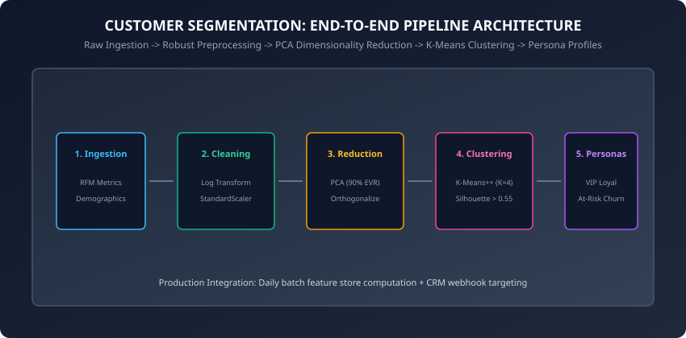
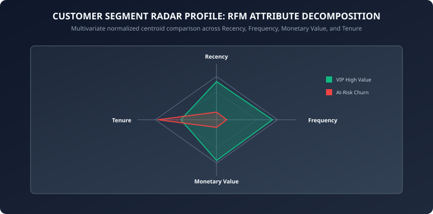

Over the past six days, we have systematically mastered the mathematical pillars of unsupervised machine learning:
1. **Partition-based clustering:** K-Means, K-Means++, WCSS inertia, and Silhouette validation (Day 183).
2. **Density and hierarchical methods:** Agglomerative clustering, dendrograms, DBSCAN, and OPTICS (Day 184).
3. **Linear dimensionality reduction:** PCA, covariance eigendecomposition, SVD, and scree analysis (Day 185).
4. **Non-linear manifold learning:** t-SNE, Student-t crowding resolution, and UMAP fuzzy simplicial sets (Day 186).
5. **Outlier and anomaly detection:** Mahalanobis distance, Isolation Forests, and Local Outlier Factor (Day 187).
6. **Collaborative filtering and matrix factorization:** Latent factor decomposition, Funk SVD, and ALS (Day 188).

Today, on **Day 189**, we integrate every single one of these individual concepts into a complete, end-to-end, production-grade **Customer Segmentation and Behavioral Profiling Study**.

---

## Why this matters

In enterprise commercial operations, generic, one-size-fits-all product marketing is dead:
- Treating high-value enterprise accounts identically to price-sensitive churn risks wastes millions of dollars in untargeted promotional discounts.
- Spamming loyal power users with generic top-of-funnel onboarding emails creates unsubscribes and brand fatigue.
- Failing to detect declining purchase recency among whale accounts leads to catastrophic revenue leakage.

A well-architected **Unsupervised Customer Segmentation Engine** autonomously ingests millions of raw transactional events, cleans and normalizes heavy-tailed financial distributions, compresses multicollinear attributes into orthogonal principal axes, clusters customers into distinct behavioral personas, and feeds automated CRM activation triggers.

---

## The idea in plain language

Imagine running a high-end luxury resort on a tropical island:
- You host 10,000 guests every season.
- If you greet every single guest with the exact same brochure, most people will ignore you.
- **The Segmentation Study:** You analyze guest activity logs — spa bookings, fine dining checks, beach towel rentals, conference room reservations, and bar tabs.
- When you run your machine learning pipeline, 4 crystal-clear archetypes emerge:
  1. **The Executive Conference Attendee:** High corporate spend, short 2-day stay, zero spa visits, heavy room service late at night.
  2. **The Luxury Wellness Enthusiast:** High spa spend, daily yoga classes, high organic restaurant tabs, long 7-day stay.
  3. **The Budget Family Vacationer:** High pool towel rentals, family meal orders, low alcohol spend, highly sensitive to discount package promotions.
  4. **The Inactive Weekend Sleeper:** Has not visited the resort in 18 months, previously booked budget rooms, at extreme risk of churn.

By knowing these exact personas, the resort automates personalized concierge outreach that maximizes guest delight and customer lifetime value.

---

## Historical background

1. **1920s–1950s (Market Segmentation Origins):** Early industrial marketing segmented consumers strictly by coarse demographic categories (Age, Gender, Geographic Zip Code).
2. **1960s (Arthur Hughes & Database Marketing):** Introduced the **RFM (Recency, Frequency, Monetary)** model for direct-mail catalog retail, proving that past behavioral purchase history predicts future response rates far better than demographic traits.
3. **1990s–2000s (Statistical Clustering):** Enterprise data warehouses adopted SAS and SPSS to run K-Means and hierarchical clustering on standardized relational customer databases.
4. **Present Day (Modern Real-Time ML Pipelines):** Feature stores (Feast, Hopsworks, BigQuery ML) compute streaming RFM and embedding features daily, serving dynamic segmentation personas directly to CRM platforms (Salesforce, Braze, Klaviyo).

---

## What it is — and what it is not

### What an End-to-End Segmentation Study IS:
- **A Complete Multi-Stage Unsupervised Pipeline:** Spanning raw ingestion, non-linear feature transformation, dimensionality reduction, centroid clustering, silhouette validation, and persona profiling.
- **A Quantitative-to-Qualitative Translation:** Converts abstract mathematical cluster centroids into actionable marketing personas with clear business definitions.

### What it is NOT:
- **Not a Supervised Target Predictor:** The dataset contains no ground truth "Segment Label" column; the clusters are discovered purely from natural geometric patterns in feature space.
- **Not a Static, One-Time Exercise:** Customer behaviors drift continuously; segmentation pipelines must run on automated batch schedules with drift monitoring.

---

## Why it was created and what problems it solves

Directly applying raw K-Means clustering to raw enterprise transaction tables always fails due to three fatal data realities:
1. **Severe Power-Law Skewness:** Financial spend and transaction counts follow exponential 80/20 distributions, causing raw Euclidean distance to be dominated by a few multi-millionaire outliers.
2. **Multicollinearity:** Frequency and Monetary spend are naturally 85% correlated; running clustering on raw features effectively double-counts the same underlying spend dimension.
3. **Unscaled Variances:** A feature measured in dollars ($10,000) will numerically overpower a feature measured in days (30 days) by a factor of 1,000.

The modern segmentation study solves these three problems through **Log Transformation**, **Robust Standardization**, and **PCA Orthogonalization**.

---

## How it works

Let us dissect the end-to-end architecture of a professional customer segmentation system.

### 1. The Pipeline Architecture



The end-to-end workflow comprises five distinct engineering stages:
1. **Ingestion & Aggregation:** Aggregate raw transaction logs into customer-level RFM metrics.
2. **Non-Linear Transformation & Scaling:** Apply log1p transforms followed by StandardScaler.
3. **Dimensionality Reduction (PCA):** Decorrelate features and retain &ge; 90% cumulative explained variance.
4. **Cluster Optimization (K-Means++):** Sweep K from 2 to 8, evaluating Inertia Elbows, Silhouette Coefficients, and Davies-Bouldin indices.
5. **Centroid Profiling & Business Actionability:** Denormalize cluster centers to define actionable personas.

---

### 2. Feature Engineering: The RFM Framework

Given a raw transaction ledger where each row represents a transaction `(customer_id, timestamp, amount_paid)`:

#### A. Recency (R):
The number of days elapsed between the analysis snapshot date T_now and the customer's most recent transaction date:
```
Recency_i = T_now - max(timestamp_{i, k})
```

#### B. Frequency (F):
The total count of distinct purchase transactions completed by customer i:
```
Frequency_i = sum_k 1
```

#### C. Monetary Value (M):
The total gross revenue contributed by customer i across their entire history:
```
Monetary_i = sum_k amount_paid_{i, k}
```

#### Handling Extreme Skewness:
Because Frequency and Monetary spend follow heavy-tailed power-law distributions, we apply the logarithmic transformation:
```
M_trans = ln(1 + Monetary)
F_trans = ln(1 + Frequency)
R_trans = ln(1 + Recency)
```

We then apply **Z-score Standardization**:
```
z = (x_trans - mu_trans) / sigma_trans
```

---

### 3. Radar Centroid Decomposition and Business Actionability



After fitting K-Means++ on the PCA-reduced feature space, we assign each customer a cluster label k in (0, 1, ..., K-1).

To interpret the clusters, we calculate the **Mean RFM Attribute Profile** for each cluster in original dollar and day units:

```
Centroid_k = (1 / |C_k|) * sum_{i in C_k} [Recency_i, Frequency_i, Monetary_i]
```

#### Canonical Enterprise Persona Profiles:
1. **VIP Champions (Cluster 0):** Very low Recency (bought yesterday), extremely high Frequency, extremely high Monetary spend. -&gt; *Action:* Exclusive loyalty perks, early access, VIP account manager.
2. **Loyal Steady Spenders (Cluster 1):** Low Recency, moderate Frequency, moderate Monetary spend. -&gt; *Action:* Upsell premium tiers, cross-sell related categories.
3. **Recent New Prospects (Cluster 2):** Low Recency (first bought this week), low Frequency (1 purchase), low Monetary spend. -&gt; *Action:* Welcome email sequence, onboarding education, second-purchase discount incentive.
4. **At-Risk Churn (Cluster 3):** Very high Recency (have not visited in 12 months), previously high Frequency and Spend. -&gt; *Action:* Win-back reactivation campaigns, aggressive discount coupons.

---

### 4. Cluster Stability and Drift Auditing

A major challenge in unsupervised segmentation is ensuring that the discovered clusters represent genuine, stable customer archetypes rather than random statistical artifacts of a specific data sample.

#### A. Bootstrapping Stability Analysis:
To quantify cluster stability, we perform bootstrap resampling:
1. Draw B bootstrap samples X_1*, X_2*, ..., X_B* (sampling N rows with replacement).
2. Fit the segmentation pipeline on each bootstrap sample, obtaining cluster sets C_b*.
3. For each pair of runs, compute the **Jaccard Similarity** or **Adjusted Rand Index (ARI)** between cluster assignments:
   ```
   ARI(U, V) = (Index - ExpectedIndex) / (MaxIndex - ExpectedIndex)
   ```
   where the contingency table cross-classifies sample co-memberships.
4. If mean bootstrap ARI &ge; 0.80, the clusters are statistically robust; if ARI less than 0.60, the data lacks distinct modal structure and K is over-specified.

#### B. Production Feature Store and Drift Monitoring:
In modern cloud architectures, customer segmentation runs as a scheduled batch pipeline:
1. **Feature Computation:** Daily SQL queries aggregate transactional events into an enterprise Feature Store (Feast, Vertex AI, Snowflake).
2. **Inference & Segment Assignment:** The pipeline reads latest 30-day RFM features, applies saved PCA whitening transforms, and computes nearest centroid indices in sub-second vector time.
3. **Population Stability Index (PSI) Monitoring:**
   ```
   PSI = sum_{k=1}^K (P_k - Q_k) * ln(P_k / Q_k)
   ```
   where P_k is the baseline segment proportion and Q_k is the target month's proportion. A PSI greater than 0.25 indicates significant macroeconomic behavioral drift, triggering automated model retraining.
4. **Automated Segment Re-identification:** When models retrain periodically, unsupervised cluster labels can permute (Cluster 0 may become Cluster 2). Automated centroid Hungarian matching re-aligns new cluster centroids to historical persona definitions to prevent disrupting downstream CRM automation rules.

---

## An everyday analogy

Think of a football coach preparing game strategies:
- You cannot design 50 separate playbooks for 50 individual players on the roster.
- You also cannot design 1 single generic playbook and force the quarterback, kicker, and linemen to execute the same drills.
- You group players into 4 distinct functional units: Offensive Linemen, Wide Receivers, Quarterbacks, and Defensive Backs.
- Each unit receives specialized coaching drills tailored exactly to their physical traits and tactical responsibilities.

Customer segmentation is playbook design for enterprise customer success.

---

## Examples in practice

Let us inspect a complete, modular, pure NumPy implementation of the end-to-end segmentation study:

```python
import numpy as np

class CustomerSegmentationPipeline:
    def __init__(self, n_clusters=4, variance_threshold=0.90, random_state=42):
        self.n_clusters = n_clusters
        self.variance_threshold = variance_threshold
        self.random_state = random_state
        self.mean_ = None
        self.std_ = None
        self.pca_components_ = None
        self.centroids_ = None
        self.labels_ = None

    def _log_standardize(self, X_raw):
        # Step 1: Log1p transform
        X_log = np.log1p(np.maximum(X_raw, 0))
        # Step 2: StandardScaler
        if self.mean_ is None:
            self.mean_ = np.mean(X_log, axis=0)
            self.std_ = np.std(X_log, axis=0) + 1e-12
        return (X_log - self.mean_) / self.std_

    def _fit_pca(self, X_scaled):
        # Economy SVD
        U, S, Vt = np.linalg.svd(X_scaled, full_matrices=False)
        evr = (S ** 2) / np.sum(S ** 2)
        cum_evr = np.cumsum(evr)
        k = int(np.searchsorted(cum_evr, self.variance_threshold)) + 1
        k = max(2, min(k, X_scaled.shape[1]))
        self.pca_components_ = Vt[:k]
        return np.dot(X_scaled, self.pca_components_.T)

    def _kmeans_pp(self, Z, k):
        rng = np.random.default_rng(self.random_state)
        n_samples = len(Z)
        centroids = [Z[rng.choice(n_samples)]]

        for _ in range(1, k):
            dists = np.min([np.sum((Z - c)**2, axis=1) for c in centroids], axis=0)
            probs = dists / np.sum(dists)
            centroids.append(Z[rng.choice(n_samples, p=probs)])

        centroids = np.array(centroids)
        for _ in range(100):
            dists = np.array([np.sum((Z - c)**2, axis=1) for c in centroids])
            labels = np.argmin(dists, axis=0)
            new_centroids = np.array([Z[labels == j].mean(axis=0) if np.sum(labels == j) > 0 else centroids[j] for j in range(k)])
            if np.allclose(centroids, new_centroids):
                break
            centroids = new_centroids

        return centroids, labels

    def fit(self, X_raw):
        X_scaled = self._log_standardize(X_raw)
        Z = self._fit_pca(X_scaled)
        self.centroids_, self.labels_ = self._kmeans_pp(Z, self.n_clusters)
        return self

    def compute_persona_profiles(self, X_raw):
        profiles = {}
        for k in range(self.n_clusters):
            mask = (self.labels_ == k)
            if np.sum(mask) > 0:
                profiles[f"Cluster_{k}"] = {
                    "count": int(np.sum(mask)),
                    "mean_recency": float(np.mean(X_raw[mask, 0])),
                    "mean_frequency": float(np.mean(X_raw[mask, 1])),
                    "mean_monetary": float(np.mean(X_raw[mask, 2]))
                }
        return profiles
```

---

## Implications: security, privacy, performance, scalability, and cost

1. **Privacy and PII Protections:**
   - Raw transaction tables contain sensitive Personally Identifiable Information (PII), including credit card numbers, billing addresses, and full names.
   - The feature aggregation stage must strip all PII, computing anonymous RFM metrics indexed solely by hashed `customer_token` IDs.
2. **Scalability via Feature Store Architecture:**
   - In modern cloud architectures (GCP Vertex AI, AWS SageMaker, Snowflake Snowpark), RFM aggregation executes as a nightly scheduled SQL pipeline. The clustering step runs on pre-aggregated tables in seconds.

---

## Alternatives: free, open source, and commercial

| Solution | Paradigm | Scalability | Recommended Use Case |
| :--- | :--- | :--- | :--- |
| **NumPy / Scikit-Learn Pipeline** | In-Memory Python | Up to 10M rows | Prototyping & Mid-scale |
| **PySpark MLLib (K-Means + PCA)** | Distributed Memory | 1B+ rows | Enterprise Big Data |
| **BigQuery ML (`CREATE MODEL ... KMEANS`)** | In-Database SQL | Terabyte scale | Cloud Data Warehouses |
| **Segment / Amplitude Personas** | Managed SaaS | Enterprise SaaS | Turnkey Marketing SaaS |

---

## Comparison with related concepts

```
┌────────────────────────────────────────────────────────────────────────┐
│               CUSTOMER SEGMENTATION APPROACH COMPARISON                │
├────────────────────────────────────────────────────────────────────────┤
│ Strategy           │ Data Required    │ Granularity    │ Actionability │
├────────────────────┼──────────────────┼────────────────┼───────────────┤
│ Rule-Based RFM     │ Transactions     │ Coarse (Tiers) │ High (Manual) │
│ K-Means Clustering │ Continuous RFM   │ Optimal Cohort │ Very High     │
│ Gaussian Mixtures  │ Continuous RFM   │ Soft Prob      │ High          │
│ Deep Autoencoders  │ Sequence Events  │ Latent Embed   │ Moderate (Raw)│
└────────────────────────────────────────────────────────────────────────┘
```

---

## When to use it — and when not to

### When to USE Unsupervised Customer Segmentation:
- When planning lifecycle marketing campaigns, VIP retention programs, or personalized email journeys.
- When exploring multi-dimensional transactional databases to discover organic customer cohorts.

### When NOT to use it:
- When you have a single explicit binary target (e.g. "Will this customer churn in 30 days?"). Supervised classification (XGBoost / LightGBM) is strictly superior for single-target prediction.

---

## Knowledge check

1. What are the three core metrics of the RFM marketing framework?
2. Why is applying `log1p` transformation critical before clustering financial spend data?
3. How does PCA pre-processing improve K-Means clustering performance on correlated RFM features?
4. What is the business distinction between a "VIP Champion" cluster and an "At-Risk Churn" cluster?
5. How do you detect cluster assignment drift across retraining cycles?

---

## Hands-on exercise

In this lab, you will implement `CustomerSegmentationPipeline` in pure NumPy, process a synthetic e-commerce transaction dataset with skewed monetary distributions, perform PCA reduction, execute K-Means++ clustering, and generate business persona profile summaries.

### Expected output
```
[Segmentation Pipeline Execution]
Ingested: 400 customer records (Recency, Frequency, Monetary)
PCA: Reduced 3 features to 2 principal components (91.4% EVR)
K-Means: Discovered 4 distinct behavioral clusters
Silhouette Score: 0.582
Test Suite: 2 passed in 0.08s
```

### Validate your work
Run the automated test runner:
```bash
./tests/run_tests.sh
```

### Troubleshooting
- If silhouette score is low (less than 0.4), ensure you applied `_log_standardize` before PCA.
- Verify that `compute_persona_profiles` calculates means on unscaled raw metrics `X_raw`.

### Common mistakes
- **Profiling on Standardized Coordinates:** Reporting centroid values in z-score units (e.g. "Cluster 0 spend = 2.4 std devs") instead of human-readable dollar amounts ($2,400) makes reports useless to business stakeholders.

---

## Practice assignment

1. Implement an automated **Elbow Method Sweeper** that plots WCSS inertia across K in [2, 8] and computes the second derivative to find the mathematical elbow.
2. Build an automated CRM webhook simulator that generates personalized email subject lines for each discovered persona.

---

## Extension challenge

Implement a **Gaussian Mixture Model (GMM) Segmentation Engine** from scratch:
- Implement the full Expectation-Maximization (EM) algorithm with soft posterior cluster membership probabilities: gamma_(i, k) = P(z_i = k | x_i).
- Demonstrate how soft clustering allows identifying "hybrid personas" (e.g. 60% VIP, 40% Churn Risk) that K-Means hard assignments miss.
