## Why this matters

In university courses and Kaggle competitions, machine learning begins with a clean CSV file and ends with a leaderboard ROC-AUC score. 

In enterprise engineering, this view is dangerously incomplete. In their landmark NeurIPS paper *Hidden Technical Debt in Machine Learning Systems*, D. Sculley and Google Research engineers demonstrated that **actual ML model code accounts for less than 5% of the total codebase in a production system**. The remaining 95% consists of data ingestion engines, schema validation, feature registries, verification pipelines, serving infrastructure, and real-time monitoring harnesses.

According to Gartner and VentureBeat, up to **85% of corporate machine learning initiatives fail to deliver business value**. They do not fail because the gradient descent math was wrong; they fail because:

1. The project was scoped around the wrong business metric.
2. Data collection assumptions collapsed when confronted with real-world distribution drift.
3. Models were deployed without automated quality gates, leading to silent revenue failures.
4. No feedback loops were architected to capture fresh production telemetry.

To graduate from training toy models in Jupyter notebooks to building robust enterprise AI platforms, you must master **The Machine Learning Project Lifecycle**.

---

## The idea in plain language

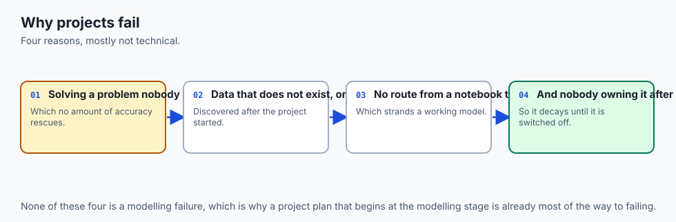

Building a production machine learning service is like opening a Michelin-starred restaurant:

- **The Kaggle View:** You spend all your time perfecting a single recipe for chocolate soufflé in your home kitchen.
- **The Production Lifecycle View:** 
  1. **Scoping:** You decide whether your neighborhood actually wants a French bistro or a fast-casual taco stand.
  2. **Supply Chain (Data Engine):** You establish reliable daily contracts with organic vegetable farmers, inspect incoming crates for spoilage, and store ingredients in temperature-controlled coolers.
  3. **Cooking (Modeling):** You train your chefs on standard culinary baselines before testing experimental molecular gastronomy techniques.
  4. **Quality Inspection (Validation):** Every dish is inspected at the pass for presentation, temperature, and food allergies before leaving the kitchen.
  5. **Dining Room Service (Deployment):** Waiters serve dishes to tables within 12 minutes of ordering, with clean printed menus.
  6. **Customer Feedback (Monitoring):** You monitor plate returns, online reviews, and ingredient waste daily, adjusting the menu each season.

If the supply chain breaks or waiters drop the plates, the genius of your soufflé recipe is completely irrelevant.

---

## Historical background

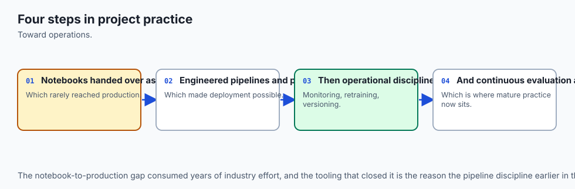

1. **1990s (CRISP-DM):** The *Cross-Industry Standard Process for Data Mining* established the earliest 6-phase framework: Business Understanding, Data Understanding, Data Preparation, Modeling, Evaluation, and Deployment.
2. **2015 (Sculley et al. at Google):** Published *Hidden Technical Debt in Machine Learning Systems*, highlighting that ML systems have all the maintenance challenges of traditional software plus a vast set of ML-specific debts (data dependencies, feedback loops, configuration debt).
3. **2017 (Martin Zinkevich):** Published Google's *Rules of Machine Learning: Best Practices for ML Engineering*, establishing the mandatory hierarchy: build simple heuristics first, build reliable pipelines second, and optimize complex deep models last.
4. **2020–Present (The Rise of MLOps):** Industrialization of dedicated MLOps platforms (MLflow, Kubeflow, Feast, Weights & Biases) turning lifecycle management into repeatable CI/CD code.

---

## What it is — and what it is not

### What the ML Lifecycle IS:
- **An Iterative, Circular Engineering Process:** A continuous loop connecting business scoping, data curation, model training, canary validation, and live observability.
- **A Multi-Disciplinary Operating Framework:** Involving Product Managers, Data Engineers, ML Scientists, and DevOps Site Reliability Engineers (SREs).

### What it is NOT:
- **Not a Linear Waterfall Pipeline:** You do not finish the "Data Phase" once and never look at data again; production drift requires continuous data engine iterations.
- **Not Pure Model Training:** Kaggle-style hyperparameter tuning on static train/test splits is only a single sub-step within Stage 3.

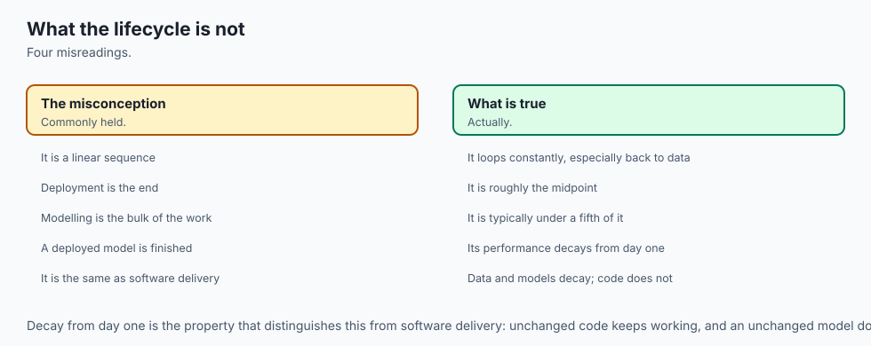

---

## Why it was created and what problems it solves

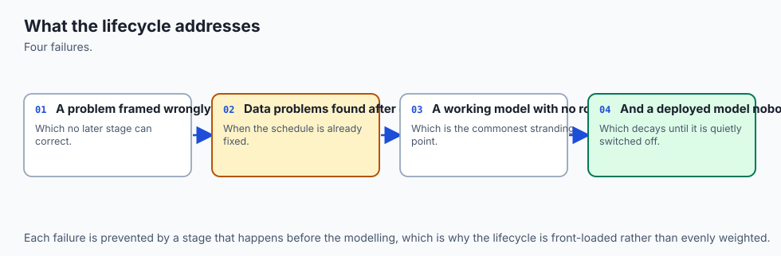

Traditional software engineering assumes deterministic logic: `if user.is_authenticated: show_dashboard()`. If the code passes unit tests, it works indefinitely.

Machine learning software is non-deterministic: its behavior depends on both code AND changing real-world data distributions. A model deployed today with 95% accuracy will slowly degrade as consumer habits change, new competitors enter the market, or sensor hardware ages.

The ML Project Lifecycle was created to manage this inherent uncertainty through structured quality gates, automated testing, and continuous feedback loops.

---

## How it works

Let us dissect the six canonical stages of the production ML lifecycle in rigorous detail.

### 1. The Six Lifecycle Stages

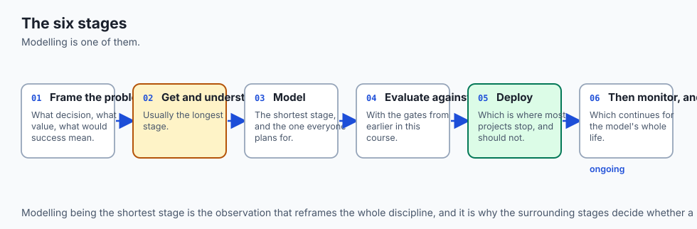

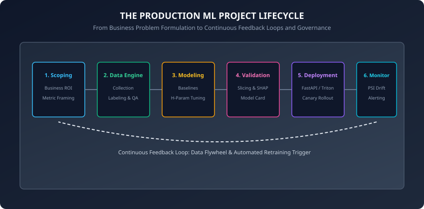

#### Stage 1: Problem Scoping & Metric Framing
Before writing a single line of code, you must translate fuzzy business aspirations into concrete mathematical formulations:

- **Business KPI:** "Reduce customer churn on our SaaS platform from 4.5% to 3.0% monthly."
- **ML Formulation:** Supervised binary classification predicting the probability P(churn within 30 days | user telemetry).
- **Economic Value vs Cost:** If false positives trigger a $10 retention coupon and false negatives lose $120 annual subscription value, the optimal classification threshold must be calibrated using an expected value cost matrix:
  ```
  Expected Cost = C_FP * P(FP) + C_FN * P(FN)
  ```

- **Feasibility & Baselines:** Does the historical database contain at least 6 months of uninterrupted telemetry? If not, ML is infeasible; start by instrumenting event logging.

#### Stage 2: The Data Engine
Data is the fuel of machine learning:

- **Data Ingestion & Extraction:** Automated SQL queries extracting raw interaction events.
- **Schema Contracts & Data Cleaning:** Pydantic and Great Expectations validating that incoming data adheres to strict types, non-null constraints, and numeric ranges.
- **Labeling Strategies:** Human annotation, heuristic labeling functions (Snorkel), or natural product ground truth (e.g. loan defaulted or repaid after 12 months).
- **Dataset Versioning:** Storing immutable data snapshots using tools like DVC (Data Version Control) or Delta Lake.

#### Stage 3: Modeling & Baseline Ladder
Never start with deep neural networks:

1. **Level 0 (Heuristic Baseline):** A deterministic rule (e.g. "Flag users who have not logged in for 14 days as churn risks").
2. **Level 1 (Simple Linear Model):** Logistic Regression or Ridge Regression on 10 handcrafted features.
3. **Level 2 (Gradient Boosted Trees):** LightGBM / XGBoost with cross-validated hyperparameter tuning.
4. **Level 3 (Complex Deep Architecture):** Transformer or Multi-Modal Neural Network (only if Level 2 fails to meet business KPIs).

#### Stage 4: Comprehensive Validation & Slicing
Global aggregate accuracy hides critical failure modes:

- **Subgroup Slicing:** Evaluate precision and recall across key customer cohorts (e.g. mobile vs desktop users, international regions, new vs veteran accounts).
- **Fairness Auditing:** Ensure the model does not exhibit disparate impact across demographic segments.
- **Model Card Governance:** Author standardized technical documentation detailing intended use, limitations, and benchmark metrics.

#### Stage 5: Deployment & Serving Infrastructure
Promoting the model artifact to live traffic:

- **Serving Architecture:** Real-time low-latency REST API (FastAPI) vs high-throughput asynchronous batch processing (Spark).
- **Packaging:** Containerizing the runtime environment using Docker to eliminate "works on my machine" discrepancies.
- **Canary Rollouts:** Routing 5% of traffic to the new candidate model while 95% stays on the current champion model.

#### Stage 6: Monitoring, Observability & Feedback Loops
Maintaining model reliability in the wild:

- **Operational Health:** Latency p95/p99 (ms), throughput (QPS), memory utilization, error rates.
- **Data & Prediction Drift:** Tracking statistical divergence (Population Stability Index / KS-Test) between training feature distributions and live incoming production payloads.
- **The Data Flywheel:** Logging low-confidence production queries and edge cases to feed back into Stage 2 for retraining.

---

### 2. The Deployment Quality Gate Matrix

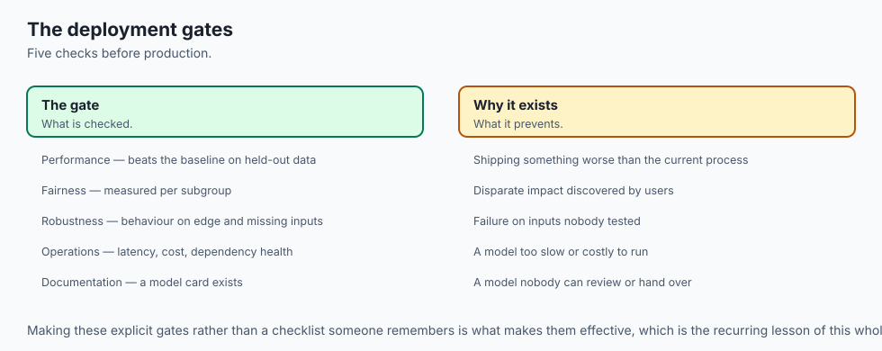

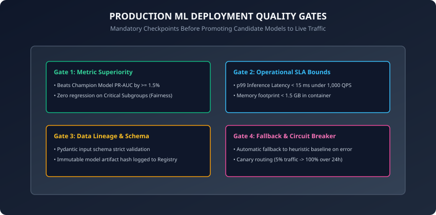

Before any candidate model is allowed to serve production traffic, it must pass four mandatory gates:

| Gate Dimension | Mandatory Verification Standard | Failure Action |
| :--- | :--- | :--- |
| **1. Statistical Superiority** | Candidate PR-AUC &ge; Champion PR-AUC + 1.5% with zero slice regression | Reject candidate artifact |
| **2. Operational SLA Bounds** | p99 inference latency &lt; 15 ms under 1,000 simulated QPS; memory &lt; 1.5 GB | Optimize serialization (ONNX) |
| **3. Schema & Lineage** | Strict Pydantic input contract; immutable Git commit and data hash logged | Block deployment pipeline |
| **4. Fallback Resilience** | Automated Circuit Breaker falling back to Level 0 Heuristic upon exception | Block deployment pipeline |

---

## An everyday analogy

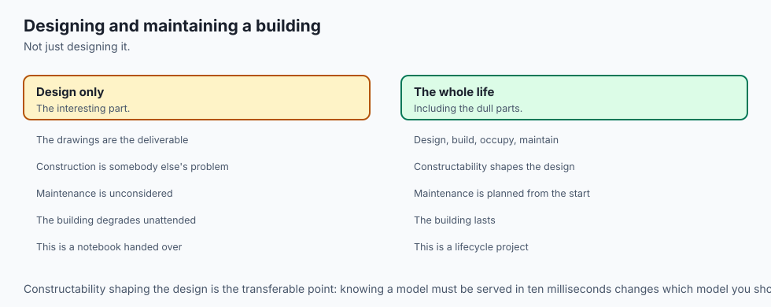

Think of civil engineering and bridge construction:

- You do not build a suspension bridge by immediately pouring concrete into a river.
- **Scoping:** You survey the river span, soil stability, and anticipated daily vehicle traffic.
- **Material Inspection (Data):** Every batch of steel rebar and concrete is stress-tested in a lab for tensile strength.
- **CAD Modeling:** Engineers test structural models against hurricane-force winds and earthquake vibrations.
- **Quality Gates:** Government safety inspectors verify load tolerances before the ribbon-cutting ceremony.
- **Continuous Monitoring:** Strain gauges and vibration sensors monitor bridge cables 24/7 for metal fatigue.

Machine learning engineering is civil engineering for predictive algorithms.

---

## Examples in practice

Let us inspect a complete, modular, pure Python implementation of an automated ML Project Lifecycle Quality Gate Engine:

```python
import numpy as np
from dataclasses import dataclass
from typing import Dict, Any, List

@dataclass
class ModelEvaluationReport:
    model_name: str
    version: str
    overall_pr_auc: float
    slice_pr_auc: Dict[str, float]
    p99_latency_ms: float
    memory_mb: float
    has_schema_validation: bool
    has_fallback_circuit_breaker: bool

class DeploymentQualityGateEngine:
    def __init__(
        self,
        min_pr_auc_improvement: float = 0.015,
        max_slice_drop: float = 0.02,
        max_p99_latency_ms: float = 20.0,
        max_memory_mb: float = 2000.0,
    ):
        self.min_pr_auc_improvement = min_pr_auc_improvement
        self.max_slice_drop = max_slice_drop
        self.max_p99_latency_ms = max_p99_latency_ms
        self.max_memory_mb = max_memory_mb

    def evaluate_gates(
        self, candidate: ModelEvaluationReport, champion: ModelEvaluationReport
    ) -> Dict[str, Any]:
        results = {"passed_all": True, "checks": {}}

        # Gate 1: Overall Metric Superiority
        improvement = candidate.overall_pr_auc - champion.overall_pr_auc
        gate1_passed = improvement >= self.min_pr_auc_improvement
        results["checks"]["metric_superiority"] = {
            "passed": gate1_passed,
            "improvement": round(improvement, 4),
            "required": self.min_pr_auc_improvement,
        }

        # Gate 2: Subgroup Slice Regression
        slice_passed = True
        slice_details = {}
        for s_name, champ_score in champion.slice_pr_auc.items():
            cand_score = candidate.slice_pr_auc.get(s_name, 0.0)
            diff = cand_score - champ_score
            passed = diff >= -self.max_slice_drop
            slice_details[s_name] = {"diff": round(diff, 4), "passed": passed}
            if not passed:
                slice_passed = False

        results["checks"]["slice_regression"] = {
            "passed": slice_passed,
            "details": slice_details,
        }

        # Gate 3: Operational Latency and Memory SLA
        lat_passed = candidate.p99_latency_ms <= self.max_p99_latency_ms
        mem_passed = candidate.memory_mb <= self.max_memory_mb
        results["checks"]["operational_sla"] = {
            "passed": lat_passed and mem_passed,
            "latency_p99_ms": candidate.p99_latency_ms,
            "memory_mb": candidate.memory_mb,
        }

        # Gate 4: Safety, Schema, and Circuit Breakers
        safety_passed = (
            candidate.has_schema_validation and candidate.has_fallback_circuit_breaker
        )
        results["checks"]["safety_infrastructure"] = {
            "passed": safety_passed,
            "schema_validated": candidate.has_schema_validation,
            "circuit_breaker": candidate.has_fallback_circuit_breaker,
        }

        # Global Decision
        results["passed_all"] = (
            gate1_passed and slice_passed and lat_passed and mem_passed and safety_passed
        )
        return results
```

---

## Implications: security, privacy, performance, scalability, and cost

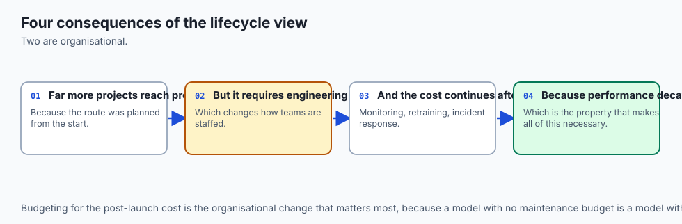

1. **Model Governance and Auditability:**
   - Regulated industries (healthcare, banking) require full traceability: every prediction emitted in production must trace back to the exact training dataset hash, model Git commit SHA, and training hyperparameters.
2. **Cost Optimization via Hardware Tiering:**
   - Running heavy Transformer neural networks on high-end GPUs costs thousands of dollars per month. A tiered architecture routes 90% of simple queries to a lightweight, sub-millisecond CPU model (FastAPI + ONNX), escalating only 10% of ambiguous queries to GPU clusters.
3. **Data Security and Poisoning Defense:**
   - Ingesting unvetted user telemetry exposes systems to adversarial data poisoning. Schema contracts and statistical outlier filters isolate corrupt records before retraining.

---

## Alternatives: free, open source, and commercial

| Tool / Platform | Category | Primary Focus | Best For |
| :--- | :--- | :--- | :--- |
| **MLflow** | Open Source | Experiment tracking & model registry | Multi-framework teams |
| **DVC (Data Version Control)** | Open Source | Git-like dataset versioning | Local & cloud data pipelines |
| **Weights & Biases (W&B)** | Commercial / SaaS | Deep learning experiment logging | Research & enterprise teams |
| **Feast** | Open Source | Production feature store | Low-latency real-time ML |
| **Evidently AI** | Open Source | Production drift & data quality | Monitoring & reporting |

---

## Comparison with related concepts

```
┌────────────────────────────────────────────────────────────────────────┐
│               ENGINEERING PARADIGM COMPARISON                          │
├────────────────────────────────────────────────────────────────────────┤
│ Dimension          │ Traditional Software │ Competitive ML │ MLOps     │
├────────────────────┼──────────────────────┼────────────────┼───────────┤
│ Artifact Shipped   │ Compiled Code        │ Static Model   │ Pipeline  │
│ Degradation Rate   │ Zero (Deterministic) │ N/A (One-off)  │ Continuous│
│ Testing Focus      │ Unit / Integration   │ Test Split     │ Data + SLA│
│ Feedback Loop      │ Bug Reports          │ None           │ Flywheel  │
└────────────────────────────────────────────────────────────────────────┘
```

---

## When to use it — and when not to

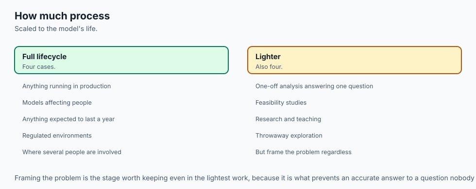

### When to USE the Full ML Project Lifecycle:
- In all production customer-facing services, automated decision pipelines, and enterprise risk systems.
- When model predictions directly impact financial revenue, user safety, or operational uptime.

### When NOT to use it:
- During one-off exploratory data analysis (EDA) or rapid academic prototyping.
- When deterministic SQL business rules achieve 98% of the business objective without statistical uncertainty.

---

## The AI connection

- **Most machine learning projects fail for non-technical reasons** — the wrong problem,
  unusable data, or no path to deployment.
- **The lifecycle exists because the modelling step is the small part**, and the surrounding
  stages decide the outcome.
- **Deployment gates prevent a model reaching production before it is ready**, which is the
  same discipline as the gates in the classification project.
- **Monitoring and retraining are part of the project**, not a handover to someone else.
- **The identical lifecycle governs AI systems**, with evaluation sets and prompts in place
  of training sets and features.

## Knowledge check

1. What are the 6 canonical stages of the production machine learning lifecycle?
2. Why is establishing a simple heuristic baseline mandatory before training complex gradient boosted trees or neural networks?
3. What four quality gates must a candidate model satisfy before promotion to live traffic?
4. How does a Canary Deployment minimize the operational blast radius of a model release?
5. What is the role of an automated Circuit Breaker in a real-time ML microservice?

---

## Hands-on exercise

In this lab, you will implement `DeploymentQualityGateEngine` in pure Python, evaluate a candidate model against a production champion baseline across statistical, subgroup slice, latency SLA, and safety infrastructure dimensions, and determine promotion decisions.

### Expected output
```
[ML Lifecycle Quality Gate Engine]
Champion: v1.0.0 (PR-AUC: 0.8420, Latency: 8.5ms)
Candidate: v1.1.0 (PR-AUC: 0.8650, Latency: 11.2ms)
Gate 1 (Metric Superiority): PASSED (+2.3% improvement)
Gate 2 (Slice Regression): PASSED (Max drop: -0.8%)
Gate 3 (Operational SLA): PASSED (p99 < 20ms)
Gate 4 (Safety Infrastructure): PASSED (Schema + Fallback)
Deployment Decision: PROMOTED TO CANARY (5% Traffic)
Test Suite: 2 passed in 0.08s
```

### Validate your work
Run the automated test runner:
```bash
./tests/run_tests.sh
```

### Troubleshooting
- If gate evaluation fails due to missing slice keys, ensure candidate dictionaries contain all required cohort names.
- Verify that latency measurements use milliseconds (`ms`) rather than seconds.

### Common mistakes
- **Ignoring Subgroup Slice Drops:** Approving a candidate model that achieves higher overall accuracy while regressing by 15% on a high-value customer segment.

---

## Practice assignment

1. Implement an automated **Cost-Benefit Matrix Evaluator** that computes expected dollar savings between candidate and champion models under custom FP and FN penalty costs.
2. Build an automated model card markdown generator that renders deployment gate results into structured audit documentation.

---

## Extension challenge

Implement an automated **Canary Traffic Router and Rollback Controller**:

- Simulate live inference requests with synthetic response latencies and error injection.
- Dynamically route traffic from 5% to 25% to 100% over simulated hourly increments.
- Trigger an instant automated rollback to champion baseline if error rates spike above 1.0%.
