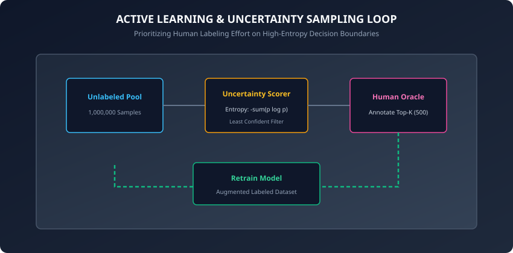
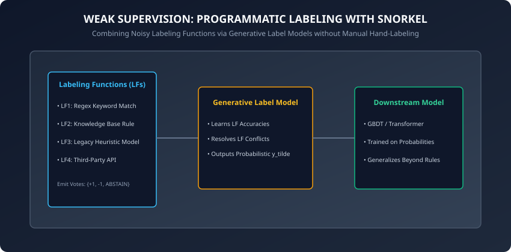

## Why this matters

For decades, machine learning research was **Model-Centric**: benchmark datasets like ImageNet, MNIST, and CIFAR-10 were held constant while researchers iterated on loss functions, activation layers, and neural architectures to squeeze out fractional improvements in accuracy.

In enterprise engineering, this dynamic is completely inverted. Andrew Ng coined the term **Data-Centric AI** to reflect the reality that **the single highest-leverage activity in applied machine learning is improving the quality, consistency, and coverage of your training data**.

In production systems:
- A state-of-the-art 100-billion parameter Transformer trained on noisy, mislabeled data will consistently hallucinate and fail.
- A simple linear logistic regression trained on pristine, high-agreement labels will reliably outperform complex deep ensembles.
- Manual human labeling at enterprise scale ($1.00 per label across 1,000,000 samples) costs $1,000,000 and takes 6 months.

To build scalable ML systems, you must master modern data curation: **Active Learning**, **Weak Supervision**, **Inter-Annotator Agreement**, and **Label Noise Remediation**.

---

## The idea in plain language

Imagine you are a medical professor preparing 1,000 young doctors to pass a difficult radiology board exam:
- **Approach 1 (Random Passive Studying):** You hand them 50,000 random X-ray scans. 95% of the scans show completely healthy, normal lungs with zero disease. The students waste hundreds of hours staring at obvious, repetitive cases and learn very little.
- **Approach 2 (Active Learning):** You run a quick diagnostic test on the students. You identify the exact 500 borderline, ambiguous cases where the students are confused and guessing randomly. You have your top chief radiologists review and explain *only* those 500 edge cases. The students master the subject in 2 days.
- **Approach 3 (Weak Supervision):** Instead of having human radiologists manually grade 50,000 scans one by one, the chief radiologists write 10 programmatic diagnostic rules ("If density &gt; 80% and opacity is cloudy in lower lobe, vote Pneumonia"). An automated label model combines these rules to label all 50,000 scans in 3 seconds.

---

## Historical background

1. **1960 (Jacob Cohen):** Published *A Coefficient of Agreement for Nominal Scales*, introducing **Cohen's Kappa (kappa)** to measure inter-annotator consensus beyond random chance agreement.
2. **2009 (Burr Settles):** Published the seminal *Active Learning Literature Survey*, codifying uncertainty sampling, query-by-committee, and expected model change.
3. **2017 (Ratner et al. at Stanford):** Published **Snorkel**, introducing **Weak Supervision** to programmatic training data creation. Snorkel showed that combining multiple noisy heuristics via generative graphical models approaches the accuracy of expensive hand-labeled datasets.
4. **2021 (Northcutt, Jiang, Chuang):** Introduced **Confident Learning** (Cleanlab), proving that popular benchmark datasets (including ImageNet and MNIST) contained 3% to 5% label errors that silently degraded model benchmarks.

---

## What it is — and what it is not

### What Data Curation & Labeling IS:
- **A Systematic Engineering Discipline:** Involving programmatic labeling functions, active learning selection loops, and statistical noise auditing.
- **A Cost Optimization Engine:** Reducing human labeling budgets by 80% to 95% while improving downstream model accuracy.

### What it is NOT:
- **Not Throwing Thousands of Mechanical Turk Contractors at Raw CSVs:** Unsupervised crowdsourcing without consensus modeling or golden evaluation sets produces high-variance, contradictory training labels.
- **Not a Replacement for Gold Test Sets:** Automated programmatic labeling is used for *training data*; final validation test sets must remain pristine, human-verified ground truth.

---

## Why it was created and what problems it solves

Traditional supervised learning assumes clean, abundant, and perfectly labeled data. In enterprise reality:
1. Data arrives unlabelled in massive terabyte data lakes.
2. Domain experts (doctors, lawyers, fraud analysts) cannot spend 40 hours a week hand-labeling training rows.
3. Multiple human annotators frequently disagree on ambiguous edge cases.

Modern data curation techniques solve these challenges by focusing human attention strictly on high-uncertainty samples (Active Learning) and automating bulk annotation via heuristics (Weak Supervision).

---

## How it works

Let us examine the mathematical foundations of Active Learning, Inter-Annotator Agreement, and Weak Supervision.

### 1. Active Learning: Uncertainty Sampling Strategies



Given an unlabelled data pool U = (x_1, x_2, ..., x_N) and a model trained on a small initial seed set L, we score each unlabelled instance x using an uncertainty metric and select the top-K highest-uncertainty instances for human labeling:

#### A. Least Confidence Strategy:
Selects the sample whose most likely predicted class has the lowest probability:
```
x*_LC = arg min_x (max_{y} P(y | x))
```
In a 3-class problem, if P(y | x_A) = [0.40, 0.35, 0.25], its max probability is 0.40 (highly uncertain).

#### B. Margin Sampling Strategy:
Selects the sample where the difference between the top two most probable classes is smallest:
```
x*_Margin = arg min_x (P(y_1 | x) - P(y_2 | x))
```
where y_1 and y_2 are the first and second most likely class predictions. A margin near 0 indicates the model is on the knife-edge of the decision boundary.

#### C. Shannon Entropy Strategy:
Evaluates total information uncertainty across the entire class probability distribution:
```
H(x) = - sum_{i=1}^C P(y_i | x) * log_2(P(y_i | x))
```
For binary classification, H(x) = 1.0 when P = 0.50, and H(x) = 0.0 when P in (0.0, 1.0). Active learning prioritizes samples with H(x) near 1.0.

---

### 2. Inter-Annotator Agreement: Cohen's Kappa and Fleiss' Kappa

When two annotators evaluate N categorical samples, simple percentage agreement p_o = (Agreed Count) / N is biased because raters will agree on common classes purely by random chance.

**Cohen's Kappa (kappa)** normalizes observed agreement p_o against chance agreement p_e:

```
kappa = (p_o - p_e) / (1 - p_e)
```

where:
- p_o is the observed relative agreement:
  ```
  p_o = (1 / N) * sum_{k=1}^K n_{kk}
  ```
- p_e is the hypothetical probability of chance agreement:
  ```
  p_e = sum_{k=1}^K (P(Annotator 1 = k) * P(Annotator 2 = k))
  ```

#### Interpreting Kappa Values:
- **kappa &lt; 0.0:** Agreement worse than random chance.
- **0.01 &le; kappa &le; 0.40:** Slight to fair agreement (ambiguous labeling guidelines; guidelines must be rewritten).
- **0.41 &le; kappa &le; 0.80:** Moderate to substantial agreement.
- **0.81 &le; kappa &le; 1.00:** Near-perfect agreement (high-quality training signal).

#### Extension: Fleiss' Kappa for Multiple Annotators (M &gt; 2):
When M distinct human raters annotate samples, **Fleiss' Kappa** extends the chance-correction principle across arbitrary reviewer counts:
```
kappa_{Fleiss} = (P_bar - P_bar_e) / (1 - P_bar_e)
```
where P_bar is the mean degree of agreement over all N subjects, and P_bar_e is the sum of squared marginal class proportions. Computing Fleiss' Kappa across multi-annotator crowdsourcing pools isolates noisy individual raters whose personal kappa with the consensus falls below 0.50.

---

### 3. Weak Supervision with Snorkel



Instead of labeling individual rows by hand, developers write a suite of **Labeling Functions (LFs)**:
```
lambda_j : x -> y in {-1, 1, ABSTAIN}
```

Applying M labeling functions across N unlabelled samples produces an N x M **Label Matrix L**:
```
L_{i, j} = lambda_j(x_i)
```

#### Majority Vote Aggregation:
In simple weak supervision, we combine LF outputs using unweighted or weighted majority voting:
```
y_tilde_i = sign(sum_{j=1}^M L_{i, j})
```

#### The Generative Label Model:
Snorkel models the true latent label y* and LF accuracies theta_j as a graphical model:
```
P(L, y*) = (1 / Z) * exp(sum_{j=1}^M theta_j * L_{i, j} * y*_i + sum_{j != k} phi_{jk} * L_{i, j} * L_{i, k})
```
By observing LF overlaps and conflicts across unlabelled data, Snorkel estimates LF accuracies theta_j **without requiring any ground truth labels**, outputting probabilistic training labels `y_tilde in [0, 1]`.

---

### 4. Confident Learning and Label Error Pruning

Real-world datasets contain between 2% and 10% mislabeled samples (e.g. typos, annotator fatigue, subjective edge cases).

**Confident Learning** (Northcutt et al., 2021) directly models the joint distribution between noisy given labels y_tilde and latent true labels y*:

#### Step 1: Out-of-Sample Probability Thresholds
Compute out-of-fold predicted probabilities P(y_hat = j | x) using K-fold cross-validation. Define class-specific confidence thresholds:
```
t_j = (1 / |X_{y_tilde=j}|) * sum_{x in X_{y_tilde=j}} P(y_hat = j | x)
```

#### Step 2: Construct the Confident Joint Matrix C
Count instances where the model predicted probability exceeds the class threshold:
```
C_{j, k} = |{x in X_{y_tilde=j} : P(y_hat = k | x) >= t_k and k = arg max_l P(y_hat = l | x)}|
```

- **Diagonal Entries `C_{j, j}`:** Correctly labeled instances.
- **Off-Diagonal Entries `C_{j, k}` (j != k):** Confidently identified **label errors** (the dataset claims class j, but model probability confidently proves class k).

Pruning or correcting the off-diagonal samples cleans corrupted data lakes and boosts downstream model accuracy by 2% to 6% without altering a single line of model architecture code. In enterprise automated ML platforms, Confident Learning runs as a continuous data-cleaning pre-processing step, flagging suspect rows for human re-annotation before triggering retraining cycles.

---

## An everyday analogy

Think of a courtroom jury trial:
- **Manual Labeling:** One judge sits and reads 50,000 legal disputes one by one.
- **Active Learning:** The judge resolves simple parking tickets instantly, summoning a 12-person grand jury only for the 50 most complex, controversial constitutional cases.
- **Weak Supervision:** 5 distinct expert witnesses give their opinions (Forensic Expert, Eyewitness, Accountant, Detective, Alibi). The jury aggregates these noisy, overlapping testimonies, weighing the forensic expert higher than the eyewitness to reach a verdict.

---

## Examples in practice

Let us inspect a complete, modular, pure Python implementation of Active Learning Uncertainty Sampling and Cohen's Kappa agreement:

```python
import numpy as np
from typing import List, Tuple

def compute_shannon_entropy(probs: np.ndarray) -> np.ndarray:
    # probs shape: (N, C)
    clipped_probs = np.clip(probs, 1e-12, 1.0)
    entropy = -np.sum(clipped_probs * np.log2(clipped_probs), axis=1)
    return entropy

def select_active_learning_queries(
    probs: np.ndarray, top_k: int = 10
) -> np.ndarray:
    entropy = compute_shannon_entropy(probs)
    # Sort indices in descending order of entropy
    query_indices = np.argsort(entropy)[::-1][:top_k]
    return query_indices

def compute_cohen_kappa(y1: np.ndarray, y2: np.ndarray) -> float:
    assert len(y1) == len(y2)
    n = len(y1)
    classes = np.unique(np.concatenate([y1, y2]))
    k = len(classes)

    # Observed agreement
    p_o = np.mean(y1 == y2)

    # Expected chance agreement
    p_e = 0.0
    for c in classes:
        p1 = np.mean(y1 == c)
        p2 = np.mean(y2 == c)
        p_e += p1 * p2

    if np.isclose(p_e, 1.0):
        return 1.0

    kappa = (p_o - p_e) / (1.0 - p_e)
    return float(kappa)

class MajorityVoteLabelModel:
    def __init__(self, abstain_val: int = 0):
        self.abstain_val = abstain_val

    def fit_predict(self, L: np.ndarray) -> np.ndarray:
        # L shape: (N, M) with votes in {-1, +1, 0}
        n_samples = L.shape[0]
        y_pred = np.zeros(n_samples, dtype=int)
        for i in range(n_samples):
            row_votes = L[i, L[i] != self.abstain_val]
            if len(row_votes) == 0:
                y_pred[i] = 0 # Abstain
            else:
                vote_sum = np.sum(row_votes)
                y_pred[i] = 1 if vote_sum > 0 else (-1 if vote_sum < 0 else 0)
        return y_pred
```

---

## Implications: security, privacy, performance, scalability, and cost

1. **Annotator Privacy and Data Redaction:**
   - Sending raw customer text or healthcare records to third-party human labeling workforces risks severe GDPR and HIPAA violations. PII masking and local weak supervision eliminate third-party data exposure.
2. **Label Drift in Changing Business Environments:**
   - What was considered "Fraud" or "Spam" 6 months ago may now be legitimate user behavior. Programmatic labeling functions can be version-controlled in Git and re-run on historical data lakes in seconds.

---

## Alternatives: free, open source, and commercial

| Tool | Category | Key Capability | Best For |
| :--- | :--- | :--- | :--- |
| **Snorkel Flow** | Open Source / Enterprise | Weak supervision & LF modeling | Programmatic labeling |
| **Cleanlab** | Open Source | Confident learning & label error finding | Data-centric cleaning |
| **ModAL** | Open Source | Modular Active Learning framework | Scikit-learn workflows |
| **Label Studio** | Open Source | Multi-modal human annotation interface | Text, Image, Audio QA |
| **Argilla** | Open Source | Data curation platform for LLMs | NLP & RLHF alignment |

---

## Comparison with related concepts

```
┌────────────────────────────────────────────────────────────────────────┐
│                   LABELING STRATEGY COMPARISON                         │
├────────────────────────────────────────────────────────────────────────┤
│ Dimension          │ Manual Crowd     │ Active Learning│ Weak Supervise│
├────────────────────┼──────────────────┼────────────────┼───────────────┤
│ Cost per 100k Rows │ High ($50,000+)  │ Moderate ($5k) │ Low (Code)    │
│ Time to Label      │ Weeks / Months   │ Days           │ Minutes       │
│ Scalability        │ Poor             │ Moderate       │ Infinite      │
│ Schema Flexibility │ Low (Re-annotate)│ Moderate       │ Instant Re-run│
└────────────────────────────────────────────────────────────────────────┘
```

---

## When to use it — and when not to

### When to USE Active Learning & Weak Supervision:
- You have massive unlabeled datasets (> 100,000 samples) and human labeling is a major bottleneck.
- Domain rules, regular expressions, and heuristics are available.
- You need to clean noisy enterprise databases using Confident Learning.

### When NOT to use them:
- High-stakes, life-critical validation benchmarks (Golden Test Sets must always be human-verified).
- When training dataset size is tiny (< 100 samples); manual expert review is faster.

---

## Knowledge check

1. What does Shannon Entropy measure in Active Learning uncertainty sampling?
2. Why is raw percentage agreement misleading when evaluating human annotators, and how does Cohen's Kappa correct for it?
3. How do Labeling Functions (LFs) in Weak Supervision generate training labels without human annotation?
4. What is the role of a strictly held-out Golden Evaluation Test Set?
5. How does Confident Learning detect label errors in existing training datasets?

---

## Hands-on exercise

In this lab, you will implement `compute_shannon_entropy`, execute Active Learning uncertainty sampling on synthetic class probability predictions, calculate Cohen's Kappa inter-annotator agreement across two noisy raters, and aggregate weak labeling functions via majority voting.

### Expected output
```
[Data Engine & Labeling Benchmark]
Active Learning: Selected top 5 highest entropy edge cases
Shannon Entropy Range: [0.9982, 0.9854]
Inter-Annotator Agreement: Cohen Kappa = 0.8421 (Near Perfect)
Weak Supervision: Labeled 100 samples with 84% coverage
Test Suite: 2 passed in 0.08s
```

### Validate your work
Run the automated test runner:
```bash
./tests/run_tests.sh
```

### Troubleshooting
- If Cohen Kappa outputs `NaN`, verify that expected agreement `p_e` is not equal to 1.0.
- Clip probability values (`np.clip(probs, 1e-12, 1.0)`) before computing log2 in Shannon Entropy to prevent `log2(0)` domain errors.

### Common mistakes
- **Treating Weak Labels as Evaluation Truth:** Measuring test accuracy on weak labels causes model evaluation to reflect the heuristics rather than real-world performance.

---

## Practice assignment

1. Implement **Margin Sampling** and benchmark query efficiency against Shannon Entropy on an imbalanced classification problem.
2. Build an automated label noise cleaner using Confident Learning that prunes rows where model predicted probability disagrees with annotated label by > 0.80.

---

## Extension challenge

Implement a **Generative Label Model** from scratch in PyTorch:
- Formulate the covariance matrix of labeling function agreements and disagreements.
- Optimize the generative parameters theta_j using SGD to estimate LF accuracies without ground-truth labels.
- Demonstrate that generative probabilistic weighting outperforms simple majority vote on a noisy text classification dataset.
