## Why this matters

Almost every high-stakes business decision in modern enterprise operations depends on predicting the future:

- **Cloud Infrastructure Capacity:** How many server instances will our Kubernetes cluster require at 8:00 PM tomorrow to prevent 504 gateway timeouts?
- **Retail Supply Chain & Inventory:** How many units of fresh strawberries should an Amazon Fresh warehouse order for Friday morning to avoid stockouts and food spoilage?
- **Energy Grid Management:** How many megawatts of power will the Texas electrical grid consume during a severe winter storm?
- **Financial Liquidity:** What will our daily cash withdrawal demand be across 5,000 retail bank ATMs next week?

However, standard machine learning tabular pipelines fail completely when applied naively to temporal data. In standard supervised learning, observations are assumed to be **Independent and Identically Distributed (i.i.d.)**.

In time-series forecasting, the i.i.d. assumption is completely violated: **today value is strongly dependent on yesterday value, last week value, and seasonal macroeconomic trends**. 

To build reliable forecasting engines, you must master the fundamental physics of temporal modeling: **Stationarity**, **Autoregressive Feature Engineering**, **Walk-Forward Cross-Validation**, and **Temporal Evaluation Metrics**.

---

## The idea in plain language

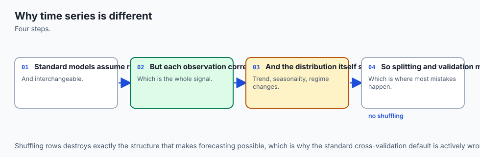

Imagine standing on the seashore watching ocean waves crash onto the beach:

- If you want to predict how high the next wave will reach on the sand in 10 seconds:
  1. **The Fast Physics (Lags):** You look at the height of the wave that just crashed 5 seconds ago (Lag 1) and 10 seconds ago (Lag 2).
  2. **The Cyclic Pattern (Seasonality):** You know that high tide reaches its peak twice every 24 hours, and weekend tourist boats create rhythmic wake ripples every 30 minutes.
  3. **The Macro Trend (Secular Drift):** You account for sea-level rise and rising storm surges pushing the overall baseline higher over the course of the afternoon.
  4. **The Golden Rule:** You cannot look at where a wave will crash at 4:00 PM to help you predict where the wave will crash at 2:00 PM. **You can only look backward in time.**

---

## Historical background

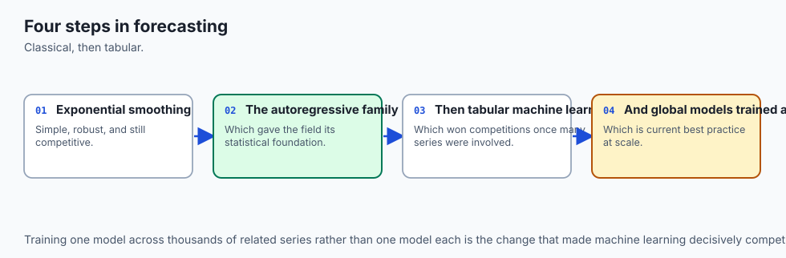

1. **1927 (George Udny Yule):** Introduced **Autoregressive (AR)** models to model the periodicity of sunspot cycles, creating the mathematical foundation of stochastic temporal processes.
2. **1970 (George Box and Gwilym Jenkins):** Published *Time Series Analysis: Forecasting and Control*, establishing the unified **ARIMA (Autoregressive Integrated Moving Average)** framework.
3. **1979 (David Dickey and Wayne Fuller):** Developed the **Augmented Dickey-Fuller (ADF)** statistical test to determine whether a time series has a unit root (non-stationarity).
4. **2017 (Meta Research - Taylor & Letham):** Released **Prophet**, a decomposable additive Bayesian model tailored for business forecasting with complex holidays and changepoints.
5. **2018–Present (Tabular GBDT Dominance & Deep Transformers):** M5 Forecasting competition proved that Gradient Boosted Decision Trees (LightGBM) with lag and rolling features consistently outperform classical ARIMA on massive multi-series retail datasets.

---

## What it is — and what it is not

### What Time-Series Forecasting IS:
- **A Sequential Extrapolation Problem:** Estimating target values y_(t+h) across forecast horizon h given historical information set F_t = (y_t, y_(t-1), ..., x_t).
- **A Strict Temporal Order Engine:** Requiring chronological expanding-window validation where train sets strictly precede test sets.

### What it is NOT:
- **Not Standard I.I.D. Regression:** Shuffling rows randomly or using standard scikit-learn `train_test_split(shuffle=True)` creates catastrophic lookahead leakage.
- **Not Magic Curve Fitting:** Extrapolating complex polynomial curves into the distant future without bounding assumptions will result in catastrophic predictions.

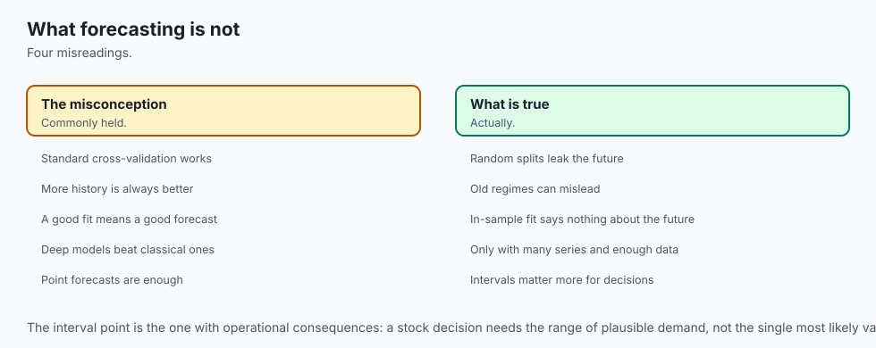

---

## Why it was created and what problems it solves

Traditional regression models treat each row as an isolated event with no memory. If you feed yesterday temperature and today temperature as independent rows without temporal links, the model cannot capture momentum, acceleration, or calendar periodicity.

Time-series forecasting solves this by structuring historical sequence memory into explicit autoregressive lags, moving statistics, and seasonal Fourier harmonics.

---

## How it works

Let us dissect the mathematical formulation of Time Series Decomposition, Stationarity, Lag Engineering, and Walk-Forward Validation.

### 1. Classical Time Series Decomposition

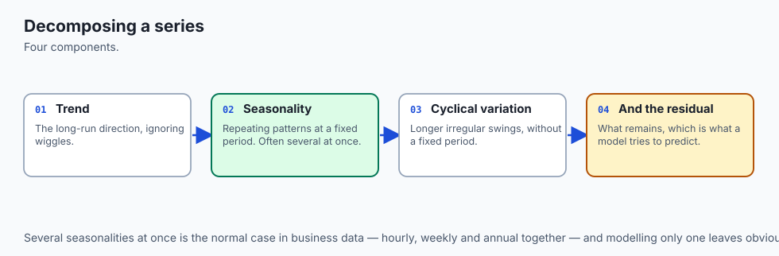

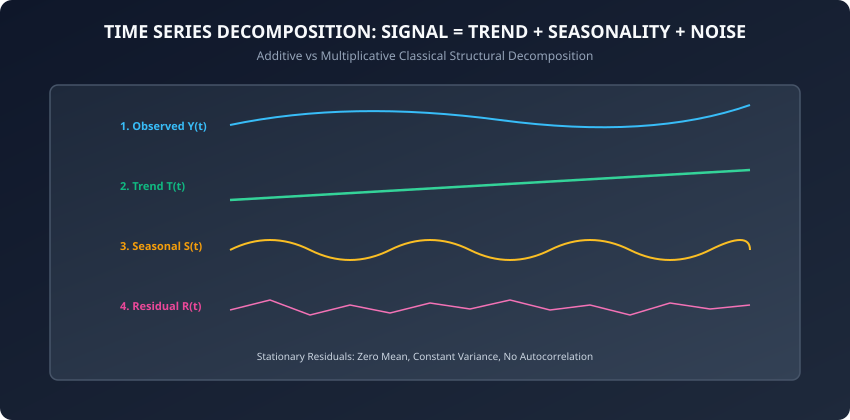

Any observed time series Y(t) can be decomposed into three distinct structural components:

#### A. Additive Decomposition (Constant Seasonal Amplitude):
```
Y(t) = T(t) + S(t) + R(t)
```
Used when the magnitude of seasonal swings does not change as the underlying trend grows.

#### B. Multiplicative Decomposition (Proportional Seasonal Amplitude):
```
Y(t) = T(t) * S(t) * R(t)
```
Used when seasonal oscillations grow proportionally with the trend (e.g. airline passenger volume growing from 100k to 1M passengers, where holiday spikes grow from 10k to 100k).

- **Trend T(t):** Long-term secular direction (upward growth or downward contraction) computed via centered moving average filters.
- **Seasonality S(t):** Repeating cyclical patterns with fixed, known frequency (e.g. 7 days for weekly retail patterns, 12 months for annual weather).
- **Residual / Irregular R(t):** The remaining stochastic noise after removing trend and seasonality.

---

### 2. Stationarity and Differencing

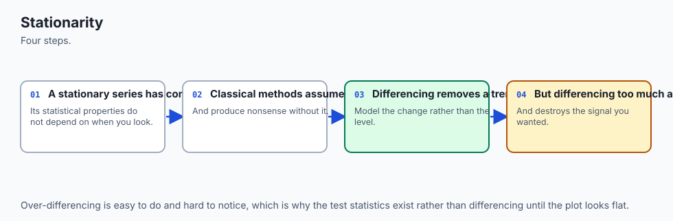

A time series Y(t) is **Wide-Sense Stationary (WSS)** if:

1. **Constant Mean:** E[Y(t)] = mu for all t.
2. **Constant Variance:** Var(Y(t)) = sigma^2 for all t.
3. **Time-Invariant Autocovariance:** Cov(Y(t), Y(t-k)) = gamma_k depends only on lag k, not absolute time t.

#### First-Order Differencing (Removing Linear Trend):
If Y(t) has a non-stationary upward trend, first-order differencing computes the period-over-period change:
```
Delta Y(t) = Y(t) - Y(t-1)
```

#### Seasonal Differencing (Removing Periodic Seasonality):
For weekly seasonality with period m = 7:
```
Delta_m Y(t) = Y(t) - Y(t-m) = Y(t) - Y(t-7)
```

---

### 3. Autocorrelation (ACF) and Partial Autocorrelation (PACF)

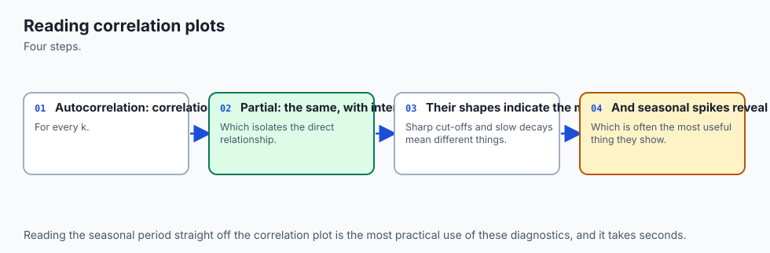

To determine how many historical lag terms to include, time-series engineers analyze correlation structures:

#### A. Autocorrelation Function (ACF):
Measures the linear correlation between Y(t) and Y(t-k) across all intermediate lags:
```
rho_k = Cov(Y(t), Y(t-k)) / (Var(Y(t)) * Var(Y(t-k)))
```
A slow, linear decay in the ACF plot indicates a non-stationary trend requiring differencing. Sharp spikes at lags 7, 14, 21 indicate weekly seasonality.

#### B. Partial Autocorrelation Function (PACF):
Measures the direct correlation between Y(t) and Y(t-k) after statistically controlling for and removing the linear effects of all intermediate lags (t-1, ..., t-k+1):
```
alpha_k = Corr(Y(t) - P_{t-1}(Y(t)), Y(t-k) - P_{t-1}(Y(t-k)))
```
In an Autoregressive process AR(p), the PACF cuts off sharply to zero after lag p, providing the exact optimal number of lag features for regression.

---

### 4. Classical Statistical Baselines: ARIMA and Exponential Smoothing

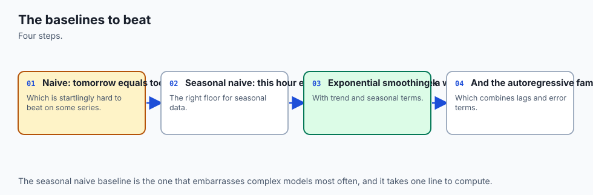

Before training complex machine learning models, statistical baselines provide benchmark performance:

#### A. Exponential Smoothing (Holt-Winters):
Applies exponentially decaying weights to past observations:
```
Level:   L(t) = alpha * Y(t) + (1 - alpha) * (L(t-1) + T(t-1))
Trend:   T(t) = beta * (L(t) - L(t-1)) + (1 - beta) * T(t-1)
Seasonal: S(t) = gamma * (Y(t) - L(t)) + (1 - gamma) * S(t-m)
```
where alpha, beta, and gamma are smoothing parameters in [0, 1].

#### B. ARIMA(p, d, q):
Combines Autoregression (p), Integration/Differencing (d), and Moving Average error terms (q):
```
(1 - sum_{i=1}^p phi_i * B^i) * (1 - B)^d * Y(t) = c + (1 + sum_{j=1}^q theta_j * B^j) * epsilon_t
```
where B is the backshift operator (B * Y(t) = Y(t-1)) and epsilon_t is white noise.

---

### 5. Tabular Feature Engineering for Forecasting

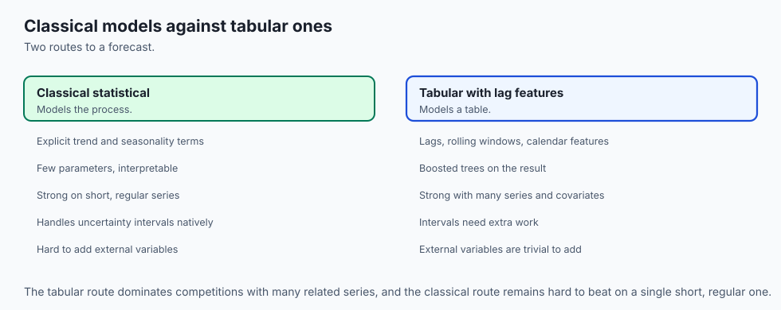

Modern enterprise ML models (LightGBM, XGBoost, Ridge) reframe time series into tabular supervised learning matrices `X in R^{N x D}` -> `y in R^N`:

#### A. Autoregressive Lag Features:
```
Lag_1(t) = Y(t-1),  Lag_2(t) = Y(t-2),  Lag_7(t) = Y(t-7)
```

#### B. Rolling Window Moving Statistics:
Aggregating past values over moving window of width w:
```
RollingMean_w(t) = (1 / w) * sum_{i=1}^w Y(t-i)
RollingStd_w(t)  = sqrt((1 / w) * sum_{i=1}^w (Y(t-i) - RollingMean_w(t))^2)
```
*Crucial Rule:* The rolling window must strictly cover historical time steps (t-1, ..., t-w) and NEVER include the current target time step t.

#### C. Cyclical Trigonometric Calendar Encodings:
For periodic calendar features (e.g. day of week d in [0, 6]):
```
d_sin = sin(2 * pi * d / 7),  d_cos = cos(2 * pi * d / 7)
```

---

### 6. Walk-Forward Expanding Window Cross-Validation

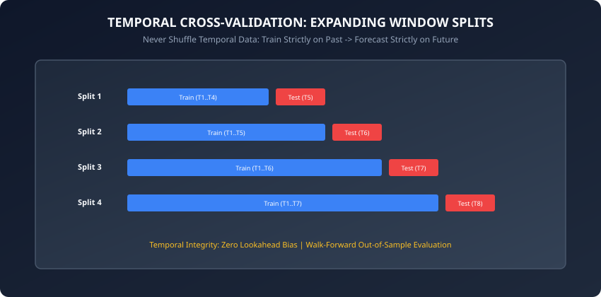

Standard K-Fold cross-validation leaks future information into past predictions. **Walk-Forward Validation (TimeSeriesSplit)** evaluates models across expanding historical splits:

- **Split 1:** Train on [T1..T4] -> Test on [T5]
- **Split 2:** Train on [T1..T5] -> Test on [T6]
- **Split 3:** Train on [T1..T6] -> Test on [T7]
- **Split 4:** Train on [T1..T7] -> Test on [T8]

Every single forecast is evaluated strictly out-of-sample on unseen future time horizons.

---

### 7. Forecasting Evaluation Metrics

1. **Mean Absolute Error (MAE):**
   ```
   MAE = (1 / N) * sum_{t=1}^N |Y(t) - Y_hat(t)|
   ```

2. **Mean Absolute Percentage Error (MAPE):**
   ```
   MAPE = (100% / N) * sum_{t=1}^N |(Y(t) - Y_hat(t)) / Y(t)|
   ```

3. **Symmetric MAPE (sMAPE):**
   ```
   sMAPE = (100% / N) * sum_{t=1}^N (2 * |Y(t) - Y_hat(t)|) / (|Y(t)| + |Y_hat(t)| + 1e-12)
   ```
   sMAPE bounds percentage error strictly between 0% and 200%, preventing numerical instability when actual values Y(t) are close to zero.

---

## An everyday analogy

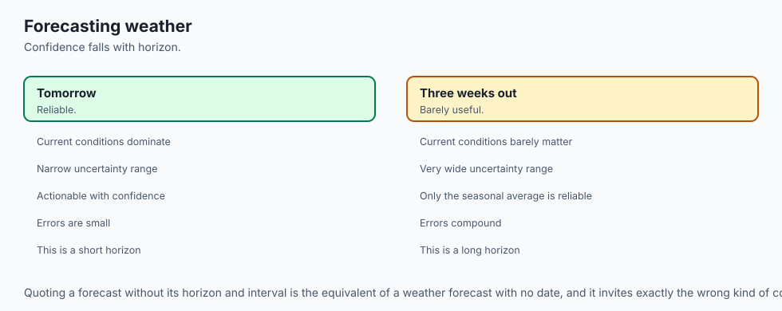

Think of driving a car forward down a winding mountain highway at night:

- **Lookahead Bias (K-Fold Leakage):** Teleporting 5 miles ahead to see where the road turns, then driving backward to test your headlights.
- **Autoregressive Lags:** Checking your speedometer and rear-view mirror to see how fast you were traveling 5 seconds ago.
- **Rolling Mean:** Calculating your average fuel efficiency over the past 20 miles.
- **Walk-Forward Validation:** Driving strictly using your headlights, illuminating 100 feet of road ahead at a time and measuring how well you stay in your lane around each sequential bend.

---

## Examples in practice

Let us inspect a pure NumPy implementation of Lag and Rolling Feature Engineering, Time Series Splitter, and sMAPE metric evaluation:

```python
import numpy as np
from typing import Tuple, List

def create_lag_and_rolling_features(
    series: np.ndarray, lags: List[int] = [1, 2, 7], window_size: int = 7
) -> Tuple[np.ndarray, np.ndarray]:
    n = len(series)
    max_lag = max(max(lags), window_size)
    
    features = []
    targets = []

    for t in range(max_lag, n):
        row = []
        # 1. Autoregressive Lags
        for lag in lags:
            row.append(series[t - lag])

        # 2. Rolling Window Mean and Std (strictly past values)
        past_window = series[t - window_size : t]
        row.append(np.mean(past_window))
        row.append(np.std(past_window))

        features.append(row)
        targets.append(series[t])

    return np.array(features), np.array(targets)

def compute_smape(y_true: np.ndarray, y_pred: np.ndarray) -> float:
    denom = np.abs(y_true) + np.abs(y_pred) + 1e-12
    smape = 100.0 * np.mean(2.0 * np.abs(y_true - y_pred) / denom)
    return float(smape)

class WalkForwardTimeSeriesSplit:
    def __init__(self, n_splits: int = 4, test_size: int = 10):
        self.n_splits = n_splits
        self.test_size = test_size

    def split(self, X: np.ndarray) -> List[Tuple[np.ndarray, np.ndarray]]:
        n_samples = len(X)
        splits = []
        for i in range(self.n_splits):
            test_end = n_samples - (self.n_splits - 1 - i) * self.test_size
            test_start = test_end - self.test_size
            train_end = test_start

            train_idx = np.arange(0, train_end)
            test_idx = np.arange(test_start, test_end)
            splits.append((train_idx, test_idx))
        return splits
```

---

## Implications: security, privacy, performance, scalability, and cost

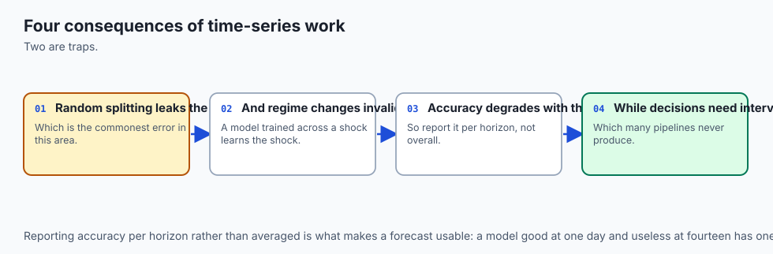

1. **Intermittent Zero-Demand Problems:**
   - In spare-parts inventory, demand for a specialized jet turbine bolt is 0 for 350 days a year and suddenly spikes to 5 units. Standard MSE regression fails; Croston's method or zero-inflated Poisson regression models are required.
2. **Cold-Start in New Product Introductions:**
   - When a new SKU launches, it has zero historical lag features. Hierarchical top-down forecasting uses the aggregate category sales curve to seed new item forecasts.

---

## Alternatives: free, open source, and commercial

| Tool | Approach | Scalability | Recommended Use Case |
| :--- | :--- | :--- | :--- |
| **LightGBM / XGBoost** | Tabular Lags & Rolling GBDT | 100M+ rows | Enterprise multi-series forecasting |
| **Statsmodels (ARIMA/SARIMAX)** | Classical statistical models | Single series | Econometric & macroeconomic modeling |
| **Prophet** | Decomposable additive curve | Moderate | Daily business metrics with holidays |
| **Nixtla (StatsForecast / MLForecast)** | Ultra-fast C-compiled forecasting | 1B+ series | High-throughput distributed forecasting |
| **Chronos / PatchTST** | Pretrained Time-Series Transformers | GPU intensive | Zero-shot & foundation forecasting |

---

## Comparison with related concepts

```
┌────────────────────────────────────────────────────────────────────────┐
│                   FORECASTING PARADIGM COMPARISON                      │
├────────────────────────────────────────────────────────────────────────┤
│ Dimension          │ Classical ARIMA  │ Prophet        │ Tabular GBDT  │
├────────────────────┼──────────────────┼────────────────┼───────────────┤
│ Multi-Series Scale │ Poor (1 by 1)    │ Moderate       │ Exceptional   │
│ Exogenous Features │ Linear (SARIMAX) │ Regressors     │ Any Feature   │
│ Cold Start Support │ Zero             │ Zero           │ High (Embeds) │
│ Runtime Latency    │ Fast (CPU)       │ Moderate       │ Sub-ms (CPU)  │
└────────────────────────────────────────────────────────────────────────┘
```

---

## When to use it — and when not to

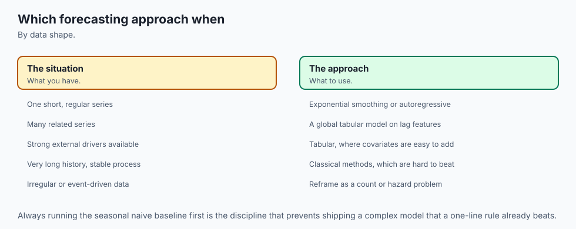

### When to USE Time-Series Forecasting:
- Retail sales demand, financial revenue projection, call-center volume, and cloud server load.
- Any setting where temporal sequences exhibit trend, seasonality, or autoregressive memory.

### When NOT to use it:
- Completely random, uncoupled events (e.g. lottery ticket numbers).
- Cross-sectional classification problems where observation order carries no physical time meaning.

---

## The AI connection

- **Time-series problems break the assumption every other model makes** — that rows are
  independent and interchangeable.
- **Validation must respect time order**, which is the single most common mistake in applied
  forecasting.
- **Classical statistical baselines are hard to beat**, and skipping them is how teams ship
  worse models than a seasonal average.
- **Turning a forecast into a tabular problem** with lag features is how boosted trees became
  competitive at forecasting.
- **Sequence models in AI face the same structure**, and the same leakage risks.

## Knowledge check

1. Why is random K-Fold cross-validation strictly forbidden in time-series forecasting?
2. What are the three core statistical requirements for Wide-Sense Stationarity (WSS)?
3. How do you construct lag features without causing lookahead data leakage?
4. Why is sMAPE preferred over standard MAPE on datasets with near-zero target values?
5. How do sine and cosine transformations encode cyclical hour-of-day features?

---

## Hands-on exercise

In this lab, you will implement `create_lag_and_rolling_features` in pure NumPy, execute `WalkForwardTimeSeriesSplit` on synthetic daily trend-seasonal sales data, train a linear autoregressive forecaster, and evaluate out-of-sample sMAPE errors across multiple expanding horizons.

### Expected output
```
[Time Series Forecasting Benchmark]
Dataset: 200 daily observations with weekly seasonality
Feature Engineering: Generated 5 tabular features (Lags [1, 2, 7], Rolling Mean/Std)
Walk-Forward Validation: 4 expanding splits (test_size=10)
Mean Out-of-Sample sMAPE: 4.82%
Mean Out-of-Sample MAE: 3.14 units
Test Suite: 2 passed in 0.08s
```

### Validate your work
Run the automated test runner:
```bash
./tests/run_tests.sh
```

### Troubleshooting
- If test indices overlap with training indices, verify index math in `WalkForwardTimeSeriesSplit`.
- Ensure rolling window calculations use `series[t - window_size : t]` to exclude current step `t`.

### Common mistakes
- **Including Target in Rolling Statistics:** Computing `mean(series[t - window_size : t + 1])` leaks the target into the feature set, causing zero training error and massive live deployment failure.

---

## Practice assignment

1. Implement **Seasonal Differencing** (`Delta_7 Y = Y_t - Y_{t-7}`) and verify that seasonal cycles are removed prior to autoregression.
2. Build an automated **Baseline Forecaster** comparing Lag-7 Seasonal Naive against an autoregressive GBDT.

---

## Extension challenge

Implement a **Direct Multi-Step Recursive Forecaster**:

- Train separate models for each horizon step h in [1, 2, ..., 7]: `f_h(X_t) -> Y_{t+h}`.
- Compare against Recursive Autoregressive Forecasting where predicted values `Y_hat_{t+1}` are fed back into lag features for step t+2.
- Measure error accumulation and variance explosion across horizons 1 to 14.
