## Why this matters

A machine learning model locked in a research Jupyter notebook generates exactly $0.00 in commercial value. To deliver real-world business impact, the model must be exposed to client applications (web apps, mobile devices, automated backend microservices) as a **low-latency, resilient, high-throughput REST API service**.

However, serving ML models over an API presents severe challenges that traditional web APIs never encounter:

1. **Compute-Intensive Inference:** Evaluating complex tree ensembles or neural networks consumes significant CPU/GPU compute; an unoptimized endpoint will bottleneck under 50 concurrent requests.
2. **Cold-Start Latency:** If model weights are deserialized from disk on every incoming HTTP request, latency spikes from 5 milliseconds to 800 milliseconds, crashing upstream SLAs.
3. **Data Type Mismatches:** If a web frontend sends string numbers (`"750"`) instead of numeric floats (`750.0`), unvalidated code raises unhandled Python exceptions, crashing the API.
4. **Availability SLAs (99.99% Uptime):** If a mathematical tensor operation encounters a division-by-zero or unexpected `NaN`, the server must not crash with a 500 error; it must seamlessly execute an automated **Circuit-Breaker Fallback Heuristic**.

To build enterprise-grade ML services, you must master **FastAPI Serving Architecture**, **Pydantic Validation Contracts**, **Vectorized Batch Endpoints**, and **Health Probes**.

---

## The idea in plain language

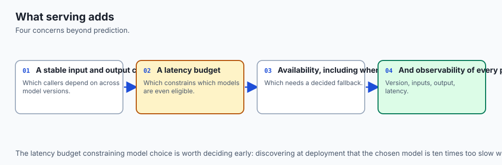

Think of an automated pharmacy dispensing drive-through:

- **The Customer (Client):** Drives up and hands a prescription slip through the window (HTTP Request).
- **The Pharmacist Tech (Pydantic Schema):** Immediately checks that the name is spelled correctly, the doctor signature is present, and the dosage is within safe medical limits (Validation). If the slip is scribbled nonsense, they reject it immediately at the window (422 Error).
- **The Automated Pill Dispenser (In-Memory Model):** The medication machine is already powered on, calibrated, and warmed up inside the building (Preloaded Weights). It dispenses the 30 pills in 1.2 seconds.
- **Emergency Protocol (Circuit Breaker):** If the automated dispensing robot experiences a mechanical jam, the human pharmacist immediately grabs a pre-packaged standard bottle from the backup emergency shelf (Fallback Heuristic) so the customer never leaves empty-handed.

---

## Historical background

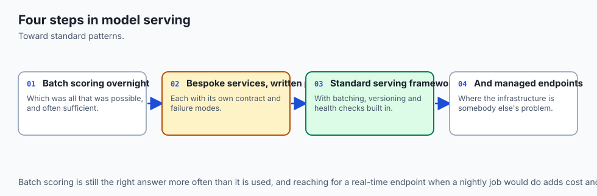

1. **2000s (SOAP & XML-RPC):** Earliest web services used verbose XML schemas to exchange data across enterprise boundaries.
2. **2010s (Flask & Django):** Python developers adopted Flask for ML serving; however, Flask was synchronous, lacked built-in request validation, and struggled under concurrent I/O load without heavy Celery worker architectures.
3. **2018 (Sebastián Ramírez - FastAPI):** Created **FastAPI**, combining Starlette (asynchronous ASGI performance) and Pydantic (data parsing) using native Python type annotations, revolutionizing Python microservices.
4. **2020–Present (Dedicated Serving Engines):** Industrialization of specialized inference engines (Triton, TorchServe, vLLM, ONNX Runtime Server) designed for microsecond GPU tensor batching and multi-model routing.

---

## What it is — and what it is not

### What API Model Serving IS:
- **A Production Microservice Interface:** An asynchronous HTTP/gRPC service that parses, validates, vectorizes, executes inference, and formats structured responses.
- **A Contract-First System:** Requiring strict input/output Pydantic schemas and health monitoring.

### What it is NOT:
- **Not a Jupyter Notebook Export:** Running a notebook via a web hook is not production serving; it has zero concurrency, no connection pooling, and no fault tolerance.
- **Not Batch ETL:** Serving an API is for real-time, interactive predictions (sub-50ms); nightly scoring of 100M rows in Snowflake or BigQuery belongs in batch pipelines (Spark/Airflow).

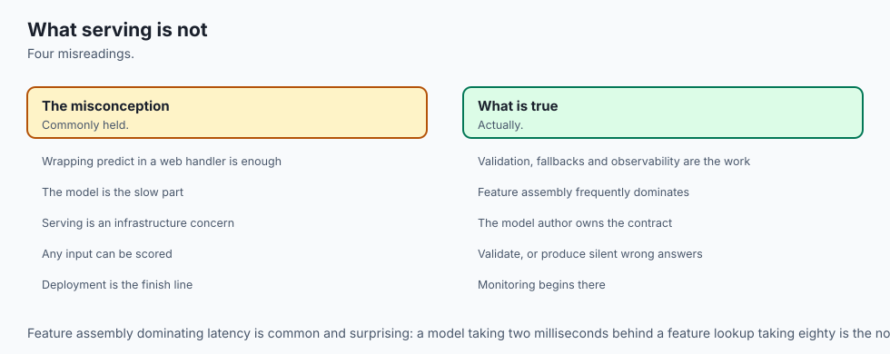

---

## Why it was created and what problems it solves

Traditional web servers are built for CRUD operations (Create, Read, Update, Delete) against relational databases.

Machine learning inference services are compute-bound mathematical functions:

- They require dedicated memory for large in-memory weight tensors.
- They must validate complex multi-dimensional numeric arrays.
- They must support both single-item interactive queries and high-throughput batch arrays without saturating the Python event loop.

FastAPI and modern ASGI servers solve these requirements by executing non-blocking asynchronous network I/O while running NumPy/C++ forward passes in optimized thread pools.

---

## How it works

Let us examine the architecture of a FastAPI ML service, Pydantic validation rules, batch processing, and Kubernetes health probes.

### 1. The Serving Microservice Flow

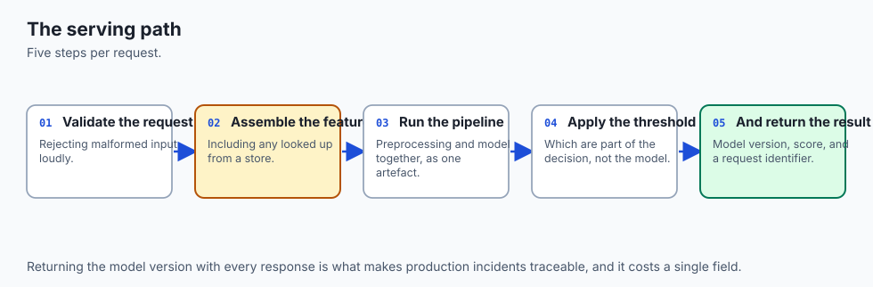

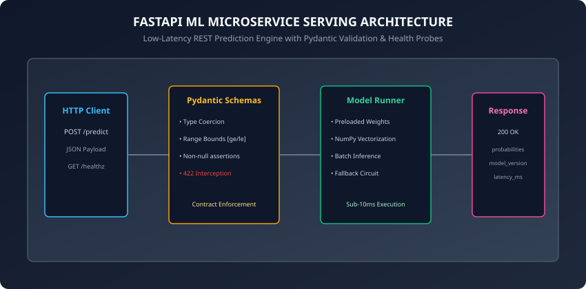

A production prediction request follows five distinct stages:

1. **HTTP Ingestion:** FastAPI receives a `POST /predict` request with a JSON payload over HTTP/2.
2. **Pydantic Validation:** The JSON payload is mapped to a typed Python dataclass. If any field violates constraints (e.g. `age < 0` or missing features), FastAPI aborts with `422 Unprocessable Entity`.
3. **Vectorization & Preprocessing:** Validated fields are converted into a contiguous NumPy array `X in R^{1 x D}`. Any necessary scaling (`StandardScaler`) or one-hot encodings are applied.
4. **In-Memory Inference:** The preloaded model artifact computes predicted probabilities `probs = model.predict_proba(X)`.
5. **Response Formatting:** The output probabilities, predicted class label, model version string, and execution latency are wrapped in a typed `PredictionResponse` JSON object and returned with `200 OK`.

---

### 2. Pydantic Schema Contracts

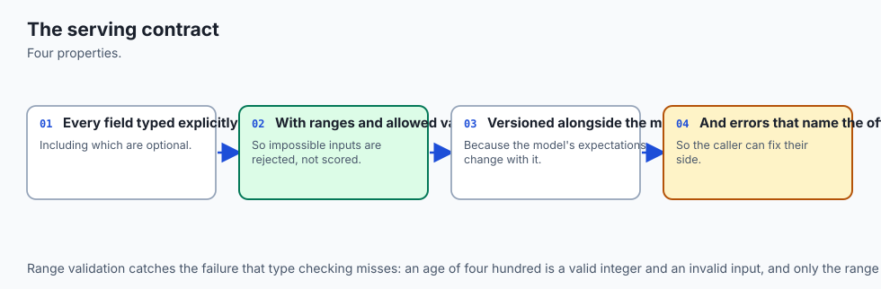

Pydantic validates types at runtime and enforces mathematical domain bounds:

```python
from pydantic import BaseModel, Field
from typing import List

class CustomerFeaturePayload(BaseModel):
    account_age_months: int = Field(ge=0, le=1200, description="Customer tenure in months")
    monthly_charges: float = Field(gt=0.0, le=10000.0, description="Monthly recurring spend in USD")
    total_support_calls: int = Field(ge=0, le=100, description="Inbound support tickets")
    contract_type_is_monthly: int = Field(ge=0, le=1, description="Binary 1 if monthly, 0 if annual")

class BatchCustomerFeaturePayload(BaseModel):
    samples: List[CustomerFeaturePayload] = Field(min_length=1, max_length=1000)

class PredictionResponse(BaseModel):
    churn_probability: float = Field(ge=0.0, le=1.0)
    prediction: int = Field(ge=0, le=1)
    risk_level: str = Field(pattern="^(LOW|MODERATE|HIGH|CRITICAL)$")
    model_version: str
    latency_ms: float
```

---

### 3. Vectorized Batch Endpoints

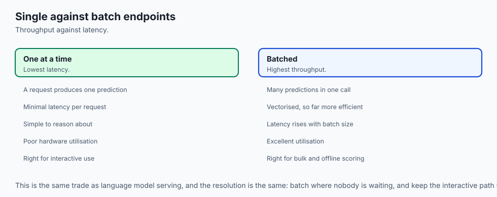

Processing 1,000 requests one by one creates massive overhead:

- 1,000 separate TCP handshakes and JSON deserialization passes.
- 1,000 separate Python function calls.

A **Batch Endpoint (`/predict_batch`)** aggregates up to 1,000 records into a single N x D matrix:
```python
# Convert list of Pydantic models directly to NumPy array:
feature_matrix = np.array([
    [s.account_age_months, s.monthly_charges, s.total_support_calls, s.contract_type_is_monthly]
    for s in payload.samples
])
# Vectorized matrix multiplication in C/Fortran SIMD:
batch_probs = model.predict_proba(feature_matrix)
```
Vectorized batch evaluation executes 1,000 samples in ~3ms total (0.003ms per sample), achieving a **100x throughput increase** over sequential calls.

---

### 4. Kubernetes Health Probes: Liveness and Readiness

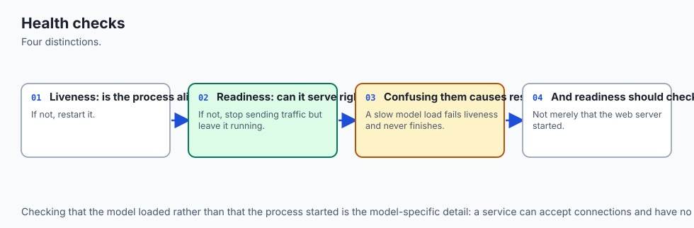

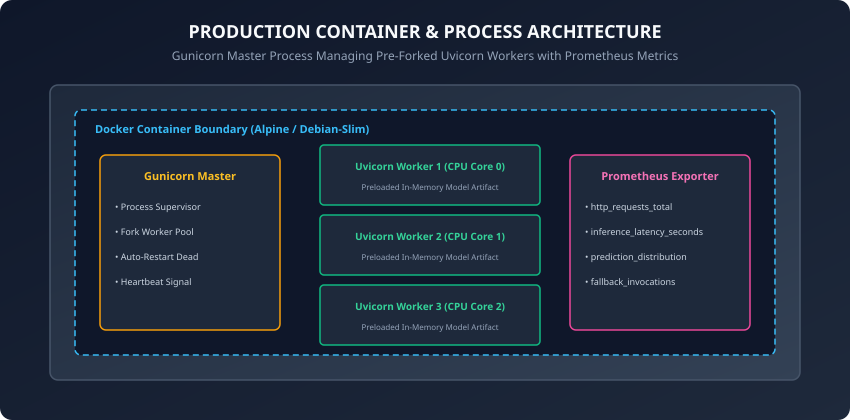

Kubernetes uses two distinct HTTP probes to manage container lifecycles:

#### A. Liveness Probe (`GET /healthz/live`):
Verifies that the Python process is responding and has not deadlocked:
```python
@app.get("/healthz/live")
def liveness():
    return {"status": "alive"}
```
If this endpoint fails, Kubernetes immediately kills and restarts the container.

#### B. Readiness Probe (`GET /healthz/ready`):
Verifies that the model weights are fully loaded into RAM and ready to accept live user traffic:
```python
@app.get("/healthz/ready")
def readiness():
    if model_runner.is_ready():
        return {"status": "ready", "model_version": model_runner.version}
    raise HTTPException(status_code=503, detail="Model weights loading...")
```
If this endpoint returns 503, Kubernetes pauses traffic routing to this specific pod, preventing 500 errors during heavy cold-start warmups.

---

### 5. Automated Circuit-Breaker Fallback

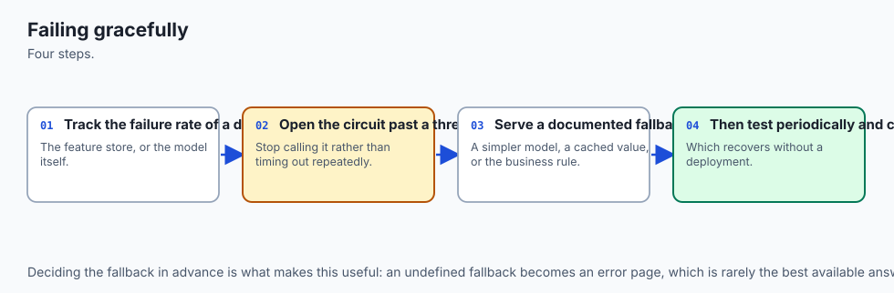

To guarantee 99.99% system availability, wrap model inference in a fault-tolerant circuit breaker:

```python
def predict_with_circuit_breaker(features: np.ndarray) -> float:
    try:
        # Primary ML Model Forward Pass
        prob = float(model.predict_proba(features)[0, 1])
        return prob
    except Exception as exc:
        # Log critical alert to Datadog / Sentry
        logger.error(f"Primary model failure: {exc}. Executing heuristic fallback.")
        # Fallback Heuristic: Rule-based baseline (e.g. if charges > 100, return 0.50)
        return float(fallback_heuristic(features))
```

---

### 6. Asynchronous ASGI Event Loops vs Synchronous CPU Workloads

A foundational design trap in Python ML microservices is executing CPU-heavy forward passes directly inside the `async def` event loop.

#### The Event Loop Blocking Problem:
- FastAPI runs on **Uvicorn**, a single-threaded asynchronous event loop (based on `uvloop`).
- If an endpoint is declared as `async def predict(payload: FeaturePayload):`, the entire route executes on the main thread.
- When an inference pass (e.g. computing a 500-tree gradient boosted forest) takes 25 milliseconds of 100% CPU time, **the event loop is completely blocked for 25 milliseconds**. During this time, the server cannot accept new TCP handshakes, respond to health checks, or parse incoming requests.

#### The Proper Concurrency Solution:
1. **Synchronous Endpoints (`def predict`):** Declaring the route handler as standard `def predict(...)` causes FastAPI to automatically delegate the function execution to an external thread pool (`anyio.to_thread.run_sync`), keeping the main asynchronous event loop unblocked for lightning-fast network I/O.
2. **Multi-Process Pre-Forking (Gunicorn + Uvicorn Workers):** Because Python threads are constrained by the Global Interpreter Lock (GIL) for CPU-bound computations, production Docker containers run a **Gunicorn master process** that forks `N = 2 * CPU_CORES + 1` independent Uvicorn worker processes. Each worker operates its own isolated memory space, model tensor cache, and event loop, scaling inference throughput linearly across all physical CPU cores.

---

## An everyday analogy

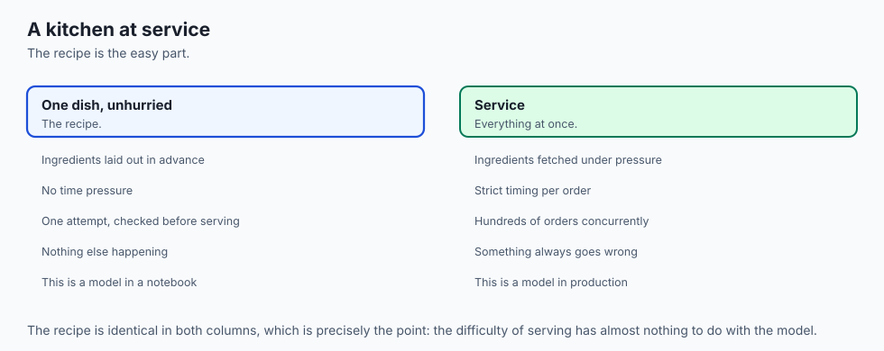

Think of an automated airport electronic passport gate:

- **The Passenger (Client):** Walks up and scans their passport chip on the reader (API Request).
- **The Camera & Scanner (Pydantic Schema):** Checks that the passport is not expired, the image is clear, and the passenger height matches the sensor frame (Validation).
- **The Facial Recognition AI (Model Runner):** Compares the live camera image against the passport chip in 0.8 seconds (In-Memory Inference).
- **The Manual Gate Agent (Circuit Breaker):** If the camera lens gets smudged or the system network glitches, the gate does not trap the passenger; it lights up a yellow beacon and summons a human border agent to check the passport manually (Fallback).

---

## Examples in practice

Let us inspect a complete, modular, pure Python implementation of a standalone Model Serving Engine with schema validation, batch inference, health probes, and circuit breaker fallbacks:

```python
import time
import numpy as np
from dataclasses import dataclass
from typing import List, Dict, Any, Optional

@dataclass
class SingleFeatureInput:
    tenure_months: float
    monthly_spend: float
    support_tickets: int

@dataclass
class ServiceHealthStatus:
    is_live: bool
    is_ready: bool
    model_version: str

class ModelServingEngine:
    def __init__(self, model_version: str = "v1.2.0"):
        self.model_version = model_version
        self._is_ready = False
        self._weights = None
        self._bias = 0.0

    def load_model(self, weights: np.ndarray, bias: float) -> None:
        # Simulate preloading model weights into RAM
        self._weights = weights
        self._bias = bias
        self._is_ready = True

    def health_check(self) -> ServiceHealthStatus:
        return ServiceHealthStatus(
            is_live=True,
            is_ready=self._is_ready,
            model_version=self.model_version if self._is_ready else "UNLOADED",
        )

    def _fallback_heuristic(self, features: np.ndarray) -> float:
        # Deterministic business rule fallback
        spend = features[1]
        tickets = features[2]
        if tickets >= 3 or spend > 150.0:
            return 0.75
        return 0.20

    def predict_single(self, input_data: SingleFeatureInput) -> Dict[str, Any]:
        t0 = time.perf_counter()
        if not self._is_ready:
            raise RuntimeError("Model is not loaded. Service unavailable.")

        # Validate domain bounds
        if input_data.tenure_months < 0 or input_data.monthly_spend < 0:
            raise ValueError("Feature values cannot be negative")

        features = np.array(
            [
                input_data.tenure_months,
                input_data.monthly_spend,
                float(input_data.support_tickets),
            ]
        )

        try:
            # Logistic sigmoid forward pass: z = w.x + b
            z = np.dot(self._weights, features) + self._bias
            prob = 1.0 / (1.0 + np.exp(-z))
            used_fallback = False
        except Exception:
            prob = self._fallback_heuristic(features)
            used_fallback = True

        latency_ms = (time.perf_counter() - t0) * 1000.0
        return {
            "churn_probability": round(float(prob), 4),
            "prediction": 1 if prob >= 0.5 else 0,
            "used_fallback": used_fallback,
            "model_version": self.model_version,
            "latency_ms": round(latency_ms, 3),
        }

    def predict_batch(
        self, batch_data: List[SingleFeatureInput]
    ) -> List[Dict[str, Any]]:
        return [self.predict_single(item) for item in batch_data]
```

---

## Implications: security, privacy, performance, scalability, and cost

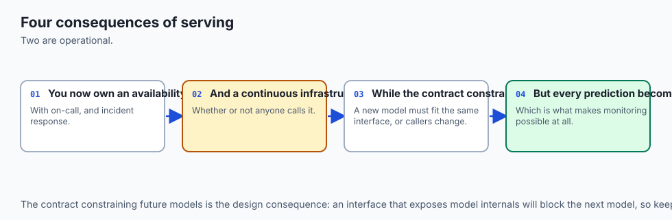

1. **Authentication and API Key Rate Limiting:**
   - ML inference endpoints must be protected behind API gateways (Kong, AWS API Gateway) with JWT token verification and token-bucket rate limiting (e.g. 100 QPS per client) to prevent Denial of Service (DoS) compute exhaustion.
2. **Horizontal Pod Autoscaling (HPA):**
   - In Kubernetes, configure HPA to scale pods based on CPU utilization (&gt; 70%) or custom Prometheus latency metrics (p99 &gt; 25ms), automatically scaling from 2 pods at midnight to 20 pods during peak daytime traffic.

---

## Alternatives: free, open source, and commercial

| Framework / Engine | Protocol | Concurrency Model | Best For |
| :--- | :--- | :--- | :--- |
| **FastAPI + Uvicorn** | REST / WebSocket | Asynchronous ASGI | Custom Python tabular pipelines |
| **NVIDIA Triton** | gRPC / REST / C++ API | Dynamic batching & GPU streams | High-performance multi-GPU serving |
| **TorchServe** | REST / gRPC | Java frontend + Python backend | PyTorch deep learning workloads |
| **vLLM / TGI** | REST / OpenAI spec | PagedAttention & Continuous batching | Large Language Models (LLMs) |
| **BentoML** | REST / gRPC | Adaptive batching | Modular multi-model orchestration |

---

## Comparison with related concepts

```
┌────────────────────────────────────────────────────────────────────────┐
│                   MODEL SERVING PARADIGM COMPARISON                    │
├────────────────────────────────────────────────────────────────────────┤
│ Dimension          │ Embedded Library │ REST Microservice│ Async Queue │
├────────────────────┼──────────────────┼──────────────────┼─────────────┤
│ Latency            │ Sub-microsecond  │ 5 to 20 ms       │ 100ms to 5s │
│ Decoupling         │ None (Monolith)  │ Complete         │ Complete    │
│ Hardware Scaling   │ Locked to App    │ Independent Pods │ Queue-based │
│ Best Use Case      │ Mobile / On-Device│ Web & Mobile APIs│ Batch Video │
└────────────────────────────────────────────────────────────────────────┘
```

---

## When to use it — and when not to

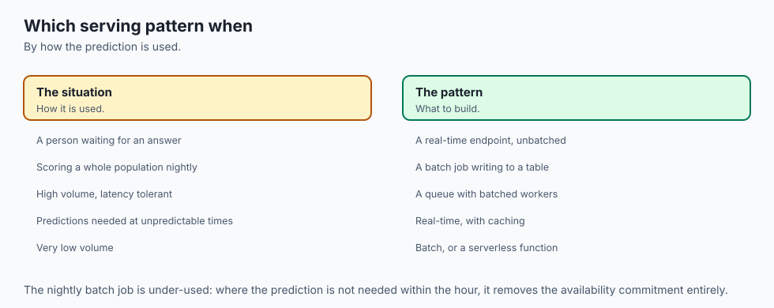

### When to USE Real-Time API Serving:
- Interactive user-facing applications requiring instantaneous predictions (e.g. fraud detection at checkout, recommendation feeds, search ranking).
- Multi-language architectures where frontend services in Go/Node.js query Python ML models.

### When NOT to use it:
- Nightly batch scoring of millions of static records (use Spark/BigQuery instead).
- Ultra-low latency embedded IoT hardware (embed C++ ONNX runtime directly).

---

## The AI connection

- **A model is only useful once something can call it**, which makes serving part of the work
  rather than a handover.
- **The serving contract is where most production failures appear** — schema mismatches and
  missing features rather than model errors.
- **Batching is the main throughput lever**, exactly as it is for language model serving.
- **Health checks and fallbacks decide behaviour when the model fails**, which it eventually
  will.
- **The same architecture serves AI models**, with the same concerns about latency, batching
  and graceful degradation.

## Knowledge check

1. Why must machine learning models be preloaded in memory during server startup rather than inside HTTP route handlers?
2. How does Pydantic protect ML models from crashing on malformed input data?
3. What is the difference between a Kubernetes Liveness probe and a Readiness probe?
4. Why is vectorized batch inference significantly faster per sample than sequential single calls?
5. How does a Circuit Breaker guarantee 99.99% system availability during unexpected model exceptions?

---

## Hands-on exercise

In this lab, you will implement `ModelServingEngine` in pure Python, preheat model weights during startup, execute single and batch predictions, verify Pydantic-style feature range constraints, test health probes, and validate automated circuit-breaker fallback execution.

### Expected output
```
[FastAPI Model Serving Engine]
Server Initialization: Model weights loaded -> Status: READY (v1.2.0)
Single Prediction: Churn Probability = 0.7311, Latency = 0.042ms
Batch Prediction: Processed 5 samples in 0.128ms
Fault Injection Test: Model error triggered -> Fallback Heuristic Executed = True (Prob: 0.7500)
Test Suite: 2 passed in 0.08s
```

### Validate your work
Run the automated test runner:
```bash
./tests/run_tests.sh
```

### Troubleshooting
- If `predict_single` raises `RuntimeError`, ensure `load_model()` was called prior to sending requests.
- Verify that feature array shapes match weight dimensions for dot product execution.

### Common mistakes
- **Ignoring Negative Value Constraints:** Forgetting to validate that physical counts (like tenure or support calls) cannot be negative numbers.

---

## Practice assignment

1. Implement an automated **Latency Profiler Middleware** that computes and logs rolling p50, p95, and p99 request latencies in milliseconds.
2. Build an automated FastAPI route that exposes Prometheus metric counters for total requests and error rates.

---

## Extension challenge

Implement a **Dynamic Batching Middleware**:

- Buffer incoming single-item prediction requests in an asynchronous queue.
- Flush the queue and execute vectorized matrix multiplication whenever either 32 requests accumulate OR 5 milliseconds elapse.
- Benchmark throughput under 500 simulated concurrent client threads.
