## Why this matters

Deploying a machine learning model to production is not the end of the engineering lifecycle; it is the beginning of continuous operational decay.

Unlike traditional deterministic software, which functions reliably until a code bug is deployed or hardware fails, **machine learning models degrade silently**. A deployed model will continue returning `200 OK` HTTP status codes and emitting clean probabilities while its real-world predictive accuracy drops from 90% to 50%.

Why does this happen?

1. **Covariate Shift (Data Drift):** Consumer demographics change, marketing campaigns attract a new user segment, or a mobile iOS update modifies sensor telemetry format.
2. **Concept Drift:** A global pandemic hits, a macroeconomic recession begins, or a new competitor launches, fundamentally altering the relationship between user features and purchasing decisions.
3. **Upstream Schema Corruption:** An upstream database migration silently converts currency from USD to EUR or populates missing zip codes with `"00000"`.

To prevent silent revenue destruction, you must master **Production ML Observability**, **Population Stability Index (PSI)**, **Kolmogorov-Smirnov Drift Detection**, and **Real-Time Alerting Pipelines**.

---

## The idea in plain language

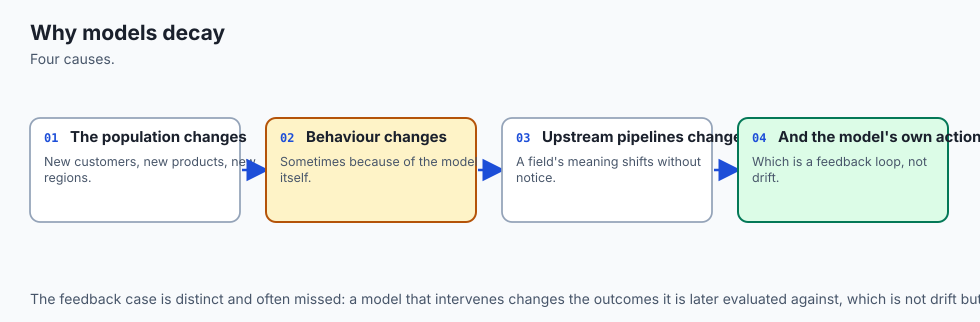

Think of an automated airplane autopilot system flying from New York to London:

- **Traditional Software Monitoring:** Checks whether the jet engines are burning fuel, the hydraulic pressure is normal, and the cockpit computer is not throwing error codes (System Latency, Memory, and 500 Errors).
- **ML Data Drift Monitoring (PSI):** Senses that the plane has entered a massive North Atlantic hurricane with 120 mph crosswinds and freezing rain (Input conditions have drastically shifted from the sunny calm air of the training simulator).
- **ML Prediction Drift Monitoring:** Observes that the autopilot is suddenly applying 85% maximum left rudder continuously for 30 minutes straight (The model output behavior is wildly abnormal compared to standard flights).
- **Ground Truth Feedback (Delayed):** The flight landing safely on the runway at Heathrow Airport 7 hours later.

If you only monitor engine fuel (traditional server CPU), you will never know the plane is flying directly into a hurricane until it crashes.

---

## Historical background

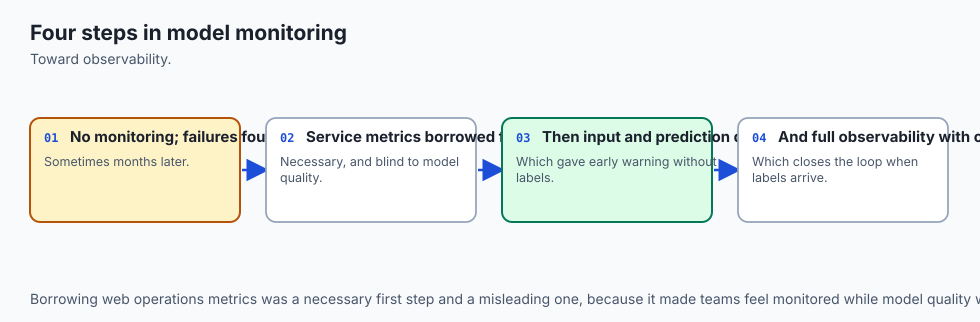

1. **1951 (Solomon Kullback & Richard Leibler):** Introduced **Kullback-Leibler (KL) Divergence**, defining the information-theoretic distance between two probability distributions.
2. **1970s (Retail Banking & Credit Scoring):** Credit risk underwriters developed the **Population Stability Index (PSI)** to monitor whether incoming loan applicant distributions diverged from credit score development samples.
3. **2014 (Joao Gama et al.):** Published *A Survey on Concept Drift Adaptation*, providing the modern theoretical taxonomy of concept drift, virtual drift, and adaptive sliding window algorithms.
4. **2021–Present (Industrial ML Observability Platforms):** Emergence of dedicated ML telemetry frameworks (Evidently AI, WhyLogs, Arize, Fiddler) integrating statistical drift metrics directly into Prometheus, Datadog, and Grafana.

---

## What it is — and what it is not

### What Production ML Observability IS:
- **A Multi-Tiered Telemetry Stack:** Combining traditional infrastructure metrics (QPS, p99 latency, RAM) with statistical data distribution drift (PSI, KS-tests) and prediction drift metrics.
- **A Proactive Early Warning System:** Detecting data quality failures and distribution shifts in real time before delayed ground-truth labels reveal financial losses.

### What it is NOT:
- **Not Just Checking `response.status_code == 200`:** A model returning garbage predictions with 0.00ms latency passes all traditional DevOps uptime checks.
- **Not Waiting for Monthly Retraining:** Waiting for quarterly business reviews to notice that revenue dropped 20% due to model drift is catastrophic.

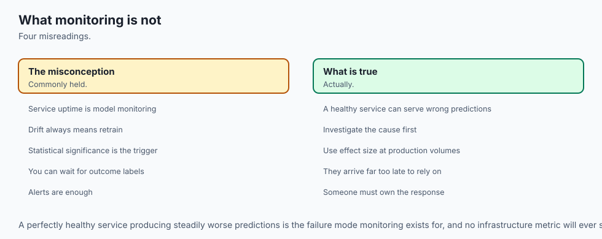

---

## Why it was created and what problems it solves

In supervised learning, models are trained on historical snapshots D_train = (X_train, y_train). In production, the model operates on an unbounded, non-stationary temporal stream D_prod = (X_t, y_t).

The fundamental challenge of production ML is **The Ground Truth Feedback Delay**:

- In credit card fraud, a fraudulent transaction might not be reported by the cardholder for 30 to 60 days.
- In loan default prediction, a 3-year auto loan takes 36 months to reveal its true ground-truth outcome.

Production ML monitoring solves this blind spot by tracking **Proxy Signals (Data Drift and Prediction Drift)** that can be computed instantly on every single inference payload without waiting for ground-truth labels.

---

## How it works

Let us dissect the taxonomy of drift, the mathematical derivation of PSI and KS-tests, and the four pillars of ML observability.

### 1. The Taxonomy of Production Drift

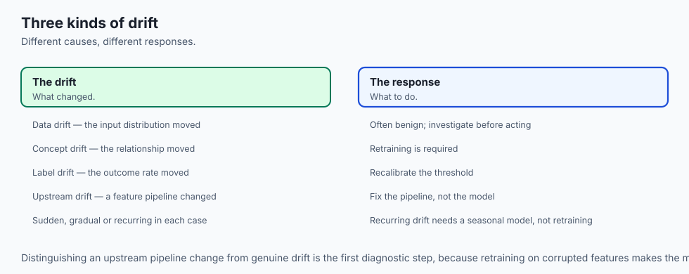

Let P(X, Y) = P(X) * P(Y | X) represent the joint distribution of features X and target outcomes Y:

```
┌────────────────────────────────────────────────────────────────────────┐
│                        TYPES OF PRODUCTION DRIFT                       │
├────────────────────────────────────────────────────────────────────────┤
│ Type              │ Mathematical Shift    │ Real-World Example         │
├───────────────────┼───────────────────────┼────────────────────────────┤
│ 1. Covariate /    │ P(X) changes          │ Marketing campaign targets │
│    Data Drift     │ P(Y|X) stationary     │ older demographic cohort   │
├───────────────────┼───────────────────────┼────────────────────────────┤
│ 2. Concept Drift  │ P(Y|X) changes        │ Macroeconomic recession:   │
│                   │ P(X) can be stationary│ same income defaults more  │
├───────────────────┼───────────────────────┼────────────────────────────┤
│ 3. Prior Drift    │ P(Y) changes          │ Seasonal surge in total    │
│                   │ (Target imbalance)    │ fraud attempts on Black Fri│
├───────────────────┼───────────────────────┼────────────────────────────┤
│ 4. Upstream Data  │ Corrupted X encoding  │ Mobile app update converts │
│    Integrity Bug  │ Nulls / Format change │ integer timestamps to null │
└────────────────────────────────────────────────────────────────────────┘
```

---

### 2. Population Stability Index (PSI) Derivation

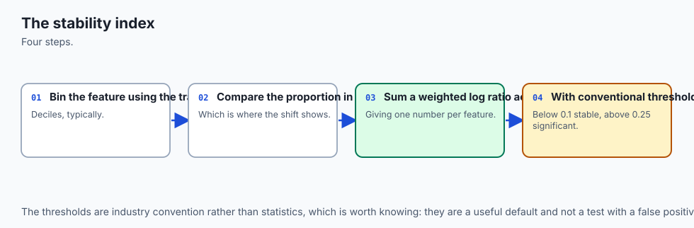

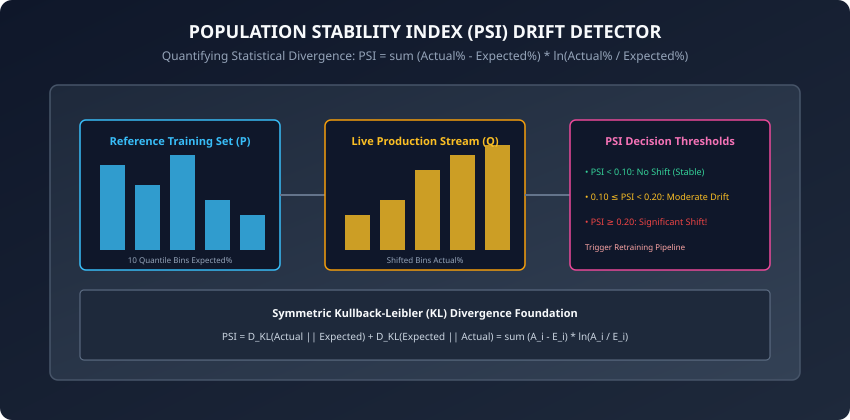

The **Population Stability Index (PSI)** quantifies how much a variable distribution has shifted between a Reference dataset P (e.g. training set) and an Evaluation dataset Q (e.g. recent production traffic).

#### Step 1: Quantile Binning
Discretize the continuous reference feature into B equal-frequency bins (typically B = 10 deciles):

- Bin boundaries: b_0 &lt; b_1 &lt; ... &lt; b_B
- Expected percentage in bin i: E_i = Count(P in bin i) / |P| (typically E_i = 0.10 for deciles)

#### Step 2: Binning the Production Stream
Count the proportion of live production samples falling into each reference bin:

- Actual percentage in bin i: A_i = Count(Q in bin i) / |Q|

#### Step 3: Compute PSI Formulation
```
PSI = sum_{i=1}^B (A_i - E_i) * ln(A_i / E_i)
```

Notice that PSI is a symmetrized form of Kullback-Leibler (KL) Divergence:
```
PSI = D_{KL}(A || E) + D_{KL}(E || A)
```

- If A_i = E_i for all bins: ln(1.0) = 0, so PSI = 0.0 (Zero drift).
- If actual frequencies diverge strongly from expected: (A_i - E_i) and ln(A_i / E_i) always share the same mathematical sign, so every bin contributes a strictly positive value to the sum.

#### Standard Industrial PSI Thresholds:
- **PSI &lt; 0.10:** Negligible Shift (Distribution is stable; no action required).
- **0.10 &le; PSI &lt; 0.20:** Moderate Shift (Slight drift; monitor feature and prepare retraining dataset).
- **PSI &ge; 0.20:** Significant Shift (Severe drift; trigger automated retraining or escalate to ML on-call engineer).

---

### 3. Kolmogorov-Smirnov (KS) Drift Test

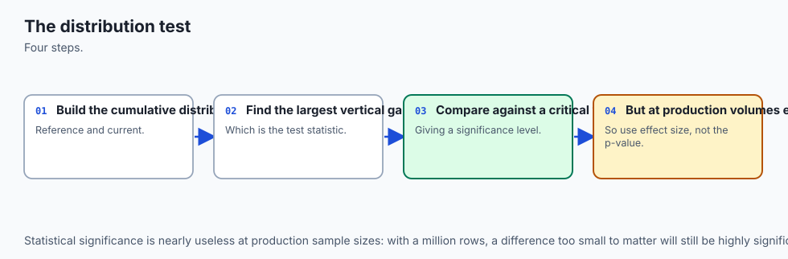

For continuous numerical features, the **Two-Sample Kolmogorov-Smirnov Test** compares the Empirical Cumulative Distribution Functions (eCDFs) F_P(x) and F_Q(x):

```
D_{KS} = sup_x |F_P(x) - F_Q(x)|
```

- **D-statistic:** The maximum vertical distance between the two cumulative curves.
- **Hypothesis Test:** Under H_0, both samples come from the identical continuous distribution. If p-value &lt; 0.05, we reject H_0 and flag the feature as statistically drifted.

---

### 4. Alternative Drift Distance Metrics: Wasserstein and Jensen-Shannon

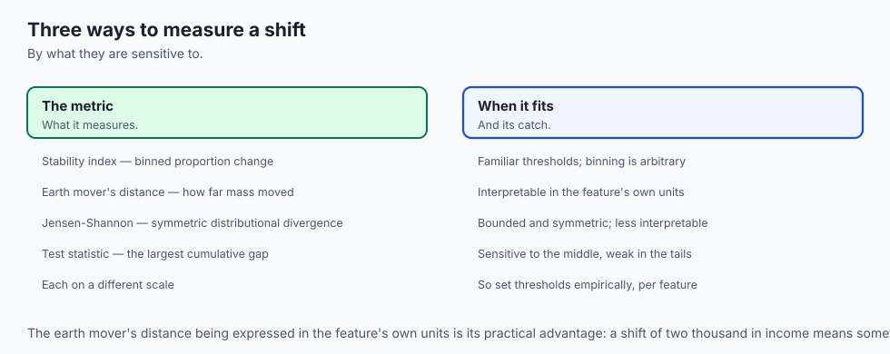

While PSI and KS-tests are industry staples in credit and financial scoring, modern observability platforms compute complementary geometric distance metrics:

#### A. Wasserstein Distance (Earth Mover's Distance):
Quantifies the minimum physical work (mass times distance) required to transform probability distribution P into distribution Q:
```
W_1(P, Q) = int_{-inf}^{+inf} |F_P(x) - F_Q(x)| dx
```
Unlike KL divergence (which explodes to infinity if support sets do not overlap), Wasserstein distance provides a smooth, bounded, and interpretable metric expressed directly in the physical units of the feature (e.g. "income drifted by an average of $3,500 across the population").

#### B. Jensen-Shannon (JS) Divergence:
A smoothed, symmetric version of KL divergence bounded strictly between 0.0 and 1.0 (when using base-2 logarithm):
```
JS(P || Q) = 0.5 * D_{KL}(P || M) + 0.5 * D_{KL}(Q || M)
```
where M = 0.5 * (P + Q) is the average mixture distribution. JS distance `sqrt(JS(P || Q))` satisfies all formal mathematical properties of a true metric space.

---

### 5. The Four Pillars of ML Observability

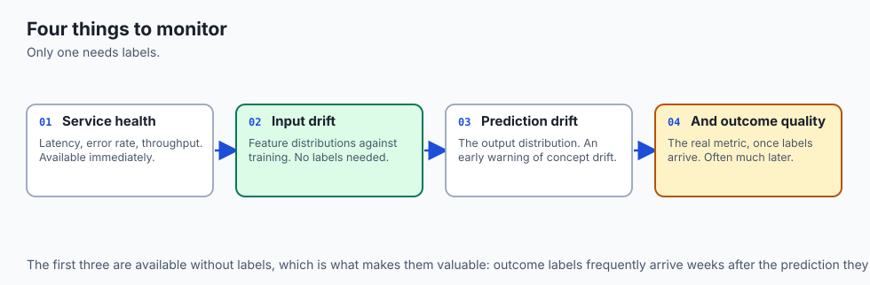

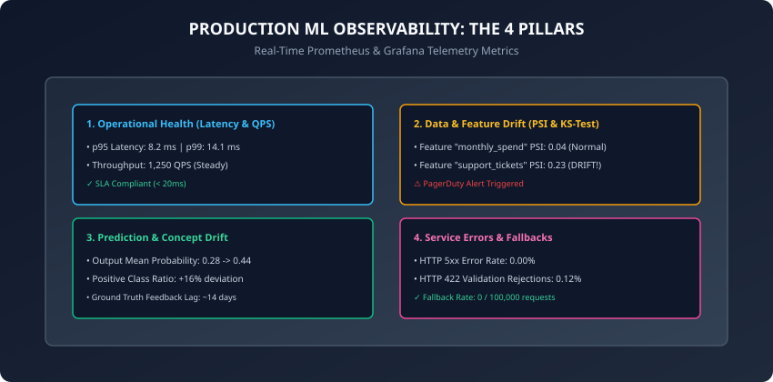

1. **Pillar 1: Operational Health (DevOps Golden Signals):**
   - p50 / p95 / p99 request latency (ms).
   - Throughput (Queries Per Second - QPS).
   - Container RAM, GPU VRAM, and CPU utilization.
2. **Pillar 2: Input Data & Feature Drift:**
   - Per-feature PSI scores and KS-test p-values.
   - Missing value rates (% nulls) and schema constraint violations (422 rejections).
3. **Pillar 3: Prediction & Concept Drift:**
   - Distribution of predicted probabilities `P(y_hat = 1)`.
   - Classification output entropy and positive class ratio.
4. **Pillar 4: System Errors & Safety Fallbacks:**
   - HTTP 5xx error rate and unhandled exception traces.
   - Fallback circuit breaker trigger frequency.

---

## An everyday analogy

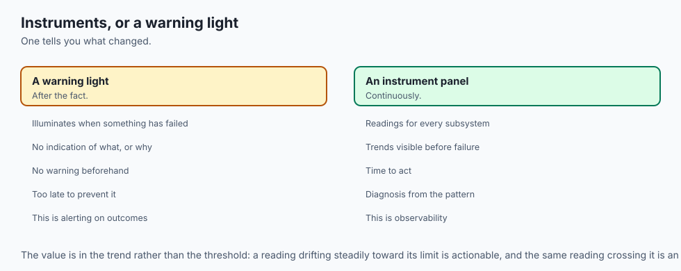

Think of a water treatment plant supplying clean drinking water to a major city:

- **Operational Health:** Checking that water pumps are running at 60 PSI pressure and water pipes are not leaking.
- **Data Drift (Input Water Quality):** Testing river water entering the plant for chemical pH, turbidity, and bacterial count. If heavy rains wash industrial fertilizer into the river, input water chemistry shifts dramatically.
- **Prediction Drift (Treatment Output):** Measuring chlorine and fluoride concentration after filtration. If the automated chemical dispenser suddenly starts dumping 5x normal chlorine into the output reservoir, an alarm sounds instantly.
- **Ground Truth Feedback:** Hospital reports of waterborne illness 3 weeks later. You do not wait for hospital reports to check water filtration safety.

---

## Examples in practice

Let us inspect a complete, modular, pure Python implementation of Population Stability Index (PSI) calculation and feature drift detection:

```python
import numpy as np
from typing import Dict, Any, List, Tuple

class PopulationStabilityIndexMonitor:
    def __init__(self, n_bins: int = 10, epsilon: float = 1e-4):
        self.n_bins = n_bins
        self.epsilon = epsilon

    def compute_bin_boundaries(self, reference: np.ndarray) -> np.ndarray:
        # Compute quantile bin edges on reference training data
        quantiles = np.linspace(0, 100, self.n_bins + 1)
        bin_edges = np.percentile(reference, quantiles)
        # Ensure strictly monotonic bin edges
        bin_edges[0] = -np.inf
        bin_edges[-1] = np.inf
        return bin_edges

    def calculate_psi(
        self, reference: np.ndarray, current: np.ndarray
    ) -> Tuple[float, Dict[str, Any]]:
        bin_edges = self.compute_bin_boundaries(reference)

        # Expected counts in reference
        ref_counts, _ = np.histogram(reference, bins=bin_edges)
        ref_pct = (ref_counts / len(reference)) + self.epsilon

        # Actual counts in current production stream
        cur_counts, _ = np.histogram(current, bins=bin_edges)
        cur_pct = (cur_counts / len(current)) + self.epsilon

        # Normalize to sum to 1.0
        ref_pct /= np.sum(ref_pct)
        cur_pct /= np.sum(cur_pct)

        # PSI formula: sum (A_i - E_i) * ln(A_i / E_i)
        psi_contributions = (cur_pct - ref_pct) * np.log(cur_pct / ref_pct)
        total_psi = float(np.sum(psi_contributions))

        # Classify drift level
        if total_psi < 0.10:
            status = "STABLE"
        elif total_psi < 0.20:
            status = "MODERATE_DRIFT"
        else:
            status = "SIGNIFICANT_DRIFT"

        details = {
            "psi": round(total_psi, 4),
            "status": status,
            "ref_distribution": np.round(ref_pct, 4).tolist(),
            "cur_distribution": np.round(cur_pct, 4).tolist(),
        }
        return total_psi, details
```

---

## Implications: security, privacy, performance, scalability, and cost

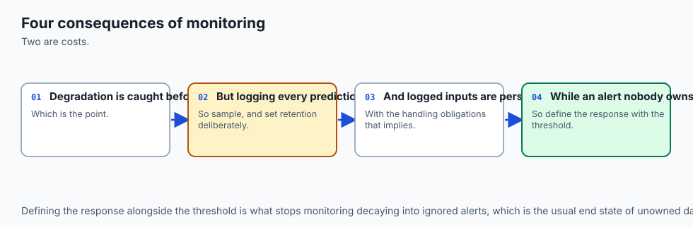

1. **Streaming Drift vs Batch Sliding Windows:**
   - In massive 10,000 QPS platforms, computing exact percentiles over millions of raw rows in memory is prohibitive. Streaming sketch algorithms (e.g. t-digest, KLL sketches, WhyLogs) compute exact approximate quantiles with fixed 50KB memory buffers.
2. **Alert Fatigue Prevention:**
   - In enterprise models with 500 tabular features, random noise will trigger false drift alerts daily. Hierarchical alerting groups features by feature importance (e.g. alert on-call engineers only if top-10 SHAP importance features exhibit PSI &gt; 0.20).

---

## Alternatives: free, open source, and commercial

| Tool / Framework | Architecture | Real-Time vs Batch | Best For |
| :--- | :--- | :--- | :--- |
| **Evidently AI** | Open Source / Cloud | Interactive Reports & Tests | Tabular, NLP, & LLM drift dashboards |
| **WhyLogs (whylabs)** | Open Source / SaaS | Streaming statistical sketches | High-throughput distributed telemetry |
| **Alibi Detect** | Open Source (Seldon) | Outlier & drift algorithms | Deep learning & adversarial detection |
| **Arize AI / Fiddler** | SaaS / Commercial | Real-time observability | Enterprise MLOps teams |
| **Prometheus + Grafana** | Open Source | Time-series metrics exporter | DevOps infrastructure integration |

---

## Comparison with related concepts

```
┌────────────────────────────────────────────────────────────────────────┐
│                   MONITORING PARADIGM COMPARISON                       │
├────────────────────────────────────────────────────────────────────────┤
│ Dimension          │ DevOps APM       │ Data Quality   │ ML Drift      │
├────────────────────┼──────────────────┼────────────────┼───────────────┤
│ Primary Focus      │ CPU, RAM, 500s   │ Nulls, Schemas │ Distributions │
│ Latency Metric     │ Milliseconds     │ Hourly Batch   │ Real-Time PSI │
│ Mathematical Basis │ Counters/Gauges  │ SQL Assertions │ KL / KS Tests │
│ Feedback Horizon   │ Instant (Seconds)│ Ingestion Time │ Delayed Weeks │
└────────────────────────────────────────────────────────────────────────┘
```

---

## When to use it — and when not to

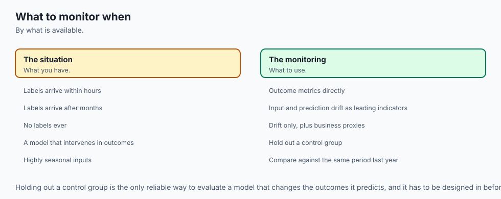

### When to USE Production ML Monitoring:
- All deployed models serving real-time predictions, financial credit risk, fraud scoring, and recommendation systems.
- Any setting where external human behavior or sensor telemetry evolves over time.

### When NOT to use it:
- Deterministic, static physics simulations where physical laws do not change over time.
- Offline exploratory analysis prior to model deployment.

---

## The AI connection

- **Model performance decays from the day it deploys**, which makes monitoring a requirement
  rather than a refinement.
- **Drift is detectable before outcomes are known**, which is what makes input monitoring
  valuable — labels usually arrive far too late.
- **Different drift types need different responses**, so classifying the drift is the first
  diagnostic step.
- **Silent degradation is the normal failure mode**: nothing errors, and predictions quietly
  get worse.
- **AI systems drift the same way**, which is why continuous evaluation appears throughout
  the later courses.

## Knowledge check

1. What is the fundamental difference between Covariate (Data) Drift and Concept Drift?
2. How does Population Stability Index (PSI) mathematically measure distribution divergence?
3. What do the three standard PSI threshold ranges (&lt;0.10, 0.10–0.20, &ge;0.20) indicate?
4. Why is Ground Truth Feedback Delay a primary obstacle in production machine learning?
5. How does the Kolmogorov-Smirnov (KS) test detect continuous feature drift?

---

## Hands-on exercise

In this lab, you will implement `PopulationStabilityIndexMonitor` in pure Python and NumPy, generate synthetic reference and shifted evaluation feature distributions, calculate PSI scores and bin contributions, classify drift status into `STABLE`, `MODERATE_DRIFT`, or `SIGNIFICANT_DRIFT`, and verify drift alerting logic.

### Expected output
```
[Production ML Drift Monitor]
Reference Dataset: 1,000 samples ~ Normal(mean=50, std=10)
Stable Production Stream: 1,000 samples ~ Normal(mean=50.2, std=10.1) -> PSI = 0.0142 [STABLE]
Shifted Production Stream: 1,000 samples ~ Normal(mean=62.0, std=14.0) -> PSI = 0.4285 [SIGNIFICANT_DRIFT]
Alert Generator: Alert triggered for feature 'annual_income' (PSI >= 0.20)
Test Suite: 2 passed in 0.08s
```

### Validate your work
Run the automated test runner:
```bash
./tests/run_tests.sh
```

### Troubleshooting
- If PSI returns `inf` or `NaN`, ensure you add smoothing `epsilon = 1e-4` to bin probability counts to prevent `log(0)`.
- Verify that reference bin edges start at `-np.inf` and end at `np.inf` to catch extreme outliers.

### Common mistakes
- **Recalculating Bin Edges on Production Data:** Production samples must be counted inside the *reference training bin boundaries*; recalculating bins on production data invalidates the comparison.

---

## Practice assignment

1. Implement a **Multi-Feature Drift Scanner** that computes PSI across 10 continuous tabular columns and outputs a sorted ranking of most-drifted features.
2. Build an automated Kolmogorov-Smirnov drift evaluator using `scipy.stats.ks_2samp`.

---

## Extension challenge

Implement an automated **Streaming Sketch Drift Detector (T-Digest)**:

- Maintain an online centroid sketch of incoming live inference data without storing raw rows in memory.
- Update the sketch incrementally per request with sub-millisecond CPU overhead.
- Compute rolling hourly PSI metrics against a frozen reference baseline sketch.
