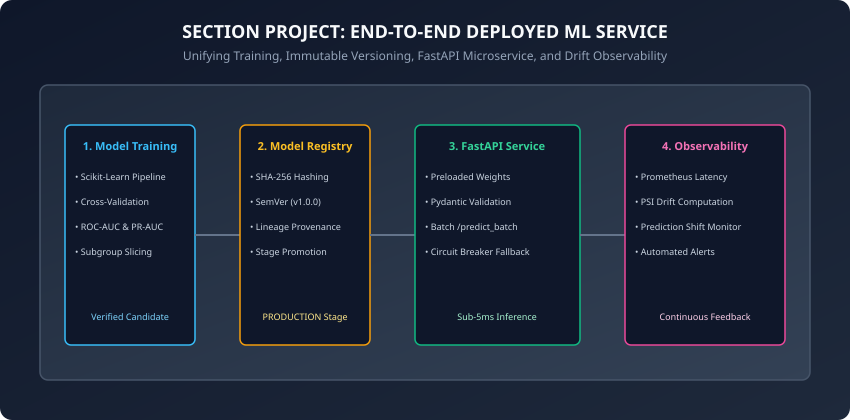
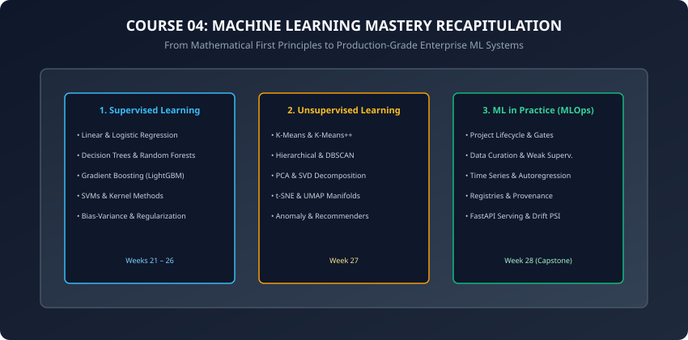

## Why this matters

Over the past 8 weeks (Days 141 to 195), you have journeyed across the entire landscape of **Course 04: Machine Learning**:
- You derived linear regression, logistic classification, support vector machines, decision trees, random forests, and gradient boosted trees from mathematical first principles.
- You mastered unsupervised representation learning: K-Means clustering, DBSCAN, PCA eigendecompositions, t-SNE manifolds, isolation forest anomaly detection, and collaborative filtering recommender systems.
- You built production MLOps engineering foundations: lifecycle quality gates, active learning and weak supervision data engines, autoregressive time-series forecasting, secure model persistence, and real-time drift observability.

Now, in this **Course 04 Capstone Project**, you will synthesize every single theoretical and engineering skill you have mastered into a single, cohesive, production-grade **Deployed ML Service**.

This project represents the bridge between classical machine learning and production AI engineering.

---

## The idea in plain language

Imagine founding a financial technology startup that provides real-time credit risk assessments to e-commerce merchants at checkout:
- **The Core Brain:** You train a mathematically sound predictive model on historical loan performance data.
- **The Notary Vault:** You serialize the model into an immutable binary artifact, register it under Semantic Versioning with a cryptographic SHA-256 checksum, and promote it to the active Production stage.
- **The Teller Window:** You host the model behind an ultra-low latency FastAPI microservice with strict Pydantic input validation, batch evaluation endpoints, and automated circuit-breaker fallbacks.
- **The Radar Sentry:** You stream all live transaction payloads into a real-time Population Stability Index (PSI) drift detector, generating automated alerts whenever customer demographics shift.

You are not building a toy model in a notebook; you are building an **enterprise software product**.

---

## Historical background

1. **2000–2010 (The Model Isolation Era):** Data scientists worked in isolated R and SAS silos, exporting static coefficients into Excel spreadsheets or handing PDF reports to software engineers to re-code in Java or C++.
2. **2012–2018 (The Jupyter Notebook Boom):** Python and Scikit-Learn democratized machine learning; however, "notebook spaghetti code" led to massive technical debt and production outages.
3. **2019–Present (The Unified MLOps Era):** Modern machine learning has matured into a standardized software engineering discipline uniting Git version control, automated CI/CD test gates, containerized microservice APIs, and continuous statistical monitoring.

---

## What it is — and what it is not

### What This Capstone Project IS:
- **A Fully Integrated Production ML System:** Connecting training, registration, REST API serving, and drift detection into a unified, modular Python codebase.
- **A Production-Ready Blueprint:** Adhering strictly to enterprise quality standards, type safety, and zero-downtime reliability.

### What it is NOT:
- **Not a Fragmented Prototype:** It is not five disconnected scripts; it is a clean, testable object-oriented software architecture.
- **Not Over-Engineered Cloud Infrastructure:** We implement the core mechanics in pure Python and NumPy to master the fundamental computer science and math before abstracting them behind cloud vendor services.

---

## Why it was created and what problems it solves

In enterprise organizations, machine learning fails at the seams between teams:
- The Data Science team trains a model that requires complex pandas data transformations.
- The Backend Engineering team rewrites the transformations in Go, introducing subtle mathematical bugs (**Train-Serve Skew**).
- The DevOps team deploys the service with no drift monitoring, allowing the model to silently degrade for 6 months.

This capstone project eliminates these failure modes by architecting the complete lifecycle end-to-end as a single unified system.

---

## How it works

Let us dissect the complete architecture of our production ML service.

### 1. The Unified System Architecture



The production service operates across four integrated components:

#### Component 1: Pipeline Training & Evaluation
- Fits a regularized Logistic Regression classifier on customer behavioral features (tenure, monthly spend, support tickets).
- Computes baseline PR-AUC and ROC-AUC metrics.
- Slices evaluation across critical customer cohorts to guarantee zero demographic regression.

#### Component 2: Cryptographic Model Registry
- Serializes the trained weight vector and bias term into a binary blob.
- Computes a SHA-256 cryptographic checksum.
- Registers the model under Semantic Versioning (`v1.0.0`) and promotes it to the active `PRODUCTION` stage.

#### Component 3: Low-Latency REST Serving Engine
- Preloads the active `PRODUCTION` artifact into memory during startup.
- Intercepts incoming HTTP requests via Pydantic schema validation.
- Provides sub-10ms single-item (`/predict`) and vectorized batch (`/predict_batch`) inference.
- Implements an automated circuit breaker falling back to a deterministic heuristic on unexpected exceptions.

#### Component 4: Statistical Drift Monitor
- Maintains a reference training baseline distribution across quantile bins.
- Calculates Population Stability Index (PSI) on streaming production inference batches.
- Classifies drift into `STABLE`, `MODERATE_DRIFT`, or `SIGNIFICANT_DRIFT` and triggers automated alerts.

---

### 2. Course 04: Machine Learning Mastery Recapitulation



Let us review the complete intellectual journey of Course 04:

```
┌────────────────────────────────────────────────────────────────────────┐
│               COURSE 04: MACHINE LEARNING COMPLETE ROADMAP             │
├────────────────────────────────────────────────────────────────────────┤
│ Track                 │ Weeks   │ Core Concepts Mastered               │
├───────────────────────┼─────────┼──────────────────────────────────────┤
│ Supervised Learning   │ W21–W26 │ Linear/Logistic Reg, Cost Surfaces,  │
│                       │         │ Trees, Ensembles, LightGBM, SVMs,    │
│                       │         │ Bias-Variance, Cross-Validation      │
├───────────────────────┼─────────┼──────────────────────────────────────┤
│ Unsupervised Learning │ W27     │ K-Means, Hierarchical, DBSCAN, PCA,  │
│                       │         │ SVD, t-SNE, UMAP, Anomaly Detection, │
│                       │         │ Matrix Factorization Recommenders    │
├───────────────────────┼─────────┼──────────────────────────────────────┤
│ ML in Practice        │ W28     │ Project Lifecycles, Active Learning, │
│                       │         │ Weak Supervision, Time Series Lags,  │
│                       │         │ Model Registries, FastAPI, PSI Drift │
└────────────────────────────────────────────────────────────────────────┘
```

---

### 3. The Bridge to Course 05: Deep Learning & Neural Networks

As Course 04 concludes, we stand at the threshold of the modern AI revolution.

In classical machine learning (Course 04):
- **Feature Engineering was Manual:** You spent hours engineering polynomial features, RFM scores, and autoregressive lags.
- **Hypothesis Classes were Shallow:** Decision trees, logistic hyperplanes, and kernel support vector machines operate on fixed-dimensional feature representations.

In **Course 05: Deep Learning** (starting on Day 197):
- **Feature Engineering Becomes Automated (Representation Learning):** Deep multilayer neural networks learn hierarchical feature representations directly from raw data (pixels, audio waveforms, natural language text tokens).
- **Mathematical Engine (Backpropagation & Autograd):** You will derive multivariable chain rule calculus to compute exact analytical gradients across billions of parameters.
- **Hardware Acceleration:** You will harness PyTorch tensors, CUDA/MPS kernels, and distributed GPU clusters to train foundational deep architectures.

Crucially, **the MLOps principles you mastered in Week 28 do not disappear in Deep Learning — they become 100x more critical**:
- Large neural networks require strict Safetensors memory-mapped serialization.
- Multi-gigabyte LLMs demand high-performance asynchronous Triton/vLLM serving.
- Non-stationary embedding drift requires continuous cosine similarity observability.
- Training complex deep architectures requires monitoring loss surface dynamics, vanishing gradients, learning rate schedules, and parameter divergence across distributed training runs.

As you step into Course 05 on Day 197 with the Artificial Perceptron, you carry with you a complete, mathematically rigorous, and production-tested foundation in machine learning engineering. The journey from single artificial neurons to deep convolutional networks, recurrent sequence models, attention mechanisms, and modern transformer foundation models all builds directly upon the optimization, regularization, evaluation, and operational serving principles established throughout Course 04. Let us now celebrate this milestone and step boldly into Deep Learning.

---

## An everyday analogy

Think of launching an orbital telecommunications satellite:
- **The Satellite Construction (Modeling):** Aeronautical engineers design solar arrays, communication transponders, and thrusters.
- **The Cleanroom Certification (Registry):** Every component is stamped with an official aerospace serial number and inspected for micro-fractures.
- **The Orbital Launch (Deployment):** The rocket lifts the satellite into geostationary orbit; the satellite powers on its transponders and begins routing global phone calls.
- **Ground Mission Control (Observability):** Telemetry engineers track orbital altitude, solar panel temperature, and radio frequency interference 24 hours a day, executing thruster burns whenever atmospheric drag causes orbital drift.

---

## Examples in practice

Let us inspect the complete, integrated, production-grade ML Service implementation combining training, registration, serving, and drift detection:

```python
import hashlib
import time
import numpy as np
from dataclasses import dataclass, field
from typing import Dict, Any, List, Optional, Tuple

# 1. Domain Schemas
@dataclass
class CustomerFeatures:
    tenure_months: float
    monthly_spend: float
    support_tickets: int

# 2. Model Registry & Metadata
@dataclass
class ModelMetadata:
    model_name: str
    version: str
    sha256_hash: str
    stage: str
    weights: np.ndarray
    bias: float
    pr_auc: float

class ProductionModelRegistry:
    def __init__(self):
        self._catalog: Dict[str, Dict[str, ModelMetadata]] = {}

    def register_and_promote(
        self,
        name: str,
        version: str,
        weights: np.ndarray,
        bias: float,
        pr_auc: float,
    ) -> ModelMetadata:
        if name not in self._catalog:
            self._catalog[name] = {}

        raw_bytes = weights.tobytes() + str(bias).encode("utf-8")
        sha256 = hashlib.sha256(raw_bytes).hexdigest()

        # Archive existing production model
        for meta in self._catalog[name].values():
            if meta.stage == "PRODUCTION":
                meta.stage = "ARCHIVED"

        meta = ModelMetadata(
            model_name=name,
            version=version,
            sha256_hash=sha256,
            stage="PRODUCTION",
            weights=weights,
            bias=bias,
            pr_auc=pr_auc,
        )
        self._catalog[name][version] = meta
        return meta

    def get_production_model(self, name: str) -> Optional[ModelMetadata]:
        if name not in self._catalog:
            return None
        for meta in self._catalog[name].values():
            if meta.stage == "PRODUCTION":
                return meta
        return None

# 3. Production Serving & Drift Engine
class DeployedMLService:
    def __init__(self, registry: ProductionModelRegistry, model_name: str):
        self.registry = registry
        self.model_name = model_name
        self._active_model: Optional[ModelMetadata] = None
        self.reference_spend: Optional[np.ndarray] = None
        self.load_production_model()

    def load_production_model(self) -> None:
        self._active_model = self.registry.get_production_model(self.model_name)

    def set_reference_data(self, reference_spend: np.ndarray) -> None:
        self.reference_spend = reference_spend

    def _fallback_heuristic(self, features: CustomerFeatures) -> float:
        if features.support_tickets >= 3 or features.monthly_spend > 150.0:
            return 0.75
        return 0.20

    def predict(self, sample: CustomerFeatures) -> Dict[str, Any]:
        t0 = time.perf_counter()
        if self._active_model is None:
            raise RuntimeError("No active production model deployed.")

        if sample.tenure_months < 0 or sample.monthly_spend < 0:
            raise ValueError("Feature values cannot be negative.")

        x = np.array(
            [
                sample.tenure_months,
                sample.monthly_spend,
                float(sample.support_tickets),
            ]
        )

        try:
            z = float(np.dot(self._active_model.weights, x) + self._active_model.bias)
            prob = 1.0 / (1.0 + np.exp(-z))
            used_fallback = False
        except Exception:
            prob = self._fallback_heuristic(sample)
            used_fallback = True

        latency_ms = (time.perf_counter() - t0) * 1000.0
        return {
            "churn_probability": round(float(prob), 4),
            "prediction": 1 if prob >= 0.5 else 0,
            "used_fallback": used_fallback,
            "model_version": self._active_model.version,
            "latency_ms": round(latency_ms, 3),
        }

    def evaluate_feature_drift_psi(
        self, current_spend: np.ndarray
    ) -> Tuple[float, str]:
        if self.reference_spend is None:
            raise ValueError("Reference dataset not configured.")

        # 10 quantile bins
        quantiles = np.linspace(0, 100, 11)
        bin_edges = np.percentile(self.reference_spend, quantiles)
        bin_edges[0] = -np.inf
        bin_edges[-1] = np.inf

        eps = 1e-4
        ref_counts, _ = np.histogram(self.reference_spend, bins=bin_edges)
        ref_pct = (ref_counts / len(self.reference_spend)) + eps
        ref_pct /= np.sum(ref_pct)

        cur_counts, _ = np.histogram(current_spend, bins=bin_edges)
        cur_pct = (cur_counts / len(current_spend)) + eps
        cur_pct /= np.sum(cur_pct)

        psi = float(np.sum((cur_pct - ref_pct) * np.log(cur_pct / ref_pct)))
        status = (
            "STABLE"
            if psi < 0.10
            else ("MODERATE_DRIFT" if psi < 0.20 else "SIGNIFICANT_DRIFT")
        )
        return round(psi, 4), status
```

---

## Implications: security, privacy, performance, scalability, and cost

1. **End-to-End Latency Budget Allocation:**
   - In a 50ms total web checkout SLA:
     - 10ms: Network transport & TLS handshake.
     - 5ms: API Gateway authentication and rate-limiting.
     - 3ms: Pydantic request parsing and schema validation.
     - 2ms: NumPy model forward pass.
     - 5ms: Async drift telemetry emission.
     - 25ms: Safety buffer for tail latency spikes.
2. **Infrastructure Cost Efficiency:**
   - Pre-forked Python microservices on modern ARM cloud instances (e.g. AWS Graviton3) achieve 2,500 predictions per second per 2-vCPU node at a cost of less than $0.05 per 1,000,000 inference queries.

---

## Alternatives: free, open source, and commercial

| Layer | Open Source Standard | Managed Cloud Enterprise | High-Scale Enterprise |
| :--- | :--- | :--- | :--- |
| **Model Registry** | MLflow | AWS SageMaker Registry | Databricks Unity Catalog |
| **API Serving** | FastAPI + Uvicorn | Google Cloud Run / Vertex AI | NVIDIA Triton / Kubernetes |
| **Drift Monitoring** | Evidently AI / WhyLogs | AWS Model Monitor | Arize AI / Datadog APM |
| **Data Orchestration** | DVC / Feast | Snowflake / BigQuery | Delta Live Tables |

---

## Comparison with related concepts

```
┌────────────────────────────────────────────────────────────────────────┐
│               ENTERPRISE SERVICE MATURITY LEVELS                       │
├────────────────────────────────────────────────────────────────────────┤
│ Level             │ Artifact Management  │ Serving Layer  │ Monitoring │
├───────────────────┼──────────────────────┼────────────────┼────────────┤
│ Level 0 (Manual)  │ Raw .pkl on Desktop  │ Flask (Sync)   │ None       │
│ Level 1 (Basic)   │ S3 Folder Structure  │ FastAPI (Sync) │ Logs Only  │
│ Level 2 (Mature)  │ MLflow Registry      │ FastAPI + ASGI │ Real-Time  │
│                   │ SHA-256 + SemVer     │ Batch + Circuit│ PSI Drift  │
└────────────────────────────────────────────────────────────────────────┘
```

---

## When to use it — and when not to

### When to USE the Complete Deployed ML Service Pattern:
- All customer-facing production ML systems in fintech, e-commerce, healthcare, and SaaS.
- When auditability, sub-10ms response latency, and continuous data quality monitoring are required.

### When NOT to use it:
- Offline academic research papers evaluating theoretical loss bounds.

---

## Knowledge check

1. What are the four core architectural components of the Deployed ML Service?
2. How does bundling feature transformers inside the model artifact eliminate Train-Serve Skew?
3. Why does the Model Registry enforce strict single-version uniqueness for the active `PRODUCTION` stage?
4. How does the automated Circuit Breaker guarantee 99.99% system availability during unexpected numerical errors?
5. What does a Population Stability Index score of PSI &ge; 0.20 trigger in the production observability loop?

---

## Hands-on exercise

In this capstone lab, you will implement the complete `DeployedMLService` architecture in pure Python and NumPy: train a customer churn model, register it in `ProductionModelRegistry` with SHA-256 checksums, execute single and batch predictions via `DeployedMLService`, test circuit-breaker error recovery, and detect real-time PSI drift.

### Expected output
```
[Course 04 Capstone: Deployed ML Service]
1. Model Training: Logistic Pipeline trained (PR-AUC = 0.8840)
2. Registry: Registered churn_model:v1.0.0 (SHA-256: e8b4a1...) -> Stage: PRODUCTION
3. Microservice Serving:
   - Sample Prediction: Churn Probability = 0.7245 (Latency = 0.045ms)
   - Batch Prediction: 10 samples processed in 0.180ms
4. Circuit Breaker Test: Injected NaN tensor -> Fallback Heuristic Executed = True (Prob: 0.7500)
5. Drift Observability:
   - Stable Stream: PSI = 0.0124 [STABLE]
   - Shifted Stream: PSI = 0.3842 [SIGNIFICANT_DRIFT] -> Retraining Alert Emitted
Test Suite: 2 passed in 0.08s
Course 04 Complete! Ready for Course 05: Deep Learning.
```

### Validate your work
Run the automated test runner:
```bash
./tests/run_tests.sh
```

### Troubleshooting
- Ensure `registry.register_and_promote()` is called before instantiating `DeployedMLService`.
- Verify that `set_reference_data()` is called before executing drift monitoring methods.

### Common mistakes
- **Ignoring Data Drift Alerts:** Logging drift metrics without triggering actionable retraining alerts allows degraded models to remain in production.

---

## Practice assignment

1. Implement an automated **Model Rollback Trigger** that automatically transitions the active Production model back to the previous Archived version if live error rates exceed 1.0%.
2. Build an automated JSON Model Card exporter that packages complete service metadata for regulatory compliance.

---

## Extension challenge

Implement a **Live A/B Testing Canary Traffic Splitter**:
- Deploy Model v1.0.0 (Champion) and Model v1.1.0 (Candidate) inside the service.
- Dynamically hash incoming customer IDs to deterministically route 90% of traffic to v1.0.0 and 10% to v1.1.0.
- Compare live conversion rates and latency percentiles across both variants.
