## Why this matters

Open a spreadsheet you already have. Pick any row.

```
Ashfield,3,4
```

A place, and two numbers: three kilometres east of the depot, four kilometres north. That row is a vector. You have not learned anything new, you have not converted anything, and nothing needs installing. The row was already a vector on the day somebody typed it.

Here is another one:

```
#1D4ED8  ->  (29, 78, 216)
```

That is the blue used in this course's diagrams, as three numbers: red 29, green 78, blue 216. A colour is a vector. You have been writing vectors since Day 1.

And here is a third:

```
roast-chicken,9,0,1,0
```

Four numbers counting how many times a short article mentions cooking, running, money and weather. Also a vector, and this is the one that matters, because when a language model turns a sentence into a list of 384 numbers, it is producing exactly this object. Bigger, and with columns nobody chose by hand — but the same object, with the same operations available.

**Ninety-eight days of this course have been about instructing a computer. This day is where you start describing the world to one.** Everything in the second half of this course — embeddings, semantic search, similarity, gradients, weights, attention — is built on the idea that a thing can be a list of numbers and that two things being *alike* means their lists being *close*.

That word "close" is the whole day. It sounds soft. It is not. By the end of this page you will be able to take six articles, turn them into vectors by counting, and say — with the squares, the sum and the square root written out — that `roast-chicken` and `slow-cooker-stew` are 1.4142 apart while `roast-chicken` and `household-budget` are 11.3137 apart. Not "more similar". **1.4142 against 11.3137.**

Let me be blunt about the fear, because a lot of readers arrive at this section of the course expecting to be found out.

You do not need any mathematics beyond school arithmetic to do today's work. You need squares, you need square roots, and you need to be willing to write out four lines of addition. Every single worked example on this page is computed in full, and every number in it comes out whole or is shown to four decimal places from a real run. Nothing is asserted and left hanging. If a formula appears, it appears *after* the arithmetic that produced it, never before.

What the day costs if you skip it is specific, and it lands later:

- **You will not be able to debug a search that returns the wrong thing.** When a retrieval system ranks an article about marathons above your recipe, the cause is almost never the model. It is that raw counts made a short query look near the shortest document rather than the most similar one. You will meet exactly that failure in this lab, with numbers.
- **You will write a test that fails on correct code.** Normalising a vector gives a magnitude of 1 — except that on the machine this lesson was written on, three of seven test vectors came out at `0.9999999999999999`. A test written with `==` fails, and you will spend an afternoon looking for a bug that is not there.
- **You will not be able to say what your own results mean.** "Nearest" is undefined until you name a norm. This page contains two candidates where one norm says A is nearer and the other says B is nearer, both correct. A result that does not name its norm is a result you cannot defend.

The good news is the shape of the day. You will implement all of it — addition, subtraction, scaling, dot product, both norms, distance, normalisation, nearest-neighbour search — in about forty lines of plain Python with no libraries at all. Then you will run the same operations through NumPy on the same inputs and prove they agree. The order is deliberate. **A reader who has written the loop knows what the library is doing before being asked to trust it**, and that is the difference between using NumPy and being at its mercy.

## The idea in plain language

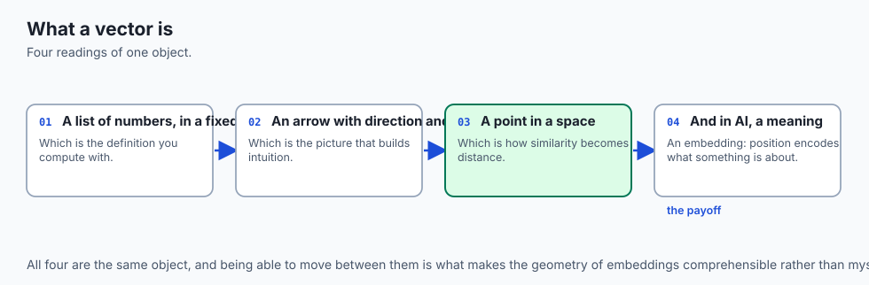

A vector is **an ordered list of numbers where position means something**.

That is the whole definition. Read it twice, because most of the difficulty people have with this subject comes from expecting it to be harder.

- *Ordered* — the list has a first, a second, a third. `(3, 4)` and `(4, 3)` are different vectors describing different places.
- *List of numbers* — no text, no gaps, just numbers.
- *Position means something* — slot 1 is always east, slot 2 is always north. Swap two columns of your dataset and every row now means something else.

There is a second picture of the same object, and this is where the subject gets its reputation. A vector is also **an arrow: something with a direction and a length**. Three east and four north is a walk, and a walk has a direction (roughly north-east) and a distance (five kilometres as the crow flies).

Both pictures are correct and they are the same object. The point of today is holding them together.


Look at the three panels of that diagram and notice that nothing changes between them but the notation:

| Picture | What it is good for | Where it fails |
| --- | --- | --- |
| **The list** `(3, 4)` | Typing, storing, computing. It is what a CSV row, a Python list and a database record already are | It gives no feel for what the numbers *mean* together |
| **The arrow** | Intuition. Direction, length, "these two point the same way" — all obvious at a glance | It only exists in two or three dimensions. In 384 dimensions there is nothing to draw |
| **The row in a table** | Seeing that a dataset is a *collection* of vectors, one per thing | It hides the geometry: rows look like records, not like points in a space |

The last row of that table is the one people miss. A spreadsheet with 500 rows and 12 numeric columns is not "data that could be turned into vectors". It is 500 points in a 12-dimensional space, right now, and asking which two customers are most alike is asking which two of those points are closest — a question with an arithmetic answer.

Here is the claim the rest of the day cashes out:

> **An embedding is a vector, and "similar things are near each other" is a statement about distance that you will be able to compute by hand before you finish this page.**

Not a metaphor. A distance, in the ordinary sense: subtract, square, add, take the square root.

## Historical background

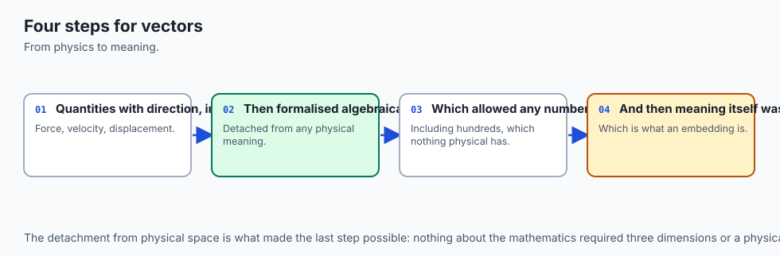

Vectors are younger than you would expect, and the reason is instructive: for two thousand years mathematics had the *geometry* without the *notation*.

Euclid's *Elements*, written in Alexandria around 300 BC, contains in Book I, Proposition 47 the result the whole of today rests on — that in a right-angled triangle the square on the hypotenuse equals the sum of the squares on the other two sides. Every magnitude you compute today is that proposition, applied one dimension at a time. What Euclid did not have was a way to write "the thing that goes three east and four north" as an object you could add to another object.

That notation arrived in the 1840s, and it arrived twice.

**William Rowan Hamilton**, in Dublin, was trying to extend complex numbers to three dimensions and failing for years. On 16 October 1843, walking along the Royal Canal to a meeting of the Royal Irish Academy, he saw that it worked in four dimensions rather than three, and carved the defining relation of the quaternions into the stone of Broom Bridge. Quaternions have four parts, and Hamilton called the three-part directional piece the **vector** part — from the Latin *vehere*, to carry — and the single-number piece the **scalar** part. Both words are his, and both survive today with meanings slightly narrower than he intended.

Independently and almost simultaneously, **Hermann Grassmann**, a schoolteacher in Stettin, published *Die lineale Ausdehnungslehre* in 1844. Grassmann's work was more general and more modern than Hamilton's — it is closer to what a linear algebra course teaches now — and it was almost entirely ignored for decades, partly because it was written in a philosophical style that even sympathetic mathematicians found impenetrable.

The vector notation you actually use was assembled in the 1880s by **Josiah Willard Gibbs** at Yale and **Oliver Heaviside** in England, working separately and both motivated by the same practical problem: quaternions were clumsy for physics, and electromagnetism needed something cleaner. They stripped the quaternion down, kept the three-component directional object, and defined the dot product and the cross product as separate operations rather than as parts of one quaternion multiplication. Gibbs printed his lecture notes privately for his students; Heaviside published his in the electrical engineering literature. The resulting notation won a bad-tempered argument with the quaternion school in the 1890s and became the standard.

**Giuseppe Peano** gave the modern axiomatic definition of a vector space in 1888, in *Calcolo geometrico*, which is what makes it legitimate to say that a list of 384 numbers is a vector even though it is not an arrow in any space you can see.

The idea of measuring distance by adding absolute differences rather than by Pythagoras — what this page calls the L1 norm — is associated with **Hermann Minkowski**, who studied families of distance functions of this kind around the turn of the twentieth century. The nickname "taxicab" or "Manhattan" distance came much later and from the obvious picture: on a street grid you cannot go through the buildings.

The computational history is much shorter. **Jim Hugunin** wrote *Numeric* in 1995 while a graduate student, giving Python its first array object. A decade of divergence followed, with a competing package called *Numarray*, and **Travis Oliphant** unified the two into **NumPy**, released as version 1.0 in 2006. Almost everything numerical in Python since then either is NumPy or imitates its interface deliberately — which is why the last section of this lesson can describe PyTorch, JAX and pandas mostly by saying what they changed about it.

One thing worth noticing in all of that: the arithmetic came first, the geometry was known for millennia, and the *notation* — the ability to write one letter for a whole list and manipulate it — is the recent invention. That is a fair description of what you are learning today. You already knew how to add two numbers. What you are gaining is the ability to stop writing the loop.

## What it is — and what it is not

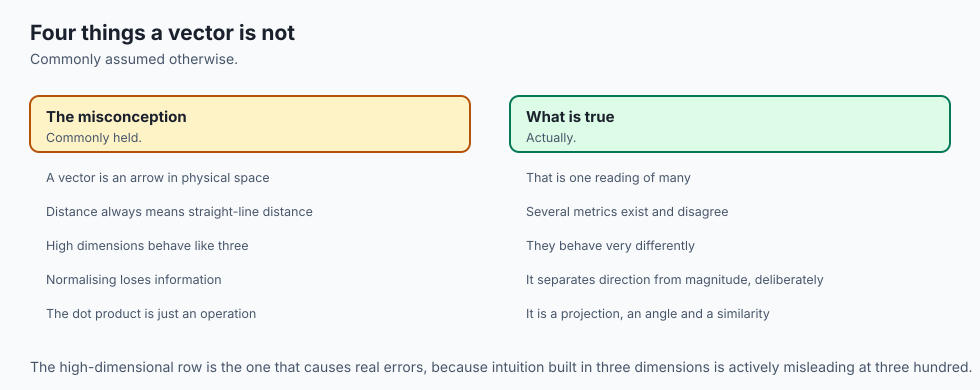

Let me clear away the misconceptions individually, because each one blocks something later.

| Misconception | What is actually true |
| --- | --- |
| "A vector is an arrow, so it needs 2 or 3 dimensions" | An arrow is one *picture* of a vector, available in 2D and 3D only. The definition — an ordered list of numbers — has no such limit. A 384-component embedding is as much a vector as `(3, 4)` is |
| "A vector has to start at the origin" | It does not. In the flow diagram below, the arrow from `(2, 2)` to `(5, 6)` is a perfectly good vector — it is `(3, 4)`, the same vector as the one from the origin to `(3, 4)`. A vector is a *displacement*, not a location. Two arrows are the same vector when they have the same direction and length, wherever they are drawn |
| "A vector and a point are different things" | They are different *interpretations* of the same list. `(3, 4)` as a point is a place; as a vector it is the journey from the origin to that place. Code does not distinguish them, and you should not lose sleep over it — but the difference is why subtracting two points gives a vector while adding two points is a slightly odd thing to do |
| "Dimension is a physical thing" | Dimension is a count. It means "how many numbers are in this list". A vector of a hundred sales figures is 100-dimensional, and there is nothing spatial about it |
| "Magnitude can be negative" | Never. It is a square root of a sum of squares, so it is zero or positive. A negative *component* is fine; a negative magnitude is a bug |
| "Normalising cleans up the data" | Normalising does exactly one thing: sets the magnitude to 1 while keeping the direction. It is not scaling to a 0-1 range, it is not standardising, it is not removing outliers. Those are different operations with different names |
| "The zero vector points somewhere by default" | It has magnitude 0 and no direction at all. Attempting to normalise it is a genuine error, and a function that returns a list of `nan` instead of saying so has made your bug invisible |
| "Vectors need a library" | You will implement every operation on this page in plain Python in about forty lines. NumPy is for speed and convenience, not capability |

And two things a vector genuinely is not:

**It is not a matrix.** A matrix is a rectangle of numbers; a vector is a single list. A table of many vectors stacked up is a matrix, which is Day 100's subject, and the relationship between the two is the reason these days are adjacent.

**It is not automatically meaningful.** A vector is a list of numbers, and whether the distance between two of them means anything depends entirely on whether the columns were chosen sensibly and measured in comparable units. If component 1 is a price in pounds and component 2 is an age in years, the distance between two rows is a number with no interpretation whatsoever — it is adding squared pounds to squared years. This is the single most common way to produce a confidently wrong result with vectors, and no amount of correct arithmetic will save you from it.

## Why it was created and what problems it solves

Gibbs and Heaviside were not doing housekeeping. They wanted to solve a problem that arises the moment you have several quantities that belong together.

Consider what you have to write without vector notation. A force in three dimensions is three numbers. Adding two forces means writing three separate equations. Adding twenty forces means sixty equations, and the fact that they are all the same equation is invisible on the page. Now imagine an embedding with 384 components and you can see why the notation is not cosmetic: **it lets you write one line where you would otherwise write hundreds, and it makes the *sameness* of those lines explicit.**

The problems vectors solve, concretely:

**1. Grouping things that belong together.** A colour is not three unrelated numbers, it is one colour. A position is not two unrelated numbers. The moment you name the group, you can pass it around, store it, compare it and operate on it as a unit — and your code stops carrying `x`, `y` and `z` as three parameters that can get out of step.

**2. Making "how different are these two things" computable.** This is the big one for this course. Two rows of numbers, one subtraction and one square root, and you have a number. Not a judgement — a number that ranks, sorts, thresholds and gets asserted in a test.

**3. Making the same code work in any number of dimensions.** Look at what is absent from every formula on this page: the dimension. The magnitude is "square every component, add, take the root" — however many components there are. That is why the pure-Python functions you write today will work unchanged on a 384-component embedding.

**4. Separating "which way" from "how far".** A vector carries both, and normalisation is the operation that keeps one and discards the other. This matters more in practice than it sounds. A long document has bigger word counts than a short one on the same topic. Length is an artefact; direction carries the topic. Normalising deletes the artefact.

**5. Turning meaning into geometry.** This is the modern reason and it is why this day sits where it does in the course. If you can arrange things so that similar items get nearby vectors, then *searching by meaning* becomes *searching by distance* — and searching by distance is something a computer is very good at.

## How it works

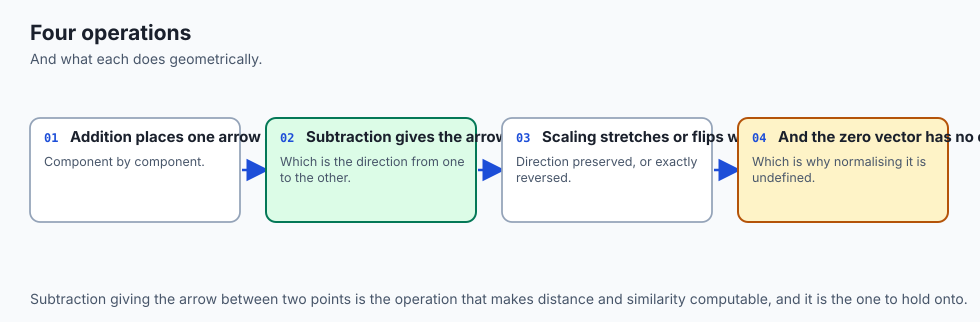

Here is the machinery, in order, with every number computed.

Throughout, I will use the map: a depot at the origin, and places reached by walking east and north. `v = (3, 4)` means three kilometres east, four north.

### Adding two vectors

Add matching components:

```
u = (4, 1)
v = (1, 3)

u + v = (4 + 1, 1 + 3) = (5, 4)
```

Geometrically: walk `u`, then from wherever you land walk `v`. Draw `v` starting at the tip of `u` — "tip to tail" — and the arrow from the start of `u` to the tip of `v` is the sum.

Now do it the other way round: walk `v` first, then `u`. You get `(1 + 4, 3 + 1) = (5, 4)`. The same place. Draw both routes and they form a **parallelogram**: two sides are copies of `u`, two are copies of `v`, and the sum is the diagonal. That is the parallelogram picture, and it is a picture of a fact you can also see in the arithmetic — `4 + 1` and `1 + 4` are the same number, so addition of vectors is commutative because addition of numbers is.

### Subtracting two vectors

Subtract matching components:

```
b = (5, 6)
a = (2, 2)

b - a = (5 - 2, 6 - 2) = (3, 4)
```

Geometrically, and this is the sentence to memorise: **`b - a` is the arrow that starts at the tip of `a` and ends at the tip of `b`.** It answers "how do I get from a to b". Notice it does not start at the origin. It does not need to.

Hold on to that, because in three paragraphs it becomes the definition of distance.

### Multiplying by a scalar

Multiply every component by the same number:

```
u   = (4, 1)
2u  = (8, 2)
-u  = (-4, -1)
0u  = (0, 0)
```

What changes and what does not:

| Scalar `k` | Direction | Magnitude |
| --- | --- | --- |
| `k > 1` | unchanged | multiplied by `k` — longer |
| `0 < k < 1` | unchanged | multiplied by `k` — shorter |
| `k = 0` | destroyed — the result is the zero vector | 0 |
| `k < 0` | reversed | multiplied by `|k|` |

All the scaled copies lie on **one straight line through the origin**. That is worth pausing on: scaling never leaves the line, which is why "the direction of `v`" is a property shared by every positive multiple of `v`, and why normalising can pick one canonical representative of that whole family.

### The zero vector

`(0, 0)`, or `(0, 0, 0)`, or 384 zeros. Its properties:

- Adding it changes nothing: `v + 0 = v`. It is the additive identity.
- You get it by scaling anything by 0, or by subtracting a vector from itself.
- Its magnitude is 0.
- **It has no direction at all** — not "direction zero", not "pointing along the first axis", none. And therefore it cannot be normalised, because normalising means dividing by the magnitude and the magnitude is zero.

That last point is a real bug source. In this lab, `normalise([0, 0, 0])` raises a `ValueError` with a message saying so. NumPy, given the same division, returns `array([nan, nan, nan])` with a runtime warning — and `nan` is not equal to anything, including itself, so it silently poisons every comparison downstream. Both behaviours are defensible; what is not defensible is not knowing which one your code does.


### Magnitude, derived rather than asserted

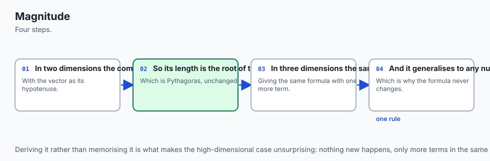

Now the important one, and I am going to derive it rather than write it down.

You have walked 3 km east and 4 km north. How far are you from the depot in a straight line?

Draw it. The eastward leg and the northward leg meet at a right angle — east and north are perpendicular, that is what they mean — so you have a right-angled triangle whose two short sides are 3 and 4, and whose hypotenuse is the straight-line distance you want. Euclid, Book I, Proposition 47:

```
hypotenuse^2 = 3^2 + 4^2
             = 9 + 16
             = 25

hypotenuse   = sqrt(25)
             = 5
```

Five kilometres. And notice you would *walk* seven — three plus four — because you cannot go through the fields. Remember that gap; it comes back as the L1 norm.

Now three dimensions. Add "and then 12 km up", giving `(3, 4, 12)`. Apply Pythagoras twice: the first two legs give a horizontal distance of 5, and that 5 is perpendicular to the vertical 12, so:

```
|v|^2 = 5^2 + 12^2 = 25 + 144 = 169
|v|   = 13
```

But look what that is in terms of the original numbers:

```
|v|^2 = (3^2 + 4^2) + 12^2 = 9 + 16 + 144 = 169
```

The same answer. **Adding a dimension just adds another squared component to the sum.** There is nothing special about three, and the argument repeats for four, for five, for 384. So:

> **The magnitude of a vector is the square root of the sum of the squares of its components.**

This is called the **L2 norm**, and when anyone says "the norm" or "the length" or "the magnitude" without qualification, this is what they mean. Written `|v|`.

Four you can check with a pen right now:

| Vector | Squares | Sum | Magnitude |
| --- | --- | --- | --- |
| `(3, 4)` | 9, 16 | 25 | **5** |
| `(6, 8)` | 36, 64 | 100 | **10** |
| `(2, 3, 6)` | 4, 9, 36 | 49 | **7** |
| `(1, 2, 2)` | 1, 4, 4 | 9 | **3** |
| `(3, 4, 12)` | 9, 16, 144 | 169 | **13** |
| `(7, 1, 5, 3, 9, 2)` | 49, 1, 25, 9, 81, 4 | 169 | **13** |

That last row is six-dimensional and you just computed its magnitude with a pen. You cannot draw it. It did not matter.

Two consequences fall straight out:

- **Signs vanish.** `(-3, -4)` has magnitude 5, the same as `(3, 4)`, because squaring removes the sign. A magnitude tells you how far, never which way.
- **Magnitude is never negative.** It is a square root of a sum of squares.

### Distance: there is no second formula

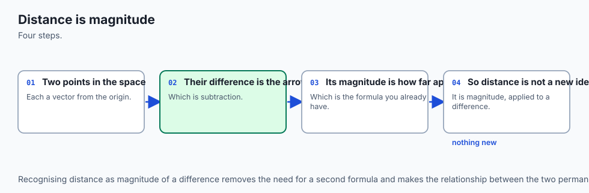

Here is the moment that makes most of linear algebra stop looking like a list of things to memorise.

You know how to subtract two vectors: `b - a` is the arrow from `a` to `b`. You know how to measure the length of a vector. So:

> **The distance between `a` and `b` is the magnitude of `b - a`.**

Subtract, then measure. That is all.

```
a = (2, 2)
b = (5, 6)

b - a       = (3, 4)
|b - a|     = sqrt(3^2 + 4^2) = sqrt(9 + 16) = sqrt(25) = 5
```

The distance is 5. If you have ever seen the "distance formula" written out as a square root of a sum of squared differences and found it arbitrary, this is where it comes from — it is not a separate rule, it is the norm applied to a difference.

Three properties, all checkable and all asserted in the lab's test suite:

- **Symmetric.** `distance(a, b) = distance(b, a)`, because `a - b` is `b - a` reversed and reversing does not change length.
- **Zero only for identical points.** `distance(a, a) = |0| = 0`.
- **The triangle inequality.** `distance(a, c) <= distance(a, b) + distance(b, c)`. Going via a third point is never a short cut. This is one of the conditions a function has to satisfy before anyone is allowed to call it a distance.

### The L1 norm, and where it disagrees

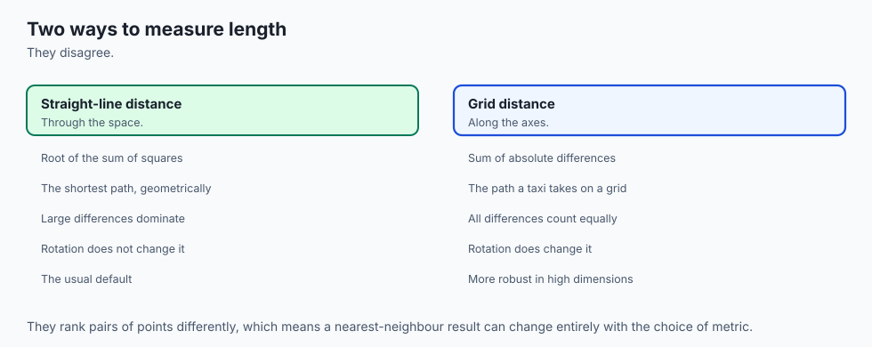

Go back to the walk. Straight-line distance from the depot to `(3, 4)` is 5 km. But you walked 3 + 4 = **7 km**, because the streets run east-west and north-south and you cannot cut the corner.

That 7 is the **L1 norm**: add up the absolute values of the components. No squaring, no square root.

```
L1 of (3, 4)     = |3| + |4|         = 7
L2 of (3, 4)     = sqrt(9 + 16)      = 5

L1 of (1, 2, 2)  = 1 + 2 + 2         = 5
L2 of (1, 2, 2)  = sqrt(1 + 4 + 4)   = 3
```

Both answer "how big is this vector". Both are correct. They are different questions.

The difference is not decorative, and here is the case that proves it. A query sits at the origin. Two candidates:

```
spike  = (4, 0, 0)     one large component
spread = (2, 2, 2)     three small ones
```

Compute both norms for both:

```
spike   L1 = 4 + 0 + 0 = 4
        L2 = sqrt(16 + 0 + 0) = sqrt(16) = 4

spread  L1 = 2 + 2 + 2 = 6
        L2 = sqrt(4 + 4 + 4) = sqrt(12) = 3.4641...
```

**Under L2, `spread` is nearer (3.4641 < 4). Under L1, `spike` is nearer (4 < 6).** The two norms rank the same pair in opposite orders.

Squaring is what does it. In L2 a single component of 4 contributes 16 to the sum, while three components of 2 contribute only 4 each. So **L2 punishes one large deviation far more than it punishes the same total spread thinly**, whereas L1 counts every unit at face value and does not care how it is distributed.

| | L2 (Euclidean) | L1 (taxicab, Manhattan) |
| --- | --- | --- |
| Formula | `sqrt(sum of squares)` | `sum of absolute values` |
| Everyday picture | as the crow flies | walking a street grid |
| Effect of one big component | punished heavily (squared) | counted at face value |
| Effect of many small components | forgiven (small squares) | counted in full |
| Relation | never larger than L1 | never smaller than L2 |
| Typical use | the default for distance and similarity | chosen when one large deviation should not dominate |
| Smoothness | smooth everywhere, easy to differentiate | has a corner at zero in each component |

Use L2 unless you have a reason. But **state which one you used**, because as you have just seen, a ranking can flip.

### Unit vectors and normalisation

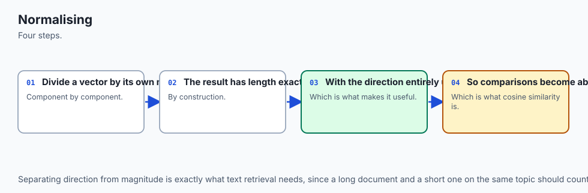

A **unit vector** has magnitude 1. It carries direction and nothing else.

To get one, scale by one over the magnitude:

```
v      = (3, 4)
|v|    = 5
v_unit = (1/5) * (3, 4) = (0.6, 0.8)

check: sqrt(0.6^2 + 0.8^2) = sqrt(0.36 + 0.64) = sqrt(1.0) = 1
```

Because the scalar `1/5` is positive, the direction is untouched. Only the length changed, from 5 to 1. This is worth saying precisely because it is a favourite exam question and a genuine source of confusion: **normalising changes magnitude and preserves direction.** Scaling the unit vector back up by 5 returns `(3.0, 4.0)`, which is the check that direction really did survive.

Why is normalising so common in practice? Because **length is very often an artefact and direction is the signal**.

Take the lab's catalogue. `roast-chicken` has feature counts `(9, 0, 1, 0)`. Now imagine the same article written at three times the length — the same topic, the same balance, more words:

```
short = (9, 0, 1, 0)      magnitude 9.0554
long  = (27, 0, 3, 0)     magnitude 27.1662

raw distance between them        = 18.1108
distance after normalising both  = 0.0000
```

On raw counts, those two articles are eighteen units apart, which would be a serious claim about their content. They are about the identical thing. The long one is the short one scaled by 3, so after normalising they are literally the same vector and the distance is exactly 0. Length was the entire disagreement.

### The dot product

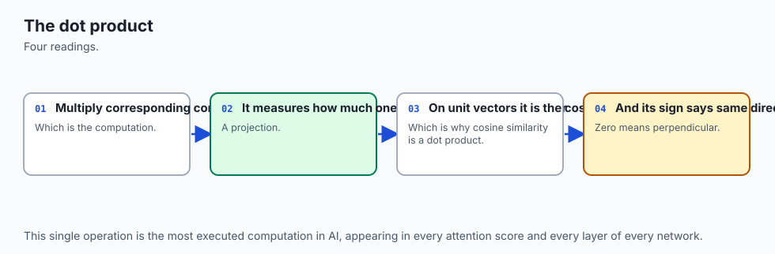

Multiply matching components, add the results, return one number:

```
u = (1, 2, 3)
v = (4, 5, 6)

u . v = 1*4 + 2*5 + 3*6 = 4 + 10 + 18 = 32
```

Two lists go in; one number comes out. That collapse is why the dot product is everywhere — a weighted sum, a projection, and a similarity score are all this operation under different names, and it is the single most common thing a machine learning model does, several billion times per query.

Two facts to carry forward:

- **A dot product of zero means the two vectors are perpendicular.** `(1, 0) . (0, 1) = 0`. `(3, 4) . (-4, 3) = -12 + 12 = 0`.
- **The dot of a vector with itself is its magnitude squared.** `(3, 4) . (3, 4) = 9 + 16 = 25 = 5^2`. Which is another way of saying the L2 norm is `sqrt(v . v)`.

### Basis vectors, and what a coordinate actually is

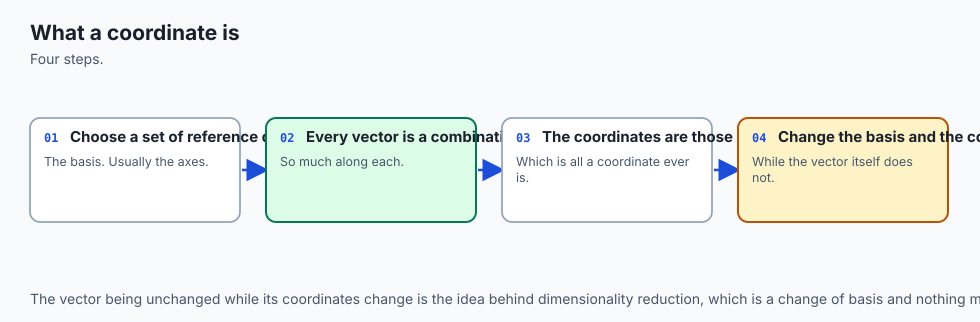

One last idea, and it explains why any of this notation means anything.

In two dimensions, define:

```
e1 = (1, 0)     one step east, nothing north
e2 = (0, 1)     nothing east, one step north
```

Then:

```
3 * e1 + 4 * e2  =  (3, 0) + (0, 4)  =  (3, 4)  =  v
```

So writing `v = (3, 4)` was *already* shorthand for "three of the first basis vector plus four of the second". A coordinate list is a set of instructions relative to a chosen set of reference directions. That set is called a **basis**, and `e1, e2` is the **standard basis**.

Why this matters, in one sentence: **the numbers depend on the basis, the vector does not.** Choose different reference directions — measure along the road and across it rather than east and north — and the same physical journey gets a different pair of numbers. Nothing about the journey changed. This is the seed of the idea that a matrix is a change of point of view, which is where the next few days go.

### The honest jump to high dimensions

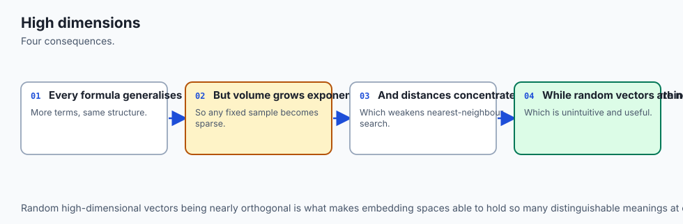

Everything above was demonstrated in two and three dimensions because those can be drawn. Embeddings have hundreds. What comes with you?

| Idea | Survives to 384 dimensions? |
| --- | --- |
| The definition: an ordered list of numbers | **Yes.** Unchanged |
| Addition, subtraction, scaling, componentwise | **Yes.** Unchanged |
| Magnitude = root of sum of squares | **Yes.** The formula never mentioned the dimension |
| Distance = magnitude of the difference | **Yes.** Unchanged |
| Dot product, and dot of zero meaning perpendicular | **Yes.** Unchanged |
| The triangle inequality | **Yes.** Still holds |
| Normalising to magnitude 1 | **Yes.** Unchanged |
| The picture — arrows, angles seen by eye | **No.** There is nothing to draw |
| "Perpendicular" as something you can visualise | **No,** though the arithmetic still works. Vectors in high dimensions are *overwhelmingly likely* to be close to perpendicular, which is not what 2D intuition expects |
| "Most points are close to at least a few others" | **No.** High-dimensional space is far emptier than intuition suggests, and distances between random points bunch together |

The last two rows are the honest caveats and they have a collective name in the literature: the curse of dimensionality. Today's arithmetic is exact and unaffected. What is affected is how much a nearest-neighbour result *means* when everything is roughly the same distance from everything else — which is a real problem in retrieval systems and one of several reasons embeddings are trained rather than hand-counted.

For now, take the good news: **every formula on this page is dimension-free, and you verified all of them with a pen.**

## An everyday analogy

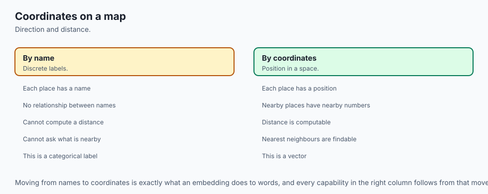

The analogy has been running underneath the whole lesson, so let me make it explicit and then push it until it breaks, because an analogy you have not broken is an analogy you do not understand.

**A vector is a journey.**

- The **list** `(3, 4)` is the instruction: go three east, four north.
- The **direction** is which way you end up facing relative to where you started.
- The **magnitude** is how far you are from where you started, as the crow flies. Five kilometres.
- **Adding** two journeys is doing one and then the other. The order does not matter, which is why the parallelogram closes.
- **Subtracting** answers "how do I get from where you are to where I am".
- **Scaling by 2** is the same journey, twice as far. **Scaling by −1** is walking back.
- The **zero vector** is not going anywhere. You end where you started, and there is no meaningful answer to "which way did you face" — which is exactly why it cannot be normalised.
- **Normalising** is answering "which way is Ashfield from here?" with a compass bearing instead of a distance. You have deliberately thrown away how far.
- The **L1 norm** is how far you actually walk on a street grid — seven kilometres. The **L2 norm** is how far the crow flies — five. Both are real answers to "how far", and which one you want depends on whether you have wings.
- The **distance between two places** is the length of the journey between them, which is why you subtract first.

Where the analogy breaks, and it is worth knowing:

**Journeys are three-dimensional at most; vectors are not.** There is no walk corresponding to a 384-component embedding, and no bearing you could point at. When you get to embeddings, keep the arithmetic and drop the walking.

**Journeys happen in a space that exists independently; embeddings do not.** East and north are real directions in a real world that would be there without you. The 384 components of an embedding are whatever a training process produced, they have no individual meaning, and the space has no privileged directions. The consequence: "nearby" in embedding space means "the model placed these near each other", not "these are objectively similar". That distinction matters enormously when a search result is wrong, because the answer is not out there to be found — it was manufactured.

**Kilometres are all the same unit; your columns may not be.** If component 1 is a price and component 2 is an age, then `sqrt(price^2 + age^2)` is adding squared pounds to squared years and the result means nothing at all. The map analogy quietly assumes every component is measured the same way, and real datasets very often are not. The fix — rescaling columns to comparable ranges — is a whole subject of its own, and the thing to carry today is the awareness that the assumption is there.

## Examples in practice

Time to build the thing the day promised. Six short articles, turned into vectors by counting, and a program that says which is most like which.

### The catalogue

Four features, counted by hand: how many times each article mentions cooking, running, money and weather.

| article | cooking | running | money | weather | magnitude |
| --- | --- | --- | --- | --- | --- |
| `roast-chicken` | 9 | 0 | 1 | 0 | 9.0554 |
| `slow-cooker-stew` | 8 | 0 | 2 | 0 | 8.2462 |
| `marathon-plan` | 0 | 9 | 1 | 2 | 9.2736 |
| `race-day-nutrition` | 4 | 6 | 3 | 0 | 7.8102 |
| `household-budget` | 1 | 0 | 9 | 0 | 9.0554 |
| `storm-bulletin` | 0 | 1 | 0 | 9 | 9.0554 |

That is a hand-made embedding. Real ones are produced by a trained model and have hundreds of components whose meanings nobody assigned. Everything else — one row of numbers per item, nearness measured with a norm — is the same.

### Two distances, worked out in full

`roast-chicken` against `slow-cooker-stew`:

```
(9, 0, 1, 0) - (8, 0, 2, 0) = (1, 0, -1, 0)

squares:  1 + 0 + 1 + 0 = 2
sqrt(2) = 1.4142
```

`roast-chicken` against `household-budget`:

```
(9, 0, 1, 0) - (1, 0, 9, 0) = (8, 0, -8, 0)

squares:  64 + 0 + 64 + 0 = 128
sqrt(128) = 11.3137
```

**1.4142 against 11.3137.** That is what "these two are similar and those two are not" means, numerically, and you can redo both on paper.

One more, and this one comes out exactly whole:

```
household-budget vs race-day-nutrition
(1, 0, 9, 0) - (4, 6, 3, 0) = (-3, -6, 6, 0)

squares:  9 + 36 + 36 + 0 = 81
sqrt(81) = 9
```

### The full distance matrix

Captured from a real run of `examples/embeddings.py` in the lab:

```
                      roast-chi  slow-cook  marathon-  race-day-  household  storm-bul
roast-chicken            0.0000     1.4142    12.8841     8.0623    11.3137    12.8062
slow-cooker-stew         1.4142     0.0000    12.2474     7.2801     9.8995    12.2474
marathon-plan           12.8841    12.2474     0.0000     5.7446    12.2474    10.6771
race-day-nutrition       8.0623     7.2801     5.7446     0.0000     9.0000    11.4455
household-budget        11.3137     9.8995    12.2474     9.0000     0.0000    12.8062
storm-bulletin          12.8062    12.2474    10.6771    11.4455    12.8062     0.0000
```

The diagonal is zero — every article is zero distance from itself — and the matrix is symmetric about it, because distance is symmetric. Both of those are checks, not decorations: if either failed you would have a bug.

### Nearest neighbours

```
  roast-chicken        -> slow-cooker-stew     at 1.4142
  slow-cooker-stew     -> roast-chicken        at 1.4142
  marathon-plan        -> race-day-nutrition   at 5.7446
  race-day-nutrition   -> marathon-plan        at 5.7446
  household-budget     -> race-day-nutrition   at 9.0000
  storm-bulletin       -> marathon-plan        at 10.6771
```

Read those and check them against your own judgement. The two cooking articles pair up, tightly. The two running-adjacent articles pair up. And then the interesting ones: `household-budget`'s nearest neighbour is `race-day-nutrition` at 9.0000, and `storm-bulletin`'s is `marathon-plan` at 10.6771 — both large distances, and both essentially saying "nothing here is much like me". The number carries that information. A ranking without the number would not.

### Where raw counts go wrong, and normalising fixes it

Now the failure worth seeing. A one-line note: "roast it". Its vector is `(1, 0, 0, 0)` — one mention of cooking, nothing else.

Which article should it match? Obviously `roast-chicken`, the article most purely about cooking. Here is what actually happens, from the real run:

```
  article                 raw distance   normalised distance
  ----------------------------------------------------------
  roast-chicken                 8.0623                0.1106
  slow-cooker-stew              7.2801                0.2444
  marathon-plan                 9.3274                1.4142
  race-day-nutrition            7.3485                0.9878
  household-budget              9.0000                1.3338
  storm-bulletin                9.1104                1.4142

  nearest on raw counts : slow-cooker-stew at 7.2801
  nearest normalised    : roast-chicken at 0.1106
  raw rank of roast-chicken        : 3
  normalised rank of roast-chicken : 1
```

On raw counts, `roast-chicken` comes **third** — behind `slow-cooker-stew` and behind `race-day-nutrition`, which is mostly about running. That is a wrong answer produced by entirely correct arithmetic.

The cause: the query vector is short, so it sits near the origin, and raw distance measured from near the origin is dominated by how *long* each article is rather than by what it is *about*. Length is competing with topic, and length is winning. Normalising puts every vector on the unit sphere, deletes length from the comparison, and leaves only direction. Normalised, `roast-chicken` wins at 0.1106 and `race-day-nutrition` falls to 0.9878.

Two details in that table reward a second look. `marathon-plan` and `storm-bulletin` both come out at exactly `1.4142` — the square root of 2 — from the cooking query. That is not a coincidence: both mention cooking zero times, so their unit vectors have a dot product of exactly 0 with the query's unit vector, which is to say they are perpendicular to it. Perpendicular unit vectors are always `sqrt(2)` apart. The dot product and the distance are telling you the same thing in two languages.

### The from-scratch implementation

Here is the whole of it, in plain Python, no imports beyond `math`. This is `examples/vectors.py` from the lab, condensed:

```python
import math

def check_same_dimension(u, v):
    if len(u) != len(v):
        raise ValueError(f"dimension mismatch: {len(u)} and {len(v)}")

def add(u, v):
    check_same_dimension(u, v)
    return [a + b for a, b in zip(u, v)]

def subtract(u, v):
    check_same_dimension(u, v)
    return [a - b for a, b in zip(u, v)]

def scale(k, v):
    return [k * a for a in v]

def dot(u, v):
    check_same_dimension(u, v)
    total = 0.0
    for a, b in zip(u, v):
        total += a * b
    return total

def l2_norm(v):
    return math.sqrt(sum(a * a for a in v))

def l1_norm(v):
    return sum(abs(a) for a in v)

def distance(u, v):
    return l2_norm(subtract(u, v))

def normalise(v):
    length = l2_norm(v)
    if length == 0.0:
        raise ValueError("cannot normalise the zero vector: it has no direction")
    return scale(1.0 / length, v)
```

That is the entire subject of this lesson, executable. Notice three deliberate choices:

**The dimension guard is separate and called explicitly.** Adding a 2-vector to a 3-vector is not a slightly wrong answer, it is a meaningless question, and `zip` would silently truncate to the shorter one and return something plausible. Silence is the failure mode to avoid.

**`distance` is one line built from two others.** It is not a formula, it is a composition, and writing it that way makes the fact unforgettable.

**`normalise` raises on the zero vector.** It could have returned `nan`s. It does not, because a loud error at the point of the problem is worth ten hours of debugging later.

### And then NumPy — which does the same thing

Now the same operations through the library, on the same inputs, from a real run of `examples/agreement.py` (numpy 2.5.2):

```
operation             pure Python                       NumPy                             agree
-----------------------------------------------------------------------------------------------
add(u, v)             [4.0, 2.0, 17.0]                  [4.0, 2.0, 17.0]                  True
subtract(u, v)        [2.0, 6.0, 7.0]                   [2.0, 6.0, 7.0]                   True
scale(k, u)           [7.5, 10.0, 30.0]                 [7.5, 10.0, 30.0]                 True
negate(u)             [-3.0, -4.0, -12.0]               [-3.0, -4.0, -12.0]               True
zero(3)               [0.0, 0.0, 0.0]                   [0.0, 0.0, 0.0]                   True
normalise(u)          [0.230769, 0.307692, 0.923077]    [0.230769, 0.307692, 0.923077]    True
dot(u, v)             55.0                              55.0                              True
l2_norm(u)            13.0                              13.0                              True
l1_norm(u)            19                                19.0                              True
distance(u, v)        9.433981132056603                 9.433981132056603                 True
l1_distance(u, v)     15                                15.0                              True

every operation agrees: True
```

`u = (3, 4, 12)`, `v = (1, -2, 5)`, `k = 2.5`. Every comparison used `numpy.allclose(rtol=1e-9, atol=1e-12)` or `math.isclose` with the same tolerance — never `==`, for reasons two sections down.

In NumPy the same eleven operations are written like this:

```python
import numpy as np

u = np.array([3, 4, 12])
v = np.array([1, -2, 5])

u + v                            # add
u - v                            # subtract
2.5 * u                          # scale
np.dot(u, v)                     # dot product
np.linalg.norm(u)                # L2 norm
np.linalg.norm(u, ord=1)         # L1 norm
np.linalg.norm(u - v)            # distance
u / np.linalg.norm(u)            # normalise
```

That is the payoff for having written the loops. `np.linalg.norm(u)` is not magic; it is `math.sqrt(sum(a * a for a in v))` with a faster inner loop.

And NumPy adds two things the loops do not, both captured from the same run:

```
1. A whole table of vectors is one object, and one call measures every row:
     matrix shape        = (3, 4)
     norms of all rows   = [9.0554 8.2462 9.2736]
     the same, by loop   = [9.0554, 8.2462, 9.2736]
     agree               = True

2. Every distance from one query to every row, in one expression:
     query               = [1, 0, 0, 0]
     distances (NumPy)   = [8.0623 7.2801 9.3274]
     distances (loop)    = [8.0623, 7.2801, 9.3274]
     agree               = True
```

The second is the one that matters. `stacked - query` subtracted a four-component vector from every row of a 3-by-4 table without a loop. That is **broadcasting**, and it is why a similarity search over a million embeddings is a few lines rather than a nested loop.

### The floating-point trap, demonstrated

Normalise a vector and its magnitude is 1. Write the test:

```python
assert l2_norm(normalise(v)) == 1.0
```

Here is what happened when that was actually checked on seven vectors, from the real run of `examples/normalise.py`:

```
vector                    |v|                   |v_hat| (exact repr)      == 1.0   isclose
------------------------------------------------------------------------------------------
[3, 4]                    5.0                   1.0                       True     True
[1, 2, 2]                 3.0                   1.0                       True     True
[1, 1]                    1.4142135623730951    0.9999999999999999        False    True
[1, 1, 1]                 1.7320508075688772    1.0                       True     True
[0.1, 0.2, 0.3]           0.37416573867739417   0.9999999999999999        False    True
[2, 3, 6]                 7.0                   0.9999999999999999        False    True
[7, 1, 5, 3, 9, 2]        13.0                  1.0                       True     True

exactly 1.0 : 4 of 7
isclose 1.0 : 7 of 7
```

Four passed `== 1.0`. Three failed. **The maths is correct in every single row** — every one of them is 1.0 to within `rel_tol=1e-9`. Only the equality test disagrees.

Look at `(2, 3, 6)`, which is the sharpest case in the table. Its magnitude is exactly `7.0` — a whole number, exactly representable in binary — and dividing by it *still* does not give back exactly 1.0 when you square and add the results.

Day 46 explained why: a float is a binary approximation, and a chain of divisions and multiplications can land one unit in the last place away from the exact answer. Today is where it bites, and the lesson is not "floats are broken". It is:

> **Every floating-point comparison needs a stated tolerance, and a test written with `==` will fail on correct code.**

Use `math.isclose(value, 1.0, rel_tol=1e-9, abs_tol=1e-12)` or `numpy.allclose(a, b, rtol=1e-9, atol=1e-12)`. Both parts matter: `rel_tol` scales with the size of the numbers, and `abs_tol` is what saves you near zero where a relative tolerance is meaningless. State them out loud rather than leaning on a library default — NumPy's default `rtol` is `1e-05`, which is far looser than most people assume when they call `allclose` and move on.

The lab's test suite contains a test whose only job is to *prove* this on the machine it runs on. It asserts that all seven are 1.0 to tolerance, and that at least one of them is not exactly 1.0. If that second assertion ever stops holding somewhere, the harness fails loudly rather than letting the lesson quietly tell a lie.

## Implications: security, privacy, performance, scalability, and cost

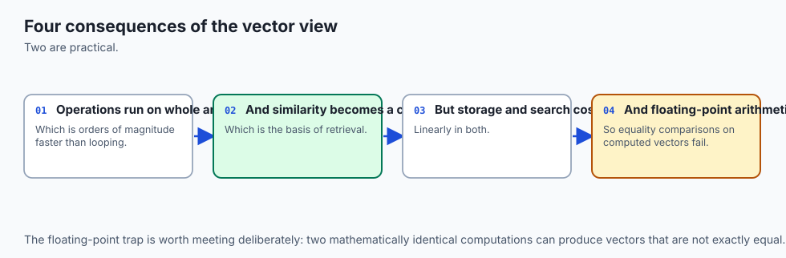

**Performance.** The pure-Python functions above are correct and slow. Every operation walks a Python list one element at a time, with the interpreter's overhead on each step. NumPy stores the numbers in one contiguous block of memory in a fixed type and runs the loop in compiled code, often using the processor's vector instructions to handle several components per cycle. The gap is large — commonly one to two orders of magnitude, and larger for big arrays — but it depends heavily on array size, dtype and hardware, so the lab's extension exercise asks you to measure the ratio on *your* machine rather than quote a number you read. What is not in doubt is the shape: correctness comes from the loop you wrote, speed comes from the library.

**Scalability.** Comparing a query against a million embeddings of 384 components each is 384 million multiply-adds per query, which is fast in compiled code but not free, and it grows linearly with the collection. This is why vector databases exist and why approximate nearest-neighbour indexes exist: they trade a small chance of missing the true nearest item for a search that does not touch every row. That trade-off is a later subject. What today gives you is the ability to say precisely what such an index is approximating.

**Memory and cost.** A 384-component embedding stored as 32-bit floats is 1,536 bytes. A million of them is about 1.5 GB before any index. That is a real infrastructure number and it comes straight out of dimension times bytes per number. Halving the precision to 16-bit floats halves it and costs some accuracy; the fact that this is even a decision is worth knowing before somebody presents it to you as a foregone conclusion.

**Privacy — the important one.** It is very tempting to assume that turning a document into 384 floating-point numbers has destroyed the original. It has not. Research on embedding inversion has repeatedly recovered substantial portions of source text from its embedding. **Treat an embedding of personal data as personal data**: same access controls, same retention policy, same deletion obligations. "It is only numbers" is not an argument, and a deletion request that removes a document but leaves its vector in an index has not been honoured.

**Security.** Three consequences follow from what you learned today:

- **A vector store is a database.** Who can read it, who can write to it, is it encrypted at rest, what happens on a deletion request — all the usual questions apply, and none of them get easier because the contents look like noise.
- **Nearest-neighbour rankings leak.** If a search returns the closest documents to a query and some of those documents are ones the user is not allowed to see, then the *ranking itself* is a disclosure: you learn that something exists and roughly what it resembles without ever being shown it. Access control belongs in the retrieval step, not in the rendering step.
- **A similarity threshold compared with `==` is a decision an attacker can nudge.** "Is this similarity above 0.95?" is a gate, and a gate whose comparison is unstable at the last bit is a gate with a wobble in it. The float discipline you learned today is a correctness practice in a lab and a security practice in production.

**Cost of getting the modelling wrong.** Nothing in the arithmetic will stop you computing `sqrt(price^2 + age^2)`. It will return a number. That number is meaningless, and no amount of correct code will tell you so. Whether the components of your vector are comparable is a judgement you have to make, and it is the most expensive mistake available in this area precisely because it produces confident, plausible, wrong answers.

## Alternatives: free, open source, and commercial

For the work on this page, here is the landscape. **I ran the first two. I did not run the last three, and no output from them is reproduced anywhere in this lesson or lab** — they are described from their published documentation, and the lab's test harness confirms they are not installed so that this statement cannot quietly rot.

| Option | Licence and cost | Choose it when | Do not choose it when |
| --- | --- | --- | --- |
| **Pure Python lists** | Free, standard library | Learning; small data; when the dependency is not worth it; when you want to be certain what the code does | Any array of real size — it is one to two orders of magnitude slower and you will feel it |
| **NumPy 2.5.2** | Free, BSD-3-Clause. No paid edition exists | Essentially always, for numerical work on one machine. It is the default and the thing everything else imitates | You need automatic differentiation, or GPU execution, or data larger than memory |
| **PyTorch** | Free, BSD-style. Paid only in the sense that the cloud GPUs you run it on cost money | You need gradients or a GPU. Tensors behave like NumPy arrays deliberately | Plain numerical work with no learning involved — it is a large dependency for `np.linalg.norm` |
| **JAX** | Free, Apache-2.0. Same cloud-cost caveat | You want NumPy semantics plus composable transformations — automatic differentiation, just-in-time compilation, vectorised mapping | You need in-place mutation or a small footprint; its arrays are immutable by design |
| **pandas** | Free, BSD-3-Clause | Your vectors are rows of a labelled table and you care about the labels, the joins and the missing-value handling | You are doing pure vector arithmetic — it adds an index and an axis-alignment layer you did not ask for |

Ran here, with output reproduced:

**Pure Python lists.** Every operation on this page, forty lines, `math.sqrt` the only import. Concrete example: `l2_norm([3, 4, 12])` returns `13.0`. Free, no install, and it is what the lab asks you to write.

**NumPy 2.5.2.** Installed in the lab's pinned environment and run for every agreement check above. Concrete example, from the real run:

```python
>>> import numpy as np
>>> np.linalg.norm([3, 4, 12])
13.0
```

and the broadcast form that makes it worth having:

```python
>>> matrix = np.array([[9, 0, 1, 0], [8, 0, 2, 0], [0, 9, 1, 2]])
>>> np.linalg.norm(matrix - np.array([1, 0, 0, 0]), axis=1).round(4)
array([8.0623, 7.2801, 9.3274])
```

Described from documentation only, nothing run:

**PyTorch tensors.** The documented interface is deliberately NumPy-shaped: a tensor is created with `torch.tensor([3.0, 4.0, 12.0])`, added with `+`, scaled with `*`, and measured with `torch.linalg.norm`, with `torch.dot` for the dot product. Two documented differences carry the whole reason it exists. A tensor can live on a GPU (`.to("cuda")`), and a tensor created with `requires_grad=True` records the operations performed on it so that gradients can be computed backwards through them. When you meet gradient descent later in this course, that second feature is the one doing the work. Free and open source; the cost is the hardware you run it on.

**JAX arrays.** The documented interface is closer still — `jax.numpy` is written to mirror the NumPy API, so `jnp.linalg.norm(x)` is spelled the way you would expect. The documented differences are that arrays are immutable, so an in-place update is written as a functional `x.at[i].set(value)` returning a new array, and that the library's value is in transformations you wrap around your function: `grad` for derivatives, `jit` for compilation, `vmap` for automatic vectorisation. Free and open source.

**pandas Series.** A `Series` is a one-dimensional labelled array. Per its documentation, arithmetic between two Series aligns on the index rather than on position — which is a genuinely different model from everything else here, and the source of most surprises for people arriving from NumPy. It is the right tool when your vector is a named row of a table with a schema, and the wrong tool when you want raw positional arithmetic. Free and open source.

**Why NumPy is the one everything else imitates.** Two reasons, and neither is inertia.

First, it got the core abstraction right and early: a fixed-type, contiguous, N-dimensional array with a shape, plus broadcasting rules that make an operation between different-shaped arrays mean something predictable. That combination is what lets `matrix - query` do the obviously-intended thing, and every library since has adopted it rather than invented a rival.

Second, and more importantly, the interface became a *lingua franca*. Because SciPy, scikit-learn, pandas, Matplotlib and the rest all speak arrays, a new library that speaks a different dialect has to justify itself against an enormous existing ecosystem. PyTorch and JAX did not copy NumPy's spelling out of politeness; they copied it because doing otherwise would have cost their users everything they already knew. When a library says "NumPy-compatible API", it is making a promise about the size of the thing you do not have to relearn.

## Comparison with related concepts

| Concept | What it is | How it relates to a vector |
| --- | --- | --- |
| **Scalar** | A single number | Multiplying a vector by one scales it. The word exists to distinguish "the plain number" from "the list" in an expression |
| **Point** | A location | The same list, differently interpreted. A point is where you are; a vector is a displacement. Subtracting two points gives a vector — this is why `b - a` is the arrow from `a` to `b` |
| **Matrix** | A rectangle of numbers | A stack of vectors, and also a transformation that turns vectors into other vectors. Day 100 |
| **Array** (programming) | A container of same-typed values | The implementation. A NumPy 1-D array *is* a vector as far as today is concerned; the word is about storage, not meaning |
| **List** (Python) | An ordered, mutable container of anything | A list of numbers works as a vector and is what the lab uses. It can also hold strings, so "list" is broader and less specific than "vector" |
| **Tuple / record / row** | A fixed group of fields | A row of a table with all-numeric fields is a vector. If any field is text, it is not — until somebody encodes the text as numbers, which is what embedding is |
| **Embedding** | A learned vector representing an item | A vector, produced by a model rather than by hand, arranged so that similar items are near each other. Today's arithmetic is exactly what "near" means |
| **L2 norm** | Root of sum of squares | The magnitude. The default meaning of length, size and distance |
| **L1 norm** | Sum of absolute values | An alternative magnitude. Can rank two candidates in the opposite order to L2, as shown above |
| **Cosine similarity** | The dot product of two unit vectors | Distance after normalising, in different clothes: for unit vectors, squared distance equals `2 - 2 * cosine`. It is what people reach for when direction matters and length does not, which is most of the time in text retrieval |
| **Dot product** | Sum of componentwise products | Returns a scalar, not a vector. Zero means perpendicular. Underneath cosine similarity, projections, and most of what a model computes |
| **Basis** | Reference directions the coordinates are measured against | Every coordinate list is already a combination of basis vectors. Change the basis, the numbers change, the vector does not |

The comparison worth dwelling on is **L2 distance against cosine similarity**, because in text retrieval you will see both and people rarely explain the relationship. If both vectors are normalised to magnitude 1, they are two views of one thing: cosine similarity 1 corresponds to distance 0, cosine 0 to distance `sqrt(2)`, cosine −1 to distance 2. That is exactly the `sqrt(2)` you saw earlier between the cooking query and the two articles that mention cooking zero times — perpendicular, cosine 0, distance `sqrt(2)`. If the vectors are *not* normalised, the two measures can genuinely disagree, and the whole of the raw-versus-normalised table above is that disagreement made visible.

## When to use it — and when not to

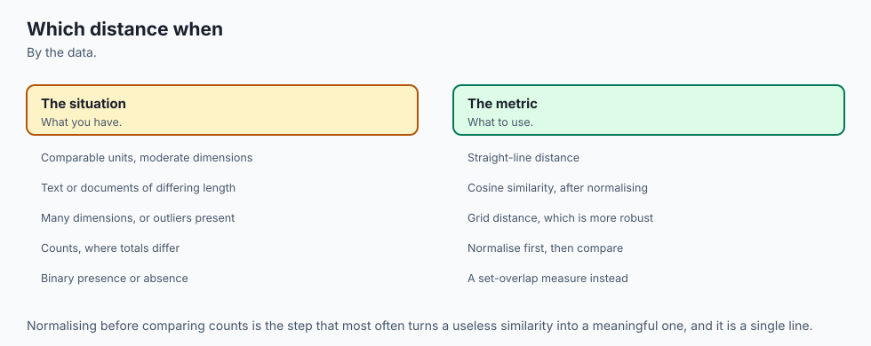

**Reach for vector thinking when:**

- You have several numbers that describe one thing and belong together — a colour, a location, a set of measurements, a row of counts.
- You want to ask "how similar are these two things?" and get a number rather than an opinion.
- You need to rank a collection against a query.
- You are working with anything a model produced as a list of numbers: an embedding, a set of weights, a gradient.
- The same computation has to work in 2 dimensions today and 384 tomorrow.

**Be careful when:**

- **The components are in different units.** `sqrt(pounds^2 + years^2)` is not a quantity. Either rescale the columns to comparable ranges first, or accept that the distance means nothing. This is the failure that produces confident nonsense.
- **The components are not really numbers.** A category encoded as 1, 2, 3 is not a number: it silently claims that category 3 is three times category 1 and twice as far from category 1 as category 2 is. Distances over such a column are meaningless.
- **Length is an artefact of your process rather than a property of the thing.** Longer documents have bigger counts. Normalise, or explain why you did not.
- **The dimension is very high and the collection is small.** In high dimensions everything is roughly equidistant from everything else, so "nearest" may be true but uninformative. Look at the actual distances, not just the ranking — `storm-bulletin`'s nearest neighbour at 10.6771 is telling you something quite different from `roast-chicken`'s at 1.4142.

**Do not reach for it when:**

- **The data is genuinely relational.** "Which members borrowed a book by an author who also wrote X" is a join, not a distance. Days 85 to 91 covered the right tool, and turning that question into a vector problem makes it worse.
- **You need an exact match.** Nearest-neighbour search returns the closest, which is not the same as the correct. If you are looking up an order by its reference number, use an index.
- **You need to explain the answer to a regulator.** "These two vectors are 0.31 apart" is not a reason a decision can be justified with. That is not an argument against using vectors, it is an argument for knowing what you can and cannot claim from one.
- **A simple rule already works.** If a `WHERE` clause answers the question, a distance calculation is not an improvement.

## The AI connection

- **A vector is the data structure of AI** — every embedding, every activation, every weight
  row is one.
- **Distance between vectors is how similarity is computed**, which makes this lesson the
  direct foundation of retrieval and recommendation.
- **Normalising before comparing** is what turns raw counts into a meaningful similarity, and
  it is why cosine similarity dominates in text.
- **The dot product is the single most executed operation in AI**, appearing in every layer
  of every model.
- **High-dimensional intuition breaks down**, which is worth meeting here rather than in a
  vector database.

## Knowledge check

Eight questions accompany this lesson in `quiz.yml`. Two of them are the ones that separate a reader who has understood the day from one who has read it: the question about what normalising changes and what it preserves, and the question about why `assert l2_norm(normalise(v)) == 1.0` is wrong. If either of those is not immediately obvious, reread the normalisation section and then run `examples/normalise.py` in the lab and look at the seven rows it prints.

Before you take it, try answering these from memory:

1. What are the two pictures of a vector, and which one stops working in 384 dimensions?
2. Why is the magnitude of `(3, 4)` equal to 5, and where does that argument come from?
3. Why is there no separate distance formula?
4. What does a positive scalar do to direction? A negative one?
5. Give a pair of vectors where L1 and L2 disagree about which is nearer to the origin.
6. What is the dot product of `(3, 4)` and `(-4, 3)`, and what does the answer tell you?
7. Why can the zero vector not be normalised?
8. What is wrong with `assert norm == 1.0`, and what should it say instead?

## Hands-on exercise

Build the vector library yourself, then prove it agrees with NumPy.

The lab is at `labs/sections/math-statistics-and-data/day-099-vectors-direction-magnitude-and-meaning/`. Read `starter/00_brief.md` first — it has the table of six articles, four answers to check yourself against on paper, and the floating-point trap stated in advance so it is a lesson rather than an ambush.

Install and start:

```bash
cd labs/sections/math-statistics-and-data/day-099-vectors-direction-magnitude-and-meaning
python3 -m venv .venv
.venv/bin/pip install -r requirements/requirements.txt
.venv/bin/python3 starter/vectors.py
```

Then implement the nine numbered exercises in `starter/vectors.py`, in order — `add`, `subtract`, `scale`, `dot`, `l2_norm`, `l1_norm`, `distance`, `normalise`, `nearest`. Each is a few lines. After each one, delete the `@pytest.mark.skip` line above its test in `starter/test_starter.py` and run:

```bash
.venv/bin/pytest starter -q
```

Do not import NumPy in `starter/vectors.py`. The whole point is that you write the loop first; the test harness checks that you did.

### Expected output

Before you write anything:

```
Day 099 starter — Vectors You Can Hold

  1. add          not started
  2. subtract     not started
  3. scale        not started
  4. dot          not started
  5. l2_norm      not started
  6. l1_norm      not started
  7. distance     not started
  8. normalise    not started
  9. nearest      not started

0 of 9 exercises return something.
```

```
1 passed, 11 skipped
```

When you have finished all nine and removed all eleven skip markers:

```
12 passed
```

And the full harness, from the lab directory:

```
87 checks, 0 failure(s).
```

### Validate your work

1. `.venv/bin/python3 starter/vectors.py` reports `9 of 9 exercises return something.`
2. `.venv/bin/pytest starter -q` reports `12 passed`.
3. `.venv/bin/pytest tests -q` reports `79 passed` — the reference suite, which your implementation is not required to satisfy but which you should read.
4. `cd examples && ../.venv/bin/python3 byhand.py` ends with `all exact cases agree: True`.
5. `cd examples && ../.venv/bin/python3 agreement.py` prints `every operation agrees: True`.
6. `cd examples && ../.venv/bin/python3 normalise.py` prints `isclose 1.0 : 7 of 7` and an `exactly 1.0` count *lower* than 7. If yours reads `7 of 7`, the trap did not reproduce on your machine — record that, because it is a real finding about your platform rather than a failure.
7. `bash tests/run_tests.sh; echo $?` ends with `87 checks, 0 failure(s).` and prints `0`. Check the exit status directly rather than through a pipe, because a pipeline reports the last command's status and not the harness's.

### Troubleshooting

**`ModuleNotFoundError: No module named 'numpy'`** — you are running a Python without the lab's dependencies. Create the `.venv` above and run everything through `.venv/bin/python3`.

**`TypeError: object of type 'NoneType' has no len()`** — an earlier exercise still returns `None` and a later one is calling it. `distance` needs `subtract` and `l2_norm`; `nearest` needs `distance`. Work in order, and run `python3 starter/vectors.py` to see which are unfinished.

**A test fails with a bare `assert False`** — that is `close(...)` returning `False`. Print the value: if `l2_norm([3, 4])` gives `25.0` you forgot the square root; if it gives a list you returned the squares instead of their sum.

**`ValueError: dimension mismatch: 2 and 3`** — working as intended. You combined a 2-vector with a 3-vector, which is a meaningless question rather than a slightly wrong answer.

**`ValueError: cannot normalise the zero vector`** — also working as intended.

**Your normalisation assertion fails but the maths looks right** — you almost certainly wrote `== 1.0`. Run `examples/normalise.py` and look at the three rows that come out at `0.9999999999999999`.

The lab's `troubleshooting.md` has the full list, with every error message quoted from a run that actually produced it.

### Common mistakes

- **Forgetting the square root in `l2_norm`.** The most common error in the exercise, and it passes a surprising number of casual eyeball checks because the ranking of distances is unchanged — only the values are wrong. The harness catches it by asserting the exact magnitudes.
- **Returning a list from `dot`.** The dot product sums the componentwise products. If you return the products, you have written a different (also useful) operation.
- **Writing a separate distance formula.** If `distance` does not call `subtract` and `l2_norm`, you have missed the day's central point even if the answer is right.
- **Comparing floats with `==`.** Covered at length. It will pass for `(3, 4)` and fail for `(1, 1)`.
- **Letting `zip` hide a dimension mismatch.** Without the guard, `add([1, 2], [1, 2, 3])` returns `[2, 4]` — a plausible, silent, wrong answer.
- **Normalising the zero vector without noticing.** Either raise, or return `nan`s knowingly. Do not find out by accident three functions downstream.
- **Assuming raw counts are comparable.** The one-line query that ranks `roast-chicken` third exists in the lab precisely so you meet this before it costs you something.

## Practice assignment

Extend the catalogue and defend a design decision with numbers.

1. **Add a seventh article.** Invent it, count its four features by hand, and add it to `CATALOGUE` in your own copy. Before running anything, write down which existing article you predict will be its nearest neighbour, and why. Then run it. If you were wrong, work out which component drove the answer — being wrong here is more instructive than being right.

2. **Implement cosine similarity.** Add `cosine_similarity(u, v)` as `dot(normalise(u), normalise(v))`. Compute it for all fifteen pairs of the original six articles. Then prove the relationship stated in this lesson: for unit vectors, `distance^2 = 2 - 2 * cosine_similarity`. Assert it with `math.isclose` and a stated tolerance, for every pair.

3. **Write the norm decision down.** Compute every pairwise distance under L1 as well as L2. Find a pair of articles that the two norms rank differently relative to some third article — or, if there is no such pair in this catalogue, say so and show the working that establishes it. Then write two sentences recommending one norm for this task and stating what you gave up.

4. **Break your own tolerance.** Set `REL_TOL` to `1e-18` in `starter/test_starter.py` and run the suite. Which tests fail? Are those failures about your code or about floating point? Now set it to `1e-1` and ask which real bugs would slip through. Write down, in one sentence, what a tolerance is actually trading off.

Deliverable: your modified `starter/vectors.py`, a short `findings.md` with your prediction and what actually happened, the cosine table, and the two-sentence norm recommendation. Every number quoted must come from a run you performed.

## Extension challenge

**Build a working semantic search over real text — with no model.**

Take twenty short text files of your own: notes, articles, anything. Then:

1. **Build the vocabulary.** Split each file into lowercase words, drop the fifty most common words across the whole collection (they carry almost no signal), and keep the next 200 as your feature columns. That gives every document a 200-dimensional vector of counts.

2. **Vectorise and normalise.** Turn each document into its 200 counts, then normalise. Report the magnitude of each document before normalising, and note the range — that spread is exactly the document-length artefact this lesson warned about.

3. **Search.** Take a query string, turn it into a vector with the same vocabulary, normalise it, and return the five nearest documents by L2 distance. Print the distances, not just the ranking.

4. **Measure the failure honestly.** Find a query where the result is wrong — you will not have to look hard, because word counting has no idea that "run" and "running" are related, or that "bank" means two things. Write down what a trained embedding would have to know in order to get that query right. This is the clearest possible statement of what an embedding model buys you, and you will have earned it by watching counting fail.

5. **Compare implementations.** Do step 3 twice: once with your pure-Python loop over all twenty documents, once with a single broadcast NumPy expression. Assert that the two agree to a stated tolerance, then time both with `time.perf_counter` and report the ratio you measured on your machine. Then scale up: generate 10,000 random 200-dimensional vectors and time it again. Report both ratios and note whether they are the same.

Two rules. Every number in your write-up must come from a run you performed, and every float comparison must state its tolerance.

## The AI thread

This is the day the second half of this course becomes possible, and it is worth saying plainly rather than gesturing at.

**An embedding is a vector.** When a model turns a sentence into 384 or 1,536 numbers, it is producing the object you spent today measuring. Nothing about the arithmetic changes — the magnitude is still the square root of the sum of the squares, the distance is still the norm of the difference, and you can still compute both with the functions you wrote this morning. What the model provides is not new mathematics, it is *better columns*: instead of four features somebody counted by hand, hundreds of features learned from text, arranged so that nearness corresponds to meaning rather than to shared vocabulary.

**Semantic search is nearest-neighbour search by distance.** Embed the documents, embed the query the same way, return the items whose vectors are closest. That is the whole idea, and you implemented it today over six articles. Everything harder about it in production is one of two things: getting better vectors, or avoiding the need to measure every single row.

**A model's weights are vectors.** The parameters of a neural network are numbers arranged in vectors and matrices, and training consists of changing them a little at a time.

**A gradient is a vector.** When you meet gradient descent, the gradient will be a vector pointing in the direction in which the error increases fastest — and "direction", "magnitude" and "scale by a small number then subtract" will all mean exactly what they meant today. The learning rate is a scalar. The update step is a subtraction. You have already met every operation involved.

And one thing that is not a technical point but is the reason this section of the course exists. A great deal of published work in this area presents distances and similarity scores as though they were measurements of the world. They are not. They are consequences of a chosen representation, a chosen norm, and a chosen preprocessing pipeline — three decisions, each of which you made explicitly today and each of which changes the answer. You saw a query where raw counts ranked the right article third and normalising put it first. You saw two candidates where L1 and L2 disagreed about which was nearer.

Knowing that those are decisions, rather than facts, is most of what separates someone who can use these systems from someone who can only believe them.
