## Why this matters

Here is a bug. It is four characters long, it raises nothing, it logs nothing, and it will cost you a week.

You have a batch of data — four examples, four features each — and you want to centre each example on its own mean before feeding it to a model. Standard preprocessing, taught everywhere, two lines of code.

```python
row_means = S.mean(axis=1)
centred = S - row_means
```

Run it. No exception. No warning. `centred` has exactly the shape you expected, `(4, 4)`. Every number in it is a plausible-looking float. Your model trains. Your loss goes down. Your accuracy is disappointing but not absurd, so you spend the week tuning the learning rate.

Here is what actually happened, from a real run captured in today's lab:

```
  row means, shape (4,): [2.5, 25.0, 250.0, 2500.0]

  S - row_means            (shape (4, 4)) — no error, no warning:
[[-1.500e+00 -2.300e+01 -2.470e+02 -2.496e+03]
 [ 7.500e+00 -5.000e+00 -2.200e+02 -2.460e+03]
 [ 9.750e+01  1.750e+02  5.000e+01 -2.100e+03]
 [ 9.975e+02  1.975e+03  2.750e+03  1.500e+03]]
  S - S.mean(axis=1, keepdims=True) (shape (4, 4)) — what you meant:
[[-1.5e+00 -5.0e-01  5.0e-01  1.5e+00]
 [-1.5e+01 -5.0e+00  5.0e+00  1.5e+01]
 [-1.5e+02 -5.0e+01  5.0e+01  1.5e+02]
 [-1.5e+03 -5.0e+02  5.0e+02  1.5e+03]]
```

Row 0's mean, 2.5, was subtracted from *column* 0. Row 1's mean, 25, was subtracted from *column* 1. You asked for row-centring and got a transposed answer wearing the right shape.

The check that catches it takes one line, and it is the sort of check that separates people who can debug this from people who cannot: **after centring rows, every row must sum to zero.**

```
    right.sum(axis=1) = [0.0, 0.0, 0.0, 0.0]
    wrong.sum(axis=1) = [-2767.5, -2677.5, -1777.5, 7222.5]
```

And the reason it was silent at all: the matrix was square. Four rows, four columns. If it had been four rows and five columns, the same code would have raised `ValueError` in one millisecond and you would have fixed it before lunch. The bug survived because 4 and 4 are the same number and nothing in the arithmetic could tell which one you meant.

That is today's whole subject, and it is not really about NumPy. **A matrix is not one thing.** It is at least three things — a table of data, a collection of vectors, and a transformation — and almost every confusing thing about matrices comes from two pieces of code, or two people, or you-on-Tuesday and you-on-Thursday, disagreeing about which of the three is in play.

The cost lands in four places, and it is worth naming them concretely because the abstraction hides how expensive this is. **Silent wrong answers**: as above, no exception, plausible numbers, a week gone. **Shape errors as your main error class**: from here to the end of this course, the single most common failure you will hit in model code is a shape mismatch, and every one of them is two sides assuming different meanings. **Memory you did not intend to share**: a NumPy slice is a window onto the original data, so a function that "just reshapes" its input can edit your dataset without returning anything. **Speed you leave on the floor**: the difference between a Python loop over rows and one broadcast expression is not ten percent, and on real data it is the difference between an experiment you can run and one you cannot.

This is Day 100 of 365. It is a reasonable place to notice that the last ninety-nine days were the foundation this one stands on — files, types, functions, testing, databases, and yesterday's vectors — and that from here the mathematics starts paying for itself immediately. Now back to the matrix.

## The idea in plain language

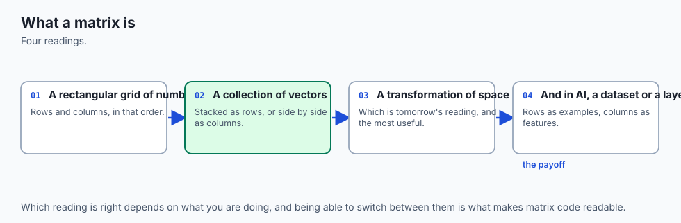

A **matrix** is a rectangular grid of numbers. That is the entire definition and it is almost useless, because it tells you what a matrix *is made of* and nothing about what it *means*.

The useful version is that the same grid answers three different kinds of question, and you have to know which one you are asking.


Take twelve numbers. Three rows, four columns. The data is invented — a garden centre that does not exist, selling three potting mixes made of four ingredients — and it is invented precisely so that every answer today can be checked on paper in under a minute.

|  | base | bark | grit | compost |
| --- | --- | --- | --- | --- |
| **Seedling** | 2 | 4 | 1 | 3 |
| **Container** | 0 | 5 | 2 | 7 |
| **Alpine** | 6 | 1 | 4 | 2 |

**Meaning one: a table of data.** Rows are items, columns are features. Row 1 is the Container mix. Column 2 is grit, measured across every mix. This is the shape a CSV file arrives in (Day 65) and the shape a `SELECT` returns (Day 85), and it is the reading you already have. Notice that rows and columns are *different kinds of thing* here — a row is a mix, a column is a measurement — even though they live in the same rectangle. That asymmetry is the source of almost every axis mistake anyone makes.

**Meaning two: a collection of vectors.** Yesterday you learned that a vector is a list of numbers with a length and a direction. Well: each row of this grid is a vector of length 4, so the grid is three vectors. *Or* each column is a vector of length 3, so the grid is four vectors. Both readings are correct and they are not the same reading. From the lab's captured output, the row lengths and the column lengths are entirely different sets of numbers:

```
  Read as rows, each vector is one mix in ingredient-space:
      Seedling -> [2, 4, 1, 3]   length 5.4772
     Container -> [0, 5, 2, 7]   length 8.8318
        Alpine -> [6, 1, 4, 2]   length 7.5498

  Read as columns, each vector is one ingredient across the range:
          base -> [2, 0, 6]   length 6.3246
          bark -> [4, 5, 1]   length 6.4807
          grit -> [1, 2, 4]   length 4.5826
       compost -> [3, 7, 2]   length 7.8740
```

Seven different numbers from twelve inputs, and nothing in the grid tells you which set you wanted. An operation that assumed the wrong one gives you a plausible wrong answer, not an error.

**Meaning three: a transformation.** Hand the grid a vector and it hands you back a different vector. Give it the four ingredient prices, in pence per litre — base 10, bark 2, grit 5, compost 1 — and it gives you back the cost of one bag of each mix:

```
      Seedling: 2*10 + 4*2 + 1*5 + 3*1 = 36
     Container: 0*10 + 5*2 + 2*5 + 7*1 = 27
        Alpine: 6*10 + 1*2 + 4*5 + 2*1 = 84
```

Four numbers went in. Three came out. A `(3, 4)` matrix eats a vector of length 4 and returns a vector of length 3 — the 4 is **consumed**, because it had to match the number of columns, and the 3 **survives**, because it was the number of rows. That single sentence is the shape rule you will use for the rest of this course, and it is the meaning Day 102 builds everything on.

Here is the compressed version, and it is worth returning to every time something confuses you:

| | Meaning 1: table | Meaning 2: vectors | Meaning 3: transformation |
| --- | --- | --- | --- |
| A row is… | one item | one point in feature-space | one output entry's recipe |
| A column is… | one feature, across all items | one feature as a vector | one input entry's destination |
| The natural question | "what is Alpine's grit content?" | "which two mixes are most alike?" | "what does this price list cost me?" |
| Where you meet it | CSV files, database tables, spreadsheets | embeddings, clustering, similarity | model layers, rotations, projections |
| A shape error here means | you transposed the file | you compared rows against columns | the layer's input size is wrong |

Read that table across, not down. The same rectangle sits under all five rows.

## Historical background

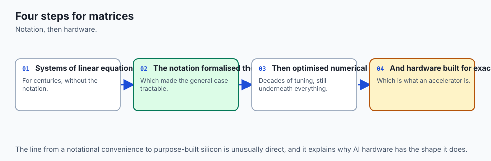

The vocabulary is much older than the computers, and knowing where it came from stops it feeling arbitrary.

Array methods for solving simultaneous equations are ancient. **The Nine Chapters on the Mathematical Art**, a Chinese text dated to between the tenth and second centuries BCE, contains the earliest documented use of array methods for simultaneous equations — coefficients laid out in a grid and reduced by column operations, which is recognisably the procedure you would use today. **Gerolamo Cardano** brought these techniques to Europe in **1545** in *Ars Magna*. **Jan de Witt** used arrays for transformations in *Elements of Curves* in **1659**; **Seki Kowa** employed similar array methods in **1683**; **Gottfried Wilhelm Leibniz** promoted arrays between **1700 and 1710**, experimenting with more than fifty different notational systems for them; and **Gabriel Cramer** gave his rule in **1750**.

Notice how long that list is before anyone names the object. For roughly two thousand years, people used grids of numbers as a *technique* without treating the grid as a thing in its own right.

That changed in the nineteenth century. **James Joseph Sylvester** coined the mathematical term **matrix** in **1850**, understanding it as something that produced various determinants — a womb for determinants, which is what the Latin word means. Eight years later, **Arthur Cayley** published **"A memoir on the theory of matrices" (1858)**, and this is the turn that matters for today: Cayley established abstract matrix operations and proved what is now the Cayley–Hamilton theorem, treating the matrix as an object you could add and multiply rather than as a bookkeeping device for a system of equations. Meaning three — the matrix as a thing that *acts* — starts there.

The square-bracket notation you will see in every paper was first used by **Cuthbert Edmund Cullis** in **1913**. The theory of determinants that runs alongside all this drew contributions from Gauss, Eisenstein, Cauchy, Jacobi, Kronecker and Weierstrass. And by the early twentieth century matrices were central enough to physics that **Heisenberg, Born and Jordan** built matrix mechanics on them.

Two conventions from the computing era complete the picture, and both are arbitrary decisions that stuck.

**Row-major versus column-major.** When a two-dimensional grid is stored in memory, which entries end up next to each other? C, and NumPy after it, lay out a row at a time — the whole of row 0, then row 1. Fortran lays out a column at a time. NumPy calls these C order and F order and lets you ask for either, and the fact that both exist is why `reshape` has an `order` argument that most people never touch. Neither is more correct. They are historical accidents that you now have to know about, because they decide which reshapes are free.

**Counting from zero.** Mathematics numbers rows and columns from 1: the bottom-right entry of our matrix is written *a*₃₄. NumPy numbers from 0: the same entry is `M[2, 3]`. This is the single most common source of off-by-one confusion when you are reading a paper in one window and writing the code in another, and there is no clever resolution — you simply have to hold both conventions and translate consciously. Say it out loud once: **the paper's *a*ᵢⱼ is the code's `M[i-1, j-1]`.**

## What it is — and what it is not

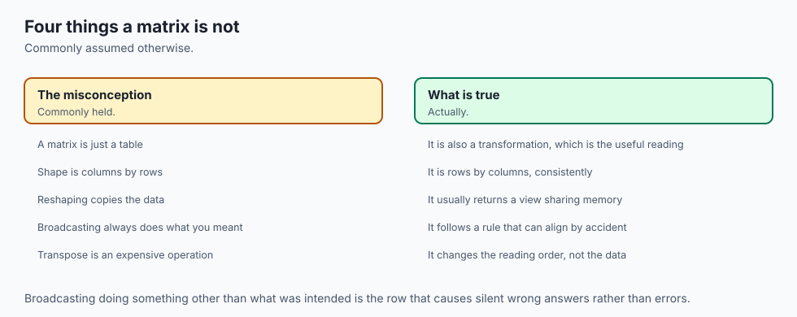

A **matrix** is a rectangular array of numbers arranged in rows and columns.

**Rectangular** does real work in that sentence. Every row has the same number of entries. A list of lists in Python does not have to be rectangular, which is why the from-scratch class in today's lab checks and refuses:

```
ValueError: row 1 has 2 entries but row 0 has 4; a matrix is rectangular,
so every row must be the same length
```

The **shape** of a matrix is the pair `(rows, columns)`. Rows first. That order is a convention, not a law — and it is worth saying out loud once, because half the time you spend confused about a shape is time spent not being sure which number is which. In NumPy, `.shape` returns exactly that tuple, `.ndim` returns how many axes there are (2 for a matrix), and `.size` returns the total entry count:

```
  from scratch : (3, 4)
  numpy        : (3, 4)
  numpy ndim   : 2   (a matrix is a 2-dimensional array)
  numpy size   : 12   (rows x columns, the entry count)
```

Now the things a matrix is **not**.

**A matrix is not a spreadsheet.** A spreadsheet cell can hold a number, a date, a string or a formula. Every entry of a matrix is the same kind of number, which is exactly what makes a whole-array operation meaningful. When you meet a real dataset with a name column and an age column, you have a *table* that is not yet a matrix, and turning it into one is work — encoding, scaling, deciding what to do about missing values. Day 105 onwards deals with that. Today the numbers arrive already numeric.

**A matrix is not a nested list.** A nested list is one way to *store* a matrix, and it is the wrong way for anything larger than a teaching example, because every entry is a separate Python object with its own header and its own pointer. A NumPy array is one contiguous block of numbers plus a small description of how to read it as a grid. That difference is the whole performance story and, as you will see, the whole view-versus-copy story too.

**A matrix is not necessarily square.** Square matrices — same number of rows and columns — get most of the attention in mathematics courses, because that is where determinants, inverses and eigenvalues live. But the matrices you meet in practice are overwhelmingly not square: a batch of 32 embeddings of 768 dimensions each is `(32, 768)`. Today's matrix is deliberately `(3, 4)`, and the reason is the bug in the first section: **when the two dimensions are different numbers, the shape of an answer tells you which operation produced it.** On a square matrix it does not, and mistakes go quiet.

**A matrix is not automatically its own transpose.** The **transpose** of a matrix, written *Mᵀ* and spelled `M.T` in NumPy, is the matrix you get by swapping rows and columns: entry `(i, j)` of the transpose is entry `(j, i)` of the original, and an `(r, c)` matrix becomes `(c, r)`. Our `(3, 4)` becomes `(4, 3)`. Transposing twice returns exactly what you started with. A matrix that happens to equal its own transpose is called **symmetric**, and only a square matrix can be.

Four kinds of matrix are worth recognising on sight, because each of them *does* something and recognising it saves you reading the numbers:

| Name | What it looks like | What it does | Where you meet it |
| --- | --- | --- | --- |
| **Zero** | every entry 0 | adding it changes nothing | initialising an accumulator; the additive identity |
| **Identity** | 1 on the diagonal, 0 elsewhere; square | leaves every vector exactly as it found it | the "do nothing" transformation; the starting point of an inverse |
| **Diagonal** | non-zero only on the diagonal; square | scales each coordinate by its own factor, independently | per-feature scaling; covariance of independent variables |
| **Symmetric** | equal to its own transpose; square | the relationship from *i* to *j* equals the one from *j* to *i* | distance and similarity matrices; covariance matrices; undirected graphs |

From the lab, all four, printed and asserted:

```
  identity(3) — leaves every vector exactly as it found it:
   1    0    0
   0    1    0
   0    0    1
  diagonal([2, 5, 1]) — scales each coordinate by its own factor:
   2    0    0
   0    5    0
   0    0    1
  a symmetric matrix — equal to its own transpose:
   1    7    3
   7    4    0
   3    0    9
  S.is_symmetric() = True   A.is_symmetric() = False
  identity(3) applied to [1.0, 2.0, 3.0] gives [1.0, 2.0, 3.0]
```

`A` there is our `(3, 4)` matrix, and it reports `False` for a reason worth stating: it is not square, so the question does not even arise.

## Why it was created and what problems it solves

Three problems, and they arrived in that order historically.

**Problem one: writing down a system of equations without drowning in it.** This is the two-thousand-year-old motivation. Three unknowns and three equations is nine coefficients plus three constants, and the algebra is a mess of repeated letters. Laying the coefficients out in a grid throws away everything that was noise — the *x*, the *y*, the plus signs, the equals — and keeps only what matters, which is the numbers and their positions. The Nine Chapters did this. Cramer did this. It is data compression by discarding notation.

**Problem two: treating a whole transformation as one object.** Cayley's contribution. Once you can write "the matrix *A*" and mean a single thing that can be added to another matrix, multiplied by another matrix, or applied to a vector, you can reason about *compositions* of transformations without ever writing out an entry. "Rotate, then scale, then project" becomes a product of three matrices. That is what makes linear algebra feel like geometry rather than bookkeeping, and it is what Days 101 and 102 are about.

**Problem three: telling a computer to do a million small operations at once.** This one is modern, and it is why today's lab spends more time on NumPy than on mathematics. The arithmetic of a matrix is embarrassingly regular: the same tiny operation, applied to every entry, with no branching and no dependence between entries. That regularity is exactly what a modern processor is good at, and exactly what a Python `for` loop destroys.

Compare what you write. Multiplying every entry by three, from scratch:

```python
def scale(self, k):
    n_rows, n_cols = self.shape
    return Matrix([[self[i, j] * k for j in range(n_cols)] for i in range(n_rows)])
```

Twelve Python-level multiplications, twelve object allocations, two nested loops interpreted one step at a time. And in NumPy:

```python
M * 3
```

One call into compiled code that walks a contiguous block. On twelve numbers the difference is irrelevant; on a `(50000, 768)` embedding table it is the difference between a script and a coffee break.

**Broadcasting** is the third problem's second half, and it is the reason this day spends so long on it. The NumPy documentation puts it plainly: *"The term broadcasting describes how NumPy treats arrays with different shapes during arithmetic operations. Subject to certain constraints, the smaller array is 'broadcast' across the larger array so that they have compatible shapes."* And the reason it exists at all: *"Broadcasting provides a means of vectorizing array operations so that looping occurs in C instead of Python. It does this without making needless copies of data and usually leads to efficient algorithm implementations."*

The from-scratch class in today's lab does not broadcast. It refuses, loudly:

```
  the from-scratch class refuses: TypeError: add expects another Matrix;
  this class has no broadcasting, so a plain number or a list is not accepted
```

That refusal is honest, and it is also the gap. Everything after exercise 1 in the lab is about what filling that gap costs you — because NumPy fills it, and fills it silently.

## How it works

### Shape, and saying the order out loud

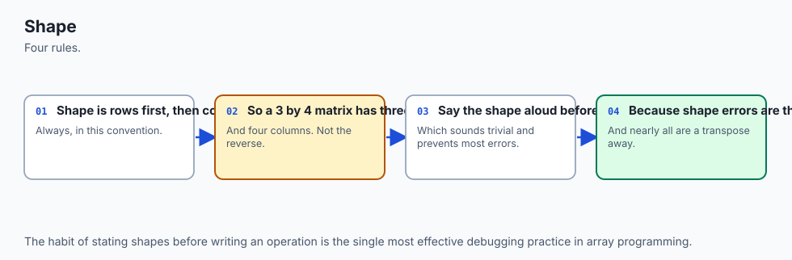

```python
M.shape   # (3, 4) — rows first, always
M.ndim    # 2
M.size    # 12
M.T.shape # (4, 3)
```

Get in the habit of printing `.shape` at every step you are unsure about. It costs one line, it is the only debugging tool that works *before* the numbers are wrong, and it is what experienced practitioners actually do — not because they are careful people but because they have all been bitten.

### Indexing, and the two counting conventions

`M[i, j]` is row `i`, column `j`, both from 0. `M[0, 0]` is the top-left entry, 2. `M[2, 3]` is the bottom-right entry, also 2 in our matrix. A paper writing about the same matrix would call that entry *a*₃₄.

The from-scratch class refuses anything other than a `(row, column)` pair, and refuses out-of-range indices with a message that names the shape:

```
  A[3, 0] raises IndexError: position (3, 0) is outside a matrix of
  shape (3, 4); valid rows are 0..2 and valid columns are 0..3
```

That message design is deliberate. An error that does not tell you the shape makes you go and print the shape yourself, which is the same information three seconds later.

NumPy is more permissive: `M[0]` gives you the whole of row 0, `M[:, 1]` gives you the whole of column 1, `M[0:2, 1:3]` gives you a rectangular block. The colon means "all of this axis". `M[:, 1]` reads as "every row, column 1", and that is worth reading in full every time until it is automatic.

Note the asymmetry in cost. Getting a row is free — the entries are next to each other in memory. Getting a column means stepping over the whole matrix, four bytes here, four bytes there. In the from-scratch class the difference is visible in the source:

```python
def row(self, i):
    return list(self._rows[i])          # one list, copied

def col(self, j):
    return [row[j] for row in self._rows]  # walk every row
```

NumPy hides that difference behind identical syntax, but it has not gone away.

### Rows versus columns, and how to keep them straight

One sentence, and it is worth memorising: **the first index picks the row, and rows are the outer dimension.** `M[2, 3]` is "go to row 2, then within it go to column 3". The shape `(3, 4)` reads the same way — 3 of the outer thing, each holding 4 of the inner thing. And `M.reshape(12)` unpacks in exactly that order:

```
  flat       = [2, 4, 1, 3, 0, 5, 2, 7, 6, 1, 4, 2]
```

The whole of row 0, then row 1, then row 2. If you can predict that list, you understand row-major order, and if you can predict it you can predict every reshape.

### Transpose, and a concrete reason to want it

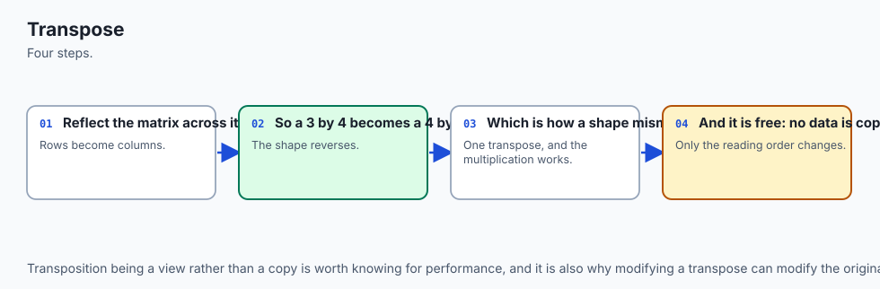

`M.T` swaps the axes. Why would you want to?

Because the meaning you need is not always the meaning your data arrived in. A CSV file gives you rows-are-items. But if you want the norm of each *feature* rather than each *item*, or if a function you are calling expects features-first — and plenty do, especially anything ported from a paper — you need the other reading. Transposing is how you say "read this the other way round" without touching a single number.

It has a second, sharper use. When you suspect the row-versus-column bug from the first section, transposing is the diagnostic: if `f(M.T).T` gives a different answer from `f(M)`, then `f` cares about orientation, and you now know which orientation it assumed.

Transposing twice returns the original exactly. That is not a rounding-error "approximately" — the same entries end up in the same places, which the lab asserts directly.

### Addition and scalar multiplication: pleasantly boring

Adding two matrices adds them entry by entry, and requires identical shapes. Multiplying by a single number multiplies every entry. Neither has a surprise in it. This is the last calm moment in the lesson, so enjoy it.

Adding `A` to `B`, where `B` is `[[1, 0, 0, 1], [2, 2, 2, 2], [0, 3, 0, 3]]`, and then scaling `A` by 3 — both captured from the lab:

```
1d. Addition is elementwise, and demands identical shapes
---------------------------------------------------------
   3    4    1    4
   2    7    4    9
   6    4    4    5
  adding a (2, 2) raises ShapeMismatch: cannot add (3, 4) to (2, 2): addition here is entry by entry, so the shapes must be identical

1e. Scalar multiplication multiplies every entry
------------------------------------------------
   6   12    3    9
   0   15    6   21
  18    3   12    6
```

The from-scratch class raises `ShapeMismatch` on a size clash, and that class deliberately subclasses `ValueError` — because NumPy raises `ValueError` for the same situation, so one `except ValueError` catches both. Small design decision, and the sort that makes two libraries feel like one.

### Broadcasting: where NumPy stops being obvious

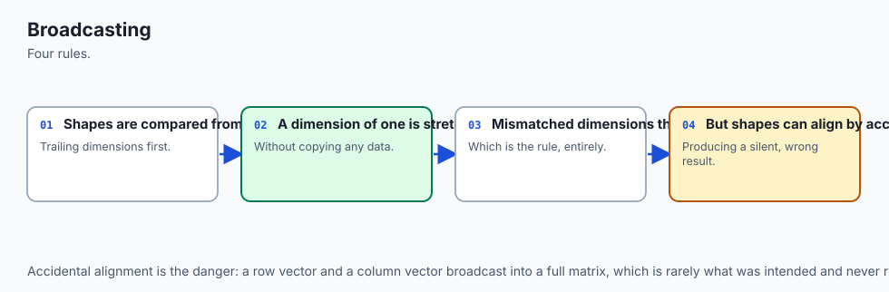

Up to here everything did the boring thing. Broadcasting invents entries that were never written down.


The rule, quoted from the NumPy documentation: *"When operating on two arrays, NumPy compares their shapes element-wise. It starts with the trailing (i.e. rightmost) dimension and works its way left. Two dimensions are compatible when they are equal, or one of them is 1. If these conditions are not met, a `ValueError: operands could not be broadcast together` exception is thrown."*

Written out as a procedure:

1. Line the two shapes up from the **right-hand** end.
2. A missing entry on the left of the shorter shape counts as 1.
3. Two dimensions are compatible when they are **equal**, or **one of them is 1**.
4. If any pair is neither, the operation is a `ValueError`.
5. The result takes the **larger** of each pair.

Apply it to our case:

```
          (3, 4)   padded to (3, 4)
            (4,)   padded to (1, 4)
    -> result (3, 4)
```

The trailing pair is 4 against 4 — equal, fine. The next pair is 3 against 1 — one of them is 1, so the 1 stretches. Result `(3, 4)`, and the price vector is applied to every row:

```
  M * prices shape (3, 4):
[[20  8  5  3]
 [ 0 10 10  7]
 [60  2 20  2]]
```

And the crucial thing the word "stretch" hides: **nothing is copied.** The NumPy documentation is explicit — *"The stretching analogy is only conceptual. NumPy is smart enough to use the original scalar value without actually making copies."* You can see the fiction directly:

```
  And nothing was copied. numpy.broadcast_to shows the fiction directly:
[[10  2  5  1]
 [10  2  5  1]
 [10  2  5  1]]
  shares memory with prices: True
  writeable: False  (it has to be read-only —
  one write would appear in three places at once)
```

Three rows sharing four numbers. NumPy marks the result read-only rather than let one write show up in three places, which is one of the more elegant safety decisions in the library.

Now the failure. Same matrix, a length-3 vector:

```
          (3, 4)   padded to (3, 4)
            (3,)   padded to (1, 3)
    -> INCOMPATIBLE

  M + numpy.array([100, 200, 300]) raises
    ValueError: operands could not be broadcast together with shapes (3,4) (3,)
```

There is nothing special about 3 versus 4 here. The rule works from the right, so it compared 4 against 3 — neither equal nor 1 — and stopped. **The fix is to say which axis you meant**, by giving the vector a shape that makes it explicit:

```
          (3, 4)   padded to (3, 4)
          (3, 1)   padded to (3, 1)
    -> result (3, 4)
```

`per_mix.reshape(3, 1)` has shape `(3, 1)`; now 1 against 4 stretches and 3 against 3 matches, and you get one value added per row.

Two more cases worth knowing before they surprise you.

**The outer-product surprise.** `(3, 1)` combined with `(1, 4)` gives `(3, 4)` — *both* sides stretch, and twelve entries come out of seven numbers. If you expected a length-3 or length-4 answer, the size of the output is your first clue.

**The silent trap**, which is the bug from the top of this lesson. On a square matrix, `S.mean(axis=1)` has shape `(4,)`, which pads to `(1, 4)` and lines up against the *columns* — so the row means get subtracted column-wise, no error is raised, and the shape of the answer is exactly what you expected. The fix is `keepdims=True`, which leaves a 1 in place of the axis you collapsed:

```
  S.mean(axis=1).shape                 = (4,)
  S.mean(axis=1, keepdims=True).shape  = (4, 1)
  S.mean(axis=0, keepdims=True).shape  = (1, 4)
```

A `(4, 1)` cannot line up the wrong way. It says out loud which axis it came from, and broadcasting then does what you meant instead of what the padding rule happened to choose. **Make `keepdims=True` your default for any reduction whose result you are about to broadcast back against the original.** That one habit removes an entire family of bugs.

And when you are unsure, ask before you commit:

```
    broadcast_shapes((3, 4), (4,))    = (3, 4)
    broadcast_shapes((3, 4), (3, 1))  = (3, 4)
    broadcast_shapes((3, 4), (3,))    raises ValueError: shape mismatch:
      objects cannot be broadcast to a single shape.
```

`numpy.broadcast_shapes` answers the question without doing the work.

### Reshaping, flattening, and the word "view"

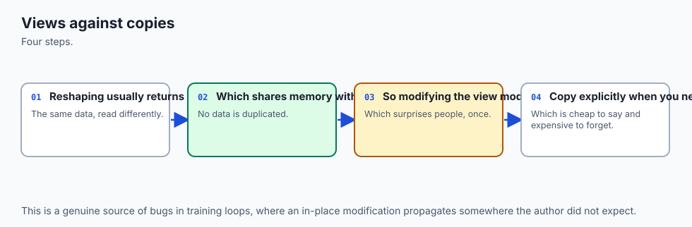

A NumPy array is two things: a flat block of memory, and a description of how to read it as a grid. **Reshaping usually rewrites only the description.** Any shape whose dimensions multiply to the same total is allowed, and `-1` means "work it out":

```
  M.reshape(2, 6) =
[[2 4 1 3 0 5]
 [2 7 6 1 4 2]]
  M.reshape(4, 3) =
[[2 4 1]
 [3 0 5]
 [2 7 6]
 [1 4 2]]
  Any shape whose entries multiply to 12 is allowed, and -1 means
  'work it out': M.reshape(6, -1).shape = (6, 2)
  M.reshape(5, 3) raises ValueError: cannot reshape array of size 12 into shape (5,3)
```

Now the part that matters. When reshape rewrites only the description, the two names are **two windows onto one block of numbers**, and writing through either window changes what the other one sees. Here it is, from the lab:

```
  before: M[0, 0] = 2, flat[0] = 2
  flat[0] = 99
  after : M[0, 0] = 99, flat[0] = 99
  Nothing was assigned to M. M changed anyway.
  flat.base is M           -> True
  numpy.shares_memory(M, flat) -> True
```

`.copy()` breaks the link:

```
  before: M[0, 0] = 2, independent[0] = 2
  independent[0] = 99
  after : M[0, 0] = 2, independent[0] = 99
  numpy.shares_memory(M, independent) -> False
```

One warning, discovered while building this lab rather than imagined for it: **`.base is None` is not the test.** After `M.copy().reshape(12)`, `.base` is *not* `None` — because that expression made two arrays, an anonymous copy and a reshaped view of that copy, and `.base` truthfully points at the copy. The array is still completely independent of `M`. `numpy.shares_memory(a, b)` asks the question you actually care about; `.base` answers a different one.

The same view semantics apply well beyond reshape, and this table is worth committing to memory:

| Operation | View or copy? | Consequence |
| --- | --- | --- |
| `M.reshape(...)` | view, when it can be | writing through it changes `M` |
| `M[:, 2]` — basic slicing with colons | **view** | writing through it changes `M` |
| `M[[0, 2]]` — a list of indices | copy | `M` is untouched |
| `M[M > 3]` — a boolean mask | copy | `M` is untouched |
| `M.T` | view | transposing moves no numbers at all |
| `M.ravel()` | view when it can be | shares memory |
| `M.flatten()` | **always** a copy | never shares memory |
| `M.copy()` | copy | never shares memory |

Two things in that table catch people. First, **a slice is a view**, which is the exact opposite of a Python list slice — `py_list[0][:]` gives you a new list, `M[:, 2]` gives you a window, and the syntax is identical. Second, `ravel` and `flatten` do the same thing and have opposite ownership; the names do not tell you that, so it is a fact to memorise rather than derive.

And the reason transpose is a view is worth pausing on: transposing a large matrix **moves no numbers**. It swaps two entries in the description of how to walk the memory. That is why it is free, and why it is a view.

### `axis=0` versus `axis=1`, settled

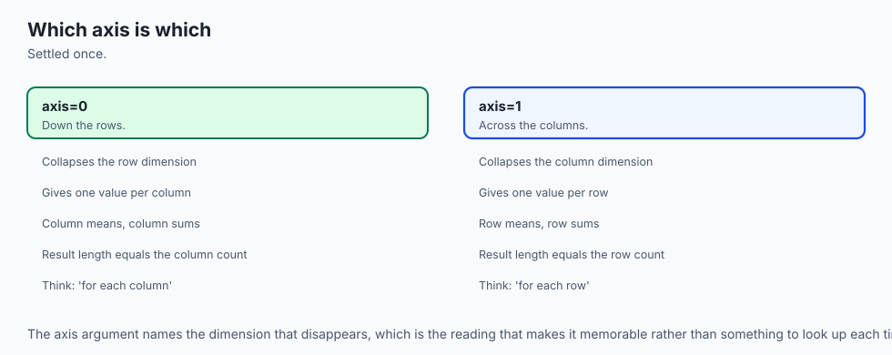

Everybody gets this wrong at least once, and the reason is that both readings sound right in English. "Sum along the rows" can mean *sum each row*, or *sum in the direction the rows are stacked*. English will not save you. One rule will:

> **The axis you name is the axis that disappears.**

A `(3, 4)` array summed with `axis=0` loses the 3 and returns shape `(4,)`. The same array summed with `axis=1` loses the 4 and returns shape `(3,)`. Because 3 and 4 are different, the shape of the answer tells you which one you got, every time, without thinking.

| Argument | Collapses | The answer is one number per… | Answer shape | On our matrix |
| --- | --- | --- | --- | --- |
| `axis=0` | the rows | **column** | `(columns,)` | `[8, 10, 7, 12]` — litres of each ingredient |
| `axis=1` | the columns | **row** | `(rows,)` | `[10, 14, 13]` — litres in each bag |
| no axis | everything | the whole array | `()` — a scalar | `37` |
| `axis=0, keepdims=True` | the rows, but keeps the slot | column | `(1, columns)` | shape `(1, 4)` |
| `axis=1, keepdims=True` | the columns, but keeps the slot | row | `(rows, 1)` | shape `(3, 1)` |

Check it by hand. Column 0 is 2, 0, 6, which sums to 8; row 0 is 2, 4, 1, 3, which sums to 10. Both totals sum to 37, because both are the same twelve numbers added in a different order.

The rule holds for every reduction, not just `sum`: `mean`, `min`, `max`, `std`, `argmax`, `all`, `any`. And it generalises without amendment to more axes — a `(2, 3, 4)` array has `axis=2` as well, and naming it removes the 4.

One reduction deserves a separate warning. `argmax` returns **positions, not values**:

```
  numpy.argmax(M, axis=1) = [1, 3, 0]
  Read it as: within row 0 the largest entry is at column 1; within
  row 1 at column 3; within row 2 at column 0.
```

If those numbers look like data to you, you have found a bug.

## An everyday analogy

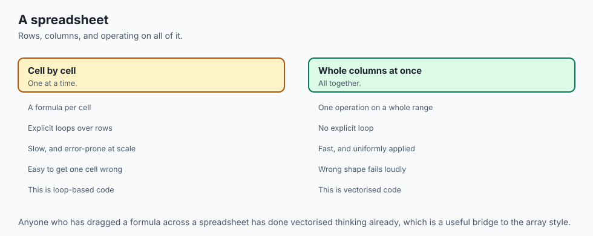

Think of an orchestral score.

A score is a rectangle of marks. Down the left-hand edge, one line per instrument. Across the page, one column per beat. Twelve marks in a 3-by-4 patch of it, exactly like our matrix.

**The librarian reads it as a table.** She wants to know what the second violin plays in bar 40. She goes to a row, then to a column, and reads one entry. She never thinks about the score as a whole; she thinks about cells. That is meaning one, and `M[1, 39]` is exactly the operation she performs.

**The player reads it as a collection of vectors, one way.** The clarinettist reads *across* one row and ignores everything else. His entire experience of the piece is a single vector — a sequence of values through time — and he can tell you whether his part is similar to the bassoon's without ever having heard the piece, by comparing two rows.

**The conductor reads it as a collection of vectors, the other way.** She reads *down* one column, because a column is what is sounding at one instant: the chord. Same page, same marks, orthogonal reading, and neither of them is more correct. The clarinettist's question ("is my line like the bassoon's?") and the conductor's question ("is this chord like that one?") are both answered by the same rectangle, and answered by different vectors of different lengths. That is precisely the situation with our row norms and column norms being seven different numbers.

**And the whole score is a transformation.** Feed an orchestra into it and a performance comes out. What went in was a set of players; what came out was a piece of music. The score did not *contain* the performance — it described how to turn one thing into another. That is meaning three, and it is why "a matrix is a machine, not a bag of numbers" is a sentence worth carrying.

The analogy stretches further than you would expect. **Broadcasting** is the conductor saying "everyone, forte" — one instruction, applied to every row, with nothing written into every part. **A view** is a photocopy that is not a photocopy: two music stands showing the same physical page, so a pencil mark made at one stand appears at the other. **`axis=0` versus `axis=1`** is "sum down the column" (what is the total volume at this beat?) against "sum across the row" (how many notes does the flute play in total?) — and the answers have different lengths, one per beat and one per instrument, which is exactly how you tell them apart.

Where the analogy breaks, and it is worth naming so it does not mislead you: **"transpose" means something else in music.** A musician transposes by shifting a part into a different key, which is nothing like swapping rows for columns. And a score's rows are genuinely not interchangeable — you cannot hand the trumpet part to the cello — whereas nothing in a matrix knows or cares which row is which. The matrix has no opinion about its own meaning. That is the whole problem, and it is why you have to keep track.

## Examples in practice

**A dataset is a matrix.** This is the one you have already met. A CSV file with 10,000 customers and 12 columns is a `(10000, 12)` matrix once the non-numeric columns are dealt with. Rows are items, columns are features. Everything you learned about `axis` applies immediately: `axis=0` gives you a per-feature statistic (the mean age, the maximum spend), `axis=1` gives you a per-customer one. Getting those two backwards produces a number of the wrong length, which is why the habit of checking the length of an answer catches so much.

**A batch of embeddings is a matrix.** Yesterday you built a small embedding by hand. In practice you do not embed one thing at a time; you embed a batch. Thirty-two sentences, each turned into 768 numbers, is a `(32, 768)` matrix. Here the rows-versus-columns distinction is stark: a row is a *sentence*, a column is one *dimension* of the embedding space, and a column on its own means almost nothing. Comparing two rows is meaningful. Comparing two columns is usually a mistake. Nothing in the array marks the difference.

**A layer's weights are a matrix.** A neural network layer that takes 768 numbers in and produces 256 out holds a `(256, 768)` matrix of weights. Read it as a transformation and its shape tells you everything: it eats a vector of length 768 and returns one of length 256. Read it as a collection of vectors and each of its 256 rows is a *detector* — a pattern that row is looking for in the input. Both readings are used constantly, sometimes in the same paragraph of the same paper.

**An attention score table is a matrix.** In a transformer, every token gets a score against every other token, which is a square matrix of shape `(sequence_length, sequence_length)`. This one is square, and the earlier warning applies with force: entry `(i, j)` — how much token *i* attends to token *j* — is generally **not** equal to entry `(j, i)`, so the matrix is not symmetric, and getting the two indices the wrong way round produces a plausible-looking result with the meaning reversed. When you see a diagram of attention weights with a triangular pattern, you are looking at a mask enforcing that a token cannot attend to tokens after it, which is a statement about the *shape* of that square.

**An image is a matrix.** A greyscale image is exactly a matrix — rows and columns of pixels, one number each. A colour image is three of them stacked, which is a `(height, width, 3)` array and the natural bridge to arrays with more than two axes. Week 15's project rotates and shears images with matrix operations, and every rotation is meaning three doing its job.

**Every shape error in a model is one of these disagreeing.** That is the sentence to take away. `shapes (32, 768) and (768, 32) not aligned`. `expected input of size 512, got 768`. `operands could not be broadcast together`. Each of those is two pieces of code that assumed different meanings for the same rectangle — one thought rows were items and the other thought rows were features, or one produced a transformation and the other consumed a table. Reading the error as "which meaning did each side assume?" turns it from a wall into a question with an answer.

## Implications: security, privacy, performance, scalability, and cost

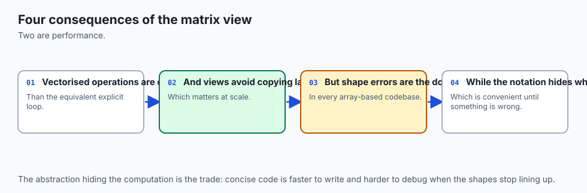

**Performance.** The gap between a Python loop and a NumPy operation is not a matter of a few percent. A loop over a `(50000, 768)` array does thirty-eight million interpreted steps, each allocating and unwrapping Python objects; the array operation walks one contiguous block in compiled code. The rule of thumb: **if you are writing a `for` loop over the entries of an array, stop and look for the whole-array expression.** Today's lab keeps everything small enough that timing is meaningless, and deliberately asserts nothing about speed — a test that asserts milliseconds is flaky on somebody else's machine — but the shape of the argument is not in doubt.

**Memory, and the thing that surprises people.** A view costs nothing and shares everything. A copy costs the memory and shares nothing. Neither is the right answer, and knowing which one you have is. On a `(50000, 768)` float64 array — about 300 MB — an accidental `.copy()` inside a loop is how you turn a working script into an out-of-memory error, and an accidental *view* is how you turn a working script into one that silently modifies its own input. Both are the same fact seen from two sides.

**Security, and it is a real one.** A function that receives a NumPy array can modify the caller's data without returning anything. A slice, a reshape or a transpose handed across a function boundary carries write access with it. This is not a vulnerability in NumPy — it is documented, and it is why NumPy is fast — but it means **"I only passed it a view" is not the same as "I only let it read"**. If you need the guarantee, pass `arr.copy()`, or mark the view read-only first:

```python
view = arr[:, 2]
view.flags.writeable = False
```

Writing into that view then raises `ValueError: assignment destination is read-only` rather than quietly changing `arr`. That behaviour was checked on the authoring machine, not assumed.

**Privacy.** A matrix is exactly the shape personal data arrives in: rows are people, columns are facts about them. Two consequences follow. Transposing such a matrix does not anonymise anything — the same facts are still there, differently arranged — and neither does dropping the row labels, because a row of feature values is frequently identifying on its own. Everything in today's lab is invented for exactly this reason: a teaching example should never need a privacy conversation.

**Scalability.** Two dimensions is a floor, not a ceiling. A batch of colour images is four-dimensional: `(batch, height, width, channels)`. Everything today generalises without amendment — `.shape` gets longer, `axis` can be 2 or 3, and the broadcasting rule still works from the right. The rule *"the axis you name is the axis that disappears"* needs no change at all when you go to three or four axes, which is a good sign that it is the right rule to have memorised.

**Cost.** NumPy is free, open source under the BSD 3-Clause licence, and runs on any machine you already own. There is no paid tier, no account, no key. The cost of matrices in practice is not licensing; it is memory and time, and both are decided by shapes you chose. A `(1000000, 1000)` float64 array is 8 GB whether or not you meant it to be, and the moment you can predict that number from the shape you have acquired a genuinely useful skill.

## Alternatives: free, open source, and commercial

Six ways to hold a rectangle of numbers in Python. Two of them were actually run for this lesson; the other four are described from their own documentation, and **no output is reproduced for them**, because none of them is installed here.

| Option | Choose it when | Cost | Run here? |
| --- | --- | --- | --- |
| **Nested Python lists** | Teaching, tiny data, or no dependencies allowed | Free, standard library | **Yes** |
| **NumPy** | Almost always, for numeric arrays on one machine | Free, BSD 3-Clause | **Yes — 2.5.2** |
| **PyTorch tensors** | You need automatic differentiation or a GPU | Free, open source | No |
| **JAX arrays** | You want NumPy's interface plus compilation and autodiff | Free, open source | No |
| **pandas DataFrames** | Columns have names and different types | Free, open source | No |
| **SciPy sparse matrices** | Most entries are zero and the dense version will not fit | Free, open source | No |

**Nested Python lists.** *When to choose:* when you are learning what an operation actually does, when the data is a handful of numbers, or when you cannot add a dependency. *How to use:* a list of lists, with your own accessor functions — exactly what today's lab builds. *Example:* `M = [[2, 4, 1, 3], [0, 5, 2, 7], [6, 1, 4, 2]]; M[2][0]` gives 6. *Free vs paid:* it is the standard library; there is nothing to pay. *What you give up:* broadcasting, whole-array operations, contiguous memory, and any hope of speed. Ran here, and the whole from-scratch half of the lab is this.

**NumPy.** *When to choose:* by default, for any numeric array work that fits on one machine. It is the library every other option on this list either wraps, imitates or converts to. *How to use:* `import numpy as np`, then `np.array(...)` and the whole-array operations in this lesson. *Example:* `(M * prices).sum(axis=1)` returns `[36, 27, 84]` — the entire transformation in one expression. *Free vs paid:* free and open source under the BSD 3-Clause licence; no account, no key, no paid tier, personally or commercially. Ran here, version 2.5.2, and everything quoted in this lesson came out of it.

**PyTorch tensors.** *When to choose:* when you need gradients computed automatically, or when the array has to live on a GPU. A PyTorch tensor is deliberately close to a NumPy array — same shape idea, same indexing, the same broadcasting rules — with two additions: it can record the operations performed on it so that derivatives can be computed backwards through them, and it can sit in GPU memory. *How to use:* `import torch; t = torch.tensor([[2., 4.], [1., 3.]])`, and from there `t.shape`, `t.T`, `t.sum(dim=0)` — note `dim` where NumPy says `axis`, which is a small vocabulary tax you pay forever. *Example:* setting `requires_grad=True` on a tensor makes every subsequent operation part of a graph that `.backward()` can differentiate. *Free vs paid:* free and open source. **Not installed here; nothing above was executed, and it is described from the project's documentation.**

**JAX arrays.** *When to choose:* when you want something that looks almost exactly like NumPy but can be compiled and automatically differentiated, particularly for research code that has to run fast on accelerators. *How to use:* `import jax.numpy as jnp` and then, largely, write NumPy. *Example:* the same expression `(M * prices).sum(axis=1)` is written identically. The one difference that bites immediately: JAX arrays are **immutable** — `x[0] = 5` does not work, and you write `x.at[0].set(5)` instead, which returns a new array. That single design decision removes the entire view-versus-copy hazard from this lesson, at the cost of a different way of thinking. *Free vs paid:* free and open source. **Not installed here; no output reproduced.**

**pandas DataFrames.** *When to choose:* when the columns have *names* and possibly different types — a date column, a name column, three numeric columns. A DataFrame is meaning one from this lesson, made explicit and given labels. *How to use:* `import pandas as pd; df = pd.DataFrame(M, index=['Seedling', 'Container', 'Alpine'], columns=['base', 'bark', 'grit', 'compost'])`, after which `df['grit']` selects by name rather than by position. *Example:* `df.sum(axis=1)` gives the same per-row totals as NumPy, with the mix names attached — which is precisely the readability that stops you forgetting which axis you wanted. `df.to_numpy()` drops back down to a plain array when you need the speed. *Free vs paid:* free and open source. **Not installed here; described from its documentation.**

**SciPy sparse matrices.** *When to choose:* when most entries are zero, and this is not a niche case — it is the normal case for text data, recommendation systems and graphs. Consider a document-term matrix over 100,000 documents and a 50,000-word vocabulary. Dense, that is 5 billion entries: 40 GB in float64, which does not fit on your machine. But almost every entry is zero, because almost every document contains almost none of the vocabulary. A **sparse matrix** stores only the non-zero entries plus their coordinates, and for a matrix that is 99.9% zeros that is a thousandfold saving. *How to use:* `from scipy.sparse import csr_matrix`, then `csr_matrix(dense)` or build directly from coordinates; the same `.shape`, and arithmetic that mostly mirrors NumPy's. *Example:* an adjacency matrix of a social graph — a million users, each with a few hundred connections — is unusable dense and unremarkable sparse. *The honest caveat:* sparse is not free. Some operations are much slower, some are unsupported, and when only a modest fraction of the entries are zero the bookkeeping can cost more than it saves — where the crossover sits depends on the storage format and the operation, and is measured rather than guessed. **Not installed here; no output reproduced.** But when a sparse representation is the only workable one, it is genuinely the only workable one, and knowing the word is what lets you go and look it up.

Two further resources, both free, both worth your time and neither of them installed software. **3Blue1Brown's "Essence of Linear Algebra"** is a video series that builds the entire subject around meaning three — the matrix as a transformation of space — and if today's third meaning felt abstract, that series is the fastest route to it feeling obvious. **MIT OpenCourseWare 18.06**, Gilbert Strang's linear algebra course, is the full university treatment with lectures and problem sets, free to anyone. This course will not cover 18.06's depth; if you want it, it is there.

## Comparison with related concepts

**A matrix and a vector.** Yesterday's object and today's. A vector is one-dimensional: `.shape` is `(n,)`, with one number in the tuple. A matrix is two-dimensional: `.shape` is `(r, c)`. And here is the distinction that catches everyone: **a `(3,)` array is not the same as a `(3, 1)` array or a `(1, 3)` array.** They contain the same three numbers and they broadcast completely differently, which is exactly the bug at the top of this lesson. NumPy tells them apart and English does not.

**A matrix and a list of lists.** Same information, different storage, and the difference is not academic. Nested lists are scattered Python objects; an array is one block plus a description. That is why an array can have views and a nested list cannot, why an array broadcasts and a nested list cannot, and why an array is fast.

**A matrix and a tensor.** Loosely, in machine-learning code, "tensor" means "an array with any number of dimensions" — a scalar is a 0-dimensional tensor, a vector is 1-dimensional, a matrix is 2-dimensional, and a batch of colour images is 4-dimensional. This is the usage you will meet in PyTorch and everywhere downstream of it. In mathematics and physics the word means something stricter, involving how the object transforms under a change of coordinates, and a matrix is not automatically a tensor in that sense. Both usages are correct in their own fields. Know which room you are in.

**A matrix and a table.** A database table has named, typed columns and unordered rows; a matrix has positional, uniformly-typed entries and rows whose order is part of the data. Converting a table to a matrix means fixing a column order and encoding everything as numbers, and that conversion is where a surprising number of bugs are born — because after it, nothing in the array remembers what column 3 was.

**Elementwise multiplication and matrix multiplication.** `M * N` in NumPy multiplies entry by entry and requires the shapes to broadcast. That is *not* matrix multiplication, which is written `M @ N`, has a completely different shape rule, and is Day 101's entire subject. The two are easy to confuse because the notation is one character apart, and confusing them is a rite of passage. Today's transformation was computed as `(M * prices).sum(axis=1)` — broadcast, then reduce — precisely so that you can see the machinery before you see the packed operator that hides it.

**Views and copies, against Python's own semantics.** You have seen this distinction before under a different name. A Python list is mutable and passing it to a function passes a reference; a tuple is immutable and cannot surprise you. NumPy's views are the same idea with a sharper edge, because two arrays with different shapes and different names can be the same memory, and nothing in either name says so.

## When to use it — and when not to

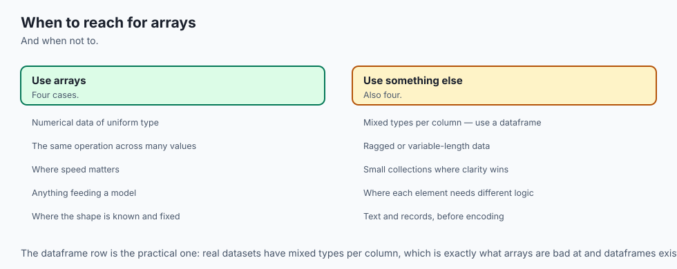

**Reach for a matrix when** your data is a rectangle of numbers of one type; when you want to apply the same operation to many things at once; when you need per-row or per-column statistics; when you are describing a transformation from one set of numbers to another; or when a library you are calling wants one, which in practice is most of the time.

**Do not reach for a matrix when** your columns have genuinely different types — use a DataFrame, or clean the data first. When most entries are zero and the dense form will not fit — use a sparse representation. When the data is not rectangular at all: sentences of different lengths are not a matrix until you have padded them to a common length, and *how* you pad is a real decision with real consequences, not a formality. When you have three numbers and a clear head: a plain tuple is fine, and importing NumPy to add two pairs is not a virtue.

**And be suspicious when the matrix is square.** Not wrong — square matrices are essential, and attention scores, covariance matrices and rotations are all square. Just suspicious. A square matrix cannot tell you from the shape of an answer whether you used the axis you meant, and every silent orientation bug in this lesson needed squareness to survive. When you are working with one, add the check that the shape cannot do for you: after row-centring, do the rows sum to zero? After row-normalising, do the rows sum to one? One assertion, and the class of bug is gone.

### Where this goes next in AI work

Everything you will build from here is matrices with different names on them.

A **dataset** is a matrix: rows are examples, columns are features. A **batch of embeddings** is a matrix: rows are items, columns are dimensions of a learned space. A **layer's weights** are a matrix: read as a transformation, its shape is a contract about what goes in and what comes out; read as vectors, each row is a pattern the layer is looking for. An **attention score table** is a matrix: square, not symmetric, and indexed by *(from, to)* in an order you have to check rather than assume.

And here is the thread that ties the whole day together. **Every shape error you will ever hit in a model is a disagreement about which of the three meanings each side assumed.** One side produced a table with items in rows; the other consumed a transformation expecting features first. One side reduced along the wrong axis and produced a vector of the right length by coincidence. One side handed over a view and the other wrote into it. The traceback will point at a line of arithmetic, and the arithmetic will be fine — the bug is always one level up, in what the rectangle was supposed to mean.

Which is why the discipline this lesson is really teaching is not a NumPy method. It is a habit: **say the shape out loud, say which meaning you are using, and check that both sides agree.** Print `.shape`. Use `keepdims=True`. Ask `numpy.shares_memory` instead of guessing. Assert that row sums are zero when you centred rows. None of that is mathematics. All of it is what separates code that works from code that appears to.

## The AI connection

- **Every AI model is a stack of matrices**, so reading shapes fluently is the difference
  between debugging in minutes and hours.
- **Shape errors are the most common failure in model code**, and they are almost always a
  transpose or an axis away from correct.
- **Broadcasting is what makes vectorised code concise**, and it is also where silent bugs
  enter when shapes align by accident.
- **A view is not a copy**, which is a distinction that causes real bugs in training loops.
- **Saying the shape out loud** before writing an operation is the habit that prevents most
  of these.

## Knowledge check

Eight questions in `quiz.yml` cover the material above: the three meanings and which one an operation assumed; shape order and the from-zero versus from-one conventions; the broadcasting rule applied to shapes that succeed and shapes that fail; the silent square-matrix trap and the check that catches it; view versus copy for reshape, slicing and fancy indexing; the exact exception NumPy raises when broadcasting fails; and — the one everybody has to settle once — which of `axis=0` and `axis=1` produces one number per column.

Answer them before you look. The point of a prediction is that it can be wrong while it still costs you nothing.

## Hands-on exercise

Work through the lab: **The Same Numbers, Three Ways**.

It has five exercises, and its spine is prediction before verification. You will:

1. **Build the matrix yourself.** Six methods in `starter/matrix.py` — shape, indexing, transpose, addition, scalar multiplication and the identity matrix — on nothing but nested lists, then asserted against NumPy. When they agree, you know what NumPy is doing. When they disagree, you have found out which of you was wrong while the example is still small enough to see.
2. **Read one small invented dataset three ways.** As a table, as row and column vectors with their lengths, and as a transformation applied to a price vector — asserting the result each time against numbers you worked out on paper.
3. **Prove a reshape is a view.** Mutate the reshaped array and assert that the original changed. Then prove `.copy()` breaks that link. Then discover that `.base is None` is not the test, and that `numpy.shares_memory` is.
4. **Make broadcasting succeed and fail on purpose.** Predict each outcome from the rule first; assert the exact exception type for the failure; and reproduce the silent square-matrix trap, where nothing is raised at all.
5. **Settle `axis=0` against `axis=1`** by computing both on a matrix small enough to check by hand, and asserting which is which.

Every prediction you have not made is *skipped* rather than failed, so the test output is a running score rather than a wall of red. Float comparisons use `numpy.allclose` with a stated tolerance of `1e-12`, because a float comparison without a declared tolerance is a guess.

### Expected output

On an untouched checkout:

```
1 passed, 32 skipped
```

When you have finished all five exercises:

```
33 passed
```

The full harness, run from the lab directory, ends with:

```
41 checks, 0 failure(s).
```

and exits 0. Three specific lines are worth recognising when you meet them. The transformation:

```
      Seedling: 2*10 + 4*2 + 1*5 + 3*1 = 36
     Container: 0*10 + 5*2 + 2*5 + 7*1 = 27
        Alpine: 6*10 + 1*2 + 4*5 + 2*1 = 84
```

The view proof:

```
  before: M[0, 0] = 2, flat[0] = 2
  flat[0] = 99
  after : M[0, 0] = 99, flat[0] = 99
  Nothing was assigned to M. M changed anyway.
```

And the broadcasting failure, whose exact type the tests assert rather than merely catching "something":

```
  M + numpy.array([100, 200, 300]) raises
    ValueError: operands could not be broadcast together with shapes (3,4) (3,)
```

Every one of those was captured from a real run on the authoring machine and lives in the lab's `expected-output/` directory. `expected-output/FIELDS.md` records exactly which parts may legitimately differ on your machine — timings, the platform line, and your own progress score — and which parts may not.

### Validate your work

1. `bash tests/run_tests.sh; echo "exit=$?"` prints `41 checks, 0 failure(s).` and `exit=0`.
2. `.venv/bin/pytest examples -q -p no:cacheprovider` prints `41 passed`.
3. `.venv/bin/pytest starter -q -p no:cacheprovider` prints `33 passed` once you have finished every exercise.
4. Each of the five reference scripts in `examples/` ends with `every assertion held.`
5. `find . -type d -name '__pycache__' -o -type d -name '.pytest_cache'` prints nothing after a full run.

Section 6 of the harness is worth reading before you trust the other forty checks: it re-runs the whole script with one expectation deliberately swapped for the wrong axis answer, and asserts that the re-run exits non-zero and reports exactly one failure. A green test suite proves nothing until you have watched it go red.

### Troubleshooting

`ModuleNotFoundError: No module named 'numpy'` means you ran the wrong interpreter. Use `.venv/bin/python3` explicitly, as every command in the lab README writes it.

`ModuleNotFoundError: No module named 'matrix'` means you ran a script in `examples/` from the wrong directory. Those scripts import from beside themselves, so `cd examples` first.

`ValueError: cannot reshape array of size 12 into shape (5,3)` is arithmetic: reshaping never invents or discards entries, so the new dimensions must multiply to the same total. Use `-1` for one of them and let NumPy work it out.

`ValueError: assignment destination is read-only` means you tried to write into the result of `numpy.broadcast_to`. That array is a fiction — several rows pointing at the same bytes — so one write would appear in several places. Call `.copy()` if you genuinely want a real array of that shape.

If your starter tests all show `s`, that is correct on a fresh checkout: `s` means skipped, which here means "not attempted yet". A test reporting `answers.X is still unanswered` means you left that constant as `None`, and the suite skips on `None` specifically so that an unanswered question looks different from a wrong one.

The lab's `troubleshooting.md` covers all of the above plus the module-name collision between `examples/` and `starter/` — which was found while building the lab, not imagined for the document, and is the reason each directory carries a small `conftest.py`.

### Common mistakes

**Assuming `axis=1` means "along the rows".** It means "collapse axis 1", which is the columns, giving one number per row. Say the rule instead of the English: the axis you name is the axis that disappears.

**Testing independence with `.base is None`.** It is the wrong question, and it gives the wrong answer after `M.copy().reshape(...)`. Ask `numpy.shares_memory(a, b)`.

**Forgetting `keepdims=True` before broadcasting a reduction back.** This is the bug that opened the lesson. If you are about to combine a reduction with the array it came from, keep the dimension.

**Believing a slice copies, because a Python list slice does.** `M[:, 2]` is a window onto `M`. `py_list[0][:]` is a new list. Identical syntax, opposite behaviour.

**Testing on a square matrix.** Three of the four mistakes above are silent on a square matrix and loud on a rectangular one. Develop against a `(3, 4)`; the shape of every answer then tells you which operation produced it.

**Catching a bare `Exception` around a broadcast.** The lab asserts `ValueError` specifically, and so should you. "It raised something" is not a test — it passes when your code raises `NameError` because you misspelled a variable.

## Practice assignment

Build a **shape audit** for a small pipeline, and use it to catch a bug you plant on purpose.

1. Write a function `describe(name, arr)` that prints the name, `arr.shape`, `arr.ndim`, `arr.dtype`, and whether it shares memory with a reference array you pass in. Four lines of real information, one call.
2. Write a three-step pipeline over an invented `(6, 4)` dataset: centre each row on its own mean, scale each *column* to unit maximum, then return the per-row totals. Call `describe` between every step.
3. Now plant the bug. Change the row-centring to omit `keepdims=True`. On a `(6, 4)` matrix this raises immediately — good. Change the dataset to `(4, 4)` and run it again: it now succeeds and is wrong. Write an assertion that catches it anyway, and state in a comment what property of correctly row-centred data your assertion relies on.
4. Add one more assertion that would have caught the column-scaling step being applied to rows by mistake. It should be a property of the *result*, not a check of the code.
5. Write two sentences saying which of the three meanings each step of your pipeline assumed, and where in the pipeline the meaning changes.

The deliverable is the script and those two sentences. Step 5 is the part that matters; the code is how you earn the right to write it.

## Extension challenge

**Rebuild broadcasting yourself.** In the from-scratch `Matrix` class — no NumPy — implement `broadcast_add(self, other)` that accepts either another `Matrix`, or a plain list, and applies the five-line rule properly:

- a list of length `n_cols` is added to every row;
- a `Matrix` of shape `(n_rows, 1)` is added down every column;
- a `Matrix` of shape `(1, n_cols)` behaves like the list;
- a single number is added to everything;
- anything else raises `ShapeMismatch` with a message naming both shapes and saying which pair of dimensions failed.

Then write the tests: every success case asserted against NumPy's answer, and every failure case asserting that both your class and NumPy raise `ValueError`.

Three things you will learn from doing this that you cannot learn from reading about it. First, how much code the rule actually is once every case is handled — and therefore how much NumPy is doing for you in one operator. Second, that the hard part is not the stretching, it is deciding *which* axis stretches, which is exactly the decision that goes wrong silently on square inputs. And third, once you have written the branch that handles `(n, 1)` differently from `(1, n)`, you will never again mistake a `(3,)` array for a `(3, 1)` one.

If you want the geometric intuition that meaning three is pointing at, watch 3Blue1Brown's "Essence of Linear Algebra" before Day 102. It approaches the same object from the opposite end — space being stretched and rotated, rather than numbers in a grid — and having both pictures at once is worth considerably more than having either.
