## Why this matters

Here are two matrices. They are as small as matrices get and still be interesting.

```python
P = [[1, 2],
     [3, 4]]

Q = [[5, 6],
     [7, 8]]
```

Now here are three things you can do to them in NumPy. All three are legal. All three return a 2 by 2 array of integers. None of them raises, warns, or logs anything at all.

```
  P * Q  -> shape (2, 2)  [[5, 12], [21, 32]]
  P @ Q  -> shape (2, 2)  [[19, 22], [43, 50]]
  Q @ P  -> shape (2, 2)  [[23, 34], [31, 46]]
```

Three operations, three completely different answers, and not one shared number between them. If you meant one and typed another, nothing on your machine will tell you. The array is the right shape. The numbers are plausible. Your model trains, your loss goes down a bit, your results are slightly worse than the paper's and you spend a fortnight tuning the learning rate.

That block was captured from `03_star_versus_at.py` in today's lab, which you will run yourself. It is the whole reason this day exists.

The problem is not that matrix multiplication is hard. It is four multiplications and two additions for a 2 by 2, and you can do it in your head. The problem is that most people meet it as **a rule to memorise** — go along the row, down the column, multiply, add, put it there — and a rule you have memorised but not understood is a rule you cannot check. You cannot tell whether the answer is sensible. You cannot tell why the shapes have to line up the way they do. You cannot tell why `A @ B` and `B @ A` are different, so you assume it is a technicality rather than the most important fact about the operation.

Today the rule is going to stop being arbitrary. Here is the sentence the whole day is built on:

> **Matrix multiplication is composition. `A @ B` is the single transformation that does B and then does A.**

Once that lands, the rule is not something you memorise. It is the only rule that could possibly work, and every awkward detail — the inner dimensions matching, the order mattering, the result's shape — falls out of it without needing to be remembered separately.

And there is a payoff waiting at the end. One layer of a neural network is:

```python
output = X @ W + b
```

A matrix multiply and a vector add. That is not a simplification for teaching purposes; that is the actual operation, and it is where essentially all the compute in training any model you will ever use goes. By the end of this lesson you will have computed one by hand, on paper, with numbers small enough to check. You will have done the thing that GPUs are built to do.

Day 99 gave you vectors. Day 100 gave you matrices and the three ways to read one — a table, a collection of vectors, a transformation. Today is the operation that makes the third reading worth having.

## The idea in plain language

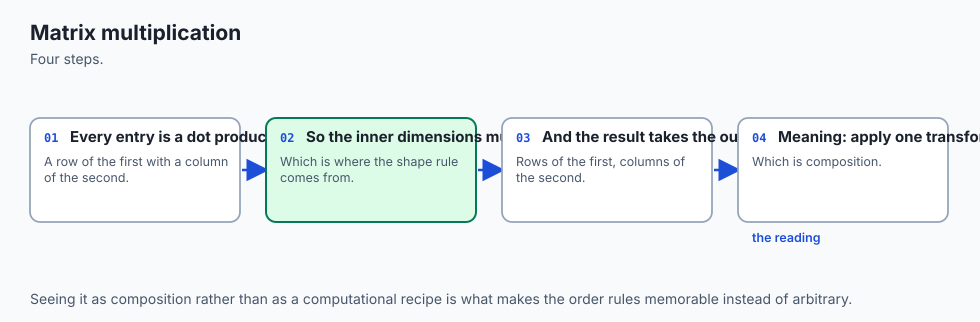

Think of a matrix as a **machine**. You feed a vector in at one end, and a different vector comes out at the other. That is Day 100's third reading, and it is the one that matters today.

Now suppose you have two machines. The first one takes what you give it and hands you something. You carry that something over to the second machine, feed it in, and get a final result. Two machines, two steps, one intermediate thing sitting on the bench between them.

Someone comes along and says: I can build you a **single machine** that does what those two do, in one pass. Same input, same final output, no intermediate thing on the bench.

That single machine is the matrix product. `A @ B` is the one machine that replaces the pair "B, then A".

Everything else today is a consequence of that.

**Why the shapes have to line up.** If machine B produces something four inches wide, machine A had better have a four-inch input slot. Otherwise you cannot bolt them together, and no amount of arithmetic will help. That is the shape rule, and that is all it is: the second thing has to accept what the first thing produces.

**Why the order matters.** Bolting A after B gives a different machine from bolting B after A. Obviously. Nobody finds this surprising about machines, or about socks and shoes, or about "open the door" and "walk through the doorway". It is only when the same fact is written `A @ B ≠ B @ A` that it starts to feel like a technicality. It is not a technicality. It is the most important property of the operation.

**Why there is a "do nothing" matrix.** A straight piece of pipe with no machinery in it. Whatever you feed in comes out unchanged. That is the identity matrix, and bolting it onto either end of your line changes nothing at all.

**Why the brackets can move but the order cannot.** If you have three machines bolted in a line, it does not matter whether you first weld the front two together and then attach the third, or weld the back two and attach the first. You end up with the same production line either way. That is associativity. But you may not swap which machine comes first — that is a different line entirely. Two different statements, and confusing them is the usual mistake.

**Why `*` is not `@`.** Multiplying two matrices entry by entry is a perfectly sensible thing to do, and NumPy will do it when you write `*`. But it is not bolting machines together. It is more like painting one machine's parts with another machine's paint. Useful, occasionally, and completely unrelated to composition.

Hold on to the machines. Every section below returns to them.

## Historical background

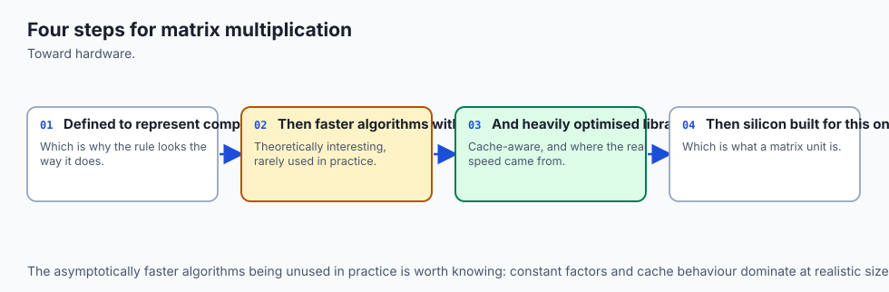

Matrices as arrays of numbers are ancient. The Chinese text *The Nine Chapters on the Mathematical Art*, compiled over several centuries and reaching something close to its final form in the first century CE, solves systems of linear equations by writing the coefficients in a rectangular array and operating on the columns — the method now taught as Gaussian elimination, some eighteen centuries before Gauss.

But an array of numbers is not the same idea as *multiplying* two of them together, and the gap between the two is long.

The word "matrix" was coined by James Joseph Sylvester in 1850, in the sense of a womb or breeding-ground: for Sylvester the rectangular array was the thing *from which* determinants were born, not yet an object in its own right. It was Arthur Cayley who made it one. In his 1858 paper *A memoir on the theory of matrices*, Cayley set out matrices as things you could add, multiply and invert — an algebra with its own rules — and defined the multiplication we still use. Crucially, he defined it the way he did **because** it was the operation that corresponded to composing two linear substitutions. The rule came from composition. It was never a convention chosen for convenience and then justified afterwards.

That is worth sitting with, because it inverts how the subject is usually taught. Most people meet the row-times-column recipe first and are told about composition later, as an interesting property. Historically it is the other way round: composition is the definition, and the recipe is what you get when you write the definition out in coordinates.

Cayley also noticed, in that same paper, that the multiplication he had defined was not commutative. He did not treat this as a defect to be apologised for. It was simply what composition does.

The computational history is shorter and matters more for your working life. In 1979 the **BLAS** — Basic Linear Algebra Subprograms — were published as a standard set of routine names and calling conventions for vector operations, extended in 1988 and 1990 to matrix-vector and matrix-matrix operations. BLAS is an *interface*, not an implementation, and that turned out to be the important design decision: it meant that anyone could write a version tuned to their own hardware, and every program written against the interface would immediately get faster. That is still how it works. When you type `@` in NumPy today on floating-point data, the arithmetic is done by a BLAS implementation, compiled and tuned for the processor you are sitting in front of, and you will see exactly what that is worth later in this lesson.

The one further note: in 1969 Volker Strassen showed that two matrices can be multiplied using fewer multiplications than the obvious method needs — seven instead of eight for the 2 by 2 case, which compounds into a genuine asymptotic improvement for large matrices. It was the first proof that the obvious algorithm is not optimal, and it opened a line of research still running. In practice, for the sizes and hardware most people use, the straightforward method with good cache behaviour usually wins. Cleverness in the operation count is not the same as speed on real silicon, and that gap is a recurring theme in this field.

## What it is — and what it is not

Let us pin down the arithmetic precisely, defining every symbol as it appears.

### The dot product

Start with two vectors. A **vector** here is just a list of numbers; Day 99 covered them. The **dot product** of two vectors of the same length is what you get by multiplying them together entry by entry and adding up all the products. It is written `u · v`, and it returns a single number, not a vector.

```
u = [3, 4]      v = [4, 3]

u · v  =  3×4 + 4×3  =  12 + 12  =  24
```

Two properties are worth having immediately.

A vector dotted with **itself** gives its squared length:

```
u · u  =  3×3 + 4×4  =  9 + 16  =  25
```

and 25 is 5 squared, where 5 is the length of `[3, 4]` from Day 99. That is not a coincidence, and it is why the dot product is the foundation of every distance and similarity measure you will meet.

A dot product of **zero** means the two vectors are at right angles:

```
u = [3, 4]      w = [-4, 3]

u · w  =  3×(-4) + 4×3  =  -12 + 12  =  0
```

Both of those come from the geometric statement of the same operation:

> `u · v = |u| × |v| × cos(θ)`

where `|u|` means the length of `u` (Day 99's L2 norm) and `θ` is the angle between the two vectors.

That formula and the multiply-and-add recipe are the same number arrived at two ways, and you can check the agreement on an angle you can name. Take `a = [2, 0]` and `b = [1, 1]`:

```
multiply and add:  a · b  =  2×1 + 0×1  =  2

geometrically:     |a| = 2,  |b| = √2
                   cos(θ) = 2 / (2 × √2) = 1/√2
                   θ = 45°, and 2 × √2 × cos(45°) = 2  ✓
```

The lab asserts that agreement, to a stated tolerance, rather than asking you to believe it. And now the two properties above are obvious rather than memorised: when θ is 0 the vectors point the same way and `cos(0) = 1`, so you get `|u| × |u|`, the squared length. When θ is 90°, `cos(90°) = 0`, so the whole thing is zero.

### Matrix times vector — and this is the important one

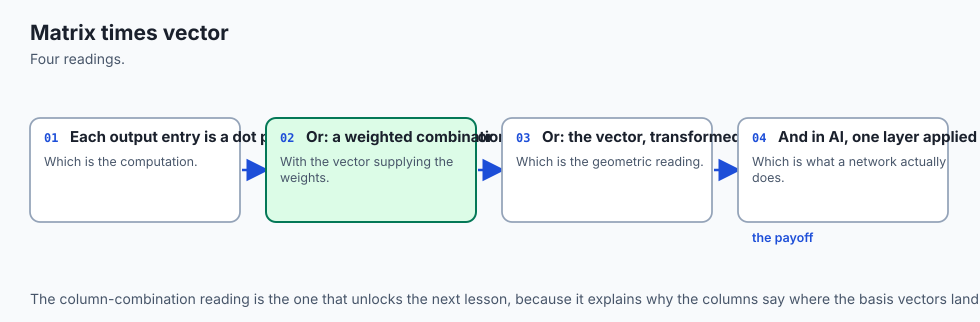

Here is where most courses lose people, by teaching the row recipe. There is a better picture, and it is the one that makes everything later easy.

```
A = [[ 2, 0],          c = [3, 5]
     [-1, 1],
     [ 0, 4]]
```

The row recipe says: dot each row of A with c. `[2, 0] · [3, 5] = 6`, and so on. It gives the right answer.

The better picture says: **`A @ c` is a weighted sum of A's columns.** Take 3 copies of A's first column, plus 5 copies of A's second column, and add them up.

```
    3 × [ 2, -1, 0]  =  [ 6, -3,  0]
    5 × [ 0,  1, 4]  =  [ 0,  5, 20]
                        ─────────────
    sum              =  [ 6,  2, 20]
```

Same answer. Utterly different understanding. Three things follow immediately from the column picture that the row recipe hides:

1. **The output has as many entries as A has rows**, because A's columns each have that many entries and you are adding columns together.
2. **The input must have exactly as many entries as A has columns**, because there is one weight per column and no spares. That is half the shape rule, derived rather than memorised.
3. **The answer can only ever land somewhere A's columns can reach.** Whatever combination you take, you are stuck inside the space those columns span. That single fact is what rank, span, and the entire second half of linear algebra are about, and you now have it for free.

There is a fourth consequence, and it is the neatest trick in the subject. Feed in a vector that is all zeros except a single 1:

```
A @ [1, 0]  =  1 × (A's first column)  +  0 × (A's second column)  =  A's first column
```

**The columns of a matrix are exactly where the basis vectors land.** So you can read a transformation matrix straight off a picture without doing any arithmetic: work out where `(1, 0)` goes, work out where `(0, 1)` goes, and write those down as the columns. You are done.

### Matrix times matrix

Now the whole thing, and it needs no new idea:

> **Column j of `A @ B` is A applied to column j of B.**

Matrix-matrix multiplication is matrix-vector multiplication done once per column. That is the entire definition. Written out in coordinates, entry `(i, j)` of the answer is row `i` of A dotted with column `j` of B, which is the familiar recipe — but now it is a consequence rather than an incantation.

Here is one worked completely, using the batch and the weights from today's lab:

```
X = [[1, 2, 0],        W = [[ 2, 0],
     [0, 1, 3]]             [-1, 1],
                            [ 0, 4]]
```

Take entry `(1, 1)` of the answer — row 1, column 1, counting from zero:

```
      row 1 of X    = [0, 1, 3]
      column 1 of W = [0, 1, 4]
      0×0 + 1×1 + 3×4 = 0 + 1 + 12 = 13
```

Do the other three the same way and you get:

```
X @ W  =  [[ 0,  2],
           [-1, 13]]
```


### The shape rule, derived

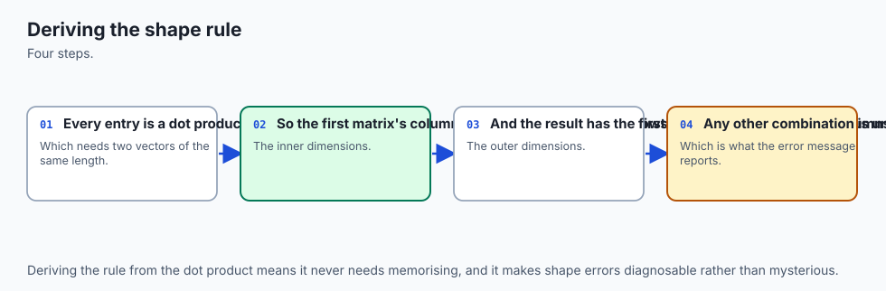

```
(m, n) @ (n, p)  ->  (m, p)
```

The two inner numbers must be equal. The two outer numbers survive. People memorise this and then check it nervously every time. Do not memorise it; read it off the machines.

`A @ B` means "do B, then do A". B has shape `(n, p)`: it accepts vectors of length `p` and produces vectors of length `n`. A has shape `(m, n)`: it accepts vectors of length `n` and produces vectors of length `m`. So:

- **The inner dimensions must match** because A has to accept what B hands it. If B produces length-`n` things and A only takes length-`k` things, you cannot bolt them together.
- **That inner dimension is then consumed.** It does not appear in the answer at all. It was the size of the intermediate thing on the bench, and the combined machine has no bench.
- **The outer dimensions survive** because they are the two ends of the pipeline: what goes in at one end and what comes out at the other.

### What it is not

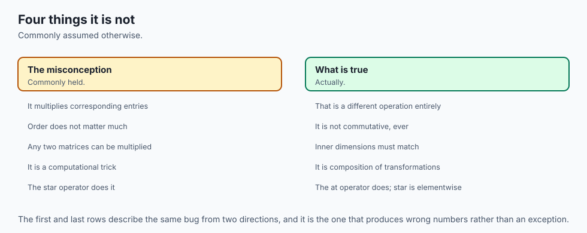

| It is not | Why people think it is | What is actually true |
| --- | --- | --- |
| Entry-by-entry multiplication | It is what "multiply" means for ordinary numbers, and NumPy's `*` does exactly this | `*` is the **elementwise** or **Hadamard** product. It is a different operation with different uses. `@` sums; `*` does not. |
| Commutative | Multiplication of numbers is, and the notation looks the same | `A @ B` and `B @ A` are usually different matrices, and are frequently not even the same shape. Often only one of them is legal at all. |
| Just a table lookup rule | It is taught as a recipe | It is composition of transformations. The recipe is the coordinate form of that. |
| Expensive because it is complicated | The formula looks fussy | It is expensive because there are `m × n × p` multiplications, not because any one of them is hard. |
| The same thing as `np.dot` | They agree on 2-D arrays | They agree on 2-D arrays and diverge on higher-dimensional ones, as shown below. |

## Why it was created and what problems it solves

Cayley defined this operation to solve a specific problem: he had two **linear substitutions** — rules that rewrite one set of variables in terms of another — and he wanted to know what happens when you apply one after the other. The answer is another linear substitution, and its coefficients turn out to be exactly the row-times-column combination of the original two. He named that combination the product, and the notation has not changed since.

The problem it solves for you is the same problem in modern clothes: **you have a pipeline of transformations, and you want to collapse it into one.**

That sounds abstract until you notice how much of computing is exactly that.

**Graphics.** A model in a 3-D scene gets rotated, scaled, moved, and projected onto your screen. Each of those is a matrix. Rather than pushing every one of a million vertices through five transformations, you multiply the five matrices together *once* and push each vertex through the single result. Five million operations become one million plus a fixed cost, and this is why real-time 3-D graphics is possible at all.

**Neural networks.** A layer transforms a batch of examples. Stacking layers is composing transformations. The entire forward pass of a model is a chain of matrix products with non-linear functions wedged between them — and today's lab shows what happens when you leave those non-linear functions out, which is that the whole stack collapses back into a single matrix. That collapse is the reason activation functions exist, and it is a direct consequence of associativity.

**Solving equations.** Writing a system of linear equations as `A @ x = b` turns "many equations in many unknowns" into a single statement about one transformation, and lets you ask "what did this machine do to my input?" rather than juggling coefficients.

**Graphs.** If `A` is a table saying which nodes connect to which, then `A @ A` counts paths of length two, and `A @ A @ A` counts paths of length three. That is not an analogy — it falls straight out of the definition, because the sum over the middle index is exactly "count every way to get from here to there via somewhere".

**Probability.** If `M` holds the probabilities of moving between states in one step, `M @ M` holds them for two steps. Same mechanism.

The common thread is that in every one of these, the useful thing is not the numbers in the matrix but the fact that **composing is itself an operation you can compute**. If composition were not a matrix, you could not precompute it, and nearly all of the above would be impractical.

## How it works

### Composition, with real coordinates

Take two transformations of the flat plane, both simple enough to picture.

```
A = [[0, -1],        a quarter turn anticlockwise
     [1,  0]]

B = [[1,  0],        a reflection in the horizontal axis
     [0, -1]]
```

Check those against the trick from earlier. A's columns are `[0, 1]` and `[-1, 0]`, so A sends `(1, 0)` to `(0, 1)` and sends `(0, 1)` to `(-1, 0)` — which is exactly a quarter turn anticlockwise. B's columns are `[1, 0]` and `[0, -1]`, so B leaves `(1, 0)` alone and flips `(0, 1)` to `(0, -1)` — a reflection that leaves x alone and flips y. No arithmetic required.

Now take the point `v = (3, 1)` and do B first, then A:

```
      B @ v          = [3, -1]      the reflection flipped the sign of y
      A @ (B @ v)    = [1, 3]       then the quarter turn
```

And now the product matrix, computed with the ordinary recipe:

```
      A @ B          = [[0, 1], [1, 0]]
      (A @ B) @ v    = [1, 3]
```

Same destination. One multiplication instead of two, and no intermediate `(3, -1)` on the bench. That block is captured from `02_composition.py` in today's lab, which asserts every line of it.

The product `[[0, 1], [1, 0]]` is the matrix that swaps the two coordinates, which is the reflection in the line `y = x` — and `(3, 1)` becoming `(1, 3)` is visibly exactly that. So "reflect in the horizontal axis, then turn a quarter anticlockwise" is the same thing as "reflect in the diagonal". That is a real geometric fact that you could have found with a mirror and a piece of paper, and the matrix product found it for you by arithmetic.


### Read the order carefully, because this is the thing people get wrong

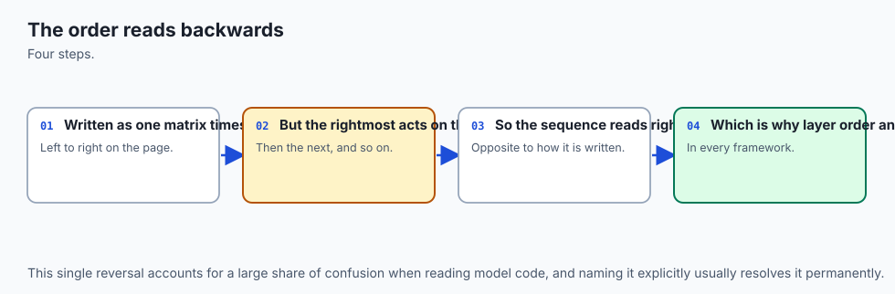

In `A @ B`, **B runs first**. It is the matrix standing next to the vector in `A @ (B @ v)`.

Matrices compose right to left, like nested function calls: `A(B(v))`. English reads "A times B" left to right; the arithmetic does not. That mismatch is the single most common conceptual error on this topic, and it is worth saying out loud every time until it sticks.

There is an honest complication here, and today's lab meets it head-on rather than hiding it, because you *will* hit it in the first framework you use. Everything above assumes a vector is a **column**. Every deep learning framework instead stores a batch with one example per **row**, and then the matrix goes on the right:

| Convention | A vector is | A layer is written | A chain reads |
| --- | --- | --- | --- |
| Column (textbooks, this section) | a column, shape `(n, 1)` | `y = A @ v` | right to left: `B @ (A @ v)` |
| Row (every framework you will use) | a row, shape `(1, n)` | `y = x @ A` | left to right: `x @ A @ B` |

Both compute the same thing; one is the transpose of the other. The lab checks that `x @ W` and `W.T @ x` give identical numbers. Frameworks chose rows because a batch is a stack of examples, and stacking them as rows means example `i` lives at `X[i]` — which is how every CSV file (Day 65) and database table (Day 85) you have met is already laid out. The cost of that choice is one moment of confusion, and you are having it now, deliberately, rather than at 2am.

### Not commutative, computed in full

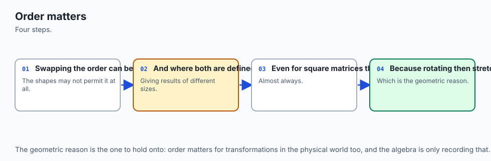

Both `A @ B` and `B @ A` are defined here, because both matrices are 2 by 2. They are not the same:

```
  A @ B = [[0, 1], [1, 0]]     reflection in the line y = x
  B @ A = [[0, -1], [-1, 0]]   reflection in the line y = -x
```

Feed `(3, 1)` through each and you land at `(1, 3)` one way and `(-1, -3)` the other. Not close. Not a rounding difference. A different place.

The untidier pair from the opening does the same thing without any geometric prettiness to lean on:

```
      P @ Q = [[19, 22], [43, 50]]
      Q @ P = [[23, 34], [31, 46]]
      P * Q = [[5, 12], [21, 32]]
```

Two matrices, three answers, and only one of them is what "multiply these matrices" means.

### What is true: associativity and distributivity

Two things you *are* allowed to do:

```
(A @ B) @ C  =  A @ (B @ C)          associativity — brackets may move
A @ (B + D)  =  A @ B  +  A @ D      distributivity — it splits over addition
```

Note the precise claim of associativity: **the brackets may move freely; the order may not.** Those are different statements and confusing them is the usual mistake.

Associativity is not a curiosity for algebra exams. It is the only reason you are allowed to choose the cheaper way to evaluate a chain — and the choice is worth a great deal.

An `(m, n) @ (n, p)` costs `m × n × p` multiplications, one per `(row, column, inner step)`. Nothing about that count is an estimate; it is how many times the innermost line of the loop runs. So for a chain of three:

```
  (10, 100) @ (100, 5) @ (5, 50)
      (AB)C  = 10*100*5 + 10*5*50
             = 5,000 + 2,500 = 7,500
      A(BC)  = 100*5*50 + 10*100*50
             = 25,000 + 50,000 = 75,000
      ratio  = 10x
```

Ten times the arithmetic for the identical answer, decided entirely by where you put the brackets. And on shapes people actually train:

```
  (1024, 4096) @ (4096, 8) @ (8, 4096)
      (AB)C  = 1024*4096*8 + 1024*8*4096
             = 33,554,432 + 33,554,432 = 67,108,864
      A(BC)  = 4096*8*4096 + 1024*4096*4096
             = 134,217,728 + 17,179,869,184 = 17,314,086,912
      ratio  = 258x
```

Those are the shapes of a **low-rank adapter**: a 4096-wide layer with a narrow 8-wide detour through one matrix and back out through another, applied to a batch of 1024. Multiplying the two small matrices together *first* builds a full 4096 by 4096 matrix and then hits the entire batch with it — 258 times the work, for exactly the same answer. Keeping the brackets on the left keeps the detour narrow. That cost gap is most of why adapters are cheap enough to be worth using, and it is nothing more exotic than associativity plus counting.

### The identity matrix

The straight pipe. Ones on the main diagonal, zeros everywhere else:

```
identity(3) = [[1, 0, 0], [0, 1, 0], [0, 0, 1]]
```

Apply it to a vector and you get the vector back, because the weighted-sum-of-columns picture picks out exactly one column per coordinate. Multiply any matrix by it and nothing happens:

```
  I2 @ X      = [[1, 2, 0], [0, 1, 3]]    (X unchanged)
  X  @ I3     = [[1, 2, 0], [0, 1, 3]]    (X unchanged)
```

Note the two different sizes in that captured block. `X` is `(2, 3)`, so the identity that fits on its left is 2 by 2 and the one that fits on its right is 3 by 3. "The" identity matrix is really one per size, and the shape rule decides which.

### `*` versus `@`, deliberately

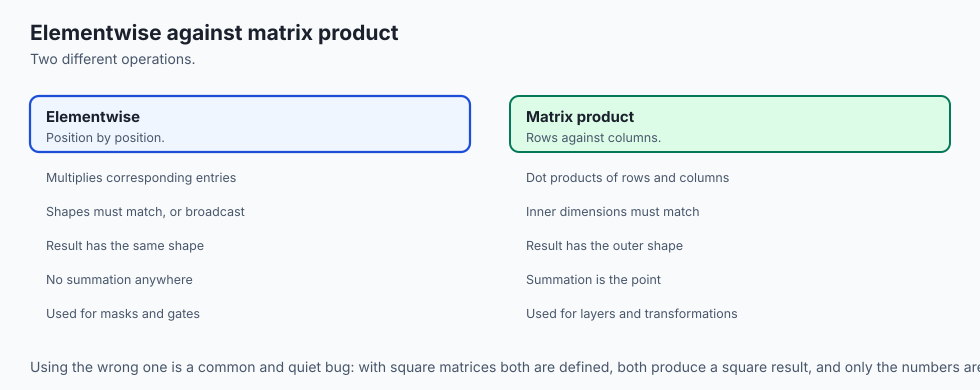

This is the trap from the opening, and it comes in two flavours.

**Flavour one: same shape, different numbers.** Two square matrices of the same size give a same-sized answer either way, so no shape check can save you. Only the values differ, and nothing tells you which you got. This is the dangerous one.

**Flavour two: different shapes.** Take the batch `X` of shape `(2, 3)` and the vector `u = [10, 2, 5]` of shape `(3,)`:

```
  X * u  -> shape (2, 3)  [[10, 4, 0], [0, 2, 15]]
             u is broadcast across both rows (Day 100), then multiplied
             entry by entry. Three numbers per row go in, three come out.
  X @ u  -> shape (2,)     [14, 17]
             each row is multiplied by u AND THEN SUMMED:
               row 0: 1*10 + 2*2 + 0*5 = 10 + 4 + 0  = 14
               row 1: 0*10 + 1*2 + 3*5 =  0 + 2 + 15 = 17
```

**The summing is the entire difference.** `*` keeps every product; `@` adds them up and loses a dimension doing it. In fact you can state the relationship exactly as code — `@` is `*` followed by a sum along the last axis, which the lab asserts:

```python
(X * u).sum(axis=1)  ==  X @ u
```

That collapse is what makes `@` a transformation rather than a rescaling. It is also why `@` can turn three features into one number, and `*` never can.

### `np.dot`, `np.matmul`, and `@`

Three spellings. On two-dimensional arrays all three agree exactly, and `@` is the one to use because it says at a glance which operation you meant.

They part company on higher-dimensional arrays, and this was checked rather than assumed while writing this lesson — the assumption would have been that they differ everywhere, and they do not:

```
      a stack of two 2x2 matrices, shape (2, 2, 2), times one 2x2:
        np.matmul -> (2, 2, 2)
        np.dot    -> (2, 2, 2)
        Here they agree, in shape AND in every value.

      the same stack times ANOTHER stack, (2, 2, 2) against (2, 2, 2):
        np.matmul -> (2, 2, 2)      two matrices, paired up
        np.dot    -> (2, 2, 2, 2)   every pairing, all four
```

`matmul` treats the leading axes as a stack of matrices and pairs them off; `dot` sums over the last axis of the left and the second-to-last of the right, keeping everything else, so it produces every combination. The rule to carry is simpler than the exceptions: **use `@` for matrix multiplication, and `np.dot` only for two plain vectors.**

### Reading a shape error

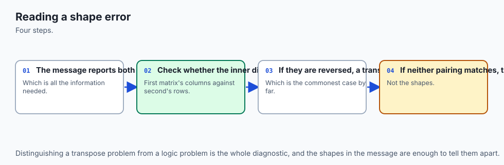

The most common error in applied linear algebra, and the first thing to check when anything goes wrong:

```
  X is (2, 3). X @ X asks for (2, 3) @ (2, 3).
  The inner dimensions are 3 and 2, and they disagree.

  NumPy raises:
    ValueError: matmul: Input operand 1 has a mismatch in its core dimension 0,
    with gufunc signature (n?,k),(k,m?)->(n?,m?) (size 2 is different from 3)
```

Ignore the gufunc signature the first time you read it. **Print the two shapes and look at the inner two numbers.** That is the bug, and it is the whole bug.

The repair is usually a transpose — but there are two of them and they are not interchangeable:

```
  X @ X.T  is (2, 3) @ (3, 2) -> (2, 2)
      [[5, 2], [2, 10]]
      entry (i, j) is example i dotted with example j — a table of how
      alike the two EXAMPLES are.
  X.T @ X  is (3, 2) @ (2, 3) -> (3, 3)
      [[1, 2, 0], [2, 5, 3], [0, 3, 9]]
      entry (i, j) is feature i dotted with feature j — a table of how
      alike the three FEATURES are.
```

Both make the exception go away. Only one answers the question you had. This is why "just transpose it until it runs" is a genuinely bad habit: the error was telling you something, and silencing it at random trades a loud failure for a quiet wrong answer. Decide which table you wanted, then write that.

(Both results are symmetric, which ties back to Day 100 — a table of how alike two things are must read the same both ways round.)

## An everyday analogy

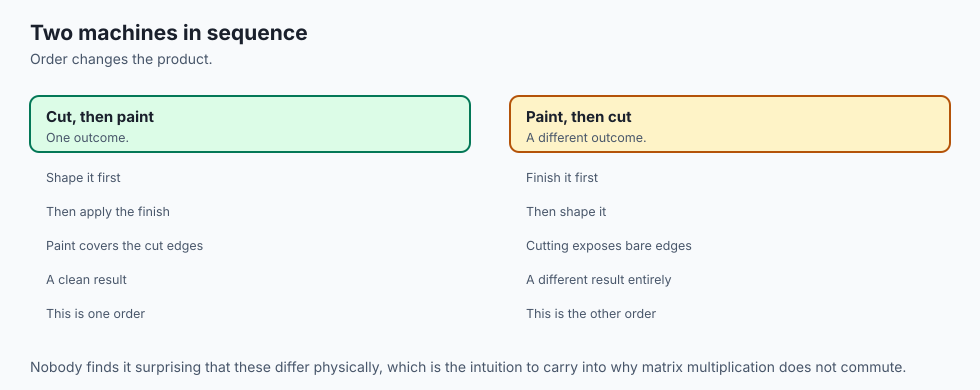

Return to the machines, and let us push the analogy until it breaks, because an analogy you have not tested is one you will over-trust.

You run a small workshop. You have a **cutting machine** and a **painting machine**. Raw board goes into the cutter and comes out as shaped pieces; shaped pieces go into the painter and come out finished.

- **A matrix is one machine.** It has an input slot of a certain size and an output chute of a certain size. Those two sizes are the shape.
- **The matrix product is welding two machines into one.** `paint @ cut` is the single unit that takes raw board in one end and finished pieces out the other.
- **The shape rule is the physical fit.** The cutter's output chute must fit the painter's input slot. If it does not, you cannot weld them, and this is not a matter of opinion — it is the `ValueError`.
- **The consumed inner dimension is the bench.** When the machines are separate, shaped-but-unpainted pieces pile up between them. When you weld them, that pile stops existing. The intermediate size vanishes from the description of the combined machine, exactly as `n` vanishes from `(m, n) @ (n, p) -> (m, p)`.
- **Non-commutativity is obvious here.** Cutting then painting gives finished pieces. Painting then cutting gives pieces with raw, unpainted edges. Same two machines, different factory, and nobody needs convincing.
- **The identity matrix is a length of plain conveyor.** Weld it on anywhere and nothing changes.
- **Associativity is how you build the line.** Weld the cutter to the painter first and then attach the sander, or weld the painter to the sander first and then put the cutter in front — either way the finished line is identical. The order of the machines along the line has not changed; only the order in which you did the welding.
- **The multiplication count is the running cost.** Welding does not make the work vanish. Every board still gets cut and painted. What welding saves is the handling: the bench, the pile, the carrying.

And now where the analogy **breaks**, which is the part worth stating:

A real welded machine does the same physical work as the two separate ones. A matrix product genuinely does *less arithmetic per input* than applying two matrices in turn — that is the whole point of precomputing it — but it costs something up front to build. For one vector, composing first is a waste. For a million vertices, it is the difference between a game that runs and one that does not. The analogy hides that trade-off, so hold it separately: **compose once, apply many times.**

The second break: machines are physical and a bench is a real place. The intermediate vector in `A @ (B @ v)` is real too, but the intermediate *matrix* in an association choice is not something anyone wants — as the 258× example showed, building the big intermediate matrix is precisely the expensive mistake. The analogy suggests bigger welded units are always better. They are not.

## Examples in practice

**One layer of a neural network.** The payoff promised at the top. Here is the whole thing, with numbers you can check on paper.

```
X    = [[1, 2, 0],      the batch: two examples, three features each
        [0, 1, 3]]

W    = [[ 2, 0],        the weights: three inputs, two outputs
        [-1, 1],
        [ 0, 4]]

bias = [5, -2]          one number per OUTPUT unit
```

The multiply, worked out:

```
  example 0 = [1, 2, 0]
    output 0, weights [2, -1, 0]:  1*2 + 2*(-1) + 0*0  =  2 - 2 + 0  =  0
    output 1, weights [0,  1, 4]:  1*0 + 2*1    + 0*4  =  0 + 2 + 0  =  2
  example 1 = [0, 1, 3]
    output 0, weights [2, -1, 0]:  0*2 + 1*(-1) + 3*0  =  0 - 1 + 0  = -1
    output 1, weights [0,  1, 4]:  0*0 + 1*1    + 3*4  =  0 + 1 + 12 = 13
```

Then the bias, broadcast across the rows exactly as Day 100 described — `(2, 2)` against `(2,)` pads to `(1, 2)`, the trailing 2s match, and the 1 stretches down the rows:

```
    example 0: [ 0,  2] + [5, -2] = [5,  0]
    example 1: [-1, 13] + [5, -2] = [4, 11]

  X @ W + b = [[5, 0], [4, 11]]   shape (2, 2)
```

That is a forward pass. Every model you will ever train is that operation, repeated at larger sizes, with a non-linear function applied between layers.

Three details in it are worth naming. The bias is one per **output**, not one per example — grow the batch to 64 and the bias does not change, because it belongs to the layer. Each row is computed **independently** of the others, which is exactly why batching is worth doing: the same weights get reused across every example in one multiply. And the `3` disappeared: three features went in, two outputs came out, and the width of the layer decided the shape of the answer.

**Two layers, and why activation functions exist.** Stack a second layer on top and the shapes chain: 3 features in, 2 hidden, 3 out. But the lab shows something uncomfortable:

```
      W @ W2 has shape (3, 3), and X @ (W @ W2) + (b @ W2 + b2) =
      [[5, 1, 9], [37, 12, 7]]
      — identical to running the two layers separately.
```

Two layers with nothing between them **collapse into one matrix**. That is associativity, and it means a stack of pure matrix multiplies is just one matrix multiply, no matter how deep you make it. Depth buys you nothing without a non-linear function in between. That is not a design preference; it is a theorem, and you have just seen it demonstrated on numbers you can check.

**Graphics.** A rotation, a scale and a translation, multiplied into one matrix and applied to every vertex of a model.

**Recommendations.** A matrix of users by features multiplied by a matrix of features by items gives a table of predicted scores — every user against every item, in one operation.

**Attention.** The mechanism behind every transformer model computes `Q @ K.T` — a table of how much each token should attend to each other token. That is a matrix product, and it is the same "table of how alike two things are" you saw in `X @ X.T` above, at a larger size.

## Implications: security, privacy, performance, scalability, and cost

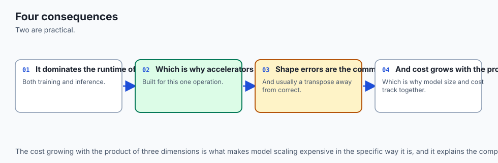

**Performance is the headline, and there is a genuine surprise in it.** Today's lab times three nested Python loops against NumPy on two 200 by 200 matrices — eight million multiply-and-adds either way, and identical answers. Measured on the authoring machine (macOS 26.5.2, Apple Silicon, Python 3.14.0, NumPy 2.5.2):

```
      three nested loops in Python  :    0.1957 s
      NumPy @ on int64  (best of 5) :  0.002479 s          79x faster than the loop
      NumPy @ on float64 (best of 5):  0.000037 s       5,223x faster than the loop
```

Read the last two lines again. **Same shapes, same values, same operator, same library — and the float version was 66 times faster than the integer version.** That was not what this lesson expected to find, and it is the most instructive number in the day, because it tells you what NumPy is actually doing.

**BLAS implements floating point and nothing else.** Its matrix-multiply routines are defined for float and complex types. So a `float64` multiply is handed straight out to BLAS — compiled, tuned to the exact processor, using vector instructions and cache-aware blocking and often several cores — while an `int64` multiply falls back to NumPy's *own* compiled C loop. Still far better than interpreted Python, still nowhere near BLAS.

Which means the usual answer to "why is NumPy fast?" — *because it is C* — is wrong. The `int64` row **is** C, and it is the slow NumPy row. NumPy is fast because for the types that matter it stops being NumPy too, and calls out to a library people have been optimising since 1979. (This installation reported its BLAS as `accelerate`, read from `numpy.__config__` rather than assumed; a Linux wheel will usually report OpenBLAS.)

The practical rule: **if a matrix multiply is slower than you expected, check the dtype before you check anything else.** It is also part of why every framework stores weights as `float32` or something smaller, never as integers.

Those durations are from one machine on one day and yours will differ. No test in the lab asserts a duration; the assertions are wide ratios set far below what was measured.

**Scalability is cubic, and that is unforgiving.** An `(n, n) @ (n, n)` costs `n³` multiplications. Double the size, do eight times the work. A 200 by 200 pair is eight million operations; a 1000 by 1000 pair is a billion. Nothing warns you, no exception is raised, and the process simply does not come back. This is the one resource in today's lab that can genuinely make your machine uncomfortable, and the remedy is to raise sizes by doubling rather than jumping to a round number.

**Cost, in money.** Training compute is dominated by these products, so the multiplication count *is* the bill. This is why the association-order choice in the adapter example matters: 258× the arithmetic is 258× the energy and, near enough, 258× the rental cost of the machine doing it. Choosing where to put the brackets is one of the few optimisations that is free, exact and requires no approximation whatsoever.

**Numerical honesty, which is the security-flavoured part.** Two facts from the lab, both verified by running rather than by reasoning:

*Integer matrix products overflow silently.* NumPy integer arrays are fixed-width and wrap round; Python's own integers are arbitrary-precision and do not. So the from-scratch implementation and NumPy genuinely disagree on large values, and **NumPy is the one that is wrong**:

```python
big = [[3037000500, 0], [0, 1]]
np.array(big) @ np.array(big)   ->  [[-9223372036709301616, 0], [0, 1]]
matmul_loops(big, big)          ->  [[ 9223372037000250000, 0], [0, 1]]
3037000500 ** 2                 ==    9223372037000250000
```

No warning is raised. The array simply contains a large negative number where a large positive one belongs. The lab asserts this, including the absence of a warning, so the claim stays honest if NumPy ever changes.

*Floating-point addition is not associative.* With `float64` inputs, `(A @ B) @ C` and `A @ (B @ C)` agree to within `1e-9` but are **not** bit-for-bit identical, even though they are the same computation in mathematics. Never compare two float results with `==`; state a tolerance. Day 70 covered why.

**Privacy.** A trained weight matrix is not anonymous. `W` is derived from the data it was trained on, and matrix products are invertible often enough that "we only shipped the weights, not the data" is a weaker claim than it sounds. That is well beyond today's scope, but it is the right instinct to form now.

## Alternatives: free, open source, and commercial

Every option below is free and open source. **Only the first two were actually run for this lesson**; the rest are described from their own documentation, and no output is reproduced for them.

**Pure Python lists and loops — run here.** Free, no install, standard library only. *When to choose it:* when you are learning, when you need arbitrary-precision integers that do not overflow, or when there is genuinely no dependency available. *How:* three nested loops, as in the lab's `matmul_loops`. *Example:* the entire from-scratch build in today's exercise 1, which needs nothing but `python3`. *The catch:* measured at roughly 5,200 times slower than NumPy on 200 by 200 floats on this machine.

**NumPy — run here, version 2.5.2.** Free, BSD 3-Clause licence. *When to choose it:* essentially always, for array work on a single CPU. It is the foundation almost everything else in the Python numerical stack is built on. *How:* `A @ B`. *Example:* every captured block in this lesson. *The catch:* CPU only, no automatic differentiation, and — as measured above — the dtype decides whether you reach BLAS at all.

**PyTorch — not installed, no output reproduced.** Free, open source. *When to choose it:* when you need the same operation on a GPU, or you need gradients computed automatically for training. Its tensors deliberately mirror NumPy's interface, and `@` works the same way, which is much of why NumPy is worth learning first. *How, from its documentation:* `torch.matmul(a, b)` or `a @ b`, with `.to("cuda")` to move the data to a GPU. *Cost:* free; the GPU it wants to run on is the expense.

**JAX — not installed, no output reproduced.** Free, open source. *When to choose it:* when you want NumPy's interface with just-in-time compilation and automatic differentiation, particularly for research code. *How, from its documentation:* `jax.numpy` mirrors the NumPy interface, so `a @ b` again, with `jax.jit` to compile a whole function. *Cost:* free.

**BLAS implementations generally — present here but not chosen.** OpenBLAS, Intel MKL, Apple's Accelerate, and others. This is the honest and slightly surprising entry in the list: **you are already using one.** NumPy does not implement floating-point matrix multiplication itself; it calls out to whichever BLAS it was built against, which is why the loop loses so badly and why the `int64` row above is so much slower than the `float64` one. *When to choose one deliberately:* rarely, and only if you are building NumPy yourself or profiling has shown BLAS to be your bottleneck. *How to see yours:* `numpy.__config__.show()`. *Cost:* free for OpenBLAS and Accelerate; MKL is free to use with its own licence terms.

The practical recommendation: learn it with loops, use NumPy, reach for PyTorch or JAX when you need a GPU or gradients. The operation is identical in all of them, which is the point — you are learning one thing, not four.

## Comparison with related concepts

| Operation | Notation | What it does | Result shape from `(2, 3)` and... | Sums? |
| --- | --- | --- | --- | --- |
| Matrix product | `A @ B` | Composition of transformations | `(3, 2)` gives `(2, 2)` | Yes |
| Elementwise (Hadamard) product | `A * B` | Multiplies matching entries | `(2, 3)` gives `(2, 3)` | No |
| Dot product | `u · v` | Two vectors to one number | two `(3,)` vectors give a scalar | Yes |
| Matrix-vector product | `A @ v` | Weighted sum of A's columns | `(3,)` gives `(2,)` | Yes |
| Scalar multiplication | `3 * A` | Scales every entry | gives `(2, 3)` | No |
| Matrix addition | `A + B` | Adds matching entries | `(2, 3)` gives `(2, 3)` | No |
| Transpose | `A.T` | Swaps rows and columns | gives `(3, 2)` | No |
| Outer product | `np.outer(u, v)` | Every pairing of two vectors | `(2,)` and `(3,)` give `(2, 3)` | No |

Two comparisons deserve a sentence each.

**Elementwise versus matrix product** is the distinction this whole lesson keeps returning to, and the compact statement is: `A @ B` is `A * B`-style multiplication **followed by a sum**, arranged so that each output entry pairs one row with one column. The sum is the difference, and the sum is what loses a dimension.

**Outer product versus dot product** are opposites worth knowing as a pair. The dot product takes two vectors and returns one number — it *collapses*. The outer product takes the same two vectors and returns a whole matrix of every pairwise product — it *expands*. Both are matrix products in disguise: `u · v` is `(1, n) @ (n, 1)` giving `(1, 1)`, and the outer product is `(n, 1) @ (1, m)` giving `(n, m)`. Same operation, opposite arrangements, which is a nice demonstration that the shape rule really is doing all the work.

## When to use it — and when not to

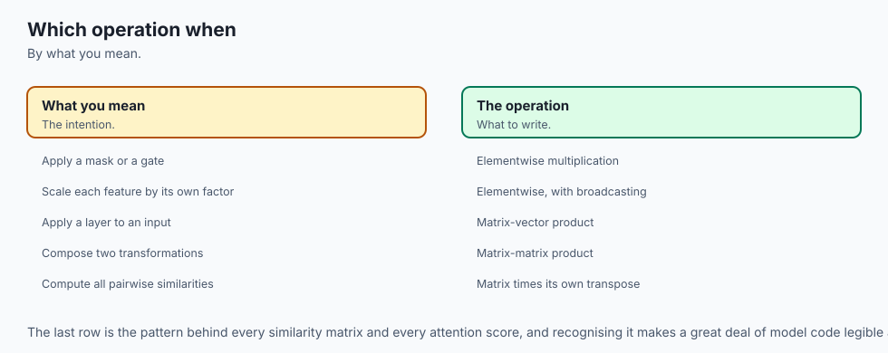

**Use a matrix product when** you are composing transformations, applying one transformation to many vectors at once, or computing every pairwise combination of two sets of things — similarity tables, attention scores, path counts in a graph.

**Precompute the product when** you will apply the same chain of transformations many times. Compose once, apply many. For a single vector it is a waste; for a million vertices it is the difference between working and not.

**Do not use it when** you want entry-by-entry arithmetic. If you are scaling each feature by its own factor, masking values, or applying a gate, you want `*`. Reaching for `@` there is not a slower way to get the answer; it is a different and wrong answer.

**Do not use it when** the operation is not actually linear. Matrix multiplication can only express transformations where scaling the input scales the output and adding inputs adds outputs. Anything else — a threshold, a maximum, a comparison — is not a matrix and cannot be made into one. This is exactly why activation functions sit *between* layers rather than being folded into them.

**Watch the association order when** a chain has a narrow matrix in it. That is where the 258× lives, and it costs nothing to check.

**Watch the dtype when** speed matters. Integers do not reach BLAS.

**Stop and think when** you find yourself adding a transpose to make an error go away. The error was information. Work out which of the two possible repairs answers your question before you pick one.

### Where this goes next in AI work

Day 102 takes the transformation reading further into linear transformations proper. But the thread that runs straight from today into everything else is this: a GPU is, for these purposes, a machine built to do this one operation in parallel.

Day 2 raised the question of why GPUs beat CPUs at bulk mathematics, and now you can answer it precisely rather than vaguely. Every entry of a matrix product is independent of every other entry — entry `(0, 0)` does not need to wait for entry `(0, 1)`, because they read different rows and columns and write different places. A CPU has a handful of very fast cores designed to run complicated, branchy, unpredictable code. A GPU has thousands of simpler cores designed to run the *same* instruction over enormous amounts of data at once. Matrix multiplication is the purest possible case of that pattern: millions of identical multiply-and-add operations with no dependencies between them.

That is the whole answer. GPUs are not generally faster than CPUs — they are dramatically slower at most things. They are faster at this, and this is what training a model consists of. Modern accelerators have gone further and added units that do nothing but small matrix multiplies in a single instruction, which is as literal a statement of the point as hardware can make.

So when you read that a model took a certain number of GPU-hours to train, you are reading a count of these products. When someone quantises a model to run in fewer bits, they are making these products cheaper. When an adapter trains a large model at small cost, it is the association trick from earlier. Today's operation is not one topic among many in AI. It is the operation, and almost everything else is arranged around making it fast enough.

## The AI connection

- **Matrix multiplication is what a neural network layer does** — everything else is the
  activation function.
- **It is the operation accelerators were built for**, which is why AI hardware looks the way
  it does.
- **Order matters, and it reads backwards** relative to how the composition is described,
  which is a persistent source of error.
- **The shape rule is derivable rather than memorised**, and deriving it once makes shape
  errors readable.
- **Reading a shape error fluently** is among the most practical skills in this entire
  curriculum.

## Knowledge check

Eight questions on this lesson are provided in `quiz.yml` and rendered with the lesson. Before you take them, check yourself on the six things that matter most:

1. Why must the inner dimensions match? (Answer in terms of what each matrix accepts and produces, not "because that is the rule".)
2. What is `A @ v`, described as something done to A's columns?
3. In `A @ B @ v`, which matrix meets the vector first?
4. What is the one-sentence difference between `*` and `@`?
5. Two associations of a three-matrix chain: do they give the same answer, and do they cost the same?
6. Why is `float64` matrix multiplication so much faster than `int64` in NumPy?

## Hands-on exercise

Today's lab is **"Multiply It Yourself"**, in `labs/sections/math-statistics-and-data/day-101-matrix-multiplication/`.

You will implement matrix multiplication three different ways from first principles — three nested loops, a list of dot products, and a weighted sum of columns — and assert all three against NumPy's `@` on six shapes. Then you verify one output cell by hand, demonstrate that `A @ B` and `B @ A` differ, prove that `*` and `@` are different operations on the same operands, trigger a shape error deliberately and repair it with a transpose, compute one network layer with a broadcast bias, and time your loop against NumPy.

Set up, from the repository root:

```bash
cd labs/sections/math-statistics-and-data/day-101-matrix-multiplication
python3 -m venv .venv
.venv/bin/pip install -r requirements/requirements.txt
```

Read `starter/00_brief.md`, then work through the six exercises, checking yourself as you go:

```bash
.venv/bin/pytest starter -q
```

Write your predictions down **before** you run anything. Every prediction in `answers.py` takes under a minute with a pen, and a prediction you check is worth ten outputs you read.

### Expected output

On an untouched checkout the starter suite reports:

```
1 passed, 56 skipped
```

A skip means "not attempted". A failure means "attempted and wrong", and prints both your answer and the real one. When it prints `57 passed`, you are finished.

The reference suite and the full harness:

```
71 passed
58 checks, 0 failure(s).
```

Blocks worth recognising when you meet them. The highlighted output cell:

```
      row 1 of X    = [0, 1, 3]
      column 1 of W = [0, 1, 4]
      0*0 + 1*1 + 3*4 = 0 + 1 + 12 = 13
```

Composition arriving at the same point two ways:

```
      B @ v          = [3, -1]      (reflected: y flipped sign)
      A @ (B @ v)    = [1, 3]      (then turned a quarter anticlockwise)
      A @ B          = [[0, 1], [1, 0]]
      (A @ B) @ v    = [1, 3]
```

And the timing, whose **ratios** are the point and whose durations are not:

```
      three nested loops in Python  :    0.1957 s
      NumPy @ on int64  (best of 5) :  0.002479 s          79x faster than the loop
      NumPy @ on float64 (best of 5):  0.000037 s       5,223x faster than the loop
```

`expected-output/FIELDS.md` records exactly which parts of the captured output may legitimately differ on your machine and which may not.

### Validate your work

1. `bash tests/run_tests.sh; echo "exit=$?"` prints `58 checks, 0 failure(s).` and `exit=0`.
2. `.venv/bin/pytest examples -q -p no:cacheprovider` prints `71 passed`.
3. `.venv/bin/pytest starter -q -p no:cacheprovider` prints `57 passed` once you have finished.
4. Each of the five reference scripts ends with `every assertion held.`
5. `find . -type d -name '__pycache__' -o -type d -name '.pytest_cache'` prints nothing after a full run.

### Troubleshooting

**`ModuleNotFoundError: No module named 'matmul'`** — you are running a reference script from the wrong directory. They import from beside themselves, so `cd examples` first.

**Everything in the starter suite shows as `s`** — that is correct on an untouched checkout. `s` means skipped, which here means "not attempted". Run with `-rs` to see the reason for each one.

**`ValueError: matmul: Input operand 1 has a mismatch in its core dimension 0`** — the shape error. Print both shapes and look only at the inner two numbers.

**`TypeError: unsupported operand type(s) for @`** — you are using `@` on plain Python lists. Convert with `np.array(...)` first, or call your own `matmul_loops`.

**Your timings look nothing like the captured ones** — expected, and fine. No test asserts a duration. But if your `float64` result is *not* much faster than your `int64` result, that is worth investigating: it suggests your NumPy is not reaching BLAS.

The lab's `troubleshooting.md` covers all of these in more detail, plus the module-name collision between the two directories that was found while building the previous day's lab.

### Common mistakes

**Building the result grid with `[[0] * p] * m`.** It looks equivalent to the comprehension and is a bug: it makes `m` references to **one** row, so writing to `C[0][0]` changes every row at once. This is Day 100's view-versus-copy lesson appearing in plain Python with no NumPy involved. There is a test that catches it and says so by name.

**Getting the composition order backwards.** In `A @ B`, B runs first. English reads left to right and the arithmetic does not.

**Writing `matvec` as "dot with each row".** It gives the right numbers and the wrong picture, and the picture is what you came for. Write it as a weighted sum of columns.

**Transposing until the error goes away.** `X @ X.T` and `X.T @ X` are both legal, have different shapes, and answer different questions. Decide which one you meant.

**Reaching for `@` when you wanted `*`.** If you are scaling each feature by its own factor, you want elementwise. `@` will sum your features together, which is a different and wrong answer that will not raise.

**Filling in `answers.py` after running the code.** Every prediction will be right and you will have learned nothing.

## Practice assignment

Build a tiny two-layer network by hand and in code, and prove the two agree.

1. Invent a batch `X` of shape `(3, 4)` — three examples, four features — using small integers you can compute with.
2. Invent `W1` of shape `(4, 3)` and a bias `b1` of shape `(3,)`; then `W2` of shape `(3, 2)` and a bias `b2` of shape `(2,)`.
3. **On paper**, compute `H = X @ W1 + b1`, then `Y = H @ W2 + b2`. Show your working for at least two cells in full, in the style used throughout this lesson.
4. Now write it in NumPy and assert your hand-computed `Y` matches, entry for entry.
5. Count the multiplications each layer costs, and state the total.
6. Collapse the two layers into one: compute `W_combined = W1 @ W2` and `b_combined = b1 @ W2 + b2`, and assert that `X @ W_combined + b_combined` equals `Y`. Then write two sentences explaining what this proves about depth without activation functions.
7. Finally, apply a non-linear function between the layers — `H_relu = np.maximum(H, 0)` is enough — and show that the collapse **no longer works**. This is the single most important thing in the assignment.

Write it as one script that prints its working and asserts every claim, in the style of the lab's reference scripts. If an assertion fails, the script should stop rather than print something reassuring.

## Extension challenge

Pick one. Each is a genuine investigation with a real answer, not a busywork exercise.

**1. Find the crossover.** `matmul_loops` beats NumPy at some very small size, because NumPy has a fixed per-call overhead that the loop does not pay. Find that size on your machine by doubling. Then find out whether the crossover moves when you switch the arrays between `int64` and `float64`, and explain why using what this lesson said about BLAS.

**2. Optimal chain order.** Given shapes `[(10, 100), (100, 5), (5, 50), (50, 2)]`, write a function that tries every possible bracketing and returns the cheapest along with its multiplication count. Four matrices have five bracketings; six have forty-two. Look up how fast that count grows before you try ten — and then look up "matrix chain multiplication" to find the dynamic-programming solution that makes it tractable.

**3. Strassen's algorithm.** Implement the 1969 method for the 2 by 2 case: seven multiplications instead of eight. Check it against your own `matmul_loops` on random inputs. Then write a paragraph on why a 12.5% saving in multiplication count does not translate into a 12.5% speedup in practice — the answer involves additions, cache behaviour, and numerical stability, and finding it is the point of the exercise.

**4. The backward pass.** If a layer computes `Y = X @ W`, the gradient flowing back to `X` is `G @ W.T` and the gradient for `W` is `X.T @ G`, where `G` has the shape of `Y`. Do not take that on trust: check that the shapes work out for the `X` and `W` in this lesson, and notice that **both** transposes you met when repairing the shape error have now turned up doing real work. Then explain, in terms of the shape rule alone, why those are the only two arrangements that could possibly have been correct.

**5. High-dimensional angles.** Using the geometric form of the dot product, write a function returning the angle between two vectors in degrees. Verify it gives exactly 45° for `[2, 0]` and `[1, 1]` and exactly 90° for `[3, 4]` and `[-4, 3]`. Then generate a thousand pairs of random vectors in 300 dimensions and plot the distribution of angles between them. The result is genuinely surprising, and it explains a great deal about how embeddings behave.
