## Why this matters

Yesterday's measure just told you that an article is further from its own doubled copy than it is from an article about something else.

Here are the numbers, from a real run captured in today's lab. Day 99 built a tiny embedding table: six short articles, four hand-counted features — how often each article talks about cooking, running, money and weather. One of them was `roast-chicken`, at `[9, 0, 1, 0]`. Now suppose the same writer files the same article again, at twice the length. Same subject, same emphasis, every count doubled: `[18, 0, 2, 0]`.

```
  roast-chicken vs its own doubled copy
      [9, 0, 1, 0] - [18, 0, 2, 0] = [-9, 0, -1, 0]
      squares: 81 + 0 + 1 + 0 = 82
      sqrt(82) = 9.0554

  roast-chicken vs race-day-nutrition
      [9, 0, 1, 0] - [4, 6, 3, 0] = [5, -6, -2, 0]
      squares: 25 + 36 + 4 + 0 = 65
      sqrt(65) = 8.0623
```

`race-day-nutrition` is mostly about running. It shares one topic with `roast-chicken` and disagrees about everything else. Euclidean distance says it is **nearer** — 8.0623 against 9.0554 — than the article that is word-for-word the same subject at greater length.

Nothing is wrong with the arithmetic. You can check every digit above with a pen. What is wrong is the question.

"How far apart are these two points" and "are these two things about the same subject" are different questions, and they have different answers. Yesterday you could not see the difference because nothing in Day 99's data pulled them apart. Today one doubled article does, and once you have seen it you cannot unsee it, because **document length is mostly a fact about the writer, not about the subject**, and Euclidean distance reads that length as though it were meaning.

There is even a tidy reason the first number came out where it did. Doubling a vector `v` gives `2v`, and the difference is `2v - v = v`, so the distance between an article and its doubled copy is exactly the article's own length — 9.0554, which is `sqrt(82)`, which is `|v|`. **The longer the article, the harder Euclidean distance punishes it for being long.** That is precisely backwards from what a search should do.

The cost of getting this wrong is not abstract, and it is worth naming in the four places it lands.

**Your retrieval returns the wrong chunk.** Every system that answers questions over a document collection works the same way: chop the documents into chunks, turn each chunk into a vector, turn the question into a vector the same way, and return the chunks whose vectors are most similar. If "most similar" means Euclidean distance on unnormalised vectors, your long chunks get systematically buried and your short ones get systematically favoured — not because of what they say, but because of how much of it they say. Users see an answer that misses the obviously relevant page, and there is nothing in the logs to explain it.

**Your thresholds are meaningless.** "Similarity above 0.8 means relevant" is a sentence people write in configuration files. By the end of this lesson you will know that the number 0.8 depends on the measure, on whether the vectors were normalised, and — as the last section measures — on how many dimensions the space has. The same threshold copied between two models is two different thresholds.

**Your index quietly returns wrong answers.** Fast nearest-neighbour structures prune by reasoning "everything down this branch is too far away to be the answer". That reasoning is the triangle inequality. Cosine distance fails the triangle inequality — this lesson shows a triple where it does, with numbers you can check — so an index built on it still returns results, some of them wrong, with nothing to say so.

**You cannot read a score.** A cosine similarity of 0.3 is unremarkable between two random vectors in two dimensions and a strong signal between two random vectors in a thousand. Today's measurement makes that concrete: mean absolute cosine between random pairs fell from 0.6435 at two dimensions to 0.0089 at 8192.

So: today you learn what the dot product actually means, build cosine similarity out of it in about fifteen lines of pure Python, prove three things about it that most people who use it daily have never checked, and write a working semantic search. The data does not change. Only the question does.

## The idea in plain language

Think of two people walking away from the same street corner.

You can ask two quite different questions about them. **How far apart are they now?** That is one number, and it depends on how far each of them walked. Or: **are they heading in the same direction?** That is a different number, and it does not depend on how far either of them walked at all.

Both are legitimate. Which one you want depends entirely on what you are trying to find out. If you are handing out umbrellas, distance is what matters. If you are asking whether they are going to the same place, direction is what matters, and the fact that one of them is a fast walker is noise.

Documents are the second case almost every time. A three-hundred-word note about roasting a chicken and a three-thousand-word essay about roasting a chicken are heading in the same direction. Their vectors point the same way; one is simply ten times longer. Euclidean distance sees a large number and reports them as different. Cosine similarity sees the angle between them, which is zero, and reports them as the same.


The tool that gets you from one question to the other is the **dot product**, and you already know how to compute it from Day 101: multiply the two vectors component by component, then add up the results. `[1, 2, 3]` dotted with `[4, 5, 6]` is `4 + 10 + 18`, which is `32`. One number out, not a vector.

What Day 101 did not say is what that number *means*. It means this:

> **a · b = |a| |b| cos θ**

Read it right to left. Take the angle between the two vectors, take its cosine, and multiply by both lengths. That is the dot product. Every property of it that seems arbitrary when you meet it as a formula falls straight out of that sentence.

And now rearrange, because the rearrangement is today's whole subject:

> **cos θ = (a · b) / (|a| |b|)**

Divide the dot product by both lengths and the lengths are gone. What is left is a number between -1 and 1 that depends only on the angle. That is **cosine similarity**, and it is magnitude-free not because someone decided it should be but because the division makes it so. Scale either vector by any positive number and the top and the bottom of that fraction are multiplied by the same factor, which cancels exactly.

That is why an article and its doubled copy score exactly `1.0` and not `0.998`:

```
  cos(roast-chicken, its doubled copy)   = 1.0000000000
  cos(roast-chicken, race-day-nutrition) = 0.5514330137
```

Three sentences, and you have the day:

1. The dot product is both lengths multiplied by the cosine of the angle.
2. Divide the lengths out and you have the cosine alone — magnitude-free.
3. For text, the angle is the meaning and the length is the writing.

Everything after this is detail, and all of the detail is worth having.

## Historical background

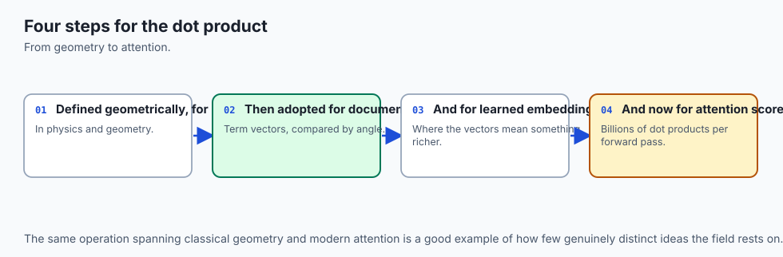

The dot product is younger than it looks, and it arrived as a fragment of something else.

The story starts with **quaternions**. On 16 October 1843, the Irish mathematician **William Rowan Hamilton** worked out how to multiply triples of numbers in a way that behaved, and — the story goes — carved the result into the stone of Brougham Bridge in Dublin as he walked past. His quaternions multiplied to produce a result with two parts: a scalar part and a vector part. Both of the products we now use daily were sitting inside that one operation, tangled together.

**Josiah Willard Gibbs** at Yale and **Oliver Heaviside** in England, working independently in the 1880s, pulled them apart. Gibbs taught the separated operations in his lectures and circulated them privately in *Elements of Vector Analysis*; the textbook that carried them to a general audience, *Vector Analysis* (1901), was assembled by his student **Edwin Bidwell Wilson** from those lecture notes. Heaviside arrived at essentially the same simplification while reformulating Maxwell's equations into the compact form used ever since. The scalar half became the dot product; the vector half became the cross product. The split was fiercely resisted at the time by those who considered quaternions the more elegant object, and the argument was settled by the fact that physicists found the split version easier to use.

The word "orthogonal" is far older, from the Greek *orthogōnios*, right-angled. What is new is the habit of applying it to things that are not spatial at all — to documents, to features, to signals — and meaning by it "these two carry independent information".

Cosine similarity as a way of comparing *documents* belongs to information retrieval rather than to mathematics. **Gerard Salton** and colleagues at Cornell developed the vector space model through the 1960s and 1970s, in and around the SMART retrieval system: represent each document as a vector of term weights, represent the query the same way, and rank by the cosine of the angle between them. That last choice is exactly the argument this lesson opens with. Salton's group needed a measure that did not simply reward long documents for containing more of everything, and the cosine, by dividing out both lengths, was it.

The line from there to now is unusually direct. Change how the vectors are produced — from hand-weighted term counts to the output of a trained model — and the comparison at the centre does not change at all. When a modern retrieval system finds the passage most relevant to a question, it is running Salton's cosine over vectors Salton could not have produced.

One honest note about all of the above: these are the dates and names as recorded in the sources listed with this lesson. Where a source gives a range or an attribution is contested — as the Gibbs and Heaviside priority genuinely is — this lesson says so rather than picking a winner.

## What it is — and what it is not

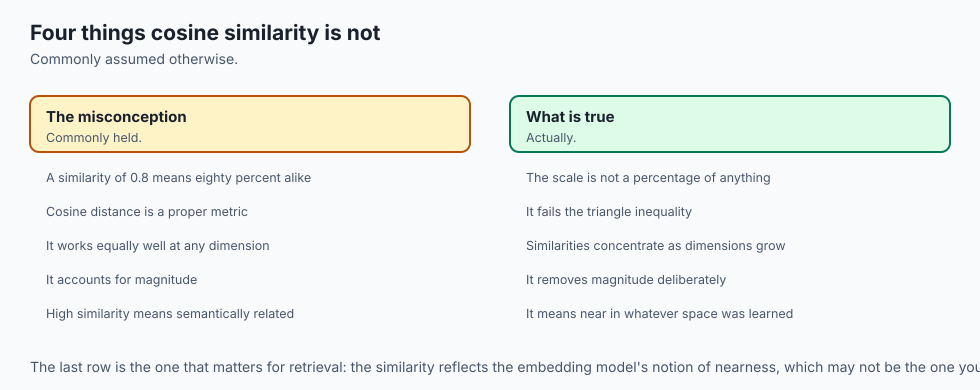

Precision here saves a great deal of confusion later, because four closely related things get called "similarity" in casual conversation.

**The dot product** is a single number obtained by multiplying two vectors component-wise and summing. It is defined for any two vectors of the same length. It is symmetric: `a · b = b · a`. It has no fixed range — it can be any real number, and its size depends on the sizes of both vectors.

**Cosine similarity** is the dot product divided by both lengths. Its range is exactly `[-1, 1]`. It is symmetric. It is undefined when either vector is the zero vector, because the zero vector has no direction. It is unchanged by scaling either vector by a positive number, and its sign flips if you scale by a negative one.

**Cosine distance** is `1 - cosine similarity`. Its range is `[0, 2]`. It is symmetric, non-negative, and zero whenever two vectors point the same way — including when they are not the same vector.

**Euclidean distance** is the length of the difference. Its range is `[0, ∞)`. It is a genuine metric, and it is the measure Day 99 used.

Now the things they are *not*.

**Cosine similarity is not a probability.** A score of 0.9 does not mean "90% likely to be relevant". It is the cosine of an angle, and the mapping from cosine to any notion of relevance is something you have to calibrate on your own data.

**Cosine similarity is not linear in the angle.** The gap between 0.9 and 1.0 is about 25.8 degrees; the gap between 0.0 and 0.1 is about 5.7 degrees. Scores near 1 are far more crowded than scores near 0, which is why "it went from 0.95 to 0.98" is a bigger change than it sounds.

**Cosine distance is not a metric.** This is the one most often glossed over, and this lesson proves it rather than mentioning it. It fails two of the four conditions.

**Cosine similarity is not a measure of relevance.** It measures direction agreement in whatever space your vectors live in. If that space is a good one, direction agreement correlates with relevance. If your embedding model is bad, cosine similarity will faithfully report the direction agreement of bad vectors.

**The dot product is not cosine similarity, except on unit vectors.** On unit vectors they are the same number, because both lengths are 1 and dividing by 1 twice changes nothing. On raw vectors they can rank differently, and today's search section shows a query where they do.

Here is the same information as a table, because the ranges and failure modes are worth having side by side.

| | Dot product | Cosine similarity | Cosine distance | Euclidean distance |
| --- | --- | --- | --- | --- |
| Range | any real number | -1 to 1 | 0 to 2 | 0 upwards |
| Reads magnitude? | yes, strongly | no, by construction | no | yes |
| Symmetric? | yes | yes | yes | yes |
| A metric? | not a distance at all | not a distance at all | **no** | yes |
| Undefined when? | never | either vector is zero | either vector is zero | never |
| Same direction gives | any value | 1 | 0 | any value |
| Perpendicular gives | 0 | 0 | 1 | any value |
| Cheapest to compute | yes | two extra square roots | same as cosine | one square root |

## Why it was created and what problems it solves

Two separate problems, roughly a century apart, and both are worth understanding because they explain why the operation has the shape it has.

**The physics problem: work.** Push a box along the floor. If you push horizontally, all of your effort goes into moving it. If you push down at an angle, only part of your effort does — the rest is pressing the box into the floor. If you push straight down, the box does not move at all and you have done no work on it, however hard you pushed.

That "only part of your effort" is the whole idea. Work is force times distance, but only the *component of the force along the direction of motion* counts. Written down, that is exactly `F · d = |F| |d| cos θ`, and the cosine is doing the job of discounting the effort that pointed the wrong way. This is where the dot product came from and why it is defined the way it is: it is the natural answer to "how much of this vector is pointing along that one".

The projection picture in the diagram above is the same idea drawn. Shine a light straight down onto `a`'s direction, and `b` casts a shadow. The length of the shadow is `(a · b) / |a|`. On the diagram's 3-4-5 example, `b` has length 10 and casts a shadow of length 6 on `a`, because the angle is 53.13 degrees and `10 × cos(53.13°) = 10 × 0.6 = 6`.

Here it is computed:

```
  Shine a light straight down onto a's direction. b casts a shadow.
      length of the shadow = (a dot b) / |a| = 30 / 5 = 6.0000
      the shadow as a vector = [3.6000, 4.8000]
      its length             = 6.0000

  Check it the other way: |b| cos(theta) = 10 * 0.6000 = 6.0000
```

One thing that trips people up: the projection is **not symmetric**, even though the dot product is.

```
  The projection is NOT symmetric. Projecting a onto b instead:
      (b dot a) / |b| = 30 / 10 = 3.0000
  The dot product does not care about order — 30 either
  way — but the shadow does, because you have chosen a different
  surface to cast it on.
```

The dot product is 30 either way. The shadow is 6 one way and 3 the other, because you have chosen a different surface to cast it on. Both facts are consistent, and holding them together is a good test of whether the picture has landed.

**The retrieval problem: length.** Salton's group at Cornell hit exactly the failure this lesson opens with. Represent documents as vectors of term counts and compare them with anything that reads magnitude, and long documents win everything. They contain more of every term, so they are closer to everything, so they surface for every query. The fix is to divide the length out, and dividing the length out of a dot product is cosine similarity.

It is worth being clear that this is a **modelling** decision, not a mathematical improvement. Cosine similarity is not more correct than Euclidean distance. It is correct for a question where length is noise. Choose it for data where length is signal and you will have introduced the mirror-image bug.

## How it works

Five mechanisms, each with real numbers. Take them in order; each one uses the previous.

### 1. The dot product, two ways, agreeing

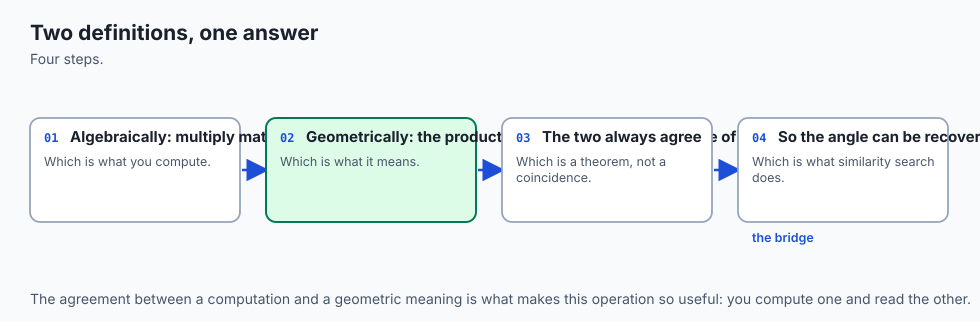

```
  a = [3, 4]   |a| = 5.0000   (a 3-4-5 triangle, so exactly 5)
  b = [10, 0]   |b| = 10.0000

  Algebraic: multiply component by component, then add.
      3*10 + 4*0 = 30 + 0 = 30

  Geometric: |a| |b| cos(theta).
      theta = 53.1301 degrees, cos(theta) = 0.6000
      5 * 10 * 0.6000 = 30.0000
```

Same number, reached two ways. The algebraic route is what a computer runs; the geometric route is what it means. Every claim in this lesson depends on those two being the same number, so it is asserted in the lab rather than assumed.

There is a special case worth pocketing. Dot a vector with **itself** and the angle is zero, so the cosine is 1, and you get `|a| |a| = |a|²`. So:

> **|a| = sqrt(a · a)**

A vector's length is the square root of the vector dotted with itself. Day 99 built the L2 norm from Pythagoras. It turns out to be a special case of today's operation, which is the first hint that the dot product is the more fundamental of the two.

### 2. The sign, read as an angle

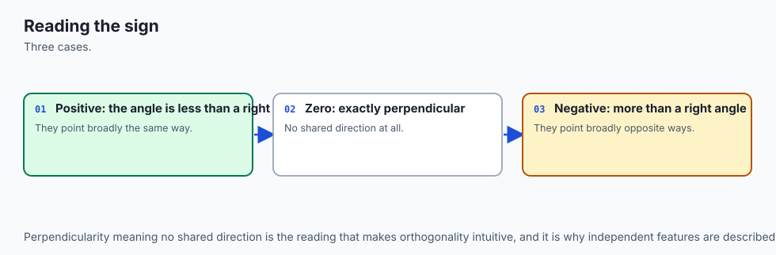

The two lengths in `|a| |b| cos θ` are never negative. So the **sign** of the dot product is the sign of the cosine, and the sign of the cosine tells you which side of 90 degrees the angle is on. Five worked cases, `a` held fixed so only `b`'s direction changes:

```
  case                         a         b     a.b       cos     angle       sign
  -------------------------------------------------------------------------------
  same direction          [3, 0]    [6, 0]      18    1.0000      0.00   positive
  45 degrees apart        [3, 0]    [1, 1]       3    0.7071     45.00   positive
  perpendicular           [3, 0]    [0, 5]       0    0.0000     90.00       zero
  135 degrees apart       [3, 0]   [-2, 2]      -6   -0.7071    135.00   negative
  opposite direction      [3, 0]   [-6, 0]     -18   -1.0000    180.00   negative
```

Read the middle columns together and the rule falls out:

```
    dot > 0  <->  cos > 0  <->  angle under 90 degrees   (agreeing)
    dot = 0  <->  cos = 0  <->  angle exactly 90 degrees (unrelated)
    dot < 0  <->  cos < 0  <->  angle over 90 degrees    (opposing)
```

This is genuinely useful and not just tidy. If all you need is the **direction** of a relationship — do these agree or disagree — the raw dot product answers it and you can skip both square roots entirely.

### 3. Cosine similarity, and why it is magnitude-free

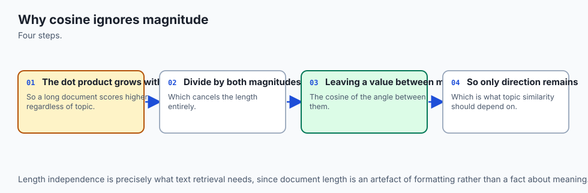

```
  Why it is exactly 1 rather than nearly 1: cosine similarity
  divides by both lengths, so scaling either vector by a positive
  number multiplies the top and the bottom by the same factor and
  cancels. Here is that cancellation with the real numbers:

      dot = 9*18 + 0*0 + 1*2 + 0*0 = 164
      |v|  = 9.055385
      |2v| = 18.110770  (exactly twice 9.055385)
      164 / (9.055385 * 18.110770) = 1.0000000000
```

There is a second route to the same number, and it is the one that matters in practice.

```
  divide the dot product by both lengths : 0.551433013749212
  dot product of the two UNIT vectors    : 0.551433013749212
  the same, through numpy.dot            : 0.551433013749212
```

**Cosine similarity is the plain dot product of the two unit vectors.** Normalise every vector once, when you store it, and every later comparison is a bare dot product with no square roots left in it at all. That is what a vector index does, and it is why systems that store embeddings offer "cosine" and "dot product" as separate options: on already-normalised vectors they are the same thing, and the dot product is cheaper.

The range runs from 1 to -1, and each end means something:

- **1** — identical direction. The two vectors are positive multiples of each other.
- **0** — orthogonal. Unrelated, not opposed.
- **-1** — exactly opposite directions.

On count vectors, where nothing is ever negative, no pair can be more than 90 degrees apart, so the negative half of the range is unreachable and "orthogonal" is as far apart as two documents get. Embeddings from a trained model *do* have negative components, and there the lower half is reachable.

### 4. Cosine distance, and the honest part

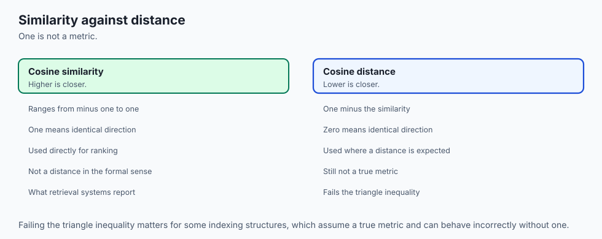

`cosine_distance(a, b) = 1 - cosine_similarity(a, b)`. Zero for the same direction, 1 for perpendicular, 2 for opposite.

It is called a distance and it is not a metric. A metric must satisfy four conditions:

1. `d(a, b) ≥ 0` — never negative.
2. `d(a, b) = 0` exactly when `a = b`.
3. `d(a, b) = d(b, a)` — symmetric.
4. `d(a, c) ≤ d(a, b) + d(b, c)` — the triangle inequality.

Cosine distance satisfies 1 and 3, half of 2, and fails 4. Here is the failure, on three two-dimensional vectors chosen so every number is exact:

```
  a = [1, 0]   pointing straight along the first axis
  b = [1, 1]   the bisector, 45 degrees from each
  c = [0, 1]   pointing straight along the second axis

  d(a, b) = 1 - cos = 1 - 0.707107 = 0.292893   (angle 45.0 degrees)
  d(b, c) = 1 - cos = 1 - 0.707107 = 0.292893   (angle 45.0 degrees)
  d(a, c) = 1 - cos = 1 - 0.000000 = 1.000000   (angle 90.0 degrees)

  going the long way round : d(a, b) + d(b, c) = 0.292893 + 0.292893 = 0.585786
  going direct             : d(a, c)            = 1.000000
  is direct <= long way?   : False
```

The detour is cheaper than the direct route. That is what the triangle inequality forbids, and one counter-example is a complete proof of the negative.

It also fails the second half of condition 2, and that failure is the reason you wanted the measure in the first place:

```
  d([9, 0, 1, 0], [18, 0, 2, 0]) = 0.000000
  are the two vectors equal? False
```

Distance zero between two vectors that are not equal. As a metric that disqualifies it. As a similarity measure for text it is exactly the behaviour you asked for: "same direction" and "same vector" are different claims, and for documents you want the first one.

One thing worth knowing and worth *not* overclaiming: the **angle** itself, unlike `1 - cos`, is known to satisfy the triangle inequality — it is arc length on the unit sphere, and great-circle distance on a sphere is a metric. On the failing triple above the angles are 45, 45 and 90 degrees, and `45 + 45 = 90` holds with equality, because `b` sits exactly halfway along the path from `a` to `c`. That is one triple, and one triple is not a proof. The lab checks it and says so plainly.

### 5. On the unit sphere, both measures rank identically

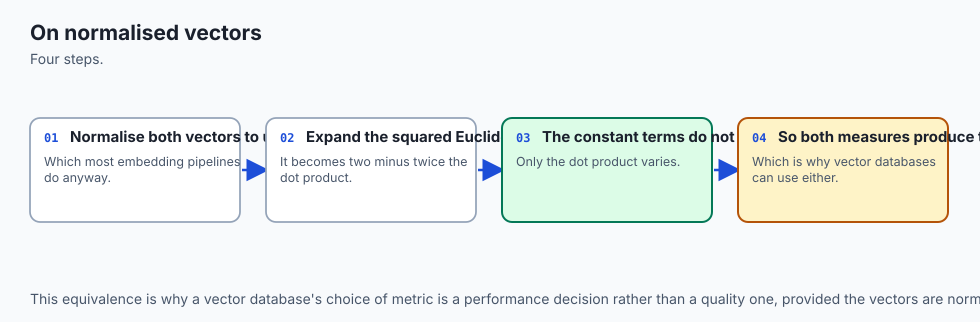

This is the most useful fact in the day. For two **unit** vectors `u` and `v`:

```
    |u - v|^2 = (u - v) dot (u - v)
              = u dot u  -  2 (u dot v)  +  v dot v
              = 1 - 2 (u dot v) + 1
              = 2 - 2 cos(theta)
```

so `|u - v| = sqrt(2 - 2 cos θ)`. As the cosine rises the bracket falls and so does the square root. The distance is a strictly decreasing function of the similarity, so **sorting by one is exactly the reverse of sorting by the other**. Not approximately. Exactly.

Sampled, so you can see there are no flat stretches:

```
      cosine   distance on the unit sphere     angle
  ------------------------------------------------
         1.0                      0.000000       0.0
         0.9                      0.447214      25.8
         0.5                      1.000000      60.0
         0.0                      1.414214      90.0
        -0.5                      1.732051     120.0
        -0.9                      1.949359     154.2
        -1.0                      2.000000     180.0
```

And measured, on the actual catalogue after normalising:

```
  rank  by cosine (high first)           sim   by distance (low first)         dist
  ---------------------------------------------------------------------------------
  1     roast-chicken               1.000000   roast-chicken               0.000000
  2     slow-cooker-stew            0.990992   slow-cooker-stew            0.134220
  3     race-day-nutrition          0.551433   race-day-nutrition          0.947172
  4     household-budget            0.219512   household-budget            1.249390
  5     marathon-plan               0.011908   marathon-plan               1.405768
  6     storm-bulletin              0.000000   storm-bulletin              1.414214

  the two orders are identical : True
```

This is why a vector database normalises on the way in and then uses whichever comparison its hardware runs fastest: on the unit sphere the choice is a performance decision, not a semantic one.

Two things it does **not** say. First, the scores are not the same, and a threshold tuned for one is meaningless for the other: "similarity above 0.9" is "distance below 0.447214", and nothing about the second number is guessable from the first. Second, the guarantee is about **normalised** vectors only. On raw ones the two disagree, which is the entire opening of this lesson:

```
    by cosine   : roast-chicken, roast-chicken (2x), slow-cooker-stew, race-day-nutrition, household-budget, marathon-plan, storm-bulletin
    by distance : roast-chicken, slow-cooker-stew, race-day-nutrition, roast-chicken (2x), household-budget, storm-bulletin, marathon-plan
    identical?  : False
```


## An everyday analogy

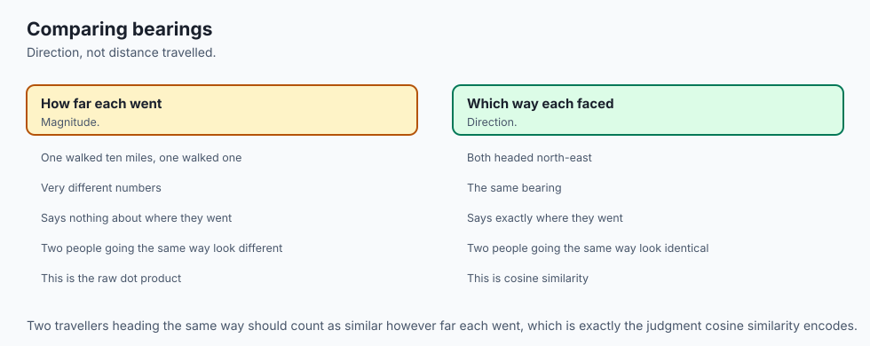

Two people leave the same street corner and start walking. That is the analogy, and it holds all the way through the day without leaking, which is why it is the one being used rather than a scatter of similes.

**Distance is "how far apart are they now".** It depends on how far each of them has walked. A fast walker heading the same way as a slow walker ends up a long way from them, even though they are going to the same place.

**The angle is "are they heading the same way".** It does not depend on how far either of them walked. A fast walker and a slow walker on the same street have an angle of zero between them, whatever the distance.

Now push it, because the value of an analogy is in how far it survives.

**Doubling the article is walking twice as far in the same direction.** Same street, further along. The angle to the original is zero and the distance is exactly however far the original walked — which is the observation that `|2v - v| = |v|`.

**Normalising is asking everyone to walk exactly one block and then stop.** Once everyone has walked the same distance, "how far apart" and "which way are you heading" become the same question, and that is precisely the theorem in section 5: on the unit sphere the two measures rank identically.

**Orthogonal is one person going north and one going east.** Not opposed — opposed would be north and south. Just entirely unrelated. Knowing how far the north-walker went tells you nothing whatever about the east-walker.

**The sign of the dot product is whether you are broadly agreeing.** Positive: you are heading in roughly compatible directions, less than a right angle apart. Zero: perpendicular. Negative: you are heading away from each other, more than a right angle apart.

**The triangle inequality failure is where the analogy breaks — and its breaking is instructive.** For real streets, going via a friend's house is never shorter than going direct. That is what makes physical distance a metric. Cosine distance is not measuring streets; it is measuring angles and then bending them through `1 - cos`, and that bend is what breaks the guarantee. Going from north to north-east to east costs `0.292893 + 0.292893 = 0.585786` in cosine distance, while going north to east directly costs `1.0`. In street terms that is nonsense, which is exactly why you should not hand cosine distance to a piece of software that thinks it is measuring streets.

**And the curse of dimensionality is what happens when the street corner has 8192 streets radiating from it.** Two people picking directions at random are almost certain to pick nearly perpendicular ones, simply because there is so much room. In two dimensions, picking similar directions by accident happens all the time. In 8192, essentially never.

## Examples in practice

### Building it from scratch, and checking it

The three functions the whole day rests on, in pure Python:

```python
def dot(a, b):
    return float(sum(x * y for x, y in zip(a, b)))

def l2_norm(a):
    return math.sqrt(dot(a, a))

def cosine_similarity(a, b):
    na, nb = l2_norm(a), l2_norm(b)
    if na == 0.0 or nb == 0.0:
        raise ValueError("the zero vector has no direction")
    return max(-1.0, min(1.0, dot(a, b) / (na * nb)))

def cosine_distance(a, b):
    return 1.0 - cosine_similarity(a, b)
```

Checked against NumPy on every pair in the catalogue:

```
  pair                                         dot        mine       numpy    difference
  --------------------------------------------------------------------------------------
  roast-chicken / slow-cooker-stew              74    0.990992    0.990992      0.00e+00
  roast-chicken / marathon-plan                  1    0.011908    0.011908      0.00e+00
  roast-chicken / race-day-nutrition            39    0.551433    0.551433      0.00e+00
  roast-chicken / household-budget              18    0.219512    0.219512      0.00e+00
  roast-chicken / storm-bulletin                 0    0.000000    0.000000      0.00e+00
  slow-cooker-stew / marathon-plan               2    0.026153    0.026153      0.00e+00
  slow-cooker-stew / race-day-nutrition         38    0.590017    0.590017      0.00e+00
  slow-cooker-stew / household-budget           26    0.348187    0.348187      0.00e+00
  slow-cooker-stew / storm-bulletin              0    0.000000    0.000000      0.00e+00
  marathon-plan / race-day-nutrition            57    0.786975    0.786975      0.00e+00
  marathon-plan / household-budget               9    0.107173    0.107173      0.00e+00
  marathon-plan / storm-bulletin                27    0.321520    0.321520      0.00e+00
  race-day-nutrition / household-budget         31    0.438319    0.438319      0.00e+00
  race-day-nutrition / storm-bulletin            6    0.084836    0.084836      0.00e+00
  household-budget / storm-bulletin              0    0.000000    0.000000      0.00e+00

  15 pairs, largest disagreement 0.00e+00, tolerance 1e-12
```

Zero disagreement, and that deserves a caveat rather than a celebration: the two implementations happen to add the products in the same order here, so they land on identical bits. Nothing guarantees that in general. NumPy is free to reorder a summation for speed, and floating-point addition is not associative (Day 70). **Compare with a tolerance, always.**

Notice the three zeroes in that table. `storm-bulletin` is orthogonal to three of the other five articles, and it is not a coincidence:

```
  roast-chicken . storm-bulletin = 0
      9*0 + 0*1 + 1*0 + 0*9 = 0
      cosine similarity 0.0000, angle 90.00 degrees
```

Every single product in the sum is zero, because wherever one article has a count the other has none. They share no vocabulary at all. That is what orthogonal means in a feature space: not opposed, entirely unrelated.

### The clamp, which is not defensive decoration

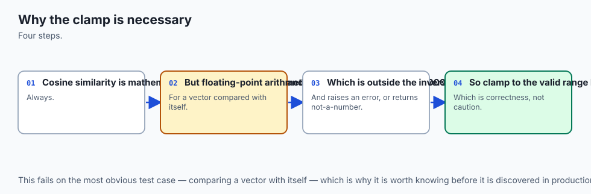

This one was found by the reference test suite failing while this lab was being written, which is the best kind of finding. The test asserted that a vector compared with itself gives exactly 1.0. It does not:

```
     article                    unclamped (a dot a) / (|a| |a|)
     ---------------------------------------------------------
     roast-chicken                           0.9999999999999998
     slow-cooker-stew                                       1.0
     marathon-plan                                          1.0
     race-day-nutrition                      1.0000000000000002
     household-budget                        0.9999999999999998
     storm-bulletin                          0.9999999999999998

     exactly 1.0 : 2 of 6
     just under  : 3 of 6
     just over   : 1 of 6
```

Three of six miss. One overshoots — and the overshoot is fatal downstream:

```
       math.acos(1.0000000000000002) -> ValueError: expected a number in range from -1 up to 1, got 1.0000000000000002
```

Six four-component vectors of small integers were enough to produce this. It is not an exotic case you will meet once. One line fixes the entire class of failure:

```python
return max(-1.0, min(1.0, value))
```

The general lesson is bigger than the fix. One unit in the last place of rounding is harmless as a similarity score and fatal as an input to `acos`. Whenever a value flows from a domain where small errors do not matter into one where they do, that boundary needs a guard.

### The semantic search

The retrieval step of a document-answering system, complete:

```python
def search(query, catalogue, k=3):
    scored = [(label, cosine_similarity(query, v)) for label, v in catalogue.items()]
    scored.sort(key=lambda pair: (-pair[1], pair[0]))
    return scored[:k]
```

Four lines. Run against the six articles:

```
  "roast it"
      1. roast-chicken         0.9939
      2. slow-cooker-stew      0.9701
      3. race-day-nutrition    0.5121

  "training for a race and what to eat"
      1. race-day-nutrition    0.9035
      2. marathon-plan         0.9011
      3. roast-chicken         0.3691
```

The first query is `[1, 0, 0, 0]` — a one-line note that says "roast it". It retrieves the article most purely about cooking. Day 99 asked the same question with raw Euclidean distance and got `slow-cooker-stew`, because a query vector that short sits near the origin and raw distance from the origin is dominated by how long each article is.

The second query is worth dwelling on because the answer is **close**, and reporting the closeness honestly is more useful than pretending it was obvious:

```
  top result : race-day-nutrition at 0.903482
  runner-up  : marathon-plan at 0.901082
  margin     : 0.002400
```

A margin of 0.0024. `race-day-nutrition` wins because the query mentions eating as well as racing, and it is the only article covering both — but a slightly different query, or slightly different counts, would flip it. That is what a real ranking looks like most of the time, and a system that presents the top hit as *the* answer rather than as the best of several near-ties is over-claiming.

That second query also separates the dot product from cosine similarity:

```
  And by the RAW dot product, with no division at all:
    marathon-plan, race-day-nutrition, slow-cooker-stew, roast-chicken, storm-bulletin, household-budget
    highest dot product: marathon-plan at 45
    also NOT the cosine winner. The dot product rewards long
    articles, because a longer vector has more of everything to
    multiply. Dot product and cosine are the same ranking only
    after the vectors are normalised.
```

`marathon-plan` scores 45 on the raw dot product against `race-day-nutrition`'s 38, and loses on cosine. Three measures, three different first places on the same query and the same data. Which one is right depends entirely on which question you meant.

Finally, the property that makes cosine the right tool for a query at all:

```
  query                    roast-chicken    slow-cooker-stew
  ----------------------------------------------------------
  [1, 0, 0, 0]              0.9938837347        0.9701425001
  [3, 0, 0, 0]              0.9938837347        0.9701425001
  [100, 0, 0, 0]            0.9938837347        0.9701425001
```

A one-word query and the same word repeated a hundred times rank the catalogue identically to ten decimal places, because the only thing cosine reads is the direction.

### The curse of dimensionality, measured

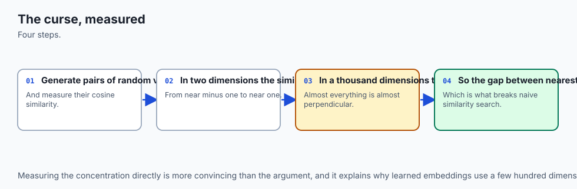

Real embeddings have hundreds or thousands of components. Something happens in that space with no analogue in two or three dimensions, and it is better measured than described. With a seeded generator — `numpy.random.default_rng(103)`, 2000 pairs per dimension:

```
   dimension   mean |cos|     exact  sqrt(2/(pi d))   max |cos|   mean angle  sd of angle  within 10 deg
  ------------------------------------------------------------------------------------------------------
           2       0.6435    0.6366          0.5642      1.0000        88.65        52.23          11.1%
           3       0.5015    0.5000          0.4607      0.9997        90.20        39.07          16.9%
           8       0.2891    0.2910          0.2821      0.9107        89.73        21.55          36.0%
          32       0.1400    0.1422          0.1410      0.5664        90.41        10.10          67.1%
         128       0.0712    0.0707          0.0705      0.3214        89.98         5.09          95.1%
         512       0.0351    0.0353          0.0353      0.1625        90.04         2.52         100.0%
        2048       0.0179    0.0176          0.0176      0.0856        90.00         1.29         100.0%
        8192       0.0089    0.0088          0.0088      0.0394        90.00         0.64         100.0%
```

Mean absolute cosine fell by a factor of 72 from dimension 2 to dimension 8192, and by 512 dimensions **every single sampled pair** was within 10 degrees of a right angle.

The two prediction columns carry a lesson of their own. The commonly quoted formula is `sqrt(2 / (π d))`, and at dimension 2 it says 0.5642 while the measurement says 0.6435 — a 14% gap. The measurement is right and the formula is being misapplied: `sqrt(2 / (π d))` is a **large-`d` limit**. The exact mean of `|cos|` for two independent random directions in `d` dimensions is `Γ(d/2) / (√π · Γ((d+1)/2))`, and two of its values can be checked by hand. In two dimensions the angle is uniform around the circle, so the mean of `|cos|` is `2/π = 0.63662`. In three dimensions the cosine itself is uniform from -1 to 1, so the mean is exactly `0.5`. The exact column gives both. The approximation gives neither. The measurement agrees with the exact column to within 1.5% at every dimension tested.

That is a small point, and the habit behind it is not: when a run and a quoted formula disagree, find out which one is answering your question before assuming the run is wrong.

The second half of the curse is that distances bunch up:

```
   dimension     nearest    furthest     ratio   spread / mean
  ------------------------------------------------------------
           2      0.0588      3.7420   63.6828          0.5163
           3      0.1907      3.9152   20.5335          0.4063
           8      1.5292      6.4500    4.2180          0.2248
          32      5.6248     11.3036    2.0096          0.1093
         128     12.8950     17.9126    1.3891          0.0567
         512     28.9518     34.3982    1.1881          0.0274
        2048     62.1604     67.4723    1.0855          0.0133
        8192    124.1068    130.1466    1.0487          0.0073
```

In two dimensions the furthest of 500 random points is 63.7 times as far as the nearest. In 8192 dimensions it is 1.05 times as far. "Nearest neighbour" still has an answer; the answer just stops being meaningfully nearer than everything else, and small errors in the vectors start deciding the winner.

## Implications: security, privacy, performance, scalability, and cost

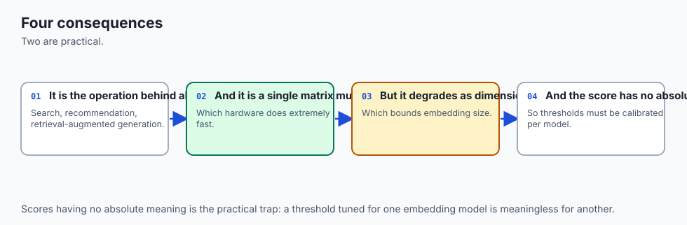

**Performance.** The single most valuable optimisation in this whole area is one line of setup: normalise every vector once, when you store it. After that, cosine similarity is a bare dot product — no square roots, no divisions, one multiply-and-add per dimension. That is a pattern hardware is extremely good at, and it is why vector stores offer "dot product" and "cosine" as separate configuration options. On normalised vectors they are the same ranking, and the dot product is the cheaper one.

The second point is a corollary of section 5's theorem. On the unit sphere, Euclidean distance and cosine similarity rank identically, so you may choose freely between them on speed alone — but only after normalising. Choose freely *before* normalising and you have chosen a different set of answers.

**Scalability.** Comparing a query against six articles exhaustively takes six dot products. Against six million, it takes six million — and against six million 1536-component vectors, that is roughly nine billion multiply-adds per query, which is not a thing you do on every request. This is where approximate nearest-neighbour indexes come in, and the last section explains why "approximate" is a much better trade than it sounds: in high dimensions the nearest point is barely nearer than the tenth nearest, so an index that is usually right costs you very little accuracy for an enormous amount of speed.

It is also where the metric question stops being academic. Pruning indexes rely on the triangle inequality to discard whole regions. Cosine distance fails it. The fix is not to abandon cosine — it is to normalise and hand the index Euclidean distance, which *is* a metric, knowing the ranking is unchanged.

**Cost.** Two costs, and they scale differently. Storage is dimension times items times bytes per number: a million 1536-dimensional vectors in 32-bit floats is about 6 GB, and the same in 8-bit quantised form is about 1.5 GB. Compute is dimension times items per query. Both scale linearly in the dimension, which is why the dimension of your embedding is one of the more consequential numbers in a system's design and is worth knowing before you commit to a model.

**Privacy.** This is the part that gets skipped and should not. An embedding is a fingerprint of the text it came from. A vector derived from a person's writing is derived from a person's writing, and similarity search over a store of such vectors can link documents back to their author whether or not a name was ever recorded. Research has repeatedly shown that meaningful information can be recovered from embeddings; treat an embedding store with the care you would give the documents it was made from, not as though it were anonymised because it looks like numbers.

**Security.** Similarity search leaks by design — its entire purpose is to answer "what else is like this", which is exactly the query an attacker with index access would want to run. If some documents in a store are more sensitive than others, the access control has to live at the retrieval step, not only at the document store. A search that returns a snippet has published the snippet, regardless of what the document-level permissions said.

There is also a correctness failure with a security flavour, and it is the reason the lab raises on the zero vector. An empty document, a failed text extraction or a truncated file all produce a zero vector in a real pipeline. Let it through and you get a `NaN`, which sorts unpredictably and spreads through every average it touches, producing a ranking that is quietly wrong with nothing in the logs. Failing loudly at the bad input is much cheaper than discovering the bad output three systems downstream.

## Alternatives: free, open source, and commercial

**NumPy — used here, and the one to reach for.** Free, BSD 3-Clause, no account needed. Version 2.5.2 was installed and everything in this lesson was run against it. Choose it when you have more than a handful of vectors and want the arithmetic to be both fast and correct. Cosine similarity in one line:

```python
float(a @ b / (np.linalg.norm(a) * np.linalg.norm(b)))
```

and for a whole catalogue at once, normalise the matrix by row and take one matrix product — which is Day 101's operation doing a day's work in one call. NumPy is what the lab checks the from-scratch implementation against, and the checks all passed to within `1e-12`.

**Pure Python — used here, and worth writing once.** Free, no dependency at all. Choose it exactly once: to write the fifteen lines yourself so you know what the library is doing. Then stop. It is roughly two orders of magnitude slower than NumPy on any real catalogue, and the lesson does not pretend otherwise. Its value is pedagogical and it is real.

**`scipy.spatial.distance` — described, NOT installed, no output reproduced here.** SciPy is free and BSD-licensed. Its documentation describes `cosine(u, v)`, which returns the cosine *distance* rather than the similarity, alongside `euclidean` and roughly twenty other distance functions, plus `cdist` and `pdist` for all-pairs computations. It is what you would reach for in real work rather than writing your own. It was **not installed in this lab and nothing from it was executed**, so no numbers from it appear anywhere in this lesson. Note the one thing that trips people up when they move to it: `scipy.spatial.distance.cosine` returns `1 - similarity`, so a value near 0 means *very similar*. Getting that backwards silently inverts a ranking.

**scikit-learn's `cosine_similarity` — described, not installed.** Free, BSD-licensed. Its documentation describes a function computing the full pairwise similarity matrix for two sets of vectors, which is the shape you usually want when scoring a batch of queries against a whole catalogue. Not run here; no output reproduced.

**The similarity options a vector store exposes.** Systems that store embeddings and search them generally let you configure which comparison the index uses, and the options you will meet are the three this lesson has covered: **cosine**, **dot product** and **Euclidean distance**. That configuration choice is the whole of today's lesson turned into a dropdown, and you now have what you need to make it:

- if your vectors are normalised, cosine and dot product are the same ranking and dot product is cheaper;
- if your vectors are normalised, Euclidean gives that same ranking too, and unlike cosine distance it is a genuine metric, which matters for anything that prunes;
- if your vectors are **not** normalised, the three give different answers and you must choose deliberately.

This course has not reached any specific vector database, so no product names, versions, prices or tier limits appear here. When you meet one, that dropdown is the thing to look for first.

**Databases with vector support.** Several general-purpose databases now offer vector columns and similarity operators, which is the option to consider when your vectors need to sit beside relational data you are already storing rather than in a separate system. Not exercised here; mentioned so you know the category exists.

Summarised:

| Option | Cost | Run here? | Choose it when |
| --- | --- | --- | --- |
| Pure Python | free | **yes** | once, to understand what the library does |
| NumPy 2.5.2 | free | **yes** | any real catalogue; the default answer |
| `scipy.spatial.distance` | free | no — described only | you want a tested library of distance functions |
| scikit-learn `cosine_similarity` | free | no — described only | you want a full pairwise matrix in one call |
| A vector store's index | varies | no — described only | millions of vectors and a latency budget |
| Vector support in a general database | varies | no — described only | the vectors belong beside relational data |

## Comparison with related concepts

**Cosine similarity against Pearson correlation.** These are closer than they look: Pearson correlation is cosine similarity computed after subtracting the mean from each vector. If your vectors are already mean-centred, the two are the same number. The practical difference is what "zero" means — cosine's zero is orthogonality, correlation's zero is no linear relationship about the mean. For non-negative count vectors, where nothing can be below zero, the centring matters a great deal.

**Cosine similarity against Jaccard similarity.** Jaccard works on *sets*: the size of the intersection over the size of the union. It ignores counts entirely — a word appearing once and a word appearing fifty times are the same to it. Choose Jaccard when presence is what matters and frequency is noise; choose cosine when the counts carry information.

**Cosine similarity against edit distance.** Edit distance counts the operations needed to turn one string into another, so it is about *spelling*, not meaning. "Cat" and "cot" are one edit apart and unrelated in meaning; "car" and "automobile" are far apart by edits and near-synonyms. They answer entirely different questions and are not substitutes.

**Dot product against matrix multiplication.** Day 101 built matrix multiplication out of dot products, and this is the same fact seen from the other side: every entry of a matrix product is one dot product of a row with a column. So scoring a whole catalogue against a query is one matrix-vector product, and scoring a batch of queries against a whole catalogue is one matrix-matrix product. Today's operation is the atom Day 101's operation is built from.

**Cosine similarity against the L1 norm.** Day 99 introduced both the L2 and L1 norms. Cosine similarity is built on L2 throughout — the lengths it divides by are L2 norms — and normalising by the L1 norm instead gives a different object with different behaviour. If you see "normalise" in someone's code, it is worth checking which norm they meant.

**Similarity against relevance.** The most important distinction in the list, and the one least often made. Cosine similarity measures direction agreement in whatever space your vectors live in. Relevance is what a human wants. The two correlate when the embedding is good, and the measure will faithfully report the direction agreement of bad vectors without any hint that they are bad. Never treat a high similarity score as evidence that the retrieval was right — evaluate against what people actually wanted.

| Concept | What it measures | Ignores | Use when |
| --- | --- | --- | --- |
| Cosine similarity | angle between vectors | both magnitudes | direction is meaning: text, embeddings |
| Euclidean distance | straight-line gap | nothing | magnitude is meaning: positions, sizes |
| Dot product | angle scaled by both lengths | nothing | vectors are normalised, or only the sign matters |
| Pearson correlation | angle after mean-centring | means and both magnitudes | you care about variation about a mean |
| Jaccard similarity | set overlap | all counts | presence matters, frequency does not |
| Edit distance | operations between strings | meaning entirely | comparing spellings, not subjects |

## When to use it — and when not to

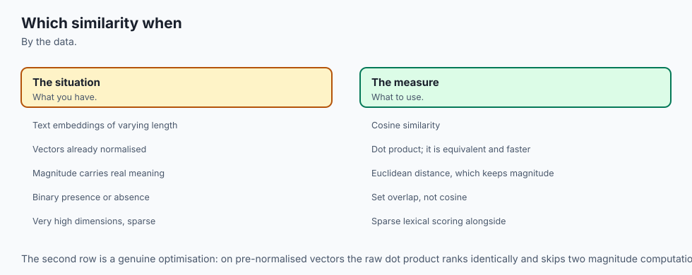

**Use cosine similarity when length is an accident of production.** Documents, chunks, embeddings, user-behaviour profiles — anywhere the size of a vector reflects how much data you happened to collect rather than the nature of what you collected. A long article is not a different subject from a short one.

**Use cosine similarity when you compare across items of very different sizes.** A one-line query against a three-thousand-word document has no business being compared by magnitude; the two vectors have wildly different lengths and only one of them is about anything.

**Use the raw dot product when your vectors are already normalised** — the same ranking, cheaper — **or when you only need the sign.** "Do these agree or disagree" is answered by the sign alone, with no square roots at all.

**Use Euclidean distance when magnitude is part of what you mean.** This is not a fallback; it is the right answer for a large class of data:

- **Physical positions.** Two cities in the same compass direction from you are not "the same place". Normalising coordinates throws away the only thing you cared about.
- **Sensor readings where size is signal.** A temperature of 20 degrees and one of 200 point in the same direction and are not remotely the same situation.
- **Counts whose size you care about.** A warehouse holding 10 of each item and one holding 1000 of each have identical direction and very different logistics.
- **Anything you intend to feed to a clustering algorithm that assumes a metric.** K-means, for instance, is built around Euclidean distance and mean positions, and handing it cosine distance is not a supported substitution — normalise first and let it use Euclidean.

**Use Euclidean distance when you need a genuine metric.** Pruning indexes, metric trees, and any proof that relies on the triangle inequality all need one, and cosine distance is not it. The route through is: normalise, then use Euclidean, and take section 5's theorem as your guarantee that the ranking is unchanged.

**Do not use cosine similarity on data with a meaningful zero and unbounded scale** without thinking hard first. If one feature is measured in millions and another in units, the large one dominates the direction and the small one might as well not exist. That is a scaling problem, and it is fixed before the similarity, not by it.

**Do not compare cosine scores between different embedding models,** or between spaces of different dimension. Section 7's measurement is the reason: what counts as a high score depends on the dimension of the space and on how the model distributes its vectors within it.

**Do not treat a score as a probability, and do not port a threshold.** Calibrate on your own data. Score a few hundred pairs you know to be unrelated, look at where they land, and set the cut-off from that rather than from a number in someone else's configuration file.

**Do not hand a zero vector to any of this.** It has no direction. Raise at the point of the bad input.

## The AI connection

- **Cosine similarity is the operation behind every retrieval system**, from search to RAG to
  recommendation.
- **It measures direction and ignores magnitude**, which is exactly right when documents
  differ in length.
- **The dot product on normalised vectors is cosine similarity**, so the two are the same
  computation seen differently.
- **The curse of dimensionality is measurable here**, and it explains why embeddings are a
  few hundred dimensions rather than thousands.
- **Attention scores are dot products**, so this single operation runs billions of times in
  every model forward pass.

## Knowledge check

Eight questions accompany this lesson in `quiz.yml`, including one on why cosine similarity ignores magnitude and one on when Euclidean distance is the right choice. Before you take them, try these six on your own — every one is answerable from what is above, without a calculator.

1. An article's vector is `v`. It is rewritten at three times the length, giving `3v`. What is the Euclidean distance between them, in terms of `|v|`? What is the cosine similarity?
2. Two vectors have a dot product of `-6`. What do you know about the angle? What do you *not* know?
3. Why is the cosine similarity of an article with its doubled copy exactly `1.0` rather than approximately `1.0`?
4. You normalise every vector in a catalogue and then rank it against a query twice, once by cosine descending and once by Euclidean ascending. What do you get, and what do you *not* get?
5. Cosine distances: `d(a, b) = 0.29`, `d(b, c) = 0.29`, `d(a, c) = 1.0`. Which condition of a metric has just failed, and what practical machinery does that break?
6. Mean absolute cosine between random vectors is 0.64 at dimension 2 and 0.009 at dimension 8192. You are told a retrieval scored 0.3. What do you need to know before you can say whether that is good?

Answers, in one line each. (1) `2|v|`, and exactly 1.0. (2) It is more than 90 degrees; you do not know how much more, because the size depends on both lengths. (3) The scaling factor appears in the numerator and the denominator and cancels exactly. (4) The same order; **not** the same scores, so a threshold does not port. (5) The triangle inequality; it breaks pruning indexes, which discard branches by assuming it. (6) The dimension of the space — 0.3 is unremarkable in 2 dimensions and a strong signal in 1000.

## Hands-on exercise

The lab is `labs/sections/math-statistics-and-data/day-103-dot-products-and-similarity/` — "Which Question Are You Asking?".

From the lab directory:

```bash
python3 -m venv .venv
.venv/bin/pip install -r requirements/requirements.txt
.venv/bin/pytest starter -q
```

You write seven functions in `starter/similarity.py` — `dot`, `l2_norm`, `normalise`, `euclidean_distance`, `cosine_similarity`, `cosine_distance` and `rank_by_cosine` — and make twenty-four predictions in `starter/answers.py` before running anything. Three of the functions have a trap with a test of its own: two must refuse the zero vector, one must clamp its result into `[-1, 1]`, and one must break ties deterministically.

Then read the seven demonstration scripts in `examples/`, in order, from inside that directory:

```bash
cd examples
../.venv/bin/python3 01_the_length_confound.py
../.venv/bin/python3 02_dot_product_and_sign.py
../.venv/bin/python3 03_from_scratch_vs_numpy.py
../.venv/bin/python3 04_same_ranking_on_the_sphere.py
../.venv/bin/python3 05_not_a_metric.py
../.venv/bin/python3 06_semantic_search.py
../.venv/bin/python3 07_curse_of_dimensionality.py
cd ..
```

### Expected output

`pytest starter -q` on an untouched checkout:

```
1 passed, 51 skipped
```

Everything unwritten is skipped, not failed — a running score rather than a wall of red. When you have finished, it reports `52 passed`.

The reference suite:

```
76 passed
```

Each demonstration script ends with its own name and `: every assertion held.` and exits 0. And the harness:

```bash
bash tests/run_tests.sh; echo "exit=$?"
```

```
49 checks, 0 failure(s).
exit=0
```

Section 6 of that run is worth watching: it re-runs the entire harness with one expectation deliberately inverted and asserts that the re-run exits non-zero and reports exactly one failure. A green suite proves nothing until you have watched it go red.

### Validate your work

1. `.venv/bin/python3 -c "import numpy; print(numpy.__version__)"` prints `2.5.2`.
2. `.venv/bin/pytest examples -q` reports `76 passed`.
3. `.venv/bin/pytest starter -q` reports `52 passed` when you have finished.
4. Each of the seven scripts exits 0 with its assertion line.
5. `bash tests/run_tests.sh` ends `49 checks, 0 failure(s).` and exits 0. Check the exit status directly rather than through a pipeline, which reports the status of the last command in the pipe rather than the harness's own.
6. Your own predictions agree with your own implementation — several tests check exactly that, so a lucky guess with broken code still fails.

### Troubleshooting

**`ValueError: math domain error` from `math.acos`**, or on Python 3.14 the fuller `expected a number in range from -1 up to 1, got 1.0000000000000002`. Your `cosine_similarity` is not clamping. Three of the six articles miss exact 1.0 through the unguarded formula and one overshoots. Add `max(-1.0, min(1.0, value))` before returning.

**`ZeroDivisionError` in `normalise`.** You handed it `[0, 0, 0, 0]`. Do not paper over it with a small epsilon; the zero vector genuinely has no direction. Raise `ValueError`.

**`NotImplementedError: write dot`.** Expected — it means you have not written that function yet, and the starter suite turns it into a skip.

**`ModuleNotFoundError: No module named 'similarity'`.** The scripts in `examples/` import from beside themselves and must be run from inside `examples/`.

**`pytest starter` reporting passes for exercises you have not written.** The `conftest.py` import guard has been deleted or edited. Both directories contain a module called `similarity`, and without the guard a combined run measures the reference solution instead of yours. Section 4 of the harness checks that the guard still works, by comparing the skip count from `pytest starter` against a combined run.

**Your dimensionality numbers differ from the captured ones.** Check your NumPy version. The seeded stream is guaranteed within a major version, not across one. The *shape* of the result must not change: monotonically falling mean absolute cosine, tracking the exact formula to within a few percent.

`troubleshooting.md` in the lab covers every symptom hit while building it.

### Common mistakes

**Forgetting to divide by both lengths.** Divide by one and you have a half-normalised quantity that still reads the other vector's magnitude. The test that catches it is the one that scales a vector and checks the score does not move.

**Returning `NaN` for the zero vector.** Tempting because it needs no code. A `NaN` compares false against everything including itself, so it sorts to an unpredictable position and poisons every average it touches. Raise instead.

**Not clamping, and only finding out when something calls `acos`.** Measured in this very lab, on integer counts.

**Breaking ties non-deterministically.** Two articles score exactly 0.0 against the cooking query. Without an explicit tie-break the order can vary, and a test suite that fails at random is worse than one that fails.

**Comparing floats with `==`.** Every comparison in the lab declares a tolerance. Day 70 explained why; today supplies six more examples.

**Assuming cosine and Euclidean always disagree.** They rank identically on normalised vectors — that is section 5's theorem, and it is the fact that makes the whole choice tractable in practice.

**Assuming they produce the same scores.** They do not, and a threshold tuned for one is meaningless for the other.

**Reading a similarity score without knowing the dimension.** The last section is the calibration.

## Practice assignment

Build a **chunk retriever** for a single document, using only what this lesson covered.

1. Take any plain-text document of a few thousand words that you are happy to work with locally. Split it into chunks of roughly 200 words each.
2. Build a vocabulary from the whole document — the 50 most frequent words, with a stop list of your choosing — and turn each chunk into a vector of counts over that vocabulary. State your stop list; it is a modelling decision, not a detail.
3. Normalise every chunk vector once, on the way in, and keep both the raw and the normalised forms.
4. Write a `search(query, k)` that turns the query into a vector the same way and returns the top `k` chunks by cosine similarity.
5. Run five queries you know the answers to. Record, for each, the top three chunks and their scores.
6. Now run the same five queries against the **raw** vectors using Euclidean distance, and against the **raw** vectors using the plain dot product. Tabulate all three rankings side by side.
7. Answer, in writing: how often did the three agree on first place? Where they disagreed, which was right, and can you explain the disagreement from the chunk lengths?
8. Repeat step 6 with the **normalised** vectors and confirm that cosine and Euclidean now agree on every query. If they do not, you have a bug — find it before continuing, because the theorem says they must.
9. Calibrate a threshold. Score fifty pairs of chunks you consider unrelated, report the distribution of those scores, and set a cut-off from it. State the number and how you got it.

Deliverable: your code, the three-way ranking table, the agreement analysis, and your calibrated threshold with its justification. The analysis is the assignment; the code is how you get it.

## Extension challenge

Six, in rough order of difficulty. Each is self-contained.

**1. Break cosine similarity deliberately.** Construct two vectors with high cosine similarity that represent obviously different documents. Cosine reads direction only, so a short document about one thing and a long document about the same thing plus a great deal else can score deceptively well. Produce the example, then write two sentences on what it implies about using cosine alone for relevance.

**2. Implement soft cosine similarity.** Plain cosine treats every feature as unrelated to every other — "cooking" and "baking" would be orthogonal even though they are near-synonyms. Introduce a feature-similarity matrix `S` and compute `qᵀSd / sqrt(qᵀSq · dᵀSd)`. Verify that it reduces to plain cosine when `S` is the identity matrix. That verification is the point of the exercise: a generalisation you cannot reduce to the thing it generalises is probably wrong.

**3. Measure the normalise-once saving.** Time a thousand cosine similarities computed from raw vectors against a thousand dot products of pre-normalised ones. Report the ratio on your machine, and then explain why the ratio is the honest thing to report and a millisecond figure is not.

**4. Break a pruning index.** Write a small nearest-neighbour search that uses the triangle inequality to skip candidates — pick a pivot, compute distances to it once, and discard anything that cannot be within the current best radius. Run it with Euclidean distance and confirm it agrees with a brute-force search. Then run it with cosine distance on the same data and find a query where it returns the wrong answer. That is the practical cost of "not a metric", demonstrated by you rather than described by this lesson.

**5. Push the dimensionality measurement.** Extend the table down to dimension 1 and up as far as your memory allows. At dimension 1 the mean absolute cosine is exactly 1 — every pair of one-dimensional vectors is either parallel or opposite. Confirm that the exact formula `Γ(d/2) / (√π · Γ((d+1)/2))` predicts it, and confirm that the approximation `sqrt(2 / (π d))` does not.

**6. Negative components.** Every article in this lesson is a vector of counts, so nothing is negative and no pair can be more than 90 degrees apart — the whole lower half of the cosine range is unreachable. Generate vectors with negative components, confirm that cosine distances above 1 now appear, and write a paragraph on what a similarity of `-0.7` would actually mean if these were real embeddings from a trained model.

## The AI thread

Every retrieval-augmented system you will ever build runs the arithmetic in this lesson, in a loop, on every request.

The pattern is fixed. A user asks a question. The question becomes a vector. Every chunk of every document in the collection has already become a vector, by the same model, and every one of them has already been normalised. Then: one dot product per chunk, sort, take the top few, and hand those chunks to a language model as context. "Find the most relevant passage" is cosine similarity against an index, and there is nothing else in it. The model that reads the retrieved chunks is enormous and mysterious; the step that chose them is the four lines you wrote today.

Which means the failure modes you met today are that system's failure modes, and they are worth naming because they show up as vague complaints rather than as errors.

*"It never finds the long documents."* Somebody compared unnormalised vectors with a measure that reads magnitude. The long chunks sat further from every query and lost every time — the 9.0554-against-8.0623 failure, in production, at scale.

*"It returns something confidently irrelevant."* The top hit was a near-tie the interface presented as an answer. The margin between first and second place in this lesson's second query was 0.0024; a system that shows only the winner has thrown that information away.

*"The threshold we tuned last quarter stopped working."* The embedding model changed, or its dimension changed, and the same number now means something different. Section 7's table is why: a score is only interpretable relative to the space it came from.

*"The fast index gives different answers from the brute-force one, and some of them are wrong."* Cosine distance was handed to something that assumes the triangle inequality. Normalise, use Euclidean, keep the identical ranking, and the assumption becomes true.

*"Sometimes the ranking is just NaN."* An empty chunk. A zero vector. A `NaN` that sorted somewhere unpredictable and dragged an average down with it.

None of that requires a large model to understand. It requires knowing that `a · b = |a| |b| cos θ`, that dividing out the lengths is a modelling decision about which question you are asking, and that the decision is right for text and wrong for maps. You now know all three, you have measured each of them yourself, and you have written the fifteen lines that do the work.

Tomorrow the arrays get bigger and NumPy stops being a checking tool and starts being the point. The comparison at the centre stays exactly what it is today.
