## Why this matters

Here is a measurement that says the last five days were a waste of time.

A million integers, held in a Python list. The same million integers, held in a NumPy array. Ask Python how big each one is:

```
  sys.getsizeof(list)      8,000,056 bytes
  array.nbytes             8,000,000 bytes
  ratio                       1.0000
```

The same. Not four times smaller, not ten times smaller — the same, to four decimal places. Every article you have read about NumPy promised you compact memory, and the first thing you measure says there is nothing to gain.

That measurement is real. It came out of today's lab a few minutes ago. And it is wrong, in a way that is more useful to understand than the right answer would have been on its own.

`sys.getsizeof` measures the **list object**: a fifty-six-byte header, then one eight-byte pointer per element. It does not measure the integers. It cannot, because the list does not own them — they are a million separate objects sitting somewhere else in memory, and the list only knows where. Count those too and the picture changes:

```
  the list's pointers                  8,000,056 bytes
  the integers they point at          28,000,000 bytes
  list total                          36,000,056 bytes
  array total                          8,000,000 bytes
  the array is                              4.50x smaller
```

Twenty-eight bytes for the integer `7`. Not eight — twenty-eight, because a Python `int` is a full object with a reference count, a pointer to its type and a length before you get to any digits at all.

Now the part that costs you money. Here is the same arithmetic — multiply by 2.5, add 1.25 — over those million values, written as a loop and written as an expression, timed five times each on this machine today:

```
  scale and offset:  2.5 * x + 1.25
    elementwise identical over 1,000,000 elements : True
    loop  ms  [33.9, 30.37, 29.92, 29.66, 29.75]
    array ms  [0.267, 0.243, 0.24, 0.243, 0.23]
    median loop    29.92 ms
    median array   0.243 ms
    speedup        123.2x
```

The same answer — not close, **identical**, every one of the million elements compared with `==` rather than with a tolerance — and a hundred and twenty-three times the speed.

You are three months from writing code that touches millions of numbers. Every image is an array. Every batch of text becomes an array of token identifiers. Every model weight, every gradient, every attention score. If your instinct at that point is "loop over the items and do the thing", the difference between a two-minute training step and a four-hour one is not your hardware. It is that instinct.

So today NumPy stops being the answer key beside your from-scratch implementations and becomes the subject. And the thing being taught is not a library. It is a change of habit — from *loop over the items* to *express the whole operation on the whole array* — and, because this course does not sell things, an honest account of what that change costs you.

## The idea in plain language

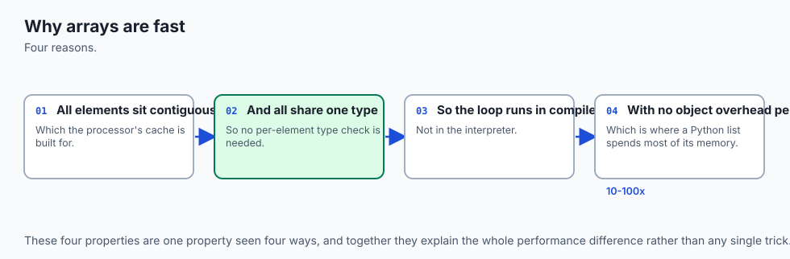

You have a shopping list and a delivery van.

The shopping list is a Python list. It can hold anything: three apples, a hammer, the word "Tuesday", another list. Each entry is written on its own scrap of paper and the list is really a stack of notes saying *the apples are on shelf four, the hammer is in the shed*. To act on an entry you follow the note, find the thing, work out what kind of thing it is, do something to it, and write a new note about the result.

That flexibility is genuinely wonderful and it is why Python is pleasant to write. It is also the entire cost.

The delivery van is a NumPy array. Before it leaves you decide one thing: **this van carries eight-kilogram boxes and nothing else**. Every box is the same size, they are stacked end to end with no gaps, and the driver does not need to look inside any of them. To act on the load, you do not open boxes one at a time. You say "add one kilogram to every box" and the whole van is handled in one instruction.

The dtype is the decision about what the van carries. The shape is how the boxes are arranged inside it. The strides are how far to step to reach the next box. And the promise those three make together — same type, fixed positions, one block — is what lets the work happen in compiled code instead of in the interpreter.

This analogy will carry the whole lesson, so it is worth naming its two sharp edges now, because both are real and both bite.

**The van cannot carry a hammer.** Declaring that every box is eight kilograms means a box that would weigh nine cannot be loaded — it wraps round to something small and negative and nobody tells you. That is the dtype section.

**The van is loaded once.** When you ask for "the boxes in row three" you do not get your own copy of them; you get a hatch onto the same boxes, and anything you do through the hatch happens to the van. That is the views-versus-copies section, and it is where a beginner's hardest bug lives.

## Historical background

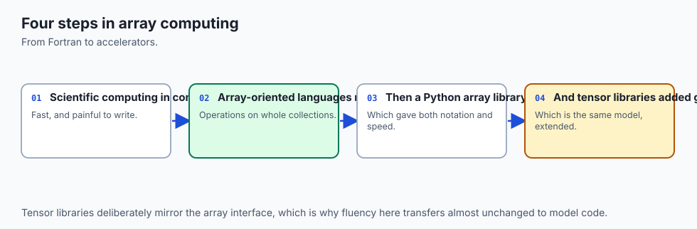

There is a temptation, in a section like this, to write a paragraph of dates and names. This lesson is going to decline, and the reason is worth stating openly, because it comes up again every time you read about a tool.

The six sources this lesson cites are listed at the end of the day. Among them are NumPy's own documentation and its beginner's guide. Neither page carries a dated account of who built what and when. So rather than reach for a half-remembered version number and a founder's name, the lesson will not attribute a history it cannot check against something you can also read.

What it *can* do is show you the history that is still visible in the software, which is more useful anyway. Software carries its past in its interface, and NumPy carries three pieces of it that you will trip over this week.

**Two random-number interfaces, one of them marked legacy.** Ask the installed library about the older one and it tells you itself:

```
  Reseed the singleton RandomState instance.

  This is a convenience, legacy function that exists to support
  older code that uses the singleton RandomState. Best practice
  is to use a dedicated ``Generator`` instance rather than
  the random variate generation methods exposed directly in
  the random module.
```

That is `numpy.random.seed`'s own docstring, printed from numpy 2.5.2 on the authoring machine. Two interfaces exist because the old one had a design flaw that could not be fixed without breaking everyone: it sets a *single global* generator that every library in your process shares, so a call you did not write can move your sequence out from under you. The replacement, `numpy.random.default_rng(seed)`, hands you an object you own. Every reproducible number in today's lab depends on that difference.

**A promotion rule that changed at version 2.** Add a plain Python `1` to an array of small integers and something has to decide the result's type. Under NumPy 1 the scalar could drag the array's type upward; under NumPy 2 it does not. That is why today's lab pins `numpy==2.5.2` and why its test harness checks the major version before asserting anything about dtypes. A tutorial written before that change is not wrong so much as no longer true, and there is no warning on the page to tell you which one you are reading.

**A version number in the fourth thousand.** The library reports itself as `2.5.2`. Whatever else that tells you, it tells you this is not a young project, and that the shape of its interface was argued over by many people for a long time before it settled into something that fits in one lesson.

The deeper history — of matrices, and of the idea that a rectangle of numbers is a *function* — you met on Days 100 to 102, and Wikipedia's article on matrices makes the connection in as many words: "Matrices and matrix multiplication reveal their essential features when related to linear transformations, also known as linear maps." Today is not new mathematics. It is the same mathematics, stored properly.

## What it is — and what it is not

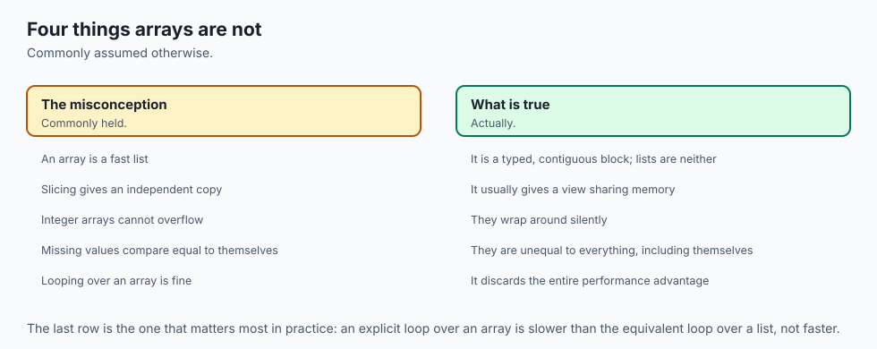

An **ndarray** is a fixed-size, homogeneous, N-dimensional block of numbers, described by a small header.

NumPy's beginner's guide states all three constraints plainly. On dimensionality: "the fundamental array class is called `ndarray`: it represents an 'N-dimensional array'." On homogeneity: "All elements of the array must be of the same type of data." On size: "Once created, the total size of the array can't change."

Those are not limitations that were tolerated. They are the entire source of the advantage, and the guide says so: "NumPy shines when there are large quantities of 'homogeneous' (same-type) data to be processed on the CPU," and "by exploiting these characteristics, we can improve speed, reduce memory consumption, and offer a high-level syntax."

The header carries three attributes you will read a thousand times:

| Attribute | What it says | Example on `np.arange(12).reshape(3, 4)` |
| --- | --- | --- |
| `dtype` | what every element is, decided once for all of them | `int64` — eight bytes each, no exceptions |
| `shape` | how many elements along each axis | `(3, 4)` — three rows of four |
| `strides` | how many **bytes** to skip to move one step along each axis | `(32, 8)` — a row is four int64 along |

Read those strides again, because they are the whole trick. To find element `[i, j]` the library does not search or follow a pointer. It computes `base + 32*i + 8*j` and reads eight bytes. The address of every element is arithmetic, which is exactly why a transpose can cost nothing: swap the two strides, hand back a new header over the same bytes, and the array is transposed. Nothing moved.

Now the things it is not, because each of these misreadings produces a specific bug.

**It is not a list that happens to be fast.** A list is a container of references to objects of any type. An array is a typed region of memory with a description attached. `a[0] = "hello"` on a list is fine; on an int64 array it raises, and that refusal is the feature.

**It is not a matrix.** A NumPy array of shape `(3, 4)` is not automatically a mathematical matrix, and `*` between two arrays is elementwise multiplication, not the matrix product. `@` is the matrix product. Confusing them gives you an array of the wrong shape or — worse — the right shape and the wrong numbers.

**It is not exact arithmetic.** The dtype is a promise about *range and precision*, and both can be broken. An `int8` holding 127 plus 1 is `-128`. A `float32` above sixteen million cannot tell one integer from the next.

**Vectorised does not mean "no loop".** This is the misconception worth carrying away. `np.sqrt(a)` still visits every element of `a`. The loop moved from CPython's bytecode interpreter into compiled C. NumPy's own broadcasting documentation puts it exactly this way: "Broadcasting provides a means of vectorizing array operations so that looping occurs in C instead of Python." The loop is not gone. It is not *yours*.

## Why it was created and what problems it solves

Four problems, and each one is measurable rather than rhetorical.

**Memory.** Twenty-eight bytes per integer against eight is 4.5 times, and that is with `int64`. Store the same data as `int8` where it fits and it is thirty-six times. On a dataset that fits in memory as an array and does not fit as a list, the difference is not "slower", it is "cannot be done on this machine at all".

**Speed.** A hundred and twenty-three times, measured above. The reason is visible if you count what the interpreter does per element: fetch a pointer, follow it, check the object's type, unbox the double, multiply, add, box the answer into a **new** float object, store a pointer to it. Seven pieces of bookkeeping around one piece of arithmetic. The array version fetches eight bytes at a computed address, multiplies, adds, stores eight bytes — and because the dtype settled the type question once for the entire array, there is no check to perform.

**Expressiveness.** This is the one that is undersold. `a[a > 5].mean()` is nine characters of intent. The loop version is five lines with a counter, an accumulator and an `if`, and every one of those five lines is somewhere a bug can live. Shorter code is not a matter of taste when the alternative has more places to be wrong.

**A shared vocabulary.** Every numerical tool in Python speaks ndarray. pandas is a labelled layer over arrays. Matplotlib plots them. scikit-learn takes them. PyTorch and JAX copied the interface on purpose, so that `.shape`, `.dtype`, `axis=1`, broadcasting, boolean masking and `argsort` mean the same things there. This is not a coincidence and it is not politeness — it is the reason today's habits transfer to model code without translation.

## How it works


### The three facts that are really one fact

Fixed dtype, contiguous block, and a shape with strides. They read like three features and they are three faces of one decision.

Because the dtype is fixed, every element is the same width. Because every element is the same width, they can be packed end to end with no gaps. Because they are packed with no gaps, the address of element `i` is `base + i * stride` — arithmetic, not a search. And because the address is arithmetic and the type is known, a compiled loop can run over the whole block without consulting Python once.

Take away the fixed dtype and all of it collapses. That is why the first question about any array is `a.dtype`, and why `describe` in today's lab prints all six facts at once:

```
  shape=(3, 4) dtype=int64 itemsize=8 nbytes=96 strides=(32, 8) c_contiguous=True
```

### Making arrays without a loop

You will almost never need to build a list and convert it. There is a constructor for the shape you want.

| Call | Gives you | Reach for it when |
| --- | --- | --- |
| `np.array([1.5, 2.5, 3.5])` | an array from data you have | you already have the numbers |
| `np.zeros(4)` | `[0. 0. 0. 0.]` | you want an accumulator to fill |
| `np.ones((2, 3))` | a 2 by 3 block of ones | same, with a different starting value |
| `np.full(3, 7)` | `[7 7 7]`, dtype taken from the `7` | any other constant |
| `np.arange(0, 10, 2)` | `[0 2 4 6 8]` | you know the **step** |
| `np.linspace(0, 1, 5)` | `[0. 0.25 0.5 0.75 1.]` | you know **how many** you want |
| `np.eye(3)` | the identity matrix from Day 102 | you need a do-nothing transformation |
| `rng.random(3)` | reproducible pseudo-random values | you need randomness you can defend |

The two that get confused are `arange` and `linspace`. `arange` counts in steps and **excludes** the stop, exactly like Python's `range`. `linspace` takes the number of points you want and **includes both ends**. Ask for a step, use `arange`; ask for a count, use `linspace`.

And the seeding, which matters more than it looks:

```python
rng = np.random.default_rng(104)
rng.random(3)   # [0.83856481 0.69214815 0.21608883]
```

A second generator built from the same seed gives the same three numbers. A generator is an object you own and pass around, so no other library can move your sequence. That is why every number in today's lab is the same on your machine as on the authoring machine, and why the lab can assert on specific values rather than on vague properties.

### The universal functions

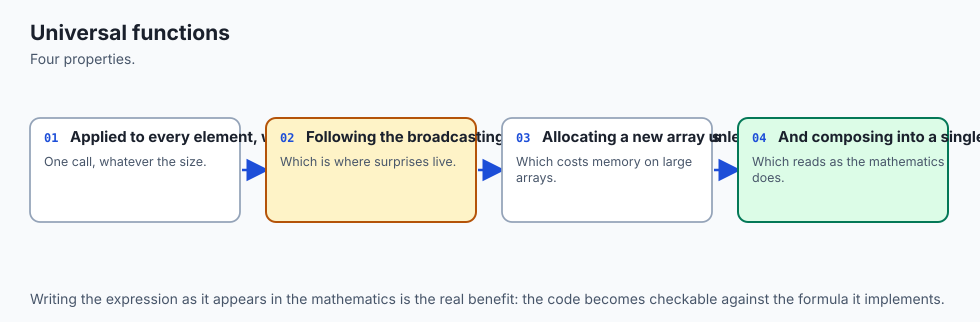

A **ufunc** is a function that applies elementwise to an array of any shape and returns an array of the same shape.

```python
a = np.array([0.0, 1.0, 4.0, 9.0, 16.0])
np.sqrt(a)     # [0. 1. 2. 3. 4.]
```

`math.sqrt` cannot do this. Hand it an array and it raises `TypeError: only 0-dimensional arrays can be converted to Python scalars`, because it wants one number and is honest about it.

The ones that come up daily are `np.abs`, `np.sqrt`, `np.exp`, `np.log`, `np.sign`, `np.round` and `np.maximum`. That last one is worth a sentence of its own: `np.maximum(x, 0)` takes **two** arrays and compares them elementwise, which makes it the ReLU from Day 102 written as one call. `np.max(x)` takes **one** array and reduces it to a single number. The longer name is the elementwise one, and confusing the two is a rite of passage.

Two arrays combine elementwise too, and here is the trap you will hit this week:

```python
left  = np.array([1.0, 2.0, 3.0])
right = np.array([10.0, 20.0, 30.0])
left * right   # [10. 40. 90.]   elementwise
left @ right   # 140.0           the dot product, from Day 103
```

`*` is elementwise. `@` is the matrix product. In a language with one multiplication symbol this is the single most common source of a silently wrong shape.

### Dtypes, and the promise you can break by accident

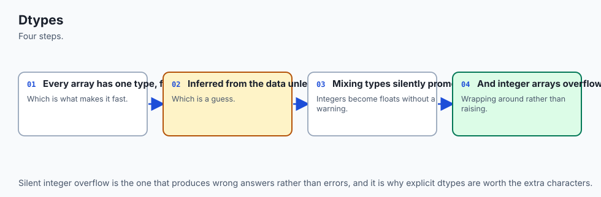

An `int8` holds −128 to 127. Here is 127 plus 1, from a real run:

```
  np.array([127], dtype=np.int8) + np.array([1], dtype=np.int8)
  gives                -128
  warnings raised      none
```

No exception. No warning. On numpy 2.5.2, measured rather than assumed, the value simply wraps from the top of the range round to the bottom, and the next line of your program carries on with `-128` as though it were the answer.

Where does `-128` come from? Two's complement, eight bits, and one carry that ripples the whole way:

```
    0111 1111    = 127
  + 0000 0001    =   1
    ---------
    1000 0000    = -128, because the top bit means "negative"
```

Doubling three int8 values shows how quietly it spreads:

```
  int8  120 doubled ->   -16   <- wrapped, the true answer is 240
  int8  125 doubled ->    -6   <- wrapped, the true answer is 250
  int8  127 doubled ->    -2   <- wrapped, the true answer is 254
```

And a plain Python `1` does not rescue you:

```
  np.array([127], dtype=np.int8) + 1  ->  [-128]  dtype int8
```

Since NumPy 2, the Python scalar takes the array's dtype rather than the other way round. The array's promise wins. The fix is to say what you meant — `.astype(np.int16)` before the arithmetic gives `128` — and to accept that it costs a byte per element, which on a model's weights is where the whole conversation about half-precision floats comes from.

Floats fail differently, and more quietly. They do not wrap; they stop being able to tell two numbers apart:

```
  float32 0.1  ->  0.10000000149011612
  float32 16777216 + 1 == 16777216  ->  True
```

A float32 has twenty-four bits of significand, so at 2²⁴ the gap between neighbouring representable values is exactly 1, and adding 1 lands back where you started. An accumulator in float32 can stop increasing while you are still adding to it, and nothing will tell you.

### Boolean masking

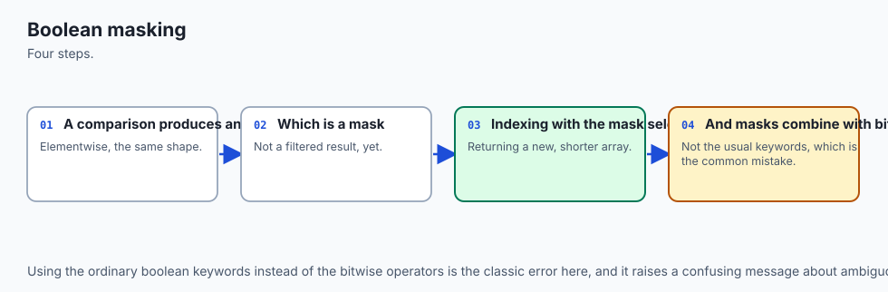

This is the single most useful idea in NumPy after broadcasting, and it rests on one fact: **a comparison on an array is an array**.

Twenty readings from the seeded generator, small enough to check by eye:

```
  [70, 83, 34, 69, 26, 21, 18, 12, 65, 37, 17, 75, 30, 73, 37, 41, 97, 64, 21, 82]
```

Ask whether they are above fifty and you do not get a yes or a no. You get twenty answers:

```
  readings > 50  ->  [ True  True False  True False False False False  True False False  True
 False  True False False  True  True False  True]
  dtype bool   shape (20,)   size 20
```

Everything else follows from that:

```
  mask.sum()   9       True is 1 when summed, so a count is a sum
  mask.any()   True    is anything above 50?
  mask.all()   False   is everything?
  mask.mean()  0.45    what fraction? — a sum divided by n
  readings[mask]  ->  [70, 83, 69, 65, 75, 73, 97, 64, 82]
```

Four loops with counters and accumulators, replaced by four expressions with nowhere to hide a mistake.

Combining two conditions is where everyone's first NumPy hour ends:

```python
(readings > 30) & (readings < 70)     # works: 7 readings
(readings > 30) and (readings < 70)   # raises
```

The failure is not a NumPy shortcoming. It is:

```
ValueError: The truth value of an array with more than one element is ambiguous. Use a.any() or a.all()
```

`and` is a *control-flow keyword*, not an operator. Python evaluates the left side and asks it "are you true?" so it can decide whether to bother with the right side. NumPy cannot redefine that behaviour, because there is no method for Python to call — and an array of twenty answers has no single answer to give. `&` **is** an operator, so NumPy defines it to mean elementwise-and, which is what you meant.

The parentheses are not decoration either. `&` binds tighter than `<`, so `a > 30 & a < 70` parses as `a > (30 & a) < 70`: a bitwise-and of 30 with every element, then a chained comparison, which calls `bool()` on an array and raises the identical error for an entirely different reason. Two causes, one message. Bracket every comparison.

Three more tools complete the set. `np.where(cond, x, y)` is `x if cond else y` for a whole array. Assignment through a mask — `a[a > 90] = 90` — writes only where the mask is True. And **fancy indexing** takes an array of positions rather than a mask:

```
  readings[[0, 5, 19, 5]]  ->  [70, 21, 82, 21]
```

Three differences from a mask, all useful: the result takes the shape of the *index* array, you choose the order, and you may ask for the same element twice. That is how a batch of rows is pulled out of a dataset, and it is what makes the next section's ranking work.

### Axes, and the rule worth memorising

Every aggregation takes an optional `axis`, and the confusion is universal until you have the rule.

```
  grid.sum()          66              shape ()
  grid.sum(axis=0)    [12 15 18 21]   shape (4,)
  grid.sum(axis=1)    [ 6 22 38]      shape (3,)
```

**The axis you name is the one that disappears.**

A `(3, 4)` array summed with `axis=0` loses the 3 and leaves shape `(4,)` — one number per column. With `axis=1` it loses the 4 and leaves `(3,)` — one number per row. If you are reading it as "which axis do I want to keep", you will be off by exactly one, every time, for the rest of your career.

`keepdims=True` holds the shape open — `(3, 1)` instead of `(3,)` — which is precisely what you need when the result has to broadcast back against the array it came from, as in normalising every row to sum to one.

And `np.newaxis` turns a row into a column so that broadcasting can pair everything with everything:

```
  v[:, np.newaxis] shape (3, 1)
  v[np.newaxis, :] shape (1, 3)
  v[:, None] - v[None, :]:
    [ 0. -1. -2.]
    [ 1.  0. -1.]
    [ 2.  1.  0.]
```

Shape `(3, 3)` — every difference of every pair, in one line, no loop over pairs. That line is how a whole distance matrix gets built, and it is also one of the three ways to run out of memory, which the closing section returns to.

### Views versus copies

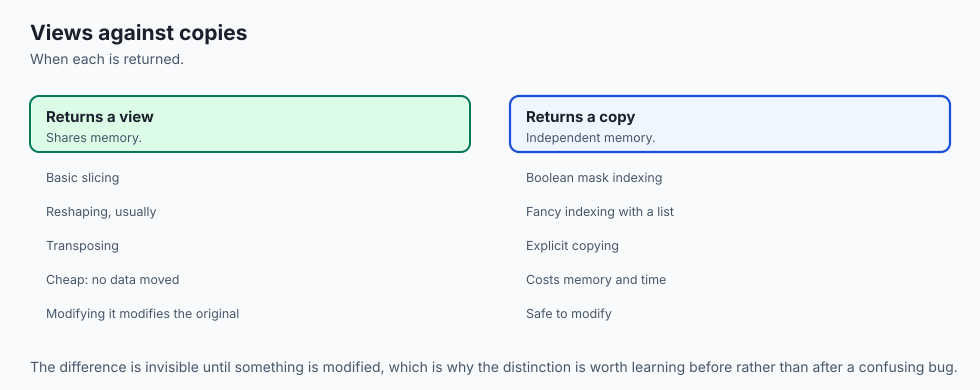

Here is the bug. Read it slowly, because when it happens to you it will happen a hundred lines away from the cause.

```
  original:
    [0 1 2 3]
    [4 5 6 7]
    [ 8  9 10 11]

  row_one = original[1]        ->  [4 5 6 7]
  shares memory: True
  row_one[0] = 999

  the ORIGINAL now reads:
    [0 1 2 3]
    [999   5   6   7]
    [ 8  9 10 11]
```

Nothing was copied, so nothing was protected. NumPy's own beginner's guide is explicit about the difference from a list: "slice indexing of a list copies the elements into a new list, but slicing an array returns a *view*: an object that refers to the data in the original array. The original array can be mutated using the view." And it does not present this as a footnote: "Views are an important NumPy concept! ... modifying data in a view also modifies the original array!"

`.copy()` breaks the link, and after that the two arrays are strangers.

Which operations give which? There is a pattern, and it is better than the list:

| Expression | View or copy |
| --- | --- |
| `a[1]`, `a[:, 1]`, `a[0:2, 1:3]` | view |
| `a.T`, `a.reshape(4, 3)`, `a.ravel()` | view |
| `a[a > 5]` (boolean mask) | copy |
| `a[[0, 2]]` (fancy index) | copy |
| `a.copy()`, `a.flatten()`, `a + 0` | copy |

**If the elements you asked for are evenly spaced, a stride can describe them and you get a view. If they are not, NumPy has no choice but to copy.** Which means the cheap operations are the dangerous ones, and the expensive ones are safe — the opposite of the intuition most people arrive with.

Note the near-identical pair in that table: `ravel()` returns a view when it can, `flatten()` always copies. Two words for one job and opposite behaviour. When you are unsure, `np.shares_memory(a, b)` answers the question directly.

### Sorting, and why you almost always want `argsort`

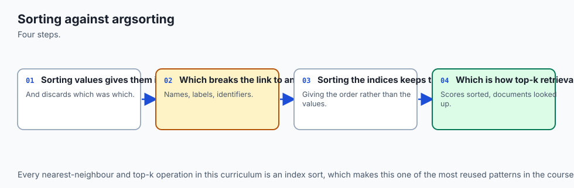

```
  scores          [5. 1. 9. 3.]
  np.sort(scores) [1. 3. 5. 9.]   the values, in order
  np.argsort      [1 3 0 2]       the POSITIONS, in order
```

`argsort` answers "which element would come first, then which". `scores[np.argsort(scores)]` rebuilds the sorted values, so nothing is lost by taking the indices — but plenty is lost by taking the values.

When the rows *mean* something — an article, a customer, a token, a candidate answer — the sorted scores are useless on their own. You need to know which row scored what. That is why `argsort` is the one to reach for, and it is why Day 103's search becomes one line today:

```
  all six similarities, from one matrix-vector product and one
  norm along axis=1 -- no loop over articles:
    roast-chicken        0.369119
    slow-cooker-stew     0.360302
    marathon-plan        0.901082
    race-day-nutrition   0.903482
    household-budget     0.041013
    storm-bulletin       0.102533

  np.argsort(sims)          [4, 5, 1, 0, 2, 3]   <- worst first
  reversed, first 3         [3, 2, 0]            <- best first

  top 3:
    1. race-day-nutrition   0.903482
    2. marathon-plan        0.901082
    3. roast-chicken        0.369119

  margin between first and second: 0.002400
```

Day 103 computed those six similarities one article at a time. Today it is `matrix @ query` for all the dot products at once, and `np.linalg.norm(matrix, axis=1)` for one length per row. Same arithmetic, same answer, no loop over articles.

Note also that the lab reports the margin rather than announcing a winner. A gap of two thousandths between first and second is not evidence of much, and a system that hides that from you is worse than one that shows it.

One refinement you will meet in model code, where the catalogue has a hundred thousand rows and you want ten: `np.argpartition` does not sort everything. It only guarantees that the k best land in the first k places, in no particular order, which you then sort. On six articles that saves nothing. On a hundred thousand it is the difference between sorting them all and not.

### `nan`, and the comparison that surprises everybody

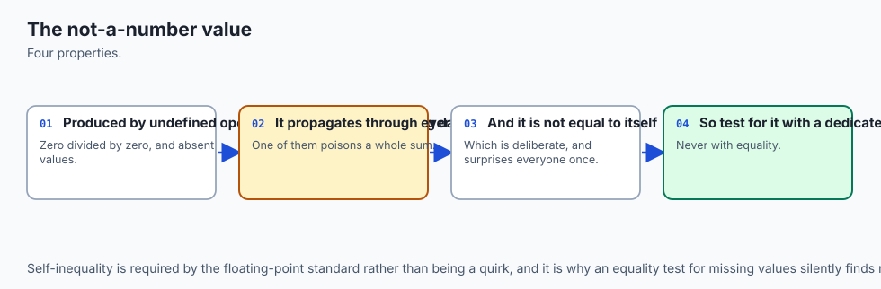

```
  np.nan == np.nan   ->  False
  np.nan != np.nan   ->  True
```

Not a NumPy decision. IEEE-754 says `nan` compares unequal to everything including itself, because `nan` means *not a number* — the result of 0/0, of the square root of a negative, of a reading that was never taken. Two unknowns are not known to be the same unknown.

So this does not work, and fails silently:

```
  a = [ 1.  2. nan  4.]
  a == np.nan   ->  [False False False False]
```

Every answer False, including for the element that *is* nan. A filter written that way finds nothing and reports success. `np.isnan(a)` asks about the bit pattern instead, and finds it.

And one hole poisons the whole aggregate, deliberately:

```
  a.sum()        nan          np.nansum(a)   7.0
  a.mean()       nan          np.nanmean(a)  2.3333333333333335
  a.max()        nan          np.nanmax(a)   4.0
```

The plain versions are not broken. They are telling you, loudly and at the point where it starts to matter, that a value is missing. Reaching for the `nan`-prefixed version is a decision to ignore that, and it should be a decision rather than a reflex — because `2.333...` is the mean of the three readings you have, and not the mean of the four you wanted.

## An everyday analogy

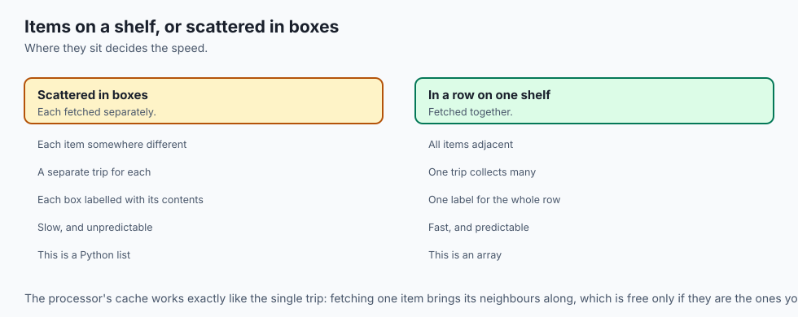

Back to the van, and now it can carry the whole day.

**Loading.** A shopping list of scraps of paper against a van of identical eight-kilogram boxes. Making the list is effortless and heterogeneous; loading the van requires you to decide what it carries. That decision is the `dtype`, and it is the price of admission.

**Working.** With the shopping list you walk the shelves: read a note, find the item, work out what it is, do the thing, write a new note. With the van you tell the driver "add one kilogram to every box" and the whole load is handled at once. The work per box did not change; the walking did. That is the loop moving from Python into C, and it is why "vectorised" does not mean "no loop".

**The weight limit.** A box that would weigh nine kilograms cannot be loaded. It does not bounce; it silently comes out weighing minus seven, and the manifest still balances. That is `int8` at 127. The van keeps the promise you made even when keeping it produces nonsense.

**The hatch.** Ask for "the boxes in row three" and you are handed a hatch onto them, not a copy of them. Anything you do through the hatch happens to the van. That is a slice, and `.copy()` is the request to actually unload them onto a pallet of your own.

**The manifest.** Sorting the boxes by weight gives you a list of weights and loses which box was which. Sorting the *manifest numbers* by weight keeps the identity. That is `argsort`, and it is why a search returns indices.

**The box marked "contents unknown".** It is not empty and it is not zero. Any total that includes it is honestly unknown, and a driver who quietly left it out of the total and told you the van weighed less than it does would be worse than useless. That is `nan`, and that is why `mean()` returns `nan` rather than guessing.

Where the analogy breaks, and it is worth knowing: a real van's boxes are physically separate, and array elements are not — they are one continuous stretch of memory that the shape and strides merely *describe*. That is why the same bytes can be a `(3, 4)` array in the morning and a `(4, 3)` array after a transpose with nothing having moved. No arrangement of real boxes does that.

## Examples in practice


Today's lab implements three operations twice — once as an explicit Python loop, once as a NumPy expression — and asserts they agree **exactly** before timing either. That order matters. A speed comparison between two things that give different answers is not a comparison of anything.

Here is the full measured result from one run:

```
  scale and offset:  2.5 * x + 1.25
    elementwise identical over 1,000,000 elements : True
    median loop    29.92 ms
    median array   0.243 ms
    speedup        123.2x

  square root:       math.sqrt(x)  vs  np.sqrt(a)
    elementwise identical over 1,000,000 elements : True
    median loop    34.80 ms
    median array   0.260 ms
    speedup        134.0x

  clip:              hold x inside [0.25, 0.75]
    elementwise identical over 1,000,000 elements : True
    median loop    27.69 ms
    median array   0.261 ms
    speedup        106.2x
```

Three things about this measurement, all of them the point.

**Identical, not close.** `2.5`, `1.25`, `0.25` and `0.75` are exactly representable in binary. Each element goes through the same operations in the same order on the same sixty-four bits. There is no room for a difference and none appears, so the lab compares with `==` rather than with a tolerance. Using a tolerance would have hidden the very fact being demonstrated.

**Five runs, and all five shown.** A single timing is noise. The median is reported because one unlucky run — the operating system deciding to do something else for thirty milliseconds — drags a mean around and leaves a median alone.

**One machine, one day.** Apple Silicon, macOS 26.5.2, CPython 3.14.0, numpy 2.5.2. Your figures will differ. Which is exactly why the lab's tests assert that the speedup exceeds **twenty**, and never assert a millisecond. A test that asserted 123x would fail on a slower laptop and teach the reader that the suite is unreliable rather than that their laptop is different.

And now the finding that came out of building this lesson and was not planned.

The lab's `roots_loop` uses `math.sqrt(x)` rather than `x ** 0.5`. That looks like a stylistic choice. It is not:

```
  over 1,000,000 values, compared with np.sqrt:
    math.sqrt(x)  disagrees on      0 of them
    x ** 0.5      disagrees on  1,390 of them

  the first disagreement, at index 781:
    x           0.6541050943199698
    x ** 0.5    0.808767639263571
    np.sqrt(x)  0.8087676392635711
    difference  1.110e-16
```

One value in seven hundred, always by one unit in the last place. IEEE-754 requires the square-root operation to be *correctly rounded* — there is exactly one right answer for every input — and both `math.sqrt` and `numpy.sqrt` use the hardware instruction that obeys that. `pow(x, 0.5)` is a general power routine with no such requirement, because computing an arbitrary power exactly is a much harder problem than computing a square root.

So "the vectorised version gives the same answer" is a claim about the **operation**, not about anything that would agree in exact arithmetic. If a vectorised rewrite of yours suddenly needs a tolerance it did not need before, that is the first thing to check — and it is worth reading rather than widening.

## Implications: security, privacy, performance, scalability, and cost

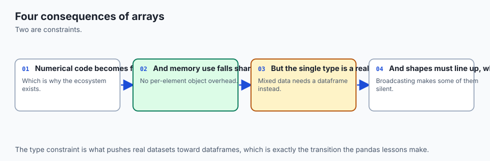

**Security.** Silent integer overflow is not a curiosity; it is a class of exploitable bug with decades of history behind it. A value that was supposed to be too large becomes negative, the "is it too big?" check passes, and the code proceeds on an assumption that is now false. Python itself is immune, because a Python `int` grows to whatever size it needs. The moment you put data into a fixed-width array you have opted into a promise about range, and NumPy will keep that promise even when keeping it produces nonsense. Check `a.dtype` first whenever a number looks impossible.

**Privacy and the shape of a leak.** A view shares memory. If a function hands a caller `data[0:100]` believing it has given them a copy of the first hundred rows, it has given them a *window* onto the array — and anything they write lands in yours. Returning a view is a decision, not an accident to be discovered later.

**Performance.** Two orders of magnitude on elementwise work, measured. But the fixed cost of a NumPy call — resolve the dtypes, work out the output shape, allocate it — is real, and on small arrays it is the whole bill. On four elements the list comprehension won on this machine, at 0.108 microseconds against 0.325. The crossover here is in the low hundreds of elements. Measure yours rather than believing this paragraph.

**Scalability.** Vectorising trades time for memory, and the trade is not always favourable. `x[:, None] - x[None, :]` allocates n² elements whether you need them all or not:

```
    all pairs of   1,000 points, float64 :       0.01 GB
    all pairs of  10,000 points, float64 :       0.80 GB
    all pairs of  30,000 points, float64 :       7.20 GB
    all pairs of 100,000 points, float64 :      80.00 GB
```

The elegant one-line distance matrix is the reason the process died. The ugly loop that handles a thousand at a time is slower and finishes.

**Cost.** Dtype is money. A million float64 values are 8 MB; the same values as float32 are 4 MB and as float16 are 2 MB. On model weights that is the difference between a card you can rent and one you cannot. It is also exactly the trade the float32 blind spot describes — you are buying capacity with precision, and it is worth knowing which precision you sold.

## Alternatives: free, open source, and commercial

NumPy is the one that was actually run for this lesson, on this machine, at version 2.5.2. Everything below it is described from its documentation, and **no output from any of them is reproduced here, because none of them were installed**. That distinction is the difference between a description and a claim.

**NumPy** — free, open source, BSD 3-Clause. The baseline, and the one to learn first. Choose it whenever your data fits in memory on one machine and you are working on a CPU, which covers the overwhelming majority of data work and all of this course for the next several weeks. How to use it: `pip install numpy`, then `import numpy as np`, and everything in today's lab. Concrete example: `np.argsort(similarities)[::-1][:3]` returning the three nearest articles, which is the whole of a semantic search's ranking step. There is no paid tier; there is no tier at all.

**PyTorch** — free, open source. The axis it extends NumPy along is **automatic differentiation**: a `torch.Tensor` records the operations performed on it so that gradients can be computed backwards through them, which is the machinery every trained model needs. Choose it when you are training something. The interface was copied from NumPy deliberately — `.shape`, `.dtype`, `axis` (spelled `dim`), broadcasting, boolean masking and `argsort` all carry across — so today's habits are the habits you will use there. Free to use; the money in that ecosystem is in the hardware and the hosted training, not the library.

**JAX** — free, open source. Its axis is **compilation and accelerators**: the same array interface, plus a just-in-time compiler that fuses your expression into a single optimised kernel, plus function transformations for gradients and for vectorising a function over a batch automatically. Choose it for research code that must be fast and mathematical at the same time. The cost is a discipline NumPy does not impose: arrays are immutable, so `a[0] = 1` is replaced by `a.at[0].set(1)`, and a habit you form today has to be unlearned there.

**CuPy** — free, open source. Its axis is **the GPU, and only that**. It aims to be a drop-in replacement for NumPy's interface where `import numpy as np` becomes `import cupy as cp` and the arrays live in graphics-card memory. Choose it when you have array code that already works, a GPU, and no desire to rewrite anything. The catch is honest and worth stating: it needs a compatible GPU and its drivers, and moving data to and from the card costs time that can erase the gain on small work.

**Dask** — free, open source. Its axis is **out-of-core and distributed**: a Dask array presents the NumPy interface over data that is split into chunks, which may be larger than memory or spread across machines, and it builds a task graph rather than computing immediately. Choose it when the honest answer to "does it fit in memory" is no. The cost is that the mental model changes — nothing happens until you ask for a result — and that a poorly chosen chunk size can be slower than doing nothing clever at all.

**pandas** — free, open source, and not a competitor. It is the **labelled layer above NumPy**: a DataFrame is a set of columns, most of them backed by NumPy arrays, with names on the columns and an index on the rows. Choose it when your data has headings and mixed types — a CSV, a table from a database — and when you want to group by something. Underneath, the vectorised thinking is identical, which is why today comes before it.

Two commercial notes, stated qualitatively because this course does not quote prices. Hardware vendors ship tuned linear-algebra libraries that NumPy can be built against, and a build linked to one of those can be substantially faster on matrix work than a generic build with no change to your code. And the managed notebook and training platforms sell you access to machines with GPUs; what they sell is the hardware and the convenience, not the array library, which remains free everywhere.

**What was actually run here:** NumPy 2.5.2 only. PyTorch, JAX, CuPy, Dask and pandas were not installed and produced no output for this lesson.

## Comparison with related concepts

| Concept | What it is | How it differs from today's subject |
| --- | --- | --- |
| Python `list` | a container of references to objects of any type | heterogeneous, resizable, no dtype and no shape; a slice copies |
| Python `array.array` | a typed, one-dimensional sequence from the standard library | has a dtype but no shape, no strides, no broadcasting, no ufuncs |
| `ndarray` | a fixed-size homogeneous N-dimensional block plus a header | the subject of today |
| pandas `DataFrame` | labelled columns, mostly backed by ndarrays | adds names, an index and mixed column types on top of arrays |
| `torch.Tensor` | an ndarray-like object that records its own history | adds autograd and device placement; interface deliberately familiar |

And five pairs that are commonly confused, each with the distinction that resolves it:

| Confused pair | The distinction |
| --- | --- |
| `*` and `@` | `*` is elementwise; `@` is the matrix product from Day 101 |
| `np.max` and `np.maximum` | `np.max` reduces one array to a number; `np.maximum` compares two arrays elementwise |
| `ravel` and `flatten` | both flatten; `ravel` returns a view when it can, `flatten` always copies |
| `np.sort` and `a.sort()` | `np.sort` returns a new array; the method sorts in place and returns `None` |
| `a == np.nan` and `np.isnan(a)` | the first is always False; only the second finds anything |

## When to use it — and when not to

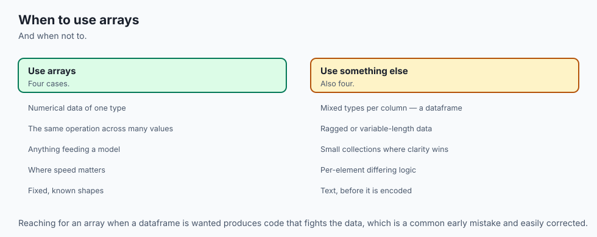

Reach for the array when the data is homogeneous, the operation is the same for every element, and there is enough of it that the per-call overhead disappears — which in practice means more than a few hundred elements. Reach for it also when the alternative loop would need three nested levels and a counter, because expressiveness is worth as much as speed and is easier to verify.

Now the honest half, which most introductions omit.

**When the array is small.** Measured on this machine, on four elements: the list comprehension at 0.108 microseconds, the NumPy call at 0.325. Every NumPy call has to resolve dtypes, work out the output shape and allocate it before any arithmetic happens, and on four elements that setup is the entire bill. If you are calling a function on small arrays in a tight outer loop, NumPy can make your program slower.

**When each step depends on the last.** A running balance, floored at zero:

```
    start 100, changes -30, +50, -200, +20, floored at zero
    the honest loop  [70.0, 120.0, 0.0, 20.0]
    np.cumsum route  [70.0, 120.0, 0.0, 0.0]
```

Different answers, and the loop's is the right one — step four depends on the floor applied at step three, and a cumulative sum cannot know that. Sequential dependence is the clearest signal that the loop should stay.

**When memory would blow up.** The pairwise table again. At a hundred thousand points, `x[:, None] - x[None, :]` needs 80 GB. The slower loop that processes a thousand at a time finishes.

**When the loop is simply clearer and the data is small.** A dozen configuration values, a handful of records, a one-off script. Rewriting that as array expressions costs reading time and buys microseconds nobody will ever notice. Vectorising is a trade, not an upgrade, and a tool you can only argue *for* is a tool you do not understand yet.

### Where this goes next in AI work

Every tensor library you will meet copied NumPy's interface on purpose. `torch.Tensor` and `jax.numpy` use the same `.shape`, the same `.dtype`, the same broadcasting rules, the same boolean masking, the same `argsort`. That is not a coincidence — it is a deliberate decision by their authors to let people arrive already knowing how to hold the thing.

Which means the three habits from today are the daily vocabulary of model code, not a stepping stone to it. **Batching** is shape work: `(batch, sequence, features)`, and getting `axis` right is the difference between averaging over the batch and averaging over time. **Masking** is how a model ignores padding tokens, how attention is stopped from looking ahead, and how a loss is computed over only the positions that count — all of it boolean arrays and `np.where`, spelled slightly differently. And **top-k selection** is `argsort` or `argpartition`: the last step of a search, the sampling step of a language model, the retrieval step of anything that answers questions from documents.

When you write your first PyTorch training loop, the parts that will confuse you will not be the parts you learned today.

## The AI connection

- **Array programming is the foundation every AI framework is built on**, and the mental
  model transfers directly to tensors.
- **Vectorised thinking replaces loops with whole-array operations**, which is the difference
  between usable and unusable performance.
- **Boolean masking is how data is filtered without branching**, which is what lets the same
  code run on an accelerator.
- **Dtype discipline prevents silent precision loss**, which is the same concern as mixed
  precision in model training.
- **Views versus copies is a genuine source of bugs**, and the distinction reappears in every
  tensor library.

## Knowledge check

Eight questions in the quiz for this day, including one on why `and` fails on arrays and one on views versus copies. Take it before the lab if you want to find out what you already believe, and after the lab if you want to find out what you now know.

## Hands-on exercise

Open the day's lab, "Stop Writing the Loop", and work through `starter/00_brief.md`.

The spine is exercise 1: ten functions, three of them written **twice** — once as an explicit Python loop, once as a NumPy expression — with a test that compares the two over a million elements using `==` rather than a tolerance. Then exercises 2 to 7 are forty-two predictions you make before running anything: memory ratios, the int8 wrap, mask counts you can check by eye against twenty printed readings, axis shapes, view-versus-copy outcomes, and the `nan` results.

Install first, from the lab directory:

```bash
python3 -m venv .venv
.venv/bin/pip install -r requirements/requirements.txt
.venv/bin/python3 -c "import numpy; print(numpy.__version__)"
```

Then work, checking yourself as you go:

```bash
.venv/bin/pytest starter -q
```

### Expected output

On an untouched checkout:

```
1 passed, 70 skipped
```

A skip means "not attempted". A failure means "attempted and wrong", and prints both your answer and the real one. When it says `71 passed`, you are finished.

The full harness, run from the lab directory, ends like this:

```
80 checks, 0 failure(s).
```

and exits 0. Three blocks from the reference scripts are worth recognising when you meet them. The measurement that appears to disprove the lesson:

```
  sys.getsizeof(list)      8,000,056 bytes
  array.nbytes             8,000,000 bytes
  ratio                       1.0000
```

The silent wrap:

```
  np.array([127], dtype=np.int8) + np.array([1], dtype=np.int8)
  gives                -128
  warnings raised      none
```

And the error you will meet on your own within a week:

```
ValueError: The truth value of an array with more than one element is ambiguous. Use a.any() or a.all()
```

### Validate your work

1. `bash tests/run_tests.sh; echo "exit=$?"` prints `80 checks, 0 failure(s).` and `exit=0`.
2. `.venv/bin/pytest examples -q -p no:cacheprovider` prints `107 passed`.
3. `.venv/bin/pytest starter -q -p no:cacheprovider` prints `71 passed` once you have finished.
4. Each of the seven reference scripts ends with `every assertion held.`
5. `find . -path ./.venv -prune -o -type d -name '__pycache__' -print` prints nothing after a full run.

### Troubleshooting

**`ValueError: The truth value of an array...`** — three separate causes and the same message. You used `and`/`or` instead of `&`/`|`; or you left the parentheses off, so `&` bound tighter than `<`; or you put an array inside an `if`. The lab's `troubleshooting.md` separates all three.

**`ModuleNotFoundError: No module named 'vectorize'`** — you are in the wrong directory. The scripts in `examples/` import from beside themselves, so run them from inside `examples/`. The pytest suites are the other way round: run those from the lab directory.

**Your filter for missing values finds nothing** — you wrote `a == np.nan`. Use `np.isnan(a)`.

**An array you were not looking at changed** — you have a view. Check with `np.shares_memory(a, b)` and call `.copy()` when you mean to own the result.

**Your speedup is much smaller than the captured one** — expected, and not a failure. Check you are timing the loop over a *list* and the vectorised version over an *array*; looping over an ndarray with a Python `for` is slower than looping over a list, because every element must be boxed on the way out.

### Common mistakes

**Trusting `sys.getsizeof`.** It measures the object you handed it and not the objects it points at. This is the mistake the lesson opens with, deliberately.

**Comparing a slow loop against a fast array.** The lab's loops allocate their output up front rather than appending, because a rigged comparison teaches nothing. If you write the loop badly to make NumPy look good, you have measured your own bad loop.

**Asserting a timing.** A test that says "this took under 5 ms" fails on someone else's machine and teaches them that the suite is unreliable. Assert the shape of the gap.

**Using `x ** 0.5` in the loop and `np.sqrt` in the array version.** Different operations, and one test in the lab will catch you. Use `math.sqrt`.

**Reading `axis` as "the one I keep".** It is the one that disappears.

**Forgetting that a boolean mask copies and a slice does not.** The expensive operation is the safe one, which is the opposite of the intuition most people bring.

## Practice assignment

Take a dataset of your own — a CSV of anything, or one you generate with a seeded `default_rng` — and write the same analysis twice.

First as loops: read the rows, filter on two conditions, compute a mean of one column over the survivors, and find the five rows with the largest value in another column. Use no NumPy at all.

Then as array expressions: one boolean mask combining both conditions with `&`, one masked mean, one `argsort` for the top five.

Then do three things with the pair, and write down the answers rather than merely thinking them.

**Prove they agree.** Not "look similar" — assert it. Decide honestly whether `==` is right here or whether a tolerance is genuinely needed, and if you reach for a tolerance, work out *why* the two routes differ before you choose the number.

**Time both, properly.** Five runs each, report the median and show the spread, and state your machine and versions beside the figures. Then write one sentence you would be willing to defend in a code review about what the ratio means and what it does not.

**Find your crossover.** Cut the dataset to 10 rows, 100, 1,000, 10,000 and time both at each size. Somewhere the lines cross. Report where, and then explain why the crossover moves when you make the per-element operation more expensive — swap the multiply for `np.exp` and measure again.

The deliverable is a short note with those three answers, the numbers that support each, and one honest sentence about anything that surprised you. If nothing surprised you, you probably did not measure carefully enough.

## Extension challenge

Build a top-k semantic search over a hundred thousand items, and make every step of it defensible.

Generate the catalogue with a seeded generator: a hundred thousand rows of, say, sixty-four features each. That is a `(100000, 64)` float64 array — work out what it costs in memory before you allocate it, and check your arithmetic against `a.nbytes` afterwards.

Then:

1. **Score every row against a query in one expression.** No loop over rows. Use `axis=1` for the norms and `keepdims` if you need the result to broadcast back.
2. **Take the top ten two ways** — `argsort` and `argpartition` — and confirm they give the same ten. Time both, and predict the ratio from what each has to do before you measure it.
3. **Cut the memory in half.** Convert the catalogue to float32 and repeat. Then answer the question that matters: did any of the top ten change, and if so, by how much did the scores move? You now have a concrete instance of the precision-for-capacity trade the lesson described in the abstract.
4. **Break it on purpose.** Put a `nan` into one row of the catalogue. Watch what `argsort` does with it — where does it sort to, and does your top ten quietly change? Then decide what your code *should* do about a missing row, and implement that rather than the first thing that makes the symptom go away.
5. **Now try to allocate the full pairwise similarity matrix** between all hundred thousand items. Work out the size first. Do not run it. Write down what you would do instead, and what the chunk size would depend on.

The last two are the ones worth your time. Anyone can make an array fast. Knowing what it does when the data is wrong, and knowing when the elegant line is the one that kills the process, is the part that makes you someone people trust with a pipeline.
