## Why this matters

Here is a search that returns three different answers, and none of them is a bug.

You have a small help centre. A reader types a short note, and you want the most relevant article. You have counted four terms in the note and in every article, so everything is a vector of four numbers, and you have six days of linear algebra behind you. The query is `(4, 3, 2, 1)`. Three articles are candidates:

```
                  norm  distance  vector  cluster    total
    query            4         3       2        1       10
    Aisle            4         3       2        6       15
    Beacon           6         1       4        1       12
    Cartogram       12         9       6        3       30
```

Now measure. All three measures below are standard, all three are correct implementations, and all three are one line of arithmetic you already know:

```
                       L1          L2       L-inf      cosine
    Aisle          5.0000      5.0000      5.0000      0.7926
    Beacon         6.0000      3.4641      2.0000      0.8944
    Cartogram     20.0000     10.9545      8.0000      1.0000
```

**Manhattan distance says Aisle. Euclidean distance says Beacon. Cosine similarity says Cartogram.** Three measures, three winners, on four small whole numbers, with no randomness anywhere and nothing to tune.

That is the whole day in one table, and the uncomfortable part is what it implies about code you have probably already written. Somewhere in every retrieval system, every clustering run and every nearest-neighbour classifier there is a distance function. It is almost always a default. Nobody argued about it in review, because it did not look like a decision — it looked like plumbing. The table above says it was the decision, and everything downstream is a consequence of it.

The concrete stakes are worth naming before the mathematics starts. A vector database asks you to choose a metric when you create an index, and the choice is not reversible without rebuilding: get it wrong and you re-embed and re-index a corpus, which for a large collection is hours of compute and a real bill. A k-nearest-neighbour classifier trained on features in mismatched units is not a weak model, it is a model reading one column and ignoring the other — later today you will see a two-feature dataset where one column contributes 0.0036 per cent of every distance and the "nearest" match is a part that physically will not fit. And a clustering algorithm handed cosine distance is standing on a property that cosine distance does not have, which is the difference between an index that may prune and an index that may not.

By the end of today you will not be picking a distance by habit. You will have a table keyed by the shape of your data, five measures implemented from arithmetic you can check on paper, and the ability to say out loud what question your measure is answering — which is the only way to notice when it is the wrong question.

## The idea in plain language

"Distance" sounds like one thing because in the physical world it is one thing. Two points on a table are a certain number of centimetres apart, and there is no second opinion.

Data is not a table top. When you say two customers are "close", or two documents are "similar", you are choosing what closeness *means* for those objects, and there are several reasonable choices that disagree with each other. **Distance is a family, and picking a member is a modelling decision.**

Here is the family, in the order you will meet it.

Start with the **size of one vector**, which is called a **norm**. Day 99 gave you two of them: add up the absolute values (the L1 norm), or square everything, add, and take the square root (the L2 norm). Today those turn out to be two settings of one dial. The general formula raises every absolute value to the power `p`, adds, and takes the `p`-th root. Set `p` to 1 and you get L1. Set it to 2 and you get L2. Let `p` run off to infinity and everything except the single largest component becomes negligible, so you get the largest component alone — the L-infinity norm, also called Chebyshev.

Once you can measure the size of a vector, distance is free: the distance between two points is the **size of their difference**. Every distance in the p-family is that one idea with the dial set differently.

Then there is a second axis, and confusing it with the first is the most expensive mistake in the area. Some of these functions are **distances** — they get smaller as things get more alike, and zero means identical. Others are **similarities** — they get larger as things get more alike. Cosine similarity, which Day 103 built, is a similarity: 1 means pointing the same way, 0 means at right angles. Nothing in your code knows which kind it has been handed. Sort ascending on a similarity and you have built a search engine that returns the least relevant result first, with complete confidence and no error message anywhere.

Finally there are measures for data that is not made of numbers at all. If your features are *categories* — material, country of origin, thread size — then subtracting one from another is meaningless, and the right measure counts how many fields differ. That is **Hamming distance**. If your objects are *sets* — tags, ingredients, the words in a document — the right measure is usually the overlap divided by the union, which is **Jaccard similarity**.

And running underneath all of it is a quiet fact that decides more arguments than any of the above: **every one of these measures sums contributions across features, and none of them knows what units your features are in.** A column measured in metres against a column measured in grams is not two features. It is one feature and a rounding error.

## Historical background

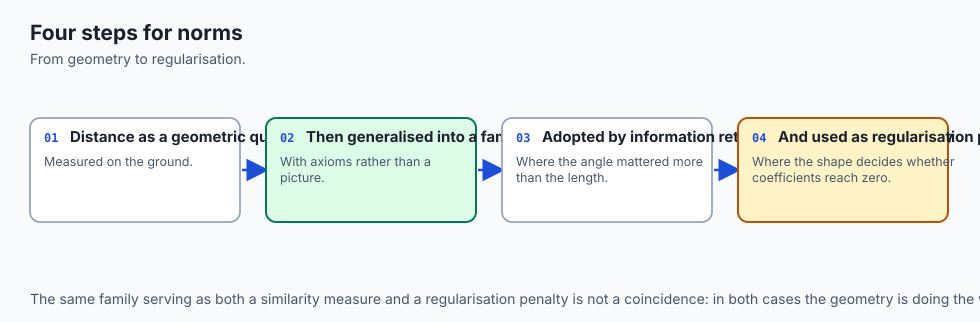

The p-norm family is named after **Hermann Minkowski** (1864–1909), the German mathematician whose *Geometrie der Zahlen* of 1896 studied the geometry you get when you replace the round unit circle with a different convex shape. That is exactly what changing `p` does: L1's unit "circle" is a diamond, L2's is a circle, L-infinity's is a square. Minkowski was doing number theory, not data science; the tool arrived a century before the application.

The name **Manhattan distance** comes from the grid, and the phrase "taxicab geometry" was popularised by **Karl Menger** in the 1950s to describe exactly the situation this day keeps returning to: on a street grid, the straight-line distance between two points is a number you cannot travel. **Chebyshev distance** carries the name of **Pafnuty Chebyshev** (1821–1894), whose work on approximation is built on minimising the largest error rather than the total one — which is precisely what the L-infinity norm measures.

The abstract framework came later than the specific measures. **Maurice Fréchet**, in his 1906 doctoral thesis, stripped "distance" down to the small set of properties that make the arguments work, giving what we now call a **metric space**. **Felix Hausdorff** gave it that name in his 1914 *Grundzüge der Mengenlehre*. **Stefan Banach**'s 1922 thesis did the same for norms. So the four axioms you will meet in a moment were not written down to be pedantic; they were extracted, over about fifteen years, as the shortest list from which the useful theorems still follow.

Three of today's measures came from three completely different problems, which is worth noticing because it explains why they feel so unalike.

**Paul Jaccard** (1868–1944) was a Swiss botanist. In 1901, comparing the plant species found on different alpine sites, he needed a number for "how much do these two lists of species overlap", and he divided the size of the intersection by the size of the union. That is the whole of Jaccard similarity, and it was designed for exactly the situation where two lists are of very different lengths.

**Prasanta Chandra Mahalanobis** (1893–1972) founded the Indian Statistical Institute in 1931 and published "On the generalised distance in statistics" in 1936. His problem was anthropometric: given several body measurements of two populations, how far apart are they? Ordinary distance was no good, because the measurements were correlated — tall people are also heavier — and because they were in different units. His answer was to measure distance *after* accounting for how the data actually varies, which is the idea this day builds directly on top of Day 106.

**Richard Hamming** (1915–1998) published "Error Detecting and Error Correcting Codes" in the *Bell System Technical Journal* in April 1950. He was not measuring similarity at all; he was designing codes that could survive a flipped bit, and he needed to know how many bit flips separated two code words. Count the positions that differ. Nothing is subtracted, which is why it works on data that has no arithmetic — and why it is the right answer for categorical features seventy-five years later.

## What it is — and what it is not

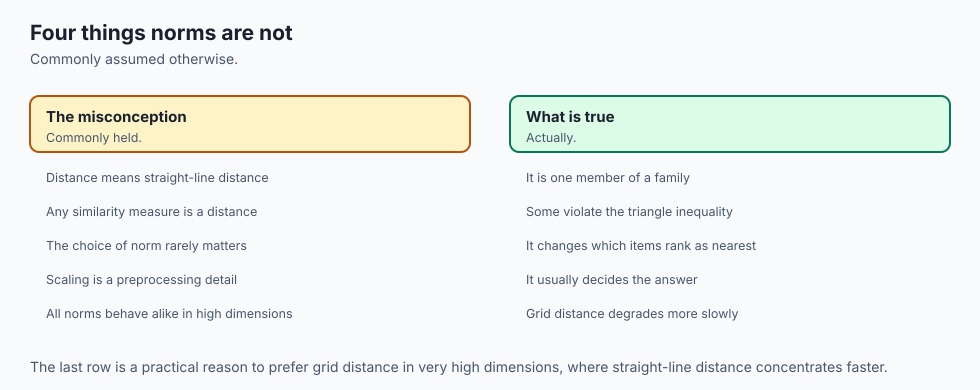

A **norm** is a function that takes one vector and returns its size. To earn the name it must satisfy four requirements, and each of them rules out something that would otherwise seem reasonable.

| Requirement | In symbols | What it forbids |
| --- | --- | --- |
| Non-negativity | ‖v‖ ≥ 0 | A "size" that can be negative. |
| Zero only at zero | ‖v‖ = 0 exactly when v = 0 | A non-zero vector with no size, so that "distance 0" would stop meaning "identical". |
| Absolute homogeneity | ‖k·v‖ = \|k\|·‖v‖ | Doubling a vector changing its size by anything other than a factor of two. |
| Triangle inequality | ‖v + w‖ ≤ ‖v‖ + ‖w‖ | A detour that is shorter than going direct. |

The third one is the one people forget, and it has a famous casualty. **Squared Euclidean distance** — sum of squared differences, no square root — is everywhere in machine learning, because it saves a square root and because it is what least squares minimises. It is not a norm. Run the lab's own numbers: for `v = (3, -4, 12)` the sum of squares is 169, and for `2v` it is 676, which is four times as much and not twice. Absolute homogeneity fails outright.

That does not make it useless. Squaring is monotonic on non-negative numbers, so ranking by squared distance gives *exactly* the same order as ranking by Euclidean distance — the lab asserts this on the three articles above. What it makes it is useless as a **distance**, so it must never be handed to anything that assumes the triangle inequality, such as a ball tree or a metric-space index.

A **metric** is the same idea for a function of *two* arguments. Its four axioms are the ones you would guess: `d(x, y) ≥ 0`; `d(x, y) = 0` exactly when `x = y`; `d(x, y) = d(y, x)`; and `d(x, z) ≤ d(x, y) + d(y, z)`. Every norm gives you a metric for free, by measuring the norm of the difference.

Here is what today is **not**.

It is not a claim that one measure is best. Every section below has a case where the popular default is answering a question nobody asked, and every section also has a case where the popular default is exactly right.

It is not a claim that non-metrics are bad. Cosine distance fails two of the four metric axioms and is the most-used similarity measure in the field, for good reasons. The point is to know which axiom you gave up and what you were relying on it for.

And it is not a substitute for a good representation. No distance function rescues features that do not carry the information you need. Choosing a measure is the last ten per cent of the modelling; it is just the ten per cent that is usually left to a default.

## Why it was created and what problems it solves

Each member of the family exists because a specific reasonable-sounding answer was wrong for a specific real problem.

**The p-norm family exists because "how far apart" depends on how you are allowed to move.** Take one displacement — six metres across a warehouse floor and eight metres along it — and ask three machines how far it is:

```
    L1  (Manhattan) =  14.0   a picker walking the aisles, one axis at a time
    L2  (Euclidean) =  10.0   a drone flying it straight
    Linf (Chebyshev)=   8.0   a two-axis gantry whose motors run at once, so
                              the slower axis alone sets the finishing time
```

None of the three is a rounding of another. Each is the true cost for a different machine, and a route planner that picks the wrong one optimises a journey nobody takes. Notice also that `L∞ ≤ L2 ≤ L1` always, which is not a coincidence — it is the same fact as the falling column of p-norms, applied to a difference.

**Chebyshev exists because some rules are about the worst case, not the average.** A machined part has four dimensions and is rejected if *any* one of them is out by more than 0.05 mm. That acceptance rule is an L-infinity ball and cannot be written as anything else. Here are two batches:

```
    batch     deviations                            L1      L2   L-inf  verdict
    batch-A   [+0.04, -0.04, +0.04, -0.04]        0.16  0.0800    0.04  ACCEPT
    batch-B   [+0.00, +0.00, +0.00, +0.09]        0.09  0.0900    0.09  REJECT
```

Read that twice. batch-A is out on all four dimensions and its total error is nearly double batch-B's — and batch-A is the one that passes. Both L1 and L2 rank batch-B as the better part. Both are answering a question the inspection department did not ask. Whenever the rule is "no single feature may be worse than X", averaging is not a safe default; it is a way of hiding one bad value behind three good ones.

**Hamming exists because most real feature tables are not made of numbers.** Six categorical fields from a parts register:

```
    field     material    finish      thread      grade       colour      origin
    reference steel       zinc        M8          8.8         silver      IN

    part-71   steel       zinc        M8          8.8         black *     IN
    part-72   brass *     zinc        M8          10.9 *      silver      DE *
    part-73   nylon *     plain *     M6 *        4.6 *       white *     CN *
```

Hamming counts the marked fields: 1, 3 and 6. There is no sense in which brass is nearer to steel than nylon is, and the standard shortcut — encode the categories as 0, 1, 2 and use Euclidean — quietly asserts one. With `steel = 0`, `brass = 1`, `nylon = 2`, the integer-encoded distance from steel to brass is 1 and from steel to nylon is 2, which is a claim about metallurgy that nobody made and nobody checked.

**Jaccard exists because sets of very different sizes need comparing.** Jaccard's alpine sites had wildly different species counts, and so does everything set-shaped in software: tag lists, shopping baskets, the shingles of a document. Dividing by the union charges for everything the two do not share, in both directions, which is exactly what a length-invariant measure like cosine declines to do.

**Mahalanobis exists because features are correlated and in different units.** That is the subject of "How it works" below, and it is the piece that connects most directly to Day 106.

## How it works

### One formula, one dial

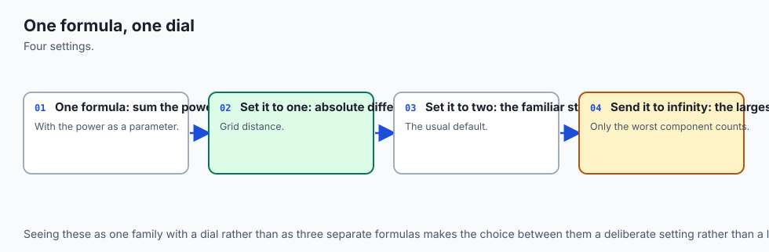

Every norm in the p-family is this:

```
    ‖v‖ₚ  =  ( Σ |xᵢ|ᵖ ) ^ (1/p)
```

Set `p = 1` and the exponent and root do nothing, leaving the sum of absolute values. Set `p = 2` and you have the square root of the sum of squares. Let `p` grow and the largest term dominates the sum so completely that the `p`-th root hands it back alone.

Measured on `v = (3, 4)`, which is the 3-4-5 triangle so the `p = 2` answer is a whole number you can check in your head:

| p | ‖v‖ₚ | note |
| --- | --- | --- |
| 1 | 7.000000 | 3 + 4 |
| 1.5 | 5.584250 | |
| 2 | 5.000000 | the one geometry gives you |
| 3 | 4.497941 | |
| 8 | 4.047992 | |
| 64 | 4.000000 | the limit arrives early |
| ∞ | 4.000000 | just the biggest component |

Two things to take from that column. It **falls** as `p` rises, and it never falls below the largest single component. And `p = 64` already prints `4.000000001`, so "the limit" is not a distant abstraction; it is where the formula has essentially arrived by the time `p` is in double figures.

One more detail that matters in code: `p = ∞` must be handled as the limit, not as arithmetic. `4.0 ** math.inf` is `inf`, and `inf ** 0.0` is `1.0`, so substituting the value gives nonsense. Return the largest absolute component directly.

And `p` below 1 is refused. The formula still produces a number there, but the unit "ball" becomes a four-pointed star and the triangle inequality fails, so it is not a norm. Returning a plausible float would be worse than raising, because it would be used.

### The picture that makes the family click

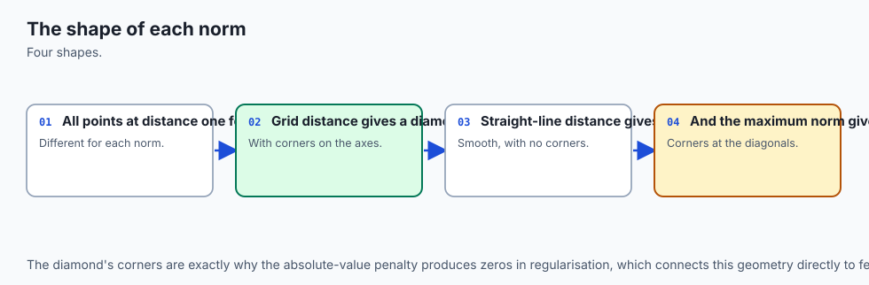

Draw the set of points at distance exactly 1 from the origin, under each norm. That set is the **unit ball**, and it is the clearest single image in the subject.


L1 gives a **diamond**: the points where `|x| + |y| = 1`. L2 gives the familiar **circle**. L-infinity gives a **square**: the points where the larger of `|x|` and `|y|` is 1. Their areas are 2, π and 4 — strictly increasing, which is the same fact as the falling column above said the other way round. A bigger `p` is a more forgiving norm, so more points fit inside its unit ball.

Take a single point, `(0.6, 0.8)`, and measure it three ways. L1 says `0.6 + 0.8 = 1.4`. L2 says `√(0.36 + 0.64) = 1.0`. L-infinity says `max(0.6, 0.8) = 0.8`. On the picture, that point sits *outside* the diamond, *on* the circle and *inside* the square. One point, three sizes, and you can see why.

The lab draws the same three balls as characters on a grid and counts the cells inside each — 469, 723 and 931 — which recovers the areas as 2.036, 3.138 and 4.041. Recognising π in a picture made of `#` and `+` is a pleasant sanity check that the shapes are what they claim to be.

### Metrics, similarities, and the one that is neither

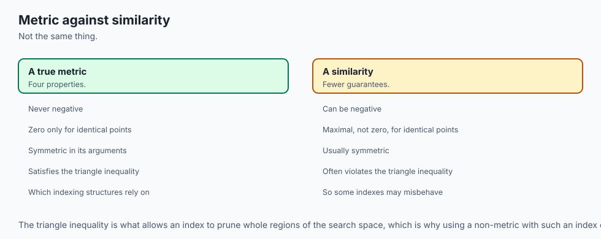

`d(x, y)` is a **metric** when it satisfies non-negativity, zero-only-at-zero, symmetry and the triangle inequality. The fourth is the one with teeth, and here is why you care: it is what lets an index skip whole regions of a dataset without opening them. If your query is 10 away from a cluster's centre and the cluster has radius 2, nothing inside it can be closer than 8. That single deduction is the basis of ball trees, KD-trees, cover trees and every metric-space pruning scheme.

Day 103 proved that **cosine distance is not a metric**. Restated here with a triple you can hold in your head rather than a proof:

```
    cosine_distance(east, diagonal)  = 0.292893
    cosine_distance(diagonal, north) = 0.292893
    ----------------------------------------------
    going via the diagonal           = 0.585786
    cosine_distance(east, north)     = 1.000000   <-- LONGER
```

The direct route is 0.414214 longer than the detour. No metric may ever allow that. The lab goes further and sweeps every one of the 3375 triples of non-zero four-bit vectors: 326 of them violate the inequality. The same exhaustive sweeps over all 4096 triples find that **Jaccard distance** and **Hamming distance** never do.

Cosine distance fails a second axiom too, and this one bites more often in practice. `cosine_distance((1, 0), (2, 0))` is 0 — distance zero between two things that are not the same thing. For cosine that is the *feature*: length is what it was asked to ignore. But it means cosine cannot tell a document from the same document repeated twice, and any deduplication built on it will not either.

The standard repair is worth knowing. **Angular distance**, `arccos(similarity) / π`, is a genuine metric on the same data and preserves the same ranking. Alternatively — and this is what vector databases actually do — normalise every vector to length 1 on the way in. Once `‖u‖ = ‖v‖ = 1`, a single line of algebra gives

```
    ‖u - v‖²  =  2 - 2·cos(u, v)
```

so Euclidean distance and cosine similarity rank identically. You get cosine's behaviour *and* a real metric, and the index is allowed to prune again. The practical advice is not "avoid cosine"; it is "normalise on the way in".

### Jaccard against cosine, on the same data

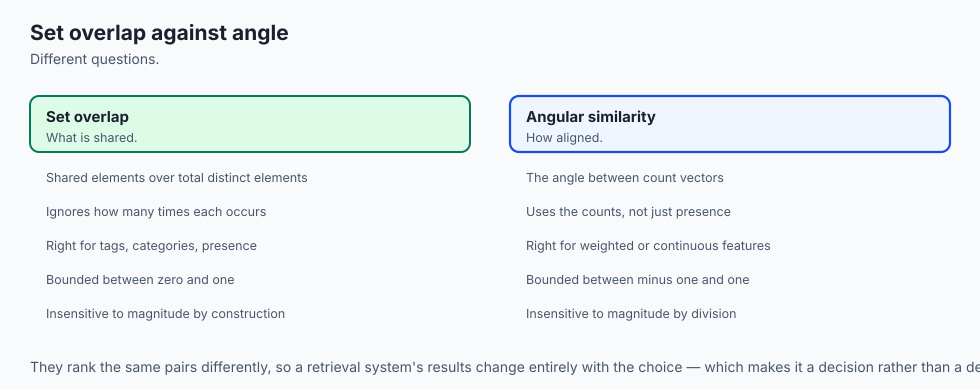

This is the pairing most people get wrong, because cosine is the habit. Take a query of four ingredients and two recipes:

| recipe | size | shared | union | Jaccard | cosine |
| --- | --- | --- | --- | --- | --- |
| Sachertorte | 11 | 4 | 11 | 0.3636 | 0.6030 |
| Shortbread | 3 | 2 | 5 | 0.4000 | 0.5774 |

**Jaccard picks Shortbread. Cosine picks Sachertorte.** Same two sets, same query, opposite answers, and both are defensible.

The arithmetic explains it in one line each. Cosine on binary vectors is `shared / √(|query| · |recipe|)`, so `4 / √44 = 0.6030`. Jaccard is `shared / |union|`, so `4 / 11 = 0.3636`. Sachertorte contains *every* ingredient you named; cosine rewards that and charges only a square root for the seven extras, while Jaccard puts the extras in the denominator at full price.

Which is right depends on the question. "Has it got what I asked for?" is cosine. "Is it about the same size job?" is Jaccard. For duplicate detection, overlapping tag sets, shingled documents and anything where a long item must not out-rank a focused one, Jaccard is the safer default — and unlike cosine distance, `1 - Jaccard` is a real metric.

There is a structural asymmetry underneath, and the lab checks it exhaustively over every pair of non-empty subsets of a six-element universe: **cosine on binary data is never below Jaccard**, because `√(|a|·|b|) ≤ |a ∪ b|` always. Cosine is systematically the more generous of the two on sets. If your relevance scores look suspiciously high, that is a candidate explanation before you go hunting for a bug.

### Mahalanobis: Euclidean, after the data has had its say

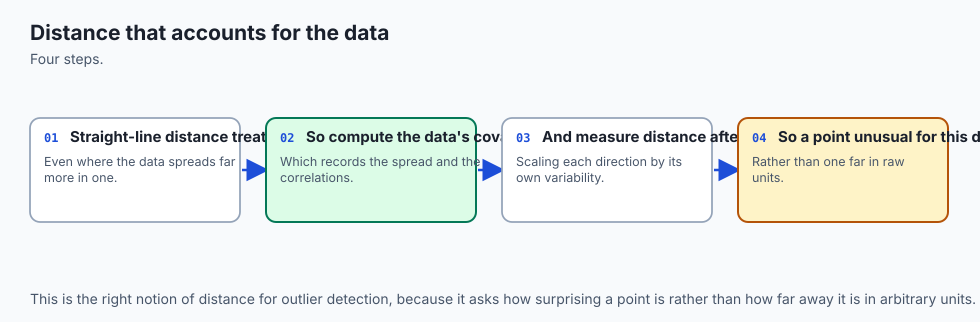

Euclidean distance treats every direction as equally surprising. Real data does not.

Here are eight readings from two sensors that move together:

```
    (-4, -3)  (-3, -4)  (-2, -1)  (-1, -2)  (1, 2)  (2, 1)  (3, 4)  (4, 3)
```

The mean is exactly `(0, 0)` and the population covariance comes out exactly

```
    [[7.5, 7.0],
     [7.0, 7.5]]
```

which you can check by hand: the variance of the first column is `(16+9+4+1+1+4+9+16)/8 = 7.5`, and the covariance is `(12+12+2+2+2+2+12+12)/8 = 7.0`. The correlation is `7.0/7.5 = 0.9333`. The data has a **grain**: it runs along the line `y = x`.

Now take two probe points. `(3, 3)` — both sensors high together, an ordinary Tuesday. And `(3, -3)` — one sensor high while the other is low, which has never happened in this dataset. Both are `√18 = 4.242641` from the mean, and **Euclidean distance cannot tell them apart at all.**

Mahalanobis can. The formula is one line: take the difference `z`, and instead of dotting it with itself, dot it with itself *through* the inverse covariance matrix.

```
    d  =  √( z · (Σ⁻¹ z) )
```

| probe | Euclidean | Mahalanobis |
| --- | --- | --- |
| (3, 3) | 4.242641 | 1.114172 |
| (3, -3) | 4.242641 | 6.000000 |

A factor of 5.39 between two points that ordinary distance scores identically. An anomaly detector built on Euclidean distance *has* to give these the same score, and one of them is a sensor fault.

Where do 1.114172 and 6.0 come from? **Day 106.** Take the eigen-decomposition of that covariance matrix. The eigenvalues are 0.5 and 14.5; the eigenvector for 14.5 is the `(1, 1)` direction — along the grain, where the data spreads a lot — and the one for 0.5 is `(1, -1)`, across it, where it barely spreads at all. Mahalanobis distance is Euclidean distance measured along those eigenvectors, with each component divided by the square root of its own eigenvalue:

```
    along  (3, 3)
      component along  (1, 1)/√2 = +4.242641   / √14.5 = +1.114172
      component across (1,-1)/√2 = +0.000000   / √ 0.5 = +0.000000
      hypotenuse                              = 1.114172

    across (3, -3)
      component along  (1, 1)/√2 = +0.000000   / √14.5 = +0.000000
      component across (1,-1)/√2 = +4.242641   / √ 0.5 = +6.000000
      hypotenuse                              = 6.000000
```

So Mahalanobis is not a new kind of distance. It is Euclidean distance in the coordinate system the data chose for itself, and Day 106's eigenvectors are the axes of that system. Substitute the identity matrix for `Σ⁻¹` and you get ordinary Euclidean distance back exactly — which is the cleanest statement of what the covariance is doing. It is the thing that *would* be the identity if every feature had variance 1 and no feature had anything to do with any other. Real data is never that, and Euclidean distance quietly assumes it always is.

The cost is real and worth stating. Mahalanobis needs an invertible covariance matrix, which needs more rows than columns and no two features that are exact duplicates. It needs re-estimating when the data drifts. And a singular covariance must fail loudly rather than return a plausible number — the lab's implementation raises on `[[1, 2], [2, 4]]`.

### The thing that silently decides your answer

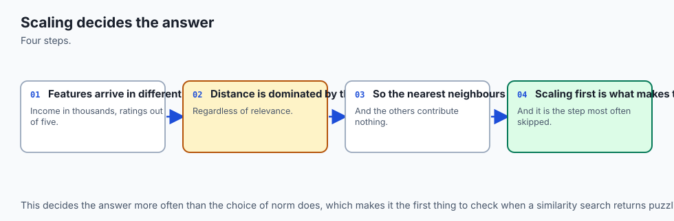

Everything above assumed the columns were comparable. They usually are not.


A bearing catalogue with two features, recorded in whatever units the supplier used: bore diameter in **metres** and mass in **grams**. The query wants a 0.020 m bore and 300 g. Rank on raw Euclidean distance:

```
    part          distance       bore term       mass term   bore share
    R             2.000036        1.44e-04            4.00   0.003600%
    U            25.000001        3.60e-05          625.00   0.000006%
    P            40.000000        0.00e+00         1600.00   0.000000%
```

Look at the last column. The bore diameter contributes less than one ten-thousandth of one per cent of every distance in the table. This is not a ranking on two features; it is a ranking on mass with a rounding error attached. And the winner, R, has a 32 mm bore where 20 mm was asked for — 60 per cent oversize, a part that will not fit the shaft. It wins because it is 2 g from the target mass. P, which has *exactly* the bore requested, comes third.

Standardise both columns — subtract the column mean, divide by the column standard deviation — and re-run the identical code:

```
    part        bore (z)    mass (z)      distance
    P            -0.2928     -0.0720      0.466883
    U            -0.8783     -0.8307      0.654221
    R             0.8783     -0.5155      1.171313
```

**The winner changed from R to P.** Two of the six parts moved, and they are the two the decision was between: P and R swapped first for third.

The clearest proof that the raw ranking was an artefact is to change no data at all — only the unit one column is written in:

```
    bore in metres        ['R', 'U', 'P', 'S', 'T', 'V']
    bore in millimetres   ['R', 'U', 'P', 'S', 'T', 'V']
    bore in micrometres   ['P', 'U', 'T', 'R', 'S', 'V']
```

The parts did not change; a column header did. Any pipeline that does not normalise is letting whoever chose the units decide the ranking, and that person was not thinking about distances.

Two details worth carrying. First, standardise the query with the **catalogue's** means and standard deviations, not its own — a single row standardised against itself is a row of zeros, which is exactly the mistake scikit-learn's `fit`/`transform` split exists to prevent. Second, this is not a property of six hand-picked rows: the lab runs 2000 random catalogues from a seeded generator and the winner changes after standardising in 1090 of them, about 55 per cent.

One more warning, because "cosine is scale invariant" is repeated far too confidently. Cosine ignores the length of a **vector**. It does not ignore the units of a **column**, and it cannot, because changing one column's units rotates every vector in the table. The lab checks both halves: doubling every candidate vector leaves the cosine ranking untouched to within 1e-12, and changing the bore column from metres to micrometres changes it.

## An everyday analogy

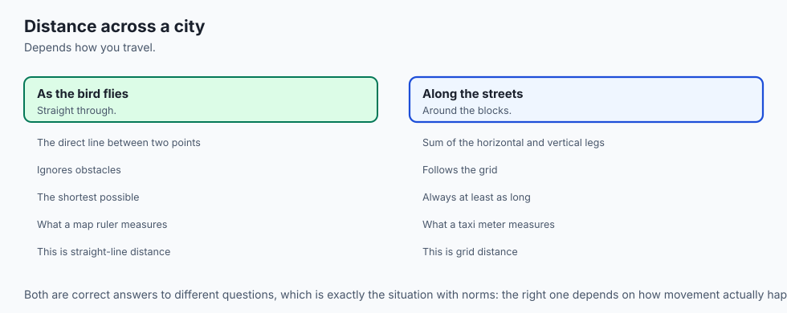

Think of a city, and of the question "how far is the station from here?"

Ask a **taxi driver**. She answers in blocks: four across and three up is seven blocks, because she cannot drive through buildings. Every block costs the same wherever it is. That is L1, and her answer is not an approximation of anything — for a taxi, it is exact.

Ask a **pigeon**. It answers five, because it flies the diagonal. That is L2, and it is the only one of these that is a physical length.

Ask the **site foreman** running a gantry crane on two rails. He answers four, because the two motors run at once and the job finishes when the slower axis finishes. That is L-infinity, and it is the only one that predicts his schedule.

Three answers, one displacement, nobody wrong. That is the whole family, and it is why "which is the real distance" is not a question with an answer until you have said who is travelling.

Now extend it. Ask "how far is that shop from this shop", where the shops are described not by position but by what they sell. Two shops that stock exactly the same twelve things are the same shop for your purposes, even if one is in a different postcode — that is **cosine**, throwing away magnitude and keeping direction. A corner shop stocking four of your twelve, and a department store stocking all twelve plus four hundred others: cosine likes the department store, because everything you wanted is there. **Jaccard** likes the corner shop, because most of what *it* sells is what you wanted. Both are reasonable shopping advice; they are advice about different trips.

Then there is the part of the analogy that Mahalanobis supplies, and it is the one that changes how people think. In a real city, "one kilometre" is not one thing either. A kilometre along the motorway is nothing; a kilometre across a river with no bridge is a serious journey. Locals know this and route accordingly, not by measuring the map but by knowing where the city *flows*. Mahalanobis distance is what you get when you let the data tell you where it flows — along the grain is cheap, across it is expensive — and Day 106's eigenvectors are the roads.

The analogy has one leak, and it is worth naming rather than hiding: in a city the geography is fixed, while a covariance matrix is *estimated* from the data you happen to have. Add a few readings across the grain and the "river" narrows. That is a real difference, and the security section returns to it.

## Examples in practice

**Text and semantic retrieval — cosine, almost always.** Documents vary enormously in length, and length is exactly what you want to ignore: a 5,000-word article on norms and a 500-word note on norms are about the same thing. In the opening example, Cartogram is the query's profile at three times the length and scores a cosine of exactly 1.0 while sitting further away in L2 than anything else on the page. Every vector database defaults to cosine or to inner product on normalised vectors for this reason, and the reason is not that cosine is better in the abstract.

**Recommenders and basket analysis — Jaccard, more often than people use it.** "Customers who bought this also bought" is set overlap. Cosine here systematically favours the customer with three hundred purchases, because it charges only a square root for their other 296 items. If your recommendations are dominated by generically popular items, that is worth checking before you reach for a re-ranker.

**Tabular models and clustering — Euclidean, after scaling, or Mahalanobis instead.** k-means is defined in terms of squared Euclidean distance and cannot be given a different measure without changing what it converges to. That makes scaling non-optional rather than advisable: the bearing catalogue above is what k-means sees when you skip it.

**Categorical features — Hamming, and the mistake to avoid.** The integer-encoding trap earlier is not hypothetical; it is what happens when a categorical column survives a `LabelEncoder` and goes straight into a distance-based model. One-hot encoding plus Hamming, or Gower distance for mixed tables, is the honest route. Note the pleasant coincidence the lab measures: on **binary** features, Hamming, L1 and squared L2 are all the same number, because every difference is 0 or 1 and 1 squared is 1. That coincidence is worth knowing and worth distrusting, because it evaporates the moment the encoding is integers rather than bits.

**Anomaly detection and quality control — Mahalanobis and Chebyshev.** Mahalanobis is the standard multivariate outlier score precisely because of the two-probe example above. Chebyshev is what a tolerance specification already is, whether or not anyone has written it that way.

**Embedding spaces at scale — everything above, plus the curse.** Day 103 introduced the curse of dimensionality: as dimensions grow, the ratio of the nearest to the farthest distance approaches 1 and "nearest neighbour" stops meaning much. It hits the p-norms unevenly, and lower `p` degrades more slowly — which is a genuine argument for L1 in high dimensions and one that is easy to test yourself. The lab's fifth extension exercise sets it up.

## Implications: security, privacy, performance, scalability, and cost

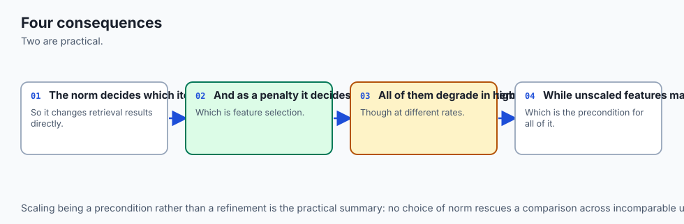

**Security.** A distance function is an access-control decision in disguise whenever it is used for matching. Face matching, fingerprint matching, deduplication, fraud-ring detection, "is this login from a familiar device" — every one is a threshold on a distance, and every one inherits whatever the measure was told to ignore.

Three consequences follow directly from this day's material. Cosine similarity cannot distinguish a document from the same document repeated, which the lab asserts as `cosine_distance((1, 0), (2, 0)) == 0`; a plagiarism or dedup check built on cosine over raw counts inherits that hole. An unscaled feature is a published map of which field to manipulate — if one column contributes 99.99 per cent of the distance, an attacker needs to control exactly one column. And Mahalanobis depends on an *estimate*: an adversary who can inject rows can widen the variance in the direction they intend to attack along, and their own anomaly score drops afterwards. Any detector that re-fits its covariance on live traffic without provenance controls has that property.

**Privacy.** Distances leak. Publishing pairwise distances between records is not anonymisation: with enough of them, multidimensional scaling reconstructs the geometry, and with a few known points it reconstructs positions. "We only shared the similarity matrix" is a sentence that has preceded several re-identification results. The same caution applies to exposing raw similarity scores through an API, which is an oracle an attacker can query.

**Performance.** The measures differ by more than a constant. L1 needs an absolute value per dimension; L2 needs a multiply and, if you actually take the root, a square root — which is why so much code ranks on squared distance and why that is legitimate for *ranking* and illegitimate for anything that needs the triangle inequality. Cosine needs two norms as well as the dot product, unless you normalise once at write time and store unit vectors, which turns every subsequent comparison into a plain dot product. That is the single biggest constant-factor win available in a retrieval system, and it is free.

Mahalanobis is the expensive one, and it is worth knowing where the cost sits. Inverting the covariance is `O(d³)` and happens once; each subsequent distance is a matrix-vector product, `O(d²)` rather than `O(d)`. In 1000 dimensions that is a thousandfold increase per comparison, which is why Mahalanobis is common in tens of dimensions and rare in embedding spaces. The usual compromise is a diagonal covariance, which is exactly per-feature standardisation and costs nothing extra.

**Scalability.** This is where the metric axioms turn into money. A metric permits tree-based pruning, so a query need not touch most of the dataset. A non-metric does not, and the honest options are brute force, an approximate index whose guarantees are empirical rather than proved, or normalising to make Euclidean distance apply. The last is why "normalise on the way in" is the standard advice and not merely a tidiness preference.

**Cost.** The concrete bill is the one at the top of this lesson. A vector index is built for a chosen metric, and changing it means rebuilding — for a large corpus, hours of compute and, on managed services, a real invoice. The cheap moment to think about the measure is before the first index is created; the expensive moment is after a relevance complaint six months later.

## Alternatives: free, open source, and commercial

Everything named here is free and open source. There is no paid tier for any of it, and none of it needs an account or a key. The commercial products in the area — managed vector databases — charge for hosting and operations, not for the distance functions, which are the same handful of formulas everywhere.

**NumPy's `linalg.norm` — used here, and it is the p-norm family.** Its `ord` parameter *is* `p`. `ord=1`, `ord=2` and `ord=np.inf` are L1, L2 and Chebyshev, and any float in between works too.

```python
import numpy as np
d = np.asarray(query) - np.asarray(candidate)
np.linalg.norm(d, ord=1)       # Manhattan
np.linalg.norm(d, ord=2)       # Euclidean
np.linalg.norm(d, ord=np.inf)  # Chebyshev
np.linalg.norm(d, ord=1.5)     # anywhere in between
```

**Choose it when** you are already in NumPy and want one distance at a time, or a whole column of them with `axis=`. On the authoring machine it agreed with the from-scratch implementation in the lab to within 1e-12 on every `p` tested, and this is the tool the lab actually ran. Two traps worth knowing: `ord=0` counts the non-zero entries, which is genuinely useful for measuring sparsity and is **not a norm** — doubling a vector does not change how many entries are non-zero, so absolute homogeneity fails; and negative `ord` values are accepted and are not norms either.

**SciPy's `scipy.spatial.distance` — the standard toolbox. Not installed on the authoring machine, so no output is reproduced for it here; the description is from its documentation.** It provides the individual functions (`cityblock`, `euclidean`, `chebyshev`, `minkowski`, `cosine`, `hamming`, `jaccard`, `mahalanobis`, `canberra`, `braycurtis` and more), plus the two that matter at scale: `cdist(XA, XB, metric=...)` for every pair between two collections, and `pdist(X, metric=...)` for every pair within one, returned in condensed form. **Choose it when** you need a matrix of distances rather than one, or when you need a metric NumPy does not have. Two documented behaviours to note before you swap it in: `scipy.spatial.distance.hamming` returns the *fraction* of differing positions rather than the count, and its `jaccard` operates on boolean arrays.

**scikit-learn's `pairwise_distances` — the one that scales. Not installed here either, and no output is reproduced.** Same idea as `cdist` with two additions that matter in practice: `n_jobs` for parallelism, and `metric="precomputed"` so that estimators such as `DBSCAN`, `AgglomerativeClustering` and `KNeighborsClassifier` accept a distance matrix you computed yourself with any measure at all — including one of your own. That is the escape hatch when a library's built-in metrics do not include what your data needs. `sklearn.preprocessing.StandardScaler` is the standardisation from this lesson, with the `fit`/`transform` split that prevents the query-standardised-against-itself bug, and it uses the population divisor `n`, which is what this lab's `column_stds` matches.

**Vector databases — the metric as a creation-time decision. Not exercised here; described from documentation.** FAISS (open source, from Meta) exposes `IndexFlatL2` and `IndexFlatIP` for inner product, with cosine obtained by normalising vectors before insertion. pgvector (open source, a PostgreSQL extension) exposes L2, inner product, cosine, L1, Hamming and Jaccard distance through distinct operators, and the index you build must match the operator you query with. Qdrant, Weaviate, Milvus and Chroma are all open source and all take the metric as a collection-creation parameter. The pattern is the same everywhere and it is the practical reason this day exists: **the metric is chosen when the index is created, and changing it means rebuilding.**

**Writing it yourself — always available, and often right.** The measures are three to ten lines each. The lab writes seventeen of them with `abs`, `sum`, `max` and `math.sqrt`. Choose that when you need a measure nobody ships (a weighted mix, a domain-specific edit distance, a cost matrix over categories), when the dependency is not worth it, or when — as here — the point is to know what the library is doing.

## Comparison with related concepts

| Measure | Distance or similarity | A metric? | Right when | Wrong when |
| --- | --- | --- | --- | --- |
| L1 / Manhattan | distance | yes | Movement is axis-by-axis; you want total disagreement; high dimensions | One big error should cost more than several small ones |
| L2 / Euclidean | distance | yes | Real geometry; one large error must dominate; features already comparable | Features in mismatched units, or heavily correlated |
| L-infinity / Chebyshev | distance | yes | A tolerance rule; the slowest axis sets the time | Every feature should contribute |
| Cosine similarity | similarity | **no** | Direction matters and magnitude does not: text, embeddings | Magnitude is information — counts, prices, quantities |
| Hamming | distance | yes | Categorical or binary fields with no ordering | Values have a real numeric ordering |
| Jaccard | similarity | 1 − it is a metric | Sets of differing sizes; overlap, deduplication | Repeat counts matter, not just presence |
| Mahalanobis | distance | yes, given a fixed Σ⁻¹ | Correlated features, mixed units, outlier scoring | d is large, rows are few, or the covariance is singular |
| Squared Euclidean | neither | **no** | Ranking only, where the root is wasted work | Anything assuming the triangle inequality |

Two distinctions people conflate, worth separating explicitly.

**Similarity is not "one minus distance".** Cosine similarity runs from −1 to 1 and `1 − cosine` is bounded and well behaved, so that particular conversion is fine. Euclidean distance is unbounded, so `1 − d` goes negative and `1/(1+d)` is a choice, not a derivation. Any time you convert between the two you have added a modelling assumption; write it down.

**Standardising is not the same as what Mahalanobis does.** Standardising rescales each column independently. Mahalanobis also removes the *correlation between* columns. On the bearing catalogue, where bore and mass correlate at +0.7979, the two give different answers: standardised Euclidean ranks P first, Mahalanobis on the raw numbers ranks U first and P second. Both demote the unusable part R — from first to third and from first to fifth respectively — but they disagree at the top, and the disagreement is not noise. Once you know that heavier goes with wider in this catalogue, being heavy-for-its-bore is the surprising thing, and U, which is smaller and lighter *together*, reads as the nearer part. Whether you want that is a modelling decision, which is this day's entire subject.

That last result is worth flagging as a correction. It is natural to expect Mahalanobis to reproduce the standardised ranking, since both are cures for the same disease. On this catalogue it does not, and the reason is the correlation term. The lab asserts the ranking it actually measured rather than the one that would have made a tidier sentence.

## When to use it — and when not to

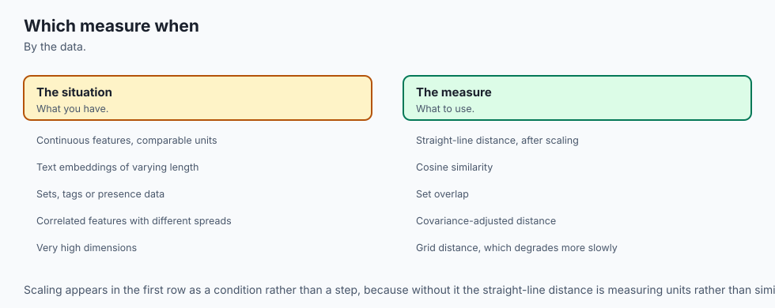

Choose by the **shape of the data**, not by the name of the measure.

| The data looks like | Reach for | Because |
| --- | --- | --- |
| Text, embeddings, anything where length varies but topic is the point | Cosine, or L2 on unit-normalised vectors | Direction carries the meaning; length is an artefact of how much was written |
| Sets: tags, baskets, shingles, species lists | Jaccard | Charges for what is not shared, in both directions, so a long item cannot out-rank a focused one |
| Categorical fields with no ordering | Hamming | Counts differences without inventing an ordering that is not there |
| Binary flags | Hamming, L1 or squared L2 — they agree exactly | Every difference is 0 or 1, and 1 squared is 1 |
| Numeric features, comparable units, roughly independent | Euclidean | The straightforward answer, and here it is the right one |
| Numeric features in mismatched units | Standardise, then Euclidean | Otherwise the column with the bigger numbers decides alone |
| Numeric features that are correlated | Mahalanobis | Removes the shared movement as well as the scale |
| Movement is constrained to axes | Manhattan | The diagonal is a distance you cannot travel |
| The rule is "no single feature worse than X" | Chebyshev | That rule already *is* an L-infinity ball |
| Very high dimensions | Lower p; consider L1 | The curse degrades higher p faster |

And the cases where the popular answer is wrong:

**Do not use cosine when magnitude is information.** Prices, counts, quantities, dosages. Cosine will happily tell you that a basket of 2 items and a basket of 200 in the same proportions are identical.

**Do not use Euclidean on unscaled mixed-unit features.** This is the single most common failure in the list, it produces no error message, and the bearing example above is what it looks like.

**Do not use a non-metric where a metric is assumed.** Ball trees, cover trees, metric-space pruning, and the termination proof for k-medoids all need the triangle inequality. Normalise and use Euclidean, or use angular distance.

**Do not use Mahalanobis when you cannot estimate the covariance.** More features than rows, or two features that are duplicates, and the matrix is singular. A shrinkage estimator or a diagonal covariance is the honest fallback; the diagonal case is exactly per-feature standardisation.

**Do not encode categories as integers and reach for Euclidean.** It is fast, it runs, and it asserts an ordering that does not exist.

**Do not put squared Euclidean distance anywhere that needs a distance.** Ranking, yes. Anything else, no.

Finally, a heuristic that is worth more than any of the above: **if you cannot say in one sentence what question your measure is asking, you have not chosen it yet.** "Total disagreement across the features." "Is any single feature badly wrong." "Same mix, any size." "How many fields differ." "How much of everything involved is shared." "How surprising is this, given how the data usually behaves." If none of those is the sentence you want, the measure is not one of these.

## The AI connection

- **Which distance you choose changes which items count as similar**, so it is a modelling
  decision rather than a technicality.
- **Every retrieval system rests on a norm**, and swapping it changes the results.
- **Regularisation penalties are norms**, which is why the squared and absolute penalties
  behave so differently.
- **Norms behave unintuitively in high dimensions**, which is the constraint that shapes
  embedding size.
- **Matching the metric to the data** is what separates a working similarity search from one
  that returns plausible nonsense.

## Knowledge check

Take the quiz for this day. Eight questions, and two of them are the ones worth getting right: why cosine distance is not a metric — and what, specifically, breaks as a result — and what standardising actually changes about a ranking. If either of those is fuzzy, re-read "Metrics, similarities, and the one that is neither" and "The thing that silently decides your answer" before moving on.

## Hands-on exercise

The lab is **"Choose Your Distance on Purpose"**. Set it up:

```bash
cd labs/sections/math-statistics-and-data/day-107-norms-distances-and-similarity-measures
python3 -m venv .venv
.venv/bin/pip install -r requirements/requirements.txt
.venv/bin/python3 -c "import numpy; print(numpy.__version__)"
```

Then read `starter/00_brief.md` and work through `starter/measures.py` — seventeen functions in pure Python, standard library only — and `starter/answers.py`, twenty-five predictions to write down *before* you run anything.

The order that hurts least: the three norms first, then the general `p_norm`, then the three distances and cosine, then Hamming, Jaccard and the binary-vector helper, then `rank`. Everything above becomes visible the moment `rank` works. Finish with the statistics: `column_means`, `column_stds`, `standardise`, `covariance_matrix` and `mahalanobis_distance`.

Check yourself at any point, from the lab directory:

```bash
.venv/bin/pytest starter -q
```

### Expected output

On an untouched checkout:

```
1 passed, 71 skipped
```

Unattempted work is **skipped**, not failed. When it says `72 passed`, you are finished.

The reference scripts, run afterwards, produce the numbers this lesson quotes. The opening disagreement:

```
    L1 (Manhattan)       picks  Aisle
    L2 (Euclidean)       picks  Beacon
    L-inf (Chebyshev)    picks  Beacon
    cosine similarity    picks  Cartogram
```

The three unit balls, drawn as characters — `#` inside the L1 diamond, `+` out to the L2 circle, `.` filling the corners of the L-infinity square:

```
          ................+++++++###+++++++................
          ...........+++++++++#########+++++++++...........
          ......+++++++++###################+++++++++......
          ..++++++#################################++++++..
          #################################################
          ..++++++#################################++++++..
          ......+++++++++###################+++++++++......
          ...........++++++++++#######++++++++++...........
          ................+++++++###+++++++................
```

The two probes that Euclidean distance cannot separate:

```
    probe            Euclidean   Mahalanobis
    (3.0, 3.0)        4.242641      1.114172
    (3.0, -3.0)       4.242641      6.000000
```

And the full harness:

```
98 checks, 0 failure(s).
```

### Validate your work

1. The install printed `2.5.2`.
2. `.venv/bin/pytest examples -q` prints `105 passed`.
3. `.venv/bin/pytest starter -q` prints `1 passed, 71 skipped` before you start and `72 passed` when you finish.
4. Each of the six reference scripts exits 0 and ends with `NN_name.py: every assertion held.`
5. `bash tests/run_tests.sh` prints `98 checks, 0 failure(s).` and exits 0. Check the exit status directly rather than through a pipe:

   ```bash
   bash tests/run_tests.sh; echo "exit=$?"
   ```

6. Your own output matches `expected-output/`, allowing for the machine-dependent fields named in `expected-output/FIELDS.md`.

### Troubleshooting

**`p_norm` returns `inf` at `p = math.inf`.** You computed the limit as arithmetic. `4.0 ** math.inf` is `inf`. Handle the infinity case with `math.isinf(p)` and return the largest absolute component.

**`ValueError: max() arg is an empty sequence`.** `max(())` raises where `sum(())` returns 0. Pass `default=0.0`. An empty vector is not exotic — it is what a feature extractor returns for a document containing none of your vocabulary.

**`column_stds` is about 9 per cent off NumPy's.** You divided by `n - 1`. This lab uses the population divisor `n`, which is what `numpy.std` does by default and what scikit-learn's `StandardScaler` uses.

**Every standardised value came out zero.** You standardised the query against itself. Compute the means and standard deviations from the catalogue and pass them in.

**`math domain error` inside `mahalanobis_distance`.** The value under the square root should be exactly 0 and came out around `-1e-17`. Clamp a tiny negative to 0 — but raise for one that is genuinely negative, because that means the matrix you were handed is not an inverse covariance. Do not use `abs`; it would turn a real error into a plausible number.

**The two Mahalanobis routes disagree in the last digit.** They are supposed to. The lab's Gauss-Jordan inverse gives exactly `6.0` and `numpy.linalg.inv` gives `5.999999999999999`, a difference of `8.882e-16`. Both are correct; IEEE 754 addition is not associative. This is why every comparison in the lab states a tolerance.

`troubleshooting.md` in the lab covers the rest.

### Common mistakes

- **Sorting a similarity ascending.** `cosine_similarity` and `jaccard_similarity` grow as things get more alike; everything else here shrinks. Get it backwards and the worst match arrives at the top with no error anywhere. This is the most consequential bug in the lab, and `rank` takes an explicit `higher_is_better` flag so that the choice has to be made rather than assumed.
- **Zipping two vectors of different lengths.** `zip` truncates silently, so you get an answer to a question you did not ask. The lab's `_paired` raises instead.
- **Returning 0.0 for the cosine of a zero vector.** It has no direction; the answer is undefined. Raise.
- **Breaking ranking ties by dictionary order.** Two candidates that score exactly equal will swap between runs. Sort on a tuple so ties fall back to the name.
- **Patching `p < 1` through.** The formula still returns a number below `p = 1` and that number is not a norm. Refuse it.

## Practice assignment

Take a dataset of your own — one you already have, with at least four features and at least one non-numeric column — and write a one-page **measure decision record** for it. Not an essay; a record you would put in a repository.

It must contain:

1. **A table of your features**, each with its type (numeric, categorical, binary, set-valued), its units, and its observed range. The units column is the one that does the work.
2. **The question you are asking**, in one sentence, in the form of one of the six sentences from the end of "When to use it — and when not to". If none of them fits, write your own and say why the six do not.
3. **Your chosen measure, and two you rejected**, each with a sentence saying what it would have got wrong on *your* data.
4. **Evidence, computed by you.** Rank the same five candidates against the same query under all three measures, using the lab's `rank` with the measure as a parameter, and paste the three orderings. If they agree, say so — that is a real result and it means the choice matters less than you feared.
5. **A before-and-after scaling check.** Rank once on raw values and once after standardising, and report whether the top result changed. If your features are already in the same units, say that and say why it is safe.
6. **The metric question.** Is your measure a metric? If not, name the axiom it fails and the thing downstream that was relying on it — an index, a clustering algorithm, a proof, or nothing.

Two guardrails so the exercise stays honest. State a tolerance for every float you compare, and use a fixed seed if any part of it is random. And if the three orderings turn out identical, do not go looking for a dataset where they differ; report what you found. A dataset where the measure does not matter is worth knowing about, and it is not a failed assignment.

## Extension challenge

Five, in rough order of difficulty. The first three are in the lab's own extension list with full setups.

**1. Draw the ball for `p = 0.5`.** `p_norm` refuses it, and the refusal deserves evidence. Relax the guard in a copy, render the "unit ball" on the character grid from script 02, and find a concrete triple that breaks the triangle inequality on the four-pointed star you get. You will then have proved the guard right rather than taken it on trust.

**2. Poison a covariance.** Add rows to the sensor dataset that lie *across* the grain, recompute the covariance, and watch the Mahalanobis distance of `(3, -3)` fall from 6.0. How many injected rows does it take before the anomaly scores as normal? That number is the one a security review would want, and it is the concrete form of the caution in this lesson's Implications section.

**3. Measure the curse.** Generate random points in 2, 10, 100 and 1000 dimensions and plot the ratio of the nearest to the farthest distance under L1, L2 and cosine. One of the three degrades much more slowly than the others. Day 103 introduced the curse as a warning; this turns it into a graph you made.

**4. Build a weighted Mahalanobis by hand.** A diagonal matrix in the Mahalanobis formula is exactly a per-feature weighting. Set the weights deliberately — "bore diameter matters ten times as much as mass" — and compare the resulting ranking with the standardised one and with the full-covariance one. You now have three defensible answers and a reason to prefer one, which is the position this day is trying to get you to.

**5. Implement one metric nobody shipped.** Pick a domain measure that no library provides: a cost matrix over your categories where "steel to brass" genuinely is cheaper than "steel to nylon" because you have a substitution table; or a weighted Jaccard where rare tags count for more. Then check the four metric axioms numerically the way script 03 does, exhaustively if your space is small enough. Most home-made measures fail one. Finding out which — before an index is built on it — is the whole skill this day is for.

## The AI thread

Every retrieval system, every clustering algorithm and every nearest-neighbour classifier has a distance function inside it, and it is the hyperparameter people most reliably leave at the default.

Think about how much rests on it. Retrieval-augmented generation is a distance computation followed by a language model: the model can only reason over what the retrieval step handed it, so the measure decides what the model is allowed to know. A recommender is a distance over user or item vectors. Anomaly detection is a threshold on a distance. Semi-supervised learning propagates labels along a graph built from distances. Even the loss functions are norms — L2 loss is the Euclidean norm of the residual, L1 loss is the Manhattan norm, and the reason L1 regularisation produces sparse models while L2 does not is precisely the diamond in this lesson's first diagram: the diamond has corners on the axes, and a corner is where a coefficient becomes exactly zero.

Ridge and lasso are not two unrelated tricks. They are the same idea with the dial set to 2 and to 1.

So the practical thread is short and it is the reason today exists. First: say the sentence. If you cannot state in one line what question your measure is asking, you have not chosen it, and something else has chosen for you. Second: check the units before you check anything else. The bearing catalogue in this lesson is not a contrived example; it is what an unscaled feature table looks like from the inside, and the failure is silent, plausible and confidently wrong. An unscaled feature is a thumb on the scale that nobody put there on purpose and nobody can see in the output.

And the third, which is the one that will save you a rebuild: decide the measure *before* the index exists. It is one line in a configuration file on the first day and hours of recomputation six months later. That asymmetry is the whole practical argument for spending a day on a family of formulas that each fit on one line.
