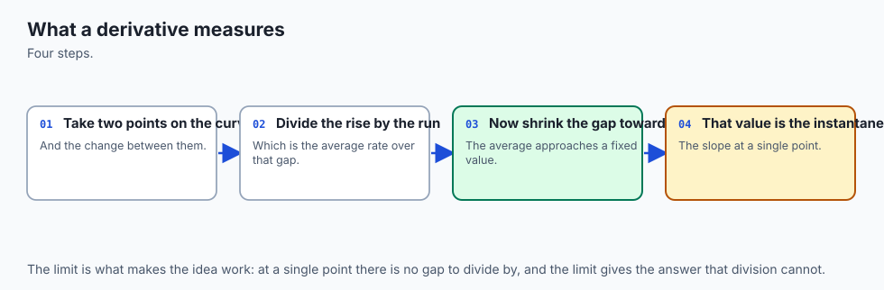
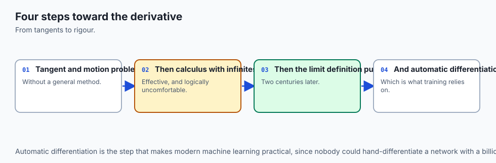
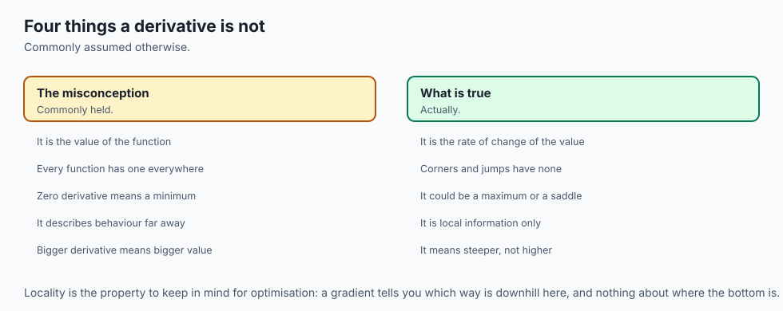
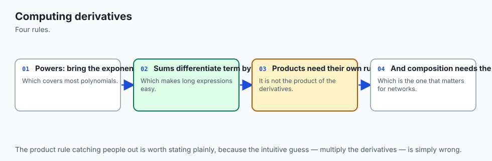
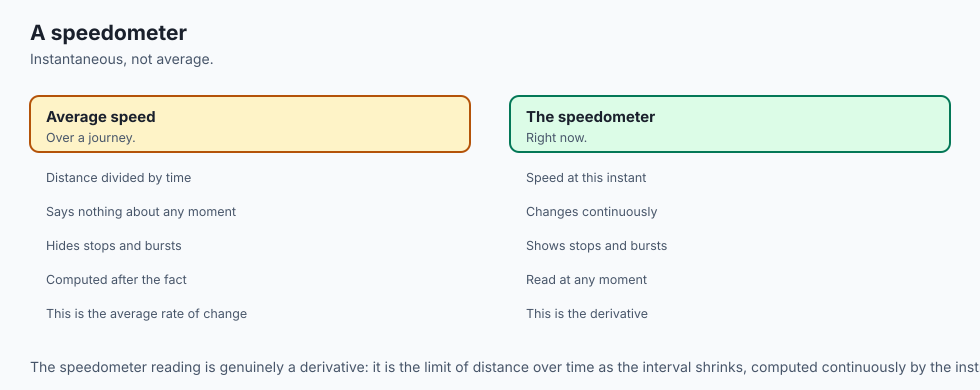
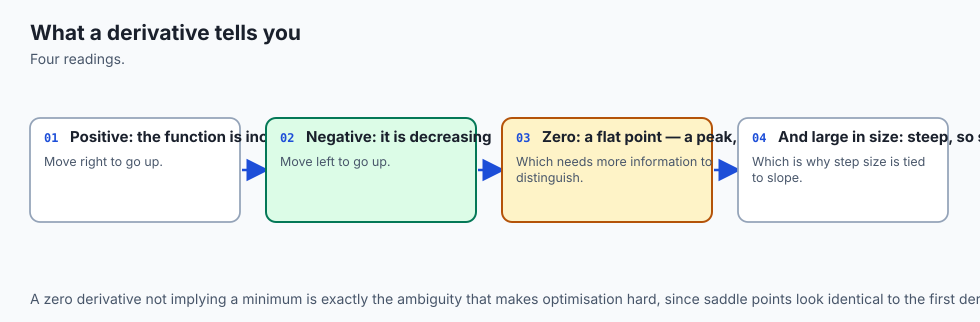
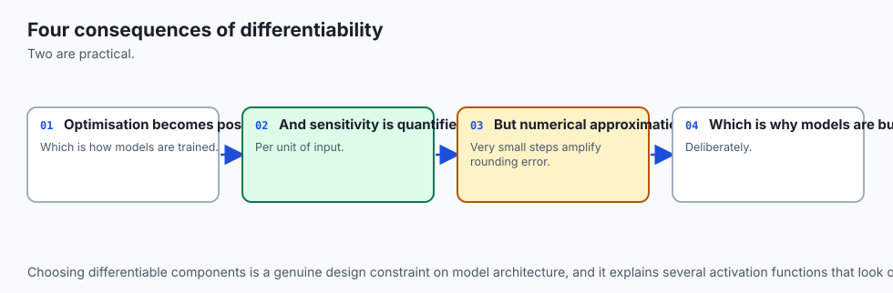
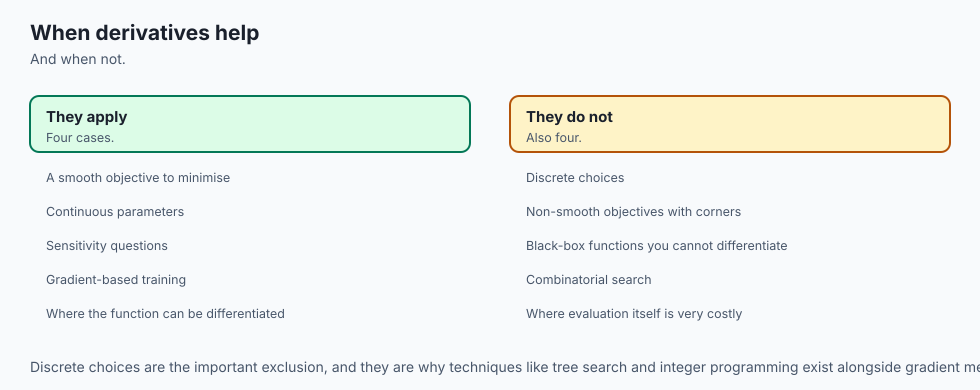

## Why this matters

Here is a question your arithmetic cannot answer.

A car is being timed. It passes a marker post, and every second someone writes down how far it has travelled:

```
     t (s)   distance (m)
       0.0            0.0
       1.0            4.0
       2.0           16.0
       3.0           36.0
       4.0           64.0
       5.0          100.0
       6.0          144.0
```

How fast was it going? Over the whole trip, that is easy: 144 metres in 6 seconds is 24 metres per second. Over the fourth second alone, also easy: 64 minus 36 is 28 metres, in 1 second, so 28 metres per second.

Now ask the question a speedometer answers. **How fast was the car going at t = 3?** Not averaged over the third second, not averaged over the fourth. At the instant the clock read three.

Do the same arithmetic and it refuses:

```
     ZeroDivisionError: average_rate needs an interval with width
```

The rise is zero. The run is zero. Zero divided by zero is not a number, and no amount of care makes it one. Yet the car had a speed at t = 3 — you can see the needle on the dashboard, and it is not showing 24, and it is not showing 28.

That gap is where calculus starts, and this is the first day of calculus in this course. There have been a hundred and seven days of computing and eight days of linear algebra, and no calculus at all. If the word makes you tense, the order here is deliberately the reverse of the one that made it tense: numbers first, notation second, and the word "limit" described only after you have watched one happen. Nothing below assumes you have met any of this before.

Here is what it costs you if you skip it.

The next four days build straight from today to a working model. Day 109 takes the derivative into more than one input variable and calls the result a gradient. Day 110 covers the chain rule, which is how a derivative gets through a stack of functions. Day 111 writes gradient descent from scratch — a loop of about four lines. Day 112 draws what that loop is doing. And then, for the rest of this course and the whole of the deep-learning one, every model you train will be doing exactly one thing:

> **Training is a search for the minimum of a loss function, and the derivative is what tells you which way is downhill.**

That sentence is the whole reason today exists. A loss function is a single number saying how wrong your model currently is, built so that smaller is better. Training is the search for the settings that make it small. And the derivative is the only instrument you have for that search, because its sign is a direction: if the loss rises as you increase a weight, decrease it; if it falls, increase it. Millions of weights, one rule, applied to all of them.

Get the derivative wrong and there is no error message. Your model trains, the loss goes down a bit, and you never find out that it should have gone down a hundred times further. This is not a hypothetical: the third measurement in today's lab is a numerical derivative that returns exactly `0.0` — confidently, with no warning of any kind — for a function whose real answer is 2.718. Nothing raised. Nothing logged. Just a plausible-looking number that happened to be wrong.

## The idea in plain language



You have a car, a stopwatch and a tape measure. That is the whole toolkit, and the whole lesson lives inside it.

**With the tape measure and the stopwatch you can compute an average speed.** Pick two moments, measure how far the car moved between them, divide by how long it took. Distance over time. Rise over run. This is not calculus and it never becomes calculus — it is division, and you have been doing it since school.

The result is completely honest about one thing and completely silent about another. It is honest about the interval: over those six seconds the car really did average 24 metres per second. It is silent about every instant inside the interval: the car started at rest and finished at 48 metres per second, and 24 is simply the constant speed that would have covered the same ground in the same time.

**The car also has a speedometer, and the speedometer answers a different question.** It shows a number *now*. Not averaged over anything. And that number is a real, physical thing — the police will fine you for it — so whatever it is, it is not nonsense, even though the arithmetic that would compute it divides zero by zero.

The way out is the single idea in this lesson, and it is worth reading twice:

> **Do not ask for the rate over an interval of no width. Ask for the rate over intervals that get smaller and smaller, and see whether the answers settle on something.**

They do. Watch:

```
     width h    interval          average speed (m/s)
     1.0000     [3, 4.0000  ]             28.000000
     0.5000     [3, 3.5000  ]             26.000000
     0.1000     [3, 3.1000  ]             24.400000
     0.0100     [3, 3.0100  ]             24.040000
     0.0010     [3, 3.0010  ]             24.004000
     0.0001     [3, 3.0001  ]             24.000400
```

Nobody computed a limit there. Nobody wrote down a definition. Six divisions were performed and the answers walked towards 24, and you can see them walking. **That settling is the derivative.** The car's speed at t = 3 is 24 metres per second, and the way you know is that every honest approximation to it, taken over a shorter and shorter interval, gets closer to 24 and stays there.

The analogy carries the whole lesson, so it is worth naming its parts now:

| The car | The mathematics |
| --- | --- |
| The odometer: total distance so far | The function `f(x)` |
| Stopwatch and tape measure over an interval | The average rate of change, `(f(b) − f(a)) ÷ (b − a)` |
| The speedometer: a number right now | The derivative, `f'(x)` |
| The accelerometer: is the speed rising or falling? | The second derivative, `f''(x)` |
| Reading the needle to decide whether to brake | Using the derivative's sign to decide which way to move |

And it has two sharp edges, both of which bite later today.

**A speedometer is a physical device that estimates.** It does not compute a limit; it measures over a very short interval and reports the result. So does every numerical derivative you will ever write. That estimate is excellent, and it is not the true value, and the difference between the two is the entire second half of this lesson.

**Not every journey has a speed at every instant.** If the car could change direction instantaneously — travelling backwards at 1 metre per second and then forwards at 1 metre per second with nothing in between — then at the moment of the switch there is no speed to report. That is not a limitation of your speedometer. It is a limitation of the question, and it happens to be exactly the shape of the most widely used activation function in deep learning.

## Historical background



This section is going to be short and careful, in the same way Day 104's was, and the reason is worth stating: the temptation in a history section is to produce a paragraph of dates and names, and half of them will be approximately right, which is worse than none of them.

What is checkable in the sources this lesson cites, and worth knowing:

**The problem is older than the solution.** The question "what is the slope of a curve at a point" was worked on well before anyone had a general method — Pierre de Fermat, in the first half of the seventeenth century, had a technique for finding maxima and minima that amounts to the difference quotient with the small quantity set to zero at the end, without a theory explaining why that was allowed.

**Two people invented the general method independently, in the second half of the seventeenth century.** Isaac Newton, approaching it through motion and rates, and Gottfried Wilhelm Leibniz, approaching it through the geometry of curves and infinitesimally small differences. The priority dispute between their followers ran for decades and was thoroughly ugly. What matters more than the dispute is that they were solving different-looking problems and arrived at the same machinery, which is usually a sign that the machinery is real.

**Nobody could say precisely what it meant for about a hundred and fifty years.** Both original formulations leaned on quantities that were somehow smaller than any positive number and yet not zero — you divide by them, and then you discard them. That was attacked as incoherent at the time, and the attack was fair. The modern definition, in terms of limits, was worked out in the nineteenth century, and the epsilon-delta formulation you would meet in a university analysis course is that work.

Two things follow from that history, and both are pedagogical rather than historical.

The first is that **the limit came last**. Calculus was used successfully for a century and a half by people who could not have written down a rigorous definition of it. Teaching it definition-first, as most courses do, reverses the order in which humanity actually understood it — and reverses the order in which most people find it easy. This lesson does not.

The second is that the history is still visible in the notation, which is the part you can check for yourself. There is no single agreed way to write a derivative, and the reason is that several people invented one and none of them lost:

| Notation | Read as | Whose | Where you will meet it |
| --- | --- | --- | --- |
| `f'(x)` | "f prime of x" | Lagrange's | Compact single-variable work, most textbooks, most code comments |
| `dy/dx` | "dee y by dee x" | Leibniz's | Anywhere the input variable matters, which is everywhere from Day 109 onwards |
| `Df(x)` | "D of f of x" | Euler's | Papers, operator algebra, and some functional-programming-flavoured libraries |
| `ẏ` | "y dot" | Newton's | Physics, where the variable being differentiated with respect to is time |

A notation surviving three hundred years is evidence that it was doing something useful. Leibniz's `dy/dx` looks like a fraction, and it is not one — but it behaves enough like one that the chain rule on Day 110 will look like cancelling, and it names both variables, which is why it is the notation that survives contact with more than one input.

## What it is — and what it is not



**A derivative is the instantaneous rate of change of a function at a point.** Equivalently, and more usefully for drawing pictures: it is the slope of the tangent line to the graph at that point.

Written out, the definition is:

```
                    f(x + h) − f(x)
     f'(x)  =  lim  ───────────────
                h→0        h
```

Read it in three parts and it stops being intimidating. The fraction is rise over run — an average rate of change over an interval of width `h`. The `h→0` says: shrink that interval. And `lim` says: report the number the answers settle on, not the number you get by putting `h = 0`, which is `0 ÷ 0` and means nothing.

That fraction has a name worth knowing, because it appears everywhere below: it is the **difference quotient**.

The most compact way to state what a derivative is *not* is a table of things people believe about it:

| The misconception | What is actually true |
| --- | --- |
| "The derivative is the change in f" | It is the change in `f` **per unit change in x**. It is a rate, so it has units — metres per second, not metres. |
| "You get it by setting h = 0" | At `h = 0` the difference quotient is `0 ÷ 0`. You get it by seeing where the values go as `h` approaches zero, which is a different operation. |
| "The tangent is the line that touches the curve once" | Plenty of lines touch a curve exactly once and are not tangents — a vertical line through a parabola, for one. And a tangent may cross its own curve elsewhere. A tangent is the line the secants approach. |
| "Every function has a derivative everywhere" | `|x|` has none at zero, and neither does ReLU. A function can be perfectly continuous and still have no derivative at a point. |
| "A zero derivative means a minimum" | It means the graph is flat. That covers minima, maxima, and flat steps that are neither. |
| "dy/dx is a fraction" | It is descended from one and behaves like one often enough to be dangerous. It is a single symbol denoting a limit. |
| "A numerical derivative with a very small h is more accurate" | Below roughly `1e-8` it gets rapidly worse, and this lesson measures exactly how much worse. |
| "If the numerical derivative returns a number, there is a derivative" | It always returns a number. That is the most dangerous property it has. |

One more distinction, because it causes real confusion later: **a derivative is a function, not a number**. `f'(x)` has a value at every `x` where the limit exists, so it is an object of the same kind as `f`. That is why it can have a derivative of its own — the second derivative — and why Day 110's chain rule can compose derivatives the way you compose functions.

## Why it was created and what problems it solves

Four problems drove the invention, and it is striking how different they look from one another:

**Motion.** Given a position at every moment, what is the velocity at a moment? This is the car, and it is Newton's route in. The reverse question — given the velocity, what is the position — is integration, which this course meets later.

**Tangents.** Given a curve, what straight line best matches its direction at a point? This is Leibniz's route in, and it looks purely geometric. That the two questions have the same answer is not obvious and is the reason calculus is one subject rather than two.

**Maxima and minima.** Where is a quantity largest or smallest? At a peak or a trough, the graph is momentarily flat, so the derivative is zero — which converts "search everywhere" into "solve `f'(x) = 0`". This is Fermat's route in, and it is the one this course cares about most.

**Approximation.** Near a point, a smooth curve looks like a straight line, and the derivative is that line's slope. Every "for small changes, output ≈ input times some factor" argument in engineering is a derivative in disguise.

For this course, the third one is the whole game. Here is why, stated as concretely as it can be.

You have a model with some numbers in it — weights. You have a loss function that takes those weights and returns one number saying how wrong the model's predictions are. You want the weights that make the loss small. The loss might have millions of inputs, you cannot draw it, and you certainly cannot try every combination.

But at any single point you can ask a much smaller question: **if I nudge this one weight up a little, does the loss go up or down?** That is a derivative. Its sign is a direction, and following the direction takes you downhill. Repeat, and you are training a model.

There is a second reason, and it is the reason the deep-learning course exists in the shape it does. Computing that derivative for millions of weights, one at a time, by nudging each one and re-running the model, would be hopelessly slow — a model with ten million weights would need ten million and one forward passes for a single training step. Automatic differentiation computes all of them in roughly the cost of two forward passes, by applying the chain rule to the computation itself. Day 110 sets that up. Today establishes why the derivative is the object worth having in the first place.

## How it works



### Step one: an average rate, computed with real numbers

Start with nothing clever. For a function `f`, the average rate of change between `a` and `b` is:

```
     f(b) − f(a)
     ───────────
        b − a
```

Rise over run. For the car, `f` is distance in metres and the inputs are seconds, so the answer is metres per second. Over the whole trip:

```
     rise = 144.0 - 0.0 = 144.0 metres
     run  =   6.0 - 0.0 = 6.0 seconds
     average speed = rise / run = 24.0 m/s
```

Over each second separately, six different answers, all correct, all answering different questions:

```
     interval      rise (m)   run (s)   average speed (m/s)
     [0, 1]             4.0       1.0                   4.0
     [1, 2]            12.0       1.0                  12.0
     [2, 3]            20.0       1.0                  20.0
     [3, 4]            28.0       1.0                  28.0
     [4, 5]            36.0       1.0                  36.0
     [5, 6]            44.0       1.0                  44.0
```

Note the last column is climbing. The car is accelerating, and you can see it in the numbers without any theory at all.

### Step two: shrink the interval and watch

Switch to the simplest interesting function, `f(x) = x²`, and the point `x = 3`. Take the average rate over `[3, 3 + h]` for progressively smaller `h`:

```
     width h        secant slope     exactly 6 + h?   distance from 6
     1.0000         7.000000000000   True             1.0000
     0.1000         6.100000000000   True             0.1000
     0.0100         6.010000000000   True             0.0100
     0.0010         6.001000000000   True             0.0010
```

Two facts sit in that table and they are not the same fact.

**The first is algebra.** The slope over `[3, 3 + h]` is `6 + h` exactly, for every `h`, with no approximation anywhere:

```
     f(3 + h) - f(3)     (3 + h)**2 - 9      9 + 6h + h**2 - 9
     ----------------  =  --------------  =  ------------------  =  6 + h
            h                   h                    h
```

Notice what the algebra did that the arithmetic could not. It cancelled the `h` in the denominator **before** `h` was allowed to reach zero. At `h = 0` the original fraction is `0 ÷ 0` and means nothing; the simplified form `6 + h` means something at every `h`, including zero.

**The second is the limit.** As `h` shrinks, `6 + h` gets arbitrarily close to `6`. That is why the derivative of `x²` at `3` is `6`.

You have now met a limit, and you met it as an observation: a sequence of ordinary numbers going somewhere. That is all a limit is. The epsilon-delta machinery exists to make "going somewhere" precise enough to prove theorems with, and you do not need it to use derivatives, in the same way you do not need the Peano axioms to add up a bill.

### Step three: the tangent is what the secants approach

A line through two points on a curve is a **secant**. Its slope is exactly the average rate of change between those two points — so "average rate of change" and "slope of the secant" are two names for one number.

As the second point slides towards the first, the secant pivots:

```
     h        second point           slope    line through (3, 9)
     2.00     (5.00, 25.0000)         8.00   y = 8.00x - 15.00
     1.00     (4.00, 16.0000)         7.00   y = 7.00x - 12.00
     0.50     (3.50, 12.2500)         6.50   y = 6.50x - 10.50
     0.10     (3.10,  9.6100)         6.10   y = 6.10x - 9.30

     tangent (h -> 0)                 6.00   y = 6.00x - 9.00
```

The **tangent** is the line those secants are heading for. Its slope is the derivative, and for `y = x²` at `x = 3` its equation is `y = 6x − 9`.


The animated version shows the same construction as a process rather than as three snapshots — the secant pivoting, with the width and the computed slope updating at every step:


### Step four: the rules you actually need

There are five, plus two facts. You will use these constantly and they are worth memorising.

| Rule | Statement | Why it is reasonable |
| --- | --- | --- |
| Constant | `d/dx` of `c` is `0` | A flat line has no slope. |
| Power | `d/dx` of `xⁿ` is `n·xⁿ⁻¹` | Generalises the `(3 + h)²` expansion above: multiply out, cancel the `h`, and what survives is `n·xⁿ⁻¹`. |
| Constant multiple | `d/dx` of `c·f(x)` is `c·f'(x)` | Stretching a graph vertically by 5 stretches every slope by 5. |
| Sum | `d/dx` of `f(x) + g(x)` is `f'(x) + g'(x)` | Rates add. This is why you may differentiate a long expression one term at a time. |
| Exponential | `d/dx` of `eˣ` is `eˣ` | A fact to know. See below. |
| Logarithm | `d/dx` of `ln(x)` is `1/x` | A fact to know. |

Every one of them is checked numerically in the lab, against a value computed without knowing the rule:

```
     rule                                        at x    exact          measured       error
     constant: d/dx of 7 is 0                    2.00    0.000000000    0.000000000    0.00e+00
     power: d/dx of x**2 is 2x                   3.00    6.000000000    6.000000000    3.93e-11
     power: d/dx of x**5 is 5x**4                1.50    25.312500000   25.312500002   2.44e-09
     power: d/dx of 1/x is -1/x**2               2.00    -0.250000000   -0.250000000   9.96e-12
     constant multiple: d/dx of 5x**2 is 10x     3.00    30.000000000   30.000000000   6.99e-11
     sum: d/dx of x**2 + x**3 is 2x + 3x**2      2.00    16.000000000   16.000000000   2.82e-10
     exponential: d/dx of e**x is e**x           1.00    2.718281828    2.718281829    5.86e-11
     logarithm: d/dx of ln(x) is 1/x             4.00    0.250000000    0.250000000    9.46e-12
```

That is what "checked" should mean. Not "the textbook says so", but: here is a number computed from the rule, here is a number computed by sampling the function, and here is how far apart they are.

**Why `e` is special**, shown rather than asserted. Take `bˣ` for various bases and measure the slope at `x = 0`. Every one of them passes through `(0, 1)`, so the slope is the only thing distinguishing them:

```
     base b        f(0)      f'(0) measured
     2.0           1.0       0.693147181
     2.5           1.0       0.916290732
     e = 2.718...  1.0       1.000000000
     3.0           1.0       1.098612289
     10.0          1.0       2.302585093
```

For base 2 the slope at zero is less than 1. For base 3 it is more than 1. Somewhere between them is a base whose slope at zero is exactly 1, and that base is `e`. (Those five numbers, if you have not spotted it, are the natural logarithms of 2, 2.5, e, 3 and 10.)

That is what makes `eˣ` its own derivative. Every `bˣ` is proportional to its own derivative — its steepness is always proportional to its height — and `e` is the base for which the constant of proportionality is `1` rather than `0.693` or `2.303`. Check it at three points:

```
     x       e**x            measured f'(x)   ratio f'(x) / f(x)
     0.0     1.000000000     1.000000000      1.000000000012
     1.0     2.718281828     2.718281829      1.000000000022
     2.5     12.182493961    12.182493961     1.000000000024
```

Ratio 1 everywhere, which is the whole claim.

### Step five: computing a derivative when you have no formula

Everything above assumed you have a formula to differentiate. Very often you do not — the function is a simulation, a lookup, a model, or a piece of code someone else wrote. Then you have exactly one option: **call it at points you choose and do arithmetic on what comes back.**

Three rules do that job:

```
     forward    ( f(x + h) - f(x)     ) / h        one step ahead
     backward   ( f(x)     - f(x - h) ) / h        one step behind
     central    ( f(x + h) - f(x - h) ) / (2h)     straddling x
```

The forward difference is simply the definition with a finite `h` in place of the limit. The central difference straddles the point instead, and the improvement is enormous. Watch both on `eˣ` at `x = 1`, where the exact answer is `e = 2.718281828459045`:

```
     h            forward error    central error    central is better by
     1e-01        1.405601e-01     4.532735e-03             31x
     1e-02        1.363683e-02     4.530492e-05            301x
     1e-03        1.359594e-03     4.530467e-07           3001x
     1e-04        1.359186e-04     4.530566e-09          30000x
     1e-05        1.359150e-05     5.858691e-11         231989x
```

Read down the two error columns. Each time `h` drops by a factor of ten, the forward error drops by about ten and the central error by about a hundred. That is the difference between an error proportional to `h` and an error proportional to `h²`, and it compounds: at `h = 1e-5` the central rule was over two hundred thousand times more accurate on the authoring machine, for one extra function call.

The reason is worth a paragraph, because it is the only place today where a little algebra pays for itself immediately. Taylor's expansion writes a smooth function near `x` as a polynomial:

```
     f(x + h) = f(x) + h*f'(x) + (h**2/2)*f''(x) + (h**3/6)*f'''(x) + ...
     f(x - h) = f(x) - h*f'(x) + (h**2/2)*f''(x) - (h**3/6)*f'''(x) + ...
```

Subtract the first from `f(x)` and divide by `h`, and the `f''` term survives multiplied by `h/2`. That is the forward rule's error. Subtract the **second** line from the first and the `f''` terms cancel — they carry the same sign in both — so the first survivor is the `f'''` term multiplied by `h²/6`. That is the central rule's error, and it is why halving `h` quarters it.

The central rule is the average of the other two: forward leans one way off the tangent, backward leans the other way by almost exactly the same amount, and averaging cancels the leaning.

Prediction against measurement, three times:

```
     h         predicted h**2/6 * e    measured central error   ratio
     1e-02     4.530470e-05            4.530492e-05             1.0000
     1e-03     4.530470e-07            4.530467e-07             1.0000
     1e-04     4.530470e-09            4.530566e-09             1.0000
```

Within one percent, three times over. The formula is not folklore.

### Step six: the finding that contradicts everyone's intuition

If the error is proportional to `h`, or to `h²`, then making `h` tiny should make the error tiny. So use `h = 1e-300` and be done.

Here is what that gives:

```
     forward_difference(exp, 1.0, 1e-300)  ->  0.0
     the right answer is                       2.718281828459045
```

Not slightly wrong. Not wrong in the eighth decimal place. **Zero**, with total confidence and no warning of any kind. And the reason is not subtle:

```
     exp(1 + 1e-300) == exp(1)  ->  True
```

There is no float64 between `exp(1)` and `exp(1 + 1e-300)`. They are the same number. Their difference is exactly `0.0`, and zero divided by anything is zero. The subtraction destroyed every digit the two values had in common — which was all of them.

So there are **two** errors in a numerical derivative, and they pull in opposite directions:

| | Where it comes from | Roughly | As h shrinks |
| --- | --- | --- | --- |
| **Truncation error** | The mathematics: the formula is the limit's approximation at a finite `h` | forward `(h/2)·f''(x)`; central `(h²/6)·f'''(x)` | **shrinks** |
| **Rounding error** | The arithmetic: nearly equal values cancel, and `1/h` magnifies what is left | either rule, about `EPSILON·|f(x)| ÷ h` | **grows** |

Add a term that shrinks to a term that grows and you get a **U**. The bottom of the U is the best `h` there is, and it is nowhere near zero.

Here is the measurement, 27 step sizes from `1e-1` down to `1e-14` on `eˣ` at `x = 1`, with the central error drawn as a log-log bar:

```
     h            forward error   central error   central error, log-log
     1.000e-01    1.405601e-01    4.532735e-03    #############################
     1.000e-02    1.363683e-02    4.530492e-05    #######################
     1.000e-03    1.359594e-03    4.530467e-07    #################
     1.000e-04    1.359186e-04    4.530566e-09    ###########
     1.000e-05    1.359150e-05    5.858691e-11    #####
     3.162e-06    4.298065e-06    3.291500e-11    #####
     1.000e-06    1.358972e-06    1.634572e-10    #######
     1.000e-07    1.399467e-07    5.858736e-11    #####
     1.000e-08    6.602751e-09    6.602751e-09    ###########
     1.000e-09    2.154419e-07    6.602751e-09    ###########
     1.000e-10    1.547709e-06    6.727366e-07    #################
     1.000e-11    3.263395e-05    1.042949e-05    #####################
     1.000e-12    4.323142e-04    2.102696e-04    #########################
     1.000e-13    4.558642e-04    4.558642e-04    ##########################
     1.000e-14    9.337648e-03    9.337648e-03    ##############################
```

The bars shorten, reach their shortest in the middle, and lengthen again all the way down. That is the U, drawn sideways. And the practical consequence is sharp: **`h = 1e-12` is not a careful choice.** On this run it was 464 times worse than `h = 1e-3`.

Where the bottom sits can be predicted. Set the two error terms equal and solve:

```
     forward:  predicted 2.107e-08   measured 1.000e-08
     central:  predicted 8.733e-06   measured 3.162e-06
```

Both within a factor of ten, which is the honest expectation rather than a hedge: the grid has three steps per decade so it cannot resolve better than that, the constants were dropped when the balance was solved, and — this is the part textbooks tend to smooth over — **the error near the bottom is not a smooth curve.** Look at the captured rows again: `1e-6` measures worse than both `3.162e-6` and `1e-7`. Rounding error is a random walk over whichever bits happen to survive, so the lab's U-shape test asks about the two ends against the middle rather than demanding a monotone descent. A test demanding monotonicity here would be a test demanding something untrue.

The rule to carry away, for float64:

```
     forward difference   h around 1e-8
     central difference   h around 1e-5 to 1e-6
```

### Step seven: what a zero derivative does not tell you

Three places where the slope is zero:

```
     f(x) = (x - 2)**2 + 1   at x = 2     the bottom of a valley
     f(x) = x**3 - 3x        at x = -1    the top of a hill
     f(x) = x**3             at x = 0     neither: a flat step
```

Measure the derivative at all of them and it reports the same thing:

```
     function            x       f(x)        f'(x) measured
     (x - 2)**2 + 1      2.0     1.0000      0.000e+00
     x**3 - 3x           -1.0    2.0000      9.998e-09
     x**3 - 3x           1.0     -2.0000     9.998e-09
     x**3                0.0     0.0000      1.000e-08
```

Four flat points, four slopes indistinguishable from zero. The first derivative has now told you everything it knows, and it has not told you which of these is a minimum. That is not a limitation of the measurement. It is a limitation of the question.

The instrument that helps is the **second derivative**: the derivative of the derivative, written `f''(x)`. It asks whether the slope is itself rising or falling as you move right. Numerically it collapses to one formula:

```
     f''(x)  ~  ( f(x + h) - 2*f(x) + f(x - h) ) / h**2
```

which reads as *how far does the middle value sag below the average of its two neighbours?* Sagging down is positive: a bowl. Bulging up is negative: a dome. That is **curvature**, and it is what separates a minimum from a maximum:

```
     function            x        f'(x)         f''(x)        shape
     (x - 2)**2 + 1      2.0      0.000e+00     2.000000      bowl
     x**3 - 3x           -1.0     9.998e-09     -6.000000     dome
     x**3 - 3x           1.0      9.998e-09     6.000000      bowl
     x**3                0.0      1.000e-08     0.000000      flat both ways
```

The first derivative gave the same answer at all four points. The second gave four different ones. That is the entire point of computing it.

And now the honest part, which most treatments skip. **When the second derivative is zero as well, it decides nothing.** `x³` at 0 is a flat step. `x⁴` at 0 is a genuine minimum. Both have zero slope and zero curvature:

```
     x**4 at 0:  f' = 0.000e+00   f'' = 2.000e-08   (a real minimum)
     x**3 at 0:  f' = 1.000e-08   f'' = 0.000e+00   (not a minimum)
```

Same readings, different answers. The lab's classifier returns `"undecided"` for both, and a test asserts it, because a function that reported `"minimum"` at `x⁴` would be right by accident and wrong at `x³` for the same reason.

### Step eight: where derivatives fail to exist

`f(x) = |x|`. To the left of zero the slope is `−1` everywhere; to the right it is `+1` everywhere. At zero it is neither, and there is no third answer hiding between them. The definition asks for a single number that the difference quotient settles on **from both sides**, and here the two sides settle on different numbers. So the limit does not exist, and neither does the derivative. `|x|` is continuous at zero and not differentiable at zero; those are different questions.

Ask the three rules anyway:

```
     forward_difference(abs, 0, 1e-05)    1.0
     backward_difference(abs, 0, 1e-05)   -1.0
     central_difference(abs, 0, 1e-05)    0.0
```

The one-sided rules disagree, which is the truth. The central rule returns `0.0`. Not an error, not a warning, not a nan — zero, which is the average of `−1` and `+1`, and which answers a question nobody asked.

Worse, `0.0` is a *plausible* answer. It is what you get at the bottom of a valley. Here it means the opposite: the function is changing as fast as it possibly can, in both directions at once.

And shrinking `h` does not help, because nothing is converging:

```
     h            forward     backward    central
     1e-02        1.0         -1.0        0.0
     1e-05        1.0         -1.0        0.0
     1e-08        1.0         -1.0        0.0
     1e-11        1.0         -1.0        0.0
```

Every row is identical. There is no `h` small enough to reveal a limit that is not there. Compare that with the settling sequence at the top of this lesson — settling is the evidence, and here there is none.

The second derivative is a better alarm, because it diverges instead of lying:

```
     h            second_difference(abs, 0, h)
     1e-02        200.0
     1e-03        2,000.0
     1e-05        200,000.0
```

That is exactly `2/h`, growing without limit as `h` shrinks. A curvature estimate that explodes when you shrink the step means you are standing on a corner.

**This is not a curiosity.** ReLU is `max(x, 0)`: the most widely used activation function in deep learning, met on Day 102 as a transformation. Its graph is the same corner as `|x|` with one arm flattened:

```
     forward   1.0     the slope on the right
     backward  0.0     the slope on the left
     central   0.5     the average of two slopes that disagree
```

Training a network needs a derivative of ReLU at every input, including exactly zero. There is no derivative there, so a framework has to choose one of `0` and `1` by convention and carry on. That is an engineering decision rather than a mathematical result, and it is defensible: an input that is exactly `0.0` in float64 is vanishingly rare, and both candidates are finite and small. This lesson has no deep-learning framework installed and makes no claim about which value any particular one picks — check your framework's own documentation rather than a course's memory of it.

What this lesson *can* show you is that `0.5`, the number the central difference produced, is neither of the two defensible choices. If you ever use a numerical derivative to check a framework's gradients — a real and useful technique — it will disagree with the framework at exactly this point, and the framework will not be wrong.

The cheapest detector costs nothing you have not already computed:

```
     function   forward   backward   disagree?   trust the central value?
     x**2       6.0000    6.0000     False       yes
     |x|        1.0000    -1.0000    True        no
     relu       1.0000    0.0000     True        no
```

## An everyday analogy



Return to the car, and push the analogy until it breaks, because knowing where an analogy breaks is worth more than the analogy.

**The odometer is the function.** It reports a total: how far since the start. It says nothing about speed.

**A stopwatch and a tape measure give you an average rate.** Two readings, subtract, divide. This is honest, cheap, and answers a question about an interval. Every "our revenue grew 12% last quarter" is this measurement, and it carries exactly the same silence about what happened inside the quarter.

**The speedometer is the derivative.** A number right now, with the same units as the average speed, and a different meaning.

**The accelerometer is the second derivative.** It tells you whether the speedometer's number is rising or falling. Sitting in the passenger seat with your eyes closed, you can feel acceleration and cannot feel speed — which is a surprisingly good intuition for why the second derivative carries information the first does not.

Now the three places the analogy earns its keep by breaking.

**A real speedometer estimates.** It does not compute a limit. It measures over a short interval — a fraction of a wheel rotation — and reports the result. So does every numerical derivative you will write, and so, in a sense, does every physical measurement of any rate. The lesson's whole second half is about how good that estimate is and what makes it worse.

**A real speedometer cannot use an arbitrarily short interval.** Time it over a millionth of a wheel rotation and the measurement is swamped by noise in the sensor. That is *exactly* the U-shaped error curve, arriving from the physical side: a shorter interval reduces one error and amplifies another, and there is a sweet spot in the middle. The lab measures the software version of that trade-off; your car has the hardware version.

**The journey has to be smooth.** If a car could reverse direction instantaneously, at the moment of the switch there would be no speed to report, and a speedometer that reported the average of the before and after speeds — zero — would be actively misleading. That is the ReLU corner, and it is why the corner is in this lesson rather than in a footnote.

One extension of the analogy is worth having, because it is where the next four days go. Imagine the car is on a hillside in fog and you want the lowest point. You cannot see. But you can feel which way the ground slopes under your feet, and you can take a step downhill. Repeat. **That is gradient descent**, and the slope under your feet is the derivative. Today it is one-dimensional — the ground slopes only forwards or backwards. Day 109 gives you a hillside that slopes in every direction at once, and calls the answer a gradient. Day 111 writes the loop.

## Examples in practice



Everything below was captured from a real run of today's lab on the authoring machine on 2026-08-17 — Python 3.14.0, numpy 2.5.2, pytest 9.1.1, macOS 26.5.2 on Apple Silicon. Nothing is retyped from memory.

**The refusal that starts the day**, from `01_average_rate_of_change.py`:

```
   A speedometer does not show an average over an interval. It shows a
   number at an INSTANT. Ask for the average speed over an interval of
   no width at all and the arithmetic refuses:

     ZeroDivisionError: average_rate needs an interval with width
```

This is a deliberate design choice in the lab's `average_rate`, and it is worth defending. It would have been easy to return `0.0`, or `nan`, or the value at the point. All three would have been lies of a kind: the question genuinely has no answer, and a function that invents one teaches the reader that it does.

**The sequence settling**, with the floating-point reality shown alongside the algebra:

```
     h            computed slope          6 + h            gap
     1.0000       7.0                      7.0000           0.000e+00
     0.1000       6.100000000000007        6.1000           7.105e-15
     0.0100       6.009999999999977        6.0100           2.309e-14
     0.0010       6.00100000000014         6.0010           1.394e-13
```

The gaps are around `1e-13` and they are not mistakes in the formula. `3.001²` cannot be stored exactly in binary, the subtraction loses some of the digits the two numbers had in common, and dividing by `0.001` multiplies what is left by a thousand. That is the rounding-error term making its first small appearance, three sections before it becomes the point.

**The bottom of the U**, and the honest report of where it was:

```
     forward:  best h = 1.000e-08   error there = 6.602751e-09
     central:  best h = 3.162e-06   error there = 3.291500e-11
```

The lab does not assert either number. It asserts that both curves are U-shaped with an interior minimum, that both ends are more than a hundred times worse than the middle, that each optimum falls in a documented band, and that each is within a factor of ten of the balance prediction. Those are claims about the *shape*, and they survive a different machine. A test asserting `3.162e-06` would fail on someone else's laptop and teach them that the suite is unreliable rather than that their hardware is different.

**The library alternative agreeing exactly** — and then not:

```
     central_difference        2.718281828517632
     np.gradient (interior)    2.718281828517632
     identical to the last bit True
```

`numpy.gradient` differentiates *samples* rather than functions: you hand it values you already have and it returns a slope estimate at each one, using the central rule on interior points and a one-sided rule at the two ends. With a scalar spacing it is bit-for-bit the central difference implemented from scratch in the lab.

But this turned up while building the lab and is kept because it is instructive:

```
     np.gradient(ys, h)        2.718281828517632
     np.gradient(ys, xs)       2.718281828536419
     they differ by            1.879e-11
```

Pass an *array of coordinates* instead of a scalar spacing — the same evenly spaced points — and NumPy uses its general unevenly-spaced formula, which is algebraically identical and takes a different route through the arithmetic. Both are correct. Neither is the exact answer. "The same formula" is a claim about the mathematics, and the mathematics does not fix the order the additions happen in.

**The sign of the derivative pointing downhill**, which is the whole reason this course cares:

```
     x        f(x)        f'(x)        which way is downhill
     -1.0     10.0000     -6.0000      right
     0.5      3.2500      -3.0000      right
     1.5      1.2500      -1.0000      right
     2.0      1.0000      0.0000       already flat
     2.5      1.2500      1.0000       left
     4.0      5.0000      4.0000       left
```

Every arrow points towards `x = 2`, and none of them was told where `x = 2` is. That is gradient descent in one dimension, three days before Day 111 writes the loop.

## Implications: security, privacy, performance, scalability, and cost



**Silent failure is the security-shaped risk here, and it generalises well past calculus.** A numerical derivative always returns a number. When there is no derivative it still returns one, and the number it returns looks like a perfectly ordinary answer. A caller that branches on "the gradient is zero, so we have converged" will take the wrong branch with total confidence.

The general shape is worth naming, because you will meet it in code that has nothing to do with derivatives: **a function whose failure mode is a plausible value rather than an exception is a function whose failures are invisible.** When you write one, give the caller a way to detect the failure. Here it costs nothing — the forward and backward differences are already computed, and their disagreement is the alarm.

**Catastrophic cancellation is a real bug class.** Subtracting two nearly equal floating-point numbers destroys the digits they had in common and leaves the least accurate ones carrying the whole result. That mechanism is the rounding-error term in this lesson, and the same arithmetic shows up in a variance computed as `E[x²] − E[x]²`, in the difference of two large timestamps, in a balance computed as a difference of running totals, and in the standard quadratic formula when `b²` dwarfs `4ac`. In each case the result is quietly less accurate than its inputs, and quiet inaccuracy in a threshold, a comparison or an audit is how a check stops checking.

**Performance and scale are the reason automatic differentiation exists.** A central difference costs two function evaluations per input variable. For a model with `n` weights, computing the whole gradient numerically costs about `2n` evaluations of the model. At `n = 10,000,000` that is twenty million forward passes for a single training step, which is not slow — it is impossible. Automatic differentiation computes all `n` derivatives in roughly the cost of two forward passes, independent of `n`. That difference is not an optimisation; it is the reason large models can be trained at all, and it is what Day 110's chain rule sets up.

**Cost, stated plainly.** Nothing in today's lesson or lab costs money. Python's `math` module and NumPy are free and open source, and the whole lab runs in well under a second on any machine. The commercial dimension arrives later, when the gradients get big enough to need hardware you rent by the hour — and even then, the reason you are renting it is that somebody worked out how to compute the derivative in two passes instead of twenty million.

**Privacy has one genuine connection, and it is not obvious.** A derivative is not an anonymous summary. It is a measurement of how a specific output responds to a specific input, computed from specific data at a specific point — so a gradient computed from your training set carries information about your training set. This lesson is not the place to establish how much information, and this course will not assert a figure it has not verified. What it will say is that the intuition "we shared only the gradients, not the data" is an assumption rather than a guarantee, and one worth checking against current research before you rely on it in any system that handles data you would not publish.

**Tolerances are a discipline, not a formality.** Every float comparison in today's lab has one, and every one is derived from the two error terms with the arithmetic written out beside it, not tuned until the test went green. That habit matters most when it reaches code where the number gates something — a signature length, a retry budget, a rate-limit window, a monetary total. "I widened it until it stopped complaining" is how a check stops being a check.

## Alternatives: free, open source, and commercial

There are exactly three ways to get a derivative, and knowing which one you are using matters more than which library you reach for.

| Approach | What it needs | What you get | The cost |
| --- | --- | --- | --- |
| **By hand** | A formula, and the rules | An exact expression | Your time, and your error rate |
| **Numerical** | Only the ability to call `f` | An approximation | A step size to choose, and the U-shaped error curve |
| **Symbolic** | A formula the tool can parse | An exact expression, automatically | Expressions that grow enormous; no help if `f` is code rather than an equation |
| **Automatic** | Code written in the tool's own operations | Exact to floating-point precision | You must express the computation inside the framework |

### Doing it by hand

**When to choose it:** always, first, for anything small. If you can differentiate a function on paper, do — an exact expression is faster, more accurate and more debuggable than any of the alternatives, and it tells you things a number cannot, such as where the derivative is zero.

**How:** the five rules above, plus the chain rule on Day 110 and the product and quotient rules shortly after.

**Example:** `f(x) = 5x² + 3x − 7`, so `f'(x) = 10x + 3`, so `f'(2) = 23`. One line, exact, no step size.

**Free or paid:** free. Paper is cheap.

### Numerical differentiation — this lesson's from-scratch build, and `numpy.gradient`

**When to choose it:** when you cannot see inside `f` at all. A simulation, a black-box model, a physical measurement, a compiled library. Also — and this is its lasting job even in a framework world — **as a check on an analytic or automatic gradient you have just written.** If your hand-derived derivative and a central difference disagree by more than the tolerance you predicted, one of them is wrong, and usually it is the hand-derived one.

**How, from scratch:** the central difference, `(f(x + h) − f(x − h)) ÷ 2h`, with `h` around `1e-5` for float64. Two function calls. That is the whole implementation, and today's lab builds it.

**How, with the library:** `numpy.gradient(values, spacing)` differentiates an array of samples, returning one estimate per sample — central on the interior, one-sided at the ends. It is the right tool when what you have is *data* rather than a function you can call at arbitrary points: a time series, a measured profile, a grid.

**Example, run here:**

```
     central_difference        2.718281828517632
     np.gradient (interior)    2.718281828517632
     identical to the last bit True
```

**Free or paid:** free. NumPy is under the BSD 3-Clause licence, and the from-scratch version needs nothing but Python's `math` module.

### SymPy — symbolic differentiation

**When to choose it:** when you want the *formula* for the derivative rather than its value at a point — to inspect it, to solve `f'(x) = 0`, to simplify it, or to paste it into code that will run a billion times.

**How:** declare symbols, build an expression, call the differentiation function on it, and get another expression back. It can also evaluate that expression numerically, and it can generate source code from it.

**Free or paid:** free and open source, under a BSD licence.

**Honesty note: SymPy is not installed in this lab's environment, and no output from it is reproduced anywhere in this lesson.** This description comes from its documentation, not from a run here. The one behaviour worth knowing without running it is *expression swell*: symbolic derivatives of anything complicated grow rapidly, and the derivative of a moderately nested expression can be pages long and slower to evaluate than the original. That is the structural reason symbolic differentiation is not what deep-learning frameworks use.

### JAX and PyTorch — automatic differentiation

**When to choose it:** whenever the function is a program with many inputs and you need the derivative with respect to all of them. Which is to say: whenever you are training a model.

**How, in outline:** you write your computation using the framework's own array operations. The framework records the elementary operations actually performed and applies the chain rule to that record, producing exact derivatives with respect to every input. In PyTorch this is the `autograd` machinery attached to tensors; in JAX it is a transformation applied to a function, returning another function.

**Free or paid:** both are free and open source. The costs that arrive with them are hardware and, if you rent it, cloud time — not licences.

**Honesty note: neither JAX nor PyTorch is installed in this lab's environment, and no output from either is reproduced anywhere in this lesson.** Both are described from their documentation.

The one sentence about automatic differentiation that is worth carrying away, and the reason it is in today's Alternatives section rather than a later one:

> **Automatic differentiation is neither symbolic nor numerical.** It does not manipulate a formula, so there is no expression swell. It does not sample the function at nearby points, so there is no `h` to choose, no truncation error, and no U-shaped error curve. It applies the chain rule to the computation itself, operation by operation, which is why it is exact to floating-point precision and why Day 110 — the chain rule — is the day that makes it comprehensible.

Two more tools deserve naming without a full treatment. `scipy.optimize` ships `approx_fprime`, a numerical gradient with a sensible default step, for when you want the thing this lesson builds without building it. And the **complex-step derivative** — `f(x + ih).imag ÷ h` for functions that accept complex arguments — is a genuinely beautiful trick: it involves no subtraction at all, so it has no cancellation, and `h = 1e-200` works perfectly. It is in the lab's extension exercises, and its restriction is severe enough to explain why it is not the default: the function must be analytic, so a single `abs` or comparison inside it breaks the method.

## Comparison with related concepts

| Concept | What it is | How it differs from a derivative |
| --- | --- | --- |
| **Average rate of change** | Rise over run over an interval | Needs two points and describes the whole interval. The derivative describes one point. |
| **Slope** | The steepness of a straight line | A line has one slope everywhere. A curve has a different derivative at every point, and the derivative *is* the slope of a particular line — the tangent. |
| **Difference** | `f(b) − f(a)` | Not a rate. Divide it by `b − a` and it becomes one. Confusing the two is confusing metres with metres per second. |
| **Difference quotient** | `(f(x + h) − f(x)) ÷ h` | The thing whose limit is the derivative. It is a real number at every non-zero `h`; the derivative is what those numbers approach. |
| **Second derivative** | The derivative of the derivative | Answers a different question: not "which way", but "is which way changing". Its sign is curvature. |
| **Partial derivative** | The rate with respect to one input, holding the others still | Tomorrow's topic. Same definition, one variable at a time. |
| **Gradient** | The vector of all the partial derivatives | Day 109. It points in the direction of steepest increase, which is why its negative is the direction to step. |
| **Integral** | The accumulated total | The reverse operation. Distance from speed, rather than speed from distance. |
| **Continuity** | No jumps: the function's value equals the limit of its values nearby | Weaker than differentiability. `|x|` is continuous everywhere and differentiable everywhere except zero. Differentiable implies continuous; the reverse is false. |
| **Finite difference** | Any of the numerical rules above | An approximation to a derivative. The whole distinction between the two is the subject of this lesson's second half. |

And the three ways of computing one, side by side, because mixing them up produces confident nonsense:

| | Numerical | Symbolic | Automatic |
| --- | --- | --- | --- |
| Input | A callable | A formula | A program |
| Output | A number | A formula | A number |
| Exact? | No — truncation plus rounding | Yes | Yes, to floating-point precision |
| Step size to choose? | Yes, and it matters enormously | No | No |
| Cost for `n` inputs | About `2n` function calls | Grows with expression complexity | About the cost of two forward passes |
| Works on a black box? | Yes | No | No |
| Typical use | Checking another gradient; sampled data | Deriving a formula once | Training a model |

## When to use it — and when not to



**Use a derivative when the question is "which way, and how fast".** Optimisation, sensitivity, marginal effects, the direction of a step. If you can phrase the question as "if I nudge this input, what happens to that output", it is a derivative question.

**Use the analytic derivative whenever you can get one.** Exact, fast, and it tells you where the interesting points are. Reach for a numerical one only when you cannot see inside the function — or when you want to check an analytic one, which is the use that never goes away.

**Use the central difference rather than the forward difference**, unless `f(x)` is already computed and function calls are genuinely expensive. One extra call bought a factor of two hundred thousand in the measurement above. That is not a close decision.

**Choose `h` around `1e-5` to `1e-6` in float64, and do not choose it smaller to be careful.** If your function's values are of a very different magnitude from 1, scale accordingly — the rounding term is proportional to `|f(x)|`, so a function whose outputs are around `1e6` needs a larger `h`, not a smaller one.

**Do not use a derivative on a function with corners, jumps or discontinuities without checking.** It will answer. The answer may mean nothing. The check is the disagreement between the forward and backward differences, and it is one extra call.

**Do not use a numerical gradient to train a model.** For anything past a few dozen parameters it is too slow by orders of magnitude, and automatic differentiation exists precisely to replace it. Use it to check the first version of a gradient you wrote by hand, then stop using it.

**Do not read a zero derivative as a minimum.** It is a candidate. Check the curvature, and accept that when the curvature is zero too, you have not been told anything.

**Do not assume a derivative exists because a formula for it can be written down.** `|x|` has a perfectly good derivative formula — `x ÷ |x|`, or the sign of `x` — everywhere except at the one point where the question is interesting.

---

**The AI thread.** Everything in this course from here to the end runs on the sentence at the top of this lesson: training is a search for the minimum of a loss function, and the derivative is what tells you which way is downhill. That is not a motivational framing; it is a literal description of what the code does. A model is a function from weights to a loss. Training computes the derivative of that loss with respect to every weight, moves each weight a little way against its derivative, and repeats — millions of times. Everything else in deep learning is engineering around that loop: how big a step to take, how to compute the derivatives quickly, what to do when the surface is not a smooth bowl, and how to keep the arithmetic from falling apart at scale.

Which is why today's uncomfortable findings are not footnotes. The derivative of ReLU does not exist at zero, and a framework picks a value by convention — that is a real corner sitting inside a real network, and knowing it is a convention is what stops you from being confused the day it matters. A numerical derivative gets *worse* below a certain step size, which is the reason nobody trains with numerical gradients and the reason gradient-checking code has a step size in it that somebody chose deliberately. And a zero derivative does not mean you have arrived — a training run that has stopped improving may be at a minimum, at a saddle, or on a plateau, and the first derivative reports the same thing at all three. You will meet that distinction again, with much higher stakes, when the loss surface has a million dimensions instead of one.

## The AI connection

- **The derivative is how every model in this curriculum learns** — training is following
  slopes downhill.
- **A gradient is a direction of steepest change**, and that single idea drives every
  optimiser.
- **Backpropagation is the chain rule applied at scale**, so this lesson is the direct
  foundation of neural network training.
- **Where the derivative is zero, learning stops**, which explains vanishing gradients and
  saturated activations.
- **Automatic differentiation removed the need to derive these by hand**, which is what made
  deep learning practical.

## Knowledge check

Eight questions accompany this lesson, and two of them are the ones to be sure of before moving on: **why making `h` smaller eventually makes a numerical derivative worse**, and **what a zero derivative does and does not tell you.** Both are places where the intuitive answer is confidently wrong, and both come back on Days 109 to 112.

If you want to self-test before the quiz, answer these three out loud:

1. A car averages 24 m/s over six seconds. What does that tell you about its speed at t = 3? (Answer: nothing directly. It is a statement about the interval.)
2. You compute a numerical derivative and get `0.0`. Name two completely different situations that produce it. (A stationary point; a corner where no derivative exists. A third: an `h` so small the subtraction cancelled everything.)
3. Why is the central difference better than the forward difference at the same `h`? (Their leading errors have opposite signs and cancel, leaving `h²` instead of `h`.)

## Hands-on exercise

The lab is **"Watch the Slope Settle"**, in `labs/sections/math-statistics-and-data/day-108-derivatives-rates-of-change/`.

You write ten functions and make forty-two predictions. The ten functions are the whole of numerical differentiation from first principles: `average_rate`, `shrinking_slopes`, the forward, backward and central differences, the second difference, `error_curve`, `best_step`, `is_u_shaped`, and `classify_stationary_point`. None of them differentiates a formula. Each is allowed to do exactly one thing — call `f` at points you choose and do arithmetic on what comes back — which is the honest situation you are in whenever the function is a model rather than an equation.

Set up:

```bash
cd labs/sections/math-statistics-and-data/day-108-derivatives-rates-of-change
python3 -m venv .venv
.venv/bin/pip install -r requirements/requirements.txt
.venv/bin/python3 -c "import numpy; print(numpy.__version__)"
```

Then read `starter/00_brief.md` and work, checking yourself as often as you like:

```bash
.venv/bin/pytest starter -q
```

### Expected output

On an untouched checkout:

```
1 passed, 99 skipped
```

A skip means "not attempted". A failure means "attempted and wrong", and prints both your answer and the real one. When it prints `100 passed`, you are finished.

The full harness ends with:

```
97 checks, 0 failure(s).
```

and exits 0. The reference suite prints `178 passed`.

The four blocks worth recognising when you meet them are the settling sequence (`7.0`, `6.1`, `6.01`, `6.001`), the two error columns falling by ten and by a hundred per decade, the `0.0` returned at `h = 1e-300`, and the corner readings `1.0`, `0.0`, `0.5` for ReLU at zero.

### Validate your work

```bash
bash tests/run_tests.sh; echo "exit=$?"
.venv/bin/pytest examples -q -p no:cacheprovider
.venv/bin/pytest starter -q -p no:cacheprovider
find . -path ./.venv -prune -o -type d -name '__pycache__' -print
```

The first prints `97 checks, 0 failure(s).` and `exit=0`. The second prints `178 passed`. The third prints your score. The fourth prints nothing.

Section 6 of the harness is worth watching: it re-runs itself with one expectation deliberately swapped for the belief that ReLU's central difference at zero is `1.0`, and asserts that the re-run exits non-zero and reports exactly one failure. A green suite proves nothing until you have watched it go red.

### Troubleshooting

The lab's `troubleshooting.md` covers every problem hit while building it. The four you are most likely to meet:

**Every answer is exactly double.** You divided by `h` in `central_difference` instead of `2 * h`. There is a test named for this, which checks that your value is *not* 12.0 before checking that it is 6.0, so the message points at the cause.

**`ModuleNotFoundError: No module named 'derivatives'`.** The scripts in `examples/` import from beside themselves, so run them from inside `examples/`. `pytest`, by contrast, is run from the lab directory.

**Your U bottoms out somewhere else.** It very probably should. The lab asserts only the shape and a band; `expected-output/FIELDS.md` gives the full account of what may legitimately differ.

**`classify_stationary_point` returns "undecided" and you expected "minimum".** If the point is `x⁴` at 0, that is correct and a test asserts it.

### Common mistakes

| Mistake | What it reveals |
| --- | --- |
| Dividing by `h` instead of `2h` in the central difference | The formula was copied rather than understood. Every result is exactly double and nothing looks obviously wrong. |
| Dividing by `h` instead of `h²` in the second difference | The same, one level up. At `h = 0.01` a curvature of 2 reads as 0.02. |
| Making `h` as small as possible | The truncation term is the only one you had noticed. This is the central lesson of the day and the reason the U is measured rather than described. |
| Returning `0.0` or `nan` from a zero-width interval | Answering a question that has no answer. The lab raises instead, deliberately. |
| Writing `is_u_shaped` to demand a monotone descent | Believing the textbook curve rather than the measured one. The real error jitters near the bottom, and a test demanding smoothness demands something untrue. |
| Reporting "minimum" wherever the derivative is zero | Skipping the curvature check. Works on a parabola and fails on a cubic. |
| Reporting "minimum" for `x⁴` at zero because it happens to be one | Being right by accident. The second derivative there is zero and the reading is identical to `x³`'s, so the honest answer is that this method cannot tell. |
| Trusting a central difference at a corner | Forgetting that a returned number is not evidence of an answer. One extra call — the forward-versus-backward comparison — catches it. |
| Tuning a tolerance until the test passes | The tolerance is now measuring whatever bug existed when you tuned it. Derive it from the error terms instead; the lab shows the arithmetic for all six of its own. |

## Practice assignment

Take a function nobody has differentiated for you and treat it properly.

1. **Pick a function you cannot differentiate by inspection.** A good choice: `f(x) = x·sin(1/x)` for `x` away from zero, or a small simulation you write yourself — a loop that iterates something a fixed number of times and returns a number. The point is that you should not be able to write down `f'(x)`.

2. **Estimate its derivative at three points** with the central difference at `h = 1e-5`, and at each point run the forward-versus-backward disagreement check. Record both numbers.

3. **Measure the error curve where you can.** You cannot measure the error without knowing the answer, so do this part on a function you *can* differentiate — `sin(x)` at `x = 1`, where the answer is `cos(1) = 0.5403023058681398`. Sweep `h` from `1e-1` to `1e-14`, plot the absolute error on log-log axes, and report the `h` at which it bottoms out. Compare that against `(3·EPSILON)^(1/3) = 8.733e-06`. Write one paragraph explaining both sides of your U.

4. **Find every stationary point of `f(x) = x⁴ − 4x³ + 4x²`** on the interval from −1 to 3, numerically: scan for sign changes in the central difference, refine each one, and classify it with the second difference. Then differentiate the function by hand and check your answers. State honestly which points your numerical scan missed and why.

5. **Break something on purpose.** Apply your central difference at the corner of a function you construct yourself with a discontinuity in its slope. Show what it returns, show that shrinking `h` does not help, and show your detector catching it.

Deliverable: one script that prints all five, and one paragraph for step 3.

## Extension challenge

Four, roughly in order of difficulty. All are in the lab's extension exercises with more detail.

**1. Build a better rule.** The five-point central difference

```
     ( -f(x + 2h) + 8f(x + h) - 8f(x - h) + f(x - 2h) ) / (12h)
```

has a truncation error proportional to `h⁴`. Implement it, measure its U on `eˣ` at `x = 1`, and find where its bottom sits. Then answer the real question: it costs four function calls instead of two, so at what point does that stop being worth it? Note that its rounding term is *worse* than the three-point rule's, which means its optimum `h` is larger and its best achievable error is smaller — predict both before you measure.

**2. Cancel the error algebraically.** Richardson extrapolation: compute the central difference at `h` and at `h/2`, then combine them as `(4·D(h/2) − D(h)) ÷ 3`. The `h²` error terms cancel exactly. Measure how much better it is, find its own optimum, and work out why this is the same idea as the five-point rule wearing different clothes.

**3. Make the U disappear.** For a function that accepts complex arguments, `f(x + ih).imag ÷ h` estimates `f'(x)` with **no subtraction anywhere** — so there is no cancellation and no rounding term at all. Try it on `cmath.exp` at `x = 1` with `h = 1e-200` and watch it return the right answer to full precision. Then work out exactly why it fails on a function containing `abs`, a comparison, or a `max` — and connect that to why it is not a general replacement for what this lesson built.

**4. Walk downhill and fall over.** Write a four-line loop that repeatedly steps against the sign of the central difference, with a fixed step size. Run it on `(x − 2)² + 1` from `x = −5` and watch it converge. Then run it on `|x| − 0.5x` from `x = 3` and watch what happens when it reaches the corner. Then go back to the parabola and make the step size 1.1 instead of 0.1, and watch it diverge. You have now met, three days early, the two failure modes that Day 111 spends most of its time on — and you have met them as behaviour you produced rather than as warnings you were given.

Whichever you attempt, keep the habit this lesson is really teaching: **state what you expect before you measure, and when the measurement disagrees with you, believe the measurement and find out why.** Two of the more interesting facts in today's lab arrived that way — the error curve that is not monotone near its minimum, and `numpy.gradient` giving two different answers to the same question depending on how the spacing was passed. Neither was planned. Both are kept.
