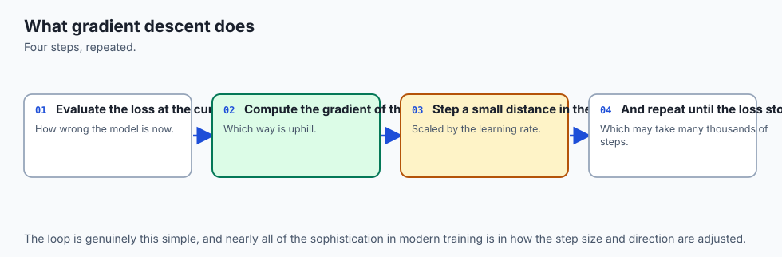
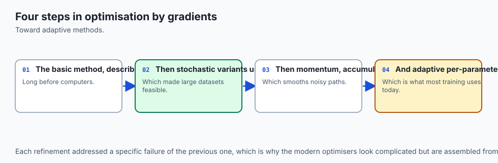
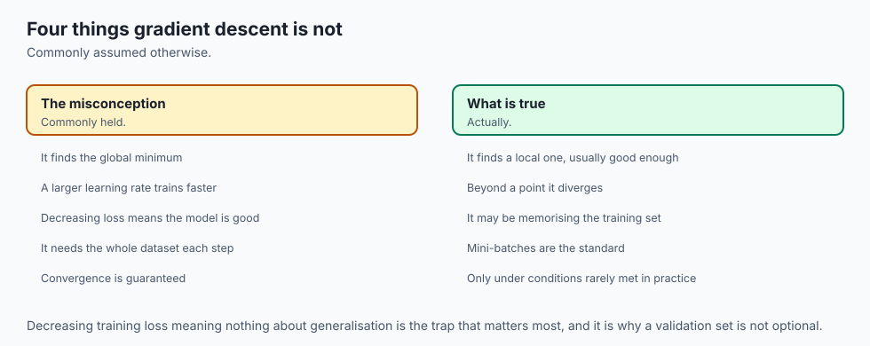
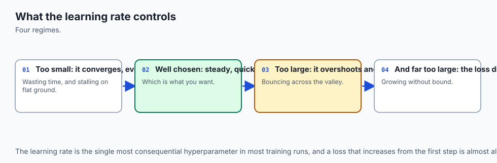
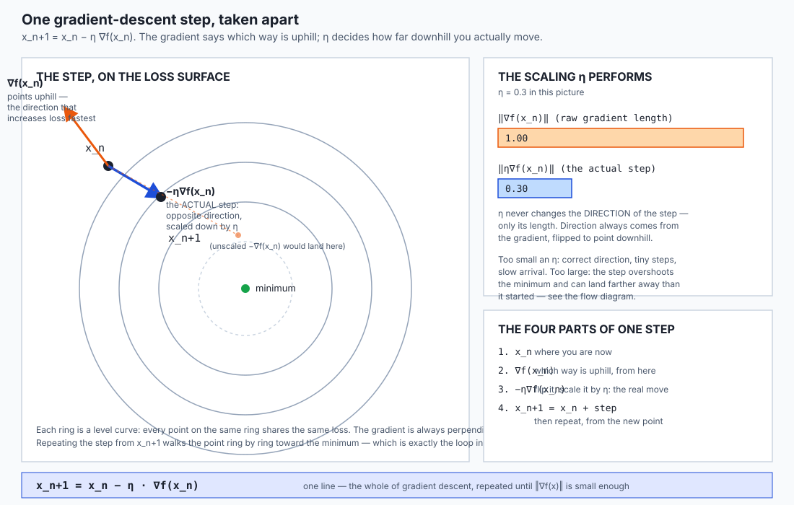
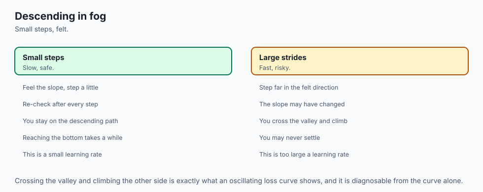
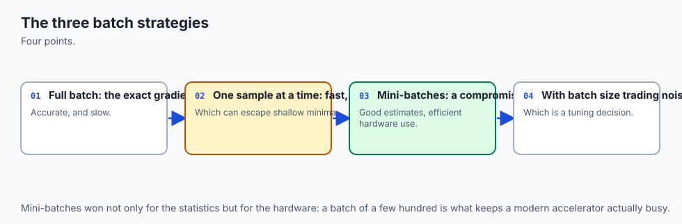
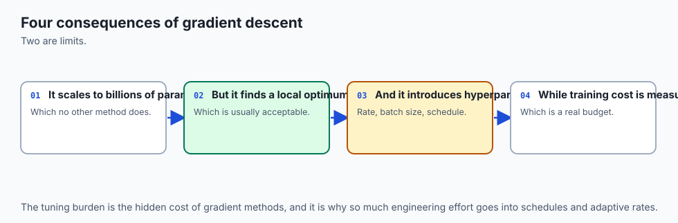
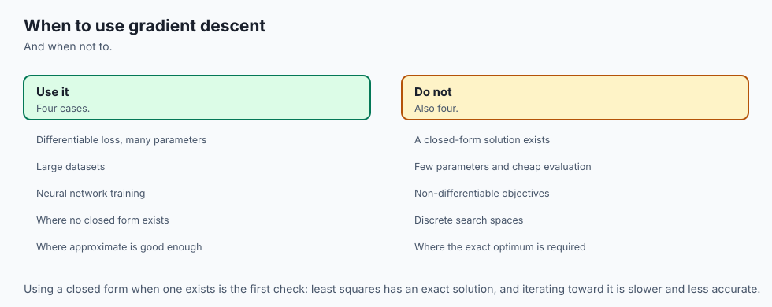

## Why this matters

Here is a function with one variable, one minimum, and nothing subtle about it: `f(x) = 0.5 * x²`. Its derivative is `x`. Its minimum is at `x = 0`. A first-year calculus student solves it by inspection. There is no reason this should ever go wrong.

Run gradient descent on it anyway, starting at `x = 1`, with a learning rate of `2.2`. Watch the loss.

```
step |     x            | loss
   0 |  1.0000000000 | 0.5000000000
   1 | -1.2000000000 | 0.7200000000
   2 |  1.4400000000 | 1.0368000000
   3 | -1.7280000000 | 1.4929920000
   4 |  2.0736000000 | 2.1499084800
   5 | -2.4883200000 | 3.0958682112
   6 |  2.9859840000 | 4.4580502241
   7 | -3.5831808000 | 6.4195923227
   8 |  4.2998169600 | 9.2442129448
   9 | -5.1597803520 | 13.3116666404
  10 |  6.1917364224 | 19.1687999622
  11 | -7.4300837069 | 27.6030719456
  ...
```

The loss is going *up*. Every single step. Not because the function changed, not because the gradient is wrong, not because of a bug anywhere in the code. Run it further — the real run in this lesson's lab went to 4,000 steps — and the value keeps growing, alternating sign, doubling and redoubling, until at step 3890 it exceeds the largest number a float64 can represent and becomes `inf`. The very next update subtracts one infinite quantity from another and produces `nan`. From that point on, every number in the run is garbage, and nothing raised an exception to tell you.

The function was never the problem. The gradient was never the problem. The problem was one number: the learning rate, `η`, which decided how far to move at every step. `2.2` is not a wild, obviously-broken value — it is `0.2` past the function's own boundary of `2.0`. A learning rate you might type without a second thought, on the simplest convex function that exists, turns a solved problem into a training run that silently destroys itself.

That is today's subject, and it is the reason the phrase "just call `.fit()`" hides more than it should. Every model trained in the remaining 250-plus days of this course — every linear regression, every neural network, every large language model — is trained by some variant of one loop:

```
x ← x − η · ∇f(x)
```

Day 109 gave you `∇f(x)`, the gradient: the direction that increases `f` fastest. Day 110 gave you the machinery — the chain rule, backpropagation — for computing that gradient efficiently through an arbitrarily deep composition of operations. Today you take the step. You will discover that the entire mechanics of training a model, stripped of every optimiser, every scheduler and every trick this course reaches later, is a single line of arithmetic — and that almost everything that goes wrong in practical training traces back to how carefully that one line's single free parameter, `η`, was chosen.

By the end of this lesson you will have derived, by hand, the *exact* boundaries at which a learning rate stops working — not approximate, not "usually around here", but exact fractions computable from the curvature of the function you are minimising. You will have measured why some loss landscapes are intrinsically harder to descend than others, connected directly to the eigenvalues you met on Day 106. You will have built the single most useful debugging technique in this entire subject — checking a gradient against a number that has never heard of your formula — and watched it catch a real bug. And you will understand, precisely, why "the loss stopped changing" is not the same claim as "we are done".

## The idea in plain language



You are standing on a hillside in thick fog. You cannot see the valley floor, but you can feel which way the ground slopes under your feet. The rule for getting down is not complicated: feel which way is steepest uphill, turn around, and take a step. Then do it again. And again.

That sentence is gradient descent, completely. `∇f(x)` is "which way is steepest uphill, from here." The minus sign is "turn around." `η` is "how big a step." Repeating the whole thing is "and do it again."

Two things about walking downhill in fog are worth sitting with, because they are exactly the two things that make the mathematics of this lesson necessary rather than decorative.

**The size of your step matters enormously, and the slope alone does not tell you what size to pick.** A cautious two-inch shuffle will get you down eventually, correctly, but it could take until nightfall on a gentle slope. A confident three-metre stride is efficient on that same gentle slope — and, on a steep-sided gully, sends you flying past the bottom and up the *opposite* wall, possibly higher than where you started. The same step size is wise in one place and reckless in another, and the terrain is exactly what decides which.

**You only ever know the slope where you are standing.** You cannot see the whole valley from the fog. Each step is a local decision, made with local information, and the accumulated sequence of those local decisions either walks you steadily to the bottom or walks you somewhere else entirely — off a cliff, in circles, or to a false bottom that is not the true lowest point of the whole landscape.

That second observation is where a plain hillside analogy runs out and the mathematics has to start doing real work. On an actual hillside, "steepest" and "true bottom" are things your eyes and feet can often just tell you. A loss surface with a hundred million dimensions offers no such luxury — the *only* thing you get to know at any point is the local gradient, computed exactly (thanks to Day 110), and the *only* decision you get to make is how far to step along it. Today is about that one decision, examined so carefully that its exact failure boundaries fall out of pure algebra.

## Historical background



The method of following the gradient downhill by fixed steps is old — the core idea traces to work by the French mathematician Augustin-Louis Cauchy in 1847, describing what is now called the method of steepest descent for solving systems of equations. Cauchy's version was not aimed at anything resembling machine learning; it was a numerical technique for a mathematics that predates computers by a century.

The method sat as one numerical-optimisation tool among several for a long time. Its rehabilitation as *the* central algorithm of a major branch of computing came from a specific, later development: the practical trainability of artificial neural networks once backpropagation (Day 110) made it computationally cheap to obtain the gradient of a scalar loss with respect to every parameter in a large model at once. Once that gradient became affordable, the question of what to *do* with it — a question gradient descent had already answered in the nineteenth century — became urgent again.

Two refinements matter enough to name here, both revisited properly later in this course. **Stochastic gradient descent**, where the gradient is estimated from a small random batch of data rather than computed exactly over an entire dataset, made training on datasets too large to fit the exact-gradient computation in memory not just feasible but standard. **Momentum**, the technique this lesson's lab builds from scratch in exercise 6, was described by Boris Polyak in 1964 as a way of accelerating the classical method on ill-conditioned problems, well before it became a default ingredient of neural-network training.

What is worth taking from the history rather than any particular date: this is not a technique invented for AI and later found to be useful elsewhere. It is a general numerical-optimisation idea, older than the electronic computer, that turned out to be exactly the tool an entirely different field needed a century later, once that field acquired a way to compute the one ingredient the method requires — the gradient — cheaply enough to use it hundreds of thousands of times per training run.

## What it is — and what it is not



**Gradient descent is:** an iterative method for finding a point where a differentiable function is small, by repeatedly moving from the current point in the direction opposite to the gradient, scaled by a learning rate.

| The belief | What is actually true |
| --- | --- |
| "Gradient descent finds *the* minimum" | It finds *a* point where the gradient is (near) zero. On a convex function that is the global minimum. On the non-convex functions this course spends most of its time on, it is one of possibly many local minima, and which one you reach depends on where you started — exercise 8 in the lab demonstrates this with two starting points and two different answers. |
| "A smaller learning rate is always safer" | Safer against divergence, yes. But this lesson's own regime table shows a smaller `η` inside the safe range converges *more slowly*, not more safely in any useful sense — you traded a real risk (divergence) for a real cost (wasted compute), and the trade is not free. |
| "The loss going down means it is working" | The loss can go down for a while even with a wrong gradient (a partially-correct direction still often has positive dot product with the true one) or right up until the moment a run diverges, as the opening example shows for the first twenty steps. Loss decreasing is necessary but not remotely sufficient evidence that everything is correct. |
| "Gradient descent and backpropagation are the same thing" | No — and Day 110 already made this point once, worth restating with today's context added. Backpropagation *computes* the gradient. Gradient descent *uses* it. You can compute a gradient and do something else with it entirely (sensitivity analysis, for instance), and you can obtain a gradient some other way and still run gradient descent with it. |
| "Momentum, Adam and other optimisers are unrelated to plain gradient descent" | They are gradient descent with the raw gradient in the update rule replaced by something derived from it — a running average, an adaptively-scaled version, and so on. Exercise 6 in the lab builds the simplest possible case, momentum, and the update rule is still recognisably `x ← x − η·(something built from the gradient)`. |

## Why it was created and what problems it solves

**The problem: you have a function of possibly millions of variables, you can evaluate it and its gradient, and you need a point where it is small — without any closed-form way to solve `∇f(x) = 0` directly.**

For the simplest functions, calculus gives you an exact answer: set the derivative to zero and solve algebraically. Day 111's own running example, `f(x) = 0.5·a·x²`, has derivative `a·x`, and `a·x = 0` is solved instantly by `x = 0`. You did not need gradient descent for that — and the lesson uses it anyway, deliberately, because a problem simple enough to solve exactly is also simple enough to let you verify every claim about the *iterative* method by comparing it against the known right answer.

Real problems in this course do not offer that luxury. A loss function defined by a neural network with a hundred million parameters has no algebraic solution to `∇f(x) = 0` that anyone can write down. What you *do* have, thanks to Day 110, is a cheap way to compute `∇f(x)` at any specific point `x` — one backward pass, costing about as much as the forward pass that produced the loss in the first place. Gradient descent is the answer to the question: given that you can only ever evaluate the gradient *at one point at a time*, how do you turn a sequence of such evaluations into a point where the function is small?

The answer's entire content is contained in one line, and the rest of this lesson is about making that one line trustworthy:

```
x ← x − η · ∇f(x)
```

The gradient supplies the *direction*. Nothing else in the algorithm supplies direction — it is the only directional information the method ever uses. Everything else the algorithm needs to decide — how far to move, when to stop, what to do about a landscape with more than one valley — is a separate decision layered on top of that one piece of information, and each of those decisions is a section of this lesson.

## How it works



### The update rule, taken apart

Four quantities, in order:

```
x_n           the current point
∇f(x_n)       the gradient at that point -- computed exactly, via Day 110
−η · ∇f(x_n)  the ACTUAL step: flip the gradient's direction, scale its length by η
x_n+1 = x_n + step
```



Two roles are easy to conflate and worth separating cleanly. The gradient's *direction* always points uphill — that is its definition, unrelated to anything about training. The learning rate's *only* job is to scale the length of the step that direction gets flipped into. `η` never changes which way you move, only how far. Get the direction wrong (a sign error, a stale value) and no learning rate fixes it. Get the length wrong and the direction was never the issue.

### The one function this whole lesson is built on

Everything from here forward uses one deliberately simple function:

```
f(x) = 0.5 · a · x²          f'(x) = a · x
```

Its derivative is linear in `x`, which means the gradient-descent update is *exact algebra*, not an approximation:

```
x_(n+1) = x_n − η · (a · x_n) = x_n · (1 − η·a)
```

Every step multiplies `x` by the same fixed number, `(1 − η·a)`. That means after `n` steps:

```
x_n = x_0 · (1 − η·a)^n
```

This closed form is the whole lesson in one line. Whether the sequence `x_n` shrinks to zero, lands on zero, oscillates while shrinking, or explodes depends *entirely* on the magnitude of `(1 − η·a)` — and that magnitude is something you can compute in advance, exactly, from `η` and `a` alone.

### The four regimes, derived and then measured

Write `c = 1 − η·a`, the **contraction factor**. `|c|` decides everything:

| Condition on `η` (with `a = 5`, so `1/a = 0.2`, `2/a = 0.4`) | Value of `c` | What happens |
| --- | --- | --- |
| `0 < η < 1/a` | `0 < c < 1` | `x` shrinks toward 0 every step, same sign throughout — **monotone** |
| `η = 1/a` | `c = 0` | `x` becomes exactly 0 after one step — **exact** |
| `1/a < η < 2/a` | `−1 < c < 0` | `x` flips sign every step, but `|x|` still shrinks — **oscillating, but converging** |
| `η = 2/a` | `c = −1` | `x` flips sign every step and `|x|` never changes — oscillates forever, converges to neither zero nor anything else |
| `η > 2/a` | `c < −1` | `|x|` grows every step, without bound — **divergent** |

This table is not a rule of thumb. It is the complete case analysis of `|c|^n` as `n → ∞`, and every boundary in it — `1/a` and `2/a` — is an exact fraction, not an estimate.



A real run confirms all four rows, with `a = 5`:

| `η` | Regime | First four steps | Classified as |
| --- | --- | --- | --- |
| `0.10` | `0 < η < 1/a` | `1.0, 0.5, 0.25, 0.125` | monotone |
| `0.20` | `η = 1/a` | `1.0, 0.0, 0.0, 0.0` | exact |
| `0.35` | `1/a < η < 2/a` | `1.0, -0.75, 0.5625, -0.4219` | oscillating |
| `0.45` | `η > 2/a` | `1.0, -1.25, 1.5625, -1.9531` | divergent |

Those four rows came from `lab/examples/02_regimes_and_contraction.py`, and the lab's `classify_regime` function derives the label purely from the *observed values* in each run — never by reading `η` and `a` and looking the answer up. That distinction matters: a classification function that just re-derives the table above from the inputs would be checking that the table was typed correctly, not that the algorithm actually behaves the way the table claims.

### The contraction factor, measured directly

The closed form predicts that the ratio `|x_(n+1) / x_n|` should equal `|c| = |1 − η·a|` at *every single step*, not just on average. This is checkable, and the lab checks it:

| `η` | Predicted `|1 − η·a|` | Measured ratio (first three steps) | Match |
| --- | --- | --- | --- |
| `0.10` | `0.500000` | `0.5, 0.5, 0.5` | to `1e-9` |
| `0.35` | `0.750000` | `0.75, 0.75, 0.75` | to `1e-9` |
| `0.45` | `1.250000` | `1.25, 1.25, 1.25` | to `1e-9` |

The three measured ratios are constant across steps and match the prediction to float precision — not "roughly", to `1e-9`, because this is exact multiplication in floating point and the only source of disagreement possible is rounding, which for a handful of steps is many orders of magnitude smaller than the tolerance. This is exactly the kind of prediction Day 108 taught you to distrust until you have measured it, and here it survives the measurement completely.

### Conditioning: when the landscape itself is the problem

Everything above used one variable. Real loss landscapes have millions. The moment you have more than one dimension, a new failure mode appears that no single learning rate can fully escape: the landscape can be steep in one direction and shallow in another, at the same point.

Take the two-variable bowl:

```
f(x, y) = 0.5 · (x² + κ·y²)
```

Its Hessian — the matrix of second derivatives Day 106 introduced — is `diag(1, κ)`, a diagonal matrix whose two eigenvalues are `1` and `κ`. **The condition number of this bowl is `κ`, exactly**: the ratio of its largest eigenvalue to its smallest, which Day 106 defined as the quantity that governs how "well-behaved" a matrix is. Here it governs something very concrete: how hard this particular landscape is to descend.

There is a standard, provably-optimal fixed learning rate for a quadratic bowl with smallest eigenvalue `μ` and largest eigenvalue `L`:

```
η* = 2 / (μ + L)
```

For this bowl, `μ = 1` and `L = κ`, so `η* = 2/(1+κ)`. At `κ = 1` (an isotropic bowl — equally steep in every direction) that optimal rate is `η* = 1`, and — this is not a coincidence, it is the two-dimensional version of the "exact" row in the regime table above — gradient descent with the optimal rate solves an isotropic quadratic bowl in **exactly one step**.

As `κ` grows, the optimal rate `2/(1+κ)` shrinks, because it has to stay small enough to avoid divergence along the steep direction (whose own eigenvalue is `κ`). But the *shallow* direction (eigenvalue `1`) never got any steeper — it is being forced to creep forward using a learning rate sized for a completely different, much steeper problem. That is the entire mechanism of ill-conditioning, stated without a single approximation.

Measured, on the same bowl, at its own optimal learning rate, for four condition numbers:

| `κ` | Optimal `η = 2/(1+κ)` | Steps to `‖∇f‖ < 1e-4` |
| --- | --- | --- |
| 1 | 1.000000 | **1** |
| 5 | 0.333333 | 27 |
| 20 | 0.095238 | 122 |
| 100 | 0.019802 | **691** |

Non-decreasing at every step up in `κ`, and `κ = 100` needs `691` steps against `κ = 1`'s single step — more than a hundred times more, comfortably clearing "at least ten times" with room to spare. Nothing about `η` was mistuned in any of these four runs; each one used the provably optimal fixed learning rate *for its own problem*. The slowdown is not a tuning failure. It is what a large ratio between eigenvalues costs you, and no fixed learning rate — optimal or otherwise — escapes it. **This is where Week 16's two halves meet**: Day 106 gave you eigenvalues as an abstract property of a matrix; today, the ratio of two of them is directly, measurably, the reason one optimisation problem needs six hundred times more steps than another that looks superficially similar.

### Momentum: the minimal fix for zig-zag

The ill-conditioning table above used the best *fixed* learning rate available and still paid a steep price. Momentum is the smallest change that helps without abandoning the one-line update rule:

```
v ← β·v + ∇f(x)          (a running average of recent gradients)
x ← x − η·v               (step using the average, not the raw gradient)
```

This is not a new algorithm bolted onto gradient descent — it is the *same* update rule, `x ← x − η·(something)`, with the raw gradient replaced by an exponentially weighted running average of it. `β` (a number between 0 and 1) controls how much of the past is remembered; `β = 0` recovers plain gradient descent exactly, since `v` then equals the current gradient at every step.

Why does averaging help on the ill-conditioned bowl specifically? Along the steep direction, gradient descent overshoots and the gradient flips sign step after step — a genuinely oscillating signal, and an average of a signal that keeps flipping sign partially cancels itself. Along the shallow direction, the gradient keeps the *same* sign step after step, so an average of a consistently-signed signal does **not** cancel — it accumulates, and `v` grows larger than any single gradient in that direction ever was. The net effect is exactly what the ill-conditioned bowl needed: damping where the raw gradient was overreacting, reinforcement where it was crawling.

Measured, on the `κ = 20` bowl, giving momentum the *identical* learning rate plain descent used:

| Method | `η` (identical for both) | Steps to `‖∇f‖ < 1e-4` |
| --- | --- | --- |
| Plain gradient descent | `0.095238` | 122 |
| Momentum (`β = 0.5`) | `0.095238` | **34** |

A 3.6× reduction in steps, from changing nothing but what stands in for the gradient in an otherwise identical update rule. Do not read this as "momentum is magic" — it is averaging, doing exactly what averaging does to an oscillating signal versus a consistent one, on a problem specifically shaped to make that distinction pay off.

### Gradient checking: catching a bug that will not announce itself

Day 108 built the central difference — `(f(x+h) − f(x−h)) / (2h)` — as a way to *measure* a derivative numerically. Today it earns its keep a second time, as a way to *check* one you derived analytically.

The failure mode gradient checking exists to catch is specific and dangerous: an analytic gradient with a bug that produces numbers of a plausible type, plausible shape and plausible magnitude — and is simply wrong. Such a bug does not crash. It does not always even stop training from working, because a partially-wrong direction can still have positive dot product with the true gradient and make the loss go down for a while. The only reliable way to catch it is to compare against something that shares none of its assumptions: a numerical estimate that knows nothing about how the analytic formula was derived.

Take a three-parameter function, `f(x,y,z) = x² + 2y² + 0.5z³`, whose correct gradient is `(2x, 4y, 1.5z²)`. Deliberately flip the sign of the middle component, and check both against a central difference component by component, at `(0.7, -1.3, 2.1)`:

| Component | Correct gradient check | Buggy gradient (sign flipped on `y`) check |
| --- | --- | --- |
| `x` | pass | pass |
| `y` | pass | **fail** |
| `z` | pass | pass |

The correct gradient passes on every component. The buggy one fails on **exactly** the one that was broken and nowhere else — because the check compares each component of the analytic gradient against its own independent numerical estimate, with no interaction between components. This is the single most useful debugging technique in the whole of practical machine-learning mathematics, and it costs almost nothing to run once per new gradient you write by hand.

### Non-convexity: where you start is part of the answer

Every function used so far has had one minimum. Take `f(x) = (x² − 1)²` instead: it has minima at `x = −1` and `x = +1` (both with value `0`), and a local maximum at `x = 0` sitting between them, since `f'(x) = 4x³ − 4x` is negative for `0 < x < 1` (pulling toward `+1`) and positive for `−1 < x < 0` (pulling toward `−1`).

Run gradient descent from two starting points, one on each side of the maximum:

| Start | Converged to |
| --- | --- |
| `x₀ = −0.1` | `−1.000000` |
| `x₀ = +0.1` | `+1.000000` |

Two runs, same algorithm, same learning rate, same number of steps — different answers, separated by `2.0`, comfortably past any reasonable margin for "these are genuinely different minima." The *only* thing that differed between the two runs is which side of `x = 0` they started on. On a non-convex loss surface — which is what every neural network in this course trains on — initialisation is not an implementation detail you can be careless about. It is part of what determines the answer you get.

### The stopping-criterion trap

Every gradient-descent loop needs a rule for when to stop. Three are common:

| Criterion | What it checks | What can go wrong |
| --- | --- | --- |
| `‖∇f(x)‖ < tol_grad` | Is the gradient small? | The most honest of the three — directly checks the thing that defines a minimum — but can be expensive to evaluate exactly on very large models |
| `|Δf| < tol_f` | Did the loss barely change last step? | Can fire on a **plateau**: a region where the function's value happens to change slowly even though the point is nowhere near a minimum |
| A maximum iteration count | Have you run out of patience? | Catches nothing about whether training actually succeeded; only prevents running forever |

The middle row is the trap, and it is worth seeing it actually spring rather than taking the warning on faith. Take a genuinely convex bowl with a very small curvature, `f(x) = 0.5 · 0.0001 · x²`, starting far from its minimum at `x = 100`:

```
gradient at x=100:   0.01      (10x above a tolerance of 0.001)
one step later, delta_f:   1.0e-07   (below a tolerance of 0.000001)
```

The gradient is comfortably above its own tolerance — this point is nowhere near converged. The change in loss from a single step, though, is smaller than *its* tolerance, because the curvature is so small that even a real, non-trivial gradient produces a barely-perceptible change in the function's value. A naive `|Δf| < tol_f` rule stops here. A `‖∇f‖ < tol_grad` rule correctly refuses to. **"The loss stopped changing" is not the same claim as "we converged"**, and this is not a contrived edge case — it is exactly the shape of a long, gently sloped approach to a minimum, which real loss landscapes have plenty of.

## An everyday analogy



Return to the fogbound hillside, and let it carry every piece of today's mathematics through to the end.

**The gradient is the slope under your feet, right now.** It tells you nothing about the rest of the mountain — only which way is steepest, from exactly where you are standing, this instant.

**The learning rate is your stride length.** A tiny, cautious stride is always *safe* — it will never send you flying past the bottom — but on a gentle slope it is needlessly slow, the monotone regime's whole story. A stride tuned exactly to the local steepness can, in the fortunate case of a perfectly uniform slope, land you at the bottom in one confident step — the exact regime. Push your stride a little further and you overshoot the bottom and land partway up the *opposite* wall, but each overshoot is smaller than the last, so you still arrive, just zig-zagging — the oscillating regime. Push it further still and each overshoot lands you *higher* on the opposite wall than where you started, and you climb, alternately, out of the valley entirely — divergence, and the opening failure of this lesson exactly.

**A narrow, steep-walled gully is the ill-conditioned bowl.** A stride safe for its steep walls is comically small relative to how gently the gully's floor actually slopes lengthwise, so you take tiny, safe side-to-side corrections while making almost no progress along the gully's length. A wide, gently-sloped bowl — walls and floor equally steep — is the well-conditioned case, where one confident stride, correctly sized, gets you most of the way there.

**Momentum is remembering which way you have been generally heading.** If your last several steps have zig-zagged left-right-left-right across the gully, that side-to-side motion averages toward nothing, and you can safely discount it. If your last several steps have all trended the same direction along the gully's length, that trend is real, and leaning into it — walking a bit further than any single step's slope alone would suggest — is exactly the right thing to do.

**Gradient checking is asking a second, independent guide to point.** If your reading of the slope under your feet and a companion's independent reading disagree sharply in one specific direction, you trust the disagreement, not either reading alone — and you find out *which* direction they disagree about, rather than distrusting the whole hike.

**Non-convexity is a mountain range with more than one valley.** Which valley you end up in is decided by which slope you started walking down, not by anything about your stride length or your patience once you are already descending. Two hikers starting a few metres apart, on opposite sides of a ridge, can end their walk kilometres apart, in different valleys, having done everything else identically.

**The stopping-criterion trap is mistaking a long, gentle, boring stretch of trail for having arrived.** If you only check "did the ground under me change much in the last minute," a long, flat-feeling stretch that is still genuinely sloping downhill — just very gradually — will read as "we must be there," when the honest check is not how the trail *felt*, but whether the ground is actually level yet.

## Examples in practice



### The full arithmetic behind the opening failure

`a = 1`, `η = 2.2`. The divergence boundary is `2/a = 2.0`, and `η` sits `0.2` past it. The contraction factor is `c = 1 − 2.2 = −1.2`, so `|c| = 1.2 > 1`: this is the divergent regime, and `x_n = x_0 · (−1.2)^n`.

Since `f(x) = 0.5·x²`, the loss at step `n` is `0.5 · (1.2)^(2n) = 0.5 · 1.44^n`. Each step multiplies the loss by `1.44` — a genuine, if modest-looking, 44% increase per step. Modest per step, but compounding: after 20 steps the loss has grown by `1.44^20 ≈ 511`, and by step 3890 the tracked value has passed `8.6 × 10^307` — one step short of float64's largest representable number, `~1.8 × 10^308`. Step 3891 pushes it over, to `inf`, and the arithmetic of the *next* update (`inf − η·inf`, which involves subtracting two infinite quantities whose relative sizes floating point can no longer resolve) produces `nan`.

Every number in that paragraph came from `lab/examples/01_the_hook.py`, run for real, not derived and hoped for.

### The full arithmetic behind the two-minima result

`f(x) = (x²−1)²`, `f'(x) = 4x³ − 4x = 4x(x²−1) = 4x(x−1)(x+1)`. The three roots of the derivative — `x = −1, 0, 1` — are exactly the two minima and the one local maximum. Starting at `x₀ = 0.1`, comfortably inside `(0, 1)`, `f'(0.1) = 4(0.1)(0.01 − 1) = 4(0.1)(−0.99) = −0.396`: the gradient is negative, so `x ← x − η·(−0.396) = x + η·0.396` moves `x` in the **positive** direction — toward `+1`, away from the maximum at `0`. By symmetry, starting at `x₀ = −0.1` moves toward `−1`. Two runs of 400 steps each, at `η = 0.05`, land at `−0.9999999999999999` and `0.9999999999999999` respectively — both within `1e-3` of the algebraically exact answer, and `1.9999999999999998` apart, well past this lesson's `1.5` margin for "these are genuinely different."

## Implications: security, privacy, performance, scalability, and cost



**Performance and cost.** The learning rate is the single hyperparameter most directly responsible for whether a training run's compute budget is well spent or wasted. A learning rate inside the safe range but too small (this lesson's monotone regime) wastes steps — and every wasted step on a large model is real GPU-hours billed by the hour. A learning rate past the divergence boundary does not merely waste compute; it destroys the run entirely, and the run's true cost includes however many steps passed before anyone noticed the loss had actually been `nan` for the last several hours.

**Scalability.** Ill-conditioning gets *worse*, not better, as models grow. A larger model has more parameters, which generally means a Hessian with a wider spread between its smallest and largest eigenvalues — a larger condition number, in exactly the sense this lesson measured. This is a direct, mechanical reason (not a hand-wave) that naive fixed-learning-rate gradient descent scales poorly, and it is the practical motivation for every adaptive-learning-rate method this course reaches later: they are, at their core, attempts to give different directions in a high-dimensional space something closer to their own appropriately-sized learning rate, rather than forcing one global `η` to serve every direction at once.

**Numerical robustness.** The opening failure is not a special case reserved for badly-chosen toy examples. Overflow to `inf` followed by `nan` is *exactly* what a diverging training run looks like on real hardware, and neither event raises an exception by default in IEEE-754 arithmetic. A training loop that does not explicitly check its own loss for finiteness after every step will happily continue computing — and billing — with `nan` parameters for as long as it is left running. This is one of the cheapest, highest-value guards a training script can contain, and today's opening failure is the exact mechanism it exists to catch.

**Security.** A silently wrong gradient — caught by the checking technique in this lesson, uncaught otherwise — produces a model that trains, has plausible-looking loss curves, and learns something *incorrect* in a way that is not obvious from the training logs alone. In any setting where a trained model's decisions have consequences for people, "the loss went down" is not evidence the model learned the right thing, and gradient checking is one of the few genuinely cheap ways to rule out an entire, dangerous class of silent bug before it ever reaches a real training run.

**Privacy.** Not the direct subject of today's lesson, but worth stating plainly since it follows immediately from the update rule: every step of gradient descent uses a gradient computed from specific training examples. A gradient is not an anonymous summary of the data that produced it — this is the entire basis of gradient-inversion attacks in the federated-learning literature, where an adversary who observes only the gradients (never the raw data) can sometimes reconstruct the data those gradients came from. The mathematics you built today is the same mathematics whose output, in an adversarial setting, is a data-leakage surface.

## Alternatives: free, open source, and commercial

Four ways to run gradient descent, from the one built entirely by hand today to the tools that run it at production scale. **Only the hand-rolled NumPy and pure-Python versions in this lesson's lab were actually run here.** SciPy, PyTorch and JAX are not installed in this authoring environment, and no output from any of them is reproduced anywhere in this lesson or its lab — everything said about them below is drawn from their own documentation and marked as such.

| Tool | What it does | Exact or approximate? | Cost |
| --- | --- | --- | --- |
| Hand-rolled NumPy / pure Python (this lab) | The update rule, written out explicitly, on scalar and small-vector problems | Exact arithmetic on the quadratics used here | Free — the standard library plus NumPy |
| `scipy.optimize.minimize` | A general-purpose scalar-function minimiser with several selectable algorithms | Exact gradients if you supply them; numerically estimated otherwise | Free, open source (BSD) |
| `torch.optim.SGD` | Gradient descent (with optional momentum, weight decay, Nesterov acceleration) as one step of a PyTorch training loop, driven by autograd-computed gradients | Exact gradients via automatic differentiation | Free, open source; commercial only via the compute you run it on |
| `jax.grad` with `optax` | Functional gradient transformation (`jax.grad(f)` returns a new function computing `f`'s gradient) paired with a library of optimiser update rules, including SGD and momentum variants | Exact gradients via automatic differentiation | Free, open source |

**The engine you built here.** Choose it when the goal is understanding the mechanics themselves, or when you are debugging a training run and need to reason about *why* an optimiser behaves the way it does rather than treating it as a black box. Its concrete example is every script in this lesson's lab — the whole update rule, all nine exercises, in well under two hundred lines. Its limitation is entirely engineering: no automatic differentiation (Day 110's engine supplies gradients on real models), no GPU dispatch, no batching. Nothing about the *idea* changes when those are added.

**`scipy.optimize.minimize`** — according to its documentation, it exposes a single function with a `method` parameter selecting among several classical optimisation algorithms (`'BFGS'`, `'CG'`, `'Nelder-Mead'`, among others), accepts an optional analytic gradient via the `jac` argument and falls back to a numerical estimate if none is given, and returns a result object carrying the optimum, the function value there, and convergence diagnostics. Choose it for classical numerical-optimisation problems with a modest number of variables — fitting a small model, solving an inverse problem — where you want a well-tested general-purpose solver rather than to write the loop yourself. It is not the tool of choice for training a neural network with millions of parameters; the algorithms it offers are generally not designed for that scale or for stochastic (mini-batch) gradients.

**`torch.optim.SGD`** — according to its documentation, it is constructed with an iterable of parameters to optimise, a required `lr` argument, and optional `momentum`, `dampening`, `weight_decay` and `nesterov` arguments, and its `.step()` method applies one update to every tracked parameter using whatever gradient PyTorch's autograd most recently computed for it (via `.backward()`). Choose it as the default first optimiser for a PyTorch training loop; its `momentum` argument is a direct production implementation of exactly the mechanism exercise 6 builds by hand in this lesson's lab, down to the same `v ← β·v + ∇f` shape.

**`jax.grad` with `optax`** — according to its documentation, `jax.grad(f)` is a function transformation: given a function `f`, it returns a *new function* that computes `f`'s gradient, rather than a value computed once. `optax` then supplies composable optimiser update rules — `optax.sgd(learning_rate, momentum=...)` among them — designed to be combined with JAX's functional style and its `jit` compilation. Choose this combination when you want gradient computation and optimiser logic to compose as ordinary function transformations, or when targeting JAX's compiled-and-accelerated execution model specifically.

The honest summary: for understanding what gradient descent actually does, write it yourself once, as this lab does. For running it at any scale that matters, the production tools exist precisely because the engineering — automatic differentiation over arbitrary computation graphs, batching, hardware dispatch — is substantial, well-solved, and not worth re-deriving. The update rule itself, underneath all four rows of that table, is the same line this lesson opened with.

## Comparison with related concepts

**Gradient descent and backpropagation (Day 110).** Different jobs, constantly confused. Backpropagation computes `∇f(x)`. Gradient descent uses it to update `x`. You could compute a gradient with backpropagation and never run gradient descent at all — sensitivity analysis is exactly that. You could run gradient descent with a gradient obtained some other way (finite differences, for a small enough problem) and never touch backpropagation.

**Gradient descent and Newton's method.** Both are iterative optimisation methods that use derivative information. Newton's method also uses the *second* derivative (the Hessian) to choose both the direction and an effectively per-direction step size, which is why it can solve a quadratic bowl in one step *regardless of its condition number* — unlike gradient descent, whose one-step-solves-it property in this lesson was special to the isotropic case. That extra power costs a Hessian, which for a model with millions of parameters is far too large to compute or store; gradient descent's appeal is precisely that it needs only the (comparatively cheap) gradient.

**The learning rate and other hyperparameters.** The learning rate is a hyperparameter — a value that controls the training process rather than one the training process learns. It sits alongside the momentum coefficient `β` from exercise 6, the batch size, and the network architecture itself: none of these are updated by gradient descent's own update rule, even though gradient descent is what tunes everything that *is* a parameter.

**Convex and non-convex optimisation.** A convex function has exactly one basin, so any local minimum gradient descent finds is automatically the global one — this lesson's quadratic and ill-conditioned bowl are both convex. A non-convex function, like exercise 8's two-minima example, can have multiple basins, and gradient descent finds whichever one it happened to be walking downhill into. Almost every model trained in this course, beyond the earliest and simplest, has a non-convex loss surface.

**Stopping criteria and convergence proofs.** A convergence *proof* (which this lesson has effectively supplied, in closed form, for the 1-D quadratic case) tells you the algorithm reaches the minimum in the mathematical limit. A stopping *criterion* is the separate, practical decision about when to actually stop a finite-length run and call the current point good enough — and, as the plateau example showed, a badly chosen stopping criterion can declare victory well before the mathematics behind the convergence proof has actually delivered it.

## When to use it — and when not to



**Use plain gradient descent** whenever you have a differentiable objective and a cheap way to compute its gradient, and the objective is convex or you have accepted that you will find *a* local minimum rather than provably *the* global one. It is the correct starting point for almost every training loop in this course.

**Use a smaller learning rate than you think you need** when you are uncertain about a landscape's curvature and have not measured its condition number. The cost of too-small an `η` is wasted steps, which is expensive but recoverable. The cost of too-large an `η` is the opening failure of this lesson, which is not recoverable without restarting.

**Use momentum, or a more sophisticated optimiser built on the same principle,** whenever you suspect (or, better, have measured, as this lesson's lab does) that your loss surface is ill-conditioned — which for realistic neural-network loss surfaces is close to the default assumption rather than a special case.

**Use gradient checking** the first time you write any gradient by hand, and every time you change how one is computed. It is cheap, mechanical, and catches exactly the class of bug — plausible-looking, partially-correct, silently wrong — that no amount of watching the loss curve will reliably reveal.

**Do not trust a single fixed learning rate across wildly different phases of a long training run.** The condition number of a real loss surface is not necessarily constant as training progresses; a rate that was well-chosen early on can become poorly chosen later, which is the practical motivation for learning-rate schedules this course covers separately.

**Do not use a loss-based stopping criterion alone** on any landscape you have not specifically confirmed lacks the kind of plateau this lesson demonstrated. Prefer a gradient-norm-based criterion, or combine both with a maximum-iteration ceiling as a backstop rather than a primary decision rule.

**Do not assume a non-convex training run's result is initialisation-independent** without testing more than one initialisation. Exercise 8's two-minima function is a toy, deliberately small enough to solve by hand — but the mechanism it demonstrates, that where you start can determine which answer you get, is exactly as real on a loss surface with a hundred million dimensions.

## The AI connection

- **Gradient descent trains essentially every model in modern AI**, at every scale.
- **The learning rate is the most consequential hyperparameter**, and its failure modes are
  visible rather than subtle.
- **The loss surface's conditioning decides convergence speed**, which is why feature scaling
  and normalisation layers matter.
- **Stochastic gradients made large-scale training possible** by trading exactness for far
  more steps per unit of compute.
- **Every optimiser you will meet later is a variation on this loop**, with momentum or
  adaptive step sizes added.

## Knowledge check

Eight questions accompany this lesson, covering: the exact regime boundaries `1/a` and `2/a` and what happens past each; why the update rule subtracts rather than adds the gradient; how the measured contraction ratio predicts convergence speed quantitatively; how a Hessian's condition number governs the cost of ill-conditioning and why the optimal fixed learning rate cannot fully escape it; the mechanism by which momentum's averaging helps an oscillating-versus-consistent gradient signal differently; what a component-wise gradient check actually catches and why it localises a bug rather than merely detecting one; the concrete case where a loss-based stopping criterion disagrees with a gradient-based one; and what a diverging run actually looks like, measured, before it destroys itself.

Two are worth attempting before reading anything else: the one asking what a learning rate just past `2/a` produces, and the one asking why "the loss stopped changing" is not the same claim as "we converged." Those two facts are the load-bearing ones this entire lesson is built to demonstrate rather than merely assert.

## Hands-on exercise

The lab is **"Descent by Hand"**, and its centrepiece is the training loop itself, `x ← x − η·∇f(x)`, built from nothing and pushed until it breaks.

```bash
cd labs/sections/math-statistics-and-data/day-111-gradient-descent-from-scratch
python3 -m venv .venv
.venv/bin/pip install -r requirements/requirements.txt
```

Nine exercises, in order, in `starter/descent.py`, working against constants and helper functions already written out for you in `starter/dataset.py`. Check yourself as you go:

```bash
.venv/bin/pytest starter -q
```

Unattempted work is reported as skipped, never as failed. Wrong work fails with your answer printed beside the correct one.

### Expected output

An untouched checkout:

```
1 passed, 20 skipped
```

A finished one, every test passing. The full harness ends with:

```
50 checks, 0 failure(s).
```

and exits 0. Along the way, the opening failure, captured from a real run:

```
step 0 |  1.0000000000 | loss 0.5000000000
step 1 | -1.2000000000 | loss 0.7200000000
  ...
x first becomes inf at step 3890
x first becomes nan at step 3891
```

and the ill-conditioning result the whole day is built on:

```
kappa |     eta = 2/(1+kappa)  | steps
    1 |               1.000000 | 1
    5 |               0.333333 | 27
   20 |               0.095238 | 122
  100 |               0.019802 | 691
```

### Validate your work

1. `bash tests/run_tests.sh; echo "exit=$?"` prints `50 checks, 0 failure(s).` and `exit=0`.
2. `.venv/bin/pytest examples -q -p no:cacheprovider` prints `24 passed`.
3. `.venv/bin/pytest starter -q -p no:cacheprovider` prints `1 passed, 20 skipped` on an untouched checkout, and every test passing when you are finished.
4. Each of the four reference scripts ends with `every assertion held.`
5. Your `classify_regime` agrees with the four rows in this lesson's regime table on all four of the exact `η` values used throughout — not approximately, exactly, since the underlying arithmetic is exact.

### Troubleshooting

`ModuleNotFoundError` on `dataset` or `descent` means you ran a reference script from the lab directory rather than from inside `examples/`; they import their neighbours from beside themselves.

Tests that keep skipping after you have written code usually mean a leftover `return None` survived below your implementation — every skeleton in `starter/descent.py` has it on the last line of a docstring.

A `classify_regime` that reports "divergent" for a run that is actually converging usually means your shrinking check has no tolerance for float rounding on the very last step; the reference implementation allows `1e-12` of slack for exactly this reason.

A contraction ratio that does not match `|1 − η·a|` on the "exact" regime (`η = 0.2`) is expected to fail if you have not excluded the step where `x_n = 0` — dividing by zero there is not a bug in your formula, it is a genuine division by zero that `per_step_ratios` must skip.

`troubleshooting.md` covers all of these in full, along with the momentum update-order mistake, the two-minima run that collapses onto one basin, and why the harness clears bytecode caches at the start of its run.

### Common mistakes

- **Trusting a "safe-looking" learning rate without checking `2/a`.** `2.2` looks like an ordinary number. It is `0.2` past the exact boundary for `a = 1`.
- **Assuming a smaller learning rate is free of cost.** It only trades divergence risk for wasted compute; both are real costs, on opposite ends of the same knob.
- **Tuning one learning rate for an ill-conditioned problem and expecting it to be fast.** The optimal fixed rate for `κ = 100` still needs `691` steps. No single fixed `η` escapes ill-conditioning; only a change to the update rule itself (momentum, or the adaptive methods this course reaches later) does.
- **Trusting a decreasing loss curve as proof of a correct gradient.** A partially-wrong gradient can still decrease the loss for a while. Check the gradient itself, component by component, against an independent numerical estimate.
- **Stopping on `|Δf| < tol` alone.** It can fire on a plateau that is nowhere near a minimum. Prefer `‖∇f‖ < tol`, or use both together.

## Practice assignment

Extend the lab and put a prediction to a real measurement, the way every section of this lesson did.

1. **Find your own divergence boundary.** Pick a value of `a` other than `1` or `5`, predict the exact boundary `2/a`, and confirm with a real run that `η` just below it converges (however slowly) while `η` just above it diverges.
2. **Predict a step count before measuring it.** Using the condition-number table's four rows, fit (by eye, or with a simple regression) how steps-to-tolerance scales with `κ`, then predict the step count for `κ = 500` before running it, and compare.
3. **Sweep the momentum coefficient.** Run momentum at `β` values other than `0.5` on the `κ = 20` bowl, and find the value of `β` (to one decimal place) that needs the fewest steps in your own measurements. Report both the count and the value.
4. **Write your own gradient-checking failure.** Construct a second buggy gradient — not a sign flip this time, but a coefficient error (a `2x` written as `3x`, for instance) — and confirm `gradient_check` still catches it at the lab's tolerance.
5. **Build a second plateau.** Using a different curvature and starting point than the lab's, construct another case where `|Δf| < tol_f` fires while `‖∇f‖` remains above its own tolerance, and report both numbers.

## Extension challenge

Three, in increasing order of difficulty.

**Push the ill-conditioning table further, and predict before you measure.** The lab's table stops at `κ = 100`. Extend it to `κ = 1000` and `κ = 10000`, predict the step counts from the pattern in the existing four rows before running anything, then measure and report how good your prediction was.

**Derive the momentum stability boundary.** This lesson stated momentum's update rule without deriving its own divergence boundary, the way section "The four regimes" derived plain gradient descent's. Work out, for the 1-D quadratic `f(x) = 0.5·a·x²`, the condition on `η`, `a` and `β` under which momentum's update converges rather than diverges, and confirm it numerically by finding a `(η, β)` pair your formula predicts should diverge and watching it do so.

**Implement Nesterov's variant and explain why it helps.** Look up Nesterov accelerated gradient — the variant of momentum where the gradient is evaluated at the *look-ahead* point `x − η·β·v` rather than at the current `x` — and implement it as a fourth function in your own copy of the lab. Compare its step count against plain momentum's on the `κ = 20` bowl, and write one paragraph on why evaluating the gradient at the look-ahead point, rather than the current point, is expected to help.

---

**The AI thread.** This loop, unchanged in shape, trains every model the rest of this course builds — linear models, small networks, and eventually architectures with more parameters than anyone could list by hand. Nothing about the update rule gets more sophisticated as models grow; `x ← x − η · ∇f(x)` is exactly as true for a hundred-billion-parameter language model as it is for the single-variable quadratic this lesson opened with. What changes with scale is everything *around* the rule — how the gradient is computed (Day 110's machinery, applied to an unimaginably larger graph), how much data one step sees, whether the learning rate is fixed or scheduled or adapted per-parameter — but the core arithmetic never leaves this lesson's one line.

The learning rate is the hyperparameter most directly responsible for whether a training run works at all, and you have now seen exactly why, in closed form, on a function simple enough to check every claim by hand. When a large training run's loss suddenly spikes to `nan` after appearing to train normally for hours, the mechanism is not usually mysterious — it is very often a learning rate that was fine for the loss surface's condition early in training and stopped being fine later, producing exactly the smoothly-increasing-then-overflowing pattern this lesson opened with, just on a landscape too large to inspect by eye. You now know what that failure looks like from the inside, and — for the one-dimensional case, exactly — precisely where its boundary sits.
