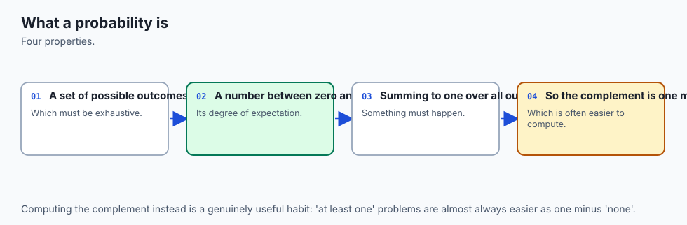
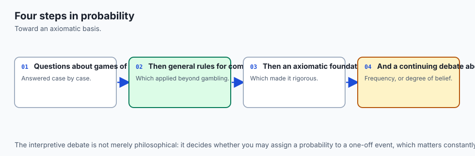
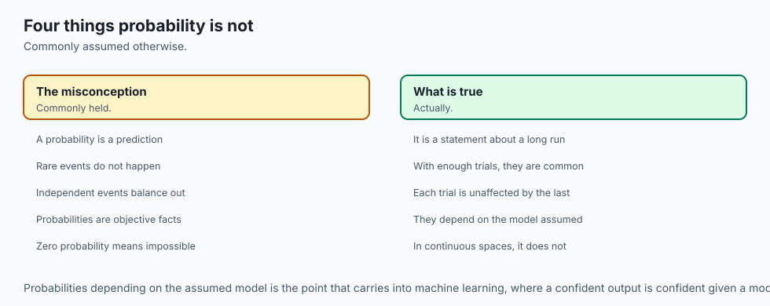
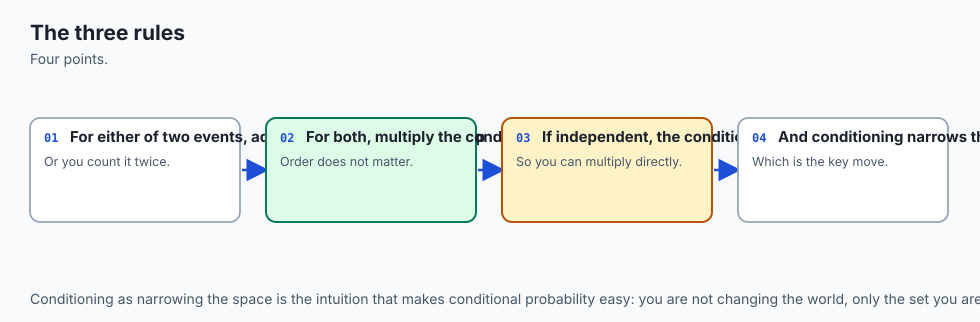
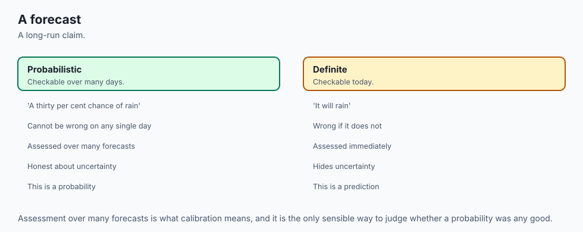
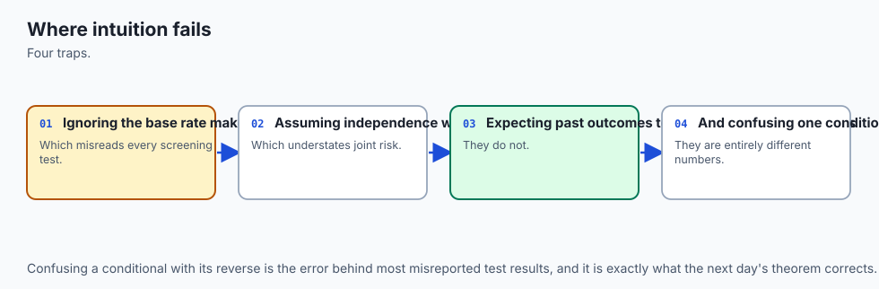
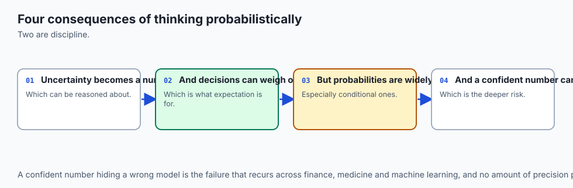
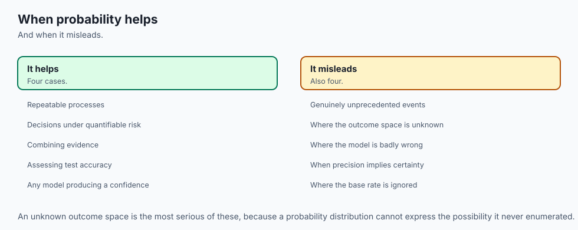

## Why this matters

In the 1650s a French nobleman named Antoine Gombaud, the Chevalier de Méré, was a serious gambler with a mathematician's instinct and no mathematician's training. He believed, with good reason to believe it, that these two bets were equally good:

- betting that at least one 6 appears in **4** rolls of one die
- betting that at least one double-six appears in **24** rolls of two dice

His reasoning was not sloppy. A double six is exactly 1/6 as likely as a single six on any one roll — there are 36 equally likely outcomes for two dice and only one of them is (6, 6), against 6 equally likely outcomes for one die and one of them is a 6. So, he reasoned, roll six times as many times and the disadvantage should cancel out: 4 rolls at 1/6 odds should be exactly as good as 24 rolls at 1/36 odds.

It does not cancel out. Work out both probabilities exactly and you get

```text
P(at least one 6 in 4 rolls)            = 1 - (5/6)^4   = 0.51774691...
P(at least one double-six in 24 rolls)  = 1 - (35/36)^24 = 0.49140388...
```

The first bet is favourable to the player. The second is not. The gap between them is not a rounding error or a matter of taste — it is 2.6 percentage points, applied over enough repetitions at a gaming table that de Méré noticed real money slipping away, and he was sufficiently bothered by it to write to Blaise Pascal about it.

Pascal's correspondence with Pierre de Fermat over this exact problem, in 1654, is usually credited as the beginning of the mathematical theory of probability. A gambler's suspicion about a betting mismatch launched an entire branch of mathematics, and it launched it because the "obvious" scaling argument — six times fewer chances, so six times more rolls should even things out — is wrong, and wrong in a way you can only see by actually doing the arithmetic.

That is the whole shape of this lesson, and it is worth stating as bluntly as possible before anything else: **probability is bookkeeping about sets, and almost every "paradox" in the subject is a bookkeeping error you can find.** You do not need new intuition to get de Méré's problem right. You need to stop trusting the intuition that got him wrong, and replace it with counting.

You are a programmer, which means you already own the tool that resolves this. Enumerate the sample space. If it is small — 6 outcomes, 36 outcomes — write it out and count. If it is too large to enumerate by hand, simulate it: roll the dice a hundred thousand times in a loop and count how often the event happens. Both routes are available to you right now, in four lines of Python, and both of them will settle de Méré's paradox exactly. That is today's entire strategy, applied over and over: **when intuition and arithmetic disagree, enumerate — and when the space is too large to enumerate, simulate.**

By the end of this lesson you will have derived both of de Méré's probabilities by hand with the complement rule, in one line each, and then confirmed both by simulation with `numpy.random.Generator`. That derive-then-simulate pattern — exact arithmetic checked against a measurement that has no opinion about which arithmetic you used — is the backbone of the lab, and it is the backbone of every probability claim you will meet for the rest of this course, up through Day 118's hypothesis tests and the A/B Test Analyzer that closes this week.

## The idea in plain language



Here is probability without any formula at all. You have a bag of possible things that could happen. Some of those things count as "success" for whatever question you are asking; the rest do not. The probability of success is just: how many of the things in the bag are successes, divided by how many things are in the bag — provided every thing in the bag is equally likely to be picked.

Roll two dice. The bag has 36 things in it: every pair (first die, second die) from (1,1) up to (6,6). Ask "what's the probability the two dice sum to 7?" Six of those 36 pairs sum to 7 — (1,6), (2,5), (3,4), (4,3), (5,2), (6,1) — so the probability is 6 out of 36, which reduces to 1 out of 6. That is the entire computation. No formula was needed beyond "count the successes, count the total, divide."

Everything else in this lesson is what happens when you ask more interesting questions of that same bag. What if you want to know the chance of *either* of two things happening? Count both piles, but watch for double-counting anything that belongs to both piles at once — that is the addition rule, and it accounts for most of the arithmetic mistakes people make under time pressure.

What if you already know something happened — the first die was even, say — and want to know how that changes the odds of something else? Throw away every outcome in the bag that does not match what you know, and count inside what is left — that is conditioning, and it is nothing more exotic than filtering a list.

What if the question is "at least one success out of several tries"? Counting successes directly is painful — there are many ways to get at least one — but counting the *one* way to fail every single time is easy, so flip the question and subtract from 1 — that is the complement rule, and it is what collapses de Méré's problem to a single line.

None of this requires you to think in a new way. It requires you to keep thinking the way you already think about sets and lists, and to resist the pull of intuitions that feel right but were never actually counted.

## Historical background



Probability as a mathematical subject begins later than you might expect, given how old gambling is. Games of chance are ancient — dice have been found in archaeological sites thousands of years old — but nobody wrote down a general mathematical theory of chance until the correspondence between Blaise Pascal and Pierre de Fermat in 1654, prompted directly by the Chevalier de Méré's puzzle about the two bets described above. Before that, gamblers operated on folklore and hard-won table experience; the idea that "chance" itself was something you could reason about with exact arithmetic, rather than merely observe, is the genuinely new idea Pascal and Fermat introduced.

Christiaan Huygens wrote the first published treatise on the subject shortly afterward, in 1657, working through problems very much in the spirit of de Méré's. The theory then developed for over a century as an informal but increasingly systematic set of tools for reasoning about games of chance, inheritance problems, and — eventually and consequentially — insurance and annuities, where the same "how likely, and how much does it cost to be wrong" reasoning turned out to be exactly what was needed to price risk.

The rigorous mathematical foundation the subject rests on today is much later: Andrey Kolmogorov's 1933 axiomatization put probability on the same formal footing as the rest of mathematics, defining it in terms of measure theory and stating the handful of axioms — non-negativity, the probability of the whole space is 1, and probabilities of disjoint events add — from which everything else in this lesson can be derived. That axiomatic foundation is more machinery than this lesson needs; what matters for a working programmer is that the three axioms are simple enough to use without ceremony, and this lesson uses them rather than admiring them.

The specific traps this lesson spends real time on — the conflation of independence with mutual exclusivity, the confusion between `P(A|B)` and `P(B|A)`, the gambler's fallacy, base-rate neglect, the conjunction fallacy — are not historical curiosities. They are documented, measured features of human reasoning under uncertainty, most notably in the work of Amos Tversky and Daniel Kahneman from the 1970s onward, who ran controlled experiments showing that trained scientists and statisticians make these exact errors when a problem is phrased to trigger intuition rather than calculation.

That work is why this lesson insists on enumeration and simulation rather than "does this feel right" — the feeling is measurably unreliable, in specific, reproducible, well-documented ways, and it is unreliable in exactly the population of people you might expect to be immune to it.

## What it is — and what it is not



**Probability is:** a number between 0 and 1 (inclusive) assigned to a subset of a sample space — an *event* — obeying three rules: every probability is non-negative; the probability of the entire sample space is exactly 1; and the probability of a union of mutually exclusive events is the sum of their individual probabilities. Everything else in the subject is a consequence of those three facts, applied carefully.

| The belief | What is actually true |
| --- | --- |
| "Probability is about randomness in the physical world" | Probability is a bookkeeping system over a defined sample space. Whether the underlying process is "truly random" (quantum mechanics) or merely unpredictable to you (a shuffled deck, a coin you have not looked at) is irrelevant to the mathematics; the axioms do not care which. |
| "Independent events and mutually exclusive events are more or less the same idea — both mean 'unrelated'" | They are close to opposites. Independent events with non-zero probability *can* happen together and knowing one occurred tells you nothing about the other. Mutually exclusive events with non-zero probability *cannot* happen together, and knowing one occurred tells you the other definitely did not — which makes them dependent, not unrelated. |
| "P(A given B) and P(B given A) are the same thing, or close enough" | They are generally different numbers, sometimes wildly so, and confusing them is one of the most consequential errors in applied statistics. Day 115's Bayes' theorem exists specifically to convert one into the other correctly. |
| "A fair coin that has landed heads five times in a row is 'due' for tails" | The coin has no memory. Each flip is independent of every previous flip, so the probability of tails on the sixth flip is exactly what it was on the first: 0.5. This is the gambler's fallacy, and it is worth its own paragraph later in this lesson. |
| "More specific stories are more probable if they sound more coherent" | A conjunction of two events can never be more probable than either event alone — adding detail to a story can only narrow the set of outcomes it covers, never widen it. The conjunction fallacy is the well-documented human tendency to violate this anyway when the more detailed story feels more vivid. |
| "Simulating something a lot of times gives you the exact answer" | A simulation gives you an *estimate* with a known, quantifiable error that shrinks as `1/sqrt(n)` — a hundred times the samples buys you a tenth of the error, not a hundredth. It converges to the truth but essentially never equals it exactly for a continuous quantity. |

## Why it was created and what problems it solves

Strictly, probability was not invented so much as *discovered* — it is a fact about how counting and proportions behave, and it would be true whether or not anyone had written it down. But the reason the Pascal–Fermat correspondence mattered, and the reason this course is spending a week on it now, is a specific and recurring problem: **how do you reason correctly about a quantity that depends on chance, when your gut is not trustworthy at the job?**

De Méré's problem is the founding example precisely because his gut was *good* — he was an experienced gambler, sophisticated enough to notice the two bets performed differently at the table, and sophisticated enough to suspect something structural rather than bad luck. But his gut reasoning about *why* the two bets differed — the naive "scale the trials to match the odds" argument — was wrong, and no amount of gambling experience would have corrected it without the arithmetic.

That is the general shape of the problem this whole subject exists to solve. Human intuition about chance is unreliable in specific, well-documented, and *predictable* ways: it overweights vivid recent outcomes (the gambler's fallacy), it ignores how rare something was to begin with when a plausible-sounding story is on offer (base-rate neglect), and it finds detailed conjunctions more believable than the broader categories that contain them (the conjunction fallacy).

None of these failures are stupidity. They are systematic biases that show up in trained professionals as readily as in casual gamblers, and the entire point of having exact rules — the addition rule, the complement rule, conditional probability, the law of total probability — is that they do not care how a problem is phrased or how vivid the story is. They give the same answer every time, because they are counting.

The specific engineering problem this week is building toward — an A/B Test Analyzer that decides whether an experiment's result is real or noise — is a direct descendant of exactly this need. A hypothesis test is, underneath its vocabulary, a probability calculation: given that nothing real changed, how likely is a result this extreme to occur just by chance? Every rule in today's lesson is a piece of the machinery that question is built from, and Day 118 assembles the pieces.

## How it works



### The sample space and events

A **sample space**, usually written `Ω` (or `S`), is the set of every possible outcome of some experiment. For one roll of a die, `Ω = {1, 2, 3, 4, 5, 6}`. For two dice rolled together, `Ω` is the set of all 36 ordered pairs `(d1, d2)` with `d1` and `d2` each from 1 to 6.

```python
import itertools
space = tuple(itertools.product(range(1, 7), range(1, 7)))
len(space)   # 36
```

An **event** is simply a subset of the sample space — the set of outcomes for which something you care about is true. "The dice sum to 7" is the event `{(1,6), (2,5), (3,4), (4,3), (5,2), (6,1)}`, a 6-outcome subset of the 36-outcome space. There is nothing more to an event than that: it is a `frozenset`, built by filtering the sample space with a predicate.

```python
def event(space, predicate):
    return frozenset(o for o in space if predicate(o))

sum_seven = event(space, lambda o: o[0] + o[1] == 7)
len(sum_seven)   # 6
```

### The three axioms, used rather than admired

Kolmogorov's three axioms, stated for a finite equally-likely sample space (which is all this lesson needs):

1. **Non-negativity.** `P(A) >= 0` for every event `A`.
2. **Normalization.** `P(Ω) = 1` — something in the sample space is guaranteed to happen.
3. **Additivity.** If `A` and `B` cannot both happen (they are *disjoint*, or *mutually exclusive*), then `P(A or B) = P(A) + P(B)`.

For a finite space where every outcome is equally likely, all three collapse to one operational rule: `P(event) = |event| / |space|`, the count of favourable outcomes over the count of all outcomes. Computed in Python with exact rational arithmetic:

```python
from fractions import Fraction
def probability(event, space):
    return Fraction(len(event), len(space))

probability(sum_seven, space)   # Fraction(1, 6), exactly
```

Using `Fraction` rather than dividing two integers with `/` is not a style preference. `6 / 36` in Python gives `0.16666666666666666`, a float that is *not* exactly one-sixth — and an assertion `probability(sum_seven, space) == 1/6` would compare a `Fraction` against a float that has already lost precision before the comparison even runs. `Fraction(1, 6)` carries no such error, and it is the mechanism this lesson and its lab use throughout to make every exact claim checkable exactly rather than approximately.

### The addition rule, and exactly how the naive sum lies

Suppose you want `P(A or B)` for two events that are *not* disjoint — they overlap. The naive move is to add `P(A) + P(B)`. This overcounts, because any outcome in both `A` and `B` gets counted once in each pile.

Take `A = "the dice sum to 7"` (6 outcomes) and `B = "the first die shows 6"` (6 outcomes: `(6,1)` through `(6,6)`). Their overlap is exactly one outcome — `(6, 1)`, the only way to have a first die of 6 *and* a sum of 7.

```text
P(A) = 6/36 = 1/6          P(B) = 6/36 = 1/6          P(A and B) = 1/36

naive sum:  P(A) + P(B)                   = 12/36 = 1/3    <- WRONG
correct:    P(A) + P(B) - P(A and B)      = 11/36          <- correct
```

The naive sum counts `(6, 1)` twice — once as part of "sum is 7" and once as part of "first die is 6" — and 12/36 overstates the truth by exactly 1/36, which is `P(A and B)` exactly. That is the addition rule:

```text
P(A or B) = P(A) + P(B) - P(A and B)
```

Subtracting the overlap once removes the double-count. When `A` and `B` are disjoint, `P(A and B) = 0` and the rule collapses back to the naive sum — which is why the naive sum is not *always* wrong, only wrong whenever the events overlap, which makes it a genuinely dangerous shortcut: it is correct often enough to build bad habits.

### The complement rule: the working programmer's tool

Many of the most useful probability questions in practice are shaped "what is the probability of *at least one* success across several tries?" — at least one bug in a batch of commits, at least one user converts across an experiment, at least one collision in a hash table. Counting the ways to get "at least one" directly is painful, because there are many ways: exactly one, exactly two, exactly three, and so on, all the way up. But there is exactly *one* way to get *zero* successes: every single try fails. So flip the question:

```text
P(at least one success) = 1 - P(zero successes) = 1 - P(every trial fails)
```

This is the **complement rule**, `P(not A) = 1 - P(A)`, applied to the specific and extremely common shape of "at least one." It is the single line that resolves de Méré's problem:

```text
P(at least one 6 in 4 rolls)  =  1 - P(no 6 in any of 4 rolls)
                               =  1 - (5/6)^4
                               =  1 - 625/1296
                               =  671/1296
                               =  0.5177469135802469...

P(at least one double-six in 24 rolls)  =  1 - P(no double-six in any of 24 rolls)
                                         =  1 - (35/36)^24
                                         =  0.4914038761309032...
```

`(5/6)^4` is the probability that all four rolls independently miss the target of 6 — each roll has a 5/6 chance of missing, and the rolls are independent, so the probabilities of "this roll misses" multiply across all four rolls (that is the *multiplication rule*, covered in the next section). One line each, exact `Fraction` arithmetic, and de Méré's suspicion is confirmed precisely: 0.5177 rounds above one-half, 0.4914 rounds below it. The bets were never equal, and the naive "scale the rolls to match the odds" argument was always going to be wrong, because it implicitly assumed the two probabilities scale linearly with the number of rolls, and they do not — `1 - (1-p)^n` is not linear in `n`.

### Independence versus mutual exclusivity

This is the single most common conflation in the entire subject, and it deserves to be stated as sharply as possible before the table, because the two ideas pull in genuinely opposite directions.

**Two events are independent** when knowing one happened tells you nothing about whether the other happened: `P(A and B) = P(A) x P(B)`. **Two events are mutually exclusive** when they cannot both happen: `P(A and B) = 0`. These sound like they might both mean "unrelated," and they do not.

Take two dice again. `A = "sum is 7"` and `B = "first die is 3"` are independent: whatever value the first die shows, exactly one value of the second die completes the sum to 7, so `P(sum=7 | first die = v) = 1/6` for *every* value `v` the first die could take — conditioning on the first die changes nothing about the chance of summing to 7. Formally: `P(A) = 1/6`, `P(B) = 1/6`, `P(A and B) = P({(3,4)}) = 1/36`, and `1/6 x 1/6 = 1/36` exactly — the product rule holds.

Now take `A = "sum is 2"` and `C = "first die is 1"`. These are *dependent*: `P(A and C) = 1/36` (only `(1,1)`), but `P(A) x P(C) = (1/36) x (1/6) = 1/216`, which is not `1/36`. Sum-of-2 is *only* reachable when the first die is 1, so knowing the first die's value changes everything about whether the sum can be 2.

Now consider `A = "sum is 2"` and `D = "sum is 12"`. These cannot both happen — the dice cannot simultaneously sum to 2 and to 12 — so they are mutually exclusive: `P(A and D) = 0`. And **mutually exclusive events with non-zero probability are necessarily dependent.** Knowing `D` happened tells you `A` definitely did not: `P(A | D) = P(A and D) / P(D) = 0 / (1/36) = 0`, which is not equal to `P(A) = 1/36`. Conditioning on `D` collapsed the probability of `A` all the way to zero — the sharpest possible form of dependence, hiding inside a relationship that sounds like it should mean "unrelated."

| Property | Independent events | Mutually exclusive events |
| --- | --- | --- |
| Can both happen at once? | Yes (that is what independence permits) | Never |
| `P(A and B)` | `P(A) x P(B)`, generally greater than 0 | Exactly 0 |
| Knowing A happened tells you about B | Nothing — `P(B \| A) = P(B)` | Everything — `P(B \| A) = 0` |
| Are they "related"? | No, by definition | Yes — as related as two events can be |

If a pair of events is mutually exclusive and both have non-zero probability, they cannot possibly be independent, and if a pair of events is genuinely independent, they can only be mutually exclusive in the degenerate case where at least one of them has probability 0. These are close to opposite ends of the same spectrum, not synonyms, and treating "the events don't overlap" as evidence of "the events are unrelated" is a mistake that shows up constantly in casual statistical reasoning.

![Diagram: two panels over the 36-outcome sample space of two dice. The left panel shows overlapping events A, sum is 7, and B, first die is 6, with their one-outcome intersection (6,1) labelled as the double-counted region, and the naive sum 1/3 shown wrong against the true union 11/36. The right panel shows mutually exclusive events C, sum is 2, and D, sum is 12, with an empty intersection, and the conditional probability P(C given D) equal to 0 while P(C) is 1/36, proving the two events are dependent despite never co-occurring](./assets/event-algebra-architecture.svg)

### Conditional probability: throwing away rows

**Conditioning** on an event `B` means restricting your attention to the world in which `B` is true, and asking your question again inside that smaller world. Formally:

```text
P(A | B) = P(A and B) / P(B)
```

read "the probability of A, given B." But the formula is worth setting aside for a moment in favour of what it *means* operationally, because that operational meaning is exactly what the lab does: **conditioning is filtering a table down to the rows where the condition holds, and then asking your original question of the smaller table.**

Ask "what is `P(sum = 8 | first die is even)`?" Two routes to the same answer. By the formula: `A and B` (sum is 8, first die even) has 3 outcomes — `(2,6)`, `(4,4)`, `(6,2)` — and `B` (first die even) has 18 outcomes, so `P(A|B) = (3/36) / (18/36) = 3/18 = 1/6`. By restriction: throw away every row of the 36-outcome table where the first die is odd, leaving 18 rows; count how many of *those* rows sum to 8 — three of them — and divide: `3/18 = 1/6`. Same number, because they are the same computation described two ways.

```python
restricted = event(space, lambda o: o[0] % 2 == 0)              # 18 rows
answer     = len(event(restricted, lambda o: sum(o) == 8))      # 3 of those
Fraction(answer, len(restricted))                                # 1/6
```

Thinking of conditioning as *discarding rows and re-normalising* rather than as a formula to memorise is the single most useful reframing in this lesson. It is why the unconditioned probability of `A` and the conditioned probability `P(A|B)` can be wildly different numbers describing the same event: they are questions asked of two different tables.


### The multiplication rule and the chain rule for probability

Turn the conditional-probability definition around and you get the **multiplication rule**: `P(A and B) = P(A) x P(B | A)`. This generalizes to any number of events — the **chain rule for probability**:

```text
P(A and B and C) = P(A) x P(B | A) x P(C | A and B)
```

each factor conditioning on everything decided before it. This is what de Méré's `(5/6)^4` really is, spelled out: `P(miss, then miss, then miss, then miss) = P(miss1) x P(miss2 | miss1) x P(miss3 | miss1, miss2) x P(miss4 | miss1, miss2, miss3)`, and because the four rolls are *independent*, every one of those conditional probabilities collapses to the unconditioned `5/6`, which is exactly what lets the whole expression become the simple power `(5/6)^4`.

**Name the collision honestly, because a reader who has been through Day 110 has every right to be confused by the name:** this is not Day 110's chain rule. They share a name and absolutely nothing else. Day 110's chain rule is a statement about derivatives of composed functions — `dy/dx = dy/du x du/dx`. This chain rule is a statement about conditional probabilities of a sequence of events.

The resemblance in the two rules is that both describe a quantity built by multiplying a chain of *local* pieces, evaluated in the right context — a local derivative evaluated at the right point, or a conditional probability conditioned on the right history — but beyond that structural echo, they are unrelated facts from unrelated fields that happen to have been given the same English name by two different mathematical traditions. If a search engine or a study guide conflates the two, that is the collision this paragraph exists to prevent.

### The law of total probability

Suppose the sample space is cleanly divided into a handful of non-overlapping pieces — a **partition** — and you know the probability of some event `A` *within* each piece separately, plus the probability of landing in each piece to begin with. The **law of total probability** says you can build the overall, unconditioned `P(A)` by weighting each piece's conditional probability by how likely that piece is:

```text
P(A) = sum over i of  P(piece_i) x P(A | piece_i)
```

Two urns: Urn 1 has 3 red and 7 blue balls; Urn 2 has 6 red and 4 blue. A fair coin decides which urn you draw from. What is the overall probability of drawing red?

```text
P(red) = P(urn 1) x P(red | urn 1)  +  P(urn 2) x P(red | urn 2)
       = (1/2)(3/10)  +  (1/2)(6/10)
       = 3/20 + 3/10
       = 9/20
       = 0.45
```

Checked a completely different way: since both urns hold 10 balls and the coin is fair, treat the combined situation as 20 equally likely `(urn, ball)` pairs. Nine of those twenty pairs are red (3 from urn 1, 6 from urn 2), giving `9/20` directly by enumeration — the same answer from a route that never mentions weighting or conditional probabilities at all, which is exactly the kind of independent check this lesson keeps insisting on.

**Set this rule up carefully, because Day 115's Bayes' theorem is this rule read backwards.** The law of total probability answers "given which urn I'm drawing from, what's the overall chance of red?" Bayes' theorem answers the reverse question: "given that I drew red, what's the chance it came from urn 2?" The denominator of Bayes' theorem, when you get there, *is* the law of total probability computed for the event that was actually observed — so the arithmetic you just did for the urns is not a warm-up exercise you will discard. It is the exact quantity Day 115 needs, arrived at two days early.

### Simulation as a check, with its error understood

Every exact calculation above can also be *estimated* by simulation: generate a large number of random trials and count how often the event of interest occurs. This matters for two reasons. First, it is a genuine independent check on hand arithmetic — a simulation that knows nothing about the formula you used will either agree with you or expose a mistake. Second, and more importantly for later in the course, most of the probability questions you will eventually care about (Day 114 onward) do not have a clean closed-form answer, and simulation is the tool that still works when the formula does not exist or is too painful to derive.

```python
import numpy as np
rng = np.random.default_rng(seed=42)
rolls = rng.integers(1, 7, size=(100_000, 4))          # 100,000 trials of 4 rolls
at_least_one_six = (rolls == 6).any(axis=1)
estimate = at_least_one_six.mean()                       # close to 0.5177
```

**Say this plainly, because it is easy to overtrust a simulation just because it produced a lot of digits: a Monte Carlo estimate converges to the true probability, but its error shrinks only as `1/sqrt(n)`.** Multiply your sample count by 100 and your typical error shrinks by a factor of 10, not by a factor of 100.

This lesson's lab measures the effect directly across four sample sizes four decades apart and finds the error falling by roughly 23.5x from n=100 to n=100,000 — close to the `sqrt(1000) ≈ 31.6x` a `1/sqrt(n)` law predicts, and nowhere near the `1000x` a naive `1/n` law would predict. Day 117's central limit theorem is the reason `1/sqrt(n)` is the right exponent; today's lab only measures that it is true, and shows the measurement rather than assuming it.

The practical consequence: a simulation with a hundred trials that "confirms" a hunch is not meaningfully confirming anything — its own error bar is likely larger than the effect you are trying to detect. The standard error of a proportion estimated from `n` trials is `sqrt(p(1-p)/n)`, and that formula, not a round number chosen because it looked reasonable, is what determines how many trials a claim actually needs before you should trust it.

### The traps

**The gambler's fallacy.** A fair coin has landed heads five times running. Many people feel — strongly — that tails is "due." It is not. Each flip is independent of every flip before it; the coin has no memory, and the probability of tails on the sixth flip is exactly 0.5, precisely as it was on the first flip and every flip in between. The five-heads streak is a real, correctly-observed fact about the past, and it has *zero* bearing on the probability of the next flip, because independence is not a suggestion — it is a mathematical statement that `P(heads on flip 6 | heads on flips 1-5) = P(heads on flip 6)` exactly.

**Confusing `P(A|B)` with `P(B|A)`.** These are, in general, different numbers, and the direction matters enormously. "The probability a positive test result means you have the disease" and "the probability a person who has the disease tests positive" sound similar and are usually wildly different, especially when the disease is rare — a fact base-rate neglect (below) makes vivid. Day 115's Bayes' theorem exists specifically to convert one of these conditional probabilities into the other, correctly, and this lesson deliberately does not spend that machinery early; it only flags that the two directions are not interchangeable, so the distinction is on the table before the formula that resolves it arrives.

**Base-rate neglect.** A test for a rare disease is 99% accurate. You test positive. What is the probability you actually have the disease? Most people's gut answer clusters somewhere near 99%. If the disease affects, say, 1 in 10,000 people, the honest answer — computable with the law of total probability and Bayes' theorem — is usually far lower, sometimes under 1%, because the number of healthy people who test positive by the test's 1% false-positive rate can dwarf the tiny number of actually-sick people the test correctly flags.

The error is *ignoring the base rate* — how rare the condition was before the test — in favour of fixating on the test's stated accuracy alone. This is not a hypothetical: it is a documented, repeated failure mode in how doctors, and everyone else, reason about diagnostic tests, and it is precisely the computation Day 115 equips you to do correctly.

**The conjunction fallacy.** Adding detail to a description can make it feel more probable even though, mathematically, it can only ever make the event less probable or exactly as probable, never more. If `B` is a special case of `A` (every outcome satisfying `B` also satisfies `A`), then `P(B) <= P(A)` always — a more specific event is a smaller subset of the sample space, never a larger one.

A famous demonstration asks people to rank the likelihood of "Linda is a bank teller" against "Linda is a bank teller who is active in the feminist movement," after describing Linda in feminist-coded terms; many people rank the more specific, more vivid conjunction as *more* probable than the general category it is a subset of, even though the conjunction can never exceed the probability of either of its parts alone.

The lesson here is not about that specific example — it is that vividness and vividness alone can override a rule as basic as "a subset cannot be larger than the set that contains it," and the defence against it is the same defence this whole lesson keeps returning to: count the sets, do not trust the story.

## An everyday analogy



Think of the sample space as a big spreadsheet: one row per possible outcome, every row equally likely to be "the" row that actually happened. An event is a filter on that spreadsheet — a `WHERE` clause that keeps some rows and discards the rest. A probability is just `(rows kept) / (total rows)`.

**The addition rule is checking two filters and worrying about double-counted rows.** If you filter for "sum is 7" and separately filter for "first die is 6" and then just add the row counts, any row that passed *both* filters gets counted twice in your total — you have to subtract it back out once.

**The complement rule is answering the easier opposite question.** "At least one 6 in four rolls" is an awkward filter to write directly — there are many ways to satisfy it. "No 6 in any of the four rolls" is one clean filter, easy to count, and once you have that count, subtracting from the total row count answers the original question for free.

**Conditioning is deleting rows and re-running your count on what's left.** `WHERE first_die_even = true` throws out half the spreadsheet; every subsequent question you ask — "what fraction of the *remaining* rows sum to 8?" — is answered inside that smaller table, and the answer can look completely different from the same question asked of the full table, because it is a different table.

**Independence is a filter that doesn't change the proportions.** Apply `WHERE first_die = 3` to the spreadsheet, and if the proportion of rows summing to 7 is exactly the same in the filtered subset as it was in the whole sheet, the two filters are independent — knowing one filter passed told you nothing about the other. Mutual exclusivity is the opposite extreme: applying one filter empties the subset that the other filter would otherwise have kept, which is about as far from "no information" as two filters can get.

**Simulation is running the spreadsheet a hundred thousand times with random data and counting instead of enumerating.** When the real spreadsheet would have more rows than you could ever write down — every possible sequence of card shuffles, every possible outcome of a hundred coin flips — you generate a large, honest sample of rows instead of every row, and you count within the sample. The count you get is not exact, the same way a poll of ten thousand voters is not the same as counting every vote, but it converges toward the truth as the sample grows, at a `1/sqrt(n)` rate that this lesson's lab measures directly.

Where the analogy strains: a real spreadsheet's row count is fixed and known. A probability sample space can be conceptually infinite (every possible infinite sequence of coin flips), and the "spreadsheet" is then a mathematical abstraction rather than something you could ever literally build — which is exactly why simulation, sampling a finite number of rows from an effectively infinite table, becomes essential rather than optional once the course moves past today's finite dice-and-cards examples.

## Examples in practice



### De Méré's paradox, worked completely

This is the day's central worked example, and it is worth walking through start to finish exactly as the lab does it, because every technique above appears in it.

**Bet 1: at least one 6 in 4 rolls of one die.**

```text
P(no 6 on one roll)        = 5/6
P(no 6 on all 4 rolls)     = (5/6)^4 = 625/1296            <- independence: multiply
P(at least one 6)          = 1 - 625/1296 = 671/1296       <- complement rule
                            = 0.5177469135802469...
```

**Bet 2: at least one double-six in 24 rolls of two dice.**

```text
P(no double-six on one roll)     = 35/36
P(no double-six on all 24 rolls) = (35/36)^24
P(at least one double-six)       = 1 - (35/36)^24
                                  = 0.4914038761309032...
```

**Comparing the two:** `0.5177...` is above one-half; `0.4914...` is below it. Bet 1 favours the player; bet 2 favours the house. Simulated in the lab at 200,000 trials per bet with `numpy.random.default_rng(42)`, the measured estimates land at 0.515865 and 0.492350 respectively — both within three standard errors (about 0.00335 at this sample size) of the exact values, confirming the exact arithmetic independently. Neither the exact calculation nor the simulation was tuned to agree with the other; they were computed by genuinely different methods and they agree because the mathematics is correct, which is the entire point of doing both.

### A genuinely independent pair and a genuinely dependent pair

Using the two-dice sample space, `A = "sum is 7"` and `B = "first die is 3"`: `P(A) = 1/6`, `P(B) = 1/6`, `P(A and B) = 1/36`, and `(1/6)(1/6) = 1/36` exactly — independent, verified by exact fraction equality, not by approximation. This holds for every value the first die could take, not just 3, because summing to 7 is always exactly one second-die value away regardless of what the first die shows.

`A = "sum is 2"` and `C = "first die is 1"`: `P(A) = 1/36`, `P(C) = 1/6`, `P(A and C) = 1/36` (the only way to sum to 2 is `(1,1)`, which does have first die 1), but `(1/36)(1/6) = 1/216`, which is not `1/36` — dependent, and measurably so: the product-rule check fails by a factor of six.

### The urn problem, checked two ways

Already worked above under the law of total probability: the weighted-sum method gives `9/20`, and enumerating the combined 20-outcome experiment directly also gives `9/20`. Both routes are implemented independently in the lab and asserted equal with exact `Fraction` arithmetic — no rounding, no approximation, the same rational number arrived at by two different pieces of code that share no logic.

## Implications: security, privacy, performance, scalability, and cost



**Performance and cost.** Exact enumeration over a finite sample space costs `O(|space|)` — trivial for the 36-outcome dice examples in this lesson, and still entirely tractable for spaces with millions of outcomes on ordinary hardware.

Simulation trades exactness for tractability on spaces too large or too continuous to enumerate, and its cost is dominated by the number of trials `n` you choose to run, which you choose based on the error tolerance you actually need — `sqrt(p(1-p)/n)` tells you exactly how many trials buy you how much precision, so "how many simulations should I run" is a computable answer, not a guess. Running ten million trials to answer a question that needed ten thousand is real, avoidable compute cost, especially once a simulation is embedded inside a larger pipeline that runs on every request.

**Scalability.** Exact combinatorial enumeration does not scale past a certain sample-space size — the number of possible poker hands, the number of ways to shuffle a deck, the number of paths through a large decision tree can all explode combinatorially well past what any computer can enumerate directly. Simulation is the technique that keeps working when enumeration stops being feasible, at the cost of an error bar instead of an exact answer, which is precisely why this lesson insists on *deriving* the error bar rather than trusting the simulation blindly.

**Security.** Probability reasoning underlies password-strength estimation, cryptographic key-space sizing, and the analysis of brute-force attack feasibility — all of them, at bottom, "how many outcomes are in the space, and what fraction of them count as a successful guess" calculations of exactly the shape this lesson teaches. A security analysis that gets the addition rule wrong when combining the probabilities of several independent attack vectors, or that treats correlated failure modes as independent when they are not, will systematically misjudge real risk — and getting independence wrong is, as this lesson has stressed, one of the easiest mistakes to make without noticing.

**Privacy.** Differential privacy — a major modern framework for releasing statistics about a dataset without revealing information about any individual in it — is built directly on probability theory: the guarantees it offers are stated as bounds on probability ratios (how much more or less likely a particular output is, depending on whether any one individual's data was included). None of that machinery is comprehensible without a solid grip on exactly the vocabulary this lesson introduces — events, conditional probability, and what it means for one distribution of outcomes to be "close to" another.

**The specific cost of getting probability wrong.** Unlike a crashed program, a probability miscalculation usually produces a number that looks completely plausible — it is between 0 and 1, it has a sensible number of decimal places, and nothing about it announces itself as wrong. De Méré's own naive reasoning produced a perfectly sensible-looking conclusion; only checking it against real outcomes at the table (or, as this lesson does, against exact arithmetic) revealed the error. This is the same shape of danger the rest of this course keeps returning to in other contexts: a wrong answer that does not crash is far more dangerous than one that does, because nothing forces you to notice it.

## Alternatives: free, open source, and commercial

There is no single "probability library" the way there might be a single web framework — probability is closer to arithmetic than to a piece of software, and the right tool depends on whether you need exact rational answers, fast simulation, or symbolic/analytical distribution machinery.

**`fractions.Fraction`** — Python standard library, free, and the tool this lesson leans on hardest. Choose it whenever the true answer is rational and you want to compare it exactly rather than approximately — every exact probability in this lesson and its lab is a `Fraction`. Called as `Fraction(numerator, denominator)`, it supports the full range of arithmetic operators and reduces automatically to lowest terms. Its limitation is exactly its strength: it has no notion of continuous distributions, no built-in random sampling, and no statistical machinery beyond exact rational arithmetic — for anything beyond counting, you reach for something else.

**`itertools`** — Python standard library, free, and the tool for building sample spaces by exact enumeration. `itertools.product(range(1, 7), repeat=2)` builds the 36-outcome two-dice space in one call; `itertools.combinations` and `itertools.permutations` build the sample spaces for card-drawing and ordering problems the same way. Choose it whenever the sample space is small enough to enumerate directly (roughly: up to a few million outcomes on ordinary hardware) and you want an exact answer rather than a simulated one.

Its limitation is combinatorial explosion — the number of poker hands, the number of ways to shuffle a full deck, the number of paths through even a moderately deep decision tree can outgrow what any machine can enumerate, at which point simulation becomes the only tractable route.

**`random`** — Python standard library, free, and entirely adequate for the simulations in this lesson's lab. Choose it for quick scripts, for anything where cryptographic-grade randomness is irrelevant, and where you do not need NumPy's vectorised speed. **It is explicitly not suitable for anything security-related** — password generation, token creation, cryptographic keys — because its underlying generator (the Mersenne Twister) is fully predictable once enough of its output has been observed; the standard library's own documentation directs security-sensitive code to `secrets` instead. Called as `random.randint(1, 6)` for a single die, or `random.Random(seed)` to build an independent, seedable generator instance.

**`numpy.random.Generator`** — free and open source (BSD 3-Clause), and the modern, recommended API for numerical simulation, used throughout this lesson's lab. Built with `numpy.random.default_rng(seed)`, which returns an independent generator *object* rather than mutating shared global state. **This is why `default_rng` is preferred over the legacy `numpy.random.seed(n)` global-state function**: `numpy.random.seed()` mutates one process-wide generator that every subsequent call to `numpy.random.*` draws from, so importing a library that happens to call `seed()`, or running two pieces of code in a different order, can silently change results that "should" have been reproducible.

A `Generator` object built by `default_rng(seed)` is isolated — two `Generator`s built from the same seed produce byte-identical sequences no matter what else the program does, and two different `Generator` instances never interfere with each other. `rng.integers(1, 7, size=(100_000, 4))` draws a hundred thousand independent sets of four die rolls in one vectorised call, which is dramatically faster than the equivalent Python loop with `random.randint`. Choose it for anything that needs many samples quickly, or that needs to be reproducible under test.

**`scipy.stats`** — free and open source (BSD 3-Clause), with commercial support available through various vendors for organisations running SciPy in production. **Not installed in this environment, and no output from it is reproduced anywhere in this lesson or its lab; everything said about it here is drawn from its public documentation rather than from a run.** According to that documentation, `scipy.stats` provides dozens of named probability distributions (binomial, normal, Poisson, and many more) each with methods for the probability mass or density function, the cumulative distribution, random sampling, and fitting parameters to data — machinery this course starts using in earnest on Day 114, once random variables and named distributions are on the table.

Choose it, once it is available to you, whenever a problem matches a standard named distribution rather than the raw enumeration-and-simulation approach this lesson teaches from first principles; the two approaches agree by construction; `scipy.stats.binom` computing the probability of "at least one success in n independent trials" is the exact complement-rule calculation this lesson just did by hand, wrapped in a library call.

The honest summary: for the exact, finite, enumerable problems this lesson covers, `fractions.Fraction` and `itertools` are free, exact, and sufficient — there is no meaningfully better tool. For simulation, `numpy.random.Generator` is the right default for anything beyond a toy script, and `random` from the standard library is fine for the toy script. `scipy.stats` becomes relevant precisely when the problem stops being "count a finite set" and becomes "work with a named probability distribution," which is where Day 114 picks up.

## Comparison with related concepts

**Probability and statistics.** Probability starts from a known model of chance (a fair die, a stated rate) and asks what outcomes it produces. Statistics runs the inference in the other direction: given observed outcomes, what can you say about the underlying process that produced them? Everything this week builds toward — Day 116's descriptive statistics, Day 117's sampling theory, Day 118's hypothesis tests — is the statistical direction, and none of it is possible without today's probability machinery underneath it.

**The addition rule and independence.** These answer different questions and are easy to blur under time pressure. The addition rule is about the probability of *either* of two events occurring — `P(A or B)` — and needs to know their overlap. Independence is about whether the probability of *both* occurring together factors cleanly — `P(A and B) = P(A) x P(B)` — and says nothing directly about their union. A pair of events can be independent and have any addition-rule computation; the two concepts are orthogonal, not opposed.

**Independence and mutual exclusivity.** Already covered at length above, and worth restating here for the comparison table this lesson keeps promising: these sit near opposite ends of the same axis rather than being synonyms for "unrelated," and mutually exclusive events with non-zero probability are provably dependent.

**The complement rule and the addition rule.** The complement rule, `P(not A) = 1 - P(A)`, is a special case that falls straight out of the axioms: `A` and `not A` partition the whole sample space and are mutually exclusive, so `P(A) + P(not A) = P(Ω) = 1` by axioms 2 and 3 directly. It is not a separate, independently-justified rule; it is the addition rule applied to an event and its own complement.

**This day's chain rule and Day 110's chain rule.** Already flagged in "How it works," and worth one more explicit sentence here because the comparison-with-related-concepts section is exactly where a reader would go looking for it: they share a name, both describe a quantity built by multiplying a sequence of *local* pieces each evaluated in the correct context, and beyond that structural echo they are entirely unrelated results from entirely unrelated fields.

**The law of total probability and Bayes' theorem.** The law of total probability builds an unconditioned probability by summing conditional probabilities weighted by how likely each condition is. Bayes' theorem (Day 115) runs that computation in reverse, and its denominator is literally the law of total probability applied to the event that was observed. Today's urn computation is not a separate skill from Day 115's — it is half of it, arrived at two days early.

## When to use it — and when not to



**Enumerate exactly** when the sample space is small enough to build directly — a handful of dice, a small deck, a short sequence of independent trials — and you need an exact answer rather than an estimate. `itertools` and `fractions.Fraction` are the right tools, and there is no reason to reach for simulation when exact enumeration is available and fast.

**Use the complement rule** the moment a question is shaped "at least one" or "none" — it is almost always the easier direction to compute, because "none" typically has exactly one clean way to happen (every trial fails) where "at least one" has many.

**Check independence before assuming it.** It is tempting to assume two events are independent because they "sound unrelated," and this lesson has shown a specific, worked example (sum-is-2 and first-die-is-1) where two events that might sound plausible as independent are provably not. Verify with the product-rule equality rather than trusting intuition, especially in any calculation — security risk, reliability estimate, combined-effect model — where treating dependent events as independent will systematically understate the true probability of joint failure.

**Condition by restriction** whenever "given that..." appears in a question. Filter the sample space down to the condition, then answer the original question inside the smaller space; this both computes the right number and builds the correct mental model for Bayes' theorem two days from now.

**Simulate** when the exact sample space is too large to enumerate, too continuous to define discretely, or when the process you are modelling does not have a clean closed-form probability at all — which describes most real-world processes past today's dice-and-urns examples. Always report the simulation's error alongside its estimate, derived from `sqrt(p(1-p)/n)` rather than assumed away.

**Do not trust a single small simulation.** A hundred trials carries a large standard error relative to most effect sizes you would care about; this lesson's lab shows the error at `n=100` running roughly 24 times larger than at `n=100,000`. If a decision matters, either compute the exact answer if the space allows it, or run enough trials that the derived tolerance is comfortably smaller than the effect you are trying to detect.

**Do not treat mutual exclusivity as evidence of independence, or vice versa.** They are close to opposite properties, and this lesson has given a worked example of each so the difference is not abstract.

**Do not answer "given that..." questions with the unconditioned probability.** This is the single most common practical mistake this lesson addresses, and it is exactly the mistake base-rate neglect describes: a test's raw accuracy is not the same question as "given a positive result, what's the actual probability of the condition," and conflating the two — ignoring how the sample space was restricted — produces confidently wrong answers that look completely reasonable.

## The AI connection

- **Every model output is a probability**, so the rules governing them are not optional
  background.
- **Conditional probability is the entire basis of prediction** — what is likely, given what
  we observed.
- **Independence is the assumption most often made and most often false**, and knowing when
  it fails is what prevents overconfidence.
- **Language models are conditional probability distributions**, applied one token at a time.
- **Probabilities that do not sum to one signal a bug**, which is a cheap and reliable check.

## Knowledge check

Eight questions accompany this lesson, covering de Méré's paradox and why the naive scaling argument fails, the addition rule's double-counting error and its exact size, the complement rule as the tool for "at least one" questions, the distinction between independence and mutual exclusivity (with the proof that mutually exclusive events are necessarily dependent), conditioning as restriction, the law of total probability as the mirror of Day 115's Bayes' theorem, why Monte Carlo error shrinks as `1/sqrt(n)` rather than `1/n`, and the honest naming collision between this day's chain rule and Day 110's.

Two are worth attempting before reading anything else: the one asking why de Méré's two bets are not actually equal despite the tempting six-times scaling argument, and the one asking what proves that mutually exclusive events are dependent. Those are the two facts everything else today rests on.

## Hands-on exercise

The lab is **"Probability You Can Count,"** and its design principle is the one this whole lesson has been repeating: **compute everything two ways and assert they agree** — exact enumeration against a formula, or exact arithmetic against a simulation.

```bash
cd labs/sections/math-statistics-and-data/day-113-probability-events-rules-and-intuition
python3 -m venv .venv
.venv/bin/pip install -r requirements/requirements.txt
```

Nine exercises, in order: the sample space and probability as counting; the addition rule and exactly how the naive sum lies; de Méré's two bets, exact and simulated; independence versus dependence; mutual exclusivity implies dependence; conditioning by restriction; the law of total probability over two urns; Monte Carlo error scaling across four decades of sample size; and reproducibility with `numpy.random.default_rng`.

Check yourself as you go:

```bash
.venv/bin/pytest starter -q
```

Unattempted work is reported as skipped, never as failed. Wrong work fails with your answer printed beside the correct one.

### Expected output

An untouched checkout:

```text
3 passed, 43 skipped
```

A finished one:

```text
46 passed
```

The full harness ends with:

```text
57 checks, 0 failure(s).
```

and exits 0. Along the way, de Méré's two bets, exact and simulated:

```text
  bet 1 (one die,  4 rolls):  0.517747  -- above 0.5, favours the player
  bet 2 (two dice, 24 rolls): 0.491404  -- below 0.5, favours the house
```

and the addition rule's exact error:

```text
  naive P(A) + P(B)              = 1/3  = 0.333333   WRONG
  true  P(A) + P(B) - P(A and B) = 11/36  = 0.305556   correct
```

### Validate your work

1. `bash tests/run_tests.sh; echo "exit=$?"` prints `57 checks, 0 failure(s).` and `exit=0`.
2. `.venv/bin/pytest examples -q -p no:cacheprovider` prints `93 passed`.
3. `.venv/bin/pytest starter -q -p no:cacheprovider` prints `46 passed` when you are finished.
4. Each of the nine reference scripts ends with `every assertion held.`
5. Your `probability()` function returns a `Fraction`, never a `float` — an assertion comparing it against `Fraction(1, 6)` must pass exactly, not approximately.

### Troubleshooting

`ModuleNotFoundError` on `probability` or `simulate` means you ran a reference script from the lab directory rather than from inside `examples/`; they import their neighbours from beside themselves.

Tests that keep skipping after you have written code usually mean a leftover `raise NotImplementedError` survived below your implementation.

A test comparing your `probability()` result against a `Fraction` fails even though the decimal "looks right" — you almost certainly returned a `float`. `Fraction(1, 6) == 0.16666666666666666` is `False`, because the float cannot represent one-sixth exactly, and that inexactness is precisely what `Fraction` exists to avoid.

A simulated de Méré probability lands outside the stated tolerance on one run — check the tolerance itself before assuming a bug. It is derived from `sqrt(p(1-p)/n)`, and about 0.3% of honest runs will, by construction, land outside a three-standard-error band; re-run with a different seed before concluding the code is wrong.

`troubleshooting.md` covers all of these in full, along with why the harness clears bytecode caches at the start of its run.

### Common mistakes

- **Adding P(A) + P(B) without checking for overlap.** Correct only when the events are disjoint; wrong by exactly `P(A and B)` otherwise, and the lab's addition-rule exercise is built to catch this specific error.
- **Applying the complement rule to the wrong probability.** `at_least_one` needs the failure probability raised to the trial count, not the success probability — swap them and the result lands outside `[0, 1]` or silently produces a plausible-looking wrong number.
- **Assuming mutual exclusivity implies independence, or the reverse.** The lab's exercise 5 is built specifically to make this conflation visible: a mutually exclusive pair collapses `P(A | B)` to exactly 0, while the independent pair from exercise 4 leaves it completely unchanged.
- **Conditioning on the wrong set as the denominator.** `P(A | B)` divides by `P(B)`, and the restriction method divides the filtered count by the size of the *restricted* space, not the full sample space — mixing the two up gives an answer that is off by a clean, easy-to-miss factor.
- **Trusting a single small simulation.** A hundred trials carries substantial noise; the lab's Monte Carlo exercise averages over twenty seeds specifically so the assertion is about the shape of the error trend, never a single sampled value that could go the "wrong" way by chance.
- **Calling `numpy.random.seed()` instead of building a `Generator`.** The legacy global-state function makes "the same seed gives the same result" depend on what else the program did first; `default_rng(seed)` does not have that problem, and the lab's reproducibility exercise is built to catch the difference.

## Practice assignment

Extend today's tools to a problem this lesson did not work through.

1. **The birthday problem.** With 23 people in a room, compute the probability that at least two share a birthday, using the complement rule exactly as de Méré's problem was resolved — 1 minus the probability that all 23 birthdays are distinct. Use `Fraction` for the exact answer where feasible, and confirm by simulation. The result is over 50%, and most people guess far lower; write one paragraph on why, in terms of how many *pairs* of people are actually being compared.
2. **A biased coin's version of de Méré.** Suppose a coin comes up heads with probability 0.55 rather than 0.5. Find a pair of bets analogous to de Méré's two — "at least one heads in `n1` flips" versus "at least one of some rarer compound event in `n2` flips" — that a naive scaling argument would call equal and that the complement rule shows are not. State the exact probabilities and the size of the gap.
3. **Re-derive the addition rule for three events.** `P(A or B or C)` is not simply `P(A) + P(B) + P(C) - P(A and B) - P(A and C) - P(B and C)` naively guessed — work out by careful counting (drawing three overlapping circles and counting each region once helps) what the correct inclusion-exclusion formula is, verify it against enumeration on a concrete three-event example over the two-dice space, and explain why the pattern that emerges generalizes to any number of events.
4. **Build a gradebook of independence checks.** Pick ten pairs of events over the two-dice sample space (some you expect to be independent, some you expect to be dependent) and check every one with the exact product-rule equality. Report how many of your intuitions were right, and write one paragraph on the pair that surprised you most.
5. **Write the gambler's-fallacy simulation yourself.** Simulate ten thousand sequences of twenty fair-coin flips, and for every flip immediately following a run of four or more heads, record whether the next flip was heads. Confirm the proportion is statistically indistinguishable from 0.5, and explain in one paragraph why a real gambler at a real table finds this so hard to believe even after being told.

## Extension challenge

Three, in increasing order of difficulty.

**Build the Monty Hall simulator from today's primitives.** Using only `random` or `numpy.random.default_rng`, simulate the classic three-door problem 100,000 times each for the "always stay" and "always switch" strategies. Confirm the well-known 1/3-versus-2/3 split with a standard-error tolerance in the same style as this lab's de Méré check. Then derive the exact 1/3 and 2/3 probabilities by hand with careful conditioning — the derivation is a direct application of today's restriction-based conditional probability, and most people who "believe" the simulation result still cannot immediately explain why it is true until they work through the conditioning by hand.

**Measure base-rate neglect with real numbers.** Construct a concrete diagnostic-test scenario: a disease with a stated prevalence, a test with a stated true-positive rate and false-positive rate. Compute, by enumeration over a large simulated population (not by the Bayes' theorem formula, which is Day 115's tool, not today's), the actual probability that a person who tests positive has the disease. Compare it to the test's stated accuracy, and write up the gap in a way a non-technical reader could follow — this is the base-rate neglect trap made concrete and measured rather than asserted.

**Prove, by construction, that the conjunction fallacy is a strict inequality.** Pick any two events `A` and `B` over the two-dice sample space where `B` implies `A` (every outcome satisfying `B` also satisfies `A`) — for example, `A = "rolls a 6 on the first die"` and `B = "rolls a 6 on the first die, and the sum exceeds 8."` Enumerate both events exactly and confirm `P(B) <= P(A)` always holds, then construct a case where the inequality is strict versus a degenerate case where `P(B) = P(A)` exactly, and explain in your own words what has to be true about the sample space for that degenerate equality to occur.

---

**The AI thread.** Every time a language model outputs a number that looks like `0.87` next to a claim — a confidence score, a classification probability, a "how sure are you" — that number is a probability claim, and most of them are badly calibrated: a model that says 0.9 is right rather less than 90% of the time, in ways that have been measured and published repeatedly. The rules you learned today are exactly the rules that make such a claim checkable rather than merely trusted.

A calibration check *is* a probability computation of the shape this lesson just taught — bucket the model's stated confidences, and for each bucket ask "of the times the model said 0.9, how often was it actually right?" — which is a direct application of conditioning: restrict to the rows where the stated confidence falls in a bucket, and count the fraction that were correct inside that restricted set. If that measured fraction does not match the stated confidence, the model's probabilities are wrong in a specific, quantifiable, and fixable way, and you now have the tools to say exactly how wrong.

Two consequences worth carrying forward. The first is that "the model is 90% confident" is a testable claim, not a rhetorical flourish, and testing it uses nothing more exotic than the counting this lesson built from scratch.

The second is that every trap covered today — treating dependent evidence as independent, conflating `P(model says X | true label is Y)` with `P(true label is Y | model says X)`, trusting a small evaluation sample's apparent accuracy without its error bar — shows up routinely in how people evaluate and deploy machine learning systems, often with real consequences. Calibration is where you will meet these rules again, and Day 115's Bayes' theorem is exactly the tool that resolves the direction-of-conditioning confusion this lesson has only flagged so far.