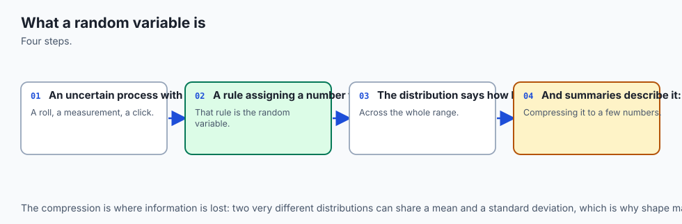
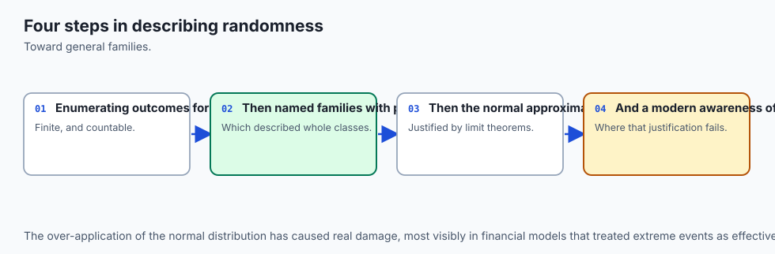
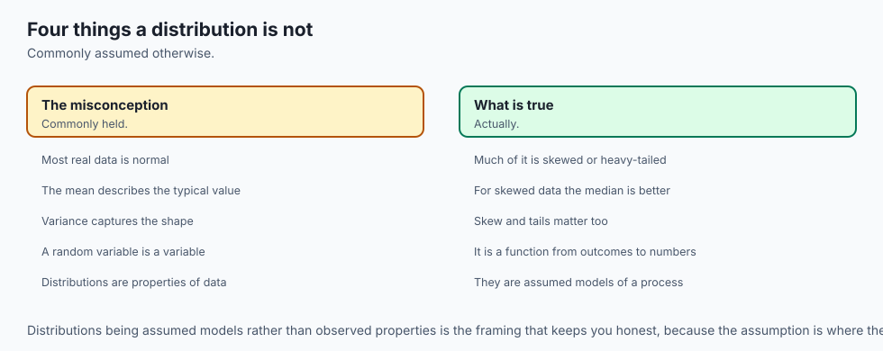
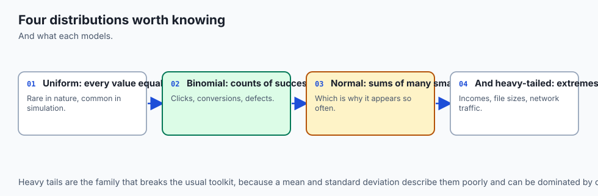
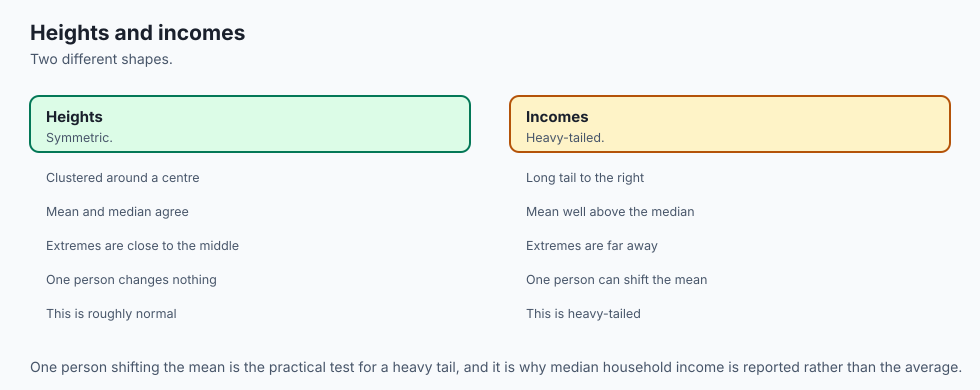
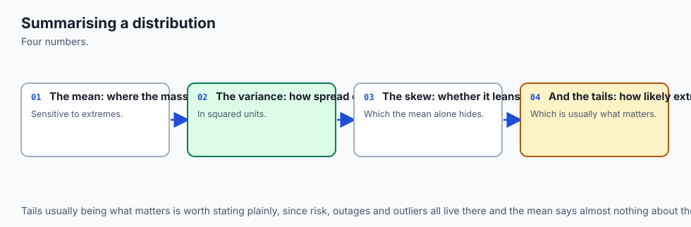
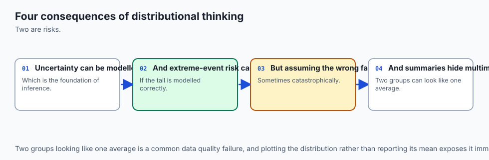
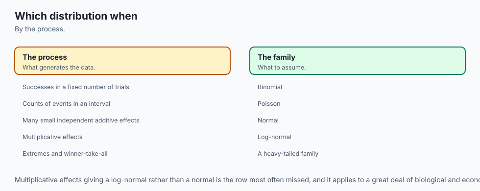

## Why this matters

Guess, before reading any further, how the sum of two fair dice is spread across 2 through 12. Most people's first instinct is that it is roughly even-handed — eleven possible sums, so roughly one-eleventh of the time each, give or take.

Enumerate all 36 equally likely outcomes of two dice and count. Exactly one pair, (1, 1), sums to 2. Exactly six pairs — (1,6), (2,5), (3,4), (4,3), (5,2), (6,1) — sum to 7. That is not a small skew. **A sum of 7 is exactly six times as likely as a sum of 2 or 12**, by counting, not by approximation. The whole shape is right there in a table:

```text
sum       2    3    4    5    6    7    6    8    9   10   11   12
count     1    2    3    4    5    6    5    4    3    2    1
P(sum)  1/36 1/18 1/12  1/9 5/36 1/6 5/36 1/9 1/12 1/18 1/36
```

That table is the whole misconception, laid bare in one place. The reader can see the error and see the correction in the same glance, and it is a stronger teacher than any definition: **a random variable's distribution has a shape**, and the shape is not automatically the shape of your intuition.

Here is the shift that makes this table possible at all. Day 113 worked entirely with *events* — sets of outcomes, like "the sum is 7." An event is either true or false for a given outcome; you cannot average an event, take its variance, or feed it into a loss function. What you just did in that table is different: you assigned a **number** to every outcome (the sum of the two faces) and then asked how that number is distributed. The function that does the assigning — outcome in, number out — is called a **random variable**, and it is the single most consequential idea in this lesson. It is the hinge between "here is a set of things that can happen" and "here is a quantity I can compute expectations, variances, and gradients over."

That hinge is not abstract machinery you will admire once and set aside. It is running, right now, inside every language model you have used. A model's output layer produces a score for every token in its vocabulary, and a softmax function turns those scores into a **probability mass function** — a number for every possible next token, non-negative, summing to exactly 1. Generating a token means *sampling* from that pmf, using exactly the inverse-CDF method this lesson builds from scratch.

Sampling *temperature* reshapes that same pmf, flattening it or sharpening it before a token is drawn. And the loss function used to train the model, cross-entropy, is itself an **expectation** taken against that pmf. By the end of today you will have built, with your own hands and no library doing the work for you, the exact machinery that describes what a language model emits at every single word it writes.

## The idea in plain language



Think of a random variable as a label-maker bolted onto a sample space. Every time an outcome happens, the label-maker prints a number, following a completely fixed rule — the same outcome always gets the same number. The randomness lives entirely in *which outcome occurs*; the label-maker itself never changes its mind.

For two dice, the label-maker's rule might be "print the sum of the two faces." Outcome (1, 6) always prints 7. Outcome (6, 6) always prints 12. There is nothing random about the printing — hand it the same outcome twice and it prints the same number twice. The randomness you experience when you roll the dice is randomness in *which outcome you land on*; the number that comes out the other end is a completely deterministic consequence of that outcome.

Once you have a machine that turns outcomes into numbers, a whole toolbox of arithmetic opens up that was simply unavailable when you only had sets. You can ask "what number does this machine print, *on average*, over many uses?" — that is expectation. You can ask "how much does the printed number typically wander away from that average?" — that is variance. You can ask "if I ran two of these machines side by side and added their printouts, what would the combined average and spread look like?" — and the answer to that question, worked out exactly in this lesson, contains a genuine surprise: the average behaves one way and the spread behaves a completely different way, and the difference between them is one of the most useful facts in the entire subject.

There is a second distinction hiding inside "numbers a random variable can print": some label-makers only ever print from a countable list — 2, 3, 4, all the way to 12, and nothing in between — while others print any real number in a continuous range, like "the exact fraction of a second before a request times out." The first kind is called **discrete**; the second is called **continuous**. That distinction forces two genuinely different tools, a **probability mass function** for the discrete case and a **probability density function** for the continuous one, and conflating them is where this lesson's central misconception lives — more on that shortly.

## Historical background



The formal idea of a "random variable" as a function on a sample space is younger than the distributions it describes. Individual named distributions were discovered piecemeal, over roughly two centuries, well before anyone wrote down the unifying definition this lesson opens with.

**Jacob Bernoulli** worked out the mathematics of repeated independent trials — what is now called the Bernoulli and Binomial distributions — in the years before his death in 1705; his results were published posthumously by his nephew in *Ars Conjectandi* in **1713**, a book that also contains an early form of the law of large numbers. The single-trial success/failure distribution that opens this lesson's table of named distributions carries his name for exactly this reason.

**Abraham de Moivre**, in **1733**, found that the Binomial distribution, for a large number of trials, is well approximated by a smooth bell-shaped curve — the first appearance of what would later be called the Normal distribution, discovered as a *limit* of a discrete counting process rather than derived from first principles. This is the same kind of convergence this lesson's lab measures directly for the Poisson distribution, and it is the direct ancestor of the central limit theorem that Day 117 covers in full.

**Siméon Denis Poisson** published the distribution that bears his name in **1837**, in *Recherches sur la probabilité des jugements en matière criminelle et en matière civile*, deriving it as the limiting case of a Binomial distribution when the number of trials grows very large while the probability of success per trial shrinks correspondingly — exactly the convergence exercise 9 in this lesson's lab measures with real numbers rather than take on faith. A famous later illustration, **Ladislaus Bortkiewicz's 1898 study of Prussian cavalry deaths from horse kicks**, showed the Poisson distribution fitting real rare-event count data closely, cementing its reputation as the distribution for counting rare, independent occurrences.

**Carl Friedrich Gauss** used the Normal distribution extensively in his **1809** work on the orbits of celestial bodies, developing the method of least squares alongside it — which is why the distribution is sometimes called the Gaussian distribution in his honour, even though de Moivre found its shape first.

The term "random variable" itself, as a function on a sample space rather than a vaguely defined "variable quantity," crystallized in the early twentieth century out of the Russian probability school — **Pafnuty Chebyshev**, **Andrey Markov**, and their successors — and was given its fully rigorous, axiomatic form by **Andrey Kolmogorov** in his **1933** monograph *Grundbegriffe der Wahrscheinlichkeitsrechnung*, the same work Day 113 credited with putting probability itself on solid mathematical footing. Kolmogorov's contribution here was specifically to define a random variable as a *measurable function* from a sample space to the real numbers — precisely the definition this lesson opened with, arrived at roughly two centuries after Bernoulli started computing with what such functions produce.

## What it is — and what it is not



A **random variable** is a function `X : Ω → ℝ`, from a sample space `Ω` to the real numbers. It is not a variable in the algebra-class sense of "an unknown you solve for," and it is not randomness itself — the randomness belongs to which outcome in `Ω` occurs; the function `X` is entirely deterministic once an outcome is fixed.

A **discrete** random variable takes values from a countable list — the integers 2 through 12 for a two-dice sum, or the non-negative integers for a count of arriving requests. Its distribution is described by a **probability mass function (pmf)**, `P(X = k)`, which is a genuine probability for every value `k`: non-negative, and summing to exactly 1 across every possible value.

A **continuous** random variable takes values from an uncountable range — any real number in an interval, like a waiting time or a measurement. Its distribution is described by a **probability density function (pdf)**, `f(x)`, and this is where the sharpest misconception in the whole subject lives, so it earns its own paragraph below before anything else is built on top of it.

**The pdf trap, stated as plainly as it can be stated: a density is not a probability, and it can be greater than 1.** Take Uniform(0, 0.5) — a continuous random variable equally likely to land anywhere in the interval from 0 to 0.5. Its density is the constant `f(x) = 1 / (0.5 - 0) = 2` everywhere on that interval. Two. Not 0.5, not something capped at 1 — two, a number bigger than 1, and there is nothing wrong with the distribution. The lab's exercise 10 confirms this with a genuine floating-point computation: `dist.uniform_density(0.25, 0.0, 0.5)` returns exactly `2.0`. What *is* bounded by 1 is not the density's value at a point — it is the **integral** of the density over a region. Integrate `f(x) = 2` across the whole support, from 0 to 0.5, and you get `2 * 0.5 = 1`, exactly — confirmed numerically in the lab with a 100,000-panel trapezoid rule landing at `1.000000` to six decimal places. A density carries units of "probability per unit of `x`"; only its integral over a region gives back an actual probability, and that integral — not the density's peak value — is what is capped at 1. This single confusion survives entire university degrees because it is rarely made concrete with a number you can compute yourself; today it is not left abstract.

| It is | It is not |
| --- | --- |
| A function `Ω → ℝ`, fixed once an outcome is fixed | The outcome itself, or the randomness itself |
| Described by a pmf (discrete) or a pdf (continuous) — two genuinely different tools | Interchangeable between the discrete and continuous case |
| A pdf value: a density, unbounded above, can exceed 1 | A pdf value: a probability, which is always between 0 and 1 |
| Expectation: a weighted average that need not be attainable | Expectation: a prediction of what any single trial will show |
| Linear under addition, unconditionally: `E[X+Y] = E[X] + E[Y]` always | Additive under addition unconditionally for variance — it is not |

## Why it was created and what problems it solves

Without a random variable, the only thing you can do with an outcome is ask whether it belongs to a set. That is enough for Day 113's questions — "is the sum 7 or not" — but it is not enough for the questions that matter once you need to *summarize* a distribution or *optimize* something that depends on it.

**"What should I expect, on average?"** cannot be asked of a bare event. "The event happened" is not a number you can average across many rolls. Once you have a random variable, `E[X]` answers exactly this — the probability-weighted average of every value `X` can take — and it is the single most-used summary statistic in all of applied mathematics, from a portfolio's expected return to a model's expected loss.

**"How spread out is the outcome, and can I add spreads together?"** is the question variance and covariance answer, and this lesson spends real effort on the sharp asymmetry between the answer for expectation and the answer for variance. `E[X+Y] = E[X] + E[Y]` holds *unconditionally* — no assumption about how `X` and `Y` relate to each other is needed anywhere in the proof. `Var[X+Y] = Var[X] + Var[Y]` does **not** hold unconditionally; the correct statement is `Var[X+Y] = Var[X] + Var[Y] + 2*Cov(X,Y)`, and the covariance term vanishes only under independence (or, more precisely, whenever the covariance itself happens to be zero). Getting this backwards — assuming variances just add, the way expectations do — is a genuinely common and genuinely costly mistake, and this lesson's lab makes it impossible to miss by computing both sides exactly for a pair of variables that are provably dependent.

**"What happens when I apply a nonlinear function to a random quantity?"** is the question Jensen's inequality answers in its simplest form: `E[X^2] >= (E[X])^2`, with equality only when `X` is constant. This single two-line fact is the reason `E[g(X)]` does not generally equal `g(E[X])` for a nonlinear `g` — a distinction that matters the moment you are averaging a loss function rather than averaging the thing the loss function is computed from.

**"How do I turn a random-number generator's raw uniform output into a sample from the distribution I actually need?"** is the question inverse-CDF sampling answers, and it is the mechanism behind essentially every named sampler you will ever call from a library. Building it from scratch — for an arbitrary discrete pmf, and again for the exponential distribution's clean closed form — demystifies what `numpy.random.Generator`'s built-in methods are doing for you, rather than leaving them as an opaque black box you trust without understanding.

## How it works



![Diagram: three panels. Left shows the 36-outcome sample space of two dice as a 6 by 6 grid of dots, with three example outcomes highlighted. Middle shows the deterministic function Y mapping outcomes to numbers, Y(die1, die2) equals die1 plus die2, with the same three example mappings, plus the resulting E of Y equals 7 and Var of Y equals 35 over 6. Right shows the resulting probability mass function as eleven bars over sums 2 through 12 with the sum-of-7 bar tallest and highlighted, plus the cumulative distribution function drawn as a staircase beneath it, with the identity F of 7 minus F of 6 equals 1 over 6 labelled at the bottom](./assets/random-variable-anatomy-architecture.svg)

### The pmf, and the cdf as its running total

The **probability mass function** of a discrete random variable `X` is `P(X = k)` for every value `k` it can take. For the two-dice sum:

```text
pmf(7)  = Fraction(1, 6)      # six favourable outcomes out of 36
pmf(2)  = Fraction(1, 36)     # one favourable outcome out of 36
ratio   = pmf(7) / pmf(2) = 6 # exactly six, by counting
```

The **cumulative distribution function** is `F(k) = P(X <= k)`, built by accumulating the pmf in increasing order of its values. It has three properties worth internalising because they are checkable on any pmf, not just this one: it is **monotone non-decreasing** (it can never go down as `k` increases, because you are only ever adding non-negative probability), it **ends at exactly 1** at the largest value `X` can take (because the whole sample space has to land somewhere), and a **difference of two cdf values recovers a pmf value exactly**, with no re-summing:

```text
F(7) - F(6) = 7/12 - 5/12 = 1/6 = pmf(7)   # exact Fraction arithmetic, confirmed in the lab
```

The cdf is the workhorse of this whole lesson because interval probabilities become a single subtraction instead of a fresh sum every time you need one. It is also, as the next section shows, the exact object the inverse-CDF sampling method reads from.

### Expectation: a weighted average, not a prediction

**Expectation** is `E[X] = sum over k of k * P(X = k)` — the probability-weighted average of every value `X` can take. A single fair die has `E[X] = (1+2+3+4+5+6)/6 = 3.5`. No face of a die ever shows 3.5. **Expectation need not be a value the random variable can actually attain**, and this is not a defect — it is the entire point of a weighted average as a summary statistic. A model's expected loss over a training set is routinely a number no single training example produces exactly; that is exactly analogous to a die's 3.5.

For the two-dice sum, `E[Y] = 7` — this one *is* attainable, being the single most likely value, but that is a coincidence of this particular distribution's symmetry, not a general rule. The lesson's lab confirms this exact value from the pmf and then measures it independently from 200,000 simulated dice rolls, landing within three standard errors of the exact answer on every run — the definition and the measurement have to agree, or one of them has a bug.

### Linearity of expectation holds even for dependent variables — the centrepiece

Here is the genuinely surprising result this lesson is built around. Let `X` be the first die's face and `Y` be the sum of both dice. `Y` obviously **depends** on `X` — half of `Y`'s value literally *is* `X`. You might reasonably expect that this dependence complicates `E[X + Y]`. It does not, at all:

```text
E[X] = 7/2
E[Y] = 7
E[X] + E[Y] = 21/2

E[X + Y]  computed directly over the 36-outcome joint space  = 21/2

E[X + Y] == E[X] + E[Y]   -->   True, EXACTLY, by Fraction arithmetic
```

**Linearity of expectation holds unconditionally.** The proof needs no independence assumption anywhere: `E[X+Y]` is, by definition, a sum over the sample space of `(X(outcome) + Y(outcome)) * weight(outcome)`, and ordinary addition distributes over that sum regardless of any relationship between `X` and `Y`. This is one of the most useful facts in all of probability precisely because it asks nothing of you — it holds for wildly dependent variables just as cleanly as for independent ones, and this lesson's lab proves it by exact enumeration rather than by appeal to a theorem you have to trust.

### Variance is not additive unless the variables are independent

Put directly beside the previous result, because the asymmetry is the whole lesson: variance does **not** get the same free pass.

```text
Var[X] = 35/12
Var[Y] = 35/6
Var[X] + Var[Y] = 35/4          # the NAIVE, WRONG sum

Cov(X, Y) = 35/12                # non-zero, because X and Y are dependent

Var[X + Y]  computed directly    = 175/12

Var[X + Y] == Var[X] + Var[Y]                        -->  False
Var[X + Y] == Var[X] + Var[Y] + 2*Cov(X, Y)          -->  True, EXACTLY
```

The general identity is `Var[X+Y] = Var[X] + Var[Y] + 2*Cov(X,Y)`, where `Cov(X,Y) = E[(X - E[X])(Y - E[Y])]` measures how `X` and `Y` move together. The covariance term is exactly what the naive sum is missing, and it is **not** a small correction here — it changes the answer from `35/4 = 8.75` to the true `175/12 ≈ 14.58`, a difference of nearly 6, entirely attributable to the fact that `X` and `Y` were built to depend on each other. When `X` and `Y` are independent, `Cov(X,Y) = 0` and the naive sum happens to be correct — which is exactly what makes the naive sum a dangerous shortcut to memorise without the correction term attached. **Expectation forgives dependence unconditionally. Variance does not, unless the covariance vanishes.**

### Jensen's inequality, in its simplest form

`E[X^2] >= (E[X])^2` — with equality only when `X` is a constant — is Jensen's inequality applied to the convex function `g(x) = x^2`, and the proof is two lines of algebra you already have everything needed to verify:

```text
Var[X] = E[(X - E[X])^2]
       = E[X^2] - 2*E[X]*E[X] + (E[X])^2
       = E[X^2] - (E[X])^2
```

Since a variance can never be negative (it is an average of squared, and therefore non-negative, quantities), `E[X^2] - (E[X])^2 >= 0` always follows — which *is* the inequality. For a single fair die: `E[X^2] = 91/6 ≈ 15.17`, `(E[X])^2 = 49/4 = 12.25`, and the gap between them, `35/12 ≈ 2.92`, is exactly `Var[X]` — confirmed by exact Fraction equality in the lab, not merely a close numerical match. This is the precise reason `E[g(X)]` does not generally equal `g(E[X])` for a nonlinear `g`: the gap between the two sides *is* the variance of whatever quantity `g` is being applied to, and it vanishes only when there is nothing left to vary.

### `Var[aX + b] = a² * Var[X]` — and why `b` disappears

One more identity worth carrying: scaling a random variable by a constant `a` and shifting it by a constant `b` scales its variance by `a²` and leaves the shift entirely out of the answer. The reason `b` disappears is structural, not coincidental: variance measures spread *around the mean*, and shifting every value of `X` by the same constant `b` shifts the mean by exactly `b` too, so the *distance* from each value to its (shifted) mean is completely unchanged. Only the scale factor `a` stretches or compresses those distances, and since variance squares a distance, the scale factor appears squared. Doubling a random variable quadruples its variance; adding a constant offset changes nothing about how spread out it is.

### The named distributions: a working reference

Seven distributions cover the overwhelming majority of situations you will meet for the rest of this course. Each row below is a complete, self-contained fact you can look up rather than a definition to memorise on faith — every mean and variance is the closed-form result for that distribution's parameters, and each situation is the canonical use case that produces it.

| Distribution | Parameters | Situation | Mean | Variance |
| --- | --- | --- | --- | --- |
| Bernoulli(p) | `p` (success probability) | A single trial: success or failure | `p` | `p(1-p)` |
| Binomial(n, p) | `n` trials, `p` per trial | Count of successes in `n` independent Bernoulli trials | `n*p` | `n*p*(1-p)` |
| Geometric(p) | `p` (success probability) | Number of trials until the first success | `1/p` | `(1-p)/p²` |
| Poisson(lambda) | `lambda` (rate) | Count of rare, independent events in a fixed interval | `lambda` | `lambda` |
| Uniform(a, b) | interval `[a, b]` | Every value in the interval equally likely | `(a+b)/2` | `(b-a)²/12` |
| Exponential(lambda) | `lambda` (rate) | Waiting time between events in a Poisson process | `1/lambda` | `1/lambda²` |
| Normal(mu, sigma²) | mean `mu`, variance `sigma²` | Sum of many small, independent effects (Day 117's central limit theorem) | `mu` | `sigma²` |

**Bernoulli(p)** is the atomic building block every other counting distribution is assembled from — a single coin flip, a single ad click, a single classification being right or wrong. **Binomial(n, p)** is what you get from `n` independent Bernoulli trials counted together, and it is the distribution behind Week 17's closing A/B Test Analyzer, where a conversion count out of a fixed number of visitors is exactly this. **Geometric(p)** answers "how many tries until it finally works" — retry logic, the number of failed login attempts before a lockout, the number of API calls before a rate-limited endpoint finally succeeds. **Poisson(lambda)** counts rare independent events over an interval — server requests per second, typos per page, customer arrivals per hour — and it is the only distribution in this table whose mean and variance are the *same number*, a distinctive fingerprint worth recognising when you see it. **Uniform(a, b)** is the distribution of "no information beyond the bounds" — the deliberately maximally-uncertain default, and the source of every uniform draw `U` this lesson's inverse-CDF samplers are built from. **Exponential(lambda)** is the waiting time between Poisson events — time until the next request arrives, time until a component fails under a constant hazard rate — and it is the distribution this lesson samples completely from scratch. **Normal(mu, sigma²)** is what emerges, almost regardless of the details, when you sum many small independent contributions — de Moivre's 1733 discovery, generalised into the central limit theorem Day 117 covers properly; this lesson describes it and states its parameters but does not build a from-scratch sampler for it, leaving that construction for when the central limit theorem has been established.

### Poisson as the limit of Binomial

Poisson's own 1837 derivation is reproducible with nothing more than the definitions above. Hold `lambda = 2` fixed, and for `n` in `{10, 100, 1,000, 10,000}` set `p = lambda / n` — so `n * p = lambda` stays exactly constant as `n` grows. Then compare the Binomial(n, p) pmf against the Poisson(lambda) pmf at every count from 0 to 14, and track the largest gap between them:

```text
n = 10       p = 0.200000    max |Binomial - Poisson| = 3.132e-02
n = 100      p = 0.020000    max |Binomial - Poisson| = 2.743e-03
n = 1,000    p = 0.002000    max |Binomial - Poisson| = 2.710e-04
n = 10,000   p = 0.000200    max |Binomial - Poisson| = 2.707e-05
```

The gap shrinks by roughly a factor of ten every time `n` grows by a factor of ten, monotonically, all the way down to five decimal places of agreement at `n = 10,000`. This is not a story about probability being approximately true — it is a measured convergence, and it is exactly the sense in which "the Poisson distribution *is* what a Binomial becomes" when the number of trials is very large and each individual trial's success probability is correspondingly very small.

### From-scratch sampling: the inverse-CDF method

![Diagram: an animated flow showing a uniform draw U on a vertical axis travelling right until it meets the cdf staircase of the two-dice-sum distribution, at which point it projects straight down to the sampled value on the horizontal axis, and a small histogram beneath the axis grows toward the true probability mass function shape as draws accumulate. A U value of 0.60 lands past F of 7 equal to 0.5833, so the sampled value is 8. A side panel spells out the method in four numbered steps and gives the exponential distribution closed form, x equals negative ln of U divided by lambda](./assets/sampling-flow.svg)

Here is the construction that turns *this whole lesson's abstract machinery* into something that actually produces numbers: given a single draw `U` from Uniform(0, 1), how do you turn it into a sample from an arbitrary target distribution?

**For a discrete pmf**, build the cdf as a running total over the sorted values, then find the smallest value whose cdf is at least `U` — geometrically, the point where a vertical line at height `U` first crosses the cdf staircase from below:

```python
def sample_discrete_inverse_cdf(pmf, rng, size):
    values = sorted(pmf)
    cumulative = np.cumsum([float(pmf[v]) for v in values])
    cumulative[-1] = 1.0            # guard against float rounding just under 1
    draws = rng.random(size)
    indices = np.searchsorted(cumulative, draws, side="right")
    return np.asarray(values, dtype=float)[indices]
```

Applied to the two-dice-sum pmf across 200,000 draws with `numpy.random.default_rng(114)`, every empirical frequency lands within three standard errors of its exact pmf value, and the same seed reproduces byte-identical draws on every run — confirmed directly rather than assumed.

**For the exponential distribution**, the general method collapses to a clean closed form. Its cdf is `F(x) = 1 - exp(-lambda*x)`; setting `F(x) = U` and solving for `x` gives `x = -ln(1-U) / lambda`, and since `U` and `1-U` have the same distribution on `(0,1)`, the simpler `x = -ln(U) / lambda` is used instead — the standard form of this sampler, and the one worth recognising when you meet it inside a library's own source:

```python
def sample_exponential_scratch(rate, rng, size):
    draws = rng.random(size)
    return -np.log(draws) / rate
```

Run against `numpy.random.Generator`'s own `.exponential()` method at rate 2 (target mean 0.5) with 50,000 draws each: the from-scratch sampler's mean landed at `0.4982` and NumPy's own at `0.4995`, both comfortably inside a three-standard-error tolerance of about `0.0067`. Comparing the two samplers' full *shapes*, not just their means, needs a two-sample statistic — and `scipy.stats.ks_2samp` is not installed in this environment, so this lesson's lab writes the maximum-gap statistic (the two-sample Kolmogorov-Smirnov statistic) by hand: pool both samples, evaluate both empirical cdfs at every pooled point, and take the largest absolute difference. On this run that statistic measured `0.0050`, comfortably under a threshold of `0.01357` derived from the Dvoretzky-Kiefer-Wolfowitz inequality at 99% confidence for two samples of 50,000 each — a derived bound, not a number chosen because it happened to make the check pass.

### A short, honest note on why any of this sampling works

Every tolerance in this lesson's lab — the three-standard-error bands, the DKW-derived max-gap threshold — rests on one fact: the **law of large numbers**, which says that as the number of independent samples `n` grows, a sample mean converges to the true expectation it is estimating. That is *why* simulation is trustworthy at all rather than a coincidence that happened to work on one run.

What the law of large numbers does **not** tell you is *how fast* that convergence happens, or exactly how wide a tolerance band you need at a given sample size. That rate — the precise statement that estimation error shrinks like `1 / sqrt(n)`, and the shape of the distribution of that error — is the **central limit theorem**, and it is **Day 117's** subject in full. Today borrows only the consequence (standard errors, derived and used honestly throughout this lesson's lab) without deriving where that consequence comes from; Day 117 closes that gap properly.

## An everyday analogy



Picture a raffle wheel at a fairground, divided into unequal wedges — not the equal pie-slices you might picture first, but wedges of genuinely different sizes, one for each prize on offer. A big wedge for a small prize, a tiny sliver for the grand prize, arranged around the wheel in some fixed order.

**The wheel's circumference, laid out end to end, is the cdf.** Walk around the wheel from a fixed starting point, and at any point you can ask "what fraction of the wheel have I covered so far?" — that fraction, accumulated as you go, is exactly the running total the cdf represents. It starts at 0 at your starting point and reaches exactly 1 once you have walked the whole way around, because every point on the wheel belongs to exactly one wedge, and the wedges together account for the entire circle.

**Each wedge's size is the pmf.** A wedge that covers one-sixth of the wheel's circumference corresponds to a prize with probability 1/6 — exactly the sum-of-7 wedge in this lesson's opening table, six times the size of the sum-of-2 sliver.

**Spinning the wheel and reading off where the pointer lands is a single uniform draw, `U`.** The pointer's resting position, expressed as a fraction of the way around the wheel, is uniformly distributed between 0 and 1 — every position equally likely, exactly the assumption behind `rng.random()`.

**Reading which prize the pointer landed on — finding which wedge that fraction falls inside — is the inverse-CDF method, performed physically.** You do not need to know each wedge's exact size to read off a prize; you only need to walk around the wheel (accumulate the cdf) until you reach the pointer's position, and whichever wedge you are standing in when you get there is your sample. That is precisely what `sample_discrete_inverse_cdf` computes with `numpy.searchsorted` instead of a physical walk: find the smallest cumulative value at least as large as the uniform draw.

**Spin the wheel many times, and the tally of prizes won approaches the wedges' true sizes** — the histogram-building-up half of this lesson's flow diagram, and the law of large numbers made concrete. Spin it only a handful of times and the tally can look lopsided purely by chance; spin it thousands of times and the lopsidedness washes out, converging toward the wedges' actual proportions.

Where the analogy runs out: a physical wheel has a fixed, finite number of wedges you could in principle measure with a ruler. A continuous distribution like the exponential has *infinitely* many "wedges," each infinitesimally thin — which is exactly why a continuous distribution needs a *density* rather than a wedge size, and why that density, unlike a wedge's fraction of the circle, is not itself bounded by 1.

## Examples in practice



**A language model's next-token distribution.** The model's output layer produces one real-valued score per vocabulary token; softmax turns those scores into a genuine pmf over the vocabulary — non-negative, summing to 1. Generating the next token means sampling one value from that discrete random variable, using precisely the inverse-CDF machinery built in this lesson. Sampling temperature divides the raw scores before the softmax, which reshapes the resulting pmf's spread — a higher temperature flattens it toward uniform, a lower temperature sharpens it toward a near-certain single token — without ever touching the underlying vocabulary (the sample space itself never changes, only the probabilities assigned across it). Cross-entropy loss, the quantity the model is trained to minimise, is an expectation of negative log-probability taken against that same pmf.

**An A/B test's conversion count.** Week 17 closes with an A/B Test Analyzer, and the raw material it works from is a Binomial random variable: out of `n` visitors shown a variant, the number who convert is `Binomial(n, p)` for some true conversion rate `p` you are trying to estimate. Everything this lesson built — the mean `n*p`, the variance `n*p*(1-p)`, and (once `n` is large and `p` is not too extreme) the Normal approximation to that Binomial that de Moivre found in 1733 — is the machinery Days 117 and 118 lean on directly to build a confidence interval and a hypothesis test around that single conversion count.

**Server request arrivals and their waiting times.** If requests arrive as a Poisson process with a known rate — say, 2 requests per second, this lesson's own `lambda` — then the *count* of requests in any fixed interval is `Poisson(lambda)`, and the *waiting time* between one request and the next is `Exponential(lambda)`, sampled from scratch in exercise 8. Knowing which of the two distributions applies to which question — "how many arrived in this second" versus "how long until the next one" — is the difference between correctly modelling a queue's load and silently modelling the wrong thing.

## Implications: security, privacy, performance, scalability, and cost



**Security and correctness: a density mistaken for a probability is a silent bug, not a crash.** Code that checks "is this value between 0 and 1, therefore it must be a valid probability" will happily accept a density value greater than 1 and propagate it downstream as though it were a probability — no exception is raised, because nothing about a value like `2.0` looks obviously wrong in isolation. This is exactly the trap exercise 10 makes concrete: knowing which quantity in a pipeline is a probability and which is a density is a correctness property that no type system enforces for you.

**Privacy: expectation is a legitimate way to summarise sensitive data without exposing individual records, but only if the underlying variance is also reported.** A reported average conceals individual values; a reported average with no sense of its spread can mislead just as effectively as no summary at all, particularly when the underlying distribution is heavily skewed rather than symmetric — a small number of extreme individual values can dominate a mean while remaining invisible in the reported number alone.

**Performance: exact enumeration over a finite sample space is cheap right up until the space stops being finite or stops being small.** Every exact result in this lesson — the pmf, the cdf, every expectation and variance and covariance — was computed by enumerating a genuinely tiny space (36 outcomes, or 6). The moment a real problem's sample space grows into the millions or becomes continuous, exact enumeration stops being an option and simulation becomes the only practical route — which is exactly why this lesson pairs every exact result with a simulated confirmation, rather than treating exact enumeration as the only respectable method.

**Scalability: reproducible randomness is what makes a simulation debuggable at any scale.** `numpy.random.default_rng(seed)` constructs an independent `Generator` object carrying its own internal state, distinct from every other `Generator` in the process. The legacy `numpy.random.seed()` function, by contrast, mutates a single global state shared by the entire process — importing an unrelated library that happens to call `numpy.random.seed()` internally, or calling any other function that draws from the global generator, silently changes what "the same seed" produces next. At the scale of a single script this rarely bites; at the scale of a pipeline with many components drawing randomness from a shared process, it is a recurring, hard-to-diagnose source of "this used to be reproducible and now it is not."

**Cost: the number of samples you need is dictated by the tolerance you actually require, and that number grows expensively.** Because simulation error shrinks like `1/sqrt(n)` rather than `1/n` — the law of large numbers' companion fact, made precise on Day 117 — halving your acceptable error requires roughly *quadrupling* your sample count, not doubling it. Every extra decimal place of simulated precision this lesson's lab could have chased would have cost a rapidly rising multiple in compute, which is exactly why the tolerances used throughout are derived from the precision genuinely needed rather than pushed arbitrarily tight.

## Alternatives: free, open source, and commercial

**`numpy.random.Generator`** — *free, BSD 3-Clause licence.* **When to choose it:** any time you need fast, vectorised random sampling in Python, from a simple uniform draw to a named distribution's own built-in method. **How:** construct one explicit `Generator` per independent stream of randomness with `rng = numpy.random.default_rng(seed)`, and pass that object into every function that needs to draw from it — never call the legacy module-level `numpy.random.seed()` or `numpy.random.random()`, which share one hidden global state across your entire process and make "the same seed gives the same result" an unreliable claim the moment anything else in the process also draws randomness. **Concrete example:** `rng.random(200_000)` for a batch of uniform draws, or `rng.exponential(scale=0.5, size=50_000)` for a built-in exponential sampler — this lesson's lab runs both, side by side with the from-scratch versions, on every reference run. **Free vs paid:** entirely free, and what was actually run for every measurement in this lesson.

**The standard library's `statistics` module** — *free, part of core Python, no installation needed.* **When to choose it:** small-to-medium in-memory datasets where pulling in NumPy is unnecessary overhead, or any time you want a dependency-free correctness check against a NumPy computation. **How:** `statistics.fmean(data)` for the mean and `statistics.pvariance(data)` for the population variance, called directly on a plain Python list. **Concrete example:** exercise 3 in this lesson's lab computes the simulated dice-sum's mean and variance with both `statistics.fmean`/`statistics.pvariance` and NumPy's own `.mean()`/`.var()`, side by side, and confirms the two agree to within floating-point precision — this was run, and both methods land on the same numbers. **Free vs paid:** entirely free; it ships with Python.

**The standard library's `random` module** — *free, part of core Python.* **When to choose it:** simple scripts with modest performance demands where NumPy is not otherwise a dependency, or anywhere a single scalar random value is needed rather than a whole array. **How:** `random.Random(seed)` constructs an independent generator object analogous to `numpy.random.default_rng`, with methods like `.random()` for a uniform draw and `.randint(1, 6)` for a single die roll. **Concrete example:** `requirements/README.md` in this lesson's lab shows the exact standard-library substitution for the exponential sampler, `-math.log(rng.random()) / rate`, for a reader with no NumPy available at all. **Free vs paid:** entirely free.

**`scipy.stats`** — *free, open source, BSD licence — described here from its documentation, not run.* **scipy is not installed in this environment, so no output attributed to it anywhere in this lesson or its lab was actually produced by it.** Its interface is worth knowing regardless, because it is the shape essentially every other Python statistics API imitates: every distribution is an object — `scipy.stats.binom(n, p)`, `scipy.stats.poisson(lam)`, `scipy.stats.norm(mu, sigma)` — built on one of two base classes, `rv_discrete` for discrete distributions and `rv_continuous` for continuous ones, and every such object exposes a consistent method set: `.pmf(k)` or `.pdf(x)` for the mass or density, `.cdf(x)` for the cumulative distribution, `.mean()` and `.var()` for the two summary statistics this lesson spent the most time on, and `.rvs(size=n)` for sampling. **When you would choose it:** once a project needs distributions beyond this lesson's seven, needs statistical tests built on top of them (which Day 118 will want), or needs numerically careful implementations at the extreme tails that a from-scratch version like this lesson's would not handle as robustly. **Free vs paid:** entirely free and open source; there is no paid tier.

**Excel / Google Sheets built-in functions** — *free (Sheets) or bundled with a paid office suite (Excel).* **When to choose them:** a one-off calculation for a non-programmer audience, or a quick sanity check alongside a spreadsheet a colleague already maintains. **How:** `BINOM.DIST`, `POISSON.DIST`, `NORM.DIST` and their inverse counterparts compute pmf/pdf and cdf values directly in a cell; `RAND()` provides a uniform draw analogous to `rng.random()`. **Concrete example:** `=POISSON.DIST(2, 2, FALSE)` returns the same `P(X=2)` for `Poisson(lambda=2)` this lesson's `poisson_pmf(2.0, 2)` computes. **Free vs paid:** Google Sheets is free; Excel requires a Microsoft 365 subscription or a one-time licence, and its exact current pricing is not reproduced here because it changes independently of this lesson.

## Comparison with related concepts

| Concept | What it does | How it differs from a random variable |
| --- | --- | --- |
| Event (Day 113) | A subset of the sample space, either true or false for a given outcome | Has no numeric value of its own; a random variable maps outcomes TO numbers, an event just selects a subset |
| pmf | A probability at each discrete value | Bounded by 1 at every point, because it IS a probability |
| pdf | A density at each continuous value | NOT bounded by 1 at a point — only its integral over a region is |
| cdf | A running total, discrete or continuous | Monotone, ends at 1, and works identically for both the discrete and continuous case |
| Mean / expectation | A single weighted-average summary number | One number; says nothing about spread on its own |
| Median | The middle value, by rank | Ignores probability weighting beyond the ranking; unaffected by extreme values the way a mean is |
| Mode | The single most likely value (discrete) or the density's peak (continuous) | Can differ substantially from the mean for a skewed distribution |
| Variance / standard deviation | A single spread summary number | Not additive under dependence, unlike expectation |
| Simulation / Monte Carlo (Day 113) | Approximates a probability or expectation by repeated random sampling | Needs a random variable already defined to sample FROM; it is a technique for measuring one, not a definition of one |

The row worth dwelling on is the first. It is tempting to think of a random variable as "basically the same idea as an event, just fancier," and that undersells the actual shift: an event answers a yes-or-no question about a sample space, while a random variable turns the sample space into something you can do arithmetic on. Every other row in this table — pmf, pdf, cdf, expectation, variance — is only definable *because* that shift happened first.

## When to use it — and when not to



**Reach for a random variable's full machinery** the moment you need to summarise a distribution numerically — an average, a spread, a probability of an interval — rather than merely ask whether a single event happened or not. If the question is "did X occur," Day 113's event-and-set vocabulary is often simpler and sufficient; if the question is "what should I expect, on average, and how much should that estimate vary," you need the function-to-numbers machinery this lesson built.

**Use exact enumeration with `Fraction`** when the sample space is genuinely small and finite, as this lesson's dice examples are — it produces answers with zero approximation error and is the gold standard to check a simulation against. **Switch to simulation** the instant the sample space is too large to enumerate, is continuous, or depends on a process too complex to write a closed-form pmf for — which is most real-world situations, which is exactly why this lesson paired every exact result with a simulated confirmation rather than treating exact enumeration as sufficient on its own.

**Reach for a named distribution from the reference table** whenever your situation genuinely matches its canonical use case — a fixed count of independent trials for Binomial, a rare-event count over an interval for Poisson, a waiting time under a constant hazard for Exponential — rather than reflexively reaching for the Normal distribution because it is the most familiar. A count of successes out of 20 trials is not well modelled as continuous and unbounded; forcing a Normal approximation onto it when `n` is small or `p` is near 0 or 1 produces a poor fit that the actual Binomial pmf would not.

**Do not conflate a density with a probability**, ever — check explicitly whether the quantity you are looking at is a mass (discrete, bounded by 1) or a density (continuous, unbounded) before treating a value greater than 1 as evidence of a bug.

**Do not assume variance is additive** without first checking independence or computing the covariance term directly. If two quantities plausibly depend on each other — which is the common case, not the exception, in most real data — assume the naive sum is wrong until you have either established independence or measured the covariance and added its contribution explicitly.

### Where this goes next in AI work

A language model's output layer is, mechanically, exactly the machinery this lesson built. Softmax turns a vector of raw scores into a valid pmf over the vocabulary — non-negative, summing to exactly 1, precisely the two properties a discrete random variable's distribution must satisfy. Generating a token means sampling one value from that random variable, using the inverse-CDF method built from scratch in exercise 7, whether or not the library computing the sample ever calls it that by name. Sampling temperature is a direct manipulation of that pmf's shape — flattening it toward the uniform distribution at high temperature, sharpening it toward a near-deterministic point mass at low temperature — while the underlying vocabulary, the sample space itself, never changes.

And cross-entropy loss, the objective every language model is trained against, is an expectation of negative log-probability taken against that same pmf: the exact summary statistic this lesson spent the most time building intuition for, now doing the actual work of training a model. You have not just learned the theory of random variables today. You have built, piece by piece and checked against real numbers at every step, the exact machinery that describes what a language model emits at every word it writes.

## The AI connection

- **Distributions describe what a model is trying to learn**, and naming the right one is
  half of framing a problem.
- **The normal distribution appears everywhere for a reason** the next lesson explains, and
  assuming it wrongly is a common error.
- **Sampling from a distribution is how generative models produce output**, including every
  token a language model emits.
- **Expected value is what a decision should optimise**, which connects distributions to
  cost-based thresholds.
- **Heavy-tailed data breaks methods that assume normality**, which is why the diagnostic
  matters more than the default.

## Knowledge check

Try these from memory before looking back.

1. Define a random variable precisely, as a function. What does the domain represent, and what does the codomain represent? Why is "the outcome itself" a wrong answer to "what is a random variable"?
2. What is the exact ratio of P(sum=7) to P(sum=2) for two fair dice, and how is it computed — by counting or by approximation?
3. State the three properties every cumulative distribution function must have. Which of the three would fail if a "probability" in a pmf came out negative?
4. Uniform(0, 0.5) has density 2 everywhere on its support. Explain precisely why this is not a contradiction, and state which quantity actually IS bounded by 1.
5. Why can expectation take a value the random variable itself never attains? Give the two examples from this lesson.
6. State linearity of expectation, `E[X+Y] = E[X] + E[Y]`. What assumption about X and Y does the proof require? Why does this surprise most people on first hearing it?
7. State the full formula for `Var[X+Y]`. Under what condition does it collapse to the naive `Var[X] + Var[Y]`, and what specifically goes wrong if you assume that condition without checking it?
8. Derive Jensen's inequality for `g(x) = x^2` in two lines, and say exactly what the gap `E[X^2] - (E[X])^2` equals.
9. Why does `Var[aX + b] = a^2 * Var[X]`, with no `b` term at all? Explain in terms of what variance measures.
10. Name all seven distributions in this lesson's reference table, each with its situation and its two parameters. Which one has identical mean and variance, and why is that a useful fingerprint?
11. Describe the Poisson-as-Binomial-limit convergence. What two quantities are held related to each other as n grows, and what happens to the maximum pmf gap?
12. Describe the inverse-CDF sampling method in your own words, for a discrete pmf. What geometric picture does "the smallest value whose cdf is at least U" correspond to?
13. Derive the exponential distribution's inverse-CDF sampler, `-ln(U)/lambda`, from its cdf `F(x) = 1 - exp(-lambda*x)`.
14. Why is `numpy.random.default_rng(seed)` preferred over the legacy `numpy.random.seed()`? What specifically can go wrong with the legacy approach in a larger program?
15. Explain how a language model's softmax output layer and sampling temperature connect to a pmf and to this lesson's inverse-CDF sampling method.

## Hands-on exercise

The Day 114 lab, *Distributions You Can Sample*, hands you ten exercises building the pmf/cdf machinery, the expectation-versus-variance asymmetry, Jensen's inequality, two from-scratch samplers, the Poisson-Binomial convergence, and the density-above-one result — each checked two independent ways, exact enumeration against a formula or a seeded simulation against a derived tolerance. Work in the lab directory; every command is run from there. Nothing needs installing beyond the one-time setup and nothing touches the network afterward.

Start with the harness, which should be green before you change anything:

```bash
bash tests/run_tests.sh
echo "exit code: $?"
```

Then read `starter/00_brief.md` — before writing any code — and find out where you stand:

```bash
.venv/bin/pytest starter -q
```

It will report `2 passed, 43 skipped` and tell you exactly what is missing. Then do the work in `starter/distributions.py` and `starter/sampling.py`. Re-run the checker as often as you like.

When you have finished — and only then — read the reference and the reasoning:

```bash
cd examples
../.venv/bin/python3 01_pmf_of_a_sum.py
../.venv/bin/python3 02_cdf_from_pmf.py
../.venv/bin/python3 03_expectation_and_variance.py
../.venv/bin/python3 04_linearity_with_dependence.py
../.venv/bin/python3 05_variance_is_not_additive.py
../.venv/bin/python3 06_jensens_inequality.py
../.venv/bin/python3 07_inverse_cdf_discrete_sampler.py
../.venv/bin/python3 08_exponential_from_scratch.py
../.venv/bin/python3 09_poisson_as_binomial_limit.py
../.venv/bin/python3 10_density_above_one.py
cd ..
```

### Expected output

The harness ends with a real captured line:

```text
63 checks, 0 failure(s).
```

and exits 0. The starter reports `2 passed, 43 skipped` before you begin and `45 passed` when you are done.

The ten answers are exact where the space is enumerable. `P(Y=7) = 1/6` is exactly six times `P(Y=2) = 1/36`. `F(7) - F(6) = 1/6` matches `pmf(7)` exactly. `E[Y] = 7` and `Var[Y] = 35/6`. For the dependent pair, `E[X+Y] = 21/2` matches `E[X]+E[Y]` exactly, while `Var[X+Y] = 175/12` does **not** match the naive `Var[X]+Var[Y] = 35/4` — it matches only the full `Var[X]+Var[Y]+2*Cov(X,Y)` formula. Jensen's gap for a single die is exactly `35/12`, equal to `Var[X]`. The Poisson-Binomial gap shrinks from about `0.031` at n=10 to about `0.000027` at n=10,000, monotonically at every step. Uniform(0, 0.5)'s density is exactly 2 and its numeric integral over the support is 1 to six decimal places.

### Validate your work

1. `bash tests/run_tests.sh` ends with `63 checks, 0 failure(s).` and exits 0.
2. `pmf(7) == Fraction(1, 6)` exactly, and the ratio of the most-likely to least-likely sum is exactly 6.
3. `cdf(7) - cdf(6) == pmf(7)` exactly, and the cdf ends at exactly 1.
4. `E[X+Y] == E[X] + E[Y]` exactly, for the dependent pair (first die, sum).
5. `Var[X+Y] != Var[X] + Var[Y]`, but `Var[X+Y] == Var[X] + Var[Y] + 2*Cov(X,Y)` exactly.
6. `E[X^2] - (E[X])^2 == Var[X]` exactly, for a single die.
7. The inverse-CDF discrete sampler's empirical frequencies land within three standard errors of the exact pmf, and the same seed reproduces identical draws.
8. Both the from-scratch and NumPy's own exponential sample means land within three standard errors of `1/rate`, and the hand-written max-gap statistic between them is below the DKW-derived threshold.
9. The Binomial-to-Poisson maximum pmf gap decreases monotonically across all four values of n.
10. `dist.uniform_density(x, 0.0, 0.5) == 2.0` for any x in the support, and the numeric integral of that density over the support equals 1 to six decimal places.

### Troubleshooting

`troubleshooting.md` has the full list, grouped by the message you actually see. The ones you are most likely to meet: **wrong-directory `ModuleNotFoundError`**, from running a reference script outside `examples/`. **All starter tests skip**, meaning a `raise NotImplementedError` survived below code you added. **`Fraction`-versus-`float` return type mistakes**, which fail an equality check that is deliberately exact. **`Var[X+Y] == Var[X]+Var[Y]` unexpectedly holding**, which almost always means `covariance_over` returned zero when it should not have for this dependent pair. **Seeds that do not reproduce**, from calling the legacy `numpy.random.seed()` instead of building an explicit `Generator`. And the **`__pycache__` search that must prune `.venv`**, covered in detail because the documented workflow legitimately writes bytecode the harness then has to distinguish from genuine litter.

### Common mistakes

- **Treating a density value as a probability.** A density can exceed 1; only its integral over a region is bounded by 1.
- **Assuming `Var[X+Y] = Var[X] + Var[Y]`** without checking independence or computing the covariance correction.
- **Computing expectation or variance with `float` instead of `Fraction`** where an exact answer is expected, breaking an equality check that has zero tolerance by design.
- **Forgetting to clamp the last cumulative-sum entry to exactly 1.0** in the inverse-CDF sampler, silently making the largest value in a pmf undrawable due to floating-point rounding.
- **Calling `numpy.random.seed()` instead of `numpy.random.default_rng(seed)`**, which shares one hidden global state across the whole process instead of an independent, reproducible object.
- **Holding `p` fixed instead of `lambda`** in the Poisson-as-Binomial-limit exercise — `p` must shrink as `n` grows so that `n*p` stays constant, or the Binomial distribution never converges to anything.
- **Sampling from the wrong distribution for the question being asked** — a count over an interval is Poisson; a waiting time between events is Exponential; conflating the two answers a different question than the one being asked.

## Practice assignment

Pick a process you can describe in one sentence and that plausibly involves at least one named distribution from this lesson's reference table — the number of typos in a page you write, the number of attempts before a flaky test passes, the waiting time between messages in a group chat, the number of times a coin-flip-like decision goes your way in a week.

**First, name the random variable precisely, as a function.** What is the sample space it maps from, and what number does it produce? Is it discrete or continuous?

**Then, identify which named distribution (if any) plausibly describes it, and justify the match against that distribution's canonical situation** — do not simply assert "this is Poisson," explain which of the situation's defining features (independence between occurrences, a roughly constant rate, a fixed interval) plausibly hold for your chosen process, and which might not.

**Then, state its mean and variance in terms of your process's parameters**, using the reference table's formulas, and compute both for at least one concrete parameter value you choose.

**Then, build a small simulation** — using `numpy.random.default_rng` and the appropriate built-in `Generator` method, or a from-scratch sampler if you would rather practise the inverse-CDF method again — and confirm your computed mean and variance against a simulated sample, with a tolerance you derive from the standard error rather than guess.

**Finally, write two or three sentences on where your distributional assumption might break down in the real process you chose** — a rate that is not actually constant over time, occurrences that are not actually independent of each other, a support that is not actually unbounded the way the ideal distribution assumes. Every named distribution is a simplification of something messier; naming where the simplification is weakest is worth more than the simulation itself.

## Extension challenge

Three extensions, each forcing a genuine construction rather than more reading.

**Build a Geometric-distribution sampler from scratch, and confirm it two ways.** Its pmf is `P(K=k) = (1-p)^(k-1) * p` for `k = 1, 2, 3, ...` — an infinite support, which the inverse-CDF method built for a finite pmf in this lesson cannot directly handle. Either truncate the support at a `k` where the remaining tail probability is provably negligible (justify your cutoff with a real number, not a guess), or derive and use the closed-form inverse directly: `k = ceil(ln(1-U) / ln(1-p))`. Confirm your sampler's empirical mean and variance against the closed forms `1/p` and `(1-p)/p²` at two different values of `p`, with a tolerance you derive rather than eyeball.

**Find the standard deviation at which a Normal distribution's peak density first exceeds 1, and confirm the total integral is still exactly 1.** The standard Normal's density at its peak, `x = mu`, is `1 / (sigma * sqrt(2*pi))`. For `sigma = 1` that peak is about 0.399, comfortably below 1 — but the peak density grows without bound as `sigma` shrinks toward 0. Solve for the `sigma` at which the peak first exceeds 1, then confirm numerically, with your own trapezoid-rule integral (matching the style of exercise 10), that the total area under the curve is still exactly 1 regardless of how tall the peak has become — the same density-is-not-a-probability lesson, on a second distribution.

**Measure the Poisson-as-Binomial-limit convergence at a different lambda, and compare convergence speed.** Repeat exercise 9's sweep with `lambda = 10` instead of `lambda = 2`, using the same four values of n. Does the maximum pmf gap at a given n shrink to the same order of magnitude as it did for `lambda = 2`, or does a larger lambda need a correspondingly larger n to reach the same level of agreement? Write down your measured gaps at each n for both lambdas side by side, and state a one-sentence hypothesis for why the relationship between lambda and required n looks the way it does — a hypothesis you could test further by trying a third value of lambda, though you are not required to.
