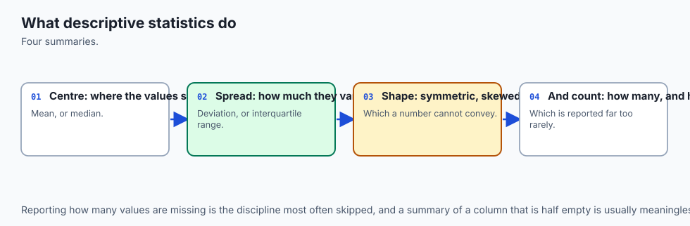
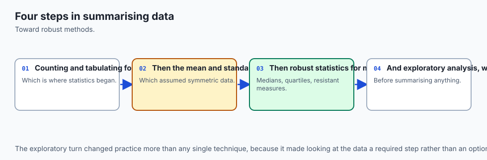
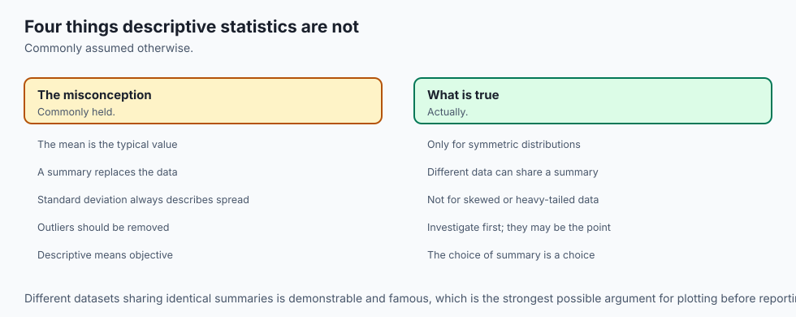
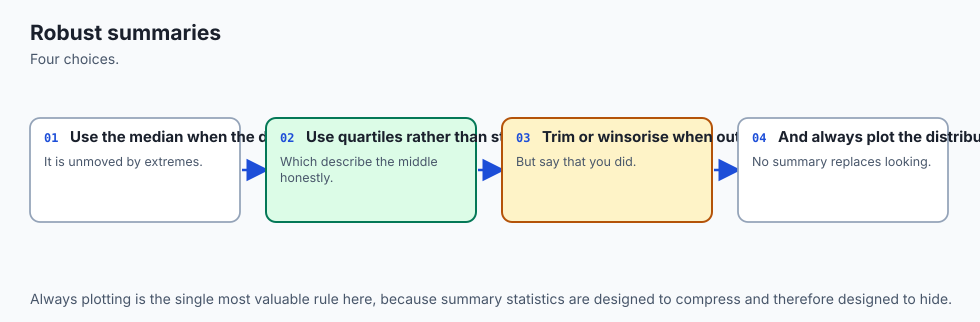
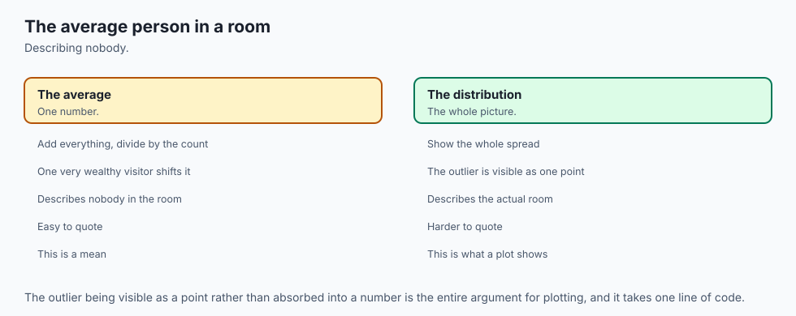
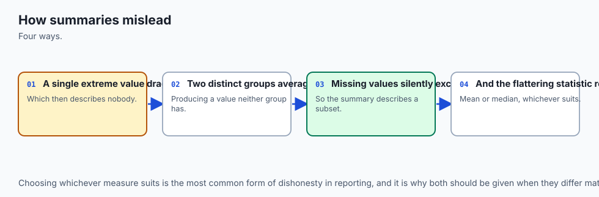
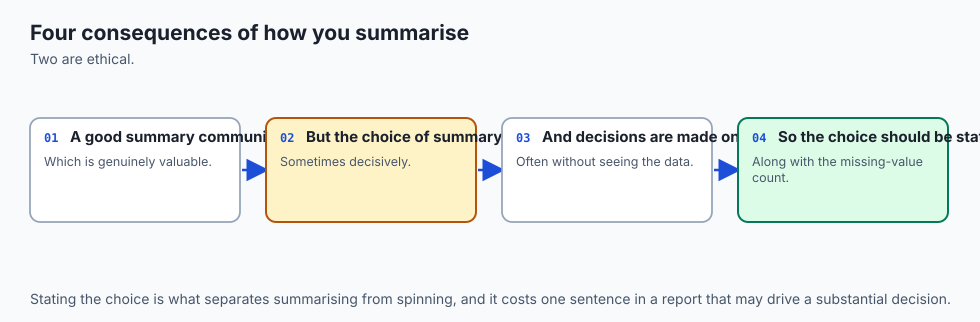
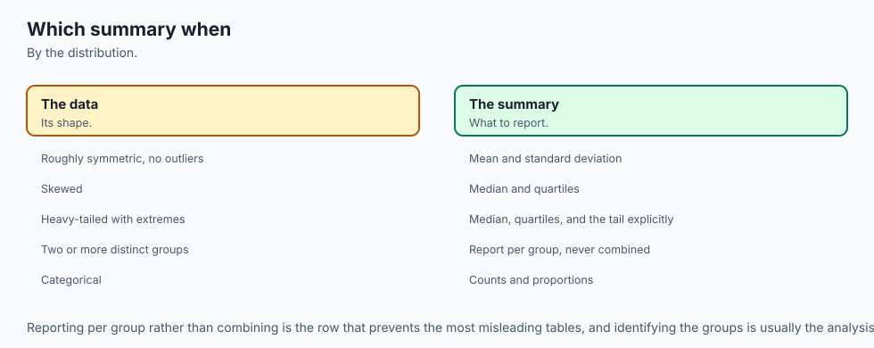

## Why this matters

In 1973 the statistician Francis Anscombe published four small datasets, eleven points each, and asked readers to compute the usual things: the mean of x, the mean of y, the variance of both, the correlation between them, and the slope and intercept of the best-fit line. Every single one of those numbers agrees across all four datasets, to two decimal places. Compute them yourself and you get this, for all four:

```text
mean(x) = 9.00      mean(y) = 7.50
var(x)  = 11.00     var(y)  ≈ 4.13 (4.12 for sets III and IV)
correlation ≈ 0.816
regression line: y ≈ 0.50x + 3.00
```

Now look at what those four datasets actually are. Set I is an honest linear relationship with ordinary scatter — the kind of data a straight-line fit is built for. Set II is a perfect parabola; a straight line drawn through it systematically misses the bend in one direction and then the other. Set III is a perfect straight line with a single point dragged far off it — remove that one point and the fit is exact. Set IV is stranger still: ten of its eleven x-values are identical (all 8), and the entire slope of the fitted line is determined by the single point that isn't (x=19) — the other ten points, however their y-values varied, could not have moved that line at all.

Four datasets. Four completely different stories about what is happening between x and y. Six numbers that cannot tell them apart, because every one of those six numbers is exactly the kind of number this lesson is about: a summary statistic, computed correctly, reporting a true fact, and hiding everything else.

That is the whole shape of today's lesson, stated as bluntly as it deserves: **a summary statistic is a compression, and every compression discards something.** A mean discards the shape of the distribution around it. A standard deviation discards which values, specifically, are far from the mean. A correlation coefficient discards whether the relationship is even a straight line. None of this makes summary statistics wrong — they are, when used correctly, one of the most powerful tools available for turning a spreadsheet nobody could read into a sentence somebody can act on. It makes them dangerous exactly to the extent that the reader forgets they are a compression at all, and starts treating the six numbers as the data rather than as a lossy, one-directional projection of it.

So the professional question, every single time you meet a reported statistic — a mean, a percentile, a correlation, an error rate — is not "is this number correct." Correctly-computed numbers mislead constantly; every example in this lesson is arithmetically correct. The professional question is: **what did this number discard, and would I still trust the conclusion if I could see what it hid?** By the end of this lesson you will have computed every one of the numbers above yourself, verified Anscombe's agreement to the last decimal place the record reports, and then computed three further numbers — not part of Anscombe's original table — that finally tell the four datasets apart.

That move, finding the diagnostic the standard summary omits, is the actual skill this lesson teaches. Everything else — the breakdown point, Bessel's correction, the percentile that turns out not to exist, Simpson's paradox — is a worked example of exactly the same move: a familiar number, and the specific thing it was never going to tell you.

## The idea in plain language



Imagine describing a classroom of thirty students to someone who has never met any of them, using exactly one number. "Average height, 5'6"" tells them something real, and it tells them almost nothing about whether the class is thirty students clustered tightly around 5'6", or fifteen students at 5'0" and fifteen at 6'0" with nobody actually near the average at all. Both classrooms report the identical average. They look nothing alike.

That is the entire tension this lesson lives inside. A single number — a mean, a percentile, a correlation — is a compression of an entire dataset down to one figure, chosen because it is useful and reportable, at the cost of throwing away everything the figure does not directly measure. The mean throws away the shape of the spread. The standard deviation throws away which specific points are far out. The correlation coefficient throws away whether the relationship curves. None of these choices are mistakes — compressing a spreadsheet into one number is the entire point of a summary statistic, and a report that listed all thirty heights instead of the average would usually be worse, not more honest. The mistake is forgetting that a compression happened, and treating the surviving number as though it were the whole dataset rather than a specific, chosen, lossy view of it.

Here is the discipline this lesson tries to install: **before you trust a reported number, ask what kind of thing it could not have told you, even if it wanted to.** A mean cannot tell you about skew. A standard deviation cannot tell you whether the outliers doing the damage are three points or three hundred. A single correlation coefficient cannot tell you whether the relationship is a straight line or a hidden curve. Once you know the specific blind spot of each statistic, you know exactly what second question to ask — and asking it, every time, is the difference between reading a number and understanding what produced it.

## Historical background



Descriptive statistics as a formal discipline is older than the probability theory Week 17 opened with — people have been computing means and totals for censuses and trade records for millennia — but the specific ideas this lesson centres on are much younger, and several of them are direct responses to statistics being used to mislead.

Francis Galton, working in the 1880s on inherited traits, introduced the median and percentile-based thinking into serious statistical practice, and coined "regression to the mean" while studying how extreme parents tend to have less extreme children — an early, careful example of resisting the pull of a single misleading summary. Karl Pearson formalised the correlation coefficient that bears his name in the 1890s, giving statisticians their first standard tool for a linear relationship — and, as this lesson demonstrates directly, the tool's very definition is why it is blind to anything that curves.

Ronald Fisher, in the 1920s, established the mathematical case for dividing by `n - 1` rather than `n` when estimating a population's variance from a sample — the correction this lesson calls Bessel's correction, after Friedrich Bessel, who had used related reasoning in astronomy a century earlier. Fisher's insight, worked through in detail in "How it works" below, is that a sample's own mean is not the population's true mean — it is the value that sample happens to minimise its own squared distance to, which makes the sample look slightly less spread out than the population really is, in a precisely quantifiable way.

Francis Anscombe's 1973 paper is the youngest idea in this history and the one this lesson opens with, and it was written with an explicit target: statisticians of the era were increasingly relying on summary statistics computed by machine, without ever plotting the data, because plotting was slow and expensive and the numbers were fast. Anscombe built four datasets by hand, specifically engineered so that every standard summary statistic would agree, to make an argument that needed no further words: if you never look at the shape, the numbers alone will not warn you when they are lying to you about the shape.

Edward Tufte's later work on graphical integrity, and the broader "How to Lie with Statistics" tradition going back to Darrell Huff's 1954 book of that title, sit downstream of the same worry: statistics are trusted precisely because they look objective, which makes a correctly-computed but poorly-chosen statistic more dangerous than an obvious falsehood, not less.

## What it is — and what it is not



**Descriptive statistics is:** the set of tools for summarising a dataset's centre, spread, shape and relationships using a small number of computed figures — mean, median, mode, variance, standard deviation, percentiles, correlation — each one a specific, well-defined compression of the full dataset, each one discarding a specific, knowable category of information.

| The belief | What is actually true |
| --- | --- |
| "The mean is the normal, typical value" | The mean is the value that minimises the sum of squared distances to every point — a specific mathematical property, not a claim about typicality. For skewed data it can be a value few or no real observations resemble; "average income" reported as a mean is usually higher than most people's actual income. |
| "A low standard deviation means the data has no outliers" | A standard deviation is itself dragged upward by outliers — it is the wrong tool for detecting them reliably, because the very thing you are trying to measure (unusual spread) contaminates the measurement. The median absolute deviation, covered below, is built for exactly this weakness. |
| "The 75th percentile is a specific, well-defined number" | It depends on an interpolation convention that most tools never surface. NumPy alone documents nine different conventions, and this lesson computes a small array's 75th percentile under several of them and gets genuinely different answers. |
| "A correlation of 0 means there is no relationship" | It means there is no *linear* relationship. A perfect parabola — y determined exactly by x — has a Pearson correlation of essentially zero, because a straight line fit to a symmetric curve has nothing to fit. |
| "If the average result is good, the system is working" | The average across subgroups can hide a subgroup that is failing badly, or — in the sharper case this lesson covers — the average can even point the wrong direction entirely relative to every subgroup, which is Simpson's paradox. |
| "Dividing by n is the natural way to compute a sample's variance" | It is the natural formula, and it is biased low, provably and measurably, because the sample's own mean is fitted to that exact sample and therefore sits closer to it than the true population mean does. |

## Why it was created and what problems it solves

Every tool in this lesson exists to answer the same underlying question — "what is this dataset like, without making me look at every row?" — under a specific set of constraints that differ tool by tool.

The mean, median and mode answer "what is a typical value," each under a different definition of typical: the mean is the value with the smallest total squared distance to every point, the median is the value with as many points above as below, and the mode is simply the most common value. They were not created to compete with each other; they were created because "typical" is genuinely ambiguous, and different situations call for different definitions of it. Reporting income requires the median specifically because a small number of extremely high earners can drag the mean far above where almost everyone actually is — the mean answers a mathematically precise question that, for skewed data, stops matching the everyday meaning of "typical."

Variance and standard deviation answer "how spread out is this," in units that (for the standard deviation) match the original data — a variance in dollars-squared is hard to interpret; a standard deviation in dollars is not. Bessel's correction exists because the naive formula for sample variance is provably biased, and Fisher's work established both the size of the bias and the fix.

Percentiles and quartiles answer "where does a given point sit relative to everyone else" — the interquartile range in particular exists as a spread measure that ignores the extreme 25% on each end, which makes it far less sensitive to a handful of extreme values than the standard deviation is. The catch, and it is a serious one, is that "where a point sits relative to everyone else" requires deciding what to do when no data point sits exactly at the percentile you asked for — and there is no single universally agreed answer to that question, which is exactly what exercise 4 demonstrates with real, disagreeing numbers.

Correlation answers "do these two variables move together," in a form that is unaffected by the units either variable is measured in. Pearson's correlation specifically answers "do they move together *linearly*" — and the price of that precision is blindness to every other kind of relationship, which is why Spearman's rank correlation exists as a second tool that answers the related-but-different question "does one variable consistently increase as the other does, regardless of shape."

Anscombe's quartet and Simpson's paradox are not tools that answer a question; they are demonstrations that every tool above has limits, built specifically to make those limits impossible to ignore. Anscombe's quartet is the limits of the numeric summary; Simpson's paradox is the limits of aggregation itself.

## How it works



### Mean, median, mode — and exactly when each misleads

The **mean** is the sum of every value divided by the count. It uses every single data point, weighted equally, which is both its strength (it responds to the whole dataset) and its weakness (every point, including the extreme ones, gets an equal vote, and an extreme enough point can dominate the vote entirely).

The **median** is the middle value once the data is sorted — for an odd count, the single middle value; for an even count, the average of the two middle values. It uses only the *position* of values relative to each other, which is precisely why it is far less sensitive to how extreme the extreme values are.

The **mode** is the most frequent value — or values, when several are tied. Python's own `statistics.mode()` (singular) quietly picks just one of several tied values rather than reporting that there was a tie at all, which is worth knowing before you rely on it:

```python
import statistics as st
data = [3, 3, 5, 6, 8, 8, 9]
st.mode(data)        # 3 -- picks ONE, silently
st.multimode(data)   # [3, 8] -- the honest answer
```

**Skew is the concept that connects all three.** A distribution is right-skewed when it has a long tail of unusually high values (income, house prices, response times); the mean gets pulled toward that tail while the median, caring only about position, does not move nearly as much. Left-skewed data pulls the mean the other way. For a genuinely symmetric distribution, mean, median and mode coincide; the further a distribution skews, the further apart the three drift — exactly what the architecture diagram below draws directly, side by side with a symmetric case where all three agree.

### The breakdown point: the sharpest way to say it

The **breakdown point** of a statistic is the largest fraction of the data that can be replaced with arbitrarily extreme values before the statistic itself can be dragged to an arbitrary value. It is the cleanest, most quantitative way to state the mean-versus-median trade-off.

**The median's breakdown point is (just under) 50%.** As long as fewer than half the values are corrupted, the median must still land among the honest values, because the median is defined purely by position: however extreme the corrupted values become, they cannot outnumber the honest ones at the middle rank unless they are the majority.

**The mean's breakdown point is zero.** A single corrupted value, however small a fraction of the dataset, can drag the mean to any value at all, because the mean is a sum divided by a count — make one term in that sum large enough and the sum (and therefore the mean) follows it without limit.

Nine ordinary salaries, sorted:

```text
$42,000  $45,000  $47,000  $48,000  $50,000  $52,000  $55,000  $58,000  $60,000
```

mean = $50,777.78, median = $50,000 — close together, as they should be for ordinary, roughly symmetric data. Now replace the single largest salary, $60,000, with a data-entry error — a stray extra zero, say $10,000,000, an error a spreadsheet would not flag as impossible:

```text
mean before  = $50,777.78        mean after  = $1,155,222.22   (moved by $1,104,444.44)
median before = $50,000.00       median after = $50,000.00      (moved by exactly $0.00)
```

One value out of nine — about 11% of the data, nowhere near the median's 50% tolerance — dragged the mean past a million dollars while the median did not move by one cent. The median's exact-zero shift is not an approximation; it follows directly from the definition. The corrupted value, however absurd, is still the single largest value in the list, so it still occupies the same rank (9th of 9) that $60,000 occupied, and the median only ever looks at rank, never at magnitude.

### Variance and standard deviation, and Bessel's correction, actually shown

**Variance** measures spread as the average squared distance from the mean; **standard deviation** is its square root, which restores the original units. For a full population of size `N` with known mean `μ`, the population variance is exact:

```text
σ² = (1/N) × Σ (xᵢ − μ)²
```

The trouble starts the moment you only have a *sample* rather than the whole population, and you do not know the true population mean `μ` — you only have the sample's own mean, `x̄`, computed from the very data you are trying to describe. **Bessel's correction is the fact that dividing by `n` in this situation is biased low — not by intuition, by a provable factor of exactly `(n-1)/n`.**

Here is why, stated precisely rather than merely asserted. The sample mean `x̄` is, by construction, the single number that minimises the sum of squared distances to that specific sample — that is what "mean" means. The true population mean `μ` is some other number, generally not equal to `x̄`. Because `x̄` is *chosen* to minimise squared distance to this sample, and `μ` is not, the sample's squared distances to `x̄` are, on average, smaller than the sample's squared distances would be to `μ` — the sample is always at least as close to its own mean as it can possibly be to anything else. Dividing that understated sum by `n` therefore understates the true variance, and the size of the understatement works out to exactly the factor `(n-1)/n`. Dividing by `n-1` instead exactly compensates.

This lesson does not ask you to take that on faith. The lab measures it directly: draw 20,000 independent samples of size 5 from a population with a known variance of exactly 100, compute both estimators on every sample, and average.

```text
true population variance        = 100.0
mean of divide-by-n estimator   = 80.0698   ->  ratio to truth = 0.8007   (predicted: (5-1)/5 = 0.8000)
mean of divide-by-(n-1) estimator = 100.0873 -> within 0.17 standard errors of the truth
```

The divide-by-n estimator lands at almost exactly 80% of the true variance, matching the predicted `(n-1)/n = 0.80` factor to three significant figures over 20,000 trials. The divide-by-(n-1) estimator lands within a fraction of one standard error of the true value of 100. This is a genuinely measured result, not a textbook assertion repeated without checking — and the measurement agreeing this closely with the theoretical prediction is itself evidence the derivation above is correct, not merely plausible.

`numpy.var()` defaults to `ddof=0`, dividing by `n` — the biased estimator, unless you explicitly pass `ddof=1`. This is one of the most common silent bugs in applied statistics: code that looks correct, runs without error, and quietly underestimates spread by a small but real amount, worse for small samples than large ones (at `n=5` the bias is 20%; at `n=1000` it is a negligible 0.1%).

### Quartiles, the IQR — and the percentile that is not one number

Quartiles divide sorted data into four equal-count groups; the **interquartile range (IQR)** is `Q3 − Q1`, the spread of the middle half of the data, deliberately ignoring the extreme quarter on each end. This is the lesson's most practically useful surprise, so it earns a full worked example rather than a summary: **"the 75th percentile" is not a single well-defined number.**

The trouble is interpolation. When the target percentile does not land exactly on a data point — which is the ordinary case, not an edge case — every implementation must decide what to do about the gap, and there is no single universally agreed convention for deciding. `numpy.percentile()` documents nine named conventions through its `method=` argument. Take this small, ordinary-looking array:

```text
values = [1, 2, 3, 4, 6, 8, 9, 15]
target  = 75th percentile
```

```text
method               75th percentile
linear (the default)   8.25
lower                   8.0    <- an actual data point
higher                  9.0    <- a DIFFERENT actual data point
nearest                 8.0
midpoint                8.5
weibull                 8.75
median_unbiased         8.5833...
normal_unbiased         8.5625
hazen                   8.5
```

Seven distinct values from nine conventions applied to the same eight numbers. `lower` and `higher` do not merely round differently — they select two entirely different, real data points from the array. `weibull` and `linear` differ by half a unit. This is not a rare edge case triggered by unusual data; it is the ordinary behaviour whenever the target percentile does not land on an exact data point, which is most of the time. **Two dashboards, two data-science teams, or two versions of the same tool can report genuinely different "75th percentiles" for the identical dataset, and every one of them can be completely correct** — correct relative to the convention each one silently chose.

### Robust spread: the IQR and the median absolute deviation

The standard deviation shares the mean's weakness for a structural reason: it is built from squared distances to the mean, and the mean is itself dragged by outliers, so a contaminated standard deviation is doubly compromised. Two alternatives exist specifically because of this.

The **IQR**, already introduced above, ignores the top and bottom 25% of the data entirely, which makes it insensitive to any contamination confined to those extremes.

The **median absolute deviation (MAD)** takes the idea further: compute the median first (itself robust, breakdown point near 50%), then compute the median of the absolute distances from every point to that median — a robust measure of spread built entirely from robust ingredients.

Contaminate 3% of a clean sample — 3 extreme values added to 97 ordinary ones — and measure both:

```text
standard deviation, clean        = 4.565
standard deviation, contaminated = 68.918     (15.10x inflation)
median absolute deviation, clean        = 2.869
median absolute deviation, contaminated = 2.863   (1.00x -- essentially unchanged)
```

Three points out of a hundred — 3% of the data — inflated the standard deviation more than fifteenfold. The MAD, measuring spread over the same contaminated sample, barely registered the contamination at all. This is the breakdown-point argument from earlier in the lesson, restated as a measure of spread rather than of centre: the standard deviation's breakdown point, like the mean's, is effectively zero for large enough outliers; the MAD's, like the median's, tolerates close to half the data being corrupted.

### Correlation: what Pearson can see, and what it cannot

**Pearson's correlation coefficient**, usually written `r`, measures the strength and direction of *linear* association between two variables — how well a straight line fits the relationship between them, on a scale from −1 (perfect negative line) to +1 (perfect positive line), with 0 meaning no linear trend at all.

The blind spot is exact and worth stating precisely: Pearson's `r` is built entirely from how far each point sits from a best-fit *straight line*, and it has no vocabulary for any relationship shape other than a line. Take a perfect, symmetric parabola — `y = x²` for `x` running from −5 to 5 — where `y` is *exactly* determined by `x`, with zero noise:

```text
x = -5, -4, -3, -2, -1, 0, 1, 2, 3, 4, 5
y =  25, 16,  9,  4,  1, 0, 1, 4, 9, 16, 25

Pearson correlation = 0.0   (exactly, by the symmetry of the data)
```

`y` is a perfect, deterministic function of `x`. Knowing `x` tells you `y` with total certainty. And Pearson's correlation reports **zero** — because a straight line drawn through a symmetric parabola has literally nothing to fit; every unit `x` moves upward on one side of the parabola is mirrored by an equal downward move on the corresponding point on the other side, and those cancel out exactly in the linear-fit calculation.

**Spearman's rank correlation** answers a related but genuinely different question: does `y` consistently increase whenever `x` does, regardless of the shape of that increase? It is computed by first converting both variables to ranks (1st smallest, 2nd smallest, and so on), then computing Pearson's correlation on the *ranks* rather than the raw values. Take a monotone but non-linear relationship, `y = x³`:

```text
x = -5, -4, -3, -2, -1, 0, 1, 2, 3, 4, 5
y = -125, -64, -27, -8, -1, 0, 1, 8, 27, 64, 125

Pearson correlation  = 0.921649   (strong, but the curve is not a straight line, so not perfect)
Spearman correlation = 1.000000   (exactly -- y increases every single time x does)
```

Pearson sees a strong but imperfect relationship, correctly reflecting that `y = x³` is not a straight line. Spearman reports perfection, correctly reflecting that the relationship is perfectly monotone — every increase in `x` produces an increase in `y`, with no exceptions, regardless of how curved the path between them is.

| Question | Pearson `r` | Spearman |
| --- | --- | --- |
| Is the relationship a straight line? | Answers this directly | Cannot tell a line from any other monotone curve |
| Is `y` a monotone (always-increasing) function of `x`, any shape? | Blind to this — a perfect symmetric curve scores near 0 | Answers this directly, exactly 1.0 for any perfect increasing relationship |
| Sensitive to outliers? | Yes — built from raw values | Less so — built from ranks, which change little when one value moves |
| What a value of exactly 0 tells you | No *linear* trend — says nothing about non-linear structure | No consistent monotone trend at all |

### Correlation is not causation — said usefully, not as a slogan

Every introductory statistics course states "correlation is not causation" and most readers have heard it so many times it has stopped meaning anything. Here is the version that is actually useful: **a correlation between X and Y is consistent with X causing Y, Y causing X, some third factor Z causing both, or pure coincidence in a finite sample — and the correlation coefficient itself contains no information that distinguishes between these.** The number `r = 0.7` is identical in all four cases; the causal structure lives entirely outside what the correlation measures.

The practically useful move is not to recite the slogan but to actively generate the alternative explanations before accepting the causal one: ice cream sales and drowning deaths correlate strongly across the calendar year, and the honest third factor is summer heat, driving both more swimming (and therefore more drowning) and more ice cream purchases, with neither event causing the other. Every time a report claims "X drives Y" from a correlation alone, the professional response is to ask what third factor could produce the same number without either variable touching the other — and if a plausible one exists and was not ruled out, the causal claim was never actually established, whatever the correlation coefficient says.

### Simpson's paradox: the most consequential idea in this lesson

**Simpson's paradox is a trend that holds in every subgroup of a dataset and reverses when the subgroups are pooled — purely because of how the subgroups were sized, with no error anywhere in the arithmetic.** It is the single most consequential idea in this lesson because it is exactly how honestly, correctly computed statistics mislead in practice: nobody made a mistake, and the aggregate is still telling the wrong story.

The smallest table that shows it clearly, comparing two treatments on an easy and a hard subgroup of cases:

```text
                 easy subgroup        hard subgroup
treatment A     1/1  = 100%           9/90 = 10%
treatment B     9/10 =  90%           0/1  =  0%
```

**Treatment A beats treatment B in both subgroups** — 100% beats 90% on the easy cases, 10% beats 0% on the hard cases. Pool the two subgroups into an overall rate for each treatment, using the total successes over the total trials — the only honest definition of "overall rate":

```text
treatment A overall = (1 + 9) / (1 + 90) = 10/91  = 11.0%
treatment B overall = (9 + 0) / (10 + 1) = 9/11    = 81.8%
```

**Treatment B wins overall, by a landslide, despite losing every single subgroup comparison.** Both directions of this are exact arithmetic on the same four numbers; nothing was fabricated or rounded to produce the reversal.

The mechanism is entirely about the sizes, not the treatments: treatment A took 90 of its 91 trials — nearly all of them — in the hard subgroup, where success is rare for everyone regardless of treatment. Treatment B took only 1 of its 11 trials there, concentrating almost all its trials in the easy subgroup, where success is common for everyone. The overall rate is a *weighted* average of the subgroup rates, and the weights here — how many trials landed in the easy subgroup versus the hard one — differ dramatically between the two treatments. Pooling erases exactly the information (which subgroup each trial came from) that explains the entire result, and once that information is erased, the pooled number answers a different, less useful question than the one anyone actually cares about ("which treatment works better, controlling for difficulty").

The defence is structural, not statistical: **never trust a pooled comparison without checking whether the groups being pooled were assembled with the same composition.** Whenever the subgroup sizes could plausibly differ between the groups being compared — which is the ordinary case for almost any real comparison across time, populations, or conditions — the subgroup breakdown is not an optional extra table. It is the only way to know whether the aggregate number means what it appears to mean.

### Standardisation and z-scores

**Standardising** a value converts it into a z-score: how many standard deviations above or below the mean that value sits.

```text
z = (x − mean) / standard deviation
```

Standardising an entire dataset produces a new dataset with mean exactly 0 and standard deviation exactly 1, by construction — every value has been rescaled and recentred, but nothing about its position *relative to every other value* has changed.

That last clause is the property worth proving rather than asserting: **standardising a dataset does not change the Pearson correlation between it and anything else.** Correlation is a statement purely about relative structure — how points move together — and rescaling every value by the same factor, then shifting every value by the same amount, cannot alter how the points move relative to each other.

```text
Pearson correlation, original x,y      = 0.9701497165
Pearson correlation, standardised x,y  = 0.9701497165
  difference                           = 3.33e-16   (floating-point noise, not a real difference)
```

Day 107 covered norms and distances built from exactly this kind of rescaling — standardisation is the one-dimensional version of the same idea: it changes the units a value is measured in without changing anything about its relationship to the rest of the data. The practical use is comparing variables measured on wildly different scales (age in years against income in dollars) on equal footing, or feeding data into any method — many machine learning algorithms among them — that is sensitive to the raw scale of its inputs.


## An everyday analogy



Think of every statistic in this lesson as a photograph of a moving crowd, taken with a different camera setting. The mean is a long-exposure shot: it captures where the crowd's centre of mass ends up, but anyone who sprinted off to one side blurs the whole frame and drags the apparent centre toward them. The median is a snapshot of whoever happens to be standing in the middle of the group at the moment the shutter clicks — it does not care how far anyone else wandered, only who is in the middle rank right now.

Standard deviation is a wide-angle lens: it captures the whole spread of the crowd in one number, but a single person standing far outside the frame stretches that number disproportionately, the same way one very distant object exaggerates a wide-angle photo's apparent scale. The median absolute deviation is a narrower lens focused on the crowd's typical distance from its own centre — someone standing far outside the frame simply doesn't register, because the lens was never pointed at them.

Correlation is a straight ruler held up against the crowd's overall drift — how well a single straight line describes the direction everyone is moving. A ruler measures a straight line beautifully and has no way at all to register a crowd moving in a perfect circle; that is not the ruler malfunctioning, it is the ruler correctly reporting that there is no straight-line trend, while the actual, highly-organised motion goes completely unmeasured.

Simpson's paradox is what happens when you photograph two different crowds separately, see one crowd clearly moving faster in every section of the field you check, and then discover that once you combine both crowds into one photograph, the pooled photo's centre of mass appears to move the other way — not because either individual crowd changed, but because the two crowds were standing in different sections of the field in very different numbers, and the pooled photograph cannot see the sections at all anymore.

Where the analogy strains: a real photograph, however chosen, still shows you the actual pixels underneath, whereas a summary statistic genuinely destroys the underlying data the moment it is computed — there is no way to zoom into a mean and recover the shape it summarised. That asymmetry is exactly why plotting the data, whenever that is possible, remains the one check none of today's numbers can substitute for.

## Examples in practice



### Anscombe's quartet, verified completely

The lesson opened with Anscombe's agreement; the lab verifies it as an assertion, not a claim to take on faith, and then computes the diagnostics the classic summary cannot see. Three separate diagnostics, each targeting a different one of the four sets:

```text
set    max leverage  outlier ratio  sign changes
I             0.318          0.264             6
II            0.318          0.217             2
III           0.318          0.699             3
IV            1.000          0.227             4
```

**Max leverage** depends only on the x-values, before y is even considered — how much a single point's *position on the x-axis alone* could determine the fitted line. Sets I, II and III share the same x-values, so they share identical leverage (0.318); set IV's single non-repeated x-value (19, against ten copies of 8) carries essentially all the leverage (1.000) — over three times set I's maximum, and the clearest possible signal that one point, not the relationship, is producing the fit.

**Outlier ratio** compares the single largest residual from the fitted line against the combined size of every other residual. Set III's single outlier residual is more than twice set I's ratio — one point's deviation dwarfing everyone else's combined, exactly the "perfect line plus one outlier" story that set III tells visually.

**Residual sign changes**, counted as x increases, distinguish honest scatter from a systematic curve: set I's residuals flip sign six times out of ten opportunities — ordinary, unpatterned noise around a genuinely straight line. Set II's residuals flip only twice — a smooth, systematic curve that a straight line is failing to follow, exactly what a parabola forced through a linear fit produces.

Every classic summary statistic agreed. These three numbers, none of them appearing in Anscombe's original table, are what finally separate the four datasets — which is the entire lesson of this lesson, demonstrated rather than stated.

### The breakdown point, worked twice

Already worked in full under "How it works": one corrupted salary out of nine moves the mean by $1,104,444.44 and the median by exactly $0.00. Worth restating here as the sharpest one-line summary in the lesson: **the mean's breakdown point is zero, and it is not a close call.**

### Bessel's correction, measured and matching the prediction

Also worked above: over 20,000 simulated samples of size 5, the divide-by-n estimator averaged to 0.8007 of the true variance, against a predicted `(5-1)/5 = 0.8000` — agreement to three significant figures, from a genuine simulation rather than an assumed result.

## Implications: security, privacy, performance, scalability, and cost



**Cost and decision quality.** A dashboard that reports only means and correlations, with no percentile breakdown and no subgroup view, is cheap to build and can be systematically wrong in the specific ways this lesson demonstrates — hiding skew, hiding non-linear relationships, hiding Simpson's-paradox reversals. The cost of adding a median alongside a mean, or a subgroup breakdown alongside an aggregate, is small; the cost of a decision made on a hidden reversal is not.

**Performance and scalability.** Computing a mean or a Pearson correlation is `O(n)`, trivially fast at any scale. Computing an exact median or an exact percentile at scale requires either sorting (`O(n log n)`) or an approximate streaming algorithm — most large-scale analytics systems use an approximate percentile algorithm under load, which reintroduces the "which convention, and how approximate" question this lesson raised for small arrays, now at production scale where the approximation error itself needs to be tracked.

**Security.** Anomaly-detection systems that flag "more than N standard deviations from the mean" inherit the standard deviation's own weakness against contamination: an attacker who can inject even a small number of extreme events can inflate the very threshold meant to catch them, the same mechanism exercise 8 measures directly. Systems built on the median absolute deviation, or another robust spread measure, are structurally harder to blind this way.

**Privacy.** Aggregated statistics released about a population — "average salary in this department," "median response time for this cohort" — can still leak information about individuals when a group is small enough, or when enough different aggregate queries are combined; differential privacy, mentioned in Day 113, exists specifically to bound how much any single individual's presence or absence could have moved a reported statistic. Understanding a statistic's sensitivity to a single data point — precisely what "breakdown point" measures — is directly relevant to reasoning about that risk.

**The specific cost of getting descriptive statistics wrong.** As with probability in Day 113, a misleading summary statistic usually produces a number that looks completely reasonable: it is in a plausible range, has a sensible number of decimal places, and nothing about it announces that it is hiding a skew, a curve, or a subgroup reversal. Anscombe built his quartet precisely to make this point unmissable — every number in his table is correct, and every number is misleading about the shape underneath it.

## Alternatives: free, open source, and commercial

**The `statistics` module** — Python standard library, free, and the tool this lesson leans on for exact, dependency-free arithmetic on ordinary lists. Choose it whenever the data fits comfortably in memory as a plain list and you want zero external dependencies. Beyond `mean()`, `median()` and `mode()`, it is worth knowing this module further than most people do: `fmean()` is a faster floating-point-optimised mean; `median_grouped()` estimates a median for data that has been bucketed into intervals rather than recorded exactly, using linear interpolation within the bucket the median falls into; `correlation()` computes Pearson's r directly; and `linear_regression()` fits a line's slope and intercept in one call — all four were used throughout this lesson's lab, and all four are less well known than they deserve to be, sitting quietly in a module most people associate only with `mean()` and `median()`.

```python
import statistics as st
st.fmean([1, 2, 3, 4])            # 2.5
st.median_grouped([10, 20, 20, 30], interval=10)  # interpolates within the bucket
st.correlation(x, y)              # Pearson's r
st.linear_regression(x, y)        # (slope, intercept)
```

**NumPy** — free and open source (BSD 3-Clause), run throughout this lesson's lab. Choose it for anything array-shaped, for `numpy.percentile()`'s explicit `method=` argument (the standard library has no percentile function at all, let alone nine conventions of one), and for `numpy.var(ddof=1)` / `numpy.std(ddof=1)` when the Bessel-corrected, unbiased sample estimate is what is needed rather than NumPy's `ddof=0` default. `numpy.random.default_rng(seed)` was used for every simulated result in this lesson.

```python
import numpy as np
np.percentile(values, 75, method="linear")   # method is REQUIRED reasoning, not optional
np.var(values, ddof=1)                        # the unbiased (Bessel-corrected) estimator
np.std(values, ddof=1)
```

**`pandas.DataFrame.describe()`** — free and open source (BSD 3-Clause), **not installed in this environment, so no output from it is reproduced anywhere in this lesson or its lab; everything said about it here is drawn from its public documentation.** According to that documentation, `describe()` is the single most common way most people actually compute descriptive statistics in practice: called on a DataFrame or Series, it returns count, mean, standard deviation, minimum, the 25th/50th/75th percentiles, and maximum, in one call. Its standard deviation uses `ddof=1` (Bessel-corrected) by default, matching the unbiased convention this lesson recommends. Its percentiles use `numpy.percentile`'s `linear` interpolation — the same default this lesson's exercise 4 computed directly — which means a `describe()` output and a raw `numpy.percentile(..., method="lower")` call on the identical data can legitimately disagree, and neither one is wrong. Choose `describe()` the moment data lives in a DataFrame and a fast, complete overview is what is needed; it is a summary-generation convenience, not a replacement for looking at the shape of the data, which is Anscombe's entire point.

**`scipy.stats`** — free and open source (BSD 3-Clause), with commercial support available through various vendors for organisations running SciPy in production. **Not installed in this environment, and no output from it is reproduced anywhere in this lesson or its lab; everything said about it here is drawn from its public documentation.** According to that documentation, `scipy.stats` provides `scipy.stats.spearmanr()` for Spearman's rank correlation (which this lesson implemented from scratch instead, to show exactly what "rank, then Pearson" means), `scipy.stats.median_abs_deviation()` for the MAD, and a large library of statistical tests that Days 117 and 118 will need for formal hypothesis testing. Choose it, once available, whenever a named statistical test or distribution is needed rather than the from-scratch descriptive tools this lesson builds; the two approaches agree by construction, and `scipy.stats` is where this course's Week 17 is headed next.

The honest summary: `statistics` and NumPy, both free and both actually run in this lesson, are sufficient for every computation this lesson performs, including the percentile-ambiguity demonstration NumPy alone can produce. `pandas.DataFrame.describe()` is what most practitioners reach for first in real work, and is worth knowing its exact conventions (`ddof=1`, `linear` percentiles) precisely because it is so commonly used without anyone checking what it assumes. `scipy.stats` becomes essential the moment the course moves from description to formal inference, starting Day 117.

## Comparison with related concepts

**Descriptive statistics and inferential statistics.** Descriptive statistics summarise the data you actually have. Inferential statistics — Day 117's sampling theory and Day 118's hypothesis tests — use that data to make claims about a larger population you do not have complete data for. Every inferential technique is built on top of descriptive quantities (a sample mean, a sample variance) and inherits their weaknesses: an inference built on a contaminated mean is contaminated too, which is exactly why this week builds description before inference.

**Mean and median.** Already covered at length: both answer "what is typical," under genuinely different definitions, with genuinely different breakdown points. Neither is universally "more correct" — the right choice depends on whether the distribution is skewed and whether robustness to corruption matters more than using every data point.

**Standard deviation and the interquartile range.** Both measure spread. The standard deviation uses every point and is dragged by extremes; the IQR deliberately ignores the extreme quarter on each end and is far more robust to them, at the cost of discarding real information about the tails when the tails themselves are the point of interest.

**Standard deviation and the median absolute deviation.** Both measure spread around a centre. The standard deviation centres on the mean and squares distances (extra weight on far points); the MAD centres on the median and uses absolute distances (no extra weight), which is precisely why exercise 8's contamination barely moves it.

**Pearson correlation and Spearman correlation.** Already covered at length: Pearson measures linear association specifically; Spearman measures monotone association of any shape, at the cost of discarding information about exactly how linear or curved the relationship is.

**This lesson's Bessel correction and Day 114's random variables.** Day 114 introduced variance as a property of a random variable's entire distribution — a population-level fact, computable exactly once the distribution is fully known. This lesson's Bessel correction is about the harder, more common situation: estimating that same variance from a finite sample when the true distribution is not known, which is precisely where the bias this lesson measures comes from.

## When to use it — and when not to



**Report the median instead of the mean** whenever the underlying distribution might be meaningfully skewed — income, house prices, response times, almost any real-world quantity with a hard lower bound and no hard upper bound — or whenever a small number of extreme, possibly erroneous values could plausibly be present in the data.

**Report the mean** when the distribution is close to symmetric, when every data point genuinely deserves equal weight in the summary (not just position-based weight), or when the mean's mathematical properties (it minimises squared error; it is what most downstream statistical machinery, including the machinery Day 117 introduces, is built around) are specifically what the next step needs.

**Always divide by `n-1`, not `n`,** when estimating a population's variance or standard deviation from a sample — `numpy.var(ddof=1)`, not NumPy's `ddof=0` default — unless you genuinely have the entire population rather than a sample of it, which is rare enough that the sample case should be the default assumption.

**Always name the percentile convention** the moment a percentile crosses any kind of decision boundary — an SLA threshold, a cutoff for flagging outliers, a performance budget. "The 95th percentile" without a stated `method=` (or without knowing which one your tool silently applies) is not a fully specified number, and this lesson has shown real cases where two honest, correct conventions disagree by a meaningful amount.

**Reach for the IQR or the MAD instead of the standard deviation** whenever contamination — data-entry errors, sensor glitches, a handful of genuinely unusual events — is plausible in the data, and reach for the standard deviation when the tails themselves, however extreme, are legitimate signal you specifically want your spread measure to be sensitive to.

**Check Spearman alongside Pearson** whenever a relationship might plausibly be non-linear but still monotone — and check both together, because a large gap between them (as in this lesson's cubic example) is itself informative: it tells you the relationship is real and consistent in direction, but that a straight-line model will understate it.

**Never trust a pooled comparison across groups that could differ in composition** without checking the subgroup breakdown first. This is Simpson's paradox's operational lesson, and it generalises far past the two-treatment example in this lesson: any time "overall X beats overall Y" is reported and X and Y could have drawn from differently-sized or differently-composed subgroups, the subgroup view is not optional due diligence — it is the only way to know what the aggregate number actually means.

**Never trust five summary numbers to tell you the shape of a dataset.** Plot it, whenever plotting is possible at all. Anscombe's quartet exists specifically because the alternative — trusting the numbers alone — is not a hypothetical risk; it is the default failure mode this entire lesson has been building the vocabulary to name.

## The AI connection

- **Summary statistics hide as much as they reveal**, and knowing which is which is the whole
  skill.
- **The mean is not robust and the median is**, which is the same distinction as squared
  versus absolute loss.
- **Always look at the distribution before quoting a summary**, because very different data
  produce identical statistics.
- **Every model evaluation reports summary statistics**, so these failure modes appear
  throughout the curriculum.
- **Reporting spread alongside centre** is what makes a summary honest rather than merely
  short.

## Knowledge check

Eight questions accompany this lesson, covering Anscombe's quartet and what it proves about summary statistics, the breakdown point as the sharpest statement of the mean-versus-median trade-off, Bessel's correction and why dividing by `n-1` fixes a provable bias, the percentile-ambiguity result and which convention pandas actually uses, Pearson versus Spearman on a case where they disagree completely, the mechanism behind Simpson's paradox, the difference between the standard deviation and the median absolute deviation under contamination, and why standardising a dataset cannot change its correlation with anything else.

Two are worth attempting before reading anything else: the one asking what, specifically, Anscombe's quartet demonstrates that six agreeing summary statistics could not, and the one asking why the mean's breakdown point is exactly zero rather than merely "small." Those are the two facts the rest of the lesson is built to make unforgettable.

## Hands-on exercise

The lab is **"Statistics That Don't Lie,"** and its design principle is the one this whole lesson has been repeating: **compute it two ways and assert they agree** — exact arithmetic checked against the `statistics` module, or a measured simulation checked against a tolerance derived from its own standard error.

```bash
cd labs/sections/math-statistics-and-data/day-116-descriptive-statistics-that-dont-lie
python3 -m venv .venv
.venv/bin/pip install -r requirements/requirements.txt
```

Nine exercises, in order: mean, median and mode from scratch; the breakdown point, demonstrated with a corrupted salary list; Bessel's correction, measured by simulation rather than asserted; percentile ambiguity across NumPy's conventions; Pearson versus Spearman on a parabola and a cubic; Anscombe's quartet, verified and then separated by three diagnostics the classic summary cannot see; Simpson's paradox, both directions from one table; robust spread under contamination; and standardisation's invariant correlation.

Check yourself as you go:

```bash
.venv/bin/pytest starter -q
```

Unattempted work is reported as skipped, never as failed. Wrong work fails with your answer printed beside the correct one.

### Expected output

An untouched checkout:

```text
1 passed, 38 skipped
```

A finished one:

```text
39 passed
```

The full harness ends with:

```text
55 checks, 0 failure(s).
```

and exits 0. Along the way, the breakdown point:

```text
mean before        = 50,777.78
mean after         = 1,155,222.22
mean moved by      = 1,104,444.44
median before      = 50,000.00
median after       = 50,000.00
median moved by    = 0.00
```

and the contamination multipliers:

```text
standard deviation multiplier: 15.10x
median absolute deviation multiplier: 1.00x
```

### Validate your work

1. `bash tests/run_tests.sh; echo "exit=$?"` prints `55 checks, 0 failure(s).` and `exit=0`.
2. `.venv/bin/pytest examples -q -p no:cacheprovider` prints `32 passed`.
3. `.venv/bin/pytest starter -q -p no:cacheprovider` prints `39 passed` when you are finished.
4. Each of the nine reference scripts ends with `every assertion held.`
5. Your `median()` function on the corrupted salary list returns exactly `50000` before and after corruption — exact equality, not "close enough".

### Troubleshooting

`ModuleNotFoundError` on `descriptive` or `simulate` means you ran a reference script from the lab directory rather than from inside `examples/`; they import their neighbours from beside themselves.

Tests that keep skipping after you have written code usually mean a leftover `raise NotImplementedError` survived below your implementation.

A test comparing your Bessel-correction ratio fails even though it "looks close" — check the tolerance itself before assuming a bug. It is a simulated result, and the tolerance is derived from `sqrt(p(1-p)/n)`-style reasoning applied to the estimator's own sampling variability, not a round number chosen because it looked reasonable.

Your `shape_statistics()` values for sets I, II and III do not agree on leverage — leverage depends only on the x-values, and sets I, II and III share the same x column, so their leverage should be identical; if it is not, you are almost certainly including `y` somewhere in the leverage calculation.

`troubleshooting.md` covers all of these in full, along with why the harness clears bytecode caches at the start of its run.

### Common mistakes

- **Reporting a mean without checking for skew.** The breakdown-point exercise exists specifically to make the mean's fragility to a single extreme value impossible to hand-wave past.
- **Dividing by `n` instead of `n-1` for a sample variance.** `numpy.var()`'s `ddof=0` default is exactly this mistake, silently, and the lab's Bessel-correction exercise measures precisely how much it costs.
- **Treating "the percentile" as a well-defined number.** The percentile-ambiguity exercise is built to make this impossible to overlook: at least two of NumPy's own documented conventions disagree on the same eight numbers.
- **Reading a Pearson correlation near zero as "no relationship."** It means no *linear* relationship — the parabola exercise is built specifically to break this assumption with a perfectly deterministic counter-example.
- **Averaging subgroup rates instead of pooling counts.** `combined_rate()` in the lab pools total successes over total trials, which is the only honest definition of an overall rate — averaging the subgroup rates directly answers a different, less useful question and can hide the paradox rather than reveal it.
- **Trusting a standard deviation as an outlier detector without checking for contamination in the standard deviation itself.** The exercise 8 contrast between the standard deviation and the MAD under 3% contamination is built to make this circularity visible.

## Practice assignment

Extend today's tools to a problem this lesson did not work through.

1. **The trimmed mean.** Implement a mean that drops the top and bottom 5% of sorted values before averaging the rest. Measure its breakdown point empirically against the corrupted-salary list from exercise 2 — how much corruption can it absorb before it starts moving, compared to the plain mean (breakdown point zero) and the median (breakdown point near 50%)? Write one paragraph placing the trimmed mean's robustness on that spectrum.
2. **A fifth Anscombe-like dataset.** Construct your own small `(x, y)` pair, by hand or by search, that matches set I's mean, variance, correlation and regression slope to the same precision Anscombe's four sets share — but has a visibly different shape from all four published sets. Confirm the match with `anscombe_summary()` and describe, in your own words, what makes your dataset's shape different.
3. **Percentile conventions on real-feeling data.** Take a slightly larger, more realistic array (twenty or thirty values, not eight) and compute the 90th percentile under every convention `numpy.percentile` documents. Report how much the conventions disagree at this size compared to the eight-value example in the lesson, and write one paragraph on whether the disagreement grows or shrinks as the array gets larger.
4. **A Simpson's-paradox table with three subgroups.** Construct a three-subgroup version where treatment A still wins every subgroup and treatment B still wins overall, and explain in one paragraph what property of the subgroup sizes made the three-way version possible, generalising the two-subgroup mechanism from the lesson.
5. **Standardisation and rank correlation together.** Standardise the cubic dataset from the Pearson-versus-Spearman exercise, recompute both correlations on the standardised values, and confirm both are unchanged from the raw-value versions. Write one paragraph connecting this result to why standardisation is a safe preprocessing step before any correlation-based analysis.

## Extension challenge

Three, in increasing order of difficulty.

**Build a full "robustness profile" for a statistic of your choosing.** Pick any summary statistic not covered in depth in this lesson (the geometric mean, the trimmed standard deviation, a specific weighted average), derive its breakdown point from first principles the way this lesson derived the mean's and median's, and confirm your derived breakdown point empirically by corrupting an increasing fraction of a sample and finding the point where your chosen statistic starts moving without bound.

**Reproduce Anscombe's construction technique.** Anscombe did not find his four datasets by luck — he deliberately engineered them to share summary statistics while differing in shape. Starting from set I, algorithmically perturb the y-values (keeping x fixed) subject to the constraint that mean, variance, correlation and regression slope stay within the documented precision, and see how many visibly different shapes you can produce this way before the constraint becomes difficult to satisfy. Write up what made some target shapes easy to hit and others hard.

**Design a subgroup-aware evaluation report.** Take any model-evaluation-shaped dataset you can construct or simulate — predictions and true labels, split across two or more meaningful subgroups — and build a report that could not be Simpson's-paradox-ambiguous: one that always shows the subgroup breakdown alongside any aggregate metric, and that flags automatically (by comparing subgroup-wise winners against the aggregate winner) whenever a pooling reversal like this lesson's Simpson's-paradox example is present in the data. This is, in miniature, exactly the tool a responsible model-evaluation pipeline needs.

---

**The AI thread.** Every model evaluation you will ever read reports an average — average accuracy, average latency, average user rating — and an average computed across subgroups is exactly the shape of number Simpson's paradox warns about: a model that performs well on average can still be failing badly on a specific subgroup, and in the sharper case this lesson demonstrated, a model that loses on every individual subgroup comparison to a competitor can still win on the pooled aggregate, purely because of how the evaluation data was distributed across those subgroups. This is not a hypothetical risk particular to medical treatments; it is the generic behaviour of any weighted average, and a model-evaluation dashboard is a weighted average with a friendlier name.

You now have the specific vocabulary this situation calls for, not just the general instinct to be suspicious of headline numbers. "What's the subgroup breakdown, and are the subgroup sizes comparable across whatever is being compared?" is Simpson's paradox's operational question, asked of a model card instead of a clinical trial. "Is this correlation-based fairness claim linear-only, and would Spearman tell a different story?" is today's Pearson-versus-Spearman distinction, asked of a bias audit. "What convention is this reported 95th-percentile latency using?" is today's percentile-ambiguity result, asked of an SLA.

And "what would this reported average look like if I could see the distribution behind it, not just the mean?" is Anscombe's entire argument, asked of literally any single-number claim about how well a system performs. The habit this lesson has been building — ask what a summary statistic discarded before trusting the conclusion it supports — is not a statistics-class exercise. It is the specific discipline that separates reading a model's reported metrics from actually understanding what the model does.