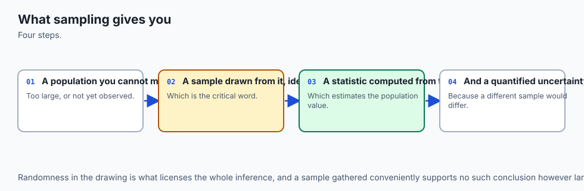
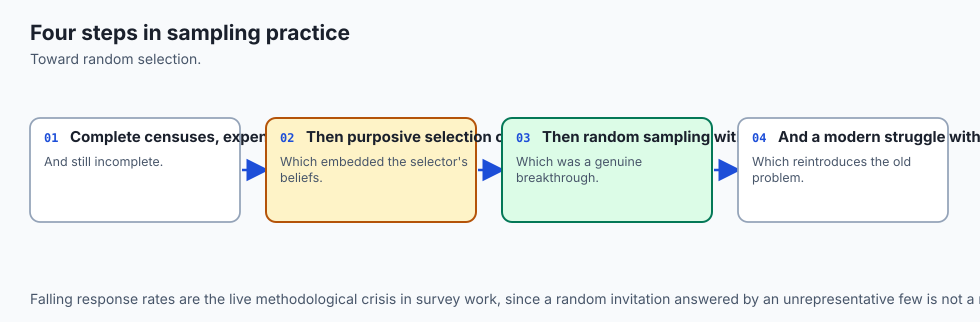
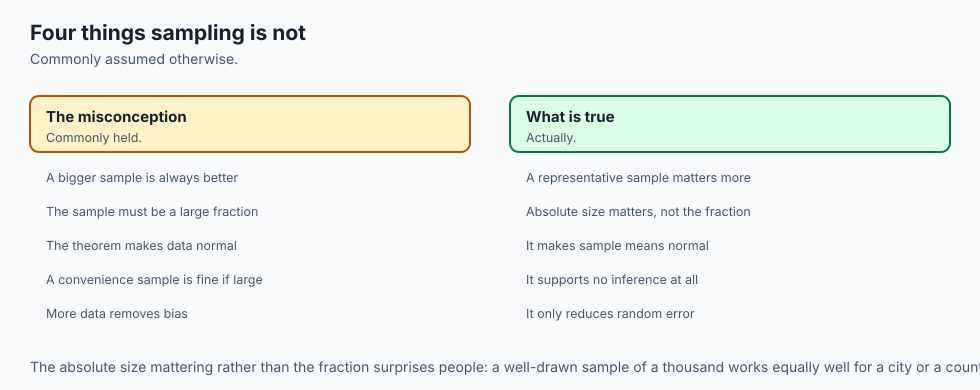
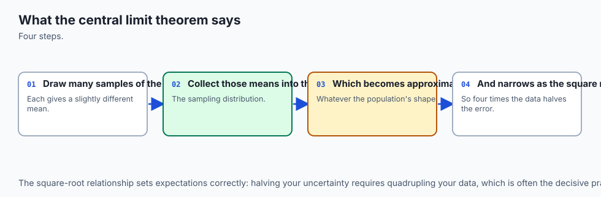
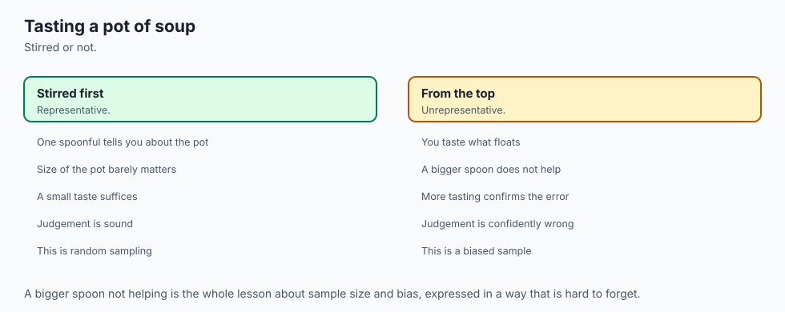
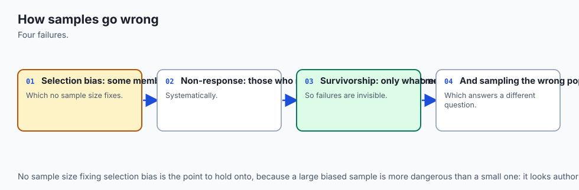
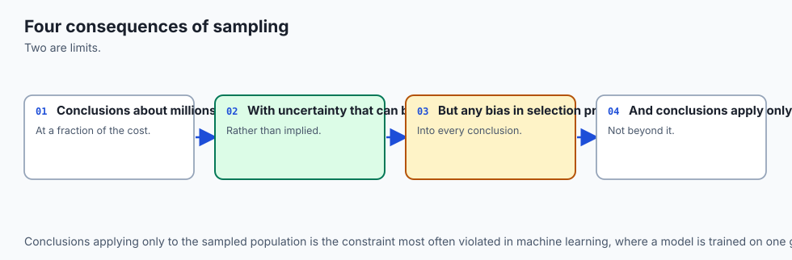
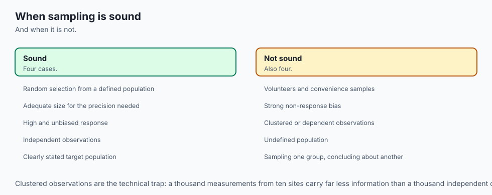

## Why this matters

Somebody on your team measures average session length across 30 users this week. They get 42 seconds. They write it in a slide as *the* number: "average session length is 42 seconds." Next week, curious, they draw another sample of 30 users from the exact same underlying population — same product, same traffic, same everything — and measure again. They get 51 seconds.

Nobody made a mistake. Nothing changed about the product between the two measurements. The measurement process itself did exactly what it was supposed to do, twice, and produced two different numbers.

This is the single most common quantitative mistake in software and in AI practice, and it is not a mistake of arithmetic. It is a mistake of *framing*: treating a sample statistic as if it were the truth, rather than as one draw from a distribution of possible answers the sampling process could have produced. A sample mean is not "the average." It is *an estimate of* the average, and estimates have their own spread — their own distribution — exactly the way the underlying data does.

Once you see this, you cannot unsee it, and it changes how you read almost every number a data pipeline or a model evaluation hands you. "Model A scored 91.4% and Model B scored 91.1% on the test set" is not a report that A is better. It is a report of two draws from two sampling distributions, and whether that 0.3-point gap means anything at all depends entirely on how wide those distributions are — a question this lesson gives you the tools to answer with an actual number, not a shrug.

Here is the through-line for the whole day, worth holding onto from the first paragraph to the last: **the central limit theorem is the reason a sample can tell you anything about a population at all, and the standard error is the price you pay for asking.** Day 113 measured that price without naming it — a Monte Carlo estimate's error fell as `1/sqrt(n)`, and the lab measured roughly a 23.5x improvement in error going from 100 to 100,000 samples, close to the `sqrt(1000) ≈ 31.6x` a `1/sqrt(n)` law predicts. Today you learn *why* that law is `1/sqrt(n)` and not something else, what has to be true for it to hold, and — just as importantly — two full sections on where it quietly stops holding, because the conditions are not decoration.

For an AI practitioner specifically, this is not optional background. Every accuracy figure, every win rate, every A/B test result you will ever read about a model is a sample statistic computed on a finite test set, and it carries a standard error whether or not anyone reports one. An accuracy of 91.4% measured on 500 held-out examples has a standard error of about 1.25 percentage points — this lesson computes that number from the same binomial formula a coin flip obeys — which means a model that beats another by 0.3 points on that set has demonstrated close to nothing. Leaderboards are full of exactly this mistake.

## The idea in plain language



Here is the reframe in one sentence: **a statistic — a mean, a proportion, a median, anything you compute from a sample — is itself a random variable, with its own distribution, its own mean, and its own spread.**

Day 114 built random variables as functions from outcomes to numbers. A sample mean is a random variable in exactly that sense: its "outcome" is which 30 users happened to land in your sample, and its "number" is the mean session length of those particular 30 people. Draw a different set of 30 users and you get a different outcome, and therefore a different number. The *distribution of that number*, across every possible sample you could have drawn, is called the **sampling distribution** of the mean.


Follow the picture left to right, because it is the whole conceptual leap of the day compressed into one image. On the left is the population — every user who could ever open the app, some of them fast, some slow, the whole messy shape. In the middle, five different samples are drawn from that population, each one a handful of dots pulled out at random, and each sample has its own mean — five short ticks, none of them identical, none of them exactly equal to the population's true mean.

On the right is the *object this lesson is actually about*: not any one sample, and not the population, but the distribution you would get if you kept drawing samples and kept recording their means, forever. That distribution is narrower than the population itself — averaging cancels out some of the individual noise — and its width has a name: the **standard error**.

Two results make this reframe usable rather than merely humbling.

**The standard error is `sigma / sqrt(n)`.** `sigma` is the population's own spread; `n` is your sample size. The `sqrt(n)` in the denominator is the entire economics of measurement, and it is worth sitting with because it is stingier than intuition expects: to cut your standard error in half, you do not need twice the data — you need **four times** the data. To cut it to a tenth, you need **a hundred times** the data. This is the same law Day 113 met without a name: the Monte Carlo estimate in that lesson *was* a sample mean (of an indicator variable, 1 if an event happened and 0 if it didn't), and its error shrinking as `1/sqrt(n)` was this exact result, observed a few days before it had a name attached.

**The central limit theorem (CLT):** whatever shape the population has — skewed, lumpy, bimodal, nothing like a bell curve at all — the *sampling distribution of the mean* approaches a Normal distribution as `n` grows, provided the observations are independent and the population has finite variance. This is close to magic on first encounter, and the lab makes you watch it happen rather than take it on faith: start from a population shaped like an Exponential distribution, with a measured skewness of about `1.975`, and watch the skewness of the sampling distribution of the mean fall — `1.42` at `n=2`, `0.89` at `n=5`, `0.45` at `n=20`, `0.21` at `n=80`, `0.11` at `n=320` — monotonically toward zero, every time, on six different random seeds checked during this lab's development.

## Historical background



The law of large numbers came first, and it says something weaker than the central limit theorem, which is a distinction almost everyone conflates on first encounter. **Jacob Bernoulli** proved the first version of it — that a sample proportion converges to the true probability as the number of trials grows — in the years before his death; his results were published posthumously by his nephew Nicolaus in *Ars Conjectandi* in **1713**. That theorem says the sample mean *converges*. It says nothing about *how fast*, or *what shape* the errors take along the way.

**Abraham de Moivre**, in **1733**, found the first piece of the answer to "how fast and what shape": for a Binomial distribution — repeated coin flips — the distribution of the number of successes, suitably rescaled, approaches a smooth bell-shaped curve as the number of flips grows. This was the first appearance of what would later be called the Normal distribution, discovered as a limit of a counting process rather than derived from first principles, and it is the direct ancestor of everything in this lesson.

**Pierre-Simon Laplace** generalized de Moivre's result far beyond coin flips over the following decades, culminating in his **1812** treatise *Théorie analytique des probabilités*, which laid out the theorem in something close to its modern generality: sums of many independent random quantities, not just Bernoulli trials, tend toward a Normal shape. The theorem would not get its modern name for another century. **George Pólya** coined the term "central limit theorem" — *zentraler Grenzwertsatz* in his original German — in **1920**, in a paper on the theorem's role as the *central* result binding together a whole family of limit theorems in probability, not (as the name is sometimes mis-parsed) a theorem about limits at the center of a distribution.

The theorem's conditions matter as much as its conclusion, and this lesson's most important historical footnote is about a case where they fail. The **Cauchy distribution** — named for **Augustin-Louis Cauchy** — is the standard counterexample taught alongside the CLT in every rigorous treatment of it, precisely because it has no defined mean or variance: its tails are too heavy for either integral to converge. A sample mean built from Cauchy draws does not obey the CLT, and this lesson's lab measures exactly how badly.

One more figure belongs in this history for the practical reason that Day 118 needs him: **William Sealy Gosset**, publishing under the pseudonym "Student" while working as a chemist for the Guinness Brewery in Dublin, discovered that when a sample's *own* estimated standard deviation is used in place of the true (unknown) population standard deviation, the resulting standardized statistic does not follow a Normal distribution exactly — it follows what is now called the **t-distribution**, in a paper titled "The Probable Error of a Mean," published in *Biometrika*, volume 6, in **1908**. Today's lesson uses the population's *known* standard deviation throughout to keep the CLT itself in sharp focus; Day 118 is where Gosset's correction for the realistic case — an *unknown* standard deviation, estimated from the same sample — becomes the main event.

Finally, the technique exercise 6 builds from scratch: the **bootstrap** was introduced by **Bradley Efron** in a 1979 paper in the *Annals of Statistics*, titled "Bootstrap Methods: Another Look at the Jackknife." Efron's insight — that resampling a dataset with replacement and recomputing a statistic on each resample gives you an estimate of that statistic's own standard error, with no formula required — is exactly the technique this lesson's exercise 6 implements from first principles.

## What it is — and what it is not



A **population** is the complete set of things you would measure if you could measure everything — every user, every possible model output, every unit that could ever be produced. A **sample** is the subset you actually observed. An **estimator** is a rule for turning a sample into a number that estimates some property of the population — the sample mean estimating the population mean, the sample proportion estimating the true rate. A **sampling distribution** is the distribution of that estimator's value, across every sample the sampling process could have produced.

Three distinctions do real work here, and confusing any of them produces a specific, predictable class of mistake.

**Bias versus variance.** An estimator's **bias** is the gap between its *average* value across all possible samples and the true population value; its **variance** (or, on the same scale as the original quantity, its standard error) is how much it *wobbles* from sample to sample. Day 116 already introduced this distinction on a smaller stage: dividing by `n-1` rather than `n` when computing a sample variance is a bias correction, not a variance reduction — it nudges the *average* of the estimator toward the truth, and does nothing to shrink how much any single estimate wobbles around that average. Today's lesson is almost entirely about the variance half of that pair — until exercise 5, which is entirely about the bias half, on purpose, because the two require completely different fixes.

**The law of large numbers versus the central limit theorem.** These get conflated constantly, and the difference is worth stating as sharply as possible: **the LLN says the sample mean converges to the true mean as `n` grows. The CLT says how fast it converges (`1/sqrt(n)`) and what shape the errors take along the way (Normal, given finite variance).** A student who has only met the LLN knows that more data helps; a student who has met the CLT knows *how much* more data is needed to halve an error bar, and can put an honest confidence interval around a single measurement rather than merely gesturing at "it'll average out eventually."

**Sampling error versus sampling bias.** This is the distinction the lesson returns to for the rest of the day, because it is the one the mathematics cannot rescue you from. **Sampling error** is the wobble the standard error measures, and it shrinks as `1/sqrt(n)` — collect more data, get a tighter estimate, exactly as promised. **Sampling bias** is a mismatch between the population your sampling *frame* actually reaches and the population you *claim* to be measuring, and it does not shrink with `n` at all. A biased frame produces a *more precise* wrong answer as `n` grows — the confidence interval gets tighter, and it tightens around the wrong number.

| Term | What it answers | What shrinks it |
| --- | --- | --- |
| Bias | Is the estimator centered on the truth, on average? | A different estimator, or a corrected formula (like `n-1`) |
| Variance / standard error | How much does the estimate wobble from sample to sample? | More data, `1/sqrt(n)` |
| Sampling error | Total wobble from the randomness of who got sampled | More data, `1/sqrt(n)` |
| Sampling bias | Systematic mismatch between the sampling frame and the population you care about | A different sampling frame — never more data collected the same way |

What this lesson **is not**: it is not a course in formal measure-theoretic probability, and it does not derive the CLT from characteristic functions or Lindeberg-type conditions — Day 114 built the machinery (random variables, expectation, variance) this lesson uses, and this lesson uses it to build intuition and working tools, not a proof. It is also not a course in hypothesis testing or confidence intervals as formal procedures with named critical values — that is exactly what Day 118 is for. Today builds the sampling distribution and the standard error; Day 118 is the first day that turns those two objects into a yes/no decision procedure and an interval with a stated confidence level.

## Why it was created and what problems it solves

Nobody sets out to measure a population by measuring every member of it, for the same reason nobody counts every grain of rice in a bag before cooking it — it is expensive, often impossible (the population may be infinite, or still growing, or the "population" may be every future user of a system that has not shipped yet), and frequently destructive of the very thing being measured (you cannot survey every possible response a language model could generate to a prompt; you can only sample some). Sampling exists to make measurement tractable. The central limit theorem and the standard error exist to make sampling **honest** — to attach a quantified amount of uncertainty to the number you get back, rather than reporting a single figure as though it were exact.

The problem this solves concretely: without a standard error, "our new checkout flow converts at 4.2% versus the old flow's 3.9%" is a sentence with no way to tell whether it describes a real improvement or an artifact of which 500 users happened to land in each bucket that week. With a standard error, the same sentence becomes checkable — compute how many standard errors apart 4.2% and 3.9% are, and you have turned a vibe into a number.

The other problem the CLT solves is more subtle and, for an AI practitioner, arguably more important: it explains *why* the Normal distribution shows up everywhere in statistics even when the underlying data plainly is not Normal. Session lengths are not Normally distributed — they are heavily right-skewed, with a floor at zero and a long tail of engaged users. Test-set accuracy on any one example is a coin flip, not a bell curve. But the *sampling distributions* of their means and proportions, once you have enough data, look approximately Normal regardless — which is why the Normal distribution's tidy 68/95/99.7 rule of thumb keeps showing up in confidence intervals and error bars for quantities that themselves look nothing like a bell curve. The CLT is the reason that trick is legitimate, and knowing its conditions is the reason you can tell when the trick has quietly stopped working.

## How it works



### Building the sampling distribution, literally

The most honest way to understand a sampling distribution is to build one by brute force, and that is exactly what `sampling_distribution(population, n, trials, rng)` does in this lesson's lab: draw a sample of size `n` from `population`, with replacement, compute its mean, and repeat that `trials` times. The result is not one number — it is an array of `trials` sample means, and *that array itself* is what you study.

Run it against a population with a known mean of `2.9946` and a known standard deviation of `2.9831`, drawing 20,000 samples of size `n = 40`: the resulting sampling distribution has a mean of `2.9930` — off from the true population mean by less than half of one standard error of *that measurement itself* — and a standard deviation of `0.4718`, against a theoretical prediction of `sigma / sqrt(40) = 0.4717`. Two independently computed numbers, agreeing to three decimal places, is not a coincidence; it is the formula working.

### The standard error and the `sqrt(n)` law, measured

The formula `SE = sigma / sqrt(n)` makes a falsifiable prediction: quadruple `n`, and the standard error should fall to `1/sqrt(4) = 1/2` of its previous value — not to a quarter, which is what a naive "twice the data, twice the precision" intuition (or a mistaken `1/n` law) would predict. Four sample sizes, each exactly four times the last, measured with 20,000 trials each:

| n | Measured standard error | Ratio to the next size up |
| --- | --- | --- |
| 10 | 0.9321 | 1.985 |
| 40 | 0.4696 | 1.991 |
| 160 | 0.2359 | 2.011 |
| 640 | 0.1173 | — |

Every ratio sits within a hair of the predicted `2.0`. Compounded across the full range, `SE(n=10) / SE(n=640) = 7.95`, against a predicted `sqrt(64) = 8.00` — and nowhere near the `64` a `1/n` law would have predicted. This is the "economics of measurement" made concrete: the first doubling of your budget from `n=10` to `n=20` buys a lot of precision; by the time you are going from `n=1,000,000` to `n=2,000,000`, you are paying full price for a shrinking fraction of a percentage point.

### The central limit theorem, measured against a lopsided population

The population used above is not remotely bell-shaped — it is Exponential-shaped, with a measured skewness of `1.975` (a Normal distribution's skewness is exactly `0`; anything meaningfully above `0` is right-skewed). The CLT's claim is that the sampling distribution of its *mean* flattens toward Normal-shaped as `n` grows, and skewness is a direct way to watch that happen:

| n | Skewness of the sampling distribution of the mean |
| --- | --- |
| 2 | 1.4206 |
| 5 | 0.8949 |
| 20 | 0.4529 |
| 80 | 0.2101 |
| 320 | 0.1113 |

Monotonically falling toward zero, every step. The same pattern holds for a population that is not merely skewed but *discrete with only two values* (a biased coin, `P(1) = 0.2`) and for a population that is *bimodal* — an 80/20 mixture of two widely separated clusters. Neither of those populations looks anything like a bell curve on its own; both produce sampling distributions of the mean that flatten toward one anyway.


### Where the CLT actually fails — the Cauchy counterexample

Here is the section most treatments of this topic skip, and it is the most valuable thing in this lesson, because it turns "the CLT always works" from a comfortable myth into a checked claim with real conditions.

The CLT's requirement of **finite variance** is not a technicality. The **Cauchy distribution** has none — its probability density has tails so heavy that the integral defining its variance (and even its mean) simply does not converge. And the consequence is not "the CLT works more slowly" for Cauchy data. It is that **the mean of `n` Cauchy draws is itself Cauchy distributed, with exactly the same spread, for every single value of `n`.** Averaging a million Cauchy draws is no better than looking at just one.

The lab measures this directly, alongside a well-behaved Exponential population as a control, using the interquartile range (IQR) rather than the standard deviation as the spread measure — deliberately, because a Cauchy sample's *own* standard deviation is not an estimate of anything; the quantity it would be estimating does not exist.

| Population | IQR of the sample mean at n=10 | IQR of the sample mean at n=1,000 | Ratio |
| --- | --- | --- | --- |
| Exponential (finite variance) | 0.4212 | 0.0428 | **9.85x tighter** |
| Standard Cauchy (infinite variance) | 2.0035 | 1.9561 | **1.02x — no change** |

A hundred times more data. The Exponential population's sample mean tightened by almost exactly the `sqrt(100) = 10x` the CLT predicts. The Cauchy population's sample mean did not tighten *at all* — the two IQRs, at n=10 and at n=1,000, differ by 2%, well inside ordinary sampling noise. If you were averaging Cauchy-distributed measurements in production believing "more samples means a tighter estimate," a thousand-fold increase in your data collection budget would have bought you nothing, and no amount of squinting at the resulting number would tell you that from the number alone — you would need to know the shape of the underlying distribution to know the averaging trick had failed.

### Where the CLT fails quietly — dependence

There is a second, subtler way the standard machinery breaks, and it is worse than the Cauchy case precisely because it fails *silently*. The formula `SE = sigma / sqrt(n)` assumes the `n` observations are **independent**. When they are not — when consecutive observations are correlated, as in a time series, a sequence of requests from the same session, or repeated measurements from the same sensor — the naive formula **understates** the true standard error.

The lab builds an autocorrelated AR(1) series (each observation is `0.7` times the previous one plus fresh noise) and measures the true standard error the only honest way: generate many *independent replications* of the whole series and look at the spread of their means. Comparing that to the naive formula applied to a single series:

| Method | Standard error |
| --- | --- |
| True (from 3,000 independent replications) | 0.1692 |
| Naive (`sample_std / sqrt(n)`, single series) | 0.0693 |

The naive formula understates the truth by a factor of **2.44**. Nothing about this failure looks wrong from the inside — the naive number is a perfectly ordinary-looking float, computed by a formula that is correct for independent data. The analyst using it becomes *confident* in exact proportion to how wrong they are, which is precisely why this failure mode is more dangerous in practice than the Cauchy case: a Cauchy distribution announces itself the moment you look at a histogram, but correlated data can look completely unremarkable while quietly making every confidence interval built on it too narrow.

### Sampling bias — the failure the mathematics cannot fix

Every result so far describes **sampling error**: the honest wobble that comes from which particular members of the population happened to land in your sample, and it shrinks as `1/sqrt(n)`, exactly as promised. **Sampling bias** is a different failure entirely, and it is the practical lesson worth carrying away from this whole lesson above every other one, because it is the one no amount of additional data rescues you from.

Build a sampler that can only draw from the upper half of a population — values above the population's own median, no matter how many draws it takes — and compare its behavior to an honest, unrestricted sampler as `n` grows a hundredfold:

| Sampler | Mean absolute error at n=30 | Mean absolute error at n=3,000 |
| --- | --- | --- |
| Unbiased | 0.4455 | 0.0433 (10.28x smaller) |
| Biased (upper half only) | 2.0712 | 2.0722 (essentially unchanged) |

The unbiased sampler's error shrinks by almost exactly the `sqrt(100) = 10x` the standard-error formula predicts. The biased sampler's error does not move at all — `2.0712` at n=30, `2.0722` at n=3,000, a rounding-level difference. More data made the biased sampler's *confidence interval* tighter (because its variance still shrinks, since variance is entirely a property of sampling error) while leaving its *accuracy* completely unimproved, because its bias is a property of which population it reaches, not of how many draws it takes. **This is the single most important practical lesson in this entire day: a confidently precise wrong answer is what sampling bias looks like from the inside, and it looks exactly like a correct answer with a small error bar.**

### The bootstrap, from scratch

Every standard error above came from a formula (`sigma / sqrt(n)`) or from brute-force replication of the entire sampling process — a luxury you have in a lab, not in production, where you get exactly one sample and no formula for many statistics of interest. The **bootstrap**, introduced by Bradley Efron in 1979, solves this with an idea simple enough to implement in a few lines: **resample your one dataset with replacement, recompute the statistic on every resample, and read the statistic's standard error straight off the spread of the results.**

Applied to the mean, where a formula exists to check it against: a sample of 200 draws from a population with `sigma_hat = 10.07`, bootstrapped 5,000 times, gives a bootstrap standard error of `0.7195` against a theoretical `sigma_hat / sqrt(200) = 0.7118` — a relative difference of about **1%**.

Applied to the **median**, where no simple closed-form standard error exists at all: the same code, unchanged except for swapping `mean` for `median`, gives a bootstrap standard error of `0.5740`. Checked for sanity against the only independent yardstick available — the actual spread of medians computed from 2,000 genuinely fresh samples drawn straight from the population — that fresh-sample spread comes out to `0.8824`, giving a ratio of `0.65`: the same order of magnitude, comfortably within the range of noise expected from estimating a spread of a spread on a single 200-observation dataset. This is the entire reason the bootstrap matters: it gives you a standard error for a statistic no textbook formula covers, using nothing but the data you already have.

## An everyday analogy



Carry a single picture through the rest of this lesson: **a pollster calling voters before an election.**

The population is every eligible voter. The pollster cannot call all of them, so they call a **sample** — say, 500 people — and ask who they support. The proportion who say "Candidate A" is a **statistic**, and it is not the true fraction of the whole electorate that supports Candidate A; it is an *estimate*, built from whichever 500 people happened to pick up the phone. Call a different 500 people tomorrow, get a slightly different number. That variation, purely from *who got sampled*, is **sampling error**, and it is what the standard error measures.

The `1/sqrt(n)` law is the pollster's entire budget conversation. Doubling the number of calls does not halve the margin of error — it takes *quadrupling* the sample, from 500 to 2,000 calls, to cut the margin in half. This is why professional polls converge on sample sizes in the low thousands rather than the low millions: past a certain point, each additional thousand calls buys a shrinking sliver of precision for a linearly growing cost.

The central limit theorem is why the pollster's confidence interval — "42% support Candidate A, plus or minus 3 points" — is legitimate at all, even though any single respondent's answer is not remotely bell-shaped; it is a hard 0-or-1. Average enough 0s and 1s together and the *distribution of that average*, across every possible group of 500 the pollster could have called, is close to Normal-shaped — which is exactly what licenses the "plus or minus 3 points" phrasing and its 95%-confidence meaning.

The Cauchy counterexample has a natural home in this picture too. Imagine a pollster asks not "who do you support" (bounded, 0 or 1) but an unbounded question — "by how many percentage points will your candidate win?" — and a handful of respondents, being facetious or simply extreme, answer things like "plus ten thousand points." If enough respondents give answers from a distribution with genuinely unbounded, heavy-tailed spread, no amount of additional calling tames the resulting average; one wild answer can dominate the sum regardless of how many sober answers surround it.

And sampling bias is the pollster's oldest and most notorious failure mode. A poll conducted exclusively by landline telephone, as many were for decades, systematically misses everyone who has only a mobile phone — and if that group votes differently from landline-reachable voters, no number of additional landline calls will ever close the gap. The margin of error can shrink to a fraction of a point while the *center* of the estimate stays confidently, precisely wrong. This is exactly what happened, at scale, in several real elections where landline-only polling underestimated a demographic shift — the sampling frame, not the sample size, was the problem, and more calls to the same wrong frame only sharpened the wrong answer.

## Examples in practice



**A model evaluation leaderboard.** Two models are evaluated on the same 500-example held-out test set. Model A scores 91.4%; Model B scores 91.1%. The binomial standard error for an accuracy of 91.4% on 500 examples is `sqrt(0.914 * 0.086 / 500) ≈ 0.0125`, or **1.25 percentage points** — and a 0.3-point gap between the two models is only `0.3 / 1.25 ≈ 0.24` standard errors apart. That is well inside the range of pure sampling noise. Reporting Model A as "better" on this evidence alone is exactly the "42 seconds versus 51 seconds" mistake from the opening of this lesson, wearing a different outfit.

**A/B testing a checkout flow.** Week 17 closes with an A/B Test Analyzer, and every conversion-rate comparison in it rests on this lesson's machinery: a conversion count out of a fixed number of visitors is a sample proportion, its standard error follows the same binomial formula as the model-evaluation example above, and the honest question is never "which number is bigger" but "how many standard errors apart are they."

**A biased data collection pipeline.** A recommendation system's training data is collected exclusively from users who engage with the current recommendations — the very definition of a system that can only observe the upper half of its own population, in this lesson's exact structural sense. No amount of additional logged interactions, however voluminous, corrects for the users who never engaged with a bad recommendation in the first place and so never appear in the training data at all. This is precisely exercise 5's biased-sampler pattern, running in production under the name "selection bias" or "survivorship bias," and it is why collecting more of the same kind of data is sometimes the least useful thing an ML team can do.

**Dependent observations in a monitoring dashboard.** A service's error rate, logged once per minute, is not a sequence of independent draws — an error condition (a downstream outage, a bad deploy) tends to persist across several consecutive minutes. A dashboard that computes a "standard error" on that time series using the naive `sample_std / sqrt(n)` formula, exactly as this lesson's exercise 7 does, will report a confidence interval narrower than the truth, in the same direction and for the same reason as the AR(1) measurement above — and the team reading that dashboard will be more confident in a metric in exact proportion to how wrong the confidence interval is.

## Implications: security, privacy, performance, scalability, and cost



**Cost.** The `1/sqrt(n)` law is a direct cost curve: if a data-collection or evaluation pipeline costs money per sample — API calls, human annotation, compute for a larger held-out set — then halving your error bar has a fixed 4x cost, and every further halving costs 4x more than the last. Budgeting an evaluation without this law in mind produces one of two failures: over-collecting data for a comparison that a much smaller sample would have already resolved, or under-collecting data and reporting a difference that is really just noise.

**Scalability.** Sampling exists specifically because full-population measurement does not scale, and the standard error is the tool that tells you how much sample you actually need before you have "enough." A system that estimates a metric from a random 1% sample of production traffic, rather than logging and processing everything, is trading exactness for a known, quantifiable amount of noise — and the CLT is what makes that trade honest rather than reckless.

**Performance and reproducibility.** Every simulation and Monte Carlo estimate in this course (and in production ML — dropout-based uncertainty estimates, ensemble disagreement, sampling-based evaluation) inherits this lesson's machinery directly. A pipeline that reports a metric without a standard error is not more precise than one that does; it is simply not telling you how much to trust the number, and two runs of the same pipeline with different random seeds can legitimately disagree by an amount this lesson teaches you to compute in advance.

**Privacy.** Sampling is also a privacy tool: many differential-privacy mechanisms rely on adding calibrated noise to a query result, and the amount of noise needed to protect an individual while preserving a useful signal is directly informed by how the underlying statistic's own sampling variability behaves. A metric with a naturally large standard error can absorb more added privacy noise for the same practical utility than one with a tight, well-behaved sampling distribution.

**Security.** The dependence failure mode has a security-adjacent cousin: an attacker who can influence which observations enter a monitored sample (for instance, timing malicious requests to correlate with legitimate traffic, or flooding a system during a specific window) is effectively inducing exactly the kind of autocorrelation exercise 7 measures, quietly widening the true uncertainty of any metric computed naively from that traffic and making an anomaly-detection threshold based on the naive standard error easier to slip beneath.

## Alternatives: free, open source, and commercial

**`numpy.random.Generator`** — *free, BSD 3-Clause licence.* **When to choose it:** any time you need fast, vectorised, seeded random sampling in Python — every exercise in this lesson's lab runs through it. **How:** construct one explicit `Generator` per independent stream of randomness with `rng = numpy.random.default_rng(seed)`, and pass that object into every function that needs it, rather than reseeding inside each function — several of this lesson's own tolerances would silently fail if a function built a fresh, unseeded generator internally instead of accepting `rng` as a parameter. **Concrete example:** `rng.integers(0, population.shape[0], size=(trials, n))` builds the index array for `trials` independent samples of size `n` in one vectorised call, which is exactly how this lesson's `sampling_distribution` function draws tens of thousands of samples without a Python-level loop. **Free vs paid:** entirely free, and what was actually run for every measurement in this lesson.

**The `statistics` module** (Python standard library) — *free, part of every Python 3 install.* **When to choose it:** a quick, dependency-free mean, standard deviation, or variance on a plain list, without pulling in NumPy at all. **How:** `statistics.mean(data)`, `statistics.stdev(data)` (sample standard deviation, `n-1` divisor). **Concrete example:** `statistics.stdev([1.0, 2.0, 3.0, 4.0, 5.0])` gives the same sample standard deviation as `numpy.std(data, ddof=1)`. **Free vs paid:** entirely free; this lesson ran it directly on the fixed sample used in the bootstrap exercise as a cross-check against NumPy's own `.std(ddof=1)`, and the two agreed to full float precision.

**`scipy.stats`** — *free, BSD 3-Clause licence, but not installed in this authoring environment, so no output from it is reproduced anywhere in this lesson or its lab.* `scipy.stats.sem` computes a sample's standard error of the mean directly, in one call, doing what exercise 1's `theoretical_standard_error` does by formula. `scipy.stats.bootstrap` implements the resample-and-recompute technique of exercise 6 with several confidence-interval methods (percentile, basic, and bias-corrected-and-accelerated) built in, batched for speed. **When you would choose it:** any production use of the bootstrap, where the engineering behind an accelerated confidence interval is worth not re-deriving. **How it would be called:** `scipy.stats.bootstrap((data,), numpy.median, n_resamples=5000, method='percentile')` returns a confidence interval object with a `.standard_error` attribute — the same number exercise 6 computes by hand. This lesson describes both functions from their public documentation and states plainly that neither was run here.

**pandas' `DataFrame.sample`** — *free, BSD 3-Clause licence, not installed here; described from documentation only.* **When to choose it:** sampling rows from a tabular dataset already loaded into a DataFrame, with options for sampling with or without replacement and for weighted sampling. **How it would be called:** `df.sample(n=40, replace=True, random_state=rng)` draws a sample of 40 rows with replacement, accepting the same `numpy.random.Generator` object this lesson uses everywhere else, which is the detail that matters most for reproducibility in a larger pipeline that mixes NumPy and pandas sampling. No output from pandas is reproduced anywhere in this lesson.

**Excel / Google Sheets** — *free (Sheets) or bundled with a paid office subscription (Excel).* **When to choose them:** a one-off standard-error calculation for a non-technical audience, or a quick sanity check beside a spreadsheet a colleague already maintains. **How:** `=STDEV.S(range)/SQRT(COUNT(range))` computes the standard error of the mean directly in a cell. **Concrete example:** for the bootstrap exercise's 200-value sample, this formula would return the same `0.7118` this lesson computed as `sigma_hat / sqrt(200)`. **Free vs paid:** Google Sheets is free; Excel's current pricing is not reproduced here because it changes independently of this lesson.

## Comparison with related concepts

| Concept | What it measures or claims | Shrinks with more data? |
| --- | --- | --- |
| Standard deviation (population or sample) | The spread of individual observations | No — it estimates a fixed property of the population |
| Standard error | The spread of a *statistic* (like the sample mean) across repeated samples | Yes, as `1/sqrt(n)`, given finite variance and independence |
| Law of large numbers | The sample mean converges to the true mean | Not a rate claim — only says convergence happens |
| Central limit theorem | The sampling distribution's shape (Normal) and rate (`1/sqrt(n)`) | Is itself the claim about how fast |
| Sampling bias | A mismatch between the sampling frame and the target population | No — never shrinks with more of the same kind of data |
| Bootstrap standard error | An estimate of a statistic's standard error, from resampling one dataset | Its own precision improves with more bootstrap resamples, but it estimates a quantity that itself shrinks as `1/sqrt(n)` in the original sample size |

The standard deviation and the standard error are the pair most often confused, and the confusion is understandable because they share a formula's DNA — the standard error of the mean literally *is* `sigma / sqrt(n)`, built from the standard deviation. But they answer different questions: "how spread out is any one measurement" versus "how spread out is the *average* of `n` measurements." A clinical trial reporting patient blood pressures might reasonably show a standard deviation of 15 mmHg (individuals vary a lot) alongside a standard error of the *mean* blood pressure of 1.5 mmHg (with a large enough sample, the *average* is pinned down far more tightly than any individual reading) — both numbers are correct, and reporting one where the other is needed is a common and consequential mistake.

## When to use it — and when not to



**Use a standard-error-based confidence statement when:** you are reporting any statistic computed from a sample and someone downstream will make a decision based on it — a model comparison, an A/B test result, a survey finding, a monitoring metric. If you cannot state how much a number could plausibly have differed under a different sample, you have reported a number, not a finding.

**Reach for the bootstrap specifically when:** the statistic you care about has no simple closed-form standard error — the median, a ratio of two sums, a correlation coefficient, a custom business metric — and you have one dataset rather than the ability to repeat the whole experiment.

**Do not trust the naive `sigma / sqrt(n)` formula when:** your observations are not independent — a time series, repeated measurements from the same unit, clustered survey responses (multiple people from the same household, multiple requests from the same session). Exercise 7's AR(1) result generalizes: any positively autocorrelated data will make the naive formula understate the truth, sometimes severely.

**Do not expect the CLT to rescue you when:** the underlying population plausibly has infinite variance — genuinely heavy-tailed phenomena like some network latency distributions under contention, viral content view counts, or certain financial returns. In those cases, check the spread with something robust to tail weight (the IQR, or a trimmed mean) before trusting any standard-deviation-based error bar, and consider whether the mean is even the statistic you should be reporting.

**Never treat a shrinking confidence interval as evidence against bias.** A tight interval tells you sampling *error* is small. It says nothing about whether your sampling *frame* reaches the population you actually care about. That question has to be answered by examining how the data was collected, not by collecting more of it.

## The AI connection

- **The central limit theorem is why confidence intervals work at all**, which makes it the
  foundation of every measured claim in this curriculum.
- **Sample means become normal even when the data is not**, which is a genuinely surprising
  and enormously useful result.
- **Uncertainty shrinks with the square root of the sample size**, which is why quadrupling
  the data only halves the error.
- **Every evaluation score is a sample statistic**, and therefore carries this uncertainty.
- **Bootstrap resampling applies this idea without any formula**, which is how the intervals
  in the regression project were built.

## Knowledge check

1. A team measures average session length as 42 seconds from one sample of 30 users, then 51 seconds from a fresh sample of 30 users from the same population the following week. What does this demonstrate?
2. Why does the standard error shrink as `1/sqrt(n)` rather than `1/n` — what does quadrupling `n` do to the standard error, and what would need to be true for it to halve instead?
3. State the difference between the law of large numbers and the central limit theorem in one sentence each.
4. Why does averaging more Cauchy-distributed draws fail to tighten the estimate of their "mean," when averaging more Exponential-distributed draws does tighten the estimate?
5. A biased sampler's confidence interval gets tighter as `n` grows, even though its estimate stays far from the truth. Explain why both of those things are true at once.
6. What does the bootstrap actually do, in one sentence, and why is it applied to the median in this lesson rather than only to the mean?
7. Why does autocorrelation in a dataset make the naive standard-error formula understate the truth, rather than overstate it or leave it unaffected?
8. A model scores 91.4% on a 500-example test set and a competing model scores 91.1% on the same set. Using the binomial standard error, is this difference meaningful? Show the calculation.

## Hands-on exercise

Build and run the lab, **"Sampling You Can Trust,"** in `labs/sections/math-statistics-and-data/day-117-sampling-and-the-central-limit-theorem/`. Nine exercises, each checked two ways — a formula where one exists, a seeded simulation with a tolerance derived from a standard error or a ratio band otherwise, never a guessed number.

```bash
cd labs/sections/math-statistics-and-data/day-117-sampling-and-the-central-limit-theorem
python3 -m venv .venv
.venv/bin/pip install -r requirements/requirements.txt
```

Work through `starter/00_brief.md`, filling in `starter/sampling.py` one function at a time, checking yourself as you go with `.venv/bin/pytest starter -q`. Unattempted exercises report as skipped; wrong ones fail with your value printed beside the correct one.

### Expected output

Once every exercise is written, the full harness:

```bash
bash tests/run_tests.sh
echo "exit=$?"
```

ends with:

```
32 checks, 0 failure(s).
exit=0
```

The single result most worth internalizing before you meet it, from exercise 4:

```
Exponential(scale=1.0): IQR of the mean at n=10 = 0.4212, at n=1000 = 0.0428
  ratio = 9.85  (100x more data, expected shrink ~ sqrt(100) = 10x)

standard Cauchy: IQR of the mean at n=10 = 2.0035, at n=1000 = 1.9561
  ratio = 1.02  (100x more data, expected shrink: NONE)
```

### Validate your work

Run `.venv/bin/pytest examples -q -p no:cacheprovider` and confirm `19 passed`. Run each of the nine reference scripts in `examples/` directly and confirm each prints `every assertion held.` on its last line. Confirm `.venv/bin/pytest starter -q -p no:cacheprovider` reports `13 passed` once every exercise is filled in, with no failure you were not expecting.

### Troubleshooting

See `troubleshooting.md` in the lab directory for the full list, including the wrong-directory import error, the tolerance failures that trace back to a function building its own unseeded `rng` instead of accepting one as a parameter, and the `__pycache__` search that must prune `.venv`.

### Common mistakes

Using the standard deviation instead of the IQR when comparing the Cauchy population's spread (exercise 4) — it produces a number that looks like an ordinary float and estimates nothing. Filtering the biased sampler against the wrong array or with the wrong comparison operator in exercise 5, which silently produces a "biased" sampler that behaves almost like the unbiased one. Getting the AR(1) innovation variance wrong in exercise 7 (it must be `sigma * sqrt(1 - phi**2)`, not `sigma`), which changes what the exercise is actually measuring.

## Practice assignment

Pick a metric you have access to — a personal fitness tracker's daily step count, a household's monthly electricity usage, or (if you have programming access to one) a small public dataset. Draw at least 30 independent samples of size `n` for two different values of `n` that differ by a factor of 4, compute the sample mean each time, and measure the standard deviation of *those means* — your own empirical standard error. Compare it to the population's own standard deviation divided by `sqrt(n)`, and write down, in your own words, what the ratio between your two standard errors tells you about the `1/sqrt(n)` law using your own data rather than this lesson's.

## Extension challenge

Extend exercise 4 to the **Student's t-distribution**, which is the Cauchy distribution's less pathological cousin: the Cauchy distribution is exactly the t-distribution with 1 degree of freedom. Using `numpy.random.Generator.standard_t(df)`, repeat the IQR-shrinkage measurement at `df` equal to 1, 2, 5 and 30, and find the smallest degrees-of-freedom value at which the sample mean's IQR shrinks by at least 5x going from n=10 to n=1,000. At what point does a heavy-tailed distribution become "heavy enough" to defeat the central limit theorem in a way that matters for a sample size you can realistically collect?
