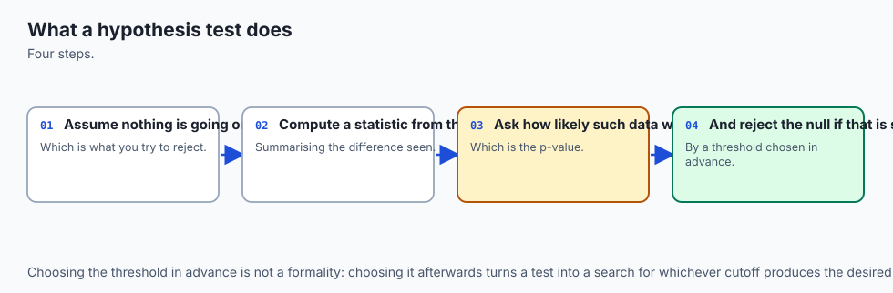
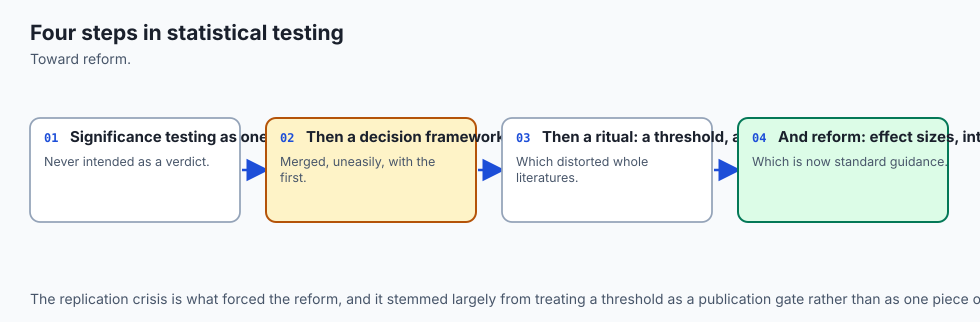
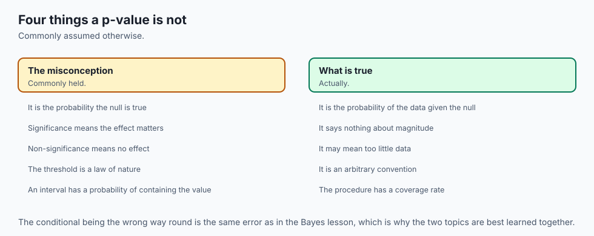
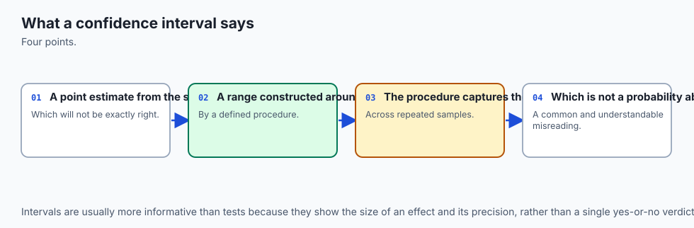
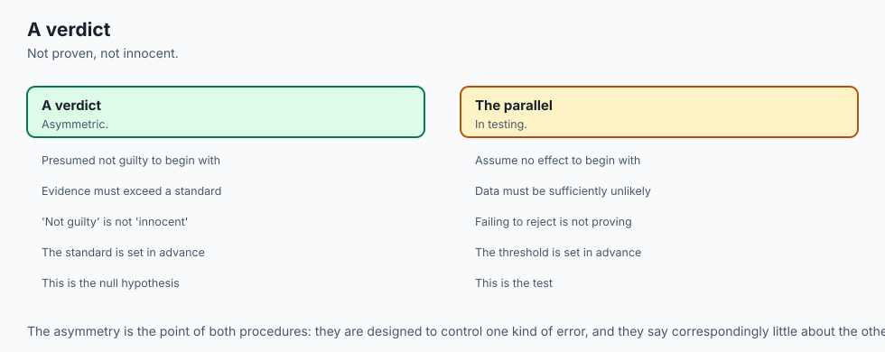
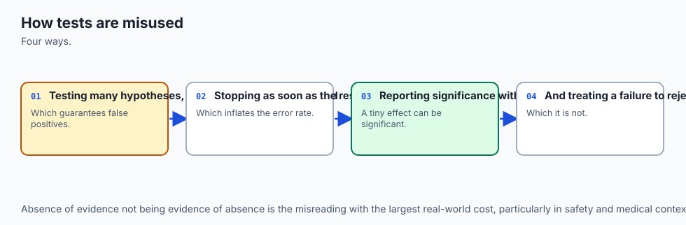
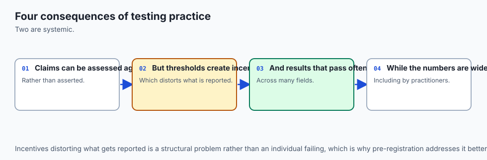
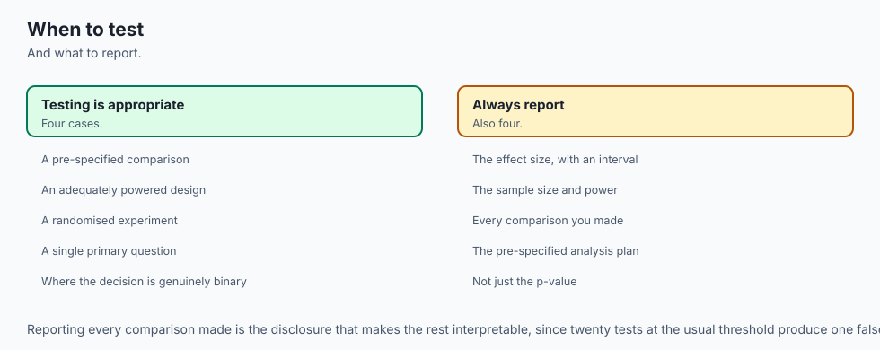

## Why this matters

A team ships a model update. Before rolling it out, they check twenty metrics against the previous version: accuracy, latency at three percentiles, five different error-category rates, click-through on four surfaces, and a handful of others. Nineteen come back unremarkable. One — a secondary error-category rate — comes back with p = 0.031. Below the team's usual alpha = 0.05 threshold. They write it up as a real finding, ship the change, and move on.

Nobody cheated. Every one of those twenty tests was computed correctly, on real data, with an honest formula. And the finding is very likely noise.

Here is the arithmetic nobody ran before writing the slide. If all twenty metrics are actually unaffected by the change — the true null hypothesis, in every case — and each test is run at alpha = 0.05, then the probability that *at least one* of the twenty comes back "significant" purely by chance is not 5%. It is

```text
1 - (1 - 0.05)^20 = 1 - 0.95^20 = 0.6415
```

A 64% chance that pure noise hands you at least one p < 0.05 result somewhere in the twenty. Not a fluke, not bad luck — the expected behavior of the procedure. Checking twenty things at 5% each is not the same claim as checking one thing at 5%, and treating it as if it were is the single most common way "we found something" claims fail to replicate. This lesson derives that 64% by hand, confirms it by simulation, and then shows a correction (Bonferroni: divide alpha by the number of tests) that pulls the real risk back down to about 4.9% — almost exactly where the team thought they already were.

That failure sits on top of a second, deeper one, and the two compound. A p-value answers a much narrower question than almost anyone treats it as answering. It is **P(data at least this extreme | the null hypothesis is true)** — not P(the null hypothesis is true | this data), and not P(the effect is real). Reading it as either of the second two is Day 115's base-rate error in new clothes: it discards everything you knew *before* looking at the data, the same way ignoring a low base rate turns a good diagnostic test into a bad decision.

A p-value of 0.031 does not mean "there's a 96.9% chance this effect is real." It means "if there were truly no effect, data this extreme would show up about 3.1% of the time by chance alone" — a very different, much more limited claim, and one that says nothing at all about how likely the null was to be true in the first place.

The throughline for the whole day: **a p-value answers a far narrower question than almost everyone thinks, and a confidence interval is usually the better thing to report.** By the end you will be able to build both from scratch, know exactly what each one promises, and — just as importantly — know the two ways (peeking, multiple comparisons) that this machinery gets misused in ordinary practice, without anyone involved doing anything that feels like cheating.

For an AI practitioner, this is not academic. Day 117 computed that a model scoring 91.4% on a 500-example test set carries a standard error of about 1.25 percentage points. A leaderboard entry claiming +0.2 points of improvement after trying twenty different prompt configurations is making a claim today's lesson shows the data cannot support — twice over. The 0.2-point gap sits well inside one standard error on its own, and trying twenty configurations and reporting the best one is exactly the multiple-comparisons problem this lesson opens with, dressed up as model selection.

## The idea in plain language




Plain language first: a hypothesis test is a formal way of asking "could this have happened by chance?" You assume, for the sake of argument, that nothing interesting is going on — the "null" hypothesis, usually "no difference" or "no effect." Then you ask: if that assumption were true, how surprising would the data I actually observed be? If it would be very surprising — if data this extreme would almost never happen under the "nothing interesting" assumption — you have evidence against that assumption. Not proof. Evidence.

A confidence interval asks a related but different question: instead of "is the true value equal to this one specific number (the null)?", it asks "what range of values is consistent with the data I observed?" It hands you a range instead of a yes/no, and the range carries more information — not just whether zero (or whatever the null value is) is plausible, but how big the effect might plausibly be.

Precise technical treatment: given a null hypothesis H0 and an observed test statistic computed from data, the p-value is P(a test statistic at least this extreme | H0 is true), computed from the statistic's *sampling distribution under the null* — the same sampling-distribution machinery Day 117 built from scratch. A (1 - alpha) confidence interval for a parameter is a range [L, U], built from the data by a specific procedure, such that if you repeated the whole data-collection-and-interval-building procedure many times, (1 - alpha) of the resulting intervals would contain the true parameter value. Neither promise is about the one dataset in front of you specifically — both are promises about the *procedure*, verified by simulating it many times.

The sustained analogy for today: think of a courtroom. The null hypothesis is "not guilty" — the default assumption, held until the evidence overwhelms it. The p-value is like asking "if the defendant really were innocent, how likely is it that we'd see evidence this damning by pure coincidence?" A tiny p-value is like extremely damning evidence: not proof of guilt, but a case that is hard to explain under the innocence assumption. Alpha is the threshold the jury has pre-agreed to convict at — the burden of proof, fixed *before* the trial starts, not adjusted afterward once everyone has seen how the evidence turned out.

And peeking — checking the evidence partway through the trial and stopping the moment it looks convincing — is exactly the mistrial-inducing behavior a real court forbids for the same statistical reason this lesson forbids it in an experiment: the "burden of proof" promise only holds if you commit to a stopping rule in advance and follow it, win or lose.

## Historical background



The modern hypothesis test traces to two competing lineages that were not, originally, the same idea, even though textbooks now blend them into one recipe. Ronald Fisher, working at Rothamsted Experimental Station in England in the 1920s, introduced the p-value as a measure of evidence against a null hypothesis — a continuous number describing how surprising the data was, not a binary accept/reject decision. Fisher's 1925 book *Statistical Methods for Research Workers* popularized the 0.05 threshold, somewhat by convenience: it was a round number that flagged roughly one result in twenty as noteworthy, not a value derived from any deep principle.

Jerzy Neyman and Egon Pearson, working through the late 1920s and 1930s, built a different framework: a formal decision procedure with two named error types (rejecting a true null; failing to reject a false one), a pre-specified alpha, and — crucially — the concept of statistical *power*, the probability of correctly detecting a real effect. Neyman and Pearson's framework is where confidence intervals also originate; Neyman's 1937 paper laid out the "coverage" interpretation this lesson's centerpiece exercise measures directly.

Fisher and Neyman disagreed, publicly and for decades, about what a p-value even meant and whether Neyman-Pearson's decision-theoretic framing was appropriate for scientific inference at all. The hybrid procedure taught in most introductory courses today — pick alpha in advance, compute a p-value, reject if p < alpha, and interpret the p-value's exact size as if it were still Fisherian evidence — is a blend of both camps that neither fully endorsed, and much of the modern replication crisis in psychology and biomedicine traces directly to practices (peeking, multiple comparisons, treating p just under 0.05 as categorically different from p just over it) that both Fisher and Neyman would likely have recognized as misuses of their own frameworks.

## What it is — and what it is not



A hypothesis test **is** a formal procedure for quantifying how surprising observed data would be under a specific, named null hypothesis, using the sampling distribution of a chosen statistic. A confidence interval **is** a range built by a procedure whose long-run coverage rate is known and checkable by simulation, as this lesson's centerpiece exercise does directly.

A hypothesis test is **not** a measure of how large or important an effect is — a trivially small effect can be "significant" given enough data, which this lesson demonstrates directly in the effect-size-versus-n exercise. A p-value is **not** the probability the null hypothesis is true, and it is **not** the probability that the result happened "by chance" in some vague overall sense — it is a conditional probability computed under a specific assumption, and it says nothing about how likely that assumption was to begin with. Failing to reject a null hypothesis is **not** evidence that the null is true — "we found nothing" without a stated power is not evidence of absence, because the test might simply never have had a realistic chance to detect the effect that was actually there.

And a 95% confidence interval is **not** "a 95% probability the true value lies in this specific interval" — the true value is a fixed number; a fixed number is either in a fixed interval or it is not, with probability 1 or 0, and it is the *procedure* that has the 95% guarantee, verified by building thousands of intervals and counting how many actually contain the truth.

## Why it was created and what problems it solves

Before hypothesis testing was formalized, "is this difference real?" was answered by eyeballing numbers, and the field had no shared standard for how much evidence was enough. Two researchers looking at the same modest difference between two groups could reach opposite conclusions with no way to adjudicate between them. Hypothesis testing solves that by fixing the rules of evidence *in advance*: name the null, name alpha, compute the statistic's distribution under the null, and let the pre-agreed threshold — not post-hoc judgment — decide.

Confidence intervals solve an adjacent but different problem: a hypothesis test's yes/no answer throws away information a range preserves. Two experiments can both "reject the null" at alpha = 0.05 while telling completely different stories — one with a tiny, barely-detectable effect measured very precisely, another with a huge effect measured sloppily. The p-value alone cannot distinguish them; the confidence interval's width and location can, which is why modern reporting standards in most quantitative fields now require an interval alongside (or instead of) a bare p-value.

## How it works



### The mechanics: assume the null, derive the distribution, ask how extreme

Every hypothesis test in this lesson follows the same three steps, and Day 117's sampling-distribution machinery does all the real work:

1. **State a null hypothesis** about a population parameter — usually that two group means are equal, or that a single mean equals some fixed value.
2. **Derive the sampling distribution of a test statistic, assuming the null is true.** For a two-sample comparison of means with reasonably large samples, the difference in sample means is approximately Normal (by the central limit theorem, Day 117), centered at zero under the null, with a standard error computable from each sample's own variance: `SE = sqrt(var_a/n_a + var_b/n_b)`.
3. **Ask how extreme the observed statistic is under that distribution.** Standardize it into a z-score, `z = (observed_difference - 0) / SE`, and read off the probability of seeing something at least that extreme.

That last step needs the standard normal cumulative distribution function, `phi(z) = P(Z <= z)` for a standard normal Z. Without `scipy.stats`, this lesson builds it from `math.erf`:

```text
phi(z) = 0.5 * (1 + erf(z / sqrt(2)))
```

`math.erf` is a standard-library function computing the error function — a well-studied special function with a closed relationship to the normal CDF — so no statistical package is needed for this piece at all. The two-sided p-value for a z-statistic is then `2 * (1 - phi(abs(z)))`: the combined probability mass in both tails at least as extreme as what was observed, doubled because "different in either direction" is usually the question being asked. On a fixed pair of ten-observation samples in the lab (`examples/01_two_sample_z_test.py`), this hand-built machinery gave z = -5.6867, p = 1.30e-08 — and an independent computation using only the standard library's `statistics` module for the means and variances landed on the identical value to nine decimal places, because both are exact arithmetic on the same numbers.

### The p-value, stated precisely, and its inversion

Say it once more, precisely, because the imprecise version is where nearly every misuse starts: **the p-value is P(data at least this extreme | the null hypothesis is true).** It is not P(the null hypothesis is true | this data) — that would require Bayes' theorem (Day 115) and a prior probability that the null was true in the first place, which a p-value never uses and never supplies. Confusing the two is exactly the diagnostic-test base-rate error from Day 115, restated: a positive test result (small p-value) does not directly tell you P(disease | positive) without folding in how common the disease was beforehand; a small p-value does not directly tell you P(real effect | small p) without folding in how plausible the effect was beforehand. Neither shortcut is available from the number alone.

### Alpha, Type I and Type II errors, and power

Four possibilities exist whenever a test is run against reality, and naming all four is the whole discipline of thinking about error rates honestly:

| | H0 actually true | H0 actually false |
| --- | --- | --- |
| Test rejects H0 | Type I error (false positive), rate = alpha | Correct rejection, rate = power |
| Test fails to reject H0 | Correct non-rejection, rate = 1 - alpha | Type II error (false negative), rate = beta |

Alpha is chosen in advance — it is the Type I error rate the test-designer is willing to tolerate, the courtroom's pre-agreed burden of proof. Power (1 - beta) is the probability of correctly detecting a real effect of some *specific* size, and it depends jointly on three things: the true effect size (bigger effects are easier to detect), the sample size (more data narrows the standard error and sharpens the test), and alpha itself (a stricter threshold buys fewer false positives at the cost of also catching fewer true effects).

This lesson's lab computes power directly at several sample sizes and effect sizes and confirms it rises monotonically with both — at effect = 2.8 and n = 100 per group (sigma = 12.7, alpha = 0.05), the closed-form power formula gives 0.3444, and a direct simulation of the test running 3,000 times under that true effect measured 0.3460, agreeing to within 0.0016.

The practical consequence: "we ran the test and found nothing" is not, by itself, evidence that there is nothing to find. A test with 34% power (as in the configuration above) will fail to detect a real effect of that size roughly two times out of three, purely from being underpowered — not because the effect isn't there. Reporting a null result without reporting the power to detect the effect size that would have mattered is reporting half a sentence.

### Confidence intervals, interpreted correctly

Build a (1 - alpha) confidence interval for a mean the standard way: `sample_mean +/- z_(alpha/2) * standard_error`, where the standard error is `sample_std / sqrt(n)` (Day 117) and `z_(alpha/2)` is the critical value cutting off alpha/2 in each tail of the standard normal — found here by bisecting `phi` itself, since there is no closed form for its inverse in terms of `erf`. For alpha = 0.05 this bisection converges to z = 1.959964, matching the textbook constant to six decimal places.

Here is the sentence to get exactly right: a 95% confidence interval does **not** mean "there is a 95% probability the true parameter lies in this specific interval." The true population mean is a fixed, unknown number. A specific interval computed from one dataset either contains that fixed number or it does not — there is no probability left to assign once both are fixed. What "95%" describes is the **procedure**: if you repeated the entire process — draw a fresh sample, compute a fresh interval — many times, about 95% of the resulting intervals would contain the true value.

That claim is checkable, and this lesson's lab checks it rather than asserting it. Build 10,000 nominal-95% confidence intervals from independent samples of a population with a *known* true mean (50.3, chosen so the check has a ground truth to grade against), and count how many actually contain it. The measured result: 9,509 of 10,000, or 95.09% — within three standard errors (0.00218 each) of the nominal 95%. That measured number, not a memorized sentence, is the actual content of "95% confidence."


One wrinkle worth carrying forward honestly: at a small sample size, this interval's measured coverage undershoots 95% by roughly a point, because the interval above uses a *normal* critical value rather than the (wider) *t*-distribution critical value that small-sample theory calls for — a real, measurable gap that gets smaller as n grows and is essentially gone by n = 300, which is why this lesson's own coverage measurement uses that sample size.

### The duality: same information, viewed two ways

A two-sided hypothesis test at level alpha and a (1 - alpha) confidence interval are not two unrelated tools — they are the same underlying calculation, viewed from two directions, and they agree *exactly*: a two-sided test rejects a null value precisely when the (1 - alpha) confidence interval excludes that value. Checked across 2,000 simulated datasets of varying sample size, with a mix of null-true and shifted populations, this lesson's lab found zero disagreements between "the test rejected" and "the interval excluded the null value" — not approximately zero, exactly zero, because both are computed from the identical standardized statistic.

Given that equivalence, why report the interval instead of just the test? Because the interval carries strictly more information. Two datasets can both "reject the null at alpha = 0.05" while telling very different stories — a narrow interval far from the null value describes a precisely-measured, unambiguous effect; a wide interval that barely excludes the null describes an effect whose size remains genuinely uncertain, even though technically "significant." The test's yes/no answer cannot distinguish those two situations. The interval can, at a glance.

### The permutation test, built from scratch

Every test so far assumed something about the shape of the sampling distribution — usually approximate normality, which the central limit theorem justifies for reasonably large samples. A permutation test needs no such assumption, and building it from scratch makes the logic of "how surprising is this?" completely concrete rather than formula-shaped.

The idea: under the null hypothesis, the group label (which observations came from group A versus group B) carries no real information — it is exchangeable with any other way of splitting the same pooled data into two groups of the same sizes. So: pool both samples together, shuffle the labels, split the shuffled pool back into two groups of the original sizes, and recompute the difference in means. Repeat thousands of times. The two-sided p-value is the fraction of shuffles that produced a difference at least as extreme (in absolute value) as the one actually observed — including the real, unshuffled arrangement itself in that count, so the p-value can never read as exactly zero: `p = (count_at_least_as_extreme + 1) / (n_shuffles + 1)`.

This lesson's lab runs the comparison in two settings. At a moderate sample size (n = 60 per group) drawn from roughly normal populations, the permutation test and the z-test agree closely: p = 0.1672 (z-test) versus p = 0.1602 (permutation), a difference of 0.0070. At a small sample size (n = 8 per group) drawn from a heavily right-skewed population, the two diverge more: p = 0.3148 versus p = 0.4129, a difference of 0.0981 — nearly fourteen times larger. Neither number is "wrong"; the permutation test needed no assumption about the population's shape to remain valid in either case, while the z-test's normal approximation is doing real work in the second case that it does not need to do in the first.

### Effect size versus significance

With enough data, an arbitrarily small, practically meaningless difference can become "statistically significant" — significance is a statement about whether chance can be ruled out, not about whether the effect is large enough to matter. This lesson's lab holds a relative difference fixed at 0.5% of a population mean of 50.3 (an absolute effect of 0.2515, standardized as Cohen's d of about 0.0198 — a tiny effect by any conventional yardstick) and tests it at two sample sizes. At n = 30 per group, p = 0.5675: not remotely significant. At n = 100,000 per group, p rounds to 0.000000: overwhelmingly significant. The underlying effect — the actual gap between the two populations — never changed by a hair between the two runs. Only the amount of data collected around it did.

### Peeking: the most common real sin

Every calculation above assumes the sample size was fixed *before* the data was collected and the test was run exactly once. Checking a running p-value as data trickles in — a live A/B test dashboard, a monitoring pipeline — and stopping the instant it dips below 0.05 breaks that assumption, and the real false-positive rate under repeated peeking is far higher than the nominal alpha, even though every individual p-value along the way was computed correctly.

This lesson's lab simulates it directly. Under a population where the null hypothesis is genuinely true the entire time (mean exactly zero), 4,000 independent "experiments" each check a one-sample test after every batch of 10 new observations, for up to five looks (50 observations total), and stop the moment p < 0.05. Result: a false-positive rate of 0.1888 — nearly four times the nominal alpha of 0.05. A separate, honest control — testing once, at the final fixed sample size of 50, with no early stopping — gave 0.0493, essentially exactly the nominal rate. Nothing about any individual p-value calculation was wrong in either version. The procedure of "keep checking and stop when it looks good" is a different, uncontrolled experiment wearing the clothes of a controlled one.

### Multiple comparisons and Bonferroni

The opening of this lesson derived it, and it is worth restating in the "How it works" section because the fix belongs right beside the failure: checking m independent hypotheses, each at alpha, gives a family-wise false-positive rate of `1 - (1 - alpha)^m` — not alpha. For m = 20 tests at alpha = 0.05, that is 0.6415, confirmed in this lesson's lab by simulating 20,000 families of 20 independent tests under a true null and measuring 0.6435. The Bonferroni correction is the simplest fix: use `alpha / m` as the per-test threshold instead of alpha. Simulated under the same setup, that correction pulls the family-wise rate down to 0.0515, close to its analytic target of `1 - (1 - alpha/m)^m = 0.0488`.

It is worth saying plainly, because it is easy to hear as an accusation and it is not one: **most p-hacking is exactly this mechanism, run silently, rather than fraud.** A team that checks twenty metrics, an analyst who tries several ways of slicing the data before finding one that "works," a hyperparameter search that keeps the best of many random seeds and reports only that one — none of these require any bad intent. They require only running many implicit or explicit tests and not correcting for having done so. The fix is not vigilance against dishonesty; it is building the correction into the pipeline before the first metric is checked.

## An everyday analogy



Return to the courtroom, carried through completely now. The null hypothesis is the presumption of innocence — the default the system holds until overwhelmed by evidence. The p-value is the answer to "if the defendant really were innocent, how likely is evidence this damning to appear by coincidence?" — small values mean the innocence story requires an unlikely coincidence to explain what was found.

Alpha is the pre-agreed burden of proof, fixed before the trial starts — "beyond reasonable doubt," not "beyond whatever doubt feels right once we've seen how compelling the evidence turned out to be." A Type I error is convicting an innocent person; a Type II error is acquitting a guilty one; power is the court system's ability to actually catch the guilty, which depends on how strong the available evidence is (effect size), how much evidence was gathered (sample size), and how high the burden of proof was set (alpha) — all three together, not any one alone.

A confidence interval is like a range a forensic expert gives instead of a single number: not "the suspect is exactly 5'11"" but "the footprint is consistent with a height of 5'9" to 6'1"," built from a measurement procedure whose track record of bracketing the true height, across many past cases measured the same way, is known and can be checked.

Peeking is the mistrial the courtroom explicitly forbids: a jury that gets updated on the evidence continuously and can call a stop the moment it feels convinced is not running the same procedure as one that hears all the evidence and rules once — and the courtroom's ban on that behavior exists for precisely the reason this lesson's peeking exercise measures numerically. And multiple comparisons is a prosecutor who charges twenty separate, weak counts against a defendant, hoping that at least one sticks by chance even if the defendant is innocent of all twenty — which is why a rigorous system requires a higher combined bar, not twenty independent shots at the same 5% threshold.

## Examples in practice



**A/B testing a feature change.** Two groups, control and treatment, each measuring a conversion rate. A two-sample test compares the rates; the confidence interval on the difference tells you not just whether it's significant but how large the improvement plausibly is — the number a business decision actually needs.

**Comparing two model checkpoints on a held-out set.** Exactly Day 117's evaluation-margin calculation, extended: compute the standard error of each accuracy, run a two-sample test on the difference, and report the confidence interval on the improvement rather than a bare "Model B wins."

**A/A testing as a sanity check.** Running the exact same experiment against two randomly split groups that received *identical* treatment should, by construction, find nothing at alpha's nominal rate. Teams that run A/A tests and find "significant" differences more often than alpha predicts have usually discovered a bug in their randomization or their metric pipeline, not a real effect — a genuinely useful diagnostic use of this lesson's machinery.

**Clinical and public-health trials.** The historical home of this machinery, and the domain where power calculations are taken most seriously precisely because an underpowered trial that "finds nothing" can delay a real treatment for years, and an overpowered, over-tested trial that checks dozens of secondary endpoints without correction is exactly this lesson's multiple-comparisons problem with human costs attached.

**Monitoring dashboards and automated alerting.** Any system that checks a metric repeatedly against a threshold and fires an alert when it crosses is running a peeking experiment by default, whether or not anyone designed it as one — this lesson's peeking exercise is the honest description of what such a dashboard's implicit false-positive rate actually is.

## Implications: security, privacy, performance, scalability, and cost



**Security and fraud detection.** A fraud-detection system checking many transaction features simultaneously against thresholds is running a multiple-comparisons problem at production scale; without correction, the false-positive rate on legitimate transactions compounds with every additional feature checked, directly increasing customer friction and support cost.

**Privacy.** Differential privacy mechanisms deliberately add calibrated noise to query results specifically to control the confidence an analyst can have in any single answer — a mechanism-design analogue of the standard error this lesson builds by hand: privacy budgets are, in effect, a controlled trade against statistical certainty.

**Performance and cost.** Running 10,000 simulated confidence intervals or 20,000 simulated hypothesis-test families, as this lesson's lab does, is computationally cheap — well under a second with vectorized NumPy operations — but a permutation test with a large n and many permutations, or a Bonferroni-corrected pipeline checking thousands of metrics per deployment, can become a genuine compute cost at production scale, and that cost buys real protection against false positives that would otherwise cost more in wasted engineering effort chasing noise.

**Scalability of the decision process, not just the compute.** The multiple-comparisons problem gets *worse*, not better, as a system scales and more metrics get instrumented — an organization that goes from monitoring 5 metrics to 500 without ever revisiting its significance threshold is running an increasingly severe version of this lesson's opening failure, invisibly, at growing scale.

**Cost of a wrong decision, asymmetrically.** Type I and Type II errors rarely cost the same amount in a real business or safety context — shipping a broken feature because of a false positive and failing to ship a genuine improvement because of a false negative are different mistakes with different price tags, which is why alpha and the target power are business or safety decisions, not purely statistical ones, and should be set with that asymmetry in mind rather than defaulting unreflectively to 0.05 and "whatever power falls out."

## Alternatives: free, open source, and commercial

**`math.erf` (standard library, free).** What this lesson builds directly on. No installation, no dependency, exact for any normal-distribution calculation this lesson needs. Choose it when you want to understand or teach the mechanics, or when a dependency-free implementation matters more than convenience. Used throughout this lesson's lab; every number attributed to it here was actually computed with it.

**`statistics` (standard library, free).** Supplies `mean`, `variance`, and friends — used in this lesson's lab as the independent "hand computation" that the from-scratch z-test is checked against. No hypothesis-testing functions of its own; it supplies the ingredients, not the test.

**`scipy.stats` (free, open source, BSD licence).** The standard choice for production statistical work in Python. `scipy.stats.ttest_ind(a, b, equal_var=False)` runs Welch's t-test — the small-sample-correct cousin of this lesson's large-sample z-test, using a t rather than a normal reference distribution and Welch-Satterthwaite degrees of freedom, which matters more the smaller and more unequal-variance the two samples are. `equal_var=False` is the sane default for `ttest_ind`: it costs almost nothing when the true variances are equal and protects you when they are not, which is nearly always the safer assumption with real data. `scipy.stats.norm.interval` builds a confidence interval directly. **Not installed in this lab's environment; no output from it is reproduced anywhere in this lesson or its lab** — everything above attributed to `scipy.stats` is described from its public documentation, not run here.

**`statsmodels` (free, open source, BSD licence).** `statsmodels.stats.multitest.multipletests` implements Bonferroni, Holm's step-down procedure, and false-discovery-rate corrections (Benjamini-Hochberg) in one call, letting you swap correction methods without rewriting the underlying logic — useful once a pipeline is checking dozens or hundreds of metrics and Bonferroni's conservatism starts costing real power. Also **not installed here; not run.**

**Commercial A/B-testing platforms** (Optimizely, Statsig, and similar). Layer sequential-testing methods (which control the error rate under genuine repeated peeking, unlike the naive procedure this lesson's lab measures failing) and dashboarding on top of this same underlying machinery. Worth choosing when an organization needs peeking to be *safe by design* rather than forbidden by policy — the sequential methods they implement are a real, principled answer to the exact problem exercise 8 demonstrates, not a workaround for it.

## Comparison with related concepts

| Concept | What it answers | What it does not answer |
| --- | --- | --- |
| Hypothesis test (p-value) | How surprising is this data under a specific null? | Whether the null is true; how large the effect is |
| Confidence interval | What range of values is consistent with this data? | Whether any single value in the range is "the" truth |
| Effect size (Cohen's d, etc.) | How large is the difference, in standardized units? | Whether the difference is distinguishable from chance |
| Statistical power | How likely is this test to detect a real effect of a given size? | Whether a specific completed test found a real effect |
| Bayesian posterior probability | P(hypothesis \| data), given a stated prior | Anything, without first committing to a prior |

The last row is worth dwelling on because it is where most of the confusion this lesson corrects actually comes from. A Bayesian posterior probability genuinely does answer "how likely is the null, given the data" — but it requires stating a prior probability first, exactly the ingredient Day 115's Bayes' theorem needs and a plain p-value does not have. People routinely read a frequentist p-value as if it were a Bayesian posterior for free, without ever supplying that prior. It is not free; the prior has to come from somewhere, and a p-value alone never supplies one.

## When to use it — and when not to



**Use a hypothesis test** when the question genuinely is binary — does this A/B variant beat the control at all, does this drug work better than placebo — and the decision that follows is itself binary (ship or don't, approve or don't). **Prefer reporting a confidence interval alongside, or instead** whenever the follow-up question is "how much," which is nearly always, in practice — a stakeholder deciding whether a 0.3-point accuracy gain justifies a migration cost needs the plausible range of that gain, not just a checkmark.

**Use a permutation test** when you cannot trust the normal approximation — small samples, visibly skewed data, an unusual statistic with no known sampling distribution (a trimmed mean, a specific quantile, a custom business metric) — and you can afford the computational cost of thousands of shuffles.

**Use the exact binomial or exact Fisher-style calculations** rather than a normal approximation when sample sizes are small and the outcome is binary (Day 117's binomial standard error is the entry point; exact methods go further at small n, where the normal approximation this lesson otherwise relies on starts to fray).

**Do not run a test at all, and report an interval or a raw estimate instead,** when there is no real decision riding on a yes/no answer — significance testing invented for a binary "ship or don't" question gets misapplied constantly to purely descriptive reporting where it adds a false sense of rigor without adding real information.

**Do not treat "not significant" as "no effect,"** ever, without checking or at least acknowledging the test's power — an underpowered null result and a genuinely confirmed absence of effect look identical in a bare p-value and are very different claims.

**Do not check a metric repeatedly and stop at the first significant result**, and **do not check many metrics at alpha without a family-wise correction** — the two failures this lesson opened with, and the two most common real-world misuses of everything else in this lesson.

## The AI connection

- **A difference without an interval is not a finding**, which is the discipline this lesson
  installs.
- **Statistical significance is not practical importance**, and at large sample sizes the two
  come apart entirely.
- **Every model comparison is a hypothesis test**, whether or not it is framed as one.
- **Multiple comparisons inflate false positives**, which is exactly what hyperparameter
  search does.
- **Confidence intervals communicate more than p-values**, which is why modern reporting
  prefers them.

## Knowledge check

1. A p-value of 0.03 for a two-sample test most precisely means:
   - A) There is a 97% chance the observed difference is real
   - B) There is a 3% chance the null hypothesis is true
   - C) If the null hypothesis were true, data at least this extreme would occur about 3% of the time
   - D) The effect size is 0.03 standard deviations

2. A researcher checks 15 independent metrics at alpha = 0.05 each, with no correction, and all 15 true nulls are actually true. The probability at least one comes back "significant" is closest to:
   - A) 0.05
   - B) 0.54
   - C) 0.75
   - D) 0.15

3. What does "95% confidence" in a 95% confidence interval actually describe, according to this lesson's coverage measurement?
   - A) The probability the true parameter lies in this specific interval
   - B) The fraction of intervals built this way, across repeated sampling, that contain the true parameter
   - C) The probability the null hypothesis is false
   - D) The reliability of the measuring instrument used to collect the data

4. A two-sided test at alpha = 0.05 and a 95% confidence interval, built from the same data:
   - A) Are unrelated procedures that can disagree
   - B) Always agree: the test rejects exactly when the interval excludes the null value
   - C) Agree only when the sample size is large
   - D) Agree only for one-sample tests, not two-sample tests

5. A study finds a statistically significant (p = 0.001) but very small effect size, using an enormous sample size. The most accurate conclusion is:
   - A) The effect is definitely important in practice
   - B) The p-value is wrong because the effect is too small
   - C) The result is strong evidence the effect is non-zero, but says nothing on its own about whether it is large enough to matter
   - D) A small p-value always implies a large effect

6. A team checks a live experiment's p-value every day and stops the first time it drops below 0.05. Compared to a fixed-sample-size test run once, this procedure's true false-positive rate is:
   - A) The same, since each day's p-value is computed correctly
   - B) Lower, because more looks means more chances to correct early mistakes
   - C) Higher, often substantially, because repeated looking inflates the real error rate beyond the nominal alpha
   - D) Undefined, because p-values cannot be computed on partial data

7. A permutation test's key advantage over a z-test is:
   - A) It always produces a smaller p-value
   - B) It requires no assumption about the shape of the population's distribution
   - C) It never requires random number generation
   - D) It is mathematically identical to the z-test in every case

8. Statistical power depends jointly on:
   - A) Only the sample size
   - B) Only the significance level (alpha)
   - C) The true effect size, the sample size, and alpha, together
   - D) Only whether the null hypothesis happens to be true

## Hands-on exercise

Work through the lab **"Tests You Can Defend"** at `labs/sections/math-statistics-and-data/day-118-hypothesis-tests-and-confidence-intervals/`. Nine exercises, each computed two ways and checked for agreement — exact where a formula exists, seeded simulation otherwise, with every tolerance derived from a standard error rather than guessed.

Start by reading `starter/00_brief.md`, then fill in `starter/inference.py` function by function, checking your progress with:

```bash
cd labs/sections/math-statistics-and-data/day-118-hypothesis-tests-and-confidence-intervals
python3 -m venv .venv
.venv/bin/pip install -r requirements/requirements.txt
.venv/bin/pytest starter -q
```

### Expected output

On an untouched checkout, the starter suite reports:

```text
1 passed, 15 skipped
```

A skip means "not attempted yet" — every function in `starter/inference.py` currently ends with `return None`. As you complete each one, its tests turn from skipped to passed; a wrong implementation fails with your computed value printed next to the correct one, never silently.

Once you have completed all nine exercises, the reference implementation in `examples/` demonstrates the full set of claims this lesson makes. Running its centerpiece script prints:

```text
True population mean: 50.3
Nominal confidence level: 95%
Intervals built: 10000
Measured coverage: 0.9509
Standard error of the measured coverage: 0.00218
3-SE tolerance band: [0.9435, 0.9565]
OK: measured coverage is within three standard errors of the nominal 95%.
```

and the multiple-comparisons script prints:

```text
P(at least one false positive among 20 independent alpha=0.05 tests) = 1 - (1-0.05)^20 = 0.6415
Simulated over 20000 families: 0.6435
Bonferroni-corrected per-test alpha: 0.05/20 = 0.0025
Simulated family-wise rate WITH Bonferroni: 0.0515
Analytic Bonferroni family-wise rate: 0.0488
```

### Validate your work

```bash
bash tests/run_tests.sh
echo "exit=$?"
```

Should print `32 checks, 0 failure(s).` and exit 0. Also run `.venv/bin/pytest examples -q -p no:cacheprovider` (expect `22 passed`) and `.venv/bin/pytest starter -q -p no:cacheprovider` against your own completed work.

### Troubleshooting

See `troubleshooting.md` in the lab directory for the full list, including the small-n coverage shortfall, the permutation test's "+1" rule, and the import-collision guard the two `conftest.py` files provide. If a script reports `ModuleNotFoundError: No module named 'inference'`, you ran it from the wrong directory — the reference scripts import from beside themselves, so run them from inside `examples/`.

### Common mistakes

Pooling the two samples' variances instead of using each one's own in the z-test; using a normal critical value's intuition where a small sample really calls for a t-distribution's wider one; dropping the "+1" in the permutation test's p-value formula, which can otherwise read as an impossible exactly-zero p-value; and re-testing only the newest batch of data at each peek instead of the cumulative total, which produces a different and less clearly illustrative version of the peeking failure than the one this lesson describes. The instructor solution's common-mistakes section covers all of these with the specific symptom each one produces.

## Practice assignment

Using this lesson's lab as a foundation, extend `examples/inference.py` with a one-sided test variant: `one_sample_z_test_one_sided(sample, null_value, direction)`, where `direction` is `"greater"` or `"less"`, returning a p-value that is the *single*-tail probability in the specified direction rather than the two-sided lesson's doubled two-tail probability. Then, on the same fixed pair of samples this lesson's exercise 1 uses, confirm by direct computation that a two-sided test at alpha = 0.05 and a correctly-directed one-sided test at alpha = 0.025 reject on exactly the same datasets — and explain, in your own words, why halving alpha is the correct adjustment rather than an arbitrary one.

Separately, write up — in plain language, as if explaining to a teammate who has not taken this lesson — the difference between "this result is not statistically significant" and "this effect does not exist," using the effect-size-versus-n exercise's own numbers (p = 0.5675 at n=30, p ≈ 0.000000 at n=100,000, identical Cohen's d of 0.0198 at both) as your worked example.

## Extension challenge

Implement the Holm-Bonferroni step-down correction (sort the m p-values ascending, compare the k-th smallest against `alpha / (m - k + 1)`, stop rejecting at the first comparison that fails) and compare it against plain Bonferroni on a simulated family of tests where some nulls are genuinely false. Measure and report both the family-wise error rate and the power (fraction of the true effects each method still detects) for both corrections, across at least three seeds, and state which correction you would recommend for a pipeline that needs to catch real effects without inflating false positives — and why the answer might differ depending on how many of the tested hypotheses are expected to be genuinely false in practice.

## The AI thread

Day 117 computed that a model scoring 91.4% accuracy on a 500-example test set carries a standard error of about 1.25 percentage points. Put today's two lessons directly on top of that number, because both apply to the same sentence a leaderboard might publish: "our latest configuration improved accuracy by 0.2 points." First, the effect-size-versus-significance half: a 0.2-point gap against a 1.25-point standard error sits at about 0.16 standard errors — nowhere near the roughly 2 standard errors a conventional significance threshold would require, so the claim is not statistically supported on its own terms, independent of anything else.

Second, and compounding it, the multiple-comparisons half: if that 0.2-point "win" was the best of twenty different configurations tried — different prompts, different sampling temperatures, different few-shot examples — this lesson's opening derivation applies directly. Twenty independent looks at noise, each with some chance of a spuriously good result, make finding *some* configuration that "beats baseline" by chance close to a coin flip, exactly the 64% figure this lesson opened with.

A leaderboard entry, a fine-tuning run selected as "best of N," and a prompt-engineering sweep are all, statistically, the same procedure as the twenty-metric team from this lesson's first paragraph — and the fix is the same one: report a confidence interval on the improvement, not just a point estimate; correct for the number of configurations actually tried, not just the one that happened to look best; and hold out a genuinely fresh test set before declaring victory on the configuration multiple comparisons handed you. None of that requires distrusting the team that ran the sweep. It requires applying the same arithmetic this lesson just built from scratch to the number their sweep produced.