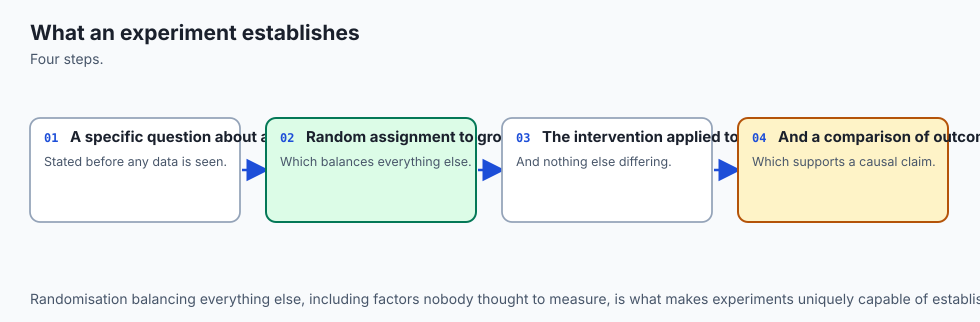
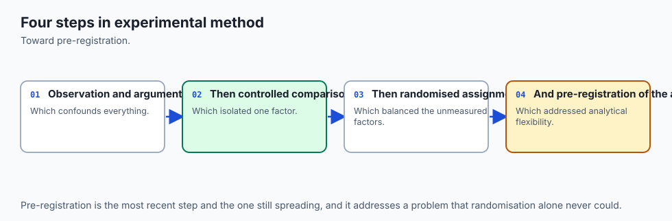
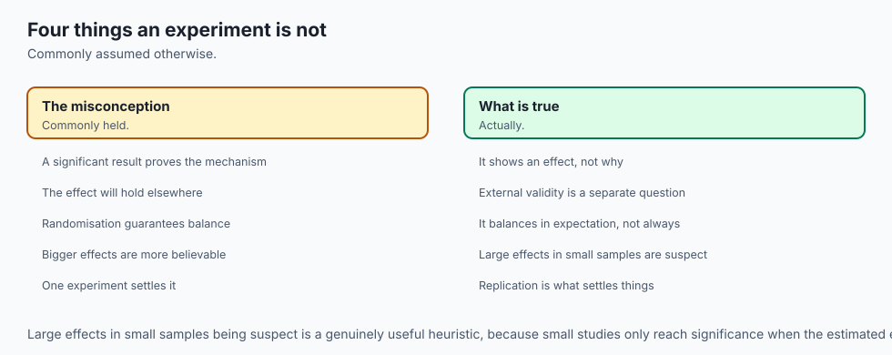
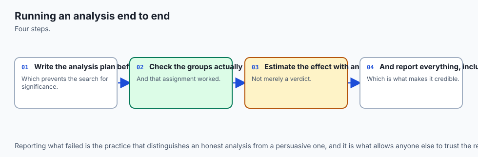
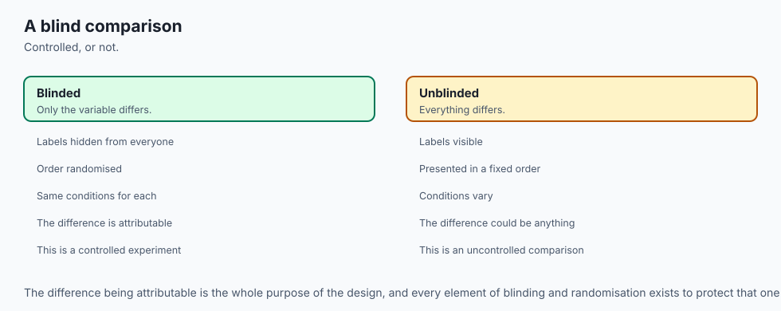
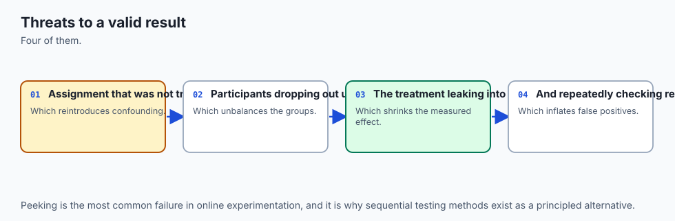
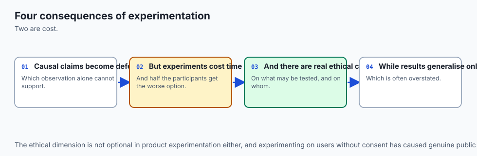
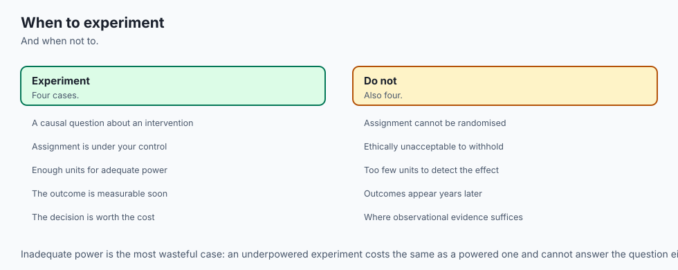

## Why this matters

Here is an experiment that looks entirely respectable. Forty thousand users, twenty thousand per arm. A conversion rate that moved from 10.1% to 11.9% — an 1.8 percentage point lift. A p-value of 0.03. A 95% confidence interval on the difference that excludes zero. Every rule Day 118 taught you says: ship it.

Now here is one more fact about that same experiment. The analyst who ran it looked at seven different metrics before landing on "conversion rate" as the headline, and this is the one that came back significant. Or: the realized split was 52% treatment, 48% control, against a planned 50/50 — nobody checked. Either fact, on its own, is enough to make the entire result evaporate. Not weaken it. Not add a caveat to it. *Evaporate* it — turn it from evidence into noise that happened to look like evidence.

Notice what did not happen in that second paragraph: nothing about the arithmetic was wrong. The p-value was computed correctly. The confidence interval was computed correctly. If you re-ran Day 118's formulas on the same numbers, you would get the same 0.03. The problem is not in the calculation. The problem is in everything the calculation cannot see — how the metric got chosen, whether the two groups were actually comparable, whether the number in the report is the number that was decided on in advance or the number that happened to survive.

This is the sentence to hold onto for the rest of this lesson: **statistical validity is a property of the process that produced the number, not of the number itself.** A p-value cannot certify the process that generated it. It can only certify that, *given* the process worked as assumed, this particular outcome would be unlikely under the null. If that assumption is false — if the metric was chosen after peeking, if the randomization silently broke, if the "significant" segment was found by trying twelve segments — the p-value is still a real number, correctly computed, and it is still evidence of nothing.

Day 118 built the machinery: hypothesis tests, confidence intervals, permutation tests, power, the cost of testing many things at once, the cost of peeking. This lesson does not re-derive any of that.

It assumes you have it, hands you one complete experiment — actually two, generated by the same seeded script and shipped as CSV files you will load and analyze directly — and walks the *process* end to end: the question, the metric chosen in advance, the plan written down before the data existed, the check on whether the randomization itself can be trusted, a careful look at the data before testing it, the test and the interval together, the effect size in real units, a guardrail that can veto a good-looking result, a segment breakdown that generates hypotheses rather than confirming them, and a verdict in plain language.

One of the two experiments you will analyze is exactly as clean as it looks. The other looks just as clean and is not — and by the end of this lesson you will have built the two checks that catch it, on real numbers, not a hypothetical.

## The idea in plain language



Imagine handing two different people the exact same spreadsheet of raw experiment data and asking each of them, independently, to tell you whether the change should ship. If they can follow different, undocumented paths to get there — pick whichever metric looks best, stop collecting data whenever the number looks good, slice by whatever segment tells the story they want — they can each arrive at a *different, defensible-looking* answer from the *same data*. That is not a hypothetical failure mode. It is the default outcome of analyzing an experiment without a process, because there are dozens of small, individually reasonable-looking decisions along the way, and each one nudges the final number.

The fix is not more statistics. The fix is a process with no wiggle room in it: decide the metric before you see the data, decide the sample size and the stopping rule before you see the data, check that the randomization actually worked before you trust anything computed from it, and treat segment findings as things to investigate later, never as things that changed your mind today. Everything downstream of those decisions can use exactly the machinery Day 118 built. The discipline is entirely in what happens *before* you touch the primary test.

## Historical background



The idea that an experiment's *design* — not just its analysis — determines whether its conclusions can be trusted goes back to Ronald Fisher's agricultural field trials in the 1920s. Fisher insisted on randomization, replication, and a plan fixed before the harvest, precisely because farmers (and scientists) are extremely good at finding a story in data after the fact, and a plan written in advance is the only defense against telling yourself that story. His 1935 book *The Design of Experiments* is where "pre-registration," in spirit if not in name, starts.

Online A/B testing inherited this discipline and then, for about a decade, largely lost it. The tools got so cheap to run — spin up a test, watch a live dashboard, ship the moment the green checkmark appears — that the old discipline of writing the plan down first quietly disappeared from a lot of practice, even as the statistical machinery got more sophisticated. Two things brought it back. First, a wave of industry papers from companies running thousands of experiments a year (Microsoft's Experimentation Platform team, Google, Netflix, Airbnb) that documented, in public, how often naive "peek and stop" analysis produced results that did not replicate.

Second, the sample-ratio mismatch check itself — popularized largely through a 2019 paper by Fabijan, Dmitriev, Olsson and Bosch, "Diagnosing Sample Ratio Mismatch in Online Controlled Experiments" — which gave practitioners a single, cheap, mechanical test that catches an entire category of silent randomization failures that no amount of statistical sophistication downstream can fix.

Simpson's paradox, the segment-reversal failure this lesson's second dataset is built around, is older still — first noted by Karl Pearson's group around 1899 and formally described by Edward Simpson in 1951, though it was UDNY Yule who had described the same phenomenon decades earlier. It shows up here not as a historical curiosity but as a live risk in exactly the kind of segment breakdown every experimentation dashboard invites you to run.

## What it is — and what it is not



Analyzing an experiment end to end is the discipline of running a fixed sequence of checks, in a fixed order, each guarding against one specific way a technically-correct calculation can support a false conclusion. It is not a new statistical test — every test used in this lesson's lab is one Day 118 already built. It is not a substitute for the machinery of hypothesis testing; it is the scaffolding that makes that machinery trustworthy.

It is also, specifically, not "running more tests to be extra careful." A team that runs the primary test, then also tests ten segments, then also tests three secondary metrics, each at the same significance threshold, has made the multiple-comparisons problem *worse*, not better — Day 118's lesson, wearing a different hat. End-to-end analysis is disciplined in the other direction: fewer decisions made after seeing the data, not more tests run against it.

Finally, it is not a guarantee. A properly analyzed experiment, with every check passing, can still be wrong — a 95% confidence interval is wrong about 5% of the time by design, and "inconclusive" is sometimes the correct, final answer. What end-to-end analysis buys you is not certainty; it is that your error rate matches the number on the label, instead of being silently far worse because of a process failure the arithmetic could never have revealed.

## Why it was created and what problems it solves

Three concrete failure modes motivate every step in this lesson, and all three produce a result that is *statistically significant and wrong*, which is a more dangerous failure than an honest "we don't know."

**Metric shopping.** Test enough metrics against the same data and, by chance alone, roughly one in twenty will cross p < 0.05 even if nothing real is happening — Day 118's multiple-comparisons arithmetic, applied to metric choice instead of segment choice. The fix is deciding the primary metric before the data exists, in writing, so there is nothing left to shop among.

**Randomization that silently breaks.** A caching layer that serves stale bucket assignments to one arm more than the other. A bot filter that disproportionately excludes one group. A retry-on-timeout path that reassigns slow-connection users. None of these announce themselves. All of them make the two groups no longer comparable, which invalidates every downstream comparison regardless of how careful the test itself is. The sample-ratio mismatch check exists because this failure mode is common, silent, and mechanically detectable — and, per the brief for this lesson, it is the single most valuable check here and the one most often skipped.

**Peeking.** Checking significance every day and stopping the moment p < 0.05 turns a nominal 5% false-positive rate into something dramatically higher, because you are effectively running the test many times and taking the best of them. Day 118 demonstrated this in simulation. This lesson demonstrates it on one real dataset: exercise 8 walks a genuinely significant experiment in arrival order and watches its running p-value dip below 0.05 partway through, climb back above it, and only settle for good much later — which is exactly the instability a fixed, pre-declared stopping rule protects you from, even when, as here, the final answer turns out to be correct anyway.

## How it works



The process is eight steps, run in this order, each one guarding against a specific failure the previous steps cannot catch.

**1. The question and the decision it feeds.** Before anything statistical happens, state the decision this experiment will change. "Does the new checkout button increase conversion enough that we should ship it to everyone?" is a question with a decision attached. "Is the new button better?" is not — "better" by what measure, by how much, compared to what cost? An experiment that cannot change what you do next is not worth running, whatever its p-value says. Its failure mode is not statistical at all: it is running (and trusting) analysis on a question nobody could have acted on differently either way.

**2. One primary metric, chosen before the data exists, plus guardrails that must not worsen.** Exactly one number is the headline. Everything else is either a guardrail (must not get worse, by a pre-declared tolerance) or purely exploratory. Choosing the primary metric *after* looking at the data converts Day 118's multiple-comparisons problem into a hidden, undocumented version of the same problem — the analyst does not even need to run seven tests explicitly; skimming seven metrics and mentally settling on the one that "looks interesting" has the identical statistical effect.

**3. The analysis plan, written in advance.** The test to be used, the significance level (α), the sample size computed from a power calculation, and the stopping rule — fixed horizon, or a named sequential procedure if you are deliberately using one. This is the direct defense against step 6's peeking failure: a rule you commit to before the data exists cannot be bent by what the data later show.

**4. Randomization, checked, not assumed.** This is the sample-ratio mismatch (SRM) check, and it deserves its own weight in this list. If you planned a 50/50 split and the realized counts came out 52/48 at a large sample size, that is not a rounding error — it is itself a testable hypothesis, using the exact chi-squared machinery from a goodness-of-fit test, and at large n even a small realized skew clears significance easily.

Failing this check invalidates everything computed afterward, because the two groups are no longer guaranteed comparable — whatever silently biased the assignment may have biased the outcome too. This is the check the brief for this lesson calls the single most practically valuable one here, and the one most often skipped, because it is boring, mechanical, and easy to forget when the primary metric already looks good.

**5. Look before you test.** Distributions, missing values, and the outliers Day 116 showed a mean cannot survive. A metric with a handful of extreme values (bot traffic, a logging glitch, a single whale customer) can have its mean dragged somewhere the median never moves — checking both, on every group, before running any test, is cheap insurance against exactly that.

**6. The test and the interval, together.** The hypothesis test answers "would we be surprised by this outcome if there were truly no effect?" The confidence interval answers a different, more useful question: "what range of true effect sizes is consistent with what we observed?" Report both. A p-value with no interval tells a reader whether to be surprised; it tells them nothing about how big the effect might actually be, nor how uncertain that size is.

**7. Segments, carefully.** Day 116's Simpson's paradox is not a curiosity here — it is a live risk in the single most common thing a stakeholder asks for after seeing a positive result: "break it down by region," "break it down by device," "break it down by user tenure." An effect can be positive in *every* segment and negative overall, or vice versa, when the segment mix differs between the two arms. Segment fishing — testing every segment at the full significance threshold and reporting whichever one is "interesting" — is Day 118's multiple-comparisons trap wearing a friendly, business-stakeholder-approved face. The honest rule, stated plainly: **segments generate hypotheses, they do not confirm them.**

**8. The verdict, in plain language.** State the estimate, its interval, and — this is the part almost always skipped — what value the interval would have needed to exclude for the decision to flip. "Inconclusive" is a legitimate, first-class outcome here, not a failure of the experiment and not something to round silently into "no effect."


Three things are worth naming explicitly before you touch the lab. **Novelty effects**: a genuinely new UI element can move a metric purely because it is new and users are curious, an effect that fades over days or weeks — a treatment that looks strong on day one and fades by day fourteen is not necessarily "the effect wearing off," it may be the effect never having existed beyond curiosity, and the fix is either running longer or explicitly measuring only returning users.

**Statistical versus practical significance**: an interval that excludes zero but sits entirely between 0.01% and 0.03% lift is statistically significant and may not be worth the engineering cost of shipping it — significance is a question about noise; whether an effect is *worth acting on* is a decision problem that also needs the cost of shipping, the cost of maintaining, and the size of the population affected.

**Inconclusive is not failure**: when the confidence interval spans both a value you would ship and a value you would not, the honest answer is "we don't know yet," not a coin flip dressed up as a conclusion.

## An everyday analogy



A single technically-correct measurement is like one accurate reading from a thermometer that was left, unnoticed, next to an open window. The reading itself — 61°F — was measured correctly; the thermometer's calibration was fine; the arithmetic that converted the sensor's voltage into a number on the display did not make a single mistake. And it still tells you nothing true about the room, because the *process* that produced the measurement — where the thermometer happened to be sitting — was broken in a way no amount of care in reading the display could fix.

End-to-end experiment analysis is checking where the thermometer was sitting before you trust what it says. The sample-ratio mismatch check is opening your eyes and looking at the window. The segment analysis is walking around the room with a second thermometer to see if the story holds up in every corner before you repaint based on one number. None of this replaces reading the thermometer correctly — Day 118 already taught you that. It is the part that decides whether the number you read correctly was ever worth reading in the first place.

## Examples in practice



Every worked number in this section, and in the lab, comes from the two datasets shipped with this lesson's lab: `exp_a.csv` (16,000 rows, a clean checkout experiment) and `exp_b.csv` (20,000 rows, the same nominal experiment, haunted). Both are simulated and generated deterministically by a seeded script — never real user data — and every figure below is a genuine measurement from running the reference pipeline against those files, captured on this lesson's authoring machine.

**Dataset A, step by step.** The plan: primary metric is conversion rate, planned split 50/50, guardrail is page-render latency (must not worsen by more than 5ms). Step 4, the SRM check: 8,000 control, 8,000 treatment, exactly the planned split, chi-squared p-value 1.0 — passes cleanly. Step 5, the look: time-on-page has a mean of 74.16 seconds against a median of 49.55 seconds in the control group (72.12 vs 49.28 in treatment) — a real, planted handful of bot-like sessions in the thousands-of-seconds range dragging the mean well away from where a typical visitor actually sits, Day 116's lesson confirmed on data nobody flagged as containing outliers.

Step 6, the test: conversion moved from 10.13% to 11.91%, a difference of 1.79 percentage points, z = 3.61, p = 0.0003, 95% confidence interval [0.82, 2.76] percentage points — excludes zero comfortably. Step 7, the effect size: a 17.65% relative lift, reported alongside the absolute 1.79 points, never alone. Step 8, the guardrail: control latency 219.77ms, treatment 219.26ms — treatment is, if anything, marginally *faster*, comfortably inside the 5ms tolerance. Step 9, segments: desktop +2.50pp, mobile +1.78pp, tablet −0.08pp — two segments agree with the pooled direction, tablet sits close enough to zero that it is noise, not a reversal, and the segment analysis correctly declines to flag anything. Verdict: **ship**.

**Dataset B, step by step — same pipeline, opposite ending.** Same nominal experiment, same plan, same primary metric. Step 4, the SRM check: 9,600 control, 10,400 treatment — a realized split of 48%/52% against the planned 50/50, chi-squared p-value 1.5 × 10⁻⁸, decisively below even a conservative α = 0.001 threshold. **The check fails.** At this point the correct action is to stop — not to compute the primary test and report it with an asterisk, but to refuse to compute a trustworthy estimate at all, because the two groups are no longer known to be comparable.

If you continue anyway (as this lesson's lab does, deliberately, so you can see what the broken numbers would have said), the primary metric shows conversion moving from 7.46% to 11.35%, a 3.89 percentage point lift, p effectively zero to double precision, a confidence interval of [3.08, 4.69] points — a far *more* impressive-looking result than dataset A's.

And the segment breakdown shows exactly why it cannot be trusted: every one of the three segments — desktop (−3.56pp), mobile (−2.48pp), tablet (−4.30pp) — shows a **negative** effect, while the pooled number shows a positive one. This is a genuine, measured Simpson's paradox: the treatment arm was stuffed with a disproportionate share of the desktop segment (which converts at a much higher base rate than mobile), so pooling makes a uniformly negative effect look like a strong positive one. Verdict: **do not trust this result** — and the verdict function refuses to hand back an effect estimate at all, because step 4 already failed.


The two datasets are the same size class, use the same columns, and would look equally clean in a one-line summary ("conversion up, guardrail fine"). The only thing that tells them apart is running the checks that most dashboards skip.

## Implications: security, privacy, performance, scalability, and cost



**Security.** A sample-ratio mismatch is very often a symptom of a real engineering bug with security-shaped roots: a caching layer serving one arm's assignment more than the other's, a bot-filtering rule that silently excludes a disproportionate share of one group, a retry path that reassigns users on slow or flaky connections. The SRM check does not diagnose the cause. It is the smoke alarm that tells you to go find one before you act on anything downstream.

**Privacy.** Segment analysis is exactly where privacy risk concentrates, because "break it down by X" tends toward finer and finer slices, and a sufficiently fine slice can re-identify individuals even without any name attached. Any segment small enough that its counts could single someone out (a segment of three users in one region on one device model) should be aggregated up or suppressed before it is ever reported, independent of whether its effect looks interesting.

**Performance and scalability.** Every calculation in this lesson's lab — the SRM chi-squared test, the two-proportion z-test, the confidence interval, the per-segment breakdown, walking a dataset in arrival order for the peeking demonstration — is a single pass or two over the data, entirely closed-form. None of it requires simulation at analysis time (the bootstrap from Day 117 does, but it is not needed here because the primary metric is a proportion with a well-behaved closed-form standard error).

At the scale of a real experimentation platform processing millions of rows per experiment, this matters: a closed-form test that runs once over aggregated counts scales trivially, while a naive per-row streaming significance check — recomputed on every new event to feed a live dashboard — is exactly the peeking pattern that inflates the false-positive rate, independent of how cheap it is to compute.

**Cost.** The real cost of skipping end-to-end discipline is not the analysis time saved by skipping it — it is the cost of shipping a change that does not actually work, discovered only after the fact, or worse, never discovered at all because the SRM-broken result looked clean enough that nobody re-checked it. A five-minute chi-squared test is cheap. A shipped feature built on a Simpson's-paradox-inverted conclusion is not.

## Alternatives: free, open source, and commercial

The tools that implement pieces of this pipeline range from "write it in twenty lines with the standard library" to full commercial experimentation platforms. Two were actually run for this lesson's lab; two were not and are described from their documentation, honestly marked as such.

| Tool | When to choose it | How it's used here | Free vs paid |
| --- | --- | --- | --- |
| Hand-rolled with `math.erf`/`erfc` and `csv` | You want to understand exactly what the test computes, or you are in an environment (like this lab's) with no scientific-computing stack available | Every test in this lesson's lab — the SRM chi-squared test, the two-proportion z-test, the confidence interval — is built this way, and every number in the Examples section above came from running it | Free, standard library only |
| Python's `statistics` module | Quick descriptive summaries (mean, median, `stdev`) without pulling in a dependency | `group_summary` in this lesson's lab uses `statistics.mean`, `statistics.median` and `statistics.stdev` directly | Free, standard library |
| `scipy.stats` | Production analysis code where correctness-critical routines (Welch's t-test, `chi2_contingency`, exact binomial tests) should come from a heavily reviewed, widely used library rather than a bespoke implementation | Not installed in this lesson's environment; described from its documentation, not run. `scipy.stats.ttest_ind` would replace this lesson's hand-rolled two-sample test, and `scipy.stats.chi2_contingency` would replace the hand-rolled SRM check | Free, open source (BSD) |
| `statsmodels` | Sequential testing, power analysis, and proportion tests with more configuration than `scipy.stats` exposes directly (`statsmodels.stats.proportion.proportions_ztest`, power calculators) | Not installed in this lesson's environment; described from its documentation, not run | Free, open source (BSD) |
| pandas | Segment breakdowns on real tabular data, once you have more than a handful of segment columns | Not installed in this lesson's lab, by design. Its `DataFrame.groupby("segment")` would replace exercise 7's hand-written loop over sorted segment names with one line; Week 18 teaches pandas properly, and this lesson does not assume it yet | Free, open source (BSD) |
| A commercial experimentation platform (Optimizely, LaunchDarkly's experimentation module, Statsig, Eppo) | A team running many concurrent experiments that wants the plan, the SRM check, sequential testing and the dashboard integrated, with an audit trail of what was pre-registered | Not used in this lesson. These platforms implement the same eight-step process described in this lesson, packaged as a product, with the SRM check typically built in and surfaced automatically | Commercial, usage- or seat-based pricing, most with a limited free or trial tier |

The honest comparison: nothing in the paid tools does *statistics* the hand-rolled version cannot. What they buy is workflow — enforcing that the plan gets written down before the experiment starts, surfacing the SRM check automatically so it cannot be skipped, and an audit trail for what was pre-registered versus discovered after the fact. That workflow enforcement is real value; it is also exactly the discipline this lesson asks you to practice by hand first, so that a platform's automation reads as a safety net rather than a black box.

## Comparison with related concepts

| Concept | What it answers | How it relates to today |
| --- | --- | --- |
| Hypothesis test (Day 118) | "Would this outcome be surprising if there were truly no effect?" | One step (step 6) inside the eight-step process this lesson teaches; today does not add a new test, it adds the process around the ones you already have |
| Confidence interval (Day 118) | "What range of true effect sizes is consistent with the data?" | Paired with the test at step 6; this lesson insists the two are always reported together, never the test alone |
| Sample-ratio mismatch check | "Did the randomization itself work?" | New today. A precondition check, not an effect-size test — it must pass before step 6's result can be trusted at all |
| Simpson's paradox (Day 116) | "Can a pooled trend reverse when you look inside the groups that make it up?" | Today shows it live, in a segment breakdown, as a risk that a positive-looking A/B result can hide rather than as an abstract phenomenon |
| Multiple comparisons (Day 118) | "What happens to my false-positive rate when I test many things?" | Underlies both metric shopping (step 2) and segment fishing (step 7) — the same statistical mechanism, wearing two different practical disguises |
| Peeking / optional stopping (Day 118) | "What happens to my false-positive rate if I check repeatedly and stop early?" | Demonstrated today on one real, genuinely significant dataset rather than in simulation, to show the instability directly |
| A/B test power analysis (Day 118) | "How large a sample do I need to reliably detect an effect of a given size?" | Feeds step 3's pre-registered sample size; not re-derived today, assumed as an input to the plan |

## When to use it — and when not to



Use the full eight-step process whenever a decision with real cost — shipping a feature, changing a default, launching a pricing change — will be made from an experiment's result. That is nearly every production A/B test, and it is exactly what this lesson's lab walks through twice.

You can reasonably compress the process for genuinely low-stakes, easily reversible changes where the cost of a wrong call is small and the cost of running the full pipeline exceeds the cost of occasionally being wrong — an internal tool tweak seen by twelve engineers, say. Even there, the SRM check is cheap enough (a few lines, one pass over the data) that skipping it saves almost nothing.

Do not use significance testing at all — full pipeline or not — as a substitute for a decision you could make more directly. If an engineering change is a strict improvement with no plausible downside (a genuine bug fix, a real latency reduction with no behavior change), running an A/B test to "prove" it helped is often theater: ship it, monitor guardrails, and save the statistical machinery for changes whose effect is genuinely uncertain in either direction.

## The AI connection

- **An experiment analysed end to end is where every statistical idea meets a decision**.
- **The analysis plan belongs before the data**, or the result is exploration presented as
  confirmation.
- **Effect size matters more than significance**, because a real but tiny effect rarely
  justifies a change.
- **A/B testing an AI feature is exactly this**, with the same pitfalls and the same remedies.
- **Reporting what was not significant** is what makes the significant findings believable.

## Knowledge check

1. An experiment reports a clean 1.8 percentage point lift, p = 0.03, and a confidence interval excluding zero. What single additional fact, on its own, could make this result worthless as evidence?
2. Why does the sample-ratio mismatch check need to be run once, over the final counts, rather than continuously as data streams in?
3. In dataset B, every one of three segments shows a negative effect, but the pooled effect is positive. What has to be true about the segment mix for this to happen?
4. Why does this lesson insist the effect size (in percentage points and relative lift) always accompany the p-value, rather than the p-value being reported alone?
5. A guardrail metric passes on dataset A even though the primary metric shows a strong positive lift. What role does the guardrail play in the final verdict that the primary test alone cannot?
6. Dataset A's running p-value, checked every 500 rows, dips below 0.05 at row 4,000 and rises back above it by row 5,000. What does this demonstrate about a policy of stopping the instant p < 0.05 is first observed?
7. Why is "the treatment beat the control by 3.89 percentage points, p effectively zero" from dataset B *not* good news, despite being a larger and more significant-looking effect than dataset A's?
8. What is the difference between reporting a segment's finding as a "hypothesis" versus reporting it as a "conclusion," in terms of what the analyst does next?

## Hands-on exercise

Build the nine-function pipeline this lesson's Examples section walked through, and run it against both shipped datasets yourself.

Work through `starter/00_brief.md` in the lab, implementing each of the nine functions in `starter/experiment.py`:

1. `load_experiment(path)` — parse the CSV, validate columns and group labels, reject missing values.
2. `srm_check(rows, planned_split, alpha)` — the chi-squared goodness-of-fit test on final group counts, using `math.erfc(math.sqrt(chi2 / 2))` for the closed-form p-value.
3. `group_summary(rows, metric)` — per-group mean, median, standard deviation, min, max.
4. `primary_test(rows, metric, conf)` — the two-proportion z-test plus a confidence interval on the difference.
5. `effect_size(primary_result)` — absolute difference in percentage points, plus relative lift.
6. `guardrail_check(rows, metric, tolerance, lower_is_better)` — a metric that can veto an otherwise-positive result.
7. `segment_analysis(rows, metric)` — per-segment lift alongside the pooled lift, with a reversal flag.
8. `peek_path(rows, metric, checkpoint_every)` and `crossed_significance(path, alpha)` — the running p-value walked in arrival order.
9. `verdict(srm_result, primary_result, guardrail_result, segment_result, alpha)` — the final plain-language decision, including the refusal case.

Check your progress at any point with `.venv/bin/pytest starter -q` — unattempted functions report as skipped, wrong ones fail with your answer shown beside the correct one.

### Expected output

Running `.venv/bin/pytest examples -q` against the reference implementation reports `12 passed`. The nine numbered scripts in `examples/` each print their step's real numbers and end with a line reading `<script>.py: every assertion held.` — for example, `02_sample_ratio_mismatch.py` prints dataset A's SRM check passing with `p_value=1.000000` and dataset B's failing with `p_value=1.542e-08`, and `09_verdict.py` prints `verdict: ship` for dataset A and `verdict: do not trust this result` with `refused: True` for dataset B. The full harness, `bash tests/run_tests.sh`, ends with the literal line `35 checks, 0 failure(s).` and exits 0.

### Validate your work

```bash
cd labs/sections/math-statistics-and-data/day-119-analyzing-an-experiment-end-to-end
python3 -m venv .venv
.venv/bin/pip install -r requirements/requirements.txt
.venv/bin/pytest starter -q
bash tests/run_tests.sh; echo "exit=$?"
```

A correct, complete `starter/experiment.py` reports `11 passed` from `pytest starter -q`. The full harness should report `exit=0`.

### Troubleshooting

If `srm_check` passes on dataset B (it should fail), check that `expected_control` and `expected_treatment` are computed from `n * planned_split`, not from the observed counts themselves — computing "expected" from what was actually observed makes the chi-squared statistic zero by construction on every dataset, every time.

If `segment_analysis` never flags dataset B's reversal, check that the flag requires *every* segment's sign to disagree with the pooled sign, not just one — a single near-zero segment (like dataset A's tablet segment) should not trip it. The lab's `troubleshooting.md` covers these and several other issues actually hit while building this lab, including the peeking walk's row-order dependency and a note on why dataset B's p-value prints as `0.0` (floating-point underflow on a genuinely tiny value, not a bug).

### Common mistakes

Reporting `primary_test`'s p-value without also computing `effect_size` — a p-value alone cannot distinguish "significant and tiny" from "significant and large." Running `segment_analysis` and reporting the segment with the most extreme p-value as if it were confirmed, rather than flagged as exploratory. Skipping the SRM check because the primary metric already "looks fine" — dataset B's primary metric looks *better* than dataset A's, which is exactly why the check has to run regardless of how the headline number looks. Computing the guardrail check but not wiring its result into the final verdict, so a guardrail failure gets silently reported in a side table instead of vetoing the "ship" decision.

## Practice assignment

Using the two shipped datasets and your completed `experiment.py`, write a two-paragraph memo addressed to a product manager who has only seen dataset B's headline number (a 3.89 percentage point lift, "highly significant"). The first paragraph should explain, in plain language with no jargon, why this result cannot be trusted — naming both the sample-ratio mismatch and the segment reversal, and stating what you would need to see instead before recommending a decision. The second paragraph should state, honestly, what you would tell them to do next: re-run the experiment with the randomization bug fixed, or investigate the caching/assignment issue first, or something else — and why.

## Extension challenge

Modify `examples/generate_data.py` to produce a third dataset, `exp_c.csv`, where the sample-ratio mismatch check *passes* and the segment analysis shows *no* reversal, but the guardrail check fails badly enough that `verdict()` should report `"do not trust this result"` for a reason distinct from either of dataset B's problems. Confirm your modified pipeline correctly distinguishes all three failure reasons (SRM failure, segment reversal as a caveat on an otherwise-shippable result, and guardrail failure) rather than collapsing them into one generic "something is wrong" message. Then write one paragraph on which of the three failure modes you judge hardest for a busy analyst to notice without an automated check, and why.

## The tools built from scratch, and what building them buys you

Everything computed in this lesson's Examples section — the SRM chi-squared test, the two-proportion z-test, the confidence interval, the segment breakdown — was built from `math.erf`/`math.erfc` and the standard library, deliberately, in an environment where `scipy` and `statsmodels` are not installed. This section says plainly what that means: no output attributed to either package anywhere in this lesson or its lab was actually produced by them, and both are described from their public documentation rather than run.

That constraint turned out to be pedagogically useful rather than merely limiting. `scipy.stats.chi2_contingency` would replace the SRM check's dozen lines of arithmetic with one function call — and having written the dozen lines first, the function call's inputs and outputs stop being opaque. The same is true of `scipy.stats.ttest_ind` against this lesson's hand-rolled two-proportion z-test, and of `statsmodels.stats.proportion.proportions_ztest` against the same.

`pandas.DataFrame.groupby("segment")` would replace exercise 7's explicit loop over sorted segment names with a single line — Week 18 teaches pandas properly, and this lesson deliberately does not lean on it before then, but the shape of what `groupby` is doing (partition the rows by segment value, apply the same test to each partition, collect the results) is now something you have implemented by hand once, on real data, before you ever call it.

## The AI thread

Shipping a new model version is an A/B test, whether or not anyone on the team calls it one, and every failure mode in this lesson has a direct AI-practice analogue. The primary metric — task success rate, win rate against a reference model, a specific downstream business metric — has to be pre-registered before the evaluation runs, or "we tried a few metrics and this one looked best" quietly becomes the same metric-shopping problem this lesson opened with.

A guardrail — latency, cost per request, refusal rate on a held-out safety set — has to be able to veto a model that wins on the headline metric but got there by getting slower, more expensive, or less safe; a positive eval score with no guardrail attached is exactly as trustworthy as dataset A's checkout lift would have been without the latency check.

The held-out evaluation set has to be large enough for the effect size you actually care about — the same power calculation from Day 118, run before the evaluation, not after someone asks "was that gap real?" And the result has to be reported as an interval, never a bare number: "the new model scored 91.4% versus 91.1%" is the same 0.3-point gap Day 117's binomial standard error calculation showed sitting comfortably inside noise on a 500-example test set.

The discipline this lesson teaches on a checkout button generalizes completely: whether the thing being compared is a UI change or a model checkpoint, the question "was this evidence, or did the process that produced it just look like evidence" is answered exactly the same way.