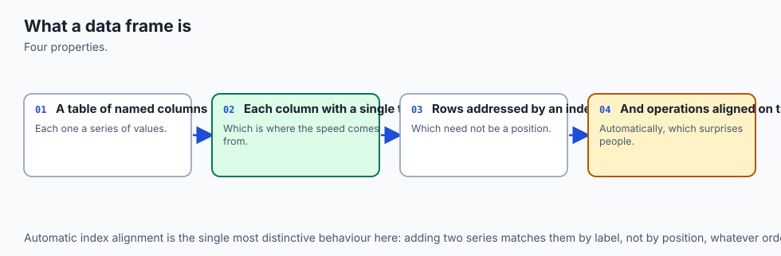
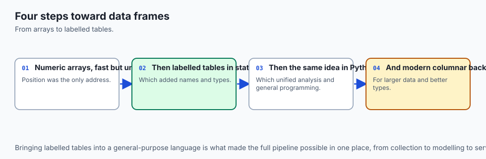
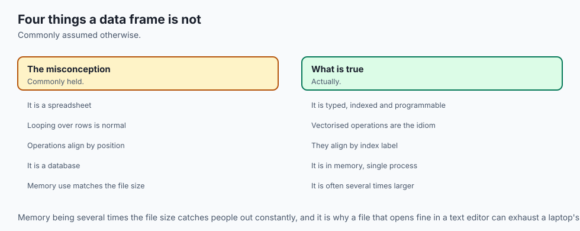
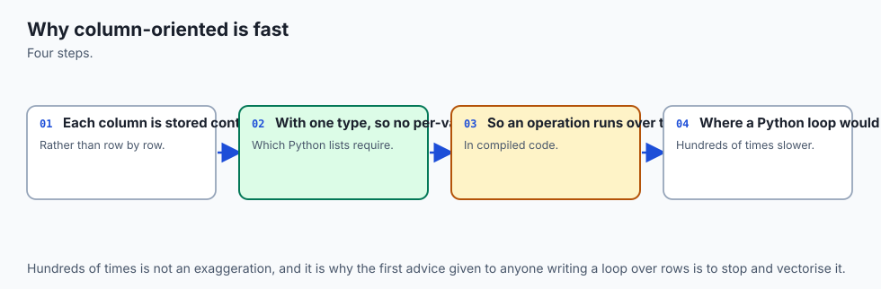
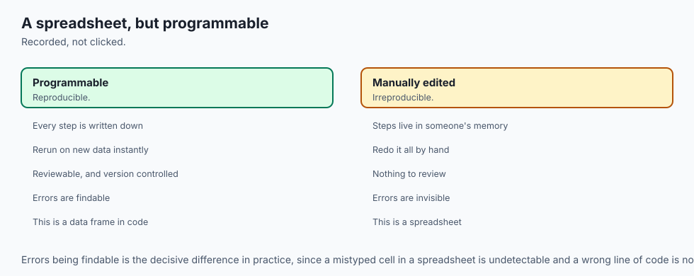
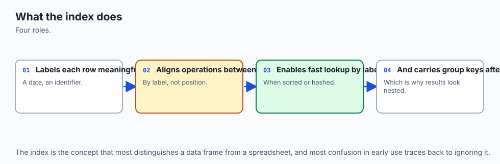
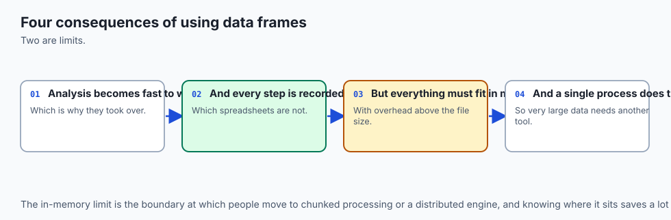
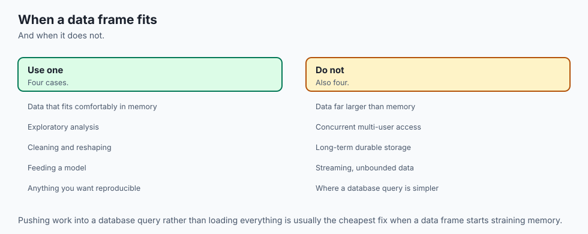

## Why this matters

Run this on pandas 3.0.5 — the version this whole lesson is written against — and read it twice before moving on:

```text
>>> x = pd.Series([1, 2, 3], index=["a", "b", "c"])
>>> y = pd.Series([10, 20, 30], index=["b", "c", "d"])
>>> x + y
a     NaN
b    12.0
c    23.0
d     NaN
dtype: float64
```

Nothing errored. Nothing warned. `x + y` ran, returned a `Series`, and every value in it looks plausible. And it is not the sum most people expect the first time they see this: not `[11, 22, 33]`, the answer you would get adding two same-length lists position by position. Two of the four labels came back `NaN` — not because anything is broken, but because pandas refused to guess. Label `a` exists only in `x`. Label `d` exists only in `y`. There is no partner to add to, so pandas writes "I don't know" instead of silently picking a wrong number.

That is the entire subject of this lesson, and it is worth being blunt about why it is dangerous rather than merely surprising. **A DataFrame is not a spreadsheet of cells sitting at fixed positions. It is a set of Series that agree on one index, and every arithmetic operation between two of them asks first: do our labels match?** When they do, you get the sum you expect.

When they do not — because one Series came from a filtered subset, a differently sorted query result, or a join that dropped a few rows — you get `NaN` in exactly the positions where the labels disagree, and the operation still "succeeds". No exception. No red text. A column that looks complete, with some plausible-looking gaps, silently contaminated by an index mismatch nobody checked for.

This is the lesson pandas explains badly to almost everyone who learns it from documentation alone, because the documentation is written for people who already trust the index. You do not, yet, and you should not until you have watched it fail once on purpose — which is exactly what the animated diagram below does, and what the first exercise in this lab does immediately after it.

Two more things make this day worth its own lesson rather than a footnote on Day 104's NumPy arrays. First: **pandas 3.0**, released in 2025, changed two load-bearing defaults that almost every tutorial, book, and Stack Overflow answer written before it still gets wrong — Copy-on-Write is now unconditional, and the default dtype for a column of text is `str`, not `object`.

If you learned pandas from material written before 2025, you have exactly the wrong mental model for both, and this lesson corrects both from real, captured runs on 3.0.5 rather than from memory of an older version. Second: **every machine-learning pipeline you will ever build starts with a DataFrame**, and the index-alignment behaviour above is one of the quietest ways a feature set gets corrupted before a model ever sees it.

A join on mismatched keys, an arithmetic operation between two columns computed from differently filtered subsets, a merge that silently drops rows — all of them produce `NaN`, and the very next line in most pipelines is `.fillna(0)`, which buries the evidence permanently. By the end of today you will know exactly why that happens and how to check for it before it happens to you.

## The idea in plain language



Here is the plain version, with no code yet.

A **Series** is a column: a list of values, and beside every value, a label. The labels together are called the **index**. `pandas.Series([10, 20, 30])` gives you three values with the default labels `0, 1, 2` — but you can label them anything: `"a", "b", "c"`, dates, product codes, whatever identifies each row in your problem.

A **DataFrame** is a table: several Series, laid side by side, that all share the *same* index. Picture a spreadsheet where the row labels down the left are shared by every column to the right — that sharing is not decoration, it is the mechanism that makes `df.loc["c"]` pull the right row out of every column at once. Look at the architecture diagram below: three differently-typed columns — `order_id`, `price`, `category` — sit beside one shared index running `a, b, c, d`. Each column is its own independent Series with its own dtype. What ties them into one table is that they all answer to the same four labels.


Now the part that catches everyone once: **because the index is a real, checked identity — not just a row number — arithmetic between two Series does not assume they line up.** It checks. Here is the animated version of the opening example: `x`, labelled `a, b, c`, slides in from the left; `y`, labelled `b, c, d`, slides in from the right; they converge on the shared labels in the middle. Labels `b` and `c` exist on both sides, so they light up and add for real: `2 + 10 = 12`, `3 + 20 = 23`. Labels `a` and `d` exist on only one side each, so nothing arrives to add to them, and the result is `NaN`.


The everyday-analogy section below carries this further, but the short version: think of the index as a **name tag**, not a **seat number**. Two guest lists merge correctly when you match people by name tag even if the lists are in different orders; they merge into nonsense if you insist on matching by seat number when the seating changed between lists. A NumPy array — Day 104's subject — only has seat numbers. A Series has name tags. That one addition is the entire difference, and it is both the reason pandas exists and the reason it can lie to you quietly if you forget it is there.

## Historical background



pandas began at AQR Capital Management, a quantitative hedge fund, where **Wes McKinney** started writing it in **2008** because the tools available in Python at the time — mostly bare NumPy arrays and hand-rolled dictionaries — had no good way to represent labelled, heterogeneous tabular data the way R's `data.frame` did. McKinney open-sourced the library in **2009**, and the name is a contraction of "panel data", the econometrics term for datasets that track multiple entities over multiple time periods — exactly the shape of the financial time series pandas was built to analyse.

The library's first major public milestone was **version 0.1 in January 2011**. Growth was fast: pandas became, alongside NumPy and later scikit-learn, one of the three libraries that defined what "doing data science in Python" meant through the 2010s, displacing a great deal of R-based analysis work along the way specifically because it combined R's labelled-data ergonomics with Python's general-purpose ecosystem.

**Version 1.0**, a genuine 1.0 rather than a marketing bump, arrived in **January 2020** — more than a decade after the project started, reflecting how conservatively the maintainers treated API stability once the library had become foundational infrastructure for an enormous number of other projects.

The two changes this lesson is built around both belong to **pandas 2.0**, released in **April 2023**, and **pandas 3.0**, released in **2025**. Version 2.0 introduced an *optional* Copy-on-Write mode and made **PyArrow** — the Python bindings for the Apache Arrow project's columnar memory format — an available backend for several dtypes, including a dedicated string type. Version 3.0 made both of those changes non-optional: Copy-on-Write became the only behaviour, with no switch to turn it off, and the PyArrow-backed `str` dtype became the default for columns of text, retiring `object` from that role after roughly fifteen years as the default. The version installed for this lesson, checked directly rather than assumed, is:

```text
>>> import pandas; pandas.__version__
'3.0.5'
```

Everything below that depends on this specific behaviour says so explicitly, because a reader arriving from pandas 2.x documentation — which still describes the *optional* Copy-on-Write and the *object* string default — is not wrong about the pandas they learned. They are describing an earlier, real, and reasonable version of the library. `expected-output/FIELDS.md` in this lesson's lab lists every value that would print differently there.

## What it is — and what it is not



**pandas** is a Python library for representing, manipulating and analysing tabular and one-dimensional labelled data, built on top of NumPy's arrays and, since pandas 2.0, optionally on PyArrow's columnar format as well. Its two central data structures are the **Series** (one labelled column) and the **DataFrame** (several Series sharing one index, i.e. a labelled table).

**It is not a spreadsheet**, even though it is usually explained by comparison to one. A spreadsheet cell is addressed by a fixed grid position (`B7`) and formulas recalculate automatically when a referenced cell changes. A DataFrame cell is addressed by a *label* on each axis, arithmetic between two DataFrames or Series **aligns by those labels before computing anything**, and nothing recalculates automatically — every operation produces a new object (or, since pandas 3.0's Copy-on-Write, at minimum a defensively-shared one) rather than propagating a live formula graph.

**It is not a database**, though it borrows vocabulary from one — `.merge()` reads like a SQL join because it is one. pandas holds its data in memory, has no transaction log, no concurrent-writer story, and no query planner; when the data does not fit in memory or multiple processes need to write at once, that is the point where Week 13's SQL is the better tool, covered explicitly in the Alternatives section below.

**It is not NumPy**, even though every Series wraps something extremely close to a NumPy array underneath (or, since 2.0, a PyArrow array for certain dtypes). The difference that matters today is the index: a bare `numpy.ndarray` addresses its elements purely by integer position, with no concept of a label at all. A pandas `Series` adds exactly one thing on top of that array — a parallel array of labels — and that one addition is what makes every idea in this lesson possible and every mistake in this lesson dangerous.

**It is, specifically, the library that made "the index is meaningful" the default assumption for tabular data in Python.** Every misconception this lesson corrects is a misconception about that one design choice: that arithmetic is positional (it is label-based), that a string column has no real dtype worth knowing (as of 3.0, it does), and that "a copy" and "a view" are interchangeable ideas (Copy-on-Write exists specifically because they are not).

## Why it was created and what problems it solves

Before pandas, doing what this lesson calls "loading a table and asking it a question" in Python meant one of three unpleasant choices. You could use bare NumPy arrays, which have no labels, no heterogeneous columns (every element of an array shares one dtype), and no native missing-value handling — modelling a table of mixed types meant either a structured array with fragile, verbose syntax, or parallel arrays you kept in sync by hand. You could use the standard library's `csv` module and plain Python dictionaries, which handle heterogeneity fine but give you nothing for vectorised computation — every operation is a Python-level loop, with all the overhead Day 104 measured.

Or you could reach outside Python entirely, into R, which had `data.frame` and vectorised, labelled operations built in from the start, but which meant leaving Python's general-purpose ecosystem to do the one part of your work that happened to be tabular.

pandas exists to close that gap: bring R's `data.frame` ergonomics — labelled axes, heterogeneous columns, built-in missing-value handling, vectorised operations, and a rich set of reshaping, grouping and joining verbs — into a library built on NumPy, so tabular work and numerical work could live in the same process, the same memory, and the same ecosystem.

The specific problem index alignment solves, concretely: before you can trust that adding two columns produces the right answer, you need some guarantee that the two columns' rows correspond to the same real-world entities in the same order.

A bare NumPy array offers no such guarantee — row 5 of one array and row 5 of another are "the same row" only if you, personally, kept them in sync through every filter, sort, and join along the way, and a single dropped row anywhere upstream silently shifts every row after it. pandas' answer is to make the correspondence **explicit and checked**: every Series carries its own labels, and every binary operation verifies those labels line up — asking the question a NumPy array cannot even represent, let alone answer.

The dtype problems this lesson covers — `int64` silently promoting to `float64`, and the pre-3.0 `object` string tax — both trace back to the same root cause: NumPy's arrays require one fixed, homogeneous, fixed-width type per array, and real tabular data is full of things that do not fit that mould cleanly — missing values in what should be a whole-number column, text of varying length, mixtures of types within one column. pandas' entire dtype system, including the newer nullable types like `Int64` and the PyArrow-backed `str`, exists to give you more precise, more honest answers to "what kind of thing is actually in this column" than a bare NumPy array can express on its own.

## How it works



### Building a Series and a DataFrame, three ways

The cleanest way to see what the index actually *is* — rather than trust a description of it — is to watch it get built three different ways and notice what determines it each time.

**From a dict**, the keys become the index, in insertion order:

```text
>>> pd.Series({"a": 10, "b": 20, "c": 30})
a    10
b    20
c    30
dtype: int64
```

**From a dict of lists**, building a DataFrame, the dict's keys become column names — but nothing in that construction says anything about row labels, so pandas falls back to the default `RangeIndex`, `0, 1, 2, ...`:

```text
>>> pd.DataFrame({"x": [1, 2, 3], "y": [4.0, 5.0, 6.0]})
   x    y
0  1  4.0
1  2  5.0
2  3  6.0
```

A list of **records** — one dict per row, the shape you get back from a JSON API or a database cursor — produces an identical result, because a "record" is just the row-oriented way of writing the same table pandas just built column-oriented above; pandas transposes it for you.

**From a bare NumPy array**, there is no label information anywhere in the input at all — an `ndarray` has no concept of a label, as the previous section established — so you must supply both the index and the column names yourself, or accept the same `RangeIndex` default on both axes:

```text
>>> arr = np.array([[1, 2], [3, 4], [5, 6]])
>>> pd.DataFrame(arr, index=["p", "q", "r"], columns=["c1", "c2"])
   c1  c2
p   1   2
q   3   4
r   5   6
```

Captured directly from `examples/01_three_ways_to_build.py` in this lesson's lab, on pandas 3.0.5 — every one of these results, and the dtype of every column, is asserted rather than assumed.

### Automatic alignment

The mechanism behind the opening example is worth stating with total precision, because "aligns the indexes" undersells what actually happens. When you write `x + y` for two Series, pandas computes the **union** of the two indexes, reindexes both Series onto that union (filling with `NaN` wherever a label is missing from one side), and only then adds them elementwise, position by position, on the now-identical, now-aligned indexes. It is never a positional add followed by a label check — the alignment happens *first*, unconditionally, on every arithmetic operator (`+`, `-`, `*`, `/`, comparisons), every time, whether or not the two Series happen to already share an index.

That "whether or not" clause is the entire danger. If both operands already have identical, same-order indexes — the common case when both columns came from the same DataFrame — alignment is invisible, because there is nothing to align; the result looks exactly like a positional operation would have. The behaviour only becomes visible, and only becomes dangerous, the moment the two indexes genuinely differ — which is exactly the moment nobody is watching for it, because the code "always worked before".

**Opting out**, when a positional operation is genuinely what you want, has two clean forms. `.to_numpy()` (or the older `.values`) strips a Series down to its underlying array, discarding the labels entirely, so `+` on two `.to_numpy()` results is ordinary NumPy positional addition:

```text
>>> x.to_numpy() + y.to_numpy()
array([11, 22, 33])
```

`.reset_index(drop=True)` takes a different route to the same destination: it keeps both operands as Series, but replaces their existing labels with a fresh `RangeIndex`, so the labels now agree by construction and alignment happens to coincide with position. The right choice between the two depends on what you need afterward: reach for `.to_numpy()` when you are about to hand the result to something that wants a plain array anyway (NumPy, a plotting call, a model's `.predict()`); reach for `.reset_index(drop=True)` when you need to keep working with labelled Series or DataFrames downstream and simply know, for this one operation, that the rows genuinely correspond positionally rather than by any meaningful label.

### dtypes, and the moment an integer column stops being one

Every Series has exactly one dtype, describing what every value in it is. `int64` and `float64` are the ordinary NumPy numeric types Day 104 covered; `bool` is a boolean array; and, as of pandas 3.0, **`str` is the default dtype for a column built from Python strings** — not `object`:

```text
>>> pd.Series(["a", "b"]).dtype
str
```

On any pandas release before 3.0, that same line prints `object` — a column of pointers to separately-allocated Python string objects scattered across memory, with none of the contiguous-storage benefits Day 104 covered for numeric arrays. pandas 3.0's `str` dtype, built on PyArrow, stores the string data contiguously instead, and the difference shows up directly in a place almost nobody checks: `.memory_usage(deep=True)`.

For a legacy `object` column, `deep=True` reports substantially more bytes than the shallow estimate, because the shallow count only sees the pointers and `deep=True` is the only way to see what they point to. For the pandas-3.0 `str` dtype, on the same data, `deep=True` and `deep=False` report the **identical** number, because there is no pointer indirection left for "deep" to discover:

| | `deep=False` | `deep=True` |
| --- | --- | --- |
| pandas-3.0 `str` column, 8 short values | 72 bytes | 72 bytes (no difference) |
| the same data forced to legacy `object` | 64 bytes | 400 bytes (6.25x more) |

Captured from `examples/09_describe_known_column.py`. `object` still exists and is still what a genuinely mixed-type column gets — `pd.Series(["a", 1, 3.5])` is still `object`, on any pandas version — and you can still request it explicitly with `dtype="object"` if some downstream code depends on the old behaviour. It is simply no longer the default for a column that is actually just text.

Now the trap that costs real precision. **NumPy's `int64` has no bit pattern reserved for "missing".** The moment a genuinely missing value enters what was an `int64` Series — through a `reindex()` onto a label that never existed, a failed join, or an explicit assignment of `NaN` — pandas has nowhere to put it inside `int64`, so it silently rebuilds the **entire column** as `float64`, which does have a bit pattern for `NaN`:

```text
>>> ids = pd.Series([1001, 1002, 1003], dtype="int64")
>>> ids.reindex([0, 1, 2, 3])
0    1001.0
1    1002.0
2    1003.0
3       NaN
dtype: float64
```

Every value in that column — not just the missing one — is now a float. That matters beyond cosmetics: `float64` has a 53-bit mantissa, so it can represent every integer up to `2**53` exactly, but not beyond. Push an ID past that boundary through the same promotion and it silently rounds:

```text
>>> big_id = 2**53 + 1              # 9007199254740993
>>> pd.Series([big_id], dtype="int64").reindex([0, 1]).iloc[0]
9007199254740992.0                  # off by one, silently
```

This is precisely the failure mode an ID column is supposed to be immune to — nobody does arithmetic on an order ID, and nobody expects it to lose precision, because "it's just an integer" is the entire reason it was declared `int64` in the first place. The fix is the **nullable `Int64` dtype** (capital I, deliberately distinct from lowercase `int64`), which stays in the integer family and represents a missing value as `pd.NA` instead of borrowing `NaN` from the float world:

```text
>>> pd.Series([1001, 1002, 1003], dtype="Int64").reindex([0, 1, 2, 3])
0    1001
1    1002
2    1003
3    <NA>
dtype: Int64
>>> pd.Series([big_id], dtype="Int64").reindex([0, 1]).iloc[0]
9007199254740993                    # exact
```

Captured from `examples/03_dtype_promotion.py`. The rule worth carrying forward: **any integer column that might ever meet a missing value — which, in practice, is any integer column that will ever be joined, reindexed, or merged — should be declared `Int64` from the start**, not `int64`, unless you have specifically confirmed it can never encounter a gap.

### Copy-on-Write and chained assignment

This is the section to read slowest, because it corrects the single most common wrong belief carried in from older pandas material, and getting it wrong corrupts data with no error message at all.

**pandas 3.0 has Copy-on-Write permanently on. There is no longer a setting to turn it off.** The direct, practical consequence is about **chained assignment** — writing two indexing operations back to back in one statement, such as `df[df["a"] > 1]["b"] = 0`. Read that statement as pandas actually executes it: `df[df["a"] > 1]` is evaluated first, on its own, and produces a **new, temporary DataFrame** holding the filtered rows. The `["b"] = 0` that follows then assigns into *that temporary* — which is immediately discarded, having been created for no purpose but to be thrown away. The original `df` is never touched.

Run it, on pandas 3.0.5, and read the output carefully:

```text
>>> df = pd.DataFrame({"a": [1, 2, 3], "b": [10, 20, 30]})
>>> df["b"].tolist()
[10, 20, 30]
>>> df[df["a"] > 1]["b"] = 0
ChainedAssignmentError: A value is being set on a copy of a DataFrame or
Series through chained assignment.
Such chained assignment never works to update the original DataFrame or
Series, because the intermediate object on which we are setting values
always behaves as a copy (due to Copy-on-Write).
Try using '.loc[row_indexer, col_indexer] = value' instead, to perform the
assignment in a single step.
>>> df["b"].tolist()
[10, 20, 30]
```

Two things are true at once here, and both matter. The frame is **completely unchanged** — this is the correction to the strongest wrong assumption people carry in: it is not that the assignment "sometimes doesn't work" or "works but triggers a slow copy"; on pandas 3.0.5, chained assignment against a mismatched selection **cannot** work at all, structurally, no matter what the data looks like.

And, separately: **pandas 3.0.5 does warn about it**, with a class called `ChainedAssignmentError` that is, despite its name, a `Warning` subclass rather than a raised exception — the statement still "completes" and execution moves on to the next line, which is exactly why the warning is easy to miss if your environment filters or redirects warnings, or if the statement sits inside a function whose return value nobody checks.

This is a real, useful improvement over the pre-3.0 story, where the equivalent situation sometimes raised an inconsistent `SettingWithCopyWarning` and sometimes said nothing at all, depending on internal memory layout that was never part of any documented guarantee — but it is still a warning, not a hard failure, and a reader who has learned to ignore pandas warnings will walk straight past the one warning in this entire lesson that is trying to save their data.

The fix is one statement instead of two: a single `.loc` call that names both the row selector and the column selector together, so there is only ever one object involved — no temporary to lose the write to:

```text
>>> df.loc[df["a"] > 1, "b"] = 0
>>> df["b"].tolist()
[10, 0, 0]
```

**That is the entire rule.** Any assignment that reads as two separate square-bracket lookups chained together — `df[mask][col] = value`, `df[col][mask] = value`, `df.iloc[0]["b"] = value` — is chained assignment and will not reliably write to the original object, regardless of whether pandas happens to warn about the specific form you used. Any assignment that is one `.loc[...]` or `.iloc[...]` call carrying both selectors at once will.

One more piece completes the picture. Some material — including, honestly, drafts of this very lesson before it was checked against a real pandas 3.0.5 install — describes Copy-on-Write as something you toggle with `pd.options.mode.copy_on_write`. On 3.0.5, setting that option no longer does anything except warn that it no longer does anything:

```text
>>> pd.options.mode.copy_on_write = False
Pandas4Warning: The 'mode.copy_on_write' option is deprecated. Copy-on-Write
can no longer be disabled (it is always enabled with pandas >= 3.0), and
setting the option has no impact. This option will be removed in pandas 4.0.
```

Captured from `examples/04_copy_on_write.py`, which is, deliberately, exercise 4 in this lesson's lab — this is the day's single most important check, and it asserts every line above against the real values, not a description of them.

### Selection: `[]`, `.loc`, `.iloc`

Three ways to pull data out of a Series or DataFrame, and the two that matter most disagree about something that surprises everyone exactly once.

Plain square brackets, `df["col"]` or `df[["col1", "col2"]]`, select **columns** by name on a DataFrame, and select **elements by label** on a Series. `df[boolean_mask]` selects **rows** — a different axis entirely, decided by whether the thing inside the brackets is a column name, a list of names, or a boolean array. This overloading is exactly why chained assignment above is so easy to write by accident: `df[mask]` already reads naturally as "the rows I want", so appending `["b"] = 0` feels like the obvious next step.

`.loc` and `.iloc` exist specifically to be unambiguous about which axis and which kind of addressing you mean. `.loc[row_selector, column_selector]` is **label-based** on both axes. `.iloc[row_selector, column_selector]` is **positional** on both axes, exactly like indexing a plain Python list or a NumPy array. Used with a single value or a list, they behave the way most people expect. Used with a **slice**, they diverge in a way that is easy to overlook because, on the surface, they can look like they agree:

```text
>>> df = pd.DataFrame({"val": [10, 20, 30, 40, 50]}, index=["a", "b", "c", "d", "e"])
>>> df.loc["b":"d"]
   val
b   20
c   30
d   40
>>> df.iloc[1:4]
   val
b   20
c   30
d   40
```

Both return the same three rows — but notice the stop values are *different numbers*: `"d"` for `.loc`, `4` for `.iloc`. That difference is the whole rule, stated precisely: **`.loc`'s stop is a label to include; `.iloc`'s stop is a position to stop before.** `.loc["b":"d"]` means "everything from `b` through `d`, `d` included" — the label-based, natural-language reading of a range. `.iloc[1:4]` means "everything from position 1 up to, but not including, position 4" — the same half-open-interval convention every Python slice uses.

The asymmetry only becomes visible, and only becomes dangerous, when you write the "matching" stop number instead of the corresponding one — which is exactly the mistake a reader coming from `.loc["b":"d"]` is likely to make, because `3` is where `"d"` lives:

```text
>>> df.iloc[1:3]
   val
b   20
c   30
```

One row shorter. `"d"` sits at position `3`, and `.iloc`'s slice stops *before* position `3` — so the label that `.loc["b":"d"]` deliberately included is the exact label `.iloc[1:3]` silently drops, even though `3` is that label's own position. Getting the same three rows out of both requires writing a *different* stop number on purpose — `4`, one past `"d"`'s position — not the number that looks like it corresponds.

### NaN semantics

`NaN` follows the IEEE 754 floating-point standard, and one property of that standard trips up more code than almost anything else in numerical Python: **`NaN` is never equal to anything, including itself.**

```text
>>> float("nan") != float("nan")
True
```

This is not a pandas quirk — it is inherited straight from IEEE 754, the same standard Day 70 covered for floating-point representation generally — but pandas' missing-value story rests on it directly. Because `NaN == NaN` is `False`, comparing a Series against `NaN` with `==` can never find a missing value, no matter how many are actually present:

```text
>>> s = pd.Series([1.0, np.nan, 3.0])
>>> s == np.nan
0    False
1    False
2    False
dtype: bool
```

Every entry reads `False` — including position 1, which *is* the missing value the comparison was trying to find. This is exactly why `.isna()` exists as a dedicated method rather than something you are expected to reconstruct from `==`: it does not rely on equality at all, checking instead whether the underlying storage marks a position as missing:

```text
>>> s.isna()
0    False
1     True
2    False
dtype: bool
```

`None` and `NaN` differ depending on the surrounding dtype, and the difference is worth knowing precisely rather than approximately. Inserted into a numeric column, `None` is converted to the float `NaN` on entry — `pd.Series([1, None, 3])` becomes `float64` with a real `NaN` at position 1, following the same int-to-float promotion rule from the dtype section above. Inserted into a pandas-3.0 `str` column, `None` is stored differently under the hood, but `.isna()` finds it exactly as reliably either way — the whole point of `.isna()` is that you never need to know or care which specific missing-value representation a given dtype happens to use internally.

### Vectorisation, revisited

Day 104 established the core idea: NumPy operations move the loop from CPython's interpreted bytecode into compiled C, and `.apply(lambda x: ...)` on a pandas Series does the opposite — it calls a real Python function once per row, from Python, paying interpreter overhead on every single element. The same comparison, run directly on a pandas Series rather than a bare array, on 200,000 rows of random prices:

```text
>>> (df["price"] * 1.08).equals             # vectorised
>>> df["price"].apply(lambda x: x * 1.08)   # one Python call per row
```

measured a ratio of roughly **250x** — vectorised arithmetic against `.apply` with a lambda, on identical input, on one Apple Silicon machine, on one day. That number is reported as a **ratio and a shape** — "at least 20x faster, on 200,000 rows" — rather than a millisecond figure, because a millisecond figure is a fact about this one machine on this one day and would mislead if quoted any more precisely than that; the lab's test asserts the ratio clears 20x, a bar comfortably below what this run measured, precisely so the assertion holds on hardware slower or faster than the one it was authored on.

### The four commands you run on any new frame

`.describe()` computes the exact summary statistics Day 116 taught by hand — count, mean, standard deviation, the quartiles, min, max — over every numeric column at once. On the fixed column `[2, 4, 4, 4, 5, 5, 7, 9]`:

```text
>>> pd.Series([2, 4, 4, 4, 5, 5, 7, 9]).describe()
count    8.00000
mean     5.00000
std      2.13809
min      2.00000
25%      4.00000
50%      4.50000
75%      5.50000
max      9.00000
```

count, mean, min and max match hand arithmetic exactly — `sum(values) / len(values) = 5.0`, `min = 2`, `max = 9` — and the standard deviation matches Day 116's Bessel-corrected sample formula, dividing the sum of squared deviations by `n - 1` rather than `n`, to nine decimal places, confirmed independently in `examples/09_describe_known_column.py`.

`.info()` reports row count, column names, non-null counts and dtypes in one compact block — the fastest way to spot a column that is not what you expected, including, as of pandas 3.0, printing `str` rather than `object` for a text column. `.head()` (and its counterpart `.tail()`) prints the first (or last) *n* rows without disturbing the frame, the first thing worth running on any data you have not seen before, purely to sanity-check that it loaded the way you expected.

`.memory_usage(deep=True)` reports the real byte cost per column, including the string-storage subtlety from the dtypes section above — and, for the pandas-3.0 `str` dtype specifically, `deep=True` and `deep=False` now agree, which is itself a useful diagnostic: if the two disagree on a text column, that column is still `object`, not `str`.

## An everyday analogy



Carry one picture through the rest of this lesson: **the index is a name tag, not a seat number.**

Imagine two separate guest lists for the same wedding, compiled by two different people. One list, written by the caterer, has a name tag and a meal choice for each guest. The other, written by the seating coordinator, has a name tag and a table number. To produce the final "meal per table" plan, you do not assume guest number 7 on one list is the same person as guest number 7 on the other — the two lists were almost certainly compiled in different orders, and lining them up by position would hand somebody else's steak order to whoever happened to be seventh on a different sheet.

You match by the **name tag**: find "Priya Nair" on both lists, and combine her meal choice with her table number. That is `.loc` and index alignment, exactly. If a guest appears on the caterer's list but was added to the seating chart late — or vice versa — the match for that one name comes back incomplete, which is precisely what `NaN` represents: not an error, but an honest "I could not find this name on the other list."

A NumPy array, without an index, is the version of this problem where nobody wrote name tags — only seat numbers, assigned in whatever order each list happened to be typed. Two seat-numbered lists combine correctly only by luck, when both happen to have been typed in the same order with nothing missing from either — and there is no way, from the numbers alone, to tell whether that luck held.

Push the analogy one step further, into Copy-on-Write. `df[mask]` is like photocopying the caterer's list, filtered down to just the vegetarians, before writing a correction on the photocopy — the correction is real, and it exists, but it exists only on a piece of paper that gets thrown in the recycling the moment you set it down, because nobody kept a reference to it. `df.loc[mask, "meal"] = "vegetarian"` is writing directly on the original list. Both actions look, in the moment, like "I corrected the record" — the pen moved, ink went down — but only one of them changed the document anyone will read again.

The analogy has an honest limit, worth stating rather than glossing over: a real guest list, once photocopied, stays photocopied — the two pieces of paper are physically separate from that point forward. A pandas Series under Copy-on-Write is more careful than that: it shares the *same underlying memory* with the original for as long as nothing writes to either copy, and only actually duplicates the data at the moment a write would otherwise affect both — which is the "write" half of "Copy-on-Write", and the reason it exists at all rather than pandas simply copying everything, always, just to be safe.

## Examples in practice



**A feature column silently corrupted by a join.** Two DataFrames, `orders` and `customer_scores`, both indexed by customer ID — except `customer_scores` was built from a query that excluded customers with fewer than three orders. `orders["score"] = orders["base_score"] + customer_scores["adjustment"]` runs without complaint. Every customer excluded from `customer_scores` gets `NaN` in the result — not zero, not an error, `NaN` — and if the very next line is `.fillna(0)`, every one of those customers now has a `0` adjustment that looks exactly as valid as a genuinely-computed `0` would. This is the opening example of this lesson, wearing a production pipeline's clothes.

**An ID column that quietly became a float.** A `customer_id` column, declared (or inferred as) `int64`, goes through a `left join` against a table that does not have every ID — the unmatched rows get `NaN` in every joined column, and because that `NaN` lands in what was an `int64` column, the *entire* `customer_id` column is promoted to `float64`. Six months later, someone exports the column to a CSV for a downstream system, and every ID prints with a trailing `.0` — `1001.0` instead of `1001` — which some downstream parsers accept silently and some reject outright. The fix decided *before* the join, not after: declare join keys as the nullable `Int64` from the start.

**A report that "worked" until the input changed shape.** A script sums two columns from two different queries, run at different times of day against a database that is still receiving writes. On most days the two queries happen to return rows in matching order and the sum is correct by coincidence.

One day a new row is inserted between the two queries running, shifting every row after it in one result but not the other — and because both Series still had the default `RangeIndex`, position-based rather than label-based, the sum silently combines the wrong rows. The general lesson: the default `RangeIndex` gives you *no* protection at all against exactly the failure this whole lesson is about — meaningful alignment requires a meaningful index, deliberately set.

## Implications: security, privacy, performance, scalability, and cost



**Privacy and correctness are the same failure here.** Index-misalignment `NaN`s are not a performance nit; they are a data-integrity failure that happens to look like ordinary missing data. A `fillna(0)` after a silent misalignment does not just produce a wrong number — it produces a wrong number that carries no signal that anything went wrong, which is a worse failure mode than an exception, because an exception at least gets investigated.

**Performance: vectorisation is not optional past a few thousand rows.** The roughly 250x gap measured above between vectorised arithmetic and `.apply` with a lambda is not an edge case; it is the ordinary cost of paying Python's interpreter overhead once per row instead of once per operation. A DataFrame pipeline written entirely in `.apply` calls scales linearly worse than the same pipeline written vectorised, and the gap widens, not narrows, as the data grows.

**Memory: `str` versus `object` is now a real, checkable cost, not a guess.** The pandas-3.0 `str` dtype's PyArrow backing genuinely uses less memory per string than the legacy `object` dtype's array-of-pointers representation, and — unlike before 3.0 — you can now check this directly with `.memory_usage(deep=True)` without a surprise, because `deep=True` and `deep=False` agreeing on a `str` column is itself confirmation there is no hidden pointer overhead left to find.

**Cost, in the exact-arithmetic sense: `Int64` versus `int64` is a precision decision with a dollar-and-cents analogue to Day 91's integer-money lesson.** An order ID, an account number, or any identifier that must never be approximated deserves the nullable `Int64` dtype specifically because the alternative — silent promotion to `float64` past a join or a reindex — is not a performance cost, it is a correctness cost, identical in kind to the floating-point money bug Day 91 covered, just triggered by a missing value instead of a fraction.

**Scalability: Copy-on-Write changes the cost model of "just make a copy to be safe".** Before pandas 3.0, defensively copying a large DataFrame before modifying it was often expensive enough that people avoided it and accepted the risk of accidental in-place mutation instead. Copy-on-Write's shared-memory-until-written design means a defensive `.copy()` (or simply relying on the fact that unmodified data is never duplicated) is now close to free until an actual write happens — which removes a real incentive people previously had to reach for chained assignment's dangerous shortcuts.

## Alternatives: free, open source, and commercial

**pandas** — *free, BSD 3-Clause.* The subject of this lesson, and the default choice for tabular data analysis in Python. **When to choose it:** the data fits comfortably in memory, one process is doing the analysis, and you want the largest possible ecosystem of compatible tools (scikit-learn, matplotlib, statsmodels) built to expect exactly its API. **How:** `import pandas as pd`; everything in this lesson. **Free vs paid:** entirely free, no tier.

**polars** — *free, MIT licence.* A newer DataFrame library, written in Rust, built from the start around multi-threaded execution and, notably for this lesson, a **deliberately different design decision about the index**: polars DataFrames have **no implicit row index at all**. That single design choice is worth sitting with, because it sharpens exactly what this lesson has been about.

Every alignment behaviour covered today — the `NaN`s from mismatched labels, the `.loc`/`.iloc` distinction, the reason `.reset_index(drop=True)` is sometimes the right move — exists *because* pandas gives every row a persistent, checkable identity beyond its position. polars' designers judged that identity to be a cost more often than a benefit for the workloads polars targets, and built row-order-based operations as the default instead, with any row-identity tracking left to an explicit column you add yourself.

Neither design is simply "better" — pandas' index buys you exactly the safety this lesson has spent its length explaining, at the cost of exactly the confusion this lesson has spent its length untangling; polars buys you a simpler mental model and, for large data, meaningfully faster execution, at the cost of losing that automatic safety net entirely. **When to choose polars:** performance-critical pipelines on data too large for comfortable pandas use, or a team that has decided the index's implicit-alignment behaviour is a liability they would rather design around explicitly.

**How, from its documentation:** `pl.DataFrame({"x": [1, 2, 3]})` builds a frame with the same dict-of-lists syntax pandas uses, but operations like `+` between two `pl.Series` are always positional — there is no label to align on. **This lesson does not run polars** — it is not installed in the authoring environment — and no output attributed to it above is anything but a description of its documented behaviour, stated plainly as such.

**NumPy structured arrays** — *free, BSD 3-Clause, docs-only here.* NumPy itself offers a limited answer to heterogeneous, labelled-by-name (though not labelled-by-row) data: `numpy.dtype([("id", "i8"), ("price", "f8")])` defines a compound dtype, and an array built with it lets you access `arr["price"]` the way you would a DataFrame column. **When to choose it:** you need heterogeneous columns but genuinely cannot add a pandas dependency, or you are interoperating with C code that expects a raw structured buffer.

**How, from documentation:** `np.array([(1, 19.99), (2, 44.50)], dtype=[("id", "i8"), ("price", "f8")])`. **The honest catch:** no row index, no automatic alignment, no `NaN`-aware missing-value handling, and a noticeably more awkward syntax for anything beyond simple column access — structured arrays are closer to a C struct array than to a DataFrame, and this lesson recommends them only when a pandas dependency is genuinely off the table.

**SQLite / SQL generally, Week 13's subject** — *free, public domain (SQLite specifically).* **When to choose SQL over pandas:** the data does not fit comfortably in memory, more than one process needs to read or write concurrently, you need durable storage with transactional guarantees, or the questions being asked are naturally expressed as joins and aggregates over data that already lives in a relational database. **How:** everything Week 13 covered — `SELECT`, `JOIN`, `GROUP BY`, window functions — running against the file or server directly, rather than loading the whole table into a DataFrame first.

**Concrete example:** Day 121's "Loading and Inspecting Data" covers `pd.read_sql()`, the actual bridge between the two — often the right answer is "SQL to filter and aggregate down to a manageable size, then pandas for the fine-grained shaping" rather than choosing one exclusively. **Free vs paid:** SQLite is free with no server to run at all; PostgreSQL and MySQL are free and open source with paid managed-hosting options; commercial data warehouses (Snowflake, BigQuery) are usage-priced and outside the scope of this lesson.

## Comparison with related concepts

| Concept | What it does | How it differs from a pandas DataFrame |
| --- | --- | --- |
| NumPy `ndarray` | A fixed-dtype, N-dimensional array | No labels at all; a Series is an ndarray with a label axis bolted on (Day 104) |
| Python `dict` of lists | A mapping of column names to value lists | No row-level index, no vectorised arithmetic, no dtype enforcement per column |
| SQL table | Rows and typed columns, durable, queryable concurrently | Lives on disk/server, not in memory; no implicit positional index at all; concurrency-safe |
| polars `DataFrame` | Rows and typed columns, in memory, multi-threaded | No implicit row index by design; operations are positional, not label-aligned |
| NumPy structured array | A single array with named, typed fields | No row index, no built-in missing-value handling, more C-struct-like than table-like |
| CSV file | Plain-text rows and columns | No types until parsed, no index until one is chosen at load time, no in-memory computation |
| R `data.frame` | pandas' direct ancestor in spirit | Different language and ecosystem; conceptually the closest relative on this list |

The comparison worth dwelling on is polars versus pandas, because it is the only pair on this table making a genuinely different *design* choice about the same problem rather than solving a different problem entirely. Every other row in this table lacks something pandas has (a label axis, vectorisation, in-memory speed); polars deliberately omits the one thing this entire lesson has centred on, on purpose, as a considered trade-off rather than an oversight.

## When to use it — and when not to



**Reach for a pandas DataFrame when** your data fits comfortably in memory, you are the only process reading and writing it at a time, and you want the richest available ecosystem of compatible tools built around exactly its API — which, as of 2026, is still the majority of tabular work done in Python.

**Reach for SQL instead when** the data does not fit in memory, more than one process needs concurrent access, or you need transactional guarantees pandas does not provide at all — Week 13 covers exactly this boundary.

**Reach for polars instead when** performance on large in-memory data matters more than the automatic label-alignment safety net this lesson has spent its length explaining, and your team is comfortable designing around explicit row identity rather than an implicit one.

**Always declare a meaningful index before doing arithmetic across two DataFrames or Series that did not originate from the same object**, and always check `.isna().sum()` immediately after any join or reindex whose row counts you have not independently verified — this single habit catches the overwhelming majority of the silent-corruption failures this lesson describes, before they reach anything downstream.

**Never use chained assignment**, even in a script you consider throwaway. On pandas 3.0.5 it does not work, at all, and the warning it raises is easy to miss; on any earlier pandas, whether it appears to work depends on internal memory layout that was never a documented guarantee in the first place, which means "it worked when I tested it" was never evidence that it would keep working.

**Never assume an integer column is safe from becoming `float64`** unless you have specifically declared it `Int64` and confirmed every operation that touches it preserves that dtype — checking `.dtype` after every join, reindex or concat that touches an ID column costs one line and catches this before it reaches a downstream system that cannot parse `1001.0`.

### Where this goes next in AI work

Every machine-learning pipeline you will ever build begins with a DataFrame, and the specific failure mode this lesson opened with — index-misalignment producing `NaN` that a downstream `fillna` then buries — is one of the quietest ways a feature set gets corrupted before a model ever sees a single row of it. Two features engineered from differently filtered queries, joined on customer ID, will produce `NaN` for every customer missing from either side, and the very next line in an enormous number of real feature-engineering scripts is exactly `.fillna(0)` — which turns "we don't have this data" into "this value is genuinely zero", a claim the pipeline has no basis for making and no record of having made.

The consequence compounds specifically because it is silent. A model trained on a feature column with buried `NaN`s does not fail loudly; it learns a slightly wrong relationship, quietly, and the only symptom is a model that underperforms in a way nobody can trace to a specific cause, because the corruption happened upstream of every diagnostic anyone thinks to run.

The discipline this lesson exists to install is not "never let `NaN` appear" — real data has real gaps, and `NaN` representing them honestly is pandas working correctly. The discipline is: **know, at every join and every arithmetic operation between two differently-sourced Series, whether alignment is doing something you intended or something you never checked for**, and treat every unexpected `NaN` after a join as a question to answer rather than a default to paper over.

Week 18's project, the Messy Dataset Rescue, is built directly on this habit — a genuinely messy public dataset, and a documented, reproducible record of exactly which values were missing, why, and what was decided about each one, rather than a single silent `fillna(0)` applied to everything at once.

## The AI connection

- **Dataframes are the working format for nearly all real data**, and everything before
  modelling happens in them.
- **Mixed column types are the norm**, which is exactly what arrays handle badly and
  dataframes handle well.
- **The index is a genuine feature**, and misunderstanding it causes a large share of
  dataframe bugs.
- **Every training set begins as a dataframe**, so fluency here is directly upstream of every
  model.
- **Vectorised operations apply here too**, and looping over rows is the commonest performance
  mistake in data work.

## Knowledge check

Try these from memory before looking back.

1. What is the one addition a pandas Series has over a bare NumPy array, and why does that one addition explain every idea in this lesson?
2. Predict, without running it, what `pd.Series([1, 2, 3], index=["a","b","c"]) + pd.Series([10, 20], index=["b","x"])` returns, labelled and all.
3. Name the two clean ways to opt out of index alignment and say when each is the right choice.
4. State exactly what happens, mechanically, when you write `df[mask]["col"] = value` on pandas 3.0.5 — both to the original frame and in terms of the warning raised.
5. What is the one-line fix for chained assignment, and why does it work when the two-statement form does not?
6. `pd.Series(["a", "b"]).dtype` prints what, on pandas 3.0.5? What did it print on pandas 2.x, and why did that change?
7. An `int64` Series is reindexed onto a label it never had. What dtype does it become, and why can `int64` not represent the result directly?
8. What does the nullable `Int64` dtype (capital I) do differently from `int64` when a value is missing, and what precision problem does that avoid?
9. State the exact rule for `.loc`'s stop value versus `.iloc`'s stop value on a slice. Give an example where writing the "matching" number for both produces different row counts.
10. Why does `series == np.nan` never find a missing value, no matter how many are present? What should you write instead?
11. Report the measured gap between vectorised arithmetic and `.apply(lambda ...)` the way this lesson insists on reporting it. What form of report would be wrong, and why?
12. Name the four commands this lesson calls "what you run on any new frame", and say what each one is for.
13. What single design decision does polars make differently from pandas regarding the index, and what does that trade-off buy and cost?
14. Give one concrete example of how an unexamined `NaN` from a join can silently corrupt a machine-learning feature column.
15. Which is the "day's most important check" in this lesson's lab, and why does the lesson single it out?

## Hands-on exercise

The Day 120 lab, *Frames You Can Trust*, is nine numbered exercises, each proving one of the claims above by running real pandas 3.0.5 code and checking the real result — never by reading source or trusting a comment. Work from the lab directory; every command below runs from there.

Set up the lab's own environment first, since this day's captured output is tied to the exact pinned versions:

```bash
cd labs/sections/math-statistics-and-data/day-120-pandas-series-and-dataframes
python3 -m venv .venv
.venv/bin/pip install -r requirements/requirements.txt
```

Confirm the harness is green before touching anything:

```bash
bash tests/run_tests.sh
echo "exit code: $?"
```

Then find out where you stand on the nine exercises:

```bash
.venv/bin/python3 starter/check_progress.py
```

It reports `0 of 9 exercises complete.` and names the exact `_FILL_THIS_IN` marker each unfinished exercise is waiting on. Open `starter/exercises.py`, replace each marker with real pandas code — one function per exercise, matching the nine ideas covered above in order — and re-run the checker as you go.

When you have attempted every exercise yourself — and only then — read the fully worked reference in `examples/`, one script per exercise, each ending with a printed line confirming every internal assertion held:

```bash
cd examples
../.venv/bin/python3 01_three_ways_to_build.py
../.venv/bin/python3 02_alignment.py
../.venv/bin/python3 03_dtype_promotion.py
../.venv/bin/python3 04_copy_on_write.py
../.venv/bin/python3 05_loc_vs_iloc.py
../.venv/bin/python3 06_nan_semantics.py
../.venv/bin/python3 07_vectorized_vs_apply.py
../.venv/bin/python3 08_string_dtype.py
../.venv/bin/python3 09_describe_known_column.py
cd ..
```

### Expected output

The harness ends with a real captured line:

```text
41 checks, 0 failure(s).
```

and exits 0. `starter/check_progress.py` reports `0 of 9 exercises complete.` with exit 1 on the untouched checkout, and `9 of 9 exercises complete.` with exit 0 once every marker is correctly replaced.

The day's two sharpest facts, exactly as captured on pandas 3.0.5:

```text
pd.Series(['a', 'b']).dtype  ->  str
```

```text
df['b'] before:                                                [10, 20, 30]
df['b'] after chained assignment `df[df['a'] > 1]['b'] = 0`:   [10, 20, 30]
warning(s) raised by that statement: ['ChainedAssignmentError']
df['b'] after `.loc[df['a'] > 1, 'b'] = 0`:                    [10, 0, 0]
```

### Validate your work

1. `bash tests/run_tests.sh` ends with `41 checks, 0 failure(s).` and exits 0.
2. `pd.Series(['a', 'b']).dtype` reads **`str`**, not `object`.
3. Chained assignment leaves `df['b']` at **`[10, 20, 30]`**, unchanged, and raises a **`ChainedAssignmentError`** warning; the equivalent `.loc` statement changes it to **`[10, 0, 0]`**.
4. Adding `x` (index `a, b, c`) to `y` (index `b, c, d`) puts `NaN` at **exactly** `a` and `d`, and sums `b` to **12.0** and `c` to **23.0**.
5. `df.loc['b':'d']` and `df.iloc[1:4]` return the **same three rows**; `df.iloc[1:3]` returns **one row fewer**, even though `3` is the position of the label `'d'` that `.loc` included.
6. An `int64` column reindexed onto a label that was never there becomes **`float64`**, and a value past `2**53` loses exact precision; the same reindex on an `Int64` column keeps its dtype and its precision.
7. `.describe()` on `[2, 4, 4, 4, 5, 5, 7, 9]` gives count **8**, mean **5.0**, min **2**, max **9**, matching Day 116's Bessel-corrected standard deviation to nine decimal places.
8. Vectorised arithmetic beats `.apply(lambda ...)` by **at least 20x** on 200,000 rows.
9. `starter/check_progress.py` reports `0 of 9` on an untouched checkout and `9 of 9` once every exercise is correct.

### Troubleshooting

`troubleshooting.md` in the lab directory has the full list, grouped by the message you actually see. The ones you are most likely to meet: **`pd.Series(['a', 'b']).dtype` prints `object`, not `str`** — you are not running pandas 3.0.5, check with `python3 -c "import pandas; print(pandas.__version__)"` and reinstall from `requirements.txt`. **Chained assignment doesn't warn, or silently updates the frame** — the same root cause: you are not on pandas 3.0's unconditional Copy-on-Write. **`.iloc[1:3]` returns one row fewer than expected** — not a bug; `.iloc` stops *before* its stop position while `.loc` stops *at and including* its stop label.

**An ID column now prints with a trailing `.0`** — a `NaN` entered an `int64` column through a join or reindex and promoted the whole column; declare it `Int64` if it must never lose exact precision. **`KeyError` from `.loc[3]`** where `.iloc[3]` would have worked — your index is not the default `0, 1, 2, ...` RangeIndex, most often because you filtered or sorted without `.reset_index(drop=True)`.

### Common mistakes

- **Assuming `+` between two Series is positional.** It is label-based, always, whether or not the two indexes happen to already agree.
- **Writing chained assignment and trusting that it "usually works".** On pandas 3.0.5 it structurally cannot; on earlier pandas, whether it appeared to work depended on internal memory layout that was never a documented guarantee.
- **Ignoring the `ChainedAssignmentError` warning because it doesn't stop execution.** It is a `Warning`, not a raised exception — the statement completes and moves on, which is exactly why it is easy to miss.
- **Declaring an ID column `int64` without checking whether it will ever meet a `NaN`.** Any column that will be joined, merged, or reindexed should default to `Int64` unless you have confirmed otherwise.
- **Writing `.iloc` with the same stop number as a `.loc` slice "because they look equivalent".** They are equivalent only when the `.iloc` stop is one **past** the `.loc` stop's position.
- **Testing for missing values with `series == np.nan`.** It is always all-`False`. Use `.isna()`.
- **Reporting a timing comparison as a millisecond figure.** Report a ratio and a shape — the millisecond number is a fact about one machine on one day.
- **Assuming `.memory_usage()`'s default (`deep=False`) tells the whole story for a text column.** For the legacy `object` dtype it dramatically understates the real cost; for the pandas-3.0 `str` dtype the two now agree, which is itself useful information.

## Practice assignment

Take a dataset with at least two independently-sourced tables that share a key — two CSV exports from different systems, two API responses fetched separately, or two DataFrames you construct yourself with deliberately different index gaps — and produce a short, honest report on what happens when you combine them.

**First**, load both into DataFrames and set the shared key as the index on each with `.set_index()`, rather than leaving the default `RangeIndex` in place. Run `.isna().sum()` on the *result* of combining them (an addition, a `.merge()`, or a `.join()`) before doing anything else with it, and write down exactly which rows produced `NaN` and, separately, whether you can explain *why* each one did — a genuinely missing record on one side, a duplicate key, a type mismatch in the join column.

**Then**, deliberately introduce the mistake this lesson opens with: recompute the same combination using `.to_numpy()` on both sides instead of the labelled objects, and compare the two results row by row. Write down every row where the labelled and the positional answers disagree, and confirm you can explain the disagreement from the two objects' indexes alone, without re-running anything.

**Then**, find one integer-typed column in your data that has, or could plausibly gain, a missing value, and check whether it is declared `int64` or `Int64`. If `int64`, force a reindex onto a label it does not have, confirm the promotion to `float64`, and rewrite the column as `Int64` to show the promotion no longer happens.

**Your deliverable** is the two DataFrames, the combination with its `NaN` count and an explanation for each one, the labelled-versus-positional comparison with every disagreement named, and the before/after dtype fix — plus one paragraph stating, honestly, whether you would have caught this specific corruption before this lesson, and what check you are adding to your own workflow because of it.

## Extension challenge

Build a small, from-scratch "aligning array" in plain Python — no pandas, no NumPy — that reproduces exactly the index-alignment behaviour this lesson opened with, to prove to yourself it is a specific, implementable algorithm rather than something mysterious pandas does internally.

Write a class wrapping two parallel Python lists, one of labels and one of values, with an `__add__` method that: computes the union of both operands' labels, builds a result list the length of that union, and for each label in the union, adds the two values together **only if that label exists in both operands** — writing `None` (your stand-in for `NaN`) everywhere it does not.

Test it against the exact example this lesson opened with — labels `a, b, c` and values `1, 2, 3` on one side, labels `b, c, d` and values `10, 20, 30` on the other — and confirm your from-scratch result matches pandas' real `x + y` output exactly: `a: None, b: 12, c: 23, d: None`.

Then extend it one step further: implement a from-scratch `.loc`-style slice that is inclusive of its stop label, and a separate `.iloc`-style slice that is exclusive of its stop position, on the same underlying data, and confirm both agree with pandas' real behaviour on the `a..e` example from the "How it works" section — including the one-row difference between `.loc['b':'d']` and `.iloc[1:3]`. Having built the mechanism yourself, in fewer than fifty lines, is the fastest way to stop finding pandas' alignment behaviour mysterious and start finding it, correctly, obvious.
