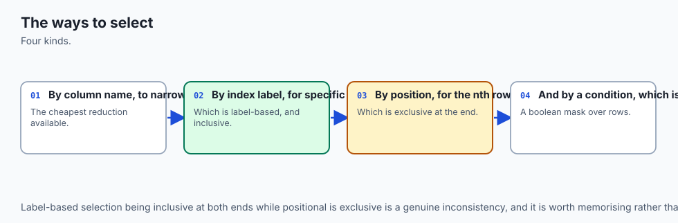
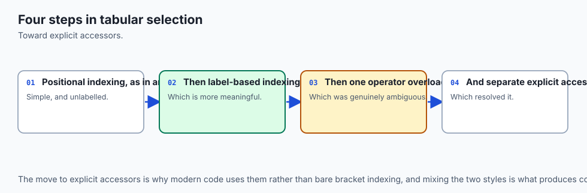
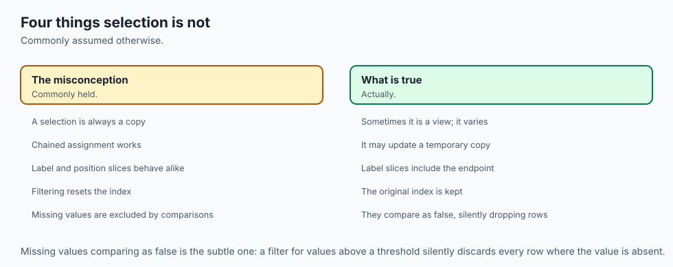
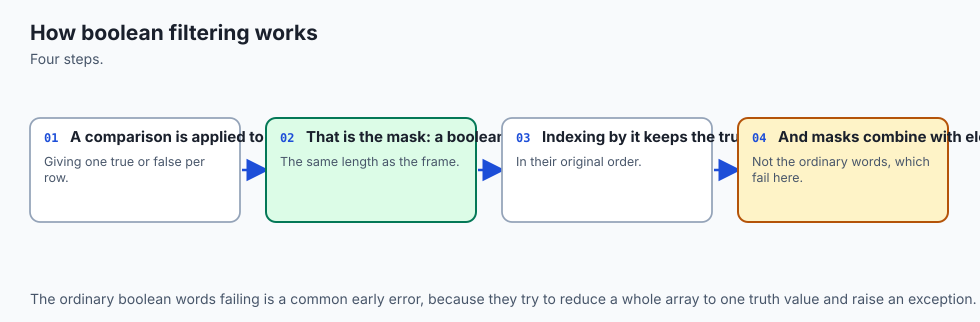
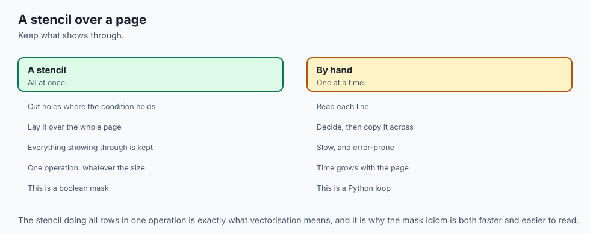
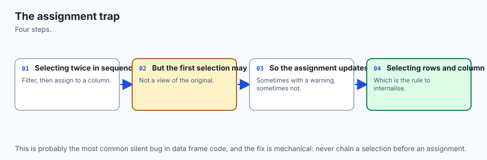
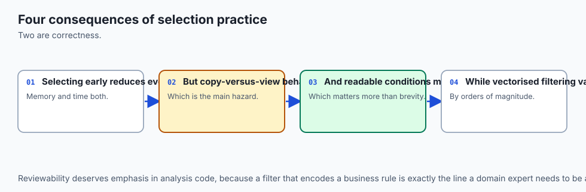
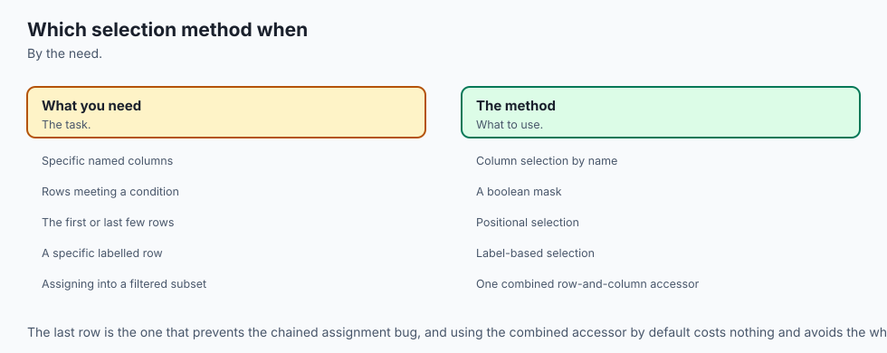

## Why this matters

Run this on pandas 3.0.5 and read the output twice before moving on:

```text
scores:
  name  score
0  Ada   72.0
1   Bo   45.0
2   Cy    NaN
3  Dee   91.0
4  Eli   50.0
5  Fay    NaN
6  Gio   88.0
7   Hu   33.0

total rows:           8
high (score > 50):    3  -> ['Ada', 'Dee', 'Gio']
low  (score <= 50):   3   -> ['Bo', 'Eli', 'Hu']
missing (score NaN):  2 -> ['Cy', 'Fay']
```

Eight students. `high = scores[scores.score > 50]` says three of them are high performers. `low =
scores[scores.score <= 50]` says three of them are not. Add the two counts and you get six. There are
eight rows. Nobody deleted Cy or Fay. No exception was raised, no warning printed, and both lines of code
ran exactly as written and did exactly what they say. And yet if you published "3 high performers" and "3
everyone else" as if those two numbers summed to your class, you would be wrong, and nothing in pandas
would have told you so.

This is not a contrived example. `score > 50` is `False` for a missing value. `score <= 50` is *also*
`False` for the same missing value, because `NaN` fails every ordinary comparison — greater than, less
than, equal to, all of them, in both directions. A row with a missing score is absent from `high`. It is
absent from `low`. It has nowhere to go, and there is no error telling you it went nowhere. This is the
single most common way a real report quietly discards exactly the rows a reviewer is least likely to
notice missing, because the discarding never announces itself.

Two days ago, Day 120 showed you that a boolean mask is a Series with an index and that arithmetic between two Series aligns by label. Yesterday, Day 121 showed you where the `NaN`s in a real column actually come from. Today puts them together: **a filter is a claim about which rows you kept, and the rows you did not keep are your responsibility too.** Every section below is really one lesson wearing nine costumes — a precedence trap that silently misgroups a compound condition, a mask that keeps its promise across a reordered frame but loses it the instant you strip its labels off, a string method that behaves differently depending on a dtype default that changed under you — and every one of them is a variation on the same failure: pandas rarely raises an exception when a filter does the wrong thing.

It just returns an answer, and the answer is wrong, and it looks exactly like a right answer.

For AI work specifically, this is not an academic concern. The exact same silent-exclusion mechanism is
how a training set gets biased without anyone deciding to bias it. A filter step that drops rows with a
missing feature — quietly, by construction, with no log line — does not produce an error. It produces a
dataset drawn from a population that no longer matches the population you meant to model, and the model
trained on it will confidently generalise from a sample it was never told was incomplete. The habit this
lesson installs — check that your filters add up, on purpose, every time — is a five-second guard against
exactly that failure, and it costs nothing except remembering to run it.

## The idea in plain language



A filter asks a table one question per row and keeps the rows that answer yes. That much is intuitive.
What is not intuitive is that pandas has a third answer besides yes and no: *I don't know, there was
nothing there to compare.* Ordinary code treats "I don't know" as if it collapsed into "no" — and it does,
for the purposes of that one filter. The trap is that "I don't know" collapses into "no" for the *opposite*
filter too, and a reader who only sees the two "no" outcomes assumes they were answering the same question
from two directions, when in fact one of the "no"s was never a real no at all.

![Diagram: an eight-row DataFrame of names and scores beside its boolean mask score greater than 50, with True rows Ada, Dee and Gio flowing through a gate into a kept-rows panel, False rows Bo, Eli and Hu held back behind the gate, and the two rows with a missing score, Cy and Fay, shown falling through a gap beneath the gate into a third panel labelled neither kept nor held, with the same two rows shown falling through the gap again under the negated mask score less than or equal to 50, and a caption stating that a row missing from a comparison is missing from its negation too](./assets/mask-anatomy-architecture.svg)

The diagram draws this out literally: the same two rows fall through the same gap twice, once under
`score > 50` and once under its negation, `score <= 50`. A reader scanning only the two panels — KEPT and
HELD BACK — never sees the gap at all, because the gap is not a third value printed anywhere in either
mask. It is an absence, and absences do not show up when you only look at what is present.

Everything else in this lesson is a variation on managing that absence, or a variation on a second,
related theme: pandas gives you several *different tools* for filtering — a raw boolean mask, `.loc`,
`.query()`, `.isin()`, `.nlargest()`, `.drop_duplicates()` — and each one has its own way of quietly
surprising you if you use it on autopilot. Operator precedence surprises you inside a mask expression.
Index alignment surprises you when a mask travels between frames. A dtype default surprises you inside
`.str.contains()`. An empty list surprises you inside `.isin()`. None of these are bugs in pandas. Every
one of them is the documented, correct behaviour, doing exactly what it was designed to do — and every one
of them produces a plausible-looking wrong answer if you have not internalised the specific rule behind
it.

## Historical background



Boolean masking itself is older than pandas. NumPy — the array library pandas is built on, which Day 104
covered directly — overloads `&`, `|` and `~` for elementwise combination of boolean arrays through the
`__and__`, `__or__` and `__invert__` special methods, a design decision baked into NumPy from its
consolidation of the earlier Numeric and Numarray libraries. pandas inherited this overloading rather than
inventing it, which is exactly why `&` on two masks behaves like ordinary bitwise-AND syntax applied
row-by-row rather than like some pandas-specific filtering keyword — it genuinely is the same operator you
would use on two integers, just overloaded to mean something different for an array of booleans.

**Wes McKinney** began building what became pandas in **2008**, while working at the quantitative
investment firm **AQR Capital Management**, motivated by the lack of a fast, flexible tool for labelled
tabular data in Python — the exact gap a spreadsheet or a statistical package like R's `data.frame` filled
for other audiences. The project was **open-sourced in 2009**, and the label-aware, NumPy-backed design
established then is the direct ancestor of every mask-alignment behaviour this lesson covers: filtering
was never bolted on afterward, it grew out of the same index-centred design Day 120 introduced.

Two of this lesson's specific tools have a traceable release date. **`DataFrame.isin()`** and
**`DataFrame.query()`** were both added in **pandas 0.13.0**, released on **16 January 2014** — the same
release that introduced `.eval()` for whole-DataFrame expression evaluation. `.query()`'s natural-syntax
design (allowing something close to plain Python inside a string, including boolean `and`/`or` that
*would* raise on a bare Series) was explicitly built to sidestep the ambiguous-truth-value problem this
lesson's exercise 2 demonstrates, by parsing the string with pandas' own expression engine rather than
routing it through Python's own operator machinery.

pandas 3.0, released in 2025 and the version this lesson runs against exclusively, changed the default
dtype for a column of Python strings from `object` to a PyArrow-backed `str` dtype — a change that Day 120
covered for `dtype` reporting generally, and that this lesson's exercise 5 shows has a second, more subtle
consequence specific to filtering: it changes whether `.str.contains()`'s classic missing-value trap fires
by default at all.

## What it is — and what it is not



**Filtering is selecting a subset of rows based on a condition evaluated against the data itself.**
Whether that condition is written as a raw boolean mask (`df[df.score > 50]`), a `.query()` string
(`df.query("score > 50")`), or a call to `.isin()`, `.between()`, or `.str.contains()`, the mechanism
underneath is identical: pandas computes a Series of booleans, one per row, and keeps the rows where that
Series is `True`.

**It is not the same operation as `.filter()`**, despite the name. `df.filter(items=["a", "b"])` selects
**columns** (or, with `axis=0`, row **labels**) by name, not rows by a condition on their contents. This is
one of the more confusingly named methods in the entire library, and exercise 9 of this lesson's lab
demonstrates exactly how it silently does the wrong thing if you reach for it out of habit.

**It is not guaranteed to partition your data**, even when it looks like it does. Two filters that read as
opposites of each other — `score > 50` and `score <= 50` — are opposites only in the narrow sense that no
row can satisfy both. They are not opposites in the sense of covering every row, because a row that
satisfies *neither* is entirely possible, and that is exactly what a missing value produces.

**It is not a positional operation.** `df[mask]` does not walk `df` and `mask` in lockstep by row number.
It aligns by **label** — the same alignment mechanism Day 120 introduced for arithmetic between two Series
applies identically here. This is either exactly what you want (a mask survives a reorder, a sort, a
subset-and-rejoin) or a silent disaster (a mask built against a stale or mismatched index selects the
wrong rows with no error), and the difference between the two entirely depends on whether the labels still
mean what you think they mean.

## Why it was created and what problems it solves

A table without a filtering mechanism is only useful for questions you can answer by reading every row.
The moment a dataset has more rows than a person can scan, "show me the ones that matter" becomes the most
common operation performed against it, and every tool in this lesson exists to answer some version of that
one request efficiently, correctly, and — this is the part that took the ecosystem longest to get right —
**safely in the presence of missing data**.

**The boolean mask solves "compute a condition once, reuse it many ways."** Because a mask is itself a
Series, it can be combined with other masks (`&`, `|`, `~`), inverted, counted (`mask.sum()`), or reused to
select from a *different* DataFrame that shares the same index — this last capability is exactly what
exercise 4 in this lesson's lab demonstrates, and it exists because pandas treats a mask as data, not as a
one-off expression evaluated and immediately discarded.

**`.query()` solves the readability problem that compound conditions create.** `df[(df.a > 1) & (df.b <
2) & (df.c.isin(wanted))]` is correct but visually noisy — every comparison repeats `df.`, and every
comparison needs its own parentheses to avoid the precedence trap this lesson's exercise 3 demonstrates.
`df.query("a > 1 and b < 2 and c in @wanted")` reads closer to the English sentence describing the
condition, at the cost of moving the logic into a string your editor cannot statically check.

**`.isin()` solves "match against a set of values" without writing one `==`/`|` pair per value.** Before
it, matching against five categories meant five explicit comparisons joined by `|`; `.isin()` scales to
any number of values with one call, and its name deliberately reads as a question — "is this value in
this set" — rather than a mechanism.

**`.nlargest()`/`.nsmallest()` solve "give me the top N" without paying for a full sort of every row.**
`df.sort_values(col).head(n)` computes an ordering for the *entire* frame and then discards all but the
first few rows; `.nlargest()` never needs to fully order what it is going to discard, which matters once
the frame is large and `n` is small — and, separately, gives you `keep='all'`, a way to say "and everyone
tied with the boundary value too" that a plain sort-and-head structurally cannot express.

**`.drop_duplicates()` solves "how many distinct records do I actually have," and forces you to say what
'distinct' means.** Two rows can be duplicates by every column, or duplicates only in the columns you
actually care about — the same table gives entirely different, entirely correct answers depending on
`subset`, and the method exists precisely because "duplicate" is not a property a row has on its own; it
is a decision the reader has to make and name.

## How it works



### The boolean mask, mechanically

`df.score > 50` builds a new Series, the same length and index as `df`, containing `True` or `False` at
every position — computed elementwise, using NumPy's comparison ufuncs under the hood. `df[mask]` then
uses that mask as a row selector: for every label in `df`'s index, it looks up the corresponding value in
`mask`'s index, and keeps the row if that value is `True`.

The word "looks up" there is doing real work. `df[mask]` is not iterating `df` and `mask` together position
by position — it is performing a **label lookup**, exactly like `.loc` would. Two consequences follow
directly, and this lesson's exercise 4 builds a lab around each of them:

```text
scores (in original row order):
   name  score
10  Ada   72.0
11   Bo   45.0
12   Cy    NaN
13  Dee   91.0
14  Eli   50.0
15  Fay    NaN
16  Gio   88.0
17   Hu   33.0

expected rows (score > 60), computed directly: [10, 13, 16]

a reordered copy's row order: [13, 16, 10, 14, 11, 17, 12, 15]
mask, stored in the reordered copy's own order: [(13, True), (16, True), (10, True), (14, False), (11, False), (17, False), (12, False), (15, False)]

scores[mask_from_reordered] index: [10, 13, 16]  (label-aligned)
```

A mask built from `scores.sort_values('score', ascending=False)` — a copy with a completely different row
order — still selects the correct three rows, in `scores`' own original order, when applied to `scores`.
The mask's own internal storage order made no difference at all, because `df[mask]` never consulted it;
it consulted the labels.

Now strip the labels off with `.to_numpy()` and apply the *same booleans* positionally:

```text
scores[mask_from_reordered.to_numpy()] index: [10, 11, 12]  (POSITIONAL, wrong)
```

Identical `True`/`False` values. A completely different, and wrong, set of rows — `10, 11, 12` instead of
`10, 13, 16` — because with the labels gone, `df[array]` has nothing left to align on and falls back to
matching position for position: the first three entries of the array against the first three rows of
`scores`, regardless of what those entries were actually computed from. This is the exact shape of the
"silent disaster" this lesson keeps warning about: the code runs, the shapes match, no exception fires,
and the answer is simply wrong.

### `&`, `|`, `~` — and why `and`/`or` cannot be used

Python's `and`, `or` and `not` are control-flow keywords. `a and b` needs to know, right now, whether to
evaluate and return `a` or move on to `b` — and to know that, it calls `bool(a)`. For an ordinary Python
value that is unambiguous. For a Series with more than one element, it is not: which single `True`/`False`
should eight rows of mixed `True` and `False` collapse into? pandas refuses to guess, and raises rather
than silently picking `.any()` or `.all()` on your behalf:

```text
mask1 (score > 60):         [True, False, False, True, False, False, True, False]
mask2 (len(name) > 2):      [True, False, False, True, True, True, True, False]

mask1 and mask2 raised ValueError: The truth value of a Series is ambiguous. Use a.empty, a.bool(), a.item(), a.any() or a.all().
```

`&`, `|` and `~` are not control-flow keywords; they are ordinary operators — the same ones you would use
for bitwise-AND on two integers — that pandas has overloaded to mean *elementwise* boolean combination.
Because each row's answer is computed independently of every other row, there is never a need to collapse
the whole Series into a single truth value, and no ambiguity ever arises:

```text
mask1 & mask2 (elementwise AND): [True, False, False, True, False, False, True, False]
```

Building a compound filter out of two comparisons follows this same three-stage shape every time — each
condition builds its own mask, the masks combine, and only then does the combined mask touch the table —
and it is worth seeing where, exactly, a missing-value row drops out of that pipeline:

![Diagram: a score column produces mask A via the comparison score greater than 50 and a name column produces mask B via the comparison name length greater than 2, both masks travel into a combine stage where they meet with an AND symbol, the combined mask then travels into an apply stage against the original table, kept rows flow out highlighted green while rows that were NaN in the score column are shown peeling away from BOTH mask A and the combined mask before reaching the apply stage, landing in a side tray labelled dropped by missing values, not by the condition](./assets/filter-flow.svg)

The two rows with a missing score peel off at the very first comparison — before the AND gate, before the
table is ever touched — because a row that never produces a real `True`/`False` from its own comparison has
nothing valid to contribute to a combination step downstream. It is not rejected by the *combined*
condition; it never reaches the combined condition at all, which is exactly why the row count discrepancy
this lesson opened with does not show up anywhere in the combine or apply stages when you go looking for
it there.

### Operator precedence — the trap that looks like a typo

`&` binds **more tightly** than comparison operators in Python's own grammar. `df.a > 1 & df.b < 2` does
not group as `(df.a > 1) & (df.b < 2)`, the way it visually reads. It groups as `df.a > (1 & df.b) < 2` —
`1 & df.b` is computed first, and the result is a *chained comparison*, which Python rewrites internally
into something equivalent to `(df.a > (1 & df.b)) and ((1 & df.b) < 2)`. That `and` needs a single truth
value from a Series-valued expression, and raises exactly the error the previous section just showed:

```text
table.a > 1 & table.b < 2 -> ValueError: The truth value of a Series is ambiguous. Use a.empty, a.bool(), a.item(), a.any() or a.all().
```

The fix is unconditional, not situational: **parenthesise every individual comparison** before combining
it with `&`, `|` or `~`.

```text
(table.a > 1) & (table.b < 2) mask: [False, False, True, True, True]
```

A second, quieter version of the same trap does not raise at all — it silently computes the wrong thing.
`~` also binds tighter than `==`, so `~table.a == 2` computes `~table.a` (the bitwise-NOT of the integer
column itself: `~0 = -1`, `~1 = -2`, `~2 = -3`, and so on) *before* comparing the result to `2`, rather than
negating the comparison `table.a == 2` the way it reads:

```text
~table.a == 2 (WRONG -- parses as (~table.a) == 2): 0 rows
~(table.a == 2)  (correct -- excludes only a == 2): 4 rows -> [0, 1, 3, 4]
```

Zero rows, no error, a table that visually looks like it filtered correctly. This is the more dangerous of
the two, precisely because nothing announces that anything went wrong.

### `.loc` — filtering and selecting in one call

`df.loc[mask, 'col']` filters rows with `mask` and selects a column in the same call, and it is the form
Day 120 already established as the *safe* way to assign through a filter under Copy-on-Write:
`df.loc[mask, 'col'] = value` performs the write directly against `df`, in one indexing operation, with no
intermediate temporary object for the write to be lost inside. `df[mask]['col'] = value` — chained
indexing — creates that lost-write temporary, which Day 120 covered in full; this lesson does not re-teach
it, only reminds you that every filtering habit built here should route an assignment through `.loc` by
default, not as an afterthought.

### `.query()` — the same filter, read differently

```text
mask (amount > 50 & region == east):  ['Eli']
query (amount > @threshold and region == 'east'): ['Eli']
```

`.query()` evaluates a string against the DataFrame's own columns as if they were local names, and an `@` prefix reaches an actual Python variable from the calling scope rather than looking for a column of that name. Inside the string, `and`/`or` behave the way plain Python reads — no `&`/comparison precedence trap, because the string is parsed by pandas' own expression engine, not routed through Python's operator table applied to live Series objects. The honest cost: building and parsing a string happens on every call, which is measurably slower than a mask for one simple condition, and the logic now lives somewhere your editor's static analysis cannot see into.

For a single condition on a small frame, a mask is simpler. Once four or five conditions stack up with named thresholds, `.query()` usually reads better — this is a judgment call, not a rule, and this lesson states that plainly rather than pretending one is unconditionally correct.

### `.isin()`, `.between()`, and the `.str.contains()` trap

`.isin()` tests set membership; `.between()` tests a closed range. Both reduce a compound comparison to one
call:

```text
isin(['eng', 'hr']):                 ['Ada', 'Cy', 'Dee', 'Fay', 'Gio']
(dept == 'eng') | (dept == 'hr'):    ['Ada', 'Cy', 'Dee', 'Fay', 'Gio']
```

`.isin([])` — an empty collection — returns an all-`False` mask, and filtering with it gives an empty
frame, never the untouched original:

```text
isin([]) -- an empty wanted list -- rows returned: 0
```

"Is this row's value one of these zero options" can only ever be false; if "no filter values" is meant to
mean "no filter applied," that has to be coded explicitly (`df if not wanted else df[df.col.isin(wanted)]`)
— pandas will not infer that intention.

`.str.contains()` has a genuinely version- and dtype-dependent trap. On an **object**-dtype string column,
a missing entry returns `None` rather than `False`, because there is no text to search — the resulting
mask's own dtype becomes `object`, and filtering with it raises rather than guessing:

```text
mask (object dtype): [True, False, None, True, True]  dtype=object
names_obj[mask_obj] -> ValueError: Cannot mask with non-boolean array containing NA / NaN values
```

`na=False` fixes it by telling `.str.contains()` to treat a missing entry as "did not match" up front:

```text
mask (object dtype, na=False): [True, False, False, True, True]  dtype=bool
```

The measurement worth reporting honestly: on pandas 3.0.5's own default `str` dtype for a plain list of
Python strings, this trap does **not** fire by default. A missing entry already comes back `False`, with a
clean `bool`-dtype mask and no `NaN` anywhere in it:

```text
names_str.dtype: str
mask (str dtype):    [True, False, False, True, True]  dtype=bool
```

Both facts are true, measured on the same run, on the same pandas version, against two different dtypes of
the same conceptual column. Object dtype is still common — an explicit `dtype="object"` request, or a
column that arrived that way from somewhere else — so `na=False` remains worth writing even though the
pandas-3.0 default no longer strictly requires it for a fresh, plain-string column.

### `.nlargest()`/`.nsmallest()` versus `.sort_values().head()`

With no tie at the cutoff, the two forms return byte-for-byte identical rows:

```text
.nlargest(3, 'score'):                       ['Dee', 'Gio', 'Ada']
.sort_values('score', ascending=False).head(3): ['Dee', 'Gio', 'Ada']
```

`.nlargest()` never sorts the whole frame — it maintains a running set of the largest values seen so far,
which costs less than a full sort once the frame is large and `n` is small. The behaviours diverge exactly
when a tie sits on the cutoff:

```text
.nlargest(4, 'score', keep='all'):             ['A', 'B', 'C', 'D', 'E']
```

`keep='all'` can return **more** rows than requested — every row genuinely tied for the boundary value —
which `.sort_values().head(n)` is structurally incapable of doing, since `.head()` always truncates to
exactly `n`, arbitrarily choosing among ties if it has to.

### `.drop_duplicates()` — "duplicate" is a choice you name

```text
drop_duplicates(subset=['customer','item'], keep='first'): index [0, 1, 3, 5]
drop_duplicates(subset=['customer'], keep='first']:        index [0, 1, 3]
```

`subset` names which columns define a duplicate; the same six-row table gives 4 surviving rows by whole
row, 4 by `(customer, item)`, and only 3 by `customer` alone — three different, all-correct answers to
"how many duplicates," because they answer three different questions. `keep='first'`/`'last'` decide which
member of a duplicate group survives; the count is identical either way, only which physical row remains
differs.

### `.filter()` — the trap in the name itself

```text
orders.filter(items=[0, 1, 2]) -- looks like 'keep rows 0,1,2', is NOT: columns=[], rows kept=6
```

`.filter()` selects **labels** — column names by default, row labels with `axis=0` — by exact match
(`items=`), substring (`like=`), or pattern (`regex=`). It never evaluates a condition on the data inside a
row or column. Passing it row-shaped intentions does not raise; it silently matches nothing on the columns
axis and keeps every row, which is exactly the trap: the call succeeds, returns *something*, and that
something has nothing to do with what was asked for.

## An everyday analogy



Think of a filter as a bouncer checking a guest list at a door, deciding who gets waved through and who
gets turned away. Most nights, the analogy is simple: name's on the list, you go in; name's not on the
list, you don't. That maps cleanly onto `True` and `False`.

But now imagine a guest arrives with no name tag at all — the tag fell off, or was never printed. The bouncer cannot check that name against the list, because there is no name to check. What does the bouncer do? Refuse them — not because they *failed* the check, but because the check could not be performed at all. Now run the same guest past a **second** bouncer at a **different** door, checking the *opposite* list — everyone who is *not* on tonight's VIP list.

The nameless guest fails that check too, for the same reason: no name, no comparison, no way in. That guest is turned away at both doors, on the same night, and if you only ever watch the doors — never the queue of people still standing outside, still without a name tag — you will never notice that two people were rejected not because of who they were, but because of information nobody ever attached to them.

The mask-alignment story extends the analogy naturally. Imagine the guest list is checked not by walking down it top to bottom, but by handing the bouncer a card with a name printed on it, and the bouncer looks that specific name up on the list wherever it happens to sit. It does not matter what order the list is printed in — the bouncer finds "Ada Okafor" whether she is first on the page or last, because the lookup is by *name*, not by *position on the page*.

That is index alignment: your mask is the card, your DataFrame's index is the guest list, and the lookup works by name regardless of storage order. The danger appears only if someone hands the bouncer a *photocopy with the names cut off* — a raw array with no labels left — and now the bouncer, with nothing left to look up, just waves through whoever is standing in the first three positions in line, whether or not they were the people the card was originally about.

## Examples in practice



**A support ticket dashboard filtering "urgent, unassigned" tickets.** `urgent = tickets.priority ==
'high'`, `unassigned = tickets.owner.isna()`, and the dashboard shows `tickets[urgent & unassigned]`. A
common mistake here is writing `tickets.priority == 'high' & tickets.owner.isna()` without parentheses —
the precedence trap fires silently or raises, and either way the "urgent and unassigned" count on the
dashboard is not the number a manager is actually looking at.

**A finance report splitting transactions into "large" and "small."** `large = txns[txns.amount > 1000]`,
`small = txns[txns.amount <= 1000]`. If `amount` has any missing entries — a transaction still being
processed, a refund not yet posted — those transactions vanish from both categories, and the report's
totals will not reconcile against the ledger's actual row count. This is exercise 1's exact scenario,
transplanted.

**A recommendation system filtering by category with `.isin()`.** `catalog[catalog.category.isin(user_prefs)]`
works correctly as long as `user_prefs` is never accidentally empty — a user with no stated preferences
does not get "show me everything," they get an empty result set, and a system that treats an empty
recommendation list as "nothing to show" rather than "check the preference list" will silently fail new
users specifically.

**A leaderboard using `.nlargest()` for "top 10."** If two players are tied for 10th place,
`scores.nlargest(10, 'points')` (the default `keep='first'`) arbitrarily shows one of them and hides the
other, with no visible indication a tie occurred. `keep='all'` is the honest choice when the product
requirement is genuinely "show everyone who earned a top-10 score," which is a different requirement from
"show exactly 10 rows."

## Implications: security, privacy, performance, scalability, and cost



**Correctness and privacy are frequently the same failure here.** A filter that silently drops rows with
missing values does not merely under-report a count — in a compliance or audit context, it can mean a
report claims to cover "all transactions above threshold X" while quietly excluding every transaction
whose amount field failed to populate for an unrelated technical reason, which is a materially different
and more dangerous claim than the one actually being made.

**Performance: `.nlargest()`/`.nsmallest()` avoid paying for a full sort you do not need.** `.sort_values()`
orders every row; `.nlargest(n)` never needs to establish an order for rows it is going to discard. On a
frame with millions of rows and a small `n`, this is not a marginal optimisation — it changes the
complexity class of the operation from a full `O(n log n)` sort to something closer to `O(n log k)` for the
`k` rows actually kept.

**Performance: `.query()` carries real per-call parsing overhead.** For a single simple condition evaluated
once, a plain boolean mask is faster; `.query()`'s cost is amortised across the *readability* it buys once
several conditions and named thresholds are combined, not across raw speed. Choosing `.query()` for
performance reasons on a single condition is choosing the wrong tool for the stated goal.

**Scalability: pushing a filter into SQL, before the data ever reaches pandas, changes what "large" means.**
A `WHERE` clause executed by a database — Week 13's subject — filters before the data crosses the network
and before it occupies memory at all. A filter applied *after* `pd.read_sql()` has already paid every one
of those costs for rows that are about to be discarded; the boundary of "does this filter belong in SQL or
in pandas" is almost always "as early as the data pipeline can express it."

**Cost: the empty-`isin()` trap has a real operational cost when it reaches production.** A configuration
value that is supposed to hold a list of "included categories" and is accidentally deployed empty does not
merely fail to filter — it produces a completely empty result set, silently, and the first symptom anyone
sees is "the dashboard shows zero rows," which is at least loud. The quieter and more expensive version is
`~isin([])`, meant as an *exclusion* list gone empty, which produces the *entire* unfiltered dataset with
equally no warning — the two failure modes are opposite in direction and identical in silence.

## Alternatives: free, open source, and commercial

**pandas boolean masks and `.loc`** — *free, BSD 3-Clause.* The default, most flexible tool covered in this
lesson, and the one every other filtering method in pandas is ultimately built on top of. **When to choose
it:** almost always, as the baseline — masks compose, combine, and reuse cleanly with `&`/`|`/`~`. **How:**
`df[mask]`, `df.loc[mask, cols]`. **Free vs paid:** entirely free, no tier.

**pandas `.query()`** — *free, part of the same package.* **When to choose it:** several named conditions
combined, where the string form genuinely reads more clearly than the equivalent parenthesised mask
expression. **How:** `df.query("a > @threshold and b in @wanted")`. **Free vs paid:** entirely free, no
tier; the one real cost is per-call string-parsing overhead, not money.

**NumPy boolean indexing** — *free, BSD 3-Clause, the layer underneath.* Every pandas mask is, at the
storage level, a NumPy boolean array wrapped with an index; `array[boolean_array]` is the primitive pandas
built its own filtering on top of. **When to choose it directly:** you are working with a bare `ndarray`
that has no meaningful row labels at all (Day 104), where the whole notion of "aligning by label" does not
apply because there is no label to align on. **How, from documentation:** `arr[arr > 0]` selects every
positive element of a NumPy array with no index-alignment concerns whatsoever, because there is no index.
This lesson **ran** every NumPy example it needed through pandas' own boolean-array machinery; NumPy
boolean indexing itself is described here from its documentation, since this lesson's exercises operate
on DataFrames rather than bare arrays directly.

**polars' expression API** — *free, MIT licence, docs-only here.* polars composes filter conditions inside
one expression object rather than through Python's own `&`/`|`/`~` operator-precedence table applied to
live column objects: `df.filter(pl.col('a') > 1)` and `df.filter((pl.col('a') > 1) & (pl.col('b') < 2))`
build an expression tree that polars evaluates on its own terms, which removes this lesson's precedence
trap **by construction** rather than by convention — there is no way to accidentally write the ambiguous
form, because `pl.col('a') > 1 & pl.col('b')` is still parsed by the same Python grammar and would still
need parentheses, but polars' own idiomatic tutorials and linting steer users toward always parenthesising
compound expressions from the start, and its `.filter()` name — unlike pandas' — genuinely does filter
rows. **When to choose it:** a team already comfortable with polars' no-implicit-index design (Day 120's
Alternatives section covered this trade-off in full) and looking for the same construction-level safety
against the precedence trap this lesson has spent its length explaining how to avoid manually. **This
lesson does not run polars** — it is not installed in the authoring environment — and no output attributed
to it above is anything but a description of its documented behaviour, stated plainly as such.

**SQL `WHERE`, Week 13's subject** — *free (SQLite, PostgreSQL, MySQL), commercial managed options exist
(Snowflake, BigQuery, managed Postgres/MySQL).* **When to choose it over a pandas filter:** the data does
not comfortably fit in memory, more than one process needs concurrent access, or the filter can be pushed
all the way to the database so pandas never has to load the rows it was going to discard anyway. **How:**
`SELECT * FROM txns WHERE amount > 1000 AND status = 'posted'` executed by the database, with the result
loaded into a DataFrame afterward via `pd.read_sql()` — Day 121 covers that bridge directly. **Concrete
example:** filtering ten million rows down to ten thousand in SQL before loading them is dramatically
cheaper, in both memory and time, than loading ten million rows into pandas and then filtering. **Free vs
paid:** SQLite is free with no server; PostgreSQL and MySQL are free and open source with paid
managed-hosting tiers; commercial warehouses are usage-priced.

## Comparison with related concepts

| Method | What it selects | The trap worth remembering |
| --- | --- | --- |
| `df[mask]` / `.loc[mask]` | Rows where a boolean Series is `True` | Aligns by LABEL; a mask stripped to `.to_numpy()` becomes purely positional |
| `.query("expr")` | Same rows as the equivalent mask | Reads like plain Python inside the string, sidestepping the `&` precedence trap — at the cost of per-call parsing overhead |
| `.isin(values)` | Rows whose value is a member of `values` | `.isin([])` returns zero rows, not the untouched frame |
| `.between(lo, hi)` | Rows within a closed range | Inclusive of both endpoints by default; check the `inclusive=` argument if you need otherwise |
| `.str.contains(pat)` | Rows whose text matches a pattern | On `object` dtype, a missing entry returns `None`, breaking the mask, unless `na=False` |
| `.nlargest(n, col)` | The `n` rows with the largest values | Matches `.sort_values().head(n)` with no ties; `keep='all'` can exceed `n` when there IS a tie |
| `.drop_duplicates(subset=...)` | Rows that are NOT duplicates by the named columns | "Duplicate" means whatever `subset` names — not a fixed property of a row |
| `.filter(items=...)` | Column (or row) LABELS by exact name/pattern | Not a row filter at all, despite the name — matches nothing silently if given row-shaped arguments |

The row worth dwelling on is the last one, because it is the only entry on this table where the method's
own name actively misleads. Every other row does something a reasonable reader would guess from its name;
`.filter()` is the one case in this whole lesson where the API itself, not the data, is the source of the
trap.

## When to use it — and when not to



**Reach for a plain boolean mask by default.** It is the fastest, most composable, most explicit form, and
every other filtering tool in this lesson is either built on top of it or exists to solve a readability or
performance problem it does not have on its own.

**Reach for `.query()` once a compound condition genuinely reads better as a sentence than as a
parenthesised chain of masks**, and accept its per-call parsing cost as the price of that readability —
never choose it purely for speed on a single simple condition, where a mask is both simpler and faster.

**Reach for `.isin()` the moment you are matching against more than two or three explicit values**, and
always ask, out loud, what an *empty* list of wanted values should mean for your specific use case before
that list can ever legitimately arrive empty in production.

**Reach for `.nlargest(keep='all')` specifically when the product or reporting requirement is "show
everyone who qualifies," not "show exactly N rows."** If a tie at the cutoff would produce an
under-inclusive top-10, `keep='all'` is not an edge-case fix, it is the correct default for that
requirement.

**Push a filter into SQL instead of pandas** whenever the unfiltered data is meaningfully larger than the
filtered result and lives in a database already — Week 13 covers exactly when that boundary sits.

**Always check the partition invariant after any filter that is meant to be exhaustive** — if you are
reporting two or more groups as if together they described "everyone," verify `sum(len(g) for g in
groups) == len(df)` before you trust the report, and if it does not hold, find out exactly which rows are
missing and why, rather than adjusting a caption to paper over the gap.

**Never assume `and`/`or` will work on a mask just because it "looks like" a boolean expression** — the
`ValueError` is not pandas being difficult, it is pandas correctly refusing to guess which single answer
you meant across many rows.

**Never trust `~condition == value` or any unparenthesised mix of `&`/`|`/`~` with a comparison** without
explicitly parenthesising every comparison first — this is worth writing as a personal linting habit, not
something to remember case by case.

### Where this goes next in AI work

Training-data selection is filtering, at scale, with consequences that compound rather than reset each time. A pipeline that drops rows with a missing feature before training — through a `.dropna()`, an implicit filter inside a join, or exactly the kind of comparison-based split this lesson opened with — does not raise an error when it does so. It produces a *smaller* dataset, and the model trained on it learns from whatever population of examples happened to survive the filter, which is very often not a random subset of the population you meant to model.

If missingness correlates with the outcome you are trying to predict — and in practice it very often does, because the same real-world conditions that make a value hard to record also tend to make an outcome unusual — then the filtered dataset is systematically different from the one you intended to train on, in a direction that is specifically hard to notice from inside the pipeline that produced it.

This is not a hypothetical. A fraud-detection model trained only on transactions with a complete feature
set will have learned nothing about the transactions where a field was missing *because* the transaction
was unusual enough that normal data collection broke down for it — which is disproportionately likely to
be exactly the fraudulent minority the model exists to catch. A medical outcomes model trained only on
patients with complete lab records will have learned nothing about patients whose records were incomplete
*because* they were too sick, or seen too briefly, for every test to be run — again, disproportionately the
population the model most needs to generalise to. In both cases, the filter was written correctly, ran
without error, and produced a dataset that looks clean specifically because the hard cases were removed
along with the missing values.

The partition-invariant check this lesson opened with is a five-second guard against exactly this failure,
and it generalises directly: any time a data-preparation step is meant to be exhaustive — "we're keeping
the clean rows and separately handling the dirty ones" — verify that the groups actually sum to the whole,
name the group that was silently dropped if they do not, and make an explicit, documented decision about
what happens to it, rather than letting a comparison operator make that decision for you by accident.

## The AI connection

- **Selection and filtering are where leakage physically enters a project**, one line at a
  time.
- **Label-based and position-based indexing behave differently**, and confusing them is a
  persistent source of quiet errors.
- **Boolean masks are the vectorised way to filter**, and they are how subsets are taken
  without loops.
- **Chained assignment produces silent failures**, which is the single most notorious trap in
  dataframe work.
- **Every train-test split is a filtering operation**, so precision here has direct
  consequences for validity.

## Knowledge check

Try these from memory before looking back.

1. Split a column with two missing values into `high = df[df.score > 50]` and `low = df[df.score <= 50]`. Why does `len(high) + len(low)` not equal `len(df)`, and what is the exact size of the shortfall?
2. Give the general rule for restoring the partition invariant once you know rows are missing from both halves. Name two different ways to write it correctly.
3. Why does `mask1 and mask2` raise `ValueError` when `mask1` and `mask2` are multi-row boolean Series? What does `&` do differently?
4. `df.a > 1 & df.b < 2` does not parse the way it reads. What does it actually parse as, and why does `&` binding tighter than `>`/`<` explain the resulting error?
5. `~df.a == 2` does NOT raise an error, unlike the previous trap — what does it silently compute instead, and what is the parenthesised fix?
6. A boolean mask is built from a differently-sorted COPY of a DataFrame, then applied to the ORIGINAL. What determines which rows come back — the mask's storage order, or something else? What happens if the mask is first converted with `.to_numpy()`?
7. On an object-dtype string column with a missing entry, what does `.str.contains(pattern)` return for that entry, and what happens if you use the resulting mask to filter without `na=False`? Does pandas 3.0's default `str` dtype have the same problem?
8. What does the `@` prefix do inside a `.query()` string, and what specific class of error does omitting it produce?
9. `staff.dept.isin([])` returns how many rows, and why does that surprise most people the first time they see it? What does `~staff.dept.isin([])` return instead, and why?
10. When do `.nlargest(n, col)` and `.sort_values(col, ascending=False).head(n)` give identical results, and when do they diverge? What can `keep='all'` do that `.head(n)` structurally cannot?
11. A table has 6 rows. `drop_duplicates()` with no arguments keeps 4. `drop_duplicates(subset=['customer'])` keeps 3. Are both answers "correct"? Explain.
12. What does `.filter(items=['a', 'b'])` actually select, and why does `.filter(items=[0, 1, 2])` not select the first three rows the way its name might suggest?
13. Give one concrete way training-data filtering that silently drops missing-value rows can bias a model, and explain why the resulting dataset "looks clean."
14. Name the two AI-relevant real-world examples this lesson gives for missingness correlating with outcome, and explain briefly why each one is a case where the filtered-out rows are not a random subset.
15. State, in one sentence with no reference to this lesson's specific dataset, the general habit this entire lesson is built around.

## Hands-on exercise

The Day 122 lab, *Filters That Add Up*, hands you nine numbered exercises, each demonstrating one of the
behaviours covered above and asserting the exact values shown in this lesson. Work in the lab directory;
every command is run from there. Nothing needs a network connection beyond the one-time package install.

Start with the harness, which should be green before you change anything:

```bash
bash tests/run_tests.sh
echo "exit code: $?"
```

Then find out where you stand on the exercises:

```bash
.venv/bin/python3 starter/check_progress.py
```

It will report `0 of 9 exercises complete.` and tell you exactly what is missing. Open
`starter/exercises.py`, replace each `_FILL_THIS_IN` with real code, and re-run the checker as you go.

When you have finished — and only then — read the reference implementation in `examples/`, one fully
worked, asserting script per exercise, matching the code shown throughout this lesson exactly.

### Expected output

The harness ends with a real captured line:

```text
41 checks, 0 failure(s).
```

and exits 0. The starter reports `0 of 9 exercises complete.` with exit 1 before you begin and `9 of 9
exercises complete.` with exit 0 when you are done.

The nine answers are exact. The partition invariant gives **3 high, 3 low, 2 missing, 8 total** — `3 + 3 =
6`, not 8, and the three-way partition (`high + low + missing`) restores it. `mask1 and mask2` raises
`ValueError`; `mask1 & mask2` returns `[True, False, False, False]`. The unparenthesised precedence trap
raises the same `ValueError`; the parenthesised form correctly selects three rows. A mask built from a
reordered copy of a four-row frame, applied to the original, correctly returns index `[10, 12]` — the
positional (`.to_numpy()`) version does not. `.str.contains()` with `na=False` on an object-dtype column
recovers `['Alice Smith', 'dave']`. `.query("amount > @threshold")` selects `['Bo']`. `isin([])` returns
`0` rows. `.nlargest(2, 'score', keep='all')` on a three-way tie returns `3` rows, not 2.
`drop_duplicates(subset=['customer'], keep='first')` keeps `['Ada', 'Bo']` from three rows.

### Validate your work

1. `bash tests/run_tests.sh` ends with `41 checks, 0 failure(s).` and exits 0.
2. Exercise 1's three-way partition (`high`, `low`, `missing`) sums to exactly 8, and the two-way split (`high`, `low`) sums to exactly 6 — the shortfall is exactly `2`, the missing-value count.
3. Exercise 2's `and_mask` matches `[True, False, False, False]` exactly, computed with `&`, not hard-coded.
4. Exercise 3's `correct_mask` is `[False, False, True, True, True]`, from the correctly parenthesised expression.
5. Exercise 4's result index is `[10, 12]`, in the ORIGINAL frame's row order — not the reordered copy's storage order.
6. Exercise 5's filtered list is exactly `['Alice Smith', 'dave']`, using `na=False`.
7. Exercise 6's `.query()` result is exactly `['Bo']`, using the `@threshold` syntax.
8. Exercise 7's `isin([])` result has length `0`.
9. Exercise 8's `keep='all'` result has length `3`, not `2` — the tied third row is included.
10. Exercise 9's surviving customer list is exactly `['Ada', 'Bo']`, using `subset=['customer']`.

### Troubleshooting

`troubleshooting.md` in the lab has the full list, grouped by the message you actually see. The ones you
are most likely to meet: a `UserWarning: Boolean Series key will be reindexed to match DataFrame index`
when applying a mask built from a differently-ordered copy — this is expected and informational, not an
error, and confirms alignment is happening by label. A `ValueError: Cannot mask with non-boolean array
containing NA / NaN values` from `.str.contains()` filtering — you are on object dtype without `na=False`.
An `UndefinedVariableError` from `.query()` — the `@variable` was not visible in the calling scope where
`.query()` was called. `isin([])` "silently" returning nothing is expected behaviour, not a bug to chase.

### Common mistakes

- **Reporting two filters as if they partition the data without checking.** This is the exercise-1 mistake, generalised: any time "high" and "low," or "included" and "excluded," are reported as if they cover the whole dataset, verify the counts sum to the total before publishing them.
- **Reaching for `and`/`or` on a mask out of habit.** The fix is not to memorise "use `&` instead" as an arbitrary rule — it is to understand that a Series has no single truth value, so `and`/`or` can never be the right tool for a row-by-row condition.
- **Leaving a compound mask unparenthesised.** `&` binds tighter than every comparison operator; parenthesise every comparison, every time, without exception.
- **Converting a mask to `.to_numpy()` before applying it "to be safe."** This does the opposite of what it sounds like — it strips the exact label information that made the mask safe to apply across a reordered or rejoined frame in the first place.
- **Assuming `.str.contains()`'s missing-value behaviour is dtype-independent.** It is not; know which dtype your column actually has before deciding whether `na=False` is merely good practice or strictly necessary.
- **Assuming an empty `.isin()` list means "no filter."** It means "exclude everything." If "no filter" is genuinely intended, code that branch explicitly.
- **Assuming `.nlargest(n)` always returns exactly `n` rows.** It does, with the default `keep='first'`; it does not with `keep='all'`, by design, whenever a tie sits on the cutoff.
- **Treating `.filter()` as a row filter.** It selects labels. If you want rows by a condition, use a mask, `.loc`, or `.query()`.

## Practice assignment

Take a dataset with at least one numeric column that plausibly has missing values — sales figures,
survey responses, sensor readings, or any CSV you already have from a previous day's lab. Do not use a
dataset you have already cleaned; the point is to work with data that still has gaps in it.

**Step one: compute the partition invariant, honestly, before doing anything else.** Split the numeric
column into two groups with a pair of comparisons that visually look like they cover everyone (`>
threshold` and `<= threshold`), and check whether the two group sizes sum to the total row count. If your
chosen dataset happens to have no missing values in that column, introduce a handful deliberately (`.loc[some_rows,
'col'] = None`) so the exercise has something real to catch.

**Step two: build the three-way partition, and write down, in one sentence per group, what each group
actually represents.** Not "high" and "low" — say what a "missing" row *means* in the context of your
specific dataset. A missing sales figure might mean "store was closed," "data entry pending," or "genuinely
zero and recorded as blank" — and those three explanations demand three different downstream treatments,
which is a decision your filter alone cannot make for you.

**Step three: write at least one compound filter using `&`, deliberately unparenthesised first, to confirm
you understand exactly what error (or wrong answer) it produces on your own data — then fix it.** Do this
even though you already know the rule; running it against data you did not construct yourself, where the
column names and types are unfamiliar, is a different kind of confirmation than reading someone else's
example.

**Step four: pick one categorical column and demonstrate the `isin([])` behaviour on it deliberately** —
build a filter driven by a list that could plausibly arrive empty from a configuration file or user input,
and decide, explicitly, in a comment, what should happen if it does.

**Step five: use `.drop_duplicates()` with at least two different `subset` choices on the same table, and
report both counts side by side, with one sentence each explaining why the two answers legitimately
differ.**

**Your deliverable** is the dataset (or a description of it, if it is private), the partition-invariant
counts before and after the fix, the compound-filter error-then-fix pair with both captured outputs, the
`isin([])` scenario with your explicit decision documented, and the two `drop_duplicates()` counts with
their explanations. Every real dataset has at least one place where a naive filter silently drops
something. Finding it yourself, on data you did not already know the answer for, is the actual skill this
lesson exists to build.

## Extension challenge

Write a small, reusable function, `assert_partition(df, *masks, on_missing="raise")`, that takes a
DataFrame and any number of boolean masks, and checks whether they partition the frame — every row
belongs to exactly one mask's `True` set, with no overlaps and no gaps. If `on_missing="raise"`, it should
raise a clear exception naming exactly which row labels belong to none of the masks. If
`on_missing="report"`, it should return a small summary object (a dict or a dataclass) with the count and
the specific labels of any uncovered rows, rather than raising, so a calling script can decide what to do
with the information instead of crashing outright.

Then use it to re-check every filter split in this lesson's lab — exercise 1's `high`/`low`/`missing`
three-way split should pass cleanly; the naive `high`/`low` two-way split should be caught and reported
with exactly the two missing labels named. Extend it once more to accept masks that are allowed to overlap
(a genuine multi-label classification, where a row can legitimately belong to more than one group) versus
masks that must be mutually exclusive (an ordinary partition), as two distinct modes — and write a short
comment explaining, for each mode, what "correct" actually means, since the two modes have genuinely
different definitions of a passing check. This is the single habit from this entire lesson worth carrying
into every future filtering step you ever write: a filter is a claim, and a claim is worth checking.
