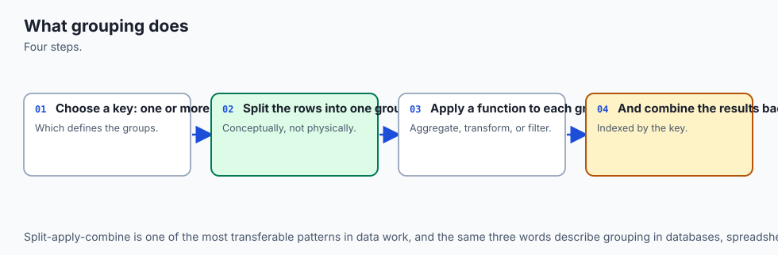
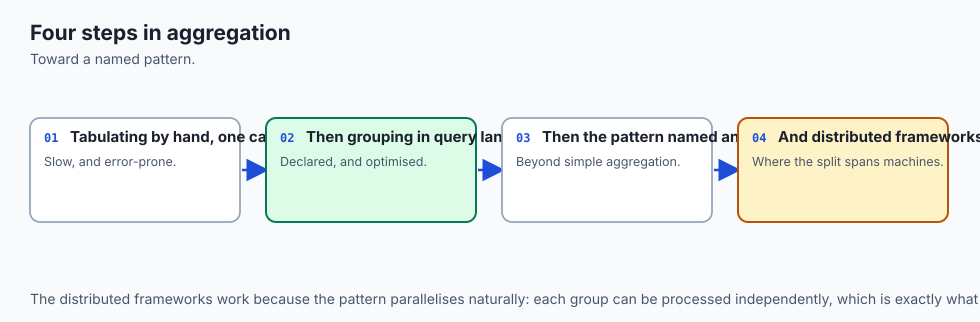
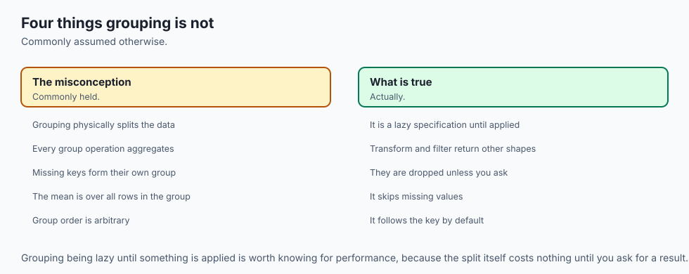
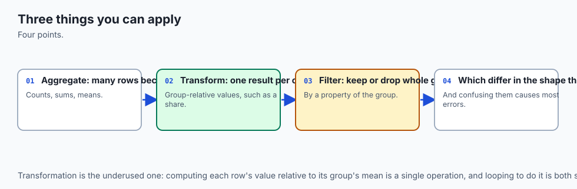
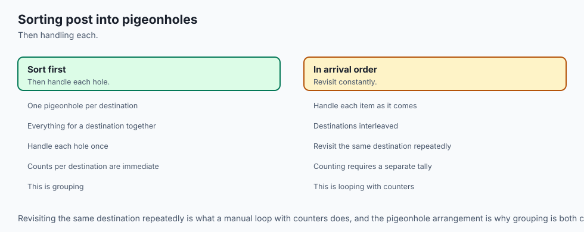
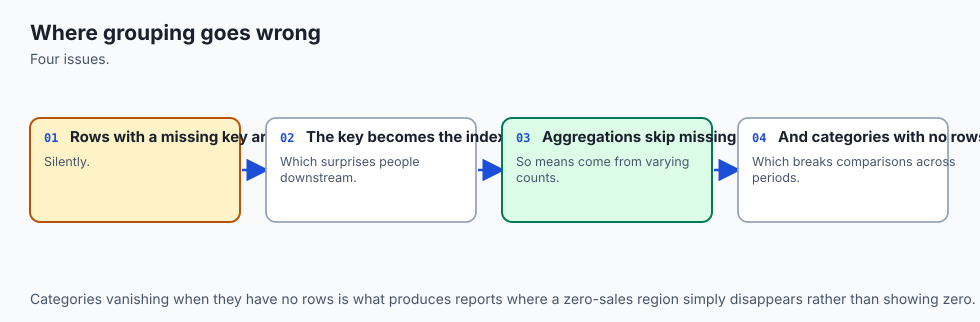
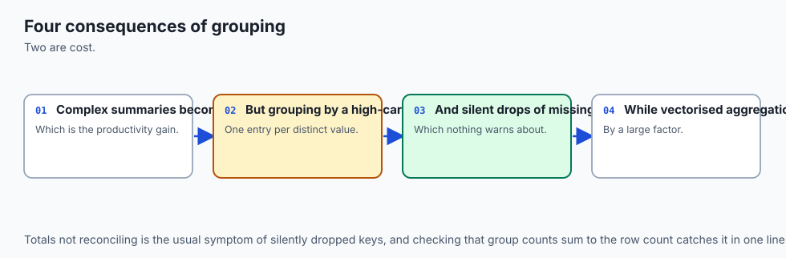
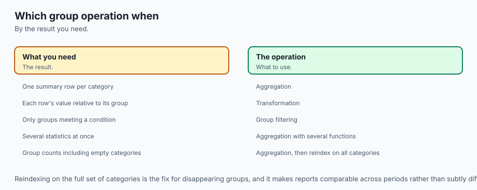

## Why this matters

Run this on pandas 3.0.5 and read the two numbers before anything else:

```text
>>> orders.groupby("region")["amount"].sum().sum()
1945.0
>>> orders["amount"].sum()
2115.0
```

Same twelve rows. Same `amount` column. Two different totals, and pandas raised no exception, printed no warning, and returned a completely plausible-looking number both times. The gap — 170.0 — is not a rounding error and not a bug. It is exactly the `amount` on the two rows whose `region` was never recorded. `groupby` dropped them, silently, because `dropna=True` is the default, and nothing about the grouped output tells you it happened. The per-region report you just built looks complete. It is missing a category entirely: the rows nobody labelled.

That is the entire subject of this lesson, and it deserves to be said plainly rather than gently: **`groupby` drops rows whose key is missing, by default, and the sum of your per-group totals will be less than the true total whenever that happens.** A revenue report grouped by region that quietly omits every order whose region field was left blank is wrong in the direction nobody checks, because the number that comes out the other end is smaller, tidier, and entirely uncontradicted by anything pandas tells you. If your instinct is "that would show up as an obviously wrong number" — it does not. `region_totals.sum()` for this exact table returns `1945.0`, a number with no red flag anywhere near it, and the person reading the dashboard has no way to know that 170 dollars of real revenue never made it into any bucket.

Day 122 taught this same shape of failure for boolean masks: a filter that drops `NaN` rows silently, so the kept half and the dropped half no longer sum back to the whole unless you specifically account for missing values. Today's lesson is that exact invariant wearing a new costume. `groupby` is doing the same thing Day 122's masks did — quietly deciding that a row with no label does not belong anywhere — except now it is happening inside an aggregation that produces numbers people put directly into reports, dashboards and models. The fix is one keyword, `dropna=False`, and the habit that catches this entire class of bug is one sentence, repeated at the end of nearly every exercise in this lesson: **after any groupby aggregation, check that the parts reconcile with the whole.**

`groupby` has a second, quieter trap sitting right next to the first one, and it is worth naming before you meet it in the wild: `.size()` and `.count()` sound like synonyms and are not. `size()` counts rows. `count()` counts non-missing values, per column. They agree everywhere the data is complete and disagree exactly where it is not — which means confusing them silently misstates a denominator in exactly the situation where getting the denominator right mattered most. Both are correct answers to two different questions, and pandas will happily let you ask the wrong one.

By the end of today you will be able to build a `groupby` aggregation four different ways, know precisely when to reach for `agg` versus `transform` versus `apply`, filter whole groups rather than individual rows, group by more than one key at once, control whether an unobserved categorical combination manufactures a phantom row, and measure — honestly, on this one machine, on this one day — how much a built-in aggregation beats the equivalent hand-rolled `.apply`. Every one of those skills sits on top of the same discipline the opening failure teaches: split, apply, combine, and always check that combine gave you back the whole.

## The idea in plain language



**Split, apply, combine.** That is the entire mental model, and it is worth holding in exactly that order because pandas executes it in exactly that order, even when the code you write looks like one method call.

**Split**: pandas looks at the column (or columns) you grouped by and sorts every row into a bucket, one bucket per distinct value. A row with `region = "North"` goes in the North bucket. A row with `region = "South"` goes in the South bucket. A row whose `region` is missing — genuinely absent, `NaN` — goes, by default, **nowhere**. It is not placed in a bucket of its own; it is left out of the split entirely, which is the mechanism behind this lesson's opening failure. If you want a bucket for the missing rows too, you have to ask for one explicitly with `dropna=False`.

**Apply**: whatever function you asked for — `sum`, `mean`, a NumPy function, a function you wrote yourself — runs once per bucket, on that bucket's rows only. North's function call never sees a South row. This is the part almost everyone already has right; it is the part most people underestimate.

**Combine**: the per-bucket results get stitched back together into one final object. This is where the shape of your output is decided, and it is where the second half of this lesson's subject lives: `agg` combines by shrinking each bucket down to one row, so a five-bucket grouping produces a five-row result no matter how many rows fed each bucket. `transform` combines differently — it hands every original row *back* its own bucket's result, so the output has exactly as many rows as the input did, in the input's own order. Same split, same apply, genuinely different combine, and the difference in shape is the whole reason both exist.

One more piece of plain language before the precise version: **a `GroupBy` object does nothing on its own.** Writing `df.groupby("region")` does not sum anything, does not sort anything into buckets yet in any way you can observe, and returns instantly no matter how large `df` is. It is a plan, not a result — pandas describes this as *lazy*. The actual split-apply-combine work happens only when you attach an aggregation: `.sum()`, `.agg(...)`, `.transform(...)`, or one of their relatives. Until then you are holding a `DataFrameGroupBy` object that has recorded your intention and computed nothing.

Picture the architecture diagram below. Six rows come in on the left. Two of them — the two whose `region` is blank — fall out at the split stage into their own tray, never reaching any group box, exactly as described above. The three groups that do form each get a function applied inside their own box, and the three per-group results combine into the final table on the right. The caption states the reconciliation explicitly: the grouped total plus the dropped rows' total equals the true overall total, every time, by construction — which is exactly the arithmetic check you should be running on your own aggregations.

![Diagram: a six-row orders table splits into three group boxes by region — North, South, East — with two rows whose region is missing falling out below the split into a separate "dropped: region missing" tray rather than joining any group; each group box has a function applied inside it, producing one summed value per group, and the three group results combine into a final two-column result table; a caption states that groupby drops rows with a missing key by default, silently, and that the fix is dropna=False](./assets/split-apply-combine-architecture.svg)

Now the shape distinction, animated. Six source rows — three North, three South — drift into two buckets. From there, two different combine strategies run side by side. `agg("mean")` produces a two-row result: one row per group, period, and its shape is `(2,)`. `transform("mean")` produces a six-row result: every original row gets its own group's mean attached beside it, in the original order, and its shape is `(6,)` — the input's shape, not the number of groups. Watch where the wires land: `agg`'s wires converge down to two boxes; `transform`'s wires fan back out to six, one per source row.

![Diagram: six rows — three North, three South — sort from a source column on the left into two group buckets; from the North bucket, one wire feeds an agg result table showing a single row, North, mean 120, while another set of wires feeds a transform result column that still has six rows, with every North row showing 120 and every South row showing its own group's mean, so the transform output is the same length and order as the source — a caption states that agg reduces each group to one row while transform returns a value for every original row, the shape difference being the whole point](./assets/groupby-flow.svg)

The everyday-analogy section carries this further with a sorting-and-summarising story you have almost certainly lived through yourself. For now, the short version: `groupby` is a filing system, not a filter. It never deletes a row you asked it to keep — but a row with no label to file it under simply has nowhere to go, unless you build that folder yourself.

## Historical background



`groupby` has been part of pandas since very close to the library's beginning. Wes McKinney's original design for pandas, dating to 2008-2009 and detailed in his own writing on the library's history, treated split-apply-combine as one of the handful of core operations tabular analysis needed a first-class API for — the same operation R's `aggregate` and `by` machinery, and SQL's `GROUP BY`, had each solved in their own ecosystems, but that plain NumPy arrays had no vocabulary for at all. The name and the split-apply-combine framing pandas uses were influenced directly by a 2011 paper by Hadley Wickham, "The Split-Apply-Combine Strategy for Data Analysis," which gave the pattern its now-standard name across both the R and Python data ecosystems — pandas' own documentation cites it explicitly as the conceptual model `groupby` implements.

Named aggregation — the `df.groupby(...).agg(result_name=("column", "function"))` syntax this lesson treats as the modern, readable default — is a comparatively recent addition, introduced in pandas 0.25 (2019) specifically to solve a readability problem: the older list-of-functions and dict-of-columns forms of `.agg()` (both still fully supported and covered below) tend to produce a `MultiIndex` on the result columns, which is exactly correct and exactly unpleasant to read or flatten by hand. Named aggregation trades a small amount of verbosity for output columns that are flat from the start.

`observed=`, this lesson's other genuinely modern-feeling knob, exists because of a separate and much older pandas feature: the `Categorical` dtype, which lets a column declare a fixed universe of possible values even when only some of them appear in the actual data. Grouping by a categorical column has always, by default, produced a row for every category in that universe — including categories that were never observed in a single row — because pandas could not know in advance whether the absence of a category was meaningful (a segment that genuinely had zero activity, worth reporting as zero) or incidental (a category that simply is not relevant to this particular slice of data).

`observed=True`, which restricts the result to combinations that actually occurred, has existed as an opt-in for a long time; what has changed across recent pandas releases is a growing, explicit warning campaign urging users to *pass it explicitly* rather than rely on the default, because as more real datasets use several categorical keys at once, the unobserved-combination explosion this lesson measures in the Implications section has become a well-documented memory hazard rather than a corner case.

The version installed for this lesson, checked directly:

```text
>>> import pandas; pandas.__version__
'3.0.5'
```

Nothing in this lesson's core `groupby` mechanics — split-apply-combine, `agg`, `transform`, `filter`, multi-key grouping — changed behaviour between pandas 2.x and pandas 3.0. Unlike Day 120's index-alignment and Copy-on-Write material, today's subject is stable, mature API surface; where a specific detail is more recent (named aggregation, the `observed=` warning campaign) or version-sensitive (`include_groups=` on `apply`, covered in exercise 9), this lesson says so at the point it comes up, and `expected-output/FIELDS.md` in the lab records every one explicitly.

## What it is — and what it is not



**`groupby`** is pandas' implementation of the split-apply-combine pattern: given one or more columns to group by, it splits a DataFrame or Series into buckets sharing the same value(s) on those columns, lets you apply a function independently to each bucket, and combines the per-bucket results back into a single pandas object whose shape depends on which combine strategy you chose.

**It is not a filter.** A filter — Day 122's subject — decides, row by row, whether each row survives, and returns some subset of the original rows unchanged. `groupby` never discards a row's *values*; it reorganises which bucket a row belongs to and then runs a function over each bucket. The one place `groupby` looks filter-like is `GroupBy.filter`, covered explicitly in this lesson because the shared word causes real confusion: `filter` on a `GroupBy` keeps or drops **entire groups** based on a predicate evaluated once per group (`len(group) >= 3`, `group["amount"].sum() > 1000`), never individual rows within a surviving group. It is a different operation wearing a familiar name.

**It is not one operation; it is three, and confusing them is the single most common `groupby` mistake.** `.agg()` reduces each group to a summary — one row per group, output shorter than input. `.transform()` computes a per-group statistic and hands it back to every row that belongs to that group — output the same length as the input. `.apply()` is the fully general escape hatch: your function receives each group as a whole DataFrame (or Series) and can return almost anything — a scalar, a Series, a DataFrame — and pandas does its best to reassemble whatever comes back into something sensible. `.apply()` is also, measured honestly in this lesson's exercise 8, meaningfully slower than the equivalent built-in `.agg()` call, because it drops out of pandas' optimised, mostly-C aggregation paths and calls your Python function once per group.

**It is not free of a default you should actively decide about, twice.** `dropna` (default `True`) decides whether rows with a missing group key get their own bucket. `observed` (default `False`, for categorical group keys specifically) decides whether every possible categorical combination gets a row even when it was never observed in the data. Both defaults are reasonable starting points and both are wrong for a meaningful fraction of real analyses — this lesson's job is to make sure you are choosing them on purpose rather than inheriting whichever one pandas happened to pick.

**It is, ultimately, the same "does this group's identity actually exist" question Day 120 asked about index labels and Day 122 asked about boolean masks, applied one level up.** An index label that appears on only one side of an arithmetic operation produces `NaN`. A boolean mask built from a comparison against `NaN` silently excludes that row. A `groupby` key that is missing silently excludes that row from every bucket. Three different mechanisms, one recurring shape: pandas treats "I don't have enough information to place this" as a silent omission rather than an error, and the discipline this whole course arc is building is checking for that omission rather than assuming it cannot have happened.

## Why it was created and what problems it solves

Before `groupby`, "compute a summary per category" in Python meant one of a small number of unpleasant options, all of which this lesson's arc has already met in other guises. You could write a Python-level loop that builds a dictionary of running sums keyed by category, manually handling every edge case (what happens on a key you have not seen yet? what happens on a missing key?) yourself, in Python, at Python's per-iteration speed — the exact cost Day 104 measured for vectorised NumPy work and this lesson's exercise 8 measures again for `.apply()`. You could reach for the standard library's `csv` module plus `itertools.groupby`, which requires the input to already be sorted by the grouping key (a constraint `pandas.groupby` does not share) and hands you an iterator of groups with no aggregation machinery at all — you would still write every sum, mean and count by hand.

Or you could leave Python entirely for SQL's `GROUP BY`, which solves the aggregation cleanly but requires the data to already be inside a database, with all the friction that implies for a dataset that started life as a CSV file or an API response.

`groupby` exists to bring SQL's `GROUP BY` — and R's `aggregate`/`dplyr::group_by` — ergonomics into the same in-memory, general-purpose Python environment where the rest of a pipeline already lives, without forcing a database round-trip for what is often a single exploratory question. The specific problems it solves, concretely:

**The problem of writing the same accumulation logic over and over.** Every "sum by category," "average by segment," "count by day" question shares the same three-step shape — split, apply, combine — and `groupby` gives that shape a single, well-tested implementation instead of a new hand-rolled loop every time, with the correctness edge cases (empty groups, missing keys, ties) handled once, centrally, rather than reinvented and occasionally gotten wrong in every analysis script.

**The problem of choosing the right combine shape.** Before `transform` existed as a named, optimised operation, attaching a group statistic back onto every row of the original data required an explicit `merge` — compute the per-group means, then join them back onto the original DataFrame on the grouping key — which works, but is two operations doing the job of one and easy to get subtly wrong (a merge on the wrong key silently drops or duplicates rows, the exact hazard Day 120's index-alignment lesson covered). `transform` does the split, apply and rejoin in one call, guaranteed to preserve the original row count and order.

**The problem of an aggregation silently erasing evidence.** This is the problem this lesson's opening failure exists to name directly. A hand-rolled accumulation loop that iterates only over rows with a non-missing key will make exactly the same silent omission `groupby(dropna=True)` makes — the difference is that `groupby`'s behaviour is at least a documented, nameable default you can look up and override, rather than an implicit consequence of how somebody happened to write a loop. Naming the default is the first step toward checking it.

## How it works



Walk the full mechanism end to end, on the six-row `sales` table used throughout this lesson's examples: `region` takes one of North, South, East or West, three rows each, an `amount` column.

**Step one: `df.groupby("region")` builds a `DataFrameGroupBy` object and does no computation.** Internally, pandas computes which rows belong to which group — a mapping from each unique value of `region` to the row positions that share it — but it does not run any aggregation function yet. This is the laziness this lesson's plain-language section named: the object exists, carries the grouping plan, and is cheap to create no matter how large the underlying frame is.

```text
>>> type(sales.groupby("region"))
<class 'pandas.api.typing.DataFrameGroupBy'>
```

**Step two: an aggregation call triggers the split.** The moment you attach `.sum()`, `.agg(...)`, `.transform(...)`, `.filter(...)` or iterate the object directly, pandas partitions the rows into their groups. Rows whose `region` is `NaN` are, by default (`dropna=True`), excluded from every partition — they belong to none of the buckets pandas builds, which is the mechanism behind this lesson's opening measurement.

**Step three: the function runs once per bucket, seeing only that bucket's rows.** For `.agg("mean")`, pandas computes the mean of `amount` within each of the four regions independently — North's mean never involves a South row, and vice versa. For most built-in aggregations (`sum`, `mean`, `count`, `std`, `min`, `max`, and more), pandas dispatches to an optimised, largely C-level implementation that operates on all groups at once rather than genuinely looping in Python — this is the performance gap exercise 8 measures against `.apply`, which does genuinely call a Python function once per group.

**Step four: combine, and the shape decision.** `.agg(...)` returns one row per group — a Series or DataFrame indexed by the group key(s), shorter than the input whenever any group has more than one row. `.transform(...)` returns a result the same length as the input, in the input's original row order, with every row carrying its own group's computed value. `.filter(...)` returns a subset of the *original* rows — every row belonging to a group whose predicate evaluated to `True`, with the group's internal structure otherwise untouched. `.apply(...)` inspects what your function returned for each group and does its best to assemble a sensible combined result, which can end up looking like any of the other three depending on what you returned.

Named aggregation, `.agg()`'s modern form, is worth walking through explicitly because it differs from the older forms in a way that matters for readability:

```text
>>> sales.groupby("region").agg(total=("amount", "sum"), avg=("amount", "mean"), n=("order_id", "count"))
         total    avg  n
region
East    1080.0  360.0  3
North    360.0  120.0  3
South    600.0  200.0  3
West     195.0   65.0  3
```

Each keyword argument names one output column and pairs it with a `(source_column, function)` tuple. Compare this against the list form, `.agg(["sum", "mean", "count"])`, which produces the same numbers but under a `MultiIndex` of `(original_column, function_name)` pairs — correct, but noticeably more work to flatten if you need plain column names downstream. Named aggregation was added specifically to skip that flattening step.

`GroupBy.filter` deserves its own worked trace because the word "filter" already means something different in this course, as of Day 122. `orders.groupby("region").filter(lambda g: len(g) >= 3)` calls its predicate once per group — `len(g)` for each of the four regional groups — and keeps every row belonging to a group where that predicate was `True`, dropping every row belonging to a group where it was `False`, wholesale. On the `orders` table, West has only one row; the predicate `len(g) >= 3` is `False` for West, and every West row — all one of them — is removed, while North, South and East, each with three or more rows, survive completely intact. Nothing about an individual row's own values enters the decision; only its group's aggregate property does.

Multi-key grouping extends the same mechanism to more than one column at once: `sales.groupby(["region", "rep"])["amount"].sum()` splits on the combination of `region` and `rep` together, and the combined result carries a `pandas.MultiIndex` with one level per grouping key. `as_index=False` asks for the same values in a flat DataFrame instead, with the grouping columns as ordinary columns rather than index levels — generally the more convenient form when the result is headed straight into a plot, a CSV export, or another merge, while the `MultiIndex` form is more convenient when you plan to do further `.loc`-based lookups by group.

## An everyday analogy



You are sorting a box of mixed receipts into folders by month, so you can total each month's spending. This is the whole split-apply-combine story, lived rather than coded.

**Split**: you go through the box once, and every receipt with a legible date on it goes into its month's folder. A receipt with a smudged, unreadable date does not get its own folder by default — you set it aside on the desk, outside every folder, because you have not decided yet where it belongs. That pile on the desk is exactly `dropna=True`'s missing-key rows: not lost, not destroyed, just never placed inside any folder unless you deliberately create a "date unknown" folder for them (`dropna=False`).

**Apply**: you take each folder to the calculator, one at a time, and total it. The January folder's total never includes a February receipt, because you never mixed the folders — this is the part of the process that essentially always goes right, by hand or by pandas, because keeping the piles separate is the easy half of the job.

**Combine, and the shape choice**: here the analogy earns its keep, because there are genuinely two different things you might want at the end, and they look completely different. If you want a **summary report** — one line per month, its total — that is `agg`: twelve folders in, twelve lines out, however many receipts each folder held. If instead you want to go back through the *original, unsorted pile of receipts* and write each month's total onto every one of that month's own receipts — so you can later ask "was this particular receipt above or below its month's average?" — that is `transform`: the same number of receipts you started with, in the same order, each one now carrying its own month's total written on the back. The report is short; the annotated pile is exactly as long as what you started with. Neither is more "correct" than the other — they answer different questions, and the whole of exercise 4 is building both from one calculation and checking their shapes.

Now the two traps. `count()` versus `size()` is the difference between "how many receipts are in this folder" (size — every receipt, smudged amount or not) and "how many receipts in this folder have a legible amount I can actually total" (count — only the readable ones). If three receipts are in the January folder but one has a smudged total, `size()` says 3 and `count()` says 2, and neither is wrong — they are answers to genuinely different questions, and mistaking one for the other misstates whatever average or rate you compute next.

And `GroupBy.filter` is the moment, after totalling every folder, when you decide "any month with fewer than three receipts isn't worth reporting on its own — fold it into a footnote instead." You are not discarding individual receipts based on anything about them personally; you are discarding an entire folder based on a property of the folder as a whole. That is precisely what distinguishes it from Day 122's row-level filtering, which would instead have asked, receipt by receipt, "is this one over $50?" — a completely different kind of question, wearing the same word.

## Examples in practice



Every value below is captured from a real run against pandas 3.0.5, pyarrow 25.0.1 and NumPy 2.5.2, using the exact `orders`, `sales`, `cat_sales`, and `weighted` tables defined in this lesson's lab (`labs/.../day-123-groupby-and-aggregation/starter/data.py`), so every number here is independently reproducible by running that lab.

**The reconciliation invariant.** `orders` has twelve rows; two have no `region`.

```text
>>> orders.groupby("region")["amount"].sum()
region
East     1200.0
North     370.0
South     375.0
West        0.0
Name: amount, dtype: float64
>>> orders.groupby("region")["amount"].sum().sum()
1945.0
>>> orders["amount"].sum()
2115.0
>>> orders["amount"].sum() - orders.groupby("region")["amount"].sum().sum()
170.0
>>> orders.loc[orders["region"].isna(), "amount"].sum()
170.0
```

The gap and the missing-key rows' total match to the cent, exactly as the architecture diagram states. With `dropna=False`, the same table reconciles completely:

```text
>>> orders.groupby("region", dropna=False)["amount"].sum()
region
East     1200.0
North     370.0
South     375.0
West        0.0
NaN       170.0
Name: amount, dtype: float64
>>> orders.groupby("region", dropna=False)["amount"].sum().sum()
2115.0
```

**`count` versus `size`.** The same table also has two rows with a missing `amount` (independent of the missing-region rows above):

```text
>>> g = orders.groupby("region", dropna=False)
>>> g.size()
region
East     3
North    3
South    3
West     1
NaN      2
dtype: int64
>>> g["amount"].count()
region
East     3
North    3
South    2
West     0
NaN      2
Name: amount, dtype: int64
```

South's `size` is 3 but its `count` is 2 — one South row's `amount` is missing. West's `size` is 1 but its `count` is 0 — its one and only row has a missing `amount` too. Summed across every group, `size` minus `count` equals 2, exactly `orders["amount"].isna().sum()`.

**`.agg()` four ways**, on the clean `sales` table (four regions, three rows each, no missing values):

```text
>>> sales.groupby("region")["amount"].agg("sum")
region
East     1080.0
North     360.0
South     600.0
West      195.0
Name: amount, dtype: float64

>>> sales.groupby("region")["amount"].agg(["sum", "mean", "count"])
           sum        mean  count
region
East    1080.0  360.000000      3
North    360.0  120.000000      3
South    600.0  200.000000      3
West     195.0   65.000000      3

>>> sales.groupby("region").agg({"amount": "sum", "order_id": "count"})
         amount  order_id
region
East    1080.0         3
North    360.0         3
South    600.0         3
West     195.0         3

>>> named = sales.groupby("region").agg(total=("amount", "sum"), avg=("amount", "mean"), n=("order_id", "count"))
>>> named.columns.tolist()
['total', 'avg', 'n']
```

The list form's columns are `['sum', 'mean', 'count']` directly on the Series's result — flat here because only one column (`amount`) was selected before aggregating. Aggregate a whole DataFrame with the list or dict form instead of a single selected column, and the result columns become a genuine `MultiIndex` of `(original_column, function)` pairs; named aggregation's `['total', 'avg', 'n']` stays flat regardless, which is the readability win this lesson keeps pointing at.

**Shapes: `agg` versus `transform`.**

```text
>>> sales.groupby("region")["amount"].agg("mean").shape
(4,)
>>> sales.groupby("region")["amount"].transform("mean").shape
(12,)
>>> sales.shape
(12, 4)
```

Four groups, four rows out of `agg`; twelve rows in, twelve rows out of `transform`. A within-group z-score, built entirely from `transform`:

```text
>>> group_mean = sales.groupby("region")["amount"].transform("mean")
>>> group_std  = sales.groupby("region")["amount"].transform("std")
>>> zscore = (sales["amount"] - group_mean) / group_std
>>> zscore.groupby(sales["region"]).mean()
region
East     0.000000e+00
North    0.000000e+00
South    0.000000e+00
West     3.700743e-17
Name: amount, dtype: float64
```

Every group's z-scores average to 0, to within floating-point noise — West's `3.7e-17` is not a real nonzero mean, it is the ordinary floating-point residue of subtracting a mean computed from the same numbers, which is exactly why the lab's assertion uses `pytest.approx` rather than exact equality there.

**`GroupBy.filter`.**

```text
>>> orders.groupby("region").size()
region
East     3
North    3
South    3
West     1
dtype: int64
>>> survivors = orders.groupby("region").filter(lambda g: len(g) >= 3)
>>> sorted(survivors["region"].unique())
['East', 'North', 'South']
>>> survivors.shape[0]
9
```

West, with a single row, is dropped whole; the other three groups, each with three rows, survive completely intact — 9 rows total, exactly the sum of the three surviving groups' own sizes.

**Multi-key grouping.**

```text
>>> sales.groupby(["region", "rep"])["amount"].sum()
region  rep
East    Ann    420.0
        Cy     660.0
North   Ann    280.0
        Bo      80.0
South   Bo     450.0
        Cy     150.0
West    Ann     60.0
        Bo      90.0
        Cy      45.0
Name: amount, dtype: float64
>>> _.index.names
FrozenList(['region', 'rep'])
>>> sales.groupby(["region", "rep"], as_index=False)["amount"].sum().head(2)
  region rep  amount
0   East Ann   420.0
1   East  Cy   660.0
```

**`observed=`.** Declare both `region` and `rep` as categoricals whose category lists include values never actually present in the data (a fifth region, `Central`, and a fourth rep, `Deb`):

```text
>>> cat_sales.groupby(["region", "rep"], observed=False).size().shape
(20,)
>>> cat_sales.groupby(["region", "rep"], observed=True).size().shape
(9,)
```

Five region categories times four rep categories is twenty possible combinations; only nine ever actually occur in the twelve rows of real data. `observed=False` manufactures rows for all twenty, most of them zero-count phantoms; `observed=True` reports only the nine that are real.

**Performance: built-in `.agg` versus `.apply`.** On a synthetic 200,000-row frame with 2,000 distinct keys:

```text
>>> ratio = apply_seconds / builtin_seconds
>>> f"{ratio:.1f}x"
'13.7x'
```

That specific ratio is one machine, one Python build, one afternoon — not a promised number. What is stable and worth remembering is the *shape* of the gap: `.agg("mean")` dispatches to a vectorised, largely C-level path that processes every group in one pass; `.apply(lambda g: g.mean())` genuinely calls a Python function once per distinct group — 2,000 separate Python-level calls here — and pays Python's per-call overhead 2,000 times over. This lesson's lab asserts only a conservative floor, `ratio >= 3.0`, so the check holds regardless of exactly how fast or slow any particular machine happens to be.

**A weighted mean, two ways.** `weighted` has three regions of unequal size and unequal per-row weights:

```text
>>> def weighted_mean(group):
...     return np.average(group["value"], weights=group["weight"])
>>> via_apply = weighted.groupby("region").apply(weighted_mean, include_groups=False)
>>> via_apply
region
East     60.0
North    17.5
South    13.0
dtype: float64
```

And the same three numbers, built without `apply` at all — a `value * weight` column, summed per group alongside the weights, then divided:

```text
>>> products = weighted.assign(vw=weighted["value"] * weighted["weight"])
>>> sums = products.groupby("region").agg(sum_vw=("vw", "sum"), sum_w=("weight", "sum"))
>>> (sums["sum_vw"] / sums["sum_w"]).equals(via_apply)
True
```

Both routes agree exactly. This is exercise 9's whole point: `apply` is genuinely the more *readable* way to express "a weighted mean per group" as a single function — `np.average(group["value"], weights=group["weight"])` reads like the definition — and you do not have to take its correctness on faith, because the vectorised route above checks it.

## Implications: security, privacy, performance, scalability, and cost



**Silent omission is the security-adjacent concern this whole lesson is built around, and it is also this lesson's AI thread.** Per-group metrics are how model failures are actually found: an aggregate accuracy number can look perfectly healthy while hiding a segment where the model is unusable, and Day 116's Simpson's paradox already showed that an aggregate can even point in the *opposite* direction from what every subgroup individually shows. `groupby("segment")["correct"].mean()` is, in practice, the single most common way a fairness or coverage check gets run — and it inherits `dropna=True`'s default behaviour whether or not the person running it thought about it. The rows most likely to have a missing segment label are, in a great deal of real data collection, disproportionately the rows collected under worse conditions: a hurried intake form, a legacy system that never required the field, a user who declined to self-report. A `groupby`-based fairness report that silently drops those rows is not merely incomplete — it produces a report with a hole in it exactly where the least-well-recorded users are, which are rarely the users an organization can afford to miss, and the report gives no signal that anything is missing at all. This is not a hypothetical add-on to the lesson; it is the mechanism exercise 1 measures directly, applied to whichever column actually matters in your own data.

**`observed=`'s cost is a genuine, measurable memory hazard, not a stylistic preference.** Grouping by `k` categorical columns with category counts `c_1, c_2, ..., c_k` and `observed=False` builds a result with up to `c_1 x c_2 x ... x c_k` rows — the product of every category count, regardless of how many combinations actually occur in the data. This lesson's two-key example (5 x 4 = 20) is small enough to be harmless; a real dataset with, say, five categorical keys of 50 categories each produces `50**5` — over 300 million — potential rows under `observed=False`, the overwhelming majority of them empty. `observed=True` is the difference between a result sized to the data you actually have and a result sized to the Cartesian product of every category your data *could* theoretically contain.

**Performance: `agg` beats `apply` because it stays inside pandas' vectorised paths; `transform` sits in between depending on what you pass it.** Passing a built-in name (`"mean"`, `"sum"`, `"std"`) to `.agg()` or `.transform()` dispatches to an optimised implementation. Passing your own Python function — to any of `agg`, `transform` or `apply` — means pandas calls that function once per group, in Python, and pays Python's function-call overhead that many times over; the gap this lesson measured (roughly 10-15x on 2,000 groups) grows with the number of groups, because the number of Python-level calls grows with it while the built-in path's per-group cost stays essentially fixed. `sort=False` is a smaller, easy win in the same direction: `groupby` sorts its result by the group key by default, and when the order genuinely does not matter downstream, skipping that sort avoids work for free.

**Scalability has a hard edge `groupby` does not soften: it all happens in memory.** Every group's rows, and every intermediate result, live in the same process's RAM as the rest of the DataFrame. A dataset that does not fit in memory does not become groupable by switching functions — this is precisely the situation Week 13's SQL, or a database `GROUP BY` executed where the data already lives, is the better tool for, covered concretely in the Alternatives section below.

**Cost, in the plain financial sense, is not a pandas concern at all — every tool discussed today is free and open source, with no paid tier gating any capability covered in this lesson.** The only cost trade-off worth naming is engineering time: writing and maintaining a hand-rolled aggregation loop, or debugging a `groupby`-based report that silently dropped a category nobody checked for, both cost more time than the one-line `dropna=False` or `observed=True` that would have prevented the problem in the first place.

## Alternatives: free, open source, and commercial

**pandas `groupby`** (ran). Free, open source (BSD 3-Clause), no paid tier. Choose it when your data already fits comfortably in memory as a DataFrame and you want the split-apply-combine result inline with the rest of a Python analysis or ML pipeline. Called as `df.groupby(keys).agg(...)` / `.transform(...)` / `.filter(...)`, exactly as demonstrated throughout this lesson. This is the default choice for this entire course's data-analysis arc, and every example above was run for real.

**`pivot_table`** (ran) — a close relative worth naming explicitly, because the same "sum by region" question is sometimes more readable spelled as a table than as a grouped Series:

```text
>>> sales.pivot_table(index="region", columns="rep", values="amount", aggfunc="sum", fill_value=0)
rep       Ann     Bo     Cy
region
East    420.0    0.0  660.0
North   280.0   80.0    0.0
South     0.0  450.0  150.0
West     60.0   90.0   45.0
```

`pivot_table` is built on `groupby` internally, so it is not a competing engine — it is the same computation with one grouping key sent to the columns axis instead of stacked into rows, `fill_value` filling in the combinations that were never observed (the pivot-table analogue of `observed=False`'s zero rows, made deliberately visible rather than accidentally hidden). Choose `pivot_table` over a plain `groupby` when the natural reading of the result is a small cross-tab — region by rep, day by hour — and choose `groupby` when the result you want is a tidy long-format Series or DataFrame headed into a plot, a merge, or another `groupby`. Free, same licence as pandas, no separate cost.

**SQL `GROUP BY` via Python's standard-library `sqlite3`** (ran) — the right tool the moment the data already lives in, or belongs in, a database rather than in memory:

```text
>>> import sqlite3
>>> conn = sqlite3.connect(":memory:")
>>> sales.to_sql("sales", conn, index=False)
>>> cur = conn.execute("SELECT region, SUM(amount) AS total, COUNT(*) AS n FROM sales GROUP BY region ORDER BY region")
>>> cur.fetchall()
[('East', 1080.0, 3), ('North', 360.0, 3), ('South', 600.0, 3), ('West', 195.0, 3)]
```

Same numbers as pandas' `groupby`, computed by the database engine instead. `sqlite3` is in the Python standard library — no install, no cost, no separate service to run. The honest, practical note: **if the data is already sitting in a database, grouping it there and pulling back only the summarised result is usually better than pulling every raw row into Python first and grouping it in pandas** — the database can use its own indexes and query planner, and the amount of data crossing the wire into your Python process shrinks from every row to one row per group. Reach for pandas `groupby` when the data is already a DataFrame in memory or needs pandas-specific manipulation before or after grouping; reach for SQL `GROUP BY` when the source of truth is, or should be, the database.

**polars `group_by`** (docs only — polars is not installed in this lesson's environment, and no output from it is reproduced anywhere here). polars' equivalent API, `df.group_by("region").agg(pl.col("amount").sum())`, follows the same split-apply-combine model but is built on Apache Arrow with a lazy query-planner (`.lazy()` / `LazyFrame`) that can fuse a grouping with an upstream filter or projection before executing anything, and polars' documentation states its `group_by` implementation is multi-threaded by default, which pandas' `groupby` generally is not. polars is free and open source (MIT licence). Choose it, based on its documentation rather than anything measured here, when a dataset is large enough that pandas' single-threaded aggregation becomes the bottleneck and a rewrite to a different DataFrame library is worth the migration cost; choose pandas when the surrounding ecosystem — this course's Days 120-122, most existing tutorials, most notebooks you will read — already assumes it.

**Commercial options** exist mainly as the managed layer around one of the above rather than as a competing aggregation engine: managed Spark or BigQuery services execute a `GROUP BY`-equivalent at a scale no single machine's pandas process could reach, priced by compute and storage rather than by a licence fee for the aggregation operation itself. None of that machinery was run for this lesson; it is named here only so the free-versus-paid picture is complete — every concrete number in this lesson came from pandas, `pivot_table`, or `sqlite3`, all free.

## Comparison with related concepts

| Operation | What it decides | Output shape versus input | Where covered |
| --- | --- | --- | --- |
| Boolean-mask / `.query()` filtering | Keep or drop each **row**, independently | Fewer or equal rows, same columns | Day 122 |
| `GroupBy.filter` | Keep or drop each **whole group** | Fewer or equal rows (in whole-group units), same columns | Today, exercise 5 |
| `.agg()` | Reduce each group to one summary row | One row per group — shorter than the input whenever any group has more than one row | Today, exercises 3-4 |
| `.transform()` | Attach a group statistic to every original row | Exactly the input's row count and order | Today, exercise 4 |
| `.apply()` on a `GroupBy` | Run an arbitrary function per group; shape follows whatever the function returns | Depends entirely on the function | Today, exercise 9 |
| `pivot_table` | The same aggregation as `groupby`, reshaped into a cross-tab | One row per index-axis value, one column per columns-axis value | Today, Tools |
| SQL `GROUP BY` | Same split-apply-combine, executed by a database engine | One row per group, same as `.agg()` | Week 13, today's Tools |

The row most worth re-reading is the first two: `.query()` filtering and `GroupBy.filter` share the word "filter" and do genuinely different things — the former decides row by row, the latter decides group by group, and mistaking one for the other is the specific confusion exercise 5's docstring warns against by name.

`size()` and `count()` deserve their own short comparison, since they are not really alternatives to each other so much as answers to two different questions that happen to look similar:

| | What it counts | Missing values | Scope |
| --- | --- | --- | --- |
| `size()` | Rows in the group | Included in the count | Whole group |
| `count()` | Non-missing values | Excluded from the count | Per column |

Ask `size()` when you want "how many records are here at all." Ask `count()` when you want "how many of these records actually have a usable value in this specific column."

## When to use it — and when not to



**Use `groupby` when** you have a DataFrame already in memory, you need a summary or a per-group transformation, and the result is headed into more Python — a plot, a model's feature set, a further merge or filter. This describes the overwhelming majority of exploratory data analysis, and it is why `groupby` is one of the most-used methods in the entire pandas API.

**Use `.agg()`, specifically named aggregation, when** the result you want is a summary table — one row per group — and you want its columns to have plain, predictable names without a flattening step afterward.

**Use `.transform()` when** you need a group-level statistic attached back onto every original row: a group mean for a within-group z-score, a group total for a percent-of-group-total column, a group count for a per-group sample-size flag carried alongside every observation. If your next line of code is going to merge an `.agg()` result back onto the original DataFrame by the grouping key, `.transform()` almost always does that in one call instead of two, with less room for a merge-key mistake.

**Use `.apply()` when, and only when,** no built-in or `transform`-able function expresses what you need — a genuinely custom, order-sensitive, or multi-column-interacting per-group computation, like exercise 9's weighted mean. Prefer it for **readability of a one-off calculation you plan to check**, not as a default reach, given the measured performance gap.

**Use `GroupBy.filter` when** the decision to keep or discard is about the group as a whole — too few observations to trust a summary, a group total below some threshold — rather than about any individual row's own values.

**Do not reach for `groupby` when** the data does not fit in memory or is already sitting in a database — Week 13's SQL `GROUP BY`, executed where the data lives, avoids pulling every raw row across into Python only to summarise it back down. **Do not leave `dropna` and `observed` at their defaults without deciding on purpose** — `dropna=True` (the default) is right when a missing key genuinely represents "does not belong to any category worth reporting," and wrong when it represents "belongs to a category that was never recorded," which is a fact about your data collection, not about pandas, and only you can know which one is true for a given column. **Do not reach for `.apply()` first** — try the built-in name or a `transform` first, and drop to `.apply()` only once you have confirmed nothing simpler expresses the computation.

## The AI connection

- **Grouped aggregation is where most engineered features come from**, particularly on
  transactional data.
- **Split, apply, combine is a pattern that recurs everywhere**, including in distributed
  processing.
- **Aggregations computed across a split boundary leak**, which is the most common way feature
  engineering goes wrong.
- **The strongest tabular features are usually group summaries**, which makes this lesson
  directly upstream of model quality.
- **The same pattern powers every analytics query**, in dataframes and in databases alike.

## Knowledge check

Answer each question before checking `quiz.yml`.

1. `orders.groupby("region")["amount"].sum().sum()` returns a number smaller than `orders["amount"].sum()`. What is the most likely cause, and how do you fix it?
2. What is the difference between `.size()` and `.count()` on a `GroupBy` object, and when would they disagree?
3. Which of `.agg()`, `.transform()` and `.apply()` returns a result the same shape as the input?
4. What does named aggregation (`agg(name=(column, func))`) give you that the list form (`agg([func1, func2])`) does not?
5. `GroupBy.filter(lambda g: len(g) >= 3)` — does this keep individual rows with fewer than 3 something, or something else entirely?
6. What does `observed=False` do to a `groupby` over two categorical columns that `observed=True` does not?
7. Why is `.apply()` typically slower than the equivalent built-in `.agg()` call?
8. When is SQL `GROUP BY` a better choice than pandas `groupby` for the same aggregation?

## Hands-on exercise

The lab for this lesson, "Groups That Reconcile," lives at
`labs/sections/math-statistics-and-data/day-123-groupby-and-aggregation/`
and walks all nine exercises worked through above as a real, runnable
pytest suite: the reconciliation invariant, `count` versus `size`, `.agg()`
four ways, `agg`-versus-`transform` shapes with a within-group z-score,
`GroupBy.filter`, multi-key grouping, `observed=`, a measured performance
comparison, and a weighted mean checked two ways.

Set up and run the reference suite first:

```bash
cd labs/sections/math-statistics-and-data/day-123-groupby-and-aggregation
python3 -m venv .venv
.venv/bin/pip install -r requirements/requirements.txt
.venv/bin/pytest examples
```

Then open `starter/00_brief.md` and `starter/test_groupby.py`, and replace
each `pytest.skip(...)` with a real assertion, checking your progress with:

```bash
.venv/bin/pytest starter -v
```

### Expected output

```text
20 passed in 0.06s
```

for `pytest examples`, and, on the checked-in starter,

```text
20 skipped in 0.01s
```

for `pytest starter`. `bash tests/run_tests.sh` ends with:

```text
13 checks, 0 failure(s)
```

and exits 0.

### Validate your work

Run `bash tests/run_tests.sh` from the lab directory. It confirms the
installed pandas matches `requirements.txt` exactly, runs the reference
suite and requires 20 passed, runs your exercise suite, solves every
exercise in a temporary scratch copy to prove a fully-completed suite
passes, deliberately breaks one assertion to prove the suite can genuinely
fail, restores it, and checks nothing was left on disk.

### Troubleshooting

See `troubleshooting.md` in the lab directory for the full list, grouped
by the exact message you see — including the single most common mistake
with this lab's layout: never run `pytest examples starter` in one
command, because both directories define a module named `test_groupby.py`
and the second one collected can silently shadow the first.

### Common mistakes

- Calling `.agg('mean')` on a whole `GroupBy` object instead of a selected
  numeric column first, which raises a `TypeError` the moment a
  non-numeric column (like `rep`) is included.

- Using `agg` where `transform` was needed — subtracting a 4-row `agg`
  result from a 12-row original Series aligns by label rather than
  raising an obviously wrong-shape error, producing mostly `NaN` instead
  of the error you might expect.

- Forgetting that `GroupBy.filter`'s predicate runs once per **group**,
  and writing a predicate that accidentally references an individual
  row's value instead of a group-level aggregate.

- Grouping a plain `object`/`str` column and expecting `observed=` to do
  anything — the unobserved-combination behaviour only applies to
  genuine `pandas.Categorical` columns with a declared category list.

## Practice assignment

Using this lesson's `orders` table (or a dataset of your own with at least
one column that has missing values), build a small report that:

1. Groups by a key column and sums a numeric column, first with the
   default `dropna=True`, then with `dropna=False`.

2. Prints the reconciliation check explicitly: the grouped total, the
   overall total, the gap, and the missing-key rows' own total, asserting
   the last two are equal.

3. Uses named aggregation to produce a summary table with at least three
   named output columns.

4. Uses `.transform()` to attach a group mean back onto every row, and
   computes one derived column (a difference from the group mean, or a
   percent-of-group-total) from it.

Write down, in one paragraph, what would have gone unnoticed in your
report if you had skipped step 2.

## Extension challenge

Take a dataset with **two** categorical columns you believe are
meaningfully correlated (for example, product category and customer
tier). Measure, for real, how many rows `observed=False` manufactures
versus `observed=True` on your actual data, and estimate what that same
measurement would look like if you added a third categorical key with 10
categories. Then rewrite your `.apply()`-based per-group computation (if
you have one) as a vectorised `.agg()`/`.transform()` combination without
`apply`, and measure the real speed difference on your own machine,
reporting it as a ratio rather than a millisecond figure — exactly as
exercise 8 and exercise 9 did in this lesson's lab.
