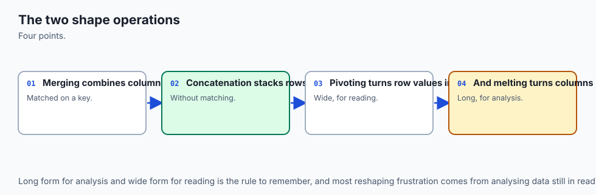
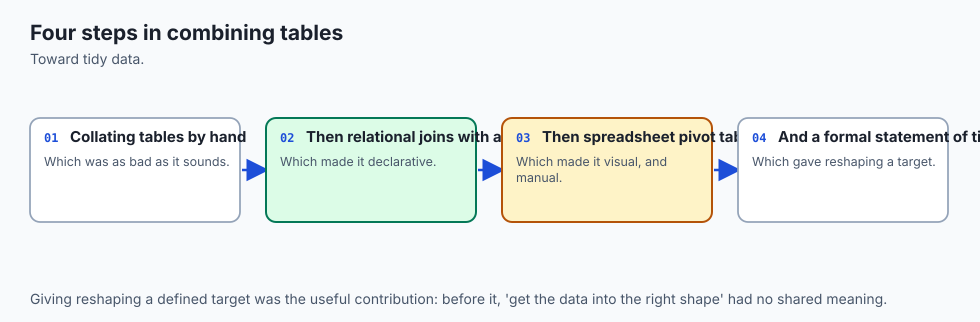
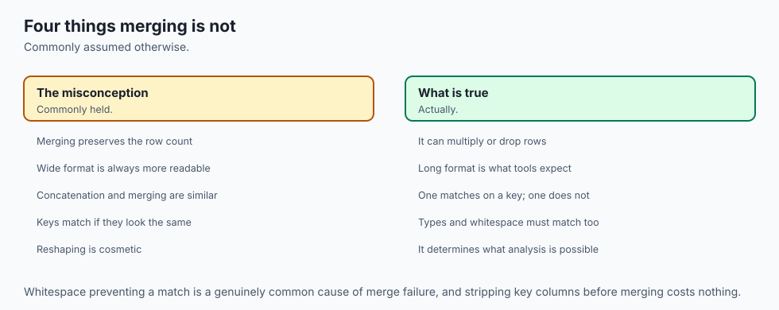
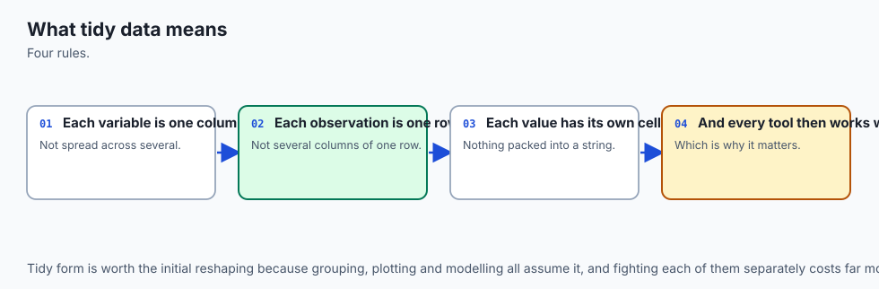
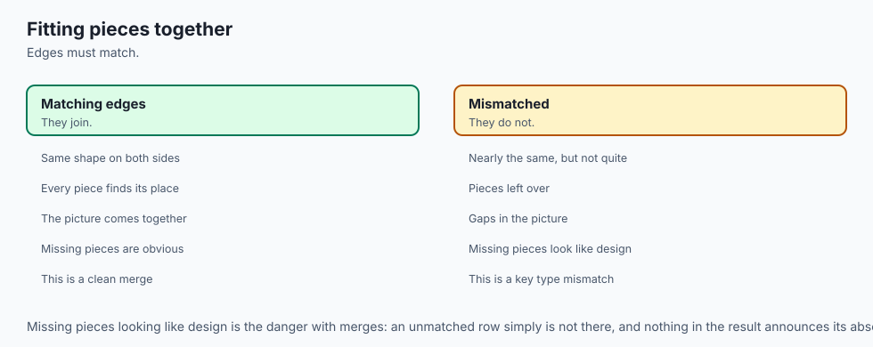
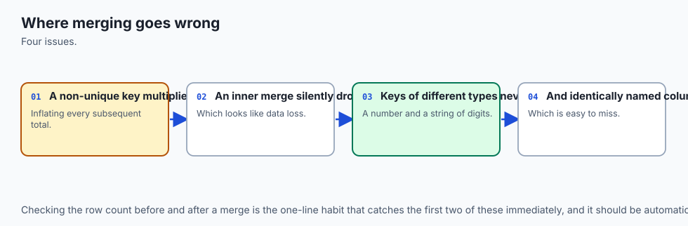
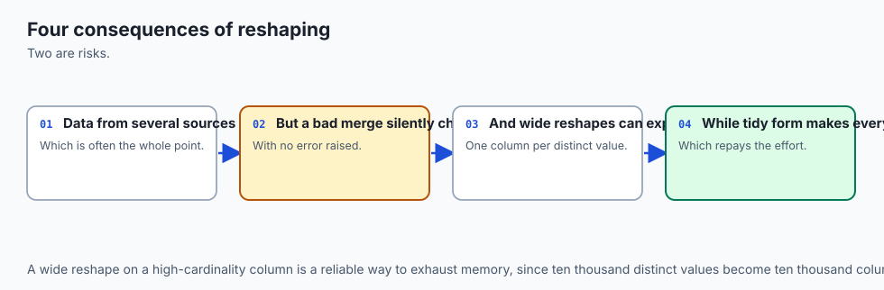
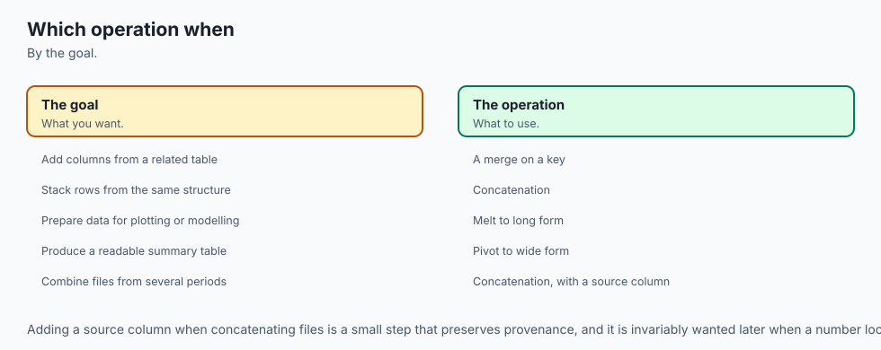

## Why this matters

Run this on pandas 3.0.5 and read the two numbers before anything else:

```text
>>> left.shape
(100, 2)
>>> right.shape
(100, 2)
>>> merged = left.merge(right, on="key", how="inner")
>>> merged.shape
(10000, 3)
```

Two frames, a hundred rows each. Merge them on their shared key, and the result has **ten thousand** rows. Not an error. Not a warning. Not a typo in the shape you were expecting. `left.merge(right, on="key")` did exactly what a merge is defined to do: every row on the left with a given key value is paired with every row on the right that shares it. If that key value is duplicated a hundred times on each side, you get a hundred times a hundred — ten thousand pairings from two hundred rows of real data.

The row count exploded by a factor of a hundred, and pandas told you nothing about it. Every sum, every average, every count downstream of that merge is now built on ten thousand rows instead of the roughly two hundred you probably had in mind, and the only clue that something happened is a row count nobody looked at.

This is the entire subject of today's lesson, stated as plainly as
possible: **a join is a claim about cardinality — a claim about how many
rows on one side should match how many rows on the other — and pandas
will not check that claim for you unless you ask.** `merge()` has no
opinion about whether your key *should* be unique.

It will happily
produce a Cartesian product within every group that shares a key value,
silently, correctly, and often catastrophically, because "correctly" and
"what you meant" are not the same thing here. A revenue table joined
against a customer lookup table where one customer ID appears twice by
accident does not raise an exception. It quietly doubles that customer's
revenue, and the aggregate report built on top of it is wrong in a
direction that looks completely ordinary.

Here is the fix, and it is worth learning before anything else in this
lesson, because it is the single best habit you will take away from
today: **`validate=`**. Add `validate="one_to_one"` to a merge where you
believe each key appears once on both sides, and pandas checks that
belief for you:

```text
>>> left.merge(right, on="key", how="inner", validate="one_to_one")
Traceback (most recent call last):
    ...
pandas.errors.MergeError: Merge keys are not unique in either left or
right dataset; not a one-to-one merge.
```

That is a `MergeError`, raised the instant the assumption is false,
before a single row of the (potentially enormous) Cartesian product gets
built. You stated your cardinality assumption in one keyword argument,
and the library enforced it instead of trusting you were right. This
lesson will use `validate=` on nearly every merge from here on, and by
the end you should reach for it as automatically as you reach for `on=`
itself — it costs one argument and it catches an entire class of bug at
the exact point where the bug is introduced, rather than three reports
downstream where it looks like a business anomaly instead of a code
defect.

Day 123 taught this same discipline for `groupby`: after any aggregation,
check that the parts reconcile with the whole, because `groupby` can
silently drop rows whose key is missing. Today's failure is the mirror
image. `groupby` can silently make your data *smaller* than it should be.
`merge` can silently make your data *larger* than it should be — and
"larger" is the more dangerous direction, because a bigger number, a
fuller-looking table, and a report with more rows in it all *feel* more
complete, not less. The habit that catches both is the same one: look at
the shape before and after, and know what shape you expected.

By the end of today you will be able to explain and reproduce a merge
explosion on purpose, enforce a cardinality assumption with `validate=`,
read a `_merge` indicator column to see exactly which rows matched and
which did not, recognize the specific way a mismatched key dtype breaks a
join — sometimes loudly, sometimes not at all — choose correctly among
the four join types, control overlapping column names with `suffixes=`,
combine frames with `concat` along either axis, and convert a table
between wide and long form with `melt` and `pivot`, knowing precisely
when `pivot` is the wrong tool and `pivot_table` is the right one.

## The idea in plain language



A join answers one question: **for each row on one side, which row or
rows on the other side share its key?** Everything else — the four join
types, `validate=`, `indicator=`, suffixes — is bookkeeping around that
one question and what to do when the answer is "more than one," "none,"
or "I'm not sure."

Picture two lists on index cards. The left stack has one card per order: a customer ID and an amount. The right stack has one card per contact record: the same customer ID and a preferred channel. To merge them, you walk through every card in the left stack, and for each one, you find every card in the right stack with a matching customer ID, and you tape them together, side by side, into a new card.

If a customer ID appears once in each stack, you get one taped pair per customer — clean, one-to-one, exactly what most people picture when they imagine "joining two tables." But if a customer ID appears three times in the left stack (three separate orders from the same customer) and twice in the right stack (two separate contact records, maybe an old email and a new one), you do not get three taped pairs, or two, or five.

You get **six** — every left card with that ID taped to every right card with that ID, because the instruction was "for each row, find every row that matches," and there is nothing in that instruction that limits how many matches are allowed. That is the entire mechanism behind this lesson's opening failure, at the scale of a card table instead of ten thousand rows.

`validate=` is you telling the person doing the taping, in advance: "if
you ever find more than one card with the same ID on either side, stop
and tell me — do not tape anything." `indicator=True` is that same person
handing back, alongside every taped pair, a note saying whether it found
a partner on both sides, only on the left, or only on the right.

The four
join types — inner, left, right, outer — are four different instructions
for what to do with the left cards or right cards that never found a
partner at all: throw them away (inner), keep the left ones and leave a
blank where the right side would go (left), keep the right ones the same
way (right), or keep every card from both stacks, blank sides and all
(outer).

`concat` is a different operation entirely, and it is worth naming the
difference clearly, because the two get confused constantly. A merge
reaches *across* two tables, matching rows by a shared value. `concat`
just *stacks* tables — one on top of the other (more orders, same
columns) or one beside the other (more columns, same rows) — with no
matching involved at all. Two frames that do not share every column can
still be stacked; pandas lines up whatever names or labels *do* match,
the way Day 120 taught index alignment to do for arithmetic, and fills
in `NaN` wherever a column or a row label exists on one side but not the
other.

`melt` and `pivot` are about shape, not content. A **wide** table has one
column per measurement — a student's math score, reading score, and
science score, each its own column. A **long** table has one row per
*measurement*, with a column naming which measurement it is and a column
holding its value. `melt` turns wide into long. `pivot` turns long back
into wide. Neither one changes a single value; they only change which
axis — rows or columns — a given fact lives on. Long form is what almost
every aggregation function and plotting library actually wants, because
"group by which measurement" is a groupby on a column, and grouping on a
column is exactly what `groupby` already does well.

Now look at the architecture diagram below. Six order rows come in on the
left. Two of them share customer ID `A`, and the customer-lookup table on
the right also has that same ID twice — once for an old contact channel,
once for a new one. The diagram draws the fan-out explicitly: one left
row does not connect to one right row, it connects to *two*, because that
is what "match on the shared key" means when the key repeats on both
sides. The four join-type panels beside it show the same six rows and the
same lookup table, but with a different rule for what happens to the rows
with no partner at all.

![Diagram: on the left, an orders table with six rows and a customer-lookup table with four rows, connected by lines from each shared customer ID; the customer ID that appears twice in each table is drawn with all four connecting lines fanning out between those four rows, visibly producing four matched pairs from two plus two source rows, labelled as the duplicate-key explosion, while a fifth order row with no matching customer is routed by a dashed line into a no-match tray; on the right, four smaller panels show a second, unique-keyed pair of tables under inner, left, right and outer join rules, each panel shading which rows survive and which are dropped or padded with a dashed NULL placeholder, labelled with the exact row counts 3, 4, 4 and 5](./assets/join-anatomy-architecture.svg)

Beneath that, the animated flow diagram walks through what `indicator=`
actually does, step by step: a key from the left table and a key from the
right table travel toward each other, and depending on whether a partner
shows up on the other side, the resulting row is stamped `left_only`,
`right_only`, or `both`, with a duplicated key visibly producing more
than one output row from a single pair of source rows — the shape
difference the opening failure is entirely about, seen this time as a
process instead of a static picture.

![Diagram: keys from a left table and a right table travel along two parallel tracks toward a central merge point; matched keys combine into a single output row stamped both, an unmatched left key produces an output row stamped left_only with its right-hand fields shown as empty, an unmatched right key produces an output row stamped right_only the same way, and one duplicated key on both tracks is shown producing multiple output rows from a single pair of source rows, visibly multiplying — a caption states that indicator=True records exactly which side or sides each output row came from, and that the three counts must sum to the total output row count](./assets/merge-flow.svg)

## Historical background



pandas' `merge()` function has been part of the library since very close
to its beginning, and its design was deliberately modeled on SQL joins —
Wes McKinney has written and spoken about pandas' early design goals
explicitly citing SQL's `JOIN` semantics as the reference point for
`merge()`'s `how=` argument, which is why pandas uses exactly the same
four names — `inner`, `left`, `right`, `outer` — that SQL's `JOIN`
clauses use, rather than inventing new terminology.

That choice mattered:
anyone who already knew SQL joins could carry that mental model directly
into pandas with almost no translation, which was a deliberate design
decision to lower the barrier for the R and SQL users pandas was
originally trying to win over from spreadsheets and database tools.

`validate=` is a considerably newer addition — it landed in pandas 0.21
(2017), years after `merge()` itself, in direct response to exactly the
failure this lesson opens with: users merging on keys they believed were
unique, getting a silently exploded result, and having no way to catch
the mistake except noticing an implausible row count after the fact.

The
pandas maintainers added `validate=` as an explicit, opt-in cardinality
check rather than making uniqueness checking the default behavior, for a
straightforward reason — checking uniqueness costs time on every merge,
including the overwhelming majority where it was never in doubt, and
changing the default would have been a breaking change for a huge amount
of existing code that relied on merge's Cartesian-product behavior on
purpose (a genuine many-to-many join, for instance, is completely valid
and used routinely).

`melt` and `pivot` trace back to a distinction R users will recognize
immediately: R's `reshape2` and later `tidyr` packages popularized the
terms "wide" and "long" data and the melt/cast (later gather/spread,
later pivot_longer/pivot_wider) vocabulary years before pandas existed in
anything like its current form, and pandas' own `melt` function name is a
direct, acknowledged borrowing from `reshape2::melt()`. `pivot_table`,
separately, borrows its name and its cross-tabulation behavior from the
spreadsheet feature of the same name that predates both R and pandas by
decades — Microsoft Excel's PivotTable feature dates to the early 1990s,
and pandas' `pivot_table` was built explicitly to give that same
aggregate-and-cross-tabulate workflow to people working in code instead
of a spreadsheet grid.

The version installed for this lesson, checked directly:

```text
>>> import pandas; pandas.__version__
'3.0.5'
```

## What it is — and what it is not



`merge()`, `concat()`, `melt()` and `pivot()`/`pivot_table()` are pandas'
four tools for changing which table a piece of data lives in and which
axis of a table it sits on. They are not the same operation wearing
different names, and confusing them is the single most common reshaping
mistake beginners make.

`merge` **combines two different tables by matching on shared key
values.** It is the tool for "this row over here is about the same
entity as that row over there — put their information together." It is
not for stacking two tables that already have the same structure; using
`merge` to combine two months of the same sales report (same columns,
disjoint rows) works only by accident, via an outer join on every
column, and is both slower and more error-prone than the tool actually
built for that job.

`concat` **stacks tables along an axis, with no matching involved.** It
is the right tool for "these two tables have the same shape and I want
them as one," whether that means more rows (axis 0) or more columns
(axis 1). It is not for combining tables where a row in one corresponds
to a *different* row in the other by some shared identifier — that is
what `merge` is for, and `concat` will happily produce nonsense (rows
lined up by position, not by meaning) if you use it where a merge was
needed.

`melt` and `pivot` **do not combine anything.** They reshape a single
table between wide and long form. Nothing is added, nothing is removed,
and no matching happens — every value that goes in comes back out,
relocated from a column position to a row position, or back again.

`pivot_table` is `pivot`'s cousin, not its synonym: `pivot` **reshapes**;
`pivot_table` **reshapes and aggregates** in the same call, which matters
specifically when the reshaping alone would be ambiguous — more on
exactly when that happens shortly.

## Why it was created and what problems it solves

Real analysis almost never lives in one table. A company's orders live in
one system, its customer records in another, its product catalogue in a
third — normalized apart for good reasons (a customer's name should be
stored once, not copied onto every order they ever placed), and joined
back together only when a specific question needs both. `merge` is the
tool that answers "give me every order alongside that order's customer
information" without duplicating the customer's name into every row of
the source data itself.

`concat` solves a narrower but constant problem: data that arrives in
chunks. Twelve months of the same report, one file per region, one export
per day — all sharing the same columns, needing to become one table
before any aggregate analysis can run across the whole period or the
whole footprint. `concat` is the tool for "I have several tables that are
really pieces of one table."

`melt` and `pivot` solve a shape mismatch between how data is naturally
*recorded* and how it needs to be *analyzed*. A spreadsheet of exam
scores is naturally wide — one column per subject, because that is how a
human reading it wants to see it. But `groupby('subject')` needs subject
to be a value in a column, not a column name — which means the natural,
human-readable wide format is the wrong shape for almost any programmatic
aggregation, and `melt` is the tool that fixes that mismatch without
retyping a single number by hand.

## How it works



### `merge()` and the four join types, on one pair of frames

Everything below uses the same two small frames, so the differences are
visible at a glance rather than buried across separate examples:

```text
>>> left_keys
  cust_id region
0       A  North
1       B  South
2       C   East
3       D   West
>>> right_keys
  cust_id   plan
0       B  basic
1       C    pro
2       D    pro
3       E  basic
```

`left_keys` has customers A, B, C, D. `right_keys` has B, C, D, E. The
overlap is exactly `{B, C, D}`.

| `how=` | Row count | Rows kept | What fills the gaps |
| --- | --- | --- | --- |
| `inner` | 3 | Only keys present on **both** sides (B, C, D) | Nothing — non-matching rows are dropped entirely |
| `left` | 4 | Every row from the **left** frame (A, B, C, D) | `NaN` in right-only columns for unmatched left rows (A) |
| `right` | 4 | Every row from the **right** frame (B, C, D, E) | `NaN` in left-only columns for unmatched right rows (E) |
| `outer` | 5 | Every row from **either** frame (A, B, C, D, E) | `NaN` on whichever side didn't have that key |

Captured directly:

```text
>>> left_keys.merge(right_keys, on="cust_id", how="inner").shape
(3, 3)
>>> left_keys.merge(right_keys, on="cust_id", how="left").shape
(4, 3)
>>> left_keys.merge(right_keys, on="cust_id", how="right").shape
(4, 3)
>>> left_keys.merge(right_keys, on="cust_id", how="outer").shape
(5, 3)
```

`inner` is the default and the most common choice — you almost always
want rows where both sides had something to say. `left` is the second
most common — "keep every one of my primary records, and attach whatever
matches, blank if nothing does" — the shape you want for "enrich this
table, don't filter it." `right` is the same operation with the frames'
roles reversed, and in practice most people just swap which frame is
`.merge()`'s subject and use `left` instead of ever calling `right`
explicitly. `outer` is for auditing: "show me everything from both
sides, including what didn't match anywhere," which is precisely how the
next section's `indicator=` becomes useful.

### `validate=`

`validate=` accepts four strings, each stating a claim about how many
times a key may repeat on each side: `"one_to_one"` (neither side
repeats), `"one_to_many"` (the left side does not repeat), `"many_to_one"`
(the right side does not repeat), and `"many_to_many"` (no check at all —
this is the default behavior with no `validate=` argument, spelled out
explicitly). State the claim that matches what you actually believe about
your data, and pandas checks it before merging:

```text
>>> left_dup.merge(right_dup, on="cust_id", how="inner", validate="one_to_one")
Traceback (most recent call last):
    ...
pandas.errors.MergeError: Merge keys are not unique in either left or
right dataset; not a one-to-one merge.
```

`left_dup` has customer `A` three times; `right_dup` has customer `A`
twice. Either fact alone breaks `"one_to_one"`, and the error tells you
which side (or both) had the problem. On genuinely unique keys, the same
call raises nothing:

```text
>>> left_keys.merge(right_keys, on="cust_id", how="inner", validate="one_to_one")
  cust_id region   plan
0       B  South  basic
1       C   East    pro
2       D   West    pro
```

Say this plainly, because it is the day's single most valuable habit:
**`validate=` should be on essentially every merge you write.** The cost
is one keyword argument. The benefit is catching a row-count bug at the
exact line that introduced it, in a stack trace that points at the merge
itself, instead of three reports downstream where the wrong total looks
like a business anomaly rather than a code defect.

### `indicator=True`

Adding `indicator=True` appends a `_merge` categorical column recording,
for every output row, whether it came from the left frame only, the
right frame only, or both:

```text
>>> left_keys.merge(right_keys, on="cust_id", how="outer", indicator=True)
  cust_id region   plan      _merge
0       A  North    NaN   left_only
1       B  South  basic        both
2       C   East    pro        both
3       D   West    pro        both
4       E    NaN  basic  right_only
>>> _["_merge"].value_counts()
_merge
both          3
left_only     1
right_only    1
```

Now reconcile, the same habit Day 123 built for `groupby`: `left_only`
(1) plus `both` (3) must equal `left_keys`' own row count (4) — it does.
`right_only` (1) plus `both` (3) must equal `right_keys`' own row count
(4) — it does. And all three categories together must equal the merged
row count (5) — they do. `indicator=True` is how you get the numbers to
check that reconciliation against; without it you would have the merged
table but no direct way to see how many rows came from where.

### The silent dtype-mismatch join

Here is a trap that costs nothing to demonstrate and everything to debug
in production: a key column read as `int64` on one side and the same
digits stored differently on the other. This is Day 121's type-inference
traps arriving with real consequences — a CSV read one way and a
database column read another way can produce keys that print
identically and never match.

```text
>>> int_keyed["id"].dtype
dtype('int64')
>>> plain_str_keyed["id"].dtype
str
>>> int_keyed.merge(plain_str_keyed, on="id", how="inner")
Traceback (most recent call last):
    ...
ValueError: You are trying to merge on int64 and str columns for key
'id'. If you wish to proceed you should use pd.concat
```

That is an honest correction worth stating directly, because it
contradicts what older pandas documentation and tutorials say happens
here: on pandas 3.0.5, merging an `int64` key against a plain string key
does **not** silently return zero rows — it raises a clear `ValueError`
that names both dtypes and tells you what to do next. This appears to be
a genuine, welcome safety improvement in pandas' more recent merge
implementation, verified directly against this exact pandas version
rather than assumed from older material.

The trap has not disappeared, though — it has moved. A key stored as a
pandas **categorical** slips past that same check:

```text
>>> cat_keyed["id"].dtype
category
>>> int_keyed.merge(cat_keyed, on="id", how="inner").shape
(0, 3)
```

Zero rows. No exception. No warning. This is exactly the classic failure
mode, reproduced faithfully — it has simply narrowed from "any string-
like key" to "a categorical key" specifically, which is precisely what
you get from reading a column with `dtype="category"`, a common and
reasonable-looking choice when loading a CSV with a small number of
repeated string values. The fix is the same either way — check the
dtypes before you trust a join, and cast explicitly:

```text
>>> fixed = cat_keyed.astype({"id": "int64"})
>>> int_keyed.merge(fixed, on="id", how="inner").shape
(3, 3)
```

### `on` versus `left_on`/`right_on`, index joins, and `suffixes`

`on="key"` is shorthand for "the join column has the same name on both
sides." When it doesn't, name each side explicitly:

```text
>>> price_left.merge(renamed_right, left_on="sku", right_on="sku_code", how="inner")
```

`.join()` is `merge`'s sibling for joining on the **index** rather than a
column — set the index first, then join:

```text
>>> price_left.set_index("sku").join(price_right.set_index("sku"), how="inner", lsuffix="_l", rsuffix="_r")
```

Under the hood `.join()` calls `merge()` with `left_index=True,
right_index=True`; it exists as a convenience for the very common case
where the key already *is* the index (which Day 120 taught is where a
key column often belongs anyway).

`suffixes=` controls what happens when both frames have a non-key column
with the same name. The default is `("_x", "_y")`, and it is worth seeing
exactly how unhelpful that default is in practice:

```text
>>> price_left.merge(price_right, on="sku", how="inner")
  sku  price_x  price_y
0  X1     9.99    10.99
1  X2    14.50    13.00
2  X3     3.25     3.75
```

`price_x` is the catalogue price. `price_y` is the live price. Neither
name says so — and `price_x` is exactly the column name that ends up
committed to a report, a dashboard, or a downstream model with no one
remembering, six months later, which of `_x` or `_y` was which. This is
how `price_x` ends up in production. Name the suffixes explicitly instead:

```text
>>> price_left.merge(price_right, on="sku", how="inner", suffixes=("_catalog", "_live"))
  sku  price_catalog  price_live
0  X1           9.99       10.99
1  X2          14.50       13.00
2  X3           3.25        3.75
```

### `concat`: axis 0, axis 1, and alignment

`pd.concat([...], axis=0)` stacks rows. `pd.concat([...], axis=1)` stacks
columns. Both align by label — Day 120's index-alignment rule, applied
here across whole frames instead of within one — and fill whatever
doesn't line up with `NaN`, rather than raising:

```text
>>> frame_a
   a  b
0  1  3
1  2  4
>>> frame_b
   b  c
0  5  7
1  6  8
>>> pd.concat([frame_a, frame_b], axis=0, ignore_index=True)
     a  b    c
0  1.0  3  NaN
1  2.0  4  NaN
2  NaN  5  7.0
3  NaN  6  8.0
```

`frame_a` has no `c` column, so its two rows get `NaN` there.
`frame_b` has no `a` column, so its two rows get `NaN` there. `b` is
present in both, so it is populated all the way down — and notice that
`a` and `c` are now `float64` even though every real value in them is a
whole number, because a column can't hold both integers and `NaN` in the
same `int64` array; pandas upcasts to `float64` to make room for the
missing values, the same widening rule Day 120 covered for a Series with
a gap in it.

Along `axis=1`, the same alignment happens on the **index** instead of
column names:

```text
>>> pd.concat([frame_a2, frame_b2], axis=1)
       x     y
r1  10.0   NaN
r2  20.0  30.0
r3   NaN  40.0
```

`r1` exists only in `frame_a2`, so its `y` is `NaN`. `r3` exists only in
`frame_b2`, so its `x` is `NaN`. `r2` is in both, so both columns are
populated.

### Wide versus long: `melt` and `pivot`

A wide student-scores table, melted to long form and pivoted back:

```text
>>> wide
   student_id  math  reading  science
0           1    88       91       76
1           2    72       85       90
2           3    95       79       83
>>> long = wide.melt(id_vars="student_id", var_name="subject", value_name="score")
>>> long.shape
(9, 3)
>>> long.pivot(index="student_id", columns="subject", values="score")
subject     math  reading  science
student_id
1             88       91       76
2             72       85       90
3             95       79       83
```

Long form is what `groupby('subject')` wants directly — "group by
subject" is a groupby on a *column*, and in wide form, subject is not a
column value at all, it's three separate column *names*. The same fact
applies to most plotting libraries: a "color by subject" chart wants one
row per (student, subject, score) triple, which is exactly long form.

### `pivot` versus `pivot_table`

`pivot` reshapes. It refuses to guess what to do when more than one value
would land in the same cell:

```text
>>> dup_index_col
  student  subject  score
0     Ann     math   80.0
1     Ann  reading   91.0
2      Bo     math   70.0
3     Ann     math   90.0
>>> dup_index_col.pivot(index="student", columns="subject", values="score")
Traceback (most recent call last):
    ...
ValueError: Index contains duplicate entries, cannot reshape
```

Ann has two `math` scores — 80 and 90 — and `pivot` has nowhere to put
both in one cell, so it raises rather than picking one arbitrarily or
silently overwriting one with the other. `pivot_table` solves the same
layout problem by aggregating instead of refusing:

```text
>>> dup_index_col.pivot_table(index="student", columns="subject", values="score", aggfunc="mean")
subject   math  reading
student
Ann       85.0     91.0
Bo        70.0      NaN
```

Ann's `math` cell is now `85.0` — the mean of 80 and 90 — computed
automatically because `aggfunc="mean"` (the default) told `pivot_table`
exactly what to do with a collision. Knowing which of these two functions
you want is the difference between an error that stops you and asks a
question, and a silently averaged number that looks perfectly reasonable
and is quietly built on two different facts merged into one.

### `stack` and `unstack`

`stack()` and `unstack()` are `melt` and `pivot`'s cousins for a
`MultiIndex` — Day 123 built one with multi-key `groupby`. `stack()`
moves the innermost *column* level down into the *row* index, making the
frame taller and narrower; `unstack()` does the reverse, moving the
innermost *row index* level out into columns, making it wider and
shorter:

```text
>>> multi = wide.set_index("student_id")[["math", "reading"]]
>>> multi.stack()
student_id
1           math       88
            reading    91
2           math       72
            reading    85
3           math       95
            reading    79
dtype: int64
>>> multi.stack().unstack()
       math  reading
1        88       91
2        72       85
3        95       79
```

They are the low-level primitives `pivot` and `unstack` are partly built
from — reach for `melt`/`pivot` when you are thinking in named columns,
and `stack`/`unstack` when you already have a `MultiIndex` and want to
move one of its levels between rows and columns directly.

## An everyday analogy



Picture a wedding's seating chart being built from two separate lists: a
guest list (name, dietary restriction) and a table-assignment list (guest
name, table number). Merging them is exactly what a data merge is —
match each guest to their table by the shared key, their name.

If every guest appears exactly once on each list, this works perfectly: one taped-together card per guest, giving the caterer a table number alongside every dietary need. But suppose one guest — call her Priya — appears twice on the guest list, once under "Priya Patel" and once because someone also typed in her dietary update as a second row without realizing it was a duplicate, not a correction. And suppose the seating list *also* has Priya listed at two different tables, because an earlier seating draft was never fully overwritten.

Merge those two duplicated Priyas against those two duplicated table assignments, and you get four place cards for Priya — one for every combination of her two guest-list entries and her two table assignments — at a wedding that has exactly one Priya and needs exactly one place card. The caterer now has two extra meals to prepare that no one will eat, and worse, if the dietary information differed between Priya's two guest-list entries, the extra cards might even disagree with each other about what she can eat.

`validate="one_to_one"` is the seating coordinator's rule, stated out
loud before anyone starts taping cards together: "if either list has the
same guest name twice, stop and tell me before you print anything." It
would have caught both of Priya's duplicates at the moment the two lists
were compared, not at the moment the extra place cards showed up on the
table.

`indicator=True` is the coordinator handing back a note with every finished card: this one matched a name on both lists; this one was on the guest list but never got a table (better find out why before the wedding); this one has a table assignment for a name that isn't on the guest list at all (an uninvited plus-one, or a data-entry error — worth checking which).

And the four join types are four different instructions for what the coordinator does with a guest who has no table, or a table assignment with no matching guest: leave them off the final chart entirely (inner), keep every guest and print "table not yet assigned" for the ones missing an assignment (left), keep every table assignment and print "guest not yet identified" for the ones missing a name (right), or print everyone from both lists no matter what (outer) — the version you'd actually want the week before the wedding, precisely because it surfaces every mismatch rather than hiding any of them.

## Examples in practice



A retail analytics team joins a hundred thousand order rows against a
customer dimension table to compute customer lifetime value. The
customer table has one row per customer — except that a recent import
accidentally appended a duplicate row for roughly two thousand customers
with slightly stale contact information. Without `validate=`, the merge
silently doubles the order rows for those two thousand customers, and
every downstream customer-lifetime-value figure for them is roughly
twice its true value — a bias that would have been caught in seconds by
`validate="many_to_one"` (many orders, one customer row) raising a
`MergeError` naming the exact duplicated customer IDs.

A data engineer stitches together twelve monthly CSV exports of the same
report into one year of data with `pd.concat`, `axis=0`, and discovers
that one month's export has an extra column a vendor added mid-year
without telling anyone. `concat`'s alignment behavior means this does not
break the combine — the eleven months without that column simply get
`NaN` there — but it is exactly the kind of silent gap `indicator=`-style
thinking should prompt a check for: is that column's presence-or-absence
meaningful, or is it noise to drop before analysis?

A machine-learning engineer builds a wide feature table — one row per
user, one column per feature — for a model that expects long-form input
(user ID, feature name, feature value) for a feature store's ingestion
API. `melt` converts the wide table in one call, without writing a loop
or a manual reshape, and the round trip back through `pivot` is exactly
how the engineer double-checks that no feature silently disappeared or
duplicated in the conversion.

## Implications: security, privacy, performance, scalability, and cost



**Performance and scalability.** A merge's cost scales with its *output*
size, not its input size — the opening failure's ten-thousand-row result
from two hundred input rows is not merely a correctness problem, it is a
50x performance and memory cost nobody asked for. On real production
data with millions of rows per side, an unintended many-to-many merge can
turn a query that should finish in seconds into one that exhausts memory
entirely. `validate=` doubles as a cheap safety check against exactly
this cost, catching it before the expensive computation runs rather than
after.

**Correctness and downstream trust.** A merge exploded silently by a
duplicated key does not merely produce more rows — it duplicates every
value on the *other* side proportionally, which means every sum, mean,
and count computed afterward is systematically inflated for the affected
keys specifically, not uniformly across the dataset. That is a
particularly dangerous kind of wrong, because it looks like ordinary
variation between customers or categories rather than an obvious global
error.

**Security and privacy.** Joining datasets is one of the most common ways
sensitive information ends up somewhere it should not be — a table
believed to be de-identified can become re-identifiable the moment it is
merged against an auxiliary dataset that shares even a partial key (ZIP
code plus birth date plus gender is a famous, well-studied example of
near-unique re-identification from supposedly anonymous fields). Every
merge is worth a brief second look at whether the combined table now
carries information neither source table did on its own.

**Cost.** Beyond raw compute, an exploded join inflates any billed
downstream cost that scales with row count — a cloud data warehouse
charging per row scanned, an API call made once per row in a loop, a
storage bill for a materialized result that is fifty times larger than
the source data justified. `validate=` and a habit of checking shapes
before and after a merge are close to free; the costs they prevent are
not.

## Alternatives: free, open source, and commercial

| Tool | When to choose it | How to use it | Free vs paid |
| --- | --- | --- | --- |
| **pandas `merge`/`concat`/`melt`/`pivot_table`** | Data already fits comfortably in memory as a DataFrame; this is the default choice for the vast majority of analysis work in this course, and every example above was run against pandas 3.0.5 directly | `left.merge(right, on=..., how=..., validate=...)`; `pd.concat([...], axis=0 or 1)`; `df.melt(...)`; `df.pivot_table(...)` | Free, open source (BSD 3-Clause), no paid tier |
| **SQL joins via `sqlite3`** | The data already lives in — or belongs in — a database, especially when referential integrity (a `FOREIGN KEY` or `UNIQUE` constraint) should be enforced at write time rather than checked at read time; also the right call once data no longer comfortably fits in memory | `SELECT * FROM orders INNER JOIN customers ON orders.cust_id = customers.cust_id;` via Python's standard-library `sqlite3` module — no installation needed | Free, part of the Python standard library; SQLite itself is public domain |
| **polars `join`** | Same broad use case as pandas, chosen instead for its Rust-based, multithreaded execution engine and explicit lazy query planning, which can be substantially faster on large data | `left.join(right, on="key", how="inner", validate="1:1")` — polars' `validate` argument mirrors pandas' directly, described here from polars' public documentation | Free and open source (MIT); no output from polars is reproduced anywhere in this lesson or its lab, because polars is not installed in this authoring environment — everything about it here is drawn from its documentation, stated plainly |

**A database enforces key constraints that pandas cannot.** This is worth
stating as its own point, not folded into the table above: a SQL
`UNIQUE` constraint on a customer ID column rejects a duplicate *insert*
at write time, before it can ever corrupt a downstream join. pandas'
`validate=` only checks a merge *after* the duplicate is already sitting
in a DataFrame — it is a safety net at read time, not a guarantee at
write time.

If referential integrity genuinely matters for a dataset —
if a duplicated key would represent real data corruption rather than a
legitimate one-to-many relationship — the join, and the constraint that
protects it, probably belongs in the database, not in pandas. This
lesson's lab was run entirely with pandas and `sqlite3`, both installed
in this environment; matplotlib, scipy and polars are not installed
here, and no output from any of the three is claimed.

## Comparison with related concepts

| Operation | Combines two tables? | Matches by | Changes row count how | Changes shape (wide/long) |
| --- | --- | --- | --- | --- |
| `merge` | Yes | Shared key value(s) | Can shrink (inner), grow (outer, or any duplicated key), or stay the same | No |
| `concat`, `axis=0` | Yes | Column names (alignment) | Grows — adds every input row | No |
| `concat`, `axis=1` | Yes | Index labels (alignment) | Usually stays the same; grows if index labels don't fully overlap | No |
| `join` | Yes | Index (both sides) | Same as `merge` — it calls `merge` internally | No |
| `melt` | No | — | Grows — one row per (original row, original column) pair | Wide to long |
| `pivot` | No | — | Shrinks back toward the original row count | Long to wide |
| `pivot_table` | No | — | Shrinks, and aggregates duplicate cells in the process | Long to wide |
| `stack`/`unstack` | No | — | Changes with each `MultiIndex` level moved | Moves a level between rows and columns |

`groupby` (Day 123) belongs in a mental comparison here too, even though
it isn't a reshaping operation itself: `groupby(...).agg(...)` and
`pivot_table` solve overlapping problems — both aggregate — but
`pivot_table` additionally reshapes the *result* into a cross-tabulation
(one key on the rows, another on the columns), while a plain `groupby`
leaves every grouping key on the same axis (typically the index).
`pivot_table` is, under the hood, close to `groupby` plus `unstack`.

## When to use it — and when not to



Use `merge` whenever two tables describe different aspects of the same
real-world entities and you need both aspects together for one analysis
— and add `validate=` the moment you have any belief at all about how
the keys should repeat, which is almost always. Use `concat` when you
have several tables that are genuinely pieces of the same logical table,
arriving in separate files or separate time periods.

Use `melt` when your
data is recorded wide (one column per category) but you need to group,
filter, or plot by that category, which requires it to be a value in a
column rather than a column name. Use `pivot` when you need a
cross-tabulation and you are certain each row/column combination is
unique; reach for `pivot_table` the moment you are not certain of that,
or you explicitly want an aggregate rather than an error.

Do not reach for `merge` to combine data that has no real relationship —
if two tables share no meaningful key, concatenating or simply keeping
them separate is more honest than forcing a join on a coincidental
column name. Do not skip `validate=` on a merge feeding anything a
business decision, a report, or a model will depend on — the cost of
adding it is one keyword; the cost of skipping it, on the data this
lesson opened with, is a report that is fifty times too large and looks
completely plausible.

Do not reach for `pivot` on data you have not
checked for duplicate index/column pairs — if you are not certain, start
with `pivot_table` and an explicit `aggfunc`, and switch to `pivot` only
once you've confirmed the uniqueness `pivot` requires.

## The AI connection

- **Joining is where duplicate rows silently appear**, and a join that multiplies rows
  corrupts everything downstream.
- **Join type determines what is kept and what is lost**, which is a modelling decision rather
  than a mechanical one.
- **Checking row counts before and after a join** is the cheapest defence against a whole
  class of error.
- **Wide and long formats suit different tools**, and reshaping between them is routine rather
  than exceptional.
- **Assembling a training set is a series of joins**, each one an opportunity to leak or to
  duplicate.

## Knowledge check

The eight questions for this lesson live in `quiz.yml` beside this file,
covering the explosion, `validate=`, `indicator=`, the dtype-mismatch
join, the four join types, `concat` alignment, and the `pivot`/
`pivot_table` distinction. Take it after the hands-on exercise below, not
before — every question is answerable directly from something you will
have run yourself by then.

## Hands-on exercise

Complete "Joins That Keep Their Shape" in this lesson's lab. Nine
numbered exercises, each asserting exact row counts and exact values
against small, hand-built tables you can read in full inside `data.py`:
the merge explosion and its per-key row-count product; `validate=`
raising and passing; `indicator=True`'s three counts reconciling with
the inputs; the dtype-mismatch join, both its silent and its now-loud
forms; all four join types on one pair of frames; the default `_x`/`_y`
suffixes versus explicit ones, plus `on=` versus `left_on=`/`right_on=`
and `.join()` on an index; `concat`'s exact `NaN` placement on both axes;
a full melt-then-pivot round trip; and `pivot` raising where
`pivot_table` aggregates instead.

### Expected output

```text
$ bash tests/run_tests.sh
...
13 checks, 0 failure(s)
```

`pytest examples` ends with `22 passed`; `pytest starter`, on an untouched
checkout, ends with `22 skipped` — every exercise still has its
`pytest.skip(...)` line in place until you replace it.

### Validate your work

```bash
cd labs/sections/math-statistics-and-data/day-124-merging-and-reshaping
python3 -m venv .venv
.venv/bin/pip install -r requirements/requirements.txt
.venv/bin/pytest starter -v -k test_1   # repeat through test_9
bash tests/run_tests.sh; echo "exit=$?"
```

An untouched `starter/` reports `22 skipped`, not zero failures — a skip
means "not attempted," and the harness treats an all-skip run as
incomplete work, not passing work. You are finished when
`pytest starter -q` reports `22 passed` and `bash tests/run_tests.sh`
reports `13 checks, 0 failure(s)` with exit code `0`.

### Troubleshooting

The lab's `troubleshooting.md` covers every message you are likely to
see, grouped by the exact text pandas prints — from
`pytest examples starter` aborting on a shared module name, to a
`MergeError` whose message doesn't immediately say which `validate=`
mode failed, to a melt/pivot round trip that's off by a column order.

### Common mistakes

- **Trusting a merge's row count without checking it.** The fix this
  entire lesson teaches: look at input and output shapes, every time,
  and reach for `validate=` the moment you have any belief about
  cardinality.

- **Reading `_x`/`_y` as meaningless noise instead of a warning sign.**
  Seeing those suffixes in your own output means you have not named your
  `suffixes=` yet, on columns you should probably be able to tell apart.

- **Assuming a dtype mismatch always raises.** Exercise 4 proves both
  halves of the truth on pandas 3.0.5: a plain string key against
  `int64` now raises `ValueError`, but a categorical key against
  `int64` still fails silently, with zero rows and no exception at all.

- **Forgetting `pivot` requires uniqueness pandas will not manufacture
  for you.** If your index/column pair might repeat, start with
  `pivot_table` and a chosen `aggfunc`, not `pivot`.

## Practice assignment

Take any two small tables you have on hand — even two CSVs of ten rows
each will do — and deliberately introduce one duplicated key value into
each. Merge them without `validate=` and record the row count. Add
`validate="one_to_one"` and confirm it raises. Then add `indicator=True`
to an outer merge of the same two tables and write, in one paragraph,
what each of the three `_merge` categories tells you about your specific
data that the row count alone would not have.

## Extension challenge

Build a small "orders" table and a "customer lookup" table where the
lookup table has exactly one customer ID duplicated by accident — the
realistic version of this lesson's opening failure. Compute total revenue
per customer two ways: once from a plain merge with no `validate=`, and
once after catching and fixing the duplicate with `validate=`. Report the
exact dollar amount the unvalidated version overstated for the affected
customer, and write one paragraph connecting that number to this lesson's
AI thread below — specifically, what an over-weighted, duplicated entity
would do to a model trained on the unvalidated version of that table.

## AI thread

Feature engineering is, more often than most people realize, mostly joins. A user's demographic features, their behavioral history, their account metadata, a third-party enrichment table — a real feature pipeline stitches all of it together from separate sources, and every one of those stitches is a merge with exactly the cardinality risk this lesson opened with. A duplicated key in a lookup table is one of the quietest ways to corrupt a training set, because the corruption is not random noise a model can learn to ignore — it is a systematic over-representation of specific entities.

If a lookup table has one customer duplicated three times, every training example involving that customer is effectively triplicated, and the model does not experience that as "here is one customer's pattern, stated three times as strongly as it should be." It experiences it as three independent pieces of evidence, and it learns that customer's particular quirks — including whatever noise happens to be in their specific records — more strongly than the evidence actually justifies.

At evaluation time, this can produce a model that looks like it's performing well, because it has effectively memorized the over-weighted, duplicated entities, while generalizing worse than reported to everyone else. `validate=` costs one argument and catches this at the point where the corrupted feature table is built — the cheapest possible place to catch it, and immeasurably cheaper than discovering it three months later as an unexplained fairness gap or a stubborn evaluation-versus-production performance mismatch that no one can quite trace back to its source.