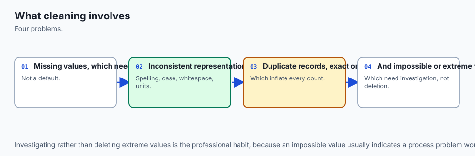
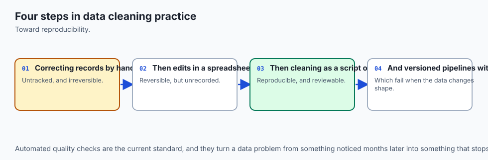
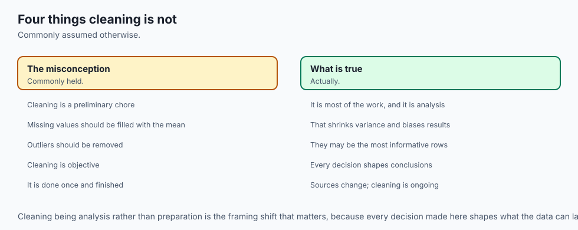
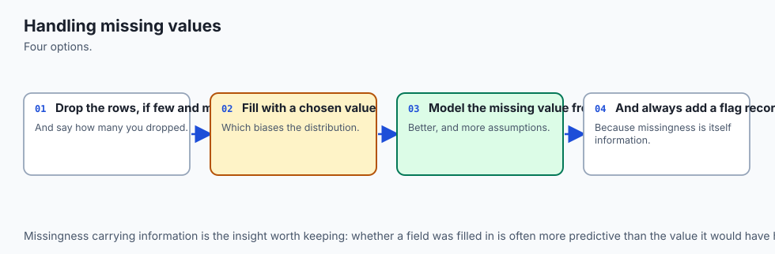
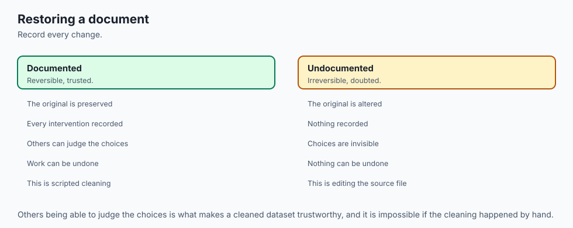
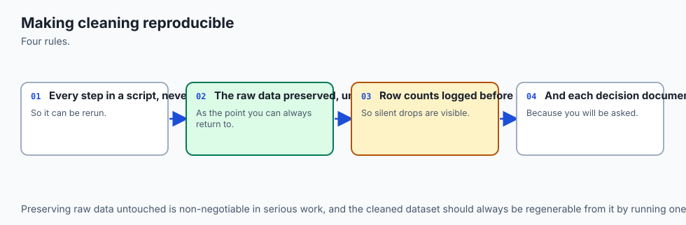
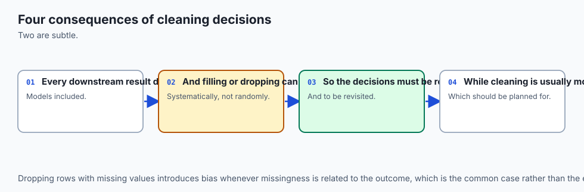
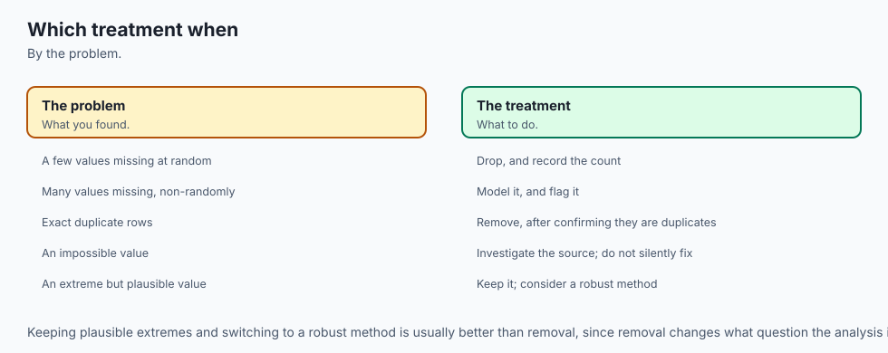

## Why this matters

Here is a cleaning step that looks like careful, responsible practice.
Run it on pandas 3.0.5 and read the three numbers twice before moving on:

```text
>>> income.mean()
52666.679...
>>> income.fillna(income.mean()).mean()
52666.679...
```

A column of customer income has ten missing values out of forty. You
impute them with the column's own mean — the standard textbook move, the
one every "handling missing data" tutorial recommends first. You check
the mean afterward, the way anyone would, to make sure nothing broke. It
is identical to six decimal places. The imputation looks safe.

It is not safe, and the mean is exactly the wrong thing to have checked.
Here is what actually moved, captured from the same real run:

```text
income.std()  before imputation:  10663.947
income.std()  after  imputation:   9195.697   -- strictly smaller

corr(income, spending)  before:        0.745156
corr(income, spending)  after:         0.606148   -- strictly smaller in magnitude
```

The standard deviation dropped by nearly 14%. The correlation between
income and a genuinely related second column, spending, weakened by
almost a fifth of its own value. Nothing raised. Nothing warned.
`fillna()` ran, returned a DataFrame with no missing values, and quietly
changed the shape of the data in two ways you would only notice if you
had thought to check something other than the one number that could not
possibly have moved.

That last clause is the whole subject of this lesson, stated as bluntly as it deserves: **the mean is guaranteed not to change under mean imputation, by construction — which means checking it proves nothing at all.** Ten new points, each sitting exactly on the column's own average, cannot pull the average anywhere. But they *can* shrink the spread around it, because "exactly average" is a very specific, very narrow thing to be ten times in a row. And here is the part worth sitting with, because it runs against the first intuition most people have: it is tempting to guess that ten points which "agree with the average" would somehow make income and spending look *more* related, not less — a pile of perfectly unremarkable points nodding along with everything.

The measured direction is the opposite. An imputed value's deviation from the mean is exactly zero, and in the arithmetic that defines a correlation, a zero deviation on one side of a pair can only ever contribute zero to the relationship between the two columns — it dilutes, it never strengthens. This lesson proves that claim from the arithmetic itself, not just from one dataset, later in **How it works**.

This is worth a direct note before you read any further, because it
matters for how you should read the rest of this course: the working
assumption behind Day 125, when it was first planned, was that mean
imputation *inflates* correlations — "a pile of perfectly average points
that agree with everything." That assumption was tested directly against
real code before this lesson was written, and it was wrong. Correlation
attenuates. Every number in this lesson and its lab reflects the measured
result, not the original guess, and that reversal is itself the lesson's
best illustration of its own argument: check what actually happened, not
what a plausible story predicted would happen.

Days 120 through 124 built the machinery this lesson now has to use
carefully: dtypes and Copy-on-Write, the loading and inspection battery,
boolean masks and the partition invariant, split-apply-combine, and joins
with `validate=`. Every one of those days assumed the data, once loaded,
was worth trusting. This lesson is about the step in between — the one
where a genuinely messy dataset gets turned into something the rest of
this course's tools can be pointed at safely, and where every single
decision made along the way (fill this, drop that, coerce this column,
collapse these three spellings into one) is a real, irreversible choice
about data you do not have. **Day 126 turns today's techniques into a
reproducible pipeline; today is about the techniques themselves, and what
each one actually costs.**

The AI-practice stakes could not be more direct. Every cleaning decision
in this lesson changes the values a feature column ends up carrying into
training. Impute a missing income with the population mean before
splitting into train and test, and you have leaked the test set's own
statistics into the imputation the training set relies on — the model
then scores better on evaluation than it has any right to, for reasons
nobody debugging it later will think to look for, because nothing failed
loudly. The arithmetic behind that leak is the exact arithmetic this
lesson opens with. By the end of today you should be unable to type
`fillna()` without immediately asking: what is this fill claiming about
the data I do not have, and what, specifically, will it change?

## The idea in plain language



Cleaning feels like tidying. It is not. Every step in this lesson —
filling a gap, dropping a row, coercing a string to a number, collapsing
three spellings of "USA" into one, deciding an extreme value is an error
rather than a fact — makes an irreversible decision about data that no
longer exists to check against. You do not get to ask the missing income
value what it actually was. You choose a number to stand in for it, and
from that moment on, every downstream computation treats your choice as
if it were the truth.

The habit this lesson tries to install is simple to state and hard to
practice: **judge every cleaning step by what it changes, never by
whether it makes a warning go away.** `fillna()` making `.isna().sum()`
report zero is not evidence of anything except that `fillna()` ran. The
question that actually matters is what moved — which statistics shifted,
which categories merged, which rows disappeared, and whether the shift is
one you can defend to someone who will use the cleaned data for something
you did not anticipate.

Look at the architecture diagram below. A messy DataFrame enters on the
left, carrying missing values, garbage strings, inconsistent category
spellings and a handful of extreme numbers. It does not pass through one
cleaning step; it passes through a sequence of forks, each one a real
decision with a name and a cost written on it: drop the row, or fill it
— and if you fill it, with what? Coerce this column to a number, or
reject the whole load? Normalise this string, or trust it as written?
Remove this outlier, or keep it as a fact about the world? Every fork has
two branches, and this lesson's argument is that neither branch is free —
the diagram is a map of costs, not a flowchart of "correct" answers.

![Diagram: a messy DataFrame entering from the left, then flowing through four decision-fork stages arranged left to right — drop-or-fill, coerce-or-reject, normalise-or-keep, remove-or-keep-the-outlier — each fork drawn as a labelled branch point with the cost of each branch written directly on it (drop: honest if few rows, disastrous if missingness is informative; fill: invents a value and changes downstream statistics; coerce: silently manufactures missing values from unparseable strings; reject: loses the whole column; normalise: merges categories that may not truly be identical; keep raw: leaves a groupby silently split; remove outlier: teaches a model a world without extremes; keep outlier: lets one point dominate a mean or a fitted line), with a cleaned DataFrame emerging on the right](./assets/cleaning-decisions-architecture.svg)

The animated diagram makes the opening failure concrete. Watch a
distribution with a visible gap where its missing values sit. As
imputation runs, each missing value arrives at exactly the same point —
the column's mean — and the histogram grows a spike exactly there, a
spike that was never part of the original data. Below it, a single
number, the mean itself, sits on a line that does not move at all through
the entire animation. That is the whole argument in one picture: the
number you would think to check is the one number the operation cannot
touch.

![Diagram: a histogram of a numeric column with a visible gap at the centre where values are missing; as the animation runs, small tokens representing the missing values travel toward the centre bin and arrive there one by one, the centre bin growing taller with each arrival into a spike that was not present in the original distribution; beneath the histogram a horizontal line displays the column's mean as a fixed marker that does not move throughout the animation, with a caption stating that every imputed value lands exactly on this unmoving line, which is why checking the mean after imputation proves nothing about what changed](./assets/imputation-flow.svg)

The everyday analogy that carries the rest of this lesson: imagine a class attendance sheet with a few names missing from a given day, and a teacher's aide who fills every blank with "average student" rather than leaving it blank or asking who was actually absent. The class roster now looks complete. Nobody notices anything wrong from the roster alone. But "average student" was never a real person, does not belong to any demographic group, does not have a real transcript, and — worst of all — "average student" appears on every single day some real student's attendance would have told you something specific about *that* day.

Every technique in this lesson is a variation on the same choice: invent an "average student," leave the blank and lose that row, or go back and actually find out who was absent and why. Only the third option recovers the truth; the first two are both compromises, and knowing exactly what each one costs is the entire discipline.

## Historical background



The discipline of formally reasoning about missing data, rather than
patching it ad hoc, is younger than most of the tools built on top of it.
**Donald Rubin's 1976 paper "Inference and Missing Data,"** published in
*Biometrika*, introduced the taxonomy this lesson uses directly — missing
completely at random, missing at random, and missing not at random — and
established that the *mechanism* by which data goes missing determines
whether a given repair strategy can work at all, not just how well it
works. Rubin's framework remains the standard vocabulary in statistics
and, downstream, in machine learning practice, more than four decades
later.

**Roderick Little and Donald Rubin's book "Statistical Analysis with
Missing Data,"** first published in **1987** and now in its third
edition, extended that 1976 paper into a full treatment of imputation
methods, including the systematic case for why naive single-value
imputation — filling every gap with one number, exactly the technique
that opens this lesson — understates the true uncertainty in the data,
because it treats a guess as if it were a fact with zero error attached.
That critique is the direct ancestor of this lesson's attenuation result:
single imputation does not just discard uncertainty in the abstract, it
mechanically shrinks the very relationships a later analysis might have
relied on.

pandas' own missing-value handling, covered from Day 120's `NaN`/`NA`
discussion, was designed from the library's earliest versions around
Wes McKinney's 2008 work at AQR Capital Management (Day 120's history
section) to make `isna()`, `dropna()` and `fillna()` first-class,
vectorised operations rather than something every analyst reimplemented
by hand with loops — a genuine advance over the spreadsheet-era default
of leaving blanks and hoping nobody noticed. `pd.to_numeric()` and its
`errors='coerce'` argument, and the `.str` accessor namespace this
lesson's string-normalisation section relies on, have been stable parts
of the pandas API for many major versions; nothing in this lesson depends
on a change specific to pandas 3.0, unlike Day 120's `str`-dtype default
or Day 124's `validate=` argument.

**scikit-learn's `SimpleImputer`**, covered in this lesson's Tools
section, was introduced as `sklearn.preprocessing.Imputer` and later
renamed and relocated to `sklearn.impute.SimpleImputer` around
scikit-learn **0.20**, released in **September 2018** — the rename
coincided with scikit-learn formalising a dedicated `impute` module,
signalling that imputation had matured from "a preprocessing detail" into
a distinct, carefully-scoped concern with its own fit/transform contract,
the exact mechanism this lesson's AI thread returns to.

The version installed for this lesson, checked directly rather than
assumed:

```text
>>> import pandas; pandas.__version__
'3.0.5'
```

Every number in this lesson's examples and lab was captured from that
exact version. `expected-output/FIELDS.md` in the lab states precisely
which values would differ on an older pandas and which would not.

## What it is — and what it is not



**Data cleaning**, in the sense this lesson uses the term, is the set of
irreversible transformations that turn a loaded, correctly-typed
DataFrame (Days 120–121's work) into one whose values, categories and row
count reflect deliberate decisions rather than accidents of how the data
happened to arrive. It sits after loading and before analysis, and it
overlaps with — but is distinct from — the selecting, filtering, grouping
and merging covered in Days 122–124, because those operations preserve
the values they touch; cleaning changes them.

**It is not a mechanical checklist you run once and forget.** Running
`fillna()`, `dropna()` and `.str.strip()` in sequence and confirming
`.isna().sum()` reports zero is not "cleaning complete" — it is "cleaning
attempted," and whether it succeeded depends entirely on whether the
choices made along the way were the right choices for the analysis that
follows. The same raw column can legitimately be cleaned two different
ways for two different downstream questions, as exercise 8's duplicate
definitions in this lesson's lab demonstrate directly.

**It is not reversible.** Once a missing income is replaced with a mean,
the original fact — *this specific customer's income was never
recorded* — is gone from the column itself, unless you deliberately
preserved it, which is exactly what this lesson's missing-indicator
technique is for. Cleaning without preserving that evidence is a one-way
door.

**It is not the same problem for every column.** A missing value in a
numeric measurement column, a missing value in a categorical column, and
a missing value in a datetime column each call for a different repertoire
of fixes, and applying the wrong repertoire (filling a categorical
column's gaps with a numeric mean, for instance) is not merely wrong, it
is usually a `TypeError` waiting to happen the moment it is attempted —
though, as this lesson's opening shows, the more dangerous failures are
the ones that do *not* raise an error at all.

**It is, specifically, the layer where every guarantee this course has
built on top of pandas — index alignment, dtype-aware arithmetic,
`groupby`'s reconciliation invariant — either reflects the real world or
reflects a decision you made about the real world**, and the entire
discipline of this lesson is making sure that decision is a deliberate
one, not an accident of which function happened to be reached for first.

## Why it was created and what problems it solves

Before a dedicated cleaning discipline, the alternative was either
ignoring missing and malformed data entirely — letting downstream
arithmetic silently propagate `NaN` through every computation that
touched it, or crash unpredictably on a coercion pandas' inference could
not resolve on its own — or hand-writing bespoke cleaning code for every
dataset, reinventing the same fixes (strip whitespace, fill a gap,
collapse a duplicate) from scratch on every project with no shared
vocabulary for what each fix actually costs.

The specific problem mean imputation solves, and the specific problem it
does not: it lets a downstream computation that cannot tolerate missing
values run at all, without discarding the row entirely. What it does not
solve, and cannot solve by construction, is recovering the actual value
that was never recorded — it substitutes a single number that is, on
average, wrong for every single row it touches, and this lesson's opening
demonstration is a direct, measured account of the two costs that
substitution imposes: variance destroyed, and relationships attenuated.

The problem `dropna`'s three arguments solve is different in kind: not
"what value should stand in for a gap," but "how much of the row's
information has to be present before the row is worth keeping at all."
`how='any'` answers that question strictly — one missing field
disqualifies the whole row. `thresh=` answers it by count — a row
survives if enough of it is present, regardless of which specific fields
are missing. `subset=` answers it by relevance — only the named columns
matter, and a row missing something outside that subset survives
regardless. These are three different honest answers to three different
real questions, not three interchangeable knobs on one operation.

The problem `ffill`/`bfill` solve is carrying a value across a genuine
gap in an ordered sequence — a sensor reading, a daily price, a status
that only changes occasionally. The problem they *create*, when the
DataFrame is not actually sorted by the dimension that defines "nearest,"
is that "nearest in row order" and "nearest in time" silently stop being
the same thing, and pandas has no way to know the difference, because row
order is all it has to work with.

The problem `to_numeric(errors='coerce')` solves is turning a column that
is mostly-numeric-but-not-quite into a genuinely numeric dtype without
crashing on the first unparseable entry. The problem it creates, if run
without counting the result, is that "mostly numeric" silently becomes
"mostly missing" with the exact same silence this lesson's opening
demonstration warned about — nothing raises, nothing warns, and a column
that was 70% garbage becomes a column that is 70% `NaN`, indistinguishable
in the DataFrame from a column that was 70% genuinely, honestly missing.

The problem string normalisation solves is that `groupby`, `value_counts`
and `nunique` all operate on *exact string equality*, with zero notion
that `"USA"` and `" usa "` mean the same thing to a human reader. Without
normalisation, every one of Day 123's `groupby` guarantees still holds
technically — the reconciliation invariant still balances — but the
*groups themselves* are wrong, splitting one true category across several
rows in the result with no error to catch it.

## How it works



### Why data is missing, briefly and honestly

Not all missingness is the same, and the difference determines whether
any fix in this lesson can actually repair it. Rubin's three-way
taxonomy, in plain language:

**Missing completely at random (MCAR)** — the fact that a value is
missing has nothing to do with any value in the dataset, observed or
not. A shipping error loses a random subset of survey forms in transit.
This is the easiest case, and the least common in real data.

**Missing at random (MAR)** — the probability a value is missing depends
on *other observed columns*, but not on the missing value itself once
those other columns are accounted for. Younger respondents skip an income
question at a higher rate than older ones, but within any given age
group, the missingness is unrelated to the actual income. Imputation that
conditions on the related observed columns (rather than a single
unconditional mean) can partially correct for this.

**Missing not at random (MNAR)** — the probability a value is missing
depends on *the value itself*. A sensor that saturates and stops
reporting specifically at extreme temperatures. The highest earners
specifically declining to report income. This is the common case in real
data, and it is the one no imputation strategy repairs, because the
information needed to correct it was never recorded by anyone, at any
point — and, per Day 117's lesson on bias not shrinking with sample size,
collecting more rows does not fix an MNAR gap either. A larger sample of
a biased sample is still a biased sample.

### Detecting missingness

Before fixing anything, name exactly how much is missing and where.
`.isna()` per column gives the count that matters most:

```text
>>> temperature_readings.isna().sum()
station      0
reading_c    3
dtype: int64
```

`.isna().sum(axis=1)` gives the per-row count, which is what `thresh=`
in `dropna` is actually checking against. And the missingness *pattern*
across columns — which rows are missing several fields at once, versus
scattered single gaps — is what separates "a handful of stray blanks" from
"whole records that were never properly captured":

```text
>>> dropna_frame.isna().sum(axis=1).value_counts().sort_index()
0    2
1    3
2    3
Name: count, dtype: int64
```

Two rows are complete, three are missing exactly one field, and three are
missing exactly two — a pattern worth looking at before choosing `how`,
`thresh` or `subset`, because each of the four `dropna` calls this
lesson's lab exercise 3 runs answers a genuinely different question about
that same pattern.

### Removal: `dropna`

On the eight-row frame above (four columns: `customer_id`, `email`,
`phone`, `signup_date`), the four variants give four different, real
answers:

| Call | Rows kept | What it actually asks |
| --- | --- | --- |
| `dropna(how='any')` | 2 | Keep only rows with *zero* missing fields — the strictest cut |
| `dropna(how='all')` | 8 | Drop only rows missing on *every* field — none here qualify |
| `dropna(thresh=2)` | 5 | Keep rows with at least 2 non-null fields, regardless of which |
| `dropna(subset=['email'])` | 4 | Only check the named column; ignore missingness elsewhere |

Dropping is honest when the missing rows are few and the missingness
itself carries no information — a shipping error losing a handful of
forms genuinely can be treated as "this data just doesn't exist," and
dropping those rows changes nothing about what the remaining data
represents. Dropping is disastrous when the missingness is informative:
drop every row with a missing income, and if high earners are the ones
who tend not to report it (a very ordinary MNAR pattern), you have not
cleaned the data — you have deleted your highest earners from the
analysis and kept the rest, silently, with a `dropna()` call that raised
no warning about who, specifically, it removed.

### Filling: `fillna`, `ffill`/`bfill`, `interpolate`

`fillna(constant)` replaces every gap with one named value — a real
choice, not a neutral default, and `fillna(0)` is the sharpest version of
that choice: 0 is frequently a real, meaningful measurement, not merely
"nothing here." On a small station log with three genuinely missing
readings and one genuine `0.0` reading already present:

```text
reading_c.mean()  before fillna(0):  10.657143
reading_c.mean()  after  fillna(0):   7.460000
```

The mean drops by more than three degrees — a real, measured
consequence, and after the fill, the genuine `0.0` reading and the three
formerly-missing readings are bit-for-bit identical in the data. Nothing
downstream can tell them apart anymore.

`ffill`/`bfill` carry the nearest earlier or later non-missing value
forward or backward — appropriate exactly when the DataFrame's row order
*is* the order that matters, typically chronological. **This is where
`ffill` becomes a real bug, not a style choice.** On a daily reading with
two gaps, correctly ordered by day 1 through 8, shuffling the row order
and then calling `ffill()` — without sorting first — gives a specific,
measured wrong answer:

```text
day 2 -- correct: 10.0   ffill on unsorted rows gives: 14.0
day 3 -- correct: 10.0   ffill on unsorted rows gives: 17.0
```

Sorting by `day` first and then filling recovers the correct sequence
exactly: `[10.0, 10.0, 10.0, 13.0, 14.0, 14.0, 16.0, 17.0]`. Nothing
about the unsorted call raised an error or a warning — it ran, returned a
plausible-looking column with every gap filled, and two of those fills
were simply wrong, because "the row immediately above" and "the nearest
earlier day" had quietly stopped being the same thing.

`interpolate()` estimates a gap from the values around it — linear
interpolation by default — rather than copying a single neighbour the way
`ffill`/`bfill` do, and is worth reaching for specifically when the
underlying quantity is expected to change smoothly between observations
rather than to hold constant.

### The missing-indicator column

The single cheapest good habit in this lesson: before imputing anything,
record `isna()` into its own column.

```text
was_missing = df["reading_c"].isna()
df["reading_c_was_missing"] = was_missing
df["reading_c"] = df["reading_c"].fillna(df["reading_c"].mean())
```

After the fill, `df["reading_c"].isna()` reports zero missing values —
the evidence inside the column itself is gone. But
`df["reading_c_was_missing"]` still records exactly which three rows were
imputed, letting a downstream model treat "this value was imputed" as a
signal in its own right rather than losing that information the moment
`fillna` runs. It costs one line and one extra column, and it is the
difference between a model that can learn "missingness itself is
informative" (which, per the MNAR discussion above, it very often is) and
one that cannot, because the evidence was erased before it ever saw the
data.

### Type coercion

`pd.to_numeric(series, errors='coerce')` converts a column to a numeric
dtype and turns every unparseable value into `NaN` — silently, with no
count, no warning, no list of what failed. On a ten-value column with
three deliberately planted garbage strings (`'N/A'`, `'unknown'`,
`'--'`):

```text
>>> pd.to_numeric(quantity_raw, errors="coerce").isna().sum()
3
```

Three garbage strings became three missing values — in this case, the
count matches exactly what was planted, because the rest of the column
was genuinely clean. That match is not guaranteed; it is the thing you
are checking for. A column that is mostly garbage becomes a column that
is mostly `NaN` under `errors='coerce'`, with pandas offering no
complaint whatsoever — **never run this call without immediately counting
the result and comparing it against what you expected.**
`pd.to_datetime(series, errors='coerce', format=...)` behaves identically
for dates: pass an explicit `format=` whenever you know it, both for
speed and because an unconstrained date parser is exactly as capable of
silently misreading an ambiguous string as `to_numeric` is of silently
discarding a garbage one.

### String normalisation

`.str.strip()` removes leading and trailing whitespace. `.str.lower()`
normalises case. `.str.replace(pattern, repl, regex=...)` removes or
rewrites punctuation and other formatting noise. Chained together, on a
column recording one true country eight different ways:

```text
>>> country_raw.nunique()
8
>>> normalised = (country_raw.str.strip().str.lower()
...               .str.replace(".", "", regex=False)
...               .replace({"usa": "USA", "canada": "Canada"}))
>>> normalised.nunique()
2
```

Eight distinct strings collapse to the two true categories. The cost of
skipping this step is not abstract — it is exactly what Day 123's
`groupby` reconciliation habit exists to catch, applied one layer
earlier: a raw `groupby('country_raw')` on this exact data produces
**eight** groups, each carrying only a fraction of its true country's
total, where the correct, normalised grouping produces **two**: USA at
865.0, Canada at 215.0. The reconciliation invariant from Day 123 still
technically balances across all eight raw groups — nothing about the sum
is wrong — but the groups themselves misrepresent the data, silently,
which a sum-based sanity check alone will never catch.

### Duplicates: exact versus subset

`DataFrame.duplicated()` with no arguments flags a row only if it matches
another row on *every* column — the strictest possible definition. On a
seven-row order log where one row is a genuine exact repeat and a second
row shares only a customer and an item with an earlier row (but at a
different timestamp — a real second purchase):

```text
>>> duplicates_frame.duplicated().sum()
1
>>> duplicates_frame.duplicated(subset=["customer_id", "item"]).sum()
2
```

"Duplicate" means exactly whatever subset you named — this is Day 124's
key-cardinality thinking returning in a new costume. The exact-duplicate
count answers "was this order logged twice by mistake?" The
subset-duplicate count answers a different, equally valid question: "did
this customer buy this item more than once?" Neither answer is more
correct than the other in the abstract; the question you are actually
asking determines which definition is right, and using the wrong one
silently either merges two real events into one or fails to catch a
genuine logging error.

### Outliers: detection is statistical, removal is a decision

The **IQR rule** flags any value more than 1.5 times the interquartile
range (`Q3 - Q1`) beyond `Q1` or `Q3`. A **z-score** rule flags any value
more than a chosen number of standard deviations from the mean — and,
per Day 116's discussion of the mean's zero breakdown point, is itself
vulnerable to exactly the fragility it is trying to detect, because a few
genuinely extreme values inflate the standard deviation the rule depends
on, potentially masking the very outliers being searched for.

Both rules are *detection* procedures — mechanical, repeatable, and
honest about what they flag. **Removal is not mechanical. It is a
judgement call about whether the flagged point is an error (a sensor
glitch, a data-entry typo, a genuinely impossible value) or a fact about
the world (a legitimate extreme customer, a real market crash, a
genuinely rare but real event).** Removing a real extreme value does not
clean the data — it teaches whatever comes next a version of the world
that has no extremes in it, which is precisely the world it will then be
wrong about the first time a real extreme value shows up in production.

### The cleaning contract

Every technique above is a decision. A **cleaning contract** is the
mechanism that checks, mechanically, whether your decisions actually held
— asserting the post-conditions you *intend*, not merely hoping they are
true:

```python
def assert_cleaning_contract(df, *, key_columns, dtypes, min_rows, max_rows):
    for column in key_columns:
        if df[column].isna().sum() > 0:
            raise ContractViolation(f"{column!r} has null values")
    for column, expected in dtypes.items():
        if str(df[column].dtype) != expected:
            raise ContractViolation(f"{column!r} has the wrong dtype")
    if not (min_rows <= len(df) <= max_rows):
        raise ContractViolation("row count is outside the expected range")
```

A contract that has only ever been run against passing data has proven
nothing — it could contain a typo, a reversed comparison, or dead code,
and every run would still pass silently. This lesson's lab constructs
deliberately violating data (a null key column, a wrong dtype, a row
count outside range) and confirms the contract genuinely raises on each
one, before trusting it on anything real. Day 126 builds a full
reproducible pipeline around exactly this idea; today's version is the
one-function proof that the shape of the idea works.

## An everyday analogy



Return to the attendance sheet from earlier, because it carries every
technique in this lesson without changing costume. A blank on the sheet
where a name should be is missingness, and the aide's three real options
are the aide's real options: leave the blank (drop the record, honest
when blanks are rare and unremarkable, disastrous if certain students are
systematically more likely to be blank), write "average student" in the
gap (impute — cheap, and guaranteed not to move the class's average
attendance, while quietly making the roster's variety look smaller than
it really was), or actually track down who was absent and why (the
expensive, correct fix that no mechanical technique in this lesson can
substitute for).

A name spelled four different ways across four different days — "J. Smith," "Jon Smith," "jon smith," " Jon Smith " — is the string normalisation problem exactly: a headcount by name silently reports four partial students instead of one whole one, and nothing about the count looks wrong until someone checks. Two entries on the same day, same name, same class, logged by two different substitute teachers who did not know about each other, is the duplicates problem: are they the same student counted twice (an exact-duplicate error to be removed) or two genuinely different students who happen to share a name (a subset match that should stay)?

A student whose attendance record shows every single day this term as "present, on time, no exceptions" is the outlier question: is that a data-entry system defaulting to "present" whenever nothing was logged (an error to fix), or a genuinely perfect attendance record (a fact to keep)? The sheet cannot tell you which, mechanically. A human has to decide, and the decision has to be defensible.

## Examples in practice



**A retail company's customer table** has income missing for roughly a
quarter of records, disproportionately among the highest self-reported
spenders — a textbook MNAR pattern, since high earners frequently decline
to disclose income. Mean-imputing that column, as this lesson's opening
demonstrated, leaves the reported average income precisely unchanged
while systematically understating both the true spread of income in the
customer base and its true relationship with spending — a marketing team
using the "cleaned" correlation to justify an income-based targeting
strategy would be working from a number that is real, reproducible, and
quietly wrong for a reason a mean check alone would never reveal.

**A sensor network logging hourly temperature readings** has occasional
dropouts. Sorting by timestamp before applying `ffill` is not optional
housekeeping — it is the difference between a defensible imputation and a
value silently borrowed from a completely different hour, exactly as this
lesson's exercise 4 measures with two specific, wrong values at two
specific rows.

**A form-collected survey's "years of experience" field** arrives as
free text: `"5"`, `"five"`, `"5 yrs"`, `"N/A"`. `pd.to_numeric(...,
errors='coerce')` will parse `"5"` correctly and silently discard
`"five"`, `"5 yrs"` and `"N/A"` alike into `NaN` — three very different
kinds of non-answer, collapsed into one undifferentiated missing value,
unless someone counts the coercions and looks at what specifically failed
to parse before deciding whether any of it deserved a second pass with a
smarter parser.

**A merged dataset from two regional offices** records country as `"USA"`
in one office's exports and `"U.S.A."` in the other's. Every merge, join
and groupby downstream (Day 123, Day 124) will treat these as two
genuinely different countries until someone normalises the strings — a
failure mode this lesson's exercise 7 measures directly, with a raw
groupby producing four times too many groups on a column with only two
true categories.

## Implications: security, privacy, performance, scalability, and cost



**Privacy.** A missing-indicator column is itself sensitive in exactly
the cases where it is most useful: "this customer declined to report
income" is, in an MNAR world, correlated with income itself, and storing
that flag alongside cleaned data can leak information about the very
value it was meant to protect the absence of. Treat indicator columns
with the same access controls as the columns they describe.

**Fairness and downstream bias.** `dropna()`'s default silently removes
whichever rows are missing a key field — and if a demographic group is
systematically more likely to have that field missing (a very ordinary
real-world pattern), a report or a model trained after a careless
`dropna()` call has quietly under-represented that group, with nothing in
the pipeline recording that it happened. This is Day 123's
reconciliation-invariant argument one layer earlier: check what a
cleaning step removed, not just that it ran.

**Performance and scalability.** `dropna`, `fillna` and `.str` operations
are vectorised and scale linearly with row count on a single machine; the
real cost at scale is not computational, it is decision cost — the same
missingness mechanism (MCAR, MAR, MNAR) usually applies across an entire
column regardless of dataset size, so a wrong imputation strategy chosen
on a thousand-row sample will be exactly as wrong, in the same direction,
on a hundred-million-row production table. Getting the decision right
once matters more than optimising the mechanics of applying it.

**Cost.** Every technique this lesson covers that is worth its own
library — pandas itself, pyjanitor, scikit-learn's `SimpleImputer`,
pandera — is free and open source. The real cost of cleaning is analyst
time spent understanding *why* data is missing before choosing a fix, and
that cost does not shrink no matter which library executes the final
`fillna()` call.

## Alternatives: free, open source, and commercial

| Tool | When to choose it | How it's called | One example | Cost |
| --- | --- | --- | --- | --- |
| **pandas** (this lesson) | The default for exploratory cleaning and anything that fits comfortably in memory; every technique above is native pandas | `df.fillna(...)`, `df.dropna(...)`, `.str.strip()` | `df["income"].fillna(df["income"].mean())` | Free, open source (BSD 3-Clause) |
| **pyjanitor** | A verb-style, chainable API over the same pandas primitives, when a cleaning pipeline reads better as a sequence of named steps than as a chain of `.method()` calls | `df.clean_names().remove_empty()` (docs only — not installed here) | `df.clean_names()` normalises every column name's case and punctuation in one call | Free, open source (MIT) |
| **scikit-learn's `SimpleImputer`** | Any time imputation happens inside a training pipeline that will later be applied to unseen data | `SimpleImputer(strategy="mean").fit(X_train).transform(X_test)` (docs only — not installed here) | Fitting on training data only, then transforming both splits, is the entire point — see the AI thread below | Free, open source (BSD 3-Clause) |
| **Great Expectations** | Declarative, shareable data-quality contracts across a team or a scheduled pipeline, richer than a hand-rolled assertion function | YAML/Python "expectation suites" run against a dataset (docs only — not installed here) | `expect_column_values_to_not_be_null("customer_id")` | Free open-source core; paid managed cloud tier |
| **pandera** | Lightweight, type-hint-style schema validation for pandas DataFrames specifically, closer in spirit to this lesson's hand-rolled `assert_cleaning_contract` | A `pandera.DataFrameSchema` checked against a DataFrame (docs only — not installed here) | `schema.validate(df)` raises a `SchemaError` naming the exact failing check | Free, open source (MIT) |

Only pandas was actually run for this lesson and its lab; pyjanitor,
`SimpleImputer`, Great Expectations and pandera are described from their
public documentation, and no output attributed to any of them is
reproduced here — say so plainly, per this course's standing rule, rather
than implying a run that did not happen.

## Comparison with related concepts

| Concept | What it actually does | How it differs from cleaning |
| --- | --- | --- |
| **Filtering** (Day 122) | Selects a subset of existing rows by a boolean condition, leaving every value it keeps unchanged | Filtering never invents or discards *values*, only rows; cleaning routinely does both |
| **Aggregation** (Day 123) | Reduces many rows to a summary per group, computed from whatever values are present | Aggregation trusts the values it receives; cleaning is what determines whether that trust is warranted |
| **Merging/reshaping** (Day 124) | Combines or reorganises tables that are already assumed to be individually trustworthy | Merging can introduce new missingness (an unmatched key becomes `NaN`) that then needs the exact techniques this lesson covers |
| **Feature engineering** | Constructs new columns from existing, already-cleaned values, encoding domain knowledge | Feature engineering assumes cleaning already happened; engineering a feature from uncleaned data inherits every silent distortion this lesson describes |
| **Data validation** (this lesson's contract, and Day 126) | Checks that a dataset satisfies stated properties, mechanically, and fails loudly if not | Cleaning changes the data; validation checks whether the change (or the data as received) actually meets the stated bar |

## When to use it — and when not to



Clean aggressively — impute, normalise, coerce, deduplicate — when the
downstream use genuinely cannot tolerate missing or malformed values, the
missingness mechanism is well-understood (ideally MCAR or MAR with the
conditioning variables available), and every decision is documented
alongside the code that made it, so a future reader can see exactly what
was assumed.

Clean conservatively — prefer a missing-indicator over a fill, prefer
`dropna(subset=...)` over `dropna()`, prefer keeping an outlier over
removing it — when the missingness or the extremity is plausibly
informative (a strong MNAR signal), when the analysis is exploratory
rather than production-bound, or when you genuinely do not yet know why
the data is malformed and inventing an explanation would be worse than
admitting the gap.

Do not clean at all, yet, when you have not run the detection steps in
this lesson's "How it works" section — `.isna()` by column and by row,
the missingness pattern, a raw `nunique()` before normalising, an
IQR/z-score pass before deciding anything about outliers. Every technique
in this lesson is a response to a specific, measured problem; applying
one before measuring what is actually wrong is exactly the "warning went
away, so it must be fine" failure mode this whole lesson argues against.

## The AI connection

- **Cleaning is most of the work in most projects**, which is the fact that reshapes how they
  should be planned.
- **Every cleaning decision is a modelling decision**, and it should be recorded rather than
  applied in passing.
- **Cleaning fitted on all the data leaks**, exactly as scaling and imputation do.
- **Model quality is bounded by data quality**, which no algorithm choice can raise.
- **Silent coercion is the enemy** — a column quietly turned into text will fail far from
  where it was created.

## Knowledge check

Eight questions in `quiz.yml` cover: why checking the mean after
imputation proves nothing; why a correlation with an untouched column
strictly attenuates rather than inflates; why `fillna(0)` is dangerous
specifically when 0 is a real, already-present value; how `thresh=`
counts non-null values rather than missing ones; why `ffill` on unsorted
data is a genuine bug rather than a style choice; why
`to_numeric(errors='coerce')` must always be followed by a count; the
concrete, measurable consequence of grouping an unnormalised string
column; and why a cleaning contract that has never been observed to raise
cannot yet be trusted.

## Hands-on exercise

The lab, "Cleaning With Receipts," has nine numbered exercises, each
proving one specific cleaning claim with real, exact captured values on
pandas 3.0.5 — never by reading source, always by running code and
checking what actually happened.

1. **Mean imputation distorts** — the mean survives unchanged; the
   standard deviation strictly shrinks; a real correlation strictly
   attenuates, not inflates.

2. **`fillna(0)` on a measurement column** — the mean moves by an exact,
   nonzero amount, and a genuine `0.0` reading becomes indistinguishable
   from the imputed ones.

3. **`dropna`** — four row counts (`how='any'`, `how='all'`, `thresh=`,
   `subset=`) on one eight-row frame.

4. **`ffill` on unsorted data** — the specific wrong values at the
   specific rows, and the correct values once sorted first.

5. **The missing indicator** — a flag column that still matches the
   original `isna()` mask after imputation has erased the evidence.

6. **`to_numeric(errors='coerce')`** — the exact count of newly-missing
   values, matched against the exact count of planted garbage strings.

7. **String normalisation** — `nunique()` before and after collapsing
   variants, and a raw groupby producing more groups than the truth.

8. **Duplicates** — exact-duplicate and subset-duplicate counts on one
   frame, differing, with a stated reason each is the right answer to a
   different question.

9. **The cleaning contract** — post-conditions that pass on clean data
   and are proven, directly, to raise on three different kinds of
   violation.

### Expected output

```text
income.mean() before imputation:  52666.679...
income.mean() after imputation:   52666.679...   (identical)
income.std()  before imputation:  10663.947
income.std()  after imputation:    9195.697   (strictly smaller)
corr(income, spending) before:        0.745156
corr(income, spending) after:         0.606148   (strictly SMALLER in magnitude)
```

```text
19 passed
```

```text
13 checks, 0 failure(s)
```

### Validate your work

Run `bash tests/run_tests.sh` from the lab directory and confirm the
final line reads `13 checks, 0 failure(s)` with exit code 0. Run
`.venv/bin/pytest examples -v` and `.venv/bin/pytest starter -v`
separately (never together — see Troubleshooting) and confirm 19 passed
and 19 skipped respectively on an untouched checkout.

### Troubleshooting

If exercise 1's correlation assertion fails because your own prediction
expected it to increase, re-read **How it works**'s attenuation argument
— that is very likely the point, not a bug in your code. If `pytest
examples starter` behaves strangely or errors, you have run both
directories in one invocation; `starter/` and `examples/` share a module
name by design, and the lab's `troubleshooting.md` explains why that
combination must never be run together. If exercise 4's "wrong" and
"correct" results come out identical, you likely sorted the frame before
both calls — the exercise depends on genuinely leaving one call unsorted.

### Common mistakes

Treating "the mean didn't move" as proof an imputation was safe. Filling
a measurement column with 0 without first checking whether 0 is already
a real value in that column. Predicting `thresh=` counts missing fields
rather than non-null ones. Normalising a string column before checking
its raw `nunique()`, which skips the half of the exercise that
demonstrates the actual damage. Writing a cleaning contract and never
constructing data deliberately designed to make it fail.

## Practice assignment

Take any dataset you already have access to — even a small one — and run
the full detection sequence from **How it works** before changing
anything: `.isna()` by column and by row, the missingness pattern,
`nunique()` on every text column, and an IQR pass on every numeric
column. Write down, for each column with real missingness, which of
Rubin's three mechanisms (MCAR, MAR, MNAR) you believe applies and why —
then choose a cleaning strategy for that column and write one sentence
stating exactly what you expect it to change, before you run it. Run it,
and check whether your prediction was right.

## Extension challenge

Reproduce this lesson's central algebraic claim from scratch: write out
the Pearson correlation's covariance sum term by term for a single row
whose value on one axis is exactly the column mean, and show that its
contribution to the covariance is exactly zero regardless of its value on
the other axis. Then construct a second dataset of your own — different
column count, different missingness rate, different underlying
relationship — and confirm empirically that mean imputation attenuates
its correlation too. If you can find a configuration where it does not,
work out precisely which of this lesson's assumptions your configuration
violates.

Every model this course discusses is trained on a matrix of numbers built by a pipeline that ran through decisions exactly like the ones in this lesson, and the single most common way that pipeline quietly cheats is the one this lesson opened with: computing an imputation statistic — a mean, a median, a most-frequent category — over the *whole* dataset before splitting it into training and test sets. The test set's own values leak into the number used to fill gaps in the training set, the model trains on data that has absorbed a sliver of information it should never have had access to, and it then scores better on that same test set than it deserves to, for a reason that produces no error, no warning, and no obvious symptom until someone tries to reproduce the result on genuinely new data and cannot.

This is not a hypothetical risk adjacent to today's material — it is the *exact same arithmetic* as this lesson's opening demonstration, just computed at the wrong stage of a pipeline. scikit-learn's `SimpleImputer` exists specifically to make the correct order structurally hard to get wrong: `fit()` learns the imputation statistic from training data only, and `transform()` applies that already -learned statistic to both the training and test sets afterward, so the test set's numbers are never involved in choosing what to fill training gaps with. The fit/transform boundary is not a stylistic preference. It is the one-line fix for the one leak that makes an evaluation number lie about a model's real performance, and it is worth understanding exactly why it works, in the same arithmetic terms as this lesson's opening, rather than trusting it as a convention to follow without knowing what it prevents.