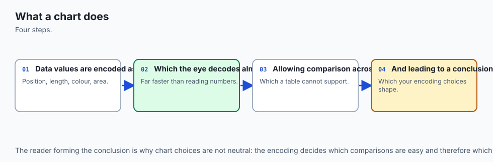
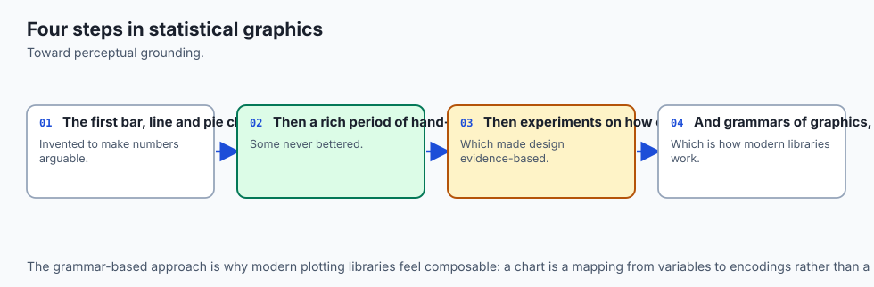
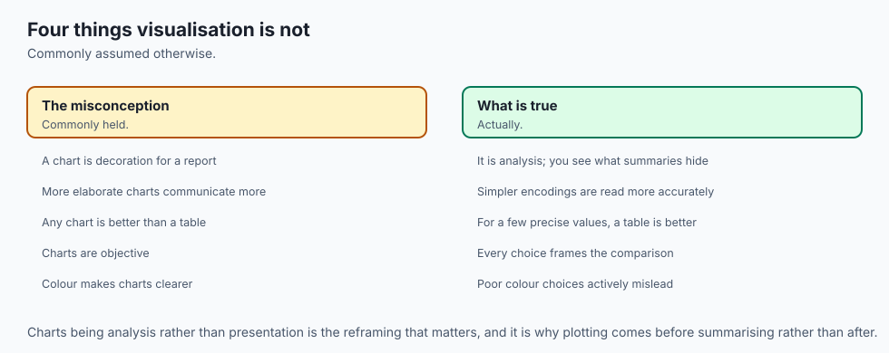
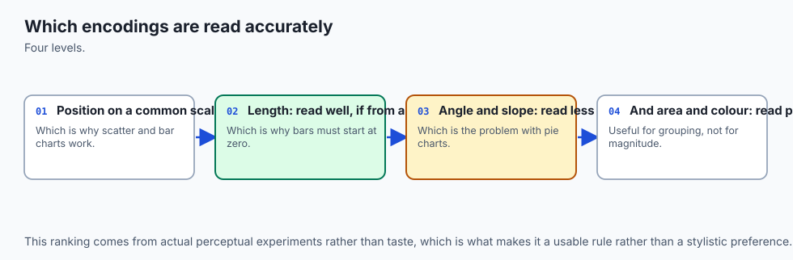
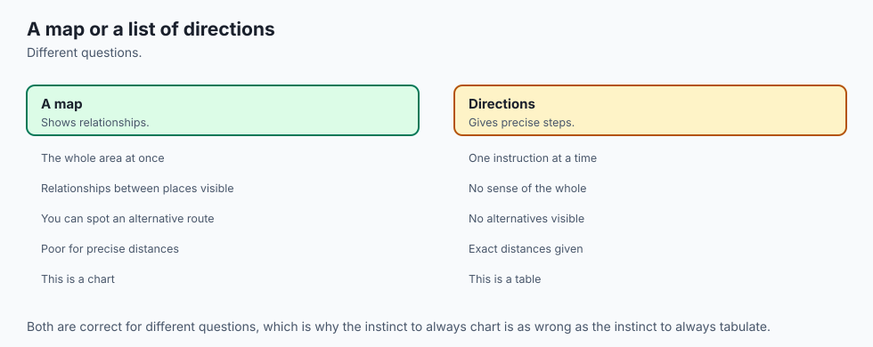
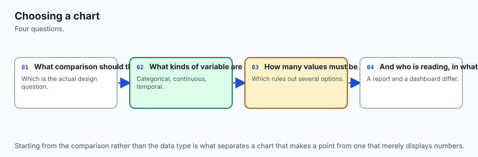
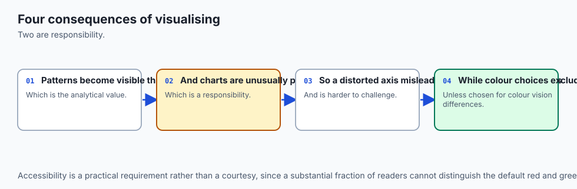
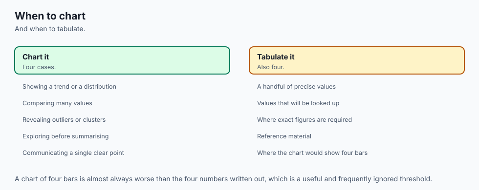

## Why this matters

Here is a question, and here is the data that answers it.

Eight regions, one growth figure each. **Which region grew fastest?**

```text
Nordics 12.1   Iberia 18.9   Benelux  7.4   DACH    17.4
France   9.8   Italy   4.2   Poland  15.6   Ireland 11.3
```

Draw those eight numbers as a pie chart and hand it to someone. They will squint. Two of the slices are nearly the same size — Iberia at 18.9 and DACH at 17.4 differ by about one and a half percentage points, which is roughly five degrees of arc out of 360. Five degrees. Held up at arm's length, on a screen, with a legend off to one side that they have to look back and forth to. Most readers will not get it right, and — this is the part that matters — **they will not know they got it wrong.** The chart gave them no signal that the judgement was hard.

Draw the identical eight numbers as a **sorted horizontal bar chart** and the same reader answers in well under a second. Iberia is the top bar. It is the top bar because the chart is sorted, and it is visibly longer than the one beneath it because bar ends sit on a shared baseline where a difference of 1.5 out of 18.9 is a difference of 1.5 out of 18.9, not five degrees of arc.

Same numbers. Same honesty — neither chart truncated an axis or hid a category. Neither one lied. One of them is a usable instrument for the question that was asked and the other simply is not, and the difference has nothing to do with taste and everything to do with a measured fact about human vision: **people judge position along a common scale far more accurately than they judge angle or area.** That is not an opinion someone had about pie charts. It is the result of controlled experiments, and today you will use it as a decision procedure rather than quote it as a slogan.

Day 116 already made the case that you cannot trust summary statistics alone — Anscombe's quartet, four datasets with identical means, variances and correlations and four completely different shapes, which is why plotting is not optional. Take that as settled. Today's question is the next one, and it is harder: **once you have decided to plot, which plot?** Because a badly chosen chart is not a neutral failure. It does not leave the reader where they started. It leaves them confidently holding the wrong answer, which is strictly worse than no chart at all.

The through-line for the whole day, and the sentence to carry out of it: **a chart is an argument, and the encoding is the claim.** When you map a quantity onto an angle, you are asserting that your reader can read quantities off angles. When you map an ordered variable onto a categorical colour palette, you are asserting that the palette carries order. Both assertions are testable, and today the lab tests them.

By the end of this lesson you will be able to name the visual channel a given variable belongs on and say why; recommend a chart from a question rather than from habit; measure how much of a colour pair's separation survives a colour vision deficiency; prove that a bubble chart scaled by radius exaggerates every ratio in it by exactly squaring; and recognise the case that the reflex to chart everything hides completely — the case where a plain table is the better instrument.

## The idea in plain language



Every chart does the same mechanical thing: it takes numbers and turns them into **visual properties** — a position, a length, an angle, an area, a colour, a shape. Those visual properties are called **encoding channels**, and choosing which number goes on which channel is the entire craft. Everything else is decoration.

The reason the choice matters is that the channels are not interchangeable, and the differences between them are measurable. In 1984 the statisticians William Cleveland and Robert McGill published the results of controlled experiments in which people were shown the same quantities encoded different ways and asked to judge them. The channels came out in a clear order of accuracy:

1. **Position along a common scale** — dots or bar ends on one shared axis.
2. **Position along identical, non-aligned scales** — the same, but split across separate panels.
3. **Length** — bars that do not share a baseline.
4. **Angle and slope** — pie slices, and the steepness of a line.
5. **Area** — bubble size, treemap tiles.
6. **Volume** — three-dimensional bars, spheres.
7. **Colour saturation and density** — heatmap intensity, shading.

Read that list as a ladder and the pie-chart argument stops being a matter of style. A pie chart asks the reader to work on rung four. The identical data on a sorted bar chart asks them to work on rung one. There is no configuration option, no colour scheme, no annotation that moves a pie chart up the ladder, because the ladder is about what the reader's eye is being asked to do, and a pie chart asks it to judge angles by construction.

The architecture diagram below is that ladder, drawn. Each rung shows **the same two values — 40 and 60 — encoded in that channel**. Look at rung one and the ratio is obvious. Look at rung five, the two circles, and try to say whether the larger is one and a half times the smaller or twice it. Look at rung six, the two cubes, and notice that you have quietly stopped trying and started looking for a number to read instead. That progression down the page is the experimental result, made visible.


The second thing that decides an encoding is the **type of the variable**, and there are four types worth separating. **Nominal** data is names with no order: region, browser, model variant. **Ordinal** data has an order but no meaningful arithmetic: "dissatisfied, neutral, satisfied", or "low, medium, high". **Quantitative** data has an order and meaningful arithmetic: revenue, latency, accuracy. **Temporal** data is quantitative with a special structure the reader already knows how to read.

The type constrains the channel in both directions. Put nominal data on a length channel and you have invented an order that is not in the data — a bar chart of browser names sorted alphabetically implies that Chrome comes before Firefox in some sense, which it does not. Put ordinal data on a categorical colour palette and you have destroyed an order that *is* in the data — the palette's whole design goal is that neighbouring swatches look as different as possible, and "as different as possible" has no direction. The lab measures exactly that, as a rank correlation, and gets `+1.00` for a sequential palette and `-0.20` for a categorical one.

Put those two ideas together and chart choice becomes a function you can write down and argue with. That is the flow diagram below: a question arrives, its data types are read, one of five branches lights up, a size gate decides whether a chart is warranted at all, and one instrument is recommended — with every rejected branch still drawn, because the rejected branches are the argument. Each grey box is the right answer to a question somebody could reasonably have asked about the same data. None of them answers the question that was actually asked.

![Diagram: a question card reading which of these eight regions grew fastest feeds a node that reads the data types — region is nominal, growth is quantitative, and the number of values is eight. Five question-kind branches fan out — comparison, distribution, relationship, composition, change over time — and the comparison branch is the live one. It reaches a size gate that asks whether the number of values is five or fewer; eight is not, so the table outcome is passed over and the sorted horizontal bar is recommended. The other four branches stay drawn in grey with their own outcomes, and a pie chart box sits at the bottom marked as never recommended.](./assets/chart-choice-flow.svg)

## Historical background



Statistical graphics are younger than you might expect. **William Playfair**, a Scottish engineer and political economist, published *The Commercial and Political Atlas* in London in 1786, and it contains the first widely circulated line and bar charts of economic data. Playfair invented the pie chart too, in his *Statistical Breviary* of 1801. He was inventing a language, and — an honest note that matters for today — he had no way of knowing which of his inventions people would read well. Nobody had run the experiment.

The next major step was conceptual rather than empirical. In 1967 the French cartographer **Jacques Bertin** published *Sémiologie graphique*, which laid out the visual variables — position, size, shape, value, colour, orientation, texture — as a system, and argued that each one suits some kinds of data and not others. Bertin's system was based on careful reasoning and long practice rather than on measurement, but the structure of the argument is the one we still use.

Then, in 1984, **William S. Cleveland and Robert McGill** published "Graphical Perception: Theory, Experimentation, and Application to the Development of Graphical Methods" in the *Journal of the American Statistical Association*. Instead of reasoning about which channels ought to work, they ran experiments: people were shown the same quantities encoded as positions, lengths, angles and areas, and asked to judge ratios. The errors were measured. The resulting ordering is the ladder in the diagram above, and it is why "bar beats pie" is a finding rather than a preference. Cleveland followed it with *The Elements of Graphing Data* in 1985.

In parallel, **Edward Tufte** published *The Visual Display of Quantitative Information* in 1983, which gave the field two ideas that stuck: the **data-ink ratio** — of all the ink on the page, what fraction is the data itself? — and **chartjunk**, his term for decoration that adds no information. Tufte's case was made by argument and by beautiful examples rather than by experiment, and parts of it have been pushed back on since. But the data-ink ratio is a real, computable quantity, and today's lab computes it from actual pixels: 37% for a chart with a tinted panel, gridlines and a heavy box, against 93% for the identical eight numbers with the furniture removed.

The last strand is about *building* charts rather than reading them. **Leland Wilkinson**'s *The Grammar of Graphics* (1999) argued that charts should not be picked from a menu of named types at all, but composed from parts: data, a mapping from variables to encoding channels, a geometry, a scale, a coordinate system.

**Hadley Wickham** turned that into ggplot2 for R, and it is the intellectual ancestor of **Vega-Lite**, published by the University of Washington's Interactive Data Lab in 2017, where a chart is a small JSON declaration of what is encoded where. Wilkinson's insight and Cleveland's experiments meet exactly here: once you say "encoding" instead of "chart type", the question "which chart?" becomes the much more answerable question "which channel carries which variable?"

## What it is — and what it is not



**Choosing a chart is deciding which encoding channel carries which variable, given the question the reader is trying to answer.** That is the whole subject. It is a design decision with a measurable consequence, and it can be got right or wrong the way a calculation can.

It is **not** the same thing as chart *honesty*, which is Day 132's subject. A truncated y-axis that starts at 98 instead of 0 and turns a two-percent difference into a visual chasm is a different failure: the encoding is fine, and the scale is a lie. Today's failures are all committed in perfect good faith, with an honest axis and a complete dataset. The pie chart at the top of this lesson did not misrepresent a single number. It simply put every number on a channel the reader cannot read accurately, which is why this failure mode is so durable — nobody feels dishonest while doing it.

It is **not** matplotlib mechanics either. Day 128 covers figures, axes, artists, and how to make a plot look the way you meant. Today is upstream of all of that: it is the decision you make before you type a single plotting call, and getting it wrong cannot be repaired by any amount of styling downstream.

It is **not** a fixed lookup table of "for this data, use this chart", although the decision function in today's lab looks superficially like one. The difference is that the function takes the **question** as an argument. The same eight numbers, asked "which grew fastest?", want a sorted bar chart. Asked "how is growth distributed across our regions?", they want a dot plot or a histogram. Asked "did growth track headcount?", they want a scatter. The data did not change. The instrument did, because the question did.

And it is **not** an argument that charts are always the right answer. The reflex to chart everything is itself a failure mode, and the decision function in the lab encodes that explicitly: below a stated number of values it recommends a **table**, not a chart. That recommendation surprises people, which is exactly why it is worth writing down.

## Why it was created and what problems it solves

The problem this body of work solves is that **the human visual system is extraordinarily good at some judgements and quietly, confidently bad at others**, and nothing about the experience of looking at a chart tells you which situation you are in.

You can see this in yourself right now. Look again at rung one of the architecture diagram — two dots on a shared axis — and your answer arrives without effort and is right. Look at rung five, the two circles, and your answer also arrives without much effort, and it is probably wrong: most people systematically underestimate area ratios. The subjective feeling of "I can see it" is identical in both cases. That is the whole danger. A chart on a bad channel does not feel hard; it feels fine, and produces a confident wrong answer.

The second problem is **the square law**, which is worth stating precisely because it is so common and so invisible. Suppose you encode a value by a circle's radius: value 50 gets radius 40 pixels, so value 100 gets radius 80 pixels. The reader does not perceive radius. They perceive the ink — the area — and area goes as the square of the radius. So a value that doubled is drawn four times as large. **Every ratio in the chart comes out squared.** A region with 3× the sales looks 9× as important. Nothing in the chart is false; every circle is exactly the size the code asked for; and the picture systematically exaggerates.

Today's lab measures that twice. Analytically, `encoded_area_ratio` on the values 50 and 100 returns `4.0` for radius encoding and `2.0` for area encoding — the distortion is exactly the square of the data ratio. Then it renders the circles and counts pixels: a 40-pixel-radius circle covers 5,156 painted pixels and an 80-pixel one covers 20,368, a measured ratio of 3.95. Scale by area instead — take the square root, so value 100 gets radius `40 * sqrt(2)` — and the measured ratio drops to 1.99. The distortion is a clean factor of two on the page, and it is entirely removable.

The third problem is **colour**, and it is the one where good intentions do the most damage. Roughly 8% of men have some form of red-green colour vision deficiency — a figure most commonly quoted for populations of Northern European ancestry, and one that genuinely varies between populations, so treat it as an order of magnitude rather than a constant. The relevant number for you is not the exact percentage anyway. It is that in a room of twenty engineers, or a mailing list of two hundred stakeholders, some of them cannot read your red-versus-green pass/fail chart, and none of them will tell you.

The lab measures this rather than asserting it. Take matplotlib's own default red and green — `tab10` entries 3 and 2, the two colours you get by accident if you never stop to think — and measure how far apart they are in CIELAB, a colour space built so that Euclidean distance roughly tracks perceived difference. Normal vision: **119.77**. Now push both through a published deuteranopia transform and measure again: **7.31**.

About 6% of the separation survives. For comparison, the literature puts the just-noticeable difference between adjacent colour patches near 2.3, so 7.31 is a pair a reader may or may not be able to separate at all, depending on patch size, background and lighting. Run the identical measurement on seaborn's colourblind-safe blue and orange and the distance goes from 115.70 to **116.51** — essentially all of it survives. Same starting separation, opposite outcome.

## How it works



### Channels, types, and the rule that connects them

Here is the rule in one sentence: **take the highest-ranked channel from Cleveland and McGill that the task has not already spent on something else and that does not claim more structure than the data type has.**

Both halves matter. "Not already spent" is why a map uses bubbles: latitude and longitude have consumed both spatial axes, so position is unavailable and area is the best channel left — which is precisely why map bubbles must be scaled by area rather than radius, or the square law applies to every one of them. "Does not claim more structure than the data has" is why nominal categories go on hue and never on a magnitude channel: hue says "different", which is the entire claim nominal data supports.

The lab writes this out as a function, `best_encoding(data_type, task)`, and asserts it against a case table:

| Data type | Reader's task | Channel | Why |
| --- | --- | --- | --- |
| quantitative | compare two magnitudes | position on a common scale | Nothing is competing for the axes; take rung 1 |
| quantitative | compare across small multiples | position on non-aligned scales | Each panel has its own axis — this is rung 2 by construction |
| quantitative | show magnitude on a map | area | Both spatial axes are spent on geography; length needs a baseline a map cannot give |
| quantitative | encode in colour (axes taken) | colour saturation | Magnitude, read roughly, which is all saturation supports |
| ordinal | compare | position on a common scale | An ordered variable on an axis reads like a quantitative one |
| ordinal | encode in colour | sequential luminance ramp | Order must survive; a categorical palette would destroy it |
| temporal | show a trend | position on a common scale | Slope is read off positions, so the reading is only as good as they are |
| nominal | identify which series a mark belongs to | hue | Identity, not magnitude — and no order is invented |
| nominal | compare counts by category | position on a common scale | The count goes on the axis; the category goes on the categorical axis |

Notice the two rows for `ordinal`. The same variable gets a different channel depending on what the reader is doing with it, and the second row is the one people get wrong.

### From the question to the chart

One level up, the decision function takes the question itself. The lab's `choose_chart(question_kind, n_categories, data_types)` covers five question kinds. For each, the chart that fits, the one people wrongly reach for, and why:

| The question | Use | The common wrong reach | Why it is wrong |
| --- | --- | --- | --- |
| **Comparison** — which is biggest? | Sorted horizontal bar | Pie chart | Angle (rung 4) instead of position (rung 1), and pies cannot be sorted into a scannable order the way bars can |
| **Distribution** — what shape is this variable? | Histogram, or small multiples per group | A bar of the mean, with error bars | A mean plus a spread cannot show bimodality, and bimodality is usually the finding |
| **Relationship** — does x move with y? | Scatter, then hexbin past the overplot limit | A scatter regardless of point count | Past a few thousand points the marks stack and you are looking at ink density, not at points |
| **Composition** — what are the parts? | Stacked bar, or a table if there are few parts | Pie chart, again | Parts-of-a-whole is the pie's defence, and it fails: with few parts a table is exact, with many the slices are unreadable |
| **Change over time** — what happened? | Line, small multiples past about eight series | A grouped bar chart per period | Bars break the continuity that makes a trend legible, and eight series in one panel is a tangle |

Two of that function's behaviours are the point of writing it at all.

**It recommends a table below five values.** Three numbers do not need an axis, a legend and a title in order to be compared; they need to be readable. A chart's advantage is that it converts comparison from an arithmetic task into a perceptual one — and with three numbers there was never any arithmetic to convert.

Meanwhile the chart *costs* you something real: a bar length can be compared but never read, and a table gives the reader the exact value. Five is where this course puts the line. The number is a judgement and the point is that it is written down as a named constant where you can disagree with it, rather than living unexamined in your habits.

**It never recommends a pie chart, for anything.** The usual defence — "but with only two or three slices a pie is fine" — falls below the table threshold, where a table answers the question exactly rather than approximately. There is no size at which a pie is the best available instrument, so the function has no branch that returns one.

### Building the decision from scratch

Before reaching for a library, it is worth seeing how little machinery this needs. The ranking is a tuple, and the rank of a channel is its index:

```python
ENCODING_RANKING = (
    "position_common_scale",
    "position_nonaligned_scales",
    "length",
    "angle_slope",
    "area",
    "volume",
    "color_saturation",
)

def encoding_rank(channel):
    return ENCODING_RANKING.index(channel)
```

Ask that function for the rank of `"hue"` and it raises, which is correct and is itself the lesson: hue is not a *bad* magnitude channel, it is not a magnitude channel at all. "How accurately can you read a quantity off a hue?" is not a question hue can be asked. Identity channels — hue, shape — live in a separate list because they answer a different question.

The square law needs even less:

```python
def area_for_radius(radius):
    return math.pi * radius * radius

def radii_scaled_by_radius(values):      # the distorting encoding
    return [float(v) for v in values]

def radii_scaled_by_area(values):        # the honest one
    return [math.sqrt(float(v)) for v in values]
```

One `math.sqrt` is the entire fix. That is worth sitting with: the most common quantitative distortion in published data graphics is one square root away from being correct.

### Colour, treated seriously

Palettes come in three kinds, and mixing them up is the most common colour error after red-versus-green.

A **sequential** palette runs from light to dark in one direction — `viridis`, `Blues`. It is for quantitative or ordinal data where more is more. Its defining property is that **luminance increases monotonically**, which is why it survives a greyscale photocopy. The lab measures this as the rank correlation between a swatch's position in the palette and its WCAG relative luminance: for five steps of `viridis`, luminances of 0.019, 0.089, 0.223, 0.451 and 0.783, and a correlation of exactly `+1.00`.

A **diverging** palette runs from one dark end through a light middle to another dark end — `RdBu`, `coolwarm`. It is for data with a meaningful midpoint: profit and loss around zero, temperature anomaly around a baseline, a model's error around no error. Use one where there is no natural midpoint and you have invented a distinction that does not exist.

A **categorical** palette is a set of maximally distinguishable hues — `tab10`, seaborn's `deep` or `colorblind`. It is for nominal data and nothing else. The lab takes five entries of `tab10`, measures their luminances — 0.168, 0.365, 0.259, 0.159, 0.197 — and computes a rank correlation of `-0.20`. Not merely weak: pointing the wrong way. Map "very dissatisfied" through "very satisfied" onto those five swatches and "satisfied" comes out darker than "dissatisfied", so the picture says the opposite of the data. `tab10` is not defective. It is doing precisely its job, which is to make neighbours look different, and difference has no direction.

The practical rule that survives all of this: **never let colour be the only channel carrying a distinction.** Add a shape, a position, a direct label on the line. Then the exact accuracy of any deficiency simulation stops being load-bearing, which is convenient, because a simulation approximates a deficiency and does not reproduce anyone's experience. It assumes a single severity, it says nothing about how an individual has learned to compensate over a lifetime, and it cannot represent anomalous trichromacy at all. Read a small simulated distance as strong evidence a palette is risky; read a large one as only weak evidence that it is fine.

### Sorting, small multiples, and pre-attentive attributes

**Sorting is an encoding decision**, not tidiness. Model the reader honestly: to find the largest of twenty bars in source order, they hold a running best and check every remaining bar — nineteen comparisons. Sorted descending, they read the top row and glance at the second to confirm the chart really is sorted, then stop. One comparison. The lab asserts both numbers, and asserts that the *answer* is identical either way. Sorting moved nothing but the reader's effort, which is why skipping it is expensive and doing it is free.

**Small multiples** are the answer to a panel that has become a tangle. Eight lines in one axes is a plate of spaghetti; eight small panels sharing a scale is eight readable charts, and the reader compares them by moving their eyes rather than by tracing colours. The cost is real and worth naming: you drop from rung one to rung two, because each panel has its own axis. That is a small price, and it is the reason the decision function's threshold is a threshold rather than a rule.

**Pre-attentive attributes** are the properties your visual system processes before you consciously look — colour, size, orientation, motion, enclosure. One red dot among two hundred grey ones is found instantly, in time that barely changes as you add more grey dots. One dot with a text label among two hundred unlabelled ones is found by reading, which takes time proportional to how many you read. This is why highlighting is worth more than annotating: you get to use the fast path. It is also why highlighting *five* things is worthless — the fast path finds the odd one out, and with five odd ones out there is no odd one out.

### Data-ink, without dogma

Tufte's data-ink ratio is data ink divided by total ink. The lab computes it literally, from pixels: the bars are drawn in one flat colour nothing else uses, so counting that colour isolates the data ink exactly. The same eight regions, with a tinted panel, gridlines on both axes and a heavy box, come out at **0.367** — nearly two thirds of the chart is furniture, 172,351 total ink pixels against 63,235 of data. Strip the furniture and the ratio is **0.934**, with 79,107 total ink pixels.

The undogmatic reading: this is not a rule that gridlines are forbidden. Gridlines earn their place when a reader genuinely needs to read a value off an axis rather than compare two bars, and a light gridline is cheaper than a hundred data labels. The rule is that **every mark is a claim on the reader's attention, and the ones that are not data should have to justify themselves.** The ratio is a measurement that starts the conversation, not one that ends it.

### Overplotting

Ten thousand points, drawn as one-pixel marks with nothing clipped, paint **6,349 distinct pixels**. That means 3,651 points — 36.5% of the data — landed where a point already was and changed nothing about the image. They are on the page in principle and invisible in fact.

The sharper measurement is this: that opaque image contains exactly **two** grey levels. Paper and ink. Whether a pixel carries one point or forty it is the same black, so the density information is not dimmed, it is *absent*. Alpha blending recovers some of it — at `alpha=0.05` the same cloud produces nine distinct levels, which tells you the busiest pixel carries about eight points. Hexbin recovers far more — 244 levels — because it aggregates *before* drawing rather than hoping the compositor will do the work.

## An everyday analogy



Think of a workshop with a drawer of measuring instruments, and a plank of wood you need to measure.

**A tape measure with a hooked end** is position on a common scale. You hook it at zero, lay it along the plank, read the number. It is exact, it is fast, and two planks measured with the same tape are directly comparable because they shared the same zero. That is a bar chart, and it is why the bar chart wins so often.

**Two separate tape measures, one per plank** is position on non-aligned scales. Still accurate — each reading is fine — but comparing the two now requires you to carry a number in your head from one to the other. That is small multiples: a real cost, usually worth paying when one panel would be unreadable.

**A stick with no zero mark**, held up beside the plank, is length. You can tell which of two planks is longer, but you are eyeballing the difference rather than reading it.

**A protractor held at arm's length** is angle. This is the pie chart. You are not measuring; you are estimating, and you have no feedback about how far off you are.

**Guessing the volume of a pile of gravel by eye** is area and volume. Everyone does it, everyone is wrong in the same direction — under-estimating large ones — and everyone feels confident.

**Coloured tags tied to each plank** are hue. A tag tells you which plank is which. A tag cannot tell you how long a plank is, and if you tie a slightly-more-red tag on the longer plank you have not encoded a length, you have created a puzzle.

And then the case that the whole analogy exists to make: **sometimes the plank already has its length stamped on the end.** Nobody gets out a tape measure to read a stamp. That is the table. The reflex to chart three numbers is the reflex to measure a plank that is already labelled — motion that looks like work and produces a less precise answer than doing nothing would have.

The analogy holds all the way down to sorting. If you need the longest plank out of twenty, you go through all twenty with your stick. If someone has already stacked them longest-to-shortest, you take the top one. Same pile, same answer, twenty times less work — and the stacking was free.

## Examples in practice



Every number in this section was measured on the authoring machine on 2026-08-20, by the lab that accompanies this lesson, using matplotlib 3.11.1, seaborn 0.13.2, NumPy 2.5.2 and Pillow 12.3.0 on Python 3.14.0. Nothing here is quoted from a textbook.

### The square law, twice

```text
radius encoding, analytic area ratio : 4.0000
area   encoding, analytic area ratio : 2.0000
rendered r=40 px circle              : 5156 painted pixels (ideal pi*r^2 = 5026.5)
rendered r=80 px circle              : 20368 painted pixels (ideal pi*r^2 = 20106.2)
measured radius-encoded area ratio   : 3.9503
rendered r=40*sqrt(2) circle         : 10262 painted pixels
measured area-encoded area ratio     : 1.9903
```

Two things in that output are worth pausing on. The first is that the measured ratios (3.95 and 1.99) are close to but not exactly the analytic ones (4.0 and 2.0), and the measured pixel counts sit about two percent above the ideal `pi*r^2`. That is rasterisation: a circle's boundary does not fall on pixel edges, and with antialiasing switched off each boundary pixel is either wholly in or wholly out. The lab asserts the **ratios**, with a two-percent tolerance, and never the raw counts as though they were exact — which is the right instinct any time you assert on something a renderer produced.

The second is that this is not a hypothetical. A radius-scaled bubble chart of eight regions, where the largest has three times the value of the smallest, draws the largest nine times the size. Every reader will come away believing the gap is far bigger than it is, and every number in the underlying table will be correct.

### Colour, measured

```text
tab10 red vs tab10 green
   normal vision   delta-E : 119.7707
   deuteranopia    delta-E : 7.3136
   fraction retained       : 0.0611
seaborn colorblind blue vs orange
   normal vision   delta-E : 115.7010
   deuteranopia    delta-E : 116.5144
   fraction retained       : 1.0070
```

The two pairs start almost equally far apart. After the transform, one keeps 6% of its separation and the other keeps all of it. Note the safe pair's retained fraction is slightly *above* 1.0 — the transform is a linear map, not a contraction, and it can move two colours marginally further apart in CIELAB. That is not an error and it is not the lab being generous; it is simply what the arithmetic does, reported as measured.

The transform is the Machado, Oliveira and Fernandes (2009) matrix at severity 1.0, applied in linear RGB — which is worth saying, because applying it to gamma-encoded sRGB values instead is the single most common mistake in hand-rolled deficiency simulators, and it visibly changes the answer.

### Order in a palette

```text
viridis (sequential)   luminances: [0.019, 0.0885, 0.2234, 0.4511, 0.7826]
                       rank correlation with position: +1.0000
tab10 (categorical)    luminances: [0.1678, 0.3647, 0.2586, 0.159, 0.1967]
                       rank correlation with position: -0.2000
```

A five-level satisfaction scale on `viridis` reads correctly in colour, in greyscale, and in a photocopy. The same scale on `tab10` reads correctly nowhere, and the failure is silent — the chart looks colourful and professional, and the ordering information is gone.

### Data-ink, and overplotting

```text
decorated  total ink  172351 px | data ink   63235 px | data-ink ratio 0.3669
plain      total ink   79107 px | data ink   73921 px | data-ink ratio 0.9344

points inside the axes               : 10000 of 10000
distinct pixels painted (alpha 1.0)  : 6349
points that changed nothing          : 3651 (36.5%)
distinct grey levels, alpha 1.00     : 2
distinct grey levels, alpha 0.05     : 9
distinct grey levels, hexbin         : 244
```

The `points inside the axes: 10000 of 10000` line is there for a reason: without it, a low painted-pixel count could just mean the rest of the points fell off the edge of the picture. Checking it turns "some data is invisible" from a plausible story into a measurement.

## Implications: security, privacy, performance, scalability, and cost



**Privacy** is the implication people miss, and it is the sharpest one. A scatter plot of individual records is a disclosure. Every point is one person, at a readable position, and if one point sits far from the others, that outlier has been identified — you have published a fact about an individual without meaning to. Aggregating before drawing is not only the fix for overplotting, it is a privacy control: a hexbin cell says "roughly forty records landed here" and names nobody. The same applies to a small-multiples panel that ends up with one point in it, and to any axis label detailed enough to be re-identifying.

**Security**, in the narrow sense, is mostly about the pipeline that produces the image rather than the image itself. A rendering step is code that runs on data, and a plotting library that tries to open a window is a plotting library that will hang your continuous integration job. Today's lab is explicit about this: `matplotlib.use("Agg")` before importing `pyplot`, no `plt.show()` anywhere, and a harness check that both facts hold rather than trusting them. Agg is a pure software rasteriser — no display, no window server, no GPU driver.

**Performance and scalability** enter the moment your data does not fit the picture. Drawing 10,000 points is fast; drawing 10 million is not, and the resulting image would be a solid black rectangle, so the cost buys nothing. Aggregate first. The threshold in the lab's decision function is 2,000 points, which is about where individual marks stop being individually readable — well below where rendering gets slow, because *readability* is the binding constraint, not throughput.

**Cost** is mostly a licensing question, covered in the next section, plus one operational note: charts that are regenerated on every dashboard load cost real compute, and a chart that nobody can read costs a meeting.

**The AI thread.** Model evaluation is read almost entirely through charts, and a badly chosen one hides precisely the failure you needed to see. The canonical example: you ship a model, the evaluation dashboard shows a bar of mean accuracy at 0.87, everyone signs off. Plot the *distribution* of per-user accuracy instead and it is bimodal — a large mode near 0.94 and a second, smaller mode near 0.51. The model does not have 87% accuracy for anybody. It works well for most users and is a coin flip for a distinct subgroup, and the mean sat neatly between the two humps where no user lives.

The bar chart was not dishonest; 0.87 really is the mean. It was the wrong *instrument* for the question "does this model work for our users?", and the distribution was the right one. Every part of today's lesson points at that moment: a mean is a comparison chart answering a distribution question, the bimodality is only visible if you plot the shape, and the subgroup is only nameable if you facet. If you take one habit from today into your model work, make it this one — when someone shows you an aggregate, ask to see the distribution behind it.

## Alternatives: free, open source, and commercial

Four tools worth knowing, plus an honest note about the commercial tier. Two of these were actually run for this lesson; two were not, and I say which.

**matplotlib** (BSD-style licence, free, no paid tier) — **ran it.** Version 3.11.1 produced every measurement in this lesson. Choose it when you need control over exactly what is drawn, when you are rendering headlessly in a script or a test, or when you need to get at the pixels afterwards. It is the substrate almost every other Python plotting library sits on. Its cost is verbosity: matplotlib makes you say what you want, in full, every time.

```python
import matplotlib
matplotlib.use("Agg")          # before importing pyplot; no display needed
import matplotlib.pyplot as plt

fig, ax = plt.subplots(figsize=(6, 4))
ax.barh(names, values, color="#1d4ed8")     # sorted beforehand
ax.set_xlabel("growth %")
fig.savefig(path, dpi=100)
plt.close(fig)
```

**seaborn** (BSD 3-Clause, free, no paid tier) — **ran it.** Version 0.13.2, used here as a palette source. Choose it when your data is already in a tidy DataFrame and you want a statistical chart — a distribution, a categorical comparison, a regression — in one line, with sensible defaults. It builds on matplotlib, so you can drop down to matplotlib for anything it does not cover. Its real contribution to today's subject is that its default palettes take perception seriously:

```python
import seaborn as sns
sns.color_palette("colorblind")   # the palette this lesson measured
sns.displot(df, x="accuracy", col="cohort", kind="hist")   # small multiples in one call
```

**Vega-Lite** (BSD 3-Clause, free, no paid tier) — **did not run it; described from its documentation.** No output is reproduced for it anywhere in this lesson or the lab. It is the grammar-of-graphics contrast: you do not name a chart type, you declare what is encoded where, in JSON, and the renderer works out the rest. Choose it when charts need to be *data* — generated by a program, stored in a database, embedded in a web page, or produced by a system rather than a person. The declaration for today's opening chart looks roughly like this:

```json
{
  "data": {"values": [{"region": "Iberia", "growth": 18.9}]},
  "mark": "bar",
  "encoding": {
    "y": {"field": "region", "type": "nominal", "sort": "-x"},
    "x": {"field": "growth", "type": "quantitative"}
  }
}
```

Read that and notice how directly it states today's lesson: `"type": "nominal"` for the region, `"type": "quantitative"` for the growth, and `"sort": "-x"` as an explicit encoding decision rather than an afterthought. This is what Wilkinson meant.

**plotly** (MIT for plotly.py; free, with a paid commercial tier for the Dash Enterprise platform around it) — **did not run it; described from its documentation.** No output is reproduced for it. Choose it when interactivity is the requirement: hover tooltips, zoom, click-to-filter, linked views in a browser. It is the natural pick when the deliverable is a dashboard rather than a figure.

Its cost is weight — an interactive chart carries a JavaScript runtime, which is a genuine consideration for a page with thirty of them — and the fact that interactivity is not a substitute for a good default view. A reader who has to hover to discover the answer was given a chart that did not answer their question.

**Commercial BI tools** — Tableau, Power BI, Looker and the rest — occupy the tier above all four. They are paid, per-seat, and none of them was run for this lesson, so no pricing or output is quoted here. The relevant point is not their cost but that **everything in today's lesson applies to them unchanged.** They will all happily draw you a pie chart of eight regions. The perceptual ranking does not care which vendor rendered the angle.

## Comparison with related concepts

| Concept | What it governs | How it differs from today |
| --- | --- | --- |
| **Chart choice** (today) | Which channel carries which variable, given the question | The decision made before any code is written; wrong here cannot be fixed downstream |
| **Chart honesty** (Day 132) | Whether the scales and framing represent the data faithfully | A truncated axis is a lie told with a correct encoding. Today's failures are told with an honest axis |
| **Plotting mechanics** (Day 128) | Figures, axes, artists, styling, layout | How to draw what you decided to draw. Excellent mechanics cannot rescue a pie chart |
| **Exploratory data analysis** | Looking at data to find out what is in it | Uses many quick, ugly charts on purpose. Today's care is for charts someone else will read |
| **Descriptive statistics** (Day 116) | Summarising a distribution in numbers | Anscombe's quartet is the argument for plotting at all. Today assumes that argument is won |
| **Grammar of graphics** | Composing charts from data, mappings, geometry and scales | A way of *expressing* an encoding decision. It does not make the decision for you |
| **Dashboard design** | Which charts appear together, and in what arrangement | One level up. A dashboard of well-chosen charts can still fail by answering no particular question |

The one worth dwelling on is the first pair. Chart choice and chart honesty fail in opposite directions and are frequently confused. A dishonest chart is usually made by someone who knows what they are doing. A badly encoded chart is almost always made by someone acting in complete good faith, using the default their tool offered, on data they have not misrepresented in any way. The first is caught by scrutiny. The second is caught only by knowing the ladder.

## When to use it — and when not to



**Deliberately choose the encoding when** the chart will be read by anyone other than you; when a decision will be made from it; when it will appear in a document, a dashboard, a report or a slide that outlives the conversation; when the data has more than a handful of values; or when the question being asked of it is comparison or ranking, where the gap between rung one and rung four is largest.

**Do not bother when** you are exploring. Exploratory plots are throwaway instruments for an audience of one who already knows the caveats, and optimising them is a waste of the time you should be spending looking. Draw twenty ugly plots fast. Choose carefully only for the one you keep.

**Do not chart at all when** you have a handful of numbers and your reader needs the values rather than the comparison — the table case, and it is more common than the habit of charting suggests. Also skip the chart when the finding is a single number, when the honest answer is "there is no pattern here" (say that in a sentence; a scatter of noise invites the reader to find a pattern in it), or when you do not yet know what question the chart is supposed to answer. A chart built before its question is decoration with axes.

**And be sceptical of yourself when** the chart you are about to draw is the one your tool made easiest, the one your last chart was, or the one that looks most impressive. All three are reliable signals that the question never entered the decision.

## The AI connection

- **Chart choice is determined by the question**, not by preference, and the wrong chart
  hides the answer.
- **Visualisation is how data problems are found** long before a model reveals them.
- **The most common charts are frequently the wrong ones**, particularly for distributions
  and comparisons.
- **Every model diagnostic in this curriculum is a plot**, from residuals to learning curves
  to embedding projections.
- **Showing the distribution rather than the summary** is the single habit that prevents most
  misreadings.

## Knowledge check

Work through these before opening the lab. Each has a definite answer, and the lab will confirm or contradict you by measurement.

1. Eight regions, one growth figure each, and the reader must find the fastest-growing. Name the chart, name the channel it uses, and name that channel's rank in the Cleveland-McGill ordering.
2. A bubble map scales each city's circle so that a city with twice the population gets twice the radius. By what factor does the drawn area exaggerate the population ratio, and what single change fixes it?
3. A satisfaction scale — very dissatisfied through very satisfied — is coloured with five entries from `tab10`. State precisely what information has been destroyed, and what measurement would demonstrate it.
4. A pass/fail chart uses matplotlib's default red and green. Their CIELAB distance is about 120 for a reader with typical colour vision. Roughly what does it become under a deuteranopia simulation, and what is the *right* fix — a different pair of colours, or something else?
5. Twenty categories, unsorted, and the reader must find the largest. How many comparisons does that cost them? How many after sorting? And does the answer change?
6. You have three numbers to present and a strong urge to make a chart. Give the argument for the table, in terms of what a chart buys and what it costs.
7. A scatter of 10,000 points is drawn with fully opaque marks. How many distinct grey levels does the resulting image contain, and what does that number tell you about the density information?
8. Someone shows you a bar chart of mean accuracy across your user base. Name the chart you would ask for instead, and the specific failure it would reveal that the bar cannot.

## Hands-on exercise

The lab for today is **"Charts That Answer the Question"** — nine numbered exercises, none of which asserts that a chart looks better, because "looks better" is not testable. Every exercise measures something that genuinely is: a pixel area, a colour distance, a rank correlation, a comparison count, a data-ink fraction, a count of grey levels.

Set it up from the lab directory:

```bash
python3 -m venv .venv
.venv/bin/pip install -r requirements/requirements.txt
.venv/bin/python3 -c "import matplotlib, seaborn; print(matplotlib.__version__, seaborn.__version__)"
```

Then read `starter/00_brief.md` and work through `starter/test_charts.py` from the top. Run the two suites as **separate commands** — never `pytest examples starter` in one invocation, because both directories define modules with the same six names and pytest refuses to collect the second:

```bash
.venv/bin/pytest examples      # the worked answer key: 17 passed
.venv/bin/pytest starter       # your work: 17 skipped until you write it
bash tests/run_tests.sh        # the outer harness: 19 checks
```

The nine exercises, in order: measure the square law analytically and again from rendered pixels; implement the Cleveland-McGill ordering as a decision function and assert it against a justified case table; do the same for `choose_chart`, including that it recommends a table below a stated size and never a pie; apply a published deuteranopia matrix to two palettes and measure how much separation survives each; measure, as a rank correlation, the order a categorical palette destroys; count the comparisons sorting saves a reader; compute a data-ink ratio from real pixels with and without chart furniture; measure overplotting in a 10,000-point scatter and show two renderings that recover the density; and finally pin down the table-versus-chart boundary and write out why it sits where it does.

### Expected output

`bash tests/run_tests.sh` ends with:

```text
-------------------------------------------------------------
19 checks, 0 failure(s)
```

and exits 0. `pytest examples` reports `17 passed`. `pytest starter` on an untouched checkout reports `17 skipped`, and `17 passed` when you have finished.

Every number the lab asserts is printed together in `expected-output/measurements.txt`, captured from a real run — the pixel counts, the colour distances, the rank correlations, the grey-level counts. Read `expected-output/FIELDS.md` before comparing your run against it: it separates what is exact arithmetic (identical on every machine), what is a rendered pixel count (identical on this matplotlib version), and what is machine-dependent.

### Validate your work

1. Run `bash tests/run_tests.sh; echo "exit=$?"` and confirm `19 checks, 0 failure(s)` with `exit=0`. Capture the script's **own** exit status — piping it into `tail` and then reading `$?` reports `tail`'s status and will hide a real failure.
2. Confirm `pytest starter -q` reports `17 passed` with no skips remaining. A skip means "not attempted", and deleting the skip line is part of each exercise.
3. Confirm the lab left no image behind: `find . -name '.venv' -prune -o -name '*.png' -print` should print nothing at all.
4. Compare your measured numbers against `expected-output/measurements.txt`. The ratios (4.0, 2.0, `+1.00`, `-0.20`) should match exactly. Raw pixel counts should match within a couple of percent on matplotlib 3.11.1.
5. Read your own exercise 2 and exercise 9 comments back. If the justification for a case is "because that is the answer", the exercise is not finished — the reasoning *is* the exercise.

### Troubleshooting

- **`ModuleNotFoundError: No module named 'matplotlib'`** — the dependencies live in the lab's own `.venv`, not on your system Python. Re-run the two installation commands from the lab directory.
- **`ModuleNotFoundError: No module named 'PIL'`** — the package installs as `pillow` and imports as `PIL`. That is correct and confusing. Install the requirements file, not the import name.
- **`import file mismatch`** — you ran `pytest examples starter` in one invocation. Run them separately. This is expected, and the harness asserts that it happens rather than leaving it as folklore.
- **A pixel count a few percent off** — check your matplotlib version against the pin first. The harness checks it for you before it asserts anything, so a version mismatch is reported as its own failure rather than as a confusing number.
- **The suite hangs, or warns about a GUI backend** — you have an interactive `MPLBACKEND` set, or you imported `pyplot` yourself before `render.py` could select Agg. Start a fresh interpreter with `unset MPLBACKEND`.
- **`pytest starter` still says `17 skipped` after you wrote code** — the `pytest.skip(...)` call is still above your assertions, and it raises immediately, so nothing below it runs.

### Common mistakes

- **Asserting a raw pixel count exactly.** A rasteriser decides whether each boundary pixel is in or out, so a rendered area lands a couple of percent off the ideal. Assert the *ratio*, with a tolerance. Asserting `5156 == math.pi * 40**2` is asserting something that is not true.
- **Rendering to a path that is not `png_dir`.** Every render function takes an explicit path so that nothing writes into the lab. Section 8 of the harness fails the run if it finds a stray image.
- **Reading the deuteranopia result as "this is what they see".** It is a linear approximation to one severity of one deficiency. The number licenses "do not let colour alone carry this distinction". It does not license a claim about anybody's experience.
- **Concluding that `tab10` is a bad palette.** It is an excellent palette for the job it was designed for. The mistake is putting an *ordered* variable on it, and the measurement is of the mismatch, not of the palette.
- **Skipping the "nothing is clipped" check in exercise 8.** Without it, a low painted-pixel count is ambiguous: it could be overplotting, or it could be points falling off the edge. One line turns a plausible story into a measurement.
- **Treating `TABLE_MAX_VALUES = 5` as a fact.** It is a judgement written down where you can argue with it. Move it if your readers differ — but move it deliberately, and update the comment that justifies it.

## Practice assignment

Take a chart you have already made — from an earlier lab in this course, from work, from anywhere — and put it through today's decision procedure in writing.

1. **State the question the chart is supposed to answer**, in one sentence, as a question. If you cannot, that is the finding: the chart was made before its question.
2. **Classify every variable** in it as nominal, ordinal, quantitative or temporal, and write down which encoding channel each one is currently on.
3. **Look up each of those channels** in the Cleveland-McGill ordering, and note the rank. Any variable the reader must judge a *magnitude* from, sitting below rung three, is a finding.
4. **Run `choose_chart`** with your question kind, your value count and your data types, and compare its recommendation to what you actually drew. Where they disagree, decide which is right and write down why — the function is a default to argue with, not an authority.
5. **Measure your palette.** Push your two most important colours through `deuteranopia_collapse` and record the retained fraction. If it is below 0.2, either change the colours or add a second channel — shape, position, a direct label.
6. **Count your values.** If there are five or fewer, redraw it as a table and look at both. Decide honestly which one you would rather receive.
7. **Sort it**, if it is a comparison, and note how much faster your own eye finds the answer.

Write one paragraph on the single change that improved the chart most, and one on any place where you decided the decision function was wrong and you were right. That second paragraph is the more valuable one.

## Extension challenge

Build a **chart critique harness** for your own work: a small module that takes a description of a chart — the question, the variables and their types, the channels they are on, the palette, the value count — and returns a list of findings, ranked by how much each one costs the reader.

Make it measure rather than lecture. It should compute the Cleveland-McGill rank of every magnitude channel in use and flag anything below rung three. It should run every pair of series colours through the deficiency transform and report the retained fraction, not a pass/fail.

It should compare the value count against the table threshold in both directions — flagging a chart that should be a table, *and* a table that has grown past the point where a chart would serve better. And it should refuse to produce a finding it cannot back with a number, which will force you to decide what is measurable and what is genuinely a matter of judgement. That boundary is the real output of the exercise.

Then point it at the last five charts you made and read the report without defending yourself.

Finally, close the loop on the AI thread. Take one model evaluation you have run or seen — an accuracy figure, a benchmark score, a leaderboard row — and ask what chart is standing behind that number. If it is a mean, plot the distribution and look for a second mode.

If it is a single aggregate across all users, facet it by whatever grouping you have and look for the subgroup the aggregate is averaging away. You may find nothing, and that is a real result worth recording. But the habit is the point: the number was summarised for you by someone who chose an instrument, and today you know enough to ask whether it was the right one for the question you actually have.