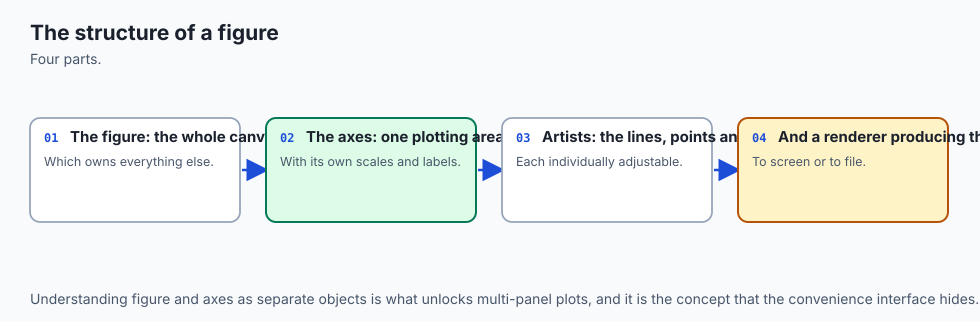
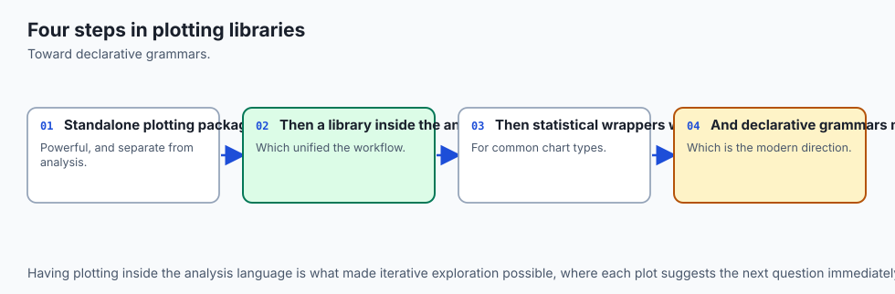
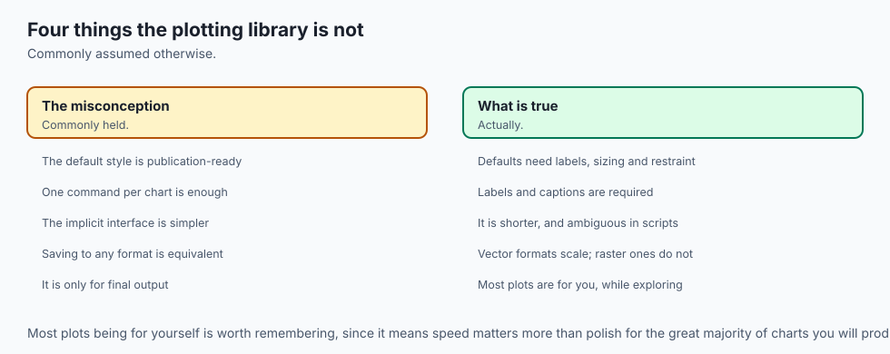
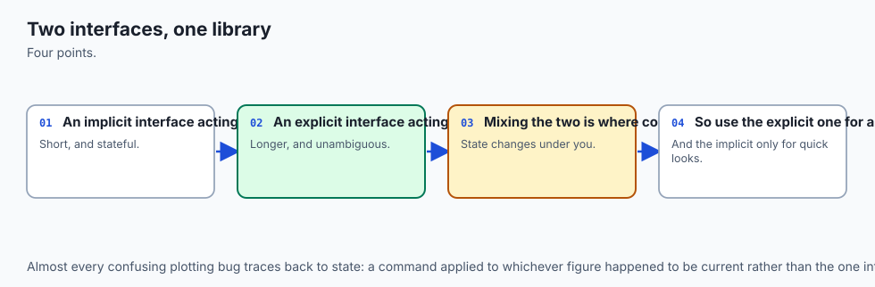
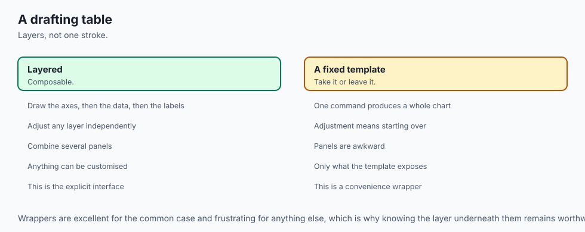
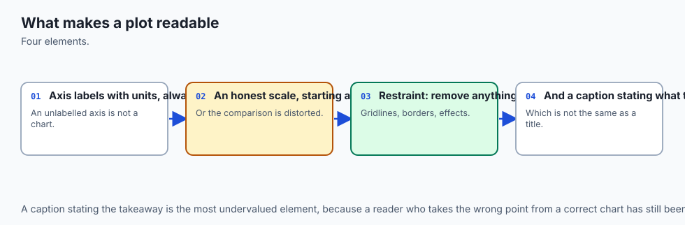
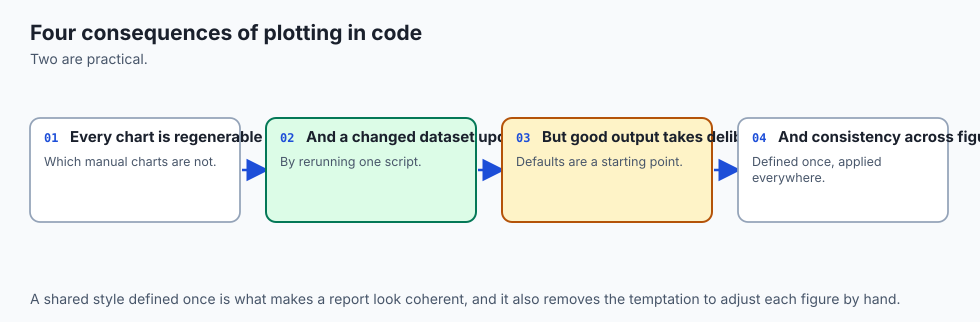
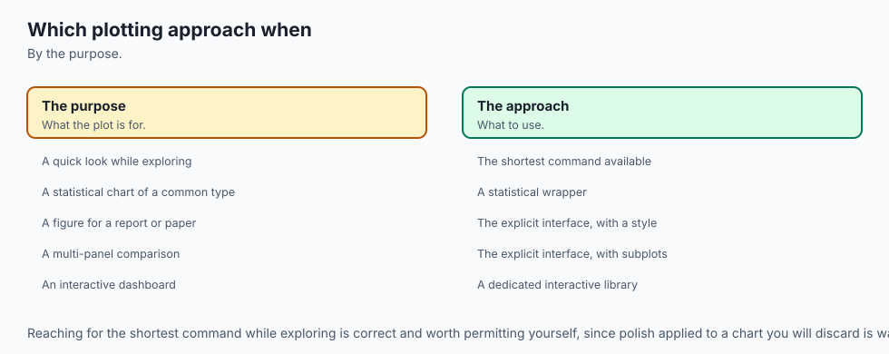

## Why this matters

Somebody on your team writes a small helper to plot a training curve:

```python
def plot_curve(losses, label):
    plt.plot(losses, label=label)
    plt.xlabel("step")
    plt.ylabel("loss")
    plt.title("training loss")
    plt.legend()
```

It works the first time. They call it once, save the figure, done. Two
weeks later they are comparing two runs, so they call it twice:

```python
plot_curve(run_a_losses, "run A")
plot_curve(run_b_losses, "run B")
plt.savefig("comparison.png")
```

They open `comparison.png` expecting two charts, or at worst one chart
with two clearly separate curves on it. What they get instead is one
chart with both curves overlaid on the same axes, which — for a training
loss comparison — might even look *correct* at a glance. Nobody flagged
an error. Nothing crashed. `plt.legend()` even labelled both lines
properly. The only thing wrong is that this is not what anyone intended,
and there is no visual cue in the output that says so.

Here is the mechanism, and it is worth sitting with because it explains
matplotlib's entire design: `plt.plot()`, `plt.xlabel()` and `plt.title()`
are not methods on an object you created. They are functions that reach
out to whichever figure and axes happen to be "current" — matplotlib's
internal notion of *the thing you're probably talking about* — and draw
into it. The first call to `plot_curve` creates a current figure, because
nothing existed yet. The second call finds that same current figure still
sitting there, because nothing in between asked for a new one, and draws
into it too. Two calls, one figure, two lines nobody separated.

This lesson measured that exact failure for real. Calling a
`plt.plot`-based helper twice with different data left `plt.get_fignums()`
reporting `[1]` — one figure — holding two lines. Calling the equivalent
helper built with `fig, ax = plt.subplots()` instead, twice, left
`plt.get_fignums()` reporting `[1, 2]` — two figures, one line on each —
every time, with no discipline required to make it happen that way. The
second version cannot produce the first version's bug, because it never
asks "what's current?" It says exactly what it means: *this* axes, *this*
line.

**The rule the rest of this course follows because of this: always
`fig, ax = plt.subplots()`, always call methods on `ax`.** Every diagram,
every chart, every figure you will build from here through Day 133's EDA
report and beyond uses the object API, and this lesson is where you learn
why that is not a style preference. It is the difference between a chart
that can only show what you told it to show, and a chart that can quietly
show something else because two pieces of code both assumed they had the
canvas to themselves.

matplotlib is not a special case in the AI practitioner's toolkit — it is the layer every training curve, every confusion matrix, every evaluation plot in this course's later sections gets drawn through, usually inside a helper function called once per experiment, once per epoch, or once per model comparison. A plotting helper written against the pyplot state machine and called from more than one place in a training or evaluation script does not fail loudly. It produces a report where two experiments' loss curves are silently overlaid on one figure, or where the twentieth diagnostic plot in a long training run is the one that finally trips a memory warning nobody was watching for.

Neither failure shows up as a wrong number — both show up as a chart that looks plausible and is not what anyone asked for, which is exactly the kind of mistake a testable, object-graph approach to charting catches before a reader ever has to notice it themselves.

## The idea in plain language



matplotlib gives you three things stacked on top of each other, and
almost every confusing tutorial online exists because it never tells you
which one it is talking to. A **Figure** is the whole canvas — the thing
you save to a file. An **Axes** is one plotting area on that canvas, with
its own x and y coordinates, its own title, its own labels. An **Artist**
is anything actually drawn — a line, a bar, a piece of text, a legend.

A Figure can hold several Axes (that is what a grid of subplots is). Each
Axes holds a list of Artists (that is what `ax.lines` is — a list of the
Line2D objects that `ax.plot()` created). Nothing here is metaphorical:
these are real Python objects, with real attributes, and you can read
them back after the fact. `ax.get_xlabel()` returns the exact string you
passed to `ax.set_xlabel()`.

`ax.lines[0].get_xydata()` returns the exact
array you plotted. This is the single most useful fact in the whole
lesson — a chart, in matplotlib, is not a picture. It is a data structure
that happens to render as a picture, and a data structure can be
inspected, asserted on, and tested, the same way you'd test a dictionary
or a list.

matplotlib gives you two ways to build that data structure. The **pyplot state machine** — `plt.plot`, `plt.xlabel`, `plt.title` — is a set of convenience functions that always operate on "the current figure" and "the current axes," tracked as hidden global state inside the `pyplot` module. It is genuinely convenient for a single, throwaway plot in a notebook cell: three lines, no boilerplate, done. The **object API** — `fig, ax = plt.subplots()`, then `ax.plot`, `ax.set_xlabel`, `ax.set_title` — makes you name the figure and axes you're drawing into, once, and then every following call is a method on that specific object.

It costs one extra line up front. What it buys back is that the code can never be ambiguous about where it is drawing, which is exactly the property that breaks in the state machine the moment a plotting routine is called more than once, or from inside a function, or from two different places in a larger program — which describes essentially all real code, and none of a notebook's first three cells.

## Historical background



matplotlib was created by John D. Hunter, a neurobiologist, starting
around 2002-2003, out of frustration with the plotting tools available in
the scientific Python ecosystem at the time — MATLAB was the dominant
environment for this kind of plotting in academic labs, and Hunter wanted
MATLAB-like plotting commands available from Python, without a MATLAB
licence. The name is a portmanteau of "MATLAB" and "plot library," and
that MATLAB ancestry is exactly where the pyplot state machine comes
from: `plt.plot`, `plt.xlabel`, `plt.title` are deliberately modelled on
MATLAB's own global-current-figure plotting commands, because that was
the interface working scientists already knew.

The object-oriented API — Figure, Axes, Artist as real, addressable objects — was there from early on as the library's actual underlying architecture; `pyplot` was always a thin convenience layer built on top of it, not a separate implementation. What has shifted over roughly two decades of matplotlib's life is the *advice*: early tutorials, written for an audience coming from MATLAB, leaned almost entirely on the pyplot functions, because that was the familiar shape.

As matplotlib's own audience grew to include people who had never touched MATLAB, and as programs built with it grew from single notebook cells into functions, classes and long-running services, the object API's explicitness stopped being a nice-to-have and became the documented, endorsed way to write anything beyond a single throwaway plot — which is precisely the guidance matplotlib's own "Figures and Axes interfaces" documentation states today.

Hunter died in 2012; the project is now maintained by a large open-source community (the Matplotlib Development Team, NumFOCUS-sponsored) and remains, more than twenty years on, the plotting library nearly every other Python visualization tool either builds on directly (seaborn) or positions itself as an alternative to (plotly, plotnine, Bokeh).

## What it is — and what it is not



matplotlib is a 2-D (and limited 3-D) plotting library: a way to turn
arrays of numbers into rendered charts, and to control every visual
element of that rendering — colour, line width, tick spacing, font, DPI —
in code. It is not a statistical analysis library (it does not compute a
regression line or a confidence interval for you; seaborn and scipy do
that, then hand matplotlib the numbers to draw), not a dashboard framework
(no built-in interactivity, callbacks, or state management across user
clicks — Plotly Dash and Streamlit exist for that), and not a data
processing library (it plots whatever array you give it; pandas and NumPy
are what produce that array).

It is also not, despite the pyplot interface's appearance, a system that
requires you to think in terms of "the current plot." That impression —
common among people who learned matplotlib from `plt.plot`-only
tutorials — is an artifact of which corner of the API got taught first,
not a description of what the library actually is underneath. Underneath,
every chart is a Figure containing Axes containing Artists, addressable
and inspectable as ordinary Python objects, whether or not the code that
built it ever used the word `pyplot`.

## Why it was created and what problems it solves

Before matplotlib, plotting from Python meant either shelling out to a
separate tool (Gnuplot, via a wrapper) or writing bespoke, ad hoc code
against whatever graphics library happened to be available, with no
common conventions across projects. matplotlib solved the problem of
*having a plotting library at all* that felt native to Python and
produced publication-quality output, and it did so specifically by
copying an interface (MATLAB's) that its target audience — scientists and
engineers — already had years of muscle memory for.

The problem this lesson's opening failure describes — two APIs, one
familiar and fragile, one more verbose and robust — is a second-order
consequence of that founding design choice, and it is worth naming
precisely because it explains a design tension every plotting library
eventually has to resolve: the interface that is easiest to *teach* (a
short sequence of global function calls, no object management) is often
not the interface that is safest to *build programs out of* (explicit
objects, explicit method calls, no hidden global state). matplotlib chose
not to force a resolution — it kept both, kept the convenient one as the
default in its own quick-start documentation, and left it to the
individual author to learn, usually the hard way, when the convenient one
stops being safe.

This lesson exists to shorten that learning curve to
one paragraph and one measured example, rather than one production
incident.

## How it works



![Diagram: a single rendered line chart, labelled to show the object model -- an outer box marked Figure containing one inner plotting box marked Axes; inside the Axes, labelled parts include the four spines around the edge, tick marks and tick labels on both axes, the x-axis label and y-axis label below and beside the plot, a title above the plot, a legend box in an upper corner, and the plotted line itself marked as a Line2D Artist -- with a caption explaining that the Figure holds the Axes and the Axes owns everything drawn inside it](./assets/figure-anatomy-architecture.svg)

Start from the object you actually get back from `plt.subplots()`:

```python
import matplotlib
matplotlib.use("Agg")  # headless -- no window, ever
import matplotlib.pyplot as plt

fig, ax = plt.subplots(figsize=(6, 4))
ax.plot([0, 1, 2, 3], [0, 1, 4, 9])
ax.set_xlabel("x")
ax.set_ylabel("y")
ax.set_title("a parabola-ish thing")
```

`fig` is a `Figure` object. `ax` is an `Axes` object. `ax.plot(...)`
creates a `Line2D` Artist and appends it to `ax.lines` — after the call
above, `len(ax.lines) == 1`, and `ax.lines[0].get_xydata()` returns
exactly the two arrays you passed in, unchanged. `ax.set_xlabel("x")`
sets a `Text` artist's string; `ax.get_xlabel()` reads it straight back.
None of this is inference or approximation — it is direct attribute
storage and retrieval, which is exactly why every claim in this lesson
gets checked by reading these objects back rather than by looking at a
rendered picture.

**Saving the figure** goes through `fig.savefig(path, ...)`, and two
arguments control the output size precisely. `figsize=(width, height)` in
*inches* is set at `plt.subplots()` time (or with `fig.set_size_inches`
afterward); `dpi` (dots per inch) is passed to `savefig` itself, or set as
a Figure-level default. Multiply them and you get the output's pixel
dimensions, exactly, as long as `bbox_inches='tight'` is not requested:

| figsize (inches) | dpi | saved pixel dimensions (measured) |
| --- | --- | --- |
| `(6, 4)` | `100` | `600 x 400` |
| `(6, 4)` | `200` | `1200 x 800` |
| `(6, 4)` | `50` | `300 x 200` |

Those three rows are not textbook numbers — they are read directly off
real PNG files this lesson's lab saved, by parsing each file's own IHDR
header bytes (a PNG's width and height are stored as two big-endian
4-byte integers, 16 bytes into the file, after an 8-byte signature and a
4-byte chunk length). `bbox_inches='tight'` changes this: it crops the
saved canvas to the bounding box of whatever was actually drawn, which
means the final size is `figsize * dpi` *minus* whatever margin got
trimmed — often exactly what you want visually, never exactly predictable
from the two numbers alone.

**Raster versus vector** is a choice made at `savefig` time via the file
extension or an explicit `format=` argument. PNG (and JPEG) are raster:
the output is a fixed grid of pixel colours, good for anything
photograph-like or for embedding in a place that expects a bitmap. SVG
(and PDF) are vector: the output is a description of shapes and text,
resolution-independent, and — for SVG specifically — literally XML markup
you can open in a text editor.

This lesson's lab proved the practical
consequence directly: after saving one chart as both formats, the string
`"depth (m)"` (the axis label) was found as literal characters inside the
saved SVG file, and was not found anywhere in the saved PNG file's bytes. An SVG or PDF chart can be zoomed, printed at any size, or have its text
edited after the fact; a PNG chart is exactly as sharp as the pixels it
was rasterized into, forever.

**Subplots** are built with `plt.subplots(nrows, ncols)`, which returns
`(fig, axes)` where `axes` is a genuine 2-D NumPy array of Axes objects
when either `nrows` or `ncols` exceeds 1 — shaped exactly `(nrows,
ncols)`. Measured directly: `plt.subplots(2, 3)` returns an `axes` array
of `.shape == (2, 3)`, and setting `axes[0, 0].set_xlabel(...)` leaves
`axes[0, 1].get_xlabel()` as an empty string. Each cell is independent
because each cell is a genuinely separate Axes object; nothing shares
state between them unless you explicitly ask for it with `sharex=True` or
`sharey=True`. When subplots overlap or their labels collide, `fig.
tight_layout()` (the older, simpler option) or `constrained_layout=True`
(passed to `plt.subplots()`, the newer and generally more robust option)
adjusts spacing automatically.

**Labels, limits, ticks and scales** are all set through methods on `ax`:
`ax.set_xlabel`, `ax.set_title`, `ax.set_xlim`, `ax.set_xticks`. Axis
limits autoscale to fit the plotted data by default — call `ax.set_ylim`
explicitly and that override sticks; autoscaling does not resume on its
own. `ax.set_yscale('log')` switches an axis to a logarithmic scale,
where equal steps represent equal *ratios* rather than equal differences
— useful for data spanning several orders of magnitude.

It has one sharp
edge worth stating precisely, because it is easy to discover it the hard
way in a real chart: **a log scale on data containing zero or negative
values does not raise an error.** Measured directly on matplotlib 3.11.1:
plotting `[0, 1, 4, 9, 16]` and switching the y-axis to log left
`ax.get_ylim()` reporting roughly `(0.87, 18.4)` — a lower bound strictly
above zero — while `ax.lines[0].get_xydata()` still contained the
original `(0, 0)` point, untouched.

The zero-valued point simply does not
get drawn, because there is no y-pixel `log(0)` maps to. No error, and in
this mixed-sign case, no warning either — matplotlib's "Data has no
positive values, and therefore cannot be log-scaled" warning only fires
when *every* value in the series is non-positive. A chart with one silent
missing point, and nothing telling you it is missing, is a genuinely easy
way to misreport data.

**Annotation** goes through `ax.text(x, y, "a note")` for a plain label at
a data coordinate, and `ax.annotate("a note", xy=(x, y), xytext=(x2, y2),
arrowprops=dict(arrowstyle="->"))` for a label connected to a specific
point by an arrow, with the label itself placed somewhere less crowded.
One well-placed annotation pointing at the interesting spike in a curve
usually communicates more, faster, than a legend forcing the reader to
match five colours to five labels in a separate box.

**Legends** follow the label-then-legend pattern: pass `label=` to every
plot call that should appear, then call `ax.legend()` once, after every
relevant artist exists. Measured directly: plotting a "measured" series
then a "predicted" series, each with its label set at plot time, then
calling `ax.legend()` once, produces a `Legend` whose
`get_texts()` reads back exactly `['measured', 'predicted']` — plotting
order, not alphabetical order, not label-string order.

**rcParams and style sheets** set defaults once instead of repeating them
on every call. `matplotlib.rcParams['lines.linewidth'] = 2` (or the
equivalent `plt.rc('lines', linewidth=2)`) changes the default for every
subsequent plot in the process; `plt.style.use('seaborn-v0_8')` (or any
named or custom style sheet) swaps in a whole bundle of such defaults at
once — colours, fonts, grid visibility — which is how a report with a
dozen charts stays visually consistent without a dozen copies of the same
keyword arguments.

**Figure lifecycle** is the sharpest edge in the whole lesson, because it
produces a real, measured leak rather than a hypothetical one. Every
figure created through `plt.figure()` or `plt.subplots()` is retained in
a global registry — `plt.get_fignums()` lists it — until `plt.close(fig)`
or `plt.close('all')` explicitly removes it. There is no automatic
cleanup tied to a Python variable going out of scope; a function that
plots in a loop and returns without closing leaks one figure, every call.

Measured directly: opening 22 figures in a loop without closing any left
`plt.get_fignums()` reporting all 22 as open, and triggered exactly one
real `RuntimeWarning`, containing the text `"More than 20 figures have
been opened"` — matplotlib's own defence against exactly this pattern,
firing once the count passes its default threshold of 20
(`rcParams['figure.max_open_warning']`). Closing each figure individually
brought `plt.get_fignums()` back to an empty list. A long-running report
job or a training loop that plots a diagnostic chart every epoch without
closing it will not crash on epoch 21 — it will simply hold every figure
it has ever created in memory, indefinitely, until something notices the
process is slow or the machine is out of memory.

## An everyday analogy



Think of a Figure as a picture frame you bought, and an Axes as a canvas
you mounted inside it — you can mount several canvases in one frame (a
subplot grid), and each canvas holds its own painting, its own caption
card, its own frame-within-the-frame for its title.

The pyplot state machine is like handing instructions to an assistant who
always works on "whatever canvas is on the easel right now." Say "paint a
red line" and they paint it on the easel canvas. Say "paint a blue line"
five minutes later, with nothing said about switching canvases, and they
paint it on the same easel canvas, because nobody told them to put up a
new one — from their point of view, that is exactly what you asked for.
The object API is like handing a signed, labelled instruction directly to
the specific canvas you want painted: there is no "easel" to be
ambiguous about, because the instruction names its target.

`savefig` is like photographing the framed picture: `figsize` is the
picture's physical size, `dpi` is how many pixels the camera captures per
inch of picture, and multiplying them tells you exactly how big the photo
file will be — unless you ask the photographer to crop the photo to just
the painted area (`bbox_inches='tight'`), in which case the final size
depends on how much blank frame there was to crop away.

A PNG is that
photograph: sharp at the size it was taken, blurry if you blow it up
further. An SVG is more like the original painting's inventory record —
a description precise enough to repaint the exact same picture at any
size, with the caption card's text still legible as text, not as a
smudge of paint.

## Examples in practice




Every example below was captured from a real, headless matplotlib 3.11.1
run — `matplotlib.use("Agg")` set before `pyplot` is imported, no window
ever opened, and every figure closed with `plt.close()` when the example
is done with it.

**The two-APIs bug, made and unmade.** The pyplot version:

```python
def draw_pyplot(x, y, label):
    plt.plot(x, y, label=label)
    plt.xlabel("x")
    plt.title("drawn with the pyplot state machine")
    plt.legend()

draw_pyplot([0, 1, 2, 3], [0, 1, 4, 9], "run A")
draw_pyplot([0, 1, 2, 3], [9, 4, 1, 0], "run B")
# plt.get_fignums() -> [1]   -- one figure
# len(plt.gcf().axes[0].lines) -> 2   -- both lines on it
```

The object version:

```python
def draw_object(x, y, label):
    fig, ax = plt.subplots()
    ax.plot(x, y, label=label)
    ax.set_xlabel("x")
    ax.set_title("drawn with the object API")
    ax.legend()
    return fig, ax

fig_a, ax_a = draw_object([0, 1, 2, 3], [0, 1, 4, 9], "run A")
fig_b, ax_b = draw_object([0, 1, 2, 3], [9, 4, 1, 0], "run B")
# plt.get_fignums() -> [1, 2]   -- two figures
# len(ax_a.lines) -> 1, len(ax_b.lines) -> 1
```

**Pixel arithmetic, checked against the file itself.**

```python
fig, ax = plt.subplots(figsize=(6, 4))
ax.plot([0, 1, 2], [0, 1, 0])
fig.savefig("a.png", dpi=100)   # -> 600 x 400, read from a.png's own header
fig.savefig("b.png", dpi=200)   # -> 1200 x 800
```

**Testing a chart without ever looking at it.** This is the day's most
practical habit, and it generalizes to every chart you will ever build in
this course: assert on the object graph, never on pixels.

```python
assert ax.get_xlabel() == "depth (m)"
assert ax.get_ylim() == (-5, 5)
assert len(ax.lines) == 2
assert ax.lines[0].get_xydata().tolist() == [[0.0, 2.0], [1.5, -1.0]]
assert ax.get_yscale() == "log"
```

No golden image, no pixel-diff tolerance, no test that breaks because a
font changed between matplotlib versions. Each assertion checks exactly
the claim a person reading the chart would care about, and each one comes
back instantly and deterministically.

## Implications: security, privacy, performance, scalability, and cost



**Security.** matplotlib reads and writes files (`savefig`, and rarely,
reading an image with `imread`) and evaluates no user-supplied code by
default. The one sharp edge: a `MATPLOTLIBRC` config file or a style
sheet loaded from an untrusted path is just a text file matplotlib
parses, not a security boundary — do not load style sheets from
user-supplied paths in a service that renders charts on someone else's
behalf.

**Privacy.** Charts embed exactly the data you plot, and vector formats
embed it more legibly than raster ones. An SVG or PDF chart's axis labels,
tick labels, and any `ax.text` annotation are literal searchable text in
the saved file — which is a feature for a report you intend readers to
copy numbers out of, and a real leak if the same chart is generated from
data that should not be that easy to extract (a screenshot of a
dashboard containing account numbers, say, saved as SVG rather than PNG).
Know which property you are relying on before you pick the format.

**Performance.** Headless rendering (the `Agg` backend, set via
`matplotlib.use("Agg")` before importing `pyplot`, or the `MPLBACKEND=Agg`
environment variable) is what makes matplotlib usable in a script, a
test suite, or a server process with no display attached — every chart in
this course's labs is generated this way. Rendering itself is fast for
anything with a few thousand points or fewer; it slows down noticeably
past tens of thousands of points per Axes, at which point downsampling
before plotting (or a GPU-accelerated alternative outside this lesson's
scope) matters more than any matplotlib-level tuning.

**Scalability.** The figure-lifecycle leak measured earlier in this
lesson is the scalability failure mode that actually shows up in
practice: a long-running process (a monitoring dashboard regenerating
charts on a schedule, a training script logging a diagnostic plot every
epoch) that never calls `plt.close()` accumulates one Figure object per
chart, forever, until memory pressure or the 20-figure warning is the
first sign anyone notices. The fix costs one line — `plt.close(fig)` right
after `savefig`, or a `with` block pattern that guarantees it — and is
easy to forget precisely because the first hundred iterations look fine.

**Cost.** matplotlib itself has no cost of any kind — free, open source,
BSD-compatible licence, no tier, no account. The cost this lesson's
implications are really about is engineering time: the two-APIs bug and
the figure leak are both silent, both easy to introduce, and both cheap
to prevent once you know to look for them, which is the entire value
proposition of spending a day on "fundamentals" that might otherwise look
too basic to deserve one.

## Alternatives: free, open source, and commercial

| Library | When to choose it | How it is called | One snippet | Free vs paid |
| --- | --- | --- | --- | --- |
| **matplotlib** (ran) | The default for this course: full control over every visual element, the substrate other libraries build on, works everywhere from a script to a paper figure. | `fig, ax = plt.subplots(); ax.plot(x, y)` | `fig.savefig("out.svg")` | Fully free and open source (BSD-compatible licence); no paid tier of any kind. |
| **seaborn** (installed, ran — Day 129 covers it) | Statistical plots — distributions, categorical comparisons, regression fits — with far less code than the matplotlib equivalent, and sensible defaults for colour and style out of the box. | `sns.lineplot(data=df, x="day", y="value", hue="group", ax=ax)` — takes and returns a matplotlib Axes | `sns.histplot(data=df, x="value", ax=ax)` | Fully free and open source (BSD-3-Clause); no paid tier. |
| **plotnine** (docs only, not run here) | A grammar-of-graphics builder for Python, porting R's `ggplot2` model: charts are assembled by adding layers rather than calling imperative draw commands, which some analysts find clearer for faceted, multi-layer statistical charts. | `(ggplot(df, aes(x="day", y="value")) + geom_line() + facet_wrap("group"))` | same expression, `+ theme_minimal()` added | Fully free and open source (BSD-2-Clause); no paid tier. |
| **plotly** (docs only, not run here) | Interactive, browser-rendered charts — hover tooltips, zoom, pan — for a notebook, a web app, or a Dash dashboard, where a static image is not enough. | `px.line(df, x="day", y="value", color="group")` (the `plotly.express` high-level interface) | `fig.write_html("out.html")` | Core library and Dash open-source framework are free (MIT-licensed); static-image export needs the separate `kaleido` package; Dash Enterprise (deployment, authentication, scaling for organizations) is a paid product layered on top of the free framework. |

matplotlib, seaborn and plotnine are all free and open source with no
paid tier whatsoever. plotly's charting library and open-source Dash
framework are free; the only cost anywhere in this ecosystem is Plotly's
enterprise deployment product, which this lesson's labs never touch. This
lesson ran matplotlib and seaborn for real; plotnine and plotly are
described from their public documentation only, and **no output
attributed to either is reproduced anywhere in this lesson or its lab**.

## Comparison with related concepts

| Concept | What it actually is | How it differs from matplotlib fundamentals |
| --- | --- | --- |
| Chart type selection (Day 127) | Choosing *which* shape of chart honestly represents a given relationship or comparison. | A decision made before any matplotlib code is written; today's lesson is about *how* to build whichever chart Day 127 says you need, correctly. |
| seaborn (Day 129) | A statistical-plotting layer built on top of matplotlib's own Axes objects. | Every `sns.*` function still returns (or accepts) a matplotlib Axes — today's object model is what seaborn's convenience sits on top of, not a separate system. |
| Chart honesty (Day 132) | Choosing scales, baselines and framing that do not mislead — not truncating a bar chart's y-axis, not hiding an inconvenient point. | Today's `set_yscale('log')` silently dropping a zero-valued point is a *mechanism* Day 132's honesty concerns can be caused by; today explains the mechanism, Day 132 covers the judgment calls around when a log scale is even the right choice. |
| Plotting versus computing | matplotlib turns arrays of numbers you already have into a rendered chart. It does not compute a mean, a regression, or a confidence interval for you. | pandas and NumPy (Weeks 15-18) or scipy compute the numbers; matplotlib (and seaborn, on top of it) draw them. Confusing "the chart looks wrong" with "the underlying statistic is wrong" is a common and costly mix-up. |
| Testing a chart | Asserting on the Figure/Axes/Artist object graph — labels, limits, line data, legend text, figure counts. | Different in kind from testing most other code: the object graph *is* the chart, so there is no separate "rendering correctness" question the way there is for, say, a PDF layout engine. |

## When to use it — and when not to



Use matplotlib, through the object API, for essentially every chart this
course produces: exploratory data analysis, a report figure that will be
saved and shared, a diagnostic plot inside a training loop, a static
architecture diagram. It is the right default because it is free, has no
external dependency beyond itself, runs headless in a script or CI job
exactly the way this lesson's lab does, and its output is precise and
reproducible down to the pixel.

Reach for something layered on top of it — seaborn — when the chart is
fundamentally statistical (a distribution, a categorical comparison, a
regression fit) and the matplotlib-only version of the same chart would
be a dozen lines of manual computation before a single `ax.plot()` call.
Reach outside matplotlib's own family entirely — plotly, or a
JavaScript-based tool for a web page — when the chart genuinely needs
interactivity a static image cannot provide: hover tooltips over
thousands of points, a zoomable time series a reader will explore rather
than just read.

Do not reach for matplotlib's pyplot *state machine* — `plt.plot`,
`plt.xlabel` — inside any function that might be called more than once,
or inside any codebase larger than a single notebook cell meant to be
read top to bottom exactly once. That is the one piece of "when not to
use it" this lesson insists on, because it is the one failure mode that
produces a chart which *looks* fine and *is* wrong.

## The AI connection

- **Understanding the plotting model rather than memorising recipes** is what makes
  visualisation composable.
- **Figure and axes are the two objects that matter**, and confusing them is why plotting code
  so often feels arbitrary.
- **Every diagnostic plot in machine learning is built this way**, however high-level the
  wrapper looks.
- **Reproducible figures need explicit sizing and saving**, or they change between machines.
- **Plotting is debugging**, and a quick chart frequently answers a question faster than any
  statistic.

## Knowledge check

1. Two calls to a `plt.plot`-based helper function, with no
   `plt.figure()` call in between, produce how many figures — and why?

2. What two `savefig` arguments determine a saved PNG's exact pixel
   dimensions, and what breaks that exact prediction?

3. Why does `plt.subplots(2, 3)[1]` (the returned Axes array) have shape
   `(2, 3)` rather than being a flat list of six Axes?

4. What does `ax.set_yscale('log')` actually do to a data point with
   value zero — measured, not assumed?

5. In what order do a legend's entries appear, and what determines it?
6. What is the concrete, file-level difference between what a saved SVG
   contains and what a saved PNG contains?

7. What keeps a figure "alive" in matplotlib's global registry, and what
   removes it?

8. Why is asserting on `ax.get_xlabel()` or `ax.lines[0].get_xydata()` a
   more robust way to test a chart than comparing rendered pixel images?

## Hands-on exercise

Work through `starter/00_brief.md` in this lesson's lab,
`labs/sections/math-statistics-and-data/day-128-matplotlib-fundamentals/`.
Nine exercises, each a small function in `starter/plotting.py`: the two
APIs and their differing figure counts, an exact data round-trip through
a Line2D artist, `savefig`'s pixel arithmetic checked against a real
PNG's own header bytes, labels and an explicit `set_ylim` that overrides
autoscaling, an independent `(2, 3)` grid of subplots, a log scale's
silent treatment of a zero-valued point, the label-then-legend pattern,
the figure-lifecycle leak and matplotlib's own warning past 20 open
figures, and the searchable-text-versus-opaque-pixels difference between
SVG and PNG. Every exercise runs headless and writes only to a temporary
directory that cleans itself up.

```bash
cd labs/sections/math-statistics-and-data/day-128-matplotlib-fundamentals
python3 -m venv .venv
.venv/bin/pip install -r requirements/requirements.txt
.venv/bin/pytest starter -q
```

### Expected output

On an untouched checkout:

```
1 passed, 13 skipped
```

Once every function in `starter/plotting.py` is written correctly:

```
14 passed
```

The reference suite in `examples/` — read after attempting the starter —
reports:

```
19 passed
```

and the full harness ends with:

```
34 checks, 0 failure(s).
```

### Validate your work

```bash
.venv/bin/pytest starter -q -p no:cacheprovider
bash tests/run_tests.sh; echo "exit=$?"
```

A skip means a function has not been attempted yet (it still raises
`NotImplementedError`). A failure means the function runs but returns the
wrong thing, and the failure message shows both your value and the
expected one. `run_tests.sh` finishing with `exit=0` and `N checks, 0
failure(s).` is the complete signal that every exercise, both suites, and
the disk-cleanliness check all agree the lab is done.

### Troubleshooting

See `troubleshooting.md` in the lab directory for the full list. The two
most common snags: running a reference script from the lab's root
directory instead of from inside `examples/` (it imports `plotting`
relative to itself, so it must be run from beside it), and forgetting
that `save_at_size_and_dpi` must not pass `bbox_inches='tight'` — that
argument is exactly what breaks the exact pixel-arithmetic prediction
exercise 3 checks for.

### Common mistakes

- Calling `plt.show()` anywhere in the lab. Nothing here has a display to
  show to; every script and test forces the headless `Agg` backend, and
  `plt.show()` is a no-op on it — harmless, but a sign the code was not
  written with a headless environment in mind.

- Reading `ax.get_ylim()` for the log-scale exercise without first
  calling `fig.canvas.draw()`. matplotlib recomputes an Axes' limits from
  its scale lazily, on the next draw, not the instant `set_yscale` is
  called — skip the forced draw and you may read back stale, pre-log
  limits.

- Forgetting `label=` on a `plot()` call and then wondering why
  `ax.legend()` produces an entry reading `_line0` or nothing useful at
  all — the label has to be supplied at plot time, not after.

- Comparing two figures' pixel bytes directly to "test" a chart, instead
  of asserting on the object graph. Two runs of the exact same plotting
  code can legitimately differ at the byte level (font hinting, timestamp
  metadata some backends embed) while being visually and structurally
  identical — the object-graph assertions this lesson teaches do not have
  that problem.

## Practice assignment

Take any dataset you have used earlier in this course (a CSV from Week 18,
or invented data of your own) and build a two-panel figure with
`fig, ax = plt.subplots(1, 2, figsize=(10, 4))`: the left panel a line
chart with a proper x-label, y-label and title; the right panel the same
data's cumulative sum, on a shared x-axis (`sharex=True`).

Save the result
twice — once as PNG at 150 dpi, once as SVG — and write a short script
that asserts, without opening either file visually: both Axes have
non-empty titles, the left Axes has exactly one line whose data round-trips
exactly, the right Axes' y-values are monotonically non-decreasing (a
property a cumulative sum should have), and the SVG file contains both
titles as searchable text while the PNG's byte content does not.

## Extension challenge

Build a small "figure budget" context manager: a `with figure_budget():`
block that records `plt.get_fignums()` on entry, and on exit, raises an
assertion error naming exactly which figure numbers were left open if the
count on exit exceeds the count on entry. Wrap it around a deliberately
leaky function (one that calls `plt.subplots()` in a loop without
closing) and confirm it catches the leak; then wrap it around a correctly
written function and confirm it passes silently. This is the same idea
production monitoring tools use for other kinds of resource leaks —
database connections, open file handles — applied to the one resource
this lesson showed you matplotlib will happily leak without complaint
until you are 21 figures in.
