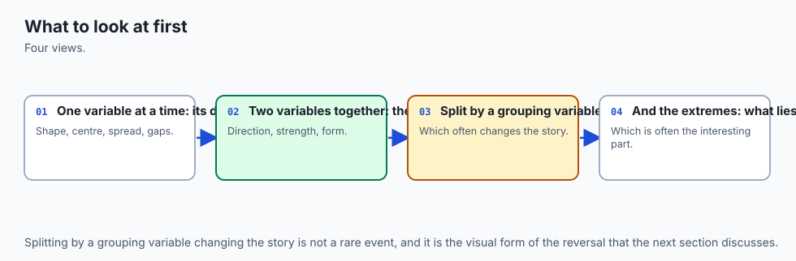
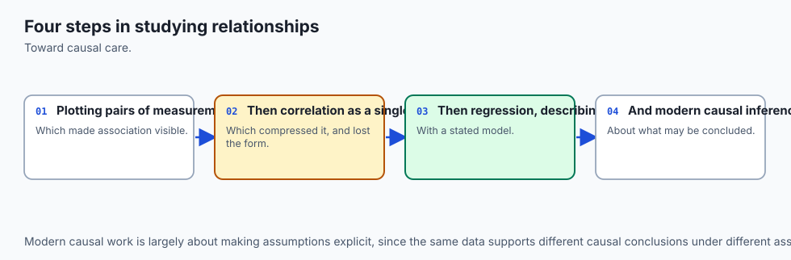
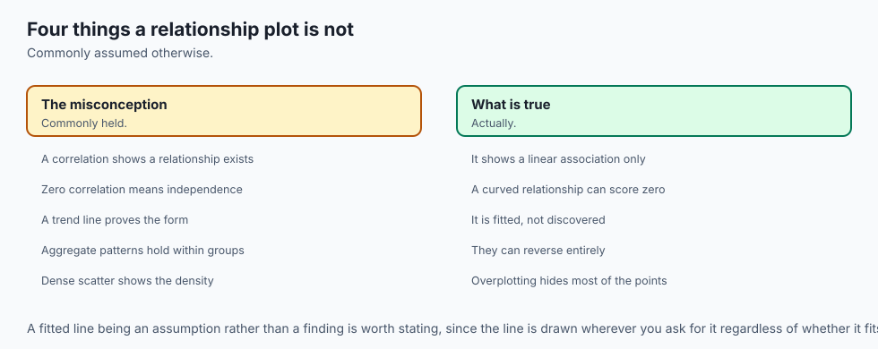
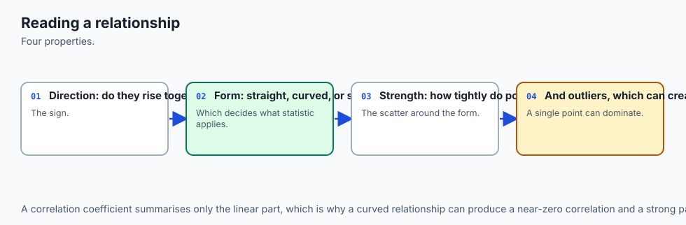
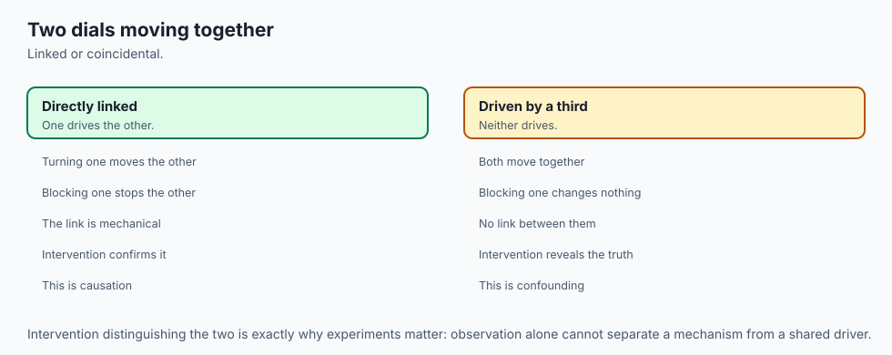
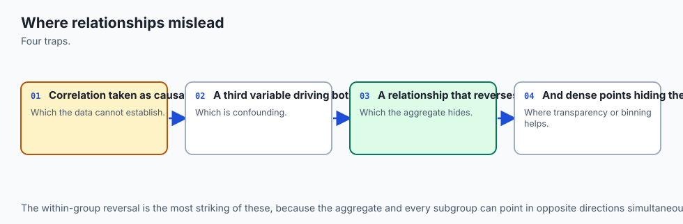
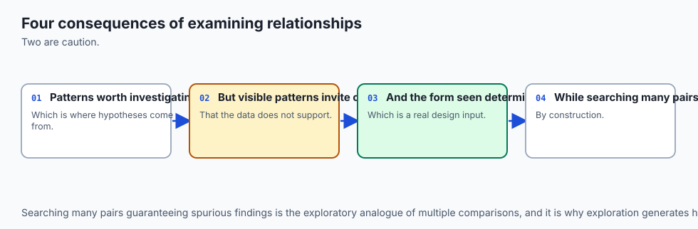
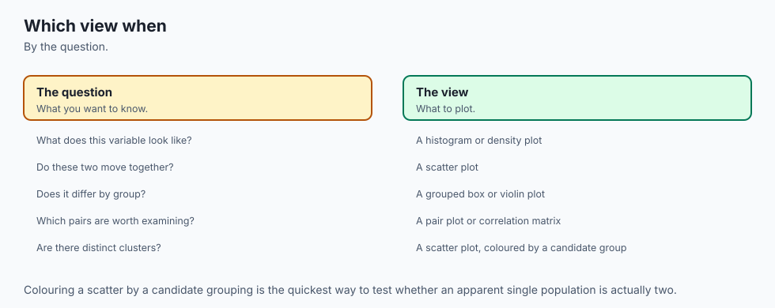

## Why this matters

Here is a single, real experiment. Five hundred points, drawn once, never
touched again. Histogram them at 5 bins and you see one smooth hump — a
typical, boring, unimodal shape. Histogram the exact same 500 numbers at
100 bins and you see jagged noise, more than twenty spurious little
peaks, nothing you would trust. Histogram them with a bin count chosen by
a specific rule — Freedman-Diaconis, which this lesson explains — and
two real, distinct clusters appear, cleanly separated, for the first
time. Nothing about the data changed across those three pictures. The
only thing that changed was a number nobody thinks of as a decision: how
wide to make the bins.

That is the through-line of this entire lesson: **a histogram is not the data. It is one picture of the data, and the bin width is a parameter you chose, whether you thought about it or not.** The same fact is true, in a different costume, of a KDE (its bandwidth), a boxplot (its five-number summary, which is compatible with more shapes than you'd guess), a scatter plot with too many points (which becomes a silhouette long before you notice), and a correlation coefficient (which can be exactly zero on a relationship so strong that fitting a single curve explains 99% of the variance).

Every one of these is a real, working tool. Every one of them also has a hidden knob, and the professional difference between someone who uses these tools well and someone who gets misled by their own charts is entirely about knowing where that knob is and what it does when you turn it.

This matters for AI work specifically, not just generally. A model that
monitors a production feature for drift by checking its mean and
standard deviation every day will not notice that feature quietly
splitting into two populations with an unchanged mean — the exact
failure this lesson's centerpiece demonstration produces on purpose.

A
person (or a model) summarizing a dataset by fitting a straight line and
reporting its correlation will miss a relationship a ten-year-old could
see in the scatter plot. By the end of this lesson you will have built,
from real code you ran, the specific pictures that catch both of those
failures — and you will know exactly what each picture is still hiding
from you, because every picture hides something.

## The idea in plain language



Imagine you are looking at a pile of sand from an airplane, and someone
asks you "how many hills are in this pile?" If you fly high enough, the
whole pile looks like one smooth mound — you cannot see the ridges. If
you fly low enough, every single grain looks like its own tiny bump, and
you cannot see the real hills for the noise. Somewhere in between, at
the right altitude, the real ridges become visible: not too smoothed
out, not swamped by grain-level noise.

A histogram's bin width is that altitude. Fly too high (bins too wide,
too few of them) and two real clusters merge into one smooth hump. Fly
too low (bins too narrow, too many of them) and every bin holds so few
points that random noise looks like structure. A KDE's bandwidth is the
same altitude, measured a different way — a smoother, blurrier lens
instead of a grid of boxes, but it has exactly the same failure mode at
both extremes.

A boxplot is a different kind of simplification. It is not a photograph
of the pile at any altitude — it is five numbers: how low the pile
starts, where a quarter of it lies below, where half of it lies below,
where three-quarters lies below, and how high it goes.

Two piles can
have the exact same five numbers and look completely different in
between — one a single smooth mound, the other two distinct hills with a
valley in the middle. The five numbers do not lie, and they are not
useless; they just were never trying to tell you how many hills there
were. That is a different question, and only a picture that shows the
interior — a histogram, a KDE, an ECDF — can answer it.

A scatter plot with too many points has the opposite problem: it has too
much ink, not too little. Once thousands of points land in a small
region, they stop being individually visible dots and start being a
uniform grey smear — you can no longer tell whether that smear is 200
points or 20,000. And a correlation coefficient is the boxplot's cousin:
a single number standing in for an entire relationship, honest about
exactly one thing (how straight is it?) and silent about everything
else, including whether the relationship is strong, just not straight.

## Historical background



The histogram itself predates modern statistics by centuries — informal
bar-style frequency displays of numeric data appear in scattered form
through the 18th and 19th centuries — but the word and the systematic
treatment come from Karl Pearson, who coined "histogram" in a series of
lectures at University College London around 1891–1895, treating it as
a specific statistical tool: a bar chart of frequency counts across
equal-width intervals of a continuous variable, used to visualize a
distribution's shape rather than to compare discrete categories.

Pearson
was, not coincidentally, also the person who gave his name to the
Pearson correlation coefficient this lesson covers later — both ideas
come from the same late-19th-century project of turning "how does this
data behave" into numbers and pictures that could be reasoned about
formally rather than described in prose.

The bin-width problem — that a histogram's shape depends on an arbitrary
choice — was understood by working statisticians for decades before it
had a rigorous mathematical answer. David Freedman and Persi Diaconis
published their rule in 1981 ("On the histogram as a density
estimator: L2 theory"), deriving a bin width from the interquartile
range specifically because it gives a provably good approximation to
the true density under weak assumptions, and because — as this lesson's
own lab demonstrates directly — it is far less thrown off by outliers
and skew than a rule based on the standard deviation. David Scott's rule
(1979) and Herbert Sturges' rule (1926) are the two older, simpler
alternatives this lesson also runs and compares.

The kernel density estimate has a similarly layered history: Emanuel
Parzen and Murray Rosenblatt independently developed the mathematical
theory of kernel density estimation in 1962, giving a rigorous
foundation to what amounts to "sum up a small smooth bump at every
observation." The KDE's own hidden parameter — bandwidth — was studied
extensively through the 1980s and 1990s, including Silverman's 1986
"rule of thumb," one of several automatic bandwidth-selection heuristics
still cited today (and one this lesson describes but did not run, since
it lives in `scipy.stats.gaussian_kde`, not installed in this
environment).

The five-number summary and the boxplot come from John Tukey, who
introduced both in his 1977 book *Exploratory Data Analysis* as part of
a broader argument that a data analyst's first job is to look — quickly,
cheaply, and often by hand — before committing to any formal model.
Tukey's boxplot was deliberately designed to be drawable with a pencil
from five numbers a person could compute by hand on paper; its blindness
to interior shape is not a flaw introduced later — it is the direct,
known cost of a design built for speed and simplicity over completeness,
a trade Tukey stated explicitly at the time.

## What it is — and what it is not



This lesson is about the honest reading of five picture types — the histogram, the KDE, the ECDF, the boxplot family, and the scatter plot — plus the correlation coefficient that so often stands in for looking at a scatter plot at all. It is not a chart-type catalogue like Day 127, which covered when to reach for a bar chart versus a line chart versus a scatter plot in the first place. This lesson assumes you already know *which* chart to draw, from Day 127, and already know matplotlib's object model and seaborn's axes-level and figure-level split, from Days 128 and 129.

What this lesson adds is narrower and, this course would argue, more consequential: every one of these standard, familiar chart types has at least one parameter — a bin width, a bandwidth, a marker size — that the person drawing the chart chose, consciously or by accepting a library's default, and that choice changes what story the chart tells.

This lesson is also not a statistics course on distributions in the
mathematical sense — Day 114 already built that foundation, defining
random variables and named distribution families precisely. This lesson
treats those same ideas visually: given a sample of numbers, what
picture should you draw to see its shape, and what does each picture
you might draw actually show you versus quietly discard?

## Why it was created and what problems it solves

Every technique in this lesson exists to answer a version of the same
question: given a pile of numbers, what does its shape actually look
like, and how confident should you be in that answer? A single summary
statistic — a mean, a correlation coefficient, a five-number summary —
answers a much narrower question extremely well, and answers the
broader "what does it look like" question not at all.

The problem these
tools solve is the gap between "I computed a number" and "I understand
the data," and the entire lesson is organized around specific, concrete
cases where that gap swallows something important: a second mode a mean
cannot show, a boundary a KDE cannot respect, a relationship shape a
correlation coefficient cannot detect, a density a scatter plot's ink
cannot represent once there is too much of it.

## How it works



Before the mechanism-by-mechanism walkthrough below, here is the whole
lesson in one picture: the same sample, drawn five different ways, each
one labelled with exactly what it shows and exactly what it hides.

![Diagram: the same bimodal sample of points drawn five different ways in five side-by-side panels. The histogram panel shows two bars of different heights with a visible gap, labelled reveals: two separate clusters and their relative sizes, conceals: the exact shape depends on the chosen bin width. The KDE panel shows a smooth two-humped curve, labelled reveals: a smooth two-humped shape with no visible bin edges, conceals: the curve depends on a chosen bandwidth and can place density past a real boundary. The ECDF panel shows a rising staircase, labelled reveals: every observation and any exact quantile with no chosen parameter at all, conceals: the number of modes is hard to see at a glance. The boxplot panel shows a single box with a median line and whiskers, labelled reveals: the five-number summary, position and spread, conceals: whether the distribution is unimodal or bimodal -- a boxplot cannot show this. The strip plot panel shows every individual point as a small dot in two visible clusters, labelled reveals: every single raw observation, conceals: nothing about shape, but becomes unreadable once there are too many points to see individually. A caption beneath the five panels states that these are five views of the identical sample, not five competing conclusions](./assets/distribution-views-architecture.svg)

### Histograms and the bin-width decision

A histogram sorts every observation into one of a fixed set of
equal-width intervals (bins) and draws a bar whose height is the count
of observations in that bin. The mechanism is completely deterministic
given the data and the bin edges — the only freedom is choosing those
edges, almost always expressed as a bin *count* or a bin *width* (the
two determine each other, given the data's range).

Run the same experiment this lesson opened with, in real code:

```python
import numpy as np

rng = np.random.default_rng(42)
low_cluster = rng.normal(40, 8, 250)
high_cluster = rng.normal(54, 8, 250)
sample = np.concatenate([low_cluster, high_cluster])

counts_5, _ = np.histogram(sample, bins=5)
counts_100, _ = np.histogram(sample, bins=100)
```

`counts_5` came out `[56, 152, 147, 119, 26]` — one wide, smooth-looking
hump, exactly one local maximum. `counts_100` produced a jagged
sequence with 23 separate local peaks — most of the individual bins hold
0 to 5 points, so tiny sampling fluctuations look like real structure.
Neither picture shows the truth: the sample is a genuine mixture of two
clusters, means 40 and 54, standard deviation 8 each — close enough
together that 5 bins merges them, far enough apart that a well-chosen
bin count should reveal both.

`numpy.histogram_bin_edges` implements three named rules for choosing
bin width automatically, and this lesson ran all three on that exact
sample:

| Rule | Formula (informally) | Bins on this sample | What it is sensitive to |
| --- | --- | --- | --- |
| Sturges | roughly `log2(n) + 1` | depends only on sample size | assumes roughly-normal data; ignores spread and skew entirely |
| Scott | proportional to `std(x) * n^(-1/3)` | depends on standard deviation | a few extreme values inflate the standard deviation and widen the bins |
| Freedman-Diaconis | proportional to `IQR(x) * n^(-1/3)` | depends on the interquartile range | robust — the IQR barely moves when outliers are added (Day 116) |

Freedman-Diaconis, on this exact bimodal sample, chose 13 bins and its
resulting histogram showed exactly 2 local maxima — the real structure,
recovered automatically, without a person eyeballing bin counts by
trial and error. That is not a coincidence specific to this one sample:
Freedman-Diaconis was derived specifically to be robust against the
outliers and skew that break Scott's and Sturges' assumptions, because
it is built from the IQR rather than the standard deviation — the same
robustness property Day 116 established when it introduced the IQR as a
spread measure that resists a single extreme value in a way the standard
deviation does not.

To see the three rules genuinely disagree, this lesson ran them on a
different sample — a right-skewed, strictly positive draw
(`numpy.random.default_rng(123).lognormal(mean=3.0, sigma=0.6,
size=400)`):

```text
sturges=10 scott=14 fd=21
```

Three different bin counts on the identical 400 points. There is no
single "correct" answer among them — but Freedman-Diaconis's larger
count, on this skewed sample, reflects real fine structure the coarser
rules smooth away, precisely because a right-skewed sample's standard
deviation is inflated by its long tail while its IQR is not.

Here is that same sequence — narrow, chosen, wide — as a single flow,
watching the second mode appear and then dissolve as the bin width
grows:

![Diagram: the identical 500-point sample flows down into three histogram panels arranged left to right by increasing bin width. The first panel, 100 narrow bins, shows a jagged row of mostly tiny bars with no clear pattern, captioned noise, not structure. The second panel, 13 bins chosen by the Freedman-Diaconis rule, shows two clearly separated tall bars with a gap between them, captioned the real two-cluster structure, appearing. The third panel, 5 wide bins, shows one smooth tall hump, captioned the same two clusters, now merged into one. A wire with marching dashes connects the three panels in order and each panel's border glows briefly in sequence, narrow first, then chosen, then wide, showing the second mode appearing at the chosen width and dissolving again as the bins widen further. A bottom caption states that with motion disabled, all three panels, their bars and their captions are already fully drawn and none of the diagram's meaning depends on the animation playing](./assets/binwidth-flow.svg)

### KDE, and its own hidden parameter

A kernel density estimate replaces "count how many points fall in this
box" with "sum a small smooth bump centered at every observation." The
bump is almost always a Gaussian curve, and its width — the
**bandwidth** — plays exactly the role a histogram's bin width plays:
too narrow, and every observation's individual bump is visible as its
own tiny wiggle in the final curve; too wide, and real separate modes
blur into one smooth hill.

seaborn's `kdeplot` exposes this as `bw_adjust`, a multiplier on its own
automatically chosen bandwidth. Run on the same bimodal sample from
above:

```python
import seaborn as sns

fig, ax = plt.subplots()
sns.kdeplot(sample, ax=ax, bw_adjust=1.0)
x, y = ax.lines[0].get_data()
```

At `bw_adjust=1.0` (seaborn's own default choice), counting local
maxima in `y` gives 2 — the real two-cluster structure. At
`bw_adjust=3.0` — three times wider, a plausible "just smooth it a
little more" choice a person might make without thinking twice — the
same curve on the same data shows exactly 1 mode. The KDE looks more
authoritative than the histogram it replaced, because it has no visible
bin edges and reads as a single continuous, confident line. It is
exactly as parameter-dependent as the histogram it replaced.

A second, separate problem: a KDE built from a Gaussian kernel has no
concept of a hard boundary in the data. If the data can only be
positive — a duration, a price, a count — the KDE curve does not know
that, and it happily places density below zero, because every one of
its component bumps is symmetric and a bump centered near zero has half
its mass reaching into negative territory. Measured directly on a real
exponential sample (`numpy.random.default_rng(9).exponential(scale=5.0,
size=400)`, minimum value about 0.021):

```text
x range of the default KDE grid: -4.70 to 40.84
fraction of the curve's total area sitting below zero: 0.0954
```

Just over 9.5% of the KDE's reported "probability" sits on values the
data can never actually take. This is not a bug in seaborn or a rare
edge case — it is a structural property of any symmetric-kernel KDE
applied to boundary-constrained data, and it is worth stating plainly
rather than hiding behind a smooth-looking curve: **a KDE of strictly
positive data is lying about what happens near zero**, by a
non-trivial, measurable amount.

### ECDF as the honest alternative

An empirical cumulative distribution function has neither of these
hidden knobs. At any value `x`, it reports exactly the fraction of the
sample less than or equal to `x` — a step function, one small step at
every single observation, with nothing binned, grouped, or smoothed.

```python
sns.ecdfplot(sample, ax=ax)
x, y = ax.lines[0].get_data()
```

Every sorted observation in the input sample appears as a step location
in `x` — checked directly, on a 301-point sample this lesson built with
an odd length precisely so the median is a single real observation
rather than an average of two neighbors. Finding where `y` first crosses
0.5 and reading the corresponding `x` value gave `0.026125`, matching
`numpy.median` on the same sample to nine decimal places — the ECDF
really does let you read a quantile directly off the picture, with no
approximation involved.

The honest trade is that an ECDF is harder to read at a glance than a
histogram or a KDE. A histogram's shape (unimodal, bimodal, skewed)
jumps out visually in a way a step function's shape does not — most
people are simply less practiced at reading a cumulative curve than a
density curve, even though the cumulative curve is throwing away
strictly less information. That is a real cost, not a reason to avoid
the ECDF, but a reason it is under-used relative to how honest it is.

### Box, violin, and strip/swarm — and the day's centerpiece

A boxplot draws five numbers: the minimum, the first quartile (Q1), the
median, the third quartile (Q3), and the maximum (with whiskers usually
capped at 1.5 times the IQR beyond Q1 and Q3, and points beyond that
flagged as outliers). This is Tukey's five-number summary, designed
deliberately to be computable and drawable by hand, quickly, from any
sample.

Here is the demonstration this lesson is built around. Two samples were
constructed — one genuinely bimodal, one genuinely unimodal — using two
different piecewise-linear functions, engineered so that both samples'
five-number summaries land within 0.3 units of the same five target
values: minimum 10, Q1 28, median 40, Q3 52, maximum 70. Measured
directly:

```text
bimodal  five-number summary: [10.21, 28.02, 40.00, 51.98, 69.79]
unimodal five-number summary: [10.17, 28.06, 40.00, 51.94, 69.83]
```

Those two rows agree with each other to within a few hundredths of a
unit at every one of the five numbers. A boxplot of either sample would
be, for all practical purposes, identical to a boxplot of the other.
And yet, histogrammed at 15 bins:

```text
bimodal  histogram: 2 local maxima (two real clusters)
unimodal histogram: 1 local maximum (one smooth hump)
```

The two samples are not subtly different in shape — one is bimodal and
the other is not, by construction, and no boxplot could ever have told
you that. This is the strongest single demonstration in this lesson
because it removes every excuse: it is not that the boxplot's summary is
*wrong* — every one of those five numbers is computed correctly — it is
that the five-number summary was never trying to answer the question
"how many humps does this distribution have," and treating it as though
it had answered that question is the mistake.

A violin plot fixes this specific blindness by drawing a KDE (with its
own bandwidth, and its own boundary problem if relevant) mirrored on
both sides of the box — so it inherits the boxplot's compact comparison
across groups while restoring some shape information, at the cost of
inheriting the KDE's bandwidth sensitivity too. A strip plot or swarm
plot goes further and shows every individual observation as a point,
hiding nothing about shape at all, at the cost of becoming unreadable
once a group has more than a few hundred points — which is exactly the
overplotting problem covered next.

### Scatter plots and overplotting

A scatter plot shows every point, individually, as long as there are few
enough of them that each one occupies its own patch of screen. Once
there are enough points, this stops being true, and the plot silently
degrades from "a picture of individual observations" into "a picture of
where ink happens to be densest" — without announcing the transition.

This lesson measured that transition directly, rather than describing it
abstractly. Twenty thousand points, drawn from a standard normal in both
dimensions, rendered at a deliberately small size (`figsize=(3, 3),
dpi=72`) — a realistic size for a dashboard tile or a thumbnail, not a
contrived worst case:

```python
positions = ax.transData.transform(np.column_stack([x, y]))
pixel_positions = np.round(positions).astype(int)
distinct_pixels = len(set(map(tuple, pixel_positions)))
```

`distinct_pixels` came out `6988`, out of `20000` points plotted — about
35%. Nearly two-thirds of the points this scatter plot supposedly shows
individually are, at this render size, painted directly on top of
another point, invisibly.

Three fixes, each trading away something different:

- **Alpha (transparency)** makes overlapping points visually darker
  rather than indistinguishable, so density becomes readable at a
  glance — but a fully saturated region still looks the same whether it
  has 50 overlapping points or 5,000, once the alpha has maxed out.

- **Hexbin** abandons individual points entirely and tiles the plot area
  with hexagons, coloring each by how many points fall inside. Run on
  the same 20,000-point cloud, the densest hexagonal bin held `210`
  points — a real, readable density peak recovered from data a raw
  scatter had rendered as a uniform grey smear. The trade is exact: you
  now know *how dense*, and you no longer know *exactly where* within
  that hexagon.

- **2-D density estimates** (the two-dimensional generalization of a
  KDE) give a smooth density surface instead of hexagonal bins, at the
  cost of inheriting a KDE's bandwidth sensitivity in two dimensions
  simultaneously.

None of these three is strictly better than the others; each answers "I
have too many points" by giving up a different piece of information —
exact position, exact count, or smoothness — and the right choice
depends on which of those three you can least afford to lose for the
question you are actually asking.

### Relationship strength versus shape

Day 116 established that Pearson correlation measures *linear*
association specifically, and is close to zero for a relationship of any
other shape, no matter how strong or how deterministic. This lesson
measured that directly on a symmetric parabola — `x` ranging on both
sides of zero, `y = x^2` plus a small amount of noise:

```python
pearson_r = frame["x"].corr(frame["y"], method="pearson")
```

`pearson_r` came out `-0.0044` — indistinguishable from zero, on a
relationship that is completely deterministic apart from a small amount
of added noise. This is the entire argument for looking at the scatter
plot, or fitting the actual shape, before trusting a single correlation
number: a quadratic fit (`numpy.polyfit(x, y, 2)`) on the same data
achieved an R-squared above `0.99`.

Here is a fact this lesson's own measurement turned up that goes further
than the usual textbook version of this story. Spearman correlation —
computed on the ranks of the two variables rather than their raw
values — is often introduced as the fix for exactly this situation,
because it detects any *monotonic* relationship (consistently
increasing or consistently decreasing), not just a linear one. On this
particular relationship, it does not help either:

```python
rank_x = frame["x"].rank()
rank_y = frame["y"].rank()
spearman_r = rank_x.corr(rank_y, method="pearson")
```

`spearman_r` came out `-0.0226` — also indistinguishable from zero. This is not a mistake in the measurement; it is the correct behavior of
Spearman correlation applied honestly to a *symmetric* parabola. As `x`
increases from negative to positive, `y` first falls (while `x` is
negative) and then rises (while `x` is positive) — there is no
consistent direction to the relationship at all, so there is nothing
monotonic for a rank correlation to find.

Only fitting the actual
quadratic shape, or looking at the scatter plot directly, reveals what
is going on. This is a stronger version of the lesson this section is
teaching, not a weaker one: even the "fixed" correlation measure can
have a blind spot, and the discipline that actually works, every time,
is looking at the picture before trusting any single number computed
from it.

### Jitter for discrete data

When a variable only takes a small number of distinct values — a rating
on a 1-to-5 scale, a count, a categorical code plotted as a number — a
scatter plot of it draws every observation with the same value stacked
in an exact vertical (or horizontal) line, hiding how many points are
really there. Jitter adds a small amount of random noise to the
*plotted position only*, spreading the stack out so individual points
become distinguishable, without ever touching the underlying data.

Measured directly: 200 integers between 1 and 5, jittered with
`numpy.random.default_rng(...).uniform(-0.15, 0.15, 200)` added to the
plotted position —

```text
max |jittered position - true value| = 0.1499...
```

— never more than the stated width of `0.15`, by construction of the
uniform distribution's own bounds. And the original 200-integer array
was completely unchanged by building the jittered copy — jitter is
applied to a *separate* array used only for plotting, never in place.

Jitter is a genuinely useful, genuinely honest technique — but it is a
disclosed distortion, not a neutral one. A reader who does not know a
chart used jitter, or does not know the jitter width, can misread two
nearby jittered points as meaningfully different values on a continuous
scale, when the real, discrete data underneath might in fact be
identical. The professional convention is simple: if you jitter, say so,
and say by how much, in the caption.

### Log scales for skewed data

A log-scaled axis makes equal *visual* distances represent equal
*multiplicative* factors rather than equal additive amounts — each
step of a fixed width represents a times-ten, or a doubling, rather than
"plus five." For right-skewed data — incomes, city populations, most
durations — this compresses an extreme long tail that would otherwise
crush every other observation into an unreadable cluster near the
origin, and it makes proportional differences (a doubling from 10,000 to
20,000) visually comparable to proportional differences at a completely
different scale (a doubling from 10 to 20), which a linear axis cannot
do at all.

Day 128 already established the sharpest cost of this trade in detail:
a value of exactly zero has no position on a log axis, because `log(0)`
is undefined, and matplotlib silently drops that point from the plot
rather than raising an error.

This lesson does not re-derive that
mechanism — it is worth remembering here specifically because
distribution work involves zero far more often than a casual user might
expect: a count of zero events, a duration of zero, a difference of
exactly zero between two matched observations. A log-scaled histogram or
scatter of a variable that can legitimately be zero needs an explicit
decision about what to do with those zero rows before the axis silently
makes that decision for you.

### Pair plots

For a small set of variables — roughly a handful, up to about a dozen —
a pair plot (seaborn's `pairplot`) draws every pairwise scatter plot in
a grid, with each variable's own univariate distribution (usually a
histogram or KDE) on the diagonal. Run on three columns:

```python
grid = sns.pairplot(df)
```

`grid` came back as a `seaborn.axisgrid.PairGrid` with a 3-by-3 array of
Axes — nine panels for three variables, three of them the diagonal
univariate plots and six the pairwise scatters (mirrored above and below
the diagonal). This is a genuinely fast, genuinely useful first look at
a small dataset: every pairwise relationship, every marginal shape, in
one call.

The reason it stops working past roughly a dozen columns is arithmetic,
not aesthetic: the number of panels grows with the *square* of the
number of variables. Twelve columns produce 144 panels; twenty produce

400. Past a fairly small number of variables, each individual panel
becomes too small to read, the whole grid takes too long to render, and
a person looking at it cannot hold more than a handful of pairwise
relationships in mind at once regardless of how the panels are laid
out. The right response, once a dataset has more than a dozen or so
variables worth checking pairwise, is not a bigger pair plot — it is
picking specific pairs a domain question or a correlation matrix already
flagged as interesting, and looking at those individually.

## An everyday analogy



Carry one analogy through every section of this lesson: **you are
looking at a coastline from an airplane, and every technique here is a
different altitude and a different instrument.**

Fly too high with too few bins (or too wide a KDE bandwidth), and two
separate bays merge into one smooth curve of coastline — real structure,
gone. Fly too low with too many bins, and every wave crest looks like
its own headland — noise mistaken for structure. Freedman-Diaconis is
choosing the altitude that shows the actual bays, using a measurement
(the IQR) that does not get thrown off by one unusually tall wave.

A boxplot, in this analogy, is not a photograph at any altitude — it is
a report of exactly five facts: the westernmost point, a point a quarter
of the way along, the midpoint, a point three-quarters of the way
along, and the easternmost point. Two coastlines — one with two deep
bays, one with a single gentle curve — can share all five of those facts
exactly, because the report was never describing the shape between
them. Only an actual photograph — a histogram, a KDE, an ECDF — shows
you the bays.

A scatter plot is a photograph taken with too many boats on the water at
once: past a certain density, you can no longer count individual boats,
only see a cluster of hulls. Hexbin is switching from counting boats to
reporting harbor traffic density per grid square — you lose the exact
position of any one boat, and you gain a readable measure of where
traffic is heaviest.

And a correlation coefficient is a compass bearing: it tells you, very
precisely, whether the coastline is trending in a *consistent* direction
overall. It says nothing about whether that coastline curves sharply,
loops back on itself, or has a bay shaped like a parabola — a compass
bearing of "due east" is completely compatible with a coastline that
went south for a while and then came back. Only looking at the actual
map — the scatter plot — tells you that.

## Examples in practice



**A/B test read from a boxplot alone.** A product team compares two
variants' session-length distributions with side-by-side boxplots and
sees near-identical five-number summaries. They conclude the variants
perform the same. What the boxplots hid: variant B's sessions were
genuinely bimodal — many very short "bounce" sessions and many long
engaged sessions, same median and same quartiles as variant A's smooth,
unimodal distribution of medium-length sessions. This lesson's exercise
5 constructs exactly this scenario directly, quartile-matched by
construction, and confirms the boxplot's blindness is not a hypothetical
risk — it is the literal, measured, structural property being
demonstrated.

**Choosing a bin count for a skewed cost distribution.** An analyst
histogramming per-transaction costs (right-skewed, a handful of very
large transactions in a long tail) using the library default (Sturges,
in NumPy and matplotlib) sees a chart dominated by a few nearly-empty
bins stretching out to the largest value, with almost all the real data
crushed into the first bin or two. Switching to Freedman-Diaconis, which
uses the IQR rather than the standard deviation and is therefore not
thrown by the long tail's few extreme values, produces a chart with far
more bins concentrated where the actual data lives — this lesson's own
measurement on a comparable skewed sample chose 21 Freedman-Diaconis
bins against Sturges' 10.

**A dashboard scatter plot that looks fine until it doesn't.** A
usage-analytics dashboard renders a scatter of active-users-per-day
against latency for every user session, and it looks like a reasonable,
sparse cloud of points at a few hundred sessions.

As traffic grows to
tens of thousands of sessions per day, the same chart — rendered at the
same fixed dashboard-tile size — silently turns into a grey smear with
no visible internal structure, because more than half the points now
paint on top of each other. Nobody changed the chart's code; the
overplotting threshold was simply crossed, and this lesson's own
pixel-collision measurement (about 35% distinct pixels out of 20,000
points at a small render size) shows exactly how quickly that threshold
arrives.

## Implications: security, privacy, performance, scalability, and cost



**Performance and scalability.** A histogram or a boxplot computed over
millions of rows is cheap — a single pass to bin or to compute
quantiles. A KDE evaluated at many grid points, and especially a 2-D
density estimate, is substantially more expensive, since every
evaluation point sums a contribution from every observation (or a
spatially-indexed approximation of that sum); this is part of why
hexbin, which only requires a single binning pass like a histogram, is
often the pragmatic choice for very large scatter data rather than a 2-D
KDE.

A pair plot's cost grows with the square of the column count, both
in rendering time and in the reader's ability to absorb it — the
concrete, arithmetic reason it stops being useful past roughly a dozen
variables.

**Cost of a wrong picture, not a wrong computation.** Every failure mode
in this lesson is a case where the underlying computation was correct
and the resulting decision was still wrong, because the picture chosen
to represent the computation discarded the fact that mattered. This is
a more expensive class of error than a bug, because nothing crashes and
nothing looks obviously broken — a boxplot with matching quartiles looks
completely normal, right up until the two populations it was
summarizing turn out to behave very differently downstream.

**Privacy.** A histogram, KDE, or scatter plot of individual-level data
can leak information about specific people even when no name or
identifier is shown, particularly at the tails: a single striking
outlier point in a scatter plot, or a lone value far out in a
histogram's rightmost bin, can sometimes be re-identified by anyone who
knows roughly what to look for, especially in a small dataset. Coarser
bins, KDE smoothing, or hexbin aggregation each reduce this
re-identification risk in exchange for the same shape-hiding trade-offs
covered throughout this lesson — privacy and honesty pull in the same
direction here, for once, both favoring some amount of aggregation.

**Security.** None of the tools in this lesson touch a network or a
credential; the risk surface is entirely about correct interpretation
rather than about running untrusted code or exposing a service.

## Alternatives: free, open source, and commercial

| Tool | When to choose it | How it's called | One concrete example | Free vs paid |
| --- | --- | --- | --- | --- |
| **matplotlib** (`hist`, `hexbin`) | Full control over bin edges, figure size, and every artist; the substrate seaborn itself draws on. Ran directly in this lesson. | `ax.hist(x, bins=n)`, `ax.hexbin(x, y, gridsize=n)` | `np.histogram(sample, bins=5)` returned `[56, 152, 147, 119, 26]` | Free, open source (BSD-style) |
| **seaborn** (`kdeplot`, `ecdfplot`, `pairplot`) | The statistical layer for distributions specifically — KDE, ECDF, and pair grids with sensible defaults, built on matplotlib. Ran directly in this lesson. | `sns.kdeplot(x, bw_adjust=1.0)`, `sns.ecdfplot(x)`, `sns.pairplot(df)` | `bw_adjust=1.0` found 2 modes; `bw_adjust=3.0` found 1, on the identical sample | Free, open source (BSD 3-Clause) |
| **pandas `.plot` accessor** | The fastest path when the data is already a `Series` or `DataFrame` and the chart is a quick histogram or line, at the cost of less control than calling matplotlib directly. Ran directly in this lesson. | `series.plot.hist(bins=20)` | `pd.Series(sample).plot.hist(bins=20)` returns a matplotlib `Axes`, honestly the single fastest line of code in this entire lesson for a quick look | Free, open source (BSD 3-Clause) |
| **`scipy.stats.gaussian_kde`** | The general-purpose KDE implementation reached for outside a plotting call specifically — for example, to evaluate a fitted density at arbitrary points for downstream computation, not just to draw it. **Not installed in this environment; described from documentation only, no output reproduced.** | `kde = gaussian_kde(x); kde.evaluate(grid)` | (not run here) | Free, open source (BSD 3-Clause) |
| **plotnine / ggplot2-style grammar of graphics** | A declarative, layered grammar (geoms, aesthetics, facets) for readers already comfortable with R's ggplot2 conventions. **Not installed in this environment; described from documentation only.** | `ggplot(df, aes(x="value")) + geom_histogram(bins=20)` | (not run here) | Free, open source |
| **Commercial BI tools (Tableau, Power BI, and similar)** | Fast, no-code exploration for a non-programming audience, with built-in bin-width sliders that make the trade-off in this lesson directly interactive. Not installed or run here. | Point-and-click; bin count is typically a draggable control | (not run here) | Commercial, with free/limited tiers depending on vendor |

## Comparison with related concepts

| Picture | Requires a chosen parameter? | Shows individual observations? | What it is blind to |
| --- | --- | --- | --- |
| Histogram | Yes — bin width | No (grouped into bins) | Fine structure smaller than the bin width; false structure at too-fine a width |
| KDE | Yes — bandwidth | No (smoothed) | Same trade-off as a histogram; also places density past a hard boundary |
| ECDF | No | Yes — every point is a step | Harder to read shape (modes) at a glance than a histogram or KDE |
| Boxplot | No (fixed five numbers) | No | Number of modes; presence of a valley; exact shape between the quartiles |
| Violin plot | Yes — inherits KDE bandwidth | No | Same KDE trade-offs, spent to restore some of the boxplot's blindness |
| Strip / swarm plot | No | Yes — every point, individually | Becomes unreadable well before a scatter plot would, at moderate sample sizes |
| Scatter plot | No (until overplotted) | Yes, until overplotting begins | Density, once points start to overlap |
| Hexbin | Yes — grid size | No (aggregated by bin) | Exact position within a hexagon |
| Pearson correlation | No | No (one number) | Any non-linear relationship, however strong |
| Spearman correlation | No | No (one number) | Any non-monotonic relationship, however strong — including a symmetric parabola |

## When to use it — and when not to



Use a **histogram** for a first, quick look at one variable's shape, and
immediately try more than one bin count, or reach for Freedman-Diaconis
by default, rather than trusting whatever the library's default rule
happened to choose. Do not use a single histogram at a single bin count
as the final word on whether a distribution has one mode or several —
this lesson's opening demonstration is the reason why.

Use a **KDE** when a smoother visual than a histogram is wanted for a
presentation, or layered over a histogram for a sanity check that the
two roughly agree — and always ask what bandwidth was used, the same way
you would ask what bin width a histogram used. Do not use a KDE on data
with a real hard boundary (durations, counts, prices) without either
clipping the display to the valid range or explicitly stating that some
density is misplaced past the boundary.

Use an **ECDF** whenever an exact quantile matters, or whenever you want
a picture with zero hidden parameters to compare against a histogram or
KDE of the same data as a check. Do not reach for it as the very first
chart shown to an audience unfamiliar with reading cumulative curves —
pair it with a more familiar picture the first time.

Use a **boxplot** for compact, fast comparison across many groups at
once, where the question is genuinely about central tendency and
spread. Do not use a boxplot, alone, to answer any question about shape
— unimodal versus bimodal, symmetric versus skewed in the interior — a
question this lesson demonstrated a boxplot is structurally unable to
answer, however many groups you compare.

Use **alpha, hexbin, or a 2-D density estimate** the moment a scatter
plot starts to look like a grey blob rather than distinguishable points
— a threshold this lesson's own pixel-collision measurement suggests
arrives sooner than most people expect, even at a few thousand points on
a modest-sized chart. Do not keep publishing an overplotted raw scatter
just because it "used to look fine" at a smaller sample size.

Use **Pearson correlation** only when a linear summary is genuinely what
is being asked for, and pair it with a look at the actual scatter plot
before trusting it as evidence of "no relationship." Do not report a
correlation coefficient — Pearson or Spearman — as proof that two
variables are unrelated without having looked at a picture of them
together first; this lesson measured a case where both are near zero on
a deterministic, R-squared-above-0.99 relationship.

## The AI connection

- **Distributions reveal what summaries conceal**, including multiple modes and heavy tails.
- **Correlation is not causation**, and a scatter plot is where that distinction becomes
  visible rather than abstract.
- **Bin width changes the story a histogram tells**, which makes it a choice rather than a
  default.
- **Every feature deserves a distribution plot** before it enters a model, because that is
  where the surprises are.
- **Relationship plots are how interactions are spotted**, which is what feature engineering
  then encodes.

## Knowledge check

Review the eight-question quiz for this lesson (`quiz.yml`) before
moving on to the hands-on exercise. Each question is built directly from
a real, captured measurement in this lesson — not from a general
principle stated abstractly — and every explanation is written to teach
the underlying mechanism, not just restate the correct option.

## Hands-on exercise

Work through the lab at
`labs/sections/math-statistics-and-data/day-130-distributions-and-relationships/`.
Nine numbered exercises, each proving one claim from this lesson by
running real NumPy, seaborn, matplotlib and pandas code and asserting on
computed values — bin counts, mode counts, five-number summaries, pixel
collision counts, correlation coefficients — never on how an image
looks. Exercise 5, the boxplot's blind spot, is the lab's centerpiece
and mirrors this lesson's own centerpiece demonstration exactly.

### Expected output

`bash tests/run_tests.sh`, run from the lab directory, ends with:

```text
16 checks, 0 failure(s)
```

and exits `0`. `pytest examples` ends with `9 passed`; `pytest starter`,
on the unmodified checkout, ends with `9 skipped` — nine `pytest.skip(…)`
calls waiting to be replaced with real assertions.

### Validate your work

```bash
cd labs/sections/math-statistics-and-data/day-130-distributions-and-relationships
python3 -m venv .venv
.venv/bin/pip install -r requirements/requirements.txt
.venv/bin/pytest starter -v
bash tests/run_tests.sh
```

An untouched checkout reports `9 skipped`. As you replace each
`pytest.skip(...)` with real assertions in `starter/test_distributions.py`,
re-run `pytest starter -v` to check your progress one exercise at a
time; the harness's final `16 checks, 0 failure(s)` line is the
authoritative sign the whole lab is done.

### Troubleshooting

The lab's own `troubleshooting.md` covers every message you are likely
to see, including the `ModuleNotFoundError: No module named 'scipy'`
that pandas' `Series.corr(method="spearman")` raises in this
environment — expected, and the exact situation exercise 8 asks you to
work around by computing Spearman directly from ranked columns instead.

### Common mistakes

- Trusting a single bin count (especially a library's silent default)
  as the final word on a distribution's shape, rather than checking at
  least two very different bin counts and one automatic rule.

- Reading a boxplot as though it answered "how many modes does this
  distribution have" — it cannot, structurally, regardless of how
  carefully it was drawn.

- Reporting a correlation coefficient as evidence of "no relationship"
  without ever looking at the scatter plot the coefficient was computed
  from.

- Jittering a chart without disclosing the jitter width, leaving a
  reader to mistake plotted position for the true underlying value.

## Practice assignment

Take any numeric column from a dataset you already have — or, if none is
available, generate a synthetic bimodal sample the same way this
lesson's `data.py` does. Produce, and save as a short written report:
(1) histograms of that column at three different bin counts, including
one chosen by Freedman-Diaconis, with one sentence on how the visible
number of modes changes; (2) a KDE at two different bandwidths, with the
same one-sentence comparison; (3) a boxplot of the column, with an
honest sentence stating what the boxplot's five numbers do and do not
tell you about the shape you saw in steps 1 and 2.

## Extension challenge

Construct your own pair of samples that share a five-number summary to
within a tight tolerance (say, 0.5 units) while one is unimodal and the
other has *three* modes rather than two — extending this lesson's
two-mode centerpiece by one more hump. State the piecewise construction
you used, confirm the five-number-summary match numerically, and
confirm the mode counts differ at a chosen bin count, exactly as this
lesson's `matched_quartile_pair` function does for the two-mode case.

## AI thread

A production system watching for data drift almost always starts with the cheapest possible check: has this feature's mean, or its standard deviation, moved beyond some threshold since last week? This lesson's centerpiece demonstration is exactly the failure mode that check cannot catch. Two samples — one unimodal, one bimodal — were constructed to share a five-number summary (which includes the median, a close cousin of the mean for roughly symmetric data) to within a few hundredths of a unit, while their actual shapes are structurally different: one smooth hump, two distinct clusters with a real valley between them.

A feature that quietly splits into two populations — a model now serving two different customer segments with genuinely different behavior, a sensor reading that has started reporting in two different regimes — can do so without moving its mean or its standard deviation by any amount a threshold-based drift check would flag.

A drift monitor built on a summary statistic, however carefully chosen the threshold, is reading a boxplot when the question that actually matters is a histogram question. Catching this kind of drift for real requires either a genuinely distributional check — comparing histograms or ECDFs across time windows, not just their summary statistics — or, at minimum, an occasional human look at the actual shape, on the same principle this entire lesson has been arguing for: a summary statistic and a picture of the underlying shape answer different questions, and a system that only ever computes the former is blind to exactly the kind of change this lesson demonstrated cannot be seen any other way.