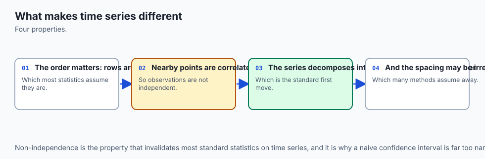
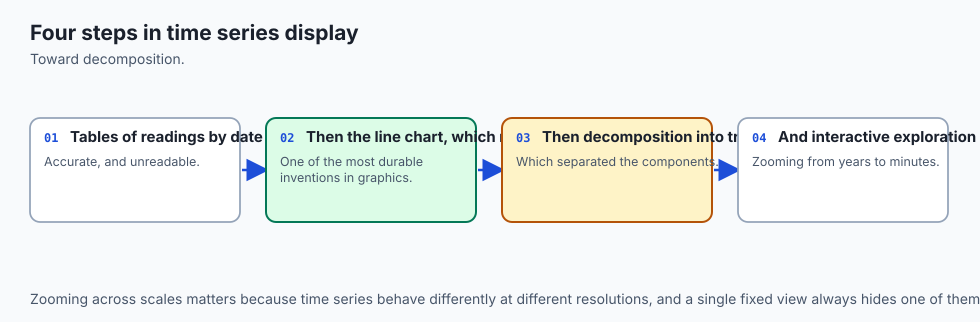
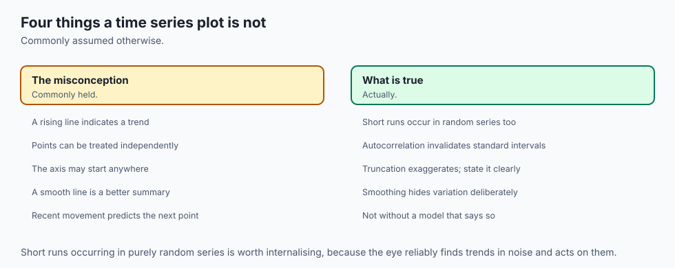
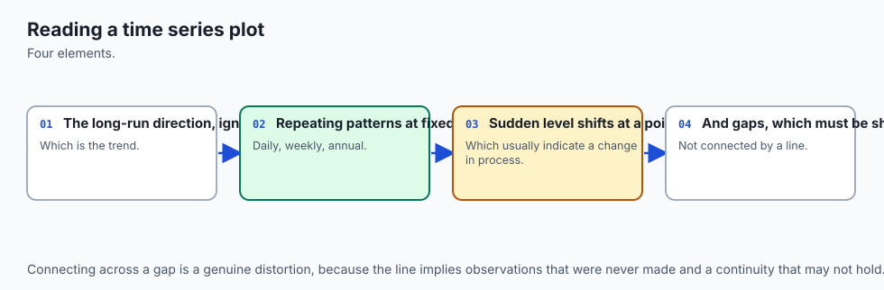
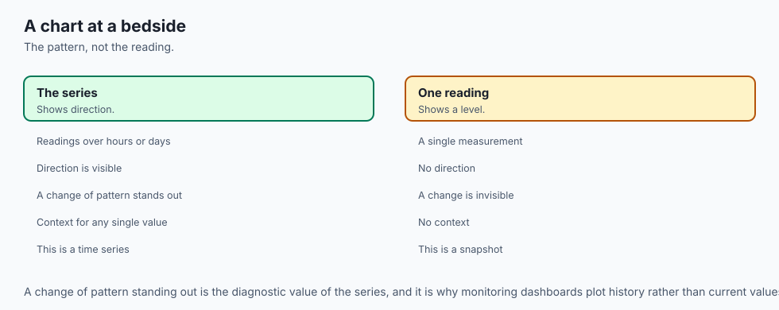
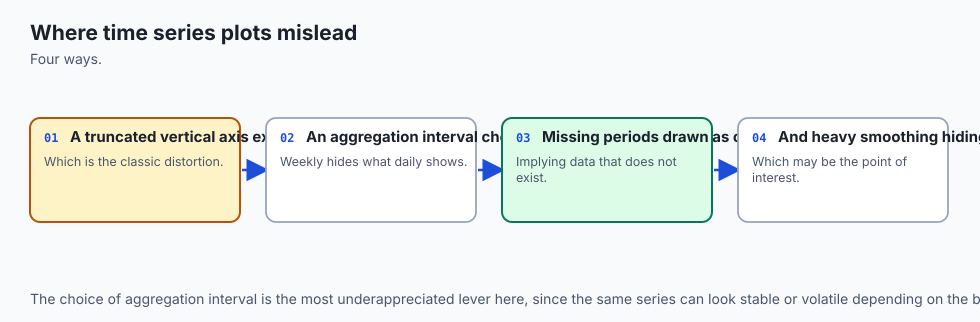
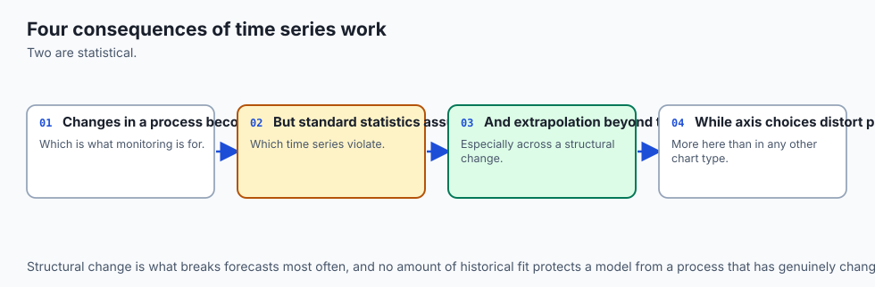
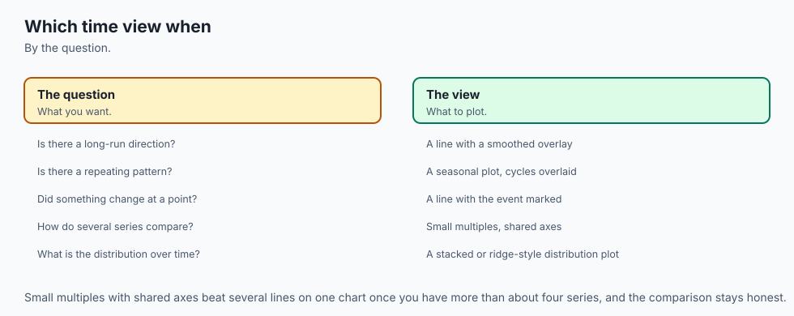

## Why this matters

Here is a series with one real, physical fact buried in it: a sensor went
offline for two weeks. Forty-five daily readings survive — thirty-one
from January, fourteen more starting in the middle of February — with a
genuine fourteen-day hole between them. Plot it against a plain row
index, the way `ax.plot(range(len(df)), df["value"])` naturally
tempts you to, and read the spacing back off the drawn line:

```text
>>> index x-step values
{1.0}
```

Every step is exactly `1.0`. Nothing in that picture says anything ever
went missing. The two points on either side of the real gap sit right
next to each other, drawn as though the fourteen days between them
simply never existed. Now plot the *same* forty-five values against the
parsed datetime column instead — one line changed, nothing else — and
read the spacing again:

```text
>>> datetime x-step values (days)
{1.0, 15.0}
```

Forty-three ordinary one-day steps, and one that is fifteen: fourteen
missing days plus the single day on either side of them. Same data, same
code except for which column supplied the x-axis, and only the second
version tells the truth about *when* the outage happened. Nothing was
computed wrong in the first version. Nothing was hidden on purpose. A
plain row index simply does not know what a day is, so it cannot show
you that one went missing — and a huge amount of default plotting code,
written by people who never stopped to check, quietly makes exactly this
mistake.

That is the whole subject of this lesson in miniature. Time is not just
another number you can put on an axis. It has structure — regular
spacing, cycles, calendars, daylight saving, the difference between
"nothing happened" and "we didn't look" — and the commonest charting
mistakes in this entire course are the ones that throw that structure
away without anyone noticing.

Every section below is one more way that
happens: an aggregation that answers a different question than the one
you meant to ask, a sampling interval that manufactures a pattern that
was never there, a rolling average that reports a peak two weeks after
it actually occurred, a missing observation drawn as though it were
present, a leap year that silently shifts every later date out of
alignment, and a calendar day that is honestly, measurably, not always
twenty-four hours long.

## The idea in plain language



A time series is a sequence of measurements tied to specific moments,
and a chart of one is making an implicit promise: that the horizontal
position of each point tells you *when* it happened, and that the
picture as a whole represents time itself faithfully — evenly where time
passed evenly, with a break where nothing was recorded, with cycles
drawn at the frequency they actually occurred. Every technique in this
lesson is really about keeping that one promise.

The trouble is that pandas and matplotlib will both happily let you break it without complaint. A `DatetimeIndex` (built with `parse_dates`, which Day 121 introduced) unlocks the machinery that keeps the promise — date-string slicing, `resample`, `rolling`, axis formatting that understands months — but nothing forces you to use it. You can plot against a row index instead, and matplotlib will draw a perfectly respectable-looking line with no error, no warning, nothing to tell you that the x-axis is now lying about time. You can resample to a monthly mean when the honest question was really about a monthly total, and get a chart that is completely correct arithmetic and completely wrong for the decision it's about to inform.

You can downsample a fast signal at too coarse an interval and get back not a blurrier version of the truth but a confident, wrong, entirely different pattern. None of these is a bug. Each is a *choice* — pick the wrong one and the chart still renders, still looks finished, and quietly tells the reader something false about time.

## Historical background



Time series analysis is one of the oldest branches of applied
statistics — astronomers and economists were fitting trends and cycles
to sequences of dated observations well over a century before anyone had
a computer to plot them on. The specific failure modes this lesson
covers, though, are not ancient statistical theory; they are consequences
of how *software* represents time, and most of them only became common
mistakes once dates turned into just another column type a library had
to support.

Aliasing has the oldest pedigree of anything here: it comes from
signal-processing theory in the mid-twentieth century, formalized in the
Nyquist–Shannon sampling theorem, which states that a signal must be
sampled at more than twice its highest frequency to be reconstructed
without ambiguity. Long before anyone plotted a pandas Series, engineers
knew that a wagon wheel filmed at the wrong frame rate appears to spin
backward for exactly this reason — the film samples the wheel's rotation
too slowly, and the eye reconstructs a false, slower (or reversed)
rotation from the samples, precisely the aliasing this lesson's exercise
3 reproduces with a plain cosine.

pandas' own time series machinery — `DatetimeIndex`, `resample`,
`rolling`, timezone-aware timestamps — dates to the library's earliest
years (2008 onward), built specifically because financial and
econometric data (Wes McKinney's original use case at AQR Capital) is
almost entirely time-indexed, and irregular, gapped, and
timezone-sensitive in exactly the ways this lesson covers. The DST
handling this lesson's ninth exercise relies on did not become fully
reliable until pandas' tz-aware timestamp support matured well past its
1.0 release; earlier versions had known bugs around ambiguous and
nonexistent local times that this lesson's approach — building
timestamps in UTC first, converting to a local zone afterward — was
specifically designed to sidestep, and remains the more defensive
pattern even now.

## What it is — and what it is not



Time series visualization is the practice of plotting data whose
observations are ordered by, and meaningfully spaced along, real
calendar time — and doing so in a way that preserves the actual temporal
structure of that data: its true spacing, its gaps, its cycles, its
calendar irregularities.

It is **not** simply "any line chart where the x-axis happens to contain
dates." A line chart of revenue by *product category*, ordered
alphabetically along the x-axis, is not a time series chart even if a
date happens to be printed somewhere on the page — nothing about the
axis represents elapsed time. Conversely, a chart whose x-axis literally
is `range(len(df))` is not a time series chart *either*, even if every
row happens to correspond to a specific date, because the axis itself
carries no information about when those dates actually fell — this
lesson's opening example is exactly that trap.

Time series visualization is also not synonymous with forecasting or
trend analysis, both of which are legitimate things you might do *with*
a time series but are separate disciplines with their own statistical
machinery (ARIMA, exponential smoothing, and the rest, none of which
this lesson covers). This lesson is entirely about the chart itself:
getting the axis, the aggregation, the sampling interval, and the
calendar right before any modeling question is even asked.

## Why it was created and what problems it solves

Every technique in this lesson exists to solve one problem: a plotting
library has no idea what a calendar is unless you tell it, and the
default behaviour of "just plot the numbers I gave you, in the order I
gave them" is silently wrong for time in at least six distinct ways —
one per major section of this lesson.

`resample` exists because raw observations rarely arrive at the exact granularity a question needs — you have daily sensor readings but want a monthly summary — and because *which* summary (mean, sum, last) is not a neutral technical choice but a decision about what question the chart answers.

`rolling` exists to smooth short-term noise while preserving slower-moving signal, and its `center=` argument exists specifically because the default trailing behaviour, while the only option usable in a genuinely live, real-time setting, systematically misreports *when* things happened. `reindex` exists to make an implicit assumption explicit: that a period a sensor didn't report is different from a period where the reported value happened to be zero, and a chart should be able to tell the difference.

Calendar-aware alignment (matching by month and day, not ordinal position) exists because a leap year adds a real day to the calendar that a naive ordinal count does not account for. And timezone-aware timestamps exist because political decisions about clocks — Daylight Saving Time chief among them — mean that "a calendar day" is not a fixed quantity of hours everywhere, all the time.

## How it works



### Building a real datetime index, and what it buys you

Everything in this lesson depends on one prerequisite: a real
`DatetimeIndex`, produced by `parse_dates` (Day 121) or `pd.date_range`,
not a plain string column or a `RangeIndex`. Once you have one, three
things become possible that were not possible before.

**Date-string slicing.** `series.loc["2024-01"]` returns every January
2024 row without you writing a single comparison — pandas parses the
string and matches it against the index directly. This lesson's
exercise 2 uses exactly this to cross-check a resampled aggregate
against the raw rows that produced it.

**`resample`.** A `DatetimeIndex`-ed series can be grouped into fixed
time buckets — `"MS"` for calendar-month starts, `"D"` for daily, `"h"`
for hourly — and each bucket aggregated, exactly the way `groupby` (Day
123) groups by a category label, except the "label" here is a slice of
elapsed time rather than a value already present in a column.

**Axis formatting that understands months.** `matplotlib.dates` supplies
locators and formatters — `MonthLocator`, `DateFormatter("%b %Y")`, and
similar — that place and label ticks at genuine calendar boundaries
(the first of each month, say) rather than at arbitrary evenly-spaced
positions, which is the only way an axis can correctly show "one tick
per month" when months are not all the same length.

### Resampling, and why the aggregation is a claim

Resampling ninety days of a fixed, hand-checkable series (`value` equal
to the day number, so January's thirty-one raw values are simply `1`
through `31`) to three different monthly aggregates gives three
different, equally true numbers for the exact same underlying rows:

```text
>>> daily_1to90.resample("MS").mean().iloc[0]   # January
16.0
>>> daily_1to90.resample("MS").sum().iloc[0]    # January
496.0
>>> daily_1to90.resample("MS").last().iloc[0]   # January
31.0
```

None of these three is "the" correct answer for January. `16.0` answers
"what was a typical day like." `496.0` answers "how much total activity
happened." `31.0` answers "what was the most recent reading by the end
of the month." A chart captioned simply "monthly revenue" that is
secretly a `.last()` resample rather than a `.sum()` is telling the
reader the wrong thing about the business, using entirely correct
arithmetic, because the aggregation itself is where the actual claim
lives — the drawing is just the last, least important step.

### Aliasing — the deep version of the same point

Resampling picks the wrong *summary*. Aliasing is what happens when the
sampling interval itself is wrong, and it is not a smaller version of
the same problem — it is qualitatively different and considerably more
dangerous, because the result does not look degraded. It looks
confident.

Construct a signal whose true period is four days —
`numpy.cos(2 * pi * t / 4)` — and sample it every fifth day instead of
every day. The full-resolution signal genuinely, verifiably repeats
every four days. The five-day-sampled version repeats — smoothly,
convincingly — every twenty days:

```text
>>> true period (days)
4
>>> sampling interval (days)
5
>>> observed period in the downsampled series (days)
20
```

Twenty is not four slowed down. It is a completely different number, five times the true period, produced entirely by the arithmetic relationship between a four-day cycle and a five-day sampling comb: each sample lands a fifth of a cycle later in phase than the one before it, so it takes four samples — twenty real days — before the phase comes back around to where it started.

This is the deep version of the point this whole lesson opened with: downsampling a real daily cycle to a weekly reading interval can produce a smooth, entirely convincing multi-month "trend" that corresponds to nothing at all in the underlying process, and unlike a resampling choice, there is no caption you can add to an aliased chart that makes it honest — the fix has to happen before you sample, or you have already lost the information needed to tell the false pattern from a real one.

![Diagram: a fast cosine cycle runs across the top panel. A comb of eight vertical sampling marks, spaced every fifth day, picks out one point at a time; a highlighted band sweeps left to right across the panel to show the comb sliding along the signal, and each sampling mark and its dot light up in turn as the sweep passes it. The eight sampled values, connected in the bottom panel in the order they were taken, assemble into a slow, smooth wave that is not present anywhere in the fast signal above it and exists only because of the interval between samples. A caption states the true period is 4 days, the sampling interval is 5 days, and the observed period is 20 days. With motion disabled, every sampling mark and dot is already lit, the sweeping band rests at its start position, and the full slow wave is drawn as a still, complete curve](./assets/aliasing-flow.svg)

### Rolling windows, and the trailing lag

A rolling mean smooths a noisy series by averaging a sliding span of
consecutive observations. `rolling(30)`, pandas' default, is a
**trailing** window: at any given date, it only ever looks *backward*
over the preceding thirty observations, because that is the only
direction of time a genuinely live system can observe. Over a series
with a single sharp peak at a known date, that backward-only constraint
produces a measurable, predictable lag:

```text
>>> true peak date
2024-04-10
>>> trailing (default) 30-day rolling mean peak date
2024-04-24    (14 days LATE)
>>> centred (center=True) 30-day rolling mean peak date
2024-04-10    (0 days offset)
```

Fourteen days — close to half the thirty-day window — is not a
coincidence or an edge case. A trailing window cannot report its own
maximum until the true peak has fully entered its backward-looking
span, which structurally happens roughly half a window-width after the
real event.

`rolling(30, center=True)` removes the lag entirely by
looking both backward and forward around each point, at the direct cost
of being unusable in real time, since it needs observations that have
not happened yet relative to the date it is reporting on. This is not a
minor implementation detail. A trailing thirty-day accuracy chart on a
model-monitoring dashboard reports a real regression two weeks after it
actually started, every single time, by the geometry of the window
alone — a fact the AI thread below returns to directly.

![Diagram in two stacked panels. The top panel draws one time series with a rising trend, a repeating seasonal wiggle riding on it, a vertical dashed line marking an annotated event, and a real gap where the line stops and resumes later with nothing drawn across it. The bottom panel isolates one peak and draws three curves over it: the true raw shape, a centred rolling mean that peaks in exactly the same place, and a trailing rolling mean whose peak is visibly shifted later, with a labelled arrow measuring that lag](./assets/timeseries-anatomy-architecture.svg)

### Trend versus seasonality, kept practical

A year-over-year overlay — plotting several years of a seasonal series
on one shared calendar axis — is the practical tool for separating a
genuine trend from the seasonal cycle riding on top of it, but it only
works if the years are aligned correctly. The naive approach, comparing
by raw ordinal day-of-year, breaks silently across a leap year:

```text
>>> Dec 31, 2024 (a leap year) -- ordinal day of year
366
>>> Dec 31, 2025 (not a leap year) -- ordinal day of year
365
```

Same calendar date, two different ordinal numbers, purely because 2024 has one more day (Feb 29) threaded in before it than 2025 does. Every comparison drawn from "day 300 of this year versus day 300 of last year" across that boundary compares two different calendar dates without anyone choosing to. Aligning instead by the actual `(month, day)` pair — ignoring the year — keeps Dec 31 lined up with Dec 31 correctly in both years, and isolates Feb 29 as its own row that simply has no counterpart in the non-leap year (a `NaN`, honestly, rather than a silent shift).

The practical rule this teaches generalizes beyond leap years: comparing "December to November" within one series is usually a mistake too, for the same underlying reason — a seasonal series' honest comparison is almost always to the *same period a year ago*, not to the *adjacent* period, because adjacent periods differ by both trend and season at once, and a year-ago comparison holds season fixed.

### Log scale for growth

A log-scaled y-axis turns equal *multiplicative* changes into equal
*visual* distances, which makes it the practical eye-test for constant
percentage growth. A series growing by a fixed 5% every period has
logged values that increase by exactly the same amount every step — a
straight line, measured here as a log-difference standard deviation of
essentially zero:

```text
>>> log-difference std, constant 5%-per-period growth
3.0e-16   (floating-point noise around exactly zero)
>>> log-difference std, constant linear (+5 units per period) growth
9.5e-3    (measurably curved, not a straight line)
```

Constant *linear* growth — the same absolute increase every period — is
not collinear in log space at all; its logged values curve, because the
same absolute increase is a shrinking *percentage* of an ever-larger
base. This is the practical difference between compounding and linear
growth, readable by eye rather than by computing a growth rate directly.
Day 128 already established the sharp edge of the same axis: a zero
value has no logarithm and silently disappears from a log-scaled chart
without any error — worth repeating here because it is exactly the kind
of failure that looks like nothing went wrong.

### Gaps and interpolation

matplotlib draws exactly the points it is given, connected in order,
with one specific exception: it breaks the line at an explicit `NaN`.
Those are two very different behaviours, and this lesson's fifth
exercise measures both directly on the same twenty-row series:

```text
>>> a physically missing row (dropped entirely, 19 of 20 rows remain)
line length: 19, contains NaN: False   -- drawn as ONE continuous segment
>>> the same gap as an explicit NaN (all 20 rows present)
line length: 20, contains NaN: True    -- the line genuinely BREAKS here
```

A dropped row and an explicit `NaN` describe the exact same missing
observation, and matplotlib treats them completely differently. The rule
this teaches is not "always fill missing values" — it is the opposite:
**reindex to the full expected period before plotting**, so a missing
observation becomes visible *as* a missing observation, rather than
being silently absorbed into a straight line connecting its two
neighbours as if nothing had happened. `series.reindex(full_index)`
performs exactly this conversion, turning an invisible absence into an
honest, visible one.

### Spaghetti charts and small multiples

Overlaying many series on one set of axes — a spaghetti chart — degrades
fast: past roughly five or six overlaid lines, color and legend alone
stop being enough to tell one series from another, especially once two
lines cross. The practical fix is small multiples: one panel per series,
sharing axis scales so the panels stay directly comparable, arranged in
a grid (`plt.subplots(n, 1, ...)` or similar) rather than crowded onto
one shared plot. There is no single universally correct threshold, but
"can a reader follow one specific line from the legend to the chart in
under two seconds" is a practical test, and once the answer is no, small
multiples are the honest choice, not a stylistic preference.

### Annotating events

A time series shown without its context invites a reader to invent one.
A sudden change with no annotation gets explained by whatever story the
reader already believes; the same change with a dashed vertical line and
a two-word label — "product launch," "outage begins," "pricing changed"
— gets explained by what actually happened. Annotating a known event
directly on the time axis (a vertical line plus a short text label, as
this lesson's architecture diagram shows) costs almost nothing to add
and removes an entire category of misreading.

### Timezones and DST, honestly

A daily aggregation of hourly, timezone-aware data spans exactly one
real Daylight Saving Time boundary of each kind per year, in any
timezone that observes it, and the resulting day genuinely does not
contain twenty-four hours:

```text
>>> hourly America/New_York readings resampled to daily counts
2024-03-08 (ordinary day)  -> 24 hours
2024-03-10 (spring forward) -> 23 hours
2024-11-03 (fall back)      -> 25 hours
```

This is not a data-quality bug to filter out. Clocks in
`America/New_York` genuinely skip the local hour 2:00–3:00 AM on the
spring-forward date and genuinely repeat 1:00–2:00 AM on the fall-back
date, and any per-hour rate for that specific day computed with a
hardcoded `/24` divisor is measurably wrong on exactly those two days a
year. The defensive pattern this lesson's exercise 9 uses — building
timestamps in UTC first, converting to the local zone only afterward —
avoids ever constructing a local wall-clock time that does not exist
(the skipped hour) or is ambiguous (the repeated one), which is the
safest order of operations regardless of which timezone library or
language you are working in.

## An everyday analogy



Picture a nurse checking a patient's temperature. If she writes down a
reading every hour on the hour, a fever that spikes and breaks between
two of her checks never appears in the chart at all — not because
nothing happened, but because nothing was *sampled* while it was
happening. That is aliasing: the true event was faster than the checking
interval, and the chart shows a false picture of steady health with
nothing to warn anyone that a fast-moving fever could hide entirely
between two adjacent dots.

Now picture a different nurse who is asked, at the end of a week, "how
was the patient's temperature this week?" One honest answer is the
average temperature across the week (the "typical" value — a `.mean()`). A different, equally honest answer is the highest temperature reached
(a different aggregate entirely — closer to a `.max()` than the `.sum()`
and `.last()` this lesson exercises directly, but the same underlying
point: which number you report is a decision about which question
you're answering, not a neutral summary of "the data").

And if the
nurse simply forgot to check on Tuesday — no reading exists for that day
at all — writing down Monday's number again for Tuesday (connecting
straight across the gap) tells a very different story than an honest
chart with a visible blank where Tuesday should be.

## Examples in practice



Every number below is captured from a real run on pandas 3.0.5,
matplotlib 3.11.1 and NumPy 2.5.2, in this lesson's own lab.

**The opening gap, in full.** Forty-five daily rows: thirty-one from
2024-01-01 through 2024-01-31, then a genuine fourteen-day break, then
fourteen more from 2024-02-15 through 2024-02-28.

```text
>>> plotted against range(len(df))
x-step values: {1.0}
>>> plotted against the parsed date column
x-step values (days): {1.0, 15.0}   -- one wide step, forty-three ordinary ones
```

**Resample as a claim.** Ninety days, `value` equal to the day number.

```text
>>> January 2024, three different monthly summaries
mean: 16.0    sum: 496.0    last: 31.0
```

**Aliasing.** A cosine with a true four-day period, sampled every fifth
day.

```text
>>> true period: 4 days   sampling interval: 5 days
>>> observed period in the downsampled series: 20 days
```

**Trailing lag.** A single triangular peak, 200 days, a 30-day rolling
mean.

```text
>>> true peak vs. trailing (default) rolling mean peak
offset: +14 days (late)
>>> true peak vs. centred rolling mean peak
offset: 0 days
```

**Missing row versus NaN.** Twenty daily rows, one value dropped versus
the same value set to `NaN`.

```text
>>> physically missing row: 19 points plotted, no NaN, one continuous line
>>> explicit NaN: 20 points plotted, NaN present, line genuinely breaks
```

**Log straightness.** Sixty periods of 5%-per-period growth versus sixty
periods of a fixed +5-units-per-period growth, both starting at 100.

```text
>>> log-difference standard deviation
percentage growth: 3.0e-16 (a straight line)   linear growth: 9.5e-3 (a curve)
```

**Leap-year alignment.**

```text
>>> Dec 31 ordinal day-of-year
2024 (leap): 366    2025 (not leap): 365
```

**Small multiples.** Six distinct series faceted into one panel each.

```text
>>> figure Axes count: 6   lines per Axes: 1 (every one of them)
```

**DST honesty.** Hourly `America/New_York` data resampled to daily
counts.

```text
>>> 2024-03-08 (ordinary): 24 hours
>>> 2024-03-10 (spring forward): 23 hours
>>> 2024-11-03 (fall back): 25 hours
```

## Implications: security, privacy, performance, scalability, and cost



**Security and privacy.** A time series axis is itself a disclosure
surface. A finely time-stamped chart of, say, badge-in events for one
individual can leak behavioural patterns (when someone is reliably away
from a location) that a coarser or intentionally jittered time axis
would not. This lesson's own data is entirely invented literals — dates,
a cosine, a triangular bump — precisely so nothing plotted here is real
personal or operational data.

**Performance.** `resample` and `rolling` are both implemented in
pandas' compiled core and scale to millions of rows comfortably; the
practical performance ceiling in this space is almost always the *plot*
itself, not the aggregation feeding it — a matplotlib line with a
million points renders slowly and exports a bloated file regardless of
how fast the resample that produced it ran, which is exactly the
motivation for downsampling *for display* (a legitimate use, done
carefully) as distinct from the aliasing failure this lesson warns
against (downsampling that silently changes the *meaning* of the
signal).

**Scalability.** Small multiples scale to dozens of series by adding
panels, at a real cost: readability degrades once the grid no longer
fits on one screen or printed page, at which point interactive tools
(the next section) that let a reader select which series to see become
the more scalable choice than a fixed static grid.

**Cost.** Every technique and every number in this lesson comes from
free, open-source tooling — pandas, matplotlib, NumPy — with no paid
tier anywhere in the chain, matching this lesson's lab exactly.

## Alternatives: free, open source, and commercial

**pandas' `resample`/`rolling` and the `.plot` accessor** (ran, exactly
as shown throughout this lesson). Free, BSD 3-Clause, no paid tier. The
default choice for any time series work already in a DataFrame — reach
for it first, always.

**matplotlib date locators and formatters** (ran — `matplotlib.dates`
supplies the `MonthLocator`/`DateFormatter` machinery this lesson's "how
it works" section describes). Free, PSF-derived/BSD-style license, no
paid tier. The layer underneath every static chart in this lesson and
this lab.

**seaborn** (not run in this lesson's own lab — Days 129 and 130 already
cover its statistical-plotting layer directly, and none of this lesson's
nine exercises needed anything seaborn adds on top of plain matplotlib).
Free, BSD 3-Clause. Choose it when a statistical estimate (a mean with a
confidence band) needs to ride on top of a time axis; every fact this
lesson establishes about the axis itself applies underneath it exactly
the same way.

**Plotly** (described from documentation only; not run here). Free, MIT
core library, with a paid Dash Enterprise tier for deployment
infrastructure — the open-source charting itself carries no cost. Choose
it for interactive zooming and panning on a genuinely long series (years
of daily or hourly data) in a notebook or a web page, where a static
image cannot let a reader scrub into a specific week. `import
plotly.express as px; px.line(df, x="date", y="value")` is the one-line
entry point per its own documentation.

**Bokeh** (described from documentation only; not run here). Free, BSD
3-Clause, fully open source with no paid tier of any kind. A comparable
choice to Plotly for browser-based interactive zooming on long series,
with a lower-level API that trades some of Plotly's convenience for more
direct control over the rendered plot.

## Comparison with related concepts

| Concept | What it actually is | Where this lesson touches it |
| --- | --- | --- |
| Groupby (Day 123) | Aggregating rows by a fixed category label already present in a column | `resample` is groupby with the "category" replaced by a slice of elapsed time |
| Forecasting / ARIMA | Modeling and predicting *future* values of a series | Entirely out of scope here; this lesson is only about drawing the series correctly, never about extrapolating it |
| Smoothing (rolling mean) | Reducing short-term noise by averaging a local window | Covered directly, with the trailing-versus-centred distinction as the load-bearing fact |
| Signal-processing aliasing | The classical sampling-theorem failure from electrical engineering | The same phenomenon, reproduced here with a plain cosine and no signal-processing background required |
| Data cleaning (Day 125) | Fixing incorrect, duplicated or malformed values | Distinct from this lesson's missing-row-versus-NaN section, which is about *display*, not correction — the underlying gap is real and should stay visible, not be filled in |
| Chart honesty / misleading scales (Day 132) | Deceptive axis truncation, dual axes, and similar | This lesson shows a genuine log axis; Day 132 covers when an axis choice crosses from a legitimate technique into deception |

## When to use it — and when not to



Use a real `DatetimeIndex` and the techniques in this lesson whenever
observations are tied to specific moments and the *timing* of those
moments — their spacing, their gaps, their cycles — is itself part of
what the chart needs to communicate: sensor readings, financial series,
event logs, model-monitoring metrics, anything where "when" is not
incidental.

Do not reach for a `DatetimeIndex` (or `resample`/`rolling`) when the x-axis is genuinely categorical rather than temporal — product names, survey questions, geographic regions — even if a date happens to be associated with each row elsewhere in the table; forcing a categorical comparison through time series machinery buys nothing and can actively mislead, implying a temporal relationship (adjacency, spacing) between categories that has no real meaning. Do not resample purely to "clean up" a chart's visual density without first deciding which aggregation answers the actual question being asked — that decision belongs to the person asking the question, not to whichever default the plotting call happened to use.

And do not treat a downsampled or heavily smoothed chart as safe for detecting fast-moving problems: this lesson's aliasing and trailing-lag sections both show, with real numbers, that coarsening a time axis can hide or misdate exactly the events a monitoring chart exists to catch.

## The AI connection

- **Time series plots reveal trend, seasonality and breaks** that no summary statistic
  reports.
- **The x-axis carries meaning here**, which makes ordering and spacing substantive rather
  than cosmetic.
- **Regime changes are visible long before they are measurable**, which is why plotting comes
  first.
- **Model monitoring is time series visualisation**, applied to metrics rather than to data.
- **Aggregating over the wrong period** can hide exactly the pattern the analysis was meant to
  find.

## Knowledge check

The eight questions in this lesson's quiz cover: index-versus-datetime
axis behaviour, resample aggregation choice, aliasing, trailing-window
lag, missing-row-versus-NaN, leap-year alignment, log-scale growth
detection, and Daylight Saving Time honesty. Work through them after the
hands-on exercise below, once you have run the real numbers yourself
rather than only read them here.

## Hands-on exercise

Complete the lab at
`labs/sections/math-statistics-and-data/day-131-time-series-visualization/`.
Nine numbered exercises, seventeen tests, entirely headless via
matplotlib's `Agg` backend, asserting on real x-positions, resample
outputs, rolling-window offsets and artist state — never on what a plot
merely looks like. Work through `starter/00_brief.md` and
`starter/test_timeseries.py` in order; read `examples/` only after you
have tried each exercise yourself.

```bash
cd labs/sections/math-statistics-and-data/day-131-time-series-visualization
python3 -m venv .venv
.venv/bin/pip install -r requirements/requirements.txt
.venv/bin/pytest starter -v
```

### Expected output

An untouched checkout reports:

```text
17 skipped in 0.01s
```

The fully worked reference suite reports:

```text
17 passed in 0.05s
```

And the full harness:

```text
17 checks, 0 failure(s)
```

exiting `0`.

### Validate your work

```bash
bash tests/run_tests.sh
echo "exit code: $?"
```

Confirm the exit code is `0` and the final printed line reads
`17 checks, 0 failure(s)`. Individually, confirm your own exercise 3
reports an observed spurious period of `20` days (not `4`), your
exercise 4 reports a trailing offset between `10` and `20` days with a
centred offset of exactly `0`, and your exercise 9 reports `23` hours
for 2024-03-10 and `25` for 2024-11-03.

### Troubleshooting

Full list in `troubleshooting.md`. The two most common: running
`pytest examples starter` together aborts with `import file mismatch`
because both directories define a module with the same name — always run
them as two separate commands; and a `ZoneInfoNotFoundError` in exercise
9 means your platform has no installed IANA timezone database — install
the pure-Python fallback with `.venv/bin/pip install tzdata`.

### Common mistakes

Hardcoding a captured number (the four resample values, the aliasing
period, the trailing offset) instead of computing it from the fixture
functions in `data.py` is the single most common way to pass an exercise
without actually proving the claim it is meant to prove — if the
underlying construction ever changes, a hardcoded assertion silently
stops testing anything real.

## Practice assignment

Take any dataset you already have with a genuine date or timestamp
column (or build one honestly from something you track personally —
daily step counts, expenses, anything with real irregular gaps). Load
it with `parse_dates`, and produce three charts: one plotted against a
plain row index and one against the real datetime, side by side, to find
out whether *your* data has a hidden gap the index version would hide;
a resampled monthly chart using the aggregation that actually answers
your real question, captioned with which question that is; and a
trailing-versus-centred rolling mean over the same window size, with the
measured lag between their two peaks written down as a number, not just
eyeballed.

## Extension challenge

Reproduce this lesson's aliasing exercise with a *real* daily signal you
can reason about — day-of-week retail traffic, say, which genuinely
cycles every seven days — sampled at a coarser interval than seven days,
and predict the spurious period *before* you compute it, using the same
arithmetic this lesson's "how it works" section walked through (true
period, sampling interval, and the resulting phase drift per sample).
Then verify your prediction against the actual downsampled series.
Getting the prediction right before checking is the real test of
whether you understand aliasing as a mechanism rather than as a fact you
memorized.

## AI thread

Model monitoring is time series visualization wearing a different name, and this lesson's two sharpest measured facts are exactly the two ways a monitoring dashboard lies to the team relying on it. A trailing-window accuracy chart — the default, and the only kind usable in a genuinely live system — reports a real regression roughly half a window-width *after* it actually started, measured here as fourteen days late on a thirty-day window; a team watching that chart for an early warning is, by the geometry of the window alone, always looking at old news.

And a dashboard that resamples per-prediction accuracy down to a weekly figure "to reduce noise" can hide a genuine daily failure entirely, for exactly the reason this lesson's aliasing exercise demonstrates with a plain cosine: coarsening a sampling interval below the frequency of the thing you are trying to detect does not make the chart blurrier, it can make the chart confidently, convincingly wrong, showing a stable trend where the underlying process was actually breaking on a schedule the sampling interval was too coarse to see.

Neither failure announces itself. Both render as a perfectly normal-looking line chart, which is the entire reason this lesson insists on checking the axis, the aggregation, and the sampling interval directly, in numbers, rather than trusting that a chart which looks finished is a chart that is telling the truth.