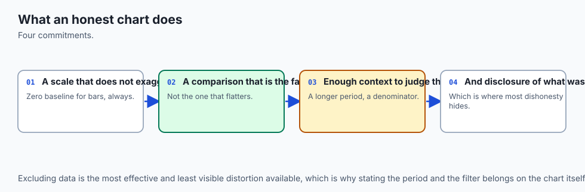
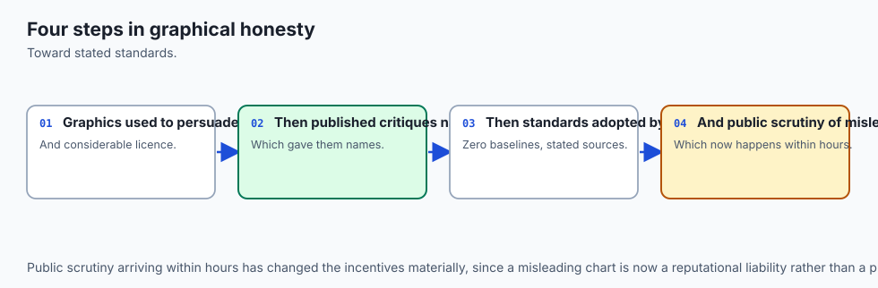
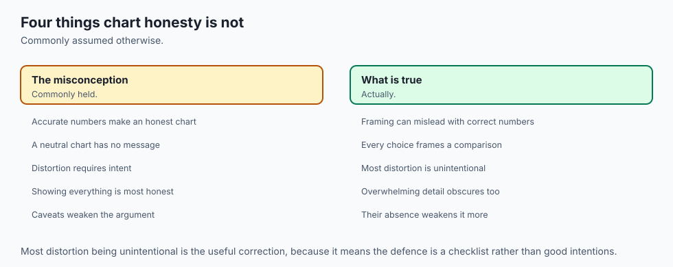
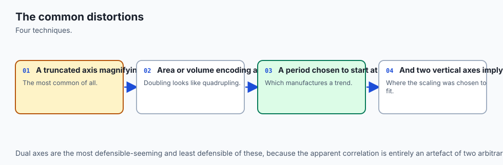
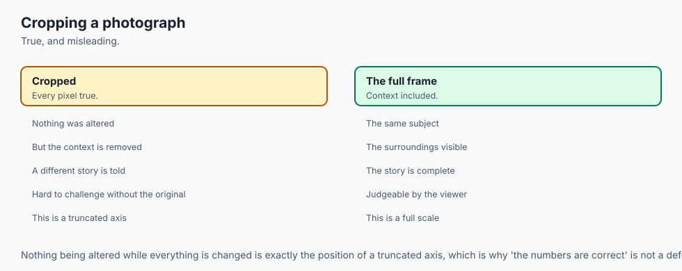
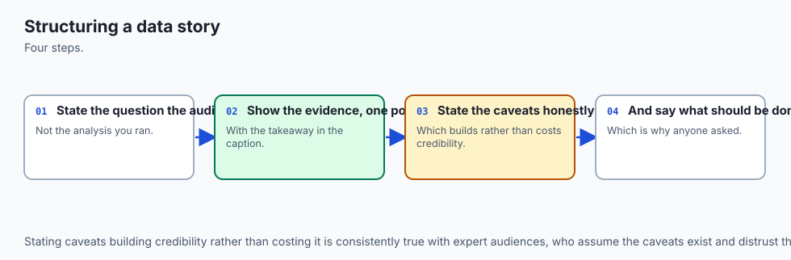
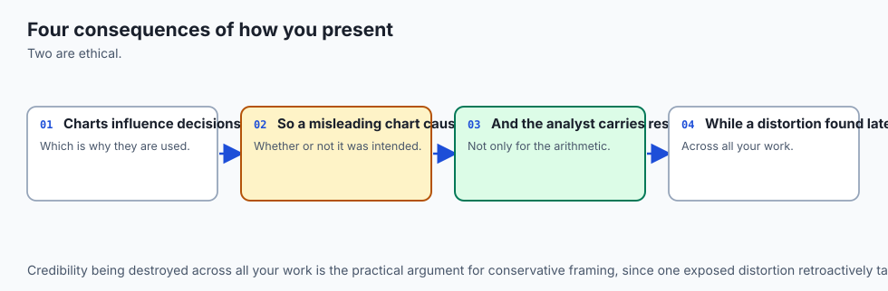
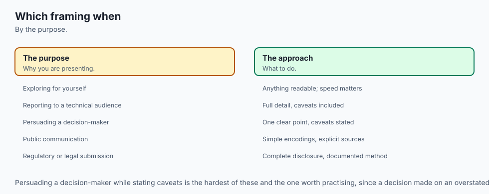

## Why this matters

Here are two numbers: 100 and 102.

Draw them as bars with the y-axis starting at zero, and they look like
what they are — two nearly identical quantities, one a whisker taller
than the other. Now change one line of code so the axis starts at 99
instead. The bars are still drawn from the same two numbers. Nothing was
edited, rounded, filtered, or excluded. But the second bar is now
**exactly three times the height of the first**, and that is not an
impression — it is a measurement, taken off the rendered geometry:

```text
  zero baseline (matplotlib's default for a bar chart)
    drawn height ratio : 1.0200
    data ratio         : 1.0200
    lie factor         : 1.0000

  y axis set to (99, 103) -- one line of code, no data changed
    drawn height ratio : 3.0000
    data ratio         : 1.0200
    lie factor         : 2.9412
```

Every reader of that second chart walks away believing the difference is
around three to one. It is two per cent. And the person most likely to
believe it is the person who made it, because they saw the axis get
tighter and thought *now you can actually see the difference*.

That sentence is the whole day. **Most misleading charts are made by
honest people.** Nothing in this lesson is a trick a villain reaches for.
Every distortion below is a default, a convenience, or a
reasonable-looking choice that happens to change the conclusion — a
tighter axis so the difference is visible, a second y-axis so two
measures fit on one plot, a bubble made bigger because the number is
bigger, a chart rendered in 3D because it looked flat. Each one is
something you will do by accident before you ever do it on purpose.

Which means a gallery of villainy would be useless to you. What you need
is an **instrument**: a way to check your own work, before you publish,
that does not depend on your judgment being unclouded by wanting the
result. By the end of today you will have one, and it is small enough to
paste into any project.

For your AI work specifically, this lands harder than it looks. A model
report is a persuasion document whether or not its author intends that.
An accuracy comparison on a truncated axis makes a 1.5-point improvement
read as a breakthrough. A training curve with loss and accuracy on a dual
axis makes them appear to trade off cleanly when the relationship is an
artifact of two numbers you typed into `set_ylim`. The stakeholder reads
the picture, approves the model, and ships it. And the person who was
misled first, and worst, is you — because you have been looking at that
chart for a week.

## The idea in plain language



A chart is a translation. Numbers go in; lengths, positions, areas and
colours come out. The reader runs the translation backwards in their
head, converting what they see back into what they think the numbers are.

A chart is **honest** when that round trip returns the numbers you
started with. It is **misleading** when it does not — regardless of
whether every value in it is correct, regardless of what you intended,
and regardless of how carefully you labelled it.

That framing has a useful consequence. If honesty is about a round trip,
you can measure it. Take the size of the effect the reader sees. Divide
it by the size of the effect in the data. If the answer is 1, the
translation is faithful. If it is 3, the reader is seeing something three
times as strong as what you have.

That ratio is Edward Tufte's **lie factor**, from *The Visual Display of
Quantitative Information* (1983), and it is the measuring stick for the
whole day:

```text
lie factor = (size of effect shown in the graphic) / (size of effect in the data)
```

Tufte's rule of thumb is that anything outside roughly 0.95 to 1.05 is a
distortion. The number is unitless — a ratio of two ratios — and it turns
"this chart is misleading" from an opinion you can argue with into
arithmetic you cannot.

The unkind but accurate reading of today: you are going to compute this
number for five common chart choices, and four of the five will fail.

## Historical background



The lie factor comes from Edward Tufte's *The Visual Display of
Quantitative Information*, published in 1983 by Graphics Press. Tufte, a
political scientist and statistician then at Yale, wrote and
self-published the book after publishers balked at the production quality
he wanted. It became the reference text for the field, and the lie factor
is its most portable idea precisely because it is arithmetic rather than
taste.

Tufte was not the first to notice the problem. Darrell Huff's *How to Lie
with Statistics* (1954) devoted a chapter — "The Gee-Whiz Graph" — to the
truncated axis, complete with the same demonstration this lesson opens
with: a modest rise redrawn on a cropped axis until it looks like a
crisis. Huff's framing was journalistic and his examples were drawn from
advertising, but the mechanism he described is exactly the one you
measured a moment ago.

The other pillar under today is empirical rather than editorial. In 1984,
William S. Cleveland and Robert McGill published "Graphical Perception:
Theory, Experimentation, and Application to the Development of Graphical
Methods" in the *Journal of the American Statistical Association*
(volume 79, number 387, pages 531-554). Rather than assert which
encodings communicate well, they ran experiments: subjects judged
quantities from graphs, and the errors were measured. The resulting
ordering of elementary perceptual tasks — position along a common scale
being most accurate, then length, then angle and slope, then area, then
volume and colour — is the ranking Day 127 introduced. Their conclusion
was blunt: "radical surgery on these popular graphs is needed."

The two traditions matter together. Tufte gives you a number for how
badly a specific chart distorts. Cleveland and McGill tell you which
encodings degrade before you even reach for a distortion. Today's lab
computes Tufte's number over the failure modes Cleveland and McGill
predicted.

## What it is — and what it is not



**Chart honesty is a property of the rendered picture, not of the
underlying data.** Every number in the truncated bar chart above is
correct. The chart is still misleading. Correctness of the data is
necessary and nowhere near sufficient.

**It is not the same as neutrality, and neutrality is not the goal.**
This is the part that gets muddled most often. An unlabelled, unordered,
uncommented chart is not a neutral presentation of facts — it is an
unhelpful one. It has no claim, so the reader cannot disagree with it; it
has no ordering, so the reader must do the work of finding the pattern;
it has no annotation, so whatever the reader concludes is an accident.
Storytelling is not the opposite of honesty. Refusing to tell a story
just means the reader tells themselves one, and you have no idea which.

**It is not a prohibition on breaking rules.** A clipped outlier, a
logarithmic axis, a non-zero baseline on a share price — all of these are
legitimate, and sometimes necessary. Insisting a stock chart start at
zero would hide everything the reader came for. What separates the
professional from the misleading is not the choice. It is the note in the
caption. **Breaking a rule deliberately and disclosing it is craft.
Breaking it in silence is not.**

**It is not something a linter can fully check.** Today's lab ends with a
review contract that catches a *missing* claim. It cannot judge a *wrong*
one, and no automated check can. A tool that pretended otherwise would be
its own kind of dishonesty.

**It is not about intent.** This bears repeating because it is the point
of the day. The lie factor does not have a term for what you meant.

## Why it was created and what problems it solves

Two problems, and they are different.

The first is **arbitration**. Before the lie factor, an argument about
whether a chart was misleading was an argument about taste, and the
person who cared most usually lost to the person who was most senior.
"That axis is unfair" is a matter of opinion. "That axis gives a lie
factor of 2.94 on a two per cent difference" is not. A number ends the
argument by making it checkable, which is the same service a unit test
performs for a claim about code.

The second, and by far the more useful in practice, is
**self-review**. You cannot see your own chart clearly. You have been
staring at it, you know what it is supposed to show, and your eye fills
in the conclusion you already hold. Every distortion in this lesson
survives your own review precisely because you are the person least
equipped to catch it. A number does not have that problem. A checklist
run mechanically does not have that problem.

This is exactly the logic behind everything else in this course that gets
written down and executed rather than eyeballed: the reproducible
cleaning pipeline of Day 126, the assertions on artists of Day 128. A
chart you have measured is a chart you can defend. A chart you have only
looked at is a chart you hope is fine.

## How it works



Here is the whole day in one picture — the same two numbers, drawn six
ways, each labelled with what it was measured at.

![Diagram: a reference map with an honest two-bar chart at the centre labelled lie factor 1.00, surrounded by five distorted renderings of the same data — a truncated baseline at lie factor 2.94, a dual y-axis whose sign is a free parameter, a radius-encoded bubble pair at lie factor 4.00, a pair of 3D bars whose drawn ratio is up to 110 per cent off, and a cherry-picked window whose trend slope flips from minus 0.73 to plus 0.70 per week — with a closing note that none of the five changed a single number](./assets/distortion-anatomy-architecture.svg)

Take them one at a time.

### Truncated axes, and the nuance that matters

The opening example moved a bar chart's floor and tripled the apparent
difference. So: always start at zero?

No — and getting this rule right is worth more than getting it loud.
Watch what happens when the *same* two numbers, on the *same* truncated
axis, are drawn as a line instead of bars:

```text
Values 100 and 102, y axis (99, 103), two encodings.

  BAR -- encodes value as length from the baseline
    shown length ratio : 3.0000   (true ratio 1.0200)
    lie factor         : 2.9412

  LINE -- encodes change as vertical displacement
    shown change       : 2.0000   (true change 2.0000)
    lie factor         : 1.0000
```

The bar's lie factor is 2.94. The line's is exactly 1.00 — and it stays
exactly 1.00 on every baseline the lab tries, including zero.

The reason is the encoding, and it is worth stating carefully because
almost every version of this advice you will read online skips it.

A **bar encodes value as length from the baseline**. The bar's length
*is* the number. Move the baseline and you have changed what the length
means while leaving it looking like it still means the same thing. The
encoding is broken, full stop; there is no caption that repairs it.

A **line encodes change as vertical displacement**. A reader recovers the
change by measuring how far the line rose and converting through the
labelled axis — which is precisely what the lab does, and which returns
the true change of 2.0 regardless of where the axis floor sits. The
baseline is not part of a line's encoding, so moving it costs nothing.

That gives a rule with two clauses instead of one:

1. **For bars, the baseline is load-bearing. It must be zero.**
2. **For lines encoding change over time, a non-zero baseline is often
   legitimate and sometimes necessary — but the baseline must be visible
   and labelled, and the choice must serve the reader's question rather
   than the author's conclusion.**

That second clause is where honesty actually lives. "Does this axis serve
the reader's question or my conclusion?" is a question only you can
answer, and answering it honestly is the skill.

Here is the same slide, staged, with the drawn ratio growing while the
truth sits still:


### Dual y-axes, and what almost every warning about them gets wrong

Two series, two independently scaled axes, one plot. The standard warning
is that this lets you make any two series look correlated by choosing the
scalings.

Measured, that warning is **false as stated** — and the correction is
worth far more than the warning.

Pearson correlation is invariant under positive affine transforms of each
variable. A linear axis rescaling is exactly such a transform. So the
correlation of the two *drawn* traces always equals the correlation of
the data, no matter what limits you choose. The lab checks this across
500 random pairs of axis limits:

```text
    500 random pairs of axis limits, worst |drawn r - data r| = 3.12e-15
```

Three parts in a quadrillion. That is not "approximately unchanged"; that
is floating-point noise around an algebraic identity.

So what *does* a dual axis do? Two things, and both are worse than the
folk version.

**It makes the sign a free parameter.** Inverting one axis — a single
checkbox in most tools, and `set_ylim(high, low)` in matplotlib — negates
the drawn correlation exactly. A genuinely, strongly correlated pair:

```text
    a genuinely correlated pair, data r = +0.913234
    right axis inverted, drawn r = -0.913234
```

Same data. The chart now shows the opposite relationship, precisely.

**And it makes visual coincidence a free parameter — which is what
readers actually respond to.** Nobody computes a correlation coefficient
by eye. They look at whether the two curves sit on top of each other and
move together. That impression is entirely the author's choice:

```text
  scaling                       drawn-trace gap   drawn-trace r
  parked in separate halves         0.4938        -0.001034
  each filling the frame            0.2261        -0.001034
  each axis widened 20x             0.0147        -0.001034
```

The gap is a root-mean-square vertical distance between the drawn curves,
measured in fractions of the plot height. It moved by a factor of
thirty-four. The correlation did not move at all.

And now the measurement that makes this decisive. Apply the same widening
to a pair with a real correlation of `+0.913`:

```text
    a genuinely correlated pair, data r = +0.913234
    same 20x widening, gap = 0.0046
    uncorrelated pair,  gap = 0.0147
```

Both draw as overlapping curves. One pair is strongly correlated; the
other has a correlation of negative one thousandth. **The picture is the
same either way, which means the picture carries no information about
correlation at all.** A reader who concludes "these move together" from
overlapping curves on a dual axis has learned exactly nothing — and the
author who drew it has usually learned nothing too, while feeling that
they have.

That is the strongest thing you can say against dual axes, and it is
stronger than the thing people usually say.

### Cherry-picked windows

Day 131 established that a time series has a shape. Choosing where to
start looking at it chooses the shape you see. Here is one series, three
windows, three fitted slopes:

```text
  window              from         to           slope per week
  full series         2025-01-06   2025-12-01   -0.0131
  first half only     2025-01-06   2025-06-16   -0.7305
  second half only    2025-06-23   2025-12-01   +0.7045
```

Three sentences, each of them true:

- "Declining at 0.73 a week." True of the first half.
- "Growing at 0.70 a week." True of the second half.
- "Essentially unchanged." True of the whole thing.

The trend's *sign* is chosen by the start date. No number was altered and
no honest person needs to have lied; they just had to pick a window,
which everyone must do.

The defence is not a rule about slopes. It is a rule about the picture:
**show the full series, and mark the window you are talking about inside
it.** A shaded region on a complete series lets the reader see both the
claim and its context in one glance, and costs you one line of code.

### Aggregation and binning as editorial choices

Day 130 established that bin width is a choice. Here is what the choice
costs. The same 400 values, binned by two rules you could cite in a
methods section:

```text
  rule                bins   width   humps drawn   counts
  sturges              10   0.670       1          1   9  31  59  62  82  73  50  24   9
  fd                   14   0.479       2          1   2  10  21  36  53  39  58  66  39  37  22  13   3
```

Sturges' rule draws one hump: *the distribution is unimodal, centred near
zero.* The Freedman-Diaconis rule draws two: *the distribution is
bimodal, with two distinct groups.* Both are standard. Four bins of
difference is the entire distance between two opposite conclusions.

One honest caveat, which the lab discloses in its own source: this
dataset was **deliberately selected** by scanning a grid of separations,
spreads and seeds for a case where the two rules genuinely disagree.
Most parameter settings do not disagree. The claim is that the
disagreement is *possible* with two citable rules — which is enough to
mean you cannot treat "I used a standard rule" as a defence — not that it
is typical. That disclosure is the day's own rule applied to the day's
own data, and leaving it out would have been the exact failure this
lesson is about.

Aggregation carries the same hazard one level up. An average over the
wrong grouping hides a subgroup, and can point the opposite way to every
subgroup it contains. That is Simpson's paradox, which Day 116 derived in
full; the point here is only that **choosing the grouping is choosing the
conclusion**, and a chart that shows only the aggregate has made that
choice on the reader's behalf without telling them.

### Area and 3D

Day 127 named area encoding as a weak channel. Here is the arithmetic
behind why:

```text
  encode by area    drawn area ratio   4.00   lie factor  1.00
  encode by radius  drawn area ratio  16.00   lie factor  4.00
```

Two bubbles for 25 and 100 — a data ratio of 4. Set the *radius* from the
value, which is what "make the circle four times as big" means to most
people, and the drawn area comes out sixteen times larger, because area
goes as the square of the radius.

State this precisely, because the sloppy version is easy to invert: **the
shown area ratio is the square of the data ratio, which makes the lie
factor equal to the data ratio itself.** Sixteen is four squared; the lie
factor is sixteen over four, which is four. And notice what that implies —
the distortion grows with the real difference, so the chart exaggerates
most exactly where the reader is paying most attention.

matplotlib's `scatter` takes `s` as marker area in points squared, so the
correct encoding is the one that looks like it is doing less work.

3D is the same failure with a camera attached. Two bars, heights 1 and 2:

```text
  rendering                          drawn ratio   departure
  flat 2D bars                          2.000          0.0%
  3D, taller bar at the far depth       2.341         17.1%
  3D, taller bar at the near depth      4.204        110.2%
```

The flat chart is exact. Under perspective, the drawn size of a bar
depends on *where it stands*, so moving the taller bar from the far depth
to the near one takes the overstatement from 17% to 110% without touching
a number. The third dimension carries no data — the bars already encoded
everything in their heights — and it breaks the one comparison the chart
exists to support. A 3D pie chart is the same argument with angles
instead of lengths, and worse, because angle was already a weak channel
before you tilted it.

(Those particular figures depend on the camera: matplotlib's perspective
projection at `focal_length=0.2` and the default view angle. A different
camera gives different numbers. What survives any camera is the shape of
the result.)

### The legitimate craft

None of the above should crowd out the actual job, which is to
communicate. Four things, all measurable:

**Ordering.** Sort the bars. When they are in value order, position
encodes rank and the answer to "which is biggest?" is at a known end. The
lab models this as the number of comparisons a reader must make: four for
five alphabetically-ordered bars, zero for the same bars sorted. (That is
an idealised model of reading effort, not a measurement of human readers,
and the lab says so where it uses it. Its claim is the ordering of the
two numbers, not their exact size.)

**Annotation and a caption that states a claim.** Put the conclusion on
the chart, as text, where a reader can find it and argue with it. A chart
that says "south is 39% higher than the next region" can be checked and
contradicted. A chart titled "Regional results" cannot, which feels
neutral and is really just unfinished.

**Emphasis through contrast.** One dark bar against pale ones directs the
eye without hiding anything. It is the cheapest honest technique
available and almost nobody uses it.

**Removing what carries no information.** Gridlines nobody reads,
backgrounds, borders, a legend for a single series, a third dimension.
Every mark that does not carry information competes with the marks that
do.

### Accessibility as an honesty issue

A chart a colour-deficient reader cannot decode is not communicating to
them, however accurate its numbers are. That is the same failure as a
truncated axis, arriving by a different route, and it should be treated
with the same seriousness rather than as a courtesy.

The measurable part is **luminance** — the brightness channel, the one
that survives every form of colour-vision deficiency, every greyscale
printer and every washed-out projector:

```text
  pair                              colours              luminance gap
  highlight vs muted (this chart)   #1d4ed8 / #cbd5e1   0.5505
  seaborn 'colorblind' first two    #0173b2 / #de8f05   0.1970
  classic red vs classic green      #d62728 / #2ca02c   0.0996
```

The classic red/green pair — still the default "good and bad" palette in
a great deal of business reporting — differs by less than a tenth. Those
two colours are separable by hue alone, and hue alone is exactly what
roughly one in twelve men of northern European descent does not fully
have. Seaborn's `colorblind` palette roughly doubles the separation, and
deliberate emphasis reaches five times it.

One honest limit: luminance is *one* component of whether two colours can
be told apart, not the whole of it. A full colour-deficiency simulation
needs a proper colour-appearance model, which the lab does not implement
and does not pretend to. The narrow claim it supports is enough: two
colours with nearly equal luminance are separable by hue alone, and some
of your readers do not have hue.

The general defence is **redundant encoding** — never let colour be the
only channel carrying a distinction. Add a marker shape, a line style, a
direct label. If the chart still works printed in black and white, it
works for everyone.

## An everyday analogy



Think of a chart as a **witness giving testimony**, and the lie factor as
the transcript check.

A witness can say only true things and still leave a jury with a false
impression. "I saw him near the building at nine" is true. It becomes
something else when the twenty minutes he spent walking away are simply
not mentioned, or when it is delivered in answer to a question about the
fire. Nothing said is false. The picture assembled in the listener's head
is wrong anyway.

The distortions map onto this cleanly, and the mapping holds all the way
down:

- The **truncated axis** is the witness who describes only the last
  twenty seconds. Every word accurate; the frame does the work.

- The **dual axis** is two witnesses describing unrelated events in the
  same breath, in a rhythm that makes them sound connected. Neither said
  anything false. The juxtaposition did the arguing.

- The **cherry-picked window** is answering "how has he been lately?"
  with a true account of one bad month.

- The **binning choice** is deciding whether "several times" means "a few
  times" or "repeatedly" — the same events, a summary word chosen, and
  the summary word is the testimony the jury remembers.

- **3D and area encoding** are tone of voice: nothing in the content
  changed, but the delivery amplified it.

And here is where the analogy earns its keep. Courts do not solve this by
banning framing, which is impossible, or by trusting that witnesses mean
well, which is naive. They solve it with **procedure**: an oath that
makes the standard explicit, cross-examination that lets the other side
test the frame, and a record that can be checked afterwards.

Today's three defences are exactly those three. The lie factor is the
oath — a stated standard, applied the same way every time. Stating your
claim in the caption is submitting to cross-examination: you have said
something specific enough to be wrong about. And the review contract is
the record — a check that runs mechanically, on your own work, when your
own judgment is the least reliable instrument in the room.

## Examples in practice



### Building the measurement from scratch

The lab starts by building the lie factor from first principles, because
the arithmetic is trivial and the *measurement* is where all the
difficulty lives:

```python
def lie_factor(shown_ratio, data_ratio):
    if data_ratio == 0:
        raise ZeroDivisionError("data_ratio must be non-zero to form a lie factor")
    return shown_ratio / data_ratio
```

That is the easy half. The hard half is `shown_ratio`, and getting it
honestly is the difference between a real check and a decorative one. It
would be trivial to compute the shown ratio from the input numbers — and
completely useless, because then the measurement can never disagree with
the data and will report 1.0 for every chart ever drawn.

So the shown ratio must come from the **rendered geometry**. This is Day
128's technique applied to a new purpose: read the artists back:

```python
def drawn_bar_heights(ax):
    to_axes = ax.transData + ax.transAxes.inverted()
    heights = []
    for patch in ax.patches:
        bbox = patch.get_bbox().transformed(to_axes)
        top = min(bbox.y1, 1.0)
        bottom = max(bbox.y0, 0.0)
        heights.append(max(top - bottom, 0.0))
    return heights
```

Three things are doing real work here. `ax.transData + ax.transAxes.inverted()`
composes matplotlib's data-to-display and display-to-axes transforms,
giving a mapping straight from data coordinates into axes fractions —
0.0 at the bottom of the plotting box, 1.0 at the top. Each bar's actual
bounding box goes through it. And the clipping to `[0, 1]` is what makes
the whole thing honest: a bar whose top is cut off by the axis limit
contributes only the part a reader can *see*.

That last detail is the difference between measuring the chart and
measuring your intentions about the chart.

### The same technique across every distortion

Once you can read geometry back, every other measurement in the day is a
variation:

| Distortion | What gets read back | The measurement |
| --- | --- | --- |
| Truncated bars | `patch.get_bbox()` through the axes transform | drawn height ratio 3.00 vs data ratio 1.02 |
| Truncated lines | `ax.lines[0].get_xydata()` and `ax.get_ylim()` | recovered change 2.00 vs true change 2.00 |
| Dual axes | both traces in axes fractions | drawn `r` identical to data `r`; gap from 0.49 to 0.01 |
| Radius encoding | `ax.collections[0].get_sizes()` (points squared, an area) | shown area ratio 16.00 for a data ratio of 4 |
| 3D perspective | corners through `ax.get_proj()`, shoelace area | drawn ratio 2.34 or 4.20 for a data ratio of 2 |
| Annotation | `ax.get_title()`, `ax.texts` | the claim is retrievable text or it is not there |

Not one of these compares rendered pixels against a stored reference
image. Every one asserts on a shape, a value or a piece of artist state —
the pattern Day 128 established, and the reason the whole suite is
portable across machines and matplotlib versions.

### The tool you actually keep

Everything above is diagnosis. This is the thing to take with you:

```python
def review_chart(ax, caption):
    text = (caption or "").lower()
    low, _high = ax.get_ylim()
    failures = []

    if not text.strip():
        failures.append("caption is empty: the chart states no claim")
    elif not any(word in text for word in CLAIM_WORDS):
        failures.append("caption states no claim a reader could disagree with")

    if not ax.get_ylabel().strip():
        failures.append("the y axis has no label")

    if low != 0 and f"{low:g}" not in text:
        failures.append(f"the y axis starts at {low:g} and the caption does not say so")

    if low != 0 and not any(word in text for word in DISCLOSURE_WORDS):
        failures.append("a non-zero baseline is used without disclosure")

    return (not failures), failures
```

Four checks. Run over four charts, the verdicts are:

```text
  HONEST -- zero baseline                    PASS
  TRUNCATED -- baseline moved, nothing said  FAIL
      - the y axis starts at 99 and the caption does not say so
      - a non-zero baseline is used without disclosure
  DISCLOSED -- a line on a non-zero baseline, declared    PASS
  BARE -- zero baseline, but no label and no claim        FAIL
      - caption states no claim a reader could disagree with
      - the y axis has no label
```

The third row is the point of the whole day. It uses a non-zero baseline
— the exact thing the second row failed for — and it passes, because it
is a line rather than bars and because the caption says what it did. **The
contract does not forbid breaking the rule. It forbids breaking it in
silence.**

The fourth row is the other half. That chart is perfectly accurate, drawn
on a zero baseline, with no distortion of any kind. It fails anyway,
because a chart with no claim and no label has not communicated anything.
Accuracy is not the same as honesty, and neither one is the same as
usefulness.

## Implications: security, privacy, performance, scalability, and cost



**Security.** The relevant threat here is not an attacker; it is the
chart in a decision pipeline. A dashboard tile with a truncated axis is a
persistent misreading that fires every time someone glances at it, and
alerting thresholds set from a distorted view inherit the distortion.
Where a chart drives an automated action, the honest move is to make the
decision from the number rather than from the picture, and use the
picture only for humans.

**Privacy.** Two failure modes that look like nothing. First, small-group
disclosure: a bar chart broken down finely enough that a group of one is
visible discloses an individual, and no amount of aggregation language in
the caption undoes a bar you can point at. Second, and easier to miss,
axis limits leak. An axis running to a suspiciously precise maximum tells
a reader the largest value in a dataset you did not intend to publish.
Rounding the limit costs nothing.

**Performance.** Honest charts are usually cheaper to render, which is a
pleasant coincidence rather than an argument. The one real cost is the
defence against cherry-picking: showing the full series with a marked
window means drawing the full series, and for a long series that means
downsampling. Day 131's warning applies — downsample by aggregation with
a stated method, not by dropping points, or the defence introduces its
own distortion.

**Scalability.** This is the real cost, and it is organisational. A
review contract that one person runs by hand does not survive contact
with a team. Making it stick means running it in the pipeline that
produces the charts, the same way tests and linters run. `review_chart`
is written to return `(passed, failures)` rather than raise, so it drops
into a build step and reports every problem at once instead of the first.

**Cost.** Nothing in this lesson costs money. matplotlib, seaborn,
pandas and NumPy are free and open source. The expense is a habit: a
minute per chart, and the willingness to redraw one that is more
persuasive than it is entitled to be. The cost of *not* doing it is a
decision made on a picture that overstated its evidence, which is the
kind of cost that never shows up on a line item.

## Alternatives: free, open source, and commercial

Chart honesty is a practice rather than a product, so the honest framing
of this section is: here are the tools that draw charts, and here is how
each one behaves on the specific hazards today identified.

### matplotlib 3.11.1 — ran here

**When to choose it.** Whenever you need full control, reproducibility,
and the ability to test the chart. It is the only option in this list
where the chart is a Python object graph you can assert on.

**How it is called, and what it does about honesty:**

```python
fig, ax = plt.subplots()
ax.bar(["A", "B"], [100, 102])
print(ax.get_ylim())        # (0.0, 107.1) -- zero-based, by default
```

Matplotlib autoscales a bar chart from **zero**. The distortion in this
lesson is something an author has to reach out and add with an explicit
`set_ylim`. That is a genuinely good default, and worth knowing because
not every tool shares it.

Its sharp edges are elsewhere. `ax.twinx()` gives you a dual axis with no
warning of any kind. And Day 128 measured a related one: `set_yscale('log')`
on a series containing a zero raises nothing, warns nothing, and silently
narrows the rendered range so the zero point falls outside the picture.

**Free vs paid:** entirely free, permissively licensed, no paid tier.

### seaborn 0.13.2 — ran here

**When to choose it.** For statistical plots over a DataFrame, and — the
part relevant today — for palettes that were designed rather than picked.

**How it is called:**

```python
import seaborn as sns
sns.color_palette("colorblind")   # ['#0173b2', '#de8f05', ...]
```

Measured above: its first two colours separate by 0.1970 in luminance
against 0.0996 for the classic red/green pair. Using `colorblind` instead
of a default costs one argument.

**Free vs paid:** entirely free, permissively licensed, no paid tier.

### A review checklist — practice, not software

**When to choose it.** Always, and it is not a product. The most
effective honesty tool in this lesson is five questions asked out loud
before publishing:

1. What claim does this chart make? Write it down. If you cannot, the
   chart is not finished.

2. What is the y-axis floor, and does it serve the reader's question or
   my conclusion?

3. What would this look like if I made the opposite argument from the
   same data? If that is easy, say why you chose this framing.

4. What did I leave out — which window, which grouping, which subgroup?
5. Does it survive being printed in black and white?

`review_chart` automates the checkable part of this, and the questions
that cannot be automated are the ones that matter most.

### Commercial BI tools — described from documentation, not run here

**No BI tool was installed or executed anywhere in this lesson or its
lab, and no output from one is reproduced.** What follows comes from
published documentation, and where it contradicts the folklore, the
documentation wins.

**Tableau.** Its "Edit Axes" documentation describes an **Include zero**
check box, and states that when you clear it, "the axis range adjusts to
show only the range of values in the data." So the truncated baseline is
available as a single click — but it is documented as the deviation, not
the default. The widely repeated claim that BI tools truncate axes on
their own is *not* supported for Tableau by its own documentation, and it
would have been easy to repeat here without checking.

**Power BI.** Microsoft's axis documentation confirms the dual-axis
hazard directly and in the tool's favour least: "When you add a line
value to a combo chart, Power BI creates a secondary Y-axis." That is the
distortion arriving **without the author choosing it** — exactly the
mechanism this lesson measured, delivered by a drag and drop. The same
page documents an **Invert range** slider for line, bar, column, area and
combo charts, which is the exact sign flip that turns `+0.913` into
`-0.913`, available as one toggle. It also documents a **Round range**
setting, on by default, which produces cleaner labels like 0, 50, 100;
turning it off makes "axis values align more closely with your actual
data range." And a note worth contrasting with matplotlib: Power BI's
logarithmic scale "require[s] all values to be either positive or
negative," and zero values "aren't supported" — where matplotlib silently
drops them from view instead.

**When to choose them.** When the audience needs to explore
interactively and self-serve, and when the organisation already runs on
them. Their real advantage — that a non-technical colleague can build a
chart in a minute — is also the honesty risk, because that colleague did
not choose a secondary axis; the tool did.

**Free vs paid.** Both are commercial products with free entry tiers
(Tableau Public, Power BI Desktop) and paid tiers for sharing and
governance. **No prices or tier limits are stated here**, because pricing
changes and this lesson does not reproduce anything it did not verify.
Check the vendor's current pricing page.

## Comparison with related concepts

| Concept | What it asks | Where it lives | Relationship to today |
| --- | --- | --- | --- |
| Chart honesty (today) | Does the picture round-trip back to the data? | The rendered figure | The subject |
| Statistical correctness | Are the numbers right? | The analysis | Necessary, nowhere near sufficient — every chart today is numerically correct |
| Perceptual accuracy (Day 127) | Which encodings does the eye decode well? | The choice of chart type | Tells you which encodings degrade before you add a distortion |
| Data cleaning (Days 125-126) | Are the inputs trustworthy? | Upstream of the chart | A clean pipeline feeding a truncated axis still misleads |
| Accessibility | Can every reader decode it? | Colour, contrast, redundancy | A subset of honesty, not a courtesy alongside it |
| Data storytelling | What should the reader take away? | Ordering, annotation, emphasis | Not the opposite of honesty — an unlabelled chart is unhelpful, not neutral |
| Reproducibility (Day 126) | Can someone rebuild this exactly? | The pipeline | The mechanism that makes a chart checkable at all |

The row people get wrong is the second one. "Our numbers are correct" is
offered constantly as a defence against a charge of misleading
visualisation, and it is not a defence, because it answers a question
nobody asked.

## When to use it — and when not to



**Run the full review when the chart will be seen by someone who cannot
easily check it.** A report to stakeholders, a slide in a review, a
dashboard tile that will sit there for a year, anything in a paper or a
post. These are exactly the charts where the reader has no access to the
data and must trust the picture.

**Run at least the caption check on every chart that leaves your
machine.** It takes seconds and catches the most common failure, which is
not distortion at all — it is a chart that makes no claim and therefore
communicates nothing.

**Do not run any of it on exploratory charts.** During analysis you draw
dozens of charts a session, for yourself, and the whole value is
speed. Truncate the axis, use a dual axis, use whatever helps you see the
structure. You have the data open beside you. The rule to hold is
narrower and easier: **no exploratory chart is ever published as-is.**
Redraw it for the reader, then review it. Every distortion in this
lesson has entered a report by being screenshotted out of a notebook.

**Do not use the review contract as a substitute for judgment.** It
catches a missing claim. It cannot judge a wrong one, cannot tell you
that you picked a convenient window, and cannot know whether your
baseline serves the reader. Treat it as a linter: it catches the boring
failures so you have attention left for the interesting ones.

**And do not use "always start at zero" as a rule.** You now know the
distinction: it is load-bearing for bars, and often wrong for lines.
Applying it as a slogan will make you draw a share-price chart on which
nothing is visible, and being wrong in the safe direction is still being
wrong.

## The AI connection

- **A chart makes an argument**, and pretending otherwise is how misleading ones get
  published.
- **Truncated axes and inconsistent scales** are the two most common distortions, and both are
  usually unintentional.
- **The same data supports several honest stories**, which is a reason for care rather than
  cynicism.
- **AI results are communicated through charts**, so their honesty is part of the work rather
  than a presentational afterthought.
- **Showing what contradicts your conclusion** is what makes the conclusion credible.

## Knowledge check

Before the quiz, check yourself on these. If you can answer all five
without scrolling up, the day landed.

1. Two bars for 100 and 102 with the y-axis starting at 99. What is the
   drawn height ratio, and what is the lie factor?

2. The same two numbers, the same axis, drawn as a line. What is the lie
   factor, and why is it different?

3. Can independently scaling two y-axes change the Pearson correlation of
   the two drawn traces? What *can* it change?

4. A bubble's radius is set proportional to its value. For a data ratio
   of 4, what is the shown area ratio, and what is the lie factor?

5. Name the one thing that separates a professional non-zero baseline
   from a misleading one.

## Hands-on exercise

Open the lab — "Charts That Cannot Lie To You" — and work through
`starter/00_brief.md`. You will write fourteen functions across nine
exercises. Everything that *draws* is already written; what you write is
the **measurement**.

Set it up:

```bash
cd labs/sections/math-statistics-and-data/day-132-visual-storytelling-and-chart-honesty
python3 -m venv .venv
.venv/bin/pip install -r requirements/requirements.txt
```

Then work in `starter/honesty.py`, checking yourself as you go:

```bash
cd starter
../.venv/bin/pytest . -q
```

Start with exercise 1 — `lie_factor` and `drawn_bar_heights` — because
every later exercise leans on the habit it builds: measure the chart, not
the inputs. If you can compute an answer without touching the figure, you
have measured the wrong thing.

### Expected output

A fresh checkout reports skips, not failures:

```text
ssssssssssssssssssssss                                                   [100%]
22 skipped in 0.45s
```

Each function you finish turns skips into passes, and a finished lab
reports `22 passed`. The reference suite reports `42 passed`, and the
full harness ends with:

```text
59 checks, 0 failure(s).
```

The headline measurements you will reproduce:

| Measurement | Value |
| --- | --- |
| Lie factor, zero-baseline bar pair | `1.0000` |
| Drawn height ratio, `ylim=(99, 103)` | `3.0000` |
| Lie factor, truncated bar pair | `2.9412` |
| Lie factor, same numbers as a line, any baseline | `1.0000` |
| Data correlation of the dual-axis pair | `-0.001034` |
| Drawn correlation, under every scaling tried | `-0.001034` |
| Drawn correlation of a strong pair, one axis inverted | `-0.913234` |
| Tracking gap: parked apart / widened 20x | `0.4938` / `0.0147` |
| Tracking gap, a genuinely correlated pair, same widening | `0.0046` |
| Trend slope, first half / second half | `-0.7305` / `+0.7045` |
| Humps drawn, Sturges / Freedman-Diaconis | `1` / `2` |
| Drawn area ratio, radius encoding of a 4x difference | `16.00` |
| Drawn ratio of two 3D bars, data ratio 2 | `2.341` far, `4.204` near |
| Luminance gap, red vs green / deliberate emphasis | `0.0996` / `0.5505` |

### Validate your work

```bash
.venv/bin/pytest examples -q     # 42 passed
.venv/bin/pytest starter -q      # 22 skipped, or 22 passed when finished
bash tests/run_tests.sh          # 59 checks, 0 failure(s).
```

Run `pytest examples` and `pytest starter` as **two separate commands**.
Never combine them: both directories ship a module called `honesty`, and
collecting them together is unreliable in both directions.

Section 6 of the harness is worth reading. It proves the suite can go red
rather than merely claiming it: it replaces `review_chart` in memory with
a function that approves every chart and confirms script 09 exits
non-zero, then replaces `lie_factor` with one stuck at 1.0 and confirms
script 01 does too. A green suite proves nothing until you have watched
it fail.

### Troubleshooting

- **`ModuleNotFoundError: No module named 'matplotlib'`** — you ran the
  system Python. Every command is prefixed with `.venv/bin/` for exactly
  this reason.

- **`pytest starter` reports 22 skipped** — correct on an untouched
  checkout. The skip count is your progress bar.

- **A drawn number is close but not equal** — check which one.
  `expected-output/FIELDS.md` splits every captured value into exact
  everywhere, version-specific, and deliberately selected. The tracking
  gaps and the 3D ratios are the version-specific ones; a mismatch in the
  exact group is a real bug in your implementation.

- **`RuntimeWarning: More than 20 figures have been opened`** — something
  is creating figures without closing them. Every helper here wraps
  drawing in `try: ... finally: plt.close(fig)`. Day 128 covers the
  lifecycle.

### Common mistakes

- **Computing the shown ratio from the input numbers.** The single most
  common error, and it silently produces a measurement that can never
  disagree with the data. Read the artists.

- **Forgetting `fig.canvas.draw()` before measuring.** Transforms are not
  finalised until the figure is drawn, and reading them early gives
  plausible nonsense rather than an exception.

- **Not clipping drawn heights to the visible box.** A bar whose top is
  cut off must contribute only what the reader sees, or your measurement
  reports your intentions rather than the chart.

- **Expecting the dual-axis exercise to show a manufactured
  correlation.** It cannot, and proving that is the exercise. If your
  drawn correlation differs from the data correlation by more than
  `1e-12`, your `pearson` or your `drawn_trace` has a bug.

- **Getting exercise 6 backwards.** The shown *area ratio* is the square
  of the data ratio; the *lie factor* is the data ratio itself.

- **Asserting on the 3D numbers as if they were universal.** They depend
  on the camera. Assert the departure exceeds a tolerance, which is the
  claim, rather than pinning a value that has no right to be portable.

## Practice assignment

Take a chart you have already made — from an earlier day in this course,
from work, from anywhere you have the underlying numbers — and put it
through the full review.

1. **Write down its claim in one sentence** before you look at it again.
   If you cannot, that is your first finding.

2. **Compute its lie factor.** If it compares two quantities by length or
   area, measure the drawn ratio off the rendered figure using
   `drawn_bar_heights` or `drawn_area_ratio`, and divide by the data
   ratio.

3. **Run `review_chart` on it** and record every failure it reports.
4. **Answer the two questions the contract cannot.** Did you choose the
   window, the grouping or the bin width — and would the opposite choice
   have supported the opposite conclusion? Try it and find out.

5. **Redraw it.** Fix everything the contract found, sort what should be
   sorted, put the claim in the caption, and check it survives
   greyscale.

6. **Write two or three sentences** on what changed and, more usefully,
   on whether the *conclusion* changed. That last part is the assignment.

The deliverable is the before-and-after pair plus that short note. If
nothing changed, say so — a chart that passes is a real result, and
reporting it honestly is the habit being built.

## Extension challenge

**Build a chart linter and put it in a pipeline.**

The review contract checks one chart at a time, on demand, which means it
gets run when you remember. Make it structural instead.

1. **Extend the contract with a rule the current version cannot express**:
   a bar chart whose y-axis floor is not zero should fail *regardless* of
   what the caption says, because no disclosure repairs a broken
   encoding, while a line chart on the same floor should pass with
   disclosure. You will need to detect the chart type from the Axes, and
   you will discover that is harder than it sounds — `len(ax.patches)`
   tells you about bars but also about other patch artists.

2. **Generalise the lie factor to a whole figure.** The current measure
   takes two values. Compute the drawn ratio of every pair of bars
   against its data ratio and report the worst, so one chart yields one
   number you can threshold on.

3. **Make it a pytest fixture.** Write a fixture that takes a figure and
   fails the test with every contract violation listed, so any project
   that generates charts can assert on them the way it asserts on
   anything else.

4. **Run it over a real directory of charts** — an earlier day's lab, or
   your own work — and report how many pass. Be honest about the number,
   including if it is embarrassing. Especially then.

The genuinely hard part is not the code; it is deciding what should be an
error and what should be a warning. A rule strict enough to be useful will
fail charts you consider fine, and every exception you carve out is a
place a real distortion can enter later. Sit with that trade-off — it is
the same one every linter in every language has had to make.

## The AI thread

Model reports are persuasion documents whether or not their authors
intend that, and the audience for them is usually a person who cannot
check the numbers.

Take the two charts that appear in nearly every model write-up. The first
is a bar chart comparing model accuracy against a baseline: 91.2% against
89.7%. Drawn from zero, it shows what it is — a real but modest
improvement. Drawn with the axis starting at 89, as it will be if anyone
decides the difference is hard to see, the new bar is over four times the
height of the old one. Nobody falsified anything. The lie factor tells
you what happened, and the stakeholder who approves the deployment never
sees it.

The second is the training curve with loss on the left axis and accuracy
on the right. This is so standard that most plotting helpers produce it
by default, and Power BI's own documentation confirms that adding a
second measure to a combo chart *creates the secondary axis for you*. As
you measured today, the apparent relationship between those two curves is
a free parameter: two numbers in `set_ylim` decide whether they appear to
mirror each other cleanly or diverge, and inverting one axis flips the
sign of the drawn relationship exactly. When you present that chart and
say "you can see loss and accuracy tracking nicely," you are describing a
scaling choice, not a property of the run.

There is a specific reason this hits AI work harder than most fields. The
metrics are unfamiliar to the audience, so they cannot sanity-check the
magnitudes — nobody has an intuition for whether a 0.03 drop in
validation loss is large. The differences are genuinely small, so the
pressure to make them visible is constant and feels reasonable. The
comparisons are high-stakes, deciding what ships and what gets funded.
And the charts are produced by whoever is closest to the work and most
invested in it looking good, which is exactly the reviewer least able to
see the distortion.

The habit that follows is small and worth building now, before you have
results you care about. **Put the numbers next to the picture.** State
the effect size in the caption — "91.2% vs 89.7%, a 1.5-point
improvement" — so the reader can check your chart against your own
sentence. Draw comparisons on shared axes rather than dual ones. And when
you break a rule because breaking it genuinely helps, write the note.

The reader you are protecting with that note is not a sceptic trying to
catch you out. It is you, six months on, looking at your own chart and
believing it.
