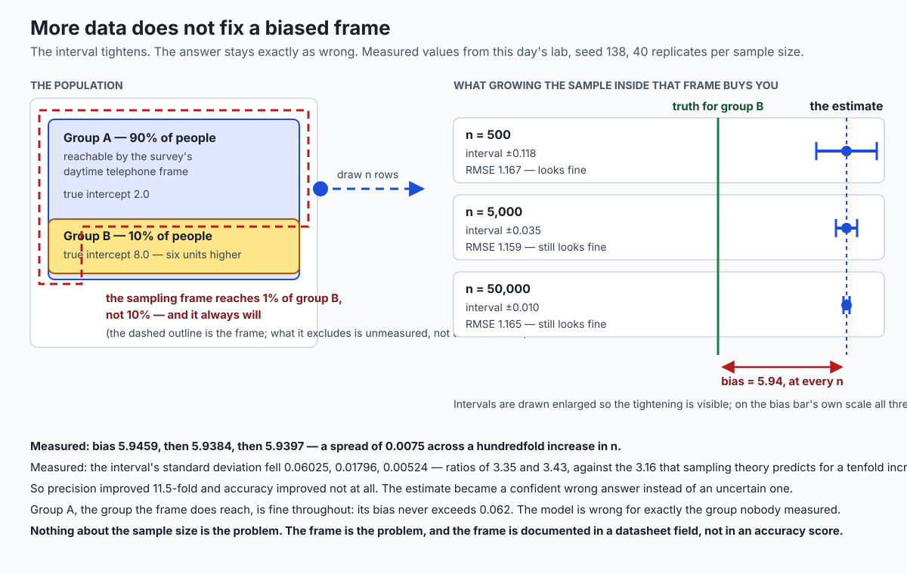

## Why this matters

A regional statistics office runs a labour-force survey by telephone, on weekdays, between nine and five. The population it describes is 90% group A and 10% group B. The frame it actually reaches is 99% group A and 1% group B, because group B's shift patterns put them somewhere else at the times the phone rings.

Nobody lied. Nobody was careless. The survey is well run, the response rate is respectable, the file is clean and tidy and passes every check on Day 134's list. You fit a model on it. The in-sample RMSE is 1.17, against noise the data was generated with a standard deviation of 1.0 — a model that is doing about as well as anything could. Every dashboard is green.

The model's prediction for group B is wrong by **5.94 units**.

Here is the part that should stop you. The obvious response — *get more data* — does not help. Run the survey ten times harder and gather 5,000 rows instead of 500, and the bias for group B is 5.94. Run it a hundred times harder and gather 50,000 rows, and the bias for group B is 5.94. These are measured numbers from this day's lab, forty replicate samples at each size:

| Sample size | Bias for group B | Interval half-width | In-sample RMSE |
| --- | --- | --- | --- |
| 500 | 5.9459 | ±0.118 | 1.1671 |
| 5,000 | 5.9384 | ±0.035 | 1.1593 |
| 50,000 | 5.9397 | ±0.010 | 1.1649 |

Across a hundredfold increase in sample size, the bias moved by 0.0075 — less than a seventh of one percent of itself. Meanwhile the standard deviation of the estimate fell from 0.06025 to 0.00524, ratios of 3.35 and 3.43 per tenfold step, against the 3.16 that sampling theory predicts. **Precision improved 11.5-fold. Accuracy improved not at all.** What you bought with all that extra data was a *confident* wrong answer instead of an uncertain one.

That is Day 117's distinction between sampling error and sampling bias, and it is worth restating in the harshest available form: **sampling error shrinks as `1/sqrt(n)`; sampling bias does not shrink at all.** No amount of data fixes a frame. The frame is a decision somebody made about who to call, and it is still in the file.

This is why today is not a lesson about principles. Principles are easy to nod at and impossible to check. Every claim in this lesson is either something you can compute — a divergence, a ratio, a count of unique rows, three fairness metrics that provably cannot all be zero — or something you can write down and audit. Where a question genuinely is a value judgement rather than a calculation, and one of them is, this lesson will say so explicitly rather than pretend arithmetic settles it.

The through-line is one sentence: **data is not found, it is made — by someone, for a purpose, under constraints — and every one of those decisions is still in the file.** Your job is to find the decisions, measure the ones that are measurable, and document the rest where the next person will trip over them.

## The idea in plain language

There is a comfortable mental model of a dataset: it sits out there in the world, someone goes and gets it, and now you have it. Everything today argues against that model.

A dataset is a **record of decisions**. Someone decided what counted as an observation. Someone decided who to ask and when. Someone decided which field to record and what to record in it when the true answer did not fit. Someone decided which rows to drop. Every one of those decisions is baked into the numbers, and almost none of them are visible in the numbers.

Five of those decisions go wrong in recognisable ways, and it is worth being able to name which one you are looking at, because the fix for each is different.

**Selection and coverage bias** enters at collection. The sampling frame — the list of things you could possibly have sampled — is a *claim about who is in the world*. When it is wrong, everything downstream is wrong in a way that more sampling cannot repair. This is the failure the lesson opened with, and it is measurable whenever you have a reference distribution to compare against.

**Measurement bias** enters at recording. The proxy is not the thing. Arrests are not crimes. Clicks are not interest. A billed diagnosis code is not a disease. Prior spending on care is not need for care. Every one of those proxies is *correlated* with what you actually want, often strongly, and every one of them differs from it systematically in a way that varies by group.

**Historical bias** is already there before anyone collects anything. The data can be a perfectly accurate record of an unjust process. A model that fits it beautifully reproduces the injustice faithfully, and the accuracy score will be excellent, because reproducing the past accurately is exactly what a high accuracy score means. This is the one where measurement genuinely runs out, and this lesson will not pretend otherwise.

**Aggregation bias** enters at modelling. One model for a heterogeneous population can be wrong for every subgroup in it while looking right overall. That is Day 116's Simpson's paradox with a decision attached to it.

**Disclosure risk** is not a bias at all, but it enters the same pipeline at the same points, and it is the one people are most confident about while being most wrong. "Anonymised" is not a property of a file. It is a claim about a threat model, and a small number of ordinary facts about a person is frequently enough to single them out of a table carrying no names.


Sitting underneath all five is **provenance**: who collected this, when, why, under what definitions, with what inclusion criteria, and what changed between versions. A dataset without provenance is not a dataset. It is a rumour with columns. You cannot cite it, cannot re-fetch it, cannot tell whether last month's copy and this month's copy describe the same population, and cannot answer the single most useful question a reviewer will ask you: *who is missing from this, and how would you know?*

And here is the shape of the failure the opening table describes, drawn out:



## Historical background

The documentation practices this day is built around are recent; the disclosure and fairness results underneath them are older.

**Simpson's paradox** is the oldest thread. The reversal was described by **Udny Yule** in **1903** and analysed by **Edward H. Simpson** in a **1951** paper in the *Journal of the Royal Statistical Society*; the paradox carries Simpson's name, which is why some statisticians insist on calling it the Yule–Simpson effect. Day 116 covered it as a fact about tables. Today it is a fact about models.

**k-anonymity** was introduced by **Latanya Sweeney** in **2002**, formalising a decade of work on re-identification from public records. Its definition is deliberately simple: a released table is k-anonymous if every combination of quasi-identifiers that appears at all appears at least k times. Its limits were identified almost immediately, and the mid-2000s produced **l-diversity** as a direct response to the homogeneity problem this lesson demonstrates in exercise 7 — a class can satisfy k-anonymity and still disclose a sensitive attribute if every member of it shares the same value.

**Differential privacy** arrived from a different direction in **2006**, in work by **Cynthia Dwork, Frank McSherry, Kobbi Nissim and Adam Smith**. Where k-anonymity is a property of a released table, differential privacy is a property of an *algorithm*: the guarantee is that the output is almost as likely whether or not any one individual's record is present. That is a strictly stronger and structurally different kind of promise, and it is why the two are not interchangeable.

The **fairness impossibility results** are from the mid-2010s, when risk-scoring systems in criminal justice and lending came under sustained statistical scrutiny. **Jon Kleinberg, Sendhil Mullainathan and Manish Raghavan** in **2016** and **Alexandra Chouldechova** in **2017** independently established, in different formulations, that when base rates differ between groups, calibration and equal error rates cannot both hold except in degenerate cases. This is not a conjecture and not an empirical observation. It is arithmetic, and this day's lab reproduces it numerically on a twenty-row table you can check by hand.

**Datasheets for Datasets** — the practice this day's deliverable is modelled on — was proposed by **Timnit Gebru, Jamie Morgenstern, Briana Vecchione, Jennifer Wortman Vaughan, Hanna Wallach, Hal Daumé III and Kate Crawford**, first posted to arXiv on **23 March 2018** and revised through **December 2021**. The analogy in the paper is exact and worth keeping: in the electronics industry every component ships with a datasheet describing its operating characteristics, test results and recommended uses, and the authors propose that every dataset ship with a document describing its motivation, composition, collection process and recommended uses. **Model cards**, a parallel practice for documenting trained models rather than datasets, followed in **2019**.

The legal vocabulary runs alongside. The **Belmont Report** (**1979**, United States) set out respect for persons, beneficence and justice as the principles governing research on human subjects, and its influence on institutional review is why "we collected it for one study and reused it for another" is a sentence that makes ethics boards uncomfortable. The **GDPR** was adopted in **2016** and became applicable on **25 May 2018**, and its **purpose limitation** principle — data collected for specified, explicit and legitimate purposes may not be further processed in a manner incompatible with those purposes — is the same idea with an enforcement mechanism attached.

What is striking about this list is how much of it predates the current wave of machine learning and how little of it was routine practice when that wave arrived. The documentation gap the Datasheets paper opens by naming — that the field had no standardised process for documenting datasets — was accurate in 2018 and is only partly closed now.

## What it is — and what it is not

**Data ethics**, as this lesson uses the term, is the practice of finding the decisions embedded in a dataset, measuring their consequences where they are measurable, and documenting them where they are not.

It **is** three concrete things:

1. A set of **measurements** — coverage divergence, representation ratios, bias-versus-n ladders, per-subgroup error comparisons, fairness metric triples, uniqueness counts, k-anonymity levels — that turn vague unease into numbers you can put in a report and someone else can reproduce.
2. A set of **documentation artifacts** — a datasheet, a data dictionary, a provenance chain with versions and a changelog — that record the decisions no measurement can recover.
3. A discipline of **declaring the value judgements you made**, so that the next person can disagree with them explicitly instead of inheriting them silently.

It is **not** a checklist you can complete. Failing a check does not disqualify a dataset; it means the dataset needs a stated caveat rather than a silent assumption. Passing every check does not certify a dataset as fair, because historical bias passes every check by construction.

It is **not** a synonym for compliance. A licence that permits a use is a floor, not a ceiling. "Permitted" and "appropriate" are different words. A dataset released under CC0 can be used for anything the licence allows and still be entirely wrong to use for a particular purpose, because the licence says nothing about who is in it, who consented to what, or what the data was collected to measure.

It is **not** a technical property of a model. There is no accuracy number, no F1 score, no AUC that encodes any of this. A model that scores 0.97 on a test set drawn from the same biased frame as its training set scores 0.97 precisely *because* the test set inherits the same frame. The score is measuring agreement with the frame, not agreement with the world.

And it is **not** something a library decides for you. Fairlearn and AIF360 both compute fairness criteria accurately and well. Neither of them can choose which criterion your system should satisfy, because that choice depends on what the system is for and who bears the cost of a wrong decision, and it is a question about values rather than about statistics.

## Why it was created and what problems it solves

Every practice in this lesson exists because a specific failure mode kept recurring, and each one is worth naming with its failure attached.

**The datasheet exists because institutional memory is a myth.** The person who chose the inclusion criteria leaves. The reason a region was excluded was obvious in the meeting and appears nowhere in the file. Two years later somebody joins two versions of the dataset on a shared key and produces a chart with a step change in it, and nobody left in the building knows whether that step is a real change in the world or a change in what was being counted. The datasheet is the artifact that answers that, and it costs almost nothing to write *at the time* and is essentially impossible to reconstruct later.

**The coverage check exists because "national" is a word, not a measurement.** A dataset titled *national labour statistics* that is missing one region entirely looks identical, in every visible way, to a dataset in which that region legitimately has zero of whatever is being counted. The only thing that distinguishes them is a comparison against an external reference, by name, region by region.

**The proxy discipline exists because optimising a proxy is the default behaviour of every system anyone builds.** The moment a number becomes a target, whatever is easiest to record about it becomes the thing being maximised. If the recorded number under-represents a group's true state, the system will systematically under-serve that group — and the aggregate will barely move, which is exactly why nobody notices. In this day's lab, ranking by a proxy that records one group's need at 85% of its true level cut that group's share of a selection from 25% to 4%, while the *total* need served fell by only 1.7%.

**The fairness metric triple exists because "is the model fair?" is not one question.** It is at least three, and they conflict. Before the impossibility results were widely understood, two well-meaning teams could each declare a system fair, on defensible grounds, and be talking past each other completely. Computing all three metrics and reporting all three is what converts that argument into a decision.

**The uniqueness count exists because "we removed the names" is not anonymisation.** It is a step in the direction of anonymisation whose effect is measurable and is usually much smaller than people expect. In this day's lab, a table with no name, no address and no identifier still has 2,723 of its 5,000 rows uniquely determined by birth year, postcode and sex.

**Version drift detection exists because the summary statistics you would naturally compare can be bit-for-bit identical while the population changed.** Exercise 9 constructs exactly that: two releases whose count, mean, standard deviation, minimum, median and maximum are all *identical*, while a quarter of the sample changed group. The only place the change exists is in the changelog.

## How it works

This section builds each measurement from first principles, with the numbers from a real run. Every value below came out of this day's lab on 2026-08-20, seeded so you can reproduce it exactly.

### Bias versus variance, as a ladder

Construct a world. Group A is 90% of the population with a true relationship `y = 2.0 + 1.0x`; group B is 10% with `y = 8.0 + 1.0x`. Same slope, same noise, six units of intercept apart. The sampling frame reaches group B with probability 0.01 rather than 0.10.

Fit one pooled least-squares line, ignoring the group column. Because both groups share a slope, the fitted slope is right and the fitted intercept lands at approximately `2.0 + 6.0 × p_B`, where `p_B` is group B's share **of the sample**, not of the population. With `p_B = 0.01`, that is `2.06`. So the predicted value for a group B member is off by `2.06 - 8.0 = -5.94`, at every x.

That number is not an artifact of the sample size, because `p_B` is a property of the frame. It is the same at n = 500 and at n = 50,000. Run it forty times at each size and you get the measured table from the opening: bias 5.9459, 5.9384, 5.9397; standard deviation 0.06025, 0.01796, 0.00524.

Both parts are worth taking seriously. The standard deviation falling by 3.35× and 3.43× per tenfold step is sampling theory behaving exactly as advertised — the prediction is `sqrt(10) = 3.162`, and the small excess is the finite-replicate noise of estimating a standard deviation from forty draws. The bias staying at 5.94 is the thing no amount of that behaving-as-advertised can touch.

And group A is *fine*. Its bias never exceeds 0.062. The pooled model is wrong for exactly the group nobody measured, and right for the group who filled the training set. That asymmetry is the whole story of the day in one line.

### Coverage mismatch, computed

Given a reference distribution — a census, a published statistical abstract, anything external that states what the population looks like — the mismatch stops being a worry and becomes a subtraction.

Two numbers, and the order matters. The **total variation distance** between the sample's share vector and the reference's is half the sum of absolute differences. For this day's survey fixture it is `0.089583`. That is real, and it is small enough to be reassuring, which is precisely why it is the wrong number to lead with.

The number that names the problem is the **representation ratio** per group: sample share divided by reference share. The four regions come out at 1.094, 1.101, 1.111 and — for the west — **0.104167**. The west appears at roughly a tenth of the rate the population says it should. That is one number, attached to one name, and it is the sentence you put in the report.

```python
sample_shares = {g: count / total for g, count in sample_counts.items()}
ratios = {g: sample_shares[g] / reference_shares[g] for g in reference_shares}
tvd = 0.5 * sum(abs(sample_shares[g] - reference_shares[g]) for g in reference_shares)
flagged = [g for g, r in ratios.items() if r < 0.5 or r > 2.0]
```

Four lines. There is no library needed and no excuse for not running it.

### The proxy gap, measured

Take a population where both groups are drawn from the **same** true-need distribution, so any fair procedure would select them in proportion to their size. Record need through a proxy that captures group A's need faithfully and group B's at 85% of its true level, plus noise.

The proxy correlates with the target at **0.9253**. It passes the check most people run.

Now spend a fixed budget: select the top 500 of 4,000 by proxy, and separately the top 500 by true need. Ranking by the target selects group B at **0.2500** — its exact population share. Ranking by the proxy selects group B at **0.0400**. Group B's true need served falls to **0.1785** of what a target-ranked selection would have delivered.

And the total need served falls only to **0.9831** of the target-ranked total. Under a 2% aggregate degradation, one group lost 82% of what it should have received. That gap between the aggregate view and the group view is the entire mechanism by which measurement bias survives review.

The procedural fix is not statistical. It is: **name the proxy and name the thing it stands in for, in writing, before you optimise it.** Arrests, offences. Clicks, interest. Billed codes, disease. Prior spend, need. Once the pair is written down, the question "does this proxy differ systematically by group?" becomes askable, and it is frequently answerable from data you already have.

### Aggregation bias, with stakes

Two subgroups. Group A lives at low x with a low intercept; group B at high x with a much higher one. **Both trend downward** — true slopes measured at -0.9870 and -0.9991.

Fit one pooled line and the slope comes out at **+1.9785**. Not merely imprecise: the wrong *sign*, for every subgroup in the data. The pooled model's RMSE is 5.0275 for group A and 5.0545 for group B, against per-subgroup fits of 1.0192 and 1.0040. It is worse for **every** subgroup, not worse on average — a distinction that matters, because "worse on average" invites the reply "but it's better for most people", and here there is no *most people* for whom it is better.

### The fairness tension, demonstrated

This is the section where the arithmetic stops being able to tell you what to do, and it is important to see exactly where that happens.

Build a population by hand so nothing is estimated. Two groups of 1,000. Each person carries a risk score in `0.1, 0.3, 0.5, 0.7, 0.9`, and in every score bin exactly that fraction is positive. Group A's mass sits high, group B's sits low:

| Score | Group A count | Group A positives | Group B count | Group B positives |
| --- | --- | --- | --- | --- |
| 0.1 | 50 | 5 | 350 | 35 |
| 0.3 | 100 | 30 | 300 | 90 |
| 0.5 | 200 | 100 | 200 | 100 |
| 0.7 | 300 | 210 | 100 | 70 |
| 0.9 | 350 | 315 | 50 | 45 |
| **Total** | **1,000** | **660** | **1,000** | **340** |

Every positives figure is a whole number, so nothing here is rounded. The score is **perfectly calibrated for both groups** — the maximum deviation between the score and the observed positive rate is exactly zero. Base rates are **0.66** and **0.34**. That single difference is the engine of everything that follows.

Three decision policies, three criteria. *Demographic parity* asks that both groups be selected at the same rate. *Equal opportunity* asks that both groups' genuinely-positive members be selected at the same rate — equal true-positive rates. *Predictive parity*, which is calibration applied to the decision rather than the score, asks that the selected people in both groups be positive at the same rate — equal precision.

| Policy | Selection rate A / B | True-positive rate A / B | Precision A / B |
| --- | --- | --- | --- |
| One threshold at 0.5 | 0.8500 / 0.3500 | 0.9470 / 0.6324 | 0.7353 / 0.6143 |
| Equalise selection rate | **0.6000 / 0.6000** | 0.7424 / 0.8529 | 0.8167 / 0.4833 |
| Equalise true-positive rate | 0.6560 / 0.5400 | **0.8000 / 0.8000** | 0.8049 / 0.5037 |

Read down the bolded cells. Each policy closes its own gap **exactly** — to zero, not approximately — and opens at least one other. The single threshold preserves the calibrated score untouched and produces a 0.50 parity gap and a 0.31 opportunity gap. Enforcing parity drives the selection-rate gap to 0.0000 and pushes the precision gap out to 0.3333. Enforcing equal opportunity drives the opportunity gap to 0.0000 and pushes the parity gap to 0.1160 and the precision gap to 0.3012.

No policy closes all three. That is not a failure of these three policies. It is the impossibility result, reproduced on twenty numbers you can add up yourself, and it holds whenever base rates differ.

**Now the part that must be said plainly.** Which criterion your system should satisfy is a **value judgement**, not a technical detail. It depends on what the system does, what a false positive costs the person it lands on, what a false negative costs them, whether the base-rate difference is itself the product of the historical bias you are trying not to reproduce, and who has standing to object. Reasonable, well-informed people disagree about it in good faith, and the disagreement is genuine rather than a symptom of somebody not having read the maths.

What is **not** a matter of opinion is that you must choose, that the choice must be written down, and that a library default is not a choice. The most common failure here is not picking the wrong criterion. It is picking one by accident, by using whatever a function returned first, and never telling anyone.

### Uniqueness, k-anonymity, and where the technique stops

Build a synthetic register of 5,000 rows: birth year, postcode, sex, and a diagnosis. No name. No address. No identifier of any kind.

Count the rows that are the *only* row with their combination of the first three fields. The answer is **2,723** — 54.46% of the table. Over half of these people can be singled out by anyone who knows three ordinary facts about them.

Coarsen **one** field: exact birth year becomes a ten-year band. Count again: **13**. A reduction factor of 209.5, from one edit.

```python
keys = ["birth_year", "postcode", "sex"]
sizes = frame.groupby(keys, observed=True)[keys[0]].transform("size")
uniques = int((sizes == 1).sum())
```

k-anonymity is the same `groupby` read differently: the table's k is the size of its smallest equivalence class. After generalisation this register's k is still **1** — generalisation alone does not get you there. Suppressing every class smaller than 5 does, at a cost of **794 rows**, roughly one in six people, and every one of them somebody in an unusual combination. Say that cost out loud when you report the k, because the rows suppression removes are frequently the people the analysis was supposed to be about.

And then the limit, which matters more than the technique. Here is a table that is 4-anonymous by construction:

| Birth decade | Postcode | Sex | Diagnosis |
| --- | --- | --- | --- |
| 1970 | 1001 | F | diabetes |
| 1970 | 1001 | F | diabetes |
| 1970 | 1001 | F | diabetes |
| 1970 | 1001 | F | diabetes |

Every equivalence class has four members, so k = 4 and the check passes. And it discloses completely: knowing that someone is a 1970s-born woman in postcode 1001 who appears in this table reveals her diagnosis exactly. **No re-identification was required.** Membership in the class was enough, because the class is homogeneous in the sensitive attribute. That is the observation l-diversity was invented to address, and l-diversity has its own next limit in turn.

The lesson is not that k-anonymity is useless. It is that **a check trusted past its stated guarantee is worse than no check**, because it buys confidence it did not earn.

### The datasheet, as an executable contract

The deliverable of the day is a document, and the way to keep a document honest is to make a test fail when it is incomplete.

Eleven fields, chosen because each answers a question that cannot be recovered from the data once it is lost: `collector`, `collection_period`, `purpose`, `population_definition`, `sampling_frame`, `inclusion_criteria`, `exclusion_criteria`, `known_gaps`, `licence`, `version`, `changelog`.

The check must report the missing fields **by name**. "Documentation incomplete" is not actionable; "no `exclusion_criteria` recorded" is. And a field that is present but blank — an empty string, an explicit null, an empty list — counts as unanswered, because it tells a reader nothing. Against this day's deliberately under-documented fixture the check names eight missing fields out of eleven; against the complete one it passes.

### Version drift, and the thing summaries cannot show

Two releases of one dataset. The measured column is byte-for-byte identical between them, so **every** summary statistic matches exactly: count 2000, mean 49.9967280173, standard deviation 9.6894130750, and the same minimum, median and maximum. A reader diffing `describe()` output between the two releases sees nothing whatsoever.

What changed is who is in the file. Group B went from half the sample to a quarter — a composition shift of **0.2500**. The only artifact in which that change exists is the provenance record: the `sampling_frame` field differs, and the changelog gained one line saying *sampling frame re-scoped: group B quota reduced from 50% to 25%*.

That is the strongest available argument for the documentation habit. It is not paperwork attached to the analysis. On this comparison, it is the *only place the change exists at all*.

## An everyday analogy

Think of a dataset as a **photograph**, and carry the comparison the whole way, because every part of it maps onto something specific.

**The frame is the sampling frame.** A photograph shows what was inside the rectangle when the shutter opened. Everything outside it is not in the picture, and — this is the part that matters — *the picture contains no evidence that anything was outside it*. A crowd photographed from the front looks like a crowd, whether there were fifty people or five thousand behind the camera. A survey that called only during working hours looks like a survey, and the people who were at work are not in it, and the file does not say so. You cannot see absence.

**The exposure is the proxy.** A camera does not record light; it records how much a sensor responded to light, which depends on the sensor. Photograph two people of different skin tones under one exposure setting calibrated for one of them and both faces are present, both are "measured", and one is measured much less accurately. Nobody chose that. It is a property of the instrument that nobody wrote down. Arrests as a proxy for offences works exactly this way: the instrument responds more in some places than others, and the file records the response, not the thing.

**The subject is the historical process.** If you photograph an unjust scene, you get an accurate photograph of an unjust scene. There is no camera setting that fixes it, and improving the camera makes the record *more* faithful, not less. A model trained on it does the same. This is where the analogy stops being reassuring, and it should.

**The crop is aggregation.** Crop two very different halves of an image into one thumbnail and the thumbnail can look like neither. Average two subgroups with opposite trends into one slope and the slope points the wrong way for both.

**The caption is provenance.** A photograph with no caption is not evidence of anything, however sharp it is. Who took it, when, where, and what were they trying to show? The same photograph captioned two different ways supports two different claims, and the caption is exactly the part that gets lost when a picture is reposted. Which is what a dataset without a datasheet is: a very sharp photograph with the caption torn off.

And to finish the mapping: **more megapixels do not widen the frame.** That is the opening result. You can shoot at ten times the resolution and everything outside the rectangle stays outside it, in more and more detail. Resolution is variance. The rectangle is bias.

## Examples in practice

**A survey that is right about the country and wrong about a region.** The national estimate from the opening example is fine, because the region that is missing is 10% of the population and the aggregate is dominated by the 90% that is present. Every national figure the survey publishes is defensible. Every regional figure for the west is wrong by an amount nobody computed, and the only thing that would have caught it is the four-line coverage check against a published reference. The fix, once found, is not "collect more"; it is either reweighting — which trades bias for variance, and is not free — or a stated caveat naming the west explicitly, or a second collection mode. All three are decisions. All three belong in the datasheet.

**A resource allocation system optimising the wrong number.** A programme has budget to enrol 500 people out of 4,000 and wants to reach those with the greatest need. Need is not observed; prior engagement with the service is, and it correlates at 0.93. The programme ranks by engagement. Twelve months later the aggregate outcome is 98% of what a perfect ranking would have achieved — a genuinely good result by the metric anyone would put on the slide — and one group has received 18% of what it should have. Nobody in that process did anything wrong by their own lights. The proxy was reasonable, the correlation was checked, the outcome was measured. What was never done was **disaggregating the outcome by group**, which is one `groupby` and would have shown it immediately.

**A "de-identified" release that identifies people.** A hospital releases a research extract with names and record numbers stripped: age, postcode, sex, and diagnosis. The release passes the internal check, which was "no direct identifiers present". Nobody counted uniqueness. In a table of this shape, over half the rows are singletons on the three remaining fields, and anyone who knows one of those three facts about a person — a neighbour, a colleague, an employer — can find their row and read the fourth. The generalisation that fixes most of it costs one line of code and one column of precision.

**Two versions of a source, joined across the seam.** A dataset is refreshed annually. This year's release quietly changed its inclusion criterion. Every summary statistic looks stable, so the refresh passes review. Someone joins the series across the seam and produces a chart with a step change that gets described in a meeting as a shift in the underlying population. It is not. It is a shift in who was counted, and a two-line changelog entry would have made it visible in five seconds. This is the same failure Day 134 opened with, viewed from the other side: there the two definitions came from two sources, here they came from two versions of one.

## Implications: security, privacy, performance, scalability, and cost

**Privacy** is where this day's technical content bites hardest, and the crucial reframing is this: *anonymity is a claim about an adversary, not a property of a file.* Before you release anything, write down what you assume an adversary knows. Then measure: how many rows are unique on that assumed knowledge? What k do you achieve, and what did the suppression cost? Which classes are homogeneous in the sensitive attribute? Those three numbers take minutes to compute and are the difference between a release you can defend and one you merely hope about.

Treat the outputs as sensitive in their own right. "These 2,723 rows are singletons" is a map of who is easiest to identify, and it should not travel further than the release decision it informs.

**Security** here is mostly about provenance as integrity. Day 134's checksum discipline is the mechanism: a provenance record carrying URL, retrieval timestamp and SHA-256 lets you prove that the file you analysed is the file the source served. Without it, "downloaded from X" is a claim rather than a proof, and a silently modified upstream file is indistinguishable from a real change in the world.

**Performance** is not a concern for any of these measurements, which is worth stating because "we didn't have time" is the most common reason they are skipped. Every measurement in this lesson is a `groupby`, a division, or a least-squares fit. The entire nine-exercise harness — including forty replicate fits at n = 50,000 — runs in a couple of seconds. The reason these checks do not get run is not cost.

**Scalability** does bite in one specific place: **intersectional** analysis. Checking coverage across one attribute with four levels is four numbers. Across three attributes it is the product of their cardinalities, and the cells get small fast — which is both a statistical problem, because small cells give noisy estimates, and a privacy problem, because small cells are exactly the ones k-anonymity suppresses. There is a genuine tension there: the groups most likely to be harmed are often the smallest, and the smallest groups are the ones both statistics and privacy protection push you to stop looking at. There is no clean resolution. Name it, and report the cell sizes alongside the estimates so a reader can judge.

**Cost** is asymmetric, and the asymmetry is the argument. Writing a datasheet at collection time costs perhaps an hour of the person who already knows the answers. Reconstructing one two years later costs weeks and usually fails, because the person left. Running the coverage check costs four lines. Discovering a coverage gap after a report is published costs the report. Computing uniqueness costs one `groupby`. Discovering it after a release costs something you cannot buy back.

**And the AI thread.** A model inherits its training data's frame, its proxies and its history, and **none of that is visible in an accuracy number**. This matters more, not less, as models get larger. A large model trained on a corpus assembled by whatever was cheapest to scrape has a sampling frame — an enormous, undocumented, unmeasured one — and every result in this lesson applies to it unchanged. Scaling the corpus is the same move as increasing n: it drives variance down and leaves the frame exactly where it was. You have now seen that arithmetic run, at three sample sizes, on a case simple enough to check by hand: the interval tightened 11.5-fold and the error for the under-represented group did not move. That is why the honest starting point for evaluating a model is not its score but its dataset's documentation — and why "we don't know what's in the training data" is not a minor gap in a model card. It is the answer to the only question that would have told you where the model is wrong.

## Alternatives: free, open source, and commercial

Four options cover this area. Two of them I ran; two I did not, and I will say which is which every time.

### pandas and NumPy — the measurements themselves

**When to choose it:** always, and first. Every measurement in this lesson is a `groupby`, a `value_counts`, a division or a least-squares fit. Doing it yourself means you can see that the fairness incompatibility is arithmetic rather than a library's opinion, and it means the check runs in your existing pipeline with no new dependency.

**How it is called:** the whole coverage check is four lines, shown earlier. The uniqueness count is one `transform("size")`. The k level is one `min()` on a group size. The three fairness metrics are counts of selected rows and selected positives per group.

```python
selected = frame[frame["score"] >= threshold]
by_group = frame.groupby("group", observed=True)
rates = selected.groupby("group", observed=True).size() / by_group.size()
tpr = (selected.groupby("group", observed=True)["label"].sum()
       / by_group["label"].sum())
precision = (selected.groupby("group", observed=True)["label"].sum()
             / selected.groupby("group", observed=True).size())
```

**Free vs paid:** both are free and open source under BSD-3-Clause. There is no paid tier and nothing to buy.

**Did I run it?** Yes. NumPy 2.5.2 and pandas 3.0.5, on Python 3.14.0. Every number quoted in this lesson came out of that run, and the captured output is in the lab's `expected-output/` directory.

### Datasheets and model cards — documentation practices, not software

**When to choose it:** for every dataset you publish, every dataset you accept from elsewhere, and every model you ship. A datasheet documents the *dataset*: motivation, composition, collection process, recommended uses. A model card documents the *trained model*: intended use, out-of-scope use, and — the part that connects to this whole lesson — disaggregated performance figures rather than a single headline score.

**How it is used:** there is no package to install. It is a template you fill in, checked into version control beside the data, and — this is the part that makes it stick — validated by a test. This day's lab turns eleven required fields into an assertion that names each missing one, and that is the difference between a template people fill in and a template people mean to fill in.

```python
missing = [name for name in REQUIRED_FIELDS
           if not str(record.get(name, "")).strip()]
assert not missing, f"datasheet incomplete: {missing}"
```

**Free vs paid:** both are published practices, free to adopt, with no licensing attached. The Datasheets paper is openly available.

**Did I run it?** The *contract check* yes — it is exercise 8 of this day's lab and it runs. The practices themselves are described from the published paper, not from any tool.

### Fairlearn — a fairness assessment toolkit

**When to choose it:** when you have gone past three metrics on two groups and want disaggregated analysis across several sensitive features, intersecting groups, confidence intervals on the metrics, and mitigation algorithms as well as measurement.

**How it is called:** its central object is `MetricFrame`, which computes any performance metric disaggregated by one or more sensitive features rather than as a single pooled number. On top of that it provides predefined fairness metrics — demographic parity, equalized odds, equal opportunity among them — that use `MetricFrame` internally and return an aggregate. Its documentation also covers intersecting groups, control features, bootstrap confidence intervals on the metrics, and a separate set of mitigation approaches organised as preprocessing, postprocessing, reductions and adversarial methods. Its user guide notes, usefully and unusually, that these metrics are "widely (if occasionally incautiously) used", and it devotes a section to the four-fifths rule being often misapplied.

**Free vs paid:** free and open source under the MIT licence, maintained as a community project. There is no paid edition.

**Did I run it?** **No.** Fairlearn is not installed in this repository's authoring environment, it was not installed for this lesson, and **no output from it is reproduced anywhere here.** Everything above is described from its published user guide, checked on 2026-08-20, on which date the documentation site served version 0.15.0.dev0. The three metrics in this lesson's tables were computed with pandas, by hand, in about twenty lines — which is deliberate, because the incompatibility is a fact about arithmetic and seeing it that way is worth more than seeing it printed by a library.

Be accurate about what such a toolkit does: **it computes criteria; it does not decide between them.** No function in it will tell you whether your system should equalise selection rates or true-positive rates, because that is not a question a function can answer.

### AIF360 — a broader fairness toolkit

**When to choose it:** when you want a wider catalogue of fairness metrics and mitigation algorithms than Fairlearn's, drawn from a broad sweep of the research literature, and you are willing to spend more time working out which of them applies to your situation.

**How it is called:** it wraps your data in its own dataset abstraction and exposes metric classes and a set of pre-processing, in-processing and post-processing mitigation algorithms against that abstraction.

**Free vs paid:** free and open source under the Apache-2.0 licence, developed originally at IBM and now under the LF AI and Data Foundation.

**Did I run it?** **No.** AIF360 is not installed in this repository's authoring environment and **no output from it is reproduced anywhere in this lesson or lab.** The description above is deliberately brief and structural rather than detailed, because describing an API I have not exercised in more detail than that would be guessing dressed as documentation. If you intend to use it, read its own documentation rather than this paragraph.

Both toolkits are worth knowing about and neither is a prerequisite for doing this work well. If you can compute three metrics with `groupby` and write down which one you chose and why, you are already doing the substantive part.

## Comparison with related concepts

| Concept | What it is | What it is not | Where it bites |
| --- | --- | --- | --- |
| Sampling **error** | Random variation between samples | Something you can wish away | Falls as `1/sqrt(n)`; more data really does fix it |
| Sampling **bias** | Systematic mismatch between frame and population | A small-sample problem | Flat in n; 100× more data moved it by 0.13% |
| **Accuracy** | Agreement with the labels you have | Agreement with the world | High accuracy on a biased frame is a measure of the frame |
| **Fairness** | A choice among conflicting criteria | A single number | Three criteria; at most one can be exactly zero when base rates differ |
| **k-anonymity** | Every quasi-identifier class has at least k members | A guarantee about what those members have in common | A homogeneous class discloses at any k |
| **Differential privacy** | A property of the algorithm producing the output | A property of a released table | Guarantees hold against an adversary with arbitrary side information |
| **Data dictionary** | What each column means | Why the dataset exists or who is in it | Catches definition mismatches between columns |
| **Datasheet** | Why, by whom, about whom, with what gaps | A licence, or a data dictionary | Catches frame changes, purpose creep and coverage gaps |
| **Model card** | What a trained model is for and where it fails | A substitute for a datasheet | Disaggregated performance, out-of-scope uses |

Three of these comparisons repay a second look.

**Bias versus variance** is the one this day is built on, and the reason it is worth restating in this form is that the everyday intuition "more data is better" is *correct for variance and completely wrong for bias*, and the two are usually discussed together in a way that lets the first swallow the second.

**Anonymisation versus pseudonymisation** is the distinction most often collapsed. Replacing a name with a stable identifier is *pseudonymisation*: it removes the direct identifier and preserves the ability to link rows across releases, which is often exactly what you wanted and is also exactly what makes re-identification tractable. Anonymisation is a claim that no individual can be singled out at all, and it is a claim you have to substantiate with a measurement, not assert by having deleted a column.

**Datasheet versus data dictionary** is the pairing Day 134 set up and this day completes. The dictionary tells you what a column *means* — the thing that catches two same-named columns with different definitions. The datasheet tells you what the *dataset* is: who made it, why, about whom, with what gaps. You need both, and having one is no evidence of the other.

## When to use it — and when not to

**Run the coverage check whenever a reference distribution exists.** It costs four lines and it is the single highest-yield check in this lesson. If no reference exists, say so in the datasheet's `known_gaps` field rather than quietly proceeding — "we have no external reference for this population's composition" is a real and useful finding.

**Run the bias-versus-n ladder when someone proposes collecting more data to fix a quality problem.** It is fifteen lines and it settles the argument. If the problem is variance, more data fixes it and the ladder shows it. If the problem is the frame, the ladder shows that too, and it shows it in a way nobody can talk past.

**Disaggregate every outcome metric by group, always.** This is the cheapest habit in the lesson and prevents the most common failure. A pooled metric that looks fine is compatible with an arbitrary amount of subgroup harm.

**Compute all three fairness metrics whenever a model makes decisions about people** — and report all three, even, especially, when you have a preferred one. Reporting only the criterion your system happens to satisfy is not analysis; it is advocacy with a table attached.

**Measure uniqueness before every release of individual-level data, without exception**, and record the k you achieved and the rows you suppressed to get there.

**Write the datasheet at collection time.** Not later. There is no later.

Now the honest boundaries.

**Do not present a fairness metric as a verdict.** Three numbers, a stated choice and the reasoning behind it is analysis. One number labelled "fair" is a claim you cannot support, and it will be believed.

**Do not use k-anonymity as a release gate on its own** for genuinely sensitive attributes. Check for homogeneous classes as well, and for high-risk data consider whether a differentially private release mechanism is the right instrument instead. And note that this lesson has *described* differential privacy rather than demonstrated it: no differentially private mechanism was implemented or run here, and you should read its own literature before relying on it.

**Do not treat a licence as an ethics review.** Permitted is a floor. A CC0 dataset of people's search queries is legally reusable and may still be entirely wrong to reuse, because the people in it did not agree to be in your project and the licence did not ask them.

**Do not skip the analysis because the topic is uncomfortable.** The most common failure mode in practice is not a wrong measurement; it is no measurement, on the grounds that the question feels political. Every quantity in this lesson is a subtraction or a `groupby`. The measurable parts should be measured, precisely so that the genuinely contested parts — which criterion, what a false negative costs, whether a base-rate difference is itself an artifact of the history — can be argued on their merits instead of being confused with the arithmetic.

**And do not claim more than you measured.** If you did not check coverage, say you did not. If your reference distribution is itself from a source with its own frame, say that. The whole value of this discipline is that it makes claims checkable, and an unsupported claim in a document full of checkable ones is worse than the same claim on its own, because it borrows credibility it has not earned.

## Knowledge check

Work through these before opening the lab. Each has a definite answer that follows from something in this lesson.

1. A model's error for one subgroup is 5.94 at n = 500 and 5.94 at n = 50,000, while the standard deviation of that error fell by a factor of 11.5. Which quantity is bias and which is variance, and which one does collecting more data address?
2. A coverage check returns a total variation distance of 0.0896. Why is that number, on its own, a poor thing to lead a report with, and what should you report beside it?
3. A proxy correlates with its target at 0.93 and the aggregate outcome under proxy-ranked selection is 98% of optimal. Explain how one group can nevertheless have received 18% of what it should have.
4. A pooled model's RMSE is worse for group A *and* worse for group B than per-group models. Why is that a stronger statement than "worse on average"?
5. A classifier is perfectly calibrated for both groups and the groups have different base rates. What can you conclude, without computing anything, about whether it satisfies demographic parity?
6. A table with no names has 2,723 of 5,000 rows unique on three quasi-identifiers. What does removing the names actually accomplish, and what does it not?
7. A released table is 5-anonymous. Name a way it can still disclose a sensitive attribute, and say what check would have caught it.
8. Two dataset versions have identical count, mean, standard deviation, minimum, median and maximum for their measured column. Name a change that is fully compatible with all six of those being identical, and name the artifact that would reveal it.

## Hands-on exercise

Build and run the nine measurements from this lesson: `labs/sections/math-statistics-and-data/day-138-data-ethics-bias-and-provenance/`.

```bash
cd labs/sections/math-statistics-and-data/day-138-data-ethics-bias-and-provenance
python3 -m venv .venv
.venv/bin/pip install -r requirements/requirements.txt
.venv/bin/pytest starter -v
```

Read `starter/00_brief.md` for the nine exercises in full, then open `starter/test_ethics.py` and replace each `pytest.skip(...)` with real assertions. Exercise 1 is the centrepiece: prove that the bias for the under-represented group is flat across a hundredfold increase in n while the variance falls as sampling theory says it should. Exercise 5 is the one to slow down on: assert the *incompatibility*, not a preferred criterion.

Every dataset in the lab is synthetic and constructed from a seeded generator. That is deliberate, and the lab says so in three places. A lesson about who is missing from a dataset should not be taught on records describing people who never agreed to be in one — and a constructed population has a property no real one has: its true composition is known exactly, so "under-represented by a factor of ten" is a fact you can assert rather than an impression you can argue about.

### Expected output

On an untouched checkout, `pytest starter -v` reports `9 skipped`, each skip message naming exactly what to assert. Once every exercise is solved it reports `9 passed`, which is what `.venv/bin/pytest examples -q` already reports before you touch anything, since that directory is the solved version.

The full harness ends with `51 checks, 0 failure(s)` and exits `0`. The captured run, including every measured value quoted in this lesson, is in the lab's `expected-output/test-run.txt`, and `expected-output/FIELDS.md` records which figures are exact everywhere and which are pinned to NumPy 2.5.2 and seed 138.

### Validate your work

Run the full harness from the lab directory:

```bash
bash tests/run_tests.sh
echo "exit=$?"
```

Confirm the exit code **directly** with `echo $?` immediately afterwards, never through a pipe — a pipeline reports its *last* command's status, so `bash tests/run_tests.sh | tail -3` followed by `echo $?` reports `tail`'s success and can hide a completely failing run underneath it.

Section 6 of the harness proves the suite can genuinely fail: it copies the solved suite to a scratch directory, confirms green, rewrites exercise 6's exact uniqueness count from `2_723` to `9_999`, confirms a non-zero exit and a printed failure, restores the file, and confirms green again.

### Troubleshooting

See `troubleshooting.md` in the lab directory for the full list. The three most common. Running `pytest examples starter` in one command aborts with an `import file mismatch`, because both directories define a module named `test_ethics.py` — always run them as two separate commands, and the harness asserts that this collision happens so the trap is proven rather than merely mentioned. A `version mismatch: numpy pinned 2.5.2` failure on the very first check means the pins are not installed, and every numeric assertion in exercises 1, 3, 4, 6 and 7 is tied to a specific NumPy random stream, so that is a real reason to stop. And exercise 5 feeling like it must have a right answer is the exercise working, not failing.

### Common mistakes

Fitting a per-group model somewhere in exercise 1 and getting a bias near zero — the whole point is that the *pooled* model is the one everybody actually fits. Leading with the total variation distance in exercise 2 and treating 0.0896 as reassuring, when the representation ratio of 0.104 for one region is the finding. Reporting only the aggregate in exercise 3, where the aggregate falls by 1.7% and one group loses 82% of what it should have had. Reading exercise 4's result as "the pooled model is a bit worse", when it has the wrong *sign* for every subgroup. And, most consequentially, adding an assertion to exercise 5 that one of the three policies is correct — that is a value judgement the arithmetic cannot settle, and the exercise asks you to write your reasoning in a comment instead. That comment is the artifact the day is asking you to produce.

## Practice assignment

Write a complete datasheet for a dataset you actually use — one from work, from a course project, or one you downloaded during Day 134. Fill in all eleven fields honestly: collector, collection period, purpose, population definition, sampling frame, inclusion criteria, exclusion criteria, known gaps, licence, version, changelog.

Then measure what you can. If a reference distribution exists for the population it claims to describe, run the four-line coverage check and record the representation ratio for every group, not just the total variation distance. If the data is at individual level, count how many rows are unique on the three or four quasi-identifiers a plausible adversary would know, and report the number. If any column is a proxy, name the proxy and the thing it stands in for in one line each, and say whether you have any evidence about whether the gap between them varies by group.

The finding is not the completed document. **The finding is the fields you could not fill in.** Write a closing paragraph listing them, and for each one, state what you would have to do to answer it and who you would have to ask. That paragraph is the honest deliverable, and it is frequently more useful to the next person than everything above it.

## Extension challenge

Take the fairness population from this day's lab and modify `FAIRNESS_CELLS` so that both groups have the **same** base rate, keeping the score distributions otherwise different. Re-run exercise 5.

You should find that all three criteria become simultaneously satisfiable, and that is the cleanest possible statement of what actually drives the impossibility: it is not the model, not the threshold, and not the choice of metrics. It is the base-rate difference.

Then sit with the harder question that follows, which no calculation answers. If the base-rate difference between two groups is itself a product of the historical process you are trying not to reproduce — if group B's lower observed positive rate reflects, in part, a past in which group B was systematically under-served — then a criterion that treats those base rates as given is encoding that history as a constraint. And a criterion that overrides them is asserting a counterfactual about what the rates *would* have been, which is a claim about the world that your data cannot check.

Write down which position you would take for one specific system you can name, what would have to be true for you to be wrong, and what you would measure to find out. Then find someone who would take the other position and see whether the disagreement survives both of you being precise. Frequently it narrows a great deal. Sometimes it does not, and the residue is the value judgement — which is exactly the thing that has to be declared out loud rather than defaulted into.
