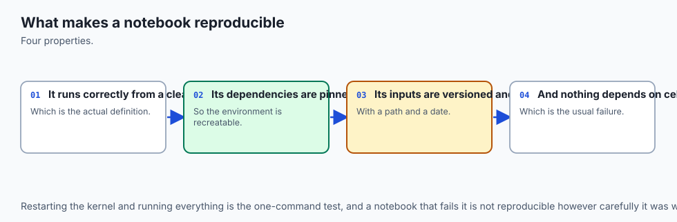
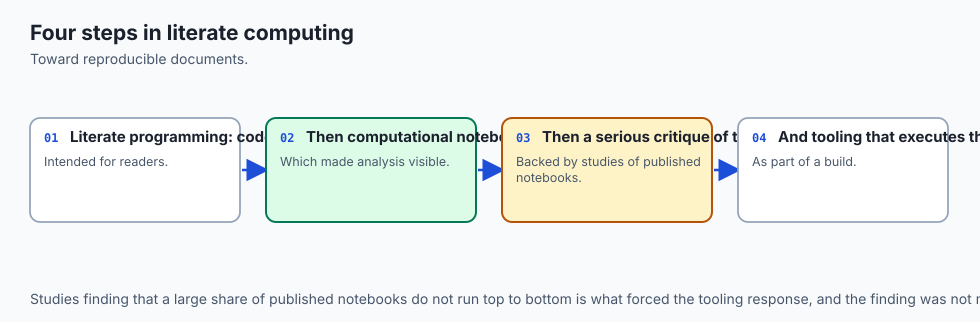
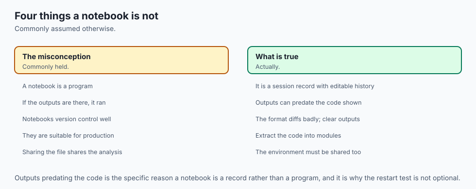
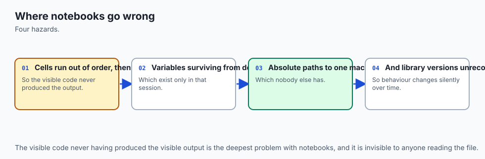
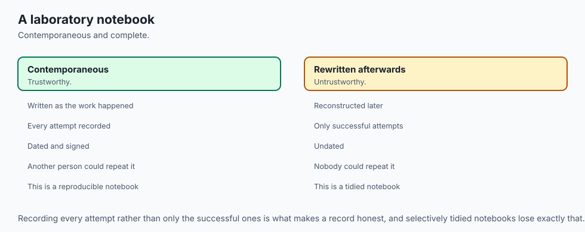
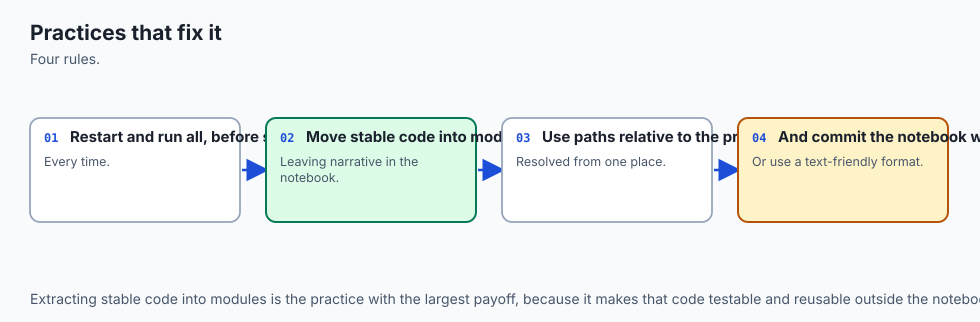
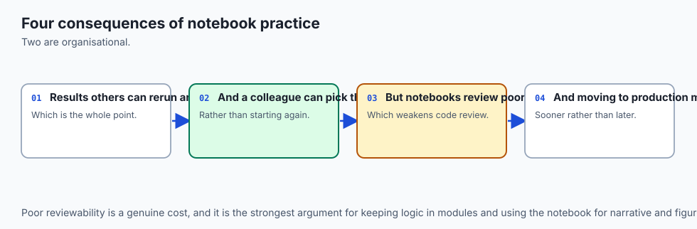
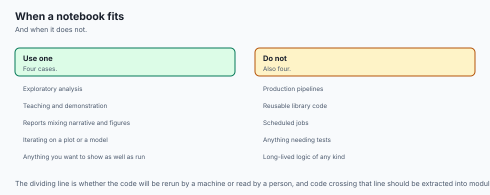

## Why this matters

Here is a notebook that "works." Three cells, run in this order by a real analyst
building it: the first sets up a number, the third checks the answer, the second —
added afterward, once a colleague pointed out the raw number needed a cleaning
step — fixes it. The analyst never re-ran the third cell after adding the second.
Nothing raised an error. Nothing looked wrong. The notebook was saved, and the
number in the third cell's output — the number that ended up in a slide the next
day — was wrong.

This is not a contrived edge case. It is measured, on this machine, from a
notebook built and executed for real in this lesson's lab. A clean top-to-bottom
run of the exact same three cells answers `30.0`. Run in the order the analyst
actually clicked — setup, then a look at the report, then the fix, never
returning to the report — the same notebook, still open, still looking exactly
as it did a moment ago, answers `50.0`. Here is both runs, verbatim from a real
execution:

```
Clean top-to-bottom run (order 0, 1, 2):
  execution_count: [1, 2, 3]
  cell 2 (report) final value: 30.0

Scrambled run (order 0, 2, 1 -- setup, then a look at the report, then the fix):
  execution_count: [1, 3, 2]
  cell 2 (report) final value: 50.0
```

Look at that output for a second time. Nothing distinguishes the two runs to a
reader scrolling past — both show a plain float in the last cell, no red text, no
warning banner. The only difference sits in a field almost nobody reads: the
scrambled run's `execution_count` sequence, `[1, 3, 2]`, is not sorted. The clean
run's is. That is the entire evidence trail. If you have ever trusted a notebook
because it "already ran" and looked fine, you have trusted exactly the kind of
document this lesson is about.

The rule this day defends is short enough to say once and mean absolutely:
**restart and run all, or it did not happen.** Not "it looks fine." Not "I ran
it yesterday and it worked." A notebook's claims are unverified — however
carefully written, however plausible the numbers look — until it has survived a
fresh kernel executing every cell, in document order, from nothing. Everything
below this line is either a way that guarantee gets broken, or a way to check
that it hasn't been.

## The idea in plain language



A notebook is two things wearing one file extension, and almost every notebook
bug comes from forgetting they are different.

The first thing is the **document**: a saved list of cells, each with source
code, and — if it was run — whatever output that run produced, frozen in place.
The document is what you see when you open a `.ipynb` file. It is what gets
committed to version control, emailed to a colleague, and rendered by GitHub's
preview.

The second thing is the **kernel**: a separate, running Python process that
actually executes the code. The kernel has its own memory — its own namespace of
every variable any cell has ever defined, in whatever order they were actually
run. The kernel does not care what order the cells sit in the document. It does
not care whether a cell that defined a variable still exists. It remembers
exactly what happened to it, and nothing about what the document currently says.

A notebook "working" is a claim about the kernel's history, not about the
document's content. Two notebooks with byte-identical cell source can behave
completely differently depending on what has happened inside their kernels — and
a notebook can look identical to a reader while recording two different
histories, which is exactly what the opening example demonstrated. The rest of
this lesson is variations on one move: hold the document still and change what
the kernel remembers, or hold the kernel's history still and change what the
document shows, and watch the gap between them do the damage.

## Historical background



The notebook interface traces to Mathematica's notebook front end in the late
1980s, which paired a document of cells with an underlying evaluation kernel —
the same split this lesson is built around, decades before Python had one. IPython added an interactive Python shell in 2001, and in 2011 the IPython
Notebook gave that shell a browser-based document with the now-familiar cell
structure.

In 2014 the notebook's language-agnostic parts split out from
IPython-the-language-specific-shell into Project Jupyter — the name itself an
allusion to Julia, Python and R, the three languages the new project meant to
serve equally through a shared protocol. The `.ipynb` file format,
`nbformat`, and the client/kernel messaging protocol that lets any language
implement a compatible kernel all date to this split.

The reproducibility problems this lesson covers were not new observations even
then.

Out-of-order execution and hidden state are exactly the failure modes a
document/kernel split makes possible, and the community's response has arrived
in layers over the following decade: `nbconvert`'s `--execute` flag to force a
clean re-run before converting; `nbclient` splitting out as its own execution
library so tools other than `nbconvert` could drive kernels programmatically;
`nbstripout` and similar pre-commit hooks once teams learned what committing
outputs did to their diffs; `papermill`, built at Netflix, for running
parameterised notebooks as scheduled jobs rather than by hand; and JupyterLab's
own "Restart Kernel and Run All Cells" becoming the default advice given to
every new user precisely because so many bug reports turned out to be this
lesson's opening failure in disguise.

## What it is — and what it is not



A reproducible notebook is one whose displayed outputs are guaranteed to be what
a fresh kernel, executing every cell in document order, would actually produce
— nothing more, and the guarantee is binary: either the notebook has survived
that exact test, or the claim is unverified.

It is **not** the same as a notebook that runs without error. The opening
example ran without error and was still wrong. Absence of an exception proves
only that the code the kernel actually executed didn't raise — it says nothing
about whether that execution matches what the document, read top to bottom,
would produce.

It is **not** the same as a notebook with clean, well-commented code. Code
quality and execution-order correctness are orthogonal; a beautifully written
notebook can still have a report cell run before its data-cleaning cell.

It is **not** the same as a notebook that has been converted to a script and
that script running successfully. Converting a notebook to a `.py` file with
`nbconvert` extracts the cells' source **in document order** — it does not
replay whatever order the kernel actually saw, and it does not tell you whether
the notebook's *saved outputs* came from that order.

And it is **not** a property you can verify by reading. Nothing in a notebook's
rendered view distinguishes a cell whose output came from a clean run from one
whose output came from a stale, out-of-order execution. The only artifact that
carries any trace at all is `execution_count`, and reading it requires knowing
to look — most readers do not.

## Why it was created and what problems it solves

Interactive execution is the entire reason notebooks exist: run a cell, look at
the result, adjust, run again, all without restarting the whole program. That
workflow is what makes exploratory analysis fast. It is also, structurally, what
makes reproducibility a problem rather than a given — every other artifact in
this course (a script, a module, a pipeline) has exactly one way to run it, top
to bottom, and a notebook's whole value proposition is letting you run pieces of
it in whatever order helps you think.

The problems that trade-off creates, all of which this lesson demonstrates for
real rather than describing:

- **Out-of-order execution silently changes answers**, because a cell's output
  is frozen at whenever it last ran, not recomputed when something upstream
  changes.

- **Hidden state outlives its own cell**, because deleting or editing a cell
  changes the document, not the kernel's memory of what that cell already did.

- **A notebook that "works" is not machine-checkable by inspection**, because
  nothing in the rendered view distinguishes a stale output from a fresh one.

- **Committed outputs make version control noisy**, because a rerun of
  unchanged code still produces a different file, for reasons explored in
  detail below.

- **Notebooks resist automated testing**, because the natural unit of reuse in
  a notebook — a cell — is not something a test runner can import.

Every mechanism covered from here on exists to close one of these five gaps.

## How it works



### The notebook file is JSON

Strip away the rendered view and a `.ipynb` file is a JSON document with a
short, learnable shape: a list of cells, each carrying a `cell_type`
(`"code"` or `"markdown"`), a `source`, and — for code cells that have been
run — an `execution_count` and a list of `outputs`. Here is a real cell, taken
verbatim from this lesson's lab after executing `2 + 2` in a fresh kernel:

```json
{
  "id": "2eb0881b",
  "cell_type": "code",
  "metadata": {
    "execution": {
      "iopub.status.busy": "2026-08-20T09:46:20.302857Z",
      "iopub.execute_input": "2026-08-20T09:46:20.303144Z",
      "shell.execute_reply": "2026-08-20T09:46:20.309351Z",
      "iopub.status.idle": "2026-08-20T09:46:20.310104Z"
    }
  },
  "execution_count": 1,
  "source": "2 + 2",
  "outputs": [
    {
      "output_type": "execute_result",
      "metadata": {},
      "data": { "text/plain": "4" },
      "execution_count": 1
    }
  ]
}
```

Every claim in this lesson is a claim about specific fields in this structure.
`source` is what the document says the code is. `execution_count` is what order
the kernel actually ran it in. `outputs` is what that run actually produced.
`metadata.execution` is a set of wall-clock timestamps the kernel's execution
stamped on afterward — and it turns out to matter more than most tutorials
admit, in the section on output stripping below. Understanding this shape is
what makes every later section concrete rather than mysterious: this lesson's
whole lab tests notebooks by building this exact JSON with `nbformat`,
executing it with `nbclient`, and asserting on these exact fields — no browser,
no click, ever involved.

### Hidden state

A variable defined in a cell that has since been deleted from the document does
not stop existing. It stops existing **in the document**. The kernel process
behind the notebook, if it has not been restarted, still holds it.

Measured directly: build two cells, one defining `helper_value = 42`, one
computing `total = helper_value + 8`. Run both in one kernel. Now delete the
first cell from the notebook — remove it from the document entirely, so the
saved file has exactly one cell, and that cell's source has no mention of where
`helper_value` comes from. Rerun the remaining cell **in the same kernel
process**. It succeeds:

```
dirty kernel, cell A removed from doc, reran cell B: [{'output_type': 'execute_result', ...,
  'data': {'text/plain': '50'}, 'execution_count': 3}]
```

Now take that exact one-cell notebook — the one currently saved to disk, with no
trace of where `helper_value` comes from — and run it in a brand-new kernel that
has never seen any of this session's history:

```
clean run raised CellExecutionError as expected
ename: NameError
```

Same file. Same cell. Two completely different outcomes, and the only variable
is whether the kernel remembers a cell that no longer exists. This is not a rare
accident; it is the single most common way "it works on my machine" happens with
notebooks specifically — an analyst iterates, deletes what looks like dead
scaffolding, and never notices the scaffolding's *side effect* is still load
bearing, because their own kernel has been open the whole time.

![Diagram: on the left, a panel labelled the notebook document holding two visible code cells -- one defining helper_value, one using it -- and a ghost dashed cell in between marked as deleted. On the right, a panel labelled the kernel process holding a live namespace of three variables: x, helper_value and total, with helper_value drawn in a distinct orange box. A dashed orange line connects the deleted cell on the left to the helper_value box on the right, labelled the gap, showing that the kernel still holds a value whose defining cell no longer exists in the document. A bottom caption states that a notebook which still works while a cell is missing is telling you about the kernel, not about the document](./assets/notebook-state-architecture.svg)

### Out-of-order execution and what execution_count reveals

The opening example's mechanics, stated precisely: `nbclient` lets you execute
individual cells against one persistent kernel in any order you choose, by
calling `execute_cell` on each cell index directly rather than calling `execute`
(which always proceeds top to bottom). Running cells `[0, 2, 1]` — setup, then
report, then the transform that was added afterward — stamps `execution_count`
values of `1`, `3`, `2` onto cells `0`, `1`, `2` respectively, because
`execution_count` records *when* a cell ran, not *where* it sits.

The diagnostic rule follows directly: a notebook run cleanly, top to bottom,
from a fresh kernel always produces a monotonically increasing
`execution_count` sequence — `1, 2, 3, ...` — because each cell can only be
assigned a count once it has actually run, and a clean run visits them in
order.

Any other sequence — gaps, repeats, or numbers out of position — is
direct, checkable evidence that the cells were executed in some order other than
the one the document displays them in. This is the *only* general-purpose signal
a reader has, short of re-running the notebook themselves, and it is why the
lab's second exercise asserts on it directly: `is_monotonic([1, 2, 3])` is
`True`; `is_monotonic([1, 3, 2])` is `False`.

Restarting a kernel and running all cells always renumbers from `1`, in
document order, regardless of what the counts were before — which is precisely
why "Restart & Run All" is the check that matters and reading `execution_count`
in a notebook someone else sent you is the check you actually have available
when you cannot run it yourself.

### Execution as a test

Everything above becomes machine-checkable the moment you stop treating
"execute a notebook" as something that requires a person and a browser.
`nbclient.NotebookClient(nb, kernel_name="python3").execute()` runs every cell,
top to bottom, against a real kernel — headlessly, no display required — and
raises `CellExecutionError` the instant a cell errors, without touching any
cell after it.

Measured directly, executing a notebook whose second cell raises
`ValueError('row_count below the expected minimum')`:

```python
ename ValueError evalue bad row count
```

and the exception's full message names the failing cell's execution position
directly — `Cell In[2], line 1` — and quotes the cell's own source. That single
property is what turns "does this notebook still work?" from a question someone
has to remember to ask by hand into something a CI job can ask on every commit,
the same way `pytest` asks "do the tests still pass?" A broken notebook fails
the build with a message that already tells you which cell to look at, rather
than shipping and failing silently for whoever opens it next.

### Outputs are committed, and what a rerun actually changes

Committing a notebook with its outputs means every rerun — even of completely
unchanged code — produces a different file, and folklore usually blames
`execution_count`. Measured directly, that turns out to be only sometimes true.
Two independent, fresh-kernel executions of `2 + 2` and `3 * 3`, compared as
saved JSON:

```
unstripped identical? False
stripped identical? True
cell 0 field 'metadata' differs: {'execution': {'iopub.execute_input': '2026-08-20T09:46:43.654959Z', ...}}
  vs {'execution': {'iopub.execute_input': '2026-08-20T09:46:44.330183Z', ...}}
```

`execution_count` was identical between the two runs — both started counting at
`1`, because both were fresh kernels running deterministic code. What actually
differed was `cell.metadata.execution`: four ISO-8601 wall-clock timestamps
(`iopub.status.busy`, `iopub.execute_input`, `shell.execute_reply`,
`iopub.status.idle`) that `nbclient` stamps onto every cell on every execution.
Two runs a millisecond apart will never share those. Separately, this lesson
checked whether a plotted figure's PNG bytes differ between runs of identical
plotting code — consistent with Day 133's finding for matplotlib PNGs — and
found them byte-identical on this machine across two runs. So the actual,
measured source of "identical code, different commit diff" here is neither
image blobs nor `execution_count`; it is the per-execution timestamp metadata,
every single time.

An `nbstripout`-style pre-commit hook fixes this the direct way: strip
`outputs`, set `execution_count` to `null`, and delete
`metadata.execution` before every commit. Two runs of the same code then
produce byte-identical files. The trade-off is exactly as blunt as it sounds: a
stripped notebook reviews cleanly in a diff — no noise, no giant base64 image
blobs — but the committed file no longer shows what it produced.

A reviewer
reading a stripped notebook is reading source code with no evidence attached;
they have to re-run it to see whether it still does what it claims. Whether
that trade is worth making depends on whether the repository is meant to be the
record of results (keep outputs, accept the diff noise) or purely the record of
method (strip them, and put results somewhere else — Day 133's report is
exactly that somewhere else).

### Parameterising a notebook

A parameterised notebook takes a single analysis and reruns it for several
inputs — one threshold, one date range, one customer segment per run —
without hand-editing the notebook each time. The mechanism, as `papermill`
documents and implements it, is specific: a cell tagged `"parameters"` (a tag
on the cell's own metadata, not special syntax) holds the defaults, and running
a parameterised variant **never edits that cell**. Instead, a new cell tagged
`"injected-parameters"` is inserted immediately after it, carrying the run's
actual values, so the original defaults stay visible in every executed output
notebook even though the run behaved according to the injected ones.

This lesson reproduces that exact mechanism by hand with `nbformat` — building
the tagged parameters cell, then building and inserting the injected cell —
because `papermill` itself is not installed in this lab's environment and is
described from documentation only; no output attributed to `papermill` in this
lesson was produced by running it.

Two variants built this way, `threshold=10`
and `threshold=5`, execute to different final filtered lists (`[12, 15]` versus
`[12, 7, 15]`) while every other cell's source text — the default cell, the data
cell, the analysis cell — is character-for-character identical between the two. That is the whole value proposition in one measured fact: the only thing that
changes between parameterised runs is the injected cell, which makes the
difference between two runs auditable by diffing exactly one cell.

### Converting a notebook

`nbconvert` turns an already-executed notebook into another format by reading
its stored `outputs` — it does not, by default, re-execute anything (its
`--execute` flag does, and is the flag that forces a clean run before
conversion, closing the very gap this lesson opens with). Measured directly,
converting a two-cell notebook (one markdown cell of prose, one code cell
computing `40 + 74`) to Markdown with `nbconvert.MarkdownExporter`:

````markdown
## Row count check

We expect at least 100 rows after cleaning.


```python
row_count = 40 + 74
row_count
```


    114
````

Both the prose sentence and the computed value `114` — not retyped, taken
directly from the executed cell's output — appear in the converted document.
That is the property that makes a converted notebook a usable report artifact
in Day 133's sense: the document carries its own evidence rather than an
author's transcription of it. `nbconvert` can equally target HTML for a
polished report or a `.py` script for a code review that does not want to open
a notebook viewer at all — the same source, the same executed outputs, three
different audiences.

### The notebook/module split

Everything above assumes the notebook is where analysis lives, and that is only
correct up to a point. The moment logic is something *other* code depends on —
a cleaning function called from three different notebooks, a metric computed
the same way in an exploration notebook and a production pipeline — a notebook
cell is the wrong place for it to live, for a reason that is structural, not
stylistic: **`pytest` can import and test a module directly, and cannot reach a
notebook cell at all.**

Measured directly: `calc.clean_mean`, a small function living in an ordinary
`.py` module, is covered by an ordinary `pytest` test file — no kernel, no
notebook, nothing beyond a plain `import`. The identical averaging logic,
inlined into a one-cell notebook and executed inside a real kernel, computes the
right answer just fine — a kernel will happily run any code you put in front of
it.

But asking Python's own import system to reach that same logic by name —
`importlib.import_module("clean_mean_inline_notebook")` for a name that only
ever existed as text inside a cell — raises `ModuleNotFoundError`, every time,
regardless of whether a kernel is running. A `.ipynb` file is not something
Python's import machinery understands; there is no special-casing that makes an
inlined function "count" as importable just because a kernel executed it once.

The rule this proves rather than merely states: exploration belongs in the
notebook — trying things, looking at intermediate results, building the
argument interactively. Anything downstream code needs to keep working belongs
in a module with its own test suite, imported by the notebook rather than
defined inside it. Day 126's reproducible pipeline is exactly where that logic
belongs once it graduates out of a cell.

### Determinism inside a notebook

Day 126's reproducibility manifest — seeds, pinned versions, a recorded
environment — applies inside a notebook exactly as it applies to a script, and
a notebook needs it more, not less, because interactive execution makes it
easier to forget which environment produced a given output. A one-cell
notebook that records its own environment, executed for real:

```
{'python_version': '3.14.0',
 'nbformat': '5.11.1',
 'nbclient': '0.11.0',
 'nbconvert': '7.17.1'}
```

The point of recording this is not decoration — it is a comparison target. A
stand-in for an older manifest, identical except `nbformat` pinned one minor
version back (`5.10.0` instead of `5.11.1`), disagrees with the live record at
exactly that key and no other, confirmed directly rather than assumed. A record
that cannot distinguish "the code changed" from "the environment changed" is
not doing its job; a record that changes precisely where a pin changed, and
nowhere else, is.

![Diagram: two stacked panels showing the same three cells, setup, transform and report. In the top panel, titled as actually run, the cells are visited in the order setup, report, transform, and each carries an execution count badge showing 1, 2 and 3 attached out of position, so the sequence read left to right is 1, 3, 2. A final orange box shows the answer 50.0. Below it, a restart and run all arrow points down to a bottom panel, titled after a restart, where the same three cells are visited in their normal document order, badges 1, 2 and 3 appear in position, and a final green box shows the answer 30.0. A dashed wire with marching dashes and a travelling dot trace the click path through each panel, and each cell briefly thickens its border in the order it was run. A caption states that with motion off every cell, badge and answer already sits in its final position and the animation only shows the click order](./assets/execution-order-flow.svg)

## An everyday analogy



A notebook's document is a recipe card pinned to the fridge. A notebook's kernel is the pot actually on the stove. Reading the card tells you what steps were *written down*; it tells you nothing about what actually went into the pot, in what order, or whether someone added a pinch of salt straight from the shaker — a step never written on the card at all — before taking a photo of the finished dish. If a guest asks for the recipe and you hand them the card, they will follow the written steps and, if the pot's actual history included something the card never mentioned, produce a different dish.

The card looking complete and legible is not evidence the dish came from it. The only way to know the card actually reproduces the dish is to hand a stranger a clean pot, give them nothing but the card, and taste what comes out — which is exactly what "restart and run all" is: a clean pot, the card alone, and a taste test.

## Examples in practice



The following table walks through this lesson's own three-cell notebook —
`setup` sets `x = 100`; `transform` runs `x = x - 40`, added after the fact;
`report` computes `answer = x / 2` — under four different execution histories,
each one executed for real in this lesson's lab.

| Execution history | execution_count | Displayed answer | Trustworthy? |
| --- | --- | --- | --- |
| Clean, top to bottom (`0, 1, 2`) | `[1, 2, 3]` | `30.0` | Yes — monotonic, matches document order |
| Setup, report, transform (`0, 2, 1`) | `[1, 3, 2]` | `50.0` | No — non-monotonic; report predates the fix |
| Setup only, then transform, report never re-run | `[1, 2, None]` | (whatever `report` last showed) | No — `report`'s count did not advance at all |
| Restart & Run All, any prior history | `[1, 2, 3]` | `30.0` | Yes — the only history that always resets to this |

The second row is the opening failure. The third is a variant worth naming
separately: a cell whose `execution_count` never advanced this session at all is
displaying an output from some *earlier* session, possibly hours or days old —
`None` in that slot means "never run since the kernel currently attached to
this document started," and a `None` sitting next to numbers is exactly as
diagnostic as a non-monotonic sequence.

For the hidden-state failure, the same treatment: a cell defining
`helper_value = 42` is deleted from the document after a dependent cell has
already used it once.

| Where the notebook is run | `helper_value`'s defining cell in the document? | Result |
| --- | --- | --- |
| Same kernel session, right after deletion | No | Succeeds — kernel still remembers it |
| Fresh kernel, notebook saved as-is | No | `NameError`, exactly as it should |
| Fresh kernel, defining cell restored | Yes | Succeeds — for the right reason this time |

The middle row is the version everyone eventually hits: a colleague, a CI job,
or the same analyst three weeks later opens the saved notebook, restarts the
kernel because that is the correct thing to do, and the notebook that "worked
fine" now fails on a `NameError` for a variable whose only definition is a cell
that no longer exists anywhere in the file.

## Implications: security, privacy, performance, scalability, and cost



**Security.** A `.ipynb` file's stored outputs can embed anything the executing
code produced — including, if the code printed one, a credential, a database
row, or an internal hostname. Committing outputs without reviewing them is a
credential-leak vector distinct from committing source code, because outputs
are *data*, not code, and code review habits do not automatically catch data
leaking through a printed `repr()`. A kernel itself, in this lesson's lab and in
any local Jupyter setup, talks to its client over ZeroMQ on loopback
(`127.0.0.1`) only; nothing about running a notebook locally opens a port
reachable from outside the machine unless a hosted service is explicitly
configured to do so.

**Privacy.** The same stored-output risk applies directly to personal data: a
`df.head()` on a dataset containing names or identifiers, run once during
exploration and never cleared, sits in the committed file indefinitely, visible
to anyone with repository access, independent of any access control on the
original data source.

**Performance.** Kernel startup is the dominant fixed cost of executing a
notebook headlessly — on this machine, the first kernel start in a session
costs roughly one to two seconds; every cell execution after that is limited
only by the code itself. This matters for CI: executing many small notebooks
each in a fresh kernel pays that startup cost every time, and batching related
checks into fewer kernel sessions (which this lesson's lab does throughout, via
`client.setup_kernel()` reused across multiple `execute_cell` calls) amortises
it.

**Scalability.** Parameterisation is the mechanism that scales a single
analysis notebook to many runs — one `papermill` invocation per parameter set,
each producing its own output notebook, rather than one person hand-editing and
re-running a shared file for each case, which does not scale past a handful of
variants before someone edits the wrong cell.

**Cost.** Every tool this lesson actually runs — `nbformat`, `nbclient`,
`nbconvert`, `ipykernel`, and locally-hosted JupyterLab itself — is free and
open source with no paid tier. The cost trade-offs in this space live entirely
in hosted execution: Google Colab's free tier provides a shared, time-limited
kernel with no guarantee of GPU availability, while its paid tiers (Colab Pro
and Pro+) buy longer sessions, more reliable GPU access and more memory — costs
Colab's own documentation states directly rather than figures reproduced here.

## Alternatives: free, open source, and commercial

| Tool | When to choose it | How it is used | Free vs. paid | Run in this lesson? |
| --- | --- | --- | --- | --- |
| `nbformat` + `nbclient` + `nbconvert` | Testing or converting notebooks headlessly, from a script or CI, with no UI involved — exactly this lesson's lab | `nbformat.v4.new_notebook()` to build; `NotebookClient(nb).execute()` to run; an `nbconvert` exporter to convert | Free, open source (BSD-3-Clause) | Yes — every output attributed to these three libraries in this lesson was produced by running them |
| JupyterLab | Interactive, exploratory work — writing and rerunning cells by hand, the ordinary day-to-day notebook interface | Launched with `jupyter lab` from the lab's virtual environment; not something this lesson automates | Free, open source; hosted variants (e.g., a cloud JupyterHub) can carry infrastructure cost | No — described from documentation; no UI was driven for this lesson |
| Papermill | Running one notebook against many parameter sets as a batch or scheduled job, each producing its own output notebook | `papermill input.ipynb output.ipynb -p threshold 5` from the command line, or its Python API | Free, open source | No — not installed in this lab; its parameter-injection mechanism is reproduced by hand with `nbformat` and described from documentation |
| Quarto | Publishing a notebook (or a plain `.qmd` document) as a polished report, book, slide deck or website, often mixing prose and code more heavily than a raw notebook | `quarto render analysis.ipynb --to html`, or authoring directly in `.qmd` with embedded code chunks | Free, open source (Quarto CLI); Posit Connect, a commercial product for publishing and scheduling Quarto content at scale, is paid | No — described from documentation only |
| Google Colab | Running notebooks with zero local setup, especially when GPU access is needed occasionally rather than constantly | Notebooks open directly in a browser against Google-hosted kernels; `.ipynb` files are otherwise standard and portable | Free tier: shared, time-limited kernels, GPU access not guaranteed. Colab Pro / Pro+: paid, longer sessions and more reliable GPU/memory, per Google's own documentation | No — described from documentation only; no output in this lesson came from Colab |
| `nbstripout` (and similar hooks) | Any team committing notebooks to version control that wants meaningful diffs rather than output-blob noise | Installed as a Git filter or pre-commit hook; strips `outputs`, `execution_count` and `metadata.execution` on every commit | Free, open source | Its effect (byte-identical stripped notebooks) is reproduced directly with a hand-written `strip_outputs` function, not the tool itself |

## Comparison with related concepts

**A notebook versus a script.** A script has exactly one execution order: top
to bottom, every time, with no other option. A notebook's entire value is
letting you choose a different order while exploring — which is also precisely
why a notebook needs an explicit reproducibility check a script does not:
running a `.py` file always tells you what a clean execution produces, because
there is no other kind.

**Execution-as-a-test versus a unit test.** A unit test asserts on a function's
behaviour in isolation, independent of any notebook. `nbclient` executing a
notebook and raising on a failing cell is closer to an integration test: it
proves the *whole document*, cell order and all, still runs clean from nothing
— a check a unit test suite covering the same underlying functions cannot give
you, because the functions working correctly says nothing about whether the
notebook that calls them in a particular order still holds together.

**Output stripping versus output retention.** These are not "correct" and
"incorrect" — they are two different answers to "what is this repository for?"
Stripped notebooks are source code with clean diffs and no embedded evidence;
notebooks with outputs retained are self-contained records with noisy diffs.
Day 133's separately-generated report exists precisely because neither answer
is satisfying when the goal is "a document a non-technical reader can trust":
that report strips nothing and commits nothing incidental, because it is
generated fresh from data and code every time, with its own provenance
fingerprint rather than a notebook's execution history.

**Parameterisation versus a notebook with hardcoded values edited by hand.**
Both eventually produce the same set of output notebooks. The difference is
auditability: a parameterised run changes exactly one cell (the injected
parameters cell) and leaves everything else provably identical, which this
lesson confirmed directly by comparing cell source text across variants. Hand
editing a shared notebook for each run leaves no such guarantee — nothing stops
an edit intended for one run from silently persisting into the next.

## When to use it — and when not to



Restart-and-run-all discipline, execution-as-a-test, and an environment record
are not optional extras for a "serious" notebook — they are what separates a
notebook someone else can check from one they have to take on faith. Apply them
whenever a notebook's output will be read, cited, or acted on by anyone other
than the person who just wrote it, including that same person a week later.
That covers essentially every notebook that leaves a laptop: a shared analysis,
a report, a model-training run, an AI experiment someone will try to reproduce.

The one place this discipline is legitimately relaxed is a notebook that is
genuinely disposable — scratch exploration you will delete within the hour,
never committed, never shown to anyone, existing purely to let you think. Even
there, the moment a result from that scratch session is worth keeping, the
right move is not to leave it in the scratch notebook; it is to restart, run
clean, and only then treat the output as real — or, per the notebook/module
split above, to move the logic that produced it into a tested module the moment
anything else will depend on it.

## The AI connection

- **A notebook that only runs on its author's machine is not a result**, it is a claim.
- **Execution order is the notebook's defining hazard**, and out-of-order state produces
  results nobody can reproduce.
- **Pinning the environment is what makes a rerun meaningful**, since library versions change
  outputs.
- **Reproducibility is the foundation of every claim in this curriculum**, including every
  model evaluation.
- **The same discipline governs AI experiments**, where seeds, data versions and prompts all
  have to be pinned together.

## Knowledge check

Eight questions covering execution order, `execution_count`, hidden state,
execution-as-a-test, output stripping, parameterisation and the notebook/module
split live in this lesson's `quiz.yml` and render with the page.

## Hands-on exercise

Build and run the lab in `labs/sections/math-statistics-and-data/day-139-reproducible-notebooks/`.
Nine exercises, all built with `nbformat`, all executed against real Jupyter
kernels through `nbclient`, none of them ever written to disk as a `.ipynb`
file:

1. Prove out-of-order execution changes the answer.
2. Prove `execution_count` is non-monotonic exactly when order was scrambled.
3. Prove hidden state: a deleted cell's variable survives in a dirty kernel and
   raises `NameError` the moment the kernel is fresh.

4. Prove `nbclient` fails a broken notebook and names the failing cell.
5. Prove exactly which JSON field makes two runs of identical code differ, and
   that stripping it makes them byte-identical.

6. Build and execute two parameterised variants that differ only where they
   should.

7. Convert an executed notebook to Markdown and prove the artifact carries its
   own prose and its own numbers.

8. Prove a module's logic is reachable by `pytest` and an inlined cell's is
   not.

9. Prove a notebook's environment record changes when a pin changes.

```bash
cd labs/sections/math-statistics-and-data/day-139-reproducible-notebooks
python3 -m venv .venv
.venv/bin/pip install -r requirements/requirements.txt
.venv/bin/pytest starter -v
```

### Expected output

A green run of the full harness ends:

```
7. Offline, and nothing left behind
  ok: no URLs inside examples/ or starter/ source
  ok: no .ipynb file anywhere inside the lab -- every notebook in this lab exists only in memory
  ok: no .ipynb_checkpoints directory anywhere inside the lab
  ok: no __pycache__ left behind (cleaned during this run)
  ok: no .pytest_cache left behind (cleaned during this run)

---------------------------------------------------------------
16 checks, 0 failure(s)
```

`.venv/bin/pytest examples -q` prints `12 passed`; `.venv/bin/pytest starter -q`
prints `3 passed, 9 skipped` before you begin the exercises.

### Validate your work

Run `bash tests/run_tests.sh` from the lab directory and read its own exit
status directly — `echo $?` immediately afterward, with no pipe in between, so
nothing hides a real failure. `16 checks, 0 failure(s)` and exit `0` is the
target. Then open `expected-output/scrambled-vs-clean.txt` and confirm for
yourself, by reading it, that `30.0` and `50.0` really are two different
answers from the same three cells with no error anywhere in either run.

### Troubleshooting

Full detail lives in the lab's `troubleshooting.md`. The two failures you are
most likely to hit: running `pytest examples starter` together, which aborts
collection with `import file mismatch` because both directories define
`test_notebooks.py` — always run them as two separate commands; and the
`[IPKernelApp] WARNING | Kernel is running over TCP without encryption` line
every kernel prints on startup, which is expected and harmless for a
loopback-only local kernel, not a failure.

### Common mistakes

Building a fresh `NotebookClient` for every cell you want to execute is the
single most common way to accidentally erase the exact behaviour exercises 1
and 3 are testing — a fresh client starts a fresh kernel, so state that should
persist across cells (or should be absent) silently does the opposite of what
the exercise demonstrates. Use `client.setup_kernel()` as a context manager and
call `execute_cell` on it repeatedly, so one kernel process serves every call
inside that block.

## Practice assignment

Take a notebook you have written for any earlier day in this course — or write a short new one, three to five cells, doing any small piece of real analysis. Using `nb_lib.py` from this lab as a starting point (or the raw `nbformat` / `nbclient` calls it wraps), write a script that: executes your notebook cleanly and records the final output of its last cell; executes it a second time in some out-of-order sequence you choose by hand, picking an order that plausibly mirrors how you actually built it; and prints both outputs side by side.

If your notebook's answer does not change between the two runs, that is a real and useful finding — say in one sentence why the particular cells you chose happen not to be order-sensitive, rather than treating "no difference found" as a failed exercise. Then add an environment-record cell to the notebook, following this lesson's `environment_cell_notebook` pattern, and confirm it reports the actual versions installed in whatever environment you ran it in.

## Extension challenge

Extend this lab's exercise 5 (output stripping) to include a cell that produces a `matplotlib` figure via `%matplotlib inline` and `IPython.display.display`, executed twice independently. Confirm directly — do not assume — whether the resulting `image/png` bytes are identical between the two runs on your machine, the same way this lesson confirmed it for its own plotting check. If they are identical, say so and explain that `metadata.execution` is still the only field that differs, exactly as in the text-only version.

If they are *not* identical on your machine (a different `matplotlib` build, a different font stack, and a different FreeType version can legitimately produce different raster bytes from identical code, as Day 133 notes for the same reason), report that too — a measurement that contradicts this lesson's own finding on a different machine is not a mistake in either lesson, it is exactly the kind of machine-dependent fact `expected-output/FIELDS.md` exists to record honestly.

---

**AI thread.** Almost all substantive model work — trying a prompt, evaluating
an embedding, comparing two fine-tuning runs — starts life in a notebook,
because a notebook is the fastest way to look at one result and decide what to
try next.

That is exactly the workflow this lesson shows is structurally prone
to producing an unverifiable claim: an experiment run interactively, cell by
cell, adjusted and re-run out of order as ideas change, whose final "the model
scored 0.91" can be exactly as stale as this lesson's `50.0` — computed before a
later cell changed the data it depends on, displayed with no error, and cited
in a paper or a Slack message before anyone restarts the kernel to check.

A
result a colleague cannot reproduce from a clean kernel is not a result; it is
an anecdote with a chart attached, and the gap between the two is not
effort or rigor in the abstract — it is one specific, checkable action:
restart, run all, and see if the number holds.