## Why this matters

- **Nothing else in this course runs until this works.** Every lesson from here
  assumes a Python you control.
- **"It works on my machine" is usually an environment problem**, and virtual
  environments are the fix rather than a formality.
- **Two projects will want different versions of the same library.** Without
  isolation, installing one breaks the other.
- **Every AI setup guide opens with these commands.** Learning them once removes
  a recurring source of confusion.
- **This is Week 7**, and it is the point where you stop driving other people's
  programs and start writing your own.

---

## The idea in plain language

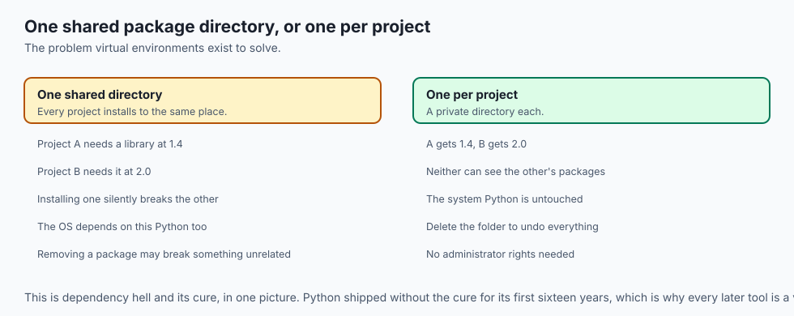

- **Python is a program that runs your files.** You can have several installed at
  once, and only one answers when you type `python3`.
- **A virtual environment is a private folder of packages** for one project.
- **Activating it rewires your shell** so `python` and `pip` mean that project's
  copies rather than the system's.
- **`requirements.txt` writes the environment down**, so another machine can
  rebuild it exactly.
- **Nothing here is magic.** It is Day 11's `PATH`, applied to Python.

---

## Historical background

- **Python shipped without any isolation.** Every package went into one
  system-wide directory, shared by every project on the machine.
- **That worked until two projects needed different versions**, at which point
  installing one silently broke the other — the problem that came to be called
  dependency hell.
- **`virtualenv` appeared in 2007** as a third-party fix, and was popular enough
  that the idea was absorbed into the language itself.
- **`venv` became part of the standard library in Python 3.3**, which is why you
  need install nothing to use it today.
- **The system Python is still a trap.** On macOS and Linux the operating system
  uses its own Python for its own tools, and installing into it can break them.
- **Every later tool — Poetry, pipenv, uv, conda — solves the same problem**, and
  most of them build on the same mechanism.

---

## What it is — and what it is not

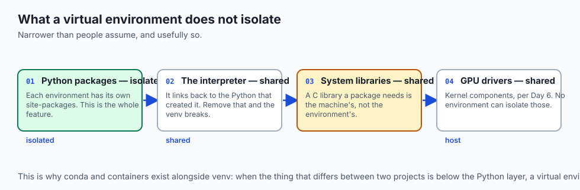

**A virtual environment is:**

- A directory holding its own `python`, `pip` and installed packages.
- Activated by a shell command that changes `PATH` for that shell only.
- Disposable. Delete the folder and it is gone, with nothing else affected.

**It is not:**

- **Not a container.** It isolates Python packages and nothing else — not the OS,
  not system libraries, not the CUDA driver.
- **Not a copy of Python.** It links back to the interpreter that created it,
  which is why deleting that interpreter breaks the environment.
- **Not automatic.** Creating one does not turn it on, and forgetting to activate
  is the single most common mistake here.
- **Not something to commit.** The folder is large and machine-specific; the
  pinned file is what travels.

---

## Why it was created and what problems it solves

- **Conflicting versions.** Project A needs a library at 1.4 and project B at
  2.0, and both can now have what they need.
- **Protecting the system Python.** The operating system depends on its own
  Python, and installing into it can break tools you did not know existed.
- **Reproducibility.** A pinned list rebuilds the same environment on another
  machine, which is what makes a result checkable.
- **Clean removal.** Deleting a folder undoes an installation completely, with
  no residue anywhere else.
- **No administrator rights.** Everything happens in a directory you own, so
  nothing needs `sudo`.

---

## How it works

### Two ways to run code


- **`python3` with no filename lands you in the REPL** — a `>>>` prompt where you
  type one expression, it evaluates, prints, and waits. `exit()` leaves.
- **`python3 hello.py` reads the whole file** and runs it top to bottom.
- **Both paths go through the same interpreter.** A script hands it a file; the
  REPL hands it one line. Nothing else differs.
- **The REPL is your scratchpad; scripts are how programs are stored and shared.**

### Finding which Python you are running

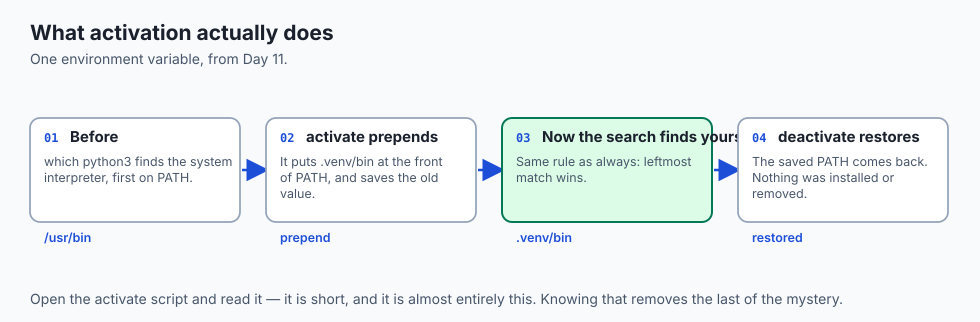

- **You may have several installed** — one from the operating system, one from
  python.org, one from a version manager — and only one answers to `python3`.
- **`which python3`** prints the full path of the one that will run.
- **`python3 --version`** prints its version.
- **This is Day 11's `PATH`**, deciding which program a bare name resolves to.
- **"Which Python am I actually using?" is nearly always the first question** when
  something behaves strangely.

### Creating and using an environment

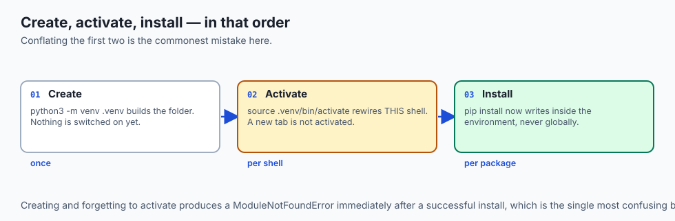

| Task | Command | What it does |
| --- | --- | --- |
| Create | `python3 -m venv .venv` | Builds a folder with a private packages area |
| Activate | `source .venv/bin/activate` | Rewires this shell so `python`/`pip` mean the venv's |
| Confirm | `which python` | Should print a path ending `.venv/bin/python` |
| Install | `pip install <name>` | Into the venv only, never globally |
| Pin | `pip freeze > requirements.txt` | Every package and its exact version |
| Rebuild | `pip install -r requirements.txt` | Exactly those versions, elsewhere |
| Turn off | `deactivate` | Restores the shell to the global Python |

- **`-m venv` means "run the standard-library module named venv".**
- **The leading dot in `.venv` is only a convention** that keeps it tidy and easy
  to ignore. Any name works.
- **Creating does not activate.** They are two separate steps, and conflating
  them is the commonest mistake.
- **Your prompt usually shows `(.venv)`** once it is on, so you can see the state.


### pip, PyPI, and requirements.txt

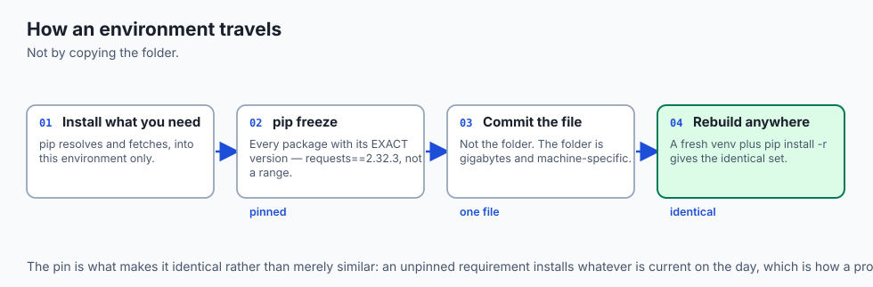

- **`pip` is Python's package installer**, downloading by default from the Python
  Package Index — the same idea as Day 13's package managers, specialised for
  Python.
- **`pip install pandas` fetches it and drops it into the active environment.**
- **`pip freeze` lists everything installed with its exact version**, like
  `requests==2.32.3`.
- **Redirect that to `requirements.txt`** and you have a precise recipe.
- **Anyone — including future you — can rebuild it** in a fresh venv with
  `pip install -r requirements.txt`.
- **This one file is how a project's environment travels unchanged.**

---

## An everyday analogy

A shared workshop with personal toolboxes.

| The workshop | Python |
| --- | --- |
| The building and its power supply | The interpreter |
| The communal tool rack | The system packages |
| Your own locked toolbox | A virtual environment |
| Taking your toolbox to the bench | Activating |
| A written inventory of its contents | `requirements.txt` |
| Rebuilding an identical box from the list | `pip install -r` |
| Putting your box away | `deactivate` |

- **Everyone shares the building.** Nobody shares toolboxes.
- **Borrowing from the communal rack works** until two people need different
  versions of the same tool.
- **The inventory is the part that travels.** You do not post the toolbox.

---

## Examples in practice

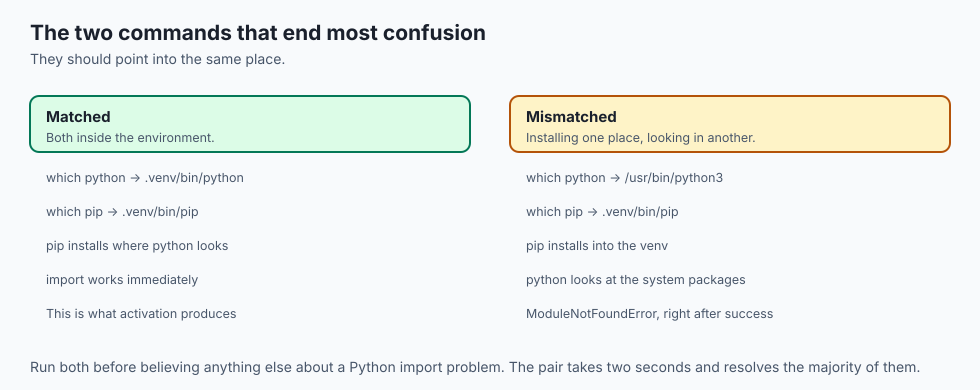

- **`pip install` succeeded and `import` fails**: you installed into one
  environment and are running another. `which python` and `which pip` settle it.
- **A `ModuleNotFoundError` right after a successful install**: the environment
  was never activated.
- **`Permission denied` from `pip`**: you are installing into the system Python.
  That is the signal to create an environment, not to reach for `sudo`.
- **A project that worked last year and not today**: unpinned dependencies moved
  underneath it.
- **A `.venv` accidentally committed**: gigabytes of machine-specific files in a
  repository, and every clone pays for it.

---

## Implications: security, privacy, performance, scalability, and cost

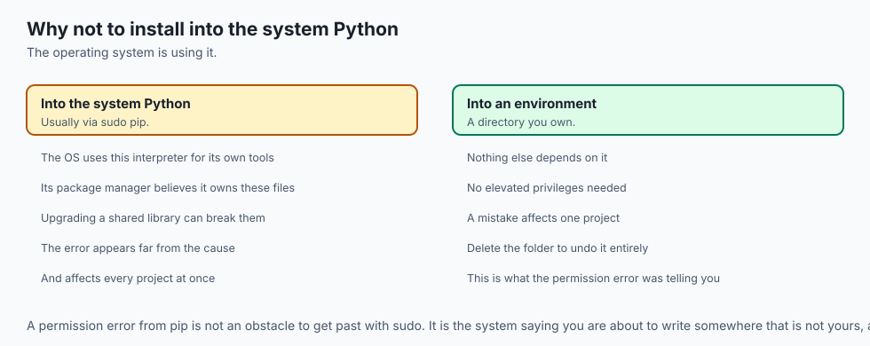

- **Security: `pip install` runs code from strangers.** Packages can execute at
  install time, and the name you type is the whole of the trust decision.
- **Typosquatting is real here.** Copy package names from documentation rather
  than typing them, exactly as on Day 13.
- **Never `sudo pip`.** It writes where the operating system's own package
  manager believes it owns files, and the conflict surfaces weeks later.
- **Performance: environments cost disk, not speed.** A venv with PyTorch can be
  several gigabytes, and each project has its own.
- **Reproducibility: an unpinned dependency is a future breakage** you have
  already scheduled and not yet noticed.
- **Cost: rebuilding an environment is cheap; reconstructing a lost one is not.**
  Commit the pinned file, never the folder.

---

## Alternatives: free, open source, and commercial

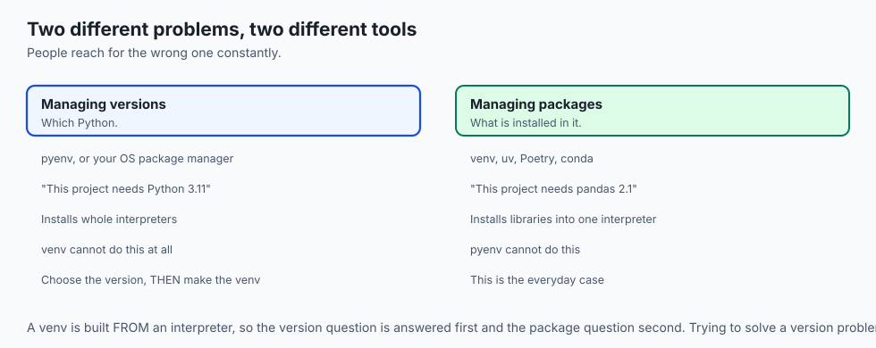

| Tool | Type | Where it fits |
| --- | --- | --- |
| `venv` | Free, standard library | The default. Nothing to install. |
| `uv` | Free, open source | Same job, dramatically faster; increasingly the default |
| Poetry | Free, open source | Dependency resolution and packaging together |
| conda / mamba | Free, open source | Scientific stacks, including non-Python pieces like CUDA |
| pyenv | Free, open source | Managing several Python *versions*, not packages |
| Docker | Free, open source | When the whole environment must travel, not just packages |

- **`uv` is worth trying today.** It creates environments and resolves
  dependencies fast enough to change how you work, and it understands the same
  `requirements.txt`.
- **conda earns its place in AI work** because it manages CUDA libraries and
  other non-Python components that `pip` cannot see.

---

## Comparison with related concepts

| Term | What it actually is |
| --- | --- |
| **Interpreter** | The program that runs your Python code |
| **Virtual environment** | A private package directory for one project |
| **Activate** | Prepend the environment's `bin` to `PATH`, for this shell |
| **pip** | The installer |
| **PyPI** | The public index it downloads from |
| **`requirements.txt`** | The pinned list of what was installed |
| **pyenv** | Manages Python versions, not packages |

---

## When to use it — and when not to

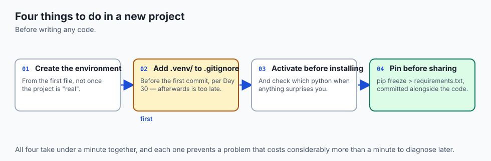

- **Create an environment for every project**, from the first file. Retrofitting
  one is more work than starting with one.
- **Activate before installing anything.** Check `which python` if unsure.
- **Pin before sharing**, and commit `requirements.txt` alongside the code.
- **Add `.venv/` to `.gitignore`** before the first commit — Day 30's rule.
- **Do not install into the system Python**, ever.
- **Do not commit the environment folder.** It is large, machine-specific, and
  rebuildable from one file.
- **Do not reach for conda or Docker first.** A venv solves most problems, and
  the heavier tools are for the ones it does not.

---

## The AI connection

- **Every AI project starts with this command.** `python3 -m venv .venv` is the
  first line of almost every setup guide you will ever follow.
- **AI dependencies conflict harder than most.** Two projects wanting different
  PyTorch or CUDA builds cannot share one environment, and the failure is a
  cryptic import error rather than a clear refusal.
- **`requirements.txt` is half of reproducibility.** A result you cannot rebuild
  is a result you cannot defend, and the environment is as much a part of the
  experiment as the code.
- **Model libraries are large.** A single environment with PyTorch is often
  several gigabytes, which is why they belong in `.gitignore` and not in a
  repository.
- **The remote machine has its own environment.** Your laptop's venv does not
  travel; the pinned file does.

## Knowledge check

```yaml
quiz:
  question: "A package installs successfully with pip, but importing it in the very next command raises ModuleNotFoundError. What is the most likely cause?"
  options:
    - "pip and python resolve to different installations, so the package went somewhere the interpreter is not looking"
    - "The package requires a newer Python version than the one installed"
    - "The install completed but the package index served a corrupted archive"
    - "The package must be added to requirements.txt before it can be imported"
  answer_index: 0
  explanation: "pip and python are two separate programs found on PATH. If an environment is not activated — or is only half activated — pip may install into one location while python looks in another. Running which pip and which python side by side shows the mismatch immediately."
```

---

## Hands-on exercise

Create an environment, prove the isolation, then rebuild it from a pinned file.
Worked through fully in the Day 43 lab directory.

| What you are doing | Command |
| --- | --- |
| Find your interpreter | `which python3` and `python3 --version` |
| Create an environment | `python3 -m venv .venv` |
| See that it is not on yet | `which python` |
| Activate it | `source .venv/bin/activate` |
| Confirm it worked | `which python` — now inside `.venv` |
| Install something | `pip install requests` |
| Pin it | `pip freeze > requirements.txt` |
| Leave, and rebuild elsewhere | `deactivate`, then a fresh venv and `pip install -r` |

### Expected output

```text
/usr/bin/python3
Python 3.12.4
/Users/you/project/.venv/bin/python
Successfully installed requests-2.32.3
requests==2.32.3
```

- **The path changed after activating.** That is the entire mechanism — `PATH`,
  from Day 11.
- **`pip freeze` pinned an exact version**, not a range. That is what makes the
  rebuild identical.

### Validate your work

- [ ] You can name which interpreter runs before and after activating
- [ ] You installed a package and confirmed it is not available once deactivated
- [ ] You produced a `requirements.txt` with pinned versions
- [ ] You rebuilt the environment from that file in a different directory
- [ ] `.venv/` is in your `.gitignore`
- [ ] `bash tests/run_tests.sh` reports 0 failures

### Troubleshooting

- **`source: no such file`.** The environment was not created, or you are in the
  wrong directory. Check that `.venv/bin/activate` exists.
- **`which python` still shows the system one.** Activation did not take. It
  affects only the shell you ran it in — a new tab is not activated.
- **`pip` installs but `python` cannot import.** They resolve differently. Compare
  `which pip` with `which python`.
- **Windows uses a different activate path.** `.venv\Scripts\activate`.

### Common mistakes

- **Creating and forgetting to activate.**
- **Reaching for `sudo` when `pip` reports a permission error.** That error is
  telling you to use an environment.
- **Committing `.venv/`.**
- **Pinning nothing**, then wondering why the project stopped working.

---

## Practice assignment

- **Create three environments** for three throwaway projects and install a
  different version of the same package in each. Prove they do not interfere.
- **Break one deliberately** by deleting the interpreter it was built from, and
  observe what happens.
- **Write a setup script** that creates the environment, activates it, and
  installs from `requirements.txt` in one command.
- **Compare `venv` with `uv`** on the same requirements file, and time both.

---

## Extension challenge

- **Read what `activate` actually does.** Open the script; it is short, and it is
  entirely `PATH` manipulation plus a saved copy to restore on `deactivate`.
- **Inspect a venv's layout.** Find the interpreter, the packages directory and
  the file recording which Python created it.
- **Pin transitively and compare.** `pip freeze` records everything installed,
  including dependencies of dependencies. Count how many you did not ask for.
- **Reproduce dependency hell on purpose**: two packages with incompatible
  requirements in one environment, and read what the resolver says.

---

