## Why this matters

- **Aliasing surprises every Python beginner exactly once**, and today is that
  once, deliberately.

- **A tensor is an object with a name bound to it**, so every mutation surprise in
  your training code is this lesson.

- **Truthiness has a sharp edge**: `0` and `""` are falsy, so a value that is
  present but empty fails an `if value:` test.

- **Mutable default arguments** and shared-list bugs both come straight from the
  binding model.

- **Types belong to objects, not to names.** Once that lands, a whole class of
  confusion disappears.

---

## The idea in plain language

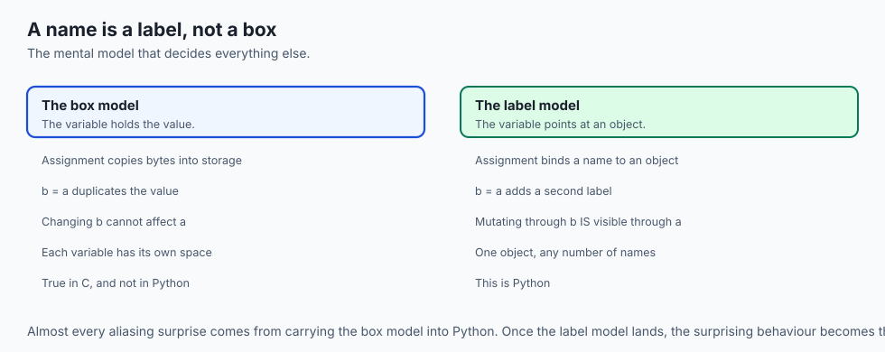

- **A name is a label; the object is the thing.** They are separate, and the
  binding between them can change.

- **Assignment binds a name to an object.** It does not copy the object.
- **So two names can tag one object**, and changing it through either shows
  through both.

- **The type belongs to the object**, checked as the program runs — which is what
  "dynamically typed" means.

- **Mutability decides whether change is visible elsewhere.** That is the property
  worth sorting types by.

---

## Historical background

- **Python chose objects for everything**, from the start. Integers, functions,
  classes and modules are all objects with a type and an identity.

- **The name-binding model came from that decision.** A variable is not a box
  holding a value; it is a label attached to an object.

- **Languages that use boxes behave differently.** In C, assigning copies bytes
  into storage; in Python, assigning re-points a label.

- **Neither is more correct**, but confusing the two is the origin of most
  aliasing bugs.

- **Type hints arrived in Python 3.5**, in 2015, as annotations the interpreter
  ignores and external tools check.

- **That was deliberate.** Adding real static typing would have broken the
  language; adding optional annotations gave the benefit without the cost.

---

## What it is — and what it is not

**A variable is:**

- A name in a namespace, bound to an object.
- Rebindable at any time, to an object of any type.
- Untyped itself. The object carries the type.

**It is not:**

- **Not a container.** Nothing is stored "in" a variable; the name points at
  something stored elsewhere.

- **Not a copy.** `b = a` creates no new object.
- **Not typed.** `x: int = 42` is a hint for tools, and the interpreter will
  happily let you rebind `x` to a string.

- **Not the object's only handle.** Any number of names may point at one object,
  and the object does not know about any of them.

---

## Why it was created and what problems it solves

- **Uniformity.** Everything being an object means one set of rules covers
  integers, functions, classes and modules alike.

- **Cheap assignment.** Binding a name is constant-time whatever the object's
  size, because nothing is copied.

- **Flexibility.** A name can hold anything, which is what makes Python quick to
  write.

- **The cost is deferred errors.** A type mistake surfaces when the line runs, not
  when the file is read — which is what type hints and mypy exist to claw back.

- **Mutability is the trade-off made explicit.** Immutable objects are safe to
  share; mutable ones are efficient to build up.

---

## How it works

### Names, objects, and binding

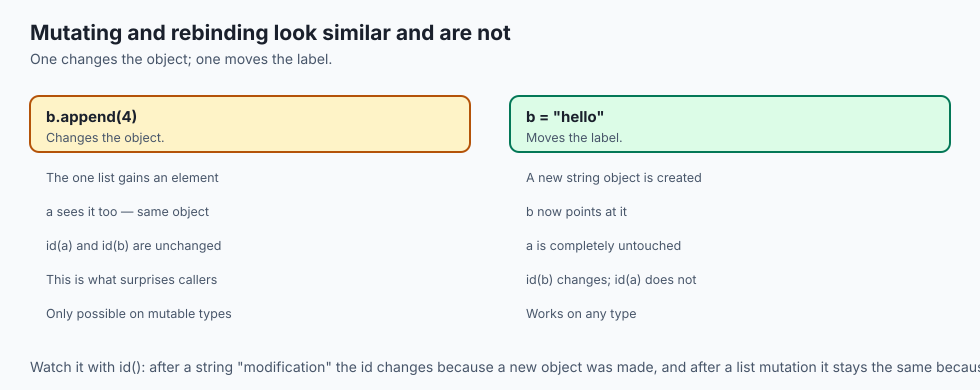

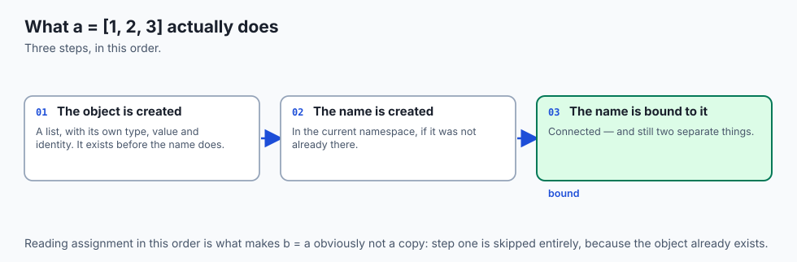


Running `a = [1, 2, 3]` does three things in order:

1. **The object is created** — a list with its own type, value and identity.
2. **The name `a` is created** in the current namespace, if it did not exist.
3. **`a` is bound to that object.** They are connected, and still separate things.

- **`b = a` makes no new list.** Python binds `b` to the same object, and `id(a)`
  and `id(b)` come back identical.

- **That is aliasing**, and it is the most important consequence of the model.
- **Mutating through one name shows through the other**: `b.append(4)` leaves `a`
  reading `[1, 2, 3, 4]`.

- **Rebinding is not mutating.** `b = "hello"` moves the `b` label to a new string
  and leaves `a` pointing at the list.

### The core built-in types

| Type | Example | What it holds | Mutable? |
| --- | --- | --- | --- |
| `int` | `42`, `-7` | Whole numbers, unlimited size | No |
| `float` | `3.14`, `2.0` | Real numbers with a fractional part | No |
| `bool` | `True`, `False` | A truth value; a subtype of `int` | No |
| `str` | `"hello"` | Text | No |
| `NoneType` | `None` | The single "no value" object | No |
| `list` | `[1, 2, 3]` | An ordered, changeable sequence | Yes |
| `tuple` | `(1, 2, 3)` | An ordered, fixed sequence | No |
| `dict` | `{"a": 1}` | Key-to-value lookups | Yes |
| `set` | `{1, 2, 3}` | Unordered, unique items | Yes |

- **`2` and `2.0` are different types** despite being equal in value.
- **`bool` is a subtype of `int`**, so `True + True` is `2` — worth knowing, not
  worth relying on.

- **`None` is not zero, not empty, not `False`.** It is its own object, meaning
  "deliberately no value".

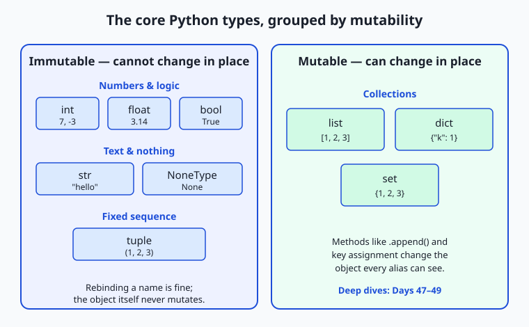

### Dynamic typing

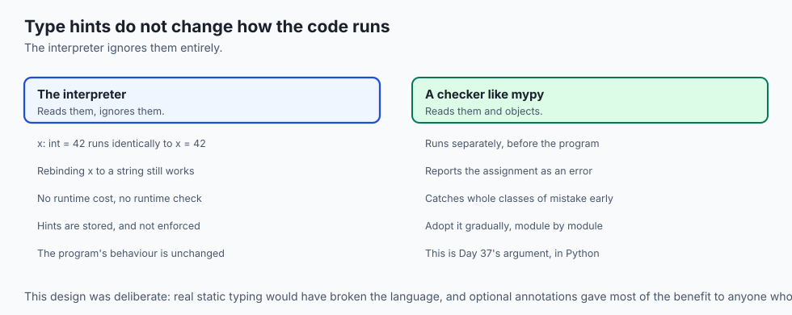

```python
x = 42          # x points at an int
x = "forty-two" # now at a str — perfectly legal
x = [4, 2]      # now a list
```

- **The name never had a type.** Each line re-points it.
- **A statically typed language refuses this at compile time**, catching whole
  classes of mistake before the program runs, at the cost of ceremony.

- **Python offers both, optionally.** `x: int = 42` is ignored by the interpreter
  and checked by a tool like mypy.

### Asking about types

- **`type(obj)`** returns the type: `type(42)` is `<class 'int'>`.
- **`isinstance(obj, T)`** answers "is this that type, or a subtype?"
- **Prefer `isinstance` in real code.** It understands subtypes — `isinstance(True,
  int)` is `True` — and accepts a tuple: `isinstance(x, (int, float))`.

- **Reserve `type()` for exploring and printing.**

### Truthiness

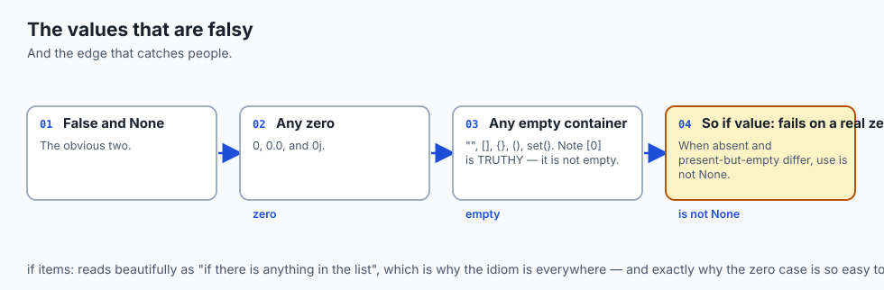

- **Every object can be tested as true or false**, not just booleans.
- **Falsy**: `False`, `None`, any zero, and any empty container — `""`, `[]`,
  `{}`, `()`, `set()`.

- **Everything else is truthy.**
- **So `if items:` reads as "if the list has anything in it."**
- **The sharp edge**: a value that is genuinely present but zero or empty fails
  that test. When "absent" and "present but empty" differ, write
  `if value is not None:`.

### Mutability, and why it matters

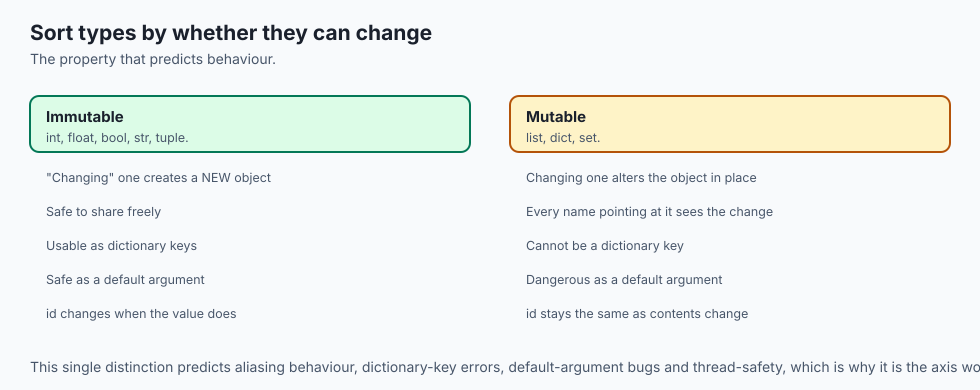

- **Immutable**: `int`, `float`, `bool`, `str`, `tuple`. **Mutable**: `list`,
  `dict`, `set`.

- **"Changing" a string makes a new one.** `s = s + "s"` builds a new object and
  re-points `s`; the original is untouched.

- **Changing a list changes the object**, which every name pointing at it sees.
- **Watch it with `id()`**: after string "modification" the id changes; after list
  mutation it stays the same.

- **Immutability is what makes sharing safe**; mutability is what makes building
  up efficient.

---

## An everyday analogy

Luggage labels at a left-luggage office.

| The office | Python |
| --- | --- |
| A bag in the rack | An object |
| A label tied to it | A name |
| Two labels on one bag | Aliasing |
| Adding something to the bag | Mutating |
| Moving a label to another bag | Rebinding |
| A sealed bag that cannot be opened | An immutable object |
| The bag's rack position | Its identity, from `id()` |

- **The label is not the bag.** Writing a second label for the same bag does not
  produce a second bag.

- **Putting something in through one label** is visible through the other, because
  there was only ever one bag.

- **Moving your label elsewhere** leaves the other label exactly where it was.

---

## Examples in practice

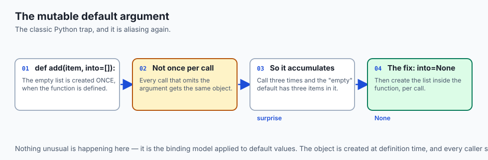

- **A function that appends to a list argument** and surprises the caller, because
  the list was never copied.

- **`if count:` skipping a legitimate zero**, which is truthiness biting.
- **`a == b` true while `a is b` false**: equal values, different objects.
- **A mutable default argument** shared across every call — the classic Python
  trap, and it is aliasing again.

- **`x = 0.1 + 0.2` not equalling `0.3`**, which is floats, and the subject of the
  next lesson.

---

## Implications: security, privacy, performance, scalability, and cost

- **Security: mutable shared state is where concurrency bugs live**, and Day 7's
  race conditions apply directly once threads share an object.

- **Passing a mutable object to code you do not control** hands it the ability to
  change your data. Pass a copy when that matters.

- **Performance: binding is constant-time**, whatever the object's size. Copying
  is not, which is why Python avoids copying.

- **Building a string in a loop with `+` creates a new object each time**, which
  is quadratic. `"".join(parts)` is the fix.

- **Memory: aliasing means one object, not several.** A large array passed around
  costs nothing extra until someone copies it.

- **Cost: an aliasing bug is expensive to find** because the symptom appears far
  from the mutation that caused it.

---

## Alternatives: free, open source, and commercial

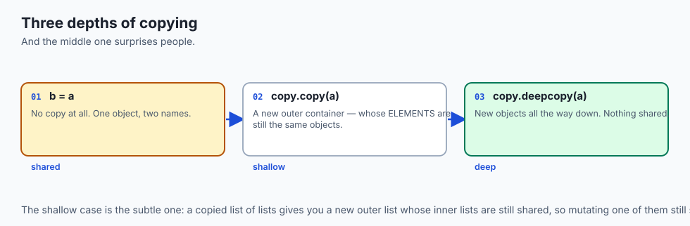

| Tool | Type | What it gives you |
| --- | --- | --- |
| `id()`, `is` | Free, built in | Identity, as distinct from equality |
| `copy.copy` / `copy.deepcopy` | Free, standard library | A shallow or a full copy when you need one |
| `dataclasses(frozen=True)` | Free, standard library | Immutable structured objects |
| `tuple`, `frozenset` | Free, built in | Immutable collections |
| mypy, Pyright | Free, open source | Checking type hints before the program runs |
| `sys.getsizeof` | Free, standard library | What an object actually costs |

- **Learn the difference between `copy` and `deepcopy` early.** A shallow copy
  duplicates the outer container and still shares what is inside it, which is a
  subtle and common source of the same aliasing surprise.

---

## Comparison with related concepts

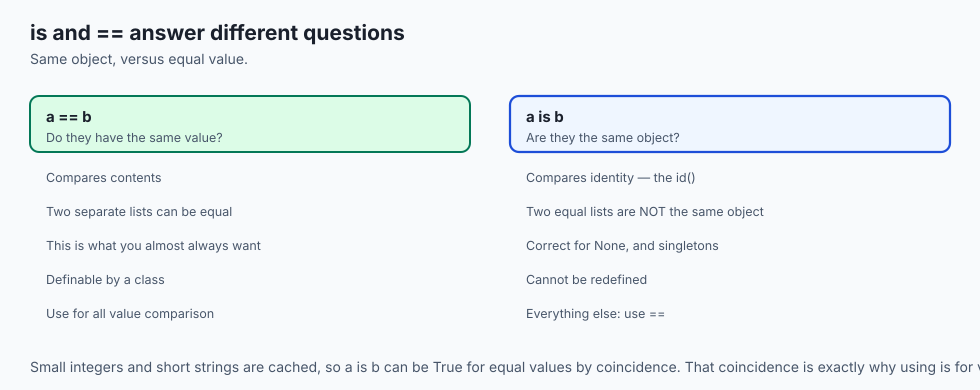

| Term | What it actually is |
| --- | --- |
| **Name** | A label in a namespace |
| **Object** | The thing in memory, with a type and an identity |
| **Binding** | The connection between them |
| **Aliasing** | Two or more names on one object |
| **Mutating** | Changing the object itself |
| **Rebinding** | Pointing a name somewhere else |
| **`is` vs `==`** | Same object, versus equal value |

---

## When to use it — and when not to

- **Use `is` only for `None`** and other singletons. For values, use `==`.
- **Use `isinstance` rather than `type()`** whenever the answer drives behaviour.
- **Use immutable types for anything shared**, especially as a default argument or
  a dictionary key.

- **Copy explicitly when you mean to copy.** `list(original)` or `copy.deepcopy`,
  depending on how deep the sharing goes.

- **Do not use a mutable default argument.** Use `None` and create the object
  inside the function.

- **Do not rely on `bool` being an `int`.** It is true and it is not something to
  build on.

- **Do not test presence with `if value:`** when zero or empty is a legitimate
  value.

---

## The AI connection

- **A tensor is an object**, and passing it to a function passes the label, not a
  copy — which is why in-place operations surprise people.

- **In-place operations are marked with a trailing underscore** in PyTorch —
  `add_`, `clamp_` — precisely because mutating a shared tensor is consequential.

- **A mutable default argument in a config function** silently shares state
  between experiments, which is a genuinely hard bug to trace.

- **Truthiness catches people on tensors and arrays**: an empty batch is falsy, and
  so is a tensor of zeros in some libraries.

- **`None` as "not computed yet"** is a common and correct pattern in model code,
  and it needs `is None` rather than a truthiness test.

---

## Knowledge check

```yaml
quiz:
  question: "A function receives a list, appends an item to it, and returns nothing. The caller's own list has changed. Why?"
  options:
    - "The parameter is a second name bound to the same list object, so mutating through it is visible everywhere"
    - "Python passes arguments by reference only for lists, and by value for other types"
    - "The function's local scope was not isolated because it returned nothing"
    - "Lists are copied on assignment but not when passed as arguments"
  answer_index: 0
  explanation: "Passing an argument binds a new name to the same object; no copying occurs for any type. Because a list is mutable, appending changes the one object both names point at — while rebinding the parameter inside the function would have changed nothing for the caller."
```

---

## Hands-on exercise

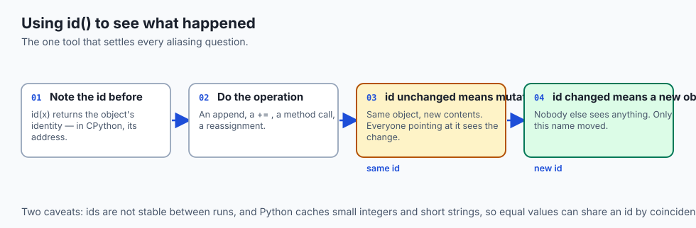

Prove aliasing, then prove the difference between mutating and rebinding. Worked
through fully in the Day 44 lab directory.

| What you are doing | Command |
| --- | --- |
| Bind two names to one list | `a = [1,2,3]; b = a` |
| Prove it is one object | `id(a) == id(b)` and `a is b` |
| Mutate through one | `b.append(4)`, then print `a` |
| Rebind instead | `b = "hello"`, then print `a` |
| See a string "change" | `s = "cat"; print(id(s)); s += "s"; print(id(s))` |
| See a list change | `n = [1]; print(id(n)); n.append(2); print(id(n))` |
| Meet truthiness | `bool(0)`, `bool("")`, `bool([])`, `bool([0])` |

### Expected output

```text
True True
[1, 2, 3, 4]
[1, 2, 3, 4]
4404445184  4404589424
4404512320  4404512320
False False False True
```

- **The string's id changed**; a new object was made.
- **The list's id did not**; the same object was altered.
- **`[0]` is truthy** even though its only element is falsy — the container is not
  empty.

### Validate your work

- [ ] You demonstrated aliasing with `id()` and `is`
- [ ] You showed that mutating differs from rebinding
- [ ] You can explain why a string's id changes and a list's does not
- [ ] You found a value where `if x:` and `if x is not None:` disagree
- [ ] You used `isinstance` with a tuple of types
- [ ] `bash tests/run_tests.sh` reports 0 failures

### Troubleshooting

- **Small integers share ids.** Python caches `-5` to `256`, so `a is b` can be
  `True` for equal small ints. Do not build on it.

- **Short strings may be interned too.** Same caveat.
- **`is` gives a warning with a literal.** Use `==` for values; `is` is for `None`.
- **`id()` values differ between runs.** They are addresses, not stable
  identifiers.

### Common mistakes

- **Reading `b = a` as a copy.**
- **Using `is` to compare values.**
- **A mutable default argument.**
- **Testing presence with truthiness** when zero is legitimate.

---

## Practice assignment

- **Write a function that mutates its argument** and one that rebinds it, and
  predict the caller's result before running either.

- **Build the mutable-default-argument bug on purpose**, observe it across three
  calls, then fix it with `None`.

- **Find three values** where `if x:` and `if x is not None:` disagree.
- **Use `copy` and `deepcopy`** on a nested list and demonstrate what shallow
  copying still shares.

---

## Extension challenge

- **Find Python's small-integer cache boundary** by comparing `is` on increasing
  values, and explain why the boundary exists.

- **Measure the cost of string concatenation in a loop** against `"".join`, for
  10,000 items. The ratio is the argument for the idiom.

- **Write a function that cannot mutate its argument**, by taking a tuple, and
  discuss what you gave up.

- **Add type hints to a small module and run mypy**, then deliberately violate one
  and confirm the interpreter still runs it while mypy objects.

---

