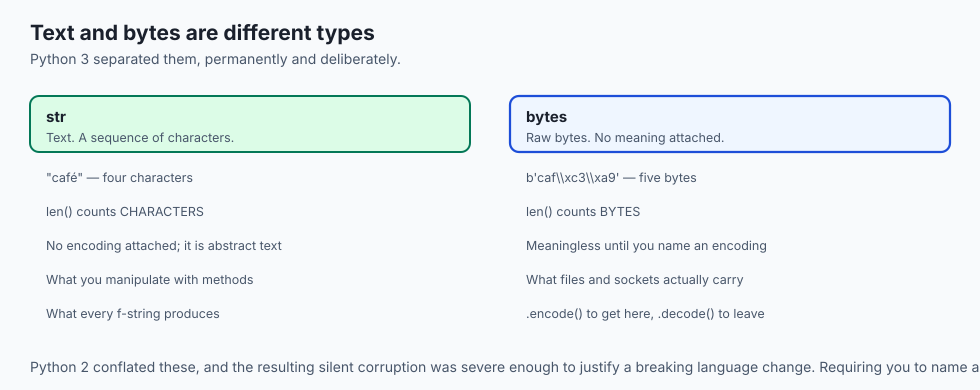
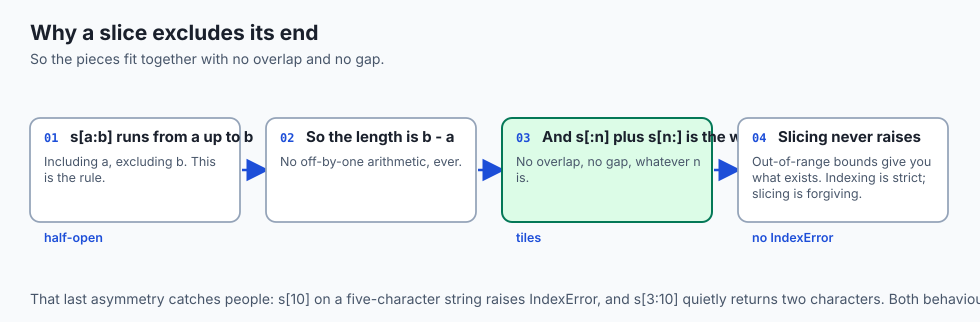
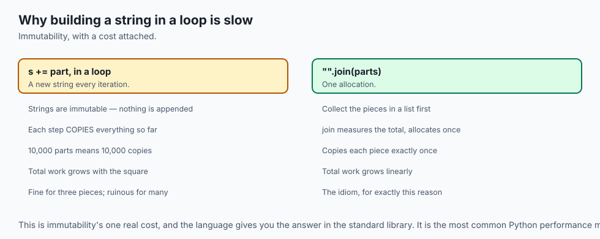
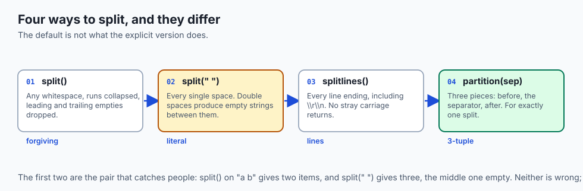
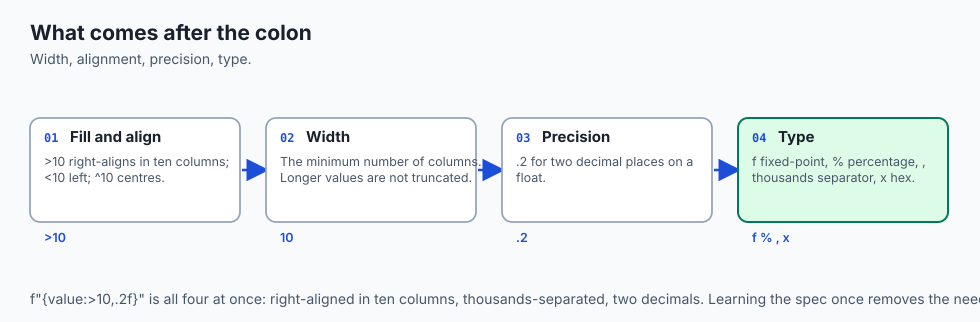
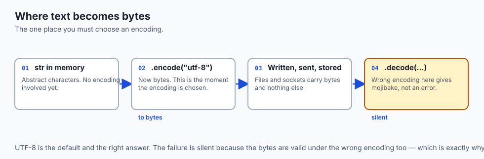
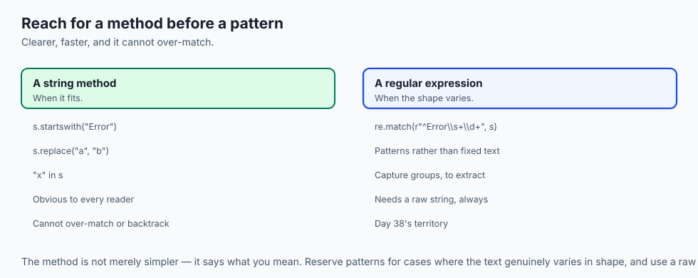
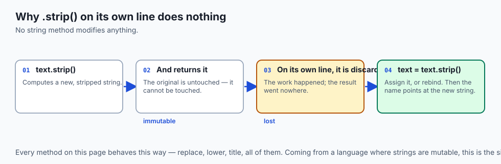
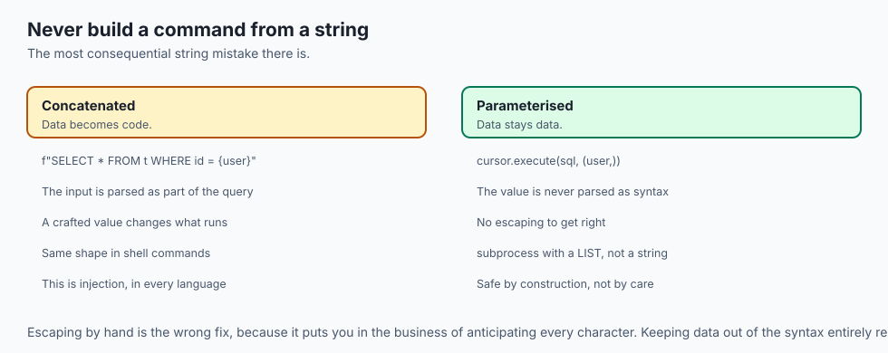

## Why this matters

- **Most real data is text**, and most of the work before any model sees it is
  string handling.
- **Every prompt and every response is a string**, so this is the layer all AI
  work passes through.
- **Encoding bugs are silent.** A name with an accent survives or corrupts
  depending on decisions made here.
- **f-strings are the one formatting syntax to learn**, and they replace three
  older ones you will still meet in existing code.
- **Strings are immutable**, which is why building one in a loop is slow and the
  idiom to avoid that is worth knowing.

---

## The idea in plain language



- **A string is an immutable sequence of characters.** Every "change" makes a new
  one.
- **You can index and slice it** like any sequence, including from the end with
  negative positions.
- **Methods do the work**, and they return new strings rather than editing in
  place.
- **f-strings put expressions inside text**, evaluated where they sit.
- **Text becomes bytes through an encoding**, which is Day 5 arriving in Python.

---

## Historical background

- **Python 2 conflated text and bytes**, and the resulting confusion was severe
  enough to justify a breaking language change.
- **Python 3 separated them permanently**: `str` is text, `bytes` is bytes, and
  converting requires you to name an encoding.
- **That change is why Python 3 handles international text well** and why the
  migration took the community a decade.
- **Formatting arrived in three waves.** `%` formatting from C, then `str.format`
  in 2008, then f-strings in Python 3.6.
- **f-strings won because they read in the order they execute.** The value sits
  where it appears rather than in a separate argument list.
- **The older two survive in existing code**, so you need to recognise them even
  though you should not write them.

---

## What it is — and what it is not

**A string is:**

- An immutable sequence of Unicode characters.
- Indexable, sliceable and iterable, like other sequences.
- The type every method here returns — never a modified original.

**It is not:**

- **Not bytes.** `str` is text; `bytes` is bytes; the boundary between them is an
  encoding you must choose.
- **Not mutable.** There is no operation that edits a string in place.
- **Not a list of characters**, though it behaves like one for indexing. There is
  no separate character type; `s[0]` is a one-character string.
- **Not the right tool for structured text.** Nested markup needs a parser, as Day
  38 argued.

---

## Why it was created and what problems it solves

- **Text is the universal data type**, and a language needs a good one.
- **Immutability makes strings safe to share** and usable as dictionary keys.
- **Separating text from bytes** ended a whole category of silent corruption.
- **Rich methods mean common operations are one call**, not a loop.
- **f-strings solve readability.** Interpolating values where they appear is
  clearer than positional arguments, and the format spec covers alignment,
  precision and padding without a second library.

---

## How it works

### Creating strings

- **Single and double quotes are identical.** Choose whichever avoids escaping.
- **Triple quotes span lines** and keep the newlines.
- **A raw string, `r"..."`, disables backslash escapes** — which is what regular
  expressions and Windows paths want.
- **Adjacent literals concatenate**, so a long string can be split across lines
  inside brackets with no operator at all.

### Indexing and slicing




- **`s[0]` is the first character; `s[-1]` is the last.**
- **`s[a:b]` runs from `a` up to but not including `b`.** That half-open rule is
  why `s[:n]` and `s[n:]` fit together with no overlap and no gap.
- **Either end may be omitted**, and `s[:]` is the whole thing.
- **A third value is a step**: `s[::-1]` reverses.
- **Slicing never raises for out-of-range bounds**, unlike indexing — it just
  gives you what exists.

### Essential methods



| Method | What it does |
| --- | --- |
| `.strip()` | Remove leading and trailing whitespace |
| `.lower()` / `.upper()` | Change case |
| `.split(sep)` | Break into a list; no argument splits on any whitespace |
| `"".join(parts)` | The inverse — and the right way to build a string |
| `.replace(a, b)` | Every occurrence, returning a new string |
| `.startswith()` / `.endswith()` | A clearer test than slicing |
| `.find()` / `.index()` | Position; `find` returns `-1`, `index` raises |
| `in` | The readable membership test |

- **Every one returns a new string.** `s.strip()` on its own line does nothing;
  you must assign the result.

### Splitting and joining, precisely



- **`.split()` with no argument is not the same as `.split(" ")`.** The first
  collapses runs of any whitespace and drops leading and trailing empties; the
  second splits on every single space, producing empty strings between doubles.
- **`.splitlines()` handles every line ending** — `\n`, `\r\n`, and the unusual
  ones — where `.split("\n")` leaves a stray `\r` on Windows files.
- **`.partition(sep)` returns three pieces**: before, the separator, after. It is
  the right tool when there is exactly one separator and you want both sides.
- **`maxsplit` limits the work**: `line.split(",", 1)` takes the first field and
  leaves the rest intact, which is what log parsing usually wants.
- **Join takes an iterable of strings only.** `", ".join([1, 2])` raises; map to
  `str` first.

### String formatting: three styles



```python
name, score = "Ada", 0.9137
f"{name} scored {score:.1%}"        # f-string  — write this
"{} scored {:.1%}".format(name, score)  # str.format — recognise it
"%s scored %.1f%%" % (name, score * 100)  # %-formatting — legacy
```


- **The expression inside the braces is real Python**, evaluated where it sits.
- **After a colon comes the format spec**: width, alignment, precision, type.
- **`f"{value!r}"`** gives the debugging representation, and `f"{value=}"` prints
  the expression and its value together.

### Unicode and encoding



- **`str` is text; `bytes` is bytes.** `.encode()` goes one way, `.decode()` the
  other, and both take an encoding.
- **UTF-8 is the default and the right choice.**
- **`len()` counts characters, not bytes.** `len("café")` is 4 and
  `len("café".encode())` is 5 — Day 5, in Python.
- **Reading with the wrong encoding produces mojibake** rather than an error,
  which is why it goes unnoticed.

### A nod to regular expressions



- **`re` is the standard library module**, and Day 38 covers the language.
- **Use a raw string for every pattern**, so backslashes reach `re` intact.
- **Reach for a string method first.** `startswith` is clearer than `^` to most
  readers, and clarity is the scarce resource.

---

## An everyday analogy

A printed page you cannot edit.

| The page | The string |
| --- | --- |
| The printed text | An immutable string |
| Reading the third word | Indexing |
| Photocopying a passage | Slicing |
| Retyping with a correction | A method returning a new string |
| The original, unchanged | Immutability |
| A fill-in-the-blanks form | An f-string |
| Which alphabet it is printed in | The encoding |

- **You never correct the page.** You produce a new one and keep or discard the
  old.
- **Retyping the whole page for each small change** is why building a string in a
  loop is slow, and why `join` exists.

---

## Examples in practice



- **`s.strip()` on its own line doing nothing**, because the result was not
  assigned.
- **`len()` disagreeing with the byte count** of a file, which is encoding.
- **A Windows path with `\t` in it** silently becoming a tab, fixed by a raw
  string.
- **A CSV split on commas** that breaks on the first quoted field containing one.
- **Building a report with `+=` in a loop** and finding it quadratic on large
  input.

---

## Implications: security, privacy, performance, scalability, and cost



- **Security: never build a command or a query by string concatenation** from
  untrusted input. That is injection, in every language.
- **Use parameterised queries and argument lists**, which keep data and code
  separate by construction.
- **Privacy: text is where personal data lives**, and redaction is string work —
  imperfect, and worth reviewing rather than trusting.
- **Performance: `+=` in a loop is quadratic**, because each step copies the whole
  accumulated string. `"".join(parts)` is linear.
- **Slicing copies.** A slice of a large string is a new string of that size, which
  matters when you take many.
- **Cost: encoding mistakes corrupt data silently**, and the corruption is often
  discovered long after the source file is gone.

---

## Alternatives: free, open source, and commercial

| Tool | Type | Where it fits |
| --- | --- | --- |
| `str` methods | Free, built in | The large majority of text work |
| f-strings | Free, built in | All formatting you write from now on |
| `re` | Free, standard library | Patterns — Day 38 |
| `textwrap` | Free, standard library | Wrapping and indenting blocks |
| `unicodedata` | Free, standard library | Normalisation, when two strings look identical |
| `str.translate` | Free, built in | Fast bulk character mapping |

- **Reach for a method before a regular expression.** It is faster, clearer, and
  it cannot over-match.
- **Learn `unicodedata.normalize` exists.** The day two visually identical strings
  compare unequal, it is the answer.

---

## Comparison with related concepts

| Term | What it actually is |
| --- | --- |
| **`str`** | Immutable text |
| **`bytes`** | Raw bytes, with no encoding attached |
| **Encoding** | The rule converting between them |
| **Slice** | A new string from a range of positions |
| **f-string** | A literal with expressions evaluated inside it |
| **Format spec** | What follows the colon: width, alignment, precision |
| **Raw string** | One where backslash is not an escape |

---

## When to use it — and when not to

- **Use f-strings for everything you write.** Recognise the other two; do not add
  them.
- **Use `"".join()`** whenever you build a string from parts.
- **Use a raw string for every regular expression** and every Windows path.
- **Use `in` rather than `find() != -1`.** It says what you mean.
- **Do not concatenate in a loop.**
- **Do not build SQL or shell commands by concatenation.**
- **Do not assume `len()` is bytes.** It is characters, and the difference is
  Day 5's.

---

## The AI connection

- **Everything a language model reads and writes is a string**, so text handling
  is the layer every prompt and every response passes through.
- **Tokenisation happens on text**, and Day 5's encoding lesson decides how a
  string becomes bytes before it becomes tokens.
- **Cleaning training data is string work**: stripping markup, normalising
  whitespace, folding case, removing control characters.
- **Model output arrives fenced in markdown**, and stripping that fence is the
  most-written three lines in AI code.
- **Normalisation matters more than it looks.** Two visually identical strings
  with different code points tokenise differently and embed differently.

## Knowledge check

```yaml
quiz:
  question: "A function calls `text.strip()` on its own line and then returns `text`, but the whitespace is still present. Why?"
  options:
    - "Strings are immutable, so strip() returns a new string and the original is unchanged"
    - "strip() removes only spaces, not tabs or newlines, unless given arguments"
    - "The method must be called as strip(text) to modify the variable in place"
    - "strip() only affects the string if it is assigned to a new variable name"
  answer_index: 0
  explanation: "No string method modifies its target, because no string can be modified at all. Every one returns a new string, so the result has to be assigned — text = text.strip() — or it is computed and immediately discarded."
```

---

## Hands-on exercise

Slice, transform and format real text, then break an encoding on purpose. Worked
through fully in the Day 45 lab directory.

| What you are doing | Command |
| --- | --- |
| Index from both ends | `s[0]`, `s[-1]` |
| Slice, and reverse | `s[2:5]`, `s[::-1]` |
| Show immutability | `s.strip()` without assigning, then with |
| Build efficiently | `"".join(parts)` rather than `+=` in a loop |
| Format with a spec | `f"{value:>10.2f}"` and `f"{ratio:.1%}"` |
| Count characters vs bytes | `len(s)` and `len(s.encode())` |
| Cause mojibake | `s.encode("utf-8").decode("latin-1")` |

### Expected output

```text
'c' 'é'
'af' 'éfac'
'  café  ' 'café'
     12.50  91.4%
4 5
café
```

- **`len` is 4 and the byte length is 5** — the accented character takes two
  bytes in UTF-8.
- **`café` is mojibake**: correct bytes, wrong decoding, and no error raised.

### Validate your work

- [ ] You indexed from both ends and sliced with a step
- [ ] You demonstrated that a method returns rather than modifies
- [ ] You built a string with `join` and can say why `+=` in a loop is worse
- [ ] You used a format spec for width and precision
- [ ] You produced mojibake deliberately and can name which step was wrong
- [ ] `bash tests/run_tests.sh` reports 0 failures

### Troubleshooting

- **`IndexError` on `s[10]`** but a slice of the same range works. Indexing is
  strict; slicing is not.
- **Your f-string prints the braces.** You wrote a plain string. The `f` prefix is
  required.
- **A backslash behaves unexpectedly.** Use a raw string.
- **`.replace()` seems not to work.** You did not assign the result.

### Common mistakes

- **Calling a method and discarding the result.**
- **Concatenating in a loop.**
- **Confusing character count with byte count.**
- **Writing `%` or `.format()` in new code.**

---

## Practice assignment

- **Take a messy text file** and clean it with methods alone: strip, case-fold,
  collapse whitespace, drop empty lines.
- **Write the same output three ways** — `%`, `.format()` and an f-string — and
  compare readability.
- **Measure `+=` against `join`** for 50,000 pieces, and record the ratio.
- **Round-trip text through two encodings** and find one that loses information.

---

## Extension challenge

- **Normalise two visually identical strings** that compare unequal, using
  `unicodedata.normalize`, and explain what differed.
- **Write a wrapper that reads a file with an unknown encoding**, tries UTF-8, and
  falls back deliberately rather than silently.
- **Implement `strip` yourself** with slicing, then compare against the built-in
  for correctness on edge cases.
- **Find where slicing's copying cost matters**: slice a 10 MB string a thousand
  times and measure the memory.

---

